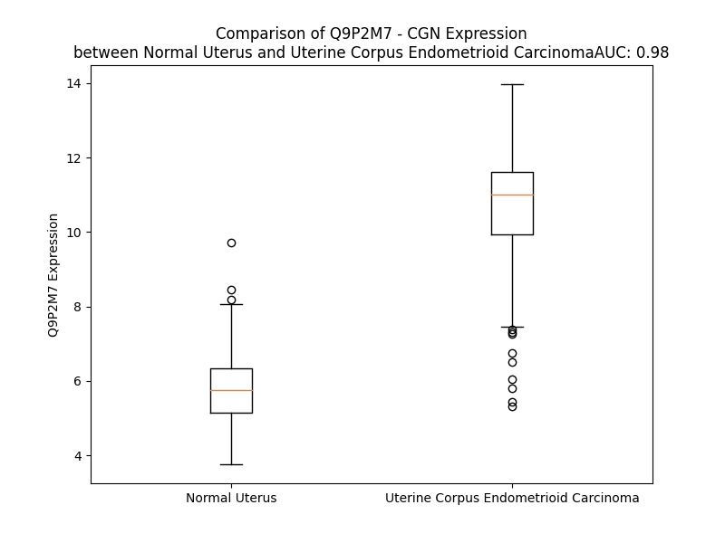

# Detailed Data for Q9P2M7

## Introduction to the Detailed Summary

### How to Interpret the Results

- **Summary & Metrics**: This section provides a quick reference to essential protein attributes, including expression changes, family classification, and biomarker applications. Regulation status (upregulated/downregulated) indicates the protein's behavior in a disease context. Some information comes from the original excel file with the proteins selected from literature, while others are derived from the analyses.
- **Expression Comparison**: A visual representation comparing protein expression between normal and disease states. It highlights significant changes in expression levels that might indicate diagnostic or therapeutic relevance. This is data coming from transcriptomics experiments and could not translate similarly to protein levels.
- **Isoform Alignment**: An interactive view of isoform alignments, revealing structural and functional differences between variants of the protein.
- **Interactors & Homologs**: Tables listing known interaction partners and homologous proteins, the more interactors and homologs, the more complex the protein is to design an antibody for.
- **Biological Assemblies**: Information about the structural arrangement of the protein in different assemblies, providing insights into its functional state but also the complexity of the protein to develop antibodies.
- **Combined Per-Residue Information**: A detailed table summarizing residue-level data. This includes predictions for epitope regions, aggregation tendencies, and modifications that might impact the protein's function. Each row corresponds to a residue in the protein, providing insights into specific sites that may be important for research or drug development.
## Summary & Metrics

- **UniProt Accession**: Q9P2M7
- **Gene Name**: CGN 
- **Protein Name**: cingulin 
- **Swiss Prot**: CING_HUMAN
- **Family**: other
- **Biomarker Application**:  
- **Number of Isoforms**: 2
- **Regulation**: 1
- **(transcriptomics) AUC**: 0.98
- **(transcriptomics) Fold Change**: 1.83
- **(transcriptomics) Regulation**: Upregulated
- **Discotope Epitope Count**: 339
- **Max n_uniprots (Homo)**: N/A
- **Max n_uniprots (Hetero)**: N/A

## Expression Comparison

## Isoform Alignment

<pre style='font-size:14px; font-family:monospace;'>Q9P2M7-1 MEQAPNMAEPRGPVDHGVQIRFITEPVSGAEMGTLRRGGRRPAKDARASTYGVAVRVQGIAGQPFVVLNSGEKGGDSFGVQIKGANDQGASGALSSDLELPENPYSQVKGFPAPSQSSTSDEEPGAYWNGKLLRSHSQASLAGPGPVDPSNRSNSMLELAPKVASPGSTIDTAPLSSVDSLINKFDSQLGGQARGRTGRRTRMLPPEQRKRSKSLDSRLPRDTFEERERQSTNHWTSSTKYDNHVGTSKQPAQSQNLSPLSGFSRSRQTQDWVLQSFEEPRRSAQDPTMLQFKSTPDLLRDQQEAAPPGSVDHMKATIYGILREGSSESETSVRRKVSLVLEKMQPLVMVSSGSTKAVAGQGELTRKVEELQRKLDEEVKKRQKLEPSQVGLERQLEEKTEECSRLQELLERRKGEAQQSNKELQNMKRLLDQGEDLRHGLETQVMELQNKLKHVQGPEPAKEVLLKDLLETRELLEEVLEGKQRVEEQLRLRERELTALKGALKEEVASRDQEVEHVRQQYQRDTEQLRRSMQDATQDHAVLEAERQKMSALVRGLQRELEETSEETGHWQSMFQKNKEDLRATKQELLQLRMEKEEMEEELGEKIEVLQRELEQARASAGDTRQVEVLKKELLRTQEELKELQAERQSQEVAGRHRDRELEKQLAVLRVEADRGRELEEQNLQLQKTLQQLRQDCEEASKAKMVAEAEATVLGQRRAAVETTLRETQEENDEFRR------RILGLEQQ-----LKETRGLVDGGEAVEARLRDKLQRLEAEKQQLEEALNASQEEEGSLAAAKRALEARLEEAQRGLARLGQEQQTLNRALEEEGKQREVLRRGKAELEEQKRLLDRTVDRLNKELEKIGEDSKQALQQLQAQLEDYKEKARREVADAQRQAKDWASEAEKTSGGLSRLQDEIQRLRQALQASQAERDTARLDKELLAQRLQGLEQEAENKKRSQDDRARQLKGLEEKVSRLETELDEEKNTVELLTDRVNRGRDQVDQLRTELMQERSARQDLECDKISLERQNKDLKTRLASSEGFQKPSASLSQLESQNQLLQERLQAEEREKTVLQSTNRKLERKVKELSIQIEDERQHVNDQKDQLSLRVKALKRQVDEAEEEIERLDGLRKKAQREVEEQHEVNEQLQARIKSLEKDSWRKASRSAAESALKNEGLSSDEEFDSVYDPSSIASLLTESNLQTSSC
Q9P2M7-2 MEQAPNMAEPRGPVDHGVQIRFITEPVSGAEMGTLRRGGRRPAKDARASTYGVAVRVQGIAGQPFVVLNSGEKGGDSFGVQIKGANDQGASGALSSDLELPENPYSQVKGFPAPSQSSTSDEEPGAYWNGKLLRSHSQASLAGPGPVDPSNRSNSMLELAPKVASPGSTIDTAPLSSVDSLINKFDSQLGGQARGRTGRRTRMLPPEQRKRSKSLDSRLPRDTFEERERQSTNHWTSSTKYDNHVGTSKQPAQSQNLSPLSGFSRSRQTQDWVLQSFEEPRRSAQDPTMLQFKSTPDLLRDQQEAAPPGSVDHMKATIYGILREGSSESETSVRRKVSLVLEKMQPLVMVSSGSTKAVAGQGELTRKVEELQRKLDEEVKKRQKLEPSQVGLERQLEEKTEECSRLQELLERRKGEAQQSNKELQNMKRLLDQGEDLRHGLETQVMELQNKLKHVQGPEPAKEVLLKDLLETRELLEEVLEGKQRVEEQLRLRERELTALKGALKEEVASRDQEVEHVRQQYQRDTEQLRRSMQDATQDHAVLEAERQKMSALVRGLQRELEETSEETGHWQSMFQKNKEDLRATKQELLQLRMEKEEMEEELGEKIEVLQRELEQARASAGDTRQVEVLKKELLRTQEELKELQAERQSQEVAGRHRDRELEKQLAVLRVEADRGRELEEQNLQLQKTLQQLRQDCEEASKARGVGTGLR----RWRLRVSGGLRSQRVWKVTCHGYVLTSSWVLGMWFKEARIWQGEDTCICVGVGFSEKRLAGGSCSL-------------------------------------------------------------------------------------------------------------------------------------------------------------------------------------------------------------------------------------------------------------------------------------------------------------------------------------------------------------------------------------------------------------------------------------------------
</pre>

## Interactors

| preferredName_A   | preferredName_B   |   score |
|:------------------|:------------------|--------:|
| CGN               | TJP1              |   0.999 |
| CGN               | TJP2              |   0.999 |
| CGN               | TJP3              |   0.997 |
| CGN               | OCLN              |   0.995 |
| CGN               | ARHGEF2           |   0.994 |
| CGN               | F11R              |   0.992 |
| CGN               | ARHGEF18          |   0.991 |
| CGN               | MARVELD2          |   0.989 |
| CGN               | AFDN              |   0.978 |
| CGN               | RHOA              |   0.927 |
| CGN               | ARHGEF18-2        |   0.923 |
| CGN               | RACGAP1           |   0.919 |
| CGN               | GATA4             |   0.911 |

## Homologs

| uniprot_id   | gene_id   |
|:-------------|:----------|
| Q0VF96       | CGNL1     |
| Q9Y2K3       | MYH15     |
| H0YM96       | MYO5C     |
| F5H2J1       | MYO3B     |
| Q9UKX2       | MYH2      |
| Q7Z406       | MYH14     |
| B9A063       | MYO7B     |
| Q96A19       | CCDC102A  |
| P11055       | MYH3      |
| J3KRL0       | MYO1D     |
| P13535       | MYH8      |
| J3KRT2       | CCDC102B  |
| E9PCN3       | MYO10     |
| A0A8I5KZ38   | MYH10     |
| Q5JW46       | MYH7B     |
| C9JU63       | MYO1A     |
| A0A087WY49   | MYO19     |
| P12883       | MYH7      |
| B0I1T2       | MYO1G     |
| O00160       | MYO1F     |
| P82094       | TMF1      |
| B0I1S9       | MYO1B     |
| P13533       | MYH6      |
| Q9Y623       | MYH4      |
| Q9UKX3       | MYH13     |
| F5H6E2       | MYO1C     |
| P12882       | MYH1      |
| A0A494C024   | MYH11     |
| Q92614       | MYO18A    |
| Q5M9N0       | CCDC158   |
| A0A590UJG0   | MYO7A     |
| K7EL45       | MYO15A    |
| F8W883       | MYO16     |
| Q9ULV0       | MYO5B     |
| M0QXP0       | MYO9B     |
| A0A2R8Y5M1   | MYO3A     |
| Q8IUG5       | MYO18B    |
| S4R387       | MYO1H     |
| H0Y3R0       | MYO5A     |
| H0YNB0       | MYO1E     |
| A0A1Y0BRN3   | MYO6      |
| B2RTY4       | MYO9A     |
| A0A8I5KYI1   | MYH9      |

## Combined Per-Residue Information

|   res | aa   |   epitope_score | epitope   |   relative_surface_accessibility |   modeling_confidence |   Aggregation | modification     |
|------:|:-----|----------------:|:----------|---------------------------------:|----------------------:|--------------:|:-----------------|
|     1 | M    |         0.07923 | False     |                          1.24186 |                 41.85 |         0     | N/A              |
|     2 | A    |         0.08546 | True      |                          0.86144 |                 50.59 |         0     | N/A              |
|     3 | E    |         0.15168 | True      |                          0.86836 |                 43.53 |         0     | N/A              |
|     4 | P    |         0.13735 | True      |                          0.98353 |                 52.39 |         0     | N/A              |
|     5 | R    |         0.14405 | True      |                          0.97169 |                 50.56 |         0     | N/A              |
|     6 | G    |         0.15233 | True      |                          0.72866 |                 38.37 |         0     | N/A              |
|     7 | P    |         0.13863 | True      |                          0.98808 |                 45.16 |         0     | N/A              |
|     8 | V    |         0.08661 | True      |                          0.96507 |                 46.7  |         0     | N/A              |
|     9 | D    |         0.07054 | False     |                          0.85384 |                 42.83 |         0     | N/A              |
|    10 | H    |         0.07617 | False     |                          0.9981  |                 51.2  |         0     | N/A              |
|    11 | G    |         0.06264 | False     |                          0.86418 |                 46.23 |         0     | N/A              |
|    12 | V    |         0.03798 | False     |                          0.66702 |                 49.69 |         0     | N/A              |
|    13 | Q    |         0.06168 | False     |                          0.59158 |                 52.98 |         0     | N/A              |
|    14 | I    |         0.04584 | False     |                          0.60947 |                 46.85 |         0     | N/A              |
|    15 | R    |         0.10029 | True      |                          0.68376 |                 54.8  |         0     | N/A              |
|    16 | F    |         0.07491 | False     |                          0.69372 |                 54.76 |         0     | N/A              |
|    17 | I    |         0.07595 | False     |                          0.71691 |                 48.47 |         0     | N/A              |
|    18 | T    |         0.05413 | False     |                          0.71674 |                 53.92 |         0     | N/A              |
|    19 | E    |         0.11848 | True      |                          0.83026 |                 37.51 |         0     | N/A              |
|    20 | P    |         0.12461 | True      |                          0.95965 |                 40.48 |         0     | N/A              |
|    21 | V    |         0.1237  | True      |                          0.94145 |                 33.54 |         0     | N/A              |
|    22 | S    |         0.08517 | True      |                          0.885   |                 31.07 |         0     | N/A              |
|    23 | G    |         0.12299 | True      |                          0.95958 |                 32.23 |         0     | N/A              |
|    24 | A    |         0.11551 | True      |                          0.87702 |                 29.57 |         0     | N/A              |
|    25 | E    |         0.14149 | True      |                          0.80348 |                 28.66 |         0     | N/A              |
|    26 | M    |         0.13148 | True      |                          1.00883 |                 31.32 |         0     | N/A              |
|    27 | G    |         0.14513 | True      |                          0.77792 |                 32.49 |         0     | N/A              |
|    28 | T    |         0.09825 | True      |                          0.96237 |                 35.43 |         0     | N/A              |
|    29 | L    |         0.0972  | True      |                          1.13348 |                 38.83 |         0     | N/A              |
|    30 | R    |         0.10272 | True      |                          0.92056 |                 34.21 |         0     | N/A              |
|    31 | R    |         0.11842 | True      |                          0.9529  |                 34.95 |         0     | N/A              |
|    32 | G    |         0.11117 | True      |                          0.95727 |                 40.35 |         0     | N/A              |
|    33 | G    |         0.16189 | True      |                          0.93195 |                 32.81 |         0     | N/A              |
|    34 | R    |         0.14092 | True      |                          0.85773 |                 32.76 |         0     | N/A              |
|    35 | R    |         0.16049 | True      |                          0.87846 |                 35.31 |         0     | N/A              |
|    36 | P    |         0.11201 | True      |                          0.98892 |                 41.18 |         0     | N/A              |
|    37 | A    |         0.09256 | True      |                          0.94312 |                 38.47 |         0     | N/A              |
|    38 | K    |         0.09558 | True      |                          0.91121 |                 38.48 |         0     | N/A              |
|    39 | D    |         0.10325 | True      |                          0.6991  |                 40.48 |         0     | N/A              |
|    40 | A    |         0.10032 | True      |                          0.90053 |                 41.14 |         0     | N/A              |
|    41 | R    |         0.10034 | True      |                          0.95618 |                 42.05 |         0     | N/A              |
|    42 | A    |         0.07334 | False     |                          1.08516 |                 36.4  |         0     | N/A              |
|    43 | S    |         0.03598 | False     |                          0.56376 |                 40.99 |         0     | N/A              |
|    44 | T    |         0.07476 | False     |                          0.99033 |                 35.41 |         0.518 | N/A              |
|    45 | Y    |         0.03646 | False     |                          0.65096 |                 40.48 |         1.391 | N/A              |
|    46 | G    |         0.0504  | False     |                          0.44539 |                 37.23 |         1.391 | N/A              |
|    47 | V    |         0.04394 | False     |                          0.55063 |                 40.56 |         1.391 | N/A              |
|    48 | A    |         0.0495  | False     |                          0.41135 |                 48    |         1.391 | N/A              |
|    49 | V    |         0.04314 | False     |                          0.58855 |                 46.07 |         1.391 | N/A              |
|    50 | R    |         0.06931 | False     |                          0.52295 |                 54.99 |         0     | N/A              |
|    51 | V    |         0.04754 | False     |                          0.77042 |                 48.97 |         0     | N/A              |
|    52 | Q    |         0.0471  | False     |                          0.64005 |                 55.84 |         0     | N/A              |
|    53 | G    |         0.05431 | False     |                          0.45818 |                 50.38 |         0     | N/A              |
|    54 | I    |         0.08427 | True      |                          1.167   |                 55.72 |         0     | N/A              |
|    55 | A    |         0.08141 | True      |                          0.92688 |                 52.97 |         0     | N/A              |
|    56 | G    |         0.04506 | False     |                          0.44348 |                 47.5  |         0     | N/A              |
|    57 | Q    |         0.0981  | True      |                          0.77614 |                 49.61 |         0     | N/A              |
|    58 | P    |         0.05792 | False     |                          0.47424 |                 51.97 |         5.905 | N/A              |
|    59 | F    |         0.06166 | False     |                          0.88978 |                 43.05 |        25.286 | N/A              |
|    60 | V    |         0.06465 | False     |                          0.74021 |                 46.89 |        25.286 | N/A              |
|    61 | V    |         0.09554 | True      |                          0.74149 |                 43.5  |        25.286 | N/A              |
|    62 | L    |         0.09188 | True      |                          1.01833 |                 35.72 |        25.286 | N/A              |
|    63 | N    |         0.09437 | True      |                          0.91863 |                 46.36 |        19.602 | N/A              |
|    64 | S    |         0.09439 | True      |                          0.93364 |                 32.63 |         1.364 | N/A              |
|    65 | G    |         0.08514 | True      |                          0.87186 |                 34.71 |         0.547 | N/A              |
|    66 | E    |         0.12456 | True      |                          0.90521 |                 33.65 |         0     | N/A              |
|    67 | K    |         0.09985 | True      |                          1.03904 |                 36.68 |         0     | N/A              |
|    68 | G    |         0.0968  | True      |                          0.77354 |                 34.55 |         0     | N/A              |
|    69 | G    |         0.11897 | True      |                          1.14824 |                 34.25 |         0     | N/A              |
|    70 | D    |         0.07393 | False     |                          0.63706 |                 33.06 |         0     | N/A              |
|    71 | S    |         0.08601 | True      |                          0.84911 |                 34.53 |         0     | N/A              |
|    72 | F    |         0.14617 | True      |                          0.92199 |                 29.75 |         0.984 | N/A              |
|    73 | G    |         0.09934 | True      |                          0.83724 |                 35.12 |         0.984 | N/A              |
|    74 | V    |         0.0793  | False     |                          0.8723  |                 27.92 |         0.984 | N/A              |
|    75 | Q    |         0.09297 | True      |                          0.84026 |                 33.47 |         0.984 | N/A              |
|    76 | I    |         0.16246 | True      |                          0.97377 |                 30.18 |         0.984 | N/A              |
|    77 | K    |         0.12206 | True      |                          0.90291 |                 33.96 |         0     | N/A              |
|    78 | G    |         0.10996 | True      |                          0.87433 |                 28.14 |         0     | N/A              |
|    79 | A    |         0.12734 | True      |                          0.90433 |                 27.35 |         0     | N/A              |
|    80 | N    |         0.08586 | True      |                          0.81114 |                 26.03 |         0     | N/A              |
|    81 | D    |         0.1069  | True      |                          0.65477 |                 30.3  |         0     | N/A              |
|    82 | Q    |         0.12071 | True      |                          0.96055 |                 33.45 |         0     | N/A              |
|    83 | G    |         0.09308 | True      |                          0.99959 |                 27.29 |         0     | N/A              |
|    84 | A    |         0.08398 | True      |                          0.9817  |                 26.62 |         0     | N/A              |
|    85 | S    |         0.08965 | True      |                          0.97063 |                 27.13 |         0     | N/A              |
|    86 | G    |         0.12473 | True      |                          0.88025 |                 26.42 |         0     | N/A              |
|    87 | A    |         0.06838 | False     |                          0.88836 |                 27.96 |         0     | N/A              |
|    88 | L    |         0.14185 | True      |                          1.03986 |                 31.15 |         0     | N/A              |
|    89 | S    |         0.10913 | True      |                          0.73491 |                 33.97 |         0     | N/A              |
|    90 | S    |         0.07521 | False     |                          0.72942 |                 33.1  |         0     | N/A              |
|    91 | D    |         0.08699 | True      |                          0.82095 |                 35.08 |         0     | N/A              |
|    92 | L    |         0.13534 | True      |                          0.90087 |                 31.19 |         0     | N/A              |
|    93 | E    |         0.11096 | True      |                          0.74776 |                 29.95 |         0     | N/A              |
|    94 | L    |         0.13922 | True      |                          0.98077 |                 33.35 |         0     | N/A              |
|    95 | P    |         0.14703 | True      |                          0.87551 |                 38.96 |         0     | Phosphoserine    |
|    96 | E    |         0.06619 | False     |                          0.74985 |                 30.78 |         0     | Phosphoserine    |
|    97 | N    |         0.05417 | False     |                          0.93171 |                 32.31 |         0     | N/A              |
|    98 | P    |         0.10599 | True      |                          0.63928 |                 31.54 |         0     | N/A              |
|    99 | Y    |         0.10833 | True      |                          0.89683 |                 31.79 |         0     | N/A              |
|   100 | S    |         0.06986 | False     |                          0.69137 |                 25.89 |         0     | N/A              |
|   101 | Q    |         0.09281 | True      |                          0.87164 |                 32.01 |         0     | N/A              |
|   102 | V    |         0.06586 | False     |                          0.94764 |                 26.13 |         0     | N/A              |
|   103 | K    |         0.10711 | True      |                          1.03731 |                 34.32 |         0     | N/A              |
|   104 | G    |         0.09461 | True      |                          0.83922 |                 30.21 |         0     | N/A              |
|   105 | F    |         0.12454 | True      |                          1.00403 |                 28    |         0     | N/A              |
|   106 | P    |         0.10205 | True      |                          0.91461 |                 41.83 |         0     | N/A              |
|   107 | A    |         0.14274 | True      |                          0.70281 |                 29.66 |         0     | N/A              |
|   108 | P    |         0.13708 | True      |                          0.95199 |                 42.85 |         0     | N/A              |
|   109 | S    |         0.06799 | False     |                          0.71522 |                 33.03 |         0     | N/A              |
|   110 | Q    |         0.07497 | False     |                          0.91673 |                 28.57 |         0     | N/A              |
|   111 | S    |         0.09682 | True      |                          0.89362 |                 31.85 |         0     | N/A              |
|   112 | S    |         0.11557 | True      |                          0.73522 |                 29.8  |         0     | N/A              |
|   113 | T    |         0.05803 | False     |                          0.88447 |                 34.64 |         0     | N/A              |
|   114 | S    |         0.06915 | False     |                          0.7317  |                 26.93 |         0     | N/A              |
|   115 | D    |         0.1779  | True      |                          0.83091 |                 28.54 |         0     | N/A              |
|   116 | E    |         0.06019 | False     |                          0.78049 |                 36.44 |         0     | N/A              |
|   117 | E    |         0.11893 | True      |                          0.8282  |                 32.71 |         0     | N/A              |
|   118 | P    |         0.08363 | True      |                          0.89635 |                 36.71 |         0     | N/A              |
|   119 | G    |         0.0784  | False     |                          0.91916 |                 29.66 |         0     | N/A              |
|   120 | A    |         0.05924 | False     |                          0.8885  |                 30.41 |         0     | N/A              |
|   121 | Y    |         0.10974 | True      |                          0.8255  |                 26.83 |         0     | N/A              |
|   122 | W    |         0.08163 | True      |                          1.09258 |                 37.62 |         0     | N/A              |
|   123 | N    |         0.17268 | True      |                          0.77771 |                 31.65 |         0     | N/A              |
|   124 | G    |         0.10616 | True      |                          0.88867 |                 35.94 |         0     | N/A              |
|   125 | K    |         0.121   | True      |                          0.97123 |                 31.65 |         0     | N/A              |
|   126 | L    |         0.06935 | False     |                          0.971   |                 35.34 |         0     | N/A              |
|   127 | L    |         0.12026 | True      |                          0.94155 |                 35.72 |         0     | N/A              |
|   128 | R    |         0.09314 | True      |                          0.75597 |                 27.48 |         0     | N/A              |
|   129 | S    |         0.05066 | False     |                          0.80395 |                 34.24 |         0     | N/A              |
|   130 | H    |         0.11884 | True      |                          0.80429 |                 27.85 |         0     | N/A              |
|   131 | S    |         0.08692 | True      |                          0.7244  |                 32.81 |         0     | N/A              |
|   132 | Q    |         0.06814 | False     |                          0.8893  |                 31.81 |         0     | N/A              |
|   133 | A    |         0.03337 | False     |                          0.9688  |                 36.52 |         0     | N/A              |
|   134 | S    |         0.07594 | False     |                          0.86457 |                 31.99 |         0     | N/A              |
|   135 | L    |         0.07144 | False     |                          1.10624 |                 36.91 |         0     | Phosphoserine    |
|   136 | A    |         0.06203 | False     |                          0.96838 |                 34.58 |         0     | N/A              |
|   137 | G    |         0.09663 | True      |                          0.78608 |                 27.89 |         0     | Phosphoserine    |
|   138 | P    |         0.06746 | False     |                          1.07527 |                 42.38 |         0     | N/A              |
|   139 | G    |         0.08201 | True      |                          0.8399  |                 30.05 |         0     | N/A              |
|   140 | P    |         0.09259 | True      |                          0.87367 |                 42.33 |         0     | Phosphoserine    |
|   141 | V    |         0.04166 | False     |                          0.99801 |                 27.15 |         0     | N/A              |
|   142 | D    |         0.05591 | False     |                          0.89414 |                 33.26 |         0     | N/A              |
|   143 | P    |         0.05406 | False     |                          0.88949 |                 34.41 |         0     | N/A              |
|   144 | S    |         0.07591 | False     |                          0.83008 |                 31.86 |         0     | N/A              |
|   145 | N    |         0.07537 | False     |                          0.79529 |                 31.9  |         0     | N/A              |
|   146 | R    |         0.08654 | True      |                          0.88359 |                 32.38 |         0     | N/A              |
|   147 | S    |         0.08966 | True      |                          0.7118  |                 30.54 |         0     | N/A              |
|   148 | N    |         0.07086 | False     |                          0.8789  |                 31.52 |         0     | N/A              |
|   149 | S    |         0.06972 | False     |                          0.80516 |                 29.18 |         0     | N/A              |
|   150 | M    |         0.09057 | True      |                          1.02728 |                 27.62 |         0     | N/A              |
|   151 | L    |         0.09086 | True      |                          0.94761 |                 30.13 |         0     | N/A              |
|   152 | E    |         0.1147  | True      |                          0.7339  |                 24.69 |         0     | N/A              |
|   153 | L    |         0.06011 | False     |                          0.9825  |                 32.28 |         0     | N/A              |
|   154 | A    |         0.09327 | True      |                          0.86779 |                 29.6  |         0     | N/A              |
|   155 | P    |         0.09144 | True      |                          0.8978  |                 41.94 |         0     | Phosphoserine    |
|   156 | K    |         0.0964  | True      |                          0.95262 |                 27.86 |         0     | N/A              |
|   157 | V    |         0.08056 | True      |                          1.11595 |                 35.64 |         0     | N/A              |
|   158 | A    |         0.10539 | True      |                          0.79748 |                 31.47 |         0     | N/A              |
|   159 | S    |         0.09378 | True      |                          0.80954 |                 29.93 |         0     | N/A              |
|   160 | P    |         0.08839 | True      |                          0.9991  |                 39.34 |         0     | N/A              |
|   161 | G    |         0.11683 | True      |                          0.87892 |                 31.34 |         0     | N/A              |
|   162 | S    |         0.07393 | False     |                          0.84957 |                 38    |         0     | N/A              |
|   163 | T    |         0.0855  | True      |                          0.96697 |                 37.82 |         0     | N/A              |
|   164 | I    |         0.07988 | True      |                          0.92258 |                 33.31 |         0     | N/A              |
|   165 | D    |         0.05508 | False     |                          0.75237 |                 37.88 |         0     | Phosphoserine    |
|   166 | T    |         0.17745 | True      |                          0.89275 |                 38.78 |         0     | N/A              |
|   167 | A    |         0.08461 | True      |                          0.69636 |                 38.25 |         0     | N/A              |
|   168 | P    |         0.14755 | True      |                          0.91313 |                 52.29 |         0     | N/A              |
|   169 | L    |         0.11244 | True      |                          1.10139 |                 44.03 |         0     | N/A              |
|   170 | S    |         0.07555 | False     |                          0.68502 |                 45.61 |         0     | N/A              |
|   171 | S    |         0.16597 | True      |                          0.5555  |                 59.35 |         0     | N/A              |
|   172 | V    |         0.07326 | False     |                          0.73352 |                 50.15 |         0     | N/A              |
|   173 | D    |         0.07587 | False     |                          0.52089 |                 58.85 |         0     | N/A              |
|   174 | S    |         0.05048 | False     |                          0.35303 |                 59.54 |         0     | N/A              |
|   175 | L    |         0.0672  | False     |                          0.66206 |                 58.97 |         0     | N/A              |
|   176 | I    |         0.0967  | True      |                          0.54638 |                 57.33 |         0     | N/A              |
|   177 | N    |         0.08784 | True      |                          0.66976 |                 58.36 |         0     | N/A              |
|   178 | K    |         0.06546 | False     |                          0.73151 |                 52.04 |         0     | N/A              |
|   179 | F    |         0.08659 | True      |                          0.92354 |                 44.17 |         0     | N/A              |
|   180 | D    |         0.10228 | True      |                          0.6229  |                 47.67 |         0     | N/A              |
|   181 | S    |         0.08914 | True      |                          0.63861 |                 41.57 |         0     | N/A              |
|   182 | Q    |         0.12743 | True      |                          0.87026 |                 35.25 |         0     | N/A              |
|   183 | L    |         0.14272 | True      |                          1.11147 |                 36.62 |         0     | N/A              |
|   184 | G    |         0.09579 | True      |                          1.04431 |                 35.24 |         0     | N/A              |
|   185 | G    |         0.08361 | True      |                          0.88576 |                 36.21 |         0     | N/A              |
|   186 | Q    |         0.11726 | True      |                          0.96795 |                 31.58 |         0     | N/A              |
|   187 | A    |         0.17218 | True      |                          0.90082 |                 38.83 |         0     | N/A              |
|   188 | R    |         0.22717 | True      |                          1.01077 |                 31.33 |         0     | N/A              |
|   189 | G    |         0.0909  | True      |                          0.88274 |                 35.5  |         0     | N/A              |
|   190 | R    |         0.16883 | True      |                          0.99807 |                 33.64 |         0     | N/A              |
|   191 | T    |         0.11505 | True      |                          1.01945 |                 33.02 |         0     | N/A              |
|   192 | G    |         0.0863  | True      |                          0.92691 |                 37.08 |         0     | N/A              |
|   193 | R    |         0.18752 | True      |                          0.90976 |                 30.92 |         0     | N/A              |
|   194 | R    |         0.13674 | True      |                          0.91822 |                 28.41 |         0     | N/A              |
|   195 | T    |         0.09214 | True      |                          1.02251 |                 33.99 |         0     | N/A              |
|   196 | R    |         0.11837 | True      |                          0.92035 |                 36.29 |         0     | N/A              |
|   197 | M    |         0.15456 | True      |                          0.8621  |                 31.51 |         0     | N/A              |
|   198 | L    |         0.10201 | True      |                          0.96393 |                 34.7  |         0     | N/A              |
|   199 | P    |         0.09091 | True      |                          0.80733 |                 37.59 |         0     | N/A              |
|   200 | P    |         0.08049 | True      |                          0.9737  |                 35.95 |         0     | N/A              |
|   201 | E    |         0.10991 | True      |                          0.84933 |                 31.92 |         0     | N/A              |
|   202 | Q    |         0.05183 | False     |                          0.80945 |                 37.54 |         0     | N/A              |
|   203 | R    |         0.06319 | False     |                          0.85919 |                 43.05 |         0     | N/A              |
|   204 | K    |         0.06087 | False     |                          0.83303 |                 32.26 |         0     | N/A              |
|   205 | R    |         0.07682 | False     |                          0.93897 |                 31.17 |         0     | N/A              |
|   206 | S    |         0.07447 | False     |                          0.84095 |                 38.41 |         0     | N/A              |
|   207 | K    |         0.10029 | True      |                          0.72899 |                 38.69 |         0     | N/A              |
|   208 | S    |         0.10767 | True      |                          0.84142 |                 39.13 |         0     | N/A              |
|   209 | L    |         0.13655 | True      |                          1.09687 |                 33.09 |         0     | N/A              |
|   210 | D    |         0.1315  | True      |                          0.86692 |                 39.94 |         0     | N/A              |
|   211 | S    |         0.08534 | True      |                          0.63608 |                 29.98 |         0     | N/A              |
|   212 | R    |         0.11573 | True      |                          0.89941 |                 32.93 |         0     | N/A              |
|   213 | L    |         0.13445 | True      |                          0.96064 |                 31.13 |         0     | N/A              |
|   214 | P    |         0.08042 | True      |                          0.8789  |                 33.31 |         0     | Phosphoserine    |
|   215 | R    |         0.06792 | False     |                          0.85237 |                 29.53 |         0     | N/A              |
|   216 | D    |         0.06786 | False     |                          0.88593 |                 33.37 |         0     | N/A              |
|   217 | T    |         0.07456 | False     |                          0.6722  |                 29.25 |         0     | Phosphoserine    |
|   218 | F    |         0.05567 | False     |                          0.89805 |                 31.51 |         0     | N/A              |
|   219 | E    |         0.06106 | False     |                          0.8072  |                 28.33 |         0     | N/A              |
|   220 | E    |         0.06161 | False     |                          0.92621 |                 34.66 |         0     | N/A              |
|   221 | R    |         0.09503 | True      |                          0.79992 |                 30.83 |         0     | N/A              |
|   222 | E    |         0.05476 | False     |                          0.81684 |                 31.66 |         0     | N/A              |
|   223 | R    |         0.15155 | True      |                          0.83314 |                 33.31 |         0     | N/A              |
|   224 | Q    |         0.08531 | True      |                          0.89328 |                 32.84 |         0     | N/A              |
|   225 | S    |         0.14261 | True      |                          0.82018 |                 26.13 |         0     | N/A              |
|   226 | T    |         0.09231 | True      |                          0.93396 |                 32.77 |         0     | N/A              |
|   227 | N    |         0.08247 | True      |                          0.80259 |                 30.36 |         0     | N/A              |
|   228 | H    |         0.08219 | True      |                          0.94732 |                 30.78 |         0     | N/A              |
|   229 | W    |         0.10938 | True      |                          1.06249 |                 27.09 |         0     | N/A              |
|   230 | T    |         0.09571 | True      |                          0.96812 |                 30    |         0     | N/A              |
|   231 | S    |         0.08206 | True      |                          0.85811 |                 29.97 |         0     | N/A              |
|   232 | S    |         0.05514 | False     |                          0.79275 |                 27.05 |         0     | N/A              |
|   233 | T    |         0.10287 | True      |                          0.84551 |                 30.98 |         0     | N/A              |
|   234 | K    |         0.09864 | True      |                          0.87811 |                 29.11 |         0     | N/A              |
|   235 | Y    |         0.10681 | True      |                          0.99953 |                 32.69 |         0     | N/A              |
|   236 | D    |         0.09744 | True      |                          0.79442 |                 29.88 |         0     | N/A              |
|   237 | N    |         0.10251 | True      |                          0.76837 |                 29.52 |         0     | N/A              |
|   238 | H    |         0.07577 | False     |                          1.04453 |                 34.45 |         0     | N/A              |
|   239 | V    |         0.06335 | False     |                          0.97905 |                 31.5  |         0     | N/A              |
|   240 | G    |         0.16244 | True      |                          0.95834 |                 30.98 |         0     | N/A              |
|   241 | T    |         0.12004 | True      |                          0.91786 |                 25.57 |         0     | N/A              |
|   242 | S    |         0.12213 | True      |                          0.70365 |                 29.61 |         0     | N/A              |
|   243 | K    |         0.0919  | True      |                          0.92989 |                 30.21 |         0     | N/A              |
|   244 | Q    |         0.12732 | True      |                          0.87847 |                 25.02 |         0     | N/A              |
|   245 | P    |         0.08279 | True      |                          0.90511 |                 31.51 |         0     | N/A              |
|   246 | A    |         0.08098 | True      |                          0.95532 |                 27.36 |         0     | N/A              |
|   247 | Q    |         0.10094 | True      |                          0.91493 |                 35.66 |         0     | N/A              |
|   248 | S    |         0.11503 | True      |                          0.78078 |                 28.37 |         0     | N/A              |
|   249 | Q    |         0.14316 | True      |                          0.84488 |                 27.57 |         0     | N/A              |
|   250 | N    |         0.12334 | True      |                          0.99681 |                 31.97 |         0     | N/A              |
|   251 | L    |         0.15053 | True      |                          0.96506 |                 28.35 |         0     | N/A              |
|   252 | S    |         0.11361 | True      |                          0.69039 |                 28.06 |         0     | N/A              |
|   253 | P    |         0.06381 | False     |                          0.98658 |                 29.85 |         0     | N/A              |
|   254 | L    |         0.09636 | True      |                          1.00977 |                 28.66 |         0     | N/A              |
|   255 | S    |         0.06783 | False     |                          0.62054 |                 31.13 |         0     | N/A              |
|   256 | G    |         0.09889 | True      |                          1.0175  |                 31.24 |         0     | N/A              |
|   257 | F    |         0.12271 | True      |                          0.94699 |                 32.06 |         0     | N/A              |
|   258 | S    |         0.06042 | False     |                          0.86207 |                 33.31 |         0     | Phosphoserine    |
|   259 | R    |         0.13239 | True      |                          0.98142 |                 33.08 |         0     | N/A              |
|   260 | S    |         0.07228 | False     |                          0.75677 |                 33.77 |         0     | N/A              |
|   261 | R    |         0.12344 | True      |                          0.97779 |                 34.19 |         0     | N/A              |
|   262 | Q    |         0.09402 | True      |                          0.91818 |                 34.27 |         0     | N/A              |
|   263 | T    |         0.07338 | False     |                          0.82367 |                 31.26 |         0     | N/A              |
|   264 | Q    |         0.1022  | True      |                          0.59398 |                 32.47 |         0     | N/A              |
|   265 | D    |         0.08663 | True      |                          0.87349 |                 35.98 |         0     | N/A              |
|   266 | W    |         0.12874 | True      |                          1.02872 |                 38.59 |         0     | N/A              |
|   267 | V    |         0.10042 | True      |                          0.7733  |                 36.23 |         0     | N/A              |
|   268 | L    |         0.11862 | True      |                          0.98393 |                 34.46 |         0     | N/A              |
|   269 | Q    |         0.13027 | True      |                          0.86115 |                 32.64 |         0     | N/A              |
|   270 | S    |         0.10025 | True      |                          0.73455 |                 31.44 |         0     | N/A              |
|   271 | F    |         0.08596 | True      |                          1.03689 |                 33.6  |         0     | N/A              |
|   272 | E    |         0.09719 | True      |                          0.89733 |                 31.93 |         0     | N/A              |
|   273 | E    |         0.07452 | False     |                          0.82825 |                 35.35 |         0     | N/A              |
|   274 | P    |         0.1113  | True      |                          0.94724 |                 32.65 |         0     | N/A              |
|   275 | R    |         0.0956  | True      |                          0.9016  |                 26.38 |         0     | N/A              |
|   276 | R    |         0.08926 | True      |                          0.94283 |                 31.27 |         0     | Phosphoserine    |
|   277 | S    |         0.09668 | True      |                          0.88412 |                 25.86 |         0     | N/A              |
|   278 | A    |         0.09169 | True      |                          1.00767 |                 31.24 |         0     | N/A              |
|   279 | Q    |         0.11078 | True      |                          0.84095 |                 24.64 |         0     | N/A              |
|   280 | D    |         0.10984 | True      |                          0.81113 |                 28.82 |         0     | N/A              |
|   281 | P    |         0.09807 | True      |                          0.92628 |                 29.9  |         0     | N/A              |
|   282 | T    |         0.0835  | True      |                          0.90789 |                 33.92 |         0.323 | N/A              |
|   283 | M    |         0.08848 | True      |                          0.8985  |                 24.66 |         0.323 | N/A              |
|   284 | L    |         0.06811 | False     |                          0.94923 |                 31.99 |         0.323 | N/A              |
|   285 | Q    |         0.0767  | False     |                          0.78577 |                 27.05 |         0.323 | N/A              |
|   286 | F    |         0.08724 | True      |                          0.85562 |                 31.77 |         0.323 | N/A              |
|   287 | K    |         0.11303 | True      |                          0.87157 |                 27.32 |         0     | N/A              |
|   288 | S    |         0.17322 | True      |                          0.82793 |                 24.44 |         0     | N/A              |
|   289 | T    |         0.07412 | False     |                          0.8726  |                 27.02 |         0     | N/A              |
|   290 | P    |         0.09561 | True      |                          0.90046 |                 35.31 |         0     | N/A              |
|   291 | D    |         0.08488 | True      |                          0.78869 |                 32.35 |         0     | N/A              |
|   292 | L    |         0.15734 | True      |                          1.08483 |                 37.76 |         0     | N/A              |
|   293 | L    |         0.16224 | True      |                          0.84027 |                 36.16 |         0     | N/A              |
|   294 | R    |         0.14112 | True      |                          0.92065 |                 35.47 |         0     | N/A              |
|   295 | D    |         0.11059 | True      |                          0.78685 |                 33.77 |         0     | N/A              |
|   296 | Q    |         0.0883  | True      |                          0.85556 |                 29.04 |         0     | N/A              |
|   297 | Q    |         0.09196 | True      |                          0.82551 |                 35.86 |         0     | N/A              |
|   298 | E    |         0.09087 | True      |                          0.82493 |                 37.33 |         0     | N/A              |
|   299 | A    |         0.10002 | True      |                          0.91329 |                 43.99 |         0     | N/A              |
|   300 | A    |         0.07479 | False     |                          0.39867 |                 46.1  |         0     | N/A              |
|   301 | P    |         0.12012 | True      |                          0.67498 |                 51.09 |         0     | N/A              |
|   302 | P    |         0.17134 | True      |                          0.87145 |                 51.89 |         0     | N/A              |
|   303 | G    |         0.0825  | True      |                          0.77904 |                 62.45 |         0     | N/A              |
|   304 | S    |         0.05379 | False     |                          0.25647 |                 63.57 |         0     | N/A              |
|   305 | V    |         0.07272 | False     |                          0.64609 |                 68.48 |         0     | N/A              |
|   306 | D    |         0.06218 | False     |                          0.47631 |                 71.88 |         0     | N/A              |
|   307 | H    |         0.04558 | False     |                          0.4099  |                 73.55 |         0     | N/A              |
|   308 | M    |         0.02272 | False     |                          0.39011 |                 75.18 |         0     | N/A              |
|   309 | K    |         0.0673  | False     |                          0.42979 |                 76.79 |         0     | N/A              |
|   310 | A    |         0.05076 | False     |                          0.60393 |                 76.66 |         4.519 | N/A              |
|   311 | T    |         0.0526  | False     |                          0.49294 |                 79.35 |         9.864 | N/A              |
|   312 | I    |         0.02402 | False     |                          0.13759 |                 82.6  |        33.855 | N/A              |
|   313 | Y    |         0.04513 | False     |                          0.26667 |                 84.09 |        33.855 | N/A              |
|   314 | G    |         0.06984 | False     |                          0.43506 |                 82.57 |        33.855 | N/A              |
|   315 | I    |         0.06561 | False     |                          0.70183 |                 81.56 |        33.855 | N/A              |
|   316 | L    |         0.04602 | False     |                          0.32028 |                 81.08 |        33.618 | N/A              |
|   317 | R    |         0.09417 | True      |                          0.34719 |                 84.73 |         0     | N/A              |
|   318 | E    |         0.10508 | True      |                          0.76974 |                 77.57 |         0     | N/A              |
|   319 | G    |         0.13992 | True      |                          1.07979 |                 68.44 |         0     | N/A              |
|   320 | S    |         0.05141 | False     |                          0.27015 |                 74.38 |         0     | N/A              |
|   321 | S    |         0.11379 | True      |                          0.93908 |                 71.89 |         0     | N/A              |
|   322 | E    |         0.05606 | False     |                          0.32994 |                 81.03 |         0     | N/A              |
|   323 | S    |         0.12426 | True      |                          0.55318 |                 81.98 |         0     | N/A              |
|   324 | E    |         0.08691 | True      |                          0.41519 |                 81.5  |         0     | N/A              |
|   325 | T    |         0.10861 | True      |                          0.62623 |                 80    |         0     | N/A              |
|   326 | S    |         0.04168 | False     |                          0.1942  |                 87.58 |         0     | N/A              |
|   327 | V    |         0.0072  | False     |                          0.00571 |                 86.57 |         0     | N/A              |
|   328 | R    |         0.09088 | True      |                          0.55891 |                 85    |         0     | N/A              |
|   329 | R    |         0.08222 | True      |                          0.67856 |                 85.55 |         0     | N/A              |
|   330 | K    |         0.02689 | False     |                          0.4171  |                 85.64 |         0     | N/A              |
|   331 | V    |         0.01852 | False     |                          0.05522 |                 86.5  |        10.909 | N/A              |
|   332 | S    |         0.06712 | False     |                          0.53795 |                 83.35 |        10.909 | N/A              |
|   333 | L    |         0.10581 | True      |                          0.61485 |                 85.21 |        10.909 | N/A              |
|   334 | V    |         0.0298  | False     |                          0.42553 |                 80.35 |        10.909 | N/A              |
|   335 | L    |         0.02374 | False     |                          0.1632  |                 80.93 |        10.909 | N/A              |
|   336 | E    |         0.10937 | True      |                          0.6083  |                 78.62 |         0     | N/A              |
|   337 | K    |         0.11593 | True      |                          0.75375 |                 74.11 |         0     | N/A              |
|   338 | M    |         0.07768 | False     |                          0.47949 |                 65.18 |         0     | Phosphoserine    |
|   339 | Q    |         0.16417 | True      |                          0.72674 |                 55.12 |         0     | N/A              |
|   340 | P    |         0.12796 | True      |                          0.76101 |                 51.83 |         0.64  | N/A              |
|   341 | L    |         0.09662 | True      |                          0.95485 |                 48.77 |         7.914 | N/A              |
|   342 | V    |         0.10707 | True      |                          0.89588 |                 44.25 |         8.061 | N/A              |
|   343 | M    |         0.11463 | True      |                          0.92782 |                 33.1  |         8.061 | N/A              |
|   344 | V    |         0.09653 | True      |                          1.05024 |                 33.81 |         8.061 | N/A              |
|   345 | S    |         0.09575 | True      |                          0.85872 |                 27.37 |         7.421 | N/A              |
|   346 | S    |         0.10152 | True      |                          0.9424  |                 30.89 |         0.95  | N/A              |
|   347 | G    |         0.11697 | True      |                          0.97718 |                 34.66 |         0     | N/A              |
|   348 | S    |         0.17444 | True      |                          0.82113 |                 32.21 |         0     | N/A              |
|   349 | T    |         0.08788 | True      |                          0.78662 |                 40.65 |         0     | N/A              |
|   350 | K    |         0.11996 | True      |                          1.0003  |                 43.29 |         0     | N/A              |
|   351 | A    |         0.06075 | False     |                          0.69681 |                 49.3  |         0     | Phosphoserine    |
|   352 | V    |         0.10226 | True      |                          0.82794 |                 53.2  |         0     | N/A              |
|   353 | A    |         0.05114 | False     |                          0.86565 |                 53.23 |         0     | N/A              |
|   354 | G    |         0.06557 | False     |                          0.51052 |                 55.97 |         0     | N/A              |
|   355 | Q    |         0.07192 | False     |                          0.54031 |                 59.8  |         0     | N/A              |
|   356 | G    |         0.09621 | True      |                          0.4956  |                 72    |         0     | N/A              |
|   357 | E    |         0.07283 | False     |                          0.52124 |                 73.86 |         0     | N/A              |
|   358 | L    |         0.04508 | False     |                          0.67421 |                 72.8  |         0     | N/A              |
|   359 | T    |         0.05211 | False     |                          0.4812  |                 81.95 |         0     | N/A              |
|   360 | R    |         0.10057 | True      |                          0.7309  |                 83.21 |         0     | N/A              |
|   361 | K    |         0.0425  | False     |                          0.55151 |                 84.36 |         0     | N/A              |
|   362 | V    |         0.02881 | False     |                          0.55928 |                 80.57 |         0     | N/A              |
|   363 | E    |         0.05602 | False     |                          0.49424 |                 86.65 |         0     | N/A              |
|   364 | E    |         0.07858 | False     |                          0.48123 |                 89.78 |         0     | N/A              |
|   365 | L    |         0.043   | False     |                          0.70927 |                 83.92 |         0     | N/A              |
|   366 | Q    |         0.0963  | True      |                          0.47791 |                 89.59 |         0     | N/A              |
|   367 | R    |         0.09137 | True      |                          0.68263 |                 88.78 |         0     | N/A              |
|   368 | K    |         0.03857 | False     |                          0.53277 |                 90.68 |         0     | N/A              |
|   369 | L    |         0.05283 | False     |                          0.62134 |                 87.08 |         0     | N/A              |
|   370 | D    |         0.04058 | False     |                          0.43465 |                 88.33 |         0     | N/A              |
|   371 | E    |         0.07024 | False     |                          0.49866 |                 85.99 |         0     | N/A              |
|   372 | E    |         0.02436 | False     |                          0.4     |                 81.7  |         0     | N/A              |
|   373 | V    |         0.03725 | False     |                          0.45985 |                 82.48 |         0     | N/A              |
|   374 | K    |         0.05111 | False     |                          0.64489 |                 86.13 |         0     | N/A              |
|   375 | K    |         0.04504 | False     |                          0.50884 |                 81.68 |         0     | N/A              |
|   376 | R    |         0.06413 | False     |                          0.62878 |                 75.3  |         0     | N/A              |
|   377 | Q    |         0.08018 | True      |                          0.59543 |                 77.8  |         0     | N/A              |
|   378 | K    |         0.08023 | True      |                          0.83124 |                 77.82 |         0     | N/A              |
|   379 | L    |         0.07536 | False     |                          0.63475 |                 72.3  |         0     | N/A              |
|   380 | E    |         0.05115 | False     |                          0.42686 |                 71.57 |         0     | N/A              |
|   381 | P    |         0.09588 | True      |                          0.73207 |                 71.64 |         0     | N/A              |
|   382 | S    |         0.04842 | False     |                          0.45977 |                 75.97 |         0     | N/A              |
|   383 | Q    |         0.02877 | False     |                          0.44276 |                 76.77 |         0     | N/A              |
|   384 | V    |         0.04369 | False     |                          0.60121 |                 79.8  |         0     | N/A              |
|   385 | G    |         0.04195 | False     |                          0.37767 |                 84.35 |         0     | N/A              |
|   386 | L    |         0.0807  | True      |                          0.7246  |                 76.72 |         0     | N/A              |
|   387 | E    |         0.05866 | False     |                          0.4021  |                 81.93 |         0     | N/A              |
|   388 | R    |         0.0837  | True      |                          0.50149 |                 85.81 |         0     | N/A              |
|   389 | Q    |         0.08466 | True      |                          0.4982  |                 87.02 |         0     | N/A              |
|   390 | L    |         0.05569 | False     |                          0.74358 |                 82.72 |         0     | N/A              |
|   391 | E    |         0.05101 | False     |                          0.54824 |                 89.84 |         0     | N/A              |
|   392 | E    |         0.05571 | False     |                          0.38448 |                 91.13 |         0     | N/A              |
|   393 | K    |         0.08585 | True      |                          0.55773 |                 89.76 |         0     | N/A              |
|   394 | T    |         0.04322 | False     |                          0.57367 |                 92.67 |         0     | N/A              |
|   395 | E    |         0.04917 | False     |                          0.43888 |                 92.6  |         0     | N/A              |
|   396 | E    |         0.05046 | False     |                          0.34261 |                 93.08 |         0     | N/A              |
|   397 | C    |         0.05529 | False     |                          0.60055 |                 87.8  |         0     | N/A              |
|   398 | S    |         0.03687 | False     |                          0.42955 |                 93.01 |         0     | N/A              |
|   399 | R    |         0.05475 | False     |                          0.58337 |                 92.75 |         0     | N/A              |
|   400 | L    |         0.05168 | False     |                          0.69584 |                 89.42 |         0     | N/A              |
|   401 | Q    |         0.0534  | False     |                          0.60418 |                 91.84 |         0     | N/A              |
|   402 | E    |         0.05068 | False     |                          0.45911 |                 92.57 |         0     | N/A              |
|   403 | L    |         0.06106 | False     |                          0.59301 |                 95.06 |         0     | N/A              |
|   404 | L    |         0.07815 | False     |                          0.65113 |                 91.26 |         0     | N/A              |
|   405 | E    |         0.05758 | False     |                          0.4745  |                 93.97 |         0     | N/A              |
|   406 | R    |         0.05987 | False     |                          0.53618 |                 95.42 |         0     | N/A              |
|   407 | R    |         0.07323 | False     |                          0.66704 |                 94.55 |         0     | N/A              |
|   408 | K    |         0.05205 | False     |                          0.47061 |                 92.8  |         0     | N/A              |
|   409 | G    |         0.08271 | True      |                          0.43792 |                 92.5  |         0     | N/A              |
|   410 | E    |         0.06741 | False     |                          0.47145 |                 93.22 |         0     | N/A              |
|   411 | A    |         0.09281 | True      |                          0.58597 |                 89.65 |         0     | N/A              |
|   412 | Q    |         0.07375 | False     |                          0.54671 |                 92.02 |         0     | N/A              |
|   413 | Q    |         0.0608  | False     |                          0.43434 |                 93.27 |         0     | N/A              |
|   414 | S    |         0.06587 | False     |                          0.40456 |                 88.86 |         0     | N/A              |
|   415 | N    |         0.06747 | False     |                          0.50719 |                 90.57 |         0     | N/A              |
|   416 | K    |         0.09331 | True      |                          0.54633 |                 92.23 |         0     | N/A              |
|   417 | E    |         0.06411 | False     |                          0.46038 |                 90.68 |         0     | N/A              |
|   418 | L    |         0.06637 | False     |                          0.75383 |                 88.76 |         0     | N/A              |
|   419 | Q    |         0.07064 | False     |                          0.44322 |                 90.04 |         0     | N/A              |
|   420 | N    |         0.06979 | False     |                          0.48123 |                 91.13 |         0     | N/A              |
|   421 | M    |         0.06143 | False     |                          0.6241  |                 86.42 |         0     | N/A              |
|   422 | K    |         0.15799 | True      |                          0.65482 |                 92.25 |         0     | N/A              |
|   423 | R    |         0.14164 | True      |                          0.54916 |                 89.38 |         0     | N/A              |
|   424 | L    |         0.08944 | True      |                          0.73856 |                 89.42 |         0     | N/A              |
|   425 | L    |         0.11747 | True      |                          0.66864 |                 88.49 |         0     | N/A              |
|   426 | D    |         0.0719  | False     |                          0.4194  |                 88.58 |         0     | N/A              |
|   427 | Q    |         0.09181 | True      |                          0.50805 |                 87.42 |         0     | N/A              |
|   428 | G    |         0.05134 | False     |                          0.41573 |                 83.61 |         0     | N/A              |
|   429 | E    |         0.08812 | True      |                          0.40285 |                 84.77 |         0     | N/A              |
|   430 | D    |         0.12655 | True      |                          0.63666 |                 86.81 |         0     | N/A              |
|   431 | L    |         0.07517 | False     |                          0.78478 |                 89.05 |         0     | N/A              |
|   432 | R    |         0.05666 | False     |                          0.27681 |                 81.75 |         0     | N/A              |
|   433 | H    |         0.16185 | True      |                          0.51313 |                 84.71 |         0     | N/A              |
|   434 | G    |         0.0891  | True      |                          0.39536 |                 89.16 |         0     | N/A              |
|   435 | L    |         0.02685 | False     |                          0.2736  |                 83.45 |         0     | N/A              |
|   436 | E    |         0.07534 | False     |                          0.42344 |                 80.85 |         0     | N/A              |
|   437 | T    |         0.09822 | True      |                          0.58526 |                 80.35 |         0     | N/A              |
|   438 | Q    |         0.06519 | False     |                          0.51635 |                 83.21 |         0     | N/A              |
|   439 | V    |         0.0503  | False     |                          0.1847  |                 73.75 |         0     | N/A              |
|   440 | M    |         0.16412 | True      |                          0.61059 |                 76.25 |         0     | N/A              |
|   441 | E    |         0.08547 | True      |                          0.46119 |                 76.83 |         0     | N/A              |
|   442 | L    |         0.03832 | False     |                          0.17337 |                 73.38 |         0     | N/A              |
|   443 | Q    |         0.06269 | False     |                          0.40538 |                 70.3  |         0     | N/A              |
|   444 | N    |         0.07467 | False     |                          0.42264 |                 71.17 |         0     | N/A              |
|   445 | K    |         0.05528 | False     |                          0.47165 |                 69.07 |         0     | N/A              |
|   446 | L    |         0.09289 | True      |                          0.44048 |                 63.53 |         0     | N/A              |
|   447 | K    |         0.12177 | True      |                          0.66898 |                 65.88 |         0     | N/A              |
|   448 | H    |         0.08072 | True      |                          0.85559 |                 60.37 |         0     | N/A              |
|   449 | V    |         0.03851 | False     |                          0.40552 |                 50.06 |         0     | N/A              |
|   450 | Q    |         0.10911 | True      |                          0.96462 |                 52.65 |         0     | N/A              |
|   451 | G    |         0.05849 | False     |                          0.2665  |                 49.72 |         0     | N/A              |
|   452 | P    |         0.128   | True      |                          0.77879 |                 56.81 |         0     | N/A              |
|   453 | E    |         0.10907 | True      |                          0.55817 |                 59.9  |         0     | N/A              |
|   454 | P    |         0.07232 | False     |                          0.64921 |                 60.91 |         0     | N/A              |
|   455 | A    |         0.03191 | False     |                          0.47173 |                 65.37 |         0     | N/A              |
|   456 | K    |         0.04695 | False     |                          0.29618 |                 64.4  |         0.159 | N/A              |
|   457 | E    |         0.06705 | False     |                          0.53743 |                 76.23 |         0.317 | N/A              |
|   458 | V    |         0.05924 | False     |                          0.63503 |                 79.19 |         1.612 | N/A              |
|   459 | L    |         0.02844 | False     |                          0.25473 |                 76.28 |         1.612 | N/A              |
|   460 | L    |         0.08299 | True      |                          0.54364 |                 79.37 |         1.612 | N/A              |
|   461 | K    |         0.05467 | False     |                          0.64002 |                 83.3  |         1.453 | N/A              |
|   462 | D    |         0.02262 | False     |                          0.35987 |                 81.51 |         1.295 | N/A              |
|   463 | L    |         0.02391 | False     |                          0.18046 |                 77.98 |         1.295 | N/A              |
|   464 | L    |         0.10636 | True      |                          0.58199 |                 83.06 |         1.092 | N/A              |
|   465 | E    |         0.08225 | True      |                          0.5704  |                 88.18 |         0     | N/A              |
|   466 | T    |         0.02183 | False     |                          0.14902 |                 81.09 |         0     | N/A              |
|   467 | R    |         0.08164 | True      |                          0.49403 |                 86.35 |         0     | N/A              |
|   468 | E    |         0.10484 | True      |                          0.50654 |                 88.54 |         0     | N/A              |
|   469 | L    |         0.04725 | False     |                          0.55967 |                 90.54 |         0     | N/A              |
|   470 | L    |         0.02778 | False     |                          0.20609 |                 84.26 |         0     | N/A              |
|   471 | E    |         0.13594 | True      |                          0.38012 |                 89.42 |         0     | N/A              |
|   472 | E    |         0.07508 | False     |                          0.58827 |                 89.69 |         0     | N/A              |
|   473 | V    |         0.02179 | False     |                          0.47728 |                 89.44 |         0     | N/A              |
|   474 | L    |         0.1047  | True      |                          0.57909 |                 87.31 |         0     | N/A              |
|   475 | E    |         0.14022 | True      |                          0.40715 |                 91.35 |         0     | N/A              |
|   476 | G    |         0.03563 | False     |                          0.32362 |                 89.65 |         0     | N/A              |
|   477 | K    |         0.07427 | False     |                          0.56279 |                 89.48 |         0     | N/A              |
|   478 | Q    |         0.18827 | True      |                          0.53133 |                 90.91 |         0     | N/A              |
|   479 | R    |         0.1128  | True      |                          0.52229 |                 92.48 |         0     | N/A              |
|   480 | V    |         0.03333 | False     |                          0.64261 |                 89.13 |         0     | N/A              |
|   481 | E    |         0.04699 | False     |                          0.30394 |                 90.76 |         0     | N/A              |
|   482 | E    |         0.1022  | True      |                          0.53225 |                 92.52 |         0     | N/A              |
|   483 | Q    |         0.06205 | False     |                          0.51897 |                 92.79 |         0     | N/A              |
|   484 | L    |         0.10728 | True      |                          0.61356 |                 92.02 |         0     | N/A              |
|   485 | R    |         0.12708 | True      |                          0.46048 |                 92.06 |         0     | N/A              |
|   486 | L    |         0.0957  | True      |                          0.51253 |                 93.08 |         0     | N/A              |
|   487 | R    |         0.04942 | False     |                          0.51022 |                 92.51 |         0     | N/A              |
|   488 | E    |         0.0527  | False     |                          0.46572 |                 92.95 |         0     | N/A              |
|   489 | R    |         0.11012 | True      |                          0.62872 |                 92.21 |         0     | N/A              |
|   490 | E    |         0.04277 | False     |                          0.39155 |                 92.72 |         0     | N/A              |
|   491 | L    |         0.05047 | False     |                          0.57766 |                 91.73 |         0     | N/A              |
|   492 | T    |         0.05769 | False     |                          0.64144 |                 93.12 |         0     | N/A              |
|   493 | A    |         0.03976 | False     |                          0.63209 |                 94.16 |         0     | N/A              |
|   494 | L    |         0.04536 | False     |                          0.70302 |                 94.67 |         0     | N/A              |
|   495 | K    |         0.03567 | False     |                          0.61846 |                 94.87 |         0     | N/A              |
|   496 | G    |         0.06881 | False     |                          0.32011 |                 93.05 |         0     | N/A              |
|   497 | A    |         0.03941 | False     |                          0.5124  |                 94.75 |         0     | N/A              |
|   498 | L    |         0.04466 | False     |                          0.67268 |                 91.49 |         0     | N/A              |
|   499 | K    |         0.0528  | False     |                          0.74072 |                 94.83 |         0     | N/A              |
|   500 | E    |         0.04958 | False     |                          0.64294 |                 92.94 |         0     | N/A              |
|   501 | E    |         0.03864 | False     |                          0.40934 |                 93.15 |         0     | N/A              |
|   502 | V    |         0.04553 | False     |                          0.54338 |                 95    |         0     | N/A              |
|   503 | A    |         0.02643 | False     |                          0.41412 |                 94.86 |         0     | N/A              |
|   504 | S    |         0.07775 | False     |                          0.38937 |                 94.42 |         0     | N/A              |
|   505 | R    |         0.08714 | True      |                          0.54144 |                 90.11 |         0     | N/A              |
|   506 | D    |         0.03684 | False     |                          0.50574 |                 94.71 |         0     | N/A              |
|   507 | Q    |         0.04427 | False     |                          0.53807 |                 96.06 |         0     | N/A              |
|   508 | E    |         0.04449 | False     |                          0.4716  |                 94.79 |         0     | N/A              |
|   509 | V    |         0.03415 | False     |                          0.49374 |                 93.98 |         0     | N/A              |
|   510 | E    |         0.05138 | False     |                          0.46856 |                 94.49 |         0     | N/A              |
|   511 | H    |         0.05727 | False     |                          0.60589 |                 96.88 |         0     | N/A              |
|   512 | V    |         0.03573 | False     |                          0.58444 |                 95.73 |         0     | N/A              |
|   513 | R    |         0.06385 | False     |                          0.58065 |                 94.82 |         0     | N/A              |
|   514 | Q    |         0.03333 | False     |                          0.33589 |                 96.54 |         0     | N/A              |
|   515 | Q    |         0.04636 | False     |                          0.43281 |                 96.06 |         0     | N/A              |
|   516 | Y    |         0.06307 | False     |                          0.67579 |                 93.96 |         0     | N/A              |
|   517 | Q    |         0.05052 | False     |                          0.55868 |                 95.37 |         0     | N/A              |
|   518 | R    |         0.07132 | False     |                          0.49258 |                 96.41 |         0     | N/A              |
|   519 | D    |         0.03843 | False     |                          0.37324 |                 95.35 |         0     | N/A              |
|   520 | T    |         0.05295 | False     |                          0.50696 |                 91.9  |         0     | N/A              |
|   521 | E    |         0.03079 | False     |                          0.3411  |                 95.01 |         0     | N/A              |
|   522 | Q    |         0.02666 | False     |                          0.60694 |                 96.44 |         0     | N/A              |
|   523 | L    |         0.04493 | False     |                          0.68258 |                 96.79 |         0     | N/A              |
|   524 | R    |         0.05676 | False     |                          0.51677 |                 95.83 |         0     | N/A              |
|   525 | R    |         0.06922 | False     |                          0.53422 |                 95.34 |         0     | N/A              |
|   526 | S    |         0.03652 | False     |                          0.46612 |                 93.83 |         0     | N/A              |
|   527 | M    |         0.05984 | False     |                          0.66134 |                 93.5  |         0     | N/A              |
|   528 | Q    |         0.02933 | False     |                          0.50383 |                 94.99 |         0     | N/A              |
|   529 | D    |         0.03573 | False     |                          0.4456  |                 94.1  |         0     | N/A              |
|   530 | A    |         0.0339  | False     |                          0.55699 |                 91.74 |         0     | N/A              |
|   531 | T    |         0.04066 | False     |                          0.64118 |                 93.55 |         0     | N/A              |
|   532 | Q    |         0.0433  | False     |                          0.54097 |                 92.69 |         0     | N/A              |
|   533 | D    |         0.04484 | False     |                          0.53025 |                 93.24 |         0     | N/A              |
|   534 | H    |         0.0469  | False     |                          0.61164 |                 91.57 |         0     | N/A              |
|   535 | A    |         0.03132 | False     |                          0.57636 |                 93.01 |         0     | N/A              |
|   536 | V    |         0.03322 | False     |                          0.6081  |                 93.17 |         0     | N/A              |
|   537 | L    |         0.03604 | False     |                          0.68036 |                 91.28 |         0     | N/A              |
|   538 | E    |         0.03027 | False     |                          0.2902  |                 91.73 |         0     | N/A              |
|   539 | A    |         0.01999 | False     |                          0.39686 |                 93.22 |         0     | N/A              |
|   540 | E    |         0.02894 | False     |                          0.37491 |                 92.39 |         0     | N/A              |
|   541 | R    |         0.04114 | False     |                          0.51485 |                 94.1  |         0     | N/A              |
|   542 | Q    |         0.03472 | False     |                          0.55711 |                 93.93 |         0     | N/A              |
|   543 | K    |         0.03415 | False     |                          0.62665 |                 95.52 |         0     | N/A              |
|   544 | M    |         0.03162 | False     |                          0.60498 |                 92.69 |         0     | N/A              |
|   545 | S    |         0.01613 | False     |                          0.32839 |                 92.59 |         0     | N/A              |
|   546 | A    |         0.02306 | False     |                          0.49471 |                 94.39 |         0     | N/A              |
|   547 | L    |         0.03854 | False     |                          0.72403 |                 95.52 |         0     | N/A              |
|   548 | V    |         0.02505 | False     |                          0.57195 |                 94.4  |         0     | N/A              |
|   549 | R    |         0.04164 | False     |                          0.56497 |                 93.07 |         0     | N/A              |
|   550 | G    |         0.01543 | False     |                          0.09634 |                 94.32 |         0     | N/A              |
|   551 | L    |         0.04472 | False     |                          0.70142 |                 94.27 |         0     | N/A              |
|   552 | Q    |         0.02636 | False     |                          0.5031  |                 93.63 |         0     | N/A              |
|   553 | R    |         0.05413 | False     |                          0.51814 |                 92.61 |         0     | N/A              |
|   554 | E    |         0.02723 | False     |                          0.45123 |                 92    |         0     | N/A              |
|   555 | L    |         0.0363  | False     |                          0.77371 |                 91.97 |         0     | N/A              |
|   556 | E    |         0.03503 | False     |                          0.47316 |                 93.4  |         0     | N/A              |
|   557 | E    |         0.04271 | False     |                          0.4585  |                 92.31 |         0     | N/A              |
|   558 | T    |         0.02747 | False     |                          0.49078 |                 90.85 |         0     | N/A              |
|   559 | S    |         0.01905 | False     |                          0.44778 |                 91.59 |         0     | N/A              |
|   560 | E    |         0.05086 | False     |                          0.52575 |                 92.44 |         0     | N/A              |
|   561 | E    |         0.03951 | False     |                          0.51968 |                 90.89 |         0     | N/A              |
|   562 | T    |         0.03467 | False     |                          0.48452 |                 89.62 |         0     | N/A              |
|   563 | G    |         0.03299 | False     |                          0.41998 |                 92.02 |         0     | N/A              |
|   564 | H    |         0.0435  | False     |                          0.59478 |                 91.84 |         0     | N/A              |
|   565 | W    |         0.04469 | False     |                          0.7762  |                 92.67 |         0     | N/A              |
|   566 | Q    |         0.02577 | False     |                          0.48941 |                 91.58 |         0     | N/A              |
|   567 | S    |         0.0309  | False     |                          0.5471  |                 91.51 |         0     | N/A              |
|   568 | M    |         0.03291 | False     |                          0.43012 |                 90.12 |         0     | N/A              |
|   569 | F    |         0.03168 | False     |                          0.7057  |                 92.11 |         0     | N/A              |
|   570 | Q    |         0.02107 | False     |                          0.39714 |                 93.58 |         0     | N/A              |
|   571 | K    |         0.03406 | False     |                          0.56097 |                 93.85 |         0     | N/A              |
|   572 | N    |         0.02928 | False     |                          0.56252 |                 92.03 |         0     | N/A              |
|   573 | K    |         0.0211  | False     |                          0.4763  |                 92.16 |         0     | N/A              |
|   574 | E    |         0.03132 | False     |                          0.43937 |                 92.8  |         0     | N/A              |
|   575 | D    |         0.04803 | False     |                          0.39716 |                 93    |         0     | N/A              |
|   576 | L    |         0.02401 | False     |                          0.76001 |                 94.58 |         0     | N/A              |
|   577 | R    |         0.04238 | False     |                          0.43222 |                 92.44 |         0     | N/A              |
|   578 | A    |         0.02615 | False     |                          0.41259 |                 92.37 |         0     | N/A              |
|   579 | T    |         0.031   | False     |                          0.42751 |                 88.51 |         0     | N6-acetyllysine  |
|   580 | K    |         0.03507 | False     |                          0.63759 |                 91.01 |         0     | N/A              |
|   581 | Q    |         0.04029 | False     |                          0.62455 |                 90.68 |         0     | N/A              |
|   582 | E    |         0.03956 | False     |                          0.49372 |                 89.39 |         0     | N/A              |
|   583 | L    |         0.0348  | False     |                          0.65318 |                 90.08 |         0     | N/A              |
|   584 | L    |         0.04105 | False     |                          0.56608 |                 91.15 |         0     | N/A              |
|   585 | Q    |         0.04834 | False     |                          0.57629 |                 91.03 |         0     | N/A              |
|   586 | L    |         0.03498 | False     |                          0.65224 |                 88.75 |         0     | N/A              |
|   587 | R    |         0.05128 | False     |                          0.54634 |                 91.88 |         0     | N/A              |
|   588 | M    |         0.03983 | False     |                          0.60615 |                 88.06 |         0     | N/A              |
|   589 | E    |         0.04641 | False     |                          0.37654 |                 86.13 |         0     | N/A              |
|   590 | K    |         0.05269 | False     |                          0.54178 |                 82.08 |         0     | N/A              |
|   591 | E    |         0.03709 | False     |                          0.43872 |                 84.83 |         0     | N/A              |
|   592 | E    |         0.05316 | False     |                          0.53355 |                 84.09 |         0     | N/A              |
|   593 | M    |         0.03571 | False     |                          0.6183  |                 71.86 |         0     | N/A              |
|   594 | E    |         0.04114 | False     |                          0.44594 |                 79.04 |         0     | N/A              |
|   595 | E    |         0.05021 | False     |                          0.67919 |                 78.97 |         0     | N/A              |
|   596 | E    |         0.06814 | False     |                          0.4672  |                 78.43 |         0     | N/A              |
|   597 | L    |         0.07703 | False     |                          0.62339 |                 72.08 |         0     | N/A              |
|   598 | G    |         0.10056 | True      |                          0.39336 |                 74.09 |         0     | N/A              |
|   599 | E    |         0.08066 | True      |                          0.63904 |                 74.75 |         0     | N/A              |
|   600 | K    |         0.057   | False     |                          0.51483 |                 69.93 |         0.299 | N/A              |
|   601 | I    |         0.07771 | False     |                          0.59076 |                 69.06 |         0.299 | N/A              |
|   602 | E    |         0.06907 | False     |                          0.44462 |                 71.08 |         0.299 | N/A              |
|   603 | V    |         0.04361 | False     |                          0.5717  |                 73.05 |         0.299 | N/A              |
|   604 | L    |         0.04965 | False     |                          0.69198 |                 61.35 |         0.299 | N/A              |
|   605 | Q    |         0.08227 | True      |                          0.54058 |                 60.19 |         0     | N/A              |
|   606 | R    |         0.10679 | True      |                          0.58404 |                 65.51 |         0     | N/A              |
|   607 | E    |         0.06946 | False     |                          0.59859 |                 54.61 |         0     | N/A              |
|   608 | L    |         0.06533 | False     |                          0.7922  |                 47.62 |         0     | N/A              |
|   609 | E    |         0.0757  | False     |                          0.70826 |                 54.83 |         0     | N/A              |
|   610 | Q    |         0.1453  | True      |                          0.80396 |                 53.35 |         0     | N/A              |
|   611 | A    |         0.07324 | False     |                          0.73528 |                 45.11 |         0     | N/A              |
|   612 | R    |         0.12312 | True      |                          0.88439 |                 38.97 |         0     | N/A              |
|   613 | A    |         0.08231 | True      |                          0.92219 |                 47.59 |         0     | N/A              |
|   614 | S    |         0.06083 | False     |                          0.80401 |                 38.38 |         0     | N/A              |
|   615 | A    |         0.04919 | False     |                          0.95671 |                 32.03 |         0     | N/A              |
|   616 | G    |         0.04074 | False     |                          0.90465 |                 33.95 |         0     | N/A              |
|   617 | D    |         0.08324 | True      |                          0.7796  |                 38.88 |         0     | N/A              |
|   618 | T    |         0.03939 | False     |                          0.75623 |                 37.7  |         0     | N/A              |
|   619 | R    |         0.07198 | False     |                          0.88178 |                 42.63 |         0     | N/A              |
|   620 | Q    |         0.04853 | False     |                          0.86382 |                 39.17 |         0     | N/A              |
|   621 | V    |         0.04375 | False     |                          1.08962 |                 39.05 |         0     | N/A              |
|   622 | E    |         0.09626 | True      |                          0.78351 |                 42.33 |         0     | N/A              |
|   623 | V    |         0.07386 | False     |                          0.86294 |                 44.25 |         0     | N/A              |
|   624 | L    |         0.11086 | True      |                          0.99854 |                 32.55 |         0     | N/A              |
|   625 | K    |         0.07082 | False     |                          0.99965 |                 39.52 |         0     | N/A              |
|   626 | K    |         0.06754 | False     |                          0.92335 |                 43.11 |         0     | N/A              |
|   627 | E    |         0.05575 | False     |                          0.85539 |                 43.05 |         0     | N/A              |
|   628 | L    |         0.06132 | False     |                          1.04042 |                 49.26 |         0     | N/A              |
|   629 | L    |         0.05353 | False     |                          0.91848 |                 46.68 |         0     | N/A              |
|   630 | R    |         0.08776 | True      |                          0.85001 |                 54.69 |         0     | N/A              |
|   631 | T    |         0.07817 | False     |                          0.83486 |                 41.8  |         0     | N/A              |
|   632 | Q    |         0.10093 | True      |                          0.88658 |                 59.9  |         0     | N/A              |
|   633 | E    |         0.11625 | True      |                          0.69858 |                 63.41 |         0     | N/A              |
|   634 | E    |         0.07765 | False     |                          0.833   |                 43.86 |         0     | N/A              |
|   635 | L    |         0.08988 | True      |                          0.98564 |                 40.33 |         0     | N/A              |
|   636 | K    |         0.07751 | False     |                          0.89717 |                 59.58 |         0     | N/A              |
|   637 | E    |         0.07917 | False     |                          0.79433 |                 60.84 |         0     | N/A              |
|   638 | L    |         0.07054 | False     |                          0.95919 |                 47.55 |         0     | N/A              |
|   639 | Q    |         0.08034 | True      |                          0.80562 |                 78.02 |         0     | N/A              |
|   640 | A    |         0.10352 | True      |                          0.78767 |                 50.33 |         0     | N/A              |
|   641 | E    |         0.16204 | True      |                          0.76449 |                 55.39 |         0     | N/A              |
|   642 | R    |         0.12935 | True      |                          0.919   |                 57.92 |         0     | N/A              |
|   643 | Q    |         0.0877  | True      |                          0.8052  |                 73.07 |         0     | N/A              |
|   644 | S    |         0.0819  | True      |                          0.68409 |                 54.89 |         0     | N/A              |
|   645 | Q    |         0.10804 | True      |                          0.82858 |                 46.99 |         0     | N/A              |
|   646 | E    |         0.09586 | True      |                          0.74297 |                 55.09 |         0     | N/A              |
|   647 | V    |         0.11433 | True      |                          0.81866 |                 61.31 |         0     | N/A              |
|   648 | A    |         0.07012 | False     |                          0.82048 |                 51.98 |         0     | N/A              |
|   649 | G    |         0.11336 | True      |                          0.74691 |                 54.94 |         0     | N/A              |
|   650 | R    |         0.09855 | True      |                          0.75884 |                 75.6  |         0     | N/A              |
|   651 | H    |         0.14382 | True      |                          0.8116  |                 64.97 |         0     | N/A              |
|   652 | R    |         0.11622 | True      |                          0.74668 |                 51.52 |         0     | N/A              |
|   653 | D    |         0.10306 | True      |                          0.81316 |                 44.98 |         0     | N/A              |
|   654 | R    |         0.07005 | False     |                          0.66426 |                 79.09 |         0     | N/A              |
|   655 | E    |         0.07781 | False     |                          0.42783 |                 73.32 |         0     | N/A              |
|   656 | L    |         0.07809 | False     |                          0.84187 |                 48.45 |         0     | N/A              |
|   657 | E    |         0.07848 | False     |                          0.74728 |                 65.43 |         0     | N/A              |
|   658 | K    |         0.1259  | True      |                          0.65127 |                 63.59 |         0     | N/A              |
|   659 | Q    |         0.06559 | False     |                          0.57941 |                 71.08 |         0.722 | N/A              |
|   660 | L    |         0.07489 | False     |                          0.97176 |                 50.17 |         1.321 | N/A              |
|   661 | A    |         0.06265 | False     |                          0.67984 |                 71.96 |         1.321 | N/A              |
|   662 | V    |         0.06749 | False     |                          0.48688 |                 69.51 |         1.321 | N/A              |
|   663 | L    |         0.06008 | False     |                          0.74691 |                 64.91 |         1.321 | N/A              |
|   664 | R    |         0.0866  | True      |                          0.84517 |                 65.62 |         0.599 | N/A              |
|   665 | V    |         0.0276  | False     |                          0.71452 |                 71.18 |         0.599 | N/A              |
|   666 | E    |         0.03315 | False     |                          0.30672 |                 76.28 |         0.599 | N/A              |
|   667 | A    |         0.05585 | False     |                          0.72366 |                 58.94 |         0.141 | N/A              |
|   668 | D    |         0.07003 | False     |                          0.60904 |                 68.47 |         0     | N/A              |
|   669 | R    |         0.07856 | False     |                          0.41058 |                 64.87 |         0     | N/A              |
|   670 | G    |         0.06271 | False     |                          0.4457  |                 77.19 |         0     | N/A              |
|   671 | R    |         0.08343 | True      |                          0.79129 |                 60.95 |         0     | N/A              |
|   672 | E    |         0.03212 | False     |                          0.47323 |                 63.92 |         0     | N/A              |
|   673 | L    |         0.02261 | False     |                          0.47974 |                 72.39 |         0     | N/A              |
|   674 | E    |         0.04586 | False     |                          0.65203 |                 69.6  |         0     | N/A              |
|   675 | E    |         0.05095 | False     |                          0.64299 |                 73.55 |         0     | N/A              |
|   676 | Q    |         0.02884 | False     |                          0.39073 |                 67.22 |         0     | N/A              |
|   677 | N    |         0.03008 | False     |                          0.47099 |                 79.92 |         0     | N/A              |
|   678 | L    |         0.06482 | False     |                          0.72898 |                 73.78 |         0     | N/A              |
|   679 | Q    |         0.02887 | False     |                          0.57617 |                 79.54 |         0     | N/A              |
|   680 | L    |         0.02701 | False     |                          0.49202 |                 74.94 |         0     | N/A              |
|   681 | Q    |         0.04152 | False     |                          0.54587 |                 83.5  |         0     | N/A              |
|   682 | K    |         0.06803 | False     |                          0.69957 |                 78.71 |         0     | N/A              |
|   683 | T    |         0.02415 | False     |                          0.4313  |                 76.59 |         0     | N/A              |
|   684 | L    |         0.02046 | False     |                          0.45257 |                 81.44 |         0     | N/A              |
|   685 | Q    |         0.03654 | False     |                          0.59874 |                 82.65 |         0     | N/A              |
|   686 | Q    |         0.05086 | False     |                          0.48758 |                 80.23 |         0     | N/A              |
|   687 | L    |         0.027   | False     |                          0.57424 |                 76.67 |         0     | N/A              |
|   688 | R    |         0.02949 | False     |                          0.58926 |                 84.16 |         0     | N/A              |
|   689 | Q    |         0.03366 | False     |                          0.5331  |                 80.18 |         0     | N/A              |
|   690 | D    |         0.03664 | False     |                          0.34173 |                 77.71 |         0     | N/A              |
|   691 | C    |         0.02229 | False     |                          0.58076 |                 76.87 |         0     | N/A              |
|   692 | E    |         0.02453 | False     |                          0.47093 |                 81.61 |         0     | N/A              |
|   693 | E    |         0.0286  | False     |                          0.57867 |                 79.39 |         0     | N/A              |
|   694 | A    |         0.02257 | False     |                          0.58134 |                 76.17 |         0     | N/A              |
|   695 | S    |         0.02283 | False     |                          0.44449 |                 79.78 |         0     | N/A              |
|   696 | K    |         0.04868 | False     |                          0.56428 |                 79.64 |         0     | N/A              |
|   697 | A    |         0.03243 | False     |                          0.5723  |                 77.61 |         0     | N/A              |
|   698 | K    |         0.03838 | False     |                          0.60166 |                 80.05 |         0     | N/A              |
|   699 | M    |         0.03169 | False     |                          0.74143 |                 81.46 |         0     | N/A              |
|   700 | V    |         0.04044 | False     |                          0.613   |                 81.59 |         0     | N/A              |
|   701 | A    |         0.03674 | False     |                          0.52543 |                 77.07 |         0     | N/A              |
|   702 | E    |         0.03817 | False     |                          0.45653 |                 78.4  |         0     | N/A              |
|   703 | A    |         0.03054 | False     |                          0.50358 |                 83.35 |         0     | N/A              |
|   704 | E    |         0.04175 | False     |                          0.53031 |                 80.99 |         0     | N/A              |
|   705 | A    |         0.02531 | False     |                          0.60265 |                 84.27 |         0.53  | N/A              |
|   706 | T    |         0.02999 | False     |                          0.59025 |                 83.95 |         0.53  | N/A              |
|   707 | V    |         0.02784 | False     |                          0.49673 |                 86.37 |         0.53  | N/A              |
|   708 | L    |         0.0289  | False     |                          0.63502 |                 82.76 |         0.53  | N/A              |
|   709 | G    |         0.04552 | False     |                          0.44878 |                 84.11 |         0.53  | N/A              |
|   710 | Q    |         0.02773 | False     |                          0.63708 |                 84.41 |         0     | N/A              |
|   711 | R    |         0.03752 | False     |                          0.65659 |                 86.6  |         0     | N/A              |
|   712 | R    |         0.04546 | False     |                          0.70857 |                 84.17 |         0     | Phosphothreonine |
|   713 | A    |         0.02587 | False     |                          0.53763 |                 87.1  |         0     | N/A              |
|   714 | A    |         0.03493 | False     |                          0.52426 |                 89.34 |         0     | N/A              |
|   715 | V    |         0.02994 | False     |                          0.69427 |                 89.39 |         0     | N/A              |
|   716 | E    |         0.04562 | False     |                          0.48965 |                 88.99 |         0     | N/A              |
|   717 | T    |         0.02483 | False     |                          0.4991  |                 87.78 |         0     | N/A              |
|   718 | T    |         0.03677 | False     |                          0.50722 |                 89.56 |         0     | N/A              |
|   719 | L    |         0.02707 | False     |                          0.60744 |                 91.43 |         0     | N/A              |
|   720 | R    |         0.05707 | False     |                          0.5621  |                 91.51 |         0     | N/A              |
|   721 | E    |         0.04838 | False     |                          0.45547 |                 86.29 |         0     | N/A              |
|   722 | T    |         0.0418  | False     |                          0.45824 |                 88.21 |         0     | N/A              |
|   723 | Q    |         0.03699 | False     |                          0.50439 |                 92.63 |         0     | N/A              |
|   724 | E    |         0.03058 | False     |                          0.56208 |                 91.98 |         0     | N/A              |
|   725 | E    |         0.02449 | False     |                          0.45697 |                 91.08 |         0     | N/A              |
|   726 | N    |         0.03541 | False     |                          0.51546 |                 88.74 |         0     | N/A              |
|   727 | D    |         0.0486  | False     |                          0.41804 |                 93.05 |         0     | N/A              |
|   728 | E    |         0.02651 | False     |                          0.3345  |                 95.08 |         0     | N/A              |
|   729 | F    |         0.03777 | False     |                          0.5738  |                 92.78 |         0     | N/A              |
|   730 | R    |         0.03663 | False     |                          0.60537 |                 94.54 |         0     | N/A              |
|   731 | R    |         0.03015 | False     |                          0.58575 |                 93.07 |         0     | N/A              |
|   732 | R    |         0.04023 | False     |                          0.51324 |                 94.72 |         0     | N/A              |
|   733 | I    |         0.03227 | False     |                          0.56158 |                 93.77 |         0     | N/A              |
|   734 | L    |         0.03441 | False     |                          0.71784 |                 93.69 |         0     | N/A              |
|   735 | G    |         0.02769 | False     |                          0.40098 |                 94.65 |         0     | N/A              |
|   736 | L    |         0.02697 | False     |                          0.63335 |                 92.45 |         0     | N/A              |
|   737 | E    |         0.02777 | False     |                          0.4923  |                 92.55 |         0     | N/A              |
|   738 | Q    |         0.02573 | False     |                          0.54793 |                 94.27 |         0     | N/A              |
|   739 | Q    |         0.025   | False     |                          0.54191 |                 92.22 |         0     | N/A              |
|   740 | L    |         0.03218 | False     |                          0.60636 |                 91.17 |         0     | N/A              |
|   741 | K    |         0.03867 | False     |                          0.77468 |                 93.02 |         0     | N/A              |
|   742 | E    |         0.02118 | False     |                          0.46853 |                 92.5  |         0     | N/A              |
|   743 | T    |         0.02278 | False     |                          0.51253 |                 90.51 |         0     | N/A              |
|   744 | R    |         0.04424 | False     |                          0.64548 |                 92.38 |         0     | N/A              |
|   745 | G    |         0.03663 | False     |                          0.48923 |                 91.48 |         0     | N/A              |
|   746 | L    |         0.03353 | False     |                          0.83501 |                 90.4  |         0     | N/A              |
|   747 | V    |         0.01991 | False     |                          0.60534 |                 91.39 |         0     | N/A              |
|   748 | D    |         0.03115 | False     |                          0.56013 |                 90.64 |         0     | N/A              |
|   749 | G    |         0.02126 | False     |                          0.40568 |                 91.28 |         0     | N/A              |
|   750 | G    |         0.02475 | False     |                          0.3996  |                 91.14 |         0     | N/A              |
|   751 | E    |         0.02836 | False     |                          0.587   |                 90.98 |         0     | N/A              |
|   752 | A    |         0.02048 | False     |                          0.42334 |                 90.62 |         0     | N/A              |
|   753 | V    |         0.02384 | False     |                          0.56077 |                 92.53 |         0     | N/A              |
|   754 | E    |         0.01975 | False     |                          0.45619 |                 91.5  |         0     | N/A              |
|   755 | A    |         0.01649 | False     |                          0.49608 |                 91.27 |         0     | N/A              |
|   756 | R    |         0.03212 | False     |                          0.65871 |                 92.89 |         0     | N/A              |
|   757 | L    |         0.02791 | False     |                          0.56941 |                 93.92 |         0     | N/A              |
|   758 | R    |         0.04201 | False     |                          0.59871 |                 93.71 |         0     | N/A              |
|   759 | D    |         0.06719 | False     |                          0.38498 |                 93.59 |         0     | N/A              |
|   760 | K    |         0.03212 | False     |                          0.59923 |                 95.45 |         0     | N/A              |
|   761 | L    |         0.02178 | False     |                          0.62074 |                 93.86 |         0     | N/A              |
|   762 | Q    |         0.03436 | False     |                          0.59497 |                 95.26 |         0     | N/A              |
|   763 | R    |         0.04273 | False     |                          0.53656 |                 94.79 |         0     | N/A              |
|   764 | L    |         0.03498 | False     |                          0.66656 |                 94.69 |         0     | N/A              |
|   765 | E    |         0.02743 | False     |                          0.47045 |                 94.53 |         0     | N/A              |
|   766 | A    |         0.01637 | False     |                          0.39415 |                 95.13 |         0     | N/A              |
|   767 | E    |         0.02643 | False     |                          0.46541 |                 94.35 |         0     | N/A              |
|   768 | K    |         0.02613 | False     |                          0.56566 |                 94.35 |         0     | N/A              |
|   769 | Q    |         0.03146 | False     |                          0.53432 |                 95.52 |         0     | N/A              |
|   770 | Q    |         0.037   | False     |                          0.58815 |                 94.15 |         0     | N/A              |
|   771 | L    |         0.04117 | False     |                          0.78769 |                 94.91 |         0     | N/A              |
|   772 | E    |         0.02101 | False     |                          0.39081 |                 95.38 |         0     | N/A              |
|   773 | E    |         0.02759 | False     |                          0.58811 |                 94.56 |         0     | N/A              |
|   774 | A    |         0.01634 | False     |                          0.55832 |                 94.86 |         0     | N/A              |
|   775 | L    |         0.02808 | False     |                          0.62711 |                 95.25 |         0     | N/A              |
|   776 | N    |         0.02629 | False     |                          0.5291  |                 94.65 |         0     | N/A              |
|   777 | A    |         0.02406 | False     |                          0.49891 |                 95.29 |         0     | N/A              |
|   778 | S    |         0.02178 | False     |                          0.45059 |                 94.23 |         0     | N/A              |
|   779 | Q    |         0.0478  | False     |                          0.51756 |                 95.15 |         0     | N/A              |
|   780 | E    |         0.04242 | False     |                          0.66542 |                 94.25 |         0     | N/A              |
|   781 | E    |         0.01617 | False     |                          0.56568 |                 92.55 |         0     | N/A              |
|   782 | E    |         0.02958 | False     |                          0.60124 |                 93.9  |         0     | N/A              |
|   783 | G    |         0.04115 | False     |                          0.43415 |                 94.71 |         0     | N/A              |
|   784 | S    |         0.02355 | False     |                          0.50301 |                 95.69 |         0     | N/A              |
|   785 | L    |         0.0269  | False     |                          0.72754 |                 93.88 |         0     | N/A              |
|   786 | A    |         0.01842 | False     |                          0.34305 |                 95.31 |         0     | N/A              |
|   787 | A    |         0.02153 | False     |                          0.44273 |                 95.25 |         0     | N/A              |
|   788 | A    |         0.01418 | False     |                          0.47038 |                 95.89 |         0     | N/A              |
|   789 | K    |         0.04983 | False     |                          0.61366 |                 94.67 |         0     | N/A              |
|   790 | R    |         0.04364 | False     |                          0.59316 |                 94.59 |         0     | N/A              |
|   791 | A    |         0.02184 | False     |                          0.49602 |                 96.39 |         0     | N/A              |
|   792 | L    |         0.01799 | False     |                          0.57333 |                 95.29 |         0     | N/A              |
|   793 | E    |         0.02978 | False     |                          0.38873 |                 96.76 |         0     | N/A              |
|   794 | A    |         0.02226 | False     |                          0.42947 |                 95.21 |         0     | N/A              |
|   795 | R    |         0.03361 | False     |                          0.64963 |                 95.98 |         0     | N/A              |
|   796 | L    |         0.03731 | False     |                          0.6589  |                 95.13 |         0     | N/A              |
|   797 | E    |         0.03214 | False     |                          0.44134 |                 95.59 |         0     | N/A              |
|   798 | E    |         0.029   | False     |                          0.52329 |                 94.53 |         0     | N/A              |
|   799 | A    |         0.01687 | False     |                          0.51928 |                 95.82 |         0     | N/A              |
|   800 | Q    |         0.02422 | False     |                          0.50088 |                 96.23 |         0     | N/A              |
|   801 | R    |         0.04187 | False     |                          0.46297 |                 93.66 |         0     | N/A              |
|   802 | G    |         0.01849 | False     |                          0.2765  |                 96.01 |         0     | N/A              |
|   803 | L    |         0.03017 | False     |                          0.75589 |                 94.2  |         0     | N/A              |
|   804 | A    |         0.01981 | False     |                          0.53539 |                 95.31 |         0     | N/A              |
|   805 | R    |         0.05636 | False     |                          0.62566 |                 96    |         0     | N/A              |
|   806 | L    |         0.02533 | False     |                          0.59002 |                 94.69 |         0     | N/A              |
|   807 | G    |         0.02165 | False     |                          0.3325  |                 94.76 |         0     | N/A              |
|   808 | Q    |         0.03312 | False     |                          0.5916  |                 95.14 |         0     | N/A              |
|   809 | E    |         0.01612 | False     |                          0.44462 |                 94.77 |         0     | N/A              |
|   810 | Q    |         0.02429 | False     |                          0.56958 |                 93.85 |         0     | N/A              |
|   811 | Q    |         0.02813 | False     |                          0.48234 |                 96.07 |         0     | N/A              |
|   812 | T    |         0.03963 | False     |                          0.54201 |                 96.03 |         0     | N/A              |
|   813 | L    |         0.02584 | False     |                          0.74556 |                 94.52 |         0     | N/A              |
|   814 | N    |         0.01661 | False     |                          0.56999 |                 95.03 |         0     | N/A              |
|   815 | R    |         0.0351  | False     |                          0.5149  |                 95.46 |         0     | N/A              |
|   816 | A    |         0.0129  | False     |                          0.44955 |                 94.3  |         0     | N/A              |
|   817 | L    |         0.01923 | False     |                          0.70476 |                 93.07 |         0     | N/A              |
|   818 | E    |         0.03639 | False     |                          0.50514 |                 94.08 |         0     | N/A              |
|   819 | E    |         0.02043 | False     |                          0.48631 |                 93.86 |         0     | N/A              |
|   820 | E    |         0.01427 | False     |                          0.35982 |                 91.6  |         0     | N/A              |
|   821 | G    |         0.0194  | False     |                          0.34683 |                 92.81 |         0     | N/A              |
|   822 | K    |         0.048   | False     |                          0.54669 |                 94.98 |         0     | N/A              |
|   823 | Q    |         0.02993 | False     |                          0.52279 |                 91.82 |         0     | N/A              |
|   824 | R    |         0.02271 | False     |                          0.56488 |                 92.46 |         0     | N/A              |
|   825 | E    |         0.03558 | False     |                          0.45038 |                 93.03 |         0     | N/A              |
|   826 | V    |         0.0207  | False     |                          0.65842 |                 93.99 |         0     | N/A              |
|   827 | L    |         0.02939 | False     |                          0.79464 |                 92.26 |         0     | N/A              |
|   828 | R    |         0.03117 | False     |                          0.75546 |                 95.46 |         0     | N/A              |
|   829 | R    |         0.02743 | False     |                          0.52264 |                 93.65 |         0     | N/A              |
|   830 | G    |         0.02008 | False     |                          0.31391 |                 94.91 |         0     | N/A              |
|   831 | K    |         0.02151 | False     |                          0.60536 |                 92.2  |         0     | N/A              |
|   832 | A    |         0.01373 | False     |                          0.44249 |                 93.4  |         0     | N/A              |
|   833 | E    |         0.02115 | False     |                          0.50783 |                 95.99 |         0     | N/A              |
|   834 | L    |         0.02437 | False     |                          0.72414 |                 93.8  |         0     | N/A              |
|   835 | E    |         0.02246 | False     |                          0.45612 |                 92.49 |         0     | N/A              |
|   836 | E    |         0.03498 | False     |                          0.58073 |                 94.72 |         0     | N/A              |
|   837 | Q    |         0.01497 | False     |                          0.49246 |                 94.8  |         0     | N/A              |
|   838 | K    |         0.01871 | False     |                          0.62175 |                 93.35 |         0     | N/A              |
|   839 | R    |         0.03706 | False     |                          0.60015 |                 95.07 |         0     | N/A              |
|   840 | L    |         0.03755 | False     |                          0.64023 |                 96.1  |         0     | N/A              |
|   841 | L    |         0.02029 | False     |                          0.70471 |                 95.3  |         0     | N/A              |
|   842 | D    |         0.02992 | False     |                          0.3908  |                 95.52 |         0     | N/A              |
|   843 | R    |         0.02283 | False     |                          0.4955  |                 96.8  |         0     | N/A              |
|   844 | T    |         0.02684 | False     |                          0.34952 |                 94.5  |         0     | N/A              |
|   845 | V    |         0.01575 | False     |                          0.56648 |                 93.17 |         0     | N/A              |
|   846 | D    |         0.01812 | False     |                          0.45103 |                 93.39 |         0     | N/A              |
|   847 | R    |         0.04015 | False     |                          0.53843 |                 96.58 |         0     | N/A              |
|   848 | L    |         0.01705 | False     |                          0.62938 |                 94.67 |         0     | N/A              |
|   849 | N    |         0.01386 | False     |                          0.44646 |                 92.7  |         0     | N/A              |
|   850 | K    |         0.02056 | False     |                          0.5657  |                 95.2  |         0     | N/A              |
|   851 | E    |         0.01493 | False     |                          0.43619 |                 94.77 |         0     | N/A              |
|   852 | L    |         0.02408 | False     |                          0.72129 |                 93.38 |         0     | N/A              |
|   853 | E    |         0.0343  | False     |                          0.54727 |                 93.77 |         0     | N/A              |
|   854 | K    |         0.02933 | False     |                          0.61889 |                 95.26 |         0     | N/A              |
|   855 | I    |         0.01491 | False     |                          0.66094 |                 93.39 |         0     | N/A              |
|   856 | G    |         0.01472 | False     |                          0.25461 |                 93.52 |         0     | N/A              |
|   857 | E    |         0.01559 | False     |                          0.49298 |                 94.09 |         0     | N/A              |
|   858 | D    |         0.03261 | False     |                          0.53156 |                 95.42 |         0     | N/A              |
|   859 | S    |         0.01241 | False     |                          0.39523 |                 91.7  |         0     | N/A              |
|   860 | K    |         0.01856 | False     |                          0.60771 |                 93.55 |         0     | N/A              |
|   861 | Q    |         0.02113 | False     |                          0.46932 |                 95.45 |         0     | N/A              |
|   862 | A    |         0.01357 | False     |                          0.52954 |                 94.06 |         0     | N/A              |
|   863 | L    |         0.01804 | False     |                          0.64718 |                 92.11 |         0     | N/A              |
|   864 | Q    |         0.02036 | False     |                          0.57114 |                 93.67 |         0     | N/A              |
|   865 | Q    |         0.02526 | False     |                          0.57256 |                 94.79 |         0     | N/A              |
|   866 | L    |         0.02074 | False     |                          0.57046 |                 93.5  |         0     | N/A              |
|   867 | Q    |         0.02889 | False     |                          0.56401 |                 92.34 |         0     | N/A              |
|   868 | A    |         0.01498 | False     |                          0.52292 |                 94.48 |         0     | N/A              |
|   869 | Q    |         0.02329 | False     |                          0.49836 |                 92.88 |         0     | N/A              |
|   870 | L    |         0.01758 | False     |                          0.51809 |                 93.36 |         0     | N/A              |
|   871 | E    |         0.02555 | False     |                          0.58023 |                 94.84 |         0     | N/A              |
|   872 | D    |         0.02591 | False     |                          0.49041 |                 95.01 |         0     | N/A              |
|   873 | Y    |         0.02661 | False     |                          0.65159 |                 91.87 |         0     | N/A              |
|   874 | K    |         0.02142 | False     |                          0.56096 |                 92.93 |         0     | N/A              |
|   875 | E    |         0.02991 | False     |                          0.27513 |                 94.4  |         0     | N/A              |
|   876 | K    |         0.03001 | False     |                          0.48499 |                 93.98 |         0     | N/A              |
|   877 | A    |         0.01696 | False     |                          0.44339 |                 92.48 |         0     | N/A              |
|   878 | R    |         0.0382  | False     |                          0.62365 |                 93.12 |         0     | N/A              |
|   879 | R    |         0.03991 | False     |                          0.56006 |                 94.14 |         0     | N/A              |
|   880 | E    |         0.02058 | False     |                          0.59443 |                 92.9  |         0     | N/A              |
|   881 | V    |         0.01857 | False     |                          0.5967  |                 92.98 |         0     | N/A              |
|   882 | A    |         0.02005 | False     |                          0.53772 |                 93    |         0     | N/A              |
|   883 | D    |         0.02643 | False     |                          0.45262 |                 93.96 |         0     | N/A              |
|   884 | A    |         0.01912 | False     |                          0.52633 |                 91.82 |         0     | N/A              |
|   885 | Q    |         0.0226  | False     |                          0.50993 |                 92.35 |         0     | N/A              |
|   886 | R    |         0.03776 | False     |                          0.6505  |                 94.35 |         0     | N/A              |
|   887 | Q    |         0.01973 | False     |                          0.54133 |                 93.67 |         0     | N/A              |
|   888 | A    |         0.01813 | False     |                          0.57168 |                 91.19 |         0     | N/A              |
|   889 | K    |         0.02826 | False     |                          0.70214 |                 92.85 |         0     | N/A              |
|   890 | D    |         0.0291  | False     |                          0.42793 |                 95.16 |         0     | N/A              |
|   891 | W    |         0.02888 | False     |                          0.79267 |                 92.49 |         0     | N/A              |
|   892 | A    |         0.01499 | False     |                          0.49646 |                 90.92 |         0     | N/A              |
|   893 | S    |         0.01937 | False     |                          0.27571 |                 91.92 |         0     | N/A              |
|   894 | E    |         0.03065 | False     |                          0.43645 |                 92.93 |         0     | N/A              |
|   895 | A    |         0.01692 | False     |                          0.56407 |                 89.06 |         0     | N/A              |
|   896 | E    |         0.0252  | False     |                          0.66052 |                 92.07 |         0     | N/A              |
|   897 | K    |         0.04172 | False     |                          0.65796 |                 93.34 |         0     | N/A              |
|   898 | T    |         0.02994 | False     |                          0.66243 |                 90.82 |         0     | N/A              |
|   899 | S    |         0.02113 | False     |                          0.51367 |                 90.65 |         0     | N/A              |
|   900 | G    |         0.01902 | False     |                          0.35888 |                 92.05 |         0     | N/A              |
|   901 | G    |         0.01954 | False     |                          0.28789 |                 95.02 |         0     | N/A              |
|   902 | L    |         0.0294  | False     |                          0.73768 |                 92.64 |         0     | N/A              |
|   903 | S    |         0.03246 | False     |                          0.43086 |                 93.18 |         0     | N/A              |
|   904 | R    |         0.0389  | False     |                          0.74445 |                 94.39 |         0     | N/A              |
|   905 | L    |         0.03151 | False     |                          0.66926 |                 94.55 |         0     | N/A              |
|   906 | Q    |         0.02048 | False     |                          0.55141 |                 94.41 |         0     | N/A              |
|   907 | D    |         0.01612 | False     |                          0.4718  |                 94.59 |         0     | N/A              |
|   908 | E    |         0.03222 | False     |                          0.38229 |                 93.88 |         0     | N/A              |
|   909 | I    |         0.01918 | False     |                          0.48996 |                 94.63 |         0     | N/A              |
|   910 | Q    |         0.03524 | False     |                          0.40377 |                 94.95 |         0     | N/A              |
|   911 | R    |         0.05002 | False     |                          0.55953 |                 95.22 |         0     | N/A              |
|   912 | L    |         0.02394 | False     |                          0.58372 |                 95.26 |         0     | N/A              |
|   913 | R    |         0.03498 | False     |                          0.60551 |                 96.58 |         0     | N/A              |
|   914 | Q    |         0.02016 | False     |                          0.59551 |                 95.4  |         0     | N/A              |
|   915 | A    |         0.01419 | False     |                          0.4775  |                 95.27 |         0     | N/A              |
|   916 | L    |         0.02539 | False     |                          0.6363  |                 94.44 |         0     | N/A              |
|   917 | Q    |         0.02561 | False     |                          0.60198 |                 95.16 |         0     | N/A              |
|   918 | A    |         0.02238 | False     |                          0.51685 |                 95.13 |         0     | N/A              |
|   919 | S    |         0.01098 | False     |                          0.23663 |                 92.67 |         0     | N/A              |
|   920 | Q    |         0.02639 | False     |                          0.46289 |                 95.11 |         0     | N/A              |
|   921 | A    |         0.02765 | False     |                          0.54895 |                 94.3  |         0     | N/A              |
|   922 | E    |         0.03112 | False     |                          0.57776 |                 94.25 |         0     | N/A              |
|   923 | R    |         0.04655 | False     |                          0.51413 |                 91.89 |         0     | N/A              |
|   924 | D    |         0.03767 | False     |                          0.39382 |                 95.55 |         0     | N/A              |
|   925 | T    |         0.02023 | False     |                          0.55019 |                 93.97 |         0     | N/A              |
|   926 | A    |         0.01355 | False     |                          0.4381  |                 93.43 |         0     | N/A              |
|   927 | R    |         0.06359 | False     |                          0.58713 |                 95.2  |         0     | N/A              |
|   928 | L    |         0.02488 | False     |                          0.71092 |                 94.1  |         0     | N/A              |
|   929 | D    |         0.0203  | False     |                          0.50861 |                 94.34 |         0     | N/A              |
|   930 | K    |         0.02677 | False     |                          0.70614 |                 91.83 |         0     | N/A              |
|   931 | E    |         0.02627 | False     |                          0.50671 |                 94.7  |         0     | N/A              |
|   932 | L    |         0.02144 | False     |                          0.69281 |                 94.36 |         0     | N/A              |
|   933 | L    |         0.01807 | False     |                          0.61844 |                 93.55 |         0     | N/A              |
|   934 | A    |         0.0161  | False     |                          0.5243  |                 94.93 |         0     | N/A              |
|   935 | Q    |         0.03326 | False     |                          0.63722 |                 93.83 |         0     | N/A              |
|   936 | R    |         0.03081 | False     |                          0.68005 |                 95.27 |         0     | N/A              |
|   937 | L    |         0.027   | False     |                          0.65421 |                 92.91 |         0     | N/A              |
|   938 | Q    |         0.03348 | False     |                          0.51974 |                 94.88 |         0     | N/A              |
|   939 | G    |         0.02247 | False     |                          0.39044 |                 94.62 |         0     | N/A              |
|   940 | L    |         0.02788 | False     |                          0.57681 |                 92.16 |         0     | N/A              |
|   941 | E    |         0.02877 | False     |                          0.55585 |                 95.26 |         0     | N/A              |
|   942 | Q    |         0.02312 | False     |                          0.5105  |                 94.57 |         0     | N/A              |
|   943 | E    |         0.02644 | False     |                          0.42702 |                 93.76 |         0     | N/A              |
|   944 | A    |         0.01421 | False     |                          0.53909 |                 91.88 |         0     | N/A              |
|   945 | E    |         0.02688 | False     |                          0.46154 |                 95.09 |         0     | N/A              |
|   946 | N    |         0.02755 | False     |                          0.53229 |                 93.66 |         0     | N/A              |
|   947 | K    |         0.03991 | False     |                          0.56304 |                 92.99 |         0     | N/A              |
|   948 | K    |         0.03472 | False     |                          0.63608 |                 94.22 |         0     | N/A              |
|   949 | R    |         0.03843 | False     |                          0.56506 |                 93.02 |         0     | N/A              |
|   950 | S    |         0.02218 | False     |                          0.30611 |                 93.18 |         0     | N/A              |
|   951 | Q    |         0.02179 | False     |                          0.58286 |                 94.07 |         0     | N/A              |
|   952 | D    |         0.02633 | False     |                          0.38775 |                 94.27 |         0     | N/A              |
|   953 | D    |         0.02563 | False     |                          0.38076 |                 93.94 |         0     | N/A              |
|   954 | R    |         0.04182 | False     |                          0.55203 |                 90.84 |         0     | N/A              |
|   955 | A    |         0.02065 | False     |                          0.45618 |                 94.45 |         0     | N/A              |
|   956 | R    |         0.0349  | False     |                          0.6011  |                 94.64 |         0     | N/A              |
|   957 | Q    |         0.03825 | False     |                          0.60436 |                 93.31 |         0     | N/A              |
|   958 | L    |         0.02866 | False     |                          0.63762 |                 91.61 |         0     | N/A              |
|   959 | K    |         0.02658 | False     |                          0.65119 |                 92.8  |         0     | N/A              |
|   960 | G    |         0.01748 | False     |                          0.30256 |                 94.65 |         0     | N/A              |
|   961 | L    |         0.03484 | False     |                          0.59845 |                 92.2  |         0     | N/A              |
|   962 | E    |         0.03579 | False     |                          0.54708 |                 93.1  |         0     | N/A              |
|   963 | E    |         0.02408 | False     |                          0.4627  |                 93.94 |         0     | N/A              |
|   964 | K    |         0.03173 | False     |                          0.54338 |                 94.76 |         0     | N/A              |
|   965 | V    |         0.01759 | False     |                          0.58813 |                 95.26 |         0     | N/A              |
|   966 | S    |         0.02522 | False     |                          0.44628 |                 94.77 |         0     | N/A              |
|   967 | R    |         0.04226 | False     |                          0.51505 |                 94.38 |         0     | N/A              |
|   968 | L    |         0.02978 | False     |                          0.68751 |                 93.06 |         0     | N/A              |
|   969 | E    |         0.02573 | False     |                          0.50021 |                 94.39 |         0     | N/A              |
|   970 | T    |         0.03508 | False     |                          0.55904 |                 91.49 |         0     | N/A              |
|   971 | E    |         0.02326 | False     |                          0.49663 |                 92.65 |         0     | N/A              |
|   972 | L    |         0.03284 | False     |                          0.63087 |                 92.91 |         0     | N/A              |
|   973 | D    |         0.03752 | False     |                          0.43114 |                 94.82 |         0     | N/A              |
|   974 | E    |         0.02934 | False     |                          0.60345 |                 92.37 |         0     | N/A              |
|   975 | E    |         0.03641 | False     |                          0.55601 |                 90.24 |         0     | N/A              |
|   976 | K    |         0.03997 | False     |                          0.487   |                 93.46 |         0     | N/A              |
|   977 | N    |         0.02675 | False     |                          0.52767 |                 94.95 |         0     | N/A              |
|   978 | T    |         0.0254  | False     |                          0.43232 |                 94.19 |         0     | N/A              |
|   979 | V    |         0.0149  | False     |                          0.63739 |                 95.29 |         0     | N/A              |
|   980 | E    |         0.03191 | False     |                          0.58464 |                 93.86 |         0     | N/A              |
|   981 | L    |         0.02504 | False     |                          0.72775 |                 92.86 |         0     | N/A              |
|   982 | L    |         0.02265 | False     |                          0.5784  |                 91.18 |         0     | N/A              |
|   983 | T    |         0.02567 | False     |                          0.51007 |                 91.68 |         0     | N/A              |
|   984 | D    |         0.05862 | False     |                          0.34809 |                 92.83 |         0     | N/A              |
|   985 | R    |         0.03675 | False     |                          0.64296 |                 94.42 |         0     | N/A              |
|   986 | V    |         0.0232  | False     |                          0.75118 |                 94.37 |         0     | N/A              |
|   987 | N    |         0.03104 | False     |                          0.43906 |                 94.22 |         0     | N/A              |
|   988 | R    |         0.03645 | False     |                          0.54435 |                 91.52 |         0     | N/A              |
|   989 | G    |         0.02613 | False     |                          0.37099 |                 93.39 |         0     | N/A              |
|   990 | R    |         0.06132 | False     |                          0.6824  |                 92.2  |         0     | N/A              |
|   991 | D    |         0.0243  | False     |                          0.49766 |                 93.51 |         0     | N/A              |
|   992 | Q    |         0.0303  | False     |                          0.55155 |                 92.59 |         0     | N/A              |
|   993 | V    |         0.01907 | False     |                          0.50311 |                 93.17 |         0     | N/A              |
|   994 | D    |         0.0404  | False     |                          0.37274 |                 92.99 |         0     | N/A              |
|   995 | Q    |         0.0382  | False     |                          0.54597 |                 91.81 |         0     | N/A              |
|   996 | L    |         0.03231 | False     |                          0.69559 |                 93.12 |         0     | N/A              |
|   997 | R    |         0.05482 | False     |                          0.6036  |                 91.76 |         0     | N/A              |
|   998 | T    |         0.03998 | False     |                          0.54323 |                 88.7  |         0     | N/A              |
|   999 | E    |         0.02634 | False     |                          0.51179 |                 92.51 |         0     | N/A              |
|  1000 | L    |         0.02041 | False     |                          0.61287 |                 90.73 |         0     | N/A              |
|  1001 | M    |         0.04746 | False     |                          0.70297 |                 92.26 |         0     | N/A              |
|  1002 | Q    |         0.01921 | False     |                          0.60465 |                 91.29 |         0     | N/A              |
|  1003 | E    |         0.02241 | False     |                          0.41197 |                 87.71 |         0     | N/A              |
|  1004 | R    |         0.03479 | False     |                          0.61903 |                 88.15 |         0     | N/A              |
|  1005 | S    |         0.02152 | False     |                          0.39235 |                 89.04 |         0     | N/A              |
|  1006 | A    |         0.01307 | False     |                          0.45591 |                 88.88 |         0     | N/A              |
|  1007 | R    |         0.04745 | False     |                          0.60412 |                 87.66 |         0     | N/A              |
|  1008 | Q    |         0.03336 | False     |                          0.62274 |                 90.39 |         0     | N/A              |
|  1009 | D    |         0.02764 | False     |                          0.55454 |                 91.37 |         0     | N/A              |
|  1010 | L    |         0.02734 | False     |                          0.74113 |                 84.86 |         0     | N/A              |
|  1011 | E    |         0.0322  | False     |                          0.56703 |                 87.02 |         0     | N/A              |
|  1012 | C    |         0.02919 | False     |                          0.59538 |                 83.76 |         0     | N/A              |
|  1013 | D    |         0.0194  | False     |                          0.48517 |                 89.18 |         0     | N/A              |
|  1014 | K    |         0.03681 | False     |                          0.60236 |                 85    |         0     | N/A              |
|  1015 | I    |         0.02369 | False     |                          0.66728 |                 85    |         0     | N/A              |
|  1016 | S    |         0.02483 | False     |                          0.33584 |                 85.45 |         0     | N/A              |
|  1017 | L    |         0.03978 | False     |                          0.61306 |                 77.69 |         0     | N/A              |
|  1018 | E    |         0.03944 | False     |                          0.46212 |                 80.08 |         0     | N/A              |
|  1019 | R    |         0.06271 | False     |                          0.75848 |                 83    |         0     | N/A              |
|  1020 | Q    |         0.01927 | False     |                          0.45717 |                 80.15 |         0     | N/A              |
|  1021 | N    |         0.03124 | False     |                          0.4649  |                 76.31 |         0     | N/A              |
|  1022 | K    |         0.05975 | False     |                          0.73584 |                 76.76 |         0     | N/A              |
|  1023 | D    |         0.03496 | False     |                          0.39808 |                 77.47 |         0     | N/A              |
|  1024 | L    |         0.04818 | False     |                          0.60999 |                 62.54 |         0     | N/A              |
|  1025 | K    |         0.05171 | False     |                          0.72065 |                 67.14 |         0     | N/A              |
|  1026 | T    |         0.05275 | False     |                          0.6969  |                 58.21 |         0     | N/A              |
|  1027 | R    |         0.06748 | False     |                          0.59669 |                 64.63 |         0     | N/A              |
|  1028 | L    |         0.05703 | False     |                          0.6483  |                 51.9  |         0     | N/A              |
|  1029 | A    |         0.06556 | False     |                          0.81128 |                 57.49 |         0     | N/A              |
|  1030 | S    |         0.05658 | False     |                          0.74557 |                 56.48 |         0     | N/A              |
|  1031 | S    |         0.04704 | False     |                          0.52959 |                 50.99 |         0     | N/A              |
|  1032 | E    |         0.12996 | True      |                          0.72421 |                 54.4  |         0     | N/A              |
|  1033 | G    |         0.05035 | False     |                          0.60833 |                 43.77 |         0     | N/A              |
|  1034 | F    |         0.04433 | False     |                          1.04544 |                 34.83 |         0     | N/A              |
|  1035 | Q    |         0.04662 | False     |                          0.75397 |                 48.82 |         0     | N/A              |
|  1036 | K    |         0.07136 | False     |                          0.8873  |                 47.81 |         0     | N/A              |
|  1037 | P    |         0.07215 | False     |                          0.90851 |                 47.85 |         0     | N/A              |
|  1038 | S    |         0.04466 | False     |                          0.86546 |                 43.98 |         0     | N/A              |
|  1039 | A    |         0.0384  | False     |                          0.99151 |                 46.06 |         0     | N/A              |
|  1040 | S    |         0.05378 | False     |                          0.82376 |                 49.42 |         0     | N/A              |
|  1041 | L    |         0.08088 | True      |                          0.93723 |                 50.69 |         0     | N/A              |
|  1042 | S    |         0.0699  | False     |                          0.80706 |                 59.03 |         0     | N/A              |
|  1043 | Q    |         0.08685 | True      |                          0.78146 |                 56.17 |         0     | N/A              |
|  1044 | L    |         0.05491 | False     |                          0.8536  |                 55.37 |         0     | N/A              |
|  1045 | E    |         0.07493 | False     |                          0.72381 |                 69.59 |         0     | N/A              |
|  1046 | S    |         0.05886 | False     |                          0.61252 |                 74.28 |         0     | N/A              |
|  1047 | Q    |         0.08839 | True      |                          0.6717  |                 76.12 |         0     | N/A              |
|  1048 | N    |         0.08572 | True      |                          0.66848 |                 67.48 |         0     | N/A              |
|  1049 | Q    |         0.08478 | True      |                          0.69219 |                 78.81 |         0     | N/A              |
|  1050 | L    |         0.09265 | True      |                          0.86604 |                 82.09 |         0     | N/A              |
|  1051 | L    |         0.07818 | False     |                          0.89437 |                 67.41 |         0     | N/A              |
|  1052 | Q    |         0.07921 | False     |                          0.65192 |                 71.21 |         0     | N/A              |
|  1053 | E    |         0.08151 | True      |                          0.72289 |                 78.36 |         0     | N/A              |
|  1054 | R    |         0.10366 | True      |                          0.83257 |                 85.23 |         0     | N/A              |
|  1055 | L    |         0.08892 | True      |                          0.88349 |                 78.92 |         0     | N/A              |
|  1056 | Q    |         0.0953  | True      |                          0.60519 |                 75.24 |         0     | N/A              |
|  1057 | A    |         0.03789 | False     |                          0.63841 |                 81.94 |         0     | N/A              |
|  1058 | E    |         0.07735 | False     |                          0.74676 |                 82.59 |         0     | N/A              |
|  1059 | E    |         0.09867 | True      |                          0.67987 |                 88.28 |         0     | N/A              |
|  1060 | R    |         0.07388 | False     |                          0.67356 |                 85.22 |         0     | N/A              |
|  1061 | E    |         0.0561  | False     |                          0.72709 |                 89.02 |         0     | N/A              |
|  1062 | K    |         0.08217 | True      |                          0.76371 |                 88.38 |         0     | N/A              |
|  1063 | T    |         0.05925 | False     |                          0.6841  |                 88.09 |         0     | N/A              |
|  1064 | V    |         0.03442 | False     |                          0.69692 |                 94.09 |         0     | N/A              |
|  1065 | L    |         0.08209 | True      |                          0.83655 |                 89.64 |         0     | N/A              |
|  1066 | Q    |         0.05591 | False     |                          0.57301 |                 91.79 |         0     | N/A              |
|  1067 | S    |         0.04747 | False     |                          0.47232 |                 93.02 |         0     | N/A              |
|  1068 | T    |         0.03599 | False     |                          0.55704 |                 92.56 |         0     | N/A              |
|  1069 | N    |         0.05697 | False     |                          0.60247 |                 91.16 |         0     | N/A              |
|  1070 | R    |         0.08574 | True      |                          0.59741 |                 94.97 |         0     | N/A              |
|  1071 | K    |         0.03935 | False     |                          0.65815 |                 95.09 |         0     | N/A              |
|  1072 | L    |         0.05398 | False     |                          0.74181 |                 90.79 |         0     | N/A              |
|  1073 | E    |         0.14822 | True      |                          0.52606 |                 91.93 |         0     | N/A              |
|  1074 | R    |         0.04879 | False     |                          0.63497 |                 91.57 |         0     | N/A              |
|  1075 | K    |         0.03659 | False     |                          0.67941 |                 92.79 |         0     | N/A              |
|  1076 | V    |         0.03671 | False     |                          0.6999  |                 93.05 |         0     | N/A              |
|  1077 | K    |         0.04323 | False     |                          0.73274 |                 90.98 |         0     | N/A              |
|  1078 | E    |         0.07002 | False     |                          0.6093  |                 93.14 |         0     | N/A              |
|  1079 | L    |         0.05003 | False     |                          0.68699 |                 90.9  |         0     | N/A              |
|  1080 | S    |         0.02913 | False     |                          0.47982 |                 91.99 |         0     | N/A              |
|  1081 | I    |         0.02631 | False     |                          0.69635 |                 94.06 |         0     | N/A              |
|  1082 | Q    |         0.03354 | False     |                          0.52806 |                 91.46 |         0     | N/A              |
|  1083 | I    |         0.05533 | False     |                          0.55855 |                 92.67 |         0     | N/A              |
|  1084 | E    |         0.0443  | False     |                          0.45295 |                 89.32 |         0     | N/A              |
|  1085 | D    |         0.02616 | False     |                          0.53146 |                 89.1  |         0     | N/A              |
|  1086 | E    |         0.03261 | False     |                          0.60718 |                 86.65 |         0     | N/A              |
|  1087 | R    |         0.03092 | False     |                          0.61098 |                 91.26 |         0     | N/A              |
|  1088 | Q    |         0.02356 | False     |                          0.58687 |                 89.35 |         0     | N/A              |
|  1089 | H    |         0.02581 | False     |                          0.61108 |                 91    |         0     | N/A              |
|  1090 | V    |         0.01895 | False     |                          0.67804 |                 92.18 |         0     | N/A              |
|  1091 | N    |         0.03214 | False     |                          0.42041 |                 90.41 |         0     | N/A              |
|  1092 | D    |         0.06048 | False     |                          0.52704 |                 89.8  |         0     | N/A              |
|  1093 | Q    |         0.02215 | False     |                          0.45485 |                 87.87 |         0     | N/A              |
|  1094 | K    |         0.02044 | False     |                          0.64997 |                 87.64 |         0     | N/A              |
|  1095 | D    |         0.05158 | False     |                          0.42868 |                 88.74 |         0     | N/A              |
|  1096 | Q    |         0.02693 | False     |                          0.61952 |                 89.34 |         0     | N/A              |
|  1097 | L    |         0.02125 | False     |                          0.67383 |                 90.38 |         0     | N/A              |
|  1098 | S    |         0.03698 | False     |                          0.36236 |                 90.91 |         0     | N/A              |
|  1099 | L    |         0.03452 | False     |                          0.71761 |                 89.79 |         0     | N/A              |
|  1100 | R    |         0.03057 | False     |                          0.67401 |                 91.61 |         0     | N/A              |
|  1101 | V    |         0.01952 | False     |                          0.55386 |                 92.03 |         0     | N/A              |
|  1102 | K    |         0.03067 | False     |                          0.61941 |                 91.7  |         0     | N/A              |
|  1103 | A    |         0.02361 | False     |                          0.51867 |                 92.61 |         0     | N/A              |
|  1104 | L    |         0.02121 | False     |                          0.58838 |                 90.96 |         0     | N/A              |
|  1105 | K    |         0.03956 | False     |                          0.64304 |                 93.55 |         0     | N/A              |
|  1106 | R    |         0.06777 | False     |                          0.64475 |                 90.32 |         0     | N/A              |
|  1107 | Q    |         0.05646 | False     |                          0.58112 |                 93.16 |         0     | N/A              |
|  1108 | V    |         0.0204  | False     |                          0.57219 |                 93.69 |         0     | N/A              |
|  1109 | D    |         0.03717 | False     |                          0.47671 |                 93.36 |         0     | N/A              |
|  1110 | E    |         0.02802 | False     |                          0.52386 |                 91.99 |         0     | N/A              |
|  1111 | A    |         0.01154 | False     |                          0.44842 |                 91.56 |         0     | N/A              |
|  1112 | E    |         0.03237 | False     |                          0.50996 |                 91.09 |         0     | N/A              |
|  1113 | E    |         0.02732 | False     |                          0.63326 |                 90.18 |         0     | N/A              |
|  1114 | E    |         0.03366 | False     |                          0.41915 |                 92.19 |         0     | N/A              |
|  1115 | I    |         0.02491 | False     |                          0.63215 |                 91.56 |         0     | N/A              |
|  1116 | E    |         0.03242 | False     |                          0.69877 |                 93.74 |         0     | N/A              |
|  1117 | R    |         0.05543 | False     |                          0.64981 |                 91.38 |         0     | N/A              |
|  1118 | L    |         0.02219 | False     |                          0.59756 |                 90.74 |         0     | N/A              |
|  1119 | D    |         0.01556 | False     |                          0.20095 |                 91.38 |         0     | N/A              |
|  1120 | G    |         0.01627 | False     |                          0.37774 |                 92.33 |         0     | N/A              |
|  1121 | L    |         0.01996 | False     |                          0.61673 |                 93.65 |         0     | N/A              |
|  1122 | R    |         0.02464 | False     |                          0.57211 |                 92.74 |         0     | N/A              |
|  1123 | K    |         0.02506 | False     |                          0.53112 |                 92.57 |         0     | N/A              |
|  1124 | K    |         0.03168 | False     |                          0.63885 |                 92.22 |         0     | N/A              |
|  1125 | A    |         0.01761 | False     |                          0.46935 |                 88.62 |         0     | N/A              |
|  1126 | Q    |         0.01437 | False     |                          0.36443 |                 87.98 |         0     | N/A              |
|  1127 | R    |         0.04633 | False     |                          0.56513 |                 88.56 |         0     | N/A              |
|  1128 | E    |         0.02461 | False     |                          0.55012 |                 88.61 |         0     | N/A              |
|  1129 | V    |         0.0164  | False     |                          0.57145 |                 85.64 |         0     | N/A              |
|  1130 | E    |         0.01896 | False     |                          0.40841 |                 87.73 |         0     | N/A              |
|  1131 | E    |         0.02025 | False     |                          0.55465 |                 86.49 |         0     | N/A              |
|  1132 | Q    |         0.01812 | False     |                          0.57837 |                 86.58 |         0     | N/A              |
|  1133 | H    |         0.01186 | False     |                          0.42959 |                 81.75 |         0     | N/A              |
|  1134 | E    |         0.01962 | False     |                          0.56824 |                 88.2  |         0     | N/A              |
|  1135 | V    |         0.01919 | False     |                          0.51979 |                 84.76 |         0     | N/A              |
|  1136 | N    |         0.02529 | False     |                          0.35009 |                 76.97 |         0     | N/A              |
|  1137 | E    |         0.02061 | False     |                          0.4189  |                 81.23 |         0     | N/A              |
|  1138 | Q    |         0.02622 | False     |                          0.52481 |                 79.5  |         0     | N/A              |
|  1139 | L    |         0.02275 | False     |                          0.54221 |                 79.99 |         0     | N/A              |
|  1140 | Q    |         0.01315 | False     |                          0.21876 |                 70.43 |         0     | N/A              |
|  1141 | A    |         0.01677 | False     |                          0.23915 |                 77    |         0     | N/A              |
|  1142 | R    |         0.04043 | False     |                          0.73349 |                 71.62 |         0     | N/A              |
|  1143 | I    |         0.10017 | True      |                          0.81059 |                 70.67 |         0     | N/A              |
|  1144 | K    |         0.02737 | False     |                          0.2175  |                 66.4  |         0     | N/A              |
|  1145 | S    |         0.0289  | False     |                          0.54709 |                 50.7  |         0     | N/A              |
|  1146 | L    |         0.03504 | False     |                          0.75305 |                 54.05 |         0     | N/A              |
|  1147 | E    |         0.02957 | False     |                          0.49931 |                 53.8  |         0     | N/A              |
|  1148 | K    |         0.05291 | False     |                          0.74004 |                  5.78 |         0     | N/A              |
|  1149 | D    |         0.08517 | True      |                          0.87459 |                  7.81 |         0     | N/A              |
|  1150 | S    |         0.03676 | False     |                          0.89385 |                  2.15 |         0     | N/A              |
|  1151 | W    |         0.06739 | False     |                          0.65564 |                  3.63 |         0     | N/A              |
|  1152 | R    |         0.07555 | False     |                          0.84526 |                 19.08 |         0     | N/A              |
|  1153 | K    |         0.04038 | False     |                          0.67773 |                 27.98 |         0     | N/A              |
|  1154 | A    |         0.06076 | False     |                          0.71147 |                 36.01 |         0     | N/A              |
|  1155 | S    |         0.03227 | False     |                          0.87974 |                 36.46 |         0     | N/A              |
|  1156 | R    |         0.07324 | False     |                          0.93984 |                 35.31 |         0     | N/A              |
|  1157 | S    |         0.0384  | False     |                          0.89844 |                 56.01 |         0     | N/A              |
|  1158 | A    |         0.04949 | False     |                          1.00794 |                 30.96 |         0     | N/A              |
|  1159 | A    |         0.02741 | False     |                          0.63731 |                 42.1  |         0     | N/A              |
|  1160 | E    |         0.04239 | False     |                          0.86991 |                 49.38 |         0     | N/A              |
|  1161 | S    |         0.03477 | False     |                          0.47007 |                 58.57 |         0     | N/A              |
|  1162 | A    |         0.07341 | False     |                          1.11223 |                 43.33 |         0     | N/A              |
|  1163 | L    |         0.05385 | False     |                          1.00404 |                 44.51 |         0     | N/A              |
|  1164 | K    |         0.05348 | False     |                          0.61561 |                 49.25 |         0     | N/A              |
|  1165 | N    |         0.06287 | False     |                          0.92813 |                 28.38 |         0     | N/A              |
|  1166 | E    |         0.0396  | False     |                          0.86056 |                 31.11 |         0     | N/A              |
|  1167 | G    |         0.04033 | False     |                          0.49225 |                 22.2  |         0     | N/A              |
|  1168 | L    |         0.06321 | False     |                          1.12695 |                 26.71 |         0     | N/A              |
|  1169 | S    |         0.03057 | False     |                          0.52216 |                 32.28 |         0     | N/A              |
|  1170 | S    |         0.04393 | False     |                          0.74859 |                 31.19 |         0     | N/A              |
|  1171 | D    |         0.07743 | False     |                          0.73372 |                 37.05 |         0     | N/A              |
|  1172 | E    |         0.0334  | False     |                          0.72275 |                 43.29 |         0     | N/A              |
|  1173 | E    |         0.11114 | True      |                          0.75977 |                 39.46 |         0     | N/A              |
|  1174 | F    |         0.03725 | False     |                          0.67515 |                 40.11 |         0     | N/A              |
|  1175 | D    |         0.04123 | False     |                          0.45332 |                 41.67 |         0     | Phosphoserine    |
|  1176 | S    |         0.02379 | False     |                          0.58952 |                 40.35 |         0     | Phosphoserine    |
|  1177 | V    |         0.03804 | False     |                          1.0142  |                 42.56 |         0     | N/A              |
|  1178 | Y    |         0.07397 | False     |                          0.53623 |                 45.28 |         0     | N/A              |
|  1179 | D    |         0.05274 | False     |                          0.53298 |                 36.98 |         0     | N/A              |
|  1180 | P    |         0.08137 | True      |                          0.93424 |                 43.45 |         0     | N/A              |
|  1181 | S    |         0.05269 | False     |                          0.52717 |                 38.86 |         0     | N/A              |
|  1182 | S    |         0.03306 | False     |                          0.71041 |                 52.24 |         0     | Phosphoserine    |
|  1183 | I    |         0.0916  | True      |                          0.97292 |                 44.35 |         1.244 | N/A              |
|  1184 | A    |         0.0416  | False     |                          0.95497 |                 50.22 |         1.244 | N/A              |
|  1185 | S    |         0.02651 | False     |                          0.37885 |                 49.39 |         1.244 | N/A              |
|  1186 | L    |         0.0331  | False     |                          0.75756 |                 44.8  |         1.244 | N/A              |
|  1187 | L    |         0.01855 | False     |                          0.27519 |                 50.39 |         1.244 | N/A              |
|  1188 | T    |         0.0216  | False     |                          0.14618 |                 48.05 |         0.464 | N/A              |
|  1189 | E    |         0.01978 | False     |                          0.26371 |                 39.78 |         0     | N/A              |
|  1190 | S    |         0.05915 | False     |                          0.45276 |                 44.23 |         0     | N/A              |
|  1191 | N    |         0.05039 | False     |                          0.82604 |                 43.13 |         0     | N/A              |
|  1192 | L    |         0.0585  | False     |                          1.14173 |                 50.78 |         0     | N/A              |
|  1193 | Q    |         0.08576 | True      |                          0.84141 |                 38.1  |         0     | N/A              |
|  1194 | T    |         0.05087 | False     |                          0.92755 |                 47.65 |         0     | N/A              |
|  1195 | S    |         0.05569 | False     |                          0.77733 |                 42.78 |         0     | N/A              |
|  1196 | S    |         0.04903 | False     |                          0.86844 |                 47    |         0     | N/A              |
|  1197 | C    |         0.0464  | False     |                          1.4574  |                 42.58 |         0     | N/A              |

