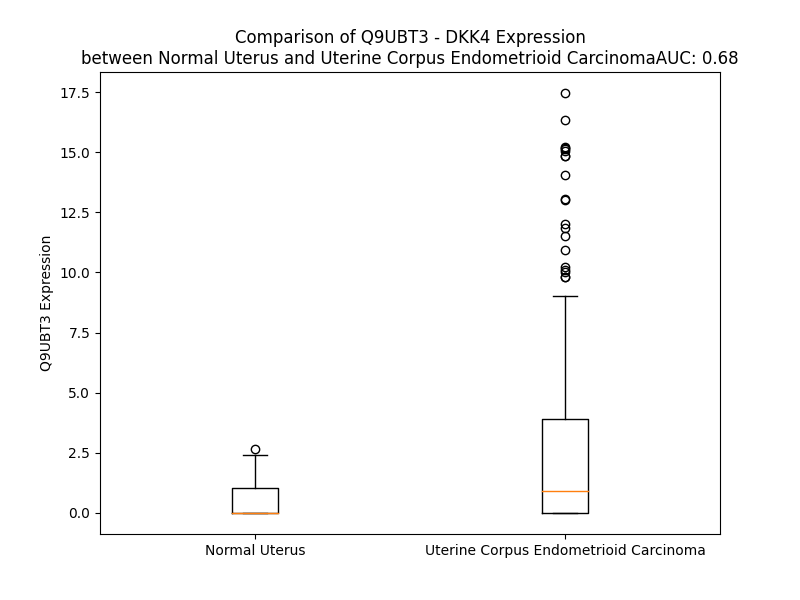

# Detailed Data for Q9UBT3

## Introduction to the Detailed Summary

### How to Interpret the Results

- **Summary & Metrics**: This section provides a quick reference to essential protein attributes, including expression changes, family classification, and biomarker applications. Regulation status (upregulated/downregulated) indicates the protein's behavior in a disease context. Some information comes from the original excel file with the proteins selected from literature, while others are derived from the analyses.
- **Expression Comparison**: A visual representation comparing protein expression between normal and disease states. It highlights significant changes in expression levels that might indicate diagnostic or therapeutic relevance. This is data coming from transcriptomics experiments and could not translate similarly to protein levels.
- **Isoform Alignment**: An interactive view of isoform alignments, revealing structural and functional differences between variants of the protein.
- **Interactors & Homologs**: Tables listing known interaction partners and homologous proteins, the more interactors and homologs, the more complex the protein is to design an antibody for.
- **Biological Assemblies**: Information about the structural arrangement of the protein in different assemblies, providing insights into its functional state but also the complexity of the protein to develop antibodies.
- **Combined Per-Residue Information**: A detailed table summarizing residue-level data. This includes predictions for epitope regions, aggregation tendencies, and modifications that might impact the protein's function. Each row corresponds to a residue in the protein, providing insights into specific sites that may be important for research or drug development.
## Summary & Metrics

- **UniProt Accession**: Q9UBT3
- **Gene Name**: DKK4
- **Protein Name**: Dickkopf-related protein 4
- **Swiss Prot**: DKK4_HUMAN
- **Family**: other
- **Biomarker Application**: diagnosis
- **Number of Isoforms**: 0
- **Regulation**: 1
- **(transcriptomics) AUC**: 0.67
- **(transcriptomics) Fold Change**: 2.65
- **(transcriptomics) Regulation**: Upregulated
- **Discotope Epitope Count**: 52
- **Max n_uniprots (Homo)**: 1
- **Max n_uniprots (Hetero)**: N/A

## Expression Comparison

## Interactors

| preferredName_A   | preferredName_B   |   score |
|:------------------|:------------------|--------:|
| DKK4              | LRP5              |   0.999 |
| DKK4              | LRP6              |   0.999 |
| DKK4              | KREMEN1           |   0.975 |
| DKK4              | WNT6              |   0.949 |
| DKK4              | WNT2B             |   0.937 |
| DKK4              | DKK1              |   0.927 |
| DKK4              | DKK2              |   0.913 |
| DKK4              | WNT3A             |   0.906 |

## Homologs

| uniprot_id   | gene_id   |
|--------------|-----------|

## Biological Assemblies

|   Unnamed: 0 |   assembly |   n_uniprots | composition   | crystal_id   |
|-------------:|-----------:|-------------:|:--------------|:-------------|
|            0 |          1 |            1 | Homo          | 5o57         |

## Combined Per-Residue Information

|   res | aa   |   epitope_score | epitope   |   relative_surface_accessibility |   modeling_confidence |   Aggregation | modification   |
|------:|:-----|----------------:|:----------|---------------------------------:|----------------------:|--------------:|:---------------|
|     1 | M    |         0.19674 | False     |                          1.1782  |                 57.35 |         0.024 | N/A            |
|     2 | V    |         0.17007 | False     |                          0.86646 |                 58.41 |        80.281 | N/A            |
|     3 | A    |         0.09448 | False     |                          0.73383 |                 56.69 |        82.88  | N/A            |
|     4 | A    |         0.08226 | False     |                          0.7124  |                 58.71 |        87.363 | N/A            |
|     5 | V    |         0.10193 | False     |                          0.63809 |                 59.75 |        92.522 | N/A            |
|     6 | L    |         0.121   | False     |                          0.71542 |                 56.32 |        92.887 | N/A            |
|     7 | L    |         0.12352 | False     |                          0.80595 |                 56.82 |        89.971 | N/A            |
|     8 | G    |         0.14213 | False     |                          0.52134 |                 55.62 |        73.172 | N/A            |
|     9 | L    |         0.16991 | False     |                          0.65043 |                 56.21 |        71.602 | N/A            |
|    10 | S    |         0.18205 | False     |                          0.50242 |                 54.6  |        61.916 | N/A            |
|    11 | W    |         0.24769 | False     |                          1.00835 |                 56.44 |        60.714 | N/A            |
|    12 | L    |         0.20196 | False     |                          0.88541 |                 57.5  |        55.091 | N/A            |
|    13 | C    |         0.12461 | False     |                          0.77508 |                 60.01 |        24.359 | N/A            |
|    14 | S    |         0.13254 | False     |                          0.77335 |                 59.45 |         0.032 | N/A            |
|    15 | P    |         0.14786 | False     |                          0.82488 |                 50.65 |         0.015 | N/A            |
|    16 | L    |         0.19124 | False     |                          1.27276 |                 50.41 |         3.781 | N/A            |
|    17 | G    |         0.18912 | False     |                          0.59289 |                 55.19 |         4.367 | N/A            |
|    18 | A    |         0.14636 | False     |                          0.89846 |                 61.63 |         4.367 | N/A            |
|    19 | L    |         0.19097 | False     |                          1.03697 |                 58.71 |         4.367 | N/A            |
|    20 | V    |         0.14305 | False     |                          1.01049 |                 59.48 |         4.367 | N/A            |
|    21 | L    |         0.15817 | False     |                          0.74067 |                 55.64 |         3.782 | N/A            |
|    22 | D    |         0.16667 | False     |                          0.80286 |                 54    |         0     | N/A            |
|    23 | F    |         0.25873 | False     |                          0.83957 |                 53.97 |         0     | N/A            |
|    24 | N    |         0.20336 | False     |                          0.83018 |                 57.23 |         0     | N/A            |
|    25 | N    |         0.19441 | False     |                          0.81866 |                 47.47 |         0     | N/A            |
|    26 | I    |         0.1844  | False     |                          0.83647 |                 48.69 |         0     | N/A            |
|    27 | R    |         0.20366 | False     |                          0.68148 |                 44.75 |         0     | N/A            |
|    28 | S    |         0.1289  | False     |                          0.52189 |                 43.73 |         0     | N/A            |
|    29 | S    |         0.25027 | False     |                          0.77415 |                 42.15 |         0     | N/A            |
|    30 | A    |         0.2307  | False     |                          0.76318 |                 50.91 |         0     | N/A            |
|    31 | D    |         0.25102 | False     |                          0.59056 |                 43.31 |         0     | N/A            |
|    32 | L    |         0.32301 | True      |                          0.9028  |                 43.35 |         0     | N/A            |
|    33 | H    |         0.18247 | False     |                          0.94679 |                 41.82 |         0     | N/A            |
|    34 | G    |         0.23976 | False     |                          0.89851 |                 34.29 |         0     | N/A            |
|    35 | A    |         0.19249 | False     |                          0.96984 |                 38.52 |         0     | N/A            |
|    36 | R    |         0.22464 | False     |                          0.93461 |                 53.88 |         0     | N/A            |
|    37 | K    |         0.26586 | False     |                          0.75873 |                 63.33 |         0     | N/A            |
|    38 | G    |         0.14844 | False     |                          0.24772 |                 71.4  |         0     | N/A            |
|    39 | S    |         0.17815 | False     |                          0.57938 |                 87.43 |         0     | N/A            |
|    40 | Q    |         0.28449 | False     |                          0.66687 |                 92.47 |         0     | N/A            |
|    41 | C    |         0.07604 | False     |                          0.04019 |                 94.31 |         0     | N/A            |
|    42 | L    |         0.30368 | True      |                          1.05213 |                 92.92 |         0     | N/A            |
|    43 | S    |         0.18878 | False     |                          0.37486 |                 93.5  |         0     | N/A            |
|    44 | D    |         0.18844 | False     |                          0.23306 |                 92.59 |         0     | N/A            |
|    45 | T    |         0.31465 | True      |                          0.89407 |                 91.99 |         0     | N/A            |
|    46 | D    |         0.2599  | False     |                          0.48856 |                 92.93 |         0     | N/A            |
|    47 | C    |         0.15736 | False     |                          0.11067 |                 91.94 |         0     | N/A            |
|    48 | N    |         0.15986 | False     |                          0.70903 |                 88.71 |         0     | N/A            |
|    49 | T    |         0.26971 | False     |                          0.93042 |                 84.7  |         0     | N/A            |
|    50 | R    |         0.26282 | False     |                          0.69761 |                 89.53 |         0     | N/A            |
|    51 | K    |         0.23242 | False     |                          0.41579 |                 94.5  |         0     | N/A            |
|    52 | F    |         0.04704 | False     |                          0.0147  |                 94.79 |         0     | N/A            |
|    53 | C    |         0.07677 | False     |                          0.05539 |                 95.26 |         0     | N/A            |
|    54 | L    |         0.27049 | False     |                          0.29594 |                 94.38 |         0     | N/A            |
|    55 | Q    |         0.52048 | True      |                          0.7294  |                 91.17 |         0     | N/A            |
|    56 | P    |         0.27998 | False     |                          0.3041  |                 88.41 |         0     | N/A            |
|    57 | R    |         0.52508 | True      |                          0.97463 |                 87.06 |         0     | N/A            |
|    58 | D    |         0.43743 | True      |                          0.85894 |                 86.79 |         0     | N/A            |
|    59 | E    |         0.37826 | True      |                          0.47237 |                 87.49 |         0     | N/A            |
|    60 | K    |         0.28609 | False     |                          0.69086 |                 90.48 |         0     | N/A            |
|    61 | P    |         0.26598 | False     |                          0.24852 |                 93.07 |         0     | N/A            |
|    62 | F    |         0.34219 | True      |                          0.23441 |                 94.77 |         0     | N/A            |
|    63 | C    |         0.11196 | False     |                          0.05832 |                 95.63 |         0     | N/A            |
|    64 | A    |         0.2131  | False     |                          0.16325 |                 94.47 |         0     | N/A            |
|    65 | T    |         0.15562 | False     |                          0.68999 |                 94.9  |         0     | N/A            |
|    66 | C    |         0.11174 | False     |                          0.16943 |                 95.71 |         0     | N/A            |
|    67 | R    |         0.26859 | False     |                          0.29385 |                 95.66 |         0     | N/A            |
|    68 | G    |         0.24267 | False     |                          0.4053  |                 93.8  |         0     | N/A            |
|    69 | L    |         0.30328 | True      |                          0.61358 |                 93.19 |         0     | N/A            |
|    70 | R    |         0.37923 | True      |                          0.83935 |                 90.9  |         0     | N/A            |
|    71 | R    |         0.21463 | False     |                          0.55155 |                 94.67 |         0     | N/A            |
|    72 | R    |         0.3681  | True      |                          0.75396 |                 95.07 |         0     | N/A            |
|    73 | C    |         0.07385 | False     |                          0.04608 |                 95.57 |         0     | N/A            |
|    74 | Q    |         0.36831 | True      |                          0.72732 |                 94.42 |         0     | N/A            |
|    75 | R    |         0.39895 | True      |                          0.44253 |                 93.97 |         0     | N/A            |
|    76 | D    |         0.29716 | True      |                          0.44339 |                 93.68 |         0     | N/A            |
|    77 | A    |         0.15333 | False     |                          0.44345 |                 93.12 |         0     | N/A            |
|    78 | M    |         0.12065 | False     |                          0.06233 |                 95.16 |         0     | N/A            |
|    79 | C    |         0.09516 | False     |                          0.0607  |                 95.65 |         0     | N/A            |
|    80 | C    |         0.18552 | False     |                          0.24006 |                 95.69 |         0     | N/A            |
|    81 | P    |         0.2637  | False     |                          0.73948 |                 92.94 |         0     | N/A            |
|    82 | G    |         0.18654 | False     |                          0.53022 |                 90.89 |         0     | N/A            |
|    83 | T    |         0.22478 | False     |                          0.14813 |                 94.37 |         0     | N/A            |
|    84 | L    |         0.25736 | False     |                          0.35859 |                 95.12 |         0     | N/A            |
|    85 | C    |         0.13626 | False     |                          0.21292 |                 95.66 |         0     | N/A            |
|    86 | V    |         0.23477 | False     |                          0.35881 |                 95.25 |         0     | N/A            |
|    87 | N    |         0.3597  | True      |                          0.86565 |                 94.09 |         0     | N/A            |
|    88 | D    |         0.4213  | True      |                          0.53482 |                 95.21 |         0     | N/A            |
|    89 | V    |         0.27029 | False     |                          0.37988 |                 94.23 |         0     | N/A            |
|    90 | C    |         0.01775 | False     |                          0.00814 |                 95.99 |         0     | N/A            |
|    91 | T    |         0.1998  | False     |                          0.17925 |                 93.92 |         0     | N/A            |
|    92 | T    |         0.22694 | False     |                          0.28079 |                 92.62 |         0     | N/A            |
|    93 | M    |         0.40525 | True      |                          0.58852 |                 81.87 |         0     | N/A            |
|    94 | E    |         0.25508 | False     |                          0.79558 |                 76.9  |         0     | N/A            |
|    95 | D    |         0.31127 | True      |                          0.64252 |                 67.33 |         0     | N/A            |
|    96 | A    |         0.21154 | False     |                          0.25247 |                 60.82 |         0     | N/A            |
|    97 | T    |         0.30633 | True      |                          0.74134 |                 58.65 |         0     | N/A            |
|    98 | P    |         0.31753 | True      |                          0.84446 |                 55.04 |         0     | N/A            |
|    99 | I    |         0.38106 | True      |                          0.8403  |                 46.7  |         0     | N/A            |
|   100 | L    |         0.37463 | True      |                          1.04015 |                 49.85 |         0     | N/A            |
|   101 | E    |         0.28719 | True      |                          0.89019 |                 46.99 |         0     | N/A            |
|   102 | R    |         0.39046 | True      |                          0.8661  |                 51.58 |         0     | N/A            |
|   103 | Q    |         0.34461 | True      |                          0.88204 |                 44.47 |         0     | N/A            |
|   104 | L    |         0.28041 | False     |                          1.01918 |                 53.68 |         0     | N/A            |
|   105 | D    |         0.31394 | True      |                          0.95014 |                 43.23 |         0     | N/A            |
|   106 | E    |         0.25108 | False     |                          0.84267 |                 48.11 |         0     | N/A            |
|   107 | Q    |         0.25352 | False     |                          0.88046 |                 50.74 |         0     | N/A            |
|   108 | D    |         0.18883 | False     |                          0.87817 |                 42.82 |         0     | N/A            |
|   109 | G    |         0.21577 | False     |                          0.68063 |                 36.59 |         0     | N/A            |
|   110 | T    |         0.28754 | True      |                          0.81512 |                 40.45 |         0     | N/A            |
|   111 | H    |         0.18657 | False     |                          0.95075 |                 43.07 |         0     | N/A            |
|   112 | A    |         0.18766 | False     |                          0.78758 |                 39.28 |         0     | N/A            |
|   113 | E    |         0.29265 | True      |                          0.94443 |                 39.67 |         0     | N/A            |
|   114 | G    |         0.24858 | False     |                          0.84098 |                 37.59 |         0     | N/A            |
|   115 | T    |         0.33839 | True      |                          0.93262 |                 39.85 |         0     | N/A            |
|   116 | T    |         0.3202  | True      |                          0.98823 |                 37.66 |         0     | N/A            |
|   117 | G    |         0.35405 | True      |                          0.94594 |                 39.53 |         0     | N/A            |
|   118 | H    |         0.18946 | False     |                          0.98663 |                 39.84 |         0     | N/A            |
|   119 | P    |         0.28763 | True      |                          0.77744 |                 42.61 |         0     | N/A            |
|   120 | V    |         0.25206 | False     |                          0.9364  |                 36.91 |         0     | N/A            |
|   121 | Q    |         0.16143 | False     |                          0.82782 |                 46.2  |         0     | N/A            |
|   122 | E    |         0.20032 | False     |                          0.78786 |                 35.59 |         0     | N/A            |
|   123 | N    |         0.31041 | True      |                          0.77767 |                 40.72 |         0     | N/A            |
|   124 | Q    |         0.29066 | True      |                          0.70234 |                 36.71 |         0     | N/A            |
|   125 | P    |         0.25004 | False     |                          0.99395 |                 37.37 |         0     | N/A            |
|   126 | K    |         0.23707 | False     |                          0.83433 |                 39.57 |         0     | N/A            |
|   127 | R    |         0.36265 | True      |                          0.90926 |                 37.89 |         0     | N/A            |
|   128 | K    |         0.17187 | False     |                          0.96218 |                 39.92 |         0     | N/A            |
|   129 | P    |         0.22443 | False     |                          0.89458 |                 48.18 |         0     | N/A            |
|   130 | S    |         0.22693 | False     |                          0.67701 |                 38.08 |         0     | N/A            |
|   131 | I    |         0.22569 | False     |                          1.01296 |                 56.52 |         0     | N/A            |
|   132 | K    |         0.30421 | True      |                          0.80952 |                 46.86 |         0     | N/A            |
|   133 | K    |         0.25605 | False     |                          1.0271  |                 41.57 |         0     | N/A            |
|   134 | S    |         0.23826 | False     |                          0.51223 |                 44.52 |         0     | N/A            |
|   135 | Q    |         0.2135  | False     |                          0.96092 |                 54.57 |         0     | N/A            |
|   136 | G    |         0.23493 | False     |                          0.70194 |                 59.06 |         0     | N/A            |
|   137 | R    |         0.16566 | False     |                          0.684   |                 74.26 |         0     | N/A            |
|   138 | K    |         0.30795 | True      |                          0.52258 |                 90.29 |         0     | N/A            |
|   139 | G    |         0.10687 | False     |                          0.08616 |                 91.3  |         0     | N/A            |
|   140 | Q    |         0.15927 | False     |                          0.48803 |                 95.39 |         0     | N/A            |
|   141 | E    |         0.22553 | False     |                          0.61232 |                 96.27 |         0     | N/A            |
|   142 | G    |         0.13327 | False     |                          0.51642 |                 95.34 |         0     | N/A            |
|   143 | E    |         0.12126 | False     |                          0.34907 |                 96.43 |         0     | N/A            |
|   144 | S    |         0.28614 | False     |                          0.68645 |                 95.28 |         0     | N/A            |
|   145 | C    |         0.04673 | False     |                          0.03245 |                 96.15 |         0     | N/A            |
|   146 | L    |         0.26617 | False     |                          0.89025 |                 94.25 |         0     | N/A            |
|   147 | R    |         0.36243 | True      |                          0.65864 |                 94.43 |         0     | N/A            |
|   148 | T    |         0.28713 | True      |                          0.53218 |                 94.14 |         0     | N/A            |
|   149 | F    |         0.31522 | True      |                          0.83149 |                 94.67 |         0     | N/A            |
|   150 | D    |         0.20136 | False     |                          0.30367 |                 95.64 |         0     | N/A            |
|   151 | C    |         0.06545 | False     |                          0.03479 |                 96.75 |         0     | N/A            |
|   152 | G    |         0.10147 | False     |                          0.11787 |                 95.45 |         0     | N/A            |
|   153 | P    |         0.16147 | False     |                          0.87849 |                 95.09 |         0     | N/A            |
|   154 | G    |         0.15908 | False     |                          0.64742 |                 95.28 |         0     | N/A            |
|   155 | L    |         0.17817 | False     |                          0.18029 |                 97.2  |         0     | N/A            |
|   156 | C    |         0.10667 | False     |                          0.08292 |                 96.46 |         0     | N/A            |
|   157 | C    |         0.08432 | False     |                          0.15538 |                 96.15 |         0     | N/A            |
|   158 | A    |         0.01528 | False     |                          0.00893 |                 94.61 |         0     | N/A            |
|   159 | R    |         0.31321 | True      |                          0.20666 |                 93.06 |         0     | N/A            |
|   160 | H    |         0.23513 | False     |                          0.35054 |                 92.46 |         0     | N/A            |
|   161 | F    |         0.38576 | True      |                          0.51558 |                 90.38 |         0     | N/A            |
|   162 | W    |         0.43943 | True      |                          0.87938 |                 89.29 |         0     | N/A            |
|   163 | T    |         0.27417 | False     |                          0.56846 |                 92.74 |         0     | N/A            |
|   164 | K    |         0.27023 | False     |                          0.51176 |                 95.16 |         0     | N/A            |
|   165 | I    |         0.20732 | False     |                          0.16959 |                 96.06 |         0     | N/A            |
|   166 | C    |         0.01589 | False     |                          0.00335 |                 97.59 |         0     | N/A            |
|   167 | K    |         0.21802 | False     |                          0.16108 |                 97    |         0     | N/A            |
|   168 | P    |         0.18816 | False     |                          0.46674 |                 97.06 |         0     | N/A            |
|   169 | V    |         0.07147 | False     |                          0.24667 |                 96.5  |         0     | N/A            |
|   170 | L    |         0.07155 | False     |                          0.12118 |                 95.82 |         0     | N/A            |
|   171 | L    |         0.15515 | False     |                          0.72873 |                 95.57 |         0     | N/A            |
|   172 | E    |         0.168   | False     |                          0.56342 |                 94.55 |         0     | N/A            |
|   173 | G    |         0.0984  | False     |                          0.60197 |                 92.07 |         0     | N/A            |
|   174 | Q    |         0.16503 | False     |                          0.40729 |                 94.49 |         0     | N/A            |
|   175 | V    |         0.18042 | False     |                          0.41419 |                 92.99 |         0     | N/A            |
|   176 | C    |         0.05791 | False     |                          0.05958 |                 92.66 |         0     | N/A            |
|   177 | S    |         0.19011 | False     |                          0.3209  |                 86.03 |         0     | N/A            |
|   178 | R    |         0.21303 | False     |                          0.68315 |                 74.59 |         0     | N/A            |
|   179 | R    |         0.14411 | False     |                          0.50609 |                 66.92 |         0     | N/A            |
|   180 | G    |         0.28789 | True      |                          0.75884 |                 56.78 |         0     | N/A            |
|   181 | H    |         0.16939 | False     |                          0.94503 |                 52.09 |         0     | N/A            |
|   182 | K    |         0.25834 | False     |                          0.90798 |                 46.8  |         0     | N/A            |
|   183 | D    |         0.25856 | False     |                          0.71694 |                 48.73 |         0     | N/A            |
|   184 | T    |         0.30689 | True      |                          0.88539 |                 49.04 |         0     | N/A            |
|   185 | A    |         0.25667 | False     |                          1.00062 |                 53.2  |         0     | N/A            |
|   186 | Q    |         0.24369 | False     |                          0.76934 |                 56.77 |         0     | N/A            |
|   187 | A    |         0.2412  | False     |                          0.83222 |                 60.22 |         0     | N/A            |
|   188 | P    |         0.23473 | False     |                          0.62078 |                 66.83 |         0     | N/A            |
|   189 | E    |         0.23635 | False     |                          0.41468 |                 72.7  |         0     | N/A            |
|   190 | I    |         0.34645 | True      |                          0.41417 |                 83.49 |         0     | N/A            |
|   191 | F    |         0.26406 | False     |                          0.45081 |                 88.7  |         0     | N/A            |
|   192 | Q    |         0.14604 | False     |                          0.27575 |                 90.77 |         0     | N/A            |
|   193 | R    |         0.35185 | True      |                          0.43918 |                 92.81 |         0     | N/A            |
|   194 | C    |         0.06462 | False     |                          0.03845 |                 94.73 |         0     | N/A            |
|   195 | D    |         0.16332 | False     |                          0.47991 |                 94.01 |         0     | N/A            |
|   196 | C    |         0.17349 | False     |                          0.17215 |                 95.21 |         0     | N/A            |
|   197 | G    |         0.06593 | False     |                          0.08054 |                 94.72 |         0     | N/A            |
|   198 | P    |         0.22295 | False     |                          1.02741 |                 93.6  |         0     | N/A            |
|   199 | G    |         0.14082 | False     |                          0.49371 |                 94.18 |         0     | N/A            |
|   200 | L    |         0.14597 | False     |                          0.18201 |                 94.58 |         0     | N/A            |
|   201 | L    |         0.15084 | False     |                          0.48554 |                 93.09 |         0     | N/A            |
|   202 | C    |         0.07296 | False     |                          0.26038 |                 92.13 |         0     | N/A            |
|   203 | R    |         0.22657 | False     |                          0.36661 |                 90.72 |         0     | N/A            |
|   204 | S    |         0.1759  | False     |                          0.29133 |                 87.39 |         0     | N/A            |
|   205 | Q    |         0.24156 | False     |                          0.41038 |                 77.96 |         0     | N/A            |
|   206 | L    |         0.25947 | False     |                          0.98847 |                 67.61 |         0     | N/A            |
|   207 | T    |         0.23378 | False     |                          0.68859 |                 59.24 |         0     | N/A            |
|   208 | S    |         0.32126 | True      |                          0.87154 |                 54.04 |         0     | N/A            |
|   209 | N    |         0.32426 | True      |                          0.85598 |                 53.8  |         0     | N/A            |
|   210 | R    |         0.40096 | True      |                          0.86533 |                 55.56 |         0     | N/A            |
|   211 | Q    |         0.42755 | True      |                          0.95944 |                 55.62 |         0     | N/A            |
|   212 | H    |         0.32495 | True      |                          0.89456 |                 54.78 |         0     | N/A            |
|   213 | A    |         0.24538 | False     |                          0.88427 |                 59.09 |         0     | N/A            |
|   214 | R    |         0.25547 | False     |                          0.48919 |                 72.72 |         0     | N/A            |
|   215 | L    |         0.2602  | False     |                          0.70606 |                 85.22 |         0     | N/A            |
|   216 | R    |         0.26327 | False     |                          0.32842 |                 90.67 |         0     | N/A            |
|   217 | V    |         0.13733 | False     |                          0.08378 |                 93.04 |         0     | N/A            |
|   218 | C    |         0.01838 | False     |                          0.00222 |                 94.54 |         0     | N/A            |
|   219 | Q    |         0.17008 | False     |                          0.30789 |                 93.76 |         0     | N/A            |
|   220 | K    |         0.11988 | False     |                          0.66653 |                 93.88 |         0     | N/A            |
|   221 | I    |         0.23799 | False     |                          0.40993 |                 90.36 |         0     | N/A            |
|   222 | E    |         0.17326 | False     |                          0.76292 |                 82.43 |         0     | N/A            |
|   223 | K    |         0.15057 | False     |                          0.93896 |                 72.24 |         0     | N/A            |
|   224 | L    |         0.141   | False     |                          1.47446 |                 45.24 |         0     | N/A            |

