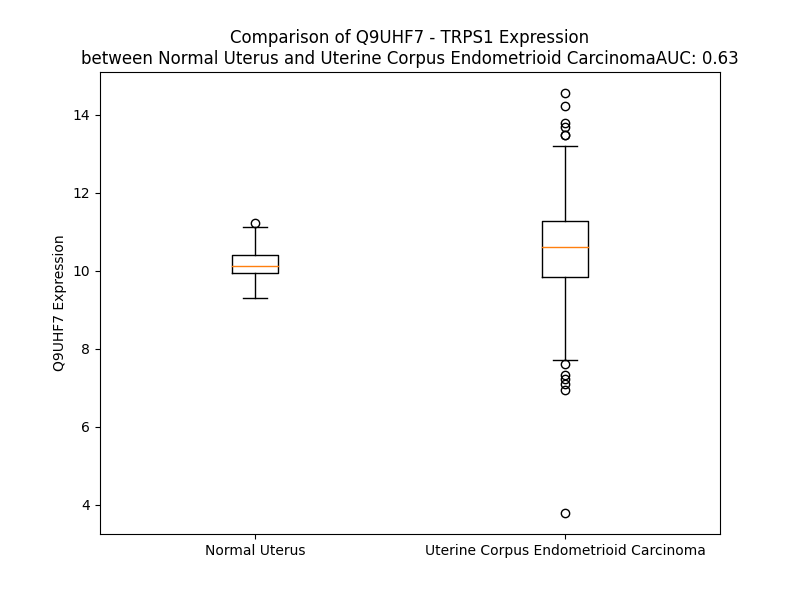

# Detailed Data for Q9UHF7

## Introduction to the Detailed Summary

### How to Interpret the Results

- **Summary & Metrics**: This section provides a quick reference to essential protein attributes, including expression changes, family classification, and biomarker applications. Regulation status (upregulated/downregulated) indicates the protein's behavior in a disease context. Some information comes from the original excel file with the proteins selected from literature, while others are derived from the analyses.
- **Expression Comparison**: A visual representation comparing protein expression between normal and disease states. It highlights significant changes in expression levels that might indicate diagnostic or therapeutic relevance. This is data coming from transcriptomics experiments and could not translate similarly to protein levels.
- **Isoform Alignment**: An interactive view of isoform alignments, revealing structural and functional differences between variants of the protein.
- **Interactors & Homologs**: Tables listing known interaction partners and homologous proteins, the more interactors and homologs, the more complex the protein is to design an antibody for.
- **Biological Assemblies**: Information about the structural arrangement of the protein in different assemblies, providing insights into its functional state but also the complexity of the protein to develop antibodies.
- **Combined Per-Residue Information**: A detailed table summarizing residue-level data. This includes predictions for epitope regions, aggregation tendencies, and modifications that might impact the protein's function. Each row corresponds to a residue in the protein, providing insights into specific sites that may be important for research or drug development.
## Summary & Metrics

- **UniProt Accession**: Q9UHF7
- **Gene Name**: TRPS1
- **Protein Name**: trichorhinophalangeal syndrome I
- **Swiss Prot**: TRPS1_HUMAN
- **Family**: transcription regulator
- **Biomarker Application**: diagnosis,prognosis
- **Number of Isoforms**: 3
- **Regulation**: 2
- **(transcriptomics) AUC**: 0.63
- **(transcriptomics) Fold Change**: 1.03
- **(transcriptomics) Regulation**: Upregulated
- **Discotope Epitope Count**: 297
- **Max n_uniprots (Homo)**: N/A
- **Max n_uniprots (Hetero)**: N/A

## Expression Comparison

## Isoform Alignment

<pre style='font-size:14px; font-family:monospace;'>Q9UHF7-1 -------------MVRKKNPPLRNVASEGEGQILEPIGTESKVSGKNKEFSADQMSENTDQSDAAELNHKEEHSLHVQDPSSSSKKDLKSAVLSEKAGFNYESPSKGGNFPSFPHDEVTDRNMLAFSSPAAGGVCEPLKSPQRAEADDPQDMACTPSGDSLETKEDQKMSPKATEETGQAQSGQANCQGLSPVSVASKNPQVPSDGGVRLNKSKTDLLVNDNPDPAPLSPELQDFKCNICGYGYYGNDPTDLIKHFRKYHLGLHNRTRQDAELDSKILALHNMVQFSHSKDFQKVNRSVFSGVLQDINSSRPVLLNGTYDVQVTSGGTFIGIGRKTPDCQGNTKYFRCKFCNFTYMGNSSTELEQHFLQTHPNKIKASLPSSEVAKPSEKNSNKSIPALQSSDSGDLGKWQDKITVKAGDDTPVGYSVPIKPLDSSRQNGTEATSYYWCKFCSFSCESSSSLKLLEHYGKQHGAVQSGGLNPELNDKLSRGSVINQNDLAKSSEGETMTKTDKSSSGAKKKDFSSKGAEDNMVTSYNCQFCDFRYSKSHGPDVIVVGPLLRHYQQLHNIHKCTIKHCPFCPRGLCSPEKHLGEITYPFACRKSNCSHCALLLLHLSPGAAGSSRVKHQCHQCSFTTPDVDVLLFHYESVHESQASDVKQEANHLQGSDGQQSVKESKEHSCTKCDFITQVEEEISRHYRRAHSCYKCRQCSFTAADTQSLLEHFNTVHCQEQDITTANGEEDGHAISTIKEEPKIDFRVYNLLTPDSKMGEPVSESVVKREKLEEKDGLKEKVWTESSSDDLRNVTWRGADILRGSPSYTQASLGLLTPVSGTQEQTKTLRDSPNVEAAHLARPIYGLAVETKGFLQGAPAGGEKSGALPQQYPASGENKSKDESQSLLRRRRGSGVFCANCLTTKTSLWRKNANGGYVCNACGLYQKLHSTPRPLNIIKQNNGEQIIRRRTRKRLNPEALQAEQLNKQQRGSNEEQVNGSPLERRSEDHLTESHQREIPLPSLSKYEAQGSLTKSHSAQQPVLVSQTLDIHKRMQPLHIQIKSPQESTGDPGNSSSVSEGKGSSERGSPIEKYMRPAKHPNYSPPGSPIEKYQYPLFGLPFVHNDFQSEADWLRFWSKYKLSVPGNPHYLSHVPGLPNPCQNYVPYPTFNLPPHFSAVGSDNDIPLDLAIKHSRPGPTANGASKEKTKAPPNVKNEGPLNVVKTEKVDRSTQDELSTKCVHCGIVFLDEVMYALHMSCHGDSGPFQCSICQHLCTDKYDFTTHIQRGLHRNNAQVEKNGKPKE
Q9UHF7-2 MPYEVNAGYDFTNMVRKKNPPLRNVASEGEGQILEPIGTESKVSGKNKEFSADQMSENTDQSDAAELNHKEEHSLHVQDPSSSSKKDLKSAVLSEKAGFNYESPSKGGNFPSFPHDEVTDRNMLAFSSPAAGGVCEPLKSPQRAEADDPQDMACTPSGDSLETKEDQKMSPKATEETGQAQSGQANCQGLSPVSVASKNPQVPSDGGVRLNKSKTDLLVNDNPDPAPLSPELQDFKCNICGYGYYGNDPTDLIKHFRKYHLGLHNRTRQDAELDSKILALHNMVQFSHSKDFQKVNRSVFSGVLQDINSSRPVLLNGTYDVQVTSGGTFIGIGRKTPDCQGNTKYFRCKFCNFTYMGNSSTELEQHFLQTHPNKIKASLPSSEVAKPSEKNSNKSIPALQSSDSGDLGKWQDKITVKAGDDTPVGYSVPIKPLDSSRQNGTEATSYYWCKFCSFSCESSSSLKLLEHYGKQHGAVQSGGLNPELNDKLSRGSVINQNDLAKSSEGETMTKTDKSSSGAKKKDFSSKGAEDNMVTSYNCQFCDFRYSKSHGPDVIVVGPLLRHYQQLHNIHKCTIKHCPFCPRGLCSPEKHLGEITYPFACRKSNCSHCALLLLHLSPGAAGSSRVKHQCHQCSFTTPDVDVLLFHYESVHESQASDVKQEANHLQGSDGQQSVKESKEHSCTKCDFITQVEEEISRHYRRAHSCYKCRQCSFTAADTQSLLEHFNTVHCQEQDITTANGEEDGHAISTIKEEPKIDFRVYNLLTPDSKMGEPVSESVVKREKLEEKDGLKEKVWTESSSDDLRNVTWRGADILRGSPSYTQASLGLLTPVSGTQEQTKTLRDSPNVEAAHLARPIYGLAVETKGFLQGAPAGGEKSGALPQQYPASGENKSKDESQSLLRRRRGSGVFCANCLTTKTSLWRKNANGGYVCNACGLYQKLHSTPRPLNIIKQNNGEQIIRRRTRKRLNPEALQAEQLNKQQRGSNEEQVNGSPLERRSEDHLTESHQREIPLPSLSKYEAQGSLTKSHSAQQPVLVSQTLDIHKRMQPLHIQIKSPQESTGDPGNSSSVSEGKGSSERGSPIEKYMRPAKHPNYSPPGSPIEKYQYPLFGLPFVHNDFQSEADWLRFWSKYKLSVPGNPHYLSHVPGLPNPCQNYVPYPTFNLPPHFSAVGSDNDIPLDLAIKHSRPGPTANGASKEKTKAPPNVKNEGPLNVVKTEKVDRSTQDELSTKCVHCGIVFLDEVMYALHMSCHGDSGPFQCSICQHLCTDKYDFTTHIQRGLHRNNAQVEKNGKPKE
Q9UHF7-3 ---------MQSNMVRKKNPPLRNVASEGEGQILEPIGTESKVSGKNKEFSADQMSENTDQSDAAELNHKEEHSLHVQDPSSSSKKDLKSAVLSEKAGFNYESPSKGGNFPSFPHDEVTDRNMLAFSSPAAGGVCEPLKSPQRAEADDPQDMACTPSGDSLETKEDQKMSPKATEETGQAQSGQANCQGLSPVSVASKNPQVPSDGGVRLNKSKTDLLVNDNPDPAPLSPELQDFKCNICGYGYYGNDPTDLIKHFRKYHLGLHNRTRQDAELDSKILALHNMVQFSHSKDFQKVNRSVFSGVLQDINSSRPVLLNGTYDVQVTSGGTFIGIGRKTPDCQGNTKYFRCKFCNFTYMGNSSTELEQHFLQTHPNKIKASLPSSEVAKPSEKNSNKSIPALQSSDSGDLGKWQDKITVKAGDDTPVGYSVPIKPLDSSRQNGTEATSYYWCKFCSFSCESSSSLKLLEHYGKQHGAVQSGGLNPELNDKLSRGSVINQNDLAKSSEGETMTKTDKSSSGAKKKDFSSKGAEDNMVTSYNCQFCDFRYSKSHGPDVIVVGPLLRHYQQLHNIHKCTIKHCPFCPRGLCSPEKHLGEITYPFACRKSNCSHCALLLLHLSPGAAGSSRVKHQCHQCSFTTPDVDVLLFHYESVHESQASDVKQEANHLQGSDGQQSVKESKEHSCTKCDFITQVEEEISRHYRRAHSCYKCRQCSFTAADTQSLLEHFNTVHCQEQDITTANGEEDGHAISTIKEEPKIDFRVYNLLTPDSKMGEPVSESVVKREKLEEKDGLKEKVWTESSSDDLRNVTWRGADILRGSPSYTQASLGLLTPVSGTQEQTKTLRDSPNVEAAHLARPIYGLAVETKGFLQGAPAGGEKSGALPQQYPASGENKSKDESQSLLRRRRGSGVFCANCLTTKTSLWRKNANGGYVCNACGLYQKLHSTPRPLNIIKQNNGEQIIRRRTRKRLNPEALQAEQLNKQQRGSNEEQVNGSPLERRSEDHLTESHQREIPLPSLSKYEAQGSLTKSHSAQQPVLVSQTLDIHKRMQPLHIQIKSPQESTGDPGNSSSVSEGKGSSERGSPIEKYMRPAKHPNYSPPGSPIEKYQYPLFGLPFVHNDFQSEADWLRFWSKYKLSVPGNPHYLSHVPGLPNPCQNYVPYPTFNLPPHFSAVGSDNDIPLDLAIKHSRPGPTANGASKEKTKAPPNVKNEGPLNVVKTEKVDRSTQDELSTKCVHCGIVFLDEVMYALHMSCHGDSGPFQCSICQHLCTDKYDFTTHIQRGLHRNNAQVEKNGKPKE
</pre>

## Interactors

| preferredName_A   | preferredName_B   |   score |
|:------------------|:------------------|--------:|
| TRPS1             | EXT1              |   0.931 |

## Homologs

| uniprot_id   | gene_id   |
|:-------------|:----------|
| A0A9L9PXT6   | ZGLP1     |
| B3KUF4       | GATA4     |
| B7WNQ9       | GATA1     |
| Q9BWX5       | GATA5     |
| P23771       | GATA3     |
| Q92908       | GATA6     |
| A0A8Q3WMC3   | GATA2     |

## Combined Per-Residue Information

|   res | aa   |   epitope_score | epitope   |   relative_surface_accessibility |   modeling_confidence |   Aggregation | modification     |
|------:|:-----|----------------:|:----------|---------------------------------:|----------------------:|--------------:|:-----------------|
|     1 | M    |         0.0446  | False     |                          1.27911 |                 32.18 |         0     | N/A              |
|     2 | V    |         0.05524 | False     |                          1.02891 |                 37.56 |         0     | N/A              |
|     3 | R    |         0.15459 | True      |                          0.85802 |                 36.98 |         0     | N/A              |
|     4 | K    |         0.19372 | True      |                          0.83708 |                 41.88 |         0     | N/A              |
|     5 | K    |         0.10457 | True      |                          0.86406 |                 45.97 |         0     | N/A              |
|     6 | N    |         0.12878 | True      |                          0.91617 |                 39.37 |         0     | N/A              |
|     7 | P    |         0.05773 | False     |                          0.88521 |                 50.54 |         0     | N/A              |
|     8 | P    |         0.18601 | True      |                          0.97305 |                 40.35 |         0     | N/A              |
|     9 | L    |         0.17698 | True      |                          1.0775  |                 33.26 |         0     | N/A              |
|    10 | R    |         0.11278 | True      |                          0.92842 |                 42.09 |         0     | N/A              |
|    11 | N    |         0.12208 | True      |                          0.93563 |                 34.24 |         0     | N/A              |
|    12 | V    |         0.08459 | False     |                          1.01883 |                 42.54 |         0     | N/A              |
|    13 | A    |         0.06559 | False     |                          0.91424 |                 36.13 |         0     | N/A              |
|    14 | S    |         0.11283 | True      |                          0.788   |                 42.9  |         0     | N/A              |
|    15 | E    |         0.12818 | True      |                          0.9586  |                 38.46 |         0     | N/A              |
|    16 | G    |         0.10575 | True      |                          0.94086 |                 46.17 |         0     | N/A              |
|    17 | E    |         0.08927 | True      |                          0.94212 |                 38.25 |         0     | N/A              |
|    18 | G    |         0.09278 | True      |                          0.75078 |                 43.79 |         0     | N/A              |
|    19 | Q    |         0.13075 | True      |                          0.85168 |                 40.02 |         0     | N/A              |
|    20 | I    |         0.11278 | True      |                          0.85869 |                 39.19 |         0     | N/A              |
|    21 | L    |         0.09887 | True      |                          0.88105 |                 38.32 |         0     | N/A              |
|    22 | E    |         0.09601 | True      |                          0.69924 |                 40.02 |         0     | N/A              |
|    23 | P    |         0.0666  | False     |                          0.7516  |                 43.1  |         0     | N/A              |
|    24 | I    |         0.09304 | True      |                          1.01129 |                 37.53 |         0     | N/A              |
|    25 | G    |         0.08884 | True      |                          0.72474 |                 38.03 |         0     | N/A              |
|    26 | T    |         0.11789 | True      |                          0.89387 |                 36.96 |         0     | N/A              |
|    27 | E    |         0.08572 | False     |                          0.85735 |                 35.18 |         0     | N/A              |
|    28 | S    |         0.11822 | True      |                          0.78745 |                 38.22 |         0     | N/A              |
|    29 | K    |         0.12013 | True      |                          0.96753 |                 34.72 |         0     | N/A              |
|    30 | V    |         0.12748 | True      |                          0.97489 |                 38.4  |         0     | N/A              |
|    31 | S    |         0.16606 | True      |                          0.83568 |                 32.29 |         0     | N/A              |
|    32 | G    |         0.15384 | True      |                          0.90696 |                 35.71 |         0     | N/A              |
|    33 | K    |         0.11368 | True      |                          0.99661 |                 35.12 |         0     | N/A              |
|    34 | N    |         0.07761 | False     |                          0.92209 |                 31.19 |         0     | N/A              |
|    35 | K    |         0.12096 | True      |                          0.89654 |                 38.87 |         0     | N/A              |
|    36 | E    |         0.07478 | False     |                          0.82238 |                 30.58 |         0     | N/A              |
|    37 | F    |         0.12825 | True      |                          0.89368 |                 37.29 |         0     | N/A              |
|    38 | S    |         0.10298 | True      |                          0.789   |                 32.18 |         0     | N/A              |
|    39 | A    |         0.13395 | True      |                          0.80072 |                 35.09 |         0     | N/A              |
|    40 | D    |         0.12845 | True      |                          0.73696 |                 37.01 |         0     | N/A              |
|    41 | Q    |         0.08939 | True      |                          0.72766 |                 38.26 |         0     | N/A              |
|    42 | M    |         0.10295 | True      |                          0.89686 |                 35.19 |         0     | N/A              |
|    43 | S    |         0.07514 | False     |                          0.58604 |                 34.11 |         0     | N/A              |
|    44 | E    |         0.07703 | False     |                          0.72254 |                 36.35 |         0     | N/A              |
|    45 | N    |         0.10509 | True      |                          0.81429 |                 37.48 |         0     | N/A              |
|    46 | T    |         0.09244 | True      |                          0.73294 |                 37.31 |         0     | N/A              |
|    47 | D    |         0.0864  | True      |                          0.66523 |                 37.65 |         0     | N/A              |
|    48 | Q    |         0.13085 | True      |                          0.8335  |                 38.17 |         0     | N/A              |
|    49 | S    |         0.0733  | False     |                          0.67019 |                 35.53 |         0     | N/A              |
|    50 | D    |         0.07701 | False     |                          0.79414 |                 34.22 |         0     | N/A              |
|    51 | A    |         0.06091 | False     |                          0.91161 |                 35.08 |         0     | N/A              |
|    52 | A    |         0.08415 | False     |                          0.81345 |                 35.29 |         0     | N/A              |
|    53 | E    |         0.11156 | True      |                          0.78275 |                 32.31 |         0     | N/A              |
|    54 | L    |         0.1355  | True      |                          0.85476 |                 35.73 |         0     | N/A              |
|    55 | N    |         0.12331 | True      |                          0.7143  |                 30.45 |         0     | N/A              |
|    56 | H    |         0.14435 | True      |                          0.77307 |                 29.93 |         0     | N/A              |
|    57 | K    |         0.09241 | True      |                          0.74943 |                 30.01 |         0     | N/A              |
|    58 | E    |         0.08673 | True      |                          0.71294 |                 28.42 |         0     | N/A              |
|    59 | E    |         0.08343 | False     |                          0.77737 |                 29.68 |         0     | N/A              |
|    60 | H    |         0.13769 | True      |                          0.94591 |                 33.24 |         0     | N/A              |
|    61 | S    |         0.0888  | True      |                          0.68896 |                 27.82 |         0     | N/A              |
|    62 | L    |         0.09752 | True      |                          1.03906 |                 31.3  |         0     | N/A              |
|    63 | H    |         0.09084 | True      |                          0.80135 |                 30.38 |         0     | N/A              |
|    64 | V    |         0.12241 | True      |                          0.75527 |                 34.13 |         0     | N/A              |
|    65 | Q    |         0.12586 | True      |                          0.72858 |                 36.1  |         0     | N/A              |
|    66 | D    |         0.08434 | False     |                          0.85144 |                 33.33 |         0     | N/A              |
|    67 | P    |         0.10015 | True      |                          0.89546 |                 35.25 |         0     | N/A              |
|    68 | S    |         0.09091 | True      |                          0.83751 |                 36.35 |         0     | N/A              |
|    69 | S    |         0.08316 | False     |                          0.75689 |                 29.69 |         0     | N/A              |
|    70 | S    |         0.08828 | True      |                          0.84338 |                 27.82 |         0     | N/A              |
|    71 | S    |         0.09014 | True      |                          0.77286 |                 33.77 |         0     | N/A              |
|    72 | K    |         0.12692 | True      |                          0.92387 |                 28.25 |         0     | N/A              |
|    73 | K    |         0.12118 | True      |                          0.93027 |                 35.7  |         0     | N/A              |
|    74 | D    |         0.10385 | True      |                          0.70491 |                 35.66 |         0     | N/A              |
|    75 | L    |         0.11441 | True      |                          0.96003 |                 37.99 |         0     | N/A              |
|    76 | K    |         0.17257 | True      |                          0.90963 |                 39.01 |         0     | N/A              |
|    77 | S    |         0.07094 | False     |                          0.80762 |                 32.65 |         0     | N/A              |
|    78 | A    |         0.09117 | True      |                          0.90043 |                 35.55 |         0     | N/A              |
|    79 | V    |         0.08847 | True      |                          0.78853 |                 28.97 |         0     | N/A              |
|    80 | L    |         0.04046 | False     |                          0.98946 |                 28.78 |         0     | N/A              |
|    81 | S    |         0.14768 | True      |                          0.73614 |                 31.57 |         0     | N/A              |
|    82 | E    |         0.06498 | False     |                          0.87688 |                 33.09 |         0     | N/A              |
|    83 | K    |         0.11507 | True      |                          0.96934 |                 29.8  |         0     | N/A              |
|    84 | A    |         0.13757 | True      |                          0.98673 |                 29.07 |         0     | N/A              |
|    85 | G    |         0.09663 | True      |                          0.7507  |                 28.99 |         0     | N/A              |
|    86 | F    |         0.0915  | True      |                          0.9891  |                 30.17 |         0     | N/A              |
|    87 | N    |         0.08783 | True      |                          0.8183  |                 28.54 |         0     | N/A              |
|    88 | Y    |         0.09731 | True      |                          0.91138 |                 29.58 |         0     | N/A              |
|    89 | E    |         0.05918 | False     |                          0.66291 |                 32.15 |         0     | N/A              |
|    90 | S    |         0.07303 | False     |                          0.81919 |                 42.49 |         0     | Phosphoserine    |
|    91 | P    |         0.0962  | True      |                          0.90514 |                 40.38 |         0     | N/A              |
|    92 | S    |         0.11369 | True      |                          0.64709 |                 30.9  |         0     | N/A              |
|    93 | K    |         0.08672 | True      |                          0.97506 |                 33.26 |         0     | N/A              |
|    94 | G    |         0.08786 | True      |                          0.94317 |                 31.12 |         0     | N/A              |
|    95 | G    |         0.12401 | True      |                          0.92836 |                 31.67 |         0     | N/A              |
|    96 | N    |         0.07059 | False     |                          0.93927 |                 34.89 |         0     | N/A              |
|    97 | F    |         0.0875  | True      |                          0.92431 |                 31.13 |         0     | N/A              |
|    98 | P    |         0.1246  | True      |                          0.84623 |                 35.12 |         0     | N/A              |
|    99 | S    |         0.09407 | True      |                          0.64595 |                 26.87 |         0     | N/A              |
|   100 | F    |         0.10278 | True      |                          1.03351 |                 34.41 |         0     | N/A              |
|   101 | P    |         0.09384 | True      |                          0.9002  |                 34.18 |         0     | N/A              |
|   102 | H    |         0.06309 | False     |                          0.86258 |                 27.56 |         0     | N/A              |
|   103 | D    |         0.05885 | False     |                          0.71515 |                 28.37 |         0     | N/A              |
|   104 | E    |         0.06653 | False     |                          0.71722 |                 31.54 |         0     | N/A              |
|   105 | V    |         0.08972 | True      |                          0.99603 |                 36.93 |         0     | N/A              |
|   106 | T    |         0.09994 | True      |                          0.73832 |                 33.89 |         0     | N/A              |
|   107 | D    |         0.14719 | True      |                          0.72062 |                 40.82 |         0     | N/A              |
|   108 | R    |         0.11895 | True      |                          0.7766  |                 39.66 |         0     | N/A              |
|   109 | N    |         0.16596 | True      |                          0.71877 |                 39.89 |         0.414 | N/A              |
|   110 | M    |         0.12058 | True      |                          0.86102 |                 40.98 |         0.59  | N/A              |
|   111 | L    |         0.07598 | False     |                          0.84178 |                 41.15 |         0.59  | N/A              |
|   112 | A    |         0.06732 | False     |                          0.66284 |                 36.61 |         0.59  | N/A              |
|   113 | F    |         0.0582  | False     |                          0.92441 |                 34.24 |         0.59  | N/A              |
|   114 | S    |         0.09391 | True      |                          0.81091 |                 30.08 |         0.176 | N/A              |
|   115 | S    |         0.07946 | False     |                          0.80893 |                 34.66 |         0     | N/A              |
|   116 | P    |         0.11638 | True      |                          0.87856 |                 39.84 |         0     | N/A              |
|   117 | A    |         0.05331 | False     |                          0.88133 |                 29.33 |         0     | N/A              |
|   118 | A    |         0.08802 | True      |                          1.01125 |                 31.71 |         0     | N/A              |
|   119 | G    |         0.08036 | False     |                          0.99473 |                 31.99 |         0     | N/A              |
|   120 | G    |         0.10911 | True      |                          0.82032 |                 32.48 |         0     | N/A              |
|   121 | V    |         0.11279 | True      |                          0.96751 |                 31.23 |         0     | N/A              |
|   122 | C    |         0.05191 | False     |                          0.82117 |                 30.4  |         0     | N/A              |
|   123 | E    |         0.10319 | True      |                          0.80555 |                 35.4  |         0     | N/A              |
|   124 | P    |         0.06406 | False     |                          0.73614 |                 43.19 |         0     | N/A              |
|   125 | L    |         0.11075 | True      |                          0.89127 |                 30.47 |         0     | N/A              |
|   126 | K    |         0.06249 | False     |                          0.81762 |                 34.69 |         0     | N/A              |
|   127 | S    |         0.09704 | True      |                          0.82192 |                 33.11 |         0     | Phosphoserine    |
|   128 | P    |         0.07756 | False     |                          0.89733 |                 40.32 |         0     | N/A              |
|   129 | Q    |         0.08463 | False     |                          0.76944 |                 31.66 |         0     | N/A              |
|   130 | R    |         0.09267 | True      |                          0.82925 |                 31.39 |         0     | N/A              |
|   131 | A    |         0.08331 | False     |                          0.86262 |                 34.42 |         0     | N/A              |
|   132 | E    |         0.08428 | False     |                          0.87121 |                 37.72 |         0     | N/A              |
|   133 | A    |         0.06326 | False     |                          0.71687 |                 40.56 |         0     | N/A              |
|   134 | D    |         0.08559 | False     |                          0.92873 |                 37.54 |         0     | N/A              |
|   135 | D    |         0.05369 | False     |                          0.81718 |                 39.11 |         0     | N/A              |
|   136 | P    |         0.02823 | False     |                          0.64593 |                 48.38 |         0     | N/A              |
|   137 | Q    |         0.07405 | False     |                          0.80627 |                 35.79 |         0     | N/A              |
|   138 | D    |         0.04434 | False     |                          0.76086 |                 36    |         0     | N/A              |
|   139 | M    |         0.04825 | False     |                          0.95614 |                 36.09 |         0     | N/A              |
|   140 | A    |         0.0759  | False     |                          0.878   |                 35.59 |         0     | N/A              |
|   141 | C    |         0.10023 | True      |                          0.84846 |                 33.95 |         0     | N/A              |
|   142 | T    |         0.08086 | False     |                          0.86463 |                 33.46 |         0     | N/A              |
|   143 | P    |         0.08357 | False     |                          0.87152 |                 46.75 |         0     | N/A              |
|   144 | S    |         0.08572 | False     |                          0.86083 |                 38.27 |         0     | N/A              |
|   145 | G    |         0.06491 | False     |                          0.81845 |                 40.69 |         0     | N/A              |
|   146 | D    |         0.07717 | False     |                          0.88124 |                 35.99 |         0     | N/A              |
|   147 | S    |         0.06819 | False     |                          0.63121 |                 34.09 |         0     | N/A              |
|   148 | L    |         0.1058  | True      |                          0.95682 |                 37.69 |         0     | N/A              |
|   149 | E    |         0.0848  | False     |                          0.66824 |                 35.32 |         0     | N/A              |
|   150 | T    |         0.0861  | False     |                          0.71951 |                 33.9  |         0     | N/A              |
|   151 | K    |         0.09948 | True      |                          0.72676 |                 37.81 |         0     | N/A              |
|   152 | E    |         0.07476 | False     |                          0.67217 |                 36.68 |         0     | N/A              |
|   153 | D    |         0.0736  | False     |                          0.62933 |                 37.9  |         0     | N/A              |
|   154 | Q    |         0.06308 | False     |                          0.75857 |                 38.2  |         0     | N/A              |
|   155 | K    |         0.07262 | False     |                          0.79357 |                 36.1  |         0     | N/A              |
|   156 | M    |         0.12138 | True      |                          0.9112  |                 35.58 |         0     | N/A              |
|   157 | S    |         0.0825  | False     |                          0.74321 |                 29.94 |         0     | N/A              |
|   158 | P    |         0.12956 | True      |                          0.82779 |                 44.75 |         0     | N/A              |
|   159 | K    |         0.07175 | False     |                          0.97843 |                 31.23 |         0     | N/A              |
|   160 | A    |         0.0749  | False     |                          0.88432 |                 34.52 |         0     | N/A              |
|   161 | T    |         0.04617 | False     |                          0.77709 |                 32.73 |         0     | N/A              |
|   162 | E    |         0.07629 | False     |                          0.82167 |                 32.34 |         0     | N/A              |
|   163 | E    |         0.14942 | True      |                          0.79068 |                 34.79 |         0     | N/A              |
|   164 | T    |         0.1081  | True      |                          0.86878 |                 30.32 |         0     | N/A              |
|   165 | G    |         0.09586 | True      |                          0.7281  |                 32.01 |         0     | N/A              |
|   166 | Q    |         0.09725 | True      |                          0.938   |                 31.23 |         0     | N/A              |
|   167 | A    |         0.07462 | False     |                          0.74676 |                 31.61 |         0     | N/A              |
|   168 | Q    |         0.10606 | True      |                          0.88338 |                 39.3  |         0     | N/A              |
|   169 | S    |         0.09573 | True      |                          0.86808 |                 34.86 |         0     | N/A              |
|   170 | G    |         0.07072 | False     |                          0.79598 |                 37.3  |         0     | N/A              |
|   171 | Q    |         0.12036 | True      |                          0.95225 |                 39.73 |         0     | N/A              |
|   172 | A    |         0.12323 | True      |                          0.82789 |                 37.71 |         0     | N/A              |
|   173 | N    |         0.12028 | True      |                          0.83164 |                 36.66 |         0     | N/A              |
|   174 | C    |         0.08782 | True      |                          0.73294 |                 35.42 |         0     | N/A              |
|   175 | Q    |         0.08192 | False     |                          0.82017 |                 38.27 |         0     | N/A              |
|   176 | G    |         0.11273 | True      |                          0.806   |                 35.54 |         0     | N/A              |
|   177 | L    |         0.09675 | True      |                          1.08727 |                 36.84 |         0     | N/A              |
|   178 | S    |         0.11376 | True      |                          0.80355 |                 31.05 |         0     | Phosphoserine    |
|   179 | P    |         0.09101 | True      |                          0.87055 |                 42.41 |         0     | N/A              |
|   180 | V    |         0.09241 | True      |                          0.92734 |                 36.13 |         0     | N/A              |
|   181 | S    |         0.12817 | True      |                          0.73152 |                 29.98 |         0     | N/A              |
|   182 | V    |         0.11946 | True      |                          1.02329 |                 38.48 |         0     | N/A              |
|   183 | A    |         0.09661 | True      |                          0.93324 |                 30.92 |         0     | N/A              |
|   184 | S    |         0.12122 | True      |                          0.75712 |                 33.7  |         0     | N/A              |
|   185 | K    |         0.07214 | False     |                          0.94281 |                 34.71 |         0     | N/A              |
|   186 | N    |         0.07058 | False     |                          0.83719 |                 35.15 |         0     | N/A              |
|   187 | P    |         0.05928 | False     |                          0.84865 |                 39.43 |         0     | N/A              |
|   188 | Q    |         0.08473 | False     |                          0.74343 |                 30.51 |         0     | N/A              |
|   189 | V    |         0.08164 | False     |                          0.8791  |                 35.88 |         0     | N/A              |
|   190 | P    |         0.1302  | True      |                          0.81473 |                 40.71 |         0     | N/A              |
|   191 | S    |         0.09477 | True      |                          0.74118 |                 38.46 |         0     | N/A              |
|   192 | D    |         0.10907 | True      |                          0.84923 |                 40.05 |         0     | N/A              |
|   193 | G    |         0.05685 | False     |                          0.81287 |                 37.85 |         0     | N/A              |
|   194 | G    |         0.08142 | False     |                          0.88707 |                 32.34 |         0     | N/A              |
|   195 | V    |         0.06353 | False     |                          0.92087 |                 36.44 |         0     | N/A              |
|   196 | R    |         0.1772  | True      |                          0.8304  |                 30.28 |         0     | N/A              |
|   197 | L    |         0.06896 | False     |                          0.9382  |                 31.62 |         0     | N/A              |
|   198 | N    |         0.1181  | True      |                          0.58665 |                 30.31 |         0     | N/A              |
|   199 | K    |         0.08512 | False     |                          0.96664 |                 31.82 |         0     | N/A              |
|   200 | S    |         0.09306 | True      |                          0.70248 |                 33.3  |         0     | N/A              |
|   201 | K    |         0.14871 | True      |                          0.89764 |                 30.81 |         0     | N/A              |
|   202 | T    |         0.07467 | False     |                          0.65517 |                 32.03 |         0     | N/A              |
|   203 | D    |         0.10488 | True      |                          0.72052 |                 30.37 |         0     | N/A              |
|   204 | L    |         0.09503 | True      |                          0.96013 |                 34.95 |         0     | N/A              |
|   205 | L    |         0.14648 | True      |                          0.96179 |                 31.2  |         0     | N/A              |
|   206 | V    |         0.13007 | True      |                          1.00597 |                 31.16 |         0     | N/A              |
|   207 | N    |         0.10592 | True      |                          0.98783 |                 32.96 |         0     | N/A              |
|   208 | D    |         0.16862 | True      |                          0.84272 |                 30.58 |         0     | N/A              |
|   209 | N    |         0.1288  | True      |                          0.90338 |                 31.64 |         0     | N/A              |
|   210 | P    |         0.1235  | True      |                          0.83718 |                 39.92 |         0     | N/A              |
|   211 | D    |         0.09201 | True      |                          0.78975 |                 30.82 |         0     | N/A              |
|   212 | P    |         0.11283 | True      |                          0.86636 |                 36.3  |         0     | N/A              |
|   213 | A    |         0.12047 | True      |                          0.88501 |                 28.53 |         0     | N/A              |
|   214 | P    |         0.1334  | True      |                          0.87317 |                 28.97 |         0     | N/A              |
|   215 | L    |         0.10188 | True      |                          1.02928 |                 28.76 |         0     | N/A              |
|   216 | S    |         0.08211 | False     |                          0.8356  |                 29.16 |         0     | Phosphoserine    |
|   217 | P    |         0.07665 | False     |                          0.88767 |                 37.51 |         0     | N/A              |
|   218 | E    |         0.07903 | False     |                          0.85462 |                 35.61 |         0     | N/A              |
|   219 | L    |         0.0724  | False     |                          0.80171 |                 38.1  |         0     | N/A              |
|   220 | Q    |         0.0625  | False     |                          0.63156 |                 47.1  |         0     | N/A              |
|   221 | D    |         0.08431 | False     |                          0.51976 |                 54.48 |         0     | N/A              |
|   222 | F    |         0.07178 | False     |                          0.32868 |                 58.33 |         0     | N/A              |
|   223 | K    |         0.06472 | False     |                          0.55276 |                 68.18 |         0     | N/A              |
|   224 | C    |         0.01943 | False     |                          0.00148 |                 70.69 |         0     | N/A              |
|   225 | N    |         0.10163 | True      |                          0.92955 |                 65.58 |         0     | N/A              |
|   226 | I    |         0.06754 | False     |                          0.58194 |                 65.94 |         0     | N/A              |
|   227 | C    |         0.05292 | False     |                          0.48664 |                 75.68 |         0     | N/A              |
|   228 | G    |         0.05225 | False     |                          0.46955 |                 72.48 |         0     | N/A              |
|   229 | Y    |         0.09261 | True      |                          0.5697  |                 74.61 |         0     | N/A              |
|   230 | G    |         0.08563 | False     |                          0.46103 |                 68.3  |         0     | N/A              |
|   231 | Y    |         0.07246 | False     |                          0.2121  |                 71.66 |         0     | N/A              |
|   232 | Y    |         0.11058 | True      |                          0.88092 |                 59.38 |         0     | N/A              |
|   233 | G    |         0.05097 | False     |                          0.4211  |                 59.2  |         0     | N/A              |
|   234 | N    |         0.09593 | True      |                          0.85604 |                 48.83 |         0     | N/A              |
|   235 | D    |         0.12972 | True      |                          0.36806 |                 66.85 |         0     | N/A              |
|   236 | P    |         0.06239 | False     |                          0.52163 |                 70.34 |         0     | N/A              |
|   237 | T    |         0.06589 | False     |                          0.45967 |                 77.16 |         0     | N/A              |
|   238 | D    |         0.03001 | False     |                          0.32046 |                 74.82 |         0     | N/A              |
|   239 | L    |         0.01947 | False     |                          0.21092 |                 73.95 |         0     | N/A              |
|   240 | I    |         0.03415 | False     |                          0.14719 |                 72.06 |         0     | N/A              |
|   241 | K    |         0.07494 | False     |                          0.47786 |                 76.62 |         0     | N/A              |
|   242 | H    |         0.01353 | False     |                          0.05328 |                 79.97 |         0     | N/A              |
|   243 | F    |         0.02442 | False     |                          0.32558 |                 72.54 |         0     | N/A              |
|   244 | R    |         0.08638 | True      |                          0.53041 |                 71.6  |         0     | N/A              |
|   245 | K    |         0.08767 | True      |                          0.71477 |                 71.98 |         0     | N/A              |
|   246 | Y    |         0.08021 | False     |                          0.50986 |                 70.66 |         0     | N/A              |
|   247 | H    |         0.03221 | False     |                          0.13613 |                 74.02 |         0     | N/A              |
|   248 | L    |         0.06926 | False     |                          0.43983 |                 65.03 |         0     | N/A              |
|   249 | G    |         0.04944 | False     |                          0.73123 |                 56.09 |         0     | N/A              |
|   250 | L    |         0.08885 | True      |                          0.72407 |                 50.38 |         0     | N/A              |
|   251 | H    |         0.06937 | False     |                          0.24466 |                 50.39 |         0     | N/A              |
|   252 | N    |         0.10418 | True      |                          0.81482 |                 47.66 |         0     | N/A              |
|   253 | R    |         0.12571 | True      |                          0.80323 |                 48.92 |         0     | N/A              |
|   254 | T    |         0.08041 | False     |                          0.58841 |                 49.24 |         0     | N/A              |
|   255 | R    |         0.16287 | True      |                          0.94945 |                 42.61 |         0     | N/A              |
|   256 | Q    |         0.14679 | True      |                          0.90114 |                 53.92 |         0     | N/A              |
|   257 | D    |         0.07123 | False     |                          0.41993 |                 60.56 |         0     | N/A              |
|   258 | A    |         0.08352 | False     |                          0.72463 |                 63.67 |         0     | N/A              |
|   259 | E    |         0.06874 | False     |                          0.59114 |                 66.48 |         0     | N/A              |
|   260 | L    |         0.0349  | False     |                          0.33905 |                 63.48 |         0     | N/A              |
|   261 | D    |         0.10711 | True      |                          0.52869 |                 60.61 |         0     | N/A              |
|   262 | S    |         0.07931 | False     |                          0.52568 |                 70.28 |         0     | N/A              |
|   263 | K    |         0.0826  | False     |                          0.53745 |                 73.26 |         0     | N/A              |
|   264 | I    |         0.06366 | False     |                          0.39407 |                 61.55 |         0     | N/A              |
|   265 | L    |         0.14383 | True      |                          0.68669 |                 68.47 |         0     | N/A              |
|   266 | A    |         0.09931 | True      |                          0.49984 |                 69.09 |         0     | N/A              |
|   267 | L    |         0.05237 | False     |                          0.56866 |                 67.53 |         0     | N/A              |
|   268 | H    |         0.07171 | False     |                          0.49986 |                 51.35 |         0     | N/A              |
|   269 | N    |         0.08436 | False     |                          0.42382 |                 60.85 |         0     | N/A              |
|   270 | M    |         0.11219 | True      |                          0.6952  |                 57.66 |         0     | N/A              |
|   271 | V    |         0.0454  | False     |                          0.37949 |                 52.41 |         0     | N/A              |
|   272 | Q    |         0.08953 | True      |                          0.57151 |                 47.52 |         0     | N/A              |
|   273 | F    |         0.08071 | False     |                          0.82005 |                 38.85 |         0     | N/A              |
|   274 | S    |         0.1135  | True      |                          0.70129 |                 41.26 |         0     | N/A              |
|   275 | H    |         0.13067 | True      |                          0.86115 |                 40.95 |         0     | N/A              |
|   276 | S    |         0.09539 | True      |                          0.55047 |                 37.77 |         0     | N/A              |
|   277 | K    |         0.11418 | True      |                          0.94649 |                 31.27 |         0     | N/A              |
|   278 | D    |         0.15071 | True      |                          0.7733  |                 31.73 |         0     | N/A              |
|   279 | F    |         0.10812 | True      |                          1.11034 |                 31.16 |         0     | N/A              |
|   280 | Q    |         0.08427 | False     |                          0.79989 |                 31.23 |         0     | N/A              |
|   281 | K    |         0.0804  | False     |                          0.89589 |                 31.19 |         0     | N/A              |
|   282 | V    |         0.08951 | True      |                          1.00175 |                 34.3  |         0     | N/A              |
|   283 | N    |         0.06832 | False     |                          0.96351 |                 33.3  |         0     | N/A              |
|   284 | R    |         0.08443 | False     |                          0.93485 |                 33.46 |         0     | N/A              |
|   285 | S    |         0.09157 | True      |                          0.74331 |                 32.89 |         1.83  | N/A              |
|   286 | V    |         0.08546 | False     |                          0.81382 |                 35.47 |        17.543 | N/A              |
|   287 | F    |         0.06375 | False     |                          1.02203 |                 33.02 |        17.711 | N/A              |
|   288 | S    |         0.07769 | False     |                          0.94161 |                 28.87 |        17.711 | N/A              |
|   289 | G    |         0.14576 | True      |                          0.79698 |                 29.91 |        17.711 | N/A              |
|   290 | V    |         0.10889 | True      |                          0.97989 |                 35.39 |        17.711 | N/A              |
|   291 | L    |         0.06005 | False     |                          0.88827 |                 32.26 |        17.347 | N/A              |
|   292 | Q    |         0.14589 | True      |                          0.75238 |                 29.79 |         0.578 | N/A              |
|   293 | D    |         0.11616 | True      |                          0.70373 |                 28.44 |         0     | N/A              |
|   294 | I    |         0.10057 | True      |                          0.88632 |                 30.31 |         0     | N/A              |
|   295 | N    |         0.11915 | True      |                          0.86875 |                 27.41 |         0     | N/A              |
|   296 | S    |         0.11526 | True      |                          0.84715 |                 30.94 |         0     | N/A              |
|   297 | S    |         0.09082 | True      |                          0.73095 |                 31.43 |         0     | N/A              |
|   298 | R    |         0.14767 | True      |                          0.94207 |                 29.22 |         0     | N/A              |
|   299 | P    |         0.05754 | False     |                          0.81716 |                 33.99 |         0     | N/A              |
|   300 | V    |         0.0852  | False     |                          1.09058 |                 35.28 |         0.424 | N/A              |
|   301 | L    |         0.07529 | False     |                          0.7556  |                 37.17 |         0.424 | N/A              |
|   302 | L    |         0.14875 | True      |                          1.0449  |                 38.25 |         0.424 | N/A              |
|   303 | N    |         0.08319 | False     |                          0.92797 |                 32.1  |         0.424 | N/A              |
|   304 | G    |         0.07019 | False     |                          0.6406  |                 37.99 |         0.424 | N/A              |
|   305 | T    |         0.06579 | False     |                          0.83901 |                 46.42 |         0.424 | N/A              |
|   306 | Y    |         0.06354 | False     |                          0.61908 |                 54.7  |         0.424 | N/A              |
|   307 | D    |         0.0416  | False     |                          0.40415 |                 70.16 |         0     | N/A              |
|   308 | V    |         0.05316 | False     |                          0.42082 |                 75.04 |         0     | N/A              |
|   309 | Q    |         0.04887 | False     |                          0.67417 |                 82.64 |         0     | N/A              |
|   310 | V    |         0.01644 | False     |                          0.0676  |                 83.34 |         0     | N/A              |
|   311 | T    |         0.03335 | False     |                          0.56644 |                 85.57 |         0     | N/A              |
|   312 | S    |         0.04302 | False     |                          0.21473 |                 79.73 |         0     | N/A              |
|   313 | G    |         0.06834 | False     |                          0.93507 |                 75.52 |         0     | N/A              |
|   314 | G    |         0.04786 | False     |                          0.9568  |                 78.98 |         0.16  | N/A              |
|   315 | T    |         0.03058 | False     |                          0.31021 |                 79.83 |         1.941 | N/A              |
|   316 | F    |         0.03001 | False     |                          0.30246 |                 87.71 |         1.941 | N/A              |
|   317 | I    |         0.00377 | False     |                          0       |                 86.97 |         1.941 | N/A              |
|   318 | G    |         0.00478 | False     |                          0.00966 |                 87.29 |         1.941 | N/A              |
|   319 | I    |         0.03839 | False     |                          0.34798 |                 85.35 |         1.941 | N/A              |
|   320 | G    |         0.0038  | False     |                          0       |                 83.11 |         0     | N/A              |
|   321 | R    |         0.07202 | False     |                          0.52835 |                 70.89 |         0     | N/A              |
|   322 | K    |         0.08342 | False     |                          0.42653 |                 63.35 |         0     | N/A              |
|   323 | T    |         0.01807 | False     |                          0.22958 |                 58.36 |         0     | N/A              |
|   324 | P    |         0.09453 | True      |                          0.96505 |                 56.41 |         0     | N/A              |
|   325 | D    |         0.08266 | False     |                          0.58774 |                 55.36 |         0     | N/A              |
|   326 | C    |         0.05023 | False     |                          0.46638 |                 38.76 |         0     | N/A              |
|   327 | Q    |         0.0542  | False     |                          0.93743 |                 47.31 |         0     | N/A              |
|   328 | G    |         0.07562 | False     |                          0.55565 |                 49.5  |         0     | N/A              |
|   329 | N    |         0.05299 | False     |                          0.5326  |                 55.67 |         0     | N/A              |
|   330 | T    |         0.02945 | False     |                          0.08747 |                 62.11 |         0     | N/A              |
|   331 | K    |         0.04277 | False     |                          0.2891  |                 65.7  |         0     | N/A              |
|   332 | Y    |         0.03878 | False     |                          0.33697 |                 80.13 |         0     | N/A              |
|   333 | F    |         0.01278 | False     |                          0.02675 |                 85.72 |         0     | N/A              |
|   334 | R    |         0.05633 | False     |                          0.41058 |                 85.72 |         0     | N/A              |
|   335 | C    |         0.02129 | False     |                          0.00962 |                 87.92 |         0     | N/A              |
|   336 | K    |         0.03283 | False     |                          0.44817 |                 87.22 |         0     | N/A              |
|   337 | F    |         0.0237  | False     |                          0.21621 |                 86.17 |         0     | N/A              |
|   338 | C    |         0.02442 | False     |                          0.14695 |                 86.1  |         0     | N/A              |
|   339 | N    |         0.03084 | False     |                          0.20721 |                 79.79 |         0     | N/A              |
|   340 | F    |         0.07274 | False     |                          0.54467 |                 81.27 |         0.149 | N/A              |
|   341 | T    |         0.04666 | False     |                          0.37824 |                 83.57 |         0.149 | N/A              |
|   342 | Y    |         0.0659  | False     |                          0.20748 |                 77.23 |         0.149 | N/A              |
|   343 | M    |         0.11869 | True      |                          0.75986 |                 76.63 |         0.149 | N/A              |
|   344 | G    |         0.02417 | False     |                          0.04518 |                 69.54 |         0.149 | N/A              |
|   345 | N    |         0.09396 | True      |                          0.73246 |                 70.61 |         0     | N/A              |
|   346 | S    |         0.07083 | False     |                          0.36366 |                 74.77 |         0     | N/A              |
|   347 | S    |         0.0529  | False     |                          0.25365 |                 83.37 |         0     | N/A              |
|   348 | T    |         0.04459 | False     |                          0.58251 |                 84.98 |         0     | N/A              |
|   349 | E    |         0.02642 | False     |                          0.33249 |                 83.73 |         0     | N/A              |
|   350 | L    |         0.00108 | False     |                          0       |                 85.66 |         0     | N/A              |
|   351 | E    |         0.02139 | False     |                          0.24888 |                 86.46 |         0     | N/A              |
|   352 | Q    |         0.0551  | False     |                          0.62749 |                 85.41 |         0     | N/A              |
|   353 | H    |         0.02644 | False     |                          0.07077 |                 85.6  |         0     | N/A              |
|   354 | F    |         0.00518 | False     |                          0.00064 |                 87.43 |         0     | N/A              |
|   355 | L    |         0.10586 | True      |                          0.62627 |                 86.37 |         0     | N/A              |
|   356 | Q    |         0.09837 | True      |                          0.73313 |                 84.24 |         0     | N/A              |
|   357 | T    |         0.04216 | False     |                          0.50643 |                 81.79 |         0     | N/A              |
|   358 | H    |         0.04363 | False     |                          0.18195 |                 82.64 |         0     | N/A              |
|   359 | P    |         0.09195 | True      |                          0.56207 |                 77.34 |         0     | N/A              |
|   360 | N    |         0.13251 | True      |                          0.91101 |                 70.8  |         0     | N/A              |
|   361 | K    |         0.06501 | False     |                          0.55503 |                 65.73 |         0     | N/A              |
|   362 | I    |         0.04334 | False     |                          0.4003  |                 65.45 |         0     | N/A              |
|   363 | K    |         0.10534 | True      |                          0.79328 |                 48.77 |         0     | N/A              |
|   364 | A    |         0.10114 | True      |                          0.98429 |                 33.82 |         0     | N/A              |
|   365 | S    |         0.09419 | True      |                          0.80972 |                 32.36 |         0     | N/A              |
|   366 | L    |         0.07181 | False     |                          0.84206 |                 32.25 |         0     | N/A              |
|   367 | P    |         0.06627 | False     |                          0.94134 |                 33.14 |         0     | N/A              |
|   368 | S    |         0.09657 | True      |                          0.88807 |                 33.99 |         0     | N/A              |
|   369 | S    |         0.11083 | True      |                          0.79894 |                 34.49 |         0     | N/A              |
|   370 | E    |         0.12969 | True      |                          0.80089 |                 35.77 |         0     | N/A              |
|   371 | V    |         0.07193 | False     |                          0.90787 |                 35.9  |         0     | N/A              |
|   372 | A    |         0.13694 | True      |                          0.83372 |                 34.84 |         0     | N/A              |
|   373 | K    |         0.08048 | False     |                          0.95654 |                 35.17 |         0     | N/A              |
|   374 | P    |         0.0433  | False     |                          0.95332 |                 32.64 |         0     | N/A              |
|   375 | S    |         0.06922 | False     |                          0.87442 |                 35.15 |         0     | N/A              |
|   376 | E    |         0.10019 | True      |                          0.67892 |                 33.96 |         0     | N/A              |
|   377 | K    |         0.08814 | True      |                          0.83517 |                 39    |         0     | N/A              |
|   378 | N    |         0.11874 | True      |                          0.88279 |                 31.98 |         0     | N/A              |
|   379 | S    |         0.09291 | True      |                          0.63057 |                 35.08 |         0     | N/A              |
|   380 | N    |         0.08213 | False     |                          0.84608 |                 30.02 |         0     | N/A              |
|   381 | K    |         0.10807 | True      |                          0.94943 |                 35.42 |         0     | N/A              |
|   382 | S    |         0.09479 | True      |                          0.75475 |                 35.12 |         0     | N/A              |
|   383 | I    |         0.10246 | True      |                          0.99972 |                 33.53 |         0     | N/A              |
|   384 | P    |         0.07035 | False     |                          0.8503  |                 36.57 |         0     | N/A              |
|   385 | A    |         0.0898  | True      |                          0.83338 |                 28.56 |         0     | N/A              |
|   386 | L    |         0.12299 | True      |                          0.92824 |                 31.45 |         0     | N/A              |
|   387 | Q    |         0.06803 | False     |                          0.74012 |                 29.62 |         0     | N/A              |
|   388 | S    |         0.0867  | True      |                          0.76694 |                 26.83 |         0     | N/A              |
|   389 | S    |         0.07306 | False     |                          0.77216 |                 26.06 |         0     | N/A              |
|   390 | D    |         0.08384 | False     |                          0.83044 |                 29.63 |         0     | N/A              |
|   391 | S    |         0.09408 | True      |                          0.82964 |                 31.47 |         0     | N/A              |
|   392 | G    |         0.13451 | True      |                          0.92325 |                 30.57 |         0     | N/A              |
|   393 | D    |         0.10449 | True      |                          0.88785 |                 28.83 |         0     | N/A              |
|   394 | L    |         0.09561 | True      |                          0.87601 |                 34.22 |         0     | N/A              |
|   395 | G    |         0.09404 | True      |                          0.89311 |                 29.75 |         0     | N/A              |
|   396 | K    |         0.0468  | False     |                          0.67186 |                 34.03 |         0     | N/A              |
|   397 | W    |         0.10151 | True      |                          1.05699 |                 31.03 |         0     | N/A              |
|   398 | Q    |         0.08097 | False     |                          0.68828 |                 38.82 |         0     | N/A              |
|   399 | D    |         0.07686 | False     |                          0.67312 |                 53.4  |         0     | N/A              |
|   400 | K    |         0.05211 | False     |                          0.65925 |                 68.58 |         0     | N/A              |
|   401 | I    |         0.06085 | False     |                          0.59117 |                 82.84 |         0     | N/A              |
|   402 | T    |         0.03265 | False     |                          0.45337 |                 89.43 |         0     | N/A              |
|   403 | V    |         0.0202  | False     |                          0.09902 |                 88.89 |         0     | N/A              |
|   404 | K    |         0.05809 | False     |                          0.52971 |                 89.42 |         0     | N/A              |
|   405 | A    |         0.03639 | False     |                          0.18729 |                 86.2  |         0     | N/A              |
|   406 | G    |         0.09129 | True      |                          1.10641 |                 77.79 |         0     | N/A              |
|   407 | D    |         0.06891 | False     |                          0.52459 |                 81.28 |         0     | N/A              |
|   408 | D    |         0.06679 | False     |                          0.5834  |                 78.57 |         0     | N/A              |
|   409 | T    |         0.04011 | False     |                          0.27583 |                 84.11 |         0     | N/A              |
|   410 | P    |         0.04677 | False     |                          0.34097 |                 88.58 |         0     | N/A              |
|   411 | V    |         0.00931 | False     |                          0       |                 89.06 |         0     | N/A              |
|   412 | G    |         0.00204 | False     |                          0.0028  |                 91.35 |         0     | N/A              |
|   413 | Y    |         0.02671 | False     |                          0.29335 |                 92.88 |         0     | N/A              |
|   414 | S    |         0.01779 | False     |                          0.05218 |                 90.97 |         0     | N/A              |
|   415 | V    |         0.02971 | False     |                          0.36464 |                 86.29 |         0     | N/A              |
|   416 | P    |         0.0404  | False     |                          0.4342  |                 80.39 |         0     | N/A              |
|   417 | I    |         0.05301 | False     |                          0.40548 |                 77.35 |         0     | N/A              |
|   418 | K    |         0.06355 | False     |                          0.88718 |                 64.12 |         0     | N/A              |
|   419 | P    |         0.06667 | False     |                          0.85777 |                 58.48 |         0     | N/A              |
|   420 | L    |         0.08366 | False     |                          1.0644  |                 46.79 |         0     | N/A              |
|   421 | D    |         0.08291 | False     |                          0.84709 |                 41.67 |         0     | N/A              |
|   422 | S    |         0.09596 | True      |                          0.89163 |                 35.54 |         0     | N/A              |
|   423 | S    |         0.08906 | True      |                          0.80976 |                 36.19 |         0     | N/A              |
|   424 | R    |         0.13576 | True      |                          0.86785 |                 39.35 |         0     | N/A              |
|   425 | Q    |         0.1279  | True      |                          0.81687 |                 44.03 |         0     | N/A              |
|   426 | N    |         0.08982 | True      |                          0.8662  |                 37.82 |         0     | N/A              |
|   427 | G    |         0.12276 | True      |                          1.00212 |                 40.68 |         0     | N/A              |
|   428 | T    |         0.05161 | False     |                          0.89811 |                 49.99 |         0     | N/A              |
|   429 | E    |         0.07395 | False     |                          0.65187 |                 55.45 |         0     | N/A              |
|   430 | A    |         0.04352 | False     |                          0.76949 |                 62.87 |         2.518 | N/A              |
|   431 | T    |         0.02624 | False     |                          0.35251 |                 79.62 |         5.519 | N/A              |
|   432 | S    |         0.0156  | False     |                          0.11594 |                 87.09 |         5.519 | N/A              |
|   433 | Y    |         0.04669 | False     |                          0.42589 |                 90.48 |         5.519 | N/A              |
|   434 | Y    |         0.03812 | False     |                          0.06996 |                 93.01 |         5.519 | N/A              |
|   435 | W    |         0.05502 | False     |                          0.31759 |                 90.55 |         5.519 | N/A              |
|   436 | C    |         0.03147 | False     |                          0.06662 |                 91    |         0.96  | N/A              |
|   437 | K    |         0.02618 | False     |                          0.5089  |                 89.58 |         0     | N/A              |
|   438 | F    |         0.05099 | False     |                          0.49657 |                 87.47 |         0     | N/A              |
|   439 | C    |         0.03143 | False     |                          0.41764 |                 86.05 |         0     | N/A              |
|   440 | S    |         0.05327 | False     |                          0.68303 |                 82.25 |         0     | N/A              |
|   441 | F    |         0.12958 | True      |                          0.33594 |                 87.95 |         0     | N/A              |
|   442 | S    |         0.05043 | False     |                          0.37985 |                 89.13 |         0     | N/A              |
|   443 | C    |         0.05612 | False     |                          0.15309 |                 88.57 |         0     | N/A              |
|   444 | E    |         0.07603 | False     |                          0.47608 |                 90.93 |         0     | N/A              |
|   445 | S    |         0.02474 | False     |                          0.08125 |                 86.08 |         0     | N/A              |
|   446 | S    |         0.07639 | False     |                          0.47521 |                 86.06 |         0     | N/A              |
|   447 | S    |         0.05583 | False     |                          0.40057 |                 86.57 |         0     | N/A              |
|   448 | S    |         0.04813 | False     |                          0.30385 |                 90.29 |         0     | N/A              |
|   449 | L    |         0.07927 | False     |                          0.73062 |                 90.16 |         0     | N/A              |
|   450 | K    |         0.03695 | False     |                          0.47523 |                 89.54 |         0     | N/A              |
|   451 | L    |         0.00154 | False     |                          0.00295 |                 91.89 |         0     | N/A              |
|   452 | L    |         0.03125 | False     |                          0.39793 |                 90.99 |         0     | N/A              |
|   453 | E    |         0.03059 | False     |                          0.40375 |                 90.47 |         0     | N/A              |
|   454 | H    |         0.02143 | False     |                          0.11921 |                 90.31 |         0     | N/A              |
|   455 | Y    |         0.02356 | False     |                          0.14422 |                 90.1  |         0     | N/A              |
|   456 | G    |         0.07283 | False     |                          0.56745 |                 87.43 |         0     | N/A              |
|   457 | K    |         0.0507  | False     |                          0.72208 |                 86.03 |         0     | N/A              |
|   458 | Q    |         0.0664  | False     |                          0.62495 |                 81.29 |         0     | N/A              |
|   459 | H    |         0.04767 | False     |                          0.27074 |                 83.03 |         0     | N/A              |
|   460 | G    |         0.07271 | False     |                          0.6181  |                 67.76 |         0     | N/A              |
|   461 | A    |         0.08182 | False     |                          0.89487 |                 52.64 |         0     | N/A              |
|   462 | V    |         0.07018 | False     |                          0.95014 |                 41.05 |         0     | N/A              |
|   463 | Q    |         0.12385 | True      |                          0.86869 |                 40.59 |         0     | N/A              |
|   464 | S    |         0.07405 | False     |                          0.95312 |                 37.31 |         0     | N/A              |
|   465 | G    |         0.09703 | True      |                          1.00213 |                 31.72 |         0     | N/A              |
|   466 | G    |         0.16028 | True      |                          0.8518  |                 28.79 |         0     | N/A              |
|   467 | L    |         0.1057  | True      |                          1.11723 |                 36.42 |         0     | N/A              |
|   468 | N    |         0.06529 | False     |                          0.86852 |                 31.96 |         0     | N/A              |
|   469 | P    |         0.05693 | False     |                          0.83971 |                 36.4  |         0     | N/A              |
|   470 | E    |         0.06603 | False     |                          0.81106 |                 34.23 |         0     | N/A              |
|   471 | L    |         0.08056 | False     |                          1.11627 |                 37.93 |         0     | N/A              |
|   472 | N    |         0.05422 | False     |                          0.72733 |                 29.74 |         0     | N/A              |
|   473 | D    |         0.07693 | False     |                          0.56364 |                 32.69 |         0     | N/A              |
|   474 | K    |         0.04509 | False     |                          0.77249 |                 36.74 |         0     | N/A              |
|   475 | L    |         0.05631 | False     |                          0.91926 |                 30.34 |         0     | N/A              |
|   476 | S    |         0.05572 | False     |                          0.7692  |                 35.14 |         0     | N/A              |
|   477 | R    |         0.09215 | True      |                          0.9441  |                 28.08 |         0     | N/A              |
|   478 | G    |         0.05369 | False     |                          0.91843 |                 26.71 |         0     | N/A              |
|   479 | S    |         0.07949 | False     |                          0.8953  |                 28.93 |         0     | N/A              |
|   480 | V    |         0.05762 | False     |                          0.87973 |                 26.66 |         0     | N/A              |
|   481 | I    |         0.08309 | False     |                          0.86837 |                 28.05 |         0     | N/A              |
|   482 | N    |         0.05526 | False     |                          0.78032 |                 27.37 |         0     | N/A              |
|   483 | Q    |         0.06672 | False     |                          0.72022 |                 34.01 |         0     | N/A              |
|   484 | N    |         0.04962 | False     |                          0.80257 |                 28.65 |         0     | N/A              |
|   485 | D    |         0.06097 | False     |                          0.67453 |                 34.48 |         0     | N/A              |
|   486 | L    |         0.0743  | False     |                          0.99269 |                 31.47 |         0     | N/A              |
|   487 | A    |         0.05551 | False     |                          0.77729 |                 36.53 |         0     | N/A              |
|   488 | K    |         0.07873 | False     |                          0.90694 |                 37.36 |         0     | N/A              |
|   489 | S    |         0.05111 | False     |                          0.72691 |                 36.42 |         0     | N/A              |
|   490 | S    |         0.08005 | False     |                          0.69882 |                 37.95 |         0     | N/A              |
|   491 | E    |         0.06113 | False     |                          0.89256 |                 33.51 |         0     | N/A              |
|   492 | G    |         0.06136 | False     |                          0.84529 |                 34.76 |         0     | N/A              |
|   493 | E    |         0.08181 | False     |                          0.83452 |                 32.31 |         0     | N/A              |
|   494 | T    |         0.05368 | False     |                          0.72597 |                 28.66 |         0     | N/A              |
|   495 | M    |         0.0678  | False     |                          0.96216 |                 30.93 |         0     | N/A              |
|   496 | T    |         0.06696 | False     |                          0.96744 |                 34.22 |         0     | N/A              |
|   497 | K    |         0.07599 | False     |                          0.91901 |                 33.88 |         0     | N/A              |
|   498 | T    |         0.06065 | False     |                          0.82518 |                 31.84 |         0     | N/A              |
|   499 | D    |         0.05156 | False     |                          0.72184 |                 32.76 |         0     | N/A              |
|   500 | K    |         0.06001 | False     |                          0.89403 |                 33.53 |         0     | N/A              |
|   501 | S    |         0.05446 | False     |                          0.7548  |                 30.23 |         0     | N/A              |
|   502 | S    |         0.04557 | False     |                          0.75484 |                 34.16 |         0     | N/A              |
|   503 | S    |         0.04839 | False     |                          0.94342 |                 32.98 |         0     | N/A              |
|   504 | G    |         0.0931  | True      |                          0.91763 |                 33.29 |         0     | N/A              |
|   505 | A    |         0.05759 | False     |                          0.92356 |                 39    |         0     | N/A              |
|   506 | K    |         0.05801 | False     |                          0.91949 |                 37.86 |         0     | N/A              |
|   507 | K    |         0.039   | False     |                          0.9122  |                 39.32 |         0     | N/A              |
|   508 | K    |         0.05109 | False     |                          0.72567 |                 36.08 |         0     | N/A              |
|   509 | D    |         0.04572 | False     |                          0.85825 |                 29.87 |         0     | N/A              |
|   510 | F    |         0.07843 | False     |                          0.90965 |                 35.87 |         0     | N/A              |
|   511 | S    |         0.05042 | False     |                          0.74129 |                 35.1  |         0     | N/A              |
|   512 | S    |         0.06046 | False     |                          0.80711 |                 33.76 |         0     | N/A              |
|   513 | K    |         0.07088 | False     |                          1.02837 |                 37.76 |         0     | N/A              |
|   514 | G    |         0.09705 | True      |                          0.88463 |                 34.12 |         0     | N/A              |
|   515 | A    |         0.05223 | False     |                          1.03304 |                 34.61 |         0     | N/A              |
|   516 | E    |         0.0617  | False     |                          0.72809 |                 45.93 |         0     | N/A              |
|   517 | D    |         0.06573 | False     |                          0.90001 |                 47.84 |         0     | N/A              |
|   518 | N    |         0.06513 | False     |                          0.50833 |                 55.55 |         0     | N/A              |
|   519 | M    |         0.04486 | False     |                          0.55224 |                 58.76 |         0     | N/A              |
|   520 | V    |         0.06159 | False     |                          0.67161 |                 65.07 |         0     | N/A              |
|   521 | T    |         0.03429 | False     |                          0.30139 |                 70.1  |         0     | N/A              |
|   522 | S    |         0.05361 | False     |                          0.51173 |                 74.73 |         0     | N/A              |
|   523 | Y    |         0.02871 | False     |                          0.13914 |                 78.31 |         0     | N/A              |
|   524 | N    |         0.05922 | False     |                          0.50095 |                 81.78 |         0     | N/A              |
|   525 | C    |         0.02663 | False     |                          0.09561 |                 81.83 |         0     | N/A              |
|   526 | Q    |         0.04327 | False     |                          0.40884 |                 71.36 |         0     | N/A              |
|   527 | F    |         0.04584 | False     |                          0.57    |                 76.43 |         0     | N/A              |
|   528 | C    |         0.02967 | False     |                          0.39356 |                 82.36 |         0     | N/A              |
|   529 | D    |         0.06377 | False     |                          0.76279 |                 80.17 |         0     | N/A              |
|   530 | F    |         0.02561 | False     |                          0.07404 |                 78.34 |         0     | N/A              |
|   531 | R    |         0.05331 | False     |                          0.36752 |                 80.81 |         0     | N/A              |
|   532 | Y    |         0.04026 | False     |                          0.02256 |                 78.81 |         0     | N/A              |
|   533 | S    |         0.03521 | False     |                          0.16533 |                 74.58 |         0     | N/A              |
|   534 | K    |         0.02605 | False     |                          0.08589 |                 69.15 |         0     | N/A              |
|   535 | S    |         0.07966 | False     |                          0.47997 |                 64.74 |         0     | N/A              |
|   536 | H    |         0.03766 | False     |                          0.12017 |                 65.26 |         0     | N/A              |
|   537 | G    |         0.05818 | False     |                          0.42104 |                 67.11 |         0     | N/A              |
|   538 | P    |         0.05165 | False     |                          0.7811  |                 57.41 |         0     | N/A              |
|   539 | D    |         0.1081  | True      |                          0.6707  |                 51.53 |         0     | N/A              |
|   540 | V    |         0.03307 | False     |                          0.59843 |                 58.81 |         0.254 | N/A              |
|   541 | I    |         0.04731 | False     |                          0.67885 |                 59.16 |         0.254 | N/A              |
|   542 | V    |         0.0268  | False     |                          0.16267 |                 64    |         0.254 | N/A              |
|   543 | V    |         0.03021 | False     |                          0.18321 |                 73.19 |         0.254 | N/A              |
|   544 | G    |         0.00988 | False     |                          0       |                 71.9  |         0.254 | N/A              |
|   545 | P    |         0.02035 | False     |                          0.03082 |                 75.84 |         0     | N/A              |
|   546 | L    |         0.0168  | False     |                          0.10304 |                 79.56 |         0     | N/A              |
|   547 | L    |         0.03057 | False     |                          0.11477 |                 76.48 |         0     | N/A              |
|   548 | R    |         0.03704 | False     |                          0.20547 |                 77.95 |         0     | N/A              |
|   549 | H    |         0.00754 | False     |                          0.00346 |                 82.66 |         0     | N/A              |
|   550 | Y    |         0.02724 | False     |                          0.09679 |                 79.36 |         0     | N/A              |
|   551 | Q    |         0.03666 | False     |                          0.3228  |                 77.53 |         0     | N/A              |
|   552 | Q    |         0.13526 | True      |                          0.53309 |                 79.3  |         0     | N/A              |
|   553 | L    |         0.07204 | False     |                          0.61872 |                 80.87 |         0     | N/A              |
|   554 | H    |         0.04496 | False     |                          0.28775 |                 78.56 |         0     | N/A              |
|   555 | N    |         0.07722 | False     |                          0.71359 |                 70.62 |         0     | N/A              |
|   556 | I    |         0.03482 | False     |                          0.31915 |                 67.14 |         0     | N/A              |
|   557 | H    |         0.11448 | True      |                          0.57374 |                 60.65 |         0     | N/A              |
|   558 | K    |         0.05544 | False     |                          0.68588 |                 57.87 |         0     | N/A              |
|   559 | C    |         0.01928 | False     |                          0.13547 |                 60.57 |         0     | N/A              |
|   560 | T    |         0.06373 | False     |                          0.61082 |                 59.56 |         0     | N/A              |
|   561 | I    |         0.06222 | False     |                          0.40823 |                 60.15 |         0     | N/A              |
|   562 | K    |         0.07293 | False     |                          0.8456  |                 49.68 |         0     | N/A              |
|   563 | H    |         0.0737  | False     |                          0.90146 |                 55.25 |         0     | N/A              |
|   564 | C    |         0.01847 | False     |                          0.08711 |                 55.06 |         0     | N/A              |
|   565 | P    |         0.07846 | False     |                          0.82612 |                 58.02 |         0     | N/A              |
|   566 | F    |         0.08713 | True      |                          0.57161 |                 55.07 |         0     | N/A              |
|   567 | C    |         0.02334 | False     |                          0.08243 |                 59.58 |         0     | N/A              |
|   568 | P    |         0.10151 | True      |                          0.92567 |                 56.84 |         0     | N/A              |
|   569 | R    |         0.09849 | True      |                          0.85082 |                 56.24 |         0     | N/A              |
|   570 | G    |         0.0522  | False     |                          0.19047 |                 56.27 |         0     | N/A              |
|   571 | L    |         0.12078 | True      |                          0.75944 |                 56.49 |         0     | N/A              |
|   572 | C    |         0.02462 | False     |                          0.17921 |                 56.46 |         0     | N/A              |
|   573 | S    |         0.04094 | False     |                          0.33994 |                 58.36 |         0     | N/A              |
|   574 | P    |         0.02107 | False     |                          0.07342 |                 56.83 |         0     | N/A              |
|   575 | E    |         0.13064 | True      |                          0.51351 |                 58.27 |         0     | N/A              |
|   576 | K    |         0.07107 | False     |                          0.60228 |                 55.23 |         0     | N/A              |
|   577 | H    |         0.03335 | False     |                          0.18362 |                 54.23 |         0     | N/A              |
|   578 | L    |         0.0559  | False     |                          0.2725  |                 52.64 |         0     | N/A              |
|   579 | G    |         0.05048 | False     |                          0.86611 |                 41.23 |         0     | N/A              |
|   580 | E    |         0.08969 | True      |                          0.87293 |                 39.39 |         0     | N/A              |
|   581 | I    |         0.06503 | False     |                          0.57642 |                 40.55 |         0     | N/A              |
|   582 | T    |         0.07263 | False     |                          0.7563  |                 32.67 |         0     | N/A              |
|   583 | Y    |         0.08018 | False     |                          0.63338 |                 31.4  |         0     | N/A              |
|   584 | P    |         0.06045 | False     |                          0.79818 |                 36.11 |         0     | N/A              |
|   585 | F    |         0.06292 | False     |                          0.88019 |                 30.55 |         0     | N/A              |
|   586 | A    |         0.0939  | True      |                          0.95618 |                 35.16 |         0     | N/A              |
|   587 | C    |         0.05073 | False     |                          0.45724 |                 37.4  |         0     | N/A              |
|   588 | R    |         0.10316 | True      |                          0.98993 |                 47.51 |         0     | N/A              |
|   589 | K    |         0.06179 | False     |                          0.74745 |                 42.75 |         0     | N/A              |
|   590 | S    |         0.1073  | True      |                          0.92893 |                 50.89 |         0     | N/A              |
|   591 | N    |         0.09263 | True      |                          0.89852 |                 51.88 |         0     | N/A              |
|   592 | C    |         0.03409 | False     |                          0.23331 |                 49.8  |         0     | N/A              |
|   593 | S    |         0.05996 | False     |                          0.61551 |                 51.24 |         0.134 | N/A              |
|   594 | H    |         0.05049 | False     |                          0.76241 |                 46.65 |         1.574 | N/A              |
|   595 | C    |         0.04271 | False     |                          0.37287 |                 51.84 |        13.691 | N/A              |
|   596 | A    |         0.04919 | False     |                          0.50851 |                 47.6  |        42.582 | N/A              |
|   597 | L    |         0.05827 | False     |                          0.67962 |                 51.51 |        43.96  | N/A              |
|   598 | L    |         0.04886 | False     |                          0.54499 |                 45.35 |        44.19  | N/A              |
|   599 | L    |         0.10022 | True      |                          0.88812 |                 47.34 |        44.19  | N/A              |
|   600 | L    |         0.06461 | False     |                          0.876   |                 43.02 |        43.139 | N/A              |
|   601 | H    |         0.10296 | True      |                          0.82336 |                 43.6  |         9.677 | N/A              |
|   602 | L    |         0.06587 | False     |                          0.92424 |                 36.27 |         8.239 | N/A              |
|   603 | S    |         0.06643 | False     |                          0.74781 |                 32.17 |         0     | N/A              |
|   604 | P    |         0.09707 | True      |                          1.02717 |                 35.01 |         0     | N/A              |
|   605 | G    |         0.10368 | True      |                          0.95216 |                 31.73 |         0     | N/A              |
|   606 | A    |         0.07275 | False     |                          0.99102 |                 37.49 |         0     | N/A              |
|   607 | A    |         0.10393 | True      |                          1.07191 |                 33.18 |         0     | N/A              |
|   608 | G    |         0.09729 | True      |                          0.91305 |                 32.39 |         0     | N/A              |
|   609 | S    |         0.08111 | False     |                          0.65231 |                 40.71 |         0     | N/A              |
|   610 | S    |         0.0786  | False     |                          0.75463 |                 41.44 |         0     | N/A              |
|   611 | R    |         0.15299 | True      |                          0.8529  |                 56.41 |         0     | N/A              |
|   612 | V    |         0.03291 | False     |                          0.45834 |                 57.54 |         0     | N/A              |
|   613 | K    |         0.08965 | True      |                          0.72173 |                 75.04 |         0     | N/A              |
|   614 | H    |         0.01898 | False     |                          0.04763 |                 77.58 |         0     | N/A              |
|   615 | Q    |         0.03914 | False     |                          0.47197 |                 82.71 |         0     | N/A              |
|   616 | C    |         0.01658 | False     |                          0.04986 |                 86.97 |         0     | N/A              |
|   617 | H    |         0.07182 | False     |                          0.49674 |                 78.76 |         0     | N/A              |
|   618 | Q    |         0.08289 | False     |                          0.51675 |                 76.36 |         0     | N/A              |
|   619 | C    |         0.02929 | False     |                          0.38711 |                 85.5  |         0     | N/A              |
|   620 | S    |         0.08079 | False     |                          0.79727 |                 83.52 |         0     | N/A              |
|   621 | F    |         0.10907 | True      |                          0.35492 |                 87.76 |         0     | N/A              |
|   622 | T    |         0.0497  | False     |                          0.51597 |                 87.5  |         0     | N/A              |
|   623 | T    |         0.08144 | False     |                          0.05894 |                 85.96 |         0     | N/A              |
|   624 | P    |         0.12964 | True      |                          0.73777 |                 79.99 |         0     | N/A              |
|   625 | D    |         0.04787 | False     |                          0.39564 |                 78.38 |         0     | N/A              |
|   626 | V    |         0.02033 | False     |                          0.13061 |                 77.09 |         0     | N/A              |
|   627 | D    |         0.0762  | False     |                          0.40807 |                 82.72 |         0     | N/A              |
|   628 | V    |         0.03713 | False     |                          0.47738 |                 86.44 |         2.662 | N/A              |
|   629 | L    |         0.01605 | False     |                          0.09315 |                 85.64 |         2.868 | N/A              |
|   630 | L    |         0.01633 | False     |                          0.07831 |                 83.49 |         2.868 | N/A              |
|   631 | F    |         0.05968 | False     |                          0.71565 |                 85.02 |         2.868 | N/A              |
|   632 | H    |         0.03847 | False     |                          0.07799 |                 87.55 |         2.868 | N/A              |
|   633 | Y    |         0.02863 | False     |                          0.145   |                 81.6  |         2.61  | N/A              |
|   634 | E    |         0.08377 | False     |                          0.38827 |                 85.01 |         0     | N/A              |
|   635 | S    |         0.05981 | False     |                          0.54763 |                 85.55 |         0     | N/A              |
|   636 | V    |         0.0307  | False     |                          0.56224 |                 81.46 |         0     | N/A              |
|   637 | H    |         0.04361 | False     |                          0.22254 |                 80.51 |         0     | N/A              |
|   638 | E    |         0.11737 | True      |                          0.57613 |                 64.3  |         0     | N/A              |
|   639 | S    |         0.12883 | True      |                          0.70473 |                 50.96 |         0     | N/A              |
|   640 | Q    |         0.103   | True      |                          0.87085 |                 42.69 |         0     | N/A              |
|   641 | A    |         0.07852 | False     |                          0.92165 |                 35.73 |         0     | N/A              |
|   642 | S    |         0.0854  | False     |                          0.8382  |                 34.83 |         0     | N/A              |
|   643 | D    |         0.09638 | True      |                          0.75405 |                 35.89 |         0     | N/A              |
|   644 | V    |         0.05436 | False     |                          1.13587 |                 38.98 |         0     | N/A              |
|   645 | K    |         0.08141 | False     |                          0.7603  |                 34.53 |         0     | N/A              |
|   646 | Q    |         0.06163 | False     |                          0.75576 |                 35.32 |         0     | N/A              |
|   647 | E    |         0.07983 | False     |                          0.91778 |                 35.7  |         0     | N/A              |
|   648 | A    |         0.05465 | False     |                          0.8198  |                 36.18 |         0     | N/A              |
|   649 | N    |         0.07307 | False     |                          1.05848 |                 35.92 |         0     | N/A              |
|   650 | H    |         0.06919 | False     |                          0.8124  |                 34.7  |         0     | N/A              |
|   651 | L    |         0.10859 | True      |                          0.99637 |                 38.04 |         0     | N/A              |
|   652 | Q    |         0.11522 | True      |                          0.72548 |                 37.33 |         0     | N/A              |
|   653 | G    |         0.06547 | False     |                          0.87276 |                 32.74 |         0     | N/A              |
|   654 | S    |         0.07542 | False     |                          0.78315 |                 36.32 |         0     | N/A              |
|   655 | D    |         0.05502 | False     |                          0.94136 |                 35.03 |         0     | N/A              |
|   656 | G    |         0.11165 | True      |                          0.99564 |                 36.71 |         0     | N/A              |
|   657 | Q    |         0.12031 | True      |                          0.92302 |                 34.87 |         0     | N/A              |
|   658 | Q    |         0.12952 | True      |                          0.92388 |                 37.86 |         0     | N/A              |
|   659 | S    |         0.07495 | False     |                          0.8032  |                 32.38 |         0     | N/A              |
|   660 | V    |         0.06874 | False     |                          1.03958 |                 40.76 |         0     | N/A              |
|   661 | K    |         0.05922 | False     |                          0.90426 |                 44.65 |         0     | N/A              |
|   662 | E    |         0.06896 | False     |                          0.85573 |                 45.76 |         0     | N/A              |
|   663 | S    |         0.06532 | False     |                          0.51103 |                 52.55 |         0     | N/A              |
|   664 | K    |         0.08456 | False     |                          0.80816 |                 67.46 |         0     | N/A              |
|   665 | E    |         0.04595 | False     |                          0.58183 |                 85.54 |         0     | N/A              |
|   666 | H    |         0.05241 | False     |                          0.25839 |                 82.4  |         0     | N/A              |
|   667 | S    |         0.05312 | False     |                          0.55411 |                 90.04 |         0     | N/A              |
|   668 | C    |         0.03381 | False     |                          0.12554 |                 87.14 |         0     | N/A              |
|   669 | T    |         0.07929 | False     |                          0.90715 |                 84.14 |         0     | N/A              |
|   670 | K    |         0.03251 | False     |                          0.55697 |                 77.47 |         0     | N/A              |
|   671 | C    |         0.03034 | False     |                          0.35459 |                 85.83 |         0     | N/A              |
|   672 | D    |         0.06375 | False     |                          0.90415 |                 86.65 |         0     | N/A              |
|   673 | F    |         0.08557 | False     |                          0.35602 |                 88.21 |         0     | N/A              |
|   674 | I    |         0.08525 | False     |                          0.6077  |                 88.09 |         0     | N/A              |
|   675 | T    |         0.04832 | False     |                          0.09746 |                 90.21 |         0     | N/A              |
|   676 | Q    |         0.07565 | False     |                          0.5635  |                 86.3  |         0     | N/A              |
|   677 | V    |         0.04522 | False     |                          0.54554 |                 85.95 |         0     | N/A              |
|   678 | E    |         0.04792 | False     |                          0.59836 |                 84.95 |         0     | N/A              |
|   679 | E    |         0.05875 | False     |                          0.51169 |                 85.99 |         0     | N/A              |
|   680 | E    |         0.03846 | False     |                          0.31168 |                 85.81 |         0     | N/A              |
|   681 | I    |         0.02709 | False     |                          0.13659 |                 87.28 |         0     | N/A              |
|   682 | S    |         0.01637 | False     |                          0.33946 |                 83.76 |         0     | N/A              |
|   683 | R    |         0.03292 | False     |                          0.28669 |                 84.75 |         0     | N/A              |
|   684 | H    |         0.04487 | False     |                          0.211   |                 87.99 |         0     | N/A              |
|   685 | Y    |         0.03234 | False     |                          0.40764 |                 82.67 |         0     | N/A              |
|   686 | R    |         0.05396 | False     |                          0.52608 |                 77.95 |         0     | N/A              |
|   687 | R    |         0.12008 | True      |                          0.75145 |                 78.35 |         0     | N/A              |
|   688 | A    |         0.03534 | False     |                          0.44086 |                 75.66 |         0     | N/A              |
|   689 | H    |         0.03564 | False     |                          0.23206 |                 78.75 |         0     | N/A              |
|   690 | S    |         0.06937 | False     |                          0.2488  |                 62.62 |         0     | N/A              |
|   691 | C    |         0.03575 | False     |                          0.41816 |                 68.57 |         0     | N/A              |
|   692 | Y    |         0.07014 | False     |                          0.40405 |                 72.29 |         0     | N/A              |
|   693 | K    |         0.07561 | False     |                          0.70095 |                 79.58 |         0     | N/A              |
|   694 | C    |         0.02372 | False     |                          0.10417 |                 83.55 |         0     | N/A              |
|   695 | R    |         0.08421 | False     |                          0.94793 |                 80.91 |         0     | N/A              |
|   696 | Q    |         0.05729 | False     |                          0.63947 |                 76.86 |         0     | N/A              |
|   697 | C    |         0.03245 | False     |                          0.39135 |                 87.01 |         0     | N/A              |
|   698 | S    |         0.09303 | True      |                          0.87817 |                 82.62 |         0     | N/A              |
|   699 | F    |         0.10885 | True      |                          0.40614 |                 84.65 |         0     | N/A              |
|   700 | T    |         0.05675 | False     |                          0.49222 |                 83.16 |         0     | N/A              |
|   701 | A    |         0.00976 | False     |                          0.03262 |                 80.8  |         0     | N/A              |
|   702 | A    |         0.07918 | False     |                          0.75621 |                 78.55 |         0     | N/A              |
|   703 | D    |         0.04827 | False     |                          0.38258 |                 78.06 |         0     | N/A              |
|   704 | T    |         0.06907 | False     |                          0.62783 |                 84.67 |         0     | N/A              |
|   705 | Q    |         0.04919 | False     |                          0.57402 |                 83.65 |         0     | N/A              |
|   706 | S    |         0.02947 | False     |                          0.36015 |                 87.45 |         0     | N/A              |
|   707 | L    |         0.02669 | False     |                          0.24401 |                 87.1  |         0     | N/A              |
|   708 | L    |         0.04768 | False     |                          0.65018 |                 87.67 |         0     | N/A              |
|   709 | E    |         0.0342  | False     |                          0.45455 |                 88.45 |         0     | N/A              |
|   710 | H    |         0.0273  | False     |                          0.07977 |                 89.87 |         0     | N/A              |
|   711 | F    |         0.03197 | False     |                          0.44842 |                 88    |         0     | N/A              |
|   712 | N    |         0.04235 | False     |                          0.46652 |                 86.83 |         0     | N/A              |
|   713 | T    |         0.05193 | False     |                          0.73178 |                 87.17 |         0     | N/A              |
|   714 | V    |         0.03005 | False     |                          0.6213  |                 83.73 |         0     | N/A              |
|   715 | H    |         0.04078 | False     |                          0.31679 |                 85.24 |         0     | N/A              |
|   716 | C    |         0.09543 | True      |                          0.50407 |                 69.27 |         0     | N/A              |
|   717 | Q    |         0.08126 | False     |                          0.833   |                 55.9  |         0     | N/A              |
|   718 | E    |         0.05951 | False     |                          0.71403 |                 44.51 |         0     | N/A              |
|   719 | Q    |         0.079   | False     |                          0.91244 |                 38.93 |         0     | N/A              |
|   720 | D    |         0.06221 | False     |                          0.68903 |                 36.71 |         0     | N/A              |
|   721 | I    |         0.06303 | False     |                          0.96868 |                 37    |         0     | N/A              |
|   722 | T    |         0.05193 | False     |                          0.91105 |                 34.4  |         0     | N/A              |
|   723 | T    |         0.06574 | False     |                          0.87067 |                 34.1  |         0     | N/A              |
|   724 | A    |         0.04577 | False     |                          0.90141 |                 37.01 |         0     | N/A              |
|   725 | N    |         0.04571 | False     |                          0.91116 |                 33.06 |         0     | N/A              |
|   726 | G    |         0.05151 | False     |                          0.94694 |                 34.27 |         0     | N/A              |
|   727 | E    |         0.05425 | False     |                          0.81571 |                 38.28 |         0     | N/A              |
|   728 | E    |         0.06917 | False     |                          0.85793 |                 36.57 |         0     | N/A              |
|   729 | D    |         0.07444 | False     |                          0.91856 |                 36.79 |         0     | N/A              |
|   730 | G    |         0.06144 | False     |                          0.87519 |                 35.05 |         0     | N/A              |
|   731 | H    |         0.05369 | False     |                          1.01385 |                 37.93 |         0     | N/A              |
|   732 | A    |         0.05763 | False     |                          0.78896 |                 34.15 |         1.146 | N/A              |
|   733 | I    |         0.05057 | False     |                          0.95673 |                 33.95 |         1.146 | N/A              |
|   734 | S    |         0.05213 | False     |                          0.72702 |                 31.78 |         1.146 | N/A              |
|   735 | T    |         0.05146 | False     |                          0.79409 |                 35.33 |         1.146 | N/A              |
|   736 | I    |         0.05179 | False     |                          0.90328 |                 35.33 |         1.146 | N/A              |
|   737 | K    |         0.0505  | False     |                          0.79982 |                 34.56 |         0     | N/A              |
|   738 | E    |         0.03789 | False     |                          0.65736 |                 37.18 |         0     | N/A              |
|   739 | E    |         0.0461  | False     |                          0.84925 |                 34.49 |         0     | N/A              |
|   740 | P    |         0.0576  | False     |                          0.75389 |                 43.28 |         0     | N/A              |
|   741 | K    |         0.06604 | False     |                          0.90271 |                 38.48 |         0     | N/A              |
|   742 | I    |         0.05459 | False     |                          0.9209  |                 33.38 |         0     | N/A              |
|   743 | D    |         0.06074 | False     |                          0.86182 |                 34.21 |         0     | N/A              |
|   744 | F    |         0.05397 | False     |                          0.89487 |                 31.93 |         0     | N/A              |
|   745 | R    |         0.07351 | False     |                          0.83722 |                 37.03 |         0     | N/A              |
|   746 | V    |         0.05208 | False     |                          0.75792 |                 33.88 |         1.063 | N/A              |
|   747 | Y    |         0.06599 | False     |                          0.8484  |                 31.07 |         1.063 | N/A              |
|   748 | N    |         0.05463 | False     |                          0.99757 |                 33.06 |         1.063 | N/A              |
|   749 | L    |         0.05963 | False     |                          0.90393 |                 30.39 |         1.063 | N/A              |
|   750 | L    |         0.06265 | False     |                          1.08084 |                 34.2  |         1.063 | N/A              |
|   751 | T    |         0.08092 | False     |                          0.87077 |                 31.92 |         0     | Phosphothreonine |
|   752 | P    |         0.0905  | True      |                          0.87599 |                 37.41 |         0     | N/A              |
|   753 | D    |         0.05106 | False     |                          0.75918 |                 28.95 |         0     | N/A              |
|   754 | S    |         0.04439 | False     |                          0.62755 |                 28.93 |         0     | N/A              |
|   755 | K    |         0.05775 | False     |                          0.85353 |                 31.36 |         0     | N/A              |
|   756 | M    |         0.08274 | False     |                          0.95921 |                 35.9  |         0     | N/A              |
|   757 | G    |         0.06676 | False     |                          0.90722 |                 34.66 |         0     | N/A              |
|   758 | E    |         0.07031 | False     |                          0.79451 |                 29.04 |         0     | N/A              |
|   759 | P    |         0.11323 | True      |                          0.83438 |                 38.33 |         0     | N/A              |
|   760 | V    |         0.06504 | False     |                          0.8484  |                 27.18 |         0     | N/A              |
|   761 | S    |         0.05082 | False     |                          0.87189 |                 35.86 |         0     | N/A              |
|   762 | E    |         0.0661  | False     |                          0.83847 |                 28.95 |         0     | N/A              |
|   763 | S    |         0.04335 | False     |                          0.79945 |                 31.26 |         0     | N/A              |
|   764 | V    |         0.05283 | False     |                          0.8882  |                 35.41 |         0     | N/A              |
|   765 | V    |         0.05184 | False     |                          0.84444 |                 33.41 |         0     | N/A              |
|   766 | K    |         0.0851  | False     |                          0.85805 |                 37.71 |         0     | N/A              |
|   767 | R    |         0.10129 | True      |                          0.76466 |                 41.49 |         0     | N/A              |
|   768 | E    |         0.05705 | False     |                          0.51267 |                 38.28 |         0     | N/A              |
|   769 | K    |         0.09376 | True      |                          0.80431 |                 37.13 |         0     | N/A              |
|   770 | L    |         0.10095 | True      |                          0.84122 |                 35.13 |         0     | N/A              |
|   771 | E    |         0.08859 | True      |                          0.71701 |                 33.5  |         0     | N/A              |
|   772 | E    |         0.0595  | False     |                          0.69493 |                 35.56 |         0     | N/A              |
|   773 | K    |         0.06379 | False     |                          0.75566 |                 39.53 |         0     | N/A              |
|   774 | D    |         0.06085 | False     |                          0.78977 |                 31.63 |         0     | N/A              |
|   775 | G    |         0.04908 | False     |                          0.81033 |                 34.74 |         0     | N/A              |
|   776 | L    |         0.04272 | False     |                          0.92467 |                 28.98 |         0     | N/A              |
|   777 | K    |         0.0591  | False     |                          0.80806 |                 29.19 |         0     | N/A              |
|   778 | E    |         0.03554 | False     |                          0.58856 |                 29.02 |         0     | N/A              |
|   779 | K    |         0.0626  | False     |                          0.81713 |                 30.47 |         0     | N/A              |
|   780 | V    |         0.04641 | False     |                          0.80026 |                 25.76 |         0     | N/A              |
|   781 | W    |         0.05293 | False     |                          0.95885 |                 25.08 |         0     | N/A              |
|   782 | T    |         0.04472 | False     |                          0.71757 |                 26.16 |         0     | N/A              |
|   783 | E    |         0.06983 | False     |                          0.87451 |                 24.54 |         0     | N/A              |
|   784 | S    |         0.05637 | False     |                          0.82698 |                 27.73 |         0     | N/A              |
|   785 | S    |         0.04631 | False     |                          0.8322  |                 26.68 |         0     | N/A              |
|   786 | S    |         0.03869 | False     |                          0.68396 |                 26.25 |         0     | N/A              |
|   787 | D    |         0.05053 | False     |                          0.81768 |                 26.65 |         0     | N/A              |
|   788 | D    |         0.04844 | False     |                          0.73701 |                 29.94 |         0     | N/A              |
|   789 | L    |         0.05281 | False     |                          0.9357  |                 32.25 |         0     | N/A              |
|   790 | R    |         0.093   | True      |                          0.95388 |                 29.58 |         0     | N/A              |
|   791 | N    |         0.05418 | False     |                          0.78489 |                 28.2  |         0     | N/A              |
|   792 | V    |         0.05725 | False     |                          1.02087 |                 32.25 |         0     | N/A              |
|   793 | T    |         0.03605 | False     |                          0.57346 |                 32.78 |         0     | N/A              |
|   794 | W    |         0.08595 | False     |                          1.06935 |                 34.35 |         0     | N/A              |
|   795 | R    |         0.0677  | False     |                          0.88581 |                 31.76 |         0     | N/A              |
|   796 | G    |         0.0721  | False     |                          0.88221 |                 32.7  |         0     | N/A              |
|   797 | A    |         0.07501 | False     |                          0.94874 |                 35.16 |         0     | N/A              |
|   798 | D    |         0.05393 | False     |                          0.80361 |                 32.17 |         0     | N/A              |
|   799 | I    |         0.10476 | True      |                          0.90117 |                 35.99 |         0     | N/A              |
|   800 | L    |         0.04782 | False     |                          0.92444 |                 31.52 |         0     | N/A              |
|   801 | R    |         0.06829 | False     |                          0.92516 |                 30.66 |         0     | N/A              |
|   802 | G    |         0.05309 | False     |                          0.9097  |                 30.97 |         0     | N/A              |
|   803 | S    |         0.06959 | False     |                          0.8453  |                 32.87 |         0     | N/A              |
|   804 | P    |         0.0779  | False     |                          0.85582 |                 37.11 |         0     | N/A              |
|   805 | S    |         0.04879 | False     |                          0.75732 |                 26.67 |         0     | N/A              |
|   806 | Y    |         0.08427 | False     |                          0.82435 |                 31.22 |         0     | N/A              |
|   807 | T    |         0.06319 | False     |                          0.92795 |                 32.91 |         0     | N/A              |
|   808 | Q    |         0.08246 | False     |                          0.73695 |                 29.42 |         0     | N/A              |
|   809 | A    |         0.06543 | False     |                          0.91747 |                 28.99 |         0     | N/A              |
|   810 | S    |         0.08741 | True      |                          0.71088 |                 28.44 |         0     | N/A              |
|   811 | L    |         0.06727 | False     |                          1.11325 |                 30.55 |         0     | N/A              |
|   812 | G    |         0.07318 | False     |                          0.76698 |                 31.17 |         0     | N/A              |
|   813 | L    |         0.07798 | False     |                          0.94911 |                 35.14 |         0     | N/A              |
|   814 | L    |         0.06191 | False     |                          0.91239 |                 30.34 |         0     | N/A              |
|   815 | T    |         0.05614 | False     |                          0.83835 |                 32.14 |         0     | N/A              |
|   816 | P    |         0.04982 | False     |                          0.86053 |                 36.79 |         0     | N/A              |
|   817 | V    |         0.05491 | False     |                          1.08599 |                 33.43 |         0     | N/A              |
|   818 | S    |         0.06642 | False     |                          0.85284 |                 30.43 |         0     | N/A              |
|   819 | G    |         0.06245 | False     |                          0.82665 |                 27.7  |         0     | N/A              |
|   820 | T    |         0.04837 | False     |                          0.93939 |                 28.74 |         0     | N/A              |
|   821 | Q    |         0.07546 | False     |                          0.79177 |                 30.44 |         0     | N/A              |
|   822 | E    |         0.06185 | False     |                          0.64445 |                 30.36 |         0     | N/A              |
|   823 | Q    |         0.06488 | False     |                          0.76122 |                 28.51 |         0     | N/A              |
|   824 | T    |         0.04249 | False     |                          0.76527 |                 27.39 |         0     | N/A              |
|   825 | K    |         0.05165 | False     |                          0.8765  |                 28.68 |         0     | N/A              |
|   826 | T    |         0.0433  | False     |                          0.88749 |                 33.46 |         0     | N/A              |
|   827 | L    |         0.05804 | False     |                          0.97575 |                 31.25 |         0     | N/A              |
|   828 | R    |         0.08852 | True      |                          0.81462 |                 34.5  |         0     | N/A              |
|   829 | D    |         0.06753 | False     |                          0.80686 |                 32.93 |         0     | N/A              |
|   830 | S    |         0.05545 | False     |                          0.58599 |                 39.12 |         0     | N/A              |
|   831 | P    |         0.07143 | False     |                          0.93693 |                 43.83 |         0     | N/A              |
|   832 | N    |         0.07038 | False     |                          0.77719 |                 30.88 |         0     | N/A              |
|   833 | V    |         0.0808  | False     |                          0.81755 |                 31.16 |         0     | N/A              |
|   834 | E    |         0.08331 | False     |                          0.82778 |                 30.34 |         0     | N/A              |
|   835 | A    |         0.08071 | False     |                          0.83499 |                 33.12 |         0     | N/A              |
|   836 | A    |         0.04466 | False     |                          0.74653 |                 31.64 |         0     | N/A              |
|   837 | H    |         0.07671 | False     |                          0.84368 |                 31.75 |         0     | N/A              |
|   838 | L    |         0.05422 | False     |                          1.01299 |                 35.17 |         0     | N/A              |
|   839 | A    |         0.08573 | False     |                          0.95894 |                 41.97 |         0     | N/A              |
|   840 | R    |         0.08964 | True      |                          0.80103 |                 32.12 |         0     | N/A              |
|   841 | P    |         0.058   | False     |                          0.87406 |                 40.19 |         0.287 | N/A              |
|   842 | I    |         0.04443 | False     |                          0.72608 |                 36.99 |        25.698 | N/A              |
|   843 | Y    |         0.07851 | False     |                          0.91792 |                 29.38 |        25.987 | N/A              |
|   844 | G    |         0.05105 | False     |                          0.68407 |                 29.31 |        25.987 | N/A              |
|   845 | L    |         0.06436 | False     |                          1.05765 |                 30.62 |        25.987 | N/A              |
|   846 | A    |         0.05027 | False     |                          0.73384 |                 28.22 |        25.987 | N/A              |
|   847 | V    |         0.04871 | False     |                          0.89127 |                 27.64 |        23.99  | N/A              |
|   848 | E    |         0.0685  | False     |                          0.76867 |                 28.34 |         0     | N/A              |
|   849 | T    |         0.056   | False     |                          0.69931 |                 30.72 |         0     | N/A              |
|   850 | K    |         0.04812 | False     |                          0.97692 |                 29.01 |         0     | N/A              |
|   851 | G    |         0.09052 | True      |                          0.92067 |                 32.6  |         0     | N/A              |
|   852 | F    |         0.08415 | False     |                          0.92464 |                 32.13 |         0     | N/A              |
|   853 | L    |         0.07137 | False     |                          0.7151  |                 33.79 |         0     | N/A              |
|   854 | Q    |         0.05789 | False     |                          0.85569 |                 32.59 |         0     | N/A              |
|   855 | G    |         0.03958 | False     |                          1.00595 |                 33.6  |         0     | N/A              |
|   856 | A    |         0.04342 | False     |                          0.90338 |                 36.64 |         0     | N/A              |
|   857 | P    |         0.0635  | False     |                          0.88551 |                 38.66 |         0     | N/A              |
|   858 | A    |         0.05268 | False     |                          1.01556 |                 31.38 |         0     | N/A              |
|   859 | G    |         0.08982 | True      |                          0.96052 |                 31.83 |         0     | N/A              |
|   860 | G    |         0.03909 | False     |                          0.87495 |                 30.78 |         0     | N/A              |
|   861 | E    |         0.03817 | False     |                          0.74935 |                 29.23 |         0     | N/A              |
|   862 | K    |         0.05981 | False     |                          0.86509 |                 31.71 |         0     | N/A              |
|   863 | S    |         0.05219 | False     |                          0.85594 |                 30.65 |         0     | N/A              |
|   864 | G    |         0.06362 | False     |                          0.95989 |                 30.22 |         0     | N/A              |
|   865 | A    |         0.0398  | False     |                          0.90781 |                 31.16 |         0     | N/A              |
|   866 | L    |         0.04561 | False     |                          1.03521 |                 29.13 |         0     | N/A              |
|   867 | P    |         0.02757 | False     |                          0.47386 |                 41.32 |         0     | N/A              |
|   868 | Q    |         0.02457 | False     |                          0.45205 |                 33.72 |         0     | N/A              |
|   869 | Q    |         0.03948 | False     |                          0.73336 |                 34.85 |         0     | N/A              |
|   870 | Y    |         0.0589  | False     |                          0.75113 |                 32.41 |         0     | N/A              |
|   871 | P    |         0.05064 | False     |                          0.81595 |                 38.71 |         0     | N/A              |
|   872 | A    |         0.05676 | False     |                          0.94778 |                 32.85 |         0     | N/A              |
|   873 | S    |         0.07562 | False     |                          0.92133 |                 35.27 |         0     | N/A              |
|   874 | G    |         0.04036 | False     |                          0.84419 |                 34.06 |         0     | N/A              |
|   875 | E    |         0.06073 | False     |                          0.87435 |                 33.85 |         0     | N/A              |
|   876 | N    |         0.05915 | False     |                          0.9128  |                 36.82 |         0     | N/A              |
|   877 | K    |         0.07922 | False     |                          1.04134 |                 39.58 |         0     | N/A              |
|   878 | S    |         0.07258 | False     |                          0.87401 |                 45.19 |         0     | N/A              |
|   879 | K    |         0.07567 | False     |                          0.84982 |                 45.8  |         0     | N/A              |
|   880 | D    |         0.06544 | False     |                          0.68652 |                 43.35 |         0     | N/A              |
|   881 | E    |         0.06867 | False     |                          0.76683 |                 38.49 |         0     | N/A              |
|   882 | S    |         0.05285 | False     |                          0.54614 |                 38.61 |         0     | N/A              |
|   883 | Q    |         0.04511 | False     |                          0.5104  |                 43.96 |         0     | N/A              |
|   884 | S    |         0.04114 | False     |                          0.46693 |                 40.88 |         0     | N/A              |
|   885 | L    |         0.09293 | True      |                          0.77761 |                 44.47 |         0     | N/A              |
|   886 | L    |         0.04519 | False     |                          0.67775 |                 41.84 |         0     | N/A              |
|   887 | R    |         0.06925 | False     |                          0.74699 |                 45.69 |         0     | N/A              |
|   888 | R    |         0.06548 | False     |                          0.70887 |                 48.02 |         0     | N/A              |
|   889 | R    |         0.1212  | True      |                          0.87194 |                 47.71 |         0     | N/A              |
|   890 | R    |         0.12819 | True      |                          0.79389 |                 43.8  |         0     | N/A              |
|   891 | G    |         0.05524 | False     |                          0.93213 |                 43.78 |         0     | N/A              |
|   892 | S    |         0.05247 | False     |                          0.70495 |                 55.59 |         0     | N/A              |
|   893 | G    |         0.0658  | False     |                          0.85953 |                 71.67 |         0     | N/A              |
|   894 | V    |         0.02724 | False     |                          0.27083 |                 83.84 |         0     | N/A              |
|   895 | F    |         0.04139 | False     |                          0.47756 |                 91.22 |         0     | N/A              |
|   896 | C    |         0.01252 | False     |                          0       |                 94.15 |         0     | N/A              |
|   897 | A    |         0.01745 | False     |                          0.53866 |                 92.19 |         0     | N/A              |
|   898 | N    |         0.02938 | False     |                          0.21627 |                 91.26 |         0     | N/A              |
|   899 | C    |         0.01925 | False     |                          0.16722 |                 91.7  |         0     | N/A              |
|   900 | L    |         0.03415 | False     |                          0.66801 |                 91.73 |         0     | N/A              |
|   901 | T    |         0.01815 | False     |                          0.28283 |                 88.74 |         0     | N/A              |
|   902 | T    |         0.05951 | False     |                          0.5116  |                 89.63 |         0     | N/A              |
|   903 | K    |         0.04691 | False     |                          0.66978 |                 86.48 |         0     | N/A              |
|   904 | T    |         0.04261 | False     |                          0.30064 |                 89.67 |         0     | N/A              |
|   905 | S    |         0.04179 | False     |                          0.8012  |                 90.43 |         0     | N/A              |
|   906 | L    |         0.06684 | False     |                          0.58199 |                 90.51 |         0     | N/A              |
|   907 | W    |         0.03112 | False     |                          0.38511 |                 94.04 |         0     | N/A              |
|   908 | R    |         0.04117 | False     |                          0.302   |                 92.65 |         0     | N/A              |
|   909 | K    |         0.10357 | True      |                          0.66161 |                 92.16 |         0     | N/A              |
|   910 | N    |         0.01163 | False     |                          0.21171 |                 88.77 |         0     | N/A              |
|   911 | A    |         0.04032 | False     |                          1.02579 |                 86.66 |         0     | N/A              |
|   912 | N    |         0.0819  | False     |                          0.76293 |                 83.18 |         0     | N/A              |
|   913 | G    |         0.0416  | False     |                          0.48813 |                 86.93 |         0     | N/A              |
|   914 | G    |         0.03414 | False     |                          0.29961 |                 87.91 |         0     | N/A              |
|   915 | Y    |         0.06966 | False     |                          0.44481 |                 93.27 |         0     | N/A              |
|   916 | V    |         0.0083  | False     |                          0.01904 |                 93.81 |         0     | N/A              |
|   917 | C    |         0.01375 | False     |                          0.04303 |                 95.6  |         0     | N/A              |
|   918 | N    |         0.03741 | False     |                          0.20275 |                 94.64 |         0     | N/A              |
|   919 | A    |         0.03063 | False     |                          0.48363 |                 92.81 |         0     | N/A              |
|   920 | C    |         0.00764 | False     |                          0.02138 |                 94.77 |         0     | N/A              |
|   921 | G    |         0.01427 | False     |                          0.12484 |                 93.93 |         0     | N/A              |
|   922 | L    |         0.01833 | False     |                          0.31037 |                 92.97 |         0     | N/A              |
|   923 | Y    |         0.06926 | False     |                          0.23222 |                 95.13 |         0     | N/A              |
|   924 | Q    |         0.0273  | False     |                          0.29983 |                 91.99 |         0     | N/A              |
|   925 | K    |         0.02465 | False     |                          0.47625 |                 91.36 |         0     | N/A              |
|   926 | L    |         0.04688 | False     |                          0.60109 |                 91.24 |         0     | N/A              |
|   927 | H    |         0.08163 | False     |                          0.49259 |                 91.1  |         0     | N/A              |
|   928 | S    |         0.0459  | False     |                          0.81831 |                 89.27 |         0     | N/A              |
|   929 | T    |         0.03297 | False     |                          0.48496 |                 89.8  |         0     | N/A              |
|   930 | P    |         0.04673 | False     |                          0.68094 |                 88.91 |         0     | N/A              |
|   931 | R    |         0.04771 | False     |                          0.15455 |                 91.14 |         0     | N/A              |
|   932 | P    |         0.04183 | False     |                          0.40757 |                 88.46 |         0     | N/A              |
|   933 | L    |         0.03086 | False     |                          0.37059 |                 81.04 |         0     | N/A              |
|   934 | N    |         0.07906 | False     |                          0.63792 |                 70.29 |         0     | N/A              |
|   935 | I    |         0.09277 | True      |                          0.56588 |                 64.42 |         0     | N/A              |
|   936 | I    |         0.02825 | False     |                          0.16576 |                 67.09 |         0     | N/A              |
|   937 | K    |         0.07395 | False     |                          0.54892 |                 57.1  |         0     | N/A              |
|   938 | Q    |         0.0741  | False     |                          0.78845 |                 49.8  |         0     | N/A              |
|   939 | N    |         0.02308 | False     |                          0.18394 |                 40.26 |         0     | N/A              |
|   940 | N    |         0.06336 | False     |                          0.57142 |                 41.39 |         0     | N/A              |
|   941 | G    |         0.0632  | False     |                          0.77076 |                 40.76 |         0     | N/A              |
|   942 | E    |         0.05758 | False     |                          0.42673 |                 49.2  |         0     | N/A              |
|   943 | Q    |         0.04335 | False     |                          0.35675 |                 45.55 |         0     | N/A              |
|   944 | I    |         0.05434 | False     |                          0.49924 |                 46.08 |         0     | N/A              |
|   945 | I    |         0.08349 | False     |                          0.7062  |                 47.42 |         0     | N/A              |
|   946 | R    |         0.07433 | False     |                          0.65334 |                 44.49 |         0     | N/A              |
|   947 | R    |         0.073   | False     |                          0.64424 |                 43.05 |         0     | N/A              |
|   948 | R    |         0.09459 | True      |                          0.80823 |                 40.18 |         0     | N/A              |
|   949 | T    |         0.07694 | False     |                          0.75195 |                 45.74 |         0     | N/A              |
|   950 | R    |         0.07992 | False     |                          0.88653 |                 41.22 |         0     | N/A              |
|   951 | K    |         0.07933 | False     |                          0.9268  |                 41.56 |         0     | N/A              |
|   952 | R    |         0.0751  | False     |                          0.89318 |                 37.79 |         0     | N/A              |
|   953 | L    |         0.05878 | False     |                          1.02437 |                 38.96 |         0     | N/A              |
|   954 | N    |         0.06378 | False     |                          0.75572 |                 35.26 |         0     | N/A              |
|   955 | P    |         0.06606 | False     |                          0.83484 |                 38.71 |         0     | N/A              |
|   956 | E    |         0.0557  | False     |                          0.79832 |                 36.37 |         0     | N/A              |
|   957 | A    |         0.04685 | False     |                          0.92283 |                 41.12 |         0     | N/A              |
|   958 | L    |         0.04984 | False     |                          0.87297 |                 39.34 |         0     | N/A              |
|   959 | Q    |         0.05493 | False     |                          0.83674 |                 33.98 |         0     | N/A              |
|   960 | A    |         0.06289 | False     |                          0.87376 |                 35.22 |         0     | N/A              |
|   961 | E    |         0.07846 | False     |                          0.76438 |                 35.82 |         0     | N/A              |
|   962 | Q    |         0.03849 | False     |                          0.67751 |                 40.1  |         0     | N/A              |
|   963 | L    |         0.0553  | False     |                          1.09667 |                 35.64 |         0     | N/A              |
|   964 | N    |         0.03828 | False     |                          0.55289 |                 32.62 |         0     | N/A              |
|   965 | K    |         0.06247 | False     |                          0.82135 |                 35.33 |         0     | N/A              |
|   966 | Q    |         0.03997 | False     |                          0.67451 |                 42.27 |         0     | N/A              |
|   967 | Q    |         0.06541 | False     |                          0.97726 |                 28.98 |         0     | N/A              |
|   968 | R    |         0.07207 | False     |                          0.82705 |                 29.57 |         0     | N/A              |
|   969 | G    |         0.04986 | False     |                          0.88128 |                 32.51 |         0     | N/A              |
|   970 | S    |         0.05314 | False     |                          0.76522 |                 31.04 |         0     | N/A              |
|   971 | N    |         0.059   | False     |                          0.79415 |                 32.23 |         0     | N/A              |
|   972 | E    |         0.05516 | False     |                          0.63978 |                 32.45 |         0     | N/A              |
|   973 | E    |         0.10241 | True      |                          0.81548 |                 33.35 |         0     | N/A              |
|   974 | Q    |         0.05146 | False     |                          0.69055 |                 35.34 |         0     | N/A              |
|   975 | V    |         0.10864 | True      |                          0.91124 |                 38    |         0     | N/A              |
|   976 | N    |         0.04289 | False     |                          0.87304 |                 32.75 |         0     | N/A              |
|   977 | G    |         0.0656  | False     |                          0.92917 |                 34.46 |         0     | N/A              |
|   978 | S    |         0.04175 | False     |                          0.83221 |                 34.34 |         0     | Phosphoserine    |
|   979 | P    |         0.07027 | False     |                          0.76882 |                 38.93 |         0     | N/A              |
|   980 | L    |         0.04542 | False     |                          0.93149 |                 29.7  |         0     | N/A              |
|   981 | E    |         0.03888 | False     |                          0.5847  |                 32.08 |         0     | N/A              |
|   982 | R    |         0.07478 | False     |                          0.79237 |                 35.77 |         0     | N/A              |
|   983 | R    |         0.08777 | True      |                          0.90173 |                 32.72 |         0     | N/A              |
|   984 | S    |         0.05579 | False     |                          0.53142 |                 33.12 |         0     | N/A              |
|   985 | E    |         0.06128 | False     |                          0.81722 |                 31.67 |         0     | N/A              |
|   986 | D    |         0.07122 | False     |                          0.80005 |                 34.08 |         0     | N/A              |
|   987 | H    |         0.0655  | False     |                          0.88986 |                 33.87 |         0     | N/A              |
|   988 | L    |         0.05134 | False     |                          0.9167  |                 30.42 |         0     | N/A              |
|   989 | T    |         0.05194 | False     |                          0.85359 |                 33.47 |         0     | N/A              |
|   990 | E    |         0.06185 | False     |                          0.76333 |                 31.89 |         0     | N/A              |
|   991 | S    |         0.05446 | False     |                          0.64019 |                 31    |         0     | N/A              |
|   992 | H    |         0.06223 | False     |                          0.78606 |                 34.17 |         0     | N/A              |
|   993 | Q    |         0.05971 | False     |                          0.57145 |                 30.88 |         0     | N/A              |
|   994 | R    |         0.09113 | True      |                          0.74936 |                 32.16 |         0     | N/A              |
|   995 | E    |         0.03913 | False     |                          0.66804 |                 33.22 |         0     | N/A              |
|   996 | I    |         0.07187 | False     |                          0.9468  |                 34.56 |         0     | N/A              |
|   997 | P    |         0.07938 | False     |                          0.87021 |                 33.5  |         0     | N/A              |
|   998 | L    |         0.04306 | False     |                          0.9718  |                 34.84 |         0     | N/A              |
|   999 | P    |         0.06791 | False     |                          0.86198 |                 34.92 |         0     | N/A              |
|  1000 | S    |         0.03153 | False     |                          0.63548 |                 30.07 |         0     | N/A              |
|  1001 | L    |         0.05704 | False     |                          1.00267 |                 29.38 |         0     | N/A              |
|  1002 | S    |         0.05376 | False     |                          0.74832 |                 30.83 |         0     | N/A              |
|  1003 | K    |         0.06543 | False     |                          0.7695  |                 35.78 |         0     | N/A              |
|  1004 | Y    |         0.05882 | False     |                          0.7172  |                 35.04 |         0     | N/A              |
|  1005 | E    |         0.05087 | False     |                          0.72706 |                 32.2  |         0     | N/A              |
|  1006 | A    |         0.0471  | False     |                          0.65452 |                 35.94 |         0     | N/A              |
|  1007 | Q    |         0.05238 | False     |                          0.91067 |                 34.86 |         0     | N/A              |
|  1008 | G    |         0.03385 | False     |                          0.77037 |                 34.49 |         0     | N/A              |
|  1009 | S    |         0.04828 | False     |                          0.78885 |                 31.16 |         0     | N/A              |
|  1010 | L    |         0.0605  | False     |                          0.99203 |                 32.62 |         0     | N/A              |
|  1011 | T    |         0.05354 | False     |                          0.7764  |                 32.5  |         0     | N/A              |
|  1012 | K    |         0.03955 | False     |                          0.88892 |                 34.13 |         0     | N/A              |
|  1013 | S    |         0.03757 | False     |                          0.73741 |                 30.1  |         0     | N/A              |
|  1014 | H    |         0.07671 | False     |                          0.98025 |                 37.18 |         0     | N/A              |
|  1015 | S    |         0.05951 | False     |                          0.6334  |                 35.27 |         0     | N/A              |
|  1016 | A    |         0.03589 | False     |                          0.84601 |                 32.53 |         0     | N/A              |
|  1017 | Q    |         0.05519 | False     |                          0.82511 |                 37.83 |         0     | N/A              |
|  1018 | Q    |         0.06711 | False     |                          0.82629 |                 35.3  |         0     | N/A              |
|  1019 | P    |         0.05526 | False     |                          0.77543 |                 39.65 |         0     | N/A              |
|  1020 | V    |         0.03601 | False     |                          0.87181 |                 35.69 |         0.511 | N/A              |
|  1021 | L    |         0.08156 | False     |                          0.98834 |                 38.96 |         0.511 | N/A              |
|  1022 | V    |         0.06889 | False     |                          0.96607 |                 39.48 |         0.511 | N/A              |
|  1023 | S    |         0.05403 | False     |                          0.81747 |                 33.64 |         0.511 | N/A              |
|  1024 | Q    |         0.05191 | False     |                          0.8108  |                 41.15 |         0.511 | N/A              |
|  1025 | T    |         0.05462 | False     |                          0.95227 |                 38.5  |         0.276 | N/A              |
|  1026 | L    |         0.04068 | False     |                          0.96265 |                 36.76 |         0.276 | N/A              |
|  1027 | D    |         0.05208 | False     |                          0.51945 |                 34.31 |         0     | N/A              |
|  1028 | I    |         0.06312 | False     |                          1.0218  |                 38.86 |         0     | N/A              |
|  1029 | H    |         0.08366 | False     |                          0.95117 |                 36.23 |         0     | N/A              |
|  1030 | K    |         0.0528  | False     |                          0.92154 |                 36.65 |         0     | N/A              |
|  1031 | R    |         0.11796 | True      |                          0.80065 |                 36.15 |         0     | N/A              |
|  1032 | M    |         0.08275 | False     |                          0.92596 |                 32.05 |         0     | N/A              |
|  1033 | Q    |         0.07148 | False     |                          0.85518 |                 36.2  |         0     | N/A              |
|  1034 | P    |         0.06448 | False     |                          0.86566 |                 33.17 |         0     | N/A              |
|  1035 | L    |         0.0638  | False     |                          0.96003 |                 29.42 |         0     | N/A              |
|  1036 | H    |         0.06886 | False     |                          0.7993  |                 33.39 |         0     | N/A              |
|  1037 | I    |         0.08371 | False     |                          0.91768 |                 35.92 |         0     | N/A              |
|  1038 | Q    |         0.0642  | False     |                          0.73197 |                 34.66 |         0     | N/A              |
|  1039 | I    |         0.06742 | False     |                          0.98237 |                 34.06 |         0     | N/A              |
|  1040 | K    |         0.06634 | False     |                          0.89117 |                 37.49 |         0     | N/A              |
|  1041 | S    |         0.05714 | False     |                          0.70425 |                 33.58 |         0     | Phosphoserine    |
|  1042 | P    |         0.08371 | False     |                          0.91718 |                 38.84 |         0     | N/A              |
|  1043 | Q    |         0.04952 | False     |                          0.81379 |                 35.41 |         0     | N/A              |
|  1044 | E    |         0.04973 | False     |                          0.73925 |                 35.65 |         0     | N/A              |
|  1045 | S    |         0.05074 | False     |                          0.78093 |                 37.41 |         0     | N/A              |
|  1046 | T    |         0.05046 | False     |                          1.03065 |                 35.5  |         0     | N/A              |
|  1047 | G    |         0.05642 | False     |                          0.91747 |                 37.14 |         0     | N/A              |
|  1048 | D    |         0.07125 | False     |                          0.92479 |                 40.23 |         0     | N/A              |
|  1049 | P    |         0.07275 | False     |                          0.95817 |                 41.68 |         0     | N/A              |
|  1050 | G    |         0.04383 | False     |                          0.86874 |                 36.77 |         0     | N/A              |
|  1051 | N    |         0.06953 | False     |                          0.88085 |                 31.38 |         0     | N/A              |
|  1052 | S    |         0.06428 | False     |                          0.73417 |                 30.38 |         0     | N/A              |
|  1053 | S    |         0.0597  | False     |                          0.7418  |                 31.18 |         0     | N/A              |
|  1054 | S    |         0.05351 | False     |                          0.82066 |                 30.22 |         0     | N/A              |
|  1055 | V    |         0.04504 | False     |                          0.99834 |                 34.23 |         0     | N/A              |
|  1056 | S    |         0.04021 | False     |                          0.68928 |                 36.13 |         0     | N/A              |
|  1057 | E    |         0.05988 | False     |                          0.95376 |                 28.84 |         0     | N/A              |
|  1058 | G    |         0.05751 | False     |                          0.91564 |                 34.9  |         0     | N/A              |
|  1059 | K    |         0.06379 | False     |                          1.04189 |                 29.72 |         0     | N/A              |
|  1060 | G    |         0.07143 | False     |                          0.90737 |                 32.25 |         0     | N/A              |
|  1061 | S    |         0.05353 | False     |                          0.83871 |                 34.16 |         0     | N/A              |
|  1062 | S    |         0.03586 | False     |                          0.67851 |                 31.9  |         0     | N/A              |
|  1063 | E    |         0.0491  | False     |                          0.84884 |                 38.69 |         0     | N/A              |
|  1064 | R    |         0.05575 | False     |                          0.92563 |                 31.68 |         0     | N/A              |
|  1065 | G    |         0.07488 | False     |                          0.97468 |                 31.83 |         0     | N/A              |
|  1066 | S    |         0.04041 | False     |                          0.83147 |                 39.12 |         0     | Phosphoserine    |
|  1067 | P    |         0.08522 | False     |                          0.8463  |                 40.08 |         0     | N/A              |
|  1068 | I    |         0.05859 | False     |                          0.72581 |                 30.22 |         0     | N/A              |
|  1069 | E    |         0.0505  | False     |                          0.72753 |                 35.11 |         0     | N/A              |
|  1070 | K    |         0.05346 | False     |                          0.70304 |                 35.66 |         0     | N/A              |
|  1071 | Y    |         0.11207 | True      |                          0.88574 |                 37.48 |         0     | N/A              |
|  1072 | M    |         0.05674 | False     |                          0.79356 |                 33.32 |         0     | N/A              |
|  1073 | R    |         0.10178 | True      |                          0.84856 |                 30.05 |         0     | N/A              |
|  1074 | P    |         0.06041 | False     |                          0.81955 |                 40.7  |         0     | N/A              |
|  1075 | A    |         0.04269 | False     |                          0.94624 |                 31.78 |         0     | N/A              |
|  1076 | K    |         0.05547 | False     |                          0.90553 |                 27.91 |         0     | N/A              |
|  1077 | H    |         0.0659  | False     |                          0.96542 |                 30.49 |         0     | N/A              |
|  1078 | P    |         0.07757 | False     |                          0.70013 |                 31.64 |         0     | N/A              |
|  1079 | N    |         0.05817 | False     |                          0.83484 |                 29.18 |         0     | N/A              |
|  1080 | Y    |         0.07725 | False     |                          0.96159 |                 30.2  |         0     | N/A              |
|  1081 | S    |         0.03488 | False     |                          0.51437 |                 29.97 |         0     | N/A              |
|  1082 | P    |         0.02733 | False     |                          0.46068 |                 42.32 |         0     | N/A              |
|  1083 | P    |         0.04021 | False     |                          0.82132 |                 37.15 |         0     | N/A              |
|  1084 | G    |         0.0456  | False     |                          0.54923 |                 31.26 |         0     | N/A              |
|  1085 | S    |         0.03153 | False     |                          0.58258 |                 33.48 |         0     | Phosphoserine    |
|  1086 | P    |         0.04505 | False     |                          0.87679 |                 38    |         0     | N/A              |
|  1087 | I    |         0.05069 | False     |                          0.91919 |                 30.71 |         0     | N/A              |
|  1088 | E    |         0.08286 | False     |                          0.69373 |                 35.26 |         0     | N/A              |
|  1089 | K    |         0.06767 | False     |                          0.71429 |                 33.67 |         0     | N/A              |
|  1090 | Y    |         0.06452 | False     |                          0.91904 |                 33.04 |         0     | N/A              |
|  1091 | Q    |         0.04365 | False     |                          0.84166 |                 32.64 |         0     | N/A              |
|  1092 | Y    |         0.08906 | True      |                          0.83371 |                 27.08 |         0     | N/A              |
|  1093 | P    |         0.05434 | False     |                          0.90939 |                 38.82 |         0     | N/A              |
|  1094 | L    |         0.0509  | False     |                          0.91217 |                 31.96 |         0     | N/A              |
|  1095 | F    |         0.04771 | False     |                          1.04651 |                 34.12 |         0     | N/A              |
|  1096 | G    |         0.05871 | False     |                          0.75126 |                 31.67 |         0     | N/A              |
|  1097 | L    |         0.05719 | False     |                          1.00333 |                 31.26 |         0     | N/A              |
|  1098 | P    |         0.05637 | False     |                          0.561   |                 35.04 |         0     | N/A              |
|  1099 | F    |         0.10136 | True      |                          0.8804  |                 30.55 |         0     | N/A              |
|  1100 | V    |         0.06586 | False     |                          1.01309 |                 37.62 |         0     | N/A              |
|  1101 | H    |         0.0483  | False     |                          0.80093 |                 34.85 |         0     | N/A              |
|  1102 | N    |         0.06264 | False     |                          0.7203  |                 33.7  |         0     | N/A              |
|  1103 | D    |         0.05021 | False     |                          0.61614 |                 37.37 |         0     | N/A              |
|  1104 | F    |         0.04715 | False     |                          1.03689 |                 36.62 |         0     | N/A              |
|  1105 | Q    |         0.05293 | False     |                          0.71459 |                 36.87 |         0     | N/A              |
|  1106 | S    |         0.05247 | False     |                          0.48266 |                 47.46 |         0     | N/A              |
|  1107 | E    |         0.05757 | False     |                          0.74537 |                 43.46 |         0     | N/A              |
|  1108 | A    |         0.04582 | False     |                          0.56036 |                 54.33 |         0     | N/A              |
|  1109 | D    |         0.02995 | False     |                          0.30843 |                 49.27 |         0     | N/A              |
|  1110 | W    |         0.03862 | False     |                          0.68547 |                 50.22 |         0     | N/A              |
|  1111 | L    |         0.05428 | False     |                          0.7286  |                 52.79 |         0     | N/A              |
|  1112 | R    |         0.08249 | False     |                          0.64504 |                 63.42 |         0     | N/A              |
|  1113 | F    |         0.04921 | False     |                          0.56811 |                 54.66 |         0     | N/A              |
|  1114 | W    |         0.05302 | False     |                          0.64737 |                 47.24 |         0     | N/A              |
|  1115 | S    |         0.03686 | False     |                          0.41851 |                 54.51 |         0     | N/A              |
|  1116 | K    |         0.04948 | False     |                          0.81191 |                 44.79 |         0     | N/A              |
|  1117 | Y    |         0.05955 | False     |                          0.79196 |                 38.19 |         0     | N/A              |
|  1118 | K    |         0.04863 | False     |                          0.73331 |                 38.01 |         0     | N/A              |
|  1119 | L    |         0.05012 | False     |                          0.8477  |                 38.53 |         0     | N/A              |
|  1120 | S    |         0.05624 | False     |                          0.7053  |                 31.89 |         0     | N/A              |
|  1121 | V    |         0.05176 | False     |                          0.93747 |                 37.11 |         0     | N/A              |
|  1122 | P    |         0.04435 | False     |                          0.84679 |                 36.25 |         0     | N/A              |
|  1123 | G    |         0.04191 | False     |                          0.79855 |                 30.89 |         0     | N/A              |
|  1124 | N    |         0.05503 | False     |                          0.94929 |                 33.48 |         0     | N/A              |
|  1125 | P    |         0.08117 | False     |                          0.76744 |                 32.43 |         0     | N/A              |
|  1126 | H    |         0.06603 | False     |                          0.85832 |                 37.24 |         0     | N/A              |
|  1127 | Y    |         0.0957  | True      |                          0.90906 |                 33.39 |         0     | N/A              |
|  1128 | L    |         0.06677 | False     |                          0.85999 |                 32.55 |         0     | N/A              |
|  1129 | S    |         0.05526 | False     |                          0.64687 |                 31.26 |         0     | N/A              |
|  1130 | H    |         0.05421 | False     |                          0.90969 |                 34.31 |         0     | N/A              |
|  1131 | V    |         0.04138 | False     |                          1.05221 |                 36.59 |         0     | N/A              |
|  1132 | P    |         0.06442 | False     |                          0.87702 |                 34.77 |         0     | N/A              |
|  1133 | G    |         0.05636 | False     |                          0.85101 |                 33.39 |         0     | N/A              |
|  1134 | L    |         0.07745 | False     |                          1.06433 |                 32.79 |         0     | N/A              |
|  1135 | P    |         0.07622 | False     |                          0.85355 |                 36.68 |         0     | N/A              |
|  1136 | N    |         0.03849 | False     |                          0.89443 |                 30.58 |         0     | N/A              |
|  1137 | P    |         0.0591  | False     |                          0.83688 |                 41.71 |         0     | N/A              |
|  1138 | C    |         0.04861 | False     |                          0.79768 |                 31.79 |         0     | N/A              |
|  1139 | Q    |         0.04435 | False     |                          0.79598 |                 33.77 |         0     | N/A              |
|  1140 | N    |         0.04958 | False     |                          1.01937 |                 34.16 |         0     | N/A              |
|  1141 | Y    |         0.06925 | False     |                          0.79727 |                 32.86 |         0     | N/A              |
|  1142 | V    |         0.05632 | False     |                          1.00079 |                 33.11 |         0     | N/A              |
|  1143 | P    |         0.03396 | False     |                          0.61622 |                 33.78 |         0     | N/A              |
|  1144 | Y    |         0.07109 | False     |                          0.89533 |                 32.3  |         0     | N/A              |
|  1145 | P    |         0.06102 | False     |                          0.66916 |                 37.82 |         0     | N/A              |
|  1146 | T    |         0.03226 | False     |                          0.91264 |                 30.27 |         0     | N/A              |
|  1147 | F    |         0.0575  | False     |                          0.94929 |                 34.36 |         0     | N/A              |
|  1148 | N    |         0.04036 | False     |                          0.82596 |                 28.3  |         0     | N/A              |
|  1149 | L    |         0.07682 | False     |                          1.0206  |                 34.61 |         0     | N/A              |
|  1150 | P    |         0.0648  | False     |                          0.83459 |                 34.67 |         0     | N/A              |
|  1151 | P    |         0.05909 | False     |                          0.85065 |                 35.14 |         0     | N/A              |
|  1152 | H    |         0.06498 | False     |                          0.9063  |                 33.68 |         0     | N/A              |
|  1153 | F    |         0.05244 | False     |                          0.94515 |                 32.58 |         0     | N/A              |
|  1154 | S    |         0.03986 | False     |                          0.78894 |                 31.44 |         0     | N/A              |
|  1155 | A    |         0.05493 | False     |                          0.89165 |                 32.28 |         0     | N/A              |
|  1156 | V    |         0.05179 | False     |                          1.08194 |                 32.9  |         0     | N/A              |
|  1157 | G    |         0.04053 | False     |                          0.79346 |                 32.64 |         0     | N/A              |
|  1158 | S    |         0.05669 | False     |                          0.79018 |                 39.72 |         0     | N/A              |
|  1159 | D    |         0.08902 | True      |                          0.79328 |                 36.85 |         0     | N/A              |
|  1160 | N    |         0.05304 | False     |                          0.84871 |                 30.48 |         0     | N/A              |
|  1161 | D    |         0.05552 | False     |                          0.91551 |                 36.97 |         0     | N/A              |
|  1162 | I    |         0.05006 | False     |                          0.89988 |                 40.47 |         0     | N/A              |
|  1163 | P    |         0.09636 | True      |                          0.83782 |                 36.84 |         0     | N/A              |
|  1164 | L    |         0.05963 | False     |                          0.96778 |                 39.45 |         0     | N/A              |
|  1165 | D    |         0.05886 | False     |                          0.65338 |                 32.53 |         0     | N/A              |
|  1166 | L    |         0.0455  | False     |                          0.85803 |                 38.35 |         0     | N/A              |
|  1167 | A    |         0.05241 | False     |                          0.81879 |                 28.02 |         0     | N/A              |
|  1168 | I    |         0.05202 | False     |                          0.77711 |                 32.45 |         0     | N/A              |
|  1169 | K    |         0.05008 | False     |                          0.77762 |                 33.97 |         0     | N/A              |
|  1170 | H    |         0.04615 | False     |                          1.1204  |                 36.4  |         0     | N/A              |
|  1171 | S    |         0.03937 | False     |                          0.57837 |                 30.44 |         0     | N/A              |
|  1172 | R    |         0.06249 | False     |                          0.9343  |                 31.69 |         0     | N/A              |
|  1173 | P    |         0.09488 | True      |                          0.95211 |                 33.81 |         0     | N/A              |
|  1174 | G    |         0.084   | False     |                          0.63823 |                 29.15 |         0     | N/A              |
|  1175 | P    |         0.06292 | False     |                          1.01708 |                 39.06 |         0     | N/A              |
|  1176 | T    |         0.07718 | False     |                          0.9845  |                 34.16 |         0     | N/A              |
|  1177 | A    |         0.04286 | False     |                          0.95384 |                 39.34 |         0     | N/A              |
|  1178 | N    |         0.05424 | False     |                          1.01696 |                 35.15 |         0     | N/A              |
|  1179 | G    |         0.08588 | False     |                          0.94309 |                 31.55 |         0     | N/A              |
|  1180 | A    |         0.08147 | False     |                          0.92546 |                 33.13 |         0     | N/A              |
|  1181 | S    |         0.09736 | True      |                          0.84158 |                 37.8  |         0     | N/A              |
|  1182 | K    |         0.07019 | False     |                          0.85179 |                 38.02 |         0     | N/A              |
|  1183 | E    |         0.0435  | False     |                          0.52419 |                 37.85 |         0     | N/A              |
|  1184 | K    |         0.05827 | False     |                          0.87403 |                 39.43 |         0     | N/A              |
|  1185 | T    |         0.06265 | False     |                          0.71493 |                 38.3  |         0     | N/A              |
|  1186 | K    |         0.04943 | False     |                          0.91617 |                 39.46 |         0     | N/A              |
|  1187 | A    |         0.077   | False     |                          0.85774 |                 42.53 |         0     | N/A              |
|  1188 | P    |         0.06949 | False     |                          0.89    |                 44.65 |         0     | N/A              |
|  1189 | P    |         0.0814  | False     |                          0.82366 |                 45.8  |         0     | N/A              |
|  1190 | N    |         0.05655 | False     |                          0.73465 |                 32.36 |         0     | N/A              |
|  1191 | V    |         0.06831 | False     |                          1.06382 |                 41.74 |         0     | N/A              |
|  1192 | K    |         0.09046 | True      |                          0.80496 |                 36.21 |         0     | N/A              |
|  1193 | N    |         0.05087 | False     |                          0.81039 |                 37.09 |         0     | N/A              |
|  1194 | E    |         0.06399 | False     |                          0.82368 |                 40.1  |         0     | N/A              |
|  1195 | G    |         0.0596  | False     |                          0.7776  |                 38.7  |         0     | N/A              |
|  1196 | P    |         0.06987 | False     |                          1.03945 |                 37.53 |         0     | N/A              |
|  1197 | L    |         0.0929  | True      |                          1.05713 |                 30.98 |         0     | N/A              |
|  1198 | N    |         0.10269 | True      |                          0.87551 |                 31.27 |         0     | N/A              |
|  1199 | V    |         0.05612 | False     |                          0.90854 |                 34.77 |         0     | N/A              |
|  1200 | V    |         0.05214 | False     |                          0.8677  |                 35.95 |         0     | N/A              |
|  1201 | K    |         0.05714 | False     |                          0.94084 |                 37.94 |         0     | N/A              |
|  1202 | T    |         0.08148 | False     |                          0.90704 |                 34.14 |         0     | N/A              |
|  1203 | E    |         0.0426  | False     |                          0.7115  |                 39.79 |         0     | N/A              |
|  1204 | K    |         0.06912 | False     |                          0.78731 |                 37.35 |         0     | N/A              |
|  1205 | V    |         0.10526 | True      |                          0.95428 |                 34.55 |         0     | N/A              |
|  1206 | D    |         0.09022 | True      |                          0.80166 |                 35.83 |         0     | N/A              |
|  1207 | R    |         0.09608 | True      |                          0.87665 |                 33.69 |         0     | N/A              |
|  1208 | S    |         0.06532 | False     |                          0.84502 |                 31.52 |         0     | N/A              |
|  1209 | T    |         0.11601 | True      |                          0.80422 |                 36.51 |         0     | N/A              |
|  1210 | Q    |         0.0707  | False     |                          0.66301 |                 39.82 |         0     | N/A              |
|  1211 | D    |         0.0661  | False     |                          0.80536 |                 47.9  |         0     | N/A              |
|  1212 | E    |         0.0784  | False     |                          0.91851 |                 52.55 |         0     | N/A              |
|  1213 | L    |         0.04434 | False     |                          0.80665 |                 55.29 |         0     | N/A              |
|  1214 | S    |         0.04423 | False     |                          0.34159 |                 64.4  |         0     | N/A              |
|  1215 | T    |         0.05408 | False     |                          0.29895 |                 81.38 |         0     | N/A              |
|  1216 | K    |         0.05421 | False     |                          0.71127 |                 86.52 |         0     | N/A              |
|  1217 | C    |         0.01808 | False     |                          0.0148  |                 87.65 |        10.981 | N/A              |
|  1218 | V    |         0.05412 | False     |                          0.88759 |                 84.85 |        32.318 | N/A              |
|  1219 | H    |         0.02934 | False     |                          0.43712 |                 83.21 |        32.56  | N/A              |
|  1220 | C    |         0.00666 | False     |                          0.00347 |                 82.24 |        34.021 | N/A              |
|  1221 | G    |         0.05327 | False     |                          0.59183 |                 83.19 |        38.638 | N/A              |
|  1222 | I    |         0.05936 | False     |                          0.36478 |                 82.5  |        38.638 | N/A              |
|  1223 | V    |         0.0621  | False     |                          0.63718 |                 87.44 |        38.638 | N/A              |
|  1224 | F    |         0.03086 | False     |                          0.13548 |                 87.34 |        38.539 | N/A              |
|  1225 | L    |         0.1044  | True      |                          0.85859 |                 86.08 |        27.203 | N/A              |
|  1226 | D    |         0.05149 | False     |                          0.41178 |                 87.59 |         0     | N/A              |
|  1227 | E    |         0.06187 | False     |                          0.67459 |                 86.76 |         0     | N/A              |
|  1228 | V    |         0.04376 | False     |                          0.72262 |                 86.53 |         1.733 | N/A              |
|  1229 | M    |         0.04164 | False     |                          0.52098 |                 86.72 |         1.733 | N/A              |
|  1230 | Y    |         0.03077 | False     |                          0.24117 |                 89.57 |         1.733 | N/A              |
|  1231 | A    |         0.02535 | False     |                          0.53205 |                 87.63 |         1.733 | N/A              |
|  1232 | L    |         0.03165 | False     |                          0.6323  |                 86.1  |         1.733 | N/A              |
|  1233 | H    |         0.01134 | False     |                          0.10721 |                 87.51 |         0     | N/A              |
|  1234 | M    |         0.03067 | False     |                          0.2942  |                 87.14 |         0     | N/A              |
|  1235 | S    |         0.05578 | False     |                          0.55342 |                 84.54 |         0     | N/A              |
|  1236 | C    |         0.02806 | False     |                          0.13009 |                 85.51 |         0     | N/A              |
|  1237 | H    |         0.02163 | False     |                          0.13607 |                 87.74 |         0     | N/A              |
|  1238 | G    |         0.0116  | False     |                          0.13433 |                 82.76 |         0     | N/A              |
|  1239 | D    |         0.1096  | True      |                          1.01114 |                 77.37 |         0     | N/A              |
|  1240 | S    |         0.05674 | False     |                          0.68999 |                 75.4  |         0     | N/A              |
|  1241 | G    |         0.04116 | False     |                          0.24667 |                 78.34 |         0     | N/A              |
|  1242 | P    |         0.08554 | False     |                          0.46538 |                 81.6  |         0     | N/A              |
|  1243 | F    |         0.04488 | False     |                          0.27167 |                 85.36 |         0     | N/A              |
|  1244 | Q    |         0.03298 | False     |                          0.08325 |                 88.91 |         0     | N/A              |
|  1245 | C    |         0.00451 | False     |                          0       |                 87.74 |         0     | N/A              |
|  1246 | S    |         0.02483 | False     |                          0.36644 |                 85.46 |         0     | N/A              |
|  1247 | I    |         0.05986 | False     |                          0.58882 |                 84.72 |         0     | N/A              |
|  1248 | C    |         0.01811 | False     |                          0.0975  |                 89.49 |         0     | N/A              |
|  1249 | Q    |         0.04797 | False     |                          0.60028 |                 87.25 |         0     | N/A              |
|  1250 | H    |         0.06505 | False     |                          0.46086 |                 87.78 |         0     | N/A              |
|  1251 | L    |         0.0405  | False     |                          0.81866 |                 88.18 |         0     | N/A              |
|  1252 | C    |         0.01484 | False     |                          0.07158 |                 88.05 |         0     | N/A              |
|  1253 | T    |         0.06018 | False     |                          0.87372 |                 86.34 |         0     | N/A              |
|  1254 | D    |         0.06326 | False     |                          0.37124 |                 86.52 |         0     | N/A              |
|  1255 | K    |         0.05375 | False     |                          0.37904 |                 86.5  |         0     | N/A              |
|  1256 | Y    |         0.07213 | False     |                          0.75103 |                 87.39 |         0     | N/A              |
|  1257 | D    |         0.04176 | False     |                          0.31393 |                 88.48 |         0     | N/A              |
|  1258 | F    |         0.00574 | False     |                          0.00637 |                 88.96 |         0     | N/A              |
|  1259 | T    |         0.01731 | False     |                          0.21649 |                 85.84 |         0     | N/A              |
|  1260 | T    |         0.02118 | False     |                          0.26645 |                 87.55 |         0     | N/A              |
|  1261 | H    |         0.02412 | False     |                          0.03398 |                 90.1  |         0     | N/A              |
|  1262 | I    |         0.02745 | False     |                          0.2841  |                 87.52 |         0     | N/A              |
|  1263 | Q    |         0.07746 | False     |                          0.73899 |                 84.85 |         0     | N/A              |
|  1264 | R    |         0.05993 | False     |                          0.69443 |                 86.71 |         0     | N/A              |
|  1265 | G    |         0.05351 | False     |                          0.49682 |                 82.74 |         0     | N/A              |
|  1266 | L    |         0.11499 | True      |                          0.59783 |                 79.57 |         0     | N/A              |
|  1267 | H    |         0.02485 | False     |                          0.31968 |                 83.06 |         0     | N/A              |
|  1268 | R    |         0.0835  | False     |                          0.8353  |                 67.19 |         0     | N/A              |
|  1269 | N    |         0.06888 | False     |                          0.67287 |                 56.71 |         0     | N/A              |
|  1270 | N    |         0.07294 | False     |                          0.54747 |                 53.6  |         0     | N/A              |
|  1271 | A    |         0.09179 | True      |                          0.74338 |                 47.2  |         0     | N/A              |
|  1272 | Q    |         0.07716 | False     |                          0.74504 |                 43.28 |         0     | N/A              |
|  1273 | V    |         0.06273 | False     |                          0.81436 |                 43.04 |         0     | N/A              |
|  1274 | E    |         0.14503 | True      |                          0.78419 |                 43.3  |         0     | N/A              |
|  1275 | K    |         0.07198 | False     |                          0.88439 |                 42.75 |         0     | N/A              |
|  1276 | N    |         0.05211 | False     |                          0.86401 |                 39.62 |         0     | N/A              |
|  1277 | G    |         0.06201 | False     |                          0.76234 |                 32.89 |         0     | N/A              |
|  1278 | K    |         0.04229 | False     |                          0.79272 |                 35.53 |         0     | N/A              |
|  1279 | P    |         0.05538 | False     |                          0.98306 |                 39.52 |         0     | N/A              |
|  1280 | K    |         0.06043 | False     |                          0.86046 |                 40.64 |         0     | N/A              |
|  1281 | E    |         0.08426 | False     |                          1.25813 |                 34.74 |         0     | N/A              |

