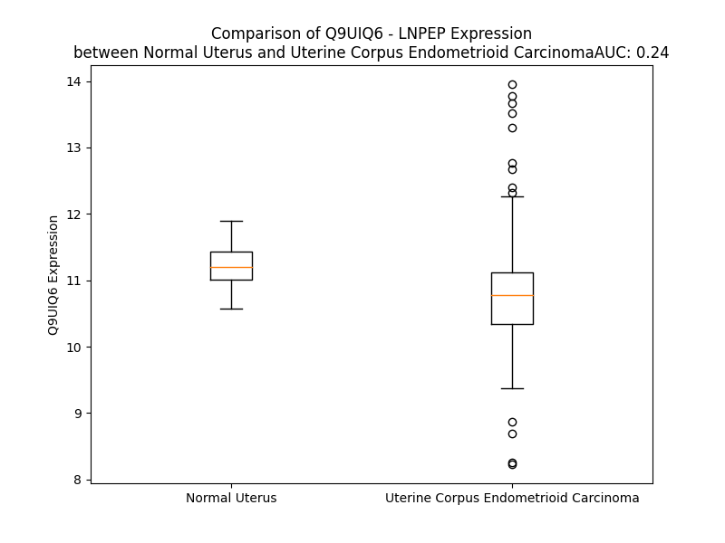

# Detailed Data for Q9UIQ6

## Introduction to the Detailed Summary

### How to Interpret the Results

- **Summary & Metrics**: This section provides a quick reference to essential protein attributes, including expression changes, family classification, and biomarker applications. Regulation status (upregulated/downregulated) indicates the protein's behavior in a disease context. Some information comes from the original excel file with the proteins selected from literature, while others are derived from the analyses.
- **Expression Comparison**: A visual representation comparing protein expression between normal and disease states. It highlights significant changes in expression levels that might indicate diagnostic or therapeutic relevance. This is data coming from transcriptomics experiments and could not translate similarly to protein levels.
- **Isoform Alignment**: An interactive view of isoform alignments, revealing structural and functional differences between variants of the protein.
- **Interactors & Homologs**: Tables listing known interaction partners and homologous proteins, the more interactors and homologs, the more complex the protein is to design an antibody for.
- **Biological Assemblies**: Information about the structural arrangement of the protein in different assemblies, providing insights into its functional state but also the complexity of the protein to develop antibodies.
- **Combined Per-Residue Information**: A detailed table summarizing residue-level data. This includes predictions for epitope regions, aggregation tendencies, and modifications that might impact the protein's function. Each row corresponds to a residue in the protein, providing insights into specific sites that may be important for research or drug development.
## Summary & Metrics

- **UniProt Accession**: Q9UIQ6
- **Gene Name**: LNPEP
- **Protein Name**: Leucyl-cystinyl aminopeptidase
- **Swiss Prot**: LCAP_HUMAN
- **Family**: peptidase
- **Biomarker Application**:  
- **Number of Isoforms**: 3
- **Regulation**: 2
- **(transcriptomics) AUC**: 0.24
- **(transcriptomics) Fold Change**: 1.04
- **(transcriptomics) Regulation**: Downregulated
- **Discotope Epitope Count**: 231
- **Max n_uniprots (Homo)**: 2.0
- **Max n_uniprots (Hetero)**: N/A

## Expression Comparison

## Isoform Alignment

<pre style='font-size:14px; font-family:monospace;'>Q9UIQ6-1 MEPFTNDRLQLPRNMIENSMFEEEPDVVDLAKEPCLHPLEPDEVEYEPRGSRLLVRGLGEHEMEEDEEDYESSAKLLGMSFMNRSSGLRNSATGYRQSPDGACSVPSARTMVVCAFVIVVAVSVIMVIYLLPRCTFTKEGCHKKNQSIGLIQPFATNGKLFPWAQIRLPTAVVPLRYELSLHPNLTSMTFRGSVTISVQALQVTWNIILHSTGHNISRVTFMSAVSSQEKQAEILEYAYHGQIAIVAPEALLAGHNYTLKIEYSANISSSYYGFYGFSYTDESNEKKYFAATQFEPLAARSAFPCFDEPAFKATFIIKIIRDEQYTALSNMPKKSSVVLDDGLVQDEFSESVKMSTYLVAFIVGEMKNLSQDVNGTLVSIYAVPEKIGQVHYALETTVKLLEFFQNYFEIQYPLKKLDLVAIPDFEAGAMENWGLLTFREETLLYDSNTSSMADRKLVTKIIAHELAHQWFGNLVTMKWWNDLWLNEGFATFMEYFSLEKIFKELSSYEDFLDARFKTMKKDSLNSSHPISSSVQSSEQIEEMFDSLSYFKGSSLLLMLKTYLSEDVFQHAVVLYLHNHSYASIQSDDLWDSFNEVTNQTLDVKRMMKTWTLQKGFPLVTVQKKGKELFIQQERFFLNMKPEIQPSDTSYLWHIPLSYVTEGRNYSKYQSVSLLDKKSGVINLTEEVLWVKVNINMNGYYIVHYADDDWEALIHQLKINPYVLSDKDRANLINNIFELAGLGKVPLKRAFDLINYLGNENHTAPITEALFQTDLIYNLLEKLGYMDLASRLVTRVFKLLQNQIQQQTWTDEGTPSMRELRSALLEFACTHNLGNCSTTAMKLFDDWMASNGTQSLPTDVMTTVFKVGAKTDKGWSFLLGKYISIGSEAEKNKILEALASSEDVRKLYWLMKSSLNGDNFRTQKLSFIIRTVGRHFPGHLLAWDFVKENWNKLVQKFPLGSYTIQNIVAGSTYLFSTKTHLSEVQAFFENQSEATFRLRCVQEALEVIQLNIQWMEKNLKSLTWWL
Q9UIQ6-2 --------------MIENSMFEEEPDVVDLAKEPCLHPLEPDEVEYEPRGSRLLVRGLGEHEMEEDEEDYESSAKLLGMSFMNRSSGLRNSATGYRQSPDGACSVPSARTMVVCAFVIVVAVSVIMVIYLLPRCTFTKEGCHKKNQSIGLIQPFATNGKLFPWAQIRLPTAVVPLRYELSLHPNLTSMTFRGSVTISVQALQVTWNIILHSTGHNISRVTFMSAVSSQEKQAEILEYAYHGQIAIVAPEALLAGHNYTLKIEYSANISSSYYGFYGFSYTDESNEKKYFAATQFEPLAARSAFPCFDEPAFKATFIIKIIRDEQYTALSNMPKKSSVVLDDGLVQDEFSESVKMSTYLVAFIVGEMKNLSQDVNGTLVSIYAVPEKIGQVHYALETTVKLLEFFQNYFEIQYPLKKLDLVAIPDFEAGAMENWGLLTFREETLLYDSNTSSMADRKLVTKIIAHELAHQWFGNLVTMKWWNDLWLNEGFATFMEYFSLEKIFKELSSYEDFLDARFKTMKKDSLNSSHPISSSVQSSEQIEEMFDSLSYFKGSSLLLMLKTYLSEDVFQHAVVLYLHNHSYASIQSDDLWDSFNEVTNQTLDVKRMMKTWTLQKGFPLVTVQKKGKELFIQQERFFLNMKPEIQPSDTSYLWHIPLSYVTEGRNYSKYQSVSLLDKKSGVINLTEEVLWVKVNINMNGYYIVHYADDDWEALIHQLKINPYVLSDKDRANLINNIFELAGLGKVPLKRAFDLINYLGNENHTAPITEALFQTDLIYNLLEKLGYMDLASRLVTRVFKLLQNQIQQQTWTDEGTPSMRELRSALLEFACTHNLGNCSTTAMKLFDDWMASNGTQSLPTDVMTTVFKVGAKTDKGWSFLLGKYISIGSEAEKNKILEALASSEDVRKLYWLMKSSLNGDNFRTQKLSFIIRTVGRHFPGHLLAWDFVKENWNKLVQKFPLGSYTIQNIVAGSTYLFSTKTHLSEVQAFFENQSEATFRLRCVQEALEVIQLNIQWMEKNLKSLTWWL
Q9UIQ6-3 -------------------MFEEEPDVVDLAKEPCLHPLEPDEVEYEPRGSRLLVRGLGEHEMEEDEEDYESSAKLLGMSFMNRSSGLRNSATGYRQSPDGACSVPSARTMVVCAFVIVVAVSVIMVIYLLPRCTFTKEGCHKKNQSIGLIQPFATNGKLFPWAQIRLPTAVVPLRYELSLHPNLTSMTFRGSVTISVQALQVTWNIILHSTGHNISRVTFMSAVSSQEKQAEILEYAYHGQIAIVAPEALLAGHNYTLKIEYSANISSSYYGFYGFSYTDESNEKKYFAATQFEPLAARSAFPCFDEPAFKATFIIKIIRDEQYTALSNMPKKSSVVLDDGLVQDEFSESVKMSTYLVAFIVGEMKNLSQDVNGTLVSIYAVPEKIGQVHYALETTVKLLEFFQNYFEIQYPLKKLDLVAIPDFEAGAMENWGLLTFREETLLYDSNTSSMADRKLVTKIIAHELAHQWFGNLVTMKWWNDLWLNEGFATFMEYFSLEKIFKELSSYEDFLDARFKTMKKDSLNSSHPISSSVQSSEQIEEMFDSLSYFKGSSLLLMLKTYLSEDVFQHAVVLYLHNHSYASIQSDDLWDSFNEVTNQTLDVKRMMKTWTLQKGFPLVTVQKKGKELFIQQERFFLNMKPEIQPSDTSYLWHIPLSYVTEGRNYSKYQSVSLLDKKSGVINLTEEVLWVKVNINMNGYYIVHYADDDWEALIHQLKINPYVLSDKDRANLINNIFELAGLGKVPLKRAFDLINYLGNENHTAPITEALFQTDLIYNLLEKLGYMDLASRLVTRVFKLLQNQIQQQTWTDEGTPSMRELRSALLEFACTHNLGNCSTTAMKLFDDWMASNGTQSLPTDVMTTVFKVGAKTDKGWSFLLGKYISIGSEAEKNKILEALASSEDVRKLYWLMKSSLNGDNFRTQKLSFIIRTVGRHFPGHLLAWDFVKENWNKLVQKFPLGSYTIQNIVAGSTYLFSTKTHLSEVQAFFENQSEATFRLRCVQEALEVIQLNIQWMEKNLKSLTWWL
</pre>

## Interactors

| preferredName_A   | preferredName_B   |   score |
|:------------------|:------------------|--------:|
| LNPEP             | TBC1D4            |   0.978 |
| LNPEP             | TNKS2             |   0.906 |

## Homologs

| uniprot_id   | gene_id   |
|:-------------|:----------|
| Q6P179       | ERAP2     |
| Q9UKU6       | TRHDE     |
| Q9H4A4       | RNPEP     |
| Q6Q4G3       | LVRN      |
| Q8N6M6       | AOPEP     |
| H0YLZ8       | ANPEP     |
| Q9HAU8       | RNPEPL1   |
| P09960       | LTA4H     |
| Q9NZ08       | ERAP1     |
| E9PP11       | NPEPPS    |
| Q07075       | ENPEP     |

## Biological Assemblies

|   Unnamed: 0 |   assembly |   n_uniprots | composition   | crystal_id   |
|-------------:|-----------:|-------------:|:--------------|:-------------|
|            0 |          1 |            1 | Homo          | 8cgw         |
|            1 |          2 |            1 | Homo          | 8cgw         |
|            0 |          1 |            1 | Homo          | 5jhq         |
|            1 |          2 |            1 | Homo          | 5jhq         |
|            2 |          3 |            1 | Homo          | 5jhq         |
|            3 |          4 |            1 | Homo          | 5jhq         |
|            0 |          1 |            1 | Homo          | 8cgp         |
|            1 |          2 |            1 | Homo          | 8cgp         |
|            0 |          1 |            2 | Homo          | 4pj6         |
|            0 |          1 |            2 | Homo          | 4p8q         |
|            0 |          1 |            1 | Homo          | 7zyf         |
|            1 |          2 |            1 | Homo          | 7zyf         |
|            0 |          1 |            1 | Homo          | 4z7i         |
|            1 |          2 |            1 | Homo          | 4z7i         |
|            0 |          1 |            1 | Homo          | 5mj6         |
|            1 |          2 |            1 | Homo          | 5mj6         |

## Combined Per-Residue Information

|   res | aa   |   epitope_score | epitope   |   relative_surface_accessibility |   modeling_confidence |   Aggregation | modification       | glycosylation                   |
|------:|:-----|----------------:|:----------|---------------------------------:|----------------------:|--------------:|:-------------------|:--------------------------------|
|     1 | M    |         0.1189  | True      |                          1.33855 |                 38.71 |         0     | N-acetylmethionine | N/A                             |
|     2 | E    |         0.12076 | True      |                          0.70869 |                 34    |         0     | N/A                | N/A                             |
|     3 | P    |         0.10856 | True      |                          0.98673 |                 56    |         0     | N/A                | N/A                             |
|     4 | F    |         0.16389 | True      |                          0.85677 |                 36.15 |         0     | N/A                | N/A                             |
|     5 | T    |         0.12839 | True      |                          0.8552  |                 39.21 |         0     | N/A                | N/A                             |
|     6 | N    |         0.19409 | True      |                          0.77094 |                 33.71 |         0     | N/A                | N/A                             |
|     7 | D    |         0.15468 | True      |                          0.71586 |                 33.33 |         0     | N/A                | N/A                             |
|     8 | R    |         0.2014  | True      |                          0.97999 |                 35.27 |         0     | N/A                | N/A                             |
|     9 | L    |         0.11933 | True      |                          1.07096 |                 28.91 |         0     | N/A                | N/A                             |
|    10 | Q    |         0.1357  | True      |                          0.89812 |                 32.28 |         0     | N/A                | N/A                             |
|    11 | L    |         0.12907 | True      |                          1.00811 |                 33.63 |         0     | N/A                | N/A                             |
|    12 | P    |         0.18396 | True      |                          0.89302 |                 35.59 |         0     | N/A                | N/A                             |
|    13 | R    |         0.19671 | True      |                          0.87635 |                 29.77 |         0     | N/A                | N/A                             |
|    14 | N    |         0.10676 | True      |                          0.90862 |                 30.03 |         0     | N/A                | N/A                             |
|    15 | M    |         0.15475 | True      |                          1.03893 |                 30.72 |         0     | N/A                | N/A                             |
|    16 | I    |         0.16372 | True      |                          0.94414 |                 32.15 |         0     | N/A                | N/A                             |
|    17 | E    |         0.142   | True      |                          0.80504 |                 28.73 |         0     | N/A                | N/A                             |
|    18 | N    |         0.20178 | True      |                          0.92403 |                 32.45 |         0     | N/A                | N/A                             |
|    19 | S    |         0.1701  | True      |                          0.77773 |                 32.02 |         0     | N/A                | N/A                             |
|    20 | M    |         0.16024 | True      |                          1.02534 |                 31.01 |         0     | N/A                | N/A                             |
|    21 | F    |         0.14286 | True      |                          1.05437 |                 31.47 |         0     | N/A                | N/A                             |
|    22 | E    |         0.15196 | True      |                          0.85018 |                 34.37 |         0     | N/A                | N/A                             |
|    23 | E    |         0.15294 | True      |                          0.94638 |                 34.19 |         0     | N/A                | N/A                             |
|    24 | E    |         0.09097 | False     |                          0.84289 |                 34.55 |         0     | N/A                | N/A                             |
|    25 | P    |         0.10188 | True      |                          0.94157 |                 36.73 |         0     | N/A                | N/A                             |
|    26 | D    |         0.11638 | True      |                          0.86707 |                 36.81 |         0     | N/A                | N/A                             |
|    27 | V    |         0.11738 | True      |                          0.87422 |                 35.13 |         0     | N/A                | N/A                             |
|    28 | V    |         0.13414 | True      |                          0.82717 |                 33.1  |         0     | N/A                | N/A                             |
|    29 | D    |         0.11902 | True      |                          0.90888 |                 32.93 |         0     | N/A                | N/A                             |
|    30 | L    |         0.13947 | True      |                          0.90117 |                 33.61 |         0     | N/A                | N/A                             |
|    31 | A    |         0.18604 | True      |                          0.80399 |                 32.33 |         0     | N/A                | N/A                             |
|    32 | K    |         0.14267 | True      |                          0.99445 |                 31.7  |         0     | N/A                | N/A                             |
|    33 | E    |         0.2335  | True      |                          0.81656 |                 31.05 |         0     | N/A                | N/A                             |
|    34 | P    |         0.1228  | True      |                          0.77235 |                 41.36 |         0     | N/A                | N/A                             |
|    35 | C    |         0.12071 | True      |                          0.84181 |                 26.89 |         0     | N/A                | N/A                             |
|    36 | L    |         0.12061 | True      |                          1.09715 |                 29.4  |         0     | N/A                | N/A                             |
|    37 | H    |         0.15888 | True      |                          0.94969 |                 28.05 |         0     | N/A                | N/A                             |
|    38 | P    |         0.13404 | True      |                          0.86391 |                 38.07 |         0     | N/A                | N/A                             |
|    39 | L    |         0.19684 | True      |                          1.05064 |                 33.89 |         0     | N/A                | N/A                             |
|    40 | E    |         0.09671 | False     |                          0.86771 |                 34.65 |         0     | N/A                | N/A                             |
|    41 | P    |         0.17001 | True      |                          0.87396 |                 35.78 |         0     | N/A                | N/A                             |
|    42 | D    |         0.16917 | True      |                          0.86875 |                 38.52 |         0     | N/A                | N/A                             |
|    43 | E    |         0.14534 | True      |                          0.91237 |                 37.87 |         0     | N/A                | N/A                             |
|    44 | V    |         0.09947 | True      |                          0.8901  |                 32.69 |         0     | N/A                | N/A                             |
|    45 | E    |         0.18232 | True      |                          0.84597 |                 33.97 |         0     | N/A                | N/A                             |
|    46 | Y    |         0.13981 | True      |                          0.8449  |                 27.79 |         0     | N/A                | N/A                             |
|    47 | E    |         0.16359 | True      |                          0.65285 |                 28.08 |         0     | N/A                | N/A                             |
|    48 | P    |         0.10485 | True      |                          0.98536 |                 36.66 |         0     | N/A                | N/A                             |
|    49 | R    |         0.18003 | True      |                          0.91615 |                 32.64 |         0     | N/A                | N/A                             |
|    50 | G    |         0.11618 | True      |                          0.93955 |                 31.58 |         0     | N/A                | N/A                             |
|    51 | S    |         0.09695 | False     |                          0.86121 |                 26.24 |         0     | N/A                | N/A                             |
|    52 | R    |         0.14072 | True      |                          0.93006 |                 33.35 |         0     | N/A                | N/A                             |
|    53 | L    |         0.11579 | True      |                          1.10283 |                 32.24 |         0     | N/A                | N/A                             |
|    54 | L    |         0.1576  | True      |                          1.02106 |                 33.82 |         0     | N/A                | N/A                             |
|    55 | V    |         0.12489 | True      |                          0.93224 |                 31.82 |         0     | N/A                | N/A                             |
|    56 | R    |         0.10733 | True      |                          0.936   |                 30.67 |         0     | N/A                | N/A                             |
|    57 | G    |         0.16828 | True      |                          0.8226  |                 31.23 |         0     | N/A                | N/A                             |
|    58 | L    |         0.16241 | True      |                          1.09688 |                 35.59 |         0     | N/A                | N/A                             |
|    59 | G    |         0.16135 | True      |                          0.80204 |                 32.67 |         0     | N/A                | N/A                             |
|    60 | E    |         0.14028 | True      |                          0.81313 |                 35.25 |         0     | N/A                | N/A                             |
|    61 | H    |         0.1278  | True      |                          0.9784  |                 37.91 |         0     | N/A                | N/A                             |
|    62 | E    |         0.19871 | True      |                          0.79824 |                 31.53 |         0     | N/A                | N/A                             |
|    63 | M    |         0.17177 | True      |                          0.83142 |                 33.94 |         0     | N/A                | N/A                             |
|    64 | E    |         0.14842 | True      |                          0.72028 |                 34.52 |         0     | N/A                | N/A                             |
|    65 | E    |         0.12876 | True      |                          0.83474 |                 34.51 |         0     | N/A                | N/A                             |
|    66 | D    |         0.22455 | True      |                          0.91604 |                 37.28 |         0     | N/A                | N/A                             |
|    67 | E    |         0.15651 | True      |                          0.82122 |                 35.21 |         0     | N/A                | N/A                             |
|    68 | E    |         0.15521 | True      |                          0.77387 |                 34.47 |         0     | N/A                | N/A                             |
|    69 | D    |         0.17872 | True      |                          0.91332 |                 34.9  |         0     | N/A                | N/A                             |
|    70 | Y    |         0.13435 | True      |                          0.82069 |                 36.23 |         0     | Phosphotyrosine    | N/A                             |
|    71 | E    |         0.15679 | True      |                          0.78544 |                 32.61 |         0     | N/A                | N/A                             |
|    72 | S    |         0.14419 | True      |                          0.75318 |                 28.72 |         0     | N/A                | N/A                             |
|    73 | S    |         0.11614 | True      |                          0.89272 |                 27.29 |         0     | N/A                | N/A                             |
|    74 | A    |         0.16656 | True      |                          1.03868 |                 33.16 |         0     | N/A                | N/A                             |
|    75 | K    |         0.16245 | True      |                          0.99389 |                 34.01 |         0     | N/A                | N/A                             |
|    76 | L    |         0.17239 | True      |                          0.88027 |                 30.82 |         0     | N/A                | N/A                             |
|    77 | L    |         0.17735 | True      |                          1.02964 |                 33.63 |         0     | N/A                | N/A                             |
|    78 | G    |         0.15285 | True      |                          0.90412 |                 28.99 |         0     | N/A                | N/A                             |
|    79 | M    |         0.14971 | True      |                          0.99038 |                 31.04 |         0     | N/A                | N/A                             |
|    80 | S    |         0.13916 | True      |                          0.86911 |                 33.15 |         0     | Phosphoserine      | N/A                             |
|    81 | F    |         0.13005 | True      |                          1.02357 |                 31.94 |         0     | N/A                | N/A                             |
|    82 | M    |         0.19129 | True      |                          0.90418 |                 35.28 |         0     | N/A                | N/A                             |
|    83 | N    |         0.10287 | True      |                          0.8231  |                 32.25 |         0     | N/A                | N/A                             |
|    84 | R    |         0.20057 | True      |                          0.85364 |                 33.88 |         0     | N/A                | N/A                             |
|    85 | S    |         0.05337 | False     |                          0.80739 |                 32.36 |         0     | N/A                | N/A                             |
|    86 | S    |         0.14276 | True      |                          0.87185 |                 33.94 |         0     | N/A                | N/A                             |
|    87 | G    |         0.15217 | True      |                          0.8224  |                 32.75 |         0     | N/A                | N/A                             |
|    88 | L    |         0.11364 | True      |                          0.98314 |                 35.48 |         0     | N/A                | N/A                             |
|    89 | R    |         0.13454 | True      |                          0.81943 |                 34.12 |         0     | N/A                | N/A                             |
|    90 | N    |         0.15345 | True      |                          0.86462 |                 32.36 |         0     | N/A                | N/A                             |
|    91 | S    |         0.15783 | True      |                          0.82035 |                 34.78 |         0     | Phosphoserine      | N/A                             |
|    92 | A    |         0.14961 | True      |                          0.76645 |                 33.19 |         0     | N/A                | N/A                             |
|    93 | T    |         0.10213 | True      |                          0.99527 |                 33.25 |         0     | N/A                | N/A                             |
|    94 | G    |         0.13213 | True      |                          0.77127 |                 30.36 |         0     | N/A                | N/A                             |
|    95 | Y    |         0.13196 | True      |                          0.96078 |                 34    |         0     | N/A                | N/A                             |
|    96 | R    |         0.18799 | True      |                          0.81766 |                 32.01 |         0     | N/A                | N/A                             |
|    97 | Q    |         0.14644 | True      |                          0.73126 |                 34.43 |         0     | N/A                | N/A                             |
|    98 | S    |         0.15086 | True      |                          0.76044 |                 32.5  |         0     | N/A                | N/A                             |
|    99 | P    |         0.17539 | True      |                          0.85152 |                 46.34 |         0     | N/A                | N/A                             |
|   100 | D    |         0.22956 | True      |                          0.89732 |                 38.28 |         0     | N/A                | N/A                             |
|   101 | G    |         0.22029 | True      |                          0.91313 |                 38.64 |         0     | N/A                | N/A                             |
|   102 | A    |         0.20836 | True      |                          1.07956 |                 33.3  |         0     | N/A                | N/A                             |
|   103 | C    |         0.14894 | True      |                          0.86465 |                 41.53 |         0     | N/A                | N/A                             |
|   104 | S    |         0.2165  | True      |                          0.88733 |                 46.93 |         0     | N/A                | N/A                             |
|   105 | V    |         0.16239 | True      |                          0.94966 |                 51.42 |         0     | N/A                | N/A                             |
|   106 | P    |         0.11366 | True      |                          0.52042 |                 56.03 |         0     | N/A                | N/A                             |
|   107 | S    |         0.17168 | True      |                          0.49681 |                 72.8  |         0     | N/A                | N/A                             |
|   108 | A    |         0.14557 | True      |                          0.77578 |                 68.72 |         0     | N/A                | N/A                             |
|   109 | R    |         0.17471 | True      |                          0.82035 |                 72.32 |         0     | N/A                | N/A                             |
|   110 | T    |         0.07477 | False     |                          0.4543  |                 73.74 |         0.3   | N/A                | N/A                             |
|   111 | M    |         0.07848 | False     |                          0.64484 |                 75.45 |         5.516 | N/A                | N/A                             |
|   112 | V    |         0.06283 | False     |                          0.73193 |                 81.19 |        55.516 | N/A                | N/A                             |
|   113 | V    |         0.09706 | False     |                          0.63313 |                 83.87 |        77.324 | N/A                | N/A                             |
|   114 | C    |         0.07719 | False     |                          0.49945 |                 80.17 |        79.197 | N/A                | N/A                             |
|   115 | A    |         0.05193 | False     |                          0.51424 |                 84.77 |        88.259 | N/A                | N/A                             |
|   116 | F    |         0.07466 | False     |                          0.68639 |                 88.95 |        98.977 | N/A                | N/A                             |
|   117 | V    |         0.09306 | False     |                          0.62187 |                 88.98 |        99.912 | N/A                | N/A                             |
|   118 | I    |         0.05791 | False     |                          0.64637 |                 89.53 |        99.992 | N/A                | N/A                             |
|   119 | V    |         0.05135 | False     |                          0.6638  |                 91.51 |        99.999 | N/A                | N/A                             |
|   120 | V    |         0.05799 | False     |                          0.47128 |                 90.09 |       100     | N/A                | N/A                             |
|   121 | A    |         0.05352 | False     |                          0.43007 |                 88.83 |        99.999 | N/A                | N/A                             |
|   122 | V    |         0.05108 | False     |                          0.53767 |                 88.59 |        99.998 | N/A                | N/A                             |
|   123 | S    |         0.04485 | False     |                          0.41497 |                 83.46 |        99.99  | N/A                | N/A                             |
|   124 | V    |         0.03756 | False     |                          0.53982 |                 83.3  |        99.989 | N/A                | N/A                             |
|   125 | I    |         0.04647 | False     |                          0.64376 |                 82.16 |        99.976 | N/A                | N/A                             |
|   126 | M    |         0.08179 | False     |                          0.6045  |                 77.57 |        99.837 | N/A                | N/A                             |
|   127 | V    |         0.03227 | False     |                          0.61123 |                 75.28 |        99.679 | N/A                | N/A                             |
|   128 | I    |         0.09641 | False     |                          0.72735 |                 76.28 |        97.815 | N/A                | N/A                             |
|   129 | Y    |         0.12049 | True      |                          0.86691 |                 69.93 |        80.252 | N/A                | N/A                             |
|   130 | L    |         0.07217 | False     |                          0.80347 |                 62.19 |        35.939 | N/A                | N/A                             |
|   131 | L    |         0.11993 | True      |                          0.7089  |                 47.91 |         0.629 | N/A                | N/A                             |
|   132 | P    |         0.08881 | False     |                          0.73503 |                 44.83 |         0.333 | N/A                | N/A                             |
|   133 | R    |         0.13341 | True      |                          0.99612 |                 36.5  |         0     | N/A                | N/A                             |
|   134 | C    |         0.10215 | True      |                          0.69496 |                 33.38 |         0     | N/A                | N/A                             |
|   135 | T    |         0.12877 | True      |                          0.90191 |                 39.97 |         0     | N/A                | N/A                             |
|   136 | F    |         0.13146 | True      |                          1.01195 |                 35.47 |         0     | N/A                | N/A                             |
|   137 | T    |         0.14556 | True      |                          0.72242 |                 39.82 |         0     | N/A                | N/A                             |
|   138 | K    |         0.2091  | True      |                          1.05405 |                 39.07 |         0     | N/A                | N/A                             |
|   139 | E    |         0.19907 | True      |                          0.77658 |                 32.67 |         0     | N/A                | N/A                             |
|   140 | G    |         0.16907 | True      |                          0.79087 |                 33.24 |         0     | N/A                | N/A                             |
|   141 | C    |         0.08199 | False     |                          0.91902 |                 29.51 |         0     | N/A                | N/A                             |
|   142 | H    |         0.10144 | True      |                          0.94906 |                 32.27 |         0     | N/A                | N/A                             |
|   143 | K    |         0.1195  | True      |                          0.87275 |                 34.22 |         0     | N/A                | N/A                             |
|   144 | K    |         0.07629 | False     |                          0.92166 |                 33.58 |         0     | N/A                | N/A                             |
|   145 | N    |         0.06333 | False     |                          0.74882 |                 32.11 |         0     | N/A                | N-linked (GlcNAc...) asparagine |
|   146 | Q    |         0.12776 | True      |                          0.8937  |                 36.14 |         0     | N/A                | N/A                             |
|   147 | S    |         0.11282 | True      |                          0.6428  |                 32.21 |         0.452 | N/A                | N/A                             |
|   148 | I    |         0.1847  | True      |                          1.01121 |                 36.26 |         0.452 | N/A                | N/A                             |
|   149 | G    |         0.10264 | True      |                          0.57678 |                 34.61 |         0.452 | N/A                | N/A                             |
|   150 | L    |         0.17174 | True      |                          1.03605 |                 44.83 |         0.452 | N/A                | N/A                             |
|   151 | I    |         0.14763 | True      |                          0.80164 |                 56.06 |         0.452 | N/A                | N/A                             |
|   152 | Q    |         0.08137 | False     |                          0.56082 |                 70.58 |         0     | N/A                | N/A                             |
|   153 | P    |         0.07683 | False     |                          0.16203 |                 86.15 |         0     | N/A                | N/A                             |
|   154 | F    |         0.10212 | True      |                          0.52275 |                 89.57 |         0     | N/A                | N/A                             |
|   155 | A    |         0.06324 | False     |                          0.05232 |                 89.51 |         0     | N/A                | N/A                             |
|   156 | T    |         0.15717 | True      |                          0.68862 |                 88.15 |         0     | N/A                | N/A                             |
|   157 | N    |         0.18792 | True      |                          0.54812 |                 89.34 |         0     | N/A                | N/A                             |
|   158 | G    |         0.14371 | True      |                          0.62368 |                 89.72 |         0     | N/A                | N/A                             |
|   159 | K    |         0.22774 | True      |                          0.51648 |                 92.74 |         0     | N/A                | N/A                             |
|   160 | L    |         0.12285 | True      |                          0.57261 |                 94.43 |         0     | N/A                | N/A                             |
|   161 | F    |         0.03685 | False     |                          0.01573 |                 97.07 |         0     | N/A                | N/A                             |
|   162 | P    |         0.12893 | True      |                          0.36923 |                 96.64 |         0     | N/A                | N/A                             |
|   163 | W    |         0.09581 | False     |                          0.33445 |                 96.99 |         0     | N/A                | N/A                             |
|   164 | A    |         0.13659 | True      |                          0.5922  |                 94.12 |         0     | N/A                | N/A                             |
|   165 | Q    |         0.18737 | True      |                          0.55399 |                 95.38 |         0     | N/A                | N/A                             |
|   166 | I    |         0.07739 | False     |                          0.28414 |                 93.62 |         0     | N/A                | N/A                             |
|   167 | R    |         0.10632 | True      |                          0.37015 |                 97.64 |         0     | N/A                | N/A                             |
|   168 | L    |         0.02633 | False     |                          0.04997 |                 98.35 |         0     | N/A                | N/A                             |
|   169 | P    |         0.04031 | False     |                          0.18079 |                 98.38 |         0     | N/A                | N/A                             |
|   170 | T    |         0.1343  | True      |                          0.66202 |                 98.11 |         0     | N/A                | N/A                             |
|   171 | A    |         0.03777 | False     |                          0.14049 |                 98.31 |         0     | N/A                | N/A                             |
|   172 | V    |         0.00811 | False     |                          0.03686 |                 98.66 |         0     | N/A                | N/A                             |
|   173 | V    |         0.0676  | False     |                          0.24278 |                 98.66 |         0     | N/A                | N/A                             |
|   174 | P    |         0.01118 | False     |                          0.03804 |                 98.81 |         0     | N/A                | N/A                             |
|   175 | L    |         0.04092 | False     |                          0.42913 |                 98.69 |         0     | N/A                | N/A                             |
|   176 | R    |         0.03658 | False     |                          0.29429 |                 98.92 |         0     | N/A                | N/A                             |
|   177 | Y    |         0.00171 | False     |                          0.00061 |                 98.92 |         0     | N/A                | N/A                             |
|   178 | E    |         0.0357  | False     |                          0.24591 |                 98.89 |         0     | N/A                | N/A                             |
|   179 | L    |         0.00277 | False     |                          0       |                 98.89 |         0     | N/A                | N/A                             |
|   180 | S    |         0.05715 | False     |                          0.25043 |                 98.83 |         0     | N/A                | N/A                             |
|   181 | L    |         0.00448 | False     |                          0.00538 |                 98.84 |         0     | N/A                | N/A                             |
|   182 | H    |         0.04732 | False     |                          0.36417 |                 98.52 |         0     | N/A                | N/A                             |
|   183 | P    |         0.01249 | False     |                          0.04141 |                 98.56 |         0     | N/A                | N/A                             |
|   184 | N    |         0.03506 | False     |                          0.39609 |                 98.11 |         0     | N/A                | N-linked (GlcNAc...) asparagine |
|   185 | L    |         0.01268 | False     |                          0.02864 |                 98    |         0     | N/A                | N/A                             |
|   186 | T    |         0.05601 | False     |                          0.75178 |                 95.01 |         0     | N/A                | N/A                             |
|   187 | S    |         0.12061 | True      |                          0.5079  |                 97.42 |         0     | N/A                | N/A                             |
|   188 | M    |         0.03978 | False     |                          0.28769 |                 97.83 |         0     | N/A                | N/A                             |
|   189 | T    |         0.07709 | False     |                          0.38875 |                 98.61 |         0     | N/A                | N/A                             |
|   190 | F    |         0.01718 | False     |                          0.0188  |                 98.77 |         0     | N/A                | N/A                             |
|   191 | R    |         0.09015 | False     |                          0.68355 |                 98.76 |         0     | N/A                | N/A                             |
|   192 | G    |         0.01766 | False     |                          0.08861 |                 98.72 |         0.056 | N/A                | N/A                             |
|   193 | S    |         0.01988 | False     |                          0.23247 |                 98.81 |         0.96  | N/A                | N/A                             |
|   194 | V    |         0.00273 | False     |                          0       |                 98.88 |        22.885 | N/A                | N/A                             |
|   195 | T    |         0.02485 | False     |                          0.20401 |                 98.83 |        24.258 | N/A                | N/A                             |
|   196 | I    |         0.00226 | False     |                          0       |                 98.81 |        26.717 | N/A                | N/A                             |
|   197 | S    |         0.04147 | False     |                          0.18988 |                 98.63 |        26.895 | N/A                | N/A                             |
|   198 | V    |         0.00386 | False     |                          0.00082 |                 98.61 |        28.657 | N/A                | N/A                             |
|   199 | Q    |         0.06246 | False     |                          0.24779 |                 98.53 |        24.816 | N/A                | N/A                             |
|   200 | A    |         0.00392 | False     |                          0       |                 98.5  |        28.552 | N/A                | N/A                             |
|   201 | L    |         0.12191 | True      |                          0.54946 |                 98.21 |        33.15  | N/A                | N/A                             |
|   202 | Q    |         0.08928 | False     |                          0.52471 |                 97.73 |        33.407 | N/A                | N/A                             |
|   203 | V    |         0.16276 | True      |                          0.70391 |                 98.3  |        54.927 | N/A                | N/A                             |
|   204 | T    |         0.07497 | False     |                          0.1609  |                 98.31 |        56.51  | N/A                | N/A                             |
|   205 | W    |         0.16276 | True      |                          0.63469 |                 97.87 |        58.947 | N/A                | N/A                             |
|   206 | N    |         0.06212 | False     |                          0.24372 |                 97.93 |        58     | N/A                | N/A                             |
|   207 | I    |         0.00223 | False     |                          0.0024  |                 98.47 |        58     | N/A                | N/A                             |
|   208 | I    |         0.02122 | False     |                          0.03913 |                 98.64 |        57.354 | N/A                | N/A                             |
|   209 | L    |         0.002   | False     |                          0       |                 98.26 |        48.958 | N/A                | N/A                             |
|   210 | H    |         0.02404 | False     |                          0.02536 |                 98.86 |         0.233 | N/A                | N/A                             |
|   211 | S    |         0.04078 | False     |                          0.07898 |                 98.66 |         0     | N/A                | N/A                             |
|   212 | T    |         0.09263 | False     |                          0.32044 |                 97.56 |         0     | N/A                | N/A                             |
|   213 | G    |         0.11883 | True      |                          0.87879 |                 96.25 |         0     | N/A                | N/A                             |
|   214 | H    |         0.04057 | False     |                          0.10137 |                 98.49 |         0     | N/A                | N/A                             |
|   215 | N    |         0.08842 | False     |                          0.66547 |                 98.29 |         0     | N/A                | N-linked (GlcNAc...) asparagine |
|   216 | I    |         0.08884 | False     |                          0.18111 |                 98.14 |         0     | N/A                | N/A                             |
|   217 | S    |         0.17548 | True      |                          0.65187 |                 96.98 |         0     | N/A                | N/A                             |
|   218 | R    |         0.17181 | True      |                          0.47748 |                 97.86 |         0     | N/A                | N/A                             |
|   219 | V    |         0.03928 | False     |                          0.06599 |                 98.23 |         3.686 | N/A                | N/A                             |
|   220 | T    |         0.0473  | False     |                          0.09234 |                 97.06 |         3.905 | N/A                | N/A                             |
|   221 | F    |         0.00908 | False     |                          0.00132 |                 96.19 |         5.044 | N/A                | N/A                             |
|   222 | M    |         0.1252  | True      |                          0.31517 |                 95.42 |         5.044 | N/A                | N/A                             |
|   223 | S    |         0.0566  | False     |                          0.0908  |                 93.5  |         5.044 | N/A                | N/A                             |
|   224 | A    |         0.16987 | True      |                          0.56347 |                 89.55 |         4.781 | N/A                | N/A                             |
|   225 | V    |         0.13586 | True      |                          0.85617 |                 88.3  |         4.561 | N/A                | N/A                             |
|   226 | S    |         0.18576 | True      |                          0.47684 |                 87.67 |         0.743 | N/A                | N/A                             |
|   227 | S    |         0.17799 | True      |                          0.6336  |                 86.46 |         0.297 | N/A                | N/A                             |
|   228 | Q    |         0.12197 | True      |                          0.55169 |                 89.04 |         0     | N/A                | N/A                             |
|   229 | E    |         0.15782 | True      |                          0.55679 |                 92.91 |         0     | N/A                | N/A                             |
|   230 | K    |         0.09839 | False     |                          0.2506  |                 94.95 |         0     | N/A                | N/A                             |
|   231 | Q    |         0.14006 | True      |                          0.71344 |                 95.47 |         0     | N/A                | N/A                             |
|   232 | A    |         0.03369 | False     |                          0.14948 |                 95.71 |         0     | N/A                | N/A                             |
|   233 | E    |         0.12973 | True      |                          0.36924 |                 95.99 |         0     | N/A                | N/A                             |
|   234 | I    |         0.08607 | False     |                          0.25096 |                 97.14 |         0     | N/A                | N/A                             |
|   235 | L    |         0.0443  | False     |                          0.05853 |                 97.48 |         0     | N/A                | N/A                             |
|   236 | E    |         0.0779  | False     |                          0.32471 |                 97.43 |         0     | N/A                | N/A                             |
|   237 | Y    |         0.10223 | True      |                          0.18014 |                 96.68 |         0     | N/A                | N/A                             |
|   238 | A    |         0.1976  | True      |                          0.73852 |                 93.71 |         0     | N/A                | N/A                             |
|   239 | Y    |         0.26325 | True      |                          0.8097  |                 91.81 |         0     | N/A                | N/A                             |
|   240 | H    |         0.19838 | True      |                          0.13597 |                 95.42 |         0     | N/A                | N/A                             |
|   241 | G    |         0.06047 | False     |                          0.0665  |                 96.62 |         0.227 | N/A                | N/A                             |
|   242 | Q    |         0.0107  | False     |                          0.00454 |                 98.44 |         2.694 | N/A                | N/A                             |
|   243 | I    |         0.03454 | False     |                          0.0168  |                 98.53 |         3.03  | N/A                | N/A                             |
|   244 | A    |         0.00288 | False     |                          0       |                 98.46 |         3.03  | N/A                | N/A                             |
|   245 | I    |         0.00283 | False     |                          0       |                 98.33 |         3.03  | N/A                | N/A                             |
|   246 | V    |         0.03396 | False     |                          0.33766 |                 97.19 |         3.03  | N/A                | N/A                             |
|   247 | A    |         0.02107 | False     |                          0.04242 |                 95.55 |         0.336 | N/A                | N/A                             |
|   248 | P    |         0.14832 | True      |                          0.47656 |                 93.25 |         0.186 | N/A                | N/A                             |
|   249 | E    |         0.19421 | True      |                          0.30798 |                 92.31 |         0     | N/A                | N/A                             |
|   250 | A    |         0.09782 | False     |                          0.25025 |                 95.81 |         0     | N/A                | N/A                             |
|   251 | L    |         0.00608 | False     |                          0.00082 |                 97.19 |         0     | N/A                | N/A                             |
|   252 | L    |         0.07922 | False     |                          0.50038 |                 97.24 |         0     | N/A                | N/A                             |
|   253 | A    |         0.12404 | True      |                          0.52821 |                 97.56 |         0     | N/A                | N/A                             |
|   254 | G    |         0.14138 | True      |                          0.64554 |                 96.48 |         0     | N/A                | N/A                             |
|   255 | H    |         0.1352  | True      |                          0.36953 |                 97.32 |         0     | N/A                | N/A                             |
|   256 | N    |         0.10707 | True      |                          0.40904 |                 97.87 |         0     | N/A                | N-linked (GlcNAc...) asparagine |
|   257 | Y    |         0.04988 | False     |                          0.03344 |                 98.04 |         0     | N/A                | N/A                             |
|   258 | T    |         0.03409 | False     |                          0.20159 |                 98.24 |         0     | N/A                | N/A                             |
|   259 | L    |         0.00215 | False     |                          0       |                 98.22 |         0     | N/A                | N/A                             |
|   260 | K    |         0.04995 | False     |                          0.30931 |                 98.63 |         0     | N/A                | N/A                             |
|   261 | I    |         0.00334 | False     |                          0       |                 98.75 |         0     | N/A                | N/A                             |
|   262 | E    |         0.05107 | False     |                          0.171   |                 98.8  |         0     | N/A                | N/A                             |
|   263 | Y    |         0.03379 | False     |                          0.02315 |                 98.82 |         0     | N/A                | N/A                             |
|   264 | S    |         0.05482 | False     |                          0.27374 |                 98.75 |         0     | N/A                | N/A                             |
|   265 | A    |         0.0153  | False     |                          0.12296 |                 98.59 |         0     | N/A                | N/A                             |
|   266 | N    |         0.062   | False     |                          0.71978 |                 98.47 |         0     | N/A                | N-linked (GlcNAc...) asparagine |
|   267 | I    |         0.01496 | False     |                          0.04612 |                 98.53 |         0     | N/A                | N/A                             |
|   268 | S    |         0.03557 | False     |                          0.23444 |                 97.46 |         0     | N/A                | N/A                             |
|   269 | S    |         0.09531 | False     |                          0.85683 |                 94.12 |         0     | N/A                | N/A                             |
|   270 | S    |         0.098   | False     |                          0.23152 |                 93.38 |         0.647 | N/A                | N/A                             |
|   271 | Y    |         0.04032 | False     |                          0.07681 |                 96.28 |         6.838 | N/A                | N/A                             |
|   272 | Y    |         0.10735 | True      |                          0.22824 |                 93.54 |         7.749 | N/A                | N/A                             |
|   273 | G    |         0.00609 | False     |                          0.00322 |                 97.91 |         7.979 | N/A                | N/A                             |
|   274 | F    |         0.00963 | False     |                          0.01446 |                 98.78 |         8.697 | N/A                | N/A                             |
|   275 | Y    |         0.01795 | False     |                          0.01238 |                 98.62 |         8.697 | N/A                | N/A                             |
|   276 | G    |         0.02752 | False     |                          0.12967 |                 97.76 |         5.895 | N/A                | N/A                             |
|   277 | F    |         0.04007 | False     |                          0.11392 |                 97.32 |         5.671 | N/A                | N/A                             |
|   278 | S    |         0.12656 | True      |                          0.38539 |                 95.22 |         1.592 | N/A                | N/A                             |
|   279 | Y    |         0.08978 | False     |                          0.07813 |                 93.37 |         0.932 | N/A                | N/A                             |
|   280 | T    |         0.11812 | True      |                          0.60016 |                 90.24 |         0     | N/A                | N/A                             |
|   281 | D    |         0.03176 | False     |                          0.1721  |                 89.94 |         0     | N/A                | N/A                             |
|   282 | E    |         0.16333 | True      |                          0.72034 |                 88.81 |         0     | N/A                | N/A                             |
|   283 | S    |         0.10553 | True      |                          0.66137 |                 90.75 |         0     | N/A                | N/A                             |
|   284 | N    |         0.19268 | True      |                          0.8057  |                 90.39 |         0     | N/A                | N/A                             |
|   285 | E    |         0.09731 | False     |                          0.48562 |                 94.19 |         0     | N/A                | N/A                             |
|   286 | K    |         0.14651 | True      |                          0.60164 |                 94.83 |         0     | N/A                | N/A                             |
|   287 | K    |         0.06002 | False     |                          0.18964 |                 97.26 |         0     | N/A                | N/A                             |
|   288 | Y    |         0.03687 | False     |                          0.20963 |                 98.07 |         0.642 | N/A                | N/A                             |
|   289 | F    |         0.00607 | False     |                          0.00318 |                 98.72 |         1.04  | N/A                | N/A                             |
|   290 | A    |         0.00086 | False     |                          0       |                 98.81 |         1.04  | N/A                | N/A                             |
|   291 | A    |         0.00159 | False     |                          0       |                 98.82 |         1.04  | N/A                | N/A                             |
|   292 | T    |         0.00598 | False     |                          0.00651 |                 98.87 |         1.04  | N/A                | N/A                             |
|   293 | Q    |         0.04226 | False     |                          0.06769 |                 98.5  |         0.899 | N/A                | N/A                             |
|   294 | F    |         0.00319 | False     |                          0.00304 |                 98.77 |         0.899 | N/A                | N/A                             |
|   295 | E    |         0.13796 | True      |                          0.07676 |                 98.51 |         0     | N/A                | N/A                             |
|   296 | P    |         0.07621 | False     |                          0.03739 |                 98.01 |         0     | N/A                | N/A                             |
|   297 | L    |         0.08023 | False     |                          0.15584 |                 98.22 |         0     | N/A                | N/A                             |
|   298 | A    |         0.01939 | False     |                          0.08035 |                 98.45 |         0     | N/A                | N/A                             |
|   299 | A    |         0.0013  | False     |                          0       |                 98.82 |         0     | N/A                | N/A                             |
|   300 | R    |         0.03609 | False     |                          0.09068 |                 98.71 |         0     | N/A                | N/A                             |
|   301 | S    |         0.12736 | True      |                          0.29787 |                 98.46 |         0     | N/A                | N/A                             |
|   302 | A    |         0.00153 | False     |                          0.00128 |                 98.78 |         0     | N/A                | N/A                             |
|   303 | F    |         0.00161 | False     |                          0       |                 98.87 |         0     | N/A                | N/A                             |
|   304 | P    |         0.00168 | False     |                          0       |                 98.85 |         0     | N/A                | N/A                             |
|   305 | C    |         0.00405 | False     |                          0       |                 98.92 |         0     | N/A                | N/A                             |
|   306 | F    |         0.00884 | False     |                          0.00892 |                 98.89 |         0     | N/A                | N/A                             |
|   307 | D    |         0.01597 | False     |                          0.01725 |                 98.82 |         0     | N/A                | N/A                             |
|   308 | E    |         0.03142 | False     |                          0.01682 |                 98.8  |         0     | N/A                | N/A                             |
|   309 | P    |         0.01926 | False     |                          0.00952 |                 98.74 |         0     | N/A                | N/A                             |
|   310 | A    |         0.06192 | False     |                          0.36195 |                 98.53 |         0     | N/A                | N/A                             |
|   311 | F    |         0.03116 | False     |                          0.08659 |                 98.77 |         0     | N/A                | N/A                             |
|   312 | K    |         0.03049 | False     |                          0.07166 |                 98.85 |         0     | N/A                | N/A                             |
|   313 | A    |         0.00202 | False     |                          0       |                 98.86 |         5.811 | N/A                | N/A                             |
|   314 | T    |         0.03715 | False     |                          0.21156 |                 98.93 |         5.811 | N/A                | N/A                             |
|   315 | F    |         0.00545 | False     |                          0.00914 |                 98.94 |         5.811 | N/A                | N/A                             |
|   316 | I    |         0.08884 | False     |                          0.17199 |                 98.94 |         5.811 | N/A                | N/A                             |
|   317 | I    |         0.01294 | False     |                          0.03269 |                 98.94 |         5.811 | N/A                | N/A                             |
|   318 | K    |         0.03816 | False     |                          0.19611 |                 98.92 |         0     | N/A                | N/A                             |
|   319 | I    |         0.00144 | False     |                          0.0016  |                 98.9  |         0     | N/A                | N/A                             |
|   320 | I    |         0.02609 | False     |                          0.14959 |                 98.75 |         0     | N/A                | N/A                             |
|   321 | R    |         0.03591 | False     |                          0.08278 |                 98.52 |         0     | N/A                | N/A                             |
|   322 | D    |         0.05264 | False     |                          0.3224  |                 97.93 |         0     | N/A                | N/A                             |
|   323 | E    |         0.0962  | False     |                          0.70793 |                 96.96 |         0     | N/A                | N/A                             |
|   324 | Q    |         0.1018  | True      |                          0.60145 |                 96.13 |         0     | N/A                | N/A                             |
|   325 | Y    |         0.02214 | False     |                          0.06291 |                 98.43 |         0     | N/A                | N/A                             |
|   326 | T    |         0.05463 | False     |                          0.31356 |                 98.61 |         0     | N/A                | N/A                             |
|   327 | A    |         0.0108  | False     |                          0.04349 |                 98.85 |         0     | N/A                | N/A                             |
|   328 | L    |         0.00781 | False     |                          0.0676  |                 98.92 |         0     | N/A                | N/A                             |
|   329 | S    |         0.003   | False     |                          0.00395 |                 98.91 |         0     | N/A                | N/A                             |
|   330 | N    |         0.01794 | False     |                          0.01483 |                 98.89 |         0     | N/A                | N/A                             |
|   331 | M    |         0.02208 | False     |                          0.12053 |                 98.85 |         0     | N/A                | N/A                             |
|   332 | P    |         0.04498 | False     |                          0.27933 |                 98.67 |         0     | N/A                | N/A                             |
|   333 | K    |         0.08132 | False     |                          0.4863  |                 98.68 |         0     | N/A                | N/A                             |
|   334 | K    |         0.09795 | False     |                          0.67472 |                 98.5  |         0     | N/A                | N/A                             |
|   335 | S    |         0.13892 | True      |                          0.35525 |                 98.35 |         5.122 | N/A                | N/A                             |
|   336 | S    |         0.05619 | False     |                          0.45587 |                 98.5  |         5.122 | N/A                | N/A                             |
|   337 | V    |         0.08152 | False     |                          0.54744 |                 98.32 |         5.122 | N/A                | N/A                             |
|   338 | V    |         0.17715 | True      |                          0.7977  |                 97.63 |         5.122 | N/A                | N/A                             |
|   339 | L    |         0.11231 | True      |                          0.34879 |                 96.6  |         5.122 | N/A                | N/A                             |
|   340 | D    |         0.15769 | True      |                          1.02377 |                 91.05 |         0     | N/A                | N/A                             |
|   341 | D    |         0.14092 | True      |                          0.63636 |                 92.28 |         0     | N/A                | N/A                             |
|   342 | G    |         0.09571 | False     |                          0.51819 |                 93.4  |         0     | N/A                | N/A                             |
|   343 | L    |         0.08128 | False     |                          0.17888 |                 97.76 |         0     | N/A                | N/A                             |
|   344 | V    |         0.06402 | False     |                          0.07331 |                 98.57 |         0     | N/A                | N/A                             |
|   345 | Q    |         0.06956 | False     |                          0.24538 |                 98.64 |         0     | N/A                | N/A                             |
|   346 | D    |         0.00222 | False     |                          0.00189 |                 98.79 |         0     | N/A                | N/A                             |
|   347 | E    |         0.01923 | False     |                          0.1714  |                 98.86 |         0     | N/A                | N/A                             |
|   348 | F    |         0.0075  | False     |                          0.01644 |                 98.89 |         0.002 | N/A                | N/A                             |
|   349 | S    |         0.04008 | False     |                          0.25297 |                 98.74 |         0.002 | N/A                | N/A                             |
|   350 | E    |         0.09736 | False     |                          0.42001 |                 98.83 |         0.012 | N/A                | N/A                             |
|   351 | S    |         0.01019 | False     |                          0.04658 |                 98.91 |         0.023 | N/A                | N/A                             |
|   352 | V    |         0.04813 | False     |                          0.24959 |                 98.77 |         0.115 | N/A                | N/A                             |
|   353 | K    |         0.08988 | False     |                          0.47592 |                 98.83 |         0.116 | N/A                | N/A                             |
|   354 | M    |         0.01002 | False     |                          0.00964 |                 98.89 |        17.848 | N/A                | N/A                             |
|   355 | S    |         0.00712 | False     |                          0       |                 98.86 |        33.391 | N/A                | N/A                             |
|   356 | T    |         0.00371 | False     |                          0.01023 |                 98.88 |        53.888 | N/A                | N/A                             |
|   357 | Y    |         0.01301 | False     |                          0.00844 |                 98.8  |        88.3   | N/A                | N/A                             |
|   358 | L    |         0.00293 | False     |                          0       |                 98.91 |        98.122 | N/A                | N/A                             |
|   359 | V    |         0.00158 | False     |                          0.00141 |                 98.91 |        99.605 | N/A                | N/A                             |
|   360 | A    |         0.00164 | False     |                          0       |                 98.94 |        99.612 | N/A                | N/A                             |
|   361 | F    |         0.00187 | False     |                          0.00064 |                 98.9  |        99.583 | N/A                | N/A                             |
|   362 | I    |         0.00157 | False     |                          0.0016  |                 98.93 |        98.684 | N/A                | N/A                             |
|   363 | V    |         0.00216 | False     |                          0.00666 |                 98.91 |        87.132 | N/A                | N/A                             |
|   364 | G    |         0.00287 | False     |                          0       |                 98.59 |         7.338 | N/A                | N/A                             |
|   365 | E    |         0.0301  | False     |                          0.20468 |                 98.35 |         0.147 | N/A                | N/A                             |
|   366 | M    |         0.02709 | False     |                          0.10614 |                 98.62 |         0.099 | N/A                | N/A                             |
|   367 | K    |         0.09428 | False     |                          0.54996 |                 98.63 |         0.044 | N/A                | N/A                             |
|   368 | N    |         0.07048 | False     |                          0.47613 |                 98.74 |         0.008 | N/A                | N-linked (GlcNAc...) asparagine |
|   369 | L    |         0.0853  | False     |                          0.35695 |                 98.86 |         0.007 | N/A                | N/A                             |
|   370 | S    |         0.08871 | False     |                          0.38107 |                 98.76 |         0     | N/A                | N/A                             |
|   371 | Q    |         0.07504 | False     |                          0.41089 |                 98.7  |         0     | N/A                | N/A                             |
|   372 | D    |         0.10019 | True      |                          0.52055 |                 98.58 |         0     | N/A                | N/A                             |
|   373 | V    |         0.0433  | False     |                          0.06155 |                 98.08 |         0.177 | N/A                | N/A                             |
|   374 | N    |         0.12347 | True      |                          0.83325 |                 94.78 |         0.177 | N/A                | N-linked (GlcNAc...) asparagine |
|   375 | G    |         0.05956 | False     |                          0.48078 |                 95.62 |         1.477 | N/A                | N/A                             |
|   376 | T    |         0.01592 | False     |                          0.05863 |                 98.74 |        16.191 | N/A                | N/A                             |
|   377 | L    |         0.03142 | False     |                          0.51998 |                 98.86 |        37.802 | N/A                | N/A                             |
|   378 | V    |         0.00198 | False     |                          0       |                 98.92 |        39.76  | N/A                | N/A                             |
|   379 | S    |         0.013   | False     |                          0.02609 |                 98.93 |        39.76  | N/A                | N/A                             |
|   380 | I    |         0.00216 | False     |                          0       |                 98.94 |        39.949 | N/A                | N/A                             |
|   381 | Y    |         0.02748 | False     |                          0.10642 |                 98.94 |        37.925 | N/A                | N/A                             |
|   382 | A    |         0.0046  | False     |                          0.0051  |                 98.83 |        20.08  | N/A                | N/A                             |
|   383 | V    |         0.04604 | False     |                          0.01864 |                 98.36 |         3.313 | N/A                | N/A                             |
|   384 | P    |         0.13915 | True      |                          0.37833 |                 97.98 |         2.884 | N/A                | N/A                             |
|   385 | E    |         0.17202 | True      |                          0.31965 |                 96.63 |         0     | N/A                | N/A                             |
|   386 | K    |         0.02068 | False     |                          0.03978 |                 97.62 |         0     | N/A                | N/A                             |
|   387 | I    |         0.15564 | True      |                          0.23957 |                 98.45 |         0     | N/A                | N/A                             |
|   388 | G    |         0.12173 | True      |                          0.62283 |                 97.59 |         0     | N/A                | N/A                             |
|   389 | Q    |         0.05753 | False     |                          0.16263 |                 98.59 |         0     | N/A                | N/A                             |
|   390 | V    |         0.00476 | False     |                          0       |                 98.86 |         0     | N/A                | N/A                             |
|   391 | H    |         0.11017 | True      |                          0.55399 |                 98.85 |         0     | N/A                | N/A                             |
|   392 | Y    |         0.05657 | False     |                          0.12456 |                 98.81 |         0.119 | N/A                | N/A                             |
|   393 | A    |         0.00097 | False     |                          0       |                 98.89 |         0.119 | N/A                | N/A                             |
|   394 | L    |         0.0339  | False     |                          0.08161 |                 98.93 |         0.119 | N/A                | N/A                             |
|   395 | E    |         0.09516 | False     |                          0.50916 |                 98.79 |         0.119 | N/A                | N/A                             |
|   396 | T    |         0.00822 | False     |                          0.01105 |                 98.9  |         1.015 | N/A                | N/A                             |
|   397 | T    |         0.00117 | False     |                          0       |                 98.94 |         2.644 | N/A                | N/A                             |
|   398 | V    |         0.02322 | False     |                          0.09711 |                 98.9  |        10.56  | N/A                | N/A                             |
|   399 | K    |         0.10764 | True      |                          0.49529 |                 98.84 |        11.147 | N/A                | N/A                             |
|   400 | L    |         0.00228 | False     |                          0       |                 98.92 |        11.147 | N/A                | N/A                             |
|   401 | L    |         0.00168 | False     |                          0.00247 |                 98.88 |        11.147 | N/A                | N/A                             |
|   402 | E    |         0.07644 | False     |                          0.48428 |                 98.81 |        11.028 | N/A                | N/A                             |
|   403 | F    |         0.07279 | False     |                          0.15657 |                 98.86 |        11.028 | N/A                | N/A                             |
|   404 | F    |         0.00198 | False     |                          0       |                 98.91 |        10.336 | N/A                | N/A                             |
|   405 | Q    |         0.02947 | False     |                          0.08974 |                 98.77 |         0.43  | N/A                | N/A                             |
|   406 | N    |         0.18137 | True      |                          0.73682 |                 98.67 |         0.162 | N/A                | N/A                             |
|   407 | Y    |         0.06061 | False     |                          0.06474 |                 98.79 |         0.162 | N/A                | N/A                             |
|   408 | F    |         0.00331 | False     |                          0       |                 98.79 |         0.162 | N/A                | N/A                             |
|   409 | E    |         0.1532  | True      |                          0.58048 |                 98.72 |         0     | N/A                | N/A                             |
|   410 | I    |         0.1139  | True      |                          0.13199 |                 98.67 |         0     | N/A                | N/A                             |
|   411 | Q    |         0.14605 | True      |                          0.51604 |                 98.59 |         0     | N/A                | N/A                             |
|   412 | Y    |         0.03044 | False     |                          0.04446 |                 98.78 |         0     | N/A                | N/A                             |
|   413 | P    |         0.0894  | False     |                          0.3462  |                 98.55 |         0     | N/A                | N/A                             |
|   414 | L    |         0.02029 | False     |                          0.03186 |                 98.67 |         0     | N/A                | N/A                             |
|   415 | K    |         0.07163 | False     |                          0.71935 |                 98.46 |         0     | N/A                | N/A                             |
|   416 | K    |         0.02491 | False     |                          0.10684 |                 98.82 |         0     | N/A                | N/A                             |
|   417 | L    |         0.00083 | False     |                          0       |                 98.92 |         0     | N/A                | N/A                             |
|   418 | D    |         0.00531 | False     |                          0.01841 |                 98.95 |         0     | N/A                | N/A                             |
|   419 | L    |         0.00203 | False     |                          0       |                 98.92 |         0     | N/A                | N/A                             |
|   420 | V    |         0.00162 | False     |                          0.00095 |                 98.96 |         0     | N/A                | N/A                             |
|   421 | A    |         0.00596 | False     |                          0.01608 |                 98.86 |         0     | N/A                | N/A                             |
|   422 | I    |         0.00152 | False     |                          0.00059 |                 98.66 |         0     | N/A                | N/A                             |
|   423 | P    |         0.01153 | False     |                          0.01353 |                 97.33 |         0     | N/A                | N/A                             |
|   424 | D    |         0.024   | False     |                          0.12227 |                 96.06 |         0     | N/A                | N/A                             |
|   425 | F    |         0.00366 | False     |                          0.00255 |                 97.21 |         0     | N/A                | N/A                             |
|   426 | E    |         0.05309 | False     |                          0.11926 |                 96.04 |         0     | N/A                | N/A                             |
|   427 | A    |         0.05902 | False     |                          0.36606 |                 92.24 |         0     | N/A                | N/A                             |
|   428 | G    |         0.08855 | False     |                          0.40503 |                 90.92 |         0     | N/A                | N/A                             |
|   429 | A    |         0.02744 | False     |                          0.12842 |                 98.3  |         0     | N/A                | N/A                             |
|   430 | M    |         0.01801 | False     |                          0.03727 |                 98.71 |         0     | N/A                | N/A                             |
|   431 | E    |         0.01091 | False     |                          0.02952 |                 98.71 |         0     | N/A                | N/A                             |
|   432 | N    |         0.00405 | False     |                          0.00446 |                 98.86 |         0.178 | N/A                | N/A                             |
|   433 | W    |         0.00407 | False     |                          0.0006  |                 98.79 |         5.761 | N/A                | N/A                             |
|   434 | G    |         0.00129 | False     |                          0       |                 98.75 |         8.776 | N/A                | N/A                             |
|   435 | L    |         0.00066 | False     |                          0       |                 98.93 |         8.776 | N/A                | N/A                             |
|   436 | L    |         0.00086 | False     |                          0       |                 98.92 |         8.776 | N/A                | N/A                             |
|   437 | T    |         0.0023  | False     |                          0.00286 |                 98.87 |         8.776 | N/A                | N/A                             |
|   438 | F    |         0.00141 | False     |                          0       |                 98.9  |         7.76  | N/A                | N/A                             |
|   439 | R    |         0.03931 | False     |                          0.12674 |                 98.53 |         0     | N/A                | N/A                             |
|   440 | E    |         0.01817 | False     |                          0.02545 |                 98.52 |         0     | N/A                | N/A                             |
|   441 | E    |         0.03488 | False     |                          0.1265  |                 97.3  |         0     | N/A                | N/A                             |
|   442 | T    |         0.0251  | False     |                          0.04665 |                 98.57 |         0     | N/A                | N/A                             |
|   443 | L    |         0.00156 | False     |                          0       |                 98.85 |         0     | N/A                | N/A                             |
|   444 | L    |         0.01991 | False     |                          0.04607 |                 98.81 |         0     | N/A                | N/A                             |
|   445 | Y    |         0.05292 | False     |                          0.16664 |                 98.82 |         0     | N/A                | N/A                             |
|   446 | D    |         0.07959 | False     |                          0.28123 |                 98.11 |         0     | N/A                | N/A                             |
|   447 | S    |         0.19126 | True      |                          0.59031 |                 97.01 |         0     | N/A                | N/A                             |
|   448 | N    |         0.16446 | True      |                          0.68026 |                 95.92 |         0     | N/A                | N-linked (GlcNAc...) asparagine |
|   449 | T    |         0.04941 | False     |                          0.18185 |                 97.28 |         0     | N/A                | N/A                             |
|   450 | S    |         0.03378 | False     |                          0.0295  |                 98.61 |         0     | N/A                | N/A                             |
|   451 | S    |         0.02788 | False     |                          0.08178 |                 98.43 |         0     | N/A                | N/A                             |
|   452 | M    |         0.04945 | False     |                          0.08321 |                 98.58 |         0     | N/A                | N/A                             |
|   453 | A    |         0.05252 | False     |                          0.50092 |                 98.1  |         0     | N/A                | N/A                             |
|   454 | D    |         0.01779 | False     |                          0.14132 |                 98.61 |         0     | N/A                | N/A                             |
|   455 | R    |         0.05758 | False     |                          0.26289 |                 98.82 |         0     | N/A                | N/A                             |
|   456 | K    |         0.00685 | False     |                          0.01452 |                 98.61 |         0     | N/A                | N/A                             |
|   457 | L    |         0.03417 | False     |                          0.43326 |                 98.68 |         0     | N/A                | N/A                             |
|   458 | V    |         0.00161 | False     |                          0.00286 |                 98.88 |         0     | N/A                | N/A                             |
|   459 | T    |         0.00162 | False     |                          0       |                 98.92 |         0     | N/A                | N/A                             |
|   460 | K    |         0.01628 | False     |                          0.16569 |                 98.87 |         0     | N/A                | N/A                             |
|   461 | I    |         0.01714 | False     |                          0.13359 |                 98.75 |         0     | N/A                | N/A                             |
|   462 | I    |         0.00133 | False     |                          0       |                 98.93 |         0     | N/A                | N/A                             |
|   463 | A    |         0.00081 | False     |                          0       |                 98.94 |         0     | N/A                | N/A                             |
|   464 | H    |         0.03205 | False     |                          0.096   |                 98.86 |         0     | N/A                | N/A                             |
|   465 | E    |         0.0299  | False     |                          0.0393  |                 98.91 |         0     | N/A                | N/A                             |
|   466 | L    |         0.00081 | False     |                          0.00082 |                 98.92 |         0     | N/A                | N/A                             |
|   467 | A    |         0.0011  | False     |                          0       |                 98.91 |         0     | N/A                | N/A                             |
|   468 | H    |         0.01033 | False     |                          0.02528 |                 98.89 |         0     | N/A                | N/A                             |
|   469 | Q    |         0.00483 | False     |                          0.01063 |                 98.89 |         0     | N/A                | N/A                             |
|   470 | W    |         0.01282 | False     |                          0.01239 |                 98.92 |         0.867 | N/A                | N/A                             |
|   471 | F    |         0.00384 | False     |                          0.00915 |                 98.84 |         1.028 | N/A                | N/A                             |
|   472 | G    |         0.00209 | False     |                          0       |                 98.55 |         1.028 | N/A                | N/A                             |
|   473 | N    |         0.0016  | False     |                          0       |                 98.71 |         1.028 | N/A                | N/A                             |
|   474 | L    |         0.00881 | False     |                          0.02308 |                 98.82 |         1.151 | N/A                | N/A                             |
|   475 | V    |         0.00896 | False     |                          0.01461 |                 98.9  |         1.151 | N/A                | N/A                             |
|   476 | T    |         0.00264 | False     |                          0       |                 98.84 |         0.398 | N/A                | N/A                             |
|   477 | M    |         0.01577 | False     |                          0       |                 98.75 |         0.27  | N/A                | N/A                             |
|   478 | K    |         0.11447 | True      |                          0.46094 |                 98.54 |         0.123 | N/A                | N/A                             |
|   479 | W    |         0.11704 | True      |                          0.09509 |                 98.67 |         0.123 | N/A                | N/A                             |
|   480 | W    |         0.0142  | False     |                          0.00825 |                 98.59 |         0.123 | N/A                | N/A                             |
|   481 | N    |         0.06907 | False     |                          0.18318 |                 98.32 |         0.123 | N/A                | N/A                             |
|   482 | D    |         0.01055 | False     |                          0.02081 |                 98.67 |         0.123 | N/A                | N/A                             |
|   483 | L    |         0.00438 | False     |                          0.0033  |                 98.68 |         0.123 | N/A                | N/A                             |
|   484 | W    |         0.00397 | False     |                          0       |                 98.8  |         0.123 | N/A                | N/A                             |
|   485 | L    |         0.0052  | False     |                          0.00914 |                 98.79 |         0.123 | N/A                | N/A                             |
|   486 | N    |         0.00702 | False     |                          0.0094  |                 98.58 |         0     | N/A                | N/A                             |
|   487 | E    |         0.02973 | False     |                          0.0426  |                 98.74 |         0     | N/A                | N/A                             |
|   488 | G    |         0.00081 | False     |                          0       |                 98.75 |         0     | N/A                | N/A                             |
|   489 | F    |         0.00152 | False     |                          0       |                 98.86 |         0.695 | N/A                | N/A                             |
|   490 | A    |         0.00358 | False     |                          0       |                 98.87 |         0.695 | N/A                | N/A                             |
|   491 | T    |         0.00415 | False     |                          0.01512 |                 98.94 |         0.695 | N/A                | N/A                             |
|   492 | F    |         0.00832 | False     |                          0.0256  |                 98.93 |         0.695 | N/A                | N/A                             |
|   493 | M    |         0.00188 | False     |                          0       |                 98.89 |         0.695 | N/A                | N/A                             |
|   494 | E    |         0.03841 | False     |                          0.06729 |                 98.86 |         0     | N/A                | N/A                             |
|   495 | Y    |         0.01495 | False     |                          0.06532 |                 98.89 |         0.682 | N/A                | N/A                             |
|   496 | F    |         0.04307 | False     |                          0.08949 |                 98.91 |         0.845 | N/A                | N/A                             |
|   497 | S    |         0.00224 | False     |                          0       |                 98.89 |         0.845 | N/A                | N/A                             |
|   498 | L    |         0.00378 | False     |                          0.0036  |                 98.83 |         1.142 | N/A                | N/A                             |
|   499 | E    |         0.03068 | False     |                          0.31779 |                 98.62 |         1.142 | N/A                | N/A                             |
|   500 | K    |         0.08046 | False     |                          0.47676 |                 98.66 |         1.142 | N/A                | N/A                             |
|   501 | I    |         0.14461 | True      |                          0.37249 |                 98.73 |         1.44  | N/A                | N/A                             |
|   502 | F    |         0.01702 | False     |                          0.04597 |                 98.74 |         1.316 | N/A                | N/A                             |
|   503 | K    |         0.135   | True      |                          0.64981 |                 98.52 |         0.298 | N/A                | N/A                             |
|   504 | E    |         0.11505 | True      |                          0.46536 |                 98.35 |         0.298 | N/A                | N/A                             |
|   505 | L    |         0.00415 | False     |                          0.00165 |                 98.72 |         0.298 | N/A                | N/A                             |
|   506 | S    |         0.03421 | False     |                          0.12376 |                 98.46 |         0     | N/A                | N/A                             |
|   507 | S    |         0.01611 | False     |                          0.03987 |                 98.5  |         0     | N/A                | N/A                             |
|   508 | Y    |         0.04656 | False     |                          0.2232  |                 98.77 |         0     | N/A                | N/A                             |
|   509 | E    |         0.03637 | False     |                          0.08083 |                 98.7  |         0     | N/A                | N/A                             |
|   510 | D    |         0.0485  | False     |                          0.20705 |                 98.58 |         0     | N/A                | N/A                             |
|   511 | F    |         0.00794 | False     |                          0.07668 |                 98.87 |         0     | N/A                | N/A                             |
|   512 | L    |         0.00625 | False     |                          0.02026 |                 98.8  |         0     | N/A                | N/A                             |
|   513 | D    |         0.01594 | False     |                          0.32162 |                 98.73 |         0     | N/A                | N/A                             |
|   514 | A    |         0.01262 | False     |                          0.1434  |                 98.63 |         0     | N/A                | N/A                             |
|   515 | R    |         0.00568 | False     |                          0.02529 |                 98.87 |         0     | N/A                | N/A                             |
|   516 | F    |         0.01988 | False     |                          0.05085 |                 98.74 |         0     | N/A                | N/A                             |
|   517 | K    |         0.08466 | False     |                          0.45456 |                 98.02 |         0     | N/A                | N/A                             |
|   518 | T    |         0.00282 | False     |                          0.0029  |                 98.75 |         0     | N/A                | N/A                             |
|   519 | M    |         0.01053 | False     |                          0.01891 |                 98.64 |         0     | N/A                | N/A                             |
|   520 | K    |         0.01975 | False     |                          0.37931 |                 96.95 |         0     | N/A                | N/A                             |
|   521 | K    |         0.02117 | False     |                          0.14548 |                 96.85 |         0     | N/A                | N/A                             |
|   522 | D    |         0.0023  | False     |                          0       |                 97.75 |         0     | N/A                | N/A                             |
|   523 | S    |         0.01648 | False     |                          0.1015  |                 95.75 |         0     | N/A                | N/A                             |
|   524 | L    |         0.01146 | False     |                          0.04616 |                 93.51 |         0     | N/A                | N/A                             |
|   525 | N    |         0.08008 | False     |                          0.49335 |                 92.35 |         0     | N/A                | N-linked (GlcNAc...) asparagine |
|   526 | S    |         0.01596 | False     |                          0.18962 |                 93.91 |         0     | N/A                | N/A                             |
|   527 | S    |         0.01018 | False     |                          0.05304 |                 95.33 |         0     | N/A                | N/A                             |
|   528 | H    |         0.06004 | False     |                          0.11258 |                 95.77 |         0     | N/A                | N/A                             |
|   529 | P    |         0.03036 | False     |                          0.24255 |                 97.6  |         0     | N/A                | N/A                             |
|   530 | I    |         0.00415 | False     |                          0       |                 97.8  |         0     | N/A                | N/A                             |
|   531 | S    |         0.03412 | False     |                          0.10553 |                 97.92 |         0     | N/A                | N/A                             |
|   532 | S    |         0.02539 | False     |                          0.19842 |                 95.77 |         0     | N/A                | N/A                             |
|   533 | S    |         0.09635 | False     |                          0.64272 |                 95.5  |         0     | N/A                | N/A                             |
|   534 | V    |         0.03975 | False     |                          0.08835 |                 95.43 |         0     | N/A                | N/A                             |
|   535 | Q    |         0.11691 | True      |                          0.5394  |                 91.43 |         0     | N/A                | N/A                             |
|   536 | S    |         0.06733 | False     |                          0.28001 |                 93.9  |         0     | N/A                | N/A                             |
|   537 | S    |         0.04686 | False     |                          0.42608 |                 94.03 |         0     | N/A                | N/A                             |
|   538 | E    |         0.03375 | False     |                          0.30291 |                 95.16 |         0     | N/A                | N/A                             |
|   539 | Q    |         0.05241 | False     |                          0.32193 |                 95.67 |         0     | N/A                | N/A                             |
|   540 | I    |         0.01496 | False     |                          0.0128  |                 97.44 |         0     | N/A                | N/A                             |
|   541 | E    |         0.01806 | False     |                          0.05953 |                 96.51 |         0     | N/A                | N/A                             |
|   542 | E    |         0.01732 | False     |                          0.09097 |                 97.48 |         0     | N/A                | N/A                             |
|   543 | M    |         0.01324 | False     |                          0.02149 |                 97.04 |         0     | N/A                | N/A                             |
|   544 | F    |         0.04408 | False     |                          0.13804 |                 96.63 |         0     | N/A                | N/A                             |
|   545 | D    |         0.01951 | False     |                          0.01873 |                 95.89 |         0     | N/A                | N/A                             |
|   546 | S    |         0.02164 | False     |                          0.22893 |                 97.19 |         0.587 | N/A                | N/A                             |
|   547 | L    |         0.00191 | False     |                          0.00082 |                 98.34 |         0.587 | N/A                | N/A                             |
|   548 | S    |         0.00178 | False     |                          0.00079 |                 98.46 |         0.587 | N/A                | N/A                             |
|   549 | Y    |         0.0362  | False     |                          0.24598 |                 98.71 |         0.587 | N/A                | N/A                             |
|   550 | F    |         0.01289 | False     |                          0.25351 |                 98.85 |         0.587 | N/A                | N/A                             |
|   551 | K    |         0.00376 | False     |                          0.00132 |                 98.86 |         0     | N/A                | N/A                             |
|   552 | G    |         0.00116 | False     |                          0       |                 98.7  |         0     | N/A                | N/A                             |
|   553 | S    |         0.00127 | False     |                          0       |                 98.91 |         0.1   | N/A                | N/A                             |
|   554 | S    |         0.00226 | False     |                          0.00181 |                 98.89 |         2.702 | N/A                | N/A                             |
|   555 | L    |         0.0016  | False     |                          0       |                 98.83 |        20.432 | N/A                | N/A                             |
|   556 | L    |         0.00122 | False     |                          0       |                 98.85 |        20.432 | N/A                | N/A                             |
|   557 | L    |         0.01352 | False     |                          0.18795 |                 98.85 |        20.432 | N/A                | N/A                             |
|   558 | M    |         0.00714 | False     |                          0.01344 |                 98.7  |        20.432 | N/A                | N/A                             |
|   559 | L    |         0.00171 | False     |                          0.00082 |                 98.21 |        20.03  | N/A                | N/A                             |
|   560 | K    |         0.03228 | False     |                          0.17179 |                 98.46 |         0     | N/A                | N/A                             |
|   561 | T    |         0.03303 | False     |                          0.39044 |                 97.83 |         0     | N/A                | N/A                             |
|   562 | Y    |         0.03496 | False     |                          0.26106 |                 97.64 |         0     | N/A                | N/A                             |
|   563 | L    |         0.0481  | False     |                          0.25501 |                 95.24 |         0     | N/A                | N/A                             |
|   564 | S    |         0.05437 | False     |                          0.32556 |                 93.86 |         0     | N/A                | N/A                             |
|   565 | E    |         0.03446 | False     |                          0.29663 |                 97.52 |         0     | N/A                | N/A                             |
|   566 | D    |         0.0741  | False     |                          0.5798  |                 97.78 |         0     | N/A                | N/A                             |
|   567 | V    |         0.03374 | False     |                          0.3282  |                 97.58 |         0.778 | N/A                | N/A                             |
|   568 | F    |         0.00137 | False     |                          0       |                 98.46 |         0.956 | N/A                | N/A                             |
|   569 | Q    |         0.04658 | False     |                          0.19816 |                 98.69 |         0.989 | N/A                | N/A                             |
|   570 | H    |         0.05185 | False     |                          0.60852 |                 98.37 |         2.019 | N/A                | N/A                             |
|   571 | A    |         0.00134 | False     |                          0.00094 |                 98.33 |        48.043 | N/A                | N/A                             |
|   572 | V    |         0.00111 | False     |                          0       |                 98.72 |        94.199 | N/A                | N/A                             |
|   573 | V    |         0.032   | False     |                          0.13139 |                 98.81 |        94.285 | N/A                | N/A                             |
|   574 | L    |         0.05074 | False     |                          0.34955 |                 98.6  |        94.285 | N/A                | N/A                             |
|   575 | Y    |         0.00608 | False     |                          0.00242 |                 98.78 |        94.255 | N/A                | N/A                             |
|   576 | L    |         0.00152 | False     |                          0       |                 98.83 |        86.95  | N/A                | N/A                             |
|   577 | H    |         0.06385 | False     |                          0.58483 |                 98.73 |         1.815 | N/A                | N/A                             |
|   578 | N    |         0.08589 | False     |                          0.62288 |                 98.64 |         0.058 | N/A                | N-linked (GlcNAc...) asparagine |
|   579 | H    |         0.04018 | False     |                          0.14877 |                 98.74 |         0     | N/A                | N/A                             |
|   580 | S    |         0.06352 | False     |                          0.28138 |                 98.73 |         0     | N/A                | N/A                             |
|   581 | Y    |         0.06176 | False     |                          0.34836 |                 98.72 |         0     | N/A                | N/A                             |
|   582 | A    |         0.04952 | False     |                          0.40941 |                 98.59 |         0     | N/A                | N/A                             |
|   583 | S    |         0.02391 | False     |                          0.24903 |                 98.2  |         0     | N/A                | N/A                             |
|   584 | I    |         0.01158 | False     |                          0.00859 |                 98.71 |         0     | N/A                | N/A                             |
|   585 | Q    |         0.05463 | False     |                          0.36038 |                 98.32 |         0     | N/A                | N/A                             |
|   586 | S    |         0.03019 | False     |                          0.10846 |                 97.99 |         0     | N/A                | N/A                             |
|   587 | D    |         0.06473 | False     |                          0.48713 |                 98.43 |         0     | N/A                | N/A                             |
|   588 | D    |         0.0432  | False     |                          0.27325 |                 98.62 |         0     | N/A                | N/A                             |
|   589 | L    |         0.00241 | False     |                          0.00082 |                 98.5  |         0     | N/A                | N/A                             |
|   590 | W    |         0.01283 | False     |                          0.01685 |                 98.1  |         0     | N/A                | N/A                             |
|   591 | D    |         0.04994 | False     |                          0.37213 |                 97.88 |         0     | N/A                | N/A                             |
|   592 | S    |         0.00574 | False     |                          0.01127 |                 97.97 |         0     | N/A                | N/A                             |
|   593 | F    |         0.00143 | False     |                          0.00114 |                 97.99 |         0     | N/A                | N/A                             |
|   594 | N    |         0.03887 | False     |                          0.18759 |                 97.55 |         0     | N/A                | N/A                             |
|   595 | E    |         0.1245  | True      |                          0.52008 |                 96.8  |         0     | N/A                | N/A                             |
|   596 | V    |         0.02374 | False     |                          0.25698 |                 96.95 |         0     | N/A                | N/A                             |
|   597 | T    |         0.02523 | False     |                          0.09525 |                 94.56 |         0     | N/A                | N/A                             |
|   598 | N    |         0.17378 | True      |                          0.75453 |                 84.13 |         0     | N/A                | N-linked (GlcNAc...) asparagine |
|   599 | Q    |         0.10219 | True      |                          0.82455 |                 77.66 |         0     | N/A                | N/A                             |
|   600 | T    |         0.16887 | True      |                          0.88184 |                 87.09 |         0     | N/A                | N/A                             |
|   601 | L    |         0.04406 | False     |                          0.20856 |                 92.83 |         0     | N/A                | N/A                             |
|   602 | D    |         0.09594 | False     |                          0.42833 |                 95.8  |         0     | N/A                | N/A                             |
|   603 | V    |         0.00215 | False     |                          0       |                 97.3  |         0     | N/A                | N/A                             |
|   604 | K    |         0.02566 | False     |                          0.267   |                 97.03 |         0     | N/A                | N/A                             |
|   605 | R    |         0.10799 | True      |                          0.65665 |                 95.83 |         0     | N/A                | N/A                             |
|   606 | M    |         0.00639 | False     |                          0.00565 |                 96.38 |         0     | N/A                | N/A                             |
|   607 | M    |         0.00153 | False     |                          0       |                 98.11 |         0     | N/A                | N/A                             |
|   608 | K    |         0.11219 | True      |                          0.60516 |                 96.26 |         0     | N/A                | N/A                             |
|   609 | T    |         0.03696 | False     |                          0.17831 |                 96.24 |         0     | N/A                | N/A                             |
|   610 | W    |         0.00357 | False     |                          0.00119 |                 98.38 |         0     | N/A                | N/A                             |
|   611 | T    |         0.00406 | False     |                          0.02244 |                 98.11 |         0     | N/A                | N/A                             |
|   612 | L    |         0.10208 | True      |                          0.6032  |                 97.18 |         0     | N/A                | N/A                             |
|   613 | Q    |         0.03903 | False     |                          0.08535 |                 95.76 |         0     | N/A                | N/A                             |
|   614 | K    |         0.05108 | False     |                          0.22137 |                 95.08 |         0     | N/A                | N/A                             |
|   615 | G    |         0.00303 | False     |                          0.00357 |                 96.05 |         0     | N/A                | N/A                             |
|   616 | F    |         0.00424 | False     |                          0       |                 98.07 |         0     | N/A                | N/A                             |
|   617 | P    |         0.00215 | False     |                          0       |                 97.58 |         0     | N/A                | N/A                             |
|   618 | L    |         0.00155 | False     |                          0.00165 |                 98.08 |         0.143 | N/A                | N/A                             |
|   619 | V    |         0.00095 | False     |                          0       |                 98.6  |         0.143 | N/A                | N/A                             |
|   620 | T    |         0.02717 | False     |                          0.3009  |                 98.64 |         0.143 | N/A                | N/A                             |
|   621 | V    |         0.0015  | False     |                          0.0007  |                 98.72 |         0.143 | N/A                | N/A                             |
|   622 | Q    |         0.03735 | False     |                          0.38399 |                 98.6  |         0.143 | N/A                | N/A                             |
|   623 | K    |         0.07287 | False     |                          0.27244 |                 97.85 |         0     | N/A                | N/A                             |
|   624 | K    |         0.08757 | False     |                          0.50828 |                 96.8  |         0     | N/A                | N/A                             |
|   625 | G    |         0.05685 | False     |                          0.47453 |                 94.79 |         0     | N/A                | N/A                             |
|   626 | K    |         0.09027 | False     |                          0.48357 |                 96.47 |         0     | N/A                | N/A                             |
|   627 | E    |         0.07022 | False     |                          0.41034 |                 97.45 |         0     | N/A                | N/A                             |
|   628 | L    |         0.00175 | False     |                          0       |                 98.04 |         0.513 | N/A                | N/A                             |
|   629 | F    |         0.05522 | False     |                          0.35943 |                 98.63 |         0.513 | N/A                | N/A                             |
|   630 | I    |         0.01045 | False     |                          0.05098 |                 98.47 |         0.513 | N/A                | N/A                             |
|   631 | Q    |         0.0415  | False     |                          0.39572 |                 97.96 |         0.513 | N/A                | N/A                             |
|   632 | Q    |         0.00626 | False     |                          0.00101 |                 97.41 |         0.513 | N/A                | N/A                             |
|   633 | E    |         0.05612 | False     |                          0.24847 |                 94.64 |         0     | N/A                | N/A                             |
|   634 | R    |         0.02595 | False     |                          0.045   |                 94.11 |         0     | N/A                | N/A                             |
|   635 | F    |         0.00922 | False     |                          0.01516 |                 94.45 |         2.226 | N/A                | N/A                             |
|   636 | F    |         0.06436 | False     |                          0.2491  |                 88.62 |         2.226 | N/A                | N/A                             |
|   637 | L    |         0.05452 | False     |                          0.26868 |                 77.62 |         2.226 | N/A                | N/A                             |
|   638 | N    |         0.06364 | False     |                          0.31517 |                 69.88 |         2.226 | N/A                | N/A                             |
|   639 | M    |         0.08018 | False     |                          0.36833 |                 64.51 |         2.226 | N/A                | N/A                             |
|   640 | K    |         0.14776 | True      |                          0.66113 |                 57.78 |         0     | N/A                | N/A                             |
|   641 | P    |         0.13972 | True      |                          0.77977 |                 52.44 |         0     | N/A                | N/A                             |
|   642 | E    |         0.19978 | True      |                          0.88894 |                 46.24 |         0     | N/A                | N/A                             |
|   643 | I    |         0.17362 | True      |                          0.67194 |                 50.2  |         0     | N/A                | N/A                             |
|   644 | Q    |         0.10725 | True      |                          0.76401 |                 52.18 |         0     | N/A                | N/A                             |
|   645 | P    |         0.12134 | True      |                          0.33406 |                 53.69 |         0     | N/A                | N/A                             |
|   646 | S    |         0.18058 | True      |                          0.60838 |                 51.77 |         0     | N/A                | N/A                             |
|   647 | D    |         0.09534 | False     |                          0.43604 |                 53.76 |         0     | N/A                | N/A                             |
|   648 | T    |         0.2314  | True      |                          0.86749 |                 54.51 |         0.277 | N/A                | N/A                             |
|   649 | S    |         0.24028 | True      |                          0.57044 |                 67.51 |         0.277 | N/A                | N/A                             |
|   650 | Y    |         0.1052  | True      |                          0.1965  |                 79.43 |         0.277 | N/A                | N/A                             |
|   651 | L    |         0.03706 | False     |                          0.36924 |                 95.4  |         0.277 | N/A                | N/A                             |
|   652 | W    |         0.00397 | False     |                          0.00102 |                 98.09 |         0.277 | N/A                | N/A                             |
|   653 | H    |         0.03884 | False     |                          0.19483 |                 98.01 |         0     | N/A                | N/A                             |
|   654 | I    |         0.00197 | False     |                          0       |                 98.59 |         0     | N/A                | N/A                             |
|   655 | P    |         0.02389 | False     |                          0.066   |                 98.34 |         0     | N/A                | N/A                             |
|   656 | L    |         0.00344 | False     |                          0.0033  |                 98.65 |         0.366 | N/A                | N/A                             |
|   657 | S    |         0.01236 | False     |                          0.08312 |                 98.67 |         0.366 | N/A                | N/A                             |
|   658 | Y    |         0.03392 | False     |                          0.0447  |                 98.73 |         0.366 | N/A                | N/A                             |
|   659 | V    |         0.02556 | False     |                          0.10663 |                 98.52 |         0.366 | N/A                | N/A                             |
|   660 | T    |         0.01949 | False     |                          0.0181  |                 98.3  |         0.366 | N/A                | N/A                             |
|   661 | E    |         0.04138 | False     |                          0.04221 |                 98.02 |         0     | N/A                | N/A                             |
|   662 | G    |         0.01668 | False     |                          0.00553 |                 95.79 |         0     | N/A                | N/A                             |
|   663 | R    |         0.12748 | True      |                          0.65488 |                 94.07 |         0     | N/A                | N/A                             |
|   664 | N    |         0.12654 | True      |                          0.63863 |                 93.35 |         0     | N/A                | N-linked (GlcNAc...) asparagine |
|   665 | Y    |         0.26115 | True      |                          0.74672 |                 93.47 |         0     | N/A                | N/A                             |
|   666 | S    |         0.15301 | True      |                          0.38753 |                 95.35 |         0     | N/A                | N/A                             |
|   667 | K    |         0.07261 | False     |                          0.53029 |                 95.48 |         0     | N/A                | N/A                             |
|   668 | Y    |         0.091   | False     |                          0.39295 |                 97.45 |         0     | N/A                | N/A                             |
|   669 | Q    |         0.07193 | False     |                          0.64497 |                 96.81 |         0     | N/A                | N/A                             |
|   670 | S    |         0.03898 | False     |                          0.23712 |                 97.74 |         0.875 | N/A                | N/A                             |
|   671 | V    |         0.04592 | False     |                          0.51917 |                 97.3  |         0.875 | N/A                | N/A                             |
|   672 | S    |         0.0318  | False     |                          0.26265 |                 96.96 |         0.875 | N/A                | N/A                             |
|   673 | L    |         0.03122 | False     |                          0.37806 |                 97.55 |         0.875 | N/A                | N/A                             |
|   674 | L    |         0.01599 | False     |                          0.04275 |                 97.88 |         0.875 | N/A                | N/A                             |
|   675 | D    |         0.04448 | False     |                          0.38429 |                 95.37 |         0     | N/A                | N/A                             |
|   676 | K    |         0.10021 | True      |                          0.61658 |                 95.54 |         0     | N/A                | N/A                             |
|   677 | K    |         0.07433 | False     |                          0.305   |                 96.03 |         0     | N/A                | N/A                             |
|   678 | S    |         0.1489  | True      |                          0.49056 |                 97.09 |         0     | N/A                | N/A                             |
|   679 | G    |         0.07846 | False     |                          0.29852 |                 97.3  |         0.396 | N/A                | N/A                             |
|   680 | V    |         0.09189 | False     |                          0.55247 |                 98.17 |         0.523 | N/A                | N/A                             |
|   681 | I    |         0.0331  | False     |                          0.0872  |                 98.12 |         0.523 | N/A                | N/A                             |
|   682 | N    |         0.085   | False     |                          0.74862 |                 97.43 |         0.523 | N/A                | N-linked (GlcNAc...) asparagine |
|   683 | L    |         0.00635 | False     |                          0.02928 |                 96.97 |         0.523 | N/A                | N/A                             |
|   684 | T    |         0.1142  | True      |                          0.75077 |                 94.27 |         0.126 | N/A                | N/A                             |
|   685 | E    |         0.08966 | False     |                          0.24698 |                 94.69 |         0     | N/A                | N/A                             |
|   686 | E    |         0.0413  | False     |                          0.26664 |                 96.08 |         3.589 | N/A                | N/A                             |
|   687 | V    |         0.02321 | False     |                          0.05472 |                 97.76 |         3.589 | N/A                | N/A                             |
|   688 | L    |         0.09011 | False     |                          0.44621 |                 97.51 |         3.589 | N/A                | N/A                             |
|   689 | W    |         0.01757 | False     |                          0.01535 |                 98.32 |         3.589 | N/A                | N/A                             |
|   690 | V    |         0.00884 | False     |                          0.01244 |                 98.57 |         3.589 | N/A                | N/A                             |
|   691 | K    |         0.00622 | False     |                          0.00264 |                 98.79 |         3.589 | N/A                | N/A                             |
|   692 | V    |         0.0039  | False     |                          0.01093 |                 98.83 |         3.421 | N/A                | N/A                             |
|   693 | N    |         0.00418 | False     |                          0       |                 98.81 |         1.44  | N/A                | N/A                             |
|   694 | I    |         0.04391 | False     |                          0.17199 |                 98.85 |         1.55  | N/A                | N/A                             |
|   695 | N    |         0.03887 | False     |                          0.25882 |                 98.76 |         0.763 | N/A                | N/A                             |
|   696 | M    |         0.00208 | False     |                          0.00269 |                 98.76 |         1.029 | N/A                | N/A                             |
|   697 | N    |         0.04057 | False     |                          0.20913 |                 98.68 |         1.263 | N/A                | N/A                             |
|   698 | G    |         0.00799 | False     |                          0.03892 |                 98.56 |         8.398 | N/A                | N/A                             |
|   699 | Y    |         0.00268 | False     |                          0.00157 |                 98.82 |        20.69  | N/A                | N/A                             |
|   700 | Y    |         0.00359 | False     |                          0.00139 |                 98.81 |        22.398 | N/A                | N/A                             |
|   701 | I    |         0.00686 | False     |                          0.0112  |                 98.74 |        22.398 | N/A                | N/A                             |
|   702 | V    |         0.0016  | False     |                          0.00286 |                 98.87 |        22.398 | N/A                | N/A                             |
|   703 | H    |         0.02379 | False     |                          0.18266 |                 98.77 |        15.105 | N/A                | N/A                             |
|   704 | Y    |         0.00758 | False     |                          0.0041  |                 98.81 |        11.151 | N/A                | N/A                             |
|   705 | A    |         0.01757 | False     |                          0.2549  |                 98.38 |         2.594 | N/A                | N/A                             |
|   706 | D    |         0.04976 | False     |                          0.5946  |                 98.08 |         0     | N/A                | N/A                             |
|   707 | D    |         0.07576 | False     |                          0.75663 |                 98.1  |         0     | N/A                | N/A                             |
|   708 | D    |         0.03947 | False     |                          0.03547 |                 98.49 |         0     | N/A                | N/A                             |
|   709 | W    |         0.00653 | False     |                          0.00553 |                 98.66 |         0     | N/A                | N/A                             |
|   710 | E    |         0.04314 | False     |                          0.41842 |                 98.57 |         0     | N/A                | N/A                             |
|   711 | A    |         0.01396 | False     |                          0.22862 |                 98.45 |         0     | N/A                | N/A                             |
|   712 | L    |         0.00139 | False     |                          0.00082 |                 98.8  |         0     | N/A                | N/A                             |
|   713 | I    |         0.00691 | False     |                          0.00838 |                 98.76 |         0     | N/A                | N/A                             |
|   714 | H    |         0.05096 | False     |                          0.58905 |                 98.54 |         0     | N/A                | N/A                             |
|   715 | Q    |         0.0303  | False     |                          0.09146 |                 98.42 |         0     | N/A                | N/A                             |
|   716 | L    |         0.00304 | False     |                          0.00634 |                 98.74 |         0     | N/A                | N/A                             |
|   717 | K    |         0.02577 | False     |                          0.44023 |                 98.07 |         0     | N/A                | N/A                             |
|   718 | I    |         0.09777 | False     |                          0.70123 |                 97.53 |         0     | N/A                | N/A                             |
|   719 | N    |         0.1063  | True      |                          0.38378 |                 97.76 |         0     | N/A                | N/A                             |
|   720 | P    |         0.01494 | False     |                          0.04573 |                 98.32 |         0     | N/A                | N/A                             |
|   721 | Y    |         0.10218 | True      |                          0.45444 |                 98.15 |         0     | N/A                | N/A                             |
|   722 | V    |         0.05804 | False     |                          0.15217 |                 97.98 |         0     | N/A                | N/A                             |
|   723 | L    |         0.01116 | False     |                          0.04721 |                 98.69 |         0     | N/A                | N/A                             |
|   724 | S    |         0.04261 | False     |                          0.32188 |                 98.71 |         0     | N/A                | N/A                             |
|   725 | D    |         0.02863 | False     |                          0.15239 |                 98.81 |         0     | N/A                | N/A                             |
|   726 | K    |         0.02006 | False     |                          0.24525 |                 98.87 |         0     | N/A                | N/A                             |
|   727 | D    |         0.00758 | False     |                          0.02396 |                 98.91 |         0     | N/A                | N/A                             |
|   728 | R    |         0.01466 | False     |                          0.01345 |                 98.9  |         0     | N/A                | N/A                             |
|   729 | A    |         0.00119 | False     |                          0.00128 |                 98.93 |         0     | N/A                | N/A                             |
|   730 | N    |         0.001   | False     |                          0.00127 |                 98.91 |         0     | N/A                | N/A                             |
|   731 | L    |         0.00143 | False     |                          0.00165 |                 98.93 |         0.237 | N/A                | N/A                             |
|   732 | I    |         0.00257 | False     |                          0       |                 98.94 |         0.237 | N/A                | N/A                             |
|   733 | N    |         0.01044 | False     |                          0.02128 |                 98.87 |         0.237 | N/A                | N/A                             |
|   734 | N    |         0.00493 | False     |                          0.00635 |                 98.75 |         0.237 | N/A                | N/A                             |
|   735 | I    |         0.00227 | False     |                          0       |                 98.75 |         0.237 | N/A                | N/A                             |
|   736 | F    |         0.00537 | False     |                          0.05328 |                 98.57 |         0.237 | N/A                | N/A                             |
|   737 | E    |         0.01587 | False     |                          0.10565 |                 97.94 |         0     | N/A                | N/A                             |
|   738 | L    |         0.00099 | False     |                          0       |                 97.97 |         0     | N/A                | N/A                             |
|   739 | A    |         0.00103 | False     |                          0       |                 96.55 |         0     | N/A                | N/A                             |
|   740 | G    |         0.01988 | False     |                          0.20449 |                 91.28 |         0     | N/A                | N/A                             |
|   741 | L    |         0.02387 | False     |                          0.16513 |                 88.02 |         0     | N/A                | N/A                             |
|   742 | G    |         0.0287  | False     |                          0.32836 |                 88.9  |         0     | N/A                | N/A                             |
|   743 | K    |         0.04385 | False     |                          0.40575 |                 93.09 |         0     | N/A                | N/A                             |
|   744 | V    |         0.02266 | False     |                          0.06497 |                 96.74 |         0     | N/A                | N/A                             |
|   745 | P    |         0.0432  | False     |                          0.63196 |                 96.75 |         0     | N/A                | N/A                             |
|   746 | L    |         0.0121  | False     |                          0.01968 |                 96.97 |         0     | N/A                | N/A                             |
|   747 | K    |         0.04386 | False     |                          0.57197 |                 95.94 |         0     | N/A                | N/A                             |
|   748 | R    |         0.025   | False     |                          0.19783 |                 97.42 |         0     | N/A                | N/A                             |
|   749 | A    |         0.00069 | False     |                          0       |                 98.38 |         0     | N/A                | N/A                             |
|   750 | F    |         0.00661 | False     |                          0.01083 |                 97.6  |         0     | N/A                | N/A                             |
|   751 | D    |         0.02375 | False     |                          0.17818 |                 96.81 |         0     | N/A                | N/A                             |
|   752 | L    |         0.00273 | False     |                          0       |                 98.69 |         0.95  | N/A                | N/A                             |
|   753 | I    |         0.01357 | False     |                          0.012   |                 98.59 |         0.95  | N/A                | N/A                             |
|   754 | N    |         0.05293 | False     |                          0.42935 |                 98.22 |         0.95  | N/A                | N/A                             |
|   755 | Y    |         0.02082 | False     |                          0.01849 |                 98.63 |         0.95  | N/A                | N/A                             |
|   756 | L    |         0.00142 | False     |                          0       |                 98.64 |         0.95  | N/A                | N/A                             |
|   757 | G    |         0.07263 | False     |                          0.34145 |                 97.34 |         0     | N/A                | N/A                             |
|   758 | N    |         0.05243 | False     |                          0.62433 |                 97.49 |         0     | N/A                | N/A                             |
|   759 | E    |         0.01599 | False     |                          0.01185 |                 98.36 |         0     | N/A                | N/A                             |
|   760 | N    |         0.05656 | False     |                          0.50905 |                 97.42 |         0     | N/A                | N-linked (GlcNAc...) asparagine |
|   761 | H    |         0.0438  | False     |                          0.34887 |                 98.71 |         0     | N/A                | N/A                             |
|   762 | T    |         0.02258 | False     |                          0.02884 |                 98.79 |         0     | N/A                | N/A                             |
|   763 | A    |         0.01055 | False     |                          0.06954 |                 98.69 |         0     | N/A                | N/A                             |
|   764 | P    |         0.00321 | False     |                          0       |                 98.88 |         0     | N/A                | N/A                             |
|   765 | I    |         0.00282 | False     |                          0       |                 98.87 |         0     | N/A                | N/A                             |
|   766 | T    |         0.03355 | False     |                          0.336   |                 98.8  |         0     | N/A                | N/A                             |
|   767 | E    |         0.00872 | False     |                          0.03    |                 98.86 |         0     | N/A                | N/A                             |
|   768 | A    |         0.00148 | False     |                          0.00222 |                 98.8  |         0     | N/A                | N/A                             |
|   769 | L    |         0.0158  | False     |                          0.0771  |                 98.74 |         0     | N/A                | N/A                             |
|   770 | F    |         0.03149 | False     |                          0.33073 |                 98.65 |         0     | N/A                | N/A                             |
|   771 | Q    |         0.01194 | False     |                          0.03491 |                 98.48 |         0     | N/A                | N/A                             |
|   772 | T    |         0.00372 | False     |                          0.00716 |                 98.57 |         0     | N/A                | N/A                             |
|   773 | D    |         0.01221 | False     |                          0.16143 |                 98.16 |         0     | N/A                | N/A                             |
|   774 | L    |         0.01656 | False     |                          0.20752 |                 97.6  |        12.183 | N/A                | N/A                             |
|   775 | I    |         0.01714 | False     |                          0.0408  |                 98.37 |        14.361 | N/A                | N/A                             |
|   776 | Y    |         0.04095 | False     |                          0.16961 |                 98.66 |        14.361 | N/A                | N/A                             |
|   777 | N    |         0.02092 | False     |                          0.06333 |                 98.31 |        14.361 | N/A                | N/A                             |
|   778 | L    |         0.00702 | False     |                          0.04039 |                 98.24 |        14.361 | N/A                | N/A                             |
|   779 | L    |         0.00216 | False     |                          0       |                 98.65 |        14.069 | N/A                | N/A                             |
|   780 | E    |         0.03949 | False     |                          0.10619 |                 98.41 |         0     | N/A                | N/A                             |
|   781 | K    |         0.03861 | False     |                          0.13004 |                 97.92 |         0     | N/A                | N/A                             |
|   782 | L    |         0.05155 | False     |                          0.31549 |                 97.62 |         0     | N/A                | N/A                             |
|   783 | G    |         0.07019 | False     |                          0.53571 |                 97.34 |         0     | N/A                | N/A                             |
|   784 | Y    |         0.04515 | False     |                          0.44065 |                 98.2  |         0     | N/A                | N/A                             |
|   785 | M    |         0.06384 | False     |                          0.4477  |                 97.77 |         0     | N/A                | N/A                             |
|   786 | D    |         0.0846  | False     |                          0.56038 |                 98.14 |         0     | N/A                | N/A                             |
|   787 | L    |         0.03061 | False     |                          0.07986 |                 98.28 |         0     | N/A                | N/A                             |
|   788 | A    |         0.00521 | False     |                          0.01403 |                 98.33 |         0     | N/A                | N/A                             |
|   789 | S    |         0.03561 | False     |                          0.45119 |                 98.43 |         0     | N/A                | N/A                             |
|   790 | R    |         0.06999 | False     |                          0.43151 |                 98.44 |         0     | N/A                | N/A                             |
|   791 | L    |         0.00131 | False     |                          0       |                 98.48 |         0     | N/A                | N/A                             |
|   792 | V    |         0.00815 | False     |                          0.02095 |                 98.53 |         0     | N/A                | N/A                             |
|   793 | T    |         0.02893 | False     |                          0.31295 |                 98.54 |         0     | N/A                | N/A                             |
|   794 | R    |         0.04601 | False     |                          0.34646 |                 98.05 |         0     | N/A                | N/A                             |
|   795 | V    |         0.00287 | False     |                          0.00571 |                 98.4  |         0     | N/A                | N/A                             |
|   796 | F    |         0.0347  | False     |                          0.11911 |                 98.53 |         0     | N/A                | N/A                             |
|   797 | K    |         0.06252 | False     |                          0.65902 |                 98.24 |         0     | N/A                | N/A                             |
|   798 | L    |         0.02036 | False     |                          0.2219  |                 98.14 |         0     | N/A                | N/A                             |
|   799 | L    |         0.00121 | False     |                          0       |                 98.56 |         0     | N/A                | N/A                             |
|   800 | Q    |         0.07756 | False     |                          0.32861 |                 97.55 |         0     | N/A                | N/A                             |
|   801 | N    |         0.04439 | False     |                          0.59052 |                 97.6  |         0     | N/A                | N/A                             |
|   802 | Q    |         0.02387 | False     |                          0.10534 |                 98.08 |         0     | N/A                | N/A                             |
|   803 | I    |         0.02055 | False     |                          0.0816  |                 98.33 |         0     | N/A                | N/A                             |
|   804 | Q    |         0.07271 | False     |                          0.61982 |                 97.26 |         0     | N/A                | N/A                             |
|   805 | Q    |         0.09731 | False     |                          0.70339 |                 97.15 |         0     | N/A                | N/A                             |
|   806 | Q    |         0.04438 | False     |                          0.18737 |                 98.31 |         0     | N/A                | N/A                             |
|   807 | T    |         0.06322 | False     |                          0.44189 |                 98.19 |         0     | N/A                | N/A                             |
|   808 | W    |         0.05481 | False     |                          0.21277 |                 98.31 |         0     | N/A                | N/A                             |
|   809 | T    |         0.05996 | False     |                          0.29419 |                 98.29 |         0     | N/A                | N/A                             |
|   810 | D    |         0.08011 | False     |                          0.27242 |                 98.38 |         0     | N/A                | N/A                             |
|   811 | E    |         0.10488 | True      |                          0.53712 |                 98.01 |         0     | N/A                | N/A                             |
|   812 | G    |         0.07201 | False     |                          0.73004 |                 97.55 |         0     | N/A                | N/A                             |
|   813 | T    |         0.05981 | False     |                          0.57831 |                 98.36 |         0     | N/A                | N/A                             |
|   814 | P    |         0.02607 | False     |                          0.12824 |                 98.46 |         0     | N/A                | N/A                             |
|   815 | S    |         0.0205  | False     |                          0.10788 |                 98.58 |         0     | N/A                | N/A                             |
|   816 | M    |         0.09504 | False     |                          0.37493 |                 98.52 |         0     | N/A                | N/A                             |
|   817 | R    |         0.01495 | False     |                          0.1253  |                 98.71 |         0     | N/A                | N/A                             |
|   818 | E    |         0.0223  | False     |                          0.17717 |                 98.58 |         0     | N/A                | N/A                             |
|   819 | L    |         0.00978 | False     |                          0.04946 |                 98.72 |         0     | N/A                | N/A                             |
|   820 | R    |         0.02411 | False     |                          0.05947 |                 98.71 |         0     | N/A                | N/A                             |
|   821 | S    |         0.01383 | False     |                          0.2725  |                 98.64 |         0     | N/A                | N/A                             |
|   822 | A    |         0.0195  | False     |                          0.25753 |                 98.53 |         0     | N/A                | N/A                             |
|   823 | L    |         0.00173 | False     |                          0       |                 98.73 |         0     | N/A                | N/A                             |
|   824 | L    |         0.00966 | False     |                          0.0305  |                 98.77 |         0     | N/A                | N/A                             |
|   825 | E    |         0.01318 | False     |                          0.20774 |                 98.3  |         0     | N/A                | N/A                             |
|   826 | F    |         0.01492 | False     |                          0.04922 |                 98.71 |         0     | N/A                | N/A                             |
|   827 | A    |         0.00177 | False     |                          0.00222 |                 98.71 |         0     | N/A                | N/A                             |
|   828 | C    |         0.00933 | False     |                          0.06634 |                 98.39 |         0     | N/A                | N/A                             |
|   829 | T    |         0.02139 | False     |                          0.4556  |                 97.69 |         0     | N/A                | N/A                             |
|   830 | H    |         0.02205 | False     |                          0.1261  |                 97.85 |         0     | N/A                | N/A                             |
|   831 | N    |         0.04414 | False     |                          0.74527 |                 97.3  |         0     | N/A                | N/A                             |
|   832 | L    |         0.04035 | False     |                          0.14491 |                 97.91 |         0     | N/A                | N/A                             |
|   833 | G    |         0.08675 | False     |                          0.78626 |                 95.75 |         0     | N/A                | N/A                             |
|   834 | N    |         0.09129 | False     |                          0.69243 |                 95.84 |         0     | N/A                | N-linked (GlcNAc...) asparagine |
|   835 | C    |         0.01287 | False     |                          0.0571  |                 97.1  |         0     | N/A                | N/A                             |
|   836 | S    |         0.02256 | False     |                          0.28525 |                 97.13 |         0     | N/A                | N/A                             |
|   837 | T    |         0.07404 | False     |                          0.71146 |                 98.45 |         0     | N/A                | N/A                             |
|   838 | T    |         0.03484 | False     |                          0.31939 |                 98.56 |         0     | N/A                | N/A                             |
|   839 | A    |         0.00175 | False     |                          0       |                 98.7  |         0     | N/A                | N/A                             |
|   840 | M    |         0.03307 | False     |                          0.28954 |                 98.59 |         0     | N/A                | N/A                             |
|   841 | K    |         0.07521 | False     |                          0.58765 |                 98.6  |         0     | N/A                | N/A                             |
|   842 | L    |         0.05101 | False     |                          0.24318 |                 98.63 |         0     | N/A                | N/A                             |
|   843 | F    |         0.00328 | False     |                          0.00573 |                 98.78 |         0     | N/A                | N/A                             |
|   844 | D    |         0.059   | False     |                          0.39444 |                 98.54 |         0     | N/A                | N/A                             |
|   845 | D    |         0.03857 | False     |                          0.28055 |                 98.45 |         0     | N/A                | N/A                             |
|   846 | W    |         0.02234 | False     |                          0.03886 |                 98.5  |         0     | N/A                | N/A                             |
|   847 | M    |         0.05755 | False     |                          0.11043 |                 98.26 |         0     | N/A                | N/A                             |
|   848 | A    |         0.0636  | False     |                          0.86155 |                 97.93 |         0     | N/A                | N/A                             |
|   849 | S    |         0.10264 | True      |                          0.28372 |                 97.74 |         0     | N/A                | N/A                             |
|   850 | N    |         0.09654 | False     |                          0.63086 |                 95.97 |         0     | N/A                | N-linked (GlcNAc...) asparagine |
|   851 | G    |         0.03569 | False     |                          0.3037  |                 93.27 |         0     | N/A                | N/A                             |
|   852 | T    |         0.13462 | True      |                          0.85156 |                 93.09 |         0     | N/A                | N/A                             |
|   853 | Q    |         0.0881  | False     |                          0.44526 |                 94.04 |         0     | N/A                | N/A                             |
|   854 | S    |         0.065   | False     |                          0.74    |                 94.14 |         0     | N/A                | N/A                             |
|   855 | L    |         0.01583 | False     |                          0.04863 |                 97.95 |         0     | N/A                | N/A                             |
|   856 | P    |         0.02697 | False     |                          0.24639 |                 98.48 |         0     | N/A                | N/A                             |
|   857 | T    |         0.00699 | False     |                          0.04443 |                 98.54 |         0.205 | N/A                | N/A                             |
|   858 | D    |         0.01176 | False     |                          0.05647 |                 98.46 |         0.55  | N/A                | N/A                             |
|   859 | V    |         0.00361 | False     |                          0.00476 |                 98.67 |        53.761 | N/A                | N/A                             |
|   860 | M    |         0.01465 | False     |                          0.0356  |                 98.57 |        57.942 | N/A                | N/A                             |
|   861 | T    |         0.01002 | False     |                          0.23026 |                 98.69 |        57.942 | N/A                | N/A                             |
|   862 | T    |         0.00305 | False     |                          0.02707 |                 98.78 |        57.942 | N/A                | N/A                             |
|   863 | V    |         0.00153 | False     |                          0       |                 98.82 |        57.942 | N/A                | N/A                             |
|   864 | F    |         0.00131 | False     |                          0.00064 |                 98.83 |        53.926 | N/A                | N/A                             |
|   865 | K    |         0.00857 | False     |                          0.13678 |                 98.78 |         0.55  | N/A                | N/A                             |
|   866 | V    |         0.01131 | False     |                          0.08569 |                 98.73 |         0.55  | N/A                | N/A                             |
|   867 | G    |         0.00206 | False     |                          0       |                 98.55 |         0     | N/A                | N/A                             |
|   868 | A    |         0.00139 | False     |                          0.00189 |                 98.58 |         0     | N/A                | N/A                             |
|   869 | K    |         0.03832 | False     |                          0.49304 |                 97.91 |         0     | N/A                | N/A                             |
|   870 | T    |         0.0794  | False     |                          0.39093 |                 98.2  |         0     | N/A                | N/A                             |
|   871 | D    |         0.08946 | False     |                          0.63308 |                 98.28 |         0     | N/A                | N/A                             |
|   872 | K    |         0.08507 | False     |                          0.7098  |                 98.49 |         0     | N/A                | N/A                             |
|   873 | G    |         0.0017  | False     |                          0       |                 98.65 |         1.511 | N/A                | N/A                             |
|   874 | W    |         0.0163  | False     |                          0.0785  |                 98.79 |         3.145 | N/A                | N/A                             |
|   875 | S    |         0.05178 | False     |                          0.52224 |                 98.62 |         3.145 | N/A                | N/A                             |
|   876 | F    |         0.04997 | False     |                          0.22729 |                 98.63 |         3.145 | N/A                | N/A                             |
|   877 | L    |         0.00198 | False     |                          0       |                 98.77 |         3.145 | N/A                | N/A                             |
|   878 | L    |         0.02144 | False     |                          0.18053 |                 98.56 |         2.641 | N/A                | N/A                             |
|   879 | G    |         0.04143 | False     |                          0.47795 |                 97.86 |         0.136 | N/A                | N/A                             |
|   880 | K    |         0.02466 | False     |                          0.15725 |                 97.63 |         0     | N/A                | N/A                             |
|   881 | Y    |         0.02433 | False     |                          0.03484 |                 97.78 |         0.587 | N/A                | N/A                             |
|   882 | I    |         0.04148 | False     |                          0.62158 |                 94.84 |         0.587 | N/A                | N/A                             |
|   883 | S    |         0.09319 | False     |                          0.664   |                 92.93 |         0.587 | N/A                | N/A                             |
|   884 | I    |         0.1155  | True      |                          0.22731 |                 94.47 |         0.587 | N/A                | N/A                             |
|   885 | G    |         0.06191 | False     |                          0.38449 |                 92.71 |         0.587 | N/A                | N/A                             |
|   886 | S    |         0.03615 | False     |                          0.09316 |                 96.65 |         0     | N/A                | N/A                             |
|   887 | E    |         0.0177  | False     |                          0.03008 |                 97.06 |         0     | N/A                | N/A                             |
|   888 | A    |         0.00954 | False     |                          0.0615  |                 97.31 |         0     | N/A                | N/A                             |
|   889 | E    |         0.00973 | False     |                          0.09877 |                 97.92 |         0     | N/A                | N/A                             |
|   890 | K    |         0.0356  | False     |                          0.12519 |                 98.22 |         0     | N/A                | N/A                             |
|   891 | N    |         0.02152 | False     |                          0.22006 |                 98.05 |         0     | N/A                | N/A                             |
|   892 | K    |         0.01791 | False     |                          0.07697 |                 98.54 |         0     | N/A                | N/A                             |
|   893 | I    |         0.00229 | False     |                          0       |                 98.77 |         0     | N/A                | N/A                             |
|   894 | L    |         0.00111 | False     |                          0       |                 98.76 |         0     | N/A                | N/A                             |
|   895 | E    |         0.01243 | False     |                          0.23801 |                 98.75 |         0     | N/A                | N/A                             |
|   896 | A    |         0.00052 | False     |                          0       |                 98.83 |         0     | N/A                | N/A                             |
|   897 | L    |         0.00158 | False     |                          0       |                 98.88 |         0     | N/A                | N/A                             |
|   898 | A    |         0.00273 | False     |                          0.0132  |                 98.72 |         0     | N/A                | N/A                             |
|   899 | S    |         0.00734 | False     |                          0.08685 |                 98.49 |         0     | N/A                | N/A                             |
|   900 | S    |         0.01547 | False     |                          0.06066 |                 98.25 |         0     | N/A                | N/A                             |
|   901 | E    |         0.10794 | True      |                          0.60032 |                 97.74 |         0     | N/A                | N/A                             |
|   902 | D    |         0.06283 | False     |                          0.28551 |                 98.61 |         0     | N/A                | N/A                             |
|   903 | V    |         0.05079 | False     |                          0.47047 |                 98.59 |         0     | N/A                | N/A                             |
|   904 | R    |         0.12597 | True      |                          0.77357 |                 98.53 |         0     | N/A                | N/A                             |
|   905 | K    |         0.02584 | False     |                          0.16776 |                 98.64 |         0     | N/A                | N/A                             |
|   906 | L    |         0.00516 | False     |                          0.01731 |                 98.77 |         2.699 | N/A                | N/A                             |
|   907 | Y    |         0.03698 | False     |                          0.43224 |                 98.75 |         2.699 | N/A                | N/A                             |
|   908 | W    |         0.06355 | False     |                          0.38582 |                 98.69 |         2.699 | N/A                | N/A                             |
|   909 | L    |         0.00139 | False     |                          0       |                 98.73 |         2.699 | N/A                | N/A                             |
|   910 | M    |         0.00345 | False     |                          0       |                 98.76 |         2.699 | N/A                | N/A                             |
|   911 | K    |         0.04732 | False     |                          0.4968  |                 98.65 |         0     | N/A                | N/A                             |
|   912 | S    |         0.0401  | False     |                          0.06342 |                 98.3  |         0     | N/A                | N/A                             |
|   913 | S    |         0.00254 | False     |                          0       |                 98.45 |         0     | N/A                | N/A                             |
|   914 | L    |         0.01815 | False     |                          0.05068 |                 97.79 |         0     | N/A                | N/A                             |
|   915 | N    |         0.06792 | False     |                          0.5826  |                 96.4  |         0     | N/A                | N/A                             |
|   916 | G    |         0.02904 | False     |                          0.45058 |                 93.22 |         0     | N/A                | N/A                             |
|   917 | D    |         0.1178  | True      |                          0.45484 |                 90.82 |         0     | N/A                | N/A                             |
|   918 | N    |         0.0612  | False     |                          0.52511 |                 92.5  |         0     | N/A                | N/A                             |
|   919 | F    |         0.0051  | False     |                          0       |                 96.22 |         0     | N/A                | N/A                             |
|   920 | R    |         0.02115 | False     |                          0.23287 |                 95.69 |         0     | N/A                | N/A                             |
|   921 | T    |         0.00839 | False     |                          0.04325 |                 97.34 |         0     | N/A                | N/A                             |
|   922 | Q    |         0.01017 | False     |                          0.02505 |                 95.83 |         0     | N/A                | N/A                             |
|   923 | K    |         0.01274 | False     |                          0.04148 |                 97.65 |         0     | N/A                | N/A                             |
|   924 | L    |         0.00287 | False     |                          0       |                 98.44 |         7.623 | N/A                | N/A                             |
|   925 | S    |         0.0178  | False     |                          0.11886 |                 97.96 |         7.623 | N/A                | N/A                             |
|   926 | F    |         0.02195 | False     |                          0.23502 |                 98.29 |         7.623 | N/A                | N/A                             |
|   927 | I    |         0.00165 | False     |                          0       |                 98.75 |         7.623 | N/A                | N/A                             |
|   928 | I    |         0.00204 | False     |                          0       |                 98.74 |         7.623 | N/A                | N/A                             |
|   929 | R    |         0.02658 | False     |                          0.40932 |                 98.33 |         0     | N/A                | N/A                             |
|   930 | T    |         0.0067  | False     |                          0.09016 |                 98.59 |         0     | N/A                | N/A                             |
|   931 | V    |         0.00205 | False     |                          0.00617 |                 98.69 |         0     | N/A                | N/A                             |
|   932 | G    |         0.00416 | False     |                          0.0119  |                 97.92 |         0     | N/A                | N/A                             |
|   933 | R    |         0.03055 | False     |                          0.39998 |                 97.98 |         0     | N/A                | N/A                             |
|   934 | H    |         0.04556 | False     |                          0.27668 |                 96.46 |         0     | N/A                | N/A                             |
|   935 | F    |         0.05492 | False     |                          0.5294  |                 98.17 |         0     | N/A                | N/A                             |
|   936 | P    |         0.05328 | False     |                          0.32559 |                 97.8  |         0     | N/A                | N/A                             |
|   937 | G    |         0.00209 | False     |                          0.00138 |                 98.24 |         0     | N/A                | N/A                             |
|   938 | H    |         0.0271  | False     |                          0.05744 |                 98.16 |         0     | N/A                | N/A                             |
|   939 | L    |         0.0661  | False     |                          0.6626  |                 98.34 |         0.671 | N/A                | N/A                             |
|   940 | L    |         0.03697 | False     |                          0.21709 |                 98.73 |         0.671 | N/A                | N/A                             |
|   941 | A    |         0.00105 | False     |                          0       |                 98.77 |         0.671 | N/A                | N/A                             |
|   942 | W    |         0.01041 | False     |                          0.01714 |                 98.79 |         0.671 | N/A                | N/A                             |
|   943 | D    |         0.04353 | False     |                          0.40292 |                 98.77 |         0.671 | N/A                | N/A                             |
|   944 | F    |         0.0114  | False     |                          0.03815 |                 98.84 |         0.671 | N/A                | N/A                             |
|   945 | V    |         0.00148 | False     |                          0       |                 98.79 |         0.671 | N/A                | N/A                             |
|   946 | K    |         0.0319  | False     |                          0.24402 |                 98.6  |         0.671 | N/A                | N/A                             |
|   947 | E    |         0.07227 | False     |                          0.72108 |                 98.52 |         0     | N/A                | N/A                             |
|   948 | N    |         0.03424 | False     |                          0.2451  |                 98.53 |         0     | N/A                | N/A                             |
|   949 | W    |         0.01501 | False     |                          0.03817 |                 98.27 |         0     | N/A                | N/A                             |
|   950 | N    |         0.10735 | True      |                          0.75852 |                 96.72 |         0     | N/A                | N/A                             |
|   951 | K    |         0.05398 | False     |                          0.46876 |                 97.01 |         0     | N/A                | N/A                             |
|   952 | L    |         0.0014  | False     |                          0       |                 97.95 |         0     | N/A                | N/A                             |
|   953 | V    |         0.02449 | False     |                          0.2937  |                 96.21 |         0     | N/A                | N/A                             |
|   954 | Q    |         0.05174 | False     |                          0.63937 |                 93.84 |         0     | N/A                | N/A                             |
|   955 | K    |         0.01943 | False     |                          0.18064 |                 94.64 |         0     | N/A                | N/A                             |
|   956 | F    |         0.0063  | False     |                          0.01274 |                 96.04 |         0     | N/A                | N/A                             |
|   957 | P    |         0.04186 | False     |                          0.35234 |                 93.61 |         0     | N/A                | N/A                             |
|   958 | L    |         0.0398  | False     |                          0.25179 |                 95.42 |         0     | N/A                | N/A                             |
|   959 | G    |         0.00498 | False     |                          0.02624 |                 91.28 |         0     | N/A                | N/A                             |
|   960 | S    |         0.01258 | False     |                          0.01768 |                 95.37 |         0     | N/A                | N/A                             |
|   961 | Y    |         0.04623 | False     |                          0.5675  |                 94.26 |         0.718 | N/A                | N/A                             |
|   962 | T    |         0.0167  | False     |                          0.05857 |                 96.1  |         0.718 | N/A                | N/A                             |
|   963 | I    |         0.00165 | False     |                          0       |                 97.75 |         0.975 | N/A                | N/A                             |
|   964 | Q    |         0.01161 | False     |                          0.11676 |                 97.35 |         0.975 | N/A                | N/A                             |
|   965 | N    |         0.01166 | False     |                          0.15371 |                 96.65 |         1.316 | N/A                | N/A                             |
|   966 | I    |         0.00168 | False     |                          0.0056  |                 98.49 |        11.572 | N/A                | N/A                             |
|   967 | V    |         0.00291 | False     |                          0.00095 |                 98.43 |        12.376 | N/A                | N/A                             |
|   968 | A    |         0.02846 | False     |                          0.42883 |                 97.48 |        12.031 | N/A                | N/A                             |
|   969 | G    |         0.01368 | False     |                          0.0876  |                 96.47 |        11.837 | N/A                | N/A                             |
|   970 | S    |         0.00799 | False     |                          0.01573 |                 98.5  |        12.738 | N/A                | N/A                             |
|   971 | T    |         0.00505 | False     |                          0.00217 |                 98.69 |        13.265 | N/A                | N/A                             |
|   972 | Y    |         0.05189 | False     |                          0.28958 |                 98.26 |        13.595 | N/A                | N/A                             |
|   973 | L    |         0.00367 | False     |                          0.01514 |                 98.59 |        13.464 | N/A                | N/A                             |
|   974 | F    |         0.00632 | False     |                          0.00936 |                 98.71 |        12.747 | N/A                | N/A                             |
|   975 | S    |         0.00941 | False     |                          0.06594 |                 98.18 |         1.491 | N/A                | N/A                             |
|   976 | T    |         0.02915 | False     |                          0.28974 |                 98.41 |         0.763 | N/A                | N/A                             |
|   977 | K    |         0.07438 | False     |                          0.62244 |                 98.08 |         0     | N/A                | N/A                             |
|   978 | T    |         0.07486 | False     |                          0.7339  |                 98.51 |         0     | N/A                | N/A                             |
|   979 | H    |         0.06319 | False     |                          0.23881 |                 98.49 |         0     | N/A                | N/A                             |
|   980 | L    |         0.02508 | False     |                          0.18548 |                 98.52 |         0     | N/A                | N/A                             |
|   981 | S    |         0.05043 | False     |                          0.52933 |                 98.62 |         0     | N/A                | N/A                             |
|   982 | E    |         0.04405 | False     |                          0.2938  |                 98.61 |         0     | N/A                | N/A                             |
|   983 | V    |         0.00093 | False     |                          0       |                 98.64 |         0.478 | N/A                | N/A                             |
|   984 | Q    |         0.04519 | False     |                          0.35407 |                 98.33 |         0.478 | N/A                | N/A                             |
|   985 | A    |         0.04577 | False     |                          0.42071 |                 98.52 |         0.478 | N/A                | N/A                             |
|   986 | F    |         0.02565 | False     |                          0.13262 |                 98.64 |         0.478 | N/A                | N/A                             |
|   987 | F    |         0.00122 | False     |                          0       |                 98.35 |         0.478 | N/A                | N/A                             |
|   988 | E    |         0.05918 | False     |                          0.43389 |                 97.71 |         0     | N/A                | N/A                             |
|   989 | N    |         0.06603 | False     |                          0.79046 |                 97.96 |         0     | N/A                | N-linked (GlcNAc...) asparagine |
|   990 | Q    |         0.02867 | False     |                          0.30933 |                 97.09 |         0     | N/A                | N/A                             |
|   991 | S    |         0.06398 | False     |                          0.35559 |                 96.08 |         0     | N/A                | N/A                             |
|   992 | E    |         0.08533 | False     |                          0.60791 |                 94.73 |         0     | N/A                | N/A                             |
|   993 | A    |         0.0586  | False     |                          0.72781 |                 93.76 |         0     | N/A                | N/A                             |
|   994 | T    |         0.01544 | False     |                          0.0609  |                 96.16 |         0     | N/A                | N/A                             |
|   995 | F    |         0.03643 | False     |                          0.11995 |                 97.62 |         0     | N/A                | N/A                             |
|   996 | R    |         0.07031 | False     |                          0.59996 |                 96.6  |         0     | N/A                | N/A                             |
|   997 | L    |         0.01927 | False     |                          0.09221 |                 96.9  |         0     | N/A                | N/A                             |
|   998 | R    |         0.04002 | False     |                          0.08864 |                 96.41 |         0     | N/A                | N/A                             |
|   999 | C    |         0.01881 | False     |                          0.03842 |                 93.45 |         0     | N/A                | N/A                             |
|  1000 | V    |         0.00316 | False     |                          0.0019  |                 98.02 |         0     | N/A                | N/A                             |
|  1001 | Q    |         0.03981 | False     |                          0.28504 |                 97.81 |         0     | N/A                | N/A                             |
|  1002 | E    |         0.00814 | False     |                          0.07397 |                 96.57 |         0     | N/A                | N/A                             |
|  1003 | A    |         0.00708 | False     |                          0.05616 |                 97.91 |         0     | N/A                | N/A                             |
|  1004 | L    |         0.01974 | False     |                          0.12593 |                 98.1  |         0     | N/A                | N/A                             |
|  1005 | E    |         0.0309  | False     |                          0.08574 |                 96.81 |         0     | N/A                | N/A                             |
|  1006 | V    |         0.00677 | False     |                          0.28753 |                 97.09 |         0.39  | N/A                | N/A                             |
|  1007 | I    |         0.00226 | False     |                          0.0008  |                 97.86 |         0.39  | N/A                | N/A                             |
|  1008 | Q    |         0.02152 | False     |                          0.17935 |                 96.53 |         0.39  | N/A                | N/A                             |
|  1009 | L    |         0.01342 | False     |                          0.23428 |                 95.24 |         0.39  | N/A                | N/A                             |
|  1010 | N    |         0.00678 | False     |                          0.09944 |                 96.68 |         0.39  | N/A                | N/A                             |
|  1011 | I    |         0.0303  | False     |                          0.04278 |                 96.78 |         0.39  | N/A                | N/A                             |
|  1012 | Q    |         0.03067 | False     |                          0.21284 |                 94.99 |         0.131 | N/A                | N/A                             |
|  1013 | W    |         0.01963 | False     |                          0.13581 |                 96.32 |         0.131 | N/A                | N/A                             |
|  1014 | M    |         0.01644 | False     |                          0.07388 |                 96.49 |         0.131 | N/A                | N/A                             |
|  1015 | E    |         0.08118 | False     |                          0.61466 |                 94.83 |         0     | N/A                | N/A                             |
|  1016 | K    |         0.04819 | False     |                          0.59737 |                 93.71 |         0     | N/A                | N/A                             |
|  1017 | N    |         0.01198 | False     |                          0.03755 |                 96.93 |         0     | N/A                | N/A                             |
|  1018 | L    |         0.02567 | False     |                          0.19372 |                 97.14 |         0     | N/A                | N/A                             |
|  1019 | K    |         0.10669 | True      |                          0.86606 |                 96.49 |         0     | N/A                | N/A                             |
|  1020 | S    |         0.03759 | False     |                          0.35499 |                 95.59 |         2.858 | N/A                | N/A                             |
|  1021 | L    |         0.00532 | False     |                          0.0106  |                 96.82 |         2.858 | N/A                | N/A                             |
|  1022 | T    |         0.06682 | False     |                          0.53074 |                 97.02 |         2.858 | N/A                | N/A                             |
|  1023 | W    |         0.10072 | True      |                          1.00452 |                 96.5  |         2.858 | N/A                | N/A                             |
|  1024 | W    |         0.06954 | False     |                          0.21052 |                 93.87 |         2.858 | N/A                | N/A                             |
|  1025 | L    |         0.02109 | False     |                          0.22696 |                 94.58 |         0     | N/A                | N/A                             |

