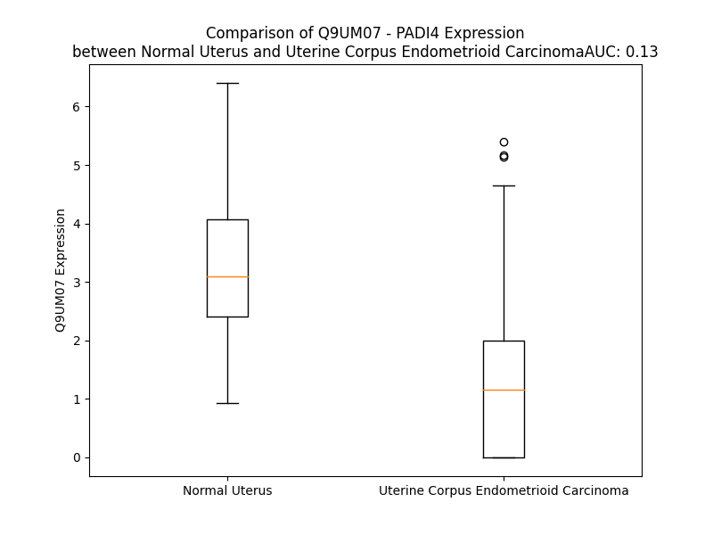

# Detailed Data for Q9UM07

## Introduction to the Detailed Summary

### How to Interpret the Results

- **Summary & Metrics**: This section provides a quick reference to essential protein attributes, including expression changes, family classification, and biomarker applications. Regulation status (upregulated/downregulated) indicates the protein's behavior in a disease context. Some information comes from the original excel file with the proteins selected from literature, while others are derived from the analyses.
- **Expression Comparison**: A visual representation comparing protein expression between normal and disease states. It highlights significant changes in expression levels that might indicate diagnostic or therapeutic relevance. This is data coming from transcriptomics experiments and could not translate similarly to protein levels.
- **Isoform Alignment**: An interactive view of isoform alignments, revealing structural and functional differences between variants of the protein.
- **Interactors & Homologs**: Tables listing known interaction partners and homologous proteins, the more interactors and homologs, the more complex the protein is to design an antibody for.
- **Biological Assemblies**: Information about the structural arrangement of the protein in different assemblies, providing insights into its functional state but also the complexity of the protein to develop antibodies.
- **Combined Per-Residue Information**: A detailed table summarizing residue-level data. This includes predictions for epitope regions, aggregation tendencies, and modifications that might impact the protein's function. Each row corresponds to a residue in the protein, providing insights into specific sites that may be important for research or drug development.
## Summary & Metrics

- **UniProt Accession**: Q9UM07
- **Gene Name**: PADI4
- **Protein Name**: Peptidylarginine deiminase type 4
- **Swiss Prot**: PADI4_HUMAN
- **Family**: enzyme
- **Biomarker Application**:  
- **Number of Isoforms**: 0
- **Regulation**: 1
- **(transcriptomics) AUC**: 0.13
- **(transcriptomics) Fold Change**: 2.44
- **(transcriptomics) Regulation**: Downregulated
- **Discotope Epitope Count**: 139
- **Max n_uniprots (Homo)**: 2
- **Max n_uniprots (Hetero)**: N/A

## Expression Comparison

## Interactors

| preferredName_A   | preferredName_B   |   score |
|:------------------|:------------------|--------:|
| PADI4             | H3C13             |   0.956 |
| PADI4             | H3C12             |   0.94  |
| PADI4             | H3-2              |   0.905 |
| PADI4             | H3-4              |   0.905 |
| PADI4             | H3-3B             |   0.905 |
| PADI4             | H3-5              |   0.905 |

## Homologs

| uniprot_id   | gene_id   |
|:-------------|:----------|
| B1AQ67       | PADI4     |
| Q6TGC4       | PADI6     |
| Q9ULC6       | PADI1     |
| Q9ULW8       | PADI3     |
| Q9Y2J8       | PADI2     |

## Biological Assemblies

|   Unnamed: 0 |   assembly |   n_uniprots | composition   | crystal_id   |
|-------------:|-----------:|-------------:|:--------------|:-------------|
|            0 |          1 |            1 | Homo          | 4x8g         |
|            0 |          1 |            1 | Homo          | 4x8c         |
|            0 |          1 |            1 | Homo          | 5n1b         |
|            0 |          1 |            1 | Homo          | 5n0m         |
|            0 |          1 |            1 | Homo          | 4dkt         |
|            0 |          1 |            1 | Homo          | 2dex         |
|            0 |          1 |            1 | Homo          | 3b1t         |
|            0 |          1 |            1 | Homo          | 2dey         |
|            0 |          1 |            2 | Homo          | 8sml         |
|            0 |          1 |            1 | Homo          | 1wda         |
|            0 |          1 |            1 | Homo          | 1wd9         |
|            0 |          1 |            1 | Homo          | 3b1u         |
|            0 |          1 |            1 | Homo          | 2dw5         |
|            0 |          1 |            1 | Homo          | 5n0z         |
|            0 |          1 |            1 | Homo          | 3apm         |
|            0 |          1 |            2 | Homo          | 8smk         |
|            0 |          1 |            1 | Homo          | 3apn         |
|            0 |          1 |            1 | Homo          | 8god         |
|            0 |          1 |            1 | Homo          | 2dew         |
|            0 |          1 |            1 | Homo          | 5n0y         |
|            0 |          1 |            1 | Homo          | 1wd8         |

## Combined Per-Residue Information

|   res | aa   |   epitope_score | epitope   |   relative_surface_accessibility |   modeling_confidence |   Aggregation | modification   |
|------:|:-----|----------------:|:----------|---------------------------------:|----------------------:|--------------:|:---------------|
|     1 | M    |         0.11808 | False     |                          1.25416 |                 31.79 |         0     | N/A            |
|     2 | A    |         0.0685  | False     |                          0.79046 |                 49.4  |         0     | N/A            |
|     3 | Q    |         0.07111 | False     |                          0.3444  |                 61.91 |         0     | N/A            |
|     4 | G    |         0.15742 | True      |                          0.57131 |                 69.07 |         0     | N/A            |
|     5 | T    |         0.03855 | False     |                          0.31205 |                 82.58 |         0     | N/A            |
|     6 | L    |         0.13574 | True      |                          0.62157 |                 91.14 |         0     | N/A            |
|     7 | I    |         0.0254  | False     |                          0.088   |                 92.61 |         0     | N/A            |
|     8 | R    |         0.13076 | True      |                          0.64664 |                 92.98 |         0     | N/A            |
|     9 | V    |         0.01093 | False     |                          0.00864 |                 93.34 |         0     | N/A            |
|    10 | T    |         0.05949 | False     |                          0.17518 |                 91.79 |         0     | N/A            |
|    11 | P    |         0.06625 | False     |                          0.29086 |                 91.91 |         0     | N/A            |
|    12 | E    |         0.14281 | True      |                          0.80943 |                 90.99 |         0     | N/A            |
|    13 | Q    |         0.08988 | False     |                          0.60573 |                 92.35 |         0     | N/A            |
|    14 | P    |         0.07623 | False     |                          0.50955 |                 94.27 |         0     | N/A            |
|    15 | T    |         0.04413 | False     |                          0.20859 |                 94.23 |         1.406 | N/A            |
|    16 | H    |         0.08264 | False     |                          0.66705 |                 94.82 |         3.901 | N/A            |
|    17 | A    |         0.01911 | False     |                          0.20819 |                 94.72 |        13.25  | N/A            |
|    18 | V    |         0.03652 | False     |                          0.14895 |                 94.95 |        17.517 | N/A            |
|    19 | C    |         0.00563 | False     |                          0.04073 |                 92.94 |        17.819 | N/A            |
|    20 | V    |         0.00418 | False     |                          0.0525  |                 92.59 |        19.249 | N/A            |
|    21 | L    |         0.0299  | False     |                          0.25581 |                 90.81 |        18.83  | N/A            |
|    22 | G    |         0.03819 | False     |                          0.81813 |                 84.35 |        10.803 | N/A            |
|    23 | T    |         0.0269  | False     |                          0.15769 |                 86    |         9.546 | N/A            |
|    24 | L    |         0.07904 | False     |                          0.50125 |                 86.19 |         8.876 | N/A            |
|    25 | T    |         0.0091  | False     |                          0.01013 |                 89.92 |         3.46  | N/A            |
|    26 | Q    |         0.08086 | False     |                          0.34764 |                 91.91 |         0.239 | N/A            |
|    27 | L    |         0.01483 | False     |                          0.0585  |                 92.99 |         0.239 | N/A            |
|    28 | D    |         0.03685 | False     |                          0.14118 |                 92.21 |         0     | N/A            |
|    29 | I    |         0.02536 | False     |                          0.04289 |                 90.99 |         0     | N/A            |
|    30 | C    |         0.08291 | False     |                          0.2878  |                 89.67 |         0     | N/A            |
|    31 | S    |         0.09276 | False     |                          0.63414 |                 89.04 |         0     | N/A            |
|    32 | S    |         0.05451 | False     |                          0.3205  |                 87.96 |         0     | N/A            |
|    33 | A    |         0.02323 | False     |                          0.25562 |                 89.82 |         0     | N/A            |
|    34 | P    |         0.05289 | False     |                          0.26274 |                 89.94 |         0     | N/A            |
|    35 | E    |         0.2192  | True      |                          0.94267 |                 86.17 |         0     | N/A            |
|    36 | D    |         0.15233 | True      |                          0.61858 |                 86.81 |         0     | N/A            |
|    37 | C    |         0.03869 | False     |                          0.10067 |                 89.81 |         0     | N/A            |
|    38 | T    |         0.10098 | False     |                          0.60592 |                 90.6  |         0     | N/A            |
|    39 | S    |         0.09992 | False     |                          0.15549 |                 91.33 |         0     | N/A            |
|    40 | F    |         0.01426 | False     |                          0.00701 |                 92.98 |         0     | N/A            |
|    41 | S    |         0.05666 | False     |                          0.03552 |                 92.09 |         0     | N/A            |
|    42 | I    |         0.10168 | False     |                          0.08536 |                 93.29 |         0     | N/A            |
|    43 | N    |         0.13802 | True      |                          0.62901 |                 93.55 |         0     | N/A            |
|    44 | A    |         0.0627  | False     |                          0.30258 |                 93.92 |         0     | N/A            |
|    45 | S    |         0.05495 | False     |                          0.19278 |                 93.48 |         0     | N/A            |
|    46 | P    |         0.16305 | True      |                          0.92746 |                 90.94 |         0     | N/A            |
|    47 | G    |         0.03008 | False     |                          0.14378 |                 91.27 |         0     | N/A            |
|    48 | V    |         0.04407 | False     |                          0.08234 |                 93.62 |         0     | N/A            |
|    49 | V    |         0.10026 | False     |                          0.3439  |                 92.84 |         0     | N/A            |
|    50 | V    |         0.13391 | True      |                          0.29999 |                 92.31 |         0     | N/A            |
|    51 | D    |         0.12544 | False     |                          0.49622 |                 90.53 |         0     | N/A            |
|    52 | I    |         0.15431 | True      |                          0.24065 |                 89.17 |         0     | N/A            |
|    53 | A    |         0.1706  | True      |                          0.42453 |                 82.39 |         0     | N/A            |
|    54 | H    |         0.35274 | True      |                          0.78459 |                 75.02 |         0     | N/A            |
|    55 | G    |         0.14405 | True      |                          0.22601 |                 63.17 |         0     | N/A            |
|    56 | P    |         0.13849 | True      |                          0.84428 |                 62.83 |         0     | N/A            |
|    57 | P    |         0.11051 | False     |                          0.36833 |                 63.27 |         0     | N/A            |
|    58 | A    |         0.16924 | True      |                          0.57273 |                 59.05 |         0     | N/A            |
|    59 | K    |         0.28178 | True      |                          0.70188 |                 59.49 |         0     | N/A            |
|    60 | K    |         0.26755 | True      |                          0.86095 |                 55.08 |         0     | N/A            |
|    61 | K    |         0.18023 | True      |                          0.62522 |                 53.31 |         0     | N/A            |
|    62 | S    |         0.30388 | True      |                          0.93612 |                 42.47 |         0     | N/A            |
|    63 | T    |         0.20928 | True      |                          0.83317 |                 42.49 |         0     | N/A            |
|    64 | G    |         0.16527 | True      |                          0.74325 |                 53.7  |         0     | N/A            |
|    65 | S    |         0.18768 | True      |                          0.39803 |                 63.8  |         0     | N/A            |
|    66 | S    |         0.15572 | True      |                          0.17564 |                 77.71 |         0     | N/A            |
|    67 | T    |         0.20047 | True      |                          0.18008 |                 85.51 |         0     | N/A            |
|    68 | W    |         0.07602 | False     |                          0.18427 |                 89.09 |         0     | N/A            |
|    69 | P    |         0.0757  | False     |                          0.33202 |                 89.19 |         0     | N/A            |
|    70 | L    |         0.06355 | False     |                          0.22347 |                 88.22 |         0     | N/A            |
|    71 | D    |         0.09206 | False     |                          0.40194 |                 86.02 |         0     | N/A            |
|    72 | P    |         0.17872 | True      |                          0.89012 |                 84.19 |         0     | N/A            |
|    73 | G    |         0.18444 | True      |                          0.50263 |                 82.68 |         0     | N/A            |
|    74 | V    |         0.03554 | False     |                          0.11357 |                 86.47 |         0.955 | N/A            |
|    75 | E    |         0.13971 | True      |                          0.42445 |                 88.16 |         0.955 | N/A            |
|    76 | V    |         0.01905 | False     |                          0.02    |                 91.88 |         5.109 | N/A            |
|    77 | T    |         0.09341 | False     |                          0.13806 |                 92.08 |         5.109 | N/A            |
|    78 | L    |         0.01764 | False     |                          0.00735 |                 93.15 |         5.109 | N/A            |
|    79 | T    |         0.08383 | False     |                          0.34749 |                 91.58 |         5.109 | N/A            |
|    80 | M    |         0.03235 | False     |                          0.08432 |                 91.79 |         5.109 | N/A            |
|    81 | K    |         0.14527 | True      |                          0.62485 |                 90.35 |         0.955 | N/A            |
|    82 | V    |         0.09574 | False     |                          0.58287 |                 91.94 |         0.955 | N/A            |
|    83 | A    |         0.02568 | False     |                          0.11979 |                 93.93 |         0.437 | N/A            |
|    84 | S    |         0.03125 | False     |                          0.05584 |                 95.7  |         0     | N/A            |
|    85 | G    |         0.05932 | False     |                          0.7887  |                 92.77 |         0     | N/A            |
|    86 | S    |         0.10141 | False     |                          0.47254 |                 95.3  |         0     | N/A            |
|    87 | T    |         0.04825 | False     |                          0.56057 |                 93.83 |         0     | N/A            |
|    88 | G    |         0.03327 | False     |                          0.13522 |                 93.39 |         0     | N/A            |
|    89 | D    |         0.07793 | False     |                          0.3003  |                 94.72 |         0     | N/A            |
|    90 | Q    |         0.03515 | False     |                          0.1275  |                 95.5  |         0     | N/A            |
|    91 | K    |         0.14805 | True      |                          0.53385 |                 95.92 |         0     | N/A            |
|    92 | V    |         0.00505 | False     |                          0.00512 |                 95.75 |         0.167 | N/A            |
|    93 | Q    |         0.07537 | False     |                          0.27545 |                 95.83 |         0.167 | N/A            |
|    94 | I    |         0.00207 | False     |                          0       |                 94.43 |         0.167 | N/A            |
|    95 | S    |         0.05076 | False     |                          0.05384 |                 94.26 |         0.167 | N/A            |
|    96 | Y    |         0.00705 | False     |                          0       |                 93.74 |         0.167 | N/A            |
|    97 | Y    |         0.16922 | True      |                          0.29572 |                 90.95 |         0.167 | N/A            |
|    98 | G    |         0.05365 | False     |                          0.17744 |                 88.36 |         0     | N/A            |
|    99 | P    |         0.27167 | True      |                          0.86452 |                 83.57 |         0     | N/A            |
|   100 | K    |         0.19962 | True      |                          0.97041 |                 84.21 |         0     | N/A            |
|   101 | T    |         0.07468 | False     |                          0.25074 |                 80.77 |         0     | N/A            |
|   102 | P    |         0.14198 | True      |                          0.76427 |                 87.23 |         0     | N/A            |
|   103 | P    |         0.13003 | True      |                          0.5646  |                 87.87 |         0     | N/A            |
|   104 | V    |         0.0722  | False     |                          0.38273 |                 92.15 |         4.492 | N/A            |
|   105 | K    |         0.1474  | True      |                          0.54538 |                 93.92 |         4.815 | N/A            |
|   106 | A    |         0.00603 | False     |                          0.00638 |                 95.15 |        32.84  | N/A            |
|   107 | L    |         0.09551 | False     |                          0.40765 |                 96.41 |        61.04  | N/A            |
|   108 | L    |         0.00845 | False     |                          0.00649 |                 96.93 |        61.612 | N/A            |
|   109 | Y    |         0.06607 | False     |                          0.24126 |                 96.57 |        61.716 | N/A            |
|   110 | L    |         0.00135 | False     |                          0       |                 96.14 |        61.716 | N/A            |
|   111 | T    |         0.02739 | False     |                          0.0472  |                 96.55 |        57.535 | N/A            |
|   112 | G    |         0.0021  | False     |                          0       |                 95.07 |        52.105 | N/A            |
|   113 | V    |         0.00178 | False     |                          0       |                 95.68 |        48.454 | N/A            |
|   114 | E    |         0.06062 | False     |                          0.30191 |                 93.87 |         4.815 | N/A            |
|   115 | I    |         0.01415 | False     |                          0.04561 |                 93.42 |         4.601 | N/A            |
|   116 | S    |         0.01453 | False     |                          0.22003 |                 92.64 |         2.067 | N/A            |
|   117 | L    |         0.00337 | False     |                          0       |                 94.25 |         1.799 | N/A            |
|   118 | C    |         0.01751 | False     |                          0.01843 |                 93.55 |         0.208 | N/A            |
|   119 | A    |         0.00564 | False     |                          0.01414 |                 94.87 |         0.095 | N/A            |
|   120 | D    |         0.08311 | False     |                          0.1297  |                 94.41 |         0     | N/A            |
|   121 | I    |         0.02568 | False     |                          0.02046 |                 93.51 |         0     | N/A            |
|   122 | T    |         0.0483  | False     |                          0.43306 |                 92.27 |         0     | N/A            |
|   123 | R    |         0.07863 | False     |                          0.10415 |                 94.05 |         0     | N/A            |
|   124 | T    |         0.10002 | False     |                          0.55755 |                 92.56 |         0     | N/A            |
|   125 | G    |         0.09647 | False     |                          0.48145 |                 88.31 |         0     | N/A            |
|   126 | K    |         0.13232 | True      |                          0.66442 |                 86.37 |         0     | N/A            |
|   127 | V    |         0.08398 | False     |                          0.24563 |                 83.4  |         0     | N/A            |
|   128 | K    |         0.1445  | True      |                          0.59179 |                 72.48 |         0     | N/A            |
|   129 | P    |         0.1368  | True      |                          0.73761 |                 63.94 |         0     | N/A            |
|   130 | T    |         0.07076 | False     |                          0.29628 |                 55.14 |         0     | N/A            |
|   131 | R    |         0.07314 | False     |                          0.89529 |                 51.73 |         0     | N/A            |
|   132 | A    |         0.08887 | False     |                          0.91556 |                 48.76 |         0     | N/A            |
|   133 | V    |         0.15694 | True      |                          0.9314  |                 49.15 |         0     | N/A            |
|   134 | K    |         0.13202 | True      |                          0.50961 |                 58.28 |         0     | N/A            |
|   135 | D    |         0.09102 | False     |                          0.48294 |                 68.14 |         0     | N/A            |
|   136 | Q    |         0.03416 | False     |                          0.0733  |                 73.73 |         0     | N/A            |
|   137 | R    |         0.10639 | False     |                          0.34955 |                 84.43 |         0     | N/A            |
|   138 | T    |         0.0996  | False     |                          0.43911 |                 90.66 |         0     | N/A            |
|   139 | W    |         0.06355 | False     |                          0.11842 |                 95.57 |         0     | N/A            |
|   140 | T    |         0.07426 | False     |                          0.43827 |                 96.69 |         0     | N/A            |
|   141 | W    |         0.11052 | False     |                          0.27058 |                 97.52 |         0     | N/A            |
|   142 | G    |         0.0279  | False     |                          0.02575 |                 96.89 |         0     | N/A            |
|   143 | P    |         0.126   | False     |                          0.80867 |                 95.39 |         0     | N/A            |
|   144 | C    |         0.14104 | True      |                          0.95989 |                 93.57 |         0     | N/A            |
|   145 | G    |         0.03971 | False     |                          0.18526 |                 92.49 |         0     | N/A            |
|   146 | Q    |         0.0647  | False     |                          0.14134 |                 93.05 |         0.191 | N/A            |
|   147 | G    |         0.00452 | False     |                          0.00483 |                 92.78 |         6.1   | N/A            |
|   148 | A    |         0.00432 | False     |                          0.01403 |                 96.59 |        66.536 | N/A            |
|   149 | I    |         0.01138 | False     |                          0.03265 |                 98.35 |        69.035 | N/A            |
|   150 | L    |         0.00198 | False     |                          0       |                 98.58 |        69.175 | N/A            |
|   151 | L    |         0.00625 | False     |                          0.00634 |                 98.85 |        69.175 | N/A            |
|   152 | V    |         0.0108  | False     |                          0.03014 |                 98.79 |        68.695 | N/A            |
|   153 | N    |         0.00978 | False     |                          0.01426 |                 98.41 |         4.943 | N/A            |
|   154 | C    |         0.01257 | False     |                          0.01073 |                 98.3  |         3.076 | N/A            |
|   155 | D    |         0.01258 | False     |                          0.00613 |                 97.7  |         0     | N/A            |
|   156 | R    |         0.09901 | False     |                          0.14784 |                 96.44 |         0     | N/A            |
|   157 | D    |         0.04709 | False     |                          0.09172 |                 93.33 |         0     | N/A            |
|   158 | N    |         0.09098 | False     |                          0.11734 |                 90.79 |         0     | N/A            |
|   159 | L    |         0.17605 | True      |                          0.90513 |                 90.26 |         0     | N/A            |
|   160 | E    |         0.20872 | True      |                          0.90005 |                 90.71 |         0     | N/A            |
|   161 | S    |         0.14154 | True      |                          0.34289 |                 89.19 |         0     | N/A            |
|   162 | S    |         0.27741 | True      |                          0.54836 |                 90.87 |         0     | N/A            |
|   163 | A    |         0.19254 | True      |                          0.32588 |                 93.55 |         0     | N/A            |
|   164 | M    |         0.1292  | True      |                          0.21741 |                 96.37 |         0     | N/A            |
|   165 | D    |         0.04248 | False     |                          0.11408 |                 95.53 |         0     | N/A            |
|   166 | C    |         0.06593 | False     |                          0.07092 |                 95.68 |         0     | N/A            |
|   167 | E    |         0.23568 | True      |                          0.54404 |                 95.11 |         0     | N/A            |
|   168 | D    |         0.08562 | False     |                          0.3673  |                 92.67 |         0     | N/A            |
|   169 | D    |         0.09655 | False     |                          0.19397 |                 93.89 |         0     | N/A            |
|   170 | E    |         0.1655  | True      |                          0.5755  |                 92.62 |         0     | N/A            |
|   171 | V    |         0.06041 | False     |                          0.21248 |                 91.45 |         0     | N/A            |
|   172 | L    |         0.15894 | True      |                          0.62179 |                 87.89 |         0     | N/A            |
|   173 | D    |         0.10189 | False     |                          0.30583 |                 85.69 |         0     | N/A            |
|   174 | S    |         0.1277  | False     |                          0.60472 |                 89.08 |         0     | N/A            |
|   175 | E    |         0.07601 | False     |                          0.47387 |                 92.3  |         0     | N/A            |
|   176 | D    |         0.02431 | False     |                          0.04374 |                 94.35 |         0     | N/A            |
|   177 | L    |         0.06485 | False     |                          0.176   |                 94.42 |         0     | N/A            |
|   178 | Q    |         0.13657 | True      |                          0.51795 |                 95.57 |         0     | N/A            |
|   179 | D    |         0.01296 | False     |                          0.01174 |                 97.2  |         0     | N/A            |
|   180 | M    |         0.03695 | False     |                          0.03371 |                 97.76 |         0     | N/A            |
|   181 | S    |         0.0076  | False     |                          0.05201 |                 97.72 |         0     | N/A            |
|   182 | L    |         0.05719 | False     |                          0.40091 |                 96.93 |         0     | N/A            |
|   183 | M    |         0.00205 | False     |                          0       |                 96.62 |         0     | N/A            |
|   184 | T    |         0.06378 | False     |                          0.12367 |                 95.69 |         0     | N/A            |
|   185 | L    |         0.00932 | False     |                          0.00717 |                 95.62 |         0     | N/A            |
|   186 | S    |         0.02972 | False     |                          0.18729 |                 94.63 |         0     | N/A            |
|   187 | T    |         0.00677 | False     |                          0.00925 |                 95.38 |         0     | N/A            |
|   188 | K    |         0.06414 | False     |                          0.38149 |                 96.36 |         0     | N/A            |
|   189 | T    |         0.02646 | False     |                          0.05069 |                 96.86 |         0     | N/A            |
|   190 | P    |         0.00628 | False     |                          0.00696 |                 96.82 |         0     | N/A            |
|   191 | K    |         0.10337 | False     |                          0.89616 |                 95.76 |         0     | N/A            |
|   192 | D    |         0.09622 | False     |                          0.47317 |                 94.7  |         0     | N/A            |
|   193 | F    |         0.01724 | False     |                          0.03436 |                 96.66 |         1.066 | N/A            |
|   194 | F    |         0.07792 | False     |                          0.22048 |                 95.93 |         1.066 | N/A            |
|   195 | T    |         0.15301 | True      |                          0.76585 |                 94.1  |         1.066 | N/A            |
|   196 | N    |         0.10488 | False     |                          0.44569 |                 94.97 |         1.066 | N/A            |
|   197 | H    |         0.05237 | False     |                          0.11734 |                 96.79 |         1.066 | N/A            |
|   198 | T    |         0.05986 | False     |                          0.20164 |                 97.29 |         1.737 | N/A            |
|   199 | L    |         0.00271 | False     |                          0.00224 |                 98.12 |         2.865 | N/A            |
|   200 | V    |         0.08577 | False     |                          0.10473 |                 98.18 |         2.865 | N/A            |
|   201 | L    |         0.00354 | False     |                          0       |                 98.51 |         2.7   | N/A            |
|   202 | H    |         0.06123 | False     |                          0.26265 |                 98.53 |         1.799 | N/A            |
|   203 | V    |         0.03779 | False     |                          0.0409  |                 98.52 |         1.799 | N/A            |
|   204 | A    |         0.08042 | False     |                          0.4572  |                 98.17 |         0.817 | N/A            |
|   205 | R    |         0.2772  | True      |                          0.79205 |                 97.83 |         0     | Citrulline     |
|   206 | S    |         0.08418 | False     |                          0.60477 |                 97.24 |         0     | N/A            |
|   207 | E    |         0.06014 | False     |                          0.16774 |                 98.08 |         0     | N/A            |
|   208 | M    |         0.06491 | False     |                          0.26138 |                 98.1  |         0     | N/A            |
|   209 | D    |         0.14213 | True      |                          0.44341 |                 97.96 |         0     | N/A            |
|   210 | K    |         0.0641  | False     |                          0.10132 |                 98.55 |         0     | N/A            |
|   211 | V    |         0.00436 | False     |                          0       |                 98.67 |         0     | N/A            |
|   212 | R    |         0.04254 | False     |                          0.0295  |                 98.61 |         0     | Citrulline     |
|   213 | V    |         0.00206 | False     |                          0       |                 98.55 |         0     | N/A            |
|   214 | F    |         0.02001 | False     |                          0.00701 |                 97.58 |         0     | N/A            |
|   215 | Q    |         0.02842 | False     |                          0.13682 |                 96.33 |         0     | N/A            |
|   216 | A    |         0.05209 | False     |                          0.23607 |                 91.6  |         0     | N/A            |
|   217 | T    |         0.06476 | False     |                          0.51326 |                 85.92 |         0     | N/A            |
|   218 | R    |         0.17478 | True      |                          0.91656 |                 69.02 |         0     | Citrulline     |
|   219 | G    |         0.17441 | True      |                          0.5479  |                 60.46 |         0     | N/A            |
|   220 | K    |         0.15453 | True      |                          1.04484 |                 48.35 |         0     | N/A            |
|   221 | L    |         0.16028 | True      |                          1.10446 |                 49.95 |         0     | N/A            |
|   222 | S    |         0.10057 | False     |                          0.51412 |                 57.05 |         0     | N/A            |
|   223 | S    |         0.19921 | True      |                          0.59306 |                 63.36 |         0     | N/A            |
|   224 | K    |         0.0956  | False     |                          0.71624 |                 84.24 |         0     | N/A            |
|   225 | C    |         0.10575 | False     |                          0.20139 |                 89.06 |         0.423 | N/A            |
|   226 | S    |         0.07723 | False     |                          0.4528  |                 93.59 |         0.423 | N/A            |
|   227 | V    |         0.08521 | False     |                          0.24289 |                 96.64 |         0.423 | N/A            |
|   228 | V    |         0.01454 | False     |                          0.02182 |                 97.51 |         0.423 | N/A            |
|   229 | L    |         0.00367 | False     |                          0       |                 98.49 |         0.423 | N/A            |
|   230 | G    |         0.012   | False     |                          0.00322 |                 97.83 |         0     | N/A            |
|   231 | P    |         0.10076 | False     |                          0.35037 |                 97.74 |         0     | N/A            |
|   232 | K    |         0.21611 | True      |                          0.67848 |                 96.89 |         0     | N/A            |
|   233 | W    |         0.1784  | True      |                          0.49777 |                 96.25 |         0     | N/A            |
|   234 | P    |         0.11616 | False     |                          0.28353 |                 97.95 |         0     | N/A            |
|   235 | S    |         0.13331 | True      |                          0.46261 |                 98.2  |         0     | N/A            |
|   236 | H    |         0.10038 | False     |                          0.34111 |                 98.2  |         0     | N/A            |
|   237 | Y    |         0.08091 | False     |                          0.54296 |                 97.53 |         0     | N/A            |
|   238 | L    |         0.02925 | False     |                          0.05717 |                 96.85 |         0     | N/A            |
|   239 | M    |         0.15399 | True      |                          0.91699 |                 93.06 |         0     | N/A            |
|   240 | V    |         0.0213  | False     |                          0.10317 |                 92.73 |         0     | N/A            |
|   241 | P    |         0.13144 | True      |                          0.51977 |                 93.34 |         0     | N/A            |
|   242 | G    |         0.05111 | False     |                          0.29912 |                 92.92 |         0     | N/A            |
|   243 | G    |         0.04829 | False     |                          0.22532 |                 94.94 |         0     | N/A            |
|   244 | K    |         0.21731 | True      |                          0.81934 |                 94.36 |         0     | N/A            |
|   245 | H    |         0.09026 | False     |                          0.31877 |                 93.85 |         0     | N/A            |
|   246 | N    |         0.19402 | True      |                          0.56842 |                 93.58 |         0     | N/A            |
|   247 | M    |         0.02929 | False     |                          0.07263 |                 94.75 |         0     | N/A            |
|   248 | D    |         0.08548 | False     |                          0.29097 |                 95.24 |         0     | N/A            |
|   249 | F    |         0.00395 | False     |                          0       |                 97.17 |         0     | N/A            |
|   250 | Y    |         0.15022 | True      |                          0.23139 |                 97.56 |         0     | N/A            |
|   251 | V    |         0.00319 | False     |                          0       |                 98.41 |         0     | N/A            |
|   252 | E    |         0.02649 | False     |                          0.01331 |                 98.55 |         0     | N/A            |
|   253 | A    |         0.00181 | False     |                          0       |                 98.78 |         0     | N/A            |
|   254 | L    |         0.06696 | False     |                          0.20266 |                 98.62 |         0     | N/A            |
|   255 | A    |         0.03096 | False     |                          0.26911 |                 98.61 |         0     | N/A            |
|   256 | F    |         0.00954 | False     |                          0.02634 |                 98.82 |         0     | N/A            |
|   257 | P    |         0.01339 | False     |                          0.04275 |                 98.73 |         0     | N/A            |
|   258 | D    |         0.06703 | False     |                          0.15295 |                 98.54 |         0     | N/A            |
|   259 | T    |         0.10894 | False     |                          0.74927 |                 96.54 |         0     | N/A            |
|   260 | D    |         0.22321 | True      |                          0.6927  |                 97.36 |         0     | N/A            |
|   261 | F    |         0.06327 | False     |                          0.03856 |                 98.44 |         0     | N/A            |
|   262 | P    |         0.11761 | False     |                          0.71795 |                 98.03 |         0     | N/A            |
|   263 | G    |         0.00247 | False     |                          0       |                 98.25 |         5.405 | N/A            |
|   264 | L    |         0.07255 | False     |                          0.38861 |                 98.46 |        62.422 | N/A            |
|   265 | I    |         0.00309 | False     |                          0       |                 98.58 |        72.525 | N/A            |
|   266 | T    |         0.03492 | False     |                          0.32295 |                 98.23 |        73.11  | N/A            |
|   267 | L    |         0.00408 | False     |                          0       |                 98.31 |        74.026 | N/A            |
|   268 | T    |         0.06428 | False     |                          0.11508 |                 97.77 |        73.887 | N/A            |
|   269 | I    |         0.00415 | False     |                          0.0008  |                 97.33 |        71.865 | N/A            |
|   270 | S    |         0.02135 | False     |                          0.01614 |                 96.76 |        46.056 | N/A            |
|   271 | L    |         0.00434 | False     |                          0.00142 |                 97.2  |        42.812 | N/A            |
|   272 | L    |         0.03702 | False     |                          0.03462 |                 96.82 |        36.203 | N/A            |
|   273 | D    |         0.04507 | False     |                          0.29243 |                 95.66 |         0     | N/A            |
|   274 | T    |         0.10287 | False     |                          0.32167 |                 94.13 |         0     | N/A            |
|   275 | S    |         0.10491 | False     |                          0.50385 |                 90.87 |         0     | N/A            |
|   276 | N    |         0.11844 | False     |                          0.47797 |                 89.81 |         0     | N/A            |
|   277 | L    |         0.19603 | True      |                          1.05824 |                 88.95 |         0     | N/A            |
|   278 | E    |         0.17174 | True      |                          0.82263 |                 90.45 |         0     | N/A            |
|   279 | L    |         0.14703 | True      |                          0.69491 |                 91.15 |         0     | N/A            |
|   280 | P    |         0.19897 | True      |                          0.89004 |                 92.14 |         0     | N/A            |
|   281 | E    |         0.1963  | True      |                          0.4177  |                 93.64 |         0     | N/A            |
|   282 | A    |         0.06902 | False     |                          0.51909 |                 93.64 |         2.194 | N/A            |
|   283 | V    |         0.06886 | False     |                          0.59914 |                 95.09 |         4.252 | N/A            |
|   284 | V    |         0.02721 | False     |                          0.22717 |                 93.41 |         4.692 | N/A            |
|   285 | F    |         0.03012 | False     |                          0.07178 |                 93.87 |         4.692 | N/A            |
|   286 | Q    |         0.06381 | False     |                          0.30226 |                 93.72 |         4.692 | N/A            |
|   287 | D    |         0.04259 | False     |                          0.09928 |                 92.65 |         4.238 | N/A            |
|   288 | S    |         0.03846 | False     |                          0.10794 |                 94.38 |         4.238 | N/A            |
|   289 | V    |         0.0017  | False     |                          0       |                 95.53 |         4.238 | N/A            |
|   290 | V    |         0.05353 | False     |                          0.07617 |                 97.49 |         4.238 | N/A            |
|   291 | F    |         0.00362 | False     |                          0.00446 |                 98.4  |         4.238 | N/A            |
|   292 | R    |         0.04728 | False     |                          0.08084 |                 98.65 |         4.238 | N/A            |
|   293 | V    |         0.00239 | False     |                          0.00422 |                 98.85 |         3.941 | N/A            |
|   294 | A    |         0.00084 | False     |                          0       |                 98.85 |         0     | N/A            |
|   295 | P    |         0.00593 | False     |                          0.02684 |                 98.89 |         0     | N/A            |
|   296 | W    |         0.00397 | False     |                          0.00088 |                 98.92 |         0     | N/A            |
|   297 | I    |         0.00423 | False     |                          0.0016  |                 98.94 |         0     | N/A            |
|   298 | M    |         0.00682 | False     |                          0.00935 |                 98.8  |         0     | N/A            |
|   299 | T    |         0.00856 | False     |                          0.07866 |                 98.88 |         0     | N/A            |
|   300 | P    |         0.00554 | False     |                          0.01093 |                 98.84 |         0     | N/A            |
|   301 | N    |         0.01075 | False     |                          0.07193 |                 98.71 |         0     | N/A            |
|   302 | T    |         0.02149 | False     |                          0.2167  |                 98.67 |         0     | N/A            |
|   303 | Q    |         0.04254 | False     |                          0.13407 |                 98.7  |         0     | N/A            |
|   304 | P    |         0.05023 | False     |                          0.52487 |                 98.49 |         0     | N/A            |
|   305 | P    |         0.0145  | False     |                          0.15448 |                 98.68 |         0     | N/A            |
|   306 | Q    |         0.04768 | False     |                          0.34544 |                 98.57 |         0     | N/A            |
|   307 | E    |         0.02118 | False     |                          0.04249 |                 98.7  |         0     | N/A            |
|   308 | V    |         0.00074 | False     |                          0       |                 98.7  |         0.91  | N/A            |
|   309 | Y    |         0.01728 | False     |                          0.03362 |                 98.72 |         0.91  | N/A            |
|   310 | A    |         0.00136 | False     |                          0       |                 98.29 |         0.91  | N/A            |
|   311 | C    |         0.00344 | False     |                          0       |                 97.84 |         0.91  | N/A            |
|   312 | S    |         0.06497 | False     |                          0.21301 |                 97.37 |         0.91  | N/A            |
|   313 | I    |         0.15524 | True      |                          0.06977 |                 95.45 |         0.91  | N/A            |
|   314 | F    |         0.31861 | True      |                          0.79583 |                 94.73 |         0.91  | N/A            |
|   315 | E    |         0.15271 | True      |                          0.66324 |                 94.07 |         0     | N/A            |
|   316 | N    |         0.01961 | False     |                          0.00675 |                 95.86 |         0     | N/A            |
|   317 | E    |         0.23318 | True      |                          0.6182  |                 95.88 |         0     | N/A            |
|   318 | D    |         0.13509 | True      |                          0.67522 |                 95.38 |         0     | N/A            |
|   319 | F    |         0.01496 | False     |                          0.016   |                 97.8  |         0     | N/A            |
|   320 | L    |         0.0598  | False     |                          0.12895 |                 97.63 |         0     | N/A            |
|   321 | K    |         0.15598 | True      |                          0.71817 |                 97.99 |         0     | N/A            |
|   322 | S    |         0.05798 | False     |                          0.26014 |                 97.93 |         0     | N/A            |
|   323 | V    |         0.00298 | False     |                          0       |                 98.11 |         0.319 | N/A            |
|   324 | T    |         0.05684 | False     |                          0.35813 |                 98.23 |         0.319 | N/A            |
|   325 | T    |         0.08033 | False     |                          0.45099 |                 98.3  |         0.319 | N/A            |
|   326 | L    |         0.01352 | False     |                          0.00719 |                 97.92 |         0.319 | N/A            |
|   327 | A    |         0.00398 | False     |                          0.01275 |                 98.23 |         0.319 | N/A            |
|   328 | M    |         0.08998 | False     |                          0.76735 |                 97.98 |         0.17  | N/A            |
|   329 | K    |         0.10039 | False     |                          0.5457  |                 98.02 |         0     | N/A            |
|   330 | A    |         0.02607 | False     |                          0.18905 |                 97.94 |         0     | N/A            |
|   331 | K    |         0.17905 | True      |                          0.93778 |                 97.97 |         0     | N/A            |
|   332 | C    |         0.0438  | False     |                          0.10541 |                 97.6  |         0     | N/A            |
|   333 | K    |         0.24055 | True      |                          0.61283 |                 98.19 |         0     | N/A            |
|   334 | L    |         0.03977 | False     |                          0.28181 |                 98.17 |         0     | N/A            |
|   335 | T    |         0.09862 | False     |                          0.24598 |                 98.35 |         0     | N/A            |
|   336 | I    |         0.12335 | False     |                          0.43283 |                 97.99 |         0     | N/A            |
|   337 | C    |         0.01996 | False     |                          0.003   |                 97.85 |         0     | N/A            |
|   338 | P    |         0.14167 | True      |                          0.35389 |                 97.71 |         0     | N/A            |
|   339 | E    |         0.1569  | True      |                          0.39578 |                 95.29 |         0     | N/A            |
|   340 | E    |         0.25569 | True      |                          0.72484 |                 95.65 |         0     | N/A            |
|   341 | E    |         0.13905 | True      |                          0.23738 |                 96.43 |         0     | N/A            |
|   342 | N    |         0.01291 | False     |                          0       |                 95.78 |         0     | N/A            |
|   343 | M    |         0.24421 | True      |                          0.70501 |                 96.4  |         0     | N/A            |
|   344 | D    |         0.33364 | True      |                          0.68864 |                 94.95 |         0     | N/A            |
|   345 | D    |         0.09399 | False     |                          0.06249 |                 96.81 |         0     | N/A            |
|   346 | Q    |         0.0322  | False     |                          0.00655 |                 96.15 |         0     | N/A            |
|   347 | W    |         0.1128  | False     |                          0.15916 |                 97.4  |         0     | N/A            |
|   348 | M    |         0.00368 | False     |                          0.00336 |                 98.24 |         0     | N/A            |
|   349 | Q    |         0.01647 | False     |                          0.03601 |                 97.46 |         0     | N/A            |
|   350 | D    |         0.05467 | False     |                          0.08256 |                 98.15 |         0     | N/A            |
|   351 | E    |         0.01801 | False     |                          0.00764 |                 98.5  |         0     | N/A            |
|   352 | M    |         0.00642 | False     |                          0.0036  |                 98.54 |         0     | N/A            |
|   353 | E    |         0.01282 | False     |                          0.08829 |                 98.82 |         0     | N/A            |
|   354 | I    |         0.00766 | False     |                          0.02424 |                 98.87 |         0     | N/A            |
|   355 | G    |         0.00517 | False     |                          0.03093 |                 98.86 |         0     | N/A            |
|   356 | Y    |         0.00893 | False     |                          0.01309 |                 98.93 |         0     | N/A            |
|   357 | I    |         0.0041  | False     |                          0       |                 98.9  |         0     | N/A            |
|   358 | Q    |         0.03029 | False     |                          0.04931 |                 98.79 |         0     | N/A            |
|   359 | A    |         0.02841 | False     |                          0.04902 |                 98.52 |         0     | N/A            |
|   360 | P    |         0.02546 | False     |                          0.28795 |                 97.55 |         0     | N/A            |
|   361 | H    |         0.07759 | False     |                          0.39667 |                 96.74 |         0     | N/A            |
|   362 | K    |         0.0581  | False     |                          0.17703 |                 97.73 |         0     | N/A            |
|   363 | T    |         0.06478 | False     |                          0.39133 |                 98.52 |         0     | N/A            |
|   364 | L    |         0.01985 | False     |                          0.01649 |                 98.57 |         0     | N/A            |
|   365 | P    |         0.04351 | False     |                          0.21373 |                 98.8  |         0     | N/A            |
|   366 | V    |         0.00253 | False     |                          0       |                 98.89 |         0     | N/A            |
|   367 | V    |         0.0026  | False     |                          0       |                 98.83 |         0     | N/A            |
|   368 | F    |         0.00351 | False     |                          0       |                 98.82 |         0     | N/A            |
|   369 | D    |         0.0413  | False     |                          0.05656 |                 98.62 |         0     | N/A            |
|   370 | S    |         0.01389 | False     |                          0.01307 |                 98.34 |         0     | N/A            |
|   371 | P    |         0.01094 | False     |                          0.00367 |                 97.69 |         0     | N/A            |
|   372 | R    |         0.10633 | False     |                          0.04097 |                 96.4  |         0     | Citrulline     |
|   373 | N    |         0.07316 | False     |                          0.24945 |                 95    |         0     | N/A            |
|   374 | R    |         0.1588  | True      |                          0.6506  |                 95.48 |         0     | Citrulline     |
|   375 | G    |         0.04794 | False     |                          0.24566 |                 96.18 |         0     | N/A            |
|   376 | L    |         0.00563 | False     |                          0.00247 |                 97.7  |         0     | N/A            |
|   377 | K    |         0.11697 | False     |                          0.42074 |                 96.42 |         0     | N/A            |
|   378 | E    |         0.07241 | False     |                          0.40333 |                 97.21 |         0     | N/A            |
|   379 | F    |         0.05503 | False     |                          0.04441 |                 98.2  |         0     | N/A            |
|   380 | P    |         0.00568 | False     |                          0.00298 |                 97.77 |         0     | N/A            |
|   381 | I    |         0.0934  | False     |                          0.25599 |                 95.98 |         0     | N/A            |
|   382 | K    |         0.2304  | True      |                          0.55436 |                 95.74 |         0     | N/A            |
|   383 | R    |         0.18797 | True      |                          0.60837 |                 96.56 |         0     | Citrulline     |
|   384 | V    |         0.04212 | False     |                          0.08259 |                 97.64 |         0     | N/A            |
|   385 | M    |         0.05319 | False     |                          0.04766 |                 97.94 |         0     | N/A            |
|   386 | G    |         0.0467  | False     |                          0.1014  |                 97.46 |         0     | N/A            |
|   387 | P    |         0.12514 | False     |                          0.54666 |                 97.07 |         0     | N/A            |
|   388 | D    |         0.05429 | False     |                          0.39042 |                 97.46 |         0     | N/A            |
|   389 | F    |         0.01986 | False     |                          0.1176  |                 98.5  |         4.277 | N/A            |
|   390 | G    |         0.00121 | False     |                          0       |                 98.54 |         4.277 | N/A            |
|   391 | Y    |         0.04168 | False     |                          0.107   |                 98.77 |         4.277 | N/A            |
|   392 | V    |         0.03519 | False     |                          0.05427 |                 98.65 |         4.277 | N/A            |
|   393 | T    |         0.10346 | False     |                          0.25503 |                 98.45 |         4.277 | N/A            |
|   394 | R    |         0.17793 | True      |                          0.24503 |                 98    |         0     | N/A            |
|   395 | G    |         0.08006 | False     |                          0.26618 |                 94.49 |         0     | N/A            |
|   396 | P    |         0.09563 | False     |                          0.27956 |                 92.23 |         0     | N/A            |
|   397 | Q    |         0.08871 | False     |                          0.427   |                 88.25 |         0     | N/A            |
|   398 | T    |         0.18643 | True      |                          0.89279 |                 85.87 |         0     | N/A            |
|   399 | G    |         0.27227 | True      |                          0.59318 |                 87.31 |         0     | N/A            |
|   400 | G    |         0.2226  | True      |                          0.81391 |                 89.54 |         0     | N/A            |
|   401 | I    |         0.17696 | True      |                          0.40027 |                 93.38 |         0     | N/A            |
|   402 | S    |         0.19654 | True      |                          0.28387 |                 94.57 |         0     | N/A            |
|   403 | G    |         0.06032 | False     |                          0.35893 |                 95.17 |         0     | N/A            |
|   404 | L    |         0.00882 | False     |                          0       |                 97.96 |         0     | N/A            |
|   405 | D    |         0.02882 | False     |                          0.01195 |                 98.38 |         0     | N/A            |
|   406 | S    |         0.08653 | False     |                          0.06889 |                 98.24 |         0     | N/A            |
|   407 | F    |         0.00714 | False     |                          0.00127 |                 98.7  |         0     | N/A            |
|   408 | G    |         0.00365 | False     |                          0       |                 97.96 |         0     | N/A            |
|   409 | N    |         0.00729 | False     |                          0       |                 98.79 |         0     | N/A            |
|   410 | L    |         0.00771 | False     |                          0.00305 |                 98.86 |         0     | N/A            |
|   411 | E    |         0.02046 | False     |                          0.09391 |                 98.85 |         0     | N/A            |
|   412 | V    |         0.00547 | False     |                          0.01996 |                 98.9  |         0     | N/A            |
|   413 | S    |         0.00236 | False     |                          0       |                 98.92 |         0     | N/A            |
|   414 | P    |         0.00602 | False     |                          0.01093 |                 98.81 |         0     | N/A            |
|   415 | P    |         0.01842 | False     |                          0.41918 |                 98.73 |         0     | N/A            |
|   416 | V    |         0.03146 | False     |                          0.06199 |                 98.72 |         0     | N/A            |
|   417 | T    |         0.10079 | False     |                          0.50223 |                 98.53 |         0     | N/A            |
|   418 | V    |         0.02391 | False     |                          0.06511 |                 98.51 |         0     | N/A            |
|   419 | R    |         0.19417 | True      |                          0.79234 |                 97.59 |         0     | N/A            |
|   420 | G    |         0.11435 | False     |                          0.81475 |                 97.19 |         0     | N/A            |
|   421 | K    |         0.12571 | False     |                          0.40817 |                 98.18 |         0     | N/A            |
|   422 | E    |         0.13115 | True      |                          0.59163 |                 98.28 |         0     | N/A            |
|   423 | Y    |         0.02877 | False     |                          0.08576 |                 98.74 |         0     | N/A            |
|   424 | P    |         0.07056 | False     |                          0.17535 |                 98.63 |         0     | N/A            |
|   425 | L    |         0.00228 | False     |                          0       |                 98.8  |         0     | N/A            |
|   426 | G    |         0.00194 | False     |                          0       |                 98.75 |         0     | N/A            |
|   427 | R    |         0.04945 | False     |                          0.09787 |                 98.9  |         0     | N/A            |
|   428 | I    |         0.00152 | False     |                          0.0024  |                 98.91 |         0     | N/A            |
|   429 | L    |         0.00221 | False     |                          0       |                 98.9  |         0     | N/A            |
|   430 | F    |         0.01442 | False     |                          0.02166 |                 98.84 |         0     | N/A            |
|   431 | G    |         0.00268 | False     |                          0       |                 98.51 |         0     | N/A            |
|   432 | D    |         0.06019 | False     |                          0.08803 |                 98.43 |         0     | N/A            |
|   433 | S    |         0.10997 | False     |                          0.15742 |                 97.64 |         0     | N/A            |
|   434 | C    |         0.13646 | True      |                          0.53509 |                 94.89 |         0     | N/A            |
|   435 | Y    |         0.2906  | True      |                          0.70561 |                 92.37 |         0     | N/A            |
|   436 | P    |         0.18872 | True      |                          0.86837 |                 95.5  |         0     | N/A            |
|   437 | S    |         0.20077 | True      |                          0.43496 |                 94.91 |         0     | N/A            |
|   438 | N    |         0.23244 | True      |                          1.03252 |                 95.37 |         0     | N/A            |
|   439 | D    |         0.29379 | True      |                          0.78249 |                 94.49 |         0     | N/A            |
|   440 | S    |         0.08749 | False     |                          0.243   |                 96.02 |         0     | N/A            |
|   441 | R    |         0.24276 | True      |                          0.22408 |                 97.3  |         0     | N/A            |
|   442 | Q    |         0.11081 | False     |                          0.40867 |                 97.43 |         0     | N/A            |
|   443 | M    |         0.0111  | False     |                          0       |                 98.28 |         0     | N/A            |
|   444 | H    |         0.15633 | True      |                          0.32108 |                 98.01 |         0     | N/A            |
|   445 | Q    |         0.22161 | True      |                          0.46126 |                 97.83 |         0     | N/A            |
|   446 | A    |         0.05342 | False     |                          0.30577 |                 98.1  |         0     | N/A            |
|   447 | L    |         0.00551 | False     |                          0.00082 |                 98.5  |         0     | N/A            |
|   448 | Q    |         0.0286  | False     |                          0.04286 |                 98.62 |         0     | N/A            |
|   449 | D    |         0.07504 | False     |                          0.25359 |                 98.49 |         0     | N/A            |
|   450 | F    |         0.00243 | False     |                          0       |                 98.84 |         0     | N/A            |
|   451 | L    |         0.00549 | False     |                          0.00692 |                 98.77 |         0     | N/A            |
|   452 | S    |         0.03891 | False     |                          0.46459 |                 98.64 |         0     | N/A            |
|   453 | A    |         0.01971 | False     |                          0.20646 |                 98.65 |         0     | N/A            |
|   454 | Q    |         0.0245  | False     |                          0.01671 |                 98.8  |         0     | N/A            |
|   455 | Q    |         0.03679 | False     |                          0.37869 |                 98.59 |         0     | N/A            |
|   456 | V    |         0.002   | False     |                          0.00095 |                 98.53 |         0     | N/A            |
|   457 | Q    |         0.01428 | False     |                          0.00822 |                 98.83 |         0     | N/A            |
|   458 | A    |         0.05622 | False     |                          0.22695 |                 98.47 |         0     | N/A            |
|   459 | P    |         0.01788 | False     |                          0.21161 |                 98.74 |         0     | N/A            |
|   460 | V    |         0.02731 | False     |                          0.06284 |                 98.8  |         0.333 | N/A            |
|   461 | K    |         0.05243 | False     |                          0.48273 |                 98.74 |         0.333 | N/A            |
|   462 | L    |         0.01074 | False     |                          0.02225 |                 98.8  |         0.333 | N/A            |
|   463 | Y    |         0.07068 | False     |                          0.17416 |                 98.69 |         0.333 | N/A            |
|   464 | S    |         0.00241 | False     |                          0       |                 98.69 |         0.333 | N/A            |
|   465 | D    |         0.0541  | False     |                          0.04959 |                 98.38 |         0.333 | N/A            |
|   466 | W    |         0.03273 | False     |                          0.01906 |                 98.4  |         0.333 | N/A            |
|   467 | L    |         0.00875 | False     |                          0.00082 |                 98.54 |         0.333 | N/A            |
|   468 | S    |         0.12747 | False     |                          0.36024 |                 97.48 |         0.198 | N/A            |
|   469 | V    |         0.07502 | False     |                          0.31267 |                 97.35 |         0.198 | N/A            |
|   470 | G    |         0.00554 | False     |                          0       |                 97.98 |         0     | N/A            |
|   471 | H    |         0.03824 | False     |                          0.01843 |                 98.74 |         0     | N/A            |
|   472 | V    |         0.00132 | False     |                          0       |                 98.72 |         0     | N/A            |
|   473 | D    |         0.01407 | False     |                          0.01969 |                 98.44 |         0     | N/A            |
|   474 | E    |         0.05951 | False     |                          0.09708 |                 98.66 |         0     | N/A            |
|   475 | F    |         0.00549 | False     |                          0       |                 98.79 |         0     | N/A            |
|   476 | L    |         0.02125 | False     |                          0.01835 |                 98.78 |         0     | N/A            |
|   477 | S    |         0.00398 | False     |                          0.05599 |                 98.78 |         0     | N/A            |
|   478 | F    |         0.00435 | False     |                          0.01338 |                 98.86 |         0     | N/A            |
|   479 | V    |         0.0019  | False     |                          0       |                 98.85 |         0     | N/A            |
|   480 | P    |         0.01326 | False     |                          0.20539 |                 98.45 |         0     | N/A            |
|   481 | A    |         0.02243 | False     |                          0.10635 |                 98.24 |         0     | N/A            |
|   482 | P    |         0.10982 | False     |                          0.80427 |                 95.96 |         0     | N/A            |
|   483 | D    |         0.15612 | True      |                          0.38506 |                 95.79 |         0     | N/A            |
|   484 | R    |         0.12085 | False     |                          0.61695 |                 93.91 |         0     | N/A            |
|   485 | K    |         0.1116  | False     |                          0.42805 |                 95.24 |         0     | N/A            |
|   486 | G    |         0.04117 | False     |                          0.41672 |                 97.55 |         0     | N/A            |
|   487 | F    |         0.01473 | False     |                          0.01531 |                 98.78 |         0     | N/A            |
|   488 | R    |         0.05339 | False     |                          0.06884 |                 98.79 |         0     | N/A            |
|   489 | L    |         0.00128 | False     |                          0       |                 98.87 |         0     | N/A            |
|   490 | L    |         0.00212 | False     |                          0       |                 98.9  |         0     | N/A            |
|   491 | L    |         0.00439 | False     |                          0.00247 |                 98.93 |         0     | N/A            |
|   492 | A    |         0.00343 | False     |                          0.0066  |                 98.86 |         0     | N/A            |
|   493 | S    |         0.03453 | False     |                          0.0523  |                 98.89 |         0     | N/A            |
|   494 | P    |         0.00539 | False     |                          0.01193 |                 98.84 |         0     | N/A            |
|   495 | R    |         0.18463 | True      |                          0.50883 |                 98.69 |         0     | N/A            |
|   496 | S    |         0.01601 | False     |                          0.09436 |                 98.59 |         0     | N/A            |
|   497 | C    |         0.00249 | False     |                          0       |                 98.8  |         0     | N/A            |
|   498 | Y    |         0.02535 | False     |                          0.09145 |                 98.73 |         0     | N/A            |
|   499 | K    |         0.14184 | True      |                          0.57543 |                 98.67 |         0     | N/A            |
|   500 | L    |         0.0456  | False     |                          0.06265 |                 98.62 |         0     | N/A            |
|   501 | F    |         0.00314 | False     |                          0       |                 98.61 |         0     | N/A            |
|   502 | Q    |         0.05731 | False     |                          0.36249 |                 98.47 |         0     | N/A            |
|   503 | E    |         0.11288 | False     |                          0.30619 |                 98.26 |         0     | N/A            |
|   504 | Q    |         0.06269 | False     |                          0.11946 |                 98.32 |         0     | N/A            |
|   505 | Q    |         0.03863 | False     |                          0.29852 |                 98.04 |         0     | N/A            |
|   506 | N    |         0.15571 | True      |                          0.71569 |                 98.08 |         0     | N/A            |
|   507 | E    |         0.16253 | True      |                          0.58126 |                 97.6  |         0     | N/A            |
|   508 | G    |         0.14294 | True      |                          0.74569 |                 97.67 |         0     | N/A            |
|   509 | H    |         0.10534 | False     |                          0.31297 |                 98.02 |         0     | N/A            |
|   510 | G    |         0.04594 | False     |                          0.10189 |                 97.33 |         0     | N/A            |
|   511 | E    |         0.14037 | True      |                          0.44718 |                 97.96 |         0     | N/A            |
|   512 | A    |         0.04273 | False     |                          0.1642  |                 97.8  |         0     | N/A            |
|   513 | L    |         0.09204 | False     |                          0.33061 |                 97.76 |         0     | N/A            |
|   514 | L    |         0.00386 | False     |                          0       |                 97.45 |         0     | N/A            |
|   515 | F    |         0.00807 | False     |                          0.01019 |                 97.36 |         0     | N/A            |
|   516 | E    |         0.22963 | True      |                          0.36216 |                 93.02 |         0     | N/A            |
|   517 | G    |         0.0886  | False     |                          0.77206 |                 91.69 |         0     | N/A            |
|   518 | I    |         0.14191 | True      |                          0.06289 |                 94.73 |         0     | N/A            |
|   519 | K    |         0.15028 | True      |                          0.82169 |                 89.96 |         0     | N/A            |
|   520 | K    |         0.35077 | True      |                          1.04664 |                 91.68 |         0     | N/A            |
|   521 | K    |         0.22233 | True      |                          0.35665 |                 92.78 |         0     | N/A            |
|   522 | K    |         0.15813 | True      |                          0.89257 |                 94.13 |         0     | N/A            |
|   523 | Q    |         0.10469 | False     |                          0.46558 |                 95.33 |         0     | N/A            |
|   524 | Q    |         0.09349 | False     |                          0.28047 |                 96.31 |         0     | N/A            |
|   525 | K    |         0.15118 | True      |                          0.33572 |                 97.75 |         0     | N/A            |
|   526 | I    |         0.00527 | False     |                          0       |                 98.18 |         0     | N/A            |
|   527 | K    |         0.11435 | False     |                          0.41034 |                 97.85 |         0     | N/A            |
|   528 | N    |         0.08437 | False     |                          0.46565 |                 97.84 |         0     | N/A            |
|   529 | I    |         0.01136 | False     |                          0.0056  |                 98.15 |         0     | N/A            |
|   530 | L    |         0.03493 | False     |                          0.11275 |                 98.31 |         0     | N/A            |
|   531 | S    |         0.09412 | False     |                          0.62485 |                 98.05 |         0     | N/A            |
|   532 | N    |         0.08712 | False     |                          0.38418 |                 98.18 |         0     | N/A            |
|   533 | K    |         0.25036 | True      |                          0.81403 |                 97.97 |         0     | N/A            |
|   534 | T    |         0.07346 | False     |                          0.5469  |                 98.1  |         0     | N/A            |
|   535 | L    |         0.01398 | False     |                          0.06537 |                 98.32 |         0     | N/A            |
|   536 | R    |         0.08854 | False     |                          0.35265 |                 98.35 |         0     | N/A            |
|   537 | E    |         0.09847 | False     |                          0.60635 |                 98.36 |         0     | N/A            |
|   538 | H    |         0.07405 | False     |                          0.24179 |                 98.59 |         0     | N/A            |
|   539 | N    |         0.01963 | False     |                          0.00712 |                 98.77 |         0     | N/A            |
|   540 | S    |         0.12319 | False     |                          0.45005 |                 98.72 |         0     | N/A            |
|   541 | F    |         0.08557 | False     |                          0.39713 |                 98.61 |         0     | N/A            |
|   542 | V    |         0.00262 | False     |                          0       |                 98.81 |         0     | N/A            |
|   543 | E    |         0.04042 | False     |                          0.19622 |                 98.84 |         0     | N/A            |
|   544 | R    |         0.16324 | True      |                          0.71594 |                 98.72 |         0     | N/A            |
|   545 | C    |         0.02402 | False     |                          0.04963 |                 98.69 |         0     | N/A            |
|   546 | I    |         0.01772 | False     |                          0.04    |                 98.85 |         0     | N/A            |
|   547 | D    |         0.08418 | False     |                          0.41727 |                 98.81 |         0     | N/A            |
|   548 | W    |         0.16877 | True      |                          0.70629 |                 98.77 |         0     | N/A            |
|   549 | N    |         0.00317 | False     |                          0       |                 98.87 |         0     | N/A            |
|   550 | R    |         0.05404 | False     |                          0.11691 |                 98.86 |         0     | N/A            |
|   551 | E    |         0.10206 | False     |                          0.45269 |                 98.77 |         0     | N/A            |
|   552 | L    |         0.039   | False     |                          0.13331 |                 98.68 |         0     | N/A            |
|   553 | L    |         0.00129 | False     |                          0.00165 |                 98.84 |         0     | N/A            |
|   554 | K    |         0.08182 | False     |                          0.21599 |                 98.8  |         0     | N/A            |
|   555 | R    |         0.17317 | True      |                          0.48221 |                 98.68 |         0     | N/A            |
|   556 | E    |         0.05266 | False     |                          0.18668 |                 98.7  |         0     | N/A            |
|   557 | L    |         0.00252 | False     |                          0.00226 |                 98.8  |         0     | N/A            |
|   558 | G    |         0.04655 | False     |                          0.34588 |                 98.47 |         0     | N/A            |
|   559 | L    |         0.02254 | False     |                          0.07659 |                 98.51 |         0     | N/A            |
|   560 | A    |         0.05578 | False     |                          0.44494 |                 98.29 |         0     | N/A            |
|   561 | E    |         0.1132  | False     |                          0.47007 |                 98.42 |         0     | N/A            |
|   562 | S    |         0.06554 | False     |                          0.41061 |                 97.79 |         0     | N/A            |
|   563 | D    |         0.01285 | False     |                          0.00705 |                 98.49 |         0     | N/A            |
|   564 | I    |         0.03283 | False     |                          0.07983 |                 98.79 |         0     | N/A            |
|   565 | I    |         0.04782 | False     |                          0.13999 |                 98.81 |         0     | N/A            |
|   566 | D    |         0.03618 | False     |                          0.18605 |                 98.88 |         0     | N/A            |
|   567 | I    |         0.00201 | False     |                          0       |                 98.88 |         0     | N/A            |
|   568 | P    |         0.00163 | False     |                          0       |                 98.84 |         0     | N/A            |
|   569 | Q    |         0.00263 | False     |                          0       |                 98.85 |         0     | N/A            |
|   570 | L    |         0.00236 | False     |                          0       |                 98.74 |         0     | N/A            |
|   571 | F    |         0.00495 | False     |                          0.0026  |                 98.7  |         0     | N/A            |
|   572 | K    |         0.07257 | False     |                          0.25138 |                 97.93 |         0     | N/A            |
|   573 | L    |         0.12915 | True      |                          0.1956  |                 97.74 |         0     | N/A            |
|   574 | K    |         0.21526 | True      |                          0.5418  |                 94.62 |         0     | N/A            |
|   575 | E    |         0.2479  | True      |                          0.70894 |                 88.45 |         0     | N/A            |
|   576 | F    |         0.3503  | True      |                          0.92643 |                 92.64 |         0     | N/A            |
|   577 | S    |         0.0903  | False     |                          0.5798  |                 94.92 |         0     | N/A            |
|   578 | K    |         0.12472 | False     |                          0.20657 |                 97.54 |         0     | N/A            |
|   579 | A    |         0.00548 | False     |                          0.00283 |                 98.33 |         0     | N/A            |
|   580 | E    |         0.18373 | True      |                          0.12084 |                 98.13 |         0     | N/A            |
|   581 | A    |         0.03185 | False     |                          0.17342 |                 98.32 |         0     | N/A            |
|   582 | F    |         0.03385 | False     |                          0.10935 |                 98.1  |         0     | N/A            |
|   583 | F    |         0.00825 | False     |                          0       |                 98.4  |         0     | N/A            |
|   584 | P    |         0.00376 | False     |                          0       |                 98.55 |         0     | N/A            |
|   585 | N    |         0.01044 | False     |                          0.02451 |                 98.38 |         0.155 | N/A            |
|   586 | M    |         0.00322 | False     |                          0       |                 98.8  |         6.759 | N/A            |
|   587 | V    |         0.00273 | False     |                          0.00141 |                 98.56 |        12.397 | N/A            |
|   588 | N    |         0.00998 | False     |                          0.01379 |                 98.5  |        12.698 | N/A            |
|   589 | M    |         0.00657 | False     |                          0.003   |                 98.7  |        13.404 | N/A            |
|   590 | L    |         0.0033  | False     |                          0.0033  |                 98.74 |        13.404 | N/A            |
|   591 | V    |         0.00304 | False     |                          0.00327 |                 98.81 |        13.231 | N/A            |
|   592 | L    |         0.00835 | False     |                          0.01219 |                 98.76 |         9.428 | N/A            |
|   593 | G    |         0.02879 | False     |                          0.25268 |                 98.1  |         1.388 | N/A            |
|   594 | K    |         0.10808 | False     |                          0.62787 |                 98.19 |         0     | N/A            |
|   595 | H    |         0.03567 | False     |                          0.24773 |                 98.74 |         0     | N/A            |
|   596 | L    |         0.00251 | False     |                          0       |                 98.81 |         0     | N/A            |
|   597 | G    |         0.00175 | False     |                          0       |                 98.74 |         0     | N/A            |
|   598 | I    |         0.00285 | False     |                          0       |                 98.84 |         0     | N/A            |
|   599 | P    |         0.00201 | False     |                          0       |                 98.64 |         0     | N/A            |
|   600 | K    |         0.02826 | False     |                          0.28345 |                 98.55 |         0     | N/A            |
|   601 | P    |         0.00285 | False     |                          0       |                 98.29 |         0     | N/A            |
|   602 | F    |         0.04023 | False     |                          0.15259 |                 98.2  |         0     | N/A            |
|   603 | G    |         0.00859 | False     |                          0.00952 |                 97.75 |         0     | N/A            |
|   604 | P    |         0.00229 | False     |                          0       |                 97.83 |         0     | N/A            |
|   605 | V    |         0.06992 | False     |                          0.47647 |                 97.5  |         0     | N/A            |
|   606 | I    |         0.05799 | False     |                          0.12612 |                 96.41 |         0     | N/A            |
|   607 | N    |         0.19948 | True      |                          0.89641 |                 94.56 |         0     | N/A            |
|   608 | G    |         0.18093 | True      |                          0.82331 |                 95.25 |         0     | N/A            |
|   609 | R    |         0.13314 | True      |                          0.64775 |                 96.53 |         0     | N/A            |
|   610 | C    |         0.04164 | False     |                          0.09523 |                 98.23 |         0     | N/A            |
|   611 | C    |         0.08609 | False     |                          0.09122 |                 98.26 |         0     | N/A            |
|   612 | L    |         0.00129 | False     |                          0       |                 98.71 |         0     | N/A            |
|   613 | E    |         0.01747 | False     |                          0.13571 |                 98.7  |         0     | N/A            |
|   614 | E    |         0.07713 | False     |                          0.45557 |                 98.49 |         0     | N/A            |
|   615 | K    |         0.04373 | False     |                          0.24647 |                 98.67 |         0     | N/A            |
|   616 | V    |         0.00221 | False     |                          0       |                 98.77 |         0.538 | N/A            |
|   617 | C    |         0.04046 | False     |                          0.1746  |                 98.69 |         0.538 | N/A            |
|   618 | S    |         0.11753 | False     |                          0.50831 |                 98.5  |         0.538 | N/A            |
|   619 | L    |         0.03354 | False     |                          0.31681 |                 98.62 |         0.538 | N/A            |
|   620 | L    |         0.00126 | False     |                          0       |                 98.67 |         0.538 | N/A            |
|   621 | E    |         0.13105 | True      |                          0.45985 |                 98.54 |         0     | N/A            |
|   622 | P    |         0.16422 | True      |                          0.76007 |                 98.38 |         0     | N/A            |
|   623 | L    |         0.09608 | False     |                          0.14136 |                 98.18 |         0     | N/A            |
|   624 | G    |         0.09172 | False     |                          0.43663 |                 97.95 |         0     | N/A            |
|   625 | L    |         0.00544 | False     |                          0.0076  |                 98.65 |         0     | N/A            |
|   626 | Q    |         0.07422 | False     |                          0.52365 |                 98.53 |         0     | N/A            |
|   627 | C    |         0.03524 | False     |                          0.18254 |                 98.66 |         0     | N/A            |
|   628 | T    |         0.02117 | False     |                          0.28843 |                 98.57 |         0     | N/A            |
|   629 | F    |         0.02093 | False     |                          0.20812 |                 98.48 |         0     | N/A            |
|   630 | I    |         0.00701 | False     |                          0.004   |                 98.37 |         0     | N/A            |
|   631 | N    |         0.10187 | False     |                          0.47854 |                 97.57 |         0     | N/A            |
|   632 | D    |         0.00819 | False     |                          0.00166 |                 97.29 |         0     | N/A            |
|   633 | F    |         0.03183 | False     |                          0.02304 |                 97.06 |        10.987 | N/A            |
|   634 | F    |         0.10993 | False     |                          0.54514 |                 95.74 |        11.807 | N/A            |
|   635 | T    |         0.07052 | False     |                          0.11949 |                 95.21 |        11.807 | N/A            |
|   636 | Y    |         0.00782 | False     |                          0       |                 97.16 |        11.807 | N/A            |
|   637 | H    |         0.02858 | False     |                          0.08143 |                 96.89 |        11.807 | N/A            |
|   638 | I    |         0.16078 | True      |                          0.53536 |                 95.78 |        10.886 | N/A            |
|   639 | R    |         0.12975 | True      |                          0.48869 |                 94.27 |         0     | N/A            |
|   640 | H    |         0.15471 | True      |                          0.54992 |                 94.91 |         0     | N/A            |
|   641 | G    |         0.10855 | False     |                          0.07725 |                 92.55 |         0     | N/A            |
|   642 | E    |         0.03228 | False     |                          0.03097 |                 95.39 |         0     | N/A            |
|   643 | V    |         0.00306 | False     |                          0       |                 93.54 |         0     | N/A            |
|   644 | H    |         0.01047 | False     |                          0.08091 |                 93.65 |         0     | N/A            |
|   645 | C    |         0.02029 | False     |                          0.06079 |                 92.3  |         0     | N/A            |
|   646 | G    |         0.00311 | False     |                          0       |                 95.72 |         0     | N/A            |
|   647 | T    |         0.00619 | False     |                          0.00655 |                 98.28 |         0     | N/A            |
|   648 | N    |         0.01042 | False     |                          0.03943 |                 98.54 |         0     | N/A            |
|   649 | V    |         0.01128 | False     |                          0.09897 |                 98.76 |         0     | N/A            |
|   650 | R    |         0.04706 | False     |                          0.19257 |                 98.8  |         0     | N/A            |
|   651 | R    |         0.03811 | False     |                          0.05286 |                 98.8  |         0     | N/A            |
|   652 | K    |         0.05608 | False     |                          0.52394 |                 98.63 |         0     | N/A            |
|   653 | P    |         0.02815 | False     |                          0.21818 |                 98.73 |         0     | N/A            |
|   654 | F    |         0.04681 | False     |                          0.05685 |                 98.73 |         0     | N/A            |
|   655 | S    |         0.07646 | False     |                          0.72033 |                 98.17 |         0     | N/A            |
|   656 | F    |         0.16192 | True      |                          0.37681 |                 98.54 |         0     | N/A            |
|   657 | K    |         0.07197 | False     |                          0.34532 |                 98.54 |         0     | N/A            |
|   658 | W    |         0.00966 | False     |                          0.00264 |                 98.77 |         0     | N/A            |
|   659 | W    |         0.07407 | False     |                          0.06935 |                 98.48 |         0     | N/A            |
|   660 | N    |         0.09585 | False     |                          0.30475 |                 98.42 |         0     | N/A            |
|   661 | M    |         0.03386 | False     |                          0.02661 |                 97.53 |         0     | N/A            |
|   662 | V    |         0.08785 | False     |                          0.70194 |                 97.33 |         0     | N/A            |
|   663 | P    |         0.02857 | False     |                          0.36868 |                 93.37 |         0     | N/A            |

