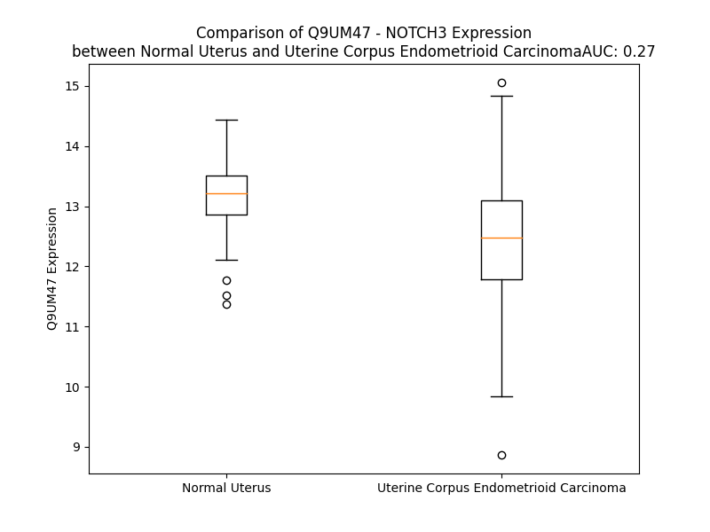

# Detailed Data for Q9UM47

## Introduction to the Detailed Summary

### How to Interpret the Results

- **Summary & Metrics**: This section provides a quick reference to essential protein attributes, including expression changes, family classification, and biomarker applications. Regulation status (upregulated/downregulated) indicates the protein's behavior in a disease context. Some information comes from the original excel file with the proteins selected from literature, while others are derived from the analyses.
- **Expression Comparison**: A visual representation comparing protein expression between normal and disease states. It highlights significant changes in expression levels that might indicate diagnostic or therapeutic relevance. This is data coming from transcriptomics experiments and could not translate similarly to protein levels.
- **Isoform Alignment**: An interactive view of isoform alignments, revealing structural and functional differences between variants of the protein.
- **Interactors & Homologs**: Tables listing known interaction partners and homologous proteins, the more interactors and homologs, the more complex the protein is to design an antibody for.
- **Biological Assemblies**: Information about the structural arrangement of the protein in different assemblies, providing insights into its functional state but also the complexity of the protein to develop antibodies.
- **Combined Per-Residue Information**: A detailed table summarizing residue-level data. This includes predictions for epitope regions, aggregation tendencies, and modifications that might impact the protein's function. Each row corresponds to a residue in the protein, providing insights into specific sites that may be important for research or drug development.
## Summary & Metrics

- **UniProt Accession**: Q9UM47
- **Gene Name**: Notch 3
- **Protein Name**: Neurogenic locus notch homolog protein 3
- **Swiss Prot**: NOTC3_HUMAN
- **Family**: transcription regulator
- **Biomarker Application**: unspecified application
- **Number of Isoforms**: 0
- **Regulation**: 1
- **(transcriptomics) AUC**: 0.27
- **(transcriptomics) Fold Change**: 1.05
- **(transcriptomics) Regulation**: Downregulated
- **Discotope Epitope Count**: 816
- **Max n_uniprots (Homo)**: 2
- **Max n_uniprots (Hetero)**: 2

## Expression Comparison

## Interactors

| preferredName_A   | preferredName_B   |   score |
|:------------------|:------------------|--------:|
| NOTCH3            | DLL1              |   0.999 |
| NOTCH3            | JAG2              |   0.999 |
| NOTCH3            | JAG1              |   0.999 |
| NOTCH3            | DLL3              |   0.998 |
| NOTCH3            | DLL4              |   0.998 |
| NOTCH3            | RBPJ              |   0.998 |
| NOTCH3            | MAML1             |   0.988 |
| NOTCH3            | MAML3             |   0.986 |
| NOTCH3            | MAML2             |   0.978 |
| NOTCH3            | LFNG              |   0.969 |
| NOTCH3            | NUMBL             |   0.962 |
| NOTCH3            | NUMB              |   0.961 |
| NOTCH3            | MFNG              |   0.955 |
| NOTCH3            | RFNG              |   0.952 |
| NOTCH3            | RBPJL             |   0.949 |
| NOTCH3            | ADAM17            |   0.94  |
| NOTCH3            | DVL2              |   0.93  |
| NOTCH3            | DVL1              |   0.93  |
| NOTCH3            | HES5              |   0.93  |
| NOTCH3            | DVL3              |   0.928 |
| NOTCH3            | NFKB1             |   0.919 |
| NOTCH3            | RELA              |   0.917 |
| NOTCH3            | TACC3             |   0.908 |
| NOTCH3            | WWP2              |   0.904 |

## Homologs

| uniprot_id   | gene_id   |
|:-------------|:----------|
| A0A096LNW5   | NOTCH2NLR |
| nan          | nan       |
| A0A8I5KR58   | NOTCH2NLA |
| P0DPK4       | NOTCH2NLC |
| A0A7P0TB20   | NOTCH1    |
| Q8TER0       | SNED1     |
| A0A494C1U9   | NOTCH2    |

## Biological Assemblies

|   Unnamed: 0 |   assembly |   n_uniprots | composition   | crystal_id   |
|-------------:|-----------:|-------------:|:--------------|:-------------|
|            0 |          1 |            1 | Homo          | 6xsw         |
|            1 |          2 |            1 | Homo          | 6xsw         |
|            2 |          3 |            1 | Homo          | 6xsw         |
|            3 |          4 |            1 | Homo          | 6xsw         |
|            0 |          1 |            1 | Homo          | 8os0         |
|            0 |          1 |            2 | Hetero        | 6wqu         |
|            0 |          1 |            2 | Homo          | 4zlp         |
|            0 |          1 |            1 | Homo          | 5czx         |
|            1 |          2 |            1 | Homo          | 5czx         |
|            0 |          1 |            1 | Homo          | 5czv         |

## Combined Per-Residue Information

|   res | aa   |   epitope_score | epitope   |   relative_surface_accessibility |   modeling_confidence |   Aggregation | modification           | glycosylation                   |
|------:|:-----|----------------:|:----------|---------------------------------:|----------------------:|--------------:|:-----------------------|:--------------------------------|
|     1 | M    |         0.06658 | False     |                          1.29297 |                 36    |         0     | N/A                    | N/A                             |
|     2 | G    |         0.15112 | True      |                          0.93164 |                 41.32 |         0     | N/A                    | N/A                             |
|     3 | P    |         0.09627 | True      |                          0.87697 |                 40.34 |         0     | N/A                    | N/A                             |
|     4 | G    |         0.08705 | True      |                          0.72638 |                 34.56 |         0     | N/A                    | N/A                             |
|     5 | A    |         0.04437 | False     |                          0.62761 |                 35.12 |         0     | N/A                    | N/A                             |
|     6 | R    |         0.06582 | False     |                          0.67454 |                 36.32 |         0     | N/A                    | N/A                             |
|     7 | G    |         0.10011 | True      |                          0.75281 |                 37.74 |         0     | N/A                    | N/A                             |
|     8 | R    |         0.08881 | True      |                          0.43126 |                 29.44 |         0     | N/A                    | N/A                             |
|     9 | R    |         0.12843 | True      |                          0.63902 |                 27.11 |         0     | N/A                    | N/A                             |
|    10 | R    |         0.14762 | True      |                          0.77308 |                 25.02 |         0     | N/A                    | N/A                             |
|    11 | R    |         0.13836 | True      |                          0.87863 |                 27.07 |         0     | N/A                    | N/A                             |
|    12 | R    |         0.10922 | True      |                          0.81079 |                 25.26 |         0     | N/A                    | N/A                             |
|    13 | R    |         0.17007 | True      |                          0.81023 |                 24.11 |         0     | N/A                    | N/A                             |
|    14 | P    |         0.09123 | True      |                          0.79144 |                 54.94 |         0     | N/A                    | N/A                             |
|    15 | M    |         0.19591 | True      |                          0.92011 |                 26.4  |         0     | N/A                    | N/A                             |
|    16 | S    |         0.12787 | True      |                          0.75228 |                 35.29 |         0     | N/A                    | N/A                             |
|    17 | P    |         0.13082 | True      |                          0.93831 |                 53.65 |         0     | N/A                    | N/A                             |
|    18 | P    |         0.11151 | True      |                          0.80296 |                 57.3  |         0     | N/A                    | N/A                             |
|    19 | P    |         0.08293 | True      |                          0.89721 |                 55.71 |         0     | N/A                    | N/A                             |
|    20 | P    |         0.17925 | True      |                          0.8404  |                 36.63 |         0     | N/A                    | N/A                             |
|    21 | P    |         0.08374 | True      |                          0.90064 |                 57.49 |         0     | N/A                    | N/A                             |
|    22 | P    |         0.10797 | True      |                          0.86747 |                 57.47 |         0     | N/A                    | N/A                             |
|    23 | P    |         0.10617 | True      |                          0.79639 |                 59.5  |         0     | N/A                    | N/A                             |
|    24 | V    |         0.08027 | True      |                          0.98401 |                 38.47 |         0     | N/A                    | N/A                             |
|    25 | R    |         0.18284 | True      |                          0.92496 |                 34.45 |         0     | N/A                    | N/A                             |
|    26 | A    |         0.13319 | True      |                          0.74758 |                 38.67 |         0     | N/A                    | N/A                             |
|    27 | L    |         0.11303 | True      |                          1.04371 |                 43.55 |         0     | N/A                    | N/A                             |
|    28 | P    |         0.10234 | True      |                          0.68655 |                 52.13 |         1.042 | N/A                    | N/A                             |
|    29 | L    |         0.11317 | True      |                          0.85914 |                 29.1  |        78.312 | N/A                    | N/A                             |
|    30 | L    |         0.08717 | True      |                          0.79259 |                 28.47 |        84.793 | N/A                    | N/A                             |
|    31 | L    |         0.10368 | True      |                          0.81607 |                 23.71 |        84.793 | N/A                    | N/A                             |
|    32 | L    |         0.14922 | True      |                          0.75739 |                 24.88 |        84.793 | N/A                    | N/A                             |
|    33 | L    |         0.06526 | False     |                          0.97264 |                 26.72 |        84.699 | N/A                    | N/A                             |
|    34 | A    |         0.13422 | True      |                          0.90627 |                 23.38 |        42.323 | N/A                    | N/A                             |
|    35 | G    |         0.22285 | True      |                          0.89307 |                 25.44 |         0.022 | N/A                    | N/A                             |
|    36 | P    |         0.10177 | True      |                          1.06197 |                 45.35 |         0     | N/A                    | N/A                             |
|    37 | G    |         0.20084 | True      |                          0.89557 |                 23.58 |         0     | N/A                    | N/A                             |
|    38 | A    |         0.09491 | True      |                          0.96835 |                 27.59 |         0     | N/A                    | N/A                             |
|    39 | A    |         0.06336 | False     |                          0.92282 |                 27.94 |         0     | N/A                    | N/A                             |
|    40 | A    |         0.07118 | False     |                          0.86884 |                 39.93 |         0     | N/A                    | N/A                             |
|    41 | P    |         0.0856  | True      |                          0.55638 |                 44.94 |         0     | N/A                    | N/A                             |
|    42 | P    |         0.048   | False     |                          0.6093  |                 53.78 |         0     | N/A                    | N/A                             |
|    43 | C    |         0.04488 | False     |                          0.22997 |                 52.77 |         0     | N/A                    | N/A                             |
|    44 | L    |         0.08338 | True      |                          0.90019 |                 48.56 |         0     | N/A                    | N/A                             |
|    45 | D    |         0.08224 | True      |                          0.92247 |                 43.37 |         0     | N/A                    | N/A                             |
|    46 | G    |         0.1425  | True      |                          0.74755 |                 52.95 |         0     | N/A                    | N/A                             |
|    47 | S    |         0.12067 | True      |                          0.58513 |                 56.06 |         0     | N/A                    | N/A                             |
|    48 | P    |         0.09549 | True      |                          0.4439  |                 60.87 |         0     | N/A                    | N/A                             |
|    49 | C    |         0.05255 | False     |                          0.10479 |                 69.26 |         0     | N/A                    | N/A                             |
|    50 | A    |         0.07123 | False     |                          0.36515 |                 66.95 |         0     | N/A                    | N/A                             |
|    51 | N    |         0.06008 | False     |                          0.47585 |                 69.13 |         0     | N/A                    | N/A                             |
|    52 | G    |         0.13531 | True      |                          0.91406 |                 65.15 |         0     | N/A                    | N/A                             |
|    53 | G    |         0.03695 | False     |                          0.08223 |                 68.19 |         0     | N/A                    | N/A                             |
|    54 | R    |         0.23099 | True      |                          0.7191  |                 71.32 |         0     | N/A                    | N/A                             |
|    55 | C    |         0.04487 | False     |                          0.18473 |                 68.08 |         0     | N/A                    | N/A                             |
|    56 | T    |         0.06639 | False     |                          0.29859 |                 68.33 |         0     | N/A                    | N/A                             |
|    57 | Q    |         0.06777 | False     |                          0.38228 |                 62.79 |         0     | N/A                    | N/A                             |
|    58 | L    |         0.13797 | True      |                          0.57171 |                 54.16 |         0     | N/A                    | N/A                             |
|    59 | P    |         0.12232 | True      |                          1.02803 |                 60.68 |         0     | N/A                    | N/A                             |
|    60 | S    |         0.07823 | False     |                          0.54733 |                 53.6  |         0     | N/A                    | N/A                             |
|    61 | R    |         0.07417 | False     |                          0.72247 |                 53.29 |         0     | N/A                    | N/A                             |
|    62 | E    |         0.06707 | False     |                          0.57748 |                 56.96 |         0     | N/A                    | N/A                             |
|    63 | A    |         0.08985 | True      |                          0.41903 |                 62.51 |         0     | N/A                    | N/A                             |
|    64 | A    |         0.0799  | True      |                          0.29442 |                 71.72 |         0     | N/A                    | N/A                             |
|    65 | C    |         0.05055 | False     |                          0.13954 |                 71.9  |         0     | N/A                    | N/A                             |
|    66 | L    |         0.15783 | True      |                          0.66391 |                 72.23 |         0     | N/A                    | N/A                             |
|    67 | C    |         0.0884  | True      |                          0.33116 |                 72.32 |         0     | N/A                    | N/A                             |
|    68 | P    |         0.06604 | False     |                          0.34173 |                 70.94 |         0     | N/A                    | N/A                             |
|    69 | P    |         0.11396 | True      |                          0.96236 |                 72.81 |         0     | N/A                    | N/A                             |
|    70 | G    |         0.0332  | False     |                          0.18028 |                 67.92 |         0     | N/A                    | N/A                             |
|    71 | W    |         0.11251 | True      |                          0.40906 |                 75.41 |         0     | N/A                    | N/A                             |
|    72 | V    |         0.02385 | False     |                          0.20184 |                 77.48 |         0     | N/A                    | N/A                             |
|    73 | G    |         0.03291 | False     |                          0.23626 |                 68.73 |         0     | N/A                    | N/A                             |
|    74 | E    |         0.06747 | False     |                          0.75016 |                 69.88 |         0     | N/A                    | N/A                             |
|    75 | R    |         0.12071 | True      |                          0.5386  |                 68.96 |         0     | N/A                    | N/A                             |
|    76 | C    |         0.01523 | False     |                          0       |                 76.39 |         0     | N/A                    | N/A                             |
|    77 | Q    |         0.19169 | True      |                          0.42692 |                 70.8  |         0     | N/A                    | N/A                             |
|    78 | L    |         0.05729 | False     |                          0.25555 |                 72.42 |         0     | N/A                    | N/A                             |
|    79 | E    |         0.05107 | False     |                          0.65786 |                 73.08 |         0     | N/A                    | N/A                             |
|    80 | D    |         0.03498 | False     |                          0.16524 |                 74.57 |         0     | N/A                    | N/A                             |
|    81 | P    |         0.03857 | False     |                          0.23326 |                 70.91 |         0     | N/A                    | N/A                             |
|    82 | C    |         0.04556 | False     |                          0.20039 |                 74.21 |         0     | N/A                    | N/A                             |
|    83 | H    |         0.10254 | True      |                          0.77716 |                 71.28 |         0     | N/A                    | N/A                             |
|    84 | S    |         0.10904 | True      |                          0.7623  |                 67.04 |         0     | N/A                    | N/A                             |
|    85 | G    |         0.04074 | False     |                          0.64141 |                 69.04 |         0     | N/A                    | N/A                             |
|    86 | P    |         0.04801 | False     |                          0.29295 |                 69.5  |         0     | N/A                    | N/A                             |
|    87 | C    |         0.05119 | False     |                          0.11275 |                 73.39 |         0     | N/A                    | N/A                             |
|    88 | A    |         0.0332  | False     |                          0.35206 |                 66.77 |         0     | N/A                    | N/A                             |
|    89 | G    |         0.02457 | False     |                          0.35294 |                 58.4  |         0     | N/A                    | N/A                             |
|    90 | R    |         0.04463 | False     |                          0.88689 |                 61.16 |         0     | N/A                    | N/A                             |
|    91 | G    |         0.00911 | False     |                          0.10826 |                 67.39 |         0     | N/A                    | N/A                             |
|    92 | V    |         0.03655 | False     |                          0.63408 |                 77.21 |         0     | N/A                    | N/A                             |
|    93 | C    |         0.02581 | False     |                          0.24422 |                 75.18 |         0     | N/A                    | N/A                             |
|    94 | Q    |         0.07298 | False     |                          0.54781 |                 74.33 |         0     | N/A                    | N/A                             |
|    95 | S    |         0.04795 | False     |                          0.33545 |                 75.36 |         0     | N/A                    | N/A                             |
|    96 | S    |         0.07018 | False     |                          0.38338 |                 68.22 |         0     | N/A                    | N/A                             |
|    97 | V    |         0.07635 | False     |                          0.42168 |                 68.74 |         0.141 | N/A                    | N/A                             |
|    98 | V    |         0.10261 | True      |                          0.53602 |                 65.93 |         0.141 | N/A                    | N/A                             |
|    99 | A    |         0.21801 | True      |                          0.94531 |                 58.14 |         0.141 | N/A                    | N/A                             |
|   100 | G    |         0.09391 | True      |                          0.65746 |                 58.51 |         0.141 | N/A                    | N/A                             |
|   101 | T    |         0.11672 | True      |                          0.53249 |                 64.94 |         0.141 | N/A                    | N/A                             |
|   102 | A    |         0.06337 | False     |                          0.27478 |                 70.15 |         0     | N/A                    | N/A                             |
|   103 | R    |         0.14384 | True      |                          0.43894 |                 73.05 |         0     | N/A                    | N/A                             |
|   104 | F    |         0.04928 | False     |                          0.44216 |                 77.57 |         0     | N/A                    | N/A                             |
|   105 | S    |         0.04642 | False     |                          0.4757  |                 73.86 |         0     | N/A                    | N/A                             |
|   106 | C    |         0.04008 | False     |                          0.13309 |                 77.6  |         0     | N/A                    | N/A                             |
|   107 | R    |         0.0721  | False     |                          0.71561 |                 76.41 |         0     | N/A                    | N/A                             |
|   108 | C    |         0.0291  | False     |                          0.26259 |                 70.05 |         0     | N/A                    | N/A                             |
|   109 | P    |         0.01004 | False     |                          0.25345 |                 66.12 |         0     | N/A                    | N/A                             |
|   110 | R    |         0.04693 | False     |                          0.85601 |                 62.39 |         0     | N/A                    | N/A                             |
|   111 | G    |         0.01756 | False     |                          0.13614 |                 59.1  |         0     | N/A                    | N/A                             |
|   112 | F    |         0.03252 | False     |                          0.23758 |                 63.23 |         0     | N/A                    | N/A                             |
|   113 | R    |         0.0312  | False     |                          0.20095 |                 66.8  |         0     | N/A                    | N/A                             |
|   114 | G    |         0.03712 | False     |                          0.36335 |                 63.51 |         0     | N/A                    | N/A                             |
|   115 | P    |         0.07948 | True      |                          0.79993 |                 67.8  |         0     | N/A                    | N/A                             |
|   116 | D    |         0.04911 | False     |                          0.28658 |                 71.03 |         0     | N/A                    | N/A                             |
|   117 | C    |         0.01528 | False     |                          0       |                 72.66 |         0     | N/A                    | N/A                             |
|   118 | S    |         0.03698 | False     |                          0.28754 |                 66.3  |         0     | N/A                    | N/A                             |
|   119 | L    |         0.05048 | False     |                          0.5787  |                 61.52 |         0     | N/A                    | N/A                             |
|   120 | P    |         0.04734 | False     |                          0.60349 |                 61.94 |         0     | N/A                    | N/A                             |
|   121 | D    |         0.0296  | False     |                          0.23991 |                 64.64 |         0     | N/A                    | N/A                             |
|   122 | P    |         0.04746 | False     |                          0.33275 |                 67.52 |         0     | N/A                    | N/A                             |
|   123 | C    |         0.0395  | False     |                          0.21485 |                 73.38 |         0     | N/A                    | N/A                             |
|   124 | L    |         0.07495 | False     |                          0.77174 |                 66.02 |         0     | N/A                    | N/A                             |
|   125 | S    |         0.08465 | True      |                          0.73023 |                 69.71 |         0     | N/A                    | N/A                             |
|   126 | S    |         0.09347 | True      |                          0.68049 |                 65.39 |         0     | N/A                    | N/A                             |
|   127 | P    |         0.05467 | False     |                          0.21883 |                 72.53 |         0     | N/A                    | N/A                             |
|   128 | C    |         0.03706 | False     |                          0.12174 |                 78.22 |         0     | N/A                    | N/A                             |
|   129 | A    |         0.04484 | False     |                          0.24983 |                 74.64 |         0     | N/A                    | N/A                             |
|   130 | H    |         0.06965 | False     |                          0.49894 |                 67.47 |         0     | N/A                    | N/A                             |
|   131 | G    |         0.07519 | False     |                          0.99784 |                 63.42 |         0     | N/A                    | N/A                             |
|   132 | A    |         0.01734 | False     |                          0.09139 |                 73.47 |         0     | N/A                    | N/A                             |
|   133 | R    |         0.10076 | True      |                          0.80268 |                 77.54 |         0     | N/A                    | N/A                             |
|   134 | C    |         0.02079 | False     |                          0.27076 |                 74.4  |         0     | N/A                    | N/A                             |
|   135 | S    |         0.04003 | False     |                          0.42288 |                 73.83 |         0     | N/A                    | N/A                             |
|   136 | V    |         0.01756 | False     |                          0.10199 |                 71.85 |         0     | N/A                    | N/A                             |
|   137 | G    |         0.0247  | False     |                          0.09565 |                 71.46 |         0     | N/A                    | N/A                             |
|   138 | P    |         0.02535 | False     |                          0.27878 |                 56.14 |         0     | N/A                    | N/A                             |
|   139 | D    |         0.03397 | False     |                          0.39211 |                 60.66 |         0     | N/A                    | N/A                             |
|   140 | G    |         0.03929 | False     |                          0.57806 |                 57.49 |         0     | N/A                    | N/A                             |
|   141 | R    |         0.07682 | False     |                          0.6494  |                 65.1  |         0     | N/A                    | N/A                             |
|   142 | F    |         0.02317 | False     |                          0.25363 |                 72.72 |         0     | N/A                    | N/A                             |
|   143 | L    |         0.06878 | False     |                          0.68665 |                 69.76 |         0     | N/A                    | N/A                             |
|   144 | C    |         0.0532  | False     |                          0.11665 |                 80.3  |         0     | N/A                    | N/A                             |
|   145 | S    |         0.08591 | True      |                          0.57248 |                 75.5  |         0     | N/A                    | N/A                             |
|   146 | C    |         0.06326 | False     |                          0.31026 |                 77.95 |         0     | N/A                    | N/A                             |
|   147 | P    |         0.06121 | False     |                          0.33948 |                 73.27 |         0     | N/A                    | N/A                             |
|   148 | P    |         0.16344 | True      |                          0.94894 |                 69.83 |         0     | N/A                    | N/A                             |
|   149 | G    |         0.02085 | False     |                          0.0599  |                 70.9  |         0     | N/A                    | N/A                             |
|   150 | Y    |         0.06353 | False     |                          0.19549 |                 78.82 |         0     | N/A                    | N/A                             |
|   151 | Q    |         0.0964  | True      |                          0.47596 |                 72.68 |         0     | N/A                    | N/A                             |
|   152 | G    |         0.0423  | False     |                          0.50619 |                 74.76 |         0     | N/A                    | N/A                             |
|   153 | R    |         0.05984 | False     |                          0.62212 |                 71.22 |         0     | N/A                    | N/A                             |
|   154 | S    |         0.03119 | False     |                          0.24635 |                 77.21 |         0     | N/A                    | N/A                             |
|   155 | C    |         0.01371 | False     |                          0.00086 |                 79.26 |         0     | N/A                    | N/A                             |
|   156 | R    |         0.10974 | True      |                          0.79337 |                 77.5  |         0     | N/A                    | N/A                             |
|   157 | S    |         0.04899 | False     |                          0.41912 |                 73.52 |         0     | N/A                    | N/A                             |
|   158 | D    |         0.12954 | True      |                          0.29037 |                 70.63 |         0     | N/A                    | N/A                             |
|   159 | V    |         0.04735 | False     |                          0.28156 |                 73.6  |         0     | N/A                    | N/A                             |
|   160 | D    |         0.05311 | False     |                          0.21004 |                 70.1  |         0     | N/A                    | N/A                             |
|   161 | E    |         0.06914 | False     |                          0.23027 |                 75.19 |         0     | N/A                    | N/A                             |
|   162 | C    |         0.0339  | False     |                          0.2164  |                 74.63 |         0     | N/A                    | N/A                             |
|   163 | R    |         0.15227 | True      |                          0.83187 |                 68.91 |         0     | N/A                    | N/A                             |
|   164 | V    |         0.09142 | True      |                          0.86916 |                 62.97 |         0     | N/A                    | N/A                             |
|   165 | G    |         0.13081 | True      |                          0.53558 |                 52.9  |         0     | N/A                    | N/A                             |
|   166 | E    |         0.12161 | True      |                          0.86998 |                 66.16 |         0     | N/A                    | N/A                             |
|   167 | P    |         0.08108 | True      |                          0.26636 |                 73.49 |         0     | N/A                    | N/A                             |
|   168 | C    |         0.05702 | False     |                          0.15003 |                 78.12 |         0     | N/A                    | N/A                             |
|   169 | R    |         0.15623 | True      |                          0.65407 |                 72.99 |         0     | N/A                    | N/A                             |
|   170 | H    |         0.09452 | True      |                          0.62936 |                 71.57 |         0     | N/A                    | N/A                             |
|   171 | G    |         0.09396 | True      |                          0.88392 |                 66.62 |         0     | N/A                    | N/A                             |
|   172 | G    |         0.03196 | False     |                          0.11869 |                 75.1  |         0     | N/A                    | N/A                             |
|   173 | T    |         0.07613 | False     |                          0.55581 |                 78.67 |         0     | N/A                    | N/A                             |
|   174 | C    |         0.01655 | False     |                          0.21566 |                 78.67 |         0     | N/A                    | N/A                             |
|   175 | L    |         0.0532  | False     |                          0.32562 |                 76.39 |         0     | N/A                    | N/A                             |
|   176 | N    |         0.07476 | False     |                          0.35452 |                 71.35 |         0     | N/A                    | N/A                             |
|   177 | T    |         0.07467 | False     |                          0.25646 |                 71.22 |         0     | N/A                    | N/A                             |
|   178 | P    |         0.12761 | True      |                          0.832   |                 69.41 |         0     | N/A                    | N/A                             |
|   179 | G    |         0.06343 | False     |                          0.28119 |                 68.95 |         0     | N/A                    | N/A                             |
|   180 | S    |         0.12019 | True      |                          0.44312 |                 76.44 |         0     | N/A                    | N/A                             |
|   181 | F    |         0.0952  | True      |                          0.37994 |                 81.74 |         0     | N/A                    | N/A                             |
|   182 | R    |         0.12536 | True      |                          0.56842 |                 79.82 |         0     | N/A                    | N/A                             |
|   183 | C    |         0.05692 | False     |                          0.13237 |                 79.6  |         0     | N/A                    | N/A                             |
|   184 | Q    |         0.11761 | True      |                          0.55781 |                 77.41 |         0     | N/A                    | N/A                             |
|   185 | C    |         0.07187 | False     |                          0.30618 |                 70.19 |         0     | N/A                    | N/A                             |
|   186 | P    |         0.06695 | False     |                          0.38991 |                 68.52 |         0     | N/A                    | N/A                             |
|   187 | A    |         0.09416 | True      |                          1.03905 |                 57.38 |         0     | N/A                    | N/A                             |
|   188 | G    |         0.05882 | False     |                          0.53016 |                 55.36 |         0     | N/A                    | N/A                             |
|   189 | Y    |         0.09604 | True      |                          0.42273 |                 65.62 |         0     | N/A                    | N/A                             |
|   190 | T    |         0.08533 | True      |                          0.43497 |                 68.43 |         0     | N/A                    | N/A                             |
|   191 | G    |         0.06026 | False     |                          0.39295 |                 66.09 |         0     | N/A                    | N/A                             |
|   192 | P    |         0.07885 | True      |                          0.8057  |                 70.53 |         0     | N/A                    | N/A                             |
|   193 | L    |         0.0645  | False     |                          0.4268  |                 75.61 |         0     | N/A                    | N/A                             |
|   194 | C    |         0.0118  | False     |                          0       |                 76.58 |         0     | N/A                    | N/A                             |
|   195 | E    |         0.10409 | True      |                          0.3616  |                 69.5  |         0     | N/A                    | N/A                             |
|   196 | N    |         0.06348 | False     |                          0.5087  |                 56.83 |         0     | N/A                    | N/A                             |
|   197 | P    |         0.13635 | True      |                          0.7953  |                 54.38 |         0     | N/A                    | N/A                             |
|   198 | A    |         0.08049 | True      |                          0.69544 |                 52.1  |         0     | N/A                    | N/A                             |
|   199 | V    |         0.10366 | True      |                          0.77754 |                 55.77 |         0     | N/A                    | N/A                             |
|   200 | P    |         0.06508 | False     |                          0.42975 |                 54.18 |         0     | N/A                    | N/A                             |
|   201 | C    |         0.03119 | False     |                          0.2766  |                 67    |         0     | N/A                    | N/A                             |
|   202 | A    |         0.15394 | True      |                          0.72429 |                 57.1  |         0     | N/A                    | N/A                             |
|   203 | P    |         0.18058 | True      |                          0.92974 |                 56.1  |         0     | N/A                    | N/A                             |
|   204 | S    |         0.0667  | False     |                          0.54584 |                 70.04 |         0     | N/A                    | N/A                             |
|   205 | P    |         0.06926 | False     |                          0.33445 |                 72.34 |         0     | N/A                    | N/A                             |
|   206 | C    |         0.05837 | False     |                          0.13202 |                 78.11 |         0     | N/A                    | N/A                             |
|   207 | R    |         0.06758 | False     |                          0.53539 |                 79.26 |         0     | N/A                    | N/A                             |
|   208 | N    |         0.03329 | False     |                          0.2348  |                 71.08 |         0     | N/A                    | N/A                             |
|   209 | G    |         0.07596 | False     |                          0.81312 |                 69.08 |         0     | N/A                    | N/A                             |
|   210 | G    |         0.02406 | False     |                          0.14637 |                 74.56 |         0     | N/A                    | N/A                             |
|   211 | T    |         0.05228 | False     |                          0.67677 |                 75.68 |         0     | N/A                    | N/A                             |
|   212 | C    |         0.0439  | False     |                          0.25327 |                 69.26 |         0     | N/A                    | N/A                             |
|   213 | R    |         0.11504 | True      |                          0.6314  |                 69.52 |         0     | N/A                    | N/A                             |
|   214 | Q    |         0.07285 | False     |                          0.4348  |                 64.33 |         0     | N/A                    | N/A                             |
|   215 | S    |         0.09496 | True      |                          0.506   |                 65.73 |         0     | N/A                    | N/A                             |
|   216 | G    |         0.10813 | True      |                          0.36878 |                 51.81 |         0     | N/A                    | N/A                             |
|   217 | D    |         0.12599 | True      |                          0.83713 |                 48.82 |         0     | N/A                    | N/A                             |
|   218 | L    |         0.14655 | True      |                          0.92943 |                 58.49 |         0     | N/A                    | N/A                             |
|   219 | T    |         0.14072 | True      |                          0.54666 |                 55.86 |         0     | N/A                    | N/A                             |
|   220 | Y    |         0.18416 | True      |                          0.44549 |                 74.62 |         0     | N/A                    | N/A                             |
|   221 | D    |         0.13597 | True      |                          0.36175 |                 69.67 |         0     | N/A                    | N/A                             |
|   222 | C    |         0.08203 | True      |                          0.23132 |                 76.89 |         0     | N/A                    | N/A                             |
|   223 | A    |         0.07118 | False     |                          0.61609 |                 71.91 |         0     | N/A                    | N/A                             |
|   224 | C    |         0.0535  | False     |                          0.37142 |                 76.64 |         0     | N/A                    | N/A                             |
|   225 | L    |         0.0526  | False     |                          0.58514 |                 74.58 |         0     | N/A                    | N/A                             |
|   226 | P    |         0.13455 | True      |                          0.84985 |                 67.7  |         0     | N/A                    | N/A                             |
|   227 | G    |         0.02683 | False     |                          0.16995 |                 68.57 |         0     | N/A                    | N/A                             |
|   228 | F    |         0.03955 | False     |                          0.17838 |                 76.54 |         0     | N/A                    | N/A                             |
|   229 | E    |         0.05163 | False     |                          0.54356 |                 73.26 |         0     | N/A                    | N/A                             |
|   230 | G    |         0.08212 | True      |                          0.48771 |                 76.04 |         0     | N/A                    | N/A                             |
|   231 | Q    |         0.0846  | True      |                          0.80149 |                 72.18 |         0     | N/A                    | N/A                             |
|   232 | N    |         0.07406 | False     |                          0.30169 |                 77.42 |         0     | N/A                    | N/A                             |
|   233 | C    |         0.00989 | False     |                          0.002   |                 81.16 |         0     | N/A                    | N/A                             |
|   234 | E    |         0.14169 | True      |                          0.39492 |                 78.59 |         0     | N/A                    | N/A                             |
|   235 | V    |         0.02315 | False     |                          0.13234 |                 73.36 |         0     | N/A                    | N/A                             |
|   236 | N    |         0.01532 | False     |                          0.03879 |                 69.44 |         0     | N/A                    | N/A                             |
|   237 | V    |         0.01594 | False     |                          0.59227 |                 73.36 |         0     | N/A                    | N/A                             |
|   238 | D    |         0.02739 | False     |                          0.36507 |                 69.03 |         0     | N/A                    | N/A                             |
|   239 | D    |         0.05816 | False     |                          0.38701 |                 76.75 |         0     | N/A                    | N/A                             |
|   240 | C    |         0.04153 | False     |                          0.16099 |                 74.88 |         0     | N/A                    | N/A                             |
|   241 | P    |         0.08975 | True      |                          0.84654 |                 66.76 |         0     | N/A                    | N/A                             |
|   242 | G    |         0.14565 | True      |                          0.80903 |                 62.91 |         0     | N/A                    | N/A                             |
|   243 | H    |         0.09091 | True      |                          0.43361 |                 77.91 |         0     | N/A                    | N/A                             |
|   244 | R    |         0.16255 | True      |                          0.67508 |                 76.54 |         0     | N/A                    | N/A                             |
|   245 | C    |         0.04971 | False     |                          0.14065 |                 79    |         0     | N/A                    | N/A                             |
|   246 | L    |         0.11409 | True      |                          0.61085 |                 67.11 |         0     | N/A                    | N/A                             |
|   247 | N    |         0.0569  | False     |                          0.47464 |                 68.06 |         0     | N/A                    | N/A                             |
|   248 | G    |         0.06928 | False     |                          0.86203 |                 66.64 |         0     | N/A                    | N/A                             |
|   249 | G    |         0.03273 | False     |                          0.1111  |                 74.19 |         0     | N/A                    | N/A                             |
|   250 | T    |         0.05626 | False     |                          0.57684 |                 75.96 |         0     | N/A                    | N/A                             |
|   251 | C    |         0.01968 | False     |                          0.18909 |                 75.01 |         0     | N/A                    | N/A                             |
|   252 | V    |         0.0477  | False     |                          0.40533 |                 74.26 |         0     | N/A                    | N/A                             |
|   253 | D    |         0.03916 | False     |                          0.17785 |                 61.65 |         0     | N/A                    | N/A                             |
|   254 | G    |         0.04111 | False     |                          0.25268 |                 68.53 |         0     | N/A                    | N/A                             |
|   255 | V    |         0.03466 | False     |                          0.53128 |                 66.18 |         0     | N/A                    | N/A                             |
|   256 | N    |         0.11142 | True      |                          0.61162 |                 63.91 |         0     | N/A                    | N/A                             |
|   257 | T    |         0.09426 | True      |                          0.61018 |                 67.74 |         0     | N/A                    | N/A                             |
|   258 | Y    |         0.07689 | False     |                          0.33065 |                 77.26 |         0     | N/A                    | N/A                             |
|   259 | N    |         0.08492 | True      |                          0.63156 |                 71.67 |         0     | N/A                    | N/A                             |
|   260 | C    |         0.04827 | False     |                          0.1347  |                 75.67 |         0     | N/A                    | N/A                             |
|   261 | Q    |         0.07984 | True      |                          0.57411 |                 73.83 |         0     | N/A                    | N/A                             |
|   262 | C    |         0.08292 | True      |                          0.30996 |                 68.52 |         0     | N/A                    | N/A                             |
|   263 | P    |         0.06929 | False     |                          0.325   |                 68.58 |         0     | N/A                    | N/A                             |
|   264 | P    |         0.1148  | True      |                          0.84729 |                 63.98 |         0     | N/A                    | N/A                             |
|   265 | E    |         0.0897  | True      |                          0.35914 |                 64.47 |         0     | N/A                    | N/A                             |
|   266 | W    |         0.05343 | False     |                          0.29086 |                 66.5  |         0     | N/A                    | N/A                             |
|   267 | T    |         0.06159 | False     |                          0.43176 |                 71.36 |         0     | N/A                    | N/A                             |
|   268 | G    |         0.05525 | False     |                          0.29353 |                 71.24 |         0     | N/A                    | N/A                             |
|   269 | Q    |         0.07715 | False     |                          0.70576 |                 69.82 |         0     | N/A                    | N/A                             |
|   270 | F    |         0.06997 | False     |                          0.33327 |                 75.5  |         0     | N/A                    | N/A                             |
|   271 | C    |         0.01632 | False     |                          0       |                 76.18 |         0     | N/A                    | N/A                             |
|   272 | T    |         0.06325 | False     |                          0.49796 |                 71.95 |         0     | N/A                    | N/A                             |
|   273 | E    |         0.11589 | True      |                          0.51818 |                 63.62 |         0     | N/A                    | N/A                             |
|   274 | D    |         0.08445 | True      |                          0.2892  |                 62.21 |         0     | N/A                    | N/A                             |
|   275 | V    |         0.0461  | False     |                          0.11632 |                 68.88 |         0     | N/A                    | N/A                             |
|   276 | D    |         0.0456  | False     |                          0.23882 |                 66.31 |         0     | N/A                    | N/A                             |
|   277 | E    |         0.042   | False     |                          0.17591 |                 73.18 |         0     | N/A                    | N/A                             |
|   278 | C    |         0.02895 | False     |                          0.15882 |                 71.93 |         0     | N/A                    | N/A                             |
|   279 | Q    |         0.11054 | True      |                          0.72996 |                 68.55 |         0     | N/A                    | N/A                             |
|   280 | L    |         0.13996 | True      |                          0.81634 |                 62.09 |         0     | N/A                    | N/A                             |
|   281 | Q    |         0.1635  | True      |                          0.59475 |                 61.99 |         0     | N/A                    | N/A                             |
|   282 | P    |         0.10863 | True      |                          0.82164 |                 53.87 |         0     | N/A                    | N/A                             |
|   283 | N    |         0.09318 | True      |                          0.75843 |                 54.54 |         0     | N/A                    | N/A                             |
|   284 | A    |         0.06255 | False     |                          0.16542 |                 67.4  |         0     | N/A                    | N/A                             |
|   285 | C    |         0.04132 | False     |                          0.05563 |                 74.48 |         0     | N/A                    | N/A                             |
|   286 | H    |         0.14548 | True      |                          0.55782 |                 67.35 |         0     | N/A                    | N/A                             |
|   287 | N    |         0.04483 | False     |                          0.4494  |                 61.65 |         0     | N/A                    | N/A                             |
|   288 | G    |         0.06446 | False     |                          0.68969 |                 65.18 |         0     | N/A                    | N/A                             |
|   289 | G    |         0.04234 | False     |                          0.17369 |                 73.9  |         0     | N/A                    | N/A                             |
|   290 | T    |         0.05888 | False     |                          0.52854 |                 76.76 |         0     | N/A                    | N/A                             |
|   291 | C    |         0.02095 | False     |                          0.20691 |                 72.37 |         0     | N/A                    | N/A                             |
|   292 | F    |         0.06128 | False     |                          0.55384 |                 72.8  |         0     | N/A                    | N/A                             |
|   293 | N    |         0.05372 | False     |                          0.35686 |                 65.77 |         0     | N/A                    | N/A                             |
|   294 | T    |         0.0957  | True      |                          0.52334 |                 65.72 |         0     | N/A                    | N/A                             |
|   295 | L    |         0.08786 | True      |                          0.91521 |                 57.42 |         0     | N/A                    | N/A                             |
|   296 | G    |         0.12825 | True      |                          0.36416 |                 62.42 |         0     | N/A                    | N/A                             |
|   297 | G    |         0.08762 | True      |                          0.19697 |                 67.17 |         0     | N/A                    | N/A                             |
|   298 | H    |         0.14667 | True      |                          0.47973 |                 74.51 |         0     | N/A                    | N/A                             |
|   299 | S    |         0.08053 | True      |                          0.45872 |                 72.92 |         0     | N/A                    | N/A                             |
|   300 | C    |         0.04366 | False     |                          0.15822 |                 75.61 |         0     | N/A                    | N/A                             |
|   301 | V    |         0.06085 | False     |                          0.51255 |                 74.1  |         0     | N/A                    | N/A                             |
|   302 | C    |         0.06128 | False     |                          0.30687 |                 73.76 |         0     | N/A                    | N/A                             |
|   303 | V    |         0.04872 | False     |                          0.46908 |                 73.18 |         0     | N/A                    | N/A                             |
|   304 | N    |         0.07762 | False     |                          0.67155 |                 56.6  |         0     | N/A                    | N/A                             |
|   305 | G    |         0.0231  | False     |                          0.01773 |                 64.46 |         0     | N/A                    | N/A                             |
|   306 | W    |         0.06373 | False     |                          0.31851 |                 64.81 |         0     | N/A                    | N/A                             |
|   307 | T    |         0.06949 | False     |                          0.43857 |                 62.79 |         0     | N/A                    | N/A                             |
|   308 | G    |         0.10722 | True      |                          0.35051 |                 68.56 |         0     | N/A                    | N/A                             |
|   309 | E    |         0.12773 | True      |                          0.86881 |                 65.45 |         0     | N/A                    | N/A                             |
|   310 | S    |         0.08646 | True      |                          0.34746 |                 71.61 |         0     | N/A                    | N/A                             |
|   311 | C    |         0.01369 | False     |                          0       |                 74.98 |         0     | N/A                    | N/A                             |
|   312 | S    |         0.11225 | True      |                          0.51904 |                 72.72 |         0     | N/A                    | N/A                             |
|   313 | Q    |         0.06512 | False     |                          0.47802 |                 62.57 |         0     | N/A                    | N/A                             |
|   314 | N    |         0.08139 | True      |                          0.40344 |                 65.14 |         0     | N/A                    | N/A                             |
|   315 | I    |         0.04477 | False     |                          0.25759 |                 59.18 |         0     | N/A                    | N/A                             |
|   316 | D    |         0.0484  | False     |                          0.51717 |                 61.92 |         0     | N/A                    | N/A                             |
|   317 | D    |         0.03676 | False     |                          0.25179 |                 65.91 |         0     | N/A                    | N/A                             |
|   318 | C    |         0.03121 | False     |                          0.18651 |                 67.71 |         0     | N/A                    | N/A                             |
|   319 | A    |         0.07604 | False     |                          0.79984 |                 56.45 |         0.241 | N/A                    | N/A                             |
|   320 | T    |         0.06927 | False     |                          0.76739 |                 55.7  |         1.2   | N/A                    | N/A                             |
|   321 | A    |         0.0915  | True      |                          0.74728 |                 53.03 |         1.518 | N/A                    | N/A                             |
|   322 | V    |         0.08047 | True      |                          0.33039 |                 64.92 |         1.518 | N/A                    | N/A                             |
|   323 | C    |         0.05672 | False     |                          0.14921 |                 70.21 |         1.518 | N/A                    | N/A                             |
|   324 | F    |         0.1215  | True      |                          0.60761 |                 61.49 |         1.518 | N/A                    | N/A                             |
|   325 | H    |         0.07252 | False     |                          0.85397 |                 49.31 |         0.493 | N/A                    | N/A                             |
|   326 | G    |         0.07897 | True      |                          0.89225 |                 55.03 |         0     | N/A                    | N/A                             |
|   327 | A    |         0.01624 | False     |                          0.14358 |                 66.28 |         0     | N/A                    | N/A                             |
|   328 | T    |         0.04118 | False     |                          0.57253 |                 71.97 |         0     | N/A                    | N/A                             |
|   329 | C    |         0.03072 | False     |                          0.29343 |                 70.38 |         0     | N/A                    | N/A                             |
|   330 | H    |         0.03661 | False     |                          0.40669 |                 63.49 |         0     | N/A                    | N/A                             |
|   331 | D    |         0.0649  | False     |                          0.39359 |                 63.98 |         0     | N/A                    | N/A                             |
|   332 | R    |         0.06002 | False     |                          0.29872 |                 63.08 |         0     | N/A                    | N/A                             |
|   333 | V    |         0.07918 | True      |                          0.52754 |                 59.88 |         9.793 | N/A                    | N/A                             |
|   334 | A    |         0.09795 | True      |                          0.56591 |                 62.5  |         9.793 | N/A                    | N/A                             |
|   335 | S    |         0.07937 | True      |                          0.31368 |                 58.58 |         9.793 | N/A                    | N/A                             |
|   336 | F    |         0.06372 | False     |                          0.37814 |                 71.01 |         9.793 | N/A                    | N/A                             |
|   337 | Y    |         0.06198 | False     |                          0.31635 |                 72.26 |         9.793 | N/A                    | N/A                             |
|   338 | C    |         0.03838 | False     |                          0.07153 |                 68.53 |         2.585 | N/A                    | N/A                             |
|   339 | A    |         0.04042 | False     |                          0.34306 |                 68.92 |         1.183 | N/A                    | N/A                             |
|   340 | C    |         0.05623 | False     |                          0.37184 |                 67.81 |         0     | N/A                    | N/A                             |
|   341 | P    |         0.04572 | False     |                          0.46116 |                 63.03 |         0     | N/A                    | N/A                             |
|   342 | M    |         0.08823 | True      |                          1.01173 |                 63.43 |         0     | N/A                    | N/A                             |
|   343 | G    |         0.05678 | False     |                          0.57412 |                 63.85 |         0     | N/A                    | N/A                             |
|   344 | K    |         0.06413 | False     |                          0.38219 |                 71.51 |         0     | N/A                    | N/A                             |
|   345 | T    |         0.04433 | False     |                          0.24432 |                 68.41 |         0     | N/A                    | N/A                             |
|   346 | G    |         0.03258 | False     |                          0.19798 |                 62.39 |         0     | N/A                    | N/A                             |
|   347 | L    |         0.05279 | False     |                          0.74976 |                 64.7  |         0     | N/A                    | N/A                             |
|   348 | L    |         0.04671 | False     |                          0.32397 |                 70.09 |         0     | N/A                    | N/A                             |
|   349 | C    |         0.03873 | False     |                          0.01781 |                 70.93 |         0     | N/A                    | N/A                             |
|   350 | H    |         0.07575 | False     |                          0.56954 |                 68.2  |         0     | N/A                    | N/A                             |
|   351 | L    |         0.06518 | False     |                          0.3182  |                 58.2  |         0     | N/A                    | N/A                             |
|   352 | D    |         0.07688 | False     |                          0.57276 |                 57.11 |         0     | N/A                    | N/A                             |
|   353 | D    |         0.03762 | False     |                          0.36893 |                 64.99 |         0     | N/A                    | N/A                             |
|   354 | A    |         0.01721 | False     |                          0.29562 |                 62.39 |         0     | N/A                    | N/A                             |
|   355 | C    |         0.03479 | False     |                          0.18541 |                 70.95 |         0     | N/A                    | N/A                             |
|   356 | V    |         0.04963 | False     |                          0.91191 |                 68.07 |         0     | N/A                    | N/A                             |
|   357 | S    |         0.01461 | False     |                          0.22392 |                 56.85 |         0     | N/A                    | N/A                             |
|   358 | N    |         0.06221 | False     |                          0.79011 |                 58.23 |         0     | N/A                    | N/A                             |
|   359 | P    |         0.06231 | False     |                          0.40893 |                 68.14 |         0     | N/A                    | N/A                             |
|   360 | C    |         0.03012 | False     |                          0.19656 |                 72.74 |         0     | N/A                    | N/A                             |
|   361 | H    |         0.06765 | False     |                          0.58424 |                 67.74 |         0     | N/A                    | N/A                             |
|   362 | E    |         0.04931 | False     |                          0.89501 |                 55.41 |         0     | N/A                    | N/A                             |
|   363 | D    |         0.05492 | False     |                          0.78602 |                 58.63 |         0     | N/A                    | N/A                             |
|   364 | A    |         0.02841 | False     |                          0.16421 |                 67.58 |         0     | N/A                    | N/A                             |
|   365 | I    |         0.08329 | True      |                          0.68534 |                 72.75 |         0     | N/A                    | N/A                             |
|   366 | C    |         0.01727 | False     |                          0.24015 |                 63.62 |         0     | N/A                    | N/A                             |
|   367 | D    |         0.04799 | False     |                          0.44723 |                 72.06 |         0     | N/A                    | N/A                             |
|   368 | T    |         0.02773 | False     |                          0.23193 |                 63.1  |         0     | N/A                    | N/A                             |
|   369 | N    |         0.05937 | False     |                          0.26775 |                 58.75 |         0     | N/A                    | N/A                             |
|   370 | P    |         0.04487 | False     |                          0.60133 |                 53.18 |         0     | N/A                    | N/A                             |
|   371 | V    |         0.058   | False     |                          0.88419 |                 54.29 |         0     | N/A                    | N/A                             |
|   372 | N    |         0.07253 | False     |                          0.52789 |                 59.43 |         0     | N/A                    | N/A                             |
|   373 | G    |         0.05255 | False     |                          0.3285  |                 52.57 |         0     | N/A                    | N/A                             |
|   374 | R    |         0.02937 | False     |                          0.23482 |                 60.28 |         0     | N/A                    | N/A                             |
|   375 | A    |         0.00908 | False     |                          0.22045 |                 61.82 |         0     | N/A                    | N/A                             |
|   376 | I    |         0.03666 | False     |                          0.53758 |                 67.64 |         0     | N/A                    | N/A                             |
|   377 | C    |         0.03763 | False     |                          0.36032 |                 70.11 |         0     | N/A                    | N/A                             |
|   378 | T    |         0.04085 | False     |                          0.51896 |                 73.71 |         0     | N/A                    | N/A                             |
|   379 | C    |         0.04746 | False     |                          0.34354 |                 63.67 |         0     | N/A                    | N/A                             |
|   380 | P    |         0.05239 | False     |                          0.35301 |                 63.69 |         0     | N/A                    | N/A                             |
|   381 | P    |         0.12533 | True      |                          0.96921 |                 62.04 |         0     | N/A                    | N/A                             |
|   382 | G    |         0.02754 | False     |                          0.21324 |                 56.55 |         0     | N/A                    | N/A                             |
|   383 | F    |         0.05811 | False     |                          0.46333 |                 65.68 |         0     | N/A                    | N/A                             |
|   384 | T    |         0.05168 | False     |                          0.49098 |                 68.33 |         0     | N/A                    | N/A                             |
|   385 | G    |         0.05236 | False     |                          0.43336 |                 62.39 |         0     | N/A                    | N/A                             |
|   386 | G    |         0.04163 | False     |                          1.02991 |                 64.16 |         0     | N/A                    | N/A                             |
|   387 | A    |         0.0413  | False     |                          0.53237 |                 64.61 |         0     | N/A                    | N/A                             |
|   388 | C    |         0.03631 | False     |                          0.05963 |                 72.25 |         0     | N/A                    | N/A                             |
|   389 | D    |         0.07546 | False     |                          0.63778 |                 69.62 |         0     | N/A                    | N/A                             |
|   390 | Q    |         0.05952 | False     |                          0.56082 |                 59.74 |         0     | N/A                    | N/A                             |
|   391 | D    |         0.12516 | True      |                          0.42688 |                 58.19 |         0     | N/A                    | N/A                             |
|   392 | V    |         0.04128 | False     |                          0.39903 |                 69.5  |         0     | N/A                    | N/A                             |
|   393 | D    |         0.07493 | False     |                          0.37289 |                 59.61 |         0     | N/A                    | N/A                             |
|   394 | E    |         0.04637 | False     |                          0.24822 |                 73.72 |         0     | N/A                    | N/A                             |
|   395 | C    |         0.02862 | False     |                          0.27203 |                 69.67 |         0     | N/A                    | N/A                             |
|   396 | S    |         0.10681 | True      |                          0.69392 |                 67.38 |         0     | N/A                    | N/A                             |
|   397 | I    |         0.11722 | True      |                          0.78763 |                 63.7  |         0     | N/A                    | N/A                             |
|   398 | G    |         0.13989 | True      |                          0.73784 |                 53.04 |         0     | N/A                    | N/A                             |
|   399 | A    |         0.10396 | True      |                          0.90848 |                 54.88 |         0     | N/A                    | N/A                             |
|   400 | N    |         0.05507 | False     |                          0.50224 |                 63.79 |         0     | N/A                    | N/A                             |
|   401 | P    |         0.04616 | False     |                          0.18654 |                 70.93 |         0     | N/A                    | N/A                             |
|   402 | C    |         0.0498  | False     |                          0.05572 |                 70.32 |         0     | N/A                    | N/A                             |
|   403 | E    |         0.09335 | True      |                          0.47036 |                 70.3  |         0     | N/A                    | N/A                             |
|   404 | H    |         0.04632 | False     |                          0.47272 |                 65.73 |         0     | N/A                    | N/A                             |
|   405 | L    |         0.06229 | False     |                          1.11433 |                 65.51 |         0     | N/A                    | N/A                             |
|   406 | G    |         0.02122 | False     |                          0.05912 |                 74.19 |         0     | N/A                    | N/A                             |
|   407 | R    |         0.07538 | False     |                          0.66778 |                 74.83 |         0     | N/A                    | N/A                             |
|   408 | C    |         0.03918 | False     |                          0.18544 |                 77.26 |         0     | N/A                    | N/A                             |
|   409 | V    |         0.06773 | False     |                          0.45223 |                 66.16 |         0     | N/A                    | N/A                             |
|   410 | N    |         0.07441 | False     |                          0.34245 |                 61.03 |         0     | N/A                    | N/A                             |
|   411 | T    |         0.13644 | True      |                          0.49497 |                 67.24 |         0     | N/A                    | N/A                             |
|   412 | Q    |         0.09121 | True      |                          0.82164 |                 54.09 |         0     | N/A                    | N/A                             |
|   413 | G    |         0.06904 | False     |                          0.21297 |                 62.89 |         0     | N/A                    | N/A                             |
|   414 | S    |         0.10841 | True      |                          0.39919 |                 62.93 |         0     | N/A                    | N/A                             |
|   415 | F    |         0.10691 | True      |                          0.19132 |                 74.4  |         0     | N/A                    | N/A                             |
|   416 | L    |         0.16202 | True      |                          0.60178 |                 69.1  |         0     | N/A                    | N/A                             |
|   417 | C    |         0.0575  | False     |                          0.07254 |                 76.5  |         0     | N/A                    | N/A                             |
|   418 | Q    |         0.06542 | False     |                          0.50302 |                 67.27 |         0     | N/A                    | N/A                             |
|   419 | C    |         0.07298 | False     |                          0.37955 |                 73.64 |         0     | N/A                    | N/A                             |
|   420 | G    |         0.04903 | False     |                          0.41664 |                 66.98 |         0     | N/A                    | N/A                             |
|   421 | R    |         0.13714 | True      |                          0.93614 |                 63.93 |         0     | N/A                    | N/A                             |
|   422 | G    |         0.02427 | False     |                          0.11607 |                 60.99 |         0     | N/A                    | N/A                             |
|   423 | Y    |         0.05742 | False     |                          0.1859  |                 72.72 |         0     | N/A                    | N/A                             |
|   424 | T    |         0.12724 | True      |                          0.4513  |                 67.49 |         0     | N/A                    | N/A                             |
|   425 | G    |         0.06324 | False     |                          0.31477 |                 69.67 |         0     | N/A                    | N/A                             |
|   426 | P    |         0.08974 | True      |                          0.68791 |                 68.04 |         0     | N/A                    | N/A                             |
|   427 | R    |         0.09185 | True      |                          0.39671 |                 74.6  |         0     | N/A                    | N/A                             |
|   428 | C    |         0.01588 | False     |                          0       |                 75.75 |         0     | N/A                    | N/A                             |
|   429 | E    |         0.16803 | True      |                          0.35618 |                 73.06 |         0     | N/A                    | N/A                             |
|   430 | T    |         0.05518 | False     |                          0.46801 |                 68.17 |         0     | N/A                    | N/A                             |
|   431 | D    |         0.02905 | False     |                          0.2866  |                 59.63 |         0     | N/A                    | N/A                             |
|   432 | V    |         0.04704 | False     |                          0.41862 |                 67.97 |         0     | N/A                    | N/A                             |
|   433 | N    |         0.02215 | False     |                          0.21553 |                 64.45 |         0     | N/A                    | N/A                             |
|   434 | E    |         0.05088 | False     |                          0.28107 |                 73.31 |         0     | N/A                    | N/A                             |
|   435 | C    |         0.02124 | False     |                          0.13541 |                 74.85 |         0     | N/A                    | N/A                             |
|   436 | L    |         0.06901 | False     |                          0.89457 |                 69.5  |         0     | N/A                    | N/A                             |
|   437 | S    |         0.11501 | True      |                          0.71935 |                 64.66 |         0     | N/A                    | N/A                             |
|   438 | G    |         0.09662 | True      |                          0.6826  |                 68.46 |         0     | N/A                    | N/A                             |
|   439 | P    |         0.06087 | False     |                          0.18849 |                 75.16 |         0     | N/A                    | N/A                             |
|   440 | C    |         0.03472 | False     |                          0.17706 |                 79.03 |         0     | N/A                    | N/A                             |
|   441 | R    |         0.14844 | True      |                          0.65102 |                 75.33 |         0     | N/A                    | N/A                             |
|   442 | N    |         0.07628 | False     |                          0.42633 |                 69.7  |         0     | N/A                    | N/A                             |
|   443 | Q    |         0.12454 | True      |                          0.82356 |                 66.3  |         0     | N/A                    | N/A                             |
|   444 | A    |         0.02258 | False     |                          0.11441 |                 72.12 |         0     | N/A                    | N/A                             |
|   445 | T    |         0.05163 | False     |                          0.49071 |                 79.07 |         0     | N/A                    | N/A                             |
|   446 | C    |         0.0133  | False     |                          0.1667  |                 76.85 |         0     | N/A                    | N/A                             |
|   447 | L    |         0.04478 | False     |                          0.09645 |                 67.43 |         0     | N/A                    | N/A                             |
|   448 | D    |         0.01864 | False     |                          0.04668 |                 68.16 |         0     | N/A                    | N/A                             |
|   449 | R    |         0.03623 | False     |                          0.18595 |                 67.57 |         0     | N/A                    | N/A                             |
|   450 | I    |         0.05359 | False     |                          0.59102 |                 66.85 |         0     | N/A                    | N/A                             |
|   451 | G    |         0.03349 | False     |                          0.32051 |                 60.8  |         0     | N/A                    | N/A                             |
|   452 | Q    |         0.06389 | False     |                          0.56178 |                 65.28 |         0     | N/A                    | N/A                             |
|   453 | F    |         0.04536 | False     |                          0.31683 |                 74.42 |         0.765 | N/A                    | N/A                             |
|   454 | T    |         0.05003 | False     |                          0.34773 |                 76.82 |         0.765 | N/A                    | N/A                             |
|   455 | C    |         0.04693 | False     |                          0.11618 |                 78.63 |         0.765 | N/A                    | N/A                             |
|   456 | I    |         0.09176 | True      |                          0.54992 |                 74.41 |         0.765 | N/A                    | N/A                             |
|   457 | C    |         0.0506  | False     |                          0.23369 |                 73.55 |         0.765 | N/A                    | N/A                             |
|   458 | M    |         0.08674 | True      |                          0.54831 |                 67.88 |         0.581 | N/A                    | N/A                             |
|   459 | A    |         0.0876  | True      |                          0.5858  |                 62.67 |         0.372 | N/A                    | N/A                             |
|   460 | G    |         0.02001 | False     |                          0.01383 |                 60.74 |         0.195 | N/A                    | N/A                             |
|   461 | F    |         0.07287 | False     |                          0.19976 |                 72.87 |         0.195 | N/A                    | N/A                             |
|   462 | T    |         0.11245 | True      |                          0.43199 |                 71.9  |         0     | N/A                    | N/A                             |
|   463 | G    |         0.08691 | True      |                          0.39626 |                 73.07 |         0     | N/A                    | N/A                             |
|   464 | T    |         0.06599 | False     |                          0.74541 |                 73.29 |         0     | N/A                    | N/A                             |
|   465 | Y    |         0.10316 | True      |                          0.44546 |                 78.13 |         0     | N/A                    | N/A                             |
|   466 | C    |         0.01636 | False     |                          0.001   |                 78.02 |         0     | N/A                    | N/A                             |
|   467 | E    |         0.23086 | True      |                          0.42436 |                 72.84 |         0     | N/A                    | N/A                             |
|   468 | V    |         0.08352 | True      |                          0.54554 |                 69.48 |         0     | N/A                    | N/A                             |
|   469 | D    |         0.10399 | True      |                          0.40513 |                 61.85 |         0     | N/A                    | N/A                             |
|   470 | I    |         0.08376 | True      |                          0.38457 |                 70.02 |         0     | N/A                    | N/A                             |
|   471 | D    |         0.05191 | False     |                          0.35824 |                 65.14 |         0     | N/A                    | N/A                             |
|   472 | E    |         0.06809 | False     |                          0.20114 |                 72.87 |         0     | N/A                    | N/A                             |
|   473 | C    |         0.03138 | False     |                          0.18864 |                 76.63 |         0     | N/A                    | N/A                             |
|   474 | Q    |         0.12333 | True      |                          0.73681 |                 70.36 |         0     | N/A                    | N/A                             |
|   475 | S    |         0.12464 | True      |                          0.67466 |                 72.94 |         0     | N/A                    | N/A                             |
|   476 | S    |         0.08942 | True      |                          0.68327 |                 71.45 |         0     | N/A                    | N/A                             |
|   477 | P    |         0.06165 | False     |                          0.18671 |                 76.35 |         0     | N/A                    | N/A                             |
|   478 | C    |         0.0343  | False     |                          0.13654 |                 80.69 |         0     | N/A                    | N/A                             |
|   479 | V    |         0.11999 | True      |                          0.50555 |                 80.34 |         0     | N/A                    | N/A                             |
|   480 | N    |         0.05637 | False     |                          0.49747 |                 70.24 |         0     | N/A                    | N/A                             |
|   481 | G    |         0.09824 | True      |                          0.83704 |                 65.94 |         0     | N/A                    | N/A                             |
|   482 | G    |         0.02058 | False     |                          0.14556 |                 79.99 |         0     | N/A                    | N/A                             |
|   483 | V    |         0.08676 | True      |                          0.67502 |                 76.56 |         0     | N/A                    | N/A                             |
|   484 | C    |         0.02947 | False     |                          0.26857 |                 79.19 |         0     | N/A                    | N/A                             |
|   485 | K    |         0.08432 | True      |                          0.53667 |                 71.63 |         0     | N/A                    | N/A                             |
|   486 | D    |         0.07103 | False     |                          0.41188 |                 67.79 |         0     | N/A                    | N/A                             |
|   487 | R    |         0.10617 | True      |                          0.59048 |                 72.19 |         0     | N/A                    | N/A                             |
|   488 | V    |         0.08247 | True      |                          0.57848 |                 63.98 |         0     | N/A                    | N/A                             |
|   489 | N    |         0.08453 | True      |                          0.56375 |                 62.62 |         0     | N/A                    | N/A                             |
|   490 | G    |         0.05316 | False     |                          0.31587 |                 66.32 |         0     | N/A                    | N/A                             |
|   491 | F    |         0.05744 | False     |                          0.31111 |                 76.95 |         0     | N/A                    | N/A                             |
|   492 | S    |         0.04973 | False     |                          0.22743 |                 75.48 |         0     | N/A                    | N/A                             |
|   493 | C    |         0.03952 | False     |                          0.17048 |                 79.64 |         0     | N/A                    | N/A                             |
|   494 | T    |         0.07449 | False     |                          0.44415 |                 76.29 |         0     | N/A                    | N/A                             |
|   495 | C    |         0.04354 | False     |                          0.3179  |                 76.66 |         0     | N/A                    | N/A                             |
|   496 | P    |         0.07465 | False     |                          0.42174 |                 72.78 |         0     | N/A                    | N/A                             |
|   497 | S    |         0.06059 | False     |                          0.79235 |                 64.82 |         0     | N/A                    | N/A                             |
|   498 | G    |         0.06859 | False     |                          0.11481 |                 62.59 |         0     | N/A                    | N/A                             |
|   499 | F    |         0.07517 | False     |                          0.28913 |                 69.23 |         0     | N/A                    | N/A                             |
|   500 | S    |         0.07211 | False     |                          0.31701 |                 71.07 |         0     | N/A                    | N/A                             |
|   501 | G    |         0.04219 | False     |                          0.37075 |                 70.51 |         0     | N/A                    | N/A                             |
|   502 | S    |         0.08058 | True      |                          0.63899 |                 71.79 |         0     | N/A                    | N/A                             |
|   503 | T    |         0.04155 | False     |                          0.21854 |                 78.28 |         0     | N/A                    | N/A                             |
|   504 | C    |         0.0094  | False     |                          0       |                 78.18 |         0     | N/A                    | N/A                             |
|   505 | Q    |         0.12104 | True      |                          0.43807 |                 74.4  |         0     | N/A                    | N/A                             |
|   506 | L    |         0.06959 | False     |                          0.58035 |                 65.36 |         0     | N/A                    | N/A                             |
|   507 | D    |         0.08484 | True      |                          0.37363 |                 57.84 |         0     | N/A                    | N/A                             |
|   508 | V    |         0.10391 | True      |                          0.44291 |                 64.65 |         0     | N/A                    | N/A                             |
|   509 | D    |         0.06325 | False     |                          0.48972 |                 62.6  |         0     | N/A                    | N/A                             |
|   510 | E    |         0.06254 | False     |                          0.27043 |                 71.17 |         0     | N/A                    | N/A                             |
|   511 | C    |         0.02784 | False     |                          0.12824 |                 76.07 |         0     | N/A                    | N/A                             |
|   512 | A    |         0.08886 | True      |                          0.75863 |                 65.77 |         0     | N/A                    | N/A                             |
|   513 | S    |         0.0763  | False     |                          0.66565 |                 62.4  |         0     | N/A                    | N/A                             |
|   514 | T    |         0.12891 | True      |                          0.79892 |                 70.75 |         0     | N/A                    | N/A                             |
|   515 | P    |         0.07678 | False     |                          0.26108 |                 72.51 |         0     | N/A                    | N/A                             |
|   516 | C    |         0.03564 | False     |                          0.144   |                 78.12 |         0     | N/A                    | N/A                             |
|   517 | R    |         0.14331 | True      |                          0.70044 |                 72.93 |         0     | N/A                    | N/A                             |
|   518 | N    |         0.0518  | False     |                          0.44661 |                 64.58 |         0     | N/A                    | N/A                             |
|   519 | G    |         0.11649 | True      |                          0.94424 |                 65.71 |         0     | N/A                    | N/A                             |
|   520 | A    |         0.02169 | False     |                          0.09905 |                 71.78 |         0     | N/A                    | N/A                             |
|   521 | K    |         0.06498 | False     |                          0.68647 |                 79.06 |         0     | N/A                    | N/A                             |
|   522 | C    |         0.02948 | False     |                          0.21266 |                 74.62 |         0     | N/A                    | N/A                             |
|   523 | V    |         0.04562 | False     |                          0.26468 |                 71.47 |         0     | N/A                    | N/A                             |
|   524 | D    |         0.06333 | False     |                          0.33276 |                 61.61 |         0     | N/A                    | N/A                             |
|   525 | Q    |         0.10374 | True      |                          0.39869 |                 66.97 |         0     | N/A                    | N/A                             |
|   526 | P    |         0.10339 | True      |                          0.68596 |                 54.68 |         0     | N/A                    | N/A                             |
|   527 | D    |         0.11904 | True      |                          0.69368 |                 57.3  |         0     | N/A                    | N/A                             |
|   528 | G    |         0.07297 | False     |                          0.26234 |                 62    |         0     | N/A                    | N/A                             |
|   529 | Y    |         0.10665 | True      |                          0.47661 |                 73.04 |         0     | N/A                    | N/A                             |
|   530 | E    |         0.07406 | False     |                          0.38651 |                 75.36 |         0     | N/A                    | N/A                             |
|   531 | C    |         0.04281 | False     |                          0.14147 |                 78.25 |         0     | N/A                    | N/A                             |
|   532 | R    |         0.08462 | True      |                          0.56471 |                 76.78 |         0     | N/A                    | N/A                             |
|   533 | C    |         0.03851 | False     |                          0.33489 |                 76.32 |         0     | N/A                    | N/A                             |
|   534 | A    |         0.05357 | False     |                          0.4592  |                 70.08 |         0     | N/A                    | N/A                             |
|   535 | E    |         0.05607 | False     |                          0.61704 |                 63.62 |         0     | N/A                    | N/A                             |
|   536 | G    |         0.03341 | False     |                          0.15478 |                 63.56 |         0     | N/A                    | N/A                             |
|   537 | F    |         0.05384 | False     |                          0.20922 |                 75.43 |         0     | N/A                    | N/A                             |
|   538 | E    |         0.05413 | False     |                          0.3295  |                 71.41 |         0     | N/A                    | N/A                             |
|   539 | G    |         0.07013 | False     |                          0.49149 |                 70.91 |         0     | N/A                    | N/A                             |
|   540 | T    |         0.09111 | True      |                          0.89011 |                 72.61 |         0     | N/A                    | N/A                             |
|   541 | L    |         0.10764 | True      |                          0.474   |                 76.07 |         0     | N/A                    | N/A                             |
|   542 | C    |         0.01115 | False     |                          0.00401 |                 78.69 |         0     | N/A                    | N/A                             |
|   543 | D    |         0.28132 | True      |                          0.58792 |                 72.36 |         0     | N/A                    | N/A                             |
|   544 | R    |         0.13232 | True      |                          0.59885 |                 67.33 |         0     | N/A                    | N/A                             |
|   545 | N    |         0.06099 | False     |                          0.37051 |                 62.42 |         0     | N/A                    | N/A                             |
|   546 | V    |         0.05304 | False     |                          0.45399 |                 73.28 |         0     | N/A                    | N/A                             |
|   547 | D    |         0.06689 | False     |                          0.53169 |                 66.44 |         0     | N/A                    | N/A                             |
|   548 | D    |         0.07308 | False     |                          0.31525 |                 74.81 |         0     | N/A                    | N/A                             |
|   549 | C    |         0.02948 | False     |                          0.1955  |                 76.09 |         0     | N/A                    | N/A                             |
|   550 | S    |         0.09528 | True      |                          0.63387 |                 68.77 |         0     | N/A                    | N/A                             |
|   551 | P    |         0.25069 | True      |                          0.938   |                 58.06 |         0     | N/A                    | N/A                             |
|   552 | D    |         0.07038 | False     |                          0.58609 |                 71.92 |         0     | N/A                    | N/A                             |
|   553 | P    |         0.06021 | False     |                          0.15686 |                 76.4  |         0     | N/A                    | N/A                             |
|   554 | C    |         0.05098 | False     |                          0.1683  |                 77.47 |         0     | N/A                    | N/A                             |
|   555 | H    |         0.10739 | True      |                          0.76428 |                 70.72 |         0     | N/A                    | N/A                             |
|   556 | H    |         0.07657 | False     |                          0.51384 |                 68.38 |         0     | N/A                    | N/A                             |
|   557 | G    |         0.03712 | False     |                          0.33713 |                 77.85 |         0     | N/A                    | N/A                             |
|   558 | R    |         0.12057 | True      |                          0.73941 |                 78.25 |         0     | N/A                    | N/A                             |
|   559 | C    |         0.03181 | False     |                          0.14151 |                 79.48 |         0     | N/A                    | N/A                             |
|   560 | V    |         0.06389 | False     |                          0.53142 |                 73.59 |         0     | N/A                    | N/A                             |
|   561 | D    |         0.09263 | True      |                          0.42677 |                 61.57 |         0     | N/A                    | N/A                             |
|   562 | G    |         0.09086 | True      |                          0.3051  |                 67.45 |         0     | N/A                    | N/A                             |
|   563 | I    |         0.10663 | True      |                          0.62315 |                 63.29 |         0     | N/A                    | N/A                             |
|   564 | A    |         0.05667 | False     |                          0.51677 |                 64.99 |         0     | N/A                    | N/A                             |
|   565 | S    |         0.05741 | False     |                          0.44249 |                 66.98 |         0     | N/A                    | N/A                             |
|   566 | F    |         0.06081 | False     |                          0.40653 |                 76.9  |         0     | N/A                    | N/A                             |
|   567 | S    |         0.07753 | False     |                          0.50232 |                 77.7  |         0     | N/A                    | N/A                             |
|   568 | C    |         0.03045 | False     |                          0.147   |                 79.63 |         0     | N/A                    | N/A                             |
|   569 | A    |         0.09354 | True      |                          0.56809 |                 75.29 |         0     | N/A                    | N/A                             |
|   570 | C    |         0.04196 | False     |                          0.36737 |                 76.5  |         0     | N/A                    | N/A                             |
|   571 | A    |         0.05301 | False     |                          0.43487 |                 69.99 |         0     | N/A                    | N/A                             |
|   572 | P    |         0.0734  | False     |                          0.8513  |                 69.4  |         0     | N/A                    | N/A                             |
|   573 | G    |         0.05863 | False     |                          0.12163 |                 62.12 |         0     | N/A                    | N/A                             |
|   574 | Y    |         0.08857 | True      |                          0.35617 |                 75.47 |         0     | N/A                    | N/A                             |
|   575 | T    |         0.08144 | True      |                          0.49387 |                 71.21 |         0     | N/A                    | N/A                             |
|   576 | G    |         0.05715 | False     |                          0.3904  |                 72.02 |         0     | N/A                    | N/A                             |
|   577 | T    |         0.11552 | True      |                          0.79219 |                 71.48 |         0     | N/A                    | N/A                             |
|   578 | R    |         0.08084 | True      |                          0.36285 |                 75.57 |         0     | N/A                    | N/A                             |
|   579 | C    |         0.00951 | False     |                          0       |                 78.74 |         0     | N/A                    | N/A                             |
|   580 | E    |         0.20269 | True      |                          0.52348 |                 75.84 |         0     | N/A                    | N/A                             |
|   581 | S    |         0.05406 | False     |                          0.36987 |                 74.05 |         0     | N/A                    | N/A                             |
|   582 | Q    |         0.09369 | True      |                          0.42886 |                 61.72 |         0     | N/A                    | N/A                             |
|   583 | V    |         0.06155 | False     |                          0.37705 |                 71.54 |         0     | N/A                    | N/A                             |
|   584 | D    |         0.04578 | False     |                          0.44997 |                 68.9  |         0     | N/A                    | N/A                             |
|   585 | E    |         0.06446 | False     |                          0.18725 |                 74.16 |         0     | N/A                    | N/A                             |
|   586 | C    |         0.02548 | False     |                          0.15594 |                 77.55 |         0     | N/A                    | N/A                             |
|   587 | R    |         0.16761 | True      |                          0.83837 |                 73.33 |         0     | N/A                    | N/A                             |
|   588 | S    |         0.12669 | True      |                          0.67711 |                 73.68 |         0     | N/A                    | N/A                             |
|   589 | Q    |         0.12462 | True      |                          0.75804 |                 73.1  |         0     | N/A                    | N/A                             |
|   590 | P    |         0.04657 | False     |                          0.1454  |                 75.89 |         0     | N/A                    | N/A                             |
|   591 | C    |         0.04669 | False     |                          0.10111 |                 79.63 |         0     | N/A                    | N/A                             |
|   592 | R    |         0.12665 | True      |                          0.68332 |                 79.53 |         0     | N/A                    | N/A                             |
|   593 | H    |         0.03037 | False     |                          0.39179 |                 69.76 |         0     | N/A                    | N/A                             |
|   594 | G    |         0.08827 | True      |                          0.82402 |                 69.24 |         0     | N/A                    | N/A                             |
|   595 | G    |         0.03049 | False     |                          0.15711 |                 76.75 |         0     | N/A                    | N/A                             |
|   596 | K    |         0.09432 | True      |                          0.7707  |                 78.21 |         0     | N/A                    | N/A                             |
|   597 | C    |         0.02461 | False     |                          0.26429 |                 80.47 |         0     | N/A                    | N/A                             |
|   598 | L    |         0.08639 | True      |                          0.60755 |                 71.02 |         0     | N/A                    | N/A                             |
|   599 | D    |         0.06628 | False     |                          0.39044 |                 74.64 |         0     | N/A                    | N/A                             |
|   600 | L    |         0.11394 | True      |                          0.55384 |                 71.35 |         0.27  | N/A                    | N/A                             |
|   601 | V    |         0.06788 | False     |                          0.63389 |                 66.85 |         0.27  | N/A                    | N/A                             |
|   602 | D    |         0.10014 | True      |                          0.47104 |                 64.25 |         0.27  | N/A                    | N/A                             |
|   603 | K    |         0.11336 | True      |                          0.62872 |                 67.21 |         0.27  | N/A                    | N/A                             |
|   604 | Y    |         0.09309 | True      |                          0.35707 |                 80.03 |         0.27  | N/A                    | N/A                             |
|   605 | L    |         0.09843 | True      |                          0.62321 |                 72.07 |         0.27  | N/A                    | N/A                             |
|   606 | C    |         0.04675 | False     |                          0.09179 |                 78.98 |         0     | N/A                    | N/A                             |
|   607 | R    |         0.10533 | True      |                          0.74012 |                 70.81 |         0     | N/A                    | N/A                             |
|   608 | C    |         0.04074 | False     |                          0.30843 |                 76.85 |         0     | N/A                    | N/A                             |
|   609 | P    |         0.06211 | False     |                          0.36266 |                 73.39 |         0     | N/A                    | N/A                             |
|   610 | S    |         0.10779 | True      |                          0.7401  |                 67.72 |         0     | N/A                    | N/A                             |
|   611 | G    |         0.03278 | False     |                          0.16113 |                 68.59 |         0     | N/A                    | N/A                             |
|   612 | T    |         0.02926 | False     |                          0.05489 |                 79.09 |         0     | N/A                    | N/A                             |
|   613 | T    |         0.06884 | False     |                          0.46377 |                 70.97 |         0     | N/A                    | N/A                             |
|   614 | G    |         0.06155 | False     |                          0.46912 |                 74.34 |         0     | N/A                    | N/A                             |
|   615 | V    |         0.08245 | True      |                          0.84706 |                 76.29 |         0     | N/A                    | N/A                             |
|   616 | N    |         0.03987 | False     |                          0.21614 |                 78.12 |         0     | N/A                    | N/A                             |
|   617 | C    |         0.00833 | False     |                          0       |                 80.18 |         0     | N/A                    | N/A                             |
|   618 | E    |         0.17447 | True      |                          0.39747 |                 76.1  |         0     | N/A                    | N/A                             |
|   619 | V    |         0.07955 | True      |                          0.55411 |                 71.94 |         0     | N/A                    | N/A                             |
|   620 | N    |         0.04147 | False     |                          0.24827 |                 64.39 |         0     | N/A                    | N/A                             |
|   621 | I    |         0.08697 | True      |                          0.55695 |                 69.56 |         0     | N/A                    | N/A                             |
|   622 | D    |         0.0813  | True      |                          0.46643 |                 66.34 |         0     | N/A                    | N/A                             |
|   623 | D    |         0.05197 | False     |                          0.31198 |                 73.06 |         0     | N/A                    | N/A                             |
|   624 | C    |         0.02573 | False     |                          0.10461 |                 73.99 |         0     | N/A                    | N/A                             |
|   625 | A    |         0.06477 | False     |                          0.69457 |                 67.87 |         0     | N/A                    | N/A                             |
|   626 | S    |         0.07116 | False     |                          0.6592  |                 72.27 |         0     | N/A                    | N/A                             |
|   627 | N    |         0.09438 | True      |                          0.77357 |                 64.23 |         0     | N/A                    | N/A                             |
|   628 | P    |         0.0779  | False     |                          0.26625 |                 72.73 |         0     | N/A                    | N/A                             |
|   629 | C    |         0.03914 | False     |                          0.13414 |                 77.92 |         0     | N/A                    | N/A                             |
|   630 | T    |         0.0803  | True      |                          0.62591 |                 68.44 |         0.232 | N/A                    | N/A                             |
|   631 | F    |         0.05475 | False     |                          0.47342 |                 74.12 |         0.232 | N/A                    | N/A                             |
|   632 | G    |         0.01982 | False     |                          0.15881 |                 75.37 |         0.232 | N/A                    | N/A                             |
|   633 | V    |         0.06315 | False     |                          0.69596 |                 77.99 |         0.232 | N/A                    | N/A                             |
|   634 | C    |         0.02377 | False     |                          0.20343 |                 75.68 |         0.232 | N/A                    | N/A                             |
|   635 | R    |         0.07855 | False     |                          0.64492 |                 77.83 |         0     | N/A                    | N/A                             |
|   636 | D    |         0.05289 | False     |                          0.40927 |                 65.77 |         0     | N/A                    | N/A                             |
|   637 | G    |         0.04057 | False     |                          0.20923 |                 68.1  |         0     | N/A                    | N/A                             |
|   638 | I    |         0.07562 | False     |                          0.36157 |                 67.99 |         0     | N/A                    | N/A                             |
|   639 | N    |         0.08314 | True      |                          0.57814 |                 65.5  |         0     | N/A                    | N/A                             |
|   640 | R    |         0.11779 | True      |                          0.61524 |                 67.68 |         0     | N/A                    | N/A                             |
|   641 | Y    |         0.09278 | True      |                          0.45495 |                 73.47 |         0     | N/A                    | N/A                             |
|   642 | D    |         0.0775  | False     |                          0.59704 |                 77.65 |         0     | N/A                    | N/A                             |
|   643 | C    |         0.04245 | False     |                          0.10447 |                 77.14 |         0     | N/A                    | N/A                             |
|   644 | V    |         0.06097 | False     |                          0.52397 |                 78.68 |         0     | N/A                    | N/A                             |
|   645 | C    |         0.06326 | False     |                          0.28409 |                 77.08 |         0     | N/A                    | N/A                             |
|   646 | Q    |         0.06423 | False     |                          0.469   |                 71.61 |         0     | N/A                    | N/A                             |
|   647 | P    |         0.05699 | False     |                          0.73843 |                 65.7  |         0     | N/A                    | N/A                             |
|   648 | G    |         0.02016 | False     |                          0.05392 |                 60.05 |         0     | N/A                    | N/A                             |
|   649 | F    |         0.06396 | False     |                          0.19269 |                 75.95 |         0     | N/A                    | N/A                             |
|   650 | T    |         0.09814 | True      |                          0.45316 |                 75.11 |         0     | N/A                    | N/A                             |
|   651 | G    |         0.04239 | False     |                          0.28611 |                 71.79 |         0     | N/A                    | N/A                             |
|   652 | P    |         0.13089 | True      |                          0.89743 |                 71.03 |         0     | N/A                    | N/A                             |
|   653 | L    |         0.07043 | False     |                          0.46988 |                 74.84 |         0     | N/A                    | N/A                             |
|   654 | C    |         0.00907 | False     |                          0       |                 76.36 |         0     | N/A                    | N/A                             |
|   655 | N    |         0.12609 | True      |                          0.5474  |                 73.94 |         0     | N/A                    | N/A                             |
|   656 | V    |         0.06938 | False     |                          0.55601 |                 70.61 |         0     | N/A                    | N/A                             |
|   657 | E    |         0.06775 | False     |                          0.48913 |                 59.4  |         0     | N/A                    | N/A                             |
|   658 | I    |         0.06285 | False     |                          0.43946 |                 74.08 |         0     | N/A                    | N/A                             |
|   659 | N    |         0.06807 | False     |                          0.52807 |                 71.43 |         0     | N/A                    | N/A                             |
|   660 | E    |         0.04583 | False     |                          0.23378 |                 73.99 |         0     | N/A                    | N/A                             |
|   661 | C    |         0.03584 | False     |                          0.16286 |                 77.12 |         0     | N/A                    | N/A                             |
|   662 | A    |         0.11463 | True      |                          0.85022 |                 71.35 |         0     | N/A                    | N/A                             |
|   663 | S    |         0.05847 | False     |                          0.65312 |                 75.05 |         0     | N/A                    | N/A                             |
|   664 | S    |         0.10514 | True      |                          0.70452 |                 66.34 |         0     | N/A                    | N/A                             |
|   665 | P    |         0.07298 | False     |                          0.26756 |                 71.7  |         0     | N/A                    | N/A                             |
|   666 | C    |         0.0399  | False     |                          0.16634 |                 75.09 |         0     | N/A                    | N/A                             |
|   667 | G    |         0.07481 | False     |                          0.43997 |                 71.72 |         0     | N/A                    | N/A                             |
|   668 | E    |         0.09377 | True      |                          0.9284  |                 55.61 |         0     | N/A                    | N/A                             |
|   669 | G    |         0.12781 | True      |                          0.86766 |                 61.59 |         0     | N/A                    | N/A                             |
|   670 | G    |         0.02521 | False     |                          0.18625 |                 71.38 |         0     | N/A                    | N/A                             |
|   671 | S    |         0.06758 | False     |                          0.51558 |                 75.75 |         0     | N/A                    | N/A                             |
|   672 | C    |         0.02254 | False     |                          0.27766 |                 80.02 |         0     | N/A                    | N/A                             |
|   673 | V    |         0.05526 | False     |                          0.34655 |                 73.51 |         0     | N/A                    | N/A                             |
|   674 | D    |         0.06181 | False     |                          0.31434 |                 67.21 |         0     | N/A                    | N/A                             |
|   675 | G    |         0.03896 | False     |                          0.27771 |                 64.5  |         0     | N/A                    | N/A                             |
|   676 | E    |         0.11288 | True      |                          0.75059 |                 56.74 |         0     | N/A                    | N/A                             |
|   677 | N    |         0.08523 | True      |                          0.5264  |                 62.45 |         0     | N/A                    | N/A                             |
|   678 | G    |         0.06234 | False     |                          0.38826 |                 64.33 |         0     | N/A                    | N/A                             |
|   679 | F    |         0.06247 | False     |                          0.38108 |                 76.48 |         0     | N/A                    | N/A                             |
|   680 | R    |         0.07756 | False     |                          0.52307 |                 71.13 |         0     | N/A                    | N/A                             |
|   681 | C    |         0.03715 | False     |                          0.08127 |                 78.21 |         0     | N/A                    | N/A                             |
|   682 | L    |         0.11374 | True      |                          0.67548 |                 67.93 |         0     | N/A                    | N/A                             |
|   683 | C    |         0.04015 | False     |                          0.21767 |                 70.93 |         0     | N/A                    | N/A                             |
|   684 | P    |         0.0855  | True      |                          0.42204 |                 67.1  |         0     | N/A                    | N/A                             |
|   685 | P    |         0.12994 | True      |                          1.07514 |                 55.11 |         0     | N/A                    | N/A                             |
|   686 | G    |         0.08469 | True      |                          0.75759 |                 49.52 |         0     | N/A                    | N/A                             |
|   687 | S    |         0.06522 | False     |                          0.22807 |                 62.89 |         0     | N/A                    | N/A                             |
|   688 | L    |         0.05501 | False     |                          0.46164 |                 54.95 |         0     | N/A                    | N/A                             |
|   689 | P    |         0.09945 | True      |                          0.65812 |                 53.8  |         0     | N/A                    | N/A                             |
|   690 | P    |         0.24405 | True      |                          0.71724 |                 58.55 |         0     | N/A                    | N/A                             |
|   691 | L    |         0.09687 | True      |                          0.51365 |                 66.25 |         0     | N/A                    | N/A                             |
|   692 | C    |         0.0359  | False     |                          0.15802 |                 71.12 |         0     | N/A                    | N/A                             |
|   693 | L    |         0.08134 | True      |                          0.53501 |                 60.93 |         0     | N/A                    | N/A                             |
|   694 | P    |         0.10212 | True      |                          0.63602 |                 57.94 |         0     | N/A                    | N/A                             |
|   695 | P    |         0.11543 | True      |                          0.73887 |                 55.43 |         0     | N/A                    | N/A                             |
|   696 | S    |         0.16587 | True      |                          0.7982  |                 53.49 |         0     | N/A                    | N/A                             |
|   697 | H    |         0.08506 | True      |                          0.48564 |                 62.27 |         0     | N/A                    | N/A                             |
|   698 | P    |         0.06607 | False     |                          0.5056  |                 59.86 |         0     | N/A                    | N/A                             |
|   699 | C    |         0.03264 | False     |                          0.24698 |                 67.92 |         0     | N/A                    | N/A                             |
|   700 | A    |         0.06132 | False     |                          0.44403 |                 60.12 |         0     | N/A                    | N/A                             |
|   701 | H    |         0.10589 | True      |                          0.90211 |                 65.25 |         0     | N/A                    | N/A                             |
|   702 | E    |         0.09388 | True      |                          0.83273 |                 66.71 |         0     | N/A                    | N/A                             |
|   703 | P    |         0.03152 | False     |                          0.12964 |                 75.12 |         0     | N/A                    | N/A                             |
|   704 | C    |         0.03324 | False     |                          0.17758 |                 78.36 |         0     | N/A                    | N/A                             |
|   705 | S    |         0.08756 | True      |                          0.57909 |                 69.32 |         0     | N/A                    | N/A                             |
|   706 | H    |         0.07128 | False     |                          0.37101 |                 72.53 |         0     | N/A                    | N/A                             |
|   707 | G    |         0.02275 | False     |                          0.24047 |                 74.76 |         0     | N/A                    | N/A                             |
|   708 | I    |         0.08253 | True      |                          0.67357 |                 78.49 |         0     | N/A                    | N/A                             |
|   709 | C    |         0.02046 | False     |                          0.25336 |                 74.2  |         0     | N/A                    | N/A                             |
|   710 | Y    |         0.03735 | False     |                          0.27661 |                 74.65 |         0     | N/A                    | N/A                             |
|   711 | D    |         0.07527 | False     |                          0.43526 |                 67.96 |         0     | N/A                    | N/A                             |
|   712 | A    |         0.0517  | False     |                          0.30682 |                 65.31 |         0     | N/A                    | N/A                             |
|   713 | P    |         0.12721 | True      |                          1.12118 |                 45.59 |         0     | N/A                    | N/A                             |
|   714 | G    |         0.09838 | True      |                          1.10645 |                 48.07 |         0     | N/A                    | N/A                             |
|   715 | G    |         0.07017 | False     |                          0.31281 |                 69.72 |         0     | N/A                    | N/A                             |
|   716 | F    |         0.04971 | False     |                          0.41273 |                 76.58 |         0     | N/A                    | N/A                             |
|   717 | R    |         0.07302 | False     |                          0.3642  |                 76.15 |         0     | N/A                    | N/A                             |
|   718 | C    |         0.02434 | False     |                          0.09422 |                 79.61 |         0     | N/A                    | N/A                             |
|   719 | V    |         0.02225 | False     |                          0.12191 |                 78.7  |         0     | N/A                    | N/A                             |
|   720 | C    |         0.02795 | False     |                          0.3154  |                 70.34 |         0     | N/A                    | N/A                             |
|   721 | E    |         0.07735 | False     |                          0.45484 |                 74.64 |         0     | N/A                    | N/A                             |
|   722 | P    |         0.09709 | True      |                          1.02295 |                 60.8  |         0     | N/A                    | N/A                             |
|   723 | G    |         0.04749 | False     |                          0.47157 |                 49.92 |         0     | N/A                    | N/A                             |
|   724 | W    |         0.08081 | True      |                          0.41362 |                 70.07 |         0     | N/A                    | N/A                             |
|   725 | S    |         0.03611 | False     |                          0.45206 |                 72.32 |         0     | N/A                    | N/A                             |
|   726 | G    |         0.04829 | False     |                          0.35053 |                 69.78 |         0     | N/A                    | N/A                             |
|   727 | P    |         0.0458  | False     |                          0.84334 |                 68.96 |         0     | N/A                    | N/A                             |
|   728 | R    |         0.07052 | False     |                          0.54767 |                 75.3  |         0     | N/A                    | N/A                             |
|   729 | C    |         0.00961 | False     |                          0       |                 76.11 |         0     | N/A                    | N/A                             |
|   730 | S    |         0.07139 | False     |                          0.53512 |                 75.18 |         0     | N/A                    | N/A                             |
|   731 | Q    |         0.06076 | False     |                          0.61972 |                 58.12 |         0     | N/A                    | N/A                             |
|   732 | S    |         0.06187 | False     |                          0.53744 |                 53.88 |         0     | N/A                    | N/A                             |
|   733 | L    |         0.07154 | False     |                          1.00876 |                 41.84 |         0     | N/A                    | N/A                             |
|   734 | A    |         0.06664 | False     |                          1.08963 |                 39.45 |         0     | N/A                    | N/A                             |
|   735 | R    |         0.09641 | True      |                          0.82651 |                 41.44 |         0     | N/A                    | N/A                             |
|   736 | D    |         0.08418 | True      |                          0.5336  |                 43.41 |         0     | N/A                    | N/A                             |
|   737 | A    |         0.05634 | False     |                          0.63341 |                 51.91 |         0     | N/A                    | N/A                             |
|   738 | C    |         0.04817 | False     |                          0.35891 |                 64.46 |         0     | N/A                    | N/A                             |
|   739 | E    |         0.12959 | True      |                          0.71892 |                 55.27 |         0     | N/A                    | N/A                             |
|   740 | S    |         0.12294 | True      |                          0.68288 |                 59.65 |         0     | N/A                    | N/A                             |
|   741 | Q    |         0.08488 | True      |                          0.83872 |                 66.68 |         0     | N/A                    | N/A                             |
|   742 | P    |         0.09473 | True      |                          0.24061 |                 63.25 |         0     | N/A                    | N/A                             |
|   743 | C    |         0.04914 | False     |                          0.20619 |                 72    |         0     | N/A                    | N/A                             |
|   744 | R    |         0.10194 | True      |                          0.65781 |                 64.91 |         0     | N/A                    | N/A                             |
|   745 | A    |         0.08835 | True      |                          0.64585 |                 58.55 |         0     | N/A                    | N/A                             |
|   746 | G    |         0.0936  | True      |                          0.97616 |                 58.88 |         0     | N/A                    | N/A                             |
|   747 | G    |         0.03086 | False     |                          0.17423 |                 67.19 |         0     | N/A                    | N/A                             |
|   748 | T    |         0.06793 | False     |                          0.70601 |                 74.71 |         0     | N/A                    | N/A                             |
|   749 | C    |         0.02538 | False     |                          0.27734 |                 67.69 |         0     | N/A                    | N/A                             |
|   750 | S    |         0.05443 | False     |                          0.44736 |                 67.79 |         0     | N/A                    | N/A                             |
|   751 | S    |         0.03615 | False     |                          0.32402 |                 57.9  |         0     | N/A                    | N/A                             |
|   752 | D    |         0.09791 | True      |                          0.70447 |                 50.92 |         0     | N/A                    | N/A                             |
|   753 | G    |         0.07444 | False     |                          0.81718 |                 55.56 |         0     | N/A                    | N/A                             |
|   754 | M    |         0.10212 | True      |                          1.03654 |                 51.07 |         0     | N/A                    | N/A                             |
|   755 | G    |         0.09714 | True      |                          0.45553 |                 53.16 |         0     | N/A                    | N/A                             |
|   756 | F    |         0.07568 | False     |                          0.60896 |                 69.95 |         0     | N/A                    | N/A                             |
|   757 | H    |         0.11075 | True      |                          0.57251 |                 66.64 |         0     | N/A                    | N/A                             |
|   758 | C    |         0.0287  | False     |                          0.14906 |                 71.24 |         0     | N/A                    | N/A                             |
|   759 | T    |         0.06018 | False     |                          0.50712 |                 72.28 |         0     | N/A                    | N/A                             |
|   760 | C    |         0.03019 | False     |                          0.33749 |                 65.57 |         0     | N/A                    | N/A                             |
|   761 | P    |         0.05504 | False     |                          0.40994 |                 62.25 |         0     | N/A                    | N/A                             |
|   762 | P    |         0.09651 | True      |                          1.05821 |                 52.16 |         0     | N/A                    | N/A                             |
|   763 | G    |         0.06249 | False     |                          0.62621 |                 47.19 |         0     | N/A                    | N/A                             |
|   764 | V    |         0.04807 | False     |                          0.28302 |                 62.74 |         0     | N/A                    | N/A                             |
|   765 | Q    |         0.07446 | False     |                          0.65909 |                 58.76 |         0     | N/A                    | N/A                             |
|   766 | G    |         0.07477 | False     |                          0.48099 |                 56.77 |         0     | N/A                    | N/A                             |
|   767 | R    |         0.14646 | True      |                          0.89836 |                 63.95 |         0     | N/A                    | N/A                             |
|   768 | Q    |         0.07706 | False     |                          0.35676 |                 66.45 |         0     | N/A                    | N/A                             |
|   769 | C    |         0.03259 | False     |                          0.0607  |                 70.36 |         0     | N/A                    | N/A                             |
|   770 | E    |         0.14146 | True      |                          0.58699 |                 62.29 |         0     | N/A                    | N/A                             |
|   771 | L    |         0.11026 | True      |                          0.78244 |                 49.46 |         0     | N/A                    | N/A                             |
|   772 | L    |         0.10921 | True      |                          0.8592  |                 49.67 |         0     | N/A                    | N/A                             |
|   773 | S    |         0.05433 | False     |                          0.35315 |                 52.22 |         0     | N/A                    | N/A                             |
|   774 | P    |         0.06993 | False     |                          0.85514 |                 53.33 |         0     | N/A                    | N/A                             |
|   775 | C    |         0.03438 | False     |                          0.22952 |                 59.42 |         0     | N/A                    | N/A                             |
|   776 | T    |         0.06179 | False     |                          0.64006 |                 55.02 |         0     | N/A                    | N/A                             |
|   777 | P    |         0.21811 | True      |                          0.96227 |                 53.39 |         0     | N/A                    | N/A                             |
|   778 | N    |         0.04636 | False     |                          0.47055 |                 59.82 |         0     | N/A                    | N/A                             |
|   779 | P    |         0.11257 | True      |                          0.45024 |                 62.95 |         0     | N/A                    | N/A                             |
|   780 | C    |         0.04514 | False     |                          0.09823 |                 68.92 |         0     | N/A                    | N/A                             |
|   781 | E    |         0.0673  | False     |                          0.35902 |                 64.32 |         0     | N/A                    | N/A                             |
|   782 | H    |         0.05999 | False     |                          0.53723 |                 64.03 |         0     | N/A                    | N/A                             |
|   783 | G    |         0.10158 | True      |                          0.83452 |                 61.27 |         0     | N/A                    | N/A                             |
|   784 | G    |         0.02584 | False     |                          0.01071 |                 65.53 |         0     | N/A                    | N/A                             |
|   785 | R    |         0.10217 | True      |                          0.68548 |                 70.57 |         0     | N/A                    | N/A                             |
|   786 | C    |         0.01935 | False     |                          0.10803 |                 62.3  |         0     | N/A                    | N/A                             |
|   787 | E    |         0.06652 | False     |                          0.46855 |                 66.95 |         0     | N/A                    | N/A                             |
|   788 | S    |         0.0734  | False     |                          0.38941 |                 54.24 |         0     | N/A                    | N/A                             |
|   789 | A    |         0.07401 | False     |                          0.50933 |                 59.75 |         0     | N/A                    | N/A                             |
|   790 | P    |         0.13032 | True      |                          1.05308 |                 53.57 |         0     | N/A                    | N/A                             |
|   791 | G    |         0.08996 | True      |                          1.04667 |                 52.53 |         0     | N/A                    | N/A                             |
|   792 | Q    |         0.1133  | True      |                          0.6881  |                 48.67 |         0     | N/A                    | N/A                             |
|   793 | L    |         0.0956  | True      |                          0.9453  |                 54.88 |         0     | N/A                    | N/A                             |
|   794 | P    |         0.07001 | False     |                          0.47578 |                 60.27 |         0     | N/A                    | N/A                             |
|   795 | V    |         0.1061  | True      |                          0.71571 |                 65.6  |         0     | N/A                    | N/A                             |
|   796 | C    |         0.05692 | False     |                          0.12805 |                 74.11 |         0     | N/A                    | N/A                             |
|   797 | S    |         0.06404 | False     |                          0.42538 |                 68.92 |         0     | N/A                    | N/A                             |
|   798 | C    |         0.0545  | False     |                          0.30437 |                 71.79 |         0     | N/A                    | N/A                             |
|   799 | P    |         0.06345 | False     |                          0.40598 |                 66.92 |         0     | N/A                    | N/A                             |
|   800 | Q    |         0.08924 | True      |                          0.8849  |                 60.64 |         0     | N/A                    | N/A                             |
|   801 | G    |         0.01794 | False     |                          0.02926 |                 64.55 |         0     | N/A                    | N/A                             |
|   802 | W    |         0.03449 | False     |                          0.19518 |                 74.27 |         0     | N/A                    | N/A                             |
|   803 | Q    |         0.10345 | True      |                          0.43185 |                 71.47 |         0     | N/A                    | N/A                             |
|   804 | G    |         0.04109 | False     |                          0.32248 |                 69.02 |         0     | N/A                    | N/A                             |
|   805 | P    |         0.11421 | True      |                          0.7878  |                 64.03 |         0     | N/A                    | N/A                             |
|   806 | R    |         0.07698 | False     |                          0.41897 |                 66.72 |         0     | N/A                    | N/A                             |
|   807 | C    |         0.00995 | False     |                          0       |                 75.7  |         0     | N/A                    | N/A                             |
|   808 | Q    |         0.13022 | True      |                          0.42495 |                 70.73 |         0     | N/A                    | N/A                             |
|   809 | Q    |         0.09487 | True      |                          0.52728 |                 70.48 |         0     | N/A                    | N/A                             |
|   810 | D    |         0.07727 | False     |                          0.30148 |                 68.6  |         0     | N/A                    | N/A                             |
|   811 | V    |         0.057   | False     |                          0.32656 |                 72.71 |         0     | N/A                    | N/A                             |
|   812 | D    |         0.08791 | True      |                          0.47077 |                 69.75 |         0     | N/A                    | N/A                             |
|   813 | E    |         0.04803 | False     |                          0.2272  |                 75.59 |         0     | N/A                    | N/A                             |
|   814 | C    |         0.03231 | False     |                          0.24265 |                 75.19 |         0     | N/A                    | N/A                             |
|   815 | A    |         0.10032 | True      |                          0.7932  |                 69.47 |         0     | N/A                    | N/A                             |
|   816 | G    |         0.10678 | True      |                          0.52126 |                 66.93 |         0     | N/A                    | N/A                             |
|   817 | P    |         0.08    | True      |                          1.00709 |                 61.3  |         0     | N/A                    | N/A                             |
|   818 | A    |         0.04708 | False     |                          0.45647 |                 63.65 |         0     | N/A                    | N/A                             |
|   819 | P    |         0.04171 | False     |                          0.3035  |                 68.67 |         0     | N/A                    | N/A                             |
|   820 | C    |         0.01729 | False     |                          0.00074 |                 73.53 |         0     | N/A                    | N/A                             |
|   821 | G    |         0.07938 | True      |                          0.36966 |                 69.47 |         0     | N/A                    | N/A                             |
|   822 | P    |         0.11708 | True      |                          0.85637 |                 70.1  |         0     | N/A                    | N/A                             |
|   823 | H    |         0.06519 | False     |                          0.37268 |                 69.78 |         0     | N/A                    | N/A                             |
|   824 | G    |         0.02347 | False     |                          0.11897 |                 72.11 |         0     | N/A                    | N/A                             |
|   825 | I    |         0.06797 | False     |                          0.62877 |                 79.95 |         0     | N/A                    | N/A                             |
|   826 | C    |         0.02597 | False     |                          0.17407 |                 74.85 |         0     | N/A                    | N/A                             |
|   827 | T    |         0.05319 | False     |                          0.43092 |                 76.88 |         0     | N/A                    | N/A                             |
|   828 | N    |         0.04934 | False     |                          0.36083 |                 69.08 |         0     | N/A                    | N/A                             |
|   829 | L    |         0.12053 | True      |                          0.59106 |                 72.6  |         0     | N/A                    | N/A                             |
|   830 | A    |         0.09327 | True      |                          0.77313 |                 64.13 |         0     | N/A                    | N/A                             |
|   831 | G    |         0.03597 | False     |                          0.18347 |                 63.74 |         0     | N/A                    | N/A                             |
|   832 | S    |         0.0781  | False     |                          0.39698 |                 68.59 |         0     | N/A                    | N/A                             |
|   833 | F    |         0.08413 | True      |                          0.34194 |                 78.97 |         0     | N/A                    | N/A                             |
|   834 | S    |         0.06836 | False     |                          0.33029 |                 75.04 |         0     | N/A                    | N/A                             |
|   835 | C    |         0.05807 | False     |                          0.15881 |                 76.6  |         0     | N/A                    | N/A                             |
|   836 | T    |         0.0793  | True      |                          0.54897 |                 74.91 |         0     | N/A                    | N/A                             |
|   837 | C    |         0.04222 | False     |                          0.31206 |                 72.01 |         0     | N/A                    | N/A                             |
|   838 | H    |         0.06803 | False     |                          0.51123 |                 68.88 |         0     | N/A                    | N/A                             |
|   839 | G    |         0.0898  | True      |                          0.84985 |                 62.34 |         0     | N/A                    | N/A                             |
|   840 | G    |         0.02206 | False     |                          0.06151 |                 64.67 |         0     | N/A                    | N/A                             |
|   841 | Y    |         0.07497 | False     |                          0.15731 |                 69.86 |         0     | N/A                    | N/A                             |
|   842 | T    |         0.10068 | True      |                          0.41222 |                 71.06 |         0     | N/A                    | N/A                             |
|   843 | G    |         0.03428 | False     |                          0.27706 |                 68.1  |         0     | N/A                    | N/A                             |
|   844 | P    |         0.12658 | True      |                          0.85186 |                 64.19 |         0     | N/A                    | N/A                             |
|   845 | S    |         0.03512 | False     |                          0.26745 |                 69.44 |         0     | N/A                    | N/A                             |
|   846 | C    |         0.00933 | False     |                          0.00222 |                 75.59 |         0     | N/A                    | N/A                             |
|   847 | D    |         0.07978 | True      |                          0.63814 |                 74.13 |         0     | N/A                    | N/A                             |
|   848 | Q    |         0.0858  | True      |                          0.54983 |                 65.42 |         0     | N/A                    | N/A                             |
|   849 | D    |         0.07247 | False     |                          0.42686 |                 64.75 |         0     | N/A                    | N/A                             |
|   850 | I    |         0.09111 | True      |                          0.41977 |                 70.83 |         0     | N/A                    | N/A                             |
|   851 | N    |         0.05282 | False     |                          0.472   |                 68.13 |         0     | N/A                    | N/A                             |
|   852 | D    |         0.04728 | False     |                          0.26691 |                 75.6  |         0     | N/A                    | N/A                             |
|   853 | C    |         0.02821 | False     |                          0.16428 |                 76.08 |         0     | N/A                    | N/A                             |
|   854 | D    |         0.07724 | False     |                          0.68124 |                 60.96 |         0     | N/A                    | N/A                             |
|   855 | P    |         0.21788 | True      |                          0.89795 |                 63.34 |         0     | N/A                    | N/A                             |
|   856 | N    |         0.0466  | False     |                          0.4971  |                 67.07 |         0     | N/A                    | N/A                             |
|   857 | P    |         0.04569 | False     |                          0.08847 |                 77.02 |         0     | N/A                    | N/A                             |
|   858 | C    |         0.06318 | False     |                          0.0644  |                 78.71 |         0     | N/A                    | N/A                             |
|   859 | L    |         0.09039 | True      |                          0.51769 |                 75.38 |         0     | N/A                    | N/A                             |
|   860 | N    |         0.0366  | False     |                          0.4615  |                 69.38 |         0     | N/A                    | N/A                             |
|   861 | G    |         0.1072  | True      |                          0.72811 |                 68.46 |         0     | N/A                    | N/A                             |
|   862 | G    |         0.013   | False     |                          0.0226  |                 75.82 |         0     | N/A                    | N/A                             |
|   863 | S    |         0.06946 | False     |                          0.53987 |                 77.14 |         0     | N/A                    | N/A                             |
|   864 | C    |         0.02136 | False     |                          0.22068 |                 76.81 |         0     | N/A                    | N/A                             |
|   865 | Q    |         0.05868 | False     |                          0.53826 |                 75.68 |         0     | N/A                    | N/A                             |
|   866 | D    |         0.0769  | False     |                          0.46164 |                 68.45 |         0     | N/A                    | N/A                             |
|   867 | G    |         0.07449 | False     |                          0.28072 |                 67.88 |         0     | N/A                    | N/A                             |
|   868 | V    |         0.0578  | False     |                          0.51667 |                 65.13 |         0     | N/A                    | N/A                             |
|   869 | G    |         0.07475 | False     |                          0.50185 |                 63.25 |         0     | N/A                    | N/A                             |
|   870 | S    |         0.07872 | True      |                          0.55039 |                 69.07 |         0     | N/A                    | N/A                             |
|   871 | F    |         0.06109 | False     |                          0.34121 |                 76.5  |         0     | N/A                    | N/A                             |
|   872 | S    |         0.0438  | False     |                          0.4803  |                 75.72 |         0     | N/A                    | N/A                             |
|   873 | C    |         0.04421 | False     |                          0.1843  |                 77.34 |         0     | N/A                    | N/A                             |
|   874 | S    |         0.05857 | False     |                          0.37537 |                 71.88 |         0     | N/A                    | N/A                             |
|   875 | C    |         0.04485 | False     |                          0.29469 |                 73.43 |         0     | N/A                    | N/A                             |
|   876 | L    |         0.06605 | False     |                          0.56794 |                 69.62 |         0     | N/A                    | N/A                             |
|   877 | P    |         0.08463 | True      |                          0.6764  |                 62.54 |         0     | N/A                    | N/A                             |
|   878 | G    |         0.01697 | False     |                          0.03894 |                 63.41 |         0     | N/A                    | N/A                             |
|   879 | F    |         0.04564 | False     |                          0.16544 |                 71.85 |         0     | N/A                    | N/A                             |
|   880 | A    |         0.06809 | False     |                          0.36987 |                 69.47 |         0     | N/A                    | N/A                             |
|   881 | G    |         0.07212 | False     |                          0.40276 |                 72.07 |         0     | N/A                    | N/A                             |
|   882 | P    |         0.11118 | True      |                          0.85616 |                 68.3  |         0     | N/A                    | N/A                             |
|   883 | R    |         0.08481 | True      |                          0.42355 |                 76.55 |         0     | N/A                    | N/A                             |
|   884 | C    |         0.01142 | False     |                          0.003   |                 79.5  |         0     | N/A                    | N/A                             |
|   885 | A    |         0.13276 | True      |                          0.5876  |                 75.8  |         0     | N/A                    | N/A                             |
|   886 | R    |         0.14009 | True      |                          0.71682 |                 69.23 |         0     | N/A                    | N/A                             |
|   887 | D    |         0.05269 | False     |                          0.46721 |                 62.18 |         0     | N/A                    | N/A                             |
|   888 | V    |         0.06248 | False     |                          0.39287 |                 70.72 |         0     | N/A                    | N/A                             |
|   889 | D    |         0.05389 | False     |                          0.38335 |                 65.41 |         0     | N/A                    | N/A                             |
|   890 | E    |         0.02508 | False     |                          0.24816 |                 73.63 |         0     | N/A                    | N/A                             |
|   891 | C    |         0.02739 | False     |                          0.13147 |                 74.12 |         0     | N/A                    | N/A                             |
|   892 | L    |         0.09924 | True      |                          0.90185 |                 67.83 |         0     | N/A                    | N/A                             |
|   893 | S    |         0.10882 | True      |                          0.68401 |                 63.31 |         0     | N/A                    | N/A                             |
|   894 | N    |         0.07212 | False     |                          0.77202 |                 63.75 |         0     | N/A                    | N/A                             |
|   895 | P    |         0.04193 | False     |                          0.22825 |                 68.37 |         0     | N/A                    | N/A                             |
|   896 | C    |         0.04476 | False     |                          0.03479 |                 71.69 |         0     | N/A                    | N/A                             |
|   897 | G    |         0.0627  | False     |                          0.75488 |                 68.37 |         0     | N/A                    | N/A                             |
|   898 | P    |         0.07198 | False     |                          0.46845 |                 63.39 |         0     | N/A                    | N/A                             |
|   899 | G    |         0.032   | False     |                          0.15582 |                 70.73 |         0     | N/A                    | N/A                             |
|   900 | T    |         0.04863 | False     |                          0.62939 |                 75.42 |         0     | N/A                    | N/A                             |
|   901 | C    |         0.01411 | False     |                          0.21418 |                 67.54 |         0     | N/A                    | N/A                             |
|   902 | T    |         0.04906 | False     |                          0.36008 |                 69.67 |         0     | N/A                    | N/A                             |
|   903 | D    |         0.07282 | False     |                          0.36219 |                 62.57 |         0     | N/A                    | N/A                             |
|   904 | H    |         0.07594 | False     |                          0.50862 |                 65.53 |         0     | N/A                    | N/A                             |
|   905 | V    |         0.06603 | False     |                          0.47078 |                 60.03 |         0.235 | N/A                    | N/A                             |
|   906 | A    |         0.04367 | False     |                          0.30449 |                 59.46 |         0.235 | N/A                    | N/A                             |
|   907 | S    |         0.03421 | False     |                          0.23513 |                 60.52 |         0.235 | N/A                    | N/A                             |
|   908 | F    |         0.04543 | False     |                          0.27851 |                 73.47 |         0.235 | N/A                    | N/A                             |
|   909 | T    |         0.06429 | False     |                          0.4987  |                 66.53 |         0.235 | N/A                    | N/A                             |
|   910 | C    |         0.03853 | False     |                          0.2084  |                 71.13 |         0     | N/A                    | N/A                             |
|   911 | T    |         0.07707 | False     |                          0.50193 |                 68.89 |         0     | N/A                    | N/A                             |
|   912 | C    |         0.02892 | False     |                          0.28678 |                 63.87 |         0     | N/A                    | N/A                             |
|   913 | P    |         0.06982 | False     |                          0.26846 |                 63.07 |         0     | N/A                    | N/A                             |
|   914 | P    |         0.0925  | True      |                          0.7075  |                 53.59 |         0     | N/A                    | N/A                             |
|   915 | G    |         0.02234 | False     |                          0.04958 |                 53.62 |         0     | N/A                    | N/A                             |
|   916 | Y    |         0.06823 | False     |                          0.20621 |                 58.39 |         0     | N/A                    | N/A                             |
|   917 | G    |         0.04498 | False     |                          0.14968 |                 64.69 |         0     | N/A                    | N/A                             |
|   918 | G    |         0.07349 | False     |                          0.50941 |                 62.35 |         0     | N/A                    | N/A                             |
|   919 | F    |         0.06242 | False     |                          0.76887 |                 63.14 |         0     | N/A                    | N/A                             |
|   920 | H    |         0.04712 | False     |                          0.38199 |                 70.3  |         0     | N/A                    | N/A                             |
|   921 | C    |         0.01861 | False     |                          0.00518 |                 70.8  |         0     | N/A                    | N/A                             |
|   922 | E    |         0.19619 | True      |                          0.58034 |                 67.4  |         0     | N/A                    | N/A                             |
|   923 | Q    |         0.08076 | True      |                          0.57749 |                 58.42 |         0     | N/A                    | N/A                             |
|   924 | D    |         0.08774 | True      |                          0.57189 |                 55.87 |         0     | N/A                    | N/A                             |
|   925 | L    |         0.06589 | False     |                          0.47684 |                 55.48 |         0     | N/A                    | N/A                             |
|   926 | P    |         0.05198 | False     |                          0.43088 |                 51.18 |         0     | N/A                    | N/A                             |
|   927 | D    |         0.04094 | False     |                          0.24586 |                 62.97 |         0     | N/A                    | N/A                             |
|   928 | C    |         0.02985 | False     |                          0.20259 |                 68.53 |         0     | N/A                    | N/A                             |
|   929 | S    |         0.02706 | False     |                          0.19612 |                 63.45 |         0     | N/A                    | N/A                             |
|   930 | P    |         0.05419 | False     |                          0.76157 |                 55.76 |         0     | N/A                    | N/A                             |
|   931 | S    |         0.07583 | False     |                          0.57099 |                 56.96 |         0     | N/A                    | N/A                             |
|   932 | S    |         0.03179 | False     |                          0.09059 |                 69.53 |         0     | N/A                    | N/A                             |
|   933 | C    |         0.05247 | False     |                          0.12338 |                 73.34 |         0     | N/A                    | N/A                             |
|   934 | F    |         0.07159 | False     |                          0.57942 |                 68.58 |         0     | N/A                    | N/A                             |
|   935 | N    |         0.03526 | False     |                          0.50288 |                 63.66 |         0     | N/A                    | N/A                             |
|   936 | G    |         0.09252 | True      |                          0.81582 |                 59.81 |         0     | N/A                    | N/A                             |
|   937 | G    |         0.02379 | False     |                          0.15573 |                 73.48 |         0     | N/A                    | N/A                             |
|   938 | T    |         0.06792 | False     |                          0.60595 |                 73.99 |         0     | N/A                    | N/A                             |
|   939 | C    |         0.01524 | False     |                          0.26898 |                 76.57 |         0     | N/A                    | N/A                             |
|   940 | V    |         0.05828 | False     |                          0.46858 |                 69.75 |         0     | N/A                    | N/A                             |
|   941 | D    |         0.0714  | False     |                          0.47918 |                 59.06 |         0     | N/A                    | N/A                             |
|   942 | G    |         0.0395  | False     |                          0.3397  |                 59.68 |         0     | N/A                    | N/A                             |
|   943 | V    |         0.06778 | False     |                          0.52285 |                 52.63 |         0     | N/A                    | N/A                             |
|   944 | N    |         0.05952 | False     |                          0.47372 |                 54.61 |         0     | N/A                    | N/A                             |
|   945 | S    |         0.08736 | True      |                          0.52651 |                 58.11 |         0     | N/A                    | N/A                             |
|   946 | F    |         0.06224 | False     |                          0.28272 |                 72.12 |         0     | N/A                    | N/A                             |
|   947 | S    |         0.05601 | False     |                          0.49814 |                 74.12 |         0     | N/A                    | N/A                             |
|   948 | C    |         0.0409  | False     |                          0.13642 |                 76.44 |         0     | N/A                    | N/A                             |
|   949 | L    |         0.10283 | True      |                          0.72713 |                 70.44 |         0     | N/A                    | N/A                             |
|   950 | C    |         0.05122 | False     |                          0.32075 |                 68.27 |         0     | N/A                    | N/A                             |
|   951 | R    |         0.07607 | False     |                          0.65497 |                 67.83 |         0     | N/A                    | N/A                             |
|   952 | P    |         0.09691 | True      |                          0.9639  |                 52.53 |         0     | N/A                    | N/A                             |
|   953 | G    |         0.04822 | False     |                          0.46493 |                 49.8  |         0     | N/A                    | N/A                             |
|   954 | Y    |         0.07108 | False     |                          0.33736 |                 62.42 |         0     | N/A                    | N/A                             |
|   955 | T    |         0.09197 | True      |                          0.48894 |                 59.47 |         0     | N/A                    | N/A                             |
|   956 | G    |         0.0554  | False     |                          0.38886 |                 64.37 |         0     | N/A                    | N/A                             |
|   957 | A    |         0.07197 | False     |                          0.68427 |                 64.93 |         0     | N/A                    | N/A                             |
|   958 | H    |         0.05692 | False     |                          0.36622 |                 74.03 |         0     | N/A                    | N/A                             |
|   959 | C    |         0.02481 | False     |                          0.00701 |                 70.39 |         0     | N/A                    | N/A                             |
|   960 | Q    |         0.14722 | True      |                          0.3882  |                 71.33 |         0     | N/A                    | N/A                             |
|   961 | H    |         0.05897 | False     |                          0.39013 |                 57.78 |         0     | N/A                    | N/A                             |
|   962 | E    |         0.06088 | False     |                          0.69099 |                 50.88 |         0     | N/A                    | N/A                             |
|   963 | A    |         0.09734 | True      |                          0.62672 |                 53.61 |         0     | N/A                    | N/A                             |
|   964 | D    |         0.05317 | False     |                          0.41209 |                 53.59 |         0     | N/A                    | N/A                             |
|   965 | P    |         0.07448 | False     |                          0.60346 |                 58.32 |         0     | N/A                    | N/A                             |
|   966 | C    |         0.04331 | False     |                          0.18685 |                 66.08 |         0     | N/A                    | N/A                             |
|   967 | L    |         0.09354 | True      |                          0.89681 |                 65.13 |         0     | N/A                    | N/A                             |
|   968 | S    |         0.08921 | True      |                          0.66975 |                 62.31 |         0     | N/A                    | N/A                             |
|   969 | R    |         0.1188  | True      |                          0.77321 |                 65.75 |         0     | N/A                    | N/A                             |
|   970 | P    |         0.0552  | False     |                          0.18098 |                 72.45 |         0     | N/A                    | N/A                             |
|   971 | C    |         0.05014 | False     |                          0.12922 |                 74.1  |         0     | N/A                    | N/A                             |
|   972 | L    |         0.08106 | True      |                          0.5754  |                 72.96 |         0     | N/A                    | N/A                             |
|   973 | H    |         0.05812 | False     |                          0.5554  |                 61.4  |         0     | N/A                    | N/A                             |
|   974 | G    |         0.08345 | True      |                          0.68057 |                 60.81 |         0     | N/A                    | N/A                             |
|   975 | G    |         0.03024 | False     |                          0.12154 |                 67.32 |         0     | N/A                    | N/A                             |
|   976 | V    |         0.05808 | False     |                          0.70706 |                 75.69 |         0     | N/A                    | N/A                             |
|   977 | C    |         0.03398 | False     |                          0.23817 |                 69.55 |         0     | N/A                    | N/A                             |
|   978 | S    |         0.03957 | False     |                          0.41568 |                 71.54 |         0     | N/A                    | N/A                             |
|   979 | A    |         0.05336 | False     |                          0.6637  |                 59.86 |         0     | N/A                    | N/A                             |
|   980 | A    |         0.07303 | False     |                          0.43746 |                 59.03 |         0     | N/A                    | N/A                             |
|   981 | H    |         0.12482 | True      |                          0.98684 |                 44.74 |         0     | N/A                    | N/A                             |
|   982 | P    |         0.19608 | True      |                          0.93684 |                 43.88 |         0     | N/A                    | N/A                             |
|   983 | G    |         0.06933 | False     |                          0.44351 |                 64.45 |         0     | N/A                    | N/A                             |
|   984 | F    |         0.06995 | False     |                          0.49938 |                 75.79 |         0     | N/A                    | N/A                             |
|   985 | R    |         0.13118 | True      |                          0.65467 |                 66.07 |         0     | N/A                    | N/A                             |
|   986 | C    |         0.04413 | False     |                          0.1302  |                 75.94 |         0     | N/A                    | N/A                             |
|   987 | T    |         0.05934 | False     |                          0.57117 |                 71.01 |         0     | N/A                    | N/A                             |
|   988 | C    |         0.0397  | False     |                          0.35681 |                 69.23 |         0     | N/A                    | N/A                             |
|   989 | L    |         0.07793 | False     |                          0.62209 |                 71.57 |         0     | N/A                    | N/A                             |
|   990 | E    |         0.08424 | True      |                          0.7543  |                 56.81 |         0     | N/A                    | N/A                             |
|   991 | S    |         0.04516 | False     |                          0.41331 |                 48.33 |         0     | N/A                    | N/A                             |
|   992 | F    |         0.04227 | False     |                          0.2432  |                 65.73 |         0     | N/A                    | N/A                             |
|   993 | T    |         0.05719 | False     |                          0.47255 |                 67.31 |         0     | N/A                    | N/A                             |
|   994 | G    |         0.04663 | False     |                          0.36206 |                 68.74 |         0     | N/A                    | N/A                             |
|   995 | P    |         0.08189 | True      |                          0.80249 |                 71.52 |         0     | N/A                    | N/A                             |
|   996 | Q    |         0.10273 | True      |                          0.33602 |                 78.75 |         0     | N/A                    | N/A                             |
|   997 | C    |         0.00847 | False     |                          0.002   |                 76.9  |         0     | N/A                    | N/A                             |
|   998 | Q    |         0.12169 | True      |                          0.44993 |                 75.71 |         0     | N/A                    | N/A                             |
|   999 | T    |         0.06424 | False     |                          0.50898 |                 59.89 |         0     | N/A                    | N/A                             |
|  1000 | L    |         0.06881 | False     |                          0.79224 |                 56.17 |         0     | N/A                    | N/A                             |
|  1001 | V    |         0.05824 | False     |                          0.51808 |                 58.93 |         0     | N/A                    | N/A                             |
|  1002 | D    |         0.0795  | True      |                          0.4712  |                 55.29 |         0     | N/A                    | N/A                             |
|  1003 | W    |         0.05608 | False     |                          0.41003 |                 52.64 |         0     | N/A                    | N/A                             |
|  1004 | C    |         0.05829 | False     |                          0.31084 |                 61.36 |         0     | N/A                    | N/A                             |
|  1005 | S    |         0.06626 | False     |                          0.62377 |                 64.87 |         0     | N/A                    | N/A                             |
|  1006 | R    |         0.08627 | True      |                          0.73507 |                 66.74 |         0     | N/A                    | N/A                             |
|  1007 | Q    |         0.11342 | True      |                          0.77391 |                 59.17 |         0     | N/A                    | N/A                             |
|  1008 | P    |         0.04561 | False     |                          0.17694 |                 63.14 |         0     | N/A                    | N/A                             |
|  1009 | C    |         0.07411 | False     |                          0.1331  |                 72.42 |         0     | N/A                    | N/A                             |
|  1010 | Q    |         0.05658 | False     |                          0.51113 |                 65.73 |         0     | N/A                    | N/A                             |
|  1011 | N    |         0.07523 | False     |                          0.47275 |                 66.41 |         0     | N/A                    | N/A                             |
|  1012 | G    |         0.07678 | False     |                          0.80236 |                 60.15 |         0     | N/A                    | N/A                             |
|  1013 | G    |         0.02964 | False     |                          0.16578 |                 72.98 |         0     | N/A                    | N/A                             |
|  1014 | R    |         0.11113 | True      |                          0.72431 |                 76.52 |         0     | N/A                    | N/A                             |
|  1015 | C    |         0.02537 | False     |                          0.1761  |                 76.13 |         0     | N/A                    | N/A                             |
|  1016 | V    |         0.035   | False     |                          0.2066  |                 70.57 |         0     | N/A                    | N/A                             |
|  1017 | Q    |         0.05373 | False     |                          0.40742 |                 63.06 |         0     | N/A                    | N/A                             |
|  1018 | T    |         0.06566 | False     |                          0.81421 |                 56.49 |         0     | N/A                    | N/A                             |
|  1019 | G    |         0.09062 | True      |                          0.69782 |                 53.28 |         0     | N/A                    | N/A                             |
|  1020 | A    |         0.05298 | False     |                          0.51131 |                 62.55 |         0     | N/A                    | N/A                             |
|  1021 | Y    |         0.06844 | False     |                          0.40722 |                 65.66 |         0     | N/A                    | N/A                             |
|  1022 | C    |         0.05128 | False     |                          0.08892 |                 72.84 |         0     | N/A                    | N/A                             |
|  1023 | L    |         0.08142 | True      |                          0.53977 |                 68.66 |         0     | N/A                    | N/A                             |
|  1024 | C    |         0.04583 | False     |                          0.3009  |                 71.51 |         0     | N/A                    | N/A                             |
|  1025 | P    |         0.06754 | False     |                          0.27643 |                 72.98 |         0     | N/A                    | N/A                             |
|  1026 | P    |         0.1247  | True      |                          1.05339 |                 68.22 |         0     | N/A                    | N/A                             |
|  1027 | G    |         0.03685 | False     |                          0.47105 |                 64.13 |         0     | N/A                    | N/A                             |
|  1028 | W    |         0.10515 | True      |                          0.30534 |                 70.24 |         0     | N/A                    | N/A                             |
|  1029 | S    |         0.03481 | False     |                          0.19551 |                 65.73 |         0     | N/A                    | N/A                             |
|  1030 | G    |         0.05605 | False     |                          0.37203 |                 64.37 |         0     | N/A                    | N/A                             |
|  1031 | R    |         0.10864 | True      |                          0.70978 |                 70.61 |         0     | N/A                    | N/A                             |
|  1032 | L    |         0.0682  | False     |                          0.48637 |                 70.72 |         0     | N/A                    | N/A                             |
|  1033 | C    |         0.01351 | False     |                          0       |                 73.73 |         0     | N/A                    | N/A                             |
|  1034 | D    |         0.06518 | False     |                          0.41175 |                 72.22 |         0     | N/A                    | N/A                             |
|  1035 | I    |         0.03733 | False     |                          0.22239 |                 68.98 |         0     | N/A                    | N/A                             |
|  1036 | R    |         0.09688 | True      |                          0.4885  |                 61    |         0     | N/A                    | N/A                             |
|  1037 | S    |         0.05468 | False     |                          0.27414 |                 68.34 |         0     | N/A                    | N/A                             |
|  1038 | L    |         0.03944 | False     |                          0.25802 |                 74.35 |         0     | N/A                    | N/A                             |
|  1039 | P    |         0.04573 | False     |                          0.27337 |                 76.58 |         0     | N/A                    | N/A                             |
|  1040 | C    |         0.01703 | False     |                          0.01582 |                 79.22 |         0     | N/A                    | N/A                             |
|  1041 | R    |         0.08099 | True      |                          0.74924 |                 76.79 |         0     | N/A                    | N/A                             |
|  1042 | E    |         0.05511 | False     |                          0.49036 |                 76.03 |         0     | N/A                    | N/A                             |
|  1043 | A    |         0.01668 | False     |                          0.05229 |                 71.28 |         0     | N/A                    | N/A                             |
|  1044 | A    |         0.01339 | False     |                          0.02423 |                 70.98 |         0     | N/A                    | N/A                             |
|  1045 | A    |         0.07281 | False     |                          0.72397 |                 74.13 |         0     | N/A                    | N/A                             |
|  1046 | Q    |         0.12257 | True      |                          0.5448  |                 68.57 |         0     | N/A                    | N/A                             |
|  1047 | I    |         0.09585 | True      |                          0.66394 |                 69.21 |         0     | N/A                    | N/A                             |
|  1048 | G    |         0.13302 | True      |                          0.80532 |                 62.32 |         0     | N/A                    | N/A                             |
|  1049 | V    |         0.13215 | True      |                          0.38275 |                 77.39 |         0     | N/A                    | N/A                             |
|  1050 | R    |         0.12938 | True      |                          0.70315 |                 76.08 |         0     | N/A                    | N/A                             |
|  1051 | L    |         0.06993 | False     |                          0.55072 |                 70.4  |         0     | N/A                    | N/A                             |
|  1052 | E    |         0.07653 | False     |                          0.63894 |                 68.2  |         0     | N/A                    | N/A                             |
|  1053 | Q    |         0.10722 | True      |                          0.51809 |                 70.53 |         0     | N/A                    | N/A                             |
|  1054 | L    |         0.02672 | False     |                          0.04333 |                 75.23 |         0     | N/A                    | N/A                             |
|  1055 | C    |         0.0386  | False     |                          0.0119  |                 76.03 |         0     | N/A                    | N/A                             |
|  1056 | Q    |         0.09148 | True      |                          0.49701 |                 67.29 |         0     | N/A                    | N/A                             |
|  1057 | A    |         0.09236 | True      |                          0.6732  |                 63.73 |         0     | N/A                    | N/A                             |
|  1058 | G    |         0.07219 | False     |                          0.76516 |                 64.96 |         0     | N/A                    | N/A                             |
|  1059 | G    |         0.02306 | False     |                          0.10868 |                 70.69 |         0     | N/A                    | N/A                             |
|  1060 | Q    |         0.06531 | False     |                          0.64989 |                 76.42 |         0     | N/A                    | N/A                             |
|  1061 | C    |         0.01813 | False     |                          0.18103 |                 79.63 |         0     | N/A                    | N/A                             |
|  1062 | V    |         0.05883 | False     |                          0.3437  |                 75.65 |         0     | N/A                    | N/A                             |
|  1063 | D    |         0.10335 | True      |                          0.53315 |                 72.71 |         0     | N/A                    | N/A                             |
|  1064 | E    |         0.07521 | False     |                          0.5493  |                 65.12 |         0     | N/A                    | N/A                             |
|  1065 | D    |         0.12166 | True      |                          0.92311 |                 55.67 |         0     | N/A                    | N/A                             |
|  1066 | S    |         0.04354 | False     |                          0.61012 |                 61.13 |         0     | N/A                    | N/A                             |
|  1067 | S    |         0.04843 | False     |                          0.16336 |                 66.28 |         0     | N/A                    | N/A                             |
|  1068 | H    |         0.03126 | False     |                          0.08468 |                 78.09 |         0     | N/A                    | N/A                             |
|  1069 | Y    |         0.0651  | False     |                          0.43115 |                 79.71 |         0     | N/A                    | N/A                             |
|  1070 | C    |         0.05443 | False     |                          0.15436 |                 78.34 |         0     | N/A                    | N/A                             |
|  1071 | V    |         0.05851 | False     |                          0.52372 |                 71.61 |         0     | N/A                    | N/A                             |
|  1072 | C    |         0.04187 | False     |                          0.30624 |                 71.08 |         0     | N/A                    | N/A                             |
|  1073 | P    |         0.04348 | False     |                          0.40065 |                 69.81 |         0     | N/A                    | N/A                             |
|  1074 | E    |         0.11834 | True      |                          0.95391 |                 57.35 |         0     | N/A                    | N/A                             |
|  1075 | G    |         0.06805 | False     |                          0.51382 |                 56.51 |         0     | N/A                    | N/A                             |
|  1076 | R    |         0.11227 | True      |                          0.25308 |                 66.35 |         0     | N/A                    | N/A                             |
|  1077 | T    |         0.07311 | False     |                          0.41463 |                 68.4  |         0     | N/A                    | N/A                             |
|  1078 | G    |         0.03359 | False     |                          0.33544 |                 60.1  |         0     | N/A                    | N/A                             |
|  1079 | S    |         0.04065 | False     |                          0.51195 |                 65.16 |         0     | N/A                    | N/A                             |
|  1080 | H    |         0.05553 | False     |                          0.27648 |                 71.14 |         0     | N/A                    | N/A                             |
|  1081 | C    |         0.00931 | False     |                          0       |                 73.72 |         0     | N/A                    | N/A                             |
|  1082 | E    |         0.08706 | True      |                          0.37647 |                 62.79 |         0     | N/A                    | N/A                             |
|  1083 | Q    |         0.05978 | False     |                          0.41196 |                 53.8  |         0     | N/A                    | N/A                             |
|  1084 | E    |         0.06804 | False     |                          0.66713 |                 52.63 |         0     | N/A                    | N/A                             |
|  1085 | V    |         0.05293 | False     |                          0.82577 |                 55.17 |         0     | N/A                    | N/A                             |
|  1086 | D    |         0.05844 | False     |                          0.49402 |                 51.84 |         0     | N/A                    | N/A                             |
|  1087 | P    |         0.0622  | False     |                          0.5872  |                 58.74 |         0     | N/A                    | N/A                             |
|  1088 | C    |         0.03671 | False     |                          0.37647 |                 65.22 |         0     | N/A                    | N/A                             |
|  1089 | L    |         0.09089 | True      |                          0.91217 |                 56.96 |         0     | N/A                    | N/A                             |
|  1090 | A    |         0.06384 | False     |                          0.75595 |                 63.08 |         0     | N/A                    | N/A                             |
|  1091 | Q    |         0.06925 | False     |                          0.5959  |                 64.72 |         0     | N/A                    | N/A                             |
|  1092 | P    |         0.03738 | False     |                          0.27743 |                 69.04 |         0     | N/A                    | N/A                             |
|  1093 | C    |         0.03749 | False     |                          0.10663 |                 72    |         0     | N/A                    | N/A                             |
|  1094 | Q    |         0.03968 | False     |                          0.53309 |                 69.17 |         0     | N/A                    | N/A                             |
|  1095 | H    |         0.02767 | False     |                          0.29123 |                 66.88 |         0     | N/A                    | N/A                             |
|  1096 | G    |         0.02958 | False     |                          0.17855 |                 63.43 |         0     | N/A                    | N/A                             |
|  1097 | G    |         0.01257 | False     |                          0.01547 |                 68.32 |         0     | N/A                    | N/A                             |
|  1098 | T    |         0.02635 | False     |                          0.25278 |                 75.17 |         0     | N/A                    | N/A                             |
|  1099 | C    |         0.02136 | False     |                          0.30145 |                 67.45 |         0     | N/A                    | N/A                             |
|  1100 | R    |         0.07707 | False     |                          0.50555 |                 67.95 |         0     | N/A                    | N/A                             |
|  1101 | G    |         0.04495 | False     |                          0.46586 |                 54.8  |         0     | N/A                    | N/A                             |
|  1102 | Y    |         0.09207 | True      |                          0.61518 |                 54.43 |         0     | N/A                    | N/A                             |
|  1103 | M    |         0.09051 | True      |                          1.07035 |                 43.97 |         0     | N/A                    | N/A                             |
|  1104 | G    |         0.09062 | True      |                          0.88785 |                 51.66 |         0     | N/A                    | N/A                             |
|  1105 | G    |         0.04928 | False     |                          0.14125 |                 61.07 |         0     | N/A                    | N/A                             |
|  1106 | Y    |         0.0445  | False     |                          0.28891 |                 76.71 |         0     | N/A                    | N/A                             |
|  1107 | M    |         0.09877 | True      |                          0.65088 |                 64.62 |         0     | N/A                    | N/A                             |
|  1108 | C    |         0.02251 | False     |                          0.14364 |                 77.08 |         0     | N/A                    | N/A                             |
|  1109 | E    |         0.02808 | False     |                          0.23311 |                 65.33 |         0     | N/A                    | N/A                             |
|  1110 | C    |         0.02576 | False     |                          0.21759 |                 76.68 |         0     | N/A                    | N/A                             |
|  1111 | L    |         0.02636 | False     |                          0.21831 |                 73.43 |         0     | N/A                    | N/A                             |
|  1112 | P    |         0.04273 | False     |                          0.45794 |                 59.78 |         0     | N/A                    | N/A                             |
|  1113 | G    |         0.02708 | False     |                          0.11681 |                 67.56 |         0     | N/A                    | N/A                             |
|  1114 | Y    |         0.01421 | False     |                          0.09505 |                 75.13 |         0     | N/A                    | N/A                             |
|  1115 | N    |         0.07113 | False     |                          0.46382 |                 66.52 |         0     | N/A                    | N/A                             |
|  1116 | G    |         0.05337 | False     |                          0.43201 |                 69.78 |         0     | N/A                    | N/A                             |
|  1117 | D    |         0.05041 | False     |                          0.79883 |                 65.68 |         0     | N/A                    | N/A                             |
|  1118 | N    |         0.03246 | False     |                          0.2213  |                 70.54 |         0     | N/A                    | N/A                             |
|  1119 | C    |         0.00823 | False     |                          0.002   |                 75.98 |         0     | N/A                    | N/A                             |
|  1120 | E    |         0.09606 | True      |                          0.3883  |                 72.36 |         0     | N/A                    | N/A                             |
|  1121 | D    |         0.072   | False     |                          0.50009 |                 69.98 |         0     | N/A                    | N/A                             |
|  1122 | D    |         0.05368 | False     |                          0.51241 |                 61.55 |         0     | N/A                    | N/A                             |
|  1123 | V    |         0.03922 | False     |                          0.416   |                 67.3  |         0     | N/A                    | N/A                             |
|  1124 | D    |         0.06997 | False     |                          0.5236  |                 66.88 |         0     | N/A                    | N/A                             |
|  1125 | E    |         0.03611 | False     |                          0.23831 |                 71.38 |         0     | N/A                    | N/A                             |
|  1126 | C    |         0.02123 | False     |                          0.14768 |                 78.08 |         0     | N/A                    | N/A                             |
|  1127 | A    |         0.0697  | False     |                          0.70695 |                 68.42 |         0     | N/A                    | N/A                             |
|  1128 | S    |         0.1177  | True      |                          0.66037 |                 70.85 |         0     | N/A                    | N/A                             |
|  1129 | Q    |         0.09379 | True      |                          0.8019  |                 70.66 |         0     | N/A                    | N/A                             |
|  1130 | P    |         0.05267 | False     |                          0.15733 |                 74.23 |         0     | N/A                    | N/A                             |
|  1131 | C    |         0.04092 | False     |                          0.19165 |                 76.09 |         0     | N/A                    | N/A                             |
|  1132 | Q    |         0.06976 | False     |                          0.45751 |                 69.73 |         0     | N/A                    | N/A                             |
|  1133 | H    |         0.05109 | False     |                          0.47819 |                 66.61 |         0     | N/A                    | N/A                             |
|  1134 | G    |         0.07534 | False     |                          0.69031 |                 63.16 |         0     | N/A                    | N/A                             |
|  1135 | G    |         0.01624 | False     |                          0.12967 |                 71.65 |         0     | N/A                    | N/A                             |
|  1136 | S    |         0.04316 | False     |                          0.46487 |                 74.81 |         0     | N/A                    | N/A                             |
|  1137 | C    |         0.02707 | False     |                          0.33493 |                 69.4  |         0     | N/A                    | N/A                             |
|  1138 | I    |         0.07258 | False     |                          0.47198 |                 71.15 |         0.28  | N/A                    | N/A                             |
|  1139 | D    |         0.07078 | False     |                          0.4232  |                 60.94 |         0.28  | N/A                    | N/A                             |
|  1140 | L    |         0.04267 | False     |                          0.2976  |                 63.9  |         0.28  | N/A                    | N/A                             |
|  1141 | V    |         0.02831 | False     |                          0.20155 |                 56.4  |         0.28  | N/A                    | N/A                             |
|  1142 | A    |         0.0485  | False     |                          0.332   |                 57.84 |         0.28  | N/A                    | N/A                             |
|  1143 | R    |         0.04299 | False     |                          0.26979 |                 54.65 |         0.28  | N/A                    | N/A                             |
|  1144 | Y    |         0.05501 | False     |                          0.40321 |                 74.87 |         0.28  | N/A                    | N/A                             |
|  1145 | L    |         0.07489 | False     |                          0.55561 |                 61.17 |         0.28  | N/A                    | N/A                             |
|  1146 | C    |         0.03953 | False     |                          0.07598 |                 72.97 |         0     | N/A                    | N/A                             |
|  1147 | S    |         0.05764 | False     |                          0.41888 |                 69.85 |         0     | N/A                    | N/A                             |
|  1148 | C    |         0.03866 | False     |                          0.30008 |                 62.25 |         0     | N/A                    | N/A                             |
|  1149 | P    |         0.0333  | False     |                          0.2577  |                 58.48 |         0     | N/A                    | N/A                             |
|  1150 | P    |         0.07422 | False     |                          0.49605 |                 53.75 |         0     | N/A                    | N/A                             |
|  1151 | G    |         0.02796 | False     |                          0.313   |                 57.72 |         0     | N/A                    | N/A                             |
|  1152 | T    |         0.03511 | False     |                          0.04011 |                 63.4  |         0.387 | N/A                    | N/A                             |
|  1153 | L    |         0.07843 | False     |                          0.53088 |                 62.56 |         0.524 | N/A                    | N/A                             |
|  1154 | G    |         0.05763 | False     |                          0.39025 |                 59.72 |         0.524 | N/A                    | N/A                             |
|  1155 | V    |         0.07251 | False     |                          0.82867 |                 69.65 |         0.524 | N/A                    | N/A                             |
|  1156 | L    |         0.06457 | False     |                          0.29759 |                 74.14 |         0.524 | N/A                    | N/A                             |
|  1157 | C    |         0.01018 | False     |                          0       |                 73.2  |         0.137 | N/A                    | N/A                             |
|  1158 | E    |         0.17023 | True      |                          0.39382 |                 66.33 |         0     | N/A                    | N/A                             |
|  1159 | I    |         0.05785 | False     |                          0.54238 |                 57.06 |         0     | N/A                    | N/A                             |
|  1160 | N    |         0.03605 | False     |                          0.30064 |                 62.45 |         0     | N/A                    | N/A                             |
|  1161 | E    |         0.05971 | False     |                          0.51542 |                 60.3  |         0     | N/A                    | N/A                             |
|  1162 | D    |         0.07818 | False     |                          0.57946 |                 61    |         0     | N/A                    | N/A                             |
|  1163 | D    |         0.0438  | False     |                          0.21277 |                 68.01 |         0     | N/A                    | N/A                             |
|  1164 | C    |         0.03203 | False     |                          0.28383 |                 67.99 |         0     | N/A                    | N/A                             |
|  1165 | G    |         0.03862 | False     |                          0.25367 |                 61.65 |         0     | N/A                    | N/A                             |
|  1166 | P    |         0.06382 | False     |                          0.89124 |                 55.05 |         0     | N/A                    | N/A                             |
|  1167 | G    |         0.08763 | True      |                          0.64353 |                 49.62 |         0     | N/A                    | N/A                             |
|  1168 | P    |         0.08413 | True      |                          0.66471 |                 42.47 |         0     | N/A                    | N/A                             |
|  1169 | P    |         0.09787 | True      |                          0.96472 |                 50.47 |         0     | N/A                    | N/A                             |
|  1170 | L    |         0.11318 | True      |                          1.11346 |                 49.76 |         0     | N/A                    | N/A                             |
|  1171 | D    |         0.07456 | False     |                          0.70578 |                 40.63 |         0     | N/A                    | N/A                             |
|  1172 | S    |         0.10016 | True      |                          0.95603 |                 38.77 |         0     | N/A                    | N/A                             |
|  1173 | G    |         0.08649 | True      |                          0.43284 |                 51.18 |         0     | N/A                    | N/A                             |
|  1174 | P    |         0.09511 | True      |                          0.60882 |                 58.18 |         0     | N/A                    | N/A                             |
|  1175 | R    |         0.05261 | False     |                          0.33865 |                 65.53 |         0     | N/A                    | N/A                             |
|  1176 | C    |         0.04243 | False     |                          0.02346 |                 66.23 |         0     | N/A                    | N/A                             |
|  1177 | L    |         0.03874 | False     |                          0.27946 |                 66.52 |         0     | N/A                    | N/A                             |
|  1178 | H    |         0.05808 | False     |                          0.50522 |                 68.18 |         0     | N/A                    | N/A                             |
|  1179 | N    |         0.08617 | True      |                          0.89755 |                 61.36 |         0     | N/A                    | N-linked (GlcNAc...) asparagine |
|  1180 | G    |         0.02144 | False     |                          0.14003 |                 70.82 |         0     | N/A                    | N/A                             |
|  1181 | T    |         0.07947 | True      |                          0.62298 |                 76.25 |         0     | N/A                    | N/A                             |
|  1182 | C    |         0.02349 | False     |                          0.31432 |                 74.22 |         0     | N/A                    | N/A                             |
|  1183 | V    |         0.05521 | False     |                          0.40749 |                 71.45 |         0     | N/A                    | N/A                             |
|  1184 | D    |         0.06725 | False     |                          0.31618 |                 67.79 |         0     | N/A                    | N/A                             |
|  1185 | L    |         0.07792 | False     |                          0.50017 |                 60.23 |         0.985 | N/A                    | N/A                             |
|  1186 | V    |         0.04376 | False     |                          0.43761 |                 56.72 |         0.985 | N/A                    | N/A                             |
|  1187 | G    |         0.04195 | False     |                          0.38103 |                 64.02 |         0.985 | N/A                    | N/A                             |
|  1188 | G    |         0.06515 | False     |                          0.24786 |                 66    |         0.985 | N/A                    | N/A                             |
|  1189 | F    |         0.02756 | False     |                          0.25139 |                 70.21 |         0.985 | N/A                    | N/A                             |
|  1190 | R    |         0.11665 | True      |                          0.5453  |                 69.19 |         0     | N/A                    | N/A                             |
|  1191 | C    |         0.04457 | False     |                          0.1464  |                 70.98 |         0     | N/A                    | N/A                             |
|  1192 | T    |         0.10251 | True      |                          0.52472 |                 71.01 |         0     | N/A                    | N/A                             |
|  1193 | C    |         0.03316 | False     |                          0.23512 |                 61.98 |         0     | N/A                    | N/A                             |
|  1194 | P    |         0.03856 | False     |                          0.32506 |                 64.7  |         0     | N/A                    | N/A                             |
|  1195 | P    |         0.07358 | False     |                          0.95568 |                 56.4  |         0     | N/A                    | N/A                             |
|  1196 | G    |         0.03955 | False     |                          0.48084 |                 49.25 |         0     | N/A                    | N/A                             |
|  1197 | Y    |         0.03519 | False     |                          0.18919 |                 60.76 |         0     | N/A                    | N/A                             |
|  1198 | T    |         0.03023 | False     |                          0.43187 |                 62.47 |         0     | N/A                    | N/A                             |
|  1199 | G    |         0.04324 | False     |                          0.37373 |                 59.84 |         0     | N/A                    | N/A                             |
|  1200 | L    |         0.07868 | True      |                          0.87701 |                 62.97 |         0     | N/A                    | N/A                             |
|  1201 | R    |         0.08364 | True      |                          0.30251 |                 67.32 |         0     | N/A                    | N/A                             |
|  1202 | C    |         0.00915 | False     |                          0       |                 64.07 |         0     | N/A                    | N/A                             |
|  1203 | E    |         0.04511 | False     |                          0.40428 |                 53.8  |         0     | N/A                    | N/A                             |
|  1204 | A    |         0.02126 | False     |                          0.25381 |                 55.88 |         0     | N/A                    | N/A                             |
|  1205 | D    |         0.03634 | False     |                          0.37029 |                 47.27 |         0     | N/A                    | N/A                             |
|  1206 | I    |         0.05032 | False     |                          0.5487  |                 47.36 |         0     | N/A                    | N/A                             |
|  1207 | N    |         0.04677 | False     |                          0.79246 |                 40.45 |         0     | N/A                    | N/A                             |
|  1208 | E    |         0.05886 | False     |                          0.47957 |                 43.34 |         0     | N/A                    | N/A                             |
|  1209 | C    |         0.02866 | False     |                          0.33598 |                 51.4  |         0     | N/A                    | N/A                             |
|  1210 | R    |         0.06106 | False     |                          0.62556 |                 44.44 |         0     | N/A                    | N/A                             |
|  1211 | S    |         0.09238 | True      |                          0.89767 |                 46.23 |         0     | N/A                    | N/A                             |
|  1212 | G    |         0.07963 | True      |                          0.79177 |                 52.6  |         0     | N/A                    | N/A                             |
|  1213 | A    |         0.01998 | False     |                          0.07267 |                 62.2  |         0     | N/A                    | N/A                             |
|  1214 | C    |         0.02956 | False     |                          0.16603 |                 67.43 |         0     | N/A                    | N/A                             |
|  1215 | H    |         0.07213 | False     |                          0.43058 |                 70.4  |         0     | N/A                    | N/A                             |
|  1216 | A    |         0.07795 | False     |                          0.97117 |                 61.95 |         0     | N/A                    | N/A                             |
|  1217 | A    |         0.09854 | True      |                          0.74901 |                 60.27 |         0     | N/A                    | N/A                             |
|  1218 | H    |         0.05348 | False     |                          0.26589 |                 66.3  |         0     | N/A                    | N/A                             |
|  1219 | T    |         0.02274 | False     |                          0.12812 |                 70.5  |         0     | N/A                    | N/A                             |
|  1220 | R    |         0.14113 | True      |                          0.51465 |                 60.83 |         0     | N/A                    | N/A                             |
|  1221 | D    |         0.05721 | False     |                          0.35228 |                 63.66 |         0     | N/A                    | N/A                             |
|  1222 | C    |         0.02227 | False     |                          0.22354 |                 64.13 |         0     | N/A                    | N/A                             |
|  1223 | L    |         0.03872 | False     |                          0.50038 |                 56.34 |         0     | N/A                    | N/A                             |
|  1224 | Q    |         0.02719 | False     |                          0.18097 |                 55.6  |         0     | N/A                    | N/A                             |
|  1225 | D    |         0.08297 | True      |                          0.38753 |                 46.76 |         0     | N/A                    | N/A                             |
|  1226 | P    |         0.10527 | True      |                          0.9361  |                 47.35 |         0     | N/A                    | N/A                             |
|  1227 | G    |         0.13811 | True      |                          0.98071 |                 42.16 |         0     | N/A                    | N/A                             |
|  1228 | G    |         0.04212 | False     |                          0.53051 |                 42.8  |         0     | N/A                    | N/A                             |
|  1229 | G    |         0.04796 | False     |                          0.3292  |                 45.75 |         0     | N/A                    | N/A                             |
|  1230 | F    |         0.01567 | False     |                          0.20391 |                 63.6  |         0     | N/A                    | N/A                             |
|  1231 | R    |         0.12117 | True      |                          0.54314 |                 63.96 |         0     | N/A                    | N/A                             |
|  1232 | C    |         0.04076 | False     |                          0.09335 |                 73.36 |         0     | N/A                    | N/A                             |
|  1233 | L    |         0.05089 | False     |                          0.27946 |                 64.19 |         0     | N/A                    | N/A                             |
|  1234 | C    |         0.0387  | False     |                          0.25261 |                 69.12 |         0     | N/A                    | N/A                             |
|  1235 | H    |         0.03719 | False     |                          0.19718 |                 68.21 |         0     | N/A                    | N/A                             |
|  1236 | A    |         0.04146 | False     |                          0.48512 |                 52.81 |         0     | N/A                    | N/A                             |
|  1237 | G    |         0.03419 | False     |                          0.23596 |                 45.74 |         0     | N/A                    | N/A                             |
|  1238 | F    |         0.05932 | False     |                          0.13811 |                 66.7  |         0     | N/A                    | N/A                             |
|  1239 | S    |         0.05638 | False     |                          0.26013 |                 71.94 |         0     | N/A                    | N/A                             |
|  1240 | G    |         0.05501 | False     |                          0.38457 |                 65.48 |         0     | N/A                    | N/A                             |
|  1241 | P    |         0.0995  | True      |                          0.7994  |                 67.87 |         0     | N/A                    | N/A                             |
|  1242 | R    |         0.06416 | False     |                          0.36447 |                 74.59 |         0     | N/A                    | N/A                             |
|  1243 | C    |         0.00823 | False     |                          0       |                 76.67 |         0     | N/A                    | N/A                             |
|  1244 | Q    |         0.13089 | True      |                          0.48624 |                 73.28 |         0     | N/A                    | N/A                             |
|  1245 | T    |         0.072   | False     |                          0.50389 |                 62.98 |         0     | N/A                    | N/A                             |
|  1246 | V    |         0.07616 | False     |                          0.63559 |                 58.19 |         0     | N/A                    | N/A                             |
|  1247 | L    |         0.06773 | False     |                          0.61737 |                 50.67 |         0     | N/A                    | N/A                             |
|  1248 | S    |         0.04201 | False     |                          0.41031 |                 59.46 |         0     | N/A                    | N/A                             |
|  1249 | P    |         0.04846 | False     |                          0.24053 |                 63.01 |         0     | N/A                    | N/A                             |
|  1250 | C    |         0.02985 | False     |                          0.17725 |                 66.47 |         0     | N/A                    | N/A                             |
|  1251 | E    |         0.12163 | True      |                          0.74388 |                 63.38 |         0     | N/A                    | N/A                             |
|  1252 | S    |         0.08646 | True      |                          0.67298 |                 62.44 |         0     | N/A                    | N/A                             |
|  1253 | Q    |         0.15772 | True      |                          0.78567 |                 68.64 |         0     | N/A                    | N/A                             |
|  1254 | P    |         0.04722 | False     |                          0.11627 |                 68.12 |         0     | N/A                    | N/A                             |
|  1255 | C    |         0.05335 | False     |                          0.14007 |                 72.64 |         0     | N/A                    | N/A                             |
|  1256 | Q    |         0.08632 | True      |                          0.46598 |                 68.63 |         0     | N/A                    | N/A                             |
|  1257 | H    |         0.06641 | False     |                          0.5664  |                 59.24 |         0     | N/A                    | N/A                             |
|  1258 | G    |         0.11799 | True      |                          0.85563 |                 58.6  |         0     | N/A                    | N/A                             |
|  1259 | G    |         0.02343 | False     |                          0.14962 |                 70.08 |         0     | N/A                    | N/A                             |
|  1260 | Q    |         0.13406 | True      |                          0.70728 |                 72.4  |         0     | N/A                    | N/A                             |
|  1261 | C    |         0.02684 | False     |                          0.27956 |                 73.66 |         0     | N/A                    | N/A                             |
|  1262 | R    |         0.103   | True      |                          0.65815 |                 69.85 |         0     | N/A                    | N/A                             |
|  1263 | P    |         0.06882 | False     |                          0.50166 |                 70.8  |         0     | N/A                    | N/A                             |
|  1264 | S    |         0.0497  | False     |                          0.19878 |                 54.08 |         0     | N/A                    | N/A                             |
|  1265 | P    |         0.11471 | True      |                          0.89169 |                 55.35 |         0     | N/A                    | N/A                             |
|  1266 | G    |         0.04107 | False     |                          0.14573 |                 51.31 |         0     | N/A                    | N/A                             |
|  1267 | P    |         0.08733 | True      |                          1.03416 |                 48.02 |         0     | N/A                    | N/A                             |
|  1268 | G    |         0.06115 | False     |                          0.62716 |                 42.58 |         0     | N/A                    | N/A                             |
|  1269 | G    |         0.06606 | False     |                          0.6065  |                 42.32 |         0     | N/A                    | N/A                             |
|  1270 | G    |         0.03946 | False     |                          0.05864 |                 46.33 |         0     | N/A                    | N/A                             |
|  1271 | L    |         0.03869 | False     |                          0.33521 |                 53.23 |         0.26  | N/A                    | N/A                             |
|  1272 | T    |         0.07069 | False     |                          0.40469 |                 61.25 |         0.26  | N/A                    | N/A                             |
|  1273 | F    |         0.07935 | True      |                          0.37196 |                 69.86 |         0.26  | N/A                    | N/A                             |
|  1274 | T    |         0.06694 | False     |                          0.446   |                 68.72 |         0.26  | N/A                    | N/A                             |
|  1275 | C    |         0.03997 | False     |                          0.12122 |                 67.09 |         0.26  | N/A                    | N/A                             |
|  1276 | H    |         0.10079 | True      |                          0.68005 |                 70.77 |         0     | N/A                    | N/A                             |
|  1277 | C    |         0.03332 | False     |                          0.26602 |                 66.4  |         0     | N/A                    | N/A                             |
|  1278 | A    |         0.05681 | False     |                          0.60954 |                 66.73 |         0     | N/A                    | N/A                             |
|  1279 | Q    |         0.1486  | True      |                          0.68757 |                 54.42 |         0     | N/A                    | N/A                             |
|  1280 | P    |         0.12059 | True      |                          0.42748 |                 52.63 |         0     | N/A                    | N/A                             |
|  1281 | F    |         0.07142 | False     |                          0.3003  |                 70.06 |         0     | N/A                    | N/A                             |
|  1282 | W    |         0.05276 | False     |                          0.24956 |                 63    |         0     | N/A                    | N/A                             |
|  1283 | G    |         0.03283 | False     |                          0.20911 |                 65.1  |         0     | N/A                    | N/A                             |
|  1284 | P    |         0.09845 | True      |                          0.71499 |                 68.14 |         0     | N/A                    | N/A                             |
|  1285 | R    |         0.08467 | True      |                          0.48977 |                 73.45 |         0     | N/A                    | N/A                             |
|  1286 | C    |         0.01921 | False     |                          0.00601 |                 75.01 |         0     | N/A                    | N/A                             |
|  1287 | E    |         0.14552 | True      |                          0.33377 |                 68.76 |         0     | N/A                    | N/A                             |
|  1288 | R    |         0.06896 | False     |                          0.50756 |                 67.73 |         0     | N/A                    | N/A                             |
|  1289 | V    |         0.08776 | True      |                          0.47135 |                 70.53 |         0     | N/A                    | N/A                             |
|  1290 | A    |         0.01866 | False     |                          0.03349 |                 60.42 |         0     | N/A                    | N/A                             |
|  1291 | R    |         0.12415 | True      |                          0.79337 |                 62.31 |         0     | N/A                    | N/A                             |
|  1292 | S    |         0.05082 | False     |                          0.27647 |                 63.76 |         0     | N/A                    | N/A                             |
|  1293 | C    |         0.0381  | False     |                          0.29841 |                 63.19 |         0     | N/A                    | N/A                             |
|  1294 | R    |         0.11628 | True      |                          0.95781 |                 61.76 |         0     | N/A                    | N/A                             |
|  1295 | E    |         0.08006 | True      |                          0.3265  |                 55.82 |         0     | N/A                    | N/A                             |
|  1296 | L    |         0.01741 | False     |                          0.16009 |                 57.1  |         0     | N/A                    | N/A                             |
|  1297 | Q    |         0.09037 | True      |                          0.79104 |                 54.78 |         0     | N/A                    | N/A                             |
|  1298 | C    |         0.04806 | False     |                          0.22808 |                 53.7  |         0     | N/A                    | N/A                             |
|  1299 | P    |         0.07558 | False     |                          0.61157 |                 58    |         0     | N/A                    | N/A                             |
|  1300 | V    |         0.08029 | True      |                          1.11784 |                 52.52 |         0     | N/A                    | N/A                             |
|  1301 | G    |         0.06265 | False     |                          0.60138 |                 49.72 |         0     | N/A                    | N/A                             |
|  1302 | V    |         0.05452 | False     |                          0.13861 |                 58.11 |         0     | N/A                    | N/A                             |
|  1303 | P    |         0.09637 | True      |                          0.53525 |                 62.42 |         0     | N/A                    | N/A                             |
|  1304 | C    |         0.01796 | False     |                          0.3052  |                 60.74 |         0     | N/A                    | N/A                             |
|  1305 | Q    |         0.05304 | False     |                          0.41845 |                 65.23 |         0     | N/A                    | N/A                             |
|  1306 | Q    |         0.08978 | True      |                          0.53131 |                 67.52 |         0     | N/A                    | N/A                             |
|  1307 | T    |         0.07962 | True      |                          0.19549 |                 60.95 |         0     | N/A                    | N/A                             |
|  1308 | P    |         0.11953 | True      |                          1.09407 |                 55.37 |         0     | N/A                    | N/A                             |
|  1309 | R    |         0.10138 | True      |                          0.91797 |                 54.82 |         0     | N/A                    | N/A                             |
|  1310 | G    |         0.029   | False     |                          0.18798 |                 58.84 |         0     | N/A                    | N/A                             |
|  1311 | P    |         0.0252  | False     |                          0.08679 |                 66.87 |         0     | N/A                    | N/A                             |
|  1312 | R    |         0.08896 | True      |                          0.47208 |                 56.7  |         0     | N/A                    | N/A                             |
|  1313 | C    |         0.05604 | False     |                          0.3481  |                 61.93 |         0     | N/A                    | N/A                             |
|  1314 | A    |         0.05526 | False     |                          0.41623 |                 55.49 |         0     | N/A                    | N/A                             |
|  1315 | C    |         0.06327 | False     |                          0.43768 |                 59.77 |         0     | N/A                    | N/A                             |
|  1316 | P    |         0.08438 | True      |                          0.41142 |                 54.19 |         0     | N/A                    | N/A                             |
|  1317 | P    |         0.15346 | True      |                          1.05673 |                 42.31 |         0     | N/A                    | N/A                             |
|  1318 | G    |         0.15372 | True      |                          0.88429 |                 44.65 |         0     | N/A                    | N/A                             |
|  1319 | L    |         0.0874  | True      |                          0.74725 |                 37.22 |         0     | N/A                    | N/A                             |
|  1320 | S    |         0.08516 | True      |                          0.91202 |                 40.05 |         0     | N/A                    | N/A                             |
|  1321 | G    |         0.07487 | False     |                          0.44337 |                 37.39 |         0     | N/A                    | N/A                             |
|  1322 | P    |         0.11528 | True      |                          0.92724 |                 46.22 |         0     | N/A                    | N/A                             |
|  1323 | S    |         0.07487 | False     |                          0.80813 |                 40.29 |         0     | N/A                    | N/A                             |
|  1324 | C    |         0.05035 | False     |                          0.33608 |                 40.38 |         0     | N/A                    | N/A                             |
|  1325 | R    |         0.1419  | True      |                          0.82803 |                 30.13 |         0     | N/A                    | N/A                             |
|  1326 | S    |         0.05711 | False     |                          0.71758 |                 26.1  |         0     | N/A                    | N/A                             |
|  1327 | F    |         0.11828 | True      |                          0.94811 |                 23.18 |         0     | N/A                    | N/A                             |
|  1328 | P    |         0.11832 | True      |                          0.92821 |                 29.08 |         0     | N/A                    | N/A                             |
|  1329 | G    |         0.11404 | True      |                          0.96728 |                 25.02 |         0     | N/A                    | N/A                             |
|  1330 | S    |         0.10657 | True      |                          0.80507 |                 21.96 |         0     | N/A                    | N/A                             |
|  1331 | P    |         0.12295 | True      |                          0.90729 |                 35.01 |         0     | N/A                    | N/A                             |
|  1332 | P    |         0.1011  | True      |                          0.89165 |                 29.77 |         0     | N/A                    | N/A                             |
|  1333 | G    |         0.17736 | True      |                          0.87081 |                 24.21 |         0     | N/A                    | N/A                             |
|  1334 | A    |         0.14146 | True      |                          0.98016 |                 26.99 |         0     | N/A                    | N/A                             |
|  1335 | S    |         0.08759 | True      |                          0.83066 |                 34.77 |         0     | N/A                    | N/A                             |
|  1336 | N    |         0.08853 | True      |                          0.86045 |                 33.64 |         0     | N/A                    | N-linked (GlcNAc...) asparagine |
|  1337 | A    |         0.14673 | True      |                          0.81311 |                 47.48 |         0     | N/A                    | N/A                             |
|  1338 | S    |         0.072   | False     |                          0.32172 |                 56.29 |         0     | N/A                    | N/A                             |
|  1339 | C    |         0.05281 | False     |                          0.27673 |                 63.81 |         0     | N/A                    | N/A                             |
|  1340 | A    |         0.06718 | False     |                          0.81035 |                 57.38 |         0     | N/A                    | N/A                             |
|  1341 | A    |         0.11214 | True      |                          0.83538 |                 62.55 |         0     | N/A                    | N/A                             |
|  1342 | A    |         0.07567 | False     |                          0.71751 |                 65.74 |         0     | N/A                    | N/A                             |
|  1343 | P    |         0.05156 | False     |                          0.07456 |                 72.1  |         0     | N/A                    | N/A                             |
|  1344 | C    |         0.04801 | False     |                          0.12809 |                 73.33 |         0     | N/A                    | N/A                             |
|  1345 | L    |         0.09809 | True      |                          0.52676 |                 75.88 |         0     | N/A                    | N/A                             |
|  1346 | H    |         0.05597 | False     |                          0.49075 |                 69.85 |         0     | N/A                    | N/A                             |
|  1347 | G    |         0.09494 | True      |                          0.85498 |                 62.43 |         0     | N/A                    | N/A                             |
|  1348 | G    |         0.024   | False     |                          0.15984 |                 73.26 |         0     | N/A                    | N/A                             |
|  1349 | S    |         0.06622 | False     |                          0.53342 |                 73.72 |         0     | N/A                    | N/A                             |
|  1350 | C    |         0.02356 | False     |                          0.26739 |                 77.23 |         0     | N/A                    | N/A                             |
|  1351 | R    |         0.11628 | True      |                          0.67488 |                 72.96 |         0     | N/A                    | N/A                             |
|  1352 | P    |         0.08866 | True      |                          0.76019 |                 71.97 |         0     | N/A                    | N/A                             |
|  1353 | A    |         0.04647 | False     |                          0.27657 |                 68.7  |         0     | N/A                    | N/A                             |
|  1354 | P    |         0.13695 | True      |                          0.9277  |                 61.45 |         0     | N/A                    | N/A                             |
|  1355 | L    |         0.10768 | True      |                          0.86625 |                 56.19 |         0     | N/A                    | N/A                             |
|  1356 | A    |         0.23019 | True      |                          0.72122 |                 55.87 |         0     | N/A                    | N/A                             |
|  1357 | P    |         0.22984 | True      |                          0.64829 |                 56.15 |         0     | N/A                    | N/A                             |
|  1358 | F    |         0.19781 | True      |                          0.54423 |                 67.34 |         0     | N/A                    | N/A                             |
|  1359 | F    |         0.05217 | False     |                          0.18955 |                 80.5  |         0     | N/A                    | N/A                             |
|  1360 | R    |         0.1179  | True      |                          0.73947 |                 74.11 |         0     | N/A                    | N/A                             |
|  1361 | C    |         0.0622  | False     |                          0.13119 |                 81.28 |         0     | N/A                    | N/A                             |
|  1362 | A    |         0.05901 | False     |                          0.47862 |                 71.71 |         0     | N/A                    | N/A                             |
|  1363 | C    |         0.05566 | False     |                          0.3411  |                 77.07 |         0     | N/A                    | N/A                             |
|  1364 | A    |         0.03162 | False     |                          0.41864 |                 73.19 |         0     | N/A                    | N/A                             |
|  1365 | Q    |         0.1037  | True      |                          0.95528 |                 65.61 |         0     | N/A                    | N/A                             |
|  1366 | G    |         0.05555 | False     |                          0.50973 |                 62.34 |         0     | N/A                    | N/A                             |
|  1367 | W    |         0.055   | False     |                          0.38893 |                 74.84 |         0     | N/A                    | N/A                             |
|  1368 | T    |         0.12443 | True      |                          0.48199 |                 74.13 |         0     | N/A                    | N/A                             |
|  1369 | G    |         0.06276 | False     |                          0.36    |                 74.16 |         0     | N/A                    | N/A                             |
|  1370 | P    |         0.13449 | True      |                          0.75682 |                 73.15 |         0     | N/A                    | N/A                             |
|  1371 | R    |         0.08027 | True      |                          0.41542 |                 77.81 |         0     | N/A                    | N/A                             |
|  1372 | C    |         0.00773 | False     |                          0       |                 80.6  |         0     | N/A                    | N/A                             |
|  1373 | E    |         0.14894 | True      |                          0.39277 |                 73.4  |         0     | N/A                    | N/A                             |
|  1374 | A    |         0.06344 | False     |                          0.36477 |                 70.39 |         0     | N/A                    | N/A                             |
|  1375 | P    |         0.10043 | True      |                          0.7351  |                 58.19 |         0     | N/A                    | N/A                             |
|  1376 | A    |         0.07588 | False     |                          0.52426 |                 47.08 |         0     | N/A                    | N/A                             |
|  1377 | A    |         0.09124 | True      |                          0.98169 |                 36.81 |         0     | N/A                    | N/A                             |
|  1378 | A    |         0.07134 | False     |                          0.79931 |                 32.72 |         0     | N/A                    | N/A                             |
|  1379 | P    |         0.13041 | True      |                          0.95254 |                 32.39 |         0     | N/A                    | N/A                             |
|  1380 | E    |         0.08641 | True      |                          0.8935  |                 28.62 |         0     | N/A                    | N/A                             |
|  1381 | V    |         0.10034 | True      |                          0.98468 |                 31.12 |         0     | N/A                    | N/A                             |
|  1382 | S    |         0.10946 | True      |                          0.78183 |                 30.16 |         0     | N/A                    | N/A                             |
|  1383 | E    |         0.12786 | True      |                          0.86649 |                 33.46 |         0     | N/A                    | N/A                             |
|  1384 | E    |         0.07973 | True      |                          0.83581 |                 44.7  |         0     | N/A                    | N/A                             |
|  1385 | P    |         0.09055 | True      |                          0.57795 |                 56.02 |         0     | N/A                    | N/A                             |
|  1386 | R    |         0.14468 | True      |                          0.8932  |                 60.02 |         0     | N/A                    | N/A                             |
|  1387 | C    |         0.02879 | False     |                          0.23405 |                 68.46 |         0     | N/A                    | N/A                             |
|  1388 | P    |         0.07698 | False     |                          0.78111 |                 66.28 |         0     | N/A                    | N/A                             |
|  1389 | R    |         0.11608 | True      |                          0.5164  |                 71.26 |         0     | N/A                    | N/A                             |
|  1390 | A    |         0.11352 | True      |                          0.81137 |                 71.1  |         0     | N/A                    | N/A                             |
|  1391 | A    |         0.07786 | False     |                          0.62592 |                 72.83 |         0     | N/A                    | N/A                             |
|  1392 | C    |         0.0233  | False     |                          0.02106 |                 78.32 |         0     | N/A                    | N/A                             |
|  1393 | Q    |         0.15909 | True      |                          0.75405 |                 69.84 |         0     | N/A                    | N/A                             |
|  1394 | A    |         0.10559 | True      |                          0.91288 |                 71.78 |         0     | N/A                    | N/A                             |
|  1395 | K    |         0.04092 | False     |                          0.29471 |                 75.31 |         0     | N/A                    | N/A                             |
|  1396 | R    |         0.1409  | True      |                          0.5567  |                 72.86 |         0     | N/A                    | N/A                             |
|  1397 | G    |         0.08576 | True      |                          0.59059 |                 68.18 |         0     | N/A                    | N/A                             |
|  1398 | D    |         0.10588 | True      |                          0.51279 |                 75.13 |         0     | N/A                    | N/A                             |
|  1399 | Q    |         0.05856 | False     |                          0.64538 |                 70.29 |         0     | N/A                    | N/A                             |
|  1400 | R    |         0.08552 | True      |                          0.61644 |                 75.67 |         0     | N/A                    | N/A                             |
|  1401 | C    |         0.04523 | False     |                          0.35437 |                 80.06 |         0     | N/A                    | N/A                             |
|  1402 | D    |         0.04697 | False     |                          0.12327 |                 82.15 |         0     | N/A                    | N/A                             |
|  1403 | R    |         0.09348 | True      |                          0.76789 |                 81.42 |         0     | N/A                    | N/A                             |
|  1404 | E    |         0.08192 | True      |                          0.43286 |                 77.23 |         0     | N/A                    | N/A                             |
|  1405 | C    |         0.00587 | False     |                          0.00187 |                 82.13 |         0     | N/A                    | N/A                             |
|  1406 | N    |         0.02996 | False     |                          0.18355 |                 83.67 |         0     | N/A                    | N/A                             |
|  1407 | S    |         0.03203 | False     |                          0.19526 |                 81.28 |         0     | N/A                    | N/A                             |
|  1408 | P    |         0.03565 | False     |                          0.35093 |                 76.26 |         0     | N/A                    | N/A                             |
|  1409 | G    |         0.04561 | False     |                          0.27525 |                 73.25 |         0     | N/A                    | N/A                             |
|  1410 | C    |         0.02586 | False     |                          0.03854 |                 79.75 |         0     | N/A                    | N/A                             |
|  1411 | G    |         0.02471 | False     |                          0.17661 |                 78.17 |         0     | N/A                    | N/A                             |
|  1412 | W    |         0.02088 | False     |                          0.06156 |                 83.52 |         0     | N/A                    | N/A                             |
|  1413 | D    |         0.00696 | False     |                          0.0025  |                 84.57 |         0     | N/A                    | N/A                             |
|  1414 | G    |         0.02869 | False     |                          0.34681 |                 78.21 |         0     | N/A                    | N/A                             |
|  1415 | G    |         0.01191 | False     |                          0.02736 |                 81.82 |         0     | N/A                    | N/A                             |
|  1416 | D    |         0.04769 | False     |                          0.2244  |                 82.78 |         0     | N/A                    | N/A                             |
|  1417 | C    |         0.03227 | False     |                          0.04075 |                 86.21 |         0     | N/A                    | N/A                             |
|  1418 | S    |         0.00475 | False     |                          0       |                 86.6  |         0     | N/A                    | N/A                             |
|  1419 | L    |         0.02654 | False     |                          0.11412 |                 87.68 |         0     | N/A                    | N/A                             |
|  1420 | S    |         0.07525 | False     |                          0.52221 |                 82.65 |         0     | N/A                    | N/A                             |
|  1421 | V    |         0.01247 | False     |                          0.10568 |                 83.39 |         0     | N/A                    | N/A                             |
|  1422 | G    |         0.08373 | True      |                          0.48559 |                 75.02 |         0     | N/A                    | N/A                             |
|  1423 | D    |         0.03963 | False     |                          0.36363 |                 82.14 |         0     | N/A                    | N/A                             |
|  1424 | P    |         0.00502 | False     |                          0.02057 |                 84.36 |         0     | N/A                    | N/A                             |
|  1425 | W    |         0.0131  | False     |                          0.05659 |                 84.98 |         0     | N/A                    | N/A                             |
|  1426 | R    |         0.22927 | True      |                          0.81723 |                 78.32 |         0     | N/A                    | N/A                             |
|  1427 | Q    |         0.07125 | False     |                          0.60551 |                 78.9  |         0     | N/A                    | N/A                             |
|  1428 | C    |         0.02475 | False     |                          0.17486 |                 82.02 |         0     | N/A                    | N/A                             |
|  1429 | E    |         0.09564 | True      |                          0.90082 |                 70.7  |         0     | N/A                    | N/A                             |
|  1430 | A    |         0.02852 | False     |                          0.24414 |                 72.98 |         0     | N/A                    | N/A                             |
|  1431 | L    |         0.09586 | True      |                          0.92412 |                 65.26 |         0     | N/A                    | N/A                             |
|  1432 | Q    |         0.07553 | False     |                          0.41383 |                 74.22 |         0     | N/A                    | N/A                             |
|  1433 | C    |         0.00982 | False     |                          0.00781 |                 80.91 |         0     | N/A                    | N/A                             |
|  1434 | W    |         0.03449 | False     |                          0.27941 |                 80.1  |         0     | N/A                    | N/A                             |
|  1435 | R    |         0.1527  | True      |                          0.69623 |                 80.24 |         0     | N/A                    | N/A                             |
|  1436 | L    |         0.0549  | False     |                          0.36259 |                 80.04 |         0     | N/A                    | N/A                             |
|  1437 | F    |         0.01841 | False     |                          0.02293 |                 80.43 |         0     | N/A                    | N/A                             |
|  1438 | N    |         0.02787 | False     |                          0.17    |                 71.77 |         0     | N/A                    | N-linked (GlcNAc...) asparagine |
|  1439 | N    |         0.04511 | False     |                          0.30519 |                 69.28 |         0     | N/A                    | N/A                             |
|  1440 | S    |         0.04977 | False     |                          0.68076 |                 69.58 |         0     | N/A                    | N/A                             |
|  1441 | R    |         0.06016 | False     |                          0.66498 |                 71.99 |         0     | N/A                    | N/A                             |
|  1442 | C    |         0.03235 | False     |                          0.40259 |                 75.5  |         0     | N/A                    | N/A                             |
|  1443 | D    |         0.0343  | False     |                          0.20369 |                 81.23 |         0     | N/A                    | N/A                             |
|  1444 | P    |         0.07742 | False     |                          0.7962  |                 77.12 |         0     | N/A                    | N/A                             |
|  1445 | A    |         0.05248 | False     |                          0.6289  |                 77.23 |         0     | N/A                    | N/A                             |
|  1446 | C    |         0.01575 | False     |                          0.00955 |                 82.24 |         0     | N/A                    | N/A                             |
|  1447 | S    |         0.03004 | False     |                          0.23219 |                 80.05 |         0     | N/A                    | N/A                             |
|  1448 | S    |         0.03921 | False     |                          0.32708 |                 79.92 |         0     | N/A                    | N/A                             |
|  1449 | P    |         0.0463  | False     |                          0.59314 |                 74.16 |         0     | N/A                    | N/A                             |
|  1450 | A    |         0.04155 | False     |                          0.41472 |                 76.22 |         0     | N/A                    | N/A                             |
|  1451 | C    |         0.01905 | False     |                          0.02448 |                 85.22 |         0     | N/A                    | N/A                             |
|  1452 | L    |         0.01606 | False     |                          0.03874 |                 86.66 |         0     | N/A                    | N/A                             |
|  1453 | Y    |         0.01655 | False     |                          0.05022 |                 83.69 |         0     | N/A                    | N/A                             |
|  1454 | D    |         0.00706 | False     |                          0.00083 |                 82.05 |         0     | N/A                    | N/A                             |
|  1455 | N    |         0.01568 | False     |                          0.12838 |                 83.99 |         0     | N/A                    | N/A                             |
|  1456 | F    |         0.03655 | False     |                          0.10416 |                 79.35 |         0     | N/A                    | N/A                             |
|  1457 | D    |         0.0413  | False     |                          0.19182 |                 74.01 |         0     | N/A                    | N/A                             |
|  1458 | C    |         0.0452  | False     |                          0.23377 |                 69.52 |         0     | N/A                    | N/A                             |
|  1459 | H    |         0.03863 | False     |                          0.46544 |                 62.04 |         0     | N/A                    | N/A                             |
|  1460 | A    |         0.07049 | False     |                          1.0657  |                 50.26 |         0     | N/A                    | N/A                             |
|  1461 | G    |         0.1217  | True      |                          0.72157 |                 50.96 |         0     | N/A                    | N/A                             |
|  1462 | G    |         0.04663 | False     |                          0.87657 |                 46.55 |         0     | N/A                    | N/A                             |
|  1463 | R    |         0.10902 | True      |                          0.73303 |                 47.04 |         0     | N/A                    | N/A                             |
|  1464 | E    |         0.0774  | False     |                          0.69141 |                 48.69 |         0     | N/A                    | N/A                             |
|  1465 | R    |         0.12917 | True      |                          0.63274 |                 58.7  |         0     | N/A                    | N/A                             |
|  1466 | T    |         0.09109 | True      |                          0.74487 |                 67.97 |         0     | N/A                    | N/A                             |
|  1467 | C    |         0.01583 | False     |                          0.09348 |                 70.54 |         0     | N/A                    | N/A                             |
|  1468 | N    |         0.05557 | False     |                          0.46463 |                 68.57 |         0     | N/A                    | N/A                             |
|  1469 | P    |         0.08188 | True      |                          0.69386 |                 66.9  |         0     | N/A                    | N/A                             |
|  1470 | V    |         0.0655  | False     |                          0.89965 |                 69.51 |         0     | N/A                    | N/A                             |
|  1471 | Y    |         0.09495 | True      |                          0.45494 |                 66.01 |         0     | N/A                    | N/A                             |
|  1472 | E    |         0.0399  | False     |                          0.27031 |                 72.25 |         0     | N/A                    | N/A                             |
|  1473 | K    |         0.11439 | True      |                          0.73502 |                 78.73 |         0     | N/A                    | N/A                             |
|  1474 | Y    |         0.08592 | True      |                          0.42754 |                 81.65 |         0     | N/A                    | N/A                             |
|  1475 | C    |         0.01626 | False     |                          0.01093 |                 82.85 |         0     | N/A                    | N/A                             |
|  1476 | A    |         0.02163 | False     |                          0.08759 |                 79.93 |         0     | N/A                    | N/A                             |
|  1477 | D    |         0.05919 | False     |                          0.61045 |                 78.26 |         0     | N/A                    | N/A                             |
|  1478 | H    |         0.04509 | False     |                          0.30877 |                 82.49 |         0     | N/A                    | N/A                             |
|  1479 | F    |         0.02336 | False     |                          0.06946 |                 86.09 |         0     | N/A                    | N/A                             |
|  1480 | A    |         0.02501 | False     |                          0.55732 |                 81.93 |         0     | N/A                    | N/A                             |
|  1481 | D    |         0.09967 | True      |                          0.4491  |                 81.28 |         0     | N/A                    | N/A                             |
|  1482 | G    |         0.08346 | True      |                          0.72378 |                 79.35 |         0     | N/A                    | N/A                             |
|  1483 | R    |         0.08777 | True      |                          0.67355 |                 81.34 |         0     | N/A                    | N/A                             |
|  1484 | C    |         0.04149 | False     |                          0.44231 |                 82.88 |         0     | N/A                    | N/A                             |
|  1485 | D    |         0.05308 | False     |                          0.23085 |                 87.11 |         0     | N/A                    | N/A                             |
|  1486 | Q    |         0.1135  | True      |                          0.67536 |                 80.7  |         0     | N/A                    | N/A                             |
|  1487 | G    |         0.07005 | False     |                          0.45321 |                 78.92 |         0     | N/A                    | N/A                             |
|  1488 | C    |         0.00936 | False     |                          0.00381 |                 84.1  |         0     | N/A                    | N/A                             |
|  1489 | N    |         0.04152 | False     |                          0.22871 |                 83.67 |         0     | N/A                    | N/A                             |
|  1490 | T    |         0.03387 | False     |                          0.3135  |                 83.45 |         0     | N/A                    | N/A                             |
|  1491 | E    |         0.03175 | False     |                          0.14807 |                 77.15 |         0     | N/A                    | N/A                             |
|  1492 | E    |         0.02327 | False     |                          0.07625 |                 77.98 |         0     | N/A                    | N/A                             |
|  1493 | C    |         0.01932 | False     |                          0.03215 |                 84.05 |         0     | N/A                    | N/A                             |
|  1494 | G    |         0.00298 | False     |                          0       |                 84.14 |         0     | N/A                    | N/A                             |
|  1495 | W    |         0.03087 | False     |                          0.15971 |                 84.98 |         0     | N/A                    | N/A                             |
|  1496 | D    |         0.00935 | False     |                          0.01147 |                 86.35 |         0     | N/A                    | N/A                             |
|  1497 | G    |         0.01177 | False     |                          0.20749 |                 86.47 |         0     | N/A                    | N/A                             |
|  1498 | L    |         0.02551 | False     |                          0.08957 |                 85.49 |         0     | N/A                    | N/A                             |
|  1499 | D    |         0.03805 | False     |                          0.15976 |                 84.19 |         0     | N/A                    | N/A                             |
|  1500 | C    |         0.03954 | False     |                          0.25743 |                 82.43 |         0     | N/A                    | N/A                             |
|  1501 | A    |         0.01033 | False     |                          0.00383 |                 81.65 |         0     | N/A                    | N/A                             |
|  1502 | S    |         0.05501 | False     |                          0.72963 |                 74.15 |         0     | N/A                    | N/A                             |
|  1503 | E    |         0.10047 | True      |                          0.90704 |                 75.15 |         0     | N/A                    | N/A                             |
|  1504 | V    |         0.0631  | False     |                          0.26595 |                 77.62 |         0     | N/A                    | N/A                             |
|  1505 | P    |         0.096   | True      |                          0.76476 |                 77.22 |         0     | N/A                    | N/A                             |
|  1506 | A    |         0.03793 | False     |                          0.44034 |                 77.72 |         0     | N/A                    | N/A                             |
|  1507 | L    |         0.07101 | False     |                          0.53434 |                 82.69 |         0     | N/A                    | N/A                             |
|  1508 | L    |         0.03939 | False     |                          0.50364 |                 83.78 |         0     | N/A                    | N/A                             |
|  1509 | A    |         0.012   | False     |                          0.11629 |                 84.3  |         0     | N/A                    | N/A                             |
|  1510 | R    |         0.06294 | False     |                          0.78733 |                 83.86 |         0     | N/A                    | N/A                             |
|  1511 | G    |         0.01785 | False     |                          0.10953 |                 85.18 |         6.656 | N/A                    | N/A                             |
|  1512 | V    |         0.01374 | False     |                          0.03618 |                 88.18 |        79.089 | N/A                    | N/A                             |
|  1513 | L    |         0.00194 | False     |                          0.00283 |                 91.95 |        95.697 | N/A                    | N/A                             |
|  1514 | V    |         0.01023 | False     |                          0.02041 |                 90.04 |        98.282 | N/A                    | N/A                             |
|  1515 | L    |         0.00224 | False     |                          0       |                 92.4  |        98.29  | N/A                    | N/A                             |
|  1516 | T    |         0.03005 | False     |                          0.03607 |                 89.53 |        98.152 | N/A                    | N/A                             |
|  1517 | V    |         0.00282 | False     |                          0       |                 91.26 |        97.159 | N/A                    | N/A                             |
|  1518 | L    |         0.04521 | False     |                          0.43964 |                 88.66 |        82.983 | N/A                    | N/A                             |
|  1519 | L    |         0.02522 | False     |                          0.27698 |                 89.77 |         3.133 | N/A                    | N/A                             |
|  1520 | P    |         0.04547 | False     |                          0.28729 |                 86.65 |         0.128 | N/A                    | N/A                             |
|  1521 | P    |         0.02842 | False     |                          0.15607 |                 85.9  |         0     | N/A                    | N/A                             |
|  1522 | E    |         0.0881  | True      |                          0.75455 |                 83.92 |         0     | N/A                    | N/A                             |
|  1523 | E    |         0.05123 | False     |                          0.42198 |                 85.98 |         0     | N/A                    | N/A                             |
|  1524 | L    |         0.00255 | False     |                          0       |                 89.21 |         0     | N/A                    | N/A                             |
|  1525 | L    |         0.05287 | False     |                          0.52274 |                 85.83 |         0     | N/A                    | N/A                             |
|  1526 | R    |         0.06515 | False     |                          0.78772 |                 84.96 |         0     | N/A                    | N/A                             |
|  1527 | S    |         0.04287 | False     |                          0.31253 |                 86.92 |         0     | N/A                    | N/A                             |
|  1528 | S    |         0.05952 | False     |                          0.22908 |                 86.5  |         0     | N/A                    | N/A                             |
|  1529 | A    |         0.03119 | False     |                          0.37226 |                 85.04 |         0     | N/A                    | N/A                             |
|  1530 | D    |         0.03584 | False     |                          0.21911 |                 86.84 |         0     | N/A                    | N/A                             |
|  1531 | F    |         0.00284 | False     |                          0       |                 91.71 |         0     | N/A                    | N/A                             |
|  1532 | L    |         0.01347 | False     |                          0.10964 |                 90.01 |         0     | N/A                    | N/A                             |
|  1533 | Q    |         0.00458 | False     |                          0.01327 |                 88.63 |         0     | N/A                    | N/A                             |
|  1534 | R    |         0.04317 | False     |                          0.28178 |                 88.35 |         0     | N/A                    | N/A                             |
|  1535 | L    |         0.00185 | False     |                          0       |                 91.04 |         0.27  | N/A                    | N/A                             |
|  1536 | S    |         0.00303 | False     |                          0       |                 89.16 |         0.27  | N/A                    | N/A                             |
|  1537 | A    |         0.019   | False     |                          0.22843 |                 87.85 |         0.27  | N/A                    | N/A                             |
|  1538 | I    |         0.02736 | False     |                          0.21305 |                 87.93 |         0.27  | N/A                    | N/A                             |
|  1539 | L    |         0.00875 | False     |                          0.01462 |                 87.1  |         0.27  | N/A                    | N/A                             |
|  1540 | R    |         0.0603  | False     |                          0.22823 |                 85.87 |         0     | N/A                    | N/A                             |
|  1541 | T    |         0.00831 | False     |                          0.01219 |                 86.8  |         0     | N/A                    | N/A                             |
|  1542 | S    |         0.00563 | False     |                          0.02864 |                 89.13 |         0     | N/A                    | N/A                             |
|  1543 | L    |         0.01032 | False     |                          0.0228  |                 90.3  |         0     | N/A                    | N/A                             |
|  1544 | R    |         0.04267 | False     |                          0.32363 |                 86.34 |         0     | N/A                    | N/A                             |
|  1545 | F    |         0.0138  | False     |                          0.13396 |                 89.88 |         0     | N/A                    | N/A                             |
|  1546 | R    |         0.04645 | False     |                          0.25496 |                 83.88 |         0     | N/A                    | N/A                             |
|  1547 | L    |         0.06265 | False     |                          0.66257 |                 84.98 |         0     | N/A                    | N/A                             |
|  1548 | D    |         0.06062 | False     |                          0.27071 |                 79.34 |         0     | N/A                    | N/A                             |
|  1549 | A    |         0.06908 | False     |                          1.01492 |                 74.59 |         0     | N/A                    | N/A                             |
|  1550 | H    |         0.09237 | True      |                          0.85282 |                 74.86 |         0     | N/A                    | N/A                             |
|  1551 | G    |         0.0599  | False     |                          0.55255 |                 77.43 |         0     | N/A                    | N/A                             |
|  1552 | Q    |         0.08423 | True      |                          0.64045 |                 79.39 |         0     | N/A                    | N/A                             |
|  1553 | A    |         0.02985 | False     |                          0.31579 |                 83.9  |         0     | N/A                    | N/A                             |
|  1554 | M    |         0.03051 | False     |                          0.14275 |                 85.33 |         0     | N/A                    | N/A                             |
|  1555 | V    |         0.03141 | False     |                          0.11941 |                 88.39 |         0     | N/A                    | N/A                             |
|  1556 | F    |         0.06281 | False     |                          0.48294 |                 86.95 |         0     | N/A                    | N/A                             |
|  1557 | P    |         0.03647 | False     |                          0.4705  |                 84.74 |         0     | N/A                    | N/A                             |
|  1558 | Y    |         0.02851 | False     |                          0.19471 |                 83.27 |         0     | N/A                    | N/A                             |
|  1559 | H    |         0.09764 | True      |                          0.40011 |                 79.81 |         0     | N/A                    | N/A                             |
|  1560 | R    |         0.07612 | False     |                          0.54185 |                 74.67 |         0     | N/A                    | N/A                             |
|  1561 | P    |         0.0575  | False     |                          0.50298 |                 61.67 |         0     | N/A                    | N/A                             |
|  1562 | S    |         0.07339 | False     |                          0.82094 |                 59.42 |         0     | N/A                    | N/A                             |
|  1563 | P    |         0.08601 | True      |                          0.96578 |                 46.07 |         0     | N/A                    | N/A                             |
|  1564 | G    |         0.13249 | True      |                          0.84365 |                 39.49 |         0     | N/A                    | N/A                             |
|  1565 | S    |         0.13774 | True      |                          0.83572 |                 33.44 |         0     | N/A                    | N/A                             |
|  1566 | E    |         0.12994 | True      |                          0.81844 |                 36.78 |         0     | N/A                    | N/A                             |
|  1567 | P    |         0.10359 | True      |                          0.88859 |                 36.44 |         0     | N/A                    | N/A                             |
|  1568 | R    |         0.16588 | True      |                          0.91653 |                 33.06 |         0     | N/A                    | N/A                             |
|  1569 | A    |         0.12723 | True      |                          1.12679 |                 41.71 |         0     | N/A                    | N/A                             |
|  1570 | R    |         0.16331 | True      |                          0.92392 |                 38.77 |         0     | N/A                    | N/A                             |
|  1571 | R    |         0.19364 | True      |                          0.89325 |                 42.41 |         0     | N/A                    | N/A                             |
|  1572 | E    |         0.12912 | True      |                          0.88851 |                 36.54 |         0     | N/A                    | N/A                             |
|  1573 | L    |         0.09747 | True      |                          1.01902 |                 44.53 |         0     | N/A                    | N/A                             |
|  1574 | A    |         0.08534 | True      |                          0.86696 |                 55.41 |         0     | N/A                    | N/A                             |
|  1575 | P    |         0.08393 | True      |                          0.67799 |                 56.48 |         0     | N/A                    | N/A                             |
|  1576 | E    |         0.06782 | False     |                          0.5044  |                 70.11 |         0     | N/A                    | N/A                             |
|  1577 | V    |         0.06189 | False     |                          0.42991 |                 80.4  |        13.98  | N/A                    | N/A                             |
|  1578 | I    |         0.04419 | False     |                          0.18951 |                 82.27 |        15.141 | N/A                    | N/A                             |
|  1579 | G    |         0.0029  | False     |                          0       |                 88.06 |        15.32  | N/A                    | N/A                             |
|  1580 | S    |         0.00507 | False     |                          0       |                 91.42 |        17.313 | N/A                    | N/A                             |
|  1581 | V    |         0.02602 | False     |                          0.21898 |                 88.49 |        17.313 | N/A                    | N/A                             |
|  1582 | V    |         0.00264 | False     |                          0       |                 91.76 |        16.998 | N/A                    | N/A                             |
|  1583 | M    |         0.02767 | False     |                          0.21383 |                 89.03 |        12.984 | N/A                    | N/A                             |
|  1584 | L    |         0.00201 | False     |                          0.00061 |                 92.96 |        11.309 | N/A                    | N/A                             |
|  1585 | E    |         0.0357  | False     |                          0.14455 |                 88.99 |         0     | N/A                    | N/A                             |
|  1586 | I    |         0.00707 | False     |                          0.02772 |                 90.92 |         0     | N/A                    | N/A                             |
|  1587 | D    |         0.01559 | False     |                          0.01107 |                 89.1  |         0     | N/A                    | N/A                             |
|  1588 | N    |         0.01387 | False     |                          0.04043 |                 86.52 |         0     | N/A                    | N/A                             |
|  1589 | R    |         0.05582 | False     |                          0.12939 |                 84.61 |         0     | N/A                    | N/A                             |
|  1590 | L    |         0.01945 | False     |                          0.13158 |                 82.92 |         0     | N/A                    | N/A                             |
|  1591 | C    |         0.01039 | False     |                          0.0604  |                 80.81 |         0     | N/A                    | N/A                             |
|  1592 | L    |         0.07618 | False     |                          0.6415  |                 76.96 |         0     | N/A                    | N/A                             |
|  1593 | Q    |         0.11134 | True      |                          0.50791 |                 68.51 |         0     | N/A                    | N/A                             |
|  1594 | S    |         0.06519 | False     |                          0.34241 |                 60.15 |         0     | N/A                    | N/A                             |
|  1595 | P    |         0.11679 | True      |                          1.01086 |                 52.01 |         0     | N/A                    | N/A                             |
|  1596 | E    |         0.14957 | True      |                          0.84384 |                 53.95 |         0     | N/A                    | N/A                             |
|  1597 | N    |         0.05196 | False     |                          0.13672 |                 53.75 |         0     | N/A                    | N/A                             |
|  1598 | D    |         0.09342 | True      |                          0.87223 |                 59.24 |         0     | N/A                    | N/A                             |
|  1599 | H    |         0.06403 | False     |                          0.25163 |                 69.23 |         0     | N/A                    | N/A                             |
|  1600 | C    |         0.03056 | False     |                          0.11164 |                 79.56 |         0     | N/A                    | N/A                             |
|  1601 | F    |         0.00821 | False     |                          0.01083 |                 85.81 |         0     | N/A                    | N/A                             |
|  1602 | P    |         0.07374 | False     |                          0.53659 |                 80.3  |         0     | N/A                    | N/A                             |
|  1603 | D    |         0.02445 | False     |                          0.23761 |                 84.88 |         0     | N/A                    | N/A                             |
|  1604 | A    |         0.00528 | False     |                          0.01913 |                 87.09 |         0     | N/A                    | N/A                             |
|  1605 | Q    |         0.04927 | False     |                          0.34614 |                 86.89 |         0     | N/A                    | N/A                             |
|  1606 | S    |         0.03084 | False     |                          0.1465  |                 87.35 |         0     | N/A                    | N/A                             |
|  1607 | A    |         0.00126 | False     |                          0       |                 88.48 |         0     | N/A                    | N/A                             |
|  1608 | A    |         0.00131 | False     |                          0       |                 88.27 |         0     | N/A                    | N/A                             |
|  1609 | D    |         0.02437 | False     |                          0.08048 |                 89    |         0     | N/A                    | N/A                             |
|  1610 | Y    |         0.01879 | False     |                          0.04028 |                 91.25 |         0.716 | N/A                    | N/A                             |
|  1611 | L    |         0.00151 | False     |                          0       |                 90.63 |         0.877 | N/A                    | N/A                             |
|  1612 | G    |         0.00233 | False     |                          0       |                 88.08 |         0.877 | N/A                    | N/A                             |
|  1613 | A    |         0.00185 | False     |                          0       |                 88.24 |         1.786 | N/A                    | N/A                             |
|  1614 | L    |         0.01216 | False     |                          0.06677 |                 89.56 |         1.786 | N/A                    | N/A                             |
|  1615 | S    |         0.02027 | False     |                          0.16391 |                 88.03 |         1.622 | N/A                    | N/A                             |
|  1616 | A    |         0.01382 | False     |                          0.03488 |                 85.22 |         1.622 | N/A                    | N/A                             |
|  1617 | V    |         0.033   | False     |                          0.26699 |                 85.62 |         1.622 | N/A                    | N/A                             |
|  1618 | E    |         0.05541 | False     |                          0.43596 |                 81.91 |         0     | N/A                    | N/A                             |
|  1619 | R    |         0.10187 | True      |                          0.4605  |                 77.05 |         0     | N/A                    | N/A                             |
|  1620 | L    |         0.04144 | False     |                          0.24108 |                 83.01 |         0     | N/A                    | N/A                             |
|  1621 | D    |         0.08566 | True      |                          0.81517 |                 78.9  |         0     | N/A                    | N/A                             |
|  1622 | F    |         0.02515 | False     |                          0.10263 |                 87.51 |         0     | N/A                    | N/A                             |
|  1623 | P    |         0.10396 | True      |                          0.64105 |                 82.58 |         0     | N/A                    | N/A                             |
|  1624 | Y    |         0.02769 | False     |                          0.08055 |                 87.94 |         0     | N/A                    | N/A                             |
|  1625 | P    |         0.06023 | False     |                          0.47702 |                 83.88 |         0     | N/A                    | N/A                             |
|  1626 | L    |         0.01886 | False     |                          0.15705 |                 88.33 |         0     | N/A                    | N/A                             |
|  1627 | R    |         0.06021 | False     |                          0.27213 |                 84.11 |         0     | N/A                    | N/A                             |
|  1628 | D    |         0.05476 | False     |                          0.17819 |                 87.07 |         0     | N/A                    | N/A                             |
|  1629 | V    |         0.00844 | False     |                          0.01337 |                 90.15 |         0     | N/A                    | N/A                             |
|  1630 | R    |         0.07783 | False     |                          0.40909 |                 87.01 |         0     | N/A                    | N/A                             |
|  1631 | G    |         0.02406 | False     |                          0.16184 |                 84.99 |         0     | N/A                    | N/A                             |
|  1632 | E    |         0.05427 | False     |                          0.35821 |                 81.56 |         0     | N/A                    | N/A                             |
|  1633 | P    |         0.06396 | False     |                          0.84252 |                 71.54 |         0     | N/A                    | N/A                             |
|  1634 | L    |         0.11443 | True      |                          0.58814 |                 60.08 |         0     | N/A                    | N/A                             |
|  1635 | E    |         0.0795  | True      |                          0.80405 |                 51.85 |         0     | N/A                    | N/A                             |
|  1636 | P    |         0.08109 | True      |                          0.78078 |                 45.83 |         0     | N/A                    | N/A                             |
|  1637 | P    |         0.0729  | False     |                          0.96479 |                 42.88 |         0     | N/A                    | N/A                             |
|  1638 | E    |         0.07844 | False     |                          0.78902 |                 34.94 |         0     | N/A                    | N/A                             |
|  1639 | P    |         0.09928 | True      |                          0.89423 |                 37.79 |         0     | N/A                    | N/A                             |
|  1640 | S    |         0.07702 | False     |                          0.79835 |                 35.21 |         0     | N/A                    | N/A                             |
|  1641 | V    |         0.1053  | True      |                          0.85492 |                 36.73 |         0     | N/A                    | N/A                             |
|  1642 | P    |         0.08173 | True      |                          0.73977 |                 41.16 |         0     | N/A                    | N/A                             |
|  1643 | L    |         0.0821  | True      |                          0.8616  |                 48.65 |         0     | N/A                    | N/A                             |
|  1644 | L    |         0.09798 | True      |                          0.66404 |                 53.03 |         0     | N/A                    | N/A                             |
|  1645 | P    |         0.05709 | False     |                          0.69791 |                 48.59 |         0.444 | N/A                    | N/A                             |
|  1646 | L    |         0.05604 | False     |                          0.79227 |                 52.98 |        55.211 | N/A                    | N/A                             |
|  1647 | L    |         0.127   | True      |                          0.7062  |                 48.17 |        79.885 | N/A                    | N/A                             |
|  1648 | V    |         0.08076 | True      |                          0.63259 |                 56.28 |        85.232 | N/A                    | N/A                             |
|  1649 | A    |         0.06759 | False     |                          0.65057 |                 58.91 |        85.687 | N/A                    | N/A                             |
|  1650 | G    |         0.05716 | False     |                          0.42013 |                 57.61 |        86.224 | N/A                    | N/A                             |
|  1651 | A    |         0.06091 | False     |                          0.52667 |                 62.64 |        92.199 | N/A                    | N/A                             |
|  1652 | V    |         0.04828 | False     |                          0.596   |                 64.16 |        99.265 | N/A                    | N/A                             |
|  1653 | L    |         0.05836 | False     |                          0.78311 |                 56.54 |        99.866 | N/A                    | N/A                             |
|  1654 | L    |         0.09178 | True      |                          0.77994 |                 59.61 |        99.976 | N/A                    | N/A                             |
|  1655 | L    |         0.09026 | True      |                          0.6856  |                 61.97 |        99.996 | N/A                    | N/A                             |
|  1656 | V    |         0.06218 | False     |                          0.61043 |                 53.22 |        99.999 | N/A                    | N/A                             |
|  1657 | I    |         0.08236 | True      |                          0.71778 |                 55.38 |        99.994 | N/A                    | N/A                             |
|  1658 | L    |         0.11574 | True      |                          0.81093 |                 51    |        99.936 | N/A                    | N/A                             |
|  1659 | V    |         0.11847 | True      |                          0.73376 |                 38.79 |        99.62  | N/A                    | N/A                             |
|  1660 | L    |         0.08603 | True      |                          0.73484 |                 40.44 |        95.894 | N/A                    | N/A                             |
|  1661 | G    |         0.09086 | True      |                          0.63887 |                 38.86 |        75.554 | N/A                    | N/A                             |
|  1662 | V    |         0.06452 | False     |                          0.80457 |                 50.35 |        73.724 | N/A                    | N/A                             |
|  1663 | M    |         0.07276 | False     |                          0.62144 |                 29.88 |        52.186 | N/A                    | N/A                             |
|  1664 | V    |         0.08873 | True      |                          1.00743 |                 28.11 |        27.846 | N/A                    | N/A                             |
|  1665 | A    |         0.06739 | False     |                          0.59125 |                 32.08 |         3.116 | N/A                    | N/A                             |
|  1666 | R    |         0.13846 | True      |                          0.91655 |                 31.25 |         0     | N/A                    | N/A                             |
|  1667 | R    |         0.10905 | True      |                          0.93252 |                 26.42 |         0     | N/A                    | N/A                             |
|  1668 | K    |         0.08169 | True      |                          0.85236 |                 27.52 |         0     | N/A                    | N/A                             |
|  1669 | R    |         0.11952 | True      |                          0.78493 |                 28.15 |         0     | N/A                    | N/A                             |
|  1670 | E    |         0.10251 | True      |                          0.67649 |                 25.54 |         0     | N/A                    | N/A                             |
|  1671 | H    |         0.08915 | True      |                          0.8764  |                 26.07 |         0     | N/A                    | N/A                             |
|  1672 | S    |         0.08387 | True      |                          0.83253 |                 25.12 |         0     | N/A                    | N/A                             |
|  1673 | T    |         0.05782 | False     |                          0.89349 |                 24.84 |         0     | N/A                    | N/A                             |
|  1674 | L    |         0.09218 | True      |                          0.88263 |                 28.9  |         0     | N/A                    | N/A                             |
|  1675 | W    |         0.09048 | True      |                          0.87126 |                 24.76 |         0     | N/A                    | N/A                             |
|  1676 | F    |         0.0695  | False     |                          0.53699 |                 30.49 |         0     | N/A                    | N/A                             |
|  1677 | P    |         0.1326  | True      |                          0.69116 |                 38.4  |         0     | N/A                    | N/A                             |
|  1678 | E    |         0.09249 | True      |                          0.86193 |                 35.12 |         0     | N/A                    | N/A                             |
|  1679 | G    |         0.06818 | False     |                          0.8105  |                 35.02 |         0     | N/A                    | N/A                             |
|  1680 | F    |         0.05982 | False     |                          0.49077 |                 22.96 |         0     | N/A                    | N/A                             |
|  1681 | S    |         0.07397 | False     |                          0.73729 |                 26.17 |         0     | N/A                    | N/A                             |
|  1682 | L    |         0.06844 | False     |                          0.91449 |                 25.11 |         0     | N/A                    | N/A                             |
|  1683 | H    |         0.08588 | True      |                          0.81319 |                 25.14 |         0     | N/A                    | N/A                             |
|  1684 | K    |         0.06835 | False     |                          0.8148  |                 23.49 |         0     | N/A                    | N/A                             |
|  1685 | D    |         0.0726  | False     |                          0.65936 |                 23.82 |         0     | N/A                    | N/A                             |
|  1686 | V    |         0.08001 | True      |                          0.93563 |                 24.31 |         0     | N/A                    | N/A                             |
|  1687 | A    |         0.07873 | True      |                          0.84788 |                 26.47 |         0     | N/A                    | N/A                             |
|  1688 | S    |         0.09562 | True      |                          0.9261  |                 27.12 |         0     | N/A                    | N/A                             |
|  1689 | G    |         0.1534  | True      |                          0.76096 |                 30.66 |         0     | N/A                    | N/A                             |
|  1690 | H    |         0.09608 | True      |                          0.99029 |                 28.96 |         0     | N/A                    | N/A                             |
|  1691 | K    |         0.10579 | True      |                          0.90616 |                 24.25 |         0     | N/A                    | N/A                             |
|  1692 | G    |         0.06858 | False     |                          1.00077 |                 24.65 |         0     | N/A                    | N/A                             |
|  1693 | R    |         0.10535 | True      |                          0.98284 |                 30.17 |         0     | N/A                    | N/A                             |
|  1694 | R    |         0.11267 | True      |                          0.92572 |                 25.54 |         0     | N/A                    | N/A                             |
|  1695 | E    |         0.12655 | True      |                          0.86484 |                 24.77 |         0     | N/A                    | N/A                             |
|  1696 | P    |         0.09446 | True      |                          0.73623 |                 24.53 |         0     | N/A                    | N/A                             |
|  1697 | V    |         0.04634 | False     |                          0.56643 |                 27.46 |         0     | N/A                    | N/A                             |
|  1698 | G    |         0.09708 | True      |                          0.60554 |                 36.63 |         0     | N/A                    | N/A                             |
|  1699 | Q    |         0.12969 | True      |                          0.91527 |                 33.79 |         0     | N/A                    | N/A                             |
|  1700 | D    |         0.09943 | True      |                          0.63819 |                 41.84 |         0     | N/A                    | N/A                             |
|  1701 | A    |         0.09194 | True      |                          0.70828 |                 27.43 |         0     | N/A                    | N/A                             |
|  1702 | L    |         0.07055 | False     |                          0.58281 |                 40.68 |         0     | N/A                    | N/A                             |
|  1703 | G    |         0.10042 | True      |                          1.07516 |                 23.69 |         0     | N/A                    | N/A                             |
|  1704 | M    |         0.1225  | True      |                          0.86405 |                 27.05 |         0     | N/A                    | N/A                             |
|  1705 | K    |         0.08006 | True      |                          0.89874 |                 21.73 |         0     | N/A                    | N/A                             |
|  1706 | N    |         0.07781 | False     |                          0.79929 |                 24.21 |         0     | N/A                    | N/A                             |
|  1707 | M    |         0.09263 | True      |                          1.05106 |                 26.61 |         0     | N/A                    | N/A                             |
|  1708 | A    |         0.11196 | True      |                          0.82517 |                 25.03 |         0     | N/A                    | N/A                             |
|  1709 | K    |         0.07609 | False     |                          1.04945 |                 20.37 |         0     | N/A                    | N/A                             |
|  1710 | G    |         0.09542 | True      |                          0.75633 |                 25.8  |         0     | N/A                    | N/A                             |
|  1711 | E    |         0.12491 | True      |                          0.91691 |                 26.4  |         0     | N/A                    | N/A                             |
|  1712 | S    |         0.12229 | True      |                          0.75843 |                 25.51 |         0     | N/A                    | N/A                             |
|  1713 | L    |         0.08235 | True      |                          0.95225 |                 25.54 |         0     | N/A                    | N/A                             |
|  1714 | M    |         0.08847 | True      |                          0.91344 |                 23.2  |         0     | N/A                    | N/A                             |
|  1715 | G    |         0.14007 | True      |                          0.88333 |                 24.29 |         0     | N/A                    | N/A                             |
|  1716 | E    |         0.1053  | True      |                          0.88819 |                 22.34 |         0     | N/A                    | N/A                             |
|  1717 | V    |         0.07809 | False     |                          0.99274 |                 24.7  |         0     | N/A                    | N/A                             |
|  1718 | A    |         0.08083 | True      |                          0.7897  |                 25.35 |         0     | N/A                    | N/A                             |
|  1719 | T    |         0.07804 | False     |                          0.86122 |                 24    |         0     | N/A                    | N/A                             |
|  1720 | D    |         0.12464 | True      |                          0.7778  |                 23.35 |         0     | N/A                    | N/A                             |
|  1721 | W    |         0.09185 | True      |                          1.02957 |                 29.15 |         0     | N/A                    | N/A                             |
|  1722 | M    |         0.09128 | True      |                          1.01513 |                 21.73 |         0     | N/A                    | N/A                             |
|  1723 | D    |         0.0844  | True      |                          0.73752 |                 24.61 |         0     | N/A                    | N/A                             |
|  1724 | T    |         0.08132 | True      |                          0.97404 |                 31.46 |         0     | N/A                    | N/A                             |
|  1725 | E    |         0.07639 | False     |                          0.81117 |                 24.76 |         0     | N/A                    | N/A                             |
|  1726 | C    |         0.07254 | False     |                          0.91265 |                 32.83 |         0     | N/A                    | N/A                             |
|  1727 | P    |         0.08294 | True      |                          0.92389 |                 29.37 |         0     | N/A                    | N/A                             |
|  1728 | E    |         0.0934  | True      |                          0.79669 |                 29.79 |         0     | N/A                    | N/A                             |
|  1729 | A    |         0.07272 | False     |                          1.03354 |                 28.9  |         0     | N/A                    | N/A                             |
|  1730 | K    |         0.08998 | True      |                          0.87988 |                 22.41 |         0     | N/A                    | N/A                             |
|  1731 | R    |         0.1533  | True      |                          0.88823 |                 20.97 |         0     | N/A                    | N/A                             |
|  1732 | L    |         0.14457 | True      |                          0.99755 |                 23.13 |         0     | N/A                    | N/A                             |
|  1733 | K    |         0.12632 | True      |                          0.84797 |                 21.4  |         0     | N/A                    | N/A                             |
|  1734 | V    |         0.08808 | True      |                          0.92451 |                 24.08 |         0     | N/A                    | N/A                             |
|  1735 | E    |         0.13236 | True      |                          0.90964 |                 24.19 |         0     | N/A                    | N/A                             |
|  1736 | E    |         0.11003 | True      |                          0.80745 |                 23.18 |         0     | N/A                    | N/A                             |
|  1737 | P    |         0.10454 | True      |                          0.85761 |                 33.15 |         0     | N/A                    | N/A                             |
|  1738 | G    |         0.13176 | True      |                          0.86349 |                 26.18 |         0     | N/A                    | N/A                             |
|  1739 | M    |         0.11948 | True      |                          0.88684 |                 23.82 |         0     | N/A                    | N/A                             |
|  1740 | G    |         0.09014 | True      |                          0.8706  |                 27.25 |         0     | N/A                    | N/A                             |
|  1741 | A    |         0.08407 | True      |                          0.98931 |                 37.6  |         0     | N/A                    | N/A                             |
|  1742 | E    |         0.08989 | True      |                          0.54607 |                 30.82 |         0     | N/A                    | N/A                             |
|  1743 | E    |         0.04885 | False     |                          0.58022 |                 37.48 |         0     | N/A                    | N/A                             |
|  1744 | A    |         0.05524 | False     |                          0.67315 |                 39.51 |         0     | N/A                    | N/A                             |
|  1745 | V    |         0.0253  | False     |                          0.81528 |                 48.78 |         0     | N/A                    | N/A                             |
|  1746 | D    |         0.02992 | False     |                          0.13291 |                 47.02 |         0     | N/A                    | N/A                             |
|  1747 | C    |         0.06764 | False     |                          0.78004 |                 44.53 |         0     | N/A                    | N/A                             |
|  1748 | R    |         0.03091 | False     |                          0.11397 |                 74.11 |         0     | N/A                    | N/A                             |
|  1749 | Q    |         0.09686 | True      |                          0.8238  |                 61.43 |         0     | N/A                    | N/A                             |
|  1750 | W    |         0.11037 | True      |                          0.43135 |                 70.26 |         0     | N/A                    | N/A                             |
|  1751 | T    |         0.05005 | False     |                          0.35965 |                 74.56 |         0     | N/A                    | N/A                             |
|  1752 | Q    |         0.05506 | False     |                          0.64493 |                 66.11 |         0     | N/A                    | N/A                             |
|  1753 | H    |         0.02689 | False     |                          0.35021 |                 66.95 |         0     | N/A                    | N/A                             |
|  1754 | H    |         0.02277 | False     |                          0.00852 |                 76.87 |         0     | N/A                    | N/A                             |
|  1755 | L    |         0.04396 | False     |                          0.26755 |                 69.28 |         0.151 | N/A                    | N/A                             |
|  1756 | V    |         0.05013 | False     |                          0.55419 |                 66.94 |         0.151 | N/A                    | N/A                             |
|  1757 | A    |         0.01292 | False     |                          0.06344 |                 66.73 |         0.151 | N/A                    | N/A                             |
|  1758 | A    |         0.03975 | False     |                          0.19354 |                 61.84 |         0.151 | N/A                    | N/A                             |
|  1759 | D    |         0.03104 | False     |                          0.56838 |                 59.02 |         0.151 | N/A                    | N/A                             |
|  1760 | I    |         0.05129 | False     |                          0.30233 |                 39.25 |         0.151 | N/A                    | N/A                             |
|  1761 | R    |         0.1478  | True      |                          0.82117 |                 33.6  |         0.151 | N/A                    | N/A                             |
|  1762 | V    |         0.07189 | False     |                          0.95725 |                 29.89 |         0.151 | N/A                    | N/A                             |
|  1763 | A    |         0.10607 | True      |                          0.86438 |                 28.13 |         0     | N/A                    | N/A                             |
|  1764 | P    |         0.10249 | True      |                          0.97477 |                 37.9  |         0     | N/A                    | N/A                             |
|  1765 | A    |         0.10785 | True      |                          0.9016  |                 24.35 |         0     | N/A                    | N/A                             |
|  1766 | M    |         0.09521 | True      |                          0.93418 |                 24.04 |         0     | N/A                    | N/A                             |
|  1767 | A    |         0.08525 | True      |                          0.85062 |                 24.1  |         0     | N/A                    | N/A                             |
|  1768 | L    |         0.09658 | True      |                          0.99066 |                 25.41 |         0     | N/A                    | N/A                             |
|  1769 | T    |         0.08855 | True      |                          0.86529 |                 25.08 |         0     | N/A                    | N/A                             |
|  1770 | P    |         0.09778 | True      |                          0.82084 |                 41.59 |         0     | N/A                    | N/A                             |
|  1771 | P    |         0.07895 | True      |                          0.96949 |                 29.61 |         0     | N/A                    | N/A                             |
|  1772 | Q    |         0.14027 | True      |                          0.95045 |                 28.85 |         0     | N/A                    | N/A                             |
|  1773 | G    |         0.13124 | True      |                          0.88335 |                 33.41 |         0     | N/A                    | N/A                             |
|  1774 | D    |         0.16157 | True      |                          0.9329  |                 25.78 |         0     | N/A                    | N/A                             |
|  1775 | A    |         0.07026 | False     |                          0.85521 |                 28.38 |         0     | N/A                    | N/A                             |
|  1776 | D    |         0.1038  | True      |                          0.88489 |                 27.62 |         0     | N/A                    | N/A                             |
|  1777 | A    |         0.02621 | False     |                          0.60406 |                 38.7  |         0     | N/A                    | N/A                             |
|  1778 | D    |         0.03811 | False     |                          0.67551 |                 34.44 |         0     | N/A                    | N/A                             |
|  1779 | G    |         0.04423 | False     |                          0.51814 |                 45.48 |         0     | N/A                    | N/A                             |
|  1780 | M    |         0.05475 | False     |                          0.68161 |                 55.65 |         0     | N/A                    | N/A                             |
|  1781 | D    |         0.03694 | False     |                          0.34058 |                 63.23 |         0     | N/A                    | N/A                             |
|  1782 | V    |         0.02028 | False     |                          0.10392 |                 74.81 |         0     | N/A                    | N/A                             |
|  1783 | N    |         0.03483 | False     |                          0.20974 |                 75.49 |         0     | N/A                    | N/A                             |
|  1784 | V    |         0.01867 | False     |                          0.21231 |                 80.5  |         0     | N/A                    | N/A                             |
|  1785 | R    |         0.04642 | False     |                          0.28967 |                 80.43 |         0     | N/A                    | N/A                             |
|  1786 | G    |         0.01193 | False     |                          0.00483 |                 79.3  |         0     | N/A                    | N/A                             |
|  1787 | P    |         0.0308  | False     |                          0.21373 |                 76.71 |         0     | N/A                    | N/A                             |
|  1788 | D    |         0.02022 | False     |                          0.19824 |                 77.15 |         0     | N/A                    | N/A                             |
|  1789 | G    |         0.0044  | False     |                          0.00277 |                 82.08 |         0     | N/A                    | N/A                             |
|  1790 | F    |         0.04306 | False     |                          0.18217 |                 83.9  |         0     | N/A                    | N/A                             |
|  1791 | T    |         0.01141 | False     |                          0.02057 |                 87    |         0     | N/A                    | N/A                             |
|  1792 | P    |         0.00309 | False     |                          0       |                 83.92 |         0     | N/A                    | N/A                             |
|  1793 | L    |         0.00349 | False     |                          0.00495 |                 88.34 |         3.059 | N/A                    | N/A                             |
|  1794 | M    |         0.00468 | False     |                          0.00575 |                 88.8  |         3.493 | N/A                    | N/A                             |
|  1795 | L    |         0.01343 | False     |                          0.04781 |                 83.6  |         3.493 | N/A                    | N/A                             |
|  1796 | A    |         0.00643 | False     |                          0.06433 |                 82.72 |         3.493 | N/A                    | N/A                             |
|  1797 | S    |         0.00284 | False     |                          0       |                 81.56 |         3.493 | N/A                    | N/A                             |
|  1798 | F    |         0.06373 | False     |                          0.29004 |                 76.22 |         3.3   | N/A                    | N/A                             |
|  1799 | C    |         0.04267 | False     |                          0.28703 |                 63.42 |         0.499 | N/A                    | N/A                             |
|  1800 | G    |         0.02436 | False     |                          0.11074 |                 51.92 |         0     | N/A                    | N/A                             |
|  1801 | G    |         0.01848 | False     |                          0.24598 |                 42.75 |         0     | N/A                    | N/A                             |
|  1802 | A    |         0.01674 | False     |                          0.14774 |                 34.96 |         0     | N/A                    | N/A                             |
|  1803 | L    |         0.03091 | False     |                          0.48181 |                 29.03 |         0     | N/A                    | N/A                             |
|  1804 | E    |         0.01932 | False     |                          0.13338 |                 32.03 |         0     | N/A                    | N/A                             |
|  1805 | P    |         0.03509 | False     |                          0.6733  |                 29.21 |         0     | N/A                    | N/A                             |
|  1806 | M    |         0.06074 | False     |                          0.72751 |                 29.15 |         0     | N/A                    | N/A                             |
|  1807 | P    |         0.04972 | False     |                          0.5965  |                 36.07 |         0     | N/A                    | N/A                             |
|  1808 | T    |         0.07826 | False     |                          0.93641 |                 33.87 |         0     | N/A                    | N/A                             |
|  1809 | E    |         0.0956  | True      |                          0.81807 |                 35.83 |         0     | N/A                    | N/A                             |
|  1810 | E    |         0.11138 | True      |                          0.82967 |                 32.35 |         0     | N/A                    | N/A                             |
|  1811 | D    |         0.07042 | False     |                          0.76509 |                 36.83 |         0     | N/A                    | N/A                             |
|  1812 | E    |         0.05626 | False     |                          0.67216 |                 37.99 |         0     | N/A                    | N/A                             |
|  1813 | A    |         0.04642 | False     |                          0.61667 |                 39.24 |         0     | N/A                    | N/A                             |
|  1814 | D    |         0.04426 | False     |                          0.21723 |                 42.05 |         0     | N/A                    | N/A                             |
|  1815 | D    |         0.06491 | False     |                          0.48674 |                 44.4  |         0     | N/A                    | N/A                             |
|  1816 | T    |         0.05222 | False     |                          0.58219 |                 50.68 |         0     | N/A                    | N/A                             |
|  1817 | S    |         0.0247  | False     |                          0.22521 |                 52.68 |         0     | N/A                    | N/A                             |
|  1818 | A    |         0.03129 | False     |                          0.17728 |                 58.89 |         0     | N/A                    | N/A                             |
|  1819 | S    |         0.04965 | False     |                          0.35546 |                 67.23 |         0     | N/A                    | N/A                             |
|  1820 | I    |         0.03453 | False     |                          0.25325 |                 76.64 |         0     | N/A                    | N/A                             |
|  1821 | I    |         0.0049  | False     |                          0.0032  |                 80.18 |         0     | N/A                    | N/A                             |
|  1822 | S    |         0.03303 | False     |                          0.30366 |                 77.53 |         0     | N/A                    | N/A                             |
|  1823 | D    |         0.10201 | True      |                          0.48991 |                 78.73 |         0     | N/A                    | N/A                             |
|  1824 | L    |         0.01137 | False     |                          0.04287 |                 81.31 |         0     | N/A                    | N/A                             |
|  1825 | I    |         0.02319 | False     |                          0.24931 |                 79.72 |         0     | N/A                    | N/A                             |
|  1826 | C    |         0.09594 | True      |                          0.84742 |                 73.78 |         0     | N/A                    | N/A                             |
|  1827 | Q    |         0.04028 | False     |                          0.47422 |                 74.94 |         0     | N/A                    | N/A                             |
|  1828 | G    |         0.04174 | False     |                          0.54395 |                 75.64 |         0     | N/A                    | N/A                             |
|  1829 | A    |         0.01132 | False     |                          0.08424 |                 81.71 |         0     | N/A                    | N/A                             |
|  1830 | Q    |         0.08072 | True      |                          0.53238 |                 78.13 |         0     | N/A                    | N/A                             |
|  1831 | L    |         0.02413 | False     |                          0.19751 |                 87.11 |         0     | N/A                    | N/A                             |
|  1832 | G    |         0.03232 | False     |                          0.71062 |                 82.34 |         0     | N/A                    | N/A                             |
|  1833 | A    |         0.01124 | False     |                          0.08516 |                 86.01 |         0     | N/A                    | N/A                             |
|  1834 | R    |         0.04899 | False     |                          0.30354 |                 88.64 |         0     | N/A                    | N/A                             |
|  1835 | T    |         0.02341 | False     |                          0.04255 |                 84.23 |         0     | N/A                    | N/A                             |
|  1836 | D    |         0.05215 | False     |                          0.46633 |                 78.89 |         0     | N/A                    | N/A                             |
|  1837 | R    |         0.08048 | True      |                          0.556   |                 78.02 |         0     | N/A                    | N/A                             |
|  1838 | T    |         0.05722 | False     |                          0.33209 |                 81.16 |         0     | N/A                    | N/A                             |
|  1839 | G    |         0.00769 | False     |                          0.00322 |                 87.96 |         0     | N/A                    | N/A                             |
|  1840 | E    |         0.01566 | False     |                          0.07435 |                 90.12 |         0     | N/A                    | N/A                             |
|  1841 | T    |         0.01596 | False     |                          0.05199 |                 92.92 |         0     | N/A                    | N/A                             |
|  1842 | A    |         0.00204 | False     |                          0.01148 |                 91.32 |         0     | N/A                    | N/A                             |
|  1843 | L    |         0.00235 | False     |                          0.00401 |                 95.07 |         0     | N/A                    | N/A                             |
|  1844 | H    |         0.00227 | False     |                          0       |                 94.74 |         0     | N/A                    | N/A                             |
|  1845 | L    |         0.00233 | False     |                          0.00165 |                 91.2  |         0     | N/A                    | N/A                             |
|  1846 | A    |         0.0008  | False     |                          0       |                 92.36 |         0     | N/A                    | N/A                             |
|  1847 | A    |         0.001   | False     |                          0       |                 92.72 |         0     | N/A                    | N/A                             |
|  1848 | R    |         0.05717 | False     |                          0.33041 |                 89.63 |         0     | N/A                    | N/A                             |
|  1849 | Y    |         0.06282 | False     |                          0.45625 |                 88.2  |         0     | N/A                    | N/A                             |
|  1850 | A    |         0.04545 | False     |                          0.51124 |                 88.83 |         0     | N/A                    | N/A                             |
|  1851 | R    |         0.02402 | False     |                          0.2165  |                 83.9  |         0     | N/A                    | N/A                             |
|  1852 | A    |         0.0259  | False     |                          0.32935 |                 84.19 |         0     | N/A                    | N/A                             |
|  1853 | D    |         0.01392 | False     |                          0.30201 |                 83.12 |         0     | N/A                    | N/A                             |
|  1854 | A    |         0.00233 | False     |                          0.00383 |                 85.31 |         0     | N/A                    | N/A                             |
|  1855 | A    |         0.00085 | False     |                          0       |                 90.69 |         0     | N/A                    | N/A                             |
|  1856 | K    |         0.05349 | False     |                          0.57276 |                 89.98 |         0     | N/A                    | N/A                             |
|  1857 | R    |         0.02944 | False     |                          0.34099 |                 86.84 |         0     | N/A                    | N/A                             |
|  1858 | L    |         0.00163 | False     |                          0       |                 91.16 |         0     | N/A                    | N/A                             |
|  1859 | L    |         0.01717 | False     |                          0.13954 |                 88.56 |         0     | N/A                    | N/A                             |
|  1860 | D    |         0.05131 | False     |                          0.64207 |                 84.65 |         0     | N/A                    | N/A                             |
|  1861 | A    |         0.01873 | False     |                          0.29591 |                 83.91 |         0     | N/A                    | N/A                             |
|  1862 | G    |         0.04408 | False     |                          0.53215 |                 86.47 |         0     | N/A                    | N/A                             |
|  1863 | A    |         0.01133 | False     |                          0.11374 |                 88.35 |         0     | N/A                    | N/A                             |
|  1864 | D    |         0.0336  | False     |                          0.52132 |                 86.67 |         0     | N/A                    | N/A                             |
|  1865 | T    |         0.01051 | False     |                          0.02857 |                 92.48 |         0     | N/A                    | N/A                             |
|  1866 | N    |         0.04412 | False     |                          0.33656 |                 93.46 |         0     | N/A                    | N/A                             |
|  1867 | A    |         0.01011 | False     |                          0.07397 |                 91.4  |         0     | N/A                    | N/A                             |
|  1868 | Q    |         0.04473 | False     |                          0.38565 |                 90.52 |         0     | N/A                    | N/A                             |
|  1869 | D    |         0.02452 | False     |                          0.11689 |                 89.21 |         0     | N/A                    | N/A                             |
|  1870 | H    |         0.09168 | True      |                          0.67251 |                 84.96 |         0     | N/A                    | N/A                             |
|  1871 | S    |         0.0307  | False     |                          0.31277 |                 84.99 |         0     | N/A                    | N/A                             |
|  1872 | G    |         0.02752 | False     |                          0.11731 |                 90.45 |         0     | N/A                    | N/A                             |
|  1873 | R    |         0.05477 | False     |                          0.29272 |                 91.63 |         0     | N/A                    | N/A                             |
|  1874 | T    |         0.00659 | False     |                          0.00644 |                 94.98 |         0     | N/A                    | N/A                             |
|  1875 | P    |         0.00098 | False     |                          0       |                 95.56 |         0     | N/A                    | N/A                             |
|  1876 | L    |         0.00119 | False     |                          0       |                 96.46 |         0     | N/A                    | N/A                             |
|  1877 | H    |         0.00271 | False     |                          0       |                 96.49 |         0     | N/A                    | N/A                             |
|  1878 | T    |         0.00969 | False     |                          0.03639 |                 93.34 |         0     | N/A                    | N/A                             |
|  1879 | A    |         0.0008  | False     |                          0       |                 95.65 |         0     | N/A                    | N/A                             |
|  1880 | V    |         0.00448 | False     |                          0.00422 |                 95.76 |         0     | N/A                    | N/A                             |
|  1881 | T    |         0.04099 | False     |                          0.38698 |                 91.09 |         0     | N/A                    | N/A                             |
|  1882 | A    |         0.01869 | False     |                          0.36928 |                 90.15 |         0     | N/A                    | N/A                             |
|  1883 | D    |         0.04307 | False     |                          0.57077 |                 90.75 |         0     | N/A                    | N/A                             |
|  1884 | A    |         0.00546 | False     |                          0.02296 |                 90.04 |         0.944 | N/A                    | N/A                             |
|  1885 | Q    |         0.04633 | False     |                          0.38257 |                 85.59 |         2.06  | N/A                    | N/A                             |
|  1886 | G    |         0.0258  | False     |                          0.46232 |                 87.57 |         6.033 | N/A                    | N/A                             |
|  1887 | V    |         0.00181 | False     |                          0.00164 |                 90.99 |        48.487 | N/A                    | N/A                             |
|  1888 | F    |         0.00379 | False     |                          0       |                 94.26 |        51.792 | N/A                    | N/A                             |
|  1889 | Q    |         0.03552 | False     |                          0.2263  |                 90.77 |        51.792 | N/A                    | N/A                             |
|  1890 | I    |         0.02195 | False     |                          0.28079 |                 90.19 |        51.792 | N/A                    | N/A                             |
|  1891 | L    |         0.00147 | False     |                          0       |                 93.96 |        51.631 | N/A                    | N/A                             |
|  1892 | I    |         0.02055 | False     |                          0.21082 |                 92.13 |        47.567 | N/A                    | N/A                             |
|  1893 | R    |         0.07981 | True      |                          0.75527 |                 86.14 |         0     | N/A                    | N/A                             |
|  1894 | N    |         0.02822 | False     |                          0.27254 |                 86.35 |         0     | N/A                    | N/A                             |
|  1895 | R    |         0.10109 | True      |                          0.99767 |                 81.34 |         0     | N/A                    | N/A                             |
|  1896 | S    |         0.02924 | False     |                          0.46761 |                 83.14 |         0     | N/A                    | N/A                             |
|  1897 | T    |         0.01455 | False     |                          0.11876 |                 91.42 |         0     | N/A                    | N/A                             |
|  1898 | D    |         0.04488 | False     |                          0.41333 |                 90.74 |         0     | N/A                    | N/A                             |
|  1899 | L    |         0.01687 | False     |                          0.16823 |                 92.92 |         0     | N/A                    | N/A                             |
|  1900 | D    |         0.05203 | False     |                          0.32684 |                 92.4  |         0     | N/A                    | N/A                             |
|  1901 | A    |         0.01016 | False     |                          0.10076 |                 94.74 |         0     | N/A                    | N/A                             |
|  1902 | R    |         0.06484 | False     |                          0.45442 |                 90.77 |         0     | N/A                    | N/A                             |
|  1903 | M    |         0.04067 | False     |                          0.12357 |                 89.91 |         0     | N/A                    | N/A                             |
|  1904 | A    |         0.0828  | True      |                          0.71552 |                 84.5  |         0     | N/A                    | N/A                             |
|  1905 | D    |         0.05742 | False     |                          0.33767 |                 87.55 |         0     | N/A                    | N/A                             |
|  1906 | G    |         0.02984 | False     |                          0.10464 |                 90.01 |         0.317 | N/A                    | N/A                             |
|  1907 | S    |         0.00264 | False     |                          0       |                 91.52 |         4.146 | N/A                    | N/A                             |
|  1908 | T    |         0.00549 | False     |                          0.00602 |                 95.23 |        14.873 | N/A                    | N/A                             |
|  1909 | A    |         0.00101 | False     |                          0       |                 95.49 |        21.722 | N/A                    | N/A                             |
|  1910 | L    |         0.00373 | False     |                          0.00907 |                 96.63 |        25.675 | N/A                    | N/A                             |
|  1911 | I    |         0.00566 | False     |                          0.0072  |                 95.96 |        25.675 | N/A                    | N/A                             |
|  1912 | L    |         0.01574 | False     |                          0.061   |                 94.49 |        25.675 | N/A                    | N/A                             |
|  1913 | A    |         0.00126 | False     |                          0       |                 95.93 |        18.672 | N/A                    | N/A                             |
|  1914 | A    |         0.00103 | False     |                          0       |                 95.23 |        11     | N/A                    | N/A                             |
|  1915 | R    |         0.03533 | False     |                          0.27709 |                 92.69 |         0.98  | N/A                    | N/A                             |
|  1916 | L    |         0.051   | False     |                          0.54582 |                 93.87 |         0.98  | N/A                    | N/A                             |
|  1917 | A    |         0.03554 | False     |                          0.46576 |                 90.95 |         0.98  | N/A                    | N/A                             |
|  1918 | V    |         0.03085 | False     |                          0.20089 |                 90.59 |         0.98  | N/A                    | N/A                             |
|  1919 | E    |         0.04148 | False     |                          0.35912 |                 85.65 |         0.98  | N/A                    | N/A                             |
|  1920 | G    |         0.04355 | False     |                          0.53312 |                 87.04 |         0     | N/A                    | N/A                             |
|  1921 | M    |         0.00698 | False     |                          0.01172 |                 91.86 |         0     | N/A                    | N/A                             |
|  1922 | V    |         0.00278 | False     |                          0.00571 |                 93.29 |         0     | N/A                    | N/A                             |
|  1923 | E    |         0.04415 | False     |                          0.55657 |                 90.53 |         0     | N/A                    | N/A                             |
|  1924 | E    |         0.02777 | False     |                          0.21408 |                 91.31 |         0     | N/A                    | N/A                             |
|  1925 | L    |         0.00152 | False     |                          0.00082 |                 95.27 |         0     | N/A                    | N/A                             |
|  1926 | I    |         0.00956 | False     |                          0.10299 |                 92.48 |         0     | N/A                    | N/A                             |
|  1927 | A    |         0.04994 | False     |                          0.73634 |                 88.5  |         0     | N/A                    | N/A                             |
|  1928 | S    |         0.04809 | False     |                          0.31576 |                 89.49 |         0     | N/A                    | N/A                             |
|  1929 | H    |         0.06313 | False     |                          0.9028  |                 87.29 |         0     | N/A                    | N/A                             |
|  1930 | A    |         0.01328 | False     |                          0.05756 |                 92.2  |         0     | N/A                    | N/A                             |
|  1931 | D    |         0.06036 | False     |                          0.4056  |                 90.79 |         0     | N/A                    | N/A                             |
|  1932 | V    |         0.02873 | False     |                          0.11128 |                 95.64 |         0     | N/A                    | N/A                             |
|  1933 | N    |         0.04862 | False     |                          0.33273 |                 94.17 |         0     | N/A                    | N/A                             |
|  1934 | A    |         0.01258 | False     |                          0.0458  |                 95.01 |         0     | N/A                    | N/A                             |
|  1935 | V    |         0.04108 | False     |                          0.31845 |                 92.86 |         0     | N/A                    | N/A                             |
|  1936 | D    |         0.01997 | False     |                          0.05654 |                 92.63 |         0     | N/A                    | N/A                             |
|  1937 | E    |         0.10917 | True      |                          0.71835 |                 87.03 |         0     | N/A                    | N/A                             |
|  1938 | L    |         0.05006 | False     |                          0.58612 |                 89.84 |         0     | N/A                    | N/A                             |
|  1939 | G    |         0.04448 | False     |                          0.21104 |                 91.74 |         0     | N/A                    | N/A                             |
|  1940 | K    |         0.02279 | False     |                          0.08012 |                 95.54 |         0     | N/A                    | N/A                             |
|  1941 | S    |         0.01147 | False     |                          0.0176  |                 95.43 |         0     | N/A                    | N/A                             |
|  1942 | A    |         0.00244 | False     |                          0.01385 |                 95.9  |         0     | N/A                    | N/A                             |
|  1943 | L    |         0.0022  | False     |                          0.00165 |                 97.19 |         0     | N/A                    | N/A                             |
|  1944 | H    |         0.00204 | False     |                          0       |                 97.41 |         0     | N/A                    | N/A                             |
|  1945 | W    |         0.02451 | False     |                          0.2277  |                 96.4  |         1.446 | N/A                    | N/A                             |
|  1946 | A    |         0.00106 | False     |                          0       |                 96.56 |         1.446 | N/A                    | N/A                             |
|  1947 | A    |         0.00089 | False     |                          0       |                 95.99 |         1.446 | N/A                    | N/A                             |
|  1948 | A    |         0.01628 | False     |                          0.1972  |                 94.68 |         1.446 | N/A                    | N/A                             |
|  1949 | V    |         0.03598 | False     |                          0.48986 |                 94.25 |         1.446 | N/A                    | N/A                             |
|  1950 | N    |         0.0414  | False     |                          0.2935  |                 93.43 |         0     | N/A                    | N/A                             |
|  1951 | N    |         0.01104 | False     |                          0.04664 |                 95.02 |         0     | N/A                    | N/A                             |
|  1952 | V    |         0.01807 | False     |                          0.26468 |                 91.01 |         0     | N/A                    | N/A                             |
|  1953 | E    |         0.03238 | False     |                          0.49462 |                 89.96 |         0     | N/A                    | N/A                             |
|  1954 | A    |         0.00612 | False     |                          0.01987 |                 93.9  |         9.213 | N/A                    | N/A                             |
|  1955 | T    |         0.00111 | False     |                          0       |                 94.32 |        18.424 | N/A                    | N/A                             |
|  1956 | L    |         0.04291 | False     |                          0.37838 |                 93.34 |        18.424 | N/A                    | N/A                             |
|  1957 | A    |         0.01067 | False     |                          0.06196 |                 92.09 |        18.424 | N/A                    | N/A                             |
|  1958 | L    |         0.00114 | False     |                          0       |                 95.69 |        18.424 | N/A                    | N/A                             |
|  1959 | L    |         0.01962 | False     |                          0.12119 |                 92.49 |        16.995 | N/A                    | N/A                             |
|  1960 | K    |         0.05828 | False     |                          0.71634 |                 87.91 |         0     | N/A                    | N/A                             |
|  1961 | N    |         0.06024 | False     |                          0.47714 |                 91.59 |         0     | N/A                    | N/A                             |
|  1962 | G    |         0.06941 | False     |                          0.64139 |                 88.78 |         0     | N/A                    | N/A                             |
|  1963 | A    |         0.00722 | False     |                          0.09505 |                 94.24 |         0     | N/A                    | N/A                             |
|  1964 | N    |         0.04122 | False     |                          0.45426 |                 91.55 |         0     | N/A                    | N/A                             |
|  1965 | K    |         0.02865 | False     |                          0.25337 |                 94.01 |         0     | N/A                    | N/A                             |
|  1966 | D    |         0.03024 | False     |                          0.25564 |                 92.81 |         0     | N/A                    | N/A                             |
|  1967 | M    |         0.02562 | False     |                          0.18544 |                 94.98 |         0     | N/A                    | N/A                             |
|  1968 | Q    |         0.05337 | False     |                          0.3856  |                 91.98 |         0     | N/A                    | N/A                             |
|  1969 | D    |         0.03115 | False     |                          0.05551 |                 92.12 |         0     | N/A                    | N/A                             |
|  1970 | S    |         0.07923 | True      |                          0.65189 |                 91.5  |         0     | N/A                    | N/A                             |
|  1971 | K    |         0.02702 | False     |                          0.27187 |                 89.59 |         0     | N/A                    | N/A                             |
|  1972 | E    |         0.04623 | False     |                          0.45148 |                 90.56 |         0     | N/A                    | N/A                             |
|  1973 | E    |         0.01268 | False     |                          0.0237  |                 93.34 |         0     | N/A                    | N/A                             |
|  1974 | T    |         0.01429 | False     |                          0.01487 |                 94.65 |         0     | N/A                    | N/A                             |
|  1975 | P    |         0.00099 | False     |                          0       |                 96.27 |         0.568 | N/A                    | N/A                             |
|  1976 | L    |         0.00399 | False     |                          0.00742 |                 95.61 |        30.29  | N/A                    | N/A                             |
|  1977 | F    |         0.00445 | False     |                          0.00578 |                 95.51 |        30.29  | N/A                    | N/A                             |
|  1978 | L    |         0.00918 | False     |                          0.01484 |                 94.75 |        30.29  | N/A                    | N/A                             |
|  1979 | A    |         0.00065 | False     |                          0       |                 95.8  |        30.29  | N/A                    | N/A                             |
|  1980 | A    |         0.00105 | False     |                          0       |                 94.33 |        29.855 | N/A                    | N/A                             |
|  1981 | R    |         0.04506 | False     |                          0.17496 |                 93.26 |         0     | N/A                    | N/A                             |
|  1982 | E    |         0.05216 | False     |                          0.37942 |                 94.56 |         0     | N/A                    | N/A                             |
|  1983 | G    |         0.01822 | False     |                          0.33637 |                 92.22 |         0     | N/A                    | N/A                             |
|  1984 | S    |         0.01049 | False     |                          0.03815 |                 95.86 |         0     | N/A                    | N/A                             |
|  1985 | Y    |         0.03903 | False     |                          0.40273 |                 93.41 |         0     | N/A                    | N/A                             |
|  1986 | E    |         0.04913 | False     |                          0.48137 |                 91.51 |         0     | N/A                    | N/A                             |
|  1987 | A    |         0.00165 | False     |                          0       |                 93.96 |         0     | N/A                    | N/A                             |
|  1988 | A    |         0.00144 | False     |                          0       |                 93.68 |         0     | N/A                    | N/A                             |
|  1989 | K    |         0.05461 | False     |                          0.46532 |                 93.24 |         0     | N/A                    | N/A                             |
|  1990 | L    |         0.01633 | False     |                          0.17112 |                 93.08 |         0     | N/A                    | N/A                             |
|  1991 | L    |         0.00121 | False     |                          0       |                 95.3  |         0     | N/A                    | N/A                             |
|  1992 | L    |         0.01777 | False     |                          0.14733 |                 91.33 |         0     | N/A                    | N/A                             |
|  1993 | D    |         0.07481 | False     |                          0.49103 |                 88.25 |         0     | N/A                    | N/A                             |
|  1994 | H    |         0.05256 | False     |                          0.36582 |                 89.74 |         0     | N/A                    | N/A                             |
|  1995 | F    |         0.08161 | True      |                          0.87448 |                 90.18 |         0     | N/A                    | N/A                             |
|  1996 | A    |         0.0106  | False     |                          0.06793 |                 91.35 |         0     | N/A                    | N/A                             |
|  1997 | N    |         0.04573 | False     |                          0.41309 |                 87.27 |         0     | N/A                    | N/A                             |
|  1998 | R    |         0.03772 | False     |                          0.24683 |                 89.76 |         0     | N/A                    | N/A                             |
|  1999 | E    |         0.0662  | False     |                          0.6959  |                 87.03 |         0     | N/A                    | N/A                             |
|  2000 | I    |         0.03179 | False     |                          0.23352 |                 90.3  |         0     | N/A                    | N/A                             |
|  2001 | T    |         0.09096 | True      |                          0.31206 |                 86    |         0     | N/A                    | N/A                             |
|  2002 | D    |         0.0124  | False     |                          0.01415 |                 89.05 |         0     | N/A                    | N/A                             |
|  2003 | H    |         0.09894 | True      |                          0.43956 |                 84.72 |         0     | N/A                    | N/A                             |
|  2004 | L    |         0.06767 | False     |                          0.65439 |                 85.18 |         0     | N/A                    | N/A                             |
|  2005 | D    |         0.09098 | True      |                          0.79498 |                 87.1  |         0     | N/A                    | N/A                             |
|  2006 | R    |         0.09098 | True      |                          0.25658 |                 90.27 |         0     | N/A                    | N/A                             |
|  2007 | L    |         0.04837 | False     |                          0.37426 |                 90.78 |         0     | N/A                    | N/A                             |
|  2008 | P    |         0.00246 | False     |                          0.00099 |                 92.48 |         0     | N/A                    | N/A                             |
|  2009 | R    |         0.05546 | False     |                          0.28455 |                 91.75 |         0     | N/A                    | N/A                             |
|  2010 | D    |         0.05107 | False     |                          0.31404 |                 91.79 |         0     | N/A                    | N/A                             |
|  2011 | V    |         0.00985 | False     |                          0.02475 |                 92.24 |         0     | N/A                    | N/A                             |
|  2012 | A    |         0.00095 | False     |                          0       |                 92.43 |         0     | N/A                    | N/A                             |
|  2013 | Q    |         0.05275 | False     |                          0.49259 |                 91.31 |         0     | N/A                    | N/A                             |
|  2014 | E    |         0.07442 | False     |                          0.58835 |                 86.23 |         0     | N/A                    | N/A                             |
|  2015 | R    |         0.02739 | False     |                          0.22954 |                 91.26 |         0     | N/A                    | N/A                             |
|  2016 | L    |         0.09729 | True      |                          0.8362  |                 87.48 |         0     | N/A                    | N/A                             |
|  2017 | H    |         0.01933 | False     |                          0.22976 |                 88.06 |         0     | N/A                    | N/A                             |
|  2018 | Q    |         0.11892 | True      |                          0.53919 |                 85.11 |         0     | N/A                    | N/A                             |
|  2019 | D    |         0.0462  | False     |                          0.43582 |                 86.8  |         0     | N/A                    | N/A                             |
|  2020 | I    |         0.00337 | False     |                          0.0008  |                 92.4  |         0     | N/A                    | N/A                             |
|  2021 | V    |         0.02791 | False     |                          0.12377 |                 89.09 |         0     | N/A                    | N/A                             |
|  2022 | R    |         0.09776 | True      |                          0.62963 |                 88.32 |         0     | N/A                    | N/A                             |
|  2023 | L    |         0.03192 | False     |                          0.11863 |                 91.77 |         0     | N/A                    | N/A                             |
|  2024 | L    |         0.01144 | False     |                          0.07334 |                 89.51 |         0     | N/A                    | N/A                             |
|  2025 | D    |         0.07328 | False     |                          0.42591 |                 83.65 |         0     | N/A                    | N/A                             |
|  2026 | Q    |         0.09328 | True      |                          0.52901 |                 79.12 |         0     | N/A                    | N/A                             |
|  2027 | P    |         0.08864 | True      |                          0.87868 |                 52.05 |         0     | N/A                    | N/A                             |
|  2028 | S    |         0.06428 | False     |                          0.64885 |                 50.77 |         0     | N/A                    | N/A                             |
|  2029 | G    |         0.08735 | True      |                          0.75175 |                 41.48 |         0     | N/A                    | N/A                             |
|  2030 | P    |         0.12828 | True      |                          0.80084 |                 35.65 |         0     | N/A                    | N/A                             |
|  2031 | R    |         0.09703 | True      |                          0.97367 |                 25.75 |         0     | N/A                    | N/A                             |
|  2032 | S    |         0.08012 | True      |                          0.60629 |                 24.89 |         0     | N/A                    | N/A                             |
|  2033 | P    |         0.10301 | True      |                          0.63846 |                 37.5  |         0     | N/A                    | N/A                             |
|  2034 | P    |         0.10707 | True      |                          0.953   |                 23.56 |         0     | N/A                    | N/A                             |
|  2035 | G    |         0.11745 | True      |                          0.75705 |                 24.29 |         0     | N/A                    | N/A                             |
|  2036 | P    |         0.07772 | False     |                          0.89792 |                 35.15 |         0     | N/A                    | N/A                             |
|  2037 | H    |         0.07894 | True      |                          1.00296 |                 23.92 |         0     | N/A                    | N/A                             |
|  2038 | G    |         0.06757 | False     |                          0.81641 |                 30.58 |         0     | N/A                    | N/A                             |
|  2039 | L    |         0.09914 | True      |                          1.05599 |                 24.06 |         0     | N/A                    | N/A                             |
|  2040 | G    |         0.10486 | True      |                          0.63715 |                 31.02 |         0     | N/A                    | N/A                             |
|  2041 | P    |         0.11948 | True      |                          0.91188 |                 30.15 |         0     | N/A                    | N/A                             |
|  2042 | L    |         0.09241 | True      |                          0.94024 |                 22.1  |         0     | N/A                    | N/A                             |
|  2043 | L    |         0.10463 | True      |                          0.90359 |                 22.48 |         0     | N/A                    | N/A                             |
|  2044 | C    |         0.0717  | False     |                          0.8035  |                 24.93 |         0     | N/A                    | N/A                             |
|  2045 | P    |         0.28936 | True      |                          0.82697 |                 24.74 |         0     | N/A                    | N/A                             |
|  2046 | P    |         0.13112 | True      |                          0.93908 |                 42.46 |         0     | N/A                    | N/A                             |
|  2047 | G    |         0.14231 | True      |                          0.7901  |                 33.09 |         0     | N/A                    | N/A                             |
|  2048 | A    |         0.08604 | True      |                          0.7497  |                 42.16 |         0     | N/A                    | N/A                             |
|  2049 | F    |         0.11674 | True      |                          0.95813 |                 35.99 |         0     | N/A                    | N/A                             |
|  2050 | L    |         0.12126 | True      |                          0.9439  |                 42.11 |         0     | N/A                    | N/A                             |
|  2051 | P    |         0.08661 | True      |                          0.95853 |                 51.11 |         0     | N/A                    | N/A                             |
|  2052 | G    |         0.11248 | True      |                          0.83046 |                 28.11 |         0     | N/A                    | N/A                             |
|  2053 | L    |         0.08401 | True      |                          1.10859 |                 23.37 |         0     | N/A                    | N/A                             |
|  2054 | K    |         0.1389  | True      |                          1.02527 |                 21.42 |         0     | N/A                    | N/A                             |
|  2055 | A    |         0.08205 | True      |                          0.94552 |                 28.59 |         0     | N/A                    | N/A                             |
|  2056 | A    |         0.06442 | False     |                          0.89001 |                 27.81 |         0     | N/A                    | N/A                             |
|  2057 | Q    |         0.07827 | False     |                          0.61505 |                 27.5  |         0     | N/A                    | N/A                             |
|  2058 | S    |         0.05285 | False     |                          0.72429 |                 33.39 |         0     | N/A                    | N/A                             |
|  2059 | G    |         0.08859 | True      |                          0.87628 |                 31.28 |         0     | N/A                    | N/A                             |
|  2060 | S    |         0.05842 | False     |                          0.8059  |                 28.26 |         0     | N/A                    | N/A                             |
|  2061 | K    |         0.08258 | True      |                          0.89481 |                 24.22 |         0     | N/A                    | N/A                             |
|  2062 | K    |         0.09273 | True      |                          0.93913 |                 22.81 |         0     | N/A                    | N/A                             |
|  2063 | S    |         0.06015 | False     |                          0.73836 |                 24.12 |         0     | N/A                    | N/A                             |
|  2064 | R    |         0.15926 | True      |                          0.83839 |                 22.54 |         0     | N/A                    | N/A                             |
|  2065 | R    |         0.13605 | True      |                          0.75153 |                 25.7  |         0     | N/A                    | N/A                             |
|  2066 | P    |         0.06816 | False     |                          0.59356 |                 36.17 |         0     | N/A                    | N/A                             |
|  2067 | P    |         0.08725 | True      |                          0.91645 |                 28.11 |         0     | N/A                    | N/A                             |
|  2068 | G    |         0.06834 | False     |                          0.58158 |                 26.83 |         0     | N/A                    | N/A                             |
|  2069 | K    |         0.07941 | True      |                          0.67585 |                 21.94 |         0     | N/A                    | N/A                             |
|  2070 | A    |         0.07806 | False     |                          0.75865 |                 23.87 |         0     | N/A                    | N/A                             |
|  2071 | G    |         0.12171 | True      |                          0.85474 |                 21.31 |         0     | N/A                    | N/A                             |
|  2072 | L    |         0.13493 | True      |                          1.14082 |                 19.1  |         0     | N/A                    | N/A                             |
|  2073 | G    |         0.09571 | True      |                          0.90413 |                 20.11 |         0     | N/A                    | N/A                             |
|  2074 | P    |         0.08456 | True      |                          1.04917 |                 24.98 |         0     | N/A                    | N/A                             |
|  2075 | Q    |         0.06718 | False     |                          0.93333 |                 18.61 |         0     | N/A                    | N/A                             |
|  2076 | G    |         0.14337 | True      |                          0.87201 |                 20.18 |         0     | N/A                    | N/A                             |
|  2077 | P    |         0.07009 | False     |                          0.93045 |                 28.66 |         0     | N/A                    | N/A                             |
|  2078 | R    |         0.08378 | True      |                          0.98993 |                 18.03 |         0     | N/A                    | N/A                             |
|  2079 | G    |         0.08357 | True      |                          0.88603 |                 24.14 |         0     | N/A                    | N/A                             |
|  2080 | R    |         0.13335 | True      |                          1.02129 |                 18.98 |         0     | N/A                    | N/A                             |
|  2081 | G    |         0.08335 | True      |                          0.94802 |                 22.05 |         0     | N/A                    | N/A                             |
|  2082 | K    |         0.09614 | True      |                          0.98244 |                 21.79 |         0     | N/A                    | N/A                             |
|  2083 | K    |         0.08796 | True      |                          0.80797 |                 20.42 |         0     | N/A                    | N/A                             |
|  2084 | L    |         0.08853 | True      |                          1.12854 |                 24.32 |         0     | N/A                    | N/A                             |
|  2085 | T    |         0.083   | True      |                          0.65989 |                 21.39 |         0     | N/A                    | N/A                             |
|  2086 | L    |         0.12281 | True      |                          1.0873  |                 29.58 |         0     | N/A                    | N/A                             |
|  2087 | A    |         0.10528 | True      |                          0.91421 |                 17.74 |         0     | N/A                    | N/A                             |
|  2088 | C    |         0.07325 | False     |                          0.90382 |                 28.63 |         0     | N/A                    | N/A                             |
|  2089 | P    |         0.11    | True      |                          1.01083 |                 26.19 |         0     | N/A                    | N/A                             |
|  2090 | G    |         0.14436 | True      |                          0.84029 |                 26.62 |         0     | N/A                    | N/A                             |
|  2091 | P    |         0.06637 | False     |                          0.89311 |                 33.03 |         0     | N/A                    | N/A                             |
|  2092 | L    |         0.11449 | True      |                          1.03652 |                 22.89 |         0     | N/A                    | N/A                             |
|  2093 | A    |         0.09282 | True      |                          0.87842 |                 22.89 |         0     | N/A                    | N/A                             |
|  2094 | D    |         0.06425 | False     |                          0.80964 |                 24.6  |         0     | N/A                    | N/A                             |
|  2095 | S    |         0.0597  | False     |                          0.55764 |                 25.45 |         0     | N/A                    | N/A                             |
|  2096 | S    |         0.05204 | False     |                          0.69784 |                 24.53 |         0     | N/A                    | N/A                             |
|  2097 | V    |         0.03016 | False     |                          0.53744 |                 24.56 |         0     | N/A                    | N/A                             |
|  2098 | T    |         0.05189 | False     |                          0.63777 |                 26.24 |         0     | N/A                    | N/A                             |
|  2099 | L    |         0.10615 | True      |                          0.84935 |                 25.9  |         0     | N/A                    | N/A                             |
|  2100 | S    |         0.07327 | False     |                          0.82424 |                 24.53 |         0     | N/A                    | N/A                             |
|  2101 | P    |         0.08319 | True      |                          0.98289 |                 38.88 |         0     | N/A                    | N/A                             |
|  2102 | V    |         0.04579 | False     |                          0.75065 |                 23.42 |         0     | N/A                    | N/A                             |
|  2103 | D    |         0.07761 | False     |                          0.87753 |                 24.85 |         0     | N/A                    | N/A                             |
|  2104 | S    |         0.05109 | False     |                          0.78023 |                 26.36 |         0     | N/A                    | N/A                             |
|  2105 | L    |         0.09833 | True      |                          1.10398 |                 23.4  |         0     | N/A                    | N/A                             |
|  2106 | D    |         0.08807 | True      |                          0.84187 |                 23.72 |         0     | N/A                    | N/A                             |
|  2107 | S    |         0.19851 | True      |                          0.73488 |                 20.94 |         0     | N/A                    | N/A                             |
|  2108 | P    |         0.14601 | True      |                          0.71082 |                 28.73 |         0     | N/A                    | N/A                             |
|  2109 | R    |         0.20119 | True      |                          0.90164 |                 21.31 |         0     | N/A                    | N/A                             |
|  2110 | P    |         0.12262 | True      |                          0.78114 |                 22.58 |         0     | N/A                    | N/A                             |
|  2111 | F    |         0.08845 | True      |                          1.05546 |                 23.47 |         0     | N/A                    | N/A                             |
|  2112 | G    |         0.09855 | True      |                          0.99705 |                 23.96 |         0     | N/A                    | N/A                             |
|  2113 | G    |         0.09693 | True      |                          0.76993 |                 22.85 |         0     | N/A                    | N/A                             |
|  2114 | P    |         0.08572 | True      |                          0.92038 |                 33.7  |         0     | N/A                    | N/A                             |
|  2115 | P    |         0.0634  | False     |                          0.77325 |                 24.82 |         0     | N/A                    | N/A                             |
|  2116 | A    |         0.07203 | False     |                          0.8094  |                 26.25 |         0     | N/A                    | N/A                             |
|  2117 | S    |         0.03929 | False     |                          0.77798 |                 28.46 |         0     | N/A                    | N/A                             |
|  2118 | P    |         0.06271 | False     |                          0.41684 |                 24.35 |         0     | N/A                    | N/A                             |
|  2119 | G    |         0.08089 | True      |                          0.57831 |                 20.45 |         0     | N/A                    | N/A                             |
|  2120 | G    |         0.05586 | False     |                          0.87568 |                 26.87 |         0     | N/A                    | N/A                             |
|  2121 | F    |         0.07824 | False     |                          0.51173 |                 25.82 |         0     | N/A                    | N/A                             |
|  2122 | P    |         0.06684 | False     |                          0.89551 |                 31.89 |         0     | N/A                    | N/A                             |
|  2123 | L    |         0.0828  | True      |                          0.87952 |                 26.31 |         0     | N/A                    | N/A                             |
|  2124 | E    |         0.04015 | False     |                          0.43008 |                 26.19 |         0     | N/A                    | N/A                             |
|  2125 | G    |         0.05476 | False     |                          0.96925 |                 31.36 |         0     | N/A                    | N/A                             |
|  2126 | P    |         0.04784 | False     |                          0.21979 |                 23.12 |         0     | N/A                    | N/A                             |
|  2127 | Y    |         0.09479 | True      |                          0.56247 |                 24.47 |         0.814 | N/A                    | N/A                             |
|  2128 | A    |         0.06783 | False     |                          0.54234 |                 22.63 |         0.814 | N/A                    | N/A                             |
|  2129 | A    |         0.08541 | True      |                          0.83989 |                 24.32 |         0.814 | N/A                    | N/A                             |
|  2130 | A    |         0.06335 | False     |                          0.8215  |                 26.13 |         0.963 | N/A                    | N/A                             |
|  2131 | T    |         0.08901 | True      |                          0.89215 |                 26.12 |         1.139 | N/A                    | N/A                             |
|  2132 | A    |         0.075   | False     |                          0.8362  |                 27.86 |         1.51  | N/A                    | N/A                             |
|  2133 | T    |         0.05818 | False     |                          0.92064 |                 27.56 |         1.948 | N/A                    | N/A                             |
|  2134 | A    |         0.0695  | False     |                          0.86821 |                 30.47 |         2.286 | N/A                    | N/A                             |
|  2135 | V    |         0.04752 | False     |                          0.93609 |                 31.38 |         2.286 | N/A                    | N/A                             |
|  2136 | S    |         0.06176 | False     |                          0.61509 |                 28.66 |         1.598 | N/A                    | N/A                             |
|  2137 | L    |         0.10098 | True      |                          0.95067 |                 30.77 |         1.598 | N/A                    | N/A                             |
|  2138 | A    |         0.13981 | True      |                          0.84352 |                 34.59 |         0.915 | N/A                    | N/A                             |
|  2139 | Q    |         0.07699 | False     |                          0.80619 |                 25.19 |         0     | N/A                    | N/A                             |
|  2140 | L    |         0.12317 | True      |                          0.98845 |                 23.8  |         0     | N/A                    | N/A                             |
|  2141 | G    |         0.13536 | True      |                          0.91125 |                 19.54 |         0     | N/A                    | N/A                             |
|  2142 | G    |         0.21241 | True      |                          0.81161 |                 18.58 |         0     | N/A                    | N/A                             |
|  2143 | P    |         0.18014 | True      |                          0.93305 |                 47.99 |         0     | N/A                    | N/A                             |
|  2144 | G    |         0.1114  | True      |                          0.74387 |                 21.02 |         0     | N/A                    | N/A                             |
|  2145 | R    |         0.12054 | True      |                          0.90344 |                 23.18 |         0     | N/A                    | N/A                             |
|  2146 | A    |         0.06738 | False     |                          0.78026 |                 21.95 |         0     | N/A                    | N/A                             |
|  2147 | G    |         0.09464 | True      |                          0.83606 |                 22.5  |         0     | N/A                    | N/A                             |
|  2148 | L    |         0.11065 | True      |                          1.01029 |                 25.85 |         0     | N/A                    | N/A                             |
|  2149 | G    |         0.0859  | True      |                          0.62324 |                 23.39 |         0     | N/A                    | N/A                             |
|  2150 | R    |         0.07099 | False     |                          0.56004 |                 28.47 |         0     | N/A                    | N/A                             |
|  2151 | Q    |         0.08796 | True      |                          0.86963 |                 19.82 |         0     | N/A                    | N/A                             |
|  2152 | P    |         0.06387 | False     |                          0.65722 |                 20.28 |         0     | N/A                    | N/A                             |
|  2153 | P    |         0.10576 | True      |                          0.83191 |                 19.76 |         0     | N/A                    | N/A                             |
|  2154 | G    |         0.16841 | True      |                          1.0302  |                 23.66 |         0     | N/A                    | N/A                             |
|  2155 | G    |         0.08991 | True      |                          0.63141 |                 19.12 |         0     | N/A                    | N/A                             |
|  2156 | C    |         0.06723 | False     |                          0.79969 |                 29.8  |         1.951 | N/A                    | N/A                             |
|  2157 | V    |         0.10062 | True      |                          0.84114 |                 33.86 |         9.192 | N/A                    | N/A                             |
|  2158 | L    |         0.0954  | True      |                          0.94903 |                 28.35 |         9.704 | N/A                    | N/A                             |
|  2159 | S    |         0.10596 | True      |                          0.7057  |                 32.81 |         9.704 | N/A                    | N/A                             |
|  2160 | L    |         0.09628 | True      |                          0.8642  |                 33.86 |         9.704 | N/A                    | N/A                             |
|  2161 | G    |         0.05819 | False     |                          0.8215  |                 25.55 |         9.236 | N/A                    | N/A                             |
|  2162 | L    |         0.07315 | False     |                          0.46595 |                 30.94 |         9.037 | N/A                    | N/A                             |
|  2163 | L    |         0.09804 | True      |                          1.04878 |                 34.89 |         7.717 | N/A                    | N/A                             |
|  2164 | N    |         0.07553 | False     |                          0.54728 |                 37.03 |         0     | N/A                    | N/A                             |
|  2165 | P    |         0.06134 | False     |                          0.67636 |                 26.08 |         0     | N/A                    | N/A                             |
|  2166 | V    |         0.04545 | False     |                          0.39143 |                 33.43 |         0     | N/A                    | N/A                             |
|  2167 | A    |         0.08332 | True      |                          0.71053 |                 24.77 |         0     | N/A                    | N/A                             |
|  2168 | V    |         0.04439 | False     |                          0.75082 |                 24.42 |         0     | N/A                    | N/A                             |
|  2169 | P    |         0.15355 | True      |                          0.68925 |                 24.19 |         0     | N/A                    | N/A                             |
|  2170 | L    |         0.06976 | False     |                          0.7299  |                 25.45 |         0     | N/A                    | N/A                             |
|  2171 | D    |         0.09516 | True      |                          0.73746 |                 25.2  |         0     | N/A                    | N/A                             |
|  2172 | W    |         0.11054 | True      |                          0.87242 |                 26.25 |         0     | N/A                    | N/A                             |
|  2173 | A    |         0.06711 | False     |                          0.78181 |                 27.6  |         0     | N/A                    | N/A                             |
|  2174 | R    |         0.08135 | True      |                          0.69921 |                 26.24 |         0     | Omega-N-methylarginine | N/A                             |
|  2175 | L    |         0.08276 | True      |                          0.95252 |                 33.71 |         0     | N/A                    | N/A                             |
|  2176 | P    |         0.0989  | True      |                          0.73111 |                 37.2  |         0     | N/A                    | N/A                             |
|  2177 | P    |         0.06949 | False     |                          0.52641 |                 52.08 |         0     | N/A                    | N/A                             |
|  2178 | P    |         0.04235 | False     |                          0.28181 |                 44.59 |         0     | N/A                    | N/A                             |
|  2179 | A    |         0.05715 | False     |                          0.85274 |                 26.5  |         0     | N/A                    | N/A                             |
|  2180 | P    |         0.06035 | False     |                          0.86888 |                 30.22 |         0     | N/A                    | N/A                             |
|  2181 | P    |         0.06973 | False     |                          0.95165 |                 23.89 |         0     | N/A                    | N/A                             |
|  2182 | G    |         0.07112 | False     |                          0.73773 |                 27.35 |         0     | N/A                    | N/A                             |
|  2183 | P    |         0.06583 | False     |                          0.71872 |                 26.01 |         0     | N/A                    | N/A                             |
|  2184 | S    |         0.0164  | False     |                          0.09807 |                 23.39 |         0     | N/A                    | N/A                             |
|  2185 | F    |         0.01867 | False     |                          0.12357 |                 26.01 |         0     | N/A                    | N/A                             |
|  2186 | L    |         0.04411 | False     |                          0.22702 |                 23.38 |         0     | N/A                    | N/A                             |
|  2187 | L    |         0.04978 | False     |                          0.33758 |                 23.73 |         0     | N/A                    | N/A                             |
|  2188 | P    |         0.0497  | False     |                          0.82019 |                 24.96 |         0     | N/A                    | N/A                             |
|  2189 | L    |         0.05568 | False     |                          0.57626 |                 22.64 |         0     | N/A                    | N/A                             |
|  2190 | A    |         0.04616 | False     |                          0.57805 |                 22.83 |         0     | N/A                    | N/A                             |
|  2191 | P    |         0.04054 | False     |                          0.42067 |                 22.07 |         0     | N/A                    | N/A                             |
|  2192 | G    |         0.06878 | False     |                          0.50649 |                 20.4  |         0     | N/A                    | N/A                             |
|  2193 | P    |         0.02877 | False     |                          0.30968 |                 23.65 |         0     | N/A                    | N/A                             |
|  2194 | Q    |         0.05633 | False     |                          0.33642 |                 20.23 |         0     | N/A                    | N/A                             |
|  2195 | L    |         0.06401 | False     |                          0.656   |                 20.76 |         0     | N/A                    | N/A                             |
|  2196 | L    |         0.14482 | True      |                          0.81995 |                 20.01 |         0     | N/A                    | N/A                             |
|  2197 | N    |         0.10472 | True      |                          0.8325  |                 21.4  |         0     | N/A                    | N/A                             |
|  2198 | P    |         0.10644 | True      |                          0.9265  |                 24.3  |         0     | N/A                    | N/A                             |
|  2199 | G    |         0.13213 | True      |                          0.7715  |                 20.01 |         0     | N/A                    | N/A                             |
|  2200 | T    |         0.20218 | True      |                          0.96365 |                 23.23 |         0     | N/A                    | N/A                             |
|  2201 | P    |         0.10324 | True      |                          0.81612 |                 36    |         0     | N/A                    | N/A                             |
|  2202 | V    |         0.10339 | True      |                          0.98824 |                 18.72 |         0     | N/A                    | N/A                             |
|  2203 | S    |         0.08216 | True      |                          0.76116 |                 22.01 |         0     | N/A                    | N/A                             |
|  2204 | P    |         0.07692 | False     |                          0.78424 |                 27.23 |         0     | N/A                    | N/A                             |
|  2205 | Q    |         0.09843 | True      |                          0.81603 |                 22.39 |         0     | N/A                    | N/A                             |
|  2206 | E    |         0.0784  | False     |                          0.77277 |                 22.28 |         0     | N/A                    | N/A                             |
|  2207 | R    |         0.10125 | True      |                          0.87186 |                 22.13 |         0     | N/A                    | N/A                             |
|  2208 | P    |         0.01829 | False     |                          0.23389 |                 41.66 |         0     | N/A                    | N/A                             |
|  2209 | P    |         0.03433 | False     |                          0.40161 |                 46.14 |         0     | N/A                    | N/A                             |
|  2210 | P    |         0.02779 | False     |                          0.06751 |                 36.22 |         0     | N/A                    | N/A                             |
|  2211 | Y    |         0.07095 | False     |                          0.73968 |                 24.16 |         0     | N/A                    | N/A                             |
|  2212 | L    |         0.06963 | False     |                          0.86775 |                 22.43 |         0     | N/A                    | N/A                             |
|  2213 | A    |         0.0764  | False     |                          0.8787  |                 21.67 |         0     | N/A                    | N/A                             |
|  2214 | V    |         0.07878 | True      |                          0.90653 |                 22.06 |         0     | N/A                    | N/A                             |
|  2215 | P    |         0.06946 | False     |                          0.83628 |                 22.6  |         0     | N/A                    | N/A                             |
|  2216 | G    |         0.11323 | True      |                          0.61983 |                 21.21 |         0     | N/A                    | N/A                             |
|  2217 | H    |         0.06446 | False     |                          0.66244 |                 20.61 |         0     | N/A                    | N/A                             |
|  2218 | G    |         0.0712  | False     |                          0.49898 |                 20.67 |         0     | N/A                    | N/A                             |
|  2219 | E    |         0.07767 | False     |                          0.63847 |                 20.9  |         0     | N/A                    | N/A                             |
|  2220 | E    |         0.03881 | False     |                          0.30841 |                 21.37 |         0     | N/A                    | N/A                             |
|  2221 | Y    |         0.10117 | True      |                          0.72241 |                 24.51 |         0     | N/A                    | N/A                             |
|  2222 | P    |         0.06116 | False     |                          0.77759 |                 27.31 |         0     | N/A                    | N/A                             |
|  2223 | A    |         0.10978 | True      |                          0.93322 |                 20.54 |         0     | N/A                    | N/A                             |
|  2224 | A    |         0.09153 | True      |                          0.91686 |                 20.98 |         0     | N/A                    | N/A                             |
|  2225 | G    |         0.06885 | False     |                          0.9375  |                 20.73 |         0     | N/A                    | N/A                             |
|  2226 | A    |         0.0408  | False     |                          0.7638  |                 20.62 |         0     | N/A                    | N/A                             |
|  2227 | H    |         0.11978 | True      |                          0.9819  |                 20.12 |         0     | N/A                    | N/A                             |
|  2228 | S    |         0.08805 | True      |                          0.774   |                 18.97 |         0     | N/A                    | N/A                             |
|  2229 | S    |         0.09783 | True      |                          0.74945 |                 21.04 |         0     | N/A                    | N/A                             |
|  2230 | P    |         0.10287 | True      |                          0.84213 |                 29.62 |         0     | N/A                    | N/A                             |
|  2231 | P    |         0.07936 | True      |                          0.76136 |                 23.89 |         0     | N/A                    | N/A                             |
|  2232 | K    |         0.07104 | False     |                          0.93591 |                 19.82 |         0     | N/A                    | N/A                             |
|  2233 | A    |         0.05531 | False     |                          0.87913 |                 21.91 |         0     | N/A                    | N/A                             |
|  2234 | R    |         0.13265 | True      |                          0.73467 |                 22.18 |         0     | N/A                    | N/A                             |
|  2235 | F    |         0.0668  | False     |                          0.5926  |                 22.77 |         0     | N/A                    | N/A                             |
|  2236 | L    |         0.10263 | True      |                          0.78172 |                 22.08 |         0     | N/A                    | N/A                             |
|  2237 | R    |         0.12334 | True      |                          0.8108  |                 22.54 |         0     | N/A                    | N/A                             |
|  2238 | V    |         0.08882 | True      |                          0.93281 |                 24.49 |         0     | N/A                    | N/A                             |
|  2239 | P    |         0.09698 | True      |                          0.86051 |                 27.27 |         0     | N/A                    | N/A                             |
|  2240 | S    |         0.13326 | True      |                          0.72744 |                 23.29 |         0     | N/A                    | N/A                             |
|  2241 | E    |         0.14469 | True      |                          0.717   |                 21.58 |         0     | N/A                    | N/A                             |
|  2242 | H    |         0.17993 | True      |                          0.89326 |                 26.64 |         0     | N/A                    | N/A                             |
|  2243 | P    |         0.12633 | True      |                          0.72199 |                 37.36 |         0     | N/A                    | N/A                             |
|  2244 | Y    |         0.11908 | True      |                          0.87921 |                 25.96 |         0     | N/A                    | N/A                             |
|  2245 | L    |         0.08592 | True      |                          0.90236 |                 23.31 |         0     | N/A                    | N/A                             |
|  2246 | T    |         0.11397 | True      |                          0.81984 |                 27.62 |         0     | N/A                    | N/A                             |
|  2247 | P    |         0.12927 | True      |                          0.96574 |                 37.06 |         0     | N/A                    | N/A                             |
|  2248 | S    |         0.06267 | False     |                          0.79075 |                 30.65 |         0     | N/A                    | N/A                             |
|  2249 | P    |         0.08818 | True      |                          1.00331 |                 33.52 |         0     | N/A                    | N/A                             |
|  2250 | E    |         0.04718 | False     |                          0.44308 |                 21.86 |         0     | N/A                    | N/A                             |
|  2251 | S    |         0.09535 | True      |                          0.59326 |                 27.99 |         0     | N/A                    | N/A                             |
|  2252 | P    |         0.1233  | True      |                          0.80442 |                 40.24 |         0     | N/A                    | N/A                             |
|  2253 | E    |         0.07706 | False     |                          0.80239 |                 21.34 |         0     | N/A                    | N/A                             |
|  2254 | H    |         0.13542 | True      |                          0.94967 |                 22.92 |         0     | N/A                    | N/A                             |
|  2255 | W    |         0.18254 | True      |                          1.03172 |                 18.86 |         0     | N/A                    | N/A                             |
|  2256 | A    |         0.11874 | True      |                          1.02741 |                 21.84 |         0     | N/A                    | N/A                             |
|  2257 | S    |         0.14577 | True      |                          0.81778 |                 22.12 |         0     | N/A                    | N/A                             |
|  2258 | P    |         0.14144 | True      |                          0.88627 |                 29.63 |         0     | N/A                    | N/A                             |
|  2259 | S    |         0.08069 | True      |                          0.78088 |                 20.48 |         0     | N/A                    | N/A                             |
|  2260 | P    |         0.11918 | True      |                          0.93431 |                 27.85 |         0     | N/A                    | N/A                             |
|  2261 | P    |         0.0829  | True      |                          0.85581 |                 24.86 |         0     | N/A                    | N/A                             |
|  2262 | S    |         0.08792 | True      |                          0.68816 |                 21.92 |         0     | N/A                    | N/A                             |
|  2263 | L    |         0.10323 | True      |                          0.98663 |                 22.89 |         0     | N/A                    | N/A                             |
|  2264 | S    |         0.08074 | True      |                          0.83257 |                 23.47 |         0     | N/A                    | N/A                             |
|  2265 | D    |         0.07496 | False     |                          0.6883  |                 21.23 |         0     | N/A                    | N/A                             |
|  2266 | W    |         0.06944 | False     |                          1.08704 |                 22    |         0     | N/A                    | N/A                             |
|  2267 | S    |         0.07468 | False     |                          0.63451 |                 21.23 |         0     | N/A                    | N/A                             |
|  2268 | E    |         0.04888 | False     |                          0.56887 |                 22.8  |         0     | N/A                    | N/A                             |
|  2269 | S    |         0.05801 | False     |                          0.64821 |                 22.37 |         0     | N/A                    | N/A                             |
|  2270 | T    |         0.17656 | True      |                          0.91577 |                 30.51 |         0     | N/A                    | N/A                             |
|  2271 | P    |         0.06725 | False     |                          0.86632 |                 23.88 |         0     | N/A                    | N/A                             |
|  2272 | S    |         0.14083 | True      |                          0.59806 |                 27.15 |         0     | N/A                    | N/A                             |
|  2273 | P    |         0.0703  | False     |                          0.87109 |                 24.81 |         0     | N/A                    | N/A                             |
|  2274 | A    |         0.02466 | False     |                          0.26537 |                 23.82 |         0     | N/A                    | N/A                             |
|  2275 | T    |         0.04454 | False     |                          0.35061 |                 22.5  |         0     | N/A                    | N/A                             |
|  2276 | A    |         0.03454 | False     |                          0.34438 |                 22.34 |         0     | N/A                    | N/A                             |
|  2277 | T    |         0.06924 | False     |                          0.57359 |                 20.85 |         0     | N/A                    | N/A                             |
|  2278 | G    |         0.05593 | False     |                          0.49573 |                 21.57 |         0     | N/A                    | N/A                             |
|  2279 | A    |         0.0672  | False     |                          0.78126 |                 21.84 |         0     | N/A                    | N/A                             |
|  2280 | M    |         0.10251 | True      |                          0.97605 |                 20.42 |         0     | N/A                    | N/A                             |
|  2281 | A    |         0.0627  | False     |                          0.58985 |                 21.23 |         0     | N/A                    | N/A                             |
|  2282 | T    |         0.08262 | True      |                          0.53543 |                 20.58 |         0     | N/A                    | N/A                             |
|  2283 | T    |         0.0575  | False     |                          0.34807 |                 21.14 |         0     | N/A                    | N/A                             |
|  2284 | T    |         0.0498  | False     |                          0.62774 |                 20.47 |         0     | N/A                    | N/A                             |
|  2285 | G    |         0.12144 | True      |                          0.91119 |                 21.71 |         0     | N/A                    | N/A                             |
|  2286 | A    |         0.07518 | False     |                          0.90427 |                 20.29 |         0     | N/A                    | N/A                             |
|  2287 | L    |         0.07458 | False     |                          1.00654 |                 19.63 |         0     | N/A                    | N/A                             |
|  2288 | P    |         0.09146 | True      |                          0.86971 |                 26.21 |         0     | N/A                    | N/A                             |
|  2289 | A    |         0.08562 | True      |                          0.87157 |                 19.86 |         0     | N/A                    | N/A                             |
|  2290 | Q    |         0.07227 | False     |                          0.91285 |                 23.8  |         0     | N/A                    | N/A                             |
|  2291 | P    |         0.08323 | True      |                          0.62265 |                 20.75 |         0     | N/A                    | N/A                             |
|  2292 | L    |         0.08296 | True      |                          0.73566 |                 22.23 |         0     | N/A                    | N/A                             |
|  2293 | P    |         0.04439 | False     |                          0.64964 |                 23.41 |         0     | N/A                    | N/A                             |
|  2294 | L    |         0.04674 | False     |                          0.79071 |                 21.23 |         0     | N/A                    | N/A                             |
|  2295 | S    |         0.04291 | False     |                          0.39899 |                 21.53 |         0     | N/A                    | N/A                             |
|  2296 | V    |         0.07078 | False     |                          0.78274 |                 22.38 |         0     | N/A                    | N/A                             |
|  2297 | P    |         0.0883  | True      |                          0.79572 |                 31.73 |         0     | N/A                    | N/A                             |
|  2298 | S    |         0.05433 | False     |                          0.77991 |                 21.01 |         0     | N/A                    | N/A                             |
|  2299 | S    |         0.20495 | True      |                          0.7604  |                 20.27 |         0     | N/A                    | N/A                             |
|  2300 | L    |         0.08849 | True      |                          1.01179 |                 22.83 |         0     | N/A                    | N/A                             |
|  2301 | A    |         0.10497 | True      |                          0.84226 |                 19.59 |         0     | N/A                    | N/A                             |
|  2302 | Q    |         0.0876  | True      |                          0.85758 |                 21.1  |         0     | N/A                    | N/A                             |
|  2303 | A    |         0.1001  | True      |                          0.83111 |                 20.13 |         0     | N/A                    | N/A                             |
|  2304 | Q    |         0.05843 | False     |                          0.82719 |                 22.91 |         0     | N/A                    | N/A                             |
|  2305 | T    |         0.0859  | True      |                          0.77502 |                 19.86 |         0     | N/A                    | N/A                             |
|  2306 | Q    |         0.10134 | True      |                          0.74823 |                 20.43 |         0     | N/A                    | N/A                             |
|  2307 | L    |         0.07853 | False     |                          0.94122 |                 27.1  |         0     | N/A                    | N/A                             |
|  2308 | G    |         0.09422 | True      |                          0.86893 |                 19.02 |         0     | N/A                    | N/A                             |
|  2309 | P    |         0.08041 | True      |                          0.95113 |                 24.99 |         0     | N/A                    | N/A                             |
|  2310 | Q    |         0.11576 | True      |                          0.82476 |                 19.74 |         0     | N/A                    | N/A                             |
|  2311 | P    |         0.10164 | True      |                          0.75337 |                 33.38 |         0     | N/A                    | N/A                             |
|  2312 | E    |         0.0559  | False     |                          0.71403 |                 21.21 |         0     | N/A                    | N/A                             |
|  2313 | V    |         0.06913 | False     |                          0.85692 |                 21.4  |         0     | N/A                    | N/A                             |
|  2314 | T    |         0.07452 | False     |                          0.81922 |                 24.96 |         0     | N/A                    | N/A                             |
|  2315 | P    |         0.0975  | True      |                          0.81963 |                 46.59 |         0     | N/A                    | N/A                             |
|  2316 | K    |         0.08635 | True      |                          0.96344 |                 20.76 |         0     | N/A                    | N/A                             |
|  2317 | R    |         0.15166 | True      |                          0.84068 |                 25.54 |         0     | N/A                    | N/A                             |
|  2318 | Q    |         0.15115 | True      |                          0.7141  |                 26.27 |         0     | N/A                    | N/A                             |
|  2319 | V    |         0.1106  | True      |                          0.9036  |                 24.95 |         0     | N/A                    | N/A                             |
|  2320 | L    |         0.0868  | True      |                          0.99809 |                 32.15 |         0     | N/A                    | N/A                             |
|  2321 | A    |         0.10085 | True      |                          1.56025 |                 33.76 |         0     | N/A                    | N/A                             |

