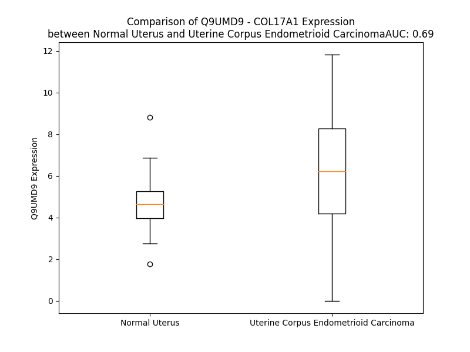

# Detailed Data for Q9UMD9

## Introduction to the Detailed Summary

### How to Interpret the Results

- **Summary & Metrics**: This section provides a quick reference to essential protein attributes, including expression changes, family classification, and biomarker applications. Regulation status (upregulated/downregulated) indicates the protein's behavior in a disease context. Some information comes from the original excel file with the proteins selected from literature, while others are derived from the analyses.
- **Expression Comparison**: A visual representation comparing protein expression between normal and disease states. It highlights significant changes in expression levels that might indicate diagnostic or therapeutic relevance. This is data coming from transcriptomics experiments and could not translate similarly to protein levels.
- **Isoform Alignment**: An interactive view of isoform alignments, revealing structural and functional differences between variants of the protein.
- **Interactors & Homologs**: Tables listing known interaction partners and homologous proteins, the more interactors and homologs, the more complex the protein is to design an antibody for.
- **Biological Assemblies**: Information about the structural arrangement of the protein in different assemblies, providing insights into its functional state but also the complexity of the protein to develop antibodies.
- **Combined Per-Residue Information**: A detailed table summarizing residue-level data. This includes predictions for epitope regions, aggregation tendencies, and modifications that might impact the protein's function. Each row corresponds to a residue in the protein, providing insights into specific sites that may be important for research or drug development.
## Summary & Metrics

- **UniProt Accession**: Q9UMD9
- **Gene Name**: COL17A1
- **Protein Name**: Collagen alpha-1(XVII) chain
- **Swiss Prot**: COHA1_HUMAN
- **Family**: nan
- **Biomarker Application**: nan
- **Number of Isoforms**: 2
- **Regulation**: 1
- **(transcriptomics) AUC**: 0.64
- **(transcriptomics) Fold Change**: 1.29
- **(transcriptomics) Regulation**: Upregulated
- **Discotope Epitope Count**: 391
- **Max n_uniprots (Homo)**: N/A
- **Max n_uniprots (Hetero)**: N/A

## Expression Comparison

## Isoform Alignment

<pre style='font-size:14px; font-family:monospace;'>Q9UMD9-1 MDVTKKNKRDGTEVTERIVTETVTTRLTSLPPKGGTSNGYAKTASLGGGSRLEKQSLTHGSSGYINSTGSTRGHASTSSYRRAHSPASTLPNSPGSTFERKTHVTRHAYEGSSSGNSSPEYPRKEFASSSTRGRSQTRESEIRVRLQSASPSTRWTELDDVKRLLKGSRSASVSPTRNSSNTLPIPKKGTVETKIVTASSQSVSGTYDATILDANLPSHVWSSTLPAGSSMGTYHNNMTTQSSSLLNTNAYSAGSVFGVPNNMASCSPTLHPGLSTSSSVFGMQNNLAPSLTTLSHGTTTTSTAYGVKKNMPQSPAAVNTGVSTSAACTTSVQSDDLLHKDCKFLILEKDNTPAKKEMELLIMTKDSGKVFTASPASIAATSFSEDTLKKEKQAAYNADSGLKAEANGDLKTVSTKGKTTTADIHSYGSSGGGGSGGGGGVGGAGGGPWGPAPAWCPCGSCCSWWKWLLGLLLTWLLLLGLLFGLIALAEEVRKLKARVDELERIRRSILPYGDSMDRIEKDRLQGMAPAAGADLDKIGLHSDSQEELWMFVRKKLMMEQENGNLRGSPGPKGDMGSPGPKGDRGFPGTPGIPGPLGHPGPQGPKGQKGSVGDPGMEGPMGQRGREGPMGPRGEAGPPGSGEKGERGAAGEPGPHGPPGVPGSVGPKGSSGSPGPQGPPGPVGLQGLRGEVGLPGVKGDKGPMGPPGPKGDQGEKGPRGLTGEPGMRGLPGAVGEPGAKGAMGPAGPDGHQGPRGEQGLTGMPGIRGPPGPSGDPGKPGLTGPQGPQGLPGTPGRPGIKGEPGAPGKIVTSEGSSMLTVPGPPGPPGAMGPPGPPGAPGPAGPAGLPGHQEVLNLQGPPGPPGPRGPPGPSIPGPPGPRGPPGEGLPGPPGPPGSFLSNSETFLSGPPGPPGPPGPKGDQGPPGPRGHQGEQGLPGFSTSGSSSFGLNLQGPPGPPGPQGPKGDKGDPGVPGALGIPSGPSEGGSSSTMYVSGPPGPPGPPGPPGSISSSGQEIQQYISEYMQSDSIRSYLSGVQGPPGPPGPPGPVTTITGETFDYSELASHVVSYLRTSGYGVSLFSSSISSEDILAVLQRDDVRQYLRQYLMGPRGPPGPPGASGDGSLLSLDYAELSSRILSYMSSSGISIGLPGPPGPPGLPGTSYEELLSLLRGSEFRGIVGPPGPPGPPGIPGNVWSSISVEDLSSYLHTAGLSFIPGPPGPPGPPGPRGPPGVSGALATYAAENSDSFRSELISYLTSPDVRSFIVGPPGPPGPQGPPGDSRLLSTDASHSRGSSSSSHSSSVRRGSSYSSSMSTGGGGAGSLGAGGAFGEAAGDRGPYGTDIGPGGGYGAAAEGGMYAGNGGLLGADFAGDLDYNELAVRVSESMQRQGLLQGMAYTVQGPPGQPGPQGPPGISKVFSAYSNVTADLMDFFQTYGAIQGPPGQKGEMGTPGPKGDRGPAGPPGHPGPPGPRGHKGEKGDKGDQVYAGRRRRRSIAVKP
Q9UMD9-2 MDVTKKNKRDGTEVTERIVTETVTTRLTSLPPKGGTSNGYAKTASLGGGSRLEKQSLTHGSSGYINSTGSTRGHASTSSYRRAHSPASTLPNSPGSTFERKTHVTRHAYEGSSSGNSSPEYPRKEFASSSTRGRSQTRESEIRVRLQSASPSTRWTELDDVKRLLKGSRSASVSPTRNSSNTLPIPKKGTVETKIVTASSQSVSGTYDATILDANLPSHVWSSTLPAGSSMGTYHNNMTTQSSSLLNTNAYSAGSVFGVPNNMASCSPTLHPGLSTSSSVFGMQNNLAPSLTTLSHGTTTTSTAYGVKKNMPQSPAAVNTGVSTSAACTTSVQSDDLLHKDCKFLILEKDNTPAKKEMELLIMTKDSGKVFTASPASIAATSFSEDTLKKEKQAAYNADSGLKAEANGDLKTVSTKGKTTTADIHSYGSSGGGGSGGGGGVGGAGGGPWGPAPAWCPCGSCCSWWKWLLGLLLTWLLLLGLLFGLIALAEEVRKLKARVDELERIRRSILPYGDSMDRIEKDRLQGMAPAAGADLDKIGLHSDSQEELWMFVRKKLMMEQENGNLRGSPGPKGDMGSPGPKGDRGFPGTPGIPGPLGHPGPQGPKGQKGSVGDPGMEGPMGQRGREGPMGPRGEAGPPGSGEKGERGAAGEPGPHGPPGVPGSVGPKGSSGSPGPQGPPGPVGLQGLRGEVGLPGVKGDKGPMGPPGPKGDQGEKGPRGLTGEPGMRGLPGAVGEPGAKGAMGPAGPDGHQGPRGEQGLTGMPGIRGPPGPSGDPGKPGLTGPQGPQGLPGTPGRPGIKGEPGAPGKIVTSEGSSMLTVPGPPGPPGAMGPPGPPGAPGPAGPAGLPGHQEVLNLQGPPGPPGPRGPPGPSIPGPPGPRGPPGEGLPGPPGPPGSFLSNSETFLSGPPGPPGPPGP---------------------------------------------KGDQGDPGVPGALGIPSGPSEGGSSSTMYVSGPPGPPGPPGPPGSISSSGQEIQQYISEYMQSDSIRSYLSGVQGPPGPPGPPGPVTTITGETFDYSELASHVVSYLRTSGYGVSLFSSSISSEDILAVLQRDDVRQYLRQYLMGPRGPPGPPGASGDGSLLSLDYAELSSRILSYMSSSGISIGLPGPPGPPGLPGTSYEELLSLLR-------------------------------------AAGLSFIPGPPGPPGPPGPRGPPGVSGALATYAAENSDSFRSELISYLTSPDVRSFIVGPPGPPGPQGPPGDSRLLSTDASHSRGSSSSSHSSSVRRGSSYSSSMSTGGGGAGSLGAGGAFGEAAGDRGPYGTDIGPGGGYGAAAEGGMYAGNGGLLGADFAGDLDYNELAVRVSESMQRQGLLQGMAYTVQGPPGQPGPQGPPGISKVFSAYSNVTADLMDFFQTYGAIQGPPGQKGEMGTPGPKGDRGPAGPPGHPGPPGPRGHKGEKGDKGDQVYAGRRRRRSIAVKP
</pre>

## Interactors

| preferredName_A   | preferredName_B   |   score |
|:------------------|:------------------|--------:|
| COL17A1           | DST               |   0.999 |
| COL17A1           | PLEC              |   0.998 |
| COL17A1           | ITGB4             |   0.996 |
| COL17A1           | CD151             |   0.992 |
| COL17A1           | LAMA3             |   0.972 |
| COL17A1           | LAMB3             |   0.959 |
| COL17A1           | ITGA6             |   0.945 |
| COL17A1           | LAMC2             |   0.944 |

## Homologs

| uniprot_id   | gene_id   |
|:-------------|:----------|
| Q02388       | COL7A1    |
| A0A669KB28   | COL13A1   |
| A0A2R8YG47   | COL9A1    |
| P39059       | COL15A1   |
| Q8IZC6       | COL27A1   |
| A0A2R8Y760   | COL25A1   |
| P02458       | COL2A1    |
| A0A3B3ITQ8   | COL4A2    |
| H7C435       | COL3A1    |
| H7BXV5       | COL18A1   |
| Q49AM6       | COL4A5    |
| D6RA95       | EDA       |
| Q07092       | COL16A1   |
| F8WDX7       | EMID1     |
| P08123       | COL1A2    |
| P02452       | COL1A1    |
| A0A384P5H7   | COL6A1    |
| A0A804HI71   | COL4A4    |
| A8MXH5       | COL4A6    |
| A6PVD9       | COL21A1   |
| P20908       | COL5A1    |
| Q14055       | COL9A2    |
| C9JMN2       | COL11A1   |
| F8WDM8       | COL24A1   |
| H7C0M5       | COL6A2    |
| Q96A83       | COL26A1   |
| P25940       | COL5A3    |
| L8EAS4       | COL23A1   |
| Q9P218       | COL20A1   |
| Q8NFW1       | COL22A1   |
| Q9Y215       | COLQ      |
| A0A0C4DFS1   | COL11A2   |
| A0A0C4DG66   | COL28A1   |
| A0A3B3IRH9   | COL5A2    |
| H7BXM4       | COL4A3    |
| Q14050       | COL9A3    |
| P02462       | COL4A1    |

## Combined Per-Residue Information

|   res | aa   |   epitope_score | epitope   |   relative_surface_accessibility |   modeling_confidence |   Aggregation | modification          | glycosylation                   |
|------:|:-----|----------------:|:----------|---------------------------------:|----------------------:|--------------:|:----------------------|:--------------------------------|
|     1 | M    |         0.04536 | False     |                          1.19636 |                 41.18 |         0     | N/A                   | N/A                             |
|     2 | D    |         0.0738  | False     |                          0.75766 |                 39.47 |         0     | N/A                   | N/A                             |
|     3 | V    |         0.06353 | False     |                          0.94488 |                 41.54 |         0     | N/A                   | N/A                             |
|     4 | T    |         0.04505 | False     |                          0.8672  |                 40.57 |         0     | N/A                   | N/A                             |
|     5 | K    |         0.09032 | True      |                          1.03172 |                 48.81 |         0     | N/A                   | N/A                             |
|     6 | K    |         0.05611 | False     |                          0.83285 |                 41.4  |         0     | N/A                   | N/A                             |
|     7 | N    |         0.11301 | True      |                          1.00481 |                 46.22 |         0     | N/A                   | N/A                             |
|     8 | K    |         0.10132 | True      |                          0.6687  |                 38.19 |         0     | N/A                   | N/A                             |
|     9 | R    |         0.16675 | True      |                          0.95307 |                 48.58 |         0     | N/A                   | N/A                             |
|    10 | D    |         0.12951 | True      |                          0.64754 |                 40.1  |         0     | N/A                   | N/A                             |
|    11 | G    |         0.13818 | True      |                          0.84795 |                 41.69 |         0     | N/A                   | N/A                             |
|    12 | T    |         0.12754 | True      |                          0.87381 |                 42.24 |         0     | N/A                   | N/A                             |
|    13 | E    |         0.08284 | False     |                          0.83342 |                 39.66 |         0     | N/A                   | N/A                             |
|    14 | V    |         0.12766 | True      |                          0.99133 |                 39.75 |         0     | N/A                   | N/A                             |
|    15 | T    |         0.12034 | True      |                          0.83345 |                 43.88 |         0     | N/A                   | N/A                             |
|    16 | E    |         0.07585 | False     |                          0.54959 |                 38.74 |         0     | N/A                   | N/A                             |
|    17 | R    |         0.13036 | True      |                          0.84046 |                 37.09 |         0     | N/A                   | N/A                             |
|    18 | I    |         0.09276 | True      |                          0.71528 |                 38.57 |         0.138 | N/A                   | N/A                             |
|    19 | V    |         0.08805 | True      |                          1.1164  |                 37.04 |         0.138 | N/A                   | N/A                             |
|    20 | T    |         0.08902 | True      |                          0.64238 |                 38.85 |         0.138 | N/A                   | N/A                             |
|    21 | E    |         0.08169 | False     |                          0.79423 |                 37.49 |         0.138 | N/A                   | N/A                             |
|    22 | T    |         0.09918 | True      |                          0.8803  |                 37.01 |         0.138 | N/A                   | N/A                             |
|    23 | V    |         0.07253 | False     |                          0.87369 |                 35.41 |         0.138 | N/A                   | N/A                             |
|    24 | T    |         0.09145 | True      |                          0.83383 |                 39.86 |         0.138 | N/A                   | N/A                             |
|    25 | T    |         0.0862  | False     |                          0.67754 |                 39.13 |         0.138 | N/A                   | N/A                             |
|    26 | R    |         0.0887  | True      |                          0.79515 |                 36.26 |         0.138 | N/A                   | N/A                             |
|    27 | L    |         0.13878 | True      |                          0.97586 |                 38.27 |         0.138 | N/A                   | N/A                             |
|    28 | T    |         0.06803 | False     |                          0.80613 |                 38.42 |         0     | N/A                   | N/A                             |
|    29 | S    |         0.08293 | False     |                          0.74161 |                 38.08 |         0     | N/A                   | N/A                             |
|    30 | L    |         0.08569 | False     |                          1.02819 |                 40.48 |         0     | N/A                   | N/A                             |
|    31 | P    |         0.08142 | False     |                          0.7926  |                 43.56 |         0     | N/A                   | N/A                             |
|    32 | P    |         0.09741 | True      |                          0.76191 |                 47.57 |         0     | N/A                   | N/A                             |
|    33 | K    |         0.09394 | True      |                          0.98572 |                 38.15 |         0     | N/A                   | N/A                             |
|    34 | G    |         0.09575 | True      |                          1.00565 |                 38.66 |         0     | N/A                   | N/A                             |
|    35 | G    |         0.07737 | False     |                          0.7747  |                 37.99 |         0     | N/A                   | N/A                             |
|    36 | T    |         0.09653 | True      |                          1.00549 |                 40.08 |         0     | N/A                   | N/A                             |
|    37 | S    |         0.05436 | False     |                          0.6439  |                 33.76 |         0     | N/A                   | N/A                             |
|    38 | N    |         0.0898  | True      |                          0.97898 |                 37.51 |         0     | N/A                   | N/A                             |
|    39 | G    |         0.09047 | True      |                          0.84285 |                 38.48 |         0     | N/A                   | N/A                             |
|    40 | Y    |         0.07752 | False     |                          0.98734 |                 38.46 |         0     | N/A                   | N/A                             |
|    41 | A    |         0.05212 | False     |                          0.75532 |                 36.22 |         0     | N/A                   | N/A                             |
|    42 | K    |         0.07028 | False     |                          0.91078 |                 33.26 |         0     | N/A                   | N/A                             |
|    43 | T    |         0.07163 | False     |                          0.92164 |                 35.25 |         0     | N/A                   | N/A                             |
|    44 | A    |         0.03439 | False     |                          0.80066 |                 37.2  |         0     | N/A                   | N/A                             |
|    45 | S    |         0.07881 | False     |                          0.72307 |                 36.69 |         0     | N/A                   | N/A                             |
|    46 | L    |         0.05908 | False     |                          0.84869 |                 36.28 |         0     | N/A                   | N/A                             |
|    47 | G    |         0.05598 | False     |                          0.84182 |                 39.49 |         0     | N/A                   | N/A                             |
|    48 | G    |         0.05752 | False     |                          1.01557 |                 33.68 |         0     | N/A                   | N/A                             |
|    49 | G    |         0.05327 | False     |                          0.89393 |                 34.33 |         0     | N/A                   | N/A                             |
|    50 | S    |         0.03783 | False     |                          0.86008 |                 33.4  |         0     | N/A                   | N/A                             |
|    51 | R    |         0.07361 | False     |                          0.6641  |                 34.31 |         0     | N/A                   | N/A                             |
|    52 | L    |         0.08383 | False     |                          0.82749 |                 35.84 |         0     | N/A                   | N/A                             |
|    53 | E    |         0.06124 | False     |                          0.56937 |                 30.97 |         0     | N/A                   | N/A                             |
|    54 | K    |         0.0831  | False     |                          0.70806 |                 35.01 |         0     | N/A                   | N/A                             |
|    55 | Q    |         0.08269 | False     |                          0.81931 |                 33.5  |         0     | N/A                   | N/A                             |
|    56 | S    |         0.09658 | True      |                          0.75903 |                 33.3  |         0     | N/A                   | N/A                             |
|    57 | L    |         0.04502 | False     |                          0.92835 |                 37.2  |         0     | N/A                   | N/A                             |
|    58 | T    |         0.05632 | False     |                          0.68053 |                 37.56 |         0     | N/A                   | N/A                             |
|    59 | H    |         0.05019 | False     |                          0.97186 |                 35.04 |         0     | N/A                   | N/A                             |
|    60 | G    |         0.0591  | False     |                          0.77219 |                 35.28 |         0     | N/A                   | N/A                             |
|    61 | S    |         0.05929 | False     |                          0.91037 |                 42.29 |         0     | N/A                   | N/A                             |
|    62 | S    |         0.04895 | False     |                          0.75395 |                 38.65 |         0     | N/A                   | N/A                             |
|    63 | G    |         0.08937 | True      |                          0.8105  |                 37.56 |         0     | N/A                   | N/A                             |
|    64 | Y    |         0.08589 | False     |                          0.84257 |                 38.34 |         0     | N/A                   | N/A                             |
|    65 | I    |         0.08029 | False     |                          0.89297 |                 36.24 |         0     | N/A                   | N/A                             |
|    66 | N    |         0.07271 | False     |                          0.77547 |                 34.87 |         0     | N/A                   | N/A                             |
|    67 | S    |         0.04268 | False     |                          0.79857 |                 33.57 |         0     | N/A                   | N/A                             |
|    68 | T    |         0.06983 | False     |                          0.9574  |                 33.24 |         0     | N/A                   | N/A                             |
|    69 | G    |         0.05437 | False     |                          0.95782 |                 33.37 |         0     | N/A                   | N/A                             |
|    70 | S    |         0.05437 | False     |                          0.91409 |                 33.52 |         0     | N/A                   | N/A                             |
|    71 | T    |         0.0594  | False     |                          0.89278 |                 32.69 |         0     | N/A                   | N/A                             |
|    72 | R    |         0.08838 | True      |                          0.97631 |                 30.8  |         0     | N/A                   | N/A                             |
|    73 | G    |         0.03771 | False     |                          0.68533 |                 32.13 |         0     | N/A                   | N/A                             |
|    74 | H    |         0.04808 | False     |                          0.99694 |                 31.2  |         0     | N/A                   | N/A                             |
|    75 | A    |         0.03731 | False     |                          0.68579 |                 30.53 |         0     | N/A                   | N/A                             |
|    76 | S    |         0.0404  | False     |                          0.65275 |                 33.21 |         0     | N/A                   | N/A                             |
|    77 | T    |         0.09747 | True      |                          0.87212 |                 33.29 |         0     | N/A                   | N/A                             |
|    78 | S    |         0.04124 | False     |                          0.70296 |                 33.78 |         0     | N/A                   | N/A                             |
|    79 | S    |         0.06047 | False     |                          0.58807 |                 36.99 |         0     | N/A                   | N/A                             |
|    80 | Y    |         0.08367 | False     |                          0.88107 |                 35.34 |         0     | N/A                   | N/A                             |
|    81 | R    |         0.06902 | False     |                          0.76851 |                 34.84 |         0     | N/A                   | N/A                             |
|    82 | R    |         0.06937 | False     |                          0.72949 |                 37.47 |         0     | N/A                   | N/A                             |
|    83 | A    |         0.07917 | False     |                          0.834   |                 33.68 |         0     | N/A                   | N/A                             |
|    84 | H    |         0.06385 | False     |                          0.78675 |                 35.37 |         0     | N/A                   | N/A                             |
|    85 | S    |         0.04497 | False     |                          0.74003 |                 36.44 |         0     | N/A                   | N/A                             |
|    86 | P    |         0.08603 | False     |                          0.97373 |                 40.79 |         0     | N/A                   | N/A                             |
|    87 | A    |         0.04951 | False     |                          0.89882 |                 32.21 |         0     | N/A                   | N/A                             |
|    88 | S    |         0.05578 | False     |                          0.46827 |                 37.65 |         0     | N/A                   | N/A                             |
|    89 | T    |         0.05864 | False     |                          0.48579 |                 35.03 |         0     | N/A                   | N/A                             |
|    90 | L    |         0.1143  | True      |                          0.89164 |                 37.65 |         0     | N/A                   | N/A                             |
|    91 | P    |         0.08994 | True      |                          0.75955 |                 39.18 |         0     | N/A                   | N/A                             |
|    92 | N    |         0.07466 | False     |                          0.87475 |                 34.43 |         0     | N/A                   | N/A                             |
|    93 | S    |         0.07275 | False     |                          0.77121 |                 33.34 |         0     | N/A                   | N/A                             |
|    94 | P    |         0.0835  | False     |                          0.99862 |                 37.52 |         0     | N/A                   | N/A                             |
|    95 | G    |         0.09229 | True      |                          0.7732  |                 34.39 |         0     | N/A                   | N/A                             |
|    96 | S    |         0.05474 | False     |                          0.66077 |                 33.75 |         0     | N/A                   | N/A                             |
|    97 | T    |         0.07649 | False     |                          0.77911 |                 35.32 |         0     | N/A                   | N/A                             |
|    98 | F    |         0.10789 | True      |                          0.67152 |                 35.59 |         0     | N/A                   | N/A                             |
|    99 | E    |         0.139   | True      |                          0.48565 |                 33.79 |         0     | N/A                   | N/A                             |
|   100 | R    |         0.11442 | True      |                          0.78278 |                 37.27 |         0     | N/A                   | N/A                             |
|   101 | K    |         0.09184 | True      |                          0.89451 |                 34.14 |         0     | N/A                   | N/A                             |
|   102 | T    |         0.08172 | False     |                          0.66657 |                 36.99 |         0     | N/A                   | N/A                             |
|   103 | H    |         0.06042 | False     |                          0.61354 |                 34.69 |         0     | N/A                   | N/A                             |
|   104 | V    |         0.06971 | False     |                          0.70815 |                 32.24 |         0     | N/A                   | N/A                             |
|   105 | T    |         0.03708 | False     |                          0.43995 |                 29.07 |         0     | N/A                   | N/A                             |
|   106 | R    |         0.02783 | False     |                          0.39101 |                 34.43 |         0     | N/A                   | N/A                             |
|   107 | H    |         0.05552 | False     |                          0.86557 |                 35.22 |         0     | N/A                   | N/A                             |
|   108 | A    |         0.11633 | True      |                          0.83125 |                 31.01 |         0     | N/A                   | N/A                             |
|   109 | Y    |         0.10549 | True      |                          0.92867 |                 34.34 |         0     | N/A                   | N/A                             |
|   110 | E    |         0.10707 | True      |                          0.81661 |                 35.04 |         0     | N/A                   | N/A                             |
|   111 | G    |         0.07857 | False     |                          0.86409 |                 37.84 |         0     | N/A                   | N/A                             |
|   112 | S    |         0.08273 | False     |                          0.87708 |                 41.03 |         0     | N/A                   | N/A                             |
|   113 | S    |         0.10497 | True      |                          0.79553 |                 37.41 |         0     | N/A                   | N/A                             |
|   114 | S    |         0.08381 | False     |                          0.92509 |                 39.13 |         0     | N/A                   | N/A                             |
|   115 | G    |         0.09233 | True      |                          0.80633 |                 39.09 |         0     | N/A                   | N/A                             |
|   116 | N    |         0.13066 | True      |                          0.99365 |                 40.02 |         0     | N/A                   | N/A                             |
|   117 | S    |         0.06894 | False     |                          0.72582 |                 39.19 |         0     | N/A                   | N/A                             |
|   118 | S    |         0.13084 | True      |                          0.80327 |                 38.37 |         0     | N/A                   | N/A                             |
|   119 | P    |         0.09979 | True      |                          0.78309 |                 43.81 |         0     | N/A                   | N/A                             |
|   120 | E    |         0.09513 | True      |                          0.77089 |                 39.15 |         0     | N/A                   | N/A                             |
|   121 | Y    |         0.13076 | True      |                          0.8299  |                 39.05 |         0     | N/A                   | N/A                             |
|   122 | P    |         0.07323 | False     |                          0.79805 |                 47.56 |         0     | N/A                   | N/A                             |
|   123 | R    |         0.09439 | True      |                          0.82969 |                 39.7  |         0     | N/A                   | N/A                             |
|   124 | K    |         0.08803 | True      |                          0.80832 |                 37.18 |         0     | N/A                   | N/A                             |
|   125 | E    |         0.09554 | True      |                          0.52915 |                 37.73 |         0     | N/A                   | N/A                             |
|   126 | F    |         0.07497 | False     |                          0.93695 |                 37.14 |         0     | N/A                   | N/A                             |
|   127 | A    |         0.09513 | True      |                          0.92408 |                 35.62 |         0     | N/A                   | N/A                             |
|   128 | S    |         0.09223 | True      |                          0.84063 |                 33.73 |         0     | N/A                   | N/A                             |
|   129 | S    |         0.08978 | True      |                          0.77464 |                 30.8  |         0     | N/A                   | N/A                             |
|   130 | S    |         0.09652 | True      |                          0.72805 |                 31.28 |         0     | N/A                   | N/A                             |
|   131 | T    |         0.123   | True      |                          0.84142 |                 30.73 |         0     | N/A                   | N/A                             |
|   132 | R    |         0.09653 | True      |                          0.96511 |                 29.19 |         0     | N/A                   | N/A                             |
|   133 | G    |         0.07064 | False     |                          0.82852 |                 35.23 |         0     | N/A                   | N/A                             |
|   134 | R    |         0.0992  | True      |                          0.91121 |                 33.14 |         0     | N/A                   | N/A                             |
|   135 | S    |         0.0462  | False     |                          0.6063  |                 35.7  |         0     | N/A                   | N/A                             |
|   136 | Q    |         0.04552 | False     |                          0.87372 |                 41.51 |         0     | N/A                   | N/A                             |
|   137 | T    |         0.05347 | False     |                          0.67011 |                 45.77 |         0     | N/A                   | N/A                             |
|   138 | R    |         0.06075 | False     |                          0.70176 |                 35.47 |         0     | N/A                   | N/A                             |
|   139 | E    |         0.05415 | False     |                          0.84004 |                 45.1  |         0     | N/A                   | N/A                             |
|   140 | S    |         0.04811 | False     |                          0.76985 |                 49.84 |         0     | N/A                   | N/A                             |
|   141 | E    |         0.05323 | False     |                          0.36135 |                 51.51 |         0     | N/A                   | N/A                             |
|   142 | I    |         0.08011 | False     |                          0.88235 |                 38.76 |         0     | N/A                   | N/A                             |
|   143 | R    |         0.10779 | True      |                          0.90048 |                 47.06 |         0     | N/A                   | N/A                             |
|   144 | V    |         0.04185 | False     |                          0.78739 |                 48.96 |         0     | N/A                   | N/A                             |
|   145 | R    |         0.09529 | True      |                          0.6781  |                 45.21 |         0     | N/A                   | N/A                             |
|   146 | L    |         0.08075 | False     |                          0.94751 |                 35.64 |         0     | N/A                   | N/A                             |
|   147 | Q    |         0.13638 | True      |                          0.86713 |                 43.15 |         0     | N/A                   | N/A                             |
|   148 | S    |         0.10317 | True      |                          0.77868 |                 31    |         0     | N/A                   | N/A                             |
|   149 | A    |         0.07797 | False     |                          0.95688 |                 28.05 |         0     | N/A                   | N/A                             |
|   150 | S    |         0.09445 | True      |                          0.85805 |                 27.81 |         0     | N/A                   | N/A                             |
|   151 | P    |         0.0445  | False     |                          0.9753  |                 38.57 |         0     | N/A                   | N/A                             |
|   152 | S    |         0.06642 | False     |                          0.78717 |                 33.81 |         0     | N/A                   | N/A                             |
|   153 | T    |         0.07589 | False     |                          0.62137 |                 35.31 |         0     | N/A                   | N/A                             |
|   154 | R    |         0.09437 | True      |                          0.90308 |                 33.22 |         0     | N/A                   | N/A                             |
|   155 | W    |         0.16594 | True      |                          0.7706  |                 34.44 |         0     | N/A                   | N/A                             |
|   156 | T    |         0.09456 | True      |                          0.73596 |                 43.41 |         0     | N/A                   | N/A                             |
|   157 | E    |         0.09281 | True      |                          0.64791 |                 43.45 |         0     | N/A                   | N/A                             |
|   158 | L    |         0.05991 | False     |                          0.94704 |                 46.11 |         0     | N/A                   | N/A                             |
|   159 | D    |         0.06051 | False     |                          0.71996 |                 44.45 |         0     | N/A                   | N/A                             |
|   160 | D    |         0.0608  | False     |                          0.82162 |                 39.8  |         0     | N/A                   | N/A                             |
|   161 | V    |         0.03018 | False     |                          0.80535 |                 47.73 |         0     | N/A                   | N/A                             |
|   162 | K    |         0.05716 | False     |                          0.70694 |                 48.64 |         0     | N/A                   | N/A                             |
|   163 | R    |         0.09338 | True      |                          0.99989 |                 41.13 |         0     | N/A                   | N/A                             |
|   164 | L    |         0.084   | False     |                          0.74899 |                 39.01 |         0     | N/A                   | N/A                             |
|   165 | L    |         0.1209  | True      |                          0.91922 |                 43.36 |         0     | N/A                   | N/A                             |
|   166 | K    |         0.08652 | True      |                          0.96511 |                 41.42 |         0     | N/A                   | N/A                             |
|   167 | G    |         0.0699  | False     |                          0.81029 |                 35.42 |         0     | N/A                   | N/A                             |
|   168 | S    |         0.12295 | True      |                          0.80394 |                 36.9  |         0     | N/A                   | N/A                             |
|   169 | R    |         0.09519 | True      |                          0.85651 |                 36.14 |         0     | N/A                   | N/A                             |
|   170 | S    |         0.0645  | False     |                          0.82266 |                 38.73 |         0     | N/A                   | N/A                             |
|   171 | A    |         0.05182 | False     |                          0.85512 |                 32.65 |         0     | N/A                   | N/A                             |
|   172 | S    |         0.0438  | False     |                          0.86055 |                 31.68 |         0     | N/A                   | N/A                             |
|   173 | V    |         0.05316 | False     |                          0.96465 |                 33.09 |         0     | N/A                   | N/A                             |
|   174 | S    |         0.08384 | False     |                          0.77499 |                 28.59 |         0     | N/A                   | N/A                             |
|   175 | P    |         0.10755 | True      |                          0.82901 |                 35.05 |         0     | N/A                   | N/A                             |
|   176 | T    |         0.12899 | True      |                          0.83152 |                 33.99 |         0     | N/A                   | N/A                             |
|   177 | R    |         0.13881 | True      |                          0.8783  |                 37.93 |         0     | N/A                   | N/A                             |
|   178 | N    |         0.11505 | True      |                          0.89636 |                 34.44 |         0     | N/A                   | N/A                             |
|   179 | S    |         0.09392 | True      |                          0.81623 |                 36.38 |         0     | N/A                   | N/A                             |
|   180 | S    |         0.07243 | False     |                          0.71604 |                 39.6  |         0     | N/A                   | N/A                             |
|   181 | N    |         0.13736 | True      |                          0.93377 |                 38.56 |         0     | N/A                   | N/A                             |
|   182 | T    |         0.0776  | False     |                          0.8077  |                 38.51 |         0     | N/A                   | N/A                             |
|   183 | L    |         0.09684 | True      |                          0.83348 |                 44.93 |         0     | N/A                   | N/A                             |
|   184 | P    |         0.10031 | True      |                          0.86614 |                 42.8  |         0     | N/A                   | N/A                             |
|   185 | I    |         0.08131 | False     |                          0.65493 |                 38.23 |         0     | N/A                   | N/A                             |
|   186 | P    |         0.1172  | True      |                          0.8971  |                 44.03 |         0     | N/A                   | N/A                             |
|   187 | K    |         0.09495 | True      |                          0.81662 |                 40.74 |         0     | N/A                   | N/A                             |
|   188 | K    |         0.08766 | True      |                          1.01237 |                 40.94 |         0     | N/A                   | N/A                             |
|   189 | G    |         0.0773  | False     |                          0.76214 |                 44.33 |         0     | N/A                   | N/A                             |
|   190 | T    |         0.08095 | False     |                          0.96734 |                 42.85 |         0     | N/A                   | N/A                             |
|   191 | V    |         0.07537 | False     |                          0.77161 |                 39.35 |         0.138 | N/A                   | N/A                             |
|   192 | E    |         0.05238 | False     |                          0.75251 |                 41.23 |         0.138 | N/A                   | N/A                             |
|   193 | T    |         0.06671 | False     |                          0.76209 |                 41.3  |         0.138 | N/A                   | N/A                             |
|   194 | K    |         0.05699 | False     |                          0.81185 |                 35.08 |         0.138 | N/A                   | N/A                             |
|   195 | I    |         0.07059 | False     |                          0.81732 |                 34.14 |         0.317 | N/A                   | N/A                             |
|   196 | V    |         0.05503 | False     |                          0.84976 |                 32.83 |         0.317 | N/A                   | N/A                             |
|   197 | T    |         0.06573 | False     |                          0.82147 |                 32.49 |         0.179 | N/A                   | N/A                             |
|   198 | A    |         0.08155 | False     |                          0.80302 |                 33.22 |         0.179 | N/A                   | N/A                             |
|   199 | S    |         0.0739  | False     |                          0.71754 |                 30.54 |         0.179 | N/A                   | N/A                             |
|   200 | S    |         0.08341 | False     |                          0.80718 |                 29.1  |         0     | N/A                   | N/A                             |
|   201 | Q    |         0.08333 | False     |                          0.8716  |                 27.72 |         0     | N/A                   | N/A                             |
|   202 | S    |         0.09097 | True      |                          0.71701 |                 27.91 |         0     | N/A                   | N/A                             |
|   203 | V    |         0.06787 | False     |                          0.99277 |                 32.68 |         0     | N/A                   | N/A                             |
|   204 | S    |         0.07636 | False     |                          0.8448  |                 27.34 |         0     | N/A                   | N/A                             |
|   205 | G    |         0.10516 | True      |                          0.82453 |                 27.89 |         0     | N/A                   | N/A                             |
|   206 | T    |         0.12712 | True      |                          0.80393 |                 29.9  |         0     | N/A                   | N/A                             |
|   207 | Y    |         0.10075 | True      |                          0.84324 |                 33.81 |         0     | N/A                   | N/A                             |
|   208 | D    |         0.13244 | True      |                          0.88628 |                 33.02 |         0     | N/A                   | N/A                             |
|   209 | A    |         0.08806 | True      |                          0.80324 |                 32.92 |         0     | N/A                   | N/A                             |
|   210 | T    |         0.08472 | False     |                          0.79159 |                 36.01 |         0     | N/A                   | N/A                             |
|   211 | I    |         0.08446 | False     |                          0.9117  |                 34.54 |         0     | N/A                   | N/A                             |
|   212 | L    |         0.10509 | True      |                          0.89588 |                 34.14 |         0     | N/A                   | N/A                             |
|   213 | D    |         0.07072 | False     |                          0.7259  |                 33.16 |         0     | N/A                   | N/A                             |
|   214 | A    |         0.0795  | False     |                          0.75053 |                 35.59 |         0     | N/A                   | N/A                             |
|   215 | N    |         0.10263 | True      |                          0.78941 |                 32.41 |         0     | N/A                   | N/A                             |
|   216 | L    |         0.12206 | True      |                          1.02127 |                 33.36 |         0     | N/A                   | N/A                             |
|   217 | P    |         0.09007 | True      |                          0.7163  |                 33.62 |         0     | N/A                   | N/A                             |
|   218 | S    |         0.09933 | True      |                          0.68855 |                 25.83 |         0     | N/A                   | N/A                             |
|   219 | H    |         0.07773 | False     |                          0.77303 |                 27.78 |         0     | N/A                   | N/A                             |
|   220 | V    |         0.09072 | True      |                          0.75886 |                 29.35 |         0     | N/A                   | N/A                             |
|   221 | W    |         0.07742 | False     |                          0.94863 |                 27.39 |         0     | N/A                   | N/A                             |
|   222 | S    |         0.04638 | False     |                          0.73016 |                 31.22 |         0     | N/A                   | N/A                             |
|   223 | S    |         0.09659 | True      |                          0.86802 |                 32.55 |         0     | N/A                   | N/A                             |
|   224 | T    |         0.06534 | False     |                          0.76317 |                 32.49 |         0     | N/A                   | N/A                             |
|   225 | L    |         0.13478 | True      |                          0.97494 |                 37.04 |         0     | N/A                   | N/A                             |
|   226 | P    |         0.10407 | True      |                          0.8138  |                 36.06 |         0     | N/A                   | N/A                             |
|   227 | A    |         0.08185 | False     |                          1.00317 |                 31.66 |         0     | N/A                   | N/A                             |
|   228 | G    |         0.05167 | False     |                          0.84402 |                 31.38 |         0     | N/A                   | N/A                             |
|   229 | S    |         0.05983 | False     |                          0.90176 |                 33.49 |         0     | N/A                   | N/A                             |
|   230 | S    |         0.06205 | False     |                          0.69213 |                 30.17 |         0     | N/A                   | N/A                             |
|   231 | M    |         0.08689 | True      |                          1.05798 |                 28.51 |         0     | N/A                   | N/A                             |
|   232 | G    |         0.08311 | False     |                          0.94091 |                 32.17 |         0     | N/A                   | N/A                             |
|   233 | T    |         0.0896  | True      |                          0.74653 |                 38.53 |         0     | N/A                   | N/A                             |
|   234 | Y    |         0.11168 | True      |                          0.86933 |                 29.13 |         0     | N/A                   | N/A                             |
|   235 | H    |         0.06542 | False     |                          0.94857 |                 31.57 |         0     | N/A                   | N/A                             |
|   236 | N    |         0.06658 | False     |                          0.68704 |                 42.69 |         0     | N/A                   | N/A                             |
|   237 | N    |         0.05849 | False     |                          0.87189 |                 25.71 |         0     | N/A                   | N/A                             |
|   238 | M    |         0.09035 | True      |                          0.87346 |                 50.16 |         0     | N/A                   | N/A                             |
|   239 | T    |         0.06911 | False     |                          0.71168 |                 45.98 |         0     | N/A                   | N/A                             |
|   240 | T    |         0.08486 | False     |                          0.84624 |                 40.43 |         0     | N/A                   | N/A                             |
|   241 | Q    |         0.09168 | True      |                          0.80809 |                 41.68 |         0     | N/A                   | N/A                             |
|   242 | S    |         0.0556  | False     |                          0.64579 |                 41.29 |         0     | N/A                   | N/A                             |
|   243 | S    |         0.06803 | False     |                          0.84271 |                 39.42 |         0     | N/A                   | N/A                             |
|   244 | S    |         0.07304 | False     |                          0.74909 |                 34.84 |         0     | N/A                   | N/A                             |
|   245 | L    |         0.09149 | True      |                          0.94427 |                 32.7  |         0     | N/A                   | N/A                             |
|   246 | L    |         0.08021 | False     |                          0.9317  |                 30.74 |         0     | N/A                   | N/A                             |
|   247 | N    |         0.08361 | False     |                          0.79761 |                 28.75 |         0     | N/A                   | N/A                             |
|   248 | T    |         0.07596 | False     |                          0.72516 |                 29.85 |         0     | N/A                   | N/A                             |
|   249 | N    |         0.0924  | True      |                          0.90989 |                 27.95 |         0     | N/A                   | N/A                             |
|   250 | A    |         0.04898 | False     |                          0.87284 |                 30.69 |         0     | N/A                   | N/A                             |
|   251 | Y    |         0.06299 | False     |                          0.91339 |                 30.72 |         0     | N/A                   | N/A                             |
|   252 | S    |         0.03903 | False     |                          0.55808 |                 35.77 |         0     | N/A                   | N/A                             |
|   253 | A    |         0.05713 | False     |                          1.06634 |                 35.85 |         0     | N/A                   | N/A                             |
|   254 | G    |         0.08376 | False     |                          0.85737 |                 32.99 |         0     | N/A                   | N/A                             |
|   255 | S    |         0.13269 | True      |                          0.84822 |                 32.63 |         0     | N/A                   | N/A                             |
|   256 | V    |         0.09973 | True      |                          0.85308 |                 34.4  |         0     | N/A                   | N/A                             |
|   257 | F    |         0.12066 | True      |                          0.9872  |                 33.04 |         0     | N/A                   | N/A                             |
|   258 | G    |         0.07533 | False     |                          0.75832 |                 32.9  |         0     | N/A                   | N/A                             |
|   259 | V    |         0.08835 | True      |                          1.05095 |                 31.4  |         0     | N/A                   | N/A                             |
|   260 | P    |         0.08629 | False     |                          0.81707 |                 38.34 |         0     | N/A                   | N/A                             |
|   261 | N    |         0.09047 | True      |                          0.89451 |                 27.41 |         0     | N/A                   | N/A                             |
|   262 | N    |         0.13071 | True      |                          0.8309  |                 27.19 |         0     | N/A                   | N/A                             |
|   263 | M    |         0.11841 | True      |                          0.94339 |                 29.69 |         0     | N/A                   | N/A                             |
|   264 | A    |         0.10669 | True      |                          0.87471 |                 27.42 |         0     | N/A                   | N/A                             |
|   265 | S    |         0.08383 | False     |                          0.80146 |                 25.47 |         0     | N/A                   | N/A                             |
|   266 | C    |         0.11955 | True      |                          0.87461 |                 26.73 |         0     | N/A                   | N/A                             |
|   267 | S    |         0.07658 | False     |                          0.81496 |                 31.15 |         0     | N/A                   | N/A                             |
|   268 | P    |         0.07829 | False     |                          1.00126 |                 34.9  |         0     | N/A                   | N/A                             |
|   269 | T    |         0.05653 | False     |                          0.79245 |                 30.34 |         0     | N/A                   | N/A                             |
|   270 | L    |         0.11043 | True      |                          1.00032 |                 33.42 |         0     | N/A                   | N/A                             |
|   271 | H    |         0.12635 | True      |                          0.80964 |                 30.66 |         0     | N/A                   | N/A                             |
|   272 | P    |         0.12093 | True      |                          0.86534 |                 37.07 |         0     | N/A                   | N/A                             |
|   273 | G    |         0.08846 | True      |                          0.88798 |                 29.03 |         0     | N/A                   | N/A                             |
|   274 | L    |         0.09715 | True      |                          1.14829 |                 33.29 |         0     | N/A                   | N/A                             |
|   275 | S    |         0.06943 | False     |                          0.79911 |                 28.8  |         0     | N/A                   | N/A                             |
|   276 | T    |         0.07642 | False     |                          1.0214  |                 33.46 |         0     | N/A                   | N/A                             |
|   277 | S    |         0.06889 | False     |                          0.69775 |                 27.47 |         0     | N/A                   | N/A                             |
|   278 | S    |         0.09156 | True      |                          0.78151 |                 27.27 |         0     | N/A                   | N/A                             |
|   279 | S    |         0.10037 | True      |                          0.85539 |                 30.31 |         0     | N/A                   | N/A                             |
|   280 | V    |         0.06683 | False     |                          0.86098 |                 27.82 |         0     | N/A                   | N/A                             |
|   281 | F    |         0.12238 | True      |                          1.07127 |                 26.78 |         0     | N/A                   | N/A                             |
|   282 | G    |         0.10013 | True      |                          0.92292 |                 32.82 |         0     | N/A                   | N/A                             |
|   283 | M    |         0.11017 | True      |                          0.97227 |                 31.93 |         0     | N/A                   | N/A                             |
|   284 | Q    |         0.10581 | True      |                          0.81742 |                 33.36 |         0     | N/A                   | N/A                             |
|   285 | N    |         0.05373 | False     |                          0.75192 |                 31.13 |         0     | N/A                   | N/A                             |
|   286 | N    |         0.05027 | False     |                          0.80148 |                 30.51 |         0     | N/A                   | N/A                             |
|   287 | L    |         0.04512 | False     |                          0.95998 |                 36    |         0     | N/A                   | N/A                             |
|   288 | A    |         0.02933 | False     |                          0.52743 |                 33.55 |         0     | N/A                   | N/A                             |
|   289 | P    |         0.04567 | False     |                          0.63463 |                 36.93 |         0     | N/A                   | N/A                             |
|   290 | S    |         0.01986 | False     |                          0.28416 |                 35.07 |         0     | N/A                   | N/A                             |
|   291 | L    |         0.05221 | False     |                          0.75479 |                 33.97 |         0     | N/A                   | N/A                             |
|   292 | T    |         0.05862 | False     |                          0.70375 |                 33.47 |         0     | N/A                   | N/A                             |
|   293 | T    |         0.05602 | False     |                          0.81649 |                 34.14 |         0     | N/A                   | N/A                             |
|   294 | L    |         0.06344 | False     |                          0.9901  |                 35.94 |         0     | N/A                   | N/A                             |
|   295 | S    |         0.05344 | False     |                          0.50199 |                 30.75 |         0     | N/A                   | N/A                             |
|   296 | H    |         0.0549  | False     |                          1.01428 |                 34.82 |         0     | N/A                   | N/A                             |
|   297 | G    |         0.07178 | False     |                          0.7896  |                 32.41 |         0     | N/A                   | N/A                             |
|   298 | T    |         0.09647 | True      |                          0.90256 |                 30.53 |         0     | N/A                   | N/A                             |
|   299 | T    |         0.09578 | True      |                          0.8956  |                 29.18 |         0     | N/A                   | N/A                             |
|   300 | T    |         0.08079 | False     |                          0.74659 |                 28.64 |         0     | N/A                   | N/A                             |
|   301 | T    |         0.07048 | False     |                          0.88696 |                 28.04 |         0     | N/A                   | N/A                             |
|   302 | S    |         0.05903 | False     |                          0.65031 |                 28.03 |         0     | N/A                   | N/A                             |
|   303 | T    |         0.05719 | False     |                          0.9436  |                 27.74 |         0     | N/A                   | N/A                             |
|   304 | A    |         0.07066 | False     |                          0.6606  |                 28.1  |         0     | N/A                   | N/A                             |
|   305 | Y    |         0.08243 | False     |                          0.99213 |                 28.92 |         0     | N/A                   | N/A                             |
|   306 | G    |         0.08785 | True      |                          0.81477 |                 33.61 |         0     | N/A                   | N/A                             |
|   307 | V    |         0.07434 | False     |                          0.83571 |                 30.64 |         0     | N/A                   | N/A                             |
|   308 | K    |         0.07993 | False     |                          0.82199 |                 32.08 |         0     | N/A                   | N/A                             |
|   309 | K    |         0.0711  | False     |                          0.84647 |                 32.06 |         0     | N/A                   | N/A                             |
|   310 | N    |         0.09013 | True      |                          0.89397 |                 30.77 |         0     | N/A                   | N/A                             |
|   311 | M    |         0.07171 | False     |                          0.86088 |                 30.36 |         0     | N/A                   | N/A                             |
|   312 | P    |         0.03521 | False     |                          0.66552 |                 30.44 |         0     | N/A                   | N/A                             |
|   313 | Q    |         0.04094 | False     |                          0.64318 |                 30.67 |         0     | N/A                   | N/A                             |
|   314 | S    |         0.01349 | False     |                          0.12675 |                 28.64 |         0     | N/A                   | N/A                             |
|   315 | P    |         0.0404  | False     |                          0.48312 |                 37.08 |         0     | N/A                   | N/A                             |
|   316 | A    |         0.02402 | False     |                          0.38518 |                 33.45 |         0     | N/A                   | N/A                             |
|   317 | A    |         0.02306 | False     |                          0.57376 |                 34.57 |         0     | N/A                   | N/A                             |
|   318 | V    |         0.02776 | False     |                          0.56339 |                 33.22 |         0     | N/A                   | N/A                             |
|   319 | N    |         0.0495  | False     |                          0.78507 |                 32.31 |         0     | N/A                   | N/A                             |
|   320 | T    |         0.05837 | False     |                          0.97475 |                 34.75 |         0     | N/A                   | N/A                             |
|   321 | G    |         0.06908 | False     |                          0.85015 |                 36.31 |         0     | N/A                   | N/A                             |
|   322 | V    |         0.04826 | False     |                          1.09115 |                 35.71 |         0     | N/A                   | N/A                             |
|   323 | S    |         0.04698 | False     |                          0.76647 |                 32.96 |         0     | N/A                   | N/A                             |
|   324 | T    |         0.06822 | False     |                          0.87676 |                 33.27 |         0     | N/A                   | N/A                             |
|   325 | S    |         0.03071 | False     |                          0.78934 |                 35.45 |         0     | N/A                   | N/A                             |
|   326 | A    |         0.04413 | False     |                          0.49638 |                 35.95 |         0     | N/A                   | N/A                             |
|   327 | A    |         0.05586 | False     |                          0.77543 |                 31.48 |         0     | N/A                   | N/A                             |
|   328 | C    |         0.09333 | True      |                          0.8812  |                 27.6  |         0     | N/A                   | N/A                             |
|   329 | T    |         0.07125 | False     |                          0.82885 |                 29.6  |         0     | N/A                   | N/A                             |
|   330 | T    |         0.08172 | False     |                          0.90641 |                 28.81 |         0     | N/A                   | N/A                             |
|   331 | S    |         0.09163 | True      |                          0.76604 |                 27.63 |         0     | N/A                   | N/A                             |
|   332 | V    |         0.10117 | True      |                          0.98492 |                 27.8  |         0     | N/A                   | N/A                             |
|   333 | Q    |         0.08304 | False     |                          0.89267 |                 33.4  |         0     | N/A                   | N/A                             |
|   334 | S    |         0.06389 | False     |                          0.70929 |                 31.11 |         0     | N/A                   | N/A                             |
|   335 | D    |         0.10006 | True      |                          0.78994 |                 33.31 |         0     | N/A                   | N/A                             |
|   336 | D    |         0.06389 | False     |                          0.78787 |                 36.18 |         0     | N/A                   | N/A                             |
|   337 | L    |         0.06304 | False     |                          1.02877 |                 34.66 |         0     | N/A                   | N/A                             |
|   338 | L    |         0.06907 | False     |                          0.82559 |                 33.7  |         0     | N/A                   | N/A                             |
|   339 | H    |         0.06278 | False     |                          0.80052 |                 33.91 |         0     | N/A                   | N/A                             |
|   340 | K    |         0.06894 | False     |                          0.87677 |                 33.11 |         0     | N/A                   | N/A                             |
|   341 | D    |         0.06171 | False     |                          0.80442 |                 39.1  |         0     | N/A                   | N/A                             |
|   342 | C    |         0.03842 | False     |                          0.99412 |                 31.92 |         0.863 | N/A                   | N/A                             |
|   343 | K    |         0.08875 | True      |                          0.88608 |                 33.29 |         1.412 | N/A                   | N/A                             |
|   344 | F    |         0.07211 | False     |                          0.69029 |                 28.92 |         2.917 | N/A                   | N/A                             |
|   345 | L    |         0.06026 | False     |                          1.06576 |                 39.61 |         3.051 | N/A                   | N/A                             |
|   346 | I    |         0.09593 | True      |                          0.72527 |                 33.05 |         3.051 | N/A                   | N/A                             |
|   347 | L    |         0.08896 | True      |                          0.86767 |                 36.88 |         3.051 | N/A                   | N/A                             |
|   348 | E    |         0.10625 | True      |                          0.62916 |                 35.33 |         3.051 | N/A                   | N/A                             |
|   349 | K    |         0.08504 | False     |                          0.73462 |                 39.94 |         1.639 | N/A                   | N/A                             |
|   350 | D    |         0.05424 | False     |                          0.69882 |                 38.07 |         0     | N/A                   | N/A                             |
|   351 | N    |         0.10353 | True      |                          0.9862  |                 31.33 |         0     | N/A                   | N/A                             |
|   352 | T    |         0.0757  | False     |                          0.8566  |                 37.08 |         0     | N/A                   | N/A                             |
|   353 | P    |         0.09272 | True      |                          0.86233 |                 34.72 |         0     | N/A                   | N/A                             |
|   354 | A    |         0.08398 | False     |                          0.8975  |                 31.1  |         0     | N/A                   | N/A                             |
|   355 | K    |         0.08063 | False     |                          0.88717 |                 32.78 |         0     | N/A                   | N/A                             |
|   356 | K    |         0.09538 | True      |                          0.8655  |                 37.35 |         0     | N/A                   | N/A                             |
|   357 | E    |         0.09334 | True      |                          0.79671 |                 38.42 |         0     | N/A                   | N/A                             |
|   358 | M    |         0.08102 | False     |                          0.9388  |                 37.26 |         0     | N/A                   | N/A                             |
|   359 | E    |         0.06261 | False     |                          0.82081 |                 40.01 |         0     | N/A                   | N/A                             |
|   360 | L    |         0.07236 | False     |                          0.83921 |                 41.32 |        11.456 | N/A                   | N/A                             |
|   361 | L    |         0.05294 | False     |                          0.9739  |                 38.26 |        11.456 | N/A                   | N/A                             |
|   362 | I    |         0.04192 | False     |                          0.82752 |                 41.92 |        11.456 | N/A                   | N/A                             |
|   363 | M    |         0.05536 | False     |                          0.97658 |                 41.08 |        11.456 | N/A                   | N/A                             |
|   364 | T    |         0.04579 | False     |                          0.87138 |                 45.46 |        11.456 | N/A                   | N/A                             |
|   365 | K    |         0.07669 | False     |                          0.92417 |                 47.44 |         0     | N/A                   | N/A                             |
|   366 | D    |         0.09516 | True      |                          0.89412 |                 38.27 |         0     | N/A                   | N/A                             |
|   367 | S    |         0.08221 | False     |                          0.76617 |                 34.53 |         0     | N/A                   | N/A                             |
|   368 | G    |         0.07594 | False     |                          0.78612 |                 33.75 |         0     | N/A                   | N/A                             |
|   369 | K    |         0.07733 | False     |                          0.95692 |                 36.7  |         0     | N/A                   | N/A                             |
|   370 | V    |         0.09544 | True      |                          0.82878 |                 37.44 |         0     | N/A                   | N/A                             |
|   371 | F    |         0.09939 | True      |                          0.87858 |                 34.25 |         0     | N/A                   | N/A                             |
|   372 | T    |         0.08863 | True      |                          0.85627 |                 35.8  |         0     | N/A                   | N/A                             |
|   373 | A    |         0.09366 | True      |                          0.97956 |                 36.85 |         0     | N/A                   | N/A                             |
|   374 | S    |         0.04941 | False     |                          0.79616 |                 37.82 |         0     | N/A                   | N/A                             |
|   375 | P    |         0.06095 | False     |                          0.93397 |                 41.87 |         0     | N/A                   | N/A                             |
|   376 | A    |         0.05528 | False     |                          0.85226 |                 36.33 |         0     | N/A                   | N/A                             |
|   377 | S    |         0.05693 | False     |                          0.7043  |                 33.03 |         0     | N/A                   | N/A                             |
|   378 | I    |         0.05638 | False     |                          1.017   |                 36.02 |         0.14  | N/A                   | N/A                             |
|   379 | A    |         0.05928 | False     |                          0.92687 |                 35.53 |         0.14  | N/A                   | N/A                             |
|   380 | A    |         0.05121 | False     |                          0.82837 |                 33.9  |         0.14  | N/A                   | N/A                             |
|   381 | T    |         0.0425  | False     |                          0.90955 |                 33.6  |         0.14  | N/A                   | N/A                             |
|   382 | S    |         0.03579 | False     |                          0.6155  |                 34.25 |         0.14  | N/A                   | N/A                             |
|   383 | F    |         0.03028 | False     |                          0.54953 |                 31.4  |         0.14  | N/A                   | N/A                             |
|   384 | S    |         0.02155 | False     |                          0.6127  |                 33.64 |         0     | N/A                   | N/A                             |
|   385 | E    |         0.04597 | False     |                          0.87577 |                 33.14 |         0     | N/A                   | N/A                             |
|   386 | D    |         0.03367 | False     |                          0.82676 |                 36.31 |         0     | N/A                   | N/A                             |
|   387 | T    |         0.05209 | False     |                          0.7415  |                 35.34 |         0     | N/A                   | N/A                             |
|   388 | L    |         0.06769 | False     |                          0.86435 |                 33.29 |         0     | N/A                   | N/A                             |
|   389 | K    |         0.07291 | False     |                          0.79192 |                 32.44 |         0     | N/A                   | N/A                             |
|   390 | K    |         0.11037 | True      |                          0.80624 |                 35.99 |         0     | N/A                   | N/A                             |
|   391 | E    |         0.07708 | False     |                          0.63661 |                 34.17 |         0     | N/A                   | N/A                             |
|   392 | K    |         0.08909 | True      |                          0.88249 |                 35.54 |         0     | N/A                   | N/A                             |
|   393 | Q    |         0.08167 | False     |                          0.75446 |                 35.38 |         0     | N/A                   | N/A                             |
|   394 | A    |         0.06127 | False     |                          0.89011 |                 31.65 |         0     | N/A                   | N/A                             |
|   395 | A    |         0.03881 | False     |                          0.99189 |                 37.55 |         0     | N/A                   | N/A                             |
|   396 | Y    |         0.07734 | False     |                          0.91035 |                 31.16 |         0     | N/A                   | N/A                             |
|   397 | N    |         0.08671 | True      |                          0.94874 |                 35    |         0     | N/A                   | N/A                             |
|   398 | A    |         0.05364 | False     |                          1.01215 |                 39.14 |         0     | N/A                   | N/A                             |
|   399 | D    |         0.09392 | True      |                          0.90277 |                 37.12 |         0     | N/A                   | N/A                             |
|   400 | S    |         0.0704  | False     |                          0.87954 |                 35.1  |         0     | N/A                   | N/A                             |
|   401 | G    |         0.07141 | False     |                          0.83395 |                 33.52 |         0     | N/A                   | N/A                             |
|   402 | L    |         0.10047 | True      |                          1.02222 |                 37.78 |         0     | N/A                   | N/A                             |
|   403 | K    |         0.09711 | True      |                          0.91237 |                 35.63 |         0     | N/A                   | N/A                             |
|   404 | A    |         0.05316 | False     |                          0.71595 |                 34.48 |         0     | N/A                   | N/A                             |
|   405 | E    |         0.06334 | False     |                          0.88758 |                 33.4  |         0     | N/A                   | N/A                             |
|   406 | A    |         0.04786 | False     |                          0.7909  |                 38.53 |         0     | N/A                   | N/A                             |
|   407 | N    |         0.0784  | False     |                          0.99878 |                 35.14 |         0     | N/A                   | N/A                             |
|   408 | G    |         0.05624 | False     |                          0.81878 |                 38.05 |         0     | N/A                   | N/A                             |
|   409 | D    |         0.09803 | True      |                          0.809   |                 35    |         0     | N/A                   | N/A                             |
|   410 | L    |         0.06504 | False     |                          0.68335 |                 36.22 |         0     | N/A                   | N/A                             |
|   411 | K    |         0.05003 | False     |                          0.82045 |                 36.11 |         0     | N/A                   | N/A                             |
|   412 | T    |         0.07819 | False     |                          0.76841 |                 35.09 |         0     | N/A                   | N/A                             |
|   413 | V    |         0.05404 | False     |                          0.88469 |                 36.1  |         0     | N/A                   | N/A                             |
|   414 | S    |         0.05106 | False     |                          0.71565 |                 37.38 |         0     | N/A                   | N/A                             |
|   415 | T    |         0.07564 | False     |                          0.88377 |                 40.94 |         0     | N/A                   | N/A                             |
|   416 | K    |         0.07418 | False     |                          0.9522  |                 36.72 |         0     | N/A                   | N/A                             |
|   417 | G    |         0.11779 | True      |                          0.78867 |                 41.2  |         0     | N/A                   | N/A                             |
|   418 | K    |         0.07864 | False     |                          0.90166 |                 43.2  |         0     | N/A                   | N/A                             |
|   419 | T    |         0.05751 | False     |                          0.80824 |                 40.12 |         0     | N/A                   | N/A                             |
|   420 | T    |         0.05598 | False     |                          0.82125 |                 39.23 |         0     | N/A                   | N/A                             |
|   421 | T    |         0.06743 | False     |                          0.83488 |                 37.54 |         0     | N/A                   | N/A                             |
|   422 | A    |         0.04376 | False     |                          0.97524 |                 41.05 |         0     | N/A                   | N/A                             |
|   423 | D    |         0.08618 | False     |                          0.77086 |                 34.74 |         0     | N/A                   | N/A                             |
|   424 | I    |         0.08269 | False     |                          0.90332 |                 38.45 |         0     | N/A                   | N/A                             |
|   425 | H    |         0.08884 | True      |                          0.84373 |                 35.7  |         0     | N/A                   | N/A                             |
|   426 | S    |         0.07626 | False     |                          0.78702 |                 35.18 |         0     | N/A                   | N/A                             |
|   427 | Y    |         0.08428 | False     |                          0.91952 |                 39.47 |         0     | N/A                   | N/A                             |
|   428 | G    |         0.05475 | False     |                          0.9018  |                 37.21 |         0     | N/A                   | N/A                             |
|   429 | S    |         0.04807 | False     |                          0.91556 |                 36.53 |         0     | N/A                   | N/A                             |
|   430 | S    |         0.06422 | False     |                          0.83282 |                 40.05 |         0     | N/A                   | N/A                             |
|   431 | G    |         0.064   | False     |                          1.02831 |                 40.21 |         0     | N/A                   | N/A                             |
|   432 | G    |         0.04835 | False     |                          0.88885 |                 41.1  |         0     | N/A                   | N/A                             |
|   433 | G    |         0.04819 | False     |                          0.3945  |                 42.43 |         0     | N/A                   | N/A                             |
|   434 | G    |         0.04602 | False     |                          0.57194 |                 42.64 |         0     | N/A                   | N/A                             |
|   435 | S    |         0.04618 | False     |                          0.71732 |                 38.36 |         0     | N/A                   | N/A                             |
|   436 | G    |         0.06626 | False     |                          0.95244 |                 38.24 |         0     | N/A                   | N/A                             |
|   437 | G    |         0.07445 | False     |                          1.06655 |                 41.41 |         0     | N/A                   | N/A                             |
|   438 | G    |         0.08252 | False     |                          1.09246 |                 41.84 |         0     | N/A                   | N/A                             |
|   439 | G    |         0.06387 | False     |                          1.0155  |                 47.73 |         0     | N/A                   | N/A                             |
|   440 | G    |         0.06306 | False     |                          0.87825 |                 47.01 |         0     | N/A                   | N/A                             |
|   441 | V    |         0.07995 | False     |                          1.13304 |                 45.74 |         0     | N/A                   | N/A                             |
|   442 | G    |         0.05809 | False     |                          0.88665 |                 43.47 |         0     | N/A                   | N/A                             |
|   443 | G    |         0.0916  | True      |                          0.89524 |                 36.72 |         0     | N/A                   | N/A                             |
|   444 | A    |         0.06197 | False     |                          1.01448 |                 40.38 |         0     | N/A                   | N/A                             |
|   445 | G    |         0.08333 | False     |                          0.95813 |                 36.93 |         0     | N/A                   | N/A                             |
|   446 | G    |         0.09789 | True      |                          0.92513 |                 38.53 |         0     | N/A                   | N/A                             |
|   447 | G    |         0.08905 | True      |                          0.94953 |                 29.97 |         0     | N/A                   | N/A                             |
|   448 | P    |         0.09892 | True      |                          0.73851 |                 42.23 |         0     | N/A                   | N/A                             |
|   449 | W    |         0.09622 | True      |                          1.03809 |                 42.27 |         0     | N/A                   | N/A                             |
|   450 | G    |         0.15498 | True      |                          0.77079 |                 39.8  |         0     | N/A                   | N/A                             |
|   451 | P    |         0.10336 | True      |                          0.98513 |                 44.13 |         0     | N/A                   | N/A                             |
|   452 | A    |         0.11419 | True      |                          0.8898  |                 40.2  |         0     | N/A                   | N/A                             |
|   453 | P    |         0.09699 | True      |                          0.94167 |                 44.26 |         0     | N/A                   | N/A                             |
|   454 | A    |         0.08696 | True      |                          0.77507 |                 40.83 |         0     | N/A                   | N/A                             |
|   455 | W    |         0.10104 | True      |                          1.09415 |                 42.66 |         0     | N/A                   | N/A                             |
|   456 | C    |         0.08811 | True      |                          0.83944 |                 47.42 |         0     | N/A                   | N/A                             |
|   457 | P    |         0.10395 | True      |                          0.97249 |                 49.68 |         0     | N/A                   | N/A                             |
|   458 | C    |         0.06291 | False     |                          0.56432 |                 53.84 |         0     | N/A                   | N/A                             |
|   459 | G    |         0.0833  | False     |                          1.01818 |                 54.16 |         0     | N/A                   | N/A                             |
|   460 | S    |         0.05951 | False     |                          0.70749 |                 61.21 |         0     | N/A                   | N/A                             |
|   461 | C    |         0.05649 | False     |                          0.76441 |                 57.8  |         0     | N/A                   | N/A                             |
|   462 | C    |         0.04875 | False     |                          0.58135 |                 61.55 |         0     | N/A                   | N/A                             |
|   463 | S    |         0.04865 | False     |                          0.45621 |                 76.67 |         0     | N/A                   | N/A                             |
|   464 | W    |         0.07151 | False     |                          0.81346 |                 83.96 |         0     | N/A                   | N/A                             |
|   465 | W    |         0.0501  | False     |                          0.69449 |                 88.18 |         0     | N/A                   | N/A                             |
|   466 | K    |         0.04813 | False     |                          0.71882 |                 88.53 |         0     | N/A                   | N/A                             |
|   467 | W    |         0.0571  | False     |                          0.87677 |                 88.97 |        13.291 | N/A                   | N/A                             |
|   468 | L    |         0.02454 | False     |                          0.55539 |                 90.23 |        17.795 | N/A                   | N/A                             |
|   469 | L    |         0.03301 | False     |                          0.72854 |                 92.53 |        27.099 | N/A                   | N/A                             |
|   470 | G    |         0.02366 | False     |                          0.3942  |                 93.85 |        29.895 | N/A                   | N/A                             |
|   471 | L    |         0.03842 | False     |                          0.72124 |                 92.37 |        85.171 | N/A                   | N/A                             |
|   472 | L    |         0.01515 | False     |                          0.61792 |                 94.53 |        96.666 | N/A                   | N/A                             |
|   473 | L    |         0.02685 | False     |                          0.75476 |                 93.84 |        98.771 | N/A                   | N/A                             |
|   474 | T    |         0.02538 | False     |                          0.57421 |                 93.29 |        99.156 | N/A                   | N/A                             |
|   475 | W    |         0.04121 | False     |                          0.73564 |                 94.42 |        99.804 | N/A                   | N/A                             |
|   476 | L    |         0.03437 | False     |                          0.63904 |                 95.45 |        99.96  | N/A                   | N/A                             |
|   477 | L    |         0.02862 | False     |                          0.79457 |                 93.4  |        99.986 | N/A                   | N/A                             |
|   478 | L    |         0.02369 | False     |                          0.45426 |                 93.16 |        99.972 | N/A                   | N/A                             |
|   479 | L    |         0.03281 | False     |                          0.45834 |                 93.39 |        99.872 | N/A                   | N/A                             |
|   480 | G    |         0.02931 | False     |                          0.51169 |                 94.66 |        99.315 | N/A                   | N/A                             |
|   481 | L    |         0.02403 | False     |                          0.63761 |                 93.02 |        99.267 | N/A                   | N/A                             |
|   482 | L    |         0.03004 | False     |                          0.60802 |                 92.99 |        98.993 | N/A                   | N/A                             |
|   483 | F    |         0.04108 | False     |                          0.69462 |                 93.71 |        97.499 | N/A                   | N/A                             |
|   484 | G    |         0.03377 | False     |                          0.44773 |                 92.79 |        79.183 | N/A                   | N/A                             |
|   485 | L    |         0.01627 | False     |                          0.42285 |                 92.53 |        77.534 | N/A                   | N/A                             |
|   486 | I    |         0.01859 | False     |                          0.53072 |                 91.97 |        73.859 | N/A                   | N/A                             |
|   487 | A    |         0.01901 | False     |                          0.53516 |                 90.94 |        47.783 | N/A                   | N/A                             |
|   488 | L    |         0.00932 | False     |                          0.35531 |                 92.76 |        31.697 | N/A                   | N/A                             |
|   489 | A    |         0.00984 | False     |                          0.29864 |                 89.19 |         1.768 | N/A                   | N/A                             |
|   490 | E    |         0.02609 | False     |                          0.42699 |                 89.93 |         0     | N/A                   | N/A                             |
|   491 | E    |         0.0293  | False     |                          0.58115 |                 89.22 |         0     | N/A                   | N/A                             |
|   492 | V    |         0.00735 | False     |                          0.1847  |                 91.48 |         0     | N/A                   | N/A                             |
|   493 | R    |         0.02758 | False     |                          0.51871 |                 89.41 |         0     | N/A                   | N/A                             |
|   494 | K    |         0.02448 | False     |                          0.413   |                 87.92 |         0     | N/A                   | N/A                             |
|   495 | L    |         0.02832 | False     |                          0.57128 |                 89.43 |         0     | N/A                   | N/A                             |
|   496 | K    |         0.00913 | False     |                          0.4387  |                 90.32 |         0     | N/A                   | N/A                             |
|   497 | A    |         0.00969 | False     |                          0.07714 |                 85.69 |         0     | N/A                   | N/A                             |
|   498 | R    |         0.03399 | False     |                          0.61706 |                 86.65 |         0     | N/A                   | N/A                             |
|   499 | V    |         0.02211 | False     |                          0.51553 |                 89.85 |         0     | N/A                   | N/A                             |
|   500 | D    |         0.03176 | False     |                          0.3773  |                 87.78 |         0     | N/A                   | N/A                             |
|   501 | E    |         0.0265  | False     |                          0.34827 |                 84.4  |         0     | N/A                   | N/A                             |
|   502 | L    |         0.02547 | False     |                          0.57899 |                 83.01 |         0     | N/A                   | N/A                             |
|   503 | E    |         0.02572 | False     |                          0.38262 |                 84.79 |         0     | N/A                   | N/A                             |
|   504 | R    |         0.05241 | False     |                          0.56613 |                 82.22 |         0     | N/A                   | N/A                             |
|   505 | I    |         0.03553 | False     |                          0.27039 |                 77.87 |         0     | N/A                   | N/A                             |
|   506 | R    |         0.05574 | False     |                          0.7175  |                 80.06 |         0     | N/A                   | N/A                             |
|   507 | R    |         0.08337 | False     |                          0.68325 |                 78.74 |         0     | N/A                   | N/A                             |
|   508 | S    |         0.06187 | False     |                          0.58167 |                 70.58 |         0     | N/A                   | N/A                             |
|   509 | I    |         0.05328 | False     |                          0.4667  |                 62.57 |         0     | N/A                   | N/A                             |
|   510 | L    |         0.07917 | False     |                          0.78869 |                 59.13 |         0     | N/A                   | N/A                             |
|   511 | P    |         0.06063 | False     |                          0.85509 |                 56.32 |         0     | N/A                   | N/A                             |
|   512 | Y    |         0.08131 | False     |                          0.83643 |                 51.71 |         0     | N/A                   | N/A                             |
|   513 | G    |         0.06774 | False     |                          0.53981 |                 54.06 |         0     | N/A                   | N/A                             |
|   514 | D    |         0.11916 | True      |                          0.77711 |                 54.81 |         0     | N/A                   | N/A                             |
|   515 | S    |         0.04754 | False     |                          0.63282 |                 55.98 |         0     | N/A                   | N/A                             |
|   516 | M    |         0.05348 | False     |                          0.76466 |                 55.41 |         0     | N/A                   | N/A                             |
|   517 | D    |         0.07681 | False     |                          0.54871 |                 56.6  |         0     | N/A                   | N/A                             |
|   518 | R    |         0.07689 | False     |                          0.79527 |                 61.01 |         0     | N/A                   | N/A                             |
|   519 | I    |         0.07565 | False     |                          0.72679 |                 56.46 |         0     | N/A                   | N/A                             |
|   520 | E    |         0.05419 | False     |                          0.67424 |                 54.92 |         0     | N/A                   | N/A                             |
|   521 | K    |         0.08271 | False     |                          0.67228 |                 58.12 |         0     | N/A                   | N/A                             |
|   522 | D    |         0.12499 | True      |                          0.80972 |                 54.7  |         0     | N/A                   | N/A                             |
|   523 | R    |         0.08555 | False     |                          0.87408 |                 49.54 |         0     | N/A                   | N/A                             |
|   524 | L    |         0.07194 | False     |                          0.98811 |                 43.29 |         0     | N/A                   | N/A                             |
|   525 | Q    |         0.1249  | True      |                          0.89012 |                 44.52 |         0     | N/A                   | N/A                             |
|   526 | G    |         0.07513 | False     |                          0.8017  |                 45.27 |         0     | N/A                   | N/A                             |
|   527 | M    |         0.078   | False     |                          1.07175 |                 41.55 |         0     | N/A                   | N/A                             |
|   528 | A    |         0.06398 | False     |                          0.82469 |                 42.76 |         0     | N/A                   | N/A                             |
|   529 | P    |         0.05365 | False     |                          0.99411 |                 38.21 |         0     | N/A                   | N/A                             |
|   530 | A    |         0.06149 | False     |                          0.94587 |                 37.27 |         0     | N/A                   | N/A                             |
|   531 | A    |         0.06817 | False     |                          1.06762 |                 31.84 |         0     | N/A                   | N/A                             |
|   532 | G    |         0.08904 | True      |                          0.90251 |                 31.09 |         0     | N/A                   | N/A                             |
|   533 | A    |         0.10124 | True      |                          0.97256 |                 30.06 |         0     | N/A                   | N/A                             |
|   534 | D    |         0.06534 | False     |                          0.84218 |                 29.3  |         0     | N/A                   | N/A                             |
|   535 | L    |         0.06748 | False     |                          0.95448 |                 37.18 |         0     | N/A                   | N/A                             |
|   536 | D    |         0.08929 | True      |                          0.65027 |                 30.27 |         0     | N/A                   | N/A                             |
|   537 | K    |         0.06062 | False     |                          0.86423 |                 33.82 |         0     | N/A                   | N/A                             |
|   538 | I    |         0.06895 | False     |                          0.94515 |                 36.75 |         0     | N/A                   | N/A                             |
|   539 | G    |         0.05527 | False     |                          0.85928 |                 31.4  |         0     | N/A                   | N/A                             |
|   540 | L    |         0.06102 | False     |                          0.92527 |                 37.75 |         0     | N/A                   | N/A                             |
|   541 | H    |         0.06609 | False     |                          0.64991 |                 39.78 |         0     | N/A                   | N/A                             |
|   542 | S    |         0.03811 | False     |                          0.63132 |                 42.72 |         0     | N/A                   | N/A                             |
|   543 | D    |         0.06377 | False     |                          0.49271 |                 47.53 |         0     | N/A                   | N/A                             |
|   544 | S    |         0.04619 | False     |                          0.53565 |                 54    |         0     | Phosphoserine; by CK2 | N/A                             |
|   545 | Q    |         0.04613 | False     |                          0.64506 |                 47.59 |         0     | N/A                   | N/A                             |
|   546 | E    |         0.04205 | False     |                          0.54116 |                 61.38 |         0     | N/A                   | N/A                             |
|   547 | E    |         0.05556 | False     |                          0.67292 |                 67.48 |         0.01  | N/A                   | N/A                             |
|   548 | L    |         0.03512 | False     |                          0.67869 |                 70.96 |        93.955 | N/A                   | N/A                             |
|   549 | W    |         0.03523 | False     |                          0.60622 |                 65.14 |        93.955 | N/A                   | N/A                             |
|   550 | M    |         0.04275 | False     |                          0.67582 |                 74.94 |        93.955 | N/A                   | N/A                             |
|   551 | F    |         0.04671 | False     |                          0.60029 |                 77.34 |        93.955 | N/A                   | N/A                             |
|   552 | V    |         0.02102 | False     |                          0.40223 |                 75.54 |        93.955 | N/A                   | N/A                             |
|   553 | R    |         0.03232 | False     |                          0.56017 |                 77.1  |         0.01  | N/A                   | N/A                             |
|   554 | K    |         0.06862 | False     |                          0.74735 |                 78.33 |         0     | N/A                   | N/A                             |
|   555 | K    |         0.03468 | False     |                          0.43956 |                 77.75 |         0     | N/A                   | N/A                             |
|   556 | L    |         0.03411 | False     |                          0.40386 |                 73.23 |         0     | N/A                   | N/A                             |
|   557 | M    |         0.05879 | False     |                          0.66634 |                 73.27 |         0     | N/A                   | N/A                             |
|   558 | M    |         0.0474  | False     |                          0.68144 |                 70.45 |         0     | N/A                   | N/A                             |
|   559 | E    |         0.02831 | False     |                          0.4781  |                 64.82 |         0     | N/A                   | N/A                             |
|   560 | Q    |         0.04606 | False     |                          0.63349 |                 57.23 |         0     | N/A                   | N/A                             |
|   561 | E    |         0.1099  | True      |                          0.78821 |                 59.19 |         0     | N/A                   | N/A                             |
|   562 | N    |         0.05026 | False     |                          0.68251 |                 59.72 |         0     | N/A                   | N/A                             |
|   563 | G    |         0.04744 | False     |                          0.63803 |                 52.34 |         0     | N/A                   | N/A                             |
|   564 | N    |         0.06056 | False     |                          0.87778 |                 54.87 |         0     | N/A                   | N/A                             |
|   565 | L    |         0.02979 | False     |                          0.36166 |                 54.02 |         0     | N/A                   | N/A                             |
|   566 | R    |         0.08041 | False     |                          0.71764 |                 48.88 |         0     | N/A                   | N/A                             |
|   567 | G    |         0.06685 | False     |                          0.59682 |                 52.08 |         0     | N/A                   | N/A                             |
|   568 | S    |         0.07328 | False     |                          0.77132 |                 54.38 |         0     | N/A                   | N/A                             |
|   569 | P    |         0.09728 | True      |                          0.93125 |                 67.1  |         0     | N/A                   | N/A                             |
|   570 | G    |         0.09228 | True      |                          0.73276 |                 54.99 |         0     | N/A                   | N/A                             |
|   571 | P    |         0.07718 | False     |                          1.02992 |                 65.21 |         0     | N/A                   | N/A                             |
|   572 | K    |         0.07832 | False     |                          0.88294 |                 59.85 |         0     | N/A                   | N/A                             |
|   573 | G    |         0.05974 | False     |                          0.76257 |                 56.29 |         0     | N/A                   | N/A                             |
|   574 | D    |         0.0672  | False     |                          0.92966 |                 64.1  |         0     | N/A                   | N/A                             |
|   575 | M    |         0.08252 | False     |                          0.86551 |                 62.81 |         0     | N/A                   | N/A                             |
|   576 | G    |         0.06993 | False     |                          0.74391 |                 56.28 |         0     | N/A                   | N/A                             |
|   577 | S    |         0.07023 | False     |                          0.61738 |                 61.62 |         0     | N/A                   | N/A                             |
|   578 | P    |         0.07616 | False     |                          0.95635 |                 73.03 |         0     | N/A                   | N/A                             |
|   579 | G    |         0.08975 | True      |                          0.68366 |                 61.8  |         0     | N/A                   | N/A                             |
|   580 | P    |         0.10871 | True      |                          1.03136 |                 73.68 |         0     | N/A                   | N/A                             |
|   581 | K    |         0.10288 | True      |                          0.76087 |                 64.99 |         0     | N/A                   | N/A                             |
|   582 | G    |         0.07974 | False     |                          0.70333 |                 63.8  |         0     | N/A                   | N/A                             |
|   583 | D    |         0.07041 | False     |                          0.93831 |                 66.48 |         0     | N/A                   | N/A                             |
|   584 | R    |         0.08718 | True      |                          0.65382 |                 62.22 |         0     | N/A                   | N/A                             |
|   585 | G    |         0.06142 | False     |                          0.57803 |                 58.57 |         0     | N/A                   | N/A                             |
|   586 | F    |         0.06615 | False     |                          0.54026 |                 56.03 |         0     | N/A                   | N/A                             |
|   587 | P    |         0.08884 | True      |                          0.63309 |                 72.22 |         0     | N/A                   | N/A                             |
|   588 | G    |         0.07694 | False     |                          0.83197 |                 59.43 |         0     | N/A                   | N/A                             |
|   589 | T    |         0.06872 | False     |                          0.94395 |                 62.82 |         0     | N/A                   | N/A                             |
|   590 | P    |         0.08548 | False     |                          0.96703 |                 71.8  |         0     | N/A                   | N/A                             |
|   591 | G    |         0.06168 | False     |                          0.79702 |                 63.65 |         0     | N/A                   | N/A                             |
|   592 | I    |         0.14463 | True      |                          1.03663 |                 62.09 |         0     | N/A                   | N/A                             |
|   593 | P    |         0.06823 | False     |                          0.6832  |                 73    |         0     | N/A                   | N/A                             |
|   594 | G    |         0.04654 | False     |                          0.4328  |                 65.26 |         0     | N/A                   | N/A                             |
|   595 | P    |         0.08316 | False     |                          1.01402 |                 64.83 |         0     | N/A                   | N/A                             |
|   596 | L    |         0.0552  | False     |                          0.60364 |                 57.44 |         0     | N/A                   | N/A                             |
|   597 | G    |         0.04263 | False     |                          0.57449 |                 50.81 |         0     | N/A                   | N/A                             |
|   598 | H    |         0.12443 | True      |                          0.9176  |                 53.82 |         0     | N/A                   | N/A                             |
|   599 | P    |         0.08036 | False     |                          0.48357 |                 57.24 |         0     | N/A                   | N/A                             |
|   600 | G    |         0.06287 | False     |                          0.78435 |                 47.78 |         0     | N/A                   | N/A                             |
|   601 | P    |         0.09869 | True      |                          1.09662 |                 51.75 |         0     | N/A                   | N/A                             |
|   602 | Q    |         0.06131 | False     |                          0.93993 |                 47.81 |         0     | N/A                   | N/A                             |
|   603 | G    |         0.06839 | False     |                          0.77249 |                 51.32 |         0     | N/A                   | N/A                             |
|   604 | P    |         0.08698 | True      |                          1.07088 |                 60.01 |         0     | N/A                   | N/A                             |
|   605 | K    |         0.08938 | True      |                          1.00886 |                 51.24 |         0     | N/A                   | N/A                             |
|   606 | G    |         0.06808 | False     |                          0.95932 |                 43.95 |         0     | N/A                   | N/A                             |
|   607 | Q    |         0.06762 | False     |                          0.92072 |                 41.5  |         0     | N/A                   | N/A                             |
|   608 | K    |         0.05571 | False     |                          0.98279 |                 41.47 |         0     | N/A                   | N/A                             |
|   609 | G    |         0.08026 | False     |                          0.87191 |                 43.36 |         0     | N/A                   | N/A                             |
|   610 | S    |         0.0654  | False     |                          0.93742 |                 53.39 |         0     | N/A                   | N/A                             |
|   611 | V    |         0.07428 | False     |                          1.1088  |                 47.41 |         0     | N/A                   | N/A                             |
|   612 | G    |         0.09457 | True      |                          0.792   |                 45.38 |         0     | N/A                   | N/A                             |
|   613 | D    |         0.09063 | True      |                          0.90653 |                 50.89 |         0     | N/A                   | N/A                             |
|   614 | P    |         0.07936 | False     |                          1.00214 |                 49.35 |         0     | N/A                   | N/A                             |
|   615 | G    |         0.08013 | False     |                          0.95595 |                 44.1  |         0     | N/A                   | N/A                             |
|   616 | M    |         0.08248 | False     |                          1.02007 |                 45.15 |         0     | N/A                   | N/A                             |
|   617 | E    |         0.07617 | False     |                          0.91465 |                 45.79 |         0     | N/A                   | N/A                             |
|   618 | G    |         0.03993 | False     |                          0.7263  |                 44.61 |         0     | N/A                   | N/A                             |
|   619 | P    |         0.03917 | False     |                          0.71536 |                 52.86 |         0     | N/A                   | N/A                             |
|   620 | M    |         0.07088 | False     |                          0.61442 |                 43.47 |         0     | N/A                   | N/A                             |
|   621 | G    |         0.01473 | False     |                          0.00357 |                 42.95 |         0     | N/A                   | N/A                             |
|   622 | Q    |         0.02999 | False     |                          0.33577 |                 40.56 |         0     | N/A                   | N/A                             |
|   623 | R    |         0.08047 | False     |                          0.88132 |                 42.39 |         0     | N/A                   | N/A                             |
|   624 | G    |         0.06746 | False     |                          0.8305  |                 39.65 |         0     | N/A                   | N/A                             |
|   625 | R    |         0.07143 | False     |                          0.96772 |                 43.04 |         0     | N/A                   | N/A                             |
|   626 | E    |         0.07375 | False     |                          0.85453 |                 46.25 |         0     | N/A                   | N/A                             |
|   627 | G    |         0.07336 | False     |                          0.62946 |                 39.19 |         0     | N/A                   | N/A                             |
|   628 | P    |         0.04568 | False     |                          1.03024 |                 43.54 |         0     | N/A                   | N/A                             |
|   629 | M    |         0.04874 | False     |                          1.01955 |                 54.19 |         0     | N/A                   | N/A                             |
|   630 | G    |         0.08382 | False     |                          0.74495 |                 48.23 |         0     | N/A                   | N/A                             |
|   631 | P    |         0.07215 | False     |                          1.06305 |                 48.42 |         0     | N/A                   | N/A                             |
|   632 | R    |         0.1326  | True      |                          0.97591 |                 57.96 |         0     | N/A                   | N/A                             |
|   633 | G    |         0.09559 | True      |                          0.91881 |                 48.79 |         0     | N/A                   | N/A                             |
|   634 | E    |         0.064   | False     |                          0.95675 |                 46.09 |         0     | N/A                   | N/A                             |
|   635 | A    |         0.06688 | False     |                          1.02292 |                 62.05 |         0     | N/A                   | N/A                             |
|   636 | G    |         0.09097 | True      |                          0.89132 |                 46.95 |         0     | N/A                   | N/A                             |
|   637 | P    |         0.08546 | False     |                          0.96465 |                 57.54 |         0     | N/A                   | N/A                             |
|   638 | P    |         0.07162 | False     |                          1.00556 |                 51.59 |         0     | N/A                   | N/A                             |
|   639 | G    |         0.10633 | True      |                          0.82907 |                 46.35 |         0     | N/A                   | N/A                             |
|   640 | S    |         0.06833 | False     |                          0.99156 |                 46.39 |         0     | N/A                   | N/A                             |
|   641 | G    |         0.07724 | False     |                          0.97305 |                 49.73 |         0     | N/A                   | N/A                             |
|   642 | E    |         0.05289 | False     |                          0.93033 |                 43.24 |         0     | N/A                   | N/A                             |
|   643 | K    |         0.08611 | False     |                          1.00538 |                 51.94 |         0     | N/A                   | N/A                             |
|   644 | G    |         0.08132 | False     |                          0.90862 |                 50.16 |         0     | N/A                   | N/A                             |
|   645 | E    |         0.07423 | False     |                          0.94747 |                 42.87 |         0     | N/A                   | N/A                             |
|   646 | R    |         0.11272 | True      |                          0.95034 |                 46.89 |         0     | N/A                   | N/A                             |
|   647 | G    |         0.0669  | False     |                          0.59819 |                 51.73 |         0     | N/A                   | N/A                             |
|   648 | A    |         0.08705 | True      |                          0.50425 |                 40.1  |         0     | N/A                   | N/A                             |
|   649 | A    |         0.04133 | False     |                          0.75277 |                 51.79 |         0     | N/A                   | N/A                             |
|   650 | G    |         0.07426 | False     |                          0.64166 |                 50.06 |         0     | N/A                   | N/A                             |
|   651 | E    |         0.05896 | False     |                          0.61699 |                 52.8  |         0     | N/A                   | N/A                             |
|   652 | P    |         0.05087 | False     |                          0.57643 |                 63.26 |         0     | N/A                   | N/A                             |
|   653 | G    |         0.03412 | False     |                          0.26747 |                 53.4  |         0     | N/A                   | N/A                             |
|   654 | P    |         0.06484 | False     |                          0.94295 |                 56.69 |         0     | N/A                   | N/A                             |
|   655 | H    |         0.04983 | False     |                          0.84358 |                 62.67 |         0     | N/A                   | N/A                             |
|   656 | G    |         0.06882 | False     |                          0.59852 |                 54.48 |         0     | N/A                   | N/A                             |
|   657 | P    |         0.07556 | False     |                          0.92056 |                 53.23 |         0     | N/A                   | N/A                             |
|   658 | P    |         0.09104 | True      |                          0.96335 |                 65.62 |         0     | N/A                   | N/A                             |
|   659 | G    |         0.06955 | False     |                          0.83704 |                 48.53 |         0     | N/A                   | N/A                             |
|   660 | V    |         0.03445 | False     |                          1.01949 |                 48.2  |         0     | N/A                   | N/A                             |
|   661 | P    |         0.03929 | False     |                          0.99055 |                 60.71 |         0     | N/A                   | N/A                             |
|   662 | G    |         0.05414 | False     |                          0.80926 |                 44.47 |         0     | N/A                   | N/A                             |
|   663 | S    |         0.04495 | False     |                          0.73365 |                 49.14 |         0     | N/A                   | N/A                             |
|   664 | V    |         0.02824 | False     |                          0.46063 |                 42.38 |         0     | N/A                   | N/A                             |
|   665 | G    |         0.04629 | False     |                          0.6241  |                 39.63 |         0     | N/A                   | N/A                             |
|   666 | P    |         0.0542  | False     |                          1.0185  |                 48.54 |         0     | N/A                   | N/A                             |
|   667 | K    |         0.07394 | False     |                          1.00572 |                 40.38 |         0     | N/A                   | N/A                             |
|   668 | G    |         0.09849 | True      |                          0.835   |                 43.02 |         0     | N/A                   | N/A                             |
|   669 | S    |         0.06838 | False     |                          0.84685 |                 46.51 |         0     | N/A                   | N/A                             |
|   670 | S    |         0.11734 | True      |                          0.84905 |                 43.92 |         0     | N/A                   | N/A                             |
|   671 | G    |         0.12509 | True      |                          0.80721 |                 45.72 |         0     | N/A                   | N/A                             |
|   672 | S    |         0.06955 | False     |                          0.78262 |                 46.21 |         0     | N/A                   | N/A                             |
|   673 | P    |         0.08058 | False     |                          0.94753 |                 48.4  |         0     | N/A                   | N/A                             |
|   674 | G    |         0.09999 | True      |                          0.67399 |                 45.19 |         0     | N/A                   | N/A                             |
|   675 | P    |         0.12463 | True      |                          0.99685 |                 54.06 |         0     | N/A                   | N/A                             |
|   676 | Q    |         0.07719 | False     |                          0.84036 |                 51.01 |         0     | N/A                   | N/A                             |
|   677 | G    |         0.06106 | False     |                          0.55985 |                 49.25 |         0     | N/A                   | N/A                             |
|   678 | P    |         0.06314 | False     |                          0.6997  |                 58.87 |         0     | N/A                   | N/A                             |
|   679 | P    |         0.03576 | False     |                          0.34512 |                 64.74 |         0     | N/A                   | N/A                             |
|   680 | G    |         0.06514 | False     |                          0.60902 |                 53.53 |         0     | N/A                   | N/A                             |
|   681 | P    |         0.02396 | False     |                          0.18775 |                 60.14 |         0     | N/A                   | N/A                             |
|   682 | V    |         0.02479 | False     |                          0.53969 |                 60.13 |         0     | N/A                   | N/A                             |
|   683 | G    |         0.04384 | False     |                          0.56287 |                 50.68 |         0     | N/A                   | N/A                             |
|   684 | L    |         0.02317 | False     |                          0.13416 |                 50.06 |         0     | N/A                   | N/A                             |
|   685 | Q    |         0.038   | False     |                          0.65928 |                 53.58 |         0     | N/A                   | N/A                             |
|   686 | G    |         0.04722 | False     |                          0.65106 |                 52.8  |         0     | N/A                   | N/A                             |
|   687 | L    |         0.05472 | False     |                          0.70173 |                 48.19 |         0     | N/A                   | N/A                             |
|   688 | R    |         0.13753 | True      |                          0.89554 |                 50.88 |         0     | N/A                   | N/A                             |
|   689 | G    |         0.08798 | True      |                          0.73486 |                 55.59 |         0     | N/A                   | N/A                             |
|   690 | E    |         0.06927 | False     |                          0.9062  |                 49.4  |         0     | N/A                   | N/A                             |
|   691 | V    |         0.07088 | False     |                          1.07919 |                 51.34 |         0     | N/A                   | N/A                             |
|   692 | G    |         0.07818 | False     |                          0.75438 |                 41.71 |         0     | N/A                   | N/A                             |
|   693 | L    |         0.09855 | True      |                          1.07765 |                 44.32 |         0     | N/A                   | N/A                             |
|   694 | P    |         0.1135  | True      |                          0.94849 |                 46.43 |         0     | N/A                   | N/A                             |
|   695 | G    |         0.09798 | True      |                          0.91219 |                 38.62 |         0     | N/A                   | N/A                             |
|   696 | V    |         0.0852  | False     |                          1.10947 |                 52.32 |         0     | N/A                   | N/A                             |
|   697 | K    |         0.08697 | True      |                          0.97943 |                 53.96 |         0     | N/A                   | N/A                             |
|   698 | G    |         0.08421 | False     |                          0.88184 |                 45.49 |         0     | N/A                   | N/A                             |
|   699 | D    |         0.07877 | False     |                          0.93336 |                 51.42 |         0     | N/A                   | N/A                             |
|   700 | K    |         0.12003 | True      |                          1.01139 |                 57.82 |         0     | N/A                   | N/A                             |
|   701 | G    |         0.09437 | True      |                          0.75953 |                 47    |         0     | N/A                   | N/A                             |
|   702 | P    |         0.09893 | True      |                          1.04329 |                 51.72 |         0     | N/A                   | N/A                             |
|   703 | M    |         0.05517 | False     |                          0.88422 |                 53.36 |         0     | N/A                   | N/A                             |
|   704 | G    |         0.07937 | False     |                          0.65718 |                 61.03 |         0     | N/A                   | N/A                             |
|   705 | P    |         0.09877 | True      |                          0.9381  |                 51.84 |         0     | N/A                   | N/A                             |
|   706 | P    |         0.06477 | False     |                          0.53658 |                 60.33 |         0     | N/A                   | N/A                             |
|   707 | G    |         0.09638 | True      |                          0.7905  |                 50.15 |         0     | N/A                   | N/A                             |
|   708 | P    |         0.12671 | True      |                          1.02364 |                 60.28 |         0     | N/A                   | N/A                             |
|   709 | K    |         0.09438 | True      |                          0.75989 |                 47.11 |         0     | N/A                   | N/A                             |
|   710 | G    |         0.07139 | False     |                          0.8675  |                 48.61 |         0     | N/A                   | N/A                             |
|   711 | D    |         0.0816  | False     |                          0.76174 |                 54.79 |         0     | N/A                   | N/A                             |
|   712 | Q    |         0.10004 | True      |                          0.82421 |                 46.49 |         0     | N/A                   | N/A                             |
|   713 | G    |         0.10688 | True      |                          0.81595 |                 38.66 |         0     | N/A                   | N/A                             |
|   714 | E    |         0.09942 | True      |                          0.96013 |                 49.2  |         0     | N/A                   | N/A                             |
|   715 | K    |         0.11141 | True      |                          0.98783 |                 43.29 |         0     | N/A                   | N/A                             |
|   716 | G    |         0.07196 | False     |                          0.84375 |                 43.26 |         0     | N/A                   | N/A                             |
|   717 | P    |         0.12165 | True      |                          0.95006 |                 49.4  |         0     | N/A                   | N/A                             |
|   718 | R    |         0.09484 | True      |                          0.95688 |                 46.91 |         0     | N/A                   | N/A                             |
|   719 | G    |         0.07328 | False     |                          0.7885  |                 41.35 |         0     | N/A                   | N/A                             |
|   720 | L    |         0.07724 | False     |                          1.05751 |                 42.09 |         0     | N/A                   | N/A                             |
|   721 | T    |         0.02624 | False     |                          0.50376 |                 44.61 |         0     | N/A                   | N/A                             |
|   722 | G    |         0.06011 | False     |                          0.61921 |                 42.25 |         0     | N/A                   | N/A                             |
|   723 | E    |         0.05415 | False     |                          0.69263 |                 53.07 |         0     | N/A                   | N/A                             |
|   724 | P    |         0.09483 | True      |                          0.88546 |                 42.43 |         0     | N/A                   | N/A                             |
|   725 | G    |         0.04899 | False     |                          0.8786  |                 42.91 |         0     | N/A                   | N/A                             |
|   726 | M    |         0.07487 | False     |                          1.02887 |                 48.68 |         0     | N/A                   | N/A                             |
|   727 | R    |         0.09232 | True      |                          0.8399  |                 42.34 |         0     | N/A                   | N/A                             |
|   728 | G    |         0.03902 | False     |                          0.68954 |                 42.38 |         0     | N/A                   | N/A                             |
|   729 | L    |         0.0563  | False     |                          1.05114 |                 48.41 |         0     | N/A                   | N/A                             |
|   730 | P    |         0.04024 | False     |                          0.52842 |                 47.61 |         0     | N/A                   | N/A                             |
|   731 | G    |         0.05268 | False     |                          0.95349 |                 45.14 |         0     | N/A                   | N/A                             |
|   732 | A    |         0.05041 | False     |                          1.01683 |                 52.42 |         0     | N/A                   | N/A                             |
|   733 | V    |         0.06243 | False     |                          0.97675 |                 48.94 |         0     | N/A                   | N/A                             |
|   734 | G    |         0.06243 | False     |                          0.75005 |                 44.01 |         0     | N/A                   | N/A                             |
|   735 | E    |         0.0506  | False     |                          0.90706 |                 56.59 |         0     | N/A                   | N/A                             |
|   736 | P    |         0.07891 | False     |                          0.97739 |                 49.34 |         0     | N/A                   | N/A                             |
|   737 | G    |         0.08519 | False     |                          0.92758 |                 42.16 |         0     | N/A                   | N/A                             |
|   738 | A    |         0.05595 | False     |                          1.02817 |                 54.3  |         0     | N/A                   | N/A                             |
|   739 | K    |         0.05793 | False     |                          0.78269 |                 53.76 |         0     | N/A                   | N/A                             |
|   740 | G    |         0.08123 | False     |                          0.55333 |                 41.89 |         0     | N/A                   | N/A                             |
|   741 | A    |         0.05247 | False     |                          0.96473 |                 51.61 |         0     | N/A                   | N/A                             |
|   742 | M    |         0.04628 | False     |                          0.42782 |                 51.87 |         0     | N/A                   | N/A                             |
|   743 | G    |         0.06685 | False     |                          0.31437 |                 48.05 |         0     | N/A                   | N/A                             |
|   744 | P    |         0.04634 | False     |                          0.50727 |                 63.57 |         0     | N/A                   | N/A                             |
|   745 | A    |         0.04426 | False     |                          0.87109 |                 61.72 |         0     | N/A                   | N/A                             |
|   746 | G    |         0.13596 | True      |                          0.73422 |                 47.39 |         0     | N/A                   | N/A                             |
|   747 | P    |         0.07828 | False     |                          0.85172 |                 62.6  |         0     | N/A                   | N/A                             |
|   748 | D    |         0.08221 | False     |                          0.73163 |                 53.17 |         0     | N/A                   | N/A                             |
|   749 | G    |         0.08285 | False     |                          0.966   |                 42.15 |         0     | N/A                   | N/A                             |
|   750 | H    |         0.09176 | True      |                          0.85467 |                 51.84 |         0     | N/A                   | N/A                             |
|   751 | Q    |         0.06186 | False     |                          0.93009 |                 47.8  |         0     | N/A                   | N/A                             |
|   752 | G    |         0.12032 | True      |                          0.7407  |                 50.14 |         0     | N/A                   | N/A                             |
|   753 | P    |         0.10346 | True      |                          1.03888 |                 48.37 |         0     | N/A                   | N/A                             |
|   754 | R    |         0.11056 | True      |                          0.96115 |                 50.74 |         0     | N/A                   | N/A                             |
|   755 | G    |         0.09235 | True      |                          0.84451 |                 48.82 |         0     | N/A                   | N/A                             |
|   756 | E    |         0.08977 | True      |                          0.94468 |                 46.68 |         0     | N/A                   | N/A                             |
|   757 | Q    |         0.12569 | True      |                          0.94499 |                 45.56 |         0     | N/A                   | N/A                             |
|   758 | G    |         0.09727 | True      |                          0.77218 |                 40.6  |         0     | N/A                   | N/A                             |
|   759 | L    |         0.08407 | False     |                          1.08953 |                 39.42 |         0     | N/A                   | N/A                             |
|   760 | T    |         0.07409 | False     |                          0.9861  |                 41.82 |         0     | N/A                   | N/A                             |
|   761 | G    |         0.03841 | False     |                          0.30797 |                 39.98 |         0     | N/A                   | N/A                             |
|   762 | M    |         0.0701  | False     |                          0.82788 |                 44.58 |         0     | N/A                   | N/A                             |
|   763 | P    |         0.07168 | False     |                          0.76588 |                 44.74 |         0     | N/A                   | N/A                             |
|   764 | G    |         0.07516 | False     |                          0.80334 |                 35.7  |         0     | N/A                   | N/A                             |
|   765 | I    |         0.09314 | True      |                          1.0998  |                 48.36 |         0     | N/A                   | N/A                             |
|   766 | R    |         0.1047  | True      |                          0.9792  |                 44.77 |         0     | N/A                   | N/A                             |
|   767 | G    |         0.14961 | True      |                          0.69675 |                 46.23 |         0     | N/A                   | N/A                             |
|   768 | P    |         0.17401 | True      |                          0.9426  |                 55.28 |         0     | N/A                   | N/A                             |
|   769 | P    |         0.08851 | True      |                          0.95416 |                 56.22 |         0     | N/A                   | N/A                             |
|   770 | G    |         0.08353 | False     |                          0.76627 |                 48.03 |         0     | N/A                   | N/A                             |
|   771 | P    |         0.10444 | True      |                          1.01725 |                 59.69 |         0     | N/A                   | N/A                             |
|   772 | S    |         0.0694  | False     |                          0.92074 |                 52.3  |         0     | N/A                   | N/A                             |
|   773 | G    |         0.0717  | False     |                          0.79623 |                 51.45 |         0     | N/A                   | N/A                             |
|   774 | D    |         0.09775 | True      |                          0.90042 |                 51.1  |         0     | N/A                   | N/A                             |
|   775 | P    |         0.09731 | True      |                          0.95994 |                 62.77 |         0     | N/A                   | N/A                             |
|   776 | G    |         0.07741 | False     |                          0.84799 |                 51.41 |         0     | N/A                   | N/A                             |
|   777 | K    |         0.10196 | True      |                          0.98302 |                 58.36 |         0     | N/A                   | N/A                             |
|   778 | P    |         0.09126 | True      |                          0.93746 |                 63.15 |         0     | N/A                   | N/A                             |
|   779 | G    |         0.06329 | False     |                          0.90264 |                 47.42 |         0     | N/A                   | N/A                             |
|   780 | L    |         0.05147 | False     |                          0.90601 |                 57.32 |         0     | N/A                   | N/A                             |
|   781 | T    |         0.08941 | True      |                          0.95964 |                 59.25 |         0     | N/A                   | N/A                             |
|   782 | G    |         0.06754 | False     |                          0.66463 |                 57.93 |         0     | N/A                   | N/A                             |
|   783 | P    |         0.09548 | True      |                          1.00181 |                 63.71 |         0     | N/A                   | N/A                             |
|   784 | Q    |         0.08399 | False     |                          0.90032 |                 57.96 |         0     | N/A                   | N/A                             |
|   785 | G    |         0.08661 | True      |                          0.61837 |                 59.79 |         0     | N/A                   | N/A                             |
|   786 | P    |         0.11424 | True      |                          1.00349 |                 66.25 |         0     | N/A                   | N/A                             |
|   787 | Q    |         0.13137 | True      |                          0.85059 |                 57.39 |         0     | N/A                   | N/A                             |
|   788 | G    |         0.06585 | False     |                          0.73186 |                 52.02 |         0     | N/A                   | N/A                             |
|   789 | L    |         0.10431 | True      |                          1.05556 |                 60.4  |         0     | N/A                   | N/A                             |
|   790 | P    |         0.08435 | False     |                          0.81061 |                 61.7  |         0     | N/A                   | N/A                             |
|   791 | G    |         0.05006 | False     |                          0.71417 |                 52.65 |         0     | N/A                   | N/A                             |
|   792 | T    |         0.08216 | False     |                          0.90234 |                 66.62 |         0     | N/A                   | N/A                             |
|   793 | P    |         0.12552 | True      |                          0.88032 |                 63.39 |         0     | N/A                   | N/A                             |
|   794 | G    |         0.06405 | False     |                          0.7121  |                 53.68 |         0     | N/A                   | N/A                             |
|   795 | R    |         0.13783 | True      |                          0.93119 |                 67.03 |         0     | N/A                   | N/A                             |
|   796 | P    |         0.11867 | True      |                          0.83291 |                 63.46 |         0     | N/A                   | N/A                             |
|   797 | G    |         0.05011 | False     |                          0.57387 |                 53.42 |         0     | N/A                   | N/A                             |
|   798 | I    |         0.10899 | True      |                          0.98107 |                 64.43 |         0     | N/A                   | N/A                             |
|   799 | K    |         0.09974 | True      |                          0.80284 |                 61.13 |         0     | N/A                   | N/A                             |
|   800 | G    |         0.05001 | False     |                          0.34082 |                 58.28 |         0     | N/A                   | N/A                             |
|   801 | E    |         0.05303 | False     |                          0.79667 |                 62.42 |         0     | N/A                   | N/A                             |
|   802 | P    |         0.06529 | False     |                          0.53322 |                 64.37 |         0     | N/A                   | N/A                             |
|   803 | G    |         0.04838 | False     |                          0.47346 |                 55.7  |         0     | N/A                   | N/A                             |
|   804 | A    |         0.04416 | False     |                          0.90466 |                 61.48 |         0     | N/A                   | N/A                             |
|   805 | P    |         0.03544 | False     |                          0.41643 |                 61.14 |         0     | N/A                   | N/A                             |
|   806 | G    |         0.04526 | False     |                          0.87147 |                 51.27 |         0     | N/A                   | N/A                             |
|   807 | K    |         0.04903 | False     |                          0.38878 |                 53.89 |         0     | N/A                   | N/A                             |
|   808 | I    |         0.0816  | False     |                          1.01945 |                 46.9  |         0     | N/A                   | N/A                             |
|   809 | V    |         0.04634 | False     |                          0.56768 |                 48.89 |         0     | N/A                   | N/A                             |
|   810 | T    |         0.06008 | False     |                          0.85873 |                 46.58 |         0     | N/A                   | N/A                             |
|   811 | S    |         0.13283 | True      |                          0.71132 |                 49.6  |         0     | N/A                   | N/A                             |
|   812 | E    |         0.1018  | True      |                          0.98121 |                 44.37 |         0     | N/A                   | N/A                             |
|   813 | G    |         0.09217 | True      |                          0.78308 |                 41.65 |         0     | N/A                   | N/A                             |
|   814 | S    |         0.10854 | True      |                          0.8634  |                 48.47 |         0     | N/A                   | N/A                             |
|   815 | S    |         0.05848 | False     |                          0.72796 |                 43.09 |         0     | N/A                   | N/A                             |
|   816 | M    |         0.08135 | False     |                          0.66206 |                 41.88 |         0     | N/A                   | N/A                             |
|   817 | L    |         0.06361 | False     |                          0.805   |                 44.39 |         0     | N/A                   | N/A                             |
|   818 | T    |         0.11978 | True      |                          0.64211 |                 44.21 |         0     | N/A                   | N/A                             |
|   819 | V    |         0.03834 | False     |                          0.64334 |                 52.34 |         0     | N/A                   | N/A                             |
|   820 | P    |         0.08787 | True      |                          0.8154  |                 51.99 |         0     | N/A                   | N/A                             |
|   821 | G    |         0.024   | False     |                          0.15432 |                 56.22 |         0     | N/A                   | N/A                             |
|   822 | P    |         0.06966 | False     |                          0.70316 |                 65.27 |         0     | N/A                   | N/A                             |
|   823 | P    |         0.08471 | False     |                          0.77988 |                 61.7  |         0     | N/A                   | N/A                             |
|   824 | G    |         0.01829 | False     |                          0.13049 |                 61.6  |         0     | N/A                   | N/A                             |
|   825 | P    |         0.08533 | False     |                          0.85795 |                 69.47 |         0     | N/A                   | N/A                             |
|   826 | P    |         0.09333 | True      |                          0.93949 |                 62.69 |         0     | N/A                   | N/A                             |
|   827 | G    |         0.03004 | False     |                          0.41968 |                 58.05 |         0     | N/A                   | N/A                             |
|   828 | A    |         0.07434 | False     |                          0.9432  |                 65.39 |         0     | N/A                   | N/A                             |
|   829 | M    |         0.0803  | False     |                          0.90985 |                 60.71 |         0     | N/A                   | N/A                             |
|   830 | G    |         0.07094 | False     |                          0.51195 |                 60.75 |         0     | N/A                   | N/A                             |
|   831 | P    |         0.11716 | True      |                          0.92285 |                 70.32 |         0     | N/A                   | N/A                             |
|   832 | P    |         0.11083 | True      |                          0.84575 |                 69.6  |         0     | N/A                   | N/A                             |
|   833 | G    |         0.08579 | False     |                          0.6002  |                 59.56 |         0     | N/A                   | N/A                             |
|   834 | P    |         0.1345  | True      |                          0.91438 |                 67.72 |         0     | N/A                   | N/A                             |
|   835 | P    |         0.09524 | True      |                          0.89917 |                 67.96 |         0     | N/A                   | N/A                             |
|   836 | G    |         0.07469 | False     |                          0.7332  |                 58.87 |         0     | N/A                   | N/A                             |
|   837 | A    |         0.07215 | False     |                          0.8984  |                 60.62 |         0     | N/A                   | N/A                             |
|   838 | P    |         0.08887 | True      |                          0.96819 |                 67.08 |         0     | N/A                   | N/A                             |
|   839 | G    |         0.09286 | True      |                          0.71676 |                 58.67 |         0     | N/A                   | N/A                             |
|   840 | P    |         0.1282  | True      |                          0.99278 |                 64.36 |         0     | N/A                   | N/A                             |
|   841 | A    |         0.08006 | False     |                          0.96558 |                 54.59 |         0     | N/A                   | N/A                             |
|   842 | G    |         0.08091 | False     |                          0.73334 |                 48.72 |         0     | N/A                   | N/A                             |
|   843 | P    |         0.09541 | True      |                          1.01267 |                 55.06 |         0     | N/A                   | N/A                             |
|   844 | A    |         0.08719 | True      |                          1.01434 |                 43.22 |         0     | N/A                   | N/A                             |
|   845 | G    |         0.05613 | False     |                          0.91536 |                 36.9  |         0     | N/A                   | N/A                             |
|   846 | L    |         0.15673 | True      |                          1.00868 |                 36.75 |         0     | N/A                   | N/A                             |
|   847 | P    |         0.06741 | False     |                          0.94793 |                 38.48 |         0     | N/A                   | N/A                             |
|   848 | G    |         0.07394 | False     |                          0.88387 |                 29.59 |         0     | N/A                   | N/A                             |
|   849 | H    |         0.06297 | False     |                          0.80223 |                 34.28 |         0     | N/A                   | N/A                             |
|   850 | Q    |         0.04268 | False     |                          0.40208 |                 32.8  |         0     | N/A                   | N/A                             |
|   851 | E    |         0.05098 | False     |                          0.50035 |                 33.68 |         0     | N/A                   | N/A                             |
|   852 | V    |         0.06045 | False     |                          0.64805 |                 31.86 |         0     | N/A                   | N/A                             |
|   853 | L    |         0.05008 | False     |                          0.63323 |                 33.19 |         0     | N/A                   | N/A                             |
|   854 | N    |         0.09318 | True      |                          0.89058 |                 32.7  |         0     | N/A                   | N/A                             |
|   855 | L    |         0.04913 | False     |                          0.75459 |                 41.61 |         0     | N/A                   | N/A                             |
|   856 | Q    |         0.08955 | True      |                          0.75828 |                 48.16 |         0     | N/A                   | N/A                             |
|   857 | G    |         0.11518 | True      |                          0.72502 |                 43.98 |         0     | N/A                   | N/A                             |
|   858 | P    |         0.11513 | True      |                          0.77972 |                 43.84 |         0     | N/A                   | N/A                             |
|   859 | P    |         0.13708 | True      |                          1.01046 |                 41.98 |         0     | N/A                   | N/A                             |
|   860 | G    |         0.07534 | False     |                          0.77927 |                 41.53 |         0     | N/A                   | N/A                             |
|   861 | P    |         0.08663 | True      |                          0.91045 |                 41.53 |         0     | N/A                   | N/A                             |
|   862 | P    |         0.09562 | True      |                          0.97839 |                 43.65 |         0     | N/A                   | N/A                             |
|   863 | G    |         0.06163 | False     |                          0.74047 |                 40.2  |         0     | N/A                   | N/A                             |
|   864 | P    |         0.09113 | True      |                          1.01236 |                 46.58 |         0     | N/A                   | N/A                             |
|   865 | R    |         0.11126 | True      |                          0.77287 |                 44.35 |         0     | N/A                   | N/A                             |
|   866 | G    |         0.03906 | False     |                          0.25229 |                 41.76 |         0     | N/A                   | N/A                             |
|   867 | P    |         0.03718 | False     |                          0.2177  |                 49.88 |         0     | N/A                   | N/A                             |
|   868 | P    |         0.11088 | True      |                          0.58374 |                 45.44 |         0     | N/A                   | N/A                             |
|   869 | G    |         0.04076 | False     |                          0.25645 |                 42.91 |         0     | N/A                   | N/A                             |
|   870 | P    |         0.12721 | True      |                          0.95351 |                 45.62 |         0     | N/A                   | N/A                             |
|   871 | S    |         0.06628 | False     |                          0.83843 |                 38.5  |         0     | N/A                   | N/A                             |
|   872 | I    |         0.08906 | True      |                          0.96699 |                 46.99 |         0     | N/A                   | N/A                             |
|   873 | P    |         0.08576 | False     |                          0.95    |                 44.74 |         0     | N/A                   | N/A                             |
|   874 | G    |         0.07896 | False     |                          0.81793 |                 44.12 |         0     | N/A                   | N/A                             |
|   875 | P    |         0.0727  | False     |                          0.94447 |                 42.69 |         0     | N/A                   | N/A                             |
|   876 | P    |         0.07801 | False     |                          0.98738 |                 44.65 |         0     | N/A                   | N/A                             |
|   877 | G    |         0.048   | False     |                          0.84409 |                 46.48 |         0     | N/A                   | N/A                             |
|   878 | P    |         0.04473 | False     |                          1.0886  |                 49.6  |         0     | N/A                   | N/A                             |
|   879 | R    |         0.08469 | False     |                          0.95167 |                 47.51 |         0     | N/A                   | N/A                             |
|   880 | G    |         0.05693 | False     |                          0.53382 |                 48.52 |         0     | N/A                   | N/A                             |
|   881 | P    |         0.03602 | False     |                          0.49253 |                 53.28 |         0     | N/A                   | N/A                             |
|   882 | P    |         0.09066 | True      |                          0.85465 |                 45.18 |         0     | N/A                   | N/A                             |
|   883 | G    |         0.06382 | False     |                          0.79288 |                 47.52 |         0     | N/A                   | N/A                             |
|   884 | E    |         0.08535 | False     |                          0.76665 |                 45.46 |         0     | N/A                   | N/A                             |
|   885 | G    |         0.07828 | False     |                          0.83232 |                 46.56 |         0     | N/A                   | N/A                             |
|   886 | L    |         0.04108 | False     |                          0.72542 |                 49.51 |         0     | N/A                   | N/A                             |
|   887 | P    |         0.07148 | False     |                          0.79111 |                 51.05 |         0     | N/A                   | N/A                             |
|   888 | G    |         0.0435  | False     |                          0.76473 |                 50.33 |         0     | N/A                   | N/A                             |
|   889 | P    |         0.04994 | False     |                          0.73434 |                 59.06 |         0     | N/A                   | N/A                             |
|   890 | P    |         0.06985 | False     |                          0.62286 |                 54.8  |         0     | N/A                   | N/A                             |
|   891 | G    |         0.04295 | False     |                          0.75391 |                 50.1  |         0     | N/A                   | N/A                             |
|   892 | P    |         0.04232 | False     |                          0.73046 |                 60.29 |         0     | N/A                   | N/A                             |
|   893 | P    |         0.06113 | False     |                          0.65582 |                 43.88 |         0     | N/A                   | N/A                             |
|   894 | G    |         0.03816 | False     |                          0.90952 |                 43.17 |         0     | N/A                   | N/A                             |
|   895 | S    |         0.05613 | False     |                          0.87313 |                 45.29 |         0     | N/A                   | N/A                             |
|   896 | F    |         0.06128 | False     |                          0.74599 |                 35.32 |         0     | N/A                   | N/A                             |
|   897 | L    |         0.05417 | False     |                          1.15255 |                 41.83 |         0     | N/A                   | N/A                             |
|   898 | S    |         0.05073 | False     |                          0.70391 |                 38.36 |         0     | N/A                   | N/A                             |
|   899 | N    |         0.07799 | False     |                          0.99382 |                 40.77 |         0     | N/A                   | N/A                             |
|   900 | S    |         0.07951 | False     |                          0.73506 |                 41.88 |         0     | N/A                   | N/A                             |
|   901 | E    |         0.08935 | True      |                          0.83355 |                 43.58 |         0     | N/A                   | N/A                             |
|   902 | T    |         0.12949 | True      |                          0.89411 |                 42.99 |         0     | N/A                   | N/A                             |
|   903 | F    |         0.09564 | True      |                          0.89148 |                 35.05 |         0     | N/A                   | N/A                             |
|   904 | L    |         0.08644 | True      |                          1.09094 |                 43.32 |         0     | N/A                   | N/A                             |
|   905 | S    |         0.04813 | False     |                          0.56608 |                 41.27 |         0     | N/A                   | N/A                             |
|   906 | G    |         0.06433 | False     |                          0.75527 |                 48.95 |         0     | N/A                   | N/A                             |
|   907 | P    |         0.08627 | False     |                          0.90507 |                 55.19 |         0     | N/A                   | N/A                             |
|   908 | P    |         0.12015 | True      |                          0.77289 |                 51.61 |         0     | N/A                   | N/A                             |
|   909 | G    |         0.05474 | False     |                          0.55687 |                 52.32 |         0     | N/A                   | N/A                             |
|   910 | P    |         0.08632 | False     |                          0.84678 |                 54.95 |         0     | N/A                   | N/A                             |
|   911 | P    |         0.07271 | False     |                          0.93872 |                 51.54 |         0     | N/A                   | N/A                             |
|   912 | G    |         0.02965 | False     |                          0.30912 |                 50.19 |         0     | N/A                   | N/A                             |
|   913 | P    |         0.08531 | False     |                          0.94686 |                 50.34 |         0     | N/A                   | N/A                             |
|   914 | P    |         0.07172 | False     |                          0.883   |                 49.77 |         0     | N/A                   | N/A                             |
|   915 | G    |         0.02769 | False     |                          0.35821 |                 44.44 |         0     | N/A                   | N/A                             |
|   916 | P    |         0.06583 | False     |                          0.90999 |                 45.54 |         0     | N/A                   | N/A                             |
|   917 | K    |         0.05733 | False     |                          0.64077 |                 39.83 |         0     | N/A                   | N/A                             |
|   918 | G    |         0.02549 | False     |                          0.29407 |                 48.84 |         0     | N/A                   | N/A                             |
|   919 | D    |         0.05626 | False     |                          0.71485 |                 38.22 |         0     | N/A                   | N/A                             |
|   920 | Q    |         0.05197 | False     |                          0.84355 |                 34.76 |         0     | N/A                   | N/A                             |
|   921 | G    |         0.04111 | False     |                          0.56432 |                 43.22 |         0     | N/A                   | N/A                             |
|   922 | P    |         0.06128 | False     |                          0.73714 |                 48.26 |         0     | N/A                   | N/A                             |
|   923 | P    |         0.08802 | True      |                          0.77525 |                 35.56 |         0     | N/A                   | N/A                             |
|   924 | G    |         0.06765 | False     |                          0.53684 |                 38.35 |         0     | N/A                   | N/A                             |
|   925 | P    |         0.07861 | False     |                          0.94216 |                 44.91 |         0     | N/A                   | N/A                             |
|   926 | R    |         0.07096 | False     |                          0.81799 |                 34.73 |         0     | N/A                   | N/A                             |
|   927 | G    |         0.0439  | False     |                          0.98579 |                 30.72 |         0     | N/A                   | N/A                             |
|   928 | H    |         0.06558 | False     |                          0.75949 |                 36.3  |         0     | N/A                   | N/A                             |
|   929 | Q    |         0.07164 | False     |                          0.91201 |                 33.51 |         0     | N/A                   | N/A                             |
|   930 | G    |         0.05608 | False     |                          0.78545 |                 36.55 |         0     | N/A                   | N/A                             |
|   931 | E    |         0.07561 | False     |                          0.77681 |                 36.32 |         0     | N/A                   | N/A                             |
|   932 | Q    |         0.0733  | False     |                          0.86207 |                 34.59 |         0     | N/A                   | N/A                             |
|   933 | G    |         0.06729 | False     |                          0.86516 |                 35.24 |         0     | N/A                   | N/A                             |
|   934 | L    |         0.07146 | False     |                          1.08673 |                 36.88 |         0     | N/A                   | N/A                             |
|   935 | P    |         0.05706 | False     |                          0.84347 |                 36.79 |         0     | N/A                   | N/A                             |
|   936 | G    |         0.03679 | False     |                          0.68104 |                 40.78 |         0     | N/A                   | N/A                             |
|   937 | F    |         0.06018 | False     |                          0.84608 |                 39.01 |         0     | N/A                   | N/A                             |
|   938 | S    |         0.05874 | False     |                          0.6502  |                 35.73 |         0     | N/A                   | N/A                             |
|   939 | T    |         0.05638 | False     |                          0.94076 |                 33.02 |         0     | N/A                   | N/A                             |
|   940 | S    |         0.05975 | False     |                          0.83821 |                 32.97 |         0     | N/A                   | N/A                             |
|   941 | G    |         0.0803  | False     |                          0.7967  |                 34.58 |         0     | N/A                   | N/A                             |
|   942 | S    |         0.05854 | False     |                          0.80961 |                 33.34 |         0     | N/A                   | N/A                             |
|   943 | S    |         0.04292 | False     |                          0.76693 |                 28.19 |         0     | N/A                   | N/A                             |
|   944 | S    |         0.04271 | False     |                          0.65519 |                 27.49 |         0     | N/A                   | N/A                             |
|   945 | F    |         0.06926 | False     |                          0.99877 |                 25.05 |         0     | N/A                   | N/A                             |
|   946 | G    |         0.0796  | False     |                          0.96705 |                 29.65 |         0     | N/A                   | N/A                             |
|   947 | L    |         0.10974 | True      |                          1.07364 |                 28.1  |         0     | N/A                   | N/A                             |
|   948 | N    |         0.07004 | False     |                          0.81634 |                 29.79 |         0     | N/A                   | N/A                             |
|   949 | L    |         0.07748 | False     |                          0.96116 |                 31.88 |         0     | N/A                   | N/A                             |
|   950 | Q    |         0.07008 | False     |                          0.82412 |                 34.83 |         0     | N/A                   | N/A                             |
|   951 | G    |         0.04454 | False     |                          0.64967 |                 39.2  |         0     | N/A                   | N/A                             |
|   952 | P    |         0.08443 | False     |                          0.94449 |                 53.68 |         0     | N/A                   | N/A                             |
|   953 | P    |         0.07399 | False     |                          0.97533 |                 38.84 |         0     | N/A                   | N/A                             |
|   954 | G    |         0.08625 | False     |                          0.7639  |                 43.77 |         0     | N/A                   | N/A                             |
|   955 | P    |         0.0959  | True      |                          0.98202 |                 53.79 |         0     | N/A                   | N/A                             |
|   956 | P    |         0.09123 | True      |                          0.78897 |                 41.51 |         0     | N/A                   | N/A                             |
|   957 | G    |         0.07511 | False     |                          0.72185 |                 42.81 |         0     | N/A                   | N/A                             |
|   958 | P    |         0.10483 | True      |                          0.93239 |                 52.88 |         0     | N/A                   | N/A                             |
|   959 | Q    |         0.06592 | False     |                          0.82499 |                 40.38 |         0     | N/A                   | N/A                             |
|   960 | G    |         0.07092 | False     |                          0.70164 |                 43.58 |         0     | N/A                   | N/A                             |
|   961 | P    |         0.09032 | True      |                          1.02687 |                 48.15 |         0     | N/A                   | N/A                             |
|   962 | K    |         0.05698 | False     |                          0.85932 |                 45.53 |         0     | N/A                   | N/A                             |
|   963 | G    |         0.07137 | False     |                          0.67524 |                 52.25 |         0     | N/A                   | N/A                             |
|   964 | D    |         0.07654 | False     |                          0.8011  |                 43.53 |         0     | N/A                   | N/A                             |
|   965 | K    |         0.05838 | False     |                          0.9758  |                 42.9  |         0     | N/A                   | N/A                             |
|   966 | G    |         0.07731 | False     |                          0.89795 |                 43.27 |         0     | N/A                   | N/A                             |
|   967 | D    |         0.05479 | False     |                          0.61723 |                 43.21 |         0     | N/A                   | N/A                             |
|   968 | P    |         0.08159 | False     |                          0.98539 |                 42.97 |         0     | N/A                   | N/A                             |
|   969 | G    |         0.0629  | False     |                          0.8883  |                 38.77 |         0     | N/A                   | N/A                             |
|   970 | V    |         0.04684 | False     |                          1.03546 |                 42.61 |         0     | N/A                   | N/A                             |
|   971 | P    |         0.07294 | False     |                          0.96425 |                 44.37 |         0     | N/A                   | N/A                             |
|   972 | G    |         0.08971 | True      |                          0.85414 |                 36.86 |         0     | N/A                   | N/A                             |
|   973 | A    |         0.03656 | False     |                          0.97516 |                 38.38 |         0     | N/A                   | N/A                             |
|   974 | L    |         0.07889 | False     |                          1.10288 |                 33.13 |         0     | N/A                   | N/A                             |
|   975 | G    |         0.07794 | False     |                          0.73589 |                 41.72 |         0     | N/A                   | N/A                             |
|   976 | I    |         0.05951 | False     |                          0.92853 |                 35.43 |         0     | N/A                   | N/A                             |
|   977 | P    |         0.08424 | False     |                          0.84064 |                 37.57 |         0     | N/A                   | N/A                             |
|   978 | S    |         0.05904 | False     |                          0.7846  |                 39.18 |         0     | N/A                   | N/A                             |
|   979 | G    |         0.07623 | False     |                          0.76098 |                 37.57 |         0     | N/A                   | N/A                             |
|   980 | P    |         0.08686 | True      |                          0.97107 |                 42.66 |         0     | N/A                   | N/A                             |
|   981 | S    |         0.04823 | False     |                          0.6006  |                 33.16 |         0     | N/A                   | N/A                             |
|   982 | E    |         0.09191 | True      |                          0.84982 |                 32.48 |         0     | N/A                   | N/A                             |
|   983 | G    |         0.08551 | False     |                          0.89983 |                 32.32 |         0     | N/A                   | N/A                             |
|   984 | G    |         0.05961 | False     |                          0.88573 |                 31.59 |         0     | N/A                   | N/A                             |
|   985 | S    |         0.07184 | False     |                          0.74571 |                 30.17 |         0     | N/A                   | N/A                             |
|   986 | S    |         0.04287 | False     |                          0.68952 |                 26.58 |         0     | N/A                   | N/A                             |
|   987 | S    |         0.05425 | False     |                          0.76889 |                 28.12 |         0.204 | N/A                   | N/A                             |
|   988 | T    |         0.03938 | False     |                          0.46312 |                 28.11 |         0.41  | N/A                   | N/A                             |
|   989 | M    |         0.10301 | True      |                          0.94845 |                 36.19 |         0.41  | N/A                   | N/A                             |
|   990 | Y    |         0.07035 | False     |                          0.70048 |                 30.23 |         0.41  | N/A                   | N/A                             |
|   991 | V    |         0.05243 | False     |                          0.89086 |                 30.24 |         0.41  | N/A                   | N/A                             |
|   992 | S    |         0.06425 | False     |                          0.80651 |                 27.62 |         0.205 | N/A                   | N/A                             |
|   993 | G    |         0.0598  | False     |                          0.7402  |                 35.83 |         0     | N/A                   | N/A                             |
|   994 | P    |         0.08462 | False     |                          1.01314 |                 35.07 |         0     | N/A                   | N/A                             |
|   995 | P    |         0.07902 | False     |                          0.94403 |                 35.3  |         0     | N/A                   | N/A                             |
|   996 | G    |         0.04078 | False     |                          0.35537 |                 43.76 |         0     | N/A                   | N/A                             |
|   997 | P    |         0.06306 | False     |                          0.90868 |                 40.91 |         0     | N/A                   | N/A                             |
|   998 | P    |         0.05744 | False     |                          0.8929  |                 41.87 |         0     | N/A                   | N/A                             |
|   999 | G    |         0.04609 | False     |                          0.84085 |                 48.39 |         0     | N/A                   | N/A                             |
|  1000 | P    |         0.02842 | False     |                          0.62171 |                 44.32 |         0     | N/A                   | N/A                             |
|  1001 | P    |         0.04545 | False     |                          0.66584 |                 50.61 |         0     | N/A                   | N/A                             |
|  1002 | G    |         0.04947 | False     |                          0.6214  |                 36.74 |         0     | N/A                   | N/A                             |
|  1003 | P    |         0.07796 | False     |                          0.93354 |                 42.94 |         0     | N/A                   | N/A                             |
|  1004 | P    |         0.05482 | False     |                          0.76237 |                 40.95 |         0     | N/A                   | N/A                             |
|  1005 | G    |         0.0805  | False     |                          0.90745 |                 31.63 |         0     | N/A                   | N/A                             |
|  1006 | S    |         0.07625 | False     |                          0.80205 |                 32.5  |         0     | N/A                   | N/A                             |
|  1007 | I    |         0.05327 | False     |                          0.97223 |                 28.76 |         0     | N/A                   | N/A                             |
|  1008 | S    |         0.08579 | False     |                          0.80549 |                 28.35 |         0     | N/A                   | N/A                             |
|  1009 | S    |         0.05859 | False     |                          0.75853 |                 34.9  |         0     | N/A                   | N/A                             |
|  1010 | S    |         0.04289 | False     |                          0.45116 |                 45.33 |         0     | N/A                   | N/A                             |
|  1011 | G    |         0.04129 | False     |                          0.52514 |                 40.99 |         0     | N/A                   | N/A                             |
|  1012 | Q    |         0.05552 | False     |                          0.77847 |                 50.92 |         0     | N/A                   | N/A                             |
|  1013 | E    |         0.05723 | False     |                          0.6145  |                 54.47 |         0     | N/A                   | N/A                             |
|  1014 | I    |         0.0301  | False     |                          0.56238 |                 58.27 |         0     | N/A                   | N/A                             |
|  1015 | Q    |         0.04161 | False     |                          0.64344 |                 51.96 |         0     | N/A                   | N/A                             |
|  1016 | Q    |         0.09195 | True      |                          0.5581  |                 68.64 |         0     | N/A                   | N/A                             |
|  1017 | Y    |         0.0483  | False     |                          0.70404 |                 72.87 |         0     | N/A                   | N/A                             |
|  1018 | I    |         0.03474 | False     |                          0.56398 |                 66.19 |         0     | N/A                   | N/A                             |
|  1019 | S    |         0.02773 | False     |                          0.33785 |                 68.25 |         0     | N/A                   | N/A                             |
|  1020 | E    |         0.07307 | False     |                          0.47813 |                 72.37 |         0     | N/A                   | N/A                             |
|  1021 | Y    |         0.06641 | False     |                          0.57963 |                 71.51 |         0     | N/A                   | N/A                             |
|  1022 | M    |         0.05469 | False     |                          0.63055 |                 61.81 |         0     | N/A                   | N/A                             |
|  1023 | Q    |         0.07053 | False     |                          0.62589 |                 64.48 |         0     | N/A                   | N/A                             |
|  1024 | S    |         0.06341 | False     |                          0.2941  |                 59.96 |         0     | N/A                   | N/A                             |
|  1025 | D    |         0.06728 | False     |                          0.59937 |                 59.93 |         0     | N/A                   | N/A                             |
|  1026 | S    |         0.05337 | False     |                          0.54574 |                 61.01 |         0     | N/A                   | N/A                             |
|  1027 | I    |         0.02139 | False     |                          0.21599 |                 57.53 |         0     | N/A                   | N/A                             |
|  1028 | R    |         0.1041  | True      |                          0.67802 |                 53.44 |         0     | N/A                   | N/A                             |
|  1029 | S    |         0.08416 | False     |                          0.5765  |                 50.82 |         0     | N/A                   | N/A                             |
|  1030 | Y    |         0.07667 | False     |                          0.86701 |                 49.43 |         0     | N/A                   | N/A                             |
|  1031 | L    |         0.0539  | False     |                          0.82498 |                 46.52 |         0     | N/A                   | N/A                             |
|  1032 | S    |         0.0955  | True      |                          0.64915 |                 43.24 |         0     | N/A                   | N/A                             |
|  1033 | G    |         0.07163 | False     |                          0.67549 |                 36.13 |         0     | N/A                   | N/A                             |
|  1034 | V    |         0.1055  | True      |                          1.08047 |                 39.16 |         0     | N/A                   | N/A                             |
|  1035 | Q    |         0.09708 | True      |                          0.88178 |                 33.74 |         0     | N/A                   | N/A                             |
|  1036 | G    |         0.06971 | False     |                          0.55512 |                 38.26 |         0     | N/A                   | N/A                             |
|  1037 | P    |         0.11709 | True      |                          0.93007 |                 42.83 |         0     | N/A                   | N/A                             |
|  1038 | P    |         0.09462 | True      |                          0.90202 |                 41.22 |         0     | N/A                   | N/A                             |
|  1039 | G    |         0.09922 | True      |                          0.71929 |                 38.46 |         0     | N/A                   | N/A                             |
|  1040 | P    |         0.11884 | True      |                          0.92492 |                 44.89 |         0     | N/A                   | N/A                             |
|  1041 | P    |         0.0847  | False     |                          0.95734 |                 39.04 |         0     | N/A                   | N/A                             |
|  1042 | G    |         0.09301 | True      |                          0.71793 |                 37.15 |         0     | N/A                   | N/A                             |
|  1043 | P    |         0.09201 | True      |                          0.91904 |                 40.81 |         0     | N/A                   | N/A                             |
|  1044 | P    |         0.07036 | False     |                          0.69284 |                 38.53 |         0     | N/A                   | N/A                             |
|  1045 | G    |         0.05783 | False     |                          0.67226 |                 36.37 |         0     | N/A                   | N/A                             |
|  1046 | P    |         0.09016 | True      |                          0.78973 |                 42.73 |         0     | N/A                   | N/A                             |
|  1047 | V    |         0.02722 | False     |                          0.33846 |                 41.99 |         0.605 | N/A                   | N/A                             |
|  1048 | T    |         0.08891 | True      |                          0.41975 |                 41.18 |         0.605 | N/A                   | N/A                             |
|  1049 | T    |         0.03306 | False     |                          0.1946  |                 47.09 |         0.605 | N/A                   | N/A                             |
|  1050 | I    |         0.06633 | False     |                          0.79554 |                 43.69 |         0.605 | N/A                   | N/A                             |
|  1051 | T    |         0.03919 | False     |                          0.63348 |                 45.52 |         0.605 | N/A                   | N/A                             |
|  1052 | G    |         0.06121 | False     |                          0.61718 |                 46.29 |         0     | N/A                   | N/A                             |
|  1053 | E    |         0.03123 | False     |                          0.36033 |                 51.06 |         0     | N/A                   | N/A                             |
|  1054 | T    |         0.05826 | False     |                          0.70605 |                 53.41 |         0     | N/A                   | N/A                             |
|  1055 | F    |         0.03345 | False     |                          0.18027 |                 58.21 |         0     | N/A                   | N/A                             |
|  1056 | D    |         0.02615 | False     |                          0.18361 |                 66.53 |         0     | N/A                   | N/A                             |
|  1057 | Y    |         0.03471 | False     |                          0.24276 |                 73.24 |         0     | N/A                   | N/A                             |
|  1058 | S    |         0.03065 | False     |                          0.37412 |                 74.53 |         0     | N/A                   | N/A                             |
|  1059 | E    |         0.03015 | False     |                          0.34139 |                 74.82 |         0     | N/A                   | N/A                             |
|  1060 | L    |         0.01003 | False     |                          0.02086 |                 82.09 |         0.565 | N/A                   | N/A                             |
|  1061 | A    |         0.00544 | False     |                          0.0051  |                 83.1  |         0.565 | N/A                   | N/A                             |
|  1062 | S    |         0.01827 | False     |                          0.20244 |                 80.8  |         0.565 | N/A                   | N/A                             |
|  1063 | H    |         0.01709 | False     |                          0.34801 |                 80.04 |         0.698 | N/A                   | N/A                             |
|  1064 | V    |         0.00341 | False     |                          0       |                 83.77 |         6.641 | N/A                   | N/A                             |
|  1065 | V    |         0.01082 | False     |                          0.06114 |                 82.33 |         6.641 | N/A                   | N/A                             |
|  1066 | S    |         0.03108 | False     |                          0.42505 |                 76.61 |         6.641 | N/A                   | N/A                             |
|  1067 | Y    |         0.05073 | False     |                          0.19701 |                 81.91 |         6.641 | N/A                   | N/A                             |
|  1068 | L    |         0.01134 | False     |                          0.02839 |                 80.03 |         6.641 | N/A                   | N/A                             |
|  1069 | R    |         0.08135 | False     |                          0.72984 |                 72.12 |         0     | N/A                   | N/A                             |
|  1070 | T    |         0.06187 | False     |                          0.8067  |                 69.02 |         0     | N/A                   | N/A                             |
|  1071 | S    |         0.04638 | False     |                          0.38738 |                 70.24 |         0     | N/A                   | N/A                             |
|  1072 | G    |         0.08355 | False     |                          0.81621 |                 60.72 |         0.159 | N/A                   | N/A                             |
|  1073 | Y    |         0.06509 | False     |                          0.18895 |                 62.58 |         2.29  | N/A                   | N/A                             |
|  1074 | G    |         0.1469  | True      |                          0.77797 |                 52    |         2.803 | N/A                   | N/A                             |
|  1075 | V    |         0.08139 | False     |                          0.90372 |                 38.44 |         3.509 | N/A                   | N/A                             |
|  1076 | S    |         0.03559 | False     |                          0.531   |                 50.98 |         3.509 | N/A                   | N/A                             |
|  1077 | L    |         0.01557 | False     |                          0.03686 |                 51.39 |         3.509 | N/A                   | N/A                             |
|  1078 | F    |         0.03709 | False     |                          0.46678 |                 51.72 |         3.365 | N/A                   | N/A                             |
|  1079 | S    |         0.05038 | False     |                          0.45214 |                 50.14 |         0.925 | N/A                   | N/A                             |
|  1080 | S    |         0.05254 | False     |                          0.70457 |                 50.59 |         0     | N/A                   | N/A                             |
|  1081 | S    |         0.06431 | False     |                          0.69767 |                 54.91 |         0     | N/A                   | N/A                             |
|  1082 | I    |         0.02595 | False     |                          0.07951 |                 64.43 |         0     | N/A                   | N/A                             |
|  1083 | S    |         0.05435 | False     |                          0.33074 |                 74.5  |         0     | N/A                   | N/A                             |
|  1084 | S    |         0.04849 | False     |                          0.38985 |                 77.59 |         0     | N/A                   | N/A                             |
|  1085 | E    |         0.10175 | True      |                          0.5819  |                 80.56 |         0     | N/A                   | N/A                             |
|  1086 | D    |         0.05612 | False     |                          0.3605  |                 78.71 |         0     | N/A                   | N/A                             |
|  1087 | I    |         0.00386 | False     |                          0       |                 81.37 |        63.557 | N/A                   | N/A                             |
|  1088 | L    |         0.02202 | False     |                          0.32644 |                 82.75 |        63.781 | N/A                   | N/A                             |
|  1089 | A    |         0.02247 | False     |                          0.56239 |                 82.32 |        63.781 | N/A                   | N/A                             |
|  1090 | V    |         0.01417 | False     |                          0.14445 |                 81.48 |        63.781 | N/A                   | N/A                             |
|  1091 | L    |         0.00318 | False     |                          0.00082 |                 84.21 |        63.781 | N/A                   | N/A                             |
|  1092 | Q    |         0.03984 | False     |                          0.41903 |                 81.76 |         1.119 | N/A                   | N/A                             |
|  1093 | R    |         0.06233 | False     |                          0.36936 |                 80.84 |         0     | N/A                   | N/A                             |
|  1094 | D    |         0.03618 | False     |                          0.21665 |                 78.64 |         0     | N/A                   | N/A                             |
|  1095 | D    |         0.02263 | False     |                          0.08759 |                 79.06 |         0     | N/A                   | N/A                             |
|  1096 | V    |         0.0036  | False     |                          0       |                 82.17 |         0     | N/A                   | N/A                             |
|  1097 | R    |         0.03027 | False     |                          0.34106 |                 81.41 |         0     | N/A                   | N/A                             |
|  1098 | Q    |         0.03344 | False     |                          0.43012 |                 74.35 |         0     | N/A                   | N/A                             |
|  1099 | Y    |         0.04698 | False     |                          0.22677 |                 78.93 |         0     | N/A                   | N/A                             |
|  1100 | L    |         0.00707 | False     |                          0.00824 |                 80.2  |         0     | N/A                   | N/A                             |
|  1101 | R    |         0.06257 | False     |                          0.60929 |                 73.33 |         0     | N/A                   | N/A                             |
|  1102 | Q    |         0.03286 | False     |                          0.63211 |                 67.42 |         0     | N/A                   | N/A                             |
|  1103 | Y    |         0.05733 | False     |                          0.3144  |                 66.36 |         0     | N/A                   | N/A                             |
|  1104 | L    |         0.04177 | False     |                          0.11086 |                 65.59 |         0     | N/A                   | N/A                             |
|  1105 | M    |         0.04831 | False     |                          0.60947 |                 51.33 |         0     | N/A                   | N/A                             |
|  1106 | G    |         0.0732  | False     |                          0.46245 |                 40.73 |         0     | N/A                   | N/A                             |
|  1107 | P    |         0.08428 | False     |                          0.91294 |                 42.93 |         0     | N/A                   | N/A                             |
|  1108 | R    |         0.08015 | False     |                          0.96754 |                 41.59 |         0     | N/A                   | N/A                             |
|  1109 | G    |         0.06806 | False     |                          0.62712 |                 36.15 |         0     | N/A                   | N/A                             |
|  1110 | P    |         0.11761 | True      |                          0.95658 |                 40.52 |         0     | N/A                   | N/A                             |
|  1111 | P    |         0.08735 | True      |                          1.01087 |                 44.97 |         0     | N/A                   | N/A                             |
|  1112 | G    |         0.061   | False     |                          0.68786 |                 39.15 |         0     | N/A                   | N/A                             |
|  1113 | P    |         0.06802 | False     |                          0.9451  |                 39.74 |         0     | N/A                   | N/A                             |
|  1114 | P    |         0.12834 | True      |                          1.0494  |                 34.31 |         0     | N/A                   | N/A                             |
|  1115 | G    |         0.07393 | False     |                          0.83188 |                 33.18 |         0     | N/A                   | N/A                             |
|  1116 | A    |         0.08621 | False     |                          0.96605 |                 37.7  |         0     | N/A                   | N/A                             |
|  1117 | S    |         0.1105  | True      |                          0.93297 |                 29.4  |         0     | N/A                   | N/A                             |
|  1118 | G    |         0.09558 | True      |                          0.87853 |                 32.43 |         0     | N/A                   | N/A                             |
|  1119 | D    |         0.10321 | True      |                          0.96164 |                 32.86 |         0     | N/A                   | N/A                             |
|  1120 | G    |         0.08456 | False     |                          0.92975 |                 31.19 |         0     | N/A                   | N/A                             |
|  1121 | S    |         0.06029 | False     |                          0.69891 |                 31.72 |         0     | N/A                   | N/A                             |
|  1122 | L    |         0.09667 | True      |                          0.80563 |                 38.29 |         0     | N/A                   | N/A                             |
|  1123 | L    |         0.0693  | False     |                          0.63836 |                 48.95 |         0     | N/A                   | N/A                             |
|  1124 | S    |         0.06257 | False     |                          0.68843 |                 51.54 |         0     | N/A                   | N/A                             |
|  1125 | L    |         0.03177 | False     |                          0.12382 |                 66.92 |         0     | N/A                   | N/A                             |
|  1126 | D    |         0.03586 | False     |                          0.40471 |                 75.63 |         0     | N/A                   | N/A                             |
|  1127 | Y    |         0.02861 | False     |                          0.26382 |                 81.45 |         0     | N/A                   | N/A                             |
|  1128 | A    |         0.03614 | False     |                          0.56111 |                 81.67 |         0     | N/A                   | N/A                             |
|  1129 | E    |         0.01941 | False     |                          0.30717 |                 77.77 |         0     | N/A                   | N/A                             |
|  1130 | L    |         0.00264 | False     |                          0       |                 84.87 |         0     | N/A                   | N/A                             |
|  1131 | S    |         0.01456 | False     |                          0.0387  |                 86.43 |         0     | N/A                   | N/A                             |
|  1132 | S    |         0.02462 | False     |                          0.42422 |                 83.44 |         0     | N/A                   | N/A                             |
|  1133 | R    |         0.02502 | False     |                          0.30325 |                 82.58 |         0     | N/A                   | N/A                             |
|  1134 | I    |         0.00358 | False     |                          0       |                 84.09 |         0.609 | N/A                   | N/A                             |
|  1135 | L    |         0.04146 | False     |                          0.3182  |                 83.54 |         0.609 | N/A                   | N/A                             |
|  1136 | S    |         0.03426 | False     |                          0.51411 |                 80.36 |         0.609 | N/A                   | N/A                             |
|  1137 | Y    |         0.03818 | False     |                          0.34721 |                 80.65 |         0.609 | N/A                   | N/A                             |
|  1138 | M    |         0.02057 | False     |                          0.01655 |                 73.54 |         0.609 | N/A                   | N/A                             |
|  1139 | S    |         0.05817 | False     |                          0.50685 |                 75.01 |         0     | N/A                   | N/A                             |
|  1140 | S    |         0.05197 | False     |                          0.72443 |                 69.69 |         0     | N/A                   | N/A                             |
|  1141 | S    |         0.05483 | False     |                          0.45681 |                 64.48 |         0     | N/A                   | N/A                             |
|  1142 | G    |         0.07584 | False     |                          0.79105 |                 55.29 |         0     | N/A                   | N/A                             |
|  1143 | I    |         0.0495  | False     |                          0.17679 |                 54.43 |         0     | N/A                   | N/A                             |
|  1144 | S    |         0.0525  | False     |                          0.66118 |                 44.46 |         0     | N/A                   | N/A                             |
|  1145 | I    |         0.0437  | False     |                          0.37867 |                 36.61 |         0     | N/A                   | N/A                             |
|  1146 | G    |         0.07054 | False     |                          0.60924 |                 35.77 |         0     | N/A                   | N/A                             |
|  1147 | L    |         0.0978  | True      |                          1.07623 |                 44.83 |         0     | N/A                   | N/A                             |
|  1148 | P    |         0.11405 | True      |                          0.93552 |                 41.8  |         0     | N/A                   | N/A                             |
|  1149 | G    |         0.05925 | False     |                          0.51625 |                 38.01 |         0     | N/A                   | N/A                             |
|  1150 | P    |         0.10526 | True      |                          0.8614  |                 53.7  |         0     | N/A                   | N/A                             |
|  1151 | P    |         0.10547 | True      |                          0.94261 |                 54.04 |         0     | N/A                   | N/A                             |
|  1152 | G    |         0.0306  | False     |                          0.25406 |                 48.27 |         0     | N/A                   | N/A                             |
|  1153 | P    |         0.09137 | True      |                          0.84418 |                 52.19 |         0     | N/A                   | N/A                             |
|  1154 | P    |         0.09875 | True      |                          0.94073 |                 45.15 |         0     | N/A                   | N/A                             |
|  1155 | G    |         0.0451  | False     |                          0.75383 |                 38.8  |         0     | N/A                   | N/A                             |
|  1156 | L    |         0.06249 | False     |                          1.05592 |                 38.87 |         0     | N/A                   | N/A                             |
|  1157 | P    |         0.09667 | True      |                          0.95601 |                 36.46 |         0     | N/A                   | N/A                             |
|  1158 | G    |         0.0592  | False     |                          0.92466 |                 37.39 |         0     | N/A                   | N/A                             |
|  1159 | T    |         0.09215 | True      |                          1.00077 |                 40.37 |         0     | N/A                   | N/A                             |
|  1160 | S    |         0.05691 | False     |                          0.66108 |                 43.3  |         0     | N/A                   | N/A                             |
|  1161 | Y    |         0.07455 | False     |                          0.58715 |                 42.8  |         0     | N/A                   | N/A                             |
|  1162 | E    |         0.05829 | False     |                          0.66214 |                 55.85 |         0     | N/A                   | N/A                             |
|  1163 | E    |         0.05194 | False     |                          0.69597 |                 53.42 |         0     | N/A                   | N/A                             |
|  1164 | L    |         0.05487 | False     |                          0.6952  |                 50.51 |         5.869 | N/A                   | N/A                             |
|  1165 | L    |         0.03788 | False     |                          0.36325 |                 60.25 |         5.869 | N/A                   | N/A                             |
|  1166 | S    |         0.04764 | False     |                          0.61454 |                 57.22 |         5.869 | N/A                   | N/A                             |
|  1167 | L    |         0.06316 | False     |                          0.84469 |                 53.92 |         5.869 | N/A                   | N/A                             |
|  1168 | L    |         0.09002 | True      |                          0.72021 |                 54.48 |         5.869 | N/A                   | N/A                             |
|  1169 | R    |         0.09966 | True      |                          0.57041 |                 54.83 |         0     | N/A                   | N/A                             |
|  1170 | G    |         0.07586 | False     |                          0.86679 |                 44.78 |         0     | N/A                   | N/A                             |
|  1171 | S    |         0.06057 | False     |                          0.64812 |                 41.8  |         0     | N/A                   | N/A                             |
|  1172 | E    |         0.15124 | True      |                          0.86448 |                 39.26 |         0     | N/A                   | N/A                             |
|  1173 | F    |         0.08881 | True      |                          0.94701 |                 38.09 |         0     | N/A                   | N/A                             |
|  1174 | R    |         0.20978 | True      |                          0.97117 |                 34.61 |         0     | N/A                   | N/A                             |
|  1175 | G    |         0.06146 | False     |                          0.65378 |                 31.87 |         0     | N/A                   | N/A                             |
|  1176 | I    |         0.08188 | False     |                          1.10038 |                 35.33 |         0     | N/A                   | N/A                             |
|  1177 | V    |         0.07812 | False     |                          0.85797 |                 37.36 |         0     | N/A                   | N/A                             |
|  1178 | G    |         0.15019 | True      |                          0.6311  |                 38.52 |         0     | N/A                   | N/A                             |
|  1179 | P    |         0.09815 | True      |                          0.91127 |                 45.03 |         0     | N/A                   | N/A                             |
|  1180 | P    |         0.05208 | False     |                          0.79051 |                 47.39 |         0     | N/A                   | N/A                             |
|  1181 | G    |         0.0296  | False     |                          0.20421 |                 41.41 |         0     | N/A                   | N/A                             |
|  1182 | P    |         0.07105 | False     |                          0.82417 |                 54.8  |         0     | N/A                   | N/A                             |
|  1183 | P    |         0.05369 | False     |                          0.73826 |                 54.12 |         0     | N/A                   | N/A                             |
|  1184 | G    |         0.05401 | False     |                          0.20521 |                 43.74 |         0     | N/A                   | N/A                             |
|  1185 | P    |         0.11234 | True      |                          0.90881 |                 52.19 |         0     | N/A                   | N/A                             |
|  1186 | P    |         0.06264 | False     |                          0.88672 |                 47.56 |         0     | N/A                   | N/A                             |
|  1187 | G    |         0.12391 | True      |                          0.87018 |                 37.72 |         0     | N/A                   | N/A                             |
|  1188 | I    |         0.08037 | False     |                          1.01205 |                 41.68 |         0     | N/A                   | N/A                             |
|  1189 | P    |         0.06827 | False     |                          0.94523 |                 36.48 |         0     | N/A                   | N/A                             |
|  1190 | G    |         0.04636 | False     |                          0.69232 |                 28.71 |         0     | N/A                   | N/A                             |
|  1191 | N    |         0.07288 | False     |                          0.94006 |                 31.94 |         0     | N/A                   | N/A                             |
|  1192 | V    |         0.07652 | False     |                          0.82507 |                 34.93 |         0.491 | N/A                   | N/A                             |
|  1193 | W    |         0.09018 | True      |                          0.97353 |                 29.93 |         0.491 | N/A                   | N/A                             |
|  1194 | S    |         0.05294 | False     |                          0.84131 |                 29.68 |         0.491 | N/A                   | N/A                             |
|  1195 | S    |         0.06135 | False     |                          0.79481 |                 30.75 |         0.491 | N/A                   | N/A                             |
|  1196 | I    |         0.08385 | False     |                          0.9947  |                 39.82 |         0.491 | N/A                   | N/A                             |
|  1197 | S    |         0.05041 | False     |                          0.4382  |                 32.87 |         0     | N/A                   | N/A                             |
|  1198 | V    |         0.0478  | False     |                          0.80151 |                 46.5  |         0     | N/A                   | N/A                             |
|  1199 | E    |         0.06168 | False     |                          0.57739 |                 52.34 |         0     | N/A                   | N/A                             |
|  1200 | D    |         0.04566 | False     |                          0.56453 |                 50.44 |         0     | N/A                   | N/A                             |
|  1201 | L    |         0.04214 | False     |                          0.78554 |                 47.69 |         0     | N/A                   | N/A                             |
|  1202 | S    |         0.03053 | False     |                          0.37315 |                 53.09 |         0     | N/A                   | N/A                             |
|  1203 | S    |         0.03603 | False     |                          0.52452 |                 47.98 |         0     | N/A                   | N/A                             |
|  1204 | Y    |         0.10664 | True      |                          0.87711 |                 38.21 |         0     | N/A                   | N/A                             |
|  1205 | L    |         0.0569  | False     |                          0.87265 |                 52.86 |         0     | N/A                   | N/A                             |
|  1206 | H    |         0.05607 | False     |                          0.87424 |                 50.6  |         0     | N/A                   | N/A                             |
|  1207 | T    |         0.05917 | False     |                          0.77932 |                 45.63 |         0     | N/A                   | N/A                             |
|  1208 | A    |         0.04167 | False     |                          0.72558 |                 36.48 |         0     | N/A                   | N/A                             |
|  1209 | G    |         0.05577 | False     |                          0.42063 |                 34.58 |         0     | N/A                   | N/A                             |
|  1210 | L    |         0.05247 | False     |                          0.49804 |                 36    |         0     | N/A                   | N/A                             |
|  1211 | S    |         0.06219 | False     |                          0.57681 |                 31.88 |         0     | N/A                   | N/A                             |
|  1212 | F    |         0.07236 | False     |                          0.96904 |                 31.82 |         0     | N/A                   | N/A                             |
|  1213 | I    |         0.09162 | True      |                          0.96204 |                 38.45 |         0     | N/A                   | N/A                             |
|  1214 | P    |         0.03389 | False     |                          0.87283 |                 39.56 |         0     | N/A                   | N/A                             |
|  1215 | G    |         0.04812 | False     |                          0.4526  |                 34.7  |         0     | N/A                   | N/A                             |
|  1216 | P    |         0.04718 | False     |                          0.73017 |                 36.48 |         0     | N/A                   | N/A                             |
|  1217 | P    |         0.0605  | False     |                          0.84768 |                 44.95 |         0     | N/A                   | N/A                             |
|  1218 | G    |         0.03715 | False     |                          0.34452 |                 35.63 |         0     | N/A                   | N/A                             |
|  1219 | P    |         0.06243 | False     |                          0.88081 |                 41.53 |         0     | N/A                   | N/A                             |
|  1220 | P    |         0.04305 | False     |                          0.78839 |                 46.46 |         0     | N/A                   | N/A                             |
|  1221 | G    |         0.03882 | False     |                          0.43594 |                 40.89 |         0     | N/A                   | N/A                             |
|  1222 | P    |         0.08638 | True      |                          0.93142 |                 44.29 |         0     | N/A                   | N/A                             |
|  1223 | P    |         0.0596  | False     |                          0.74919 |                 46.19 |         0     | N/A                   | N/A                             |
|  1224 | G    |         0.03648 | False     |                          0.54652 |                 38.8  |         0     | N/A                   | N/A                             |
|  1225 | P    |         0.04733 | False     |                          0.96997 |                 44.58 |         0     | N/A                   | N/A                             |
|  1226 | R    |         0.09512 | True      |                          0.72281 |                 46.96 |         0     | N/A                   | N/A                             |
|  1227 | G    |         0.03037 | False     |                          0.23259 |                 43.48 |         0     | N/A                   | N/A                             |
|  1228 | P    |         0.02    | False     |                          0.29917 |                 39.02 |         0     | N/A                   | N/A                             |
|  1229 | P    |         0.0302  | False     |                          0.2737  |                 46.27 |         0     | N/A                   | N/A                             |
|  1230 | G    |         0.05544 | False     |                          0.3421  |                 42.14 |         0     | N/A                   | N/A                             |
|  1231 | V    |         0.03745 | False     |                          0.44895 |                 39.95 |         0     | N/A                   | N/A                             |
|  1232 | S    |         0.04818 | False     |                          0.57908 |                 47.7  |         0     | N/A                   | N/A                             |
|  1233 | G    |         0.0519  | False     |                          0.48759 |                 38.43 |         0     | N/A                   | N/A                             |
|  1234 | A    |         0.06647 | False     |                          0.65552 |                 34.8  |         0.626 | N/A                   | N/A                             |
|  1235 | L    |         0.07707 | False     |                          0.84012 |                 32.69 |         0.944 | N/A                   | N/A                             |
|  1236 | A    |         0.07331 | False     |                          0.67631 |                 41.7  |         0.944 | N/A                   | N/A                             |
|  1237 | T    |         0.07107 | False     |                          0.7919  |                 34.13 |         0.944 | N/A                   | N/A                             |
|  1238 | Y    |         0.1024  | True      |                          0.97774 |                 37.31 |         0.944 | N/A                   | N/A                             |
|  1239 | A    |         0.06454 | False     |                          0.81663 |                 34.34 |         0.466 | N/A                   | N/A                             |
|  1240 | A    |         0.03496 | False     |                          0.37337 |                 35.45 |         0.144 | N/A                   | N/A                             |
|  1241 | E    |         0.07593 | False     |                          0.59222 |                 35.54 |         0     | N/A                   | N/A                             |
|  1242 | N    |         0.0768  | False     |                          0.57867 |                 34.78 |         0     | N/A                   | N/A                             |
|  1243 | S    |         0.03554 | False     |                          0.56042 |                 38.41 |         0     | N/A                   | N/A                             |
|  1244 | D    |         0.0412  | False     |                          0.44921 |                 42.7  |         0     | N/A                   | N/A                             |
|  1245 | S    |         0.08577 | False     |                          0.83629 |                 42.42 |         0     | N/A                   | N/A                             |
|  1246 | F    |         0.06186 | False     |                          0.96215 |                 44.44 |         0     | N/A                   | N/A                             |
|  1247 | R    |         0.0382  | False     |                          0.30359 |                 48.3  |         0     | N/A                   | N/A                             |
|  1248 | S    |         0.05838 | False     |                          0.57742 |                 51.11 |         0     | N/A                   | N/A                             |
|  1249 | E    |         0.07011 | False     |                          0.69621 |                 57.11 |         0     | N/A                   | N/A                             |
|  1250 | L    |         0.0442  | False     |                          0.67011 |                 54.07 |         4.471 | N/A                   | N/A                             |
|  1251 | I    |         0.0247  | False     |                          0.33439 |                 55.88 |         4.777 | N/A                   | N/A                             |
|  1252 | S    |         0.07177 | False     |                          0.54444 |                 52.88 |         4.777 | N/A                   | N/A                             |
|  1253 | Y    |         0.07065 | False     |                          0.80616 |                 60.02 |         4.777 | N/A                   | N/A                             |
|  1254 | L    |         0.05476 | False     |                          0.63755 |                 56.27 |         4.777 | N/A                   | N/A                             |
|  1255 | T    |         0.08802 | True      |                          0.16563 |                 53.37 |         1.973 | N/A                   | N/A                             |
|  1256 | S    |         0.03098 | False     |                          0.27411 |                 53.44 |         0     | N/A                   | N/A                             |
|  1257 | P    |         0.07475 | False     |                          0.8253  |                 57.27 |         0     | N/A                   | N/A                             |
|  1258 | D    |         0.08394 | False     |                          0.61815 |                 54.23 |         0     | N/A                   | N/A                             |
|  1259 | V    |         0.06246 | False     |                          0.52368 |                 51.62 |         0     | N/A                   | N/A                             |
|  1260 | R    |         0.08128 | False     |                          0.43903 |                 49.18 |         0     | N/A                   | N/A                             |
|  1261 | S    |         0.04547 | False     |                          0.67346 |                 49.36 |         0     | N/A                   | N/A                             |
|  1262 | F    |         0.0969  | True      |                          0.76992 |                 47.86 |         0     | N/A                   | N/A                             |
|  1263 | I    |         0.07084 | False     |                          0.80612 |                 46.17 |         0     | N/A                   | N/A                             |
|  1264 | V    |         0.04352 | False     |                          1.00489 |                 43.38 |         0     | N/A                   | N/A                             |
|  1265 | G    |         0.06995 | False     |                          0.59552 |                 33.82 |         0     | N/A                   | N/A                             |
|  1266 | P    |         0.07977 | False     |                          0.74629 |                 51.03 |         0     | N/A                   | N/A                             |
|  1267 | P    |         0.05644 | False     |                          0.58761 |                 45.01 |         0     | N/A                   | N/A                             |
|  1268 | G    |         0.04124 | False     |                          0.44195 |                 31.81 |         0     | N/A                   | N/A                             |
|  1269 | P    |         0.05598 | False     |                          0.86092 |                 51.47 |         0     | N/A                   | N/A                             |
|  1270 | P    |         0.04767 | False     |                          0.58703 |                 47.41 |         0     | N/A                   | N/A                             |
|  1271 | G    |         0.06728 | False     |                          0.48985 |                 33.43 |         0     | N/A                   | N/A                             |
|  1272 | P    |         0.06352 | False     |                          0.8253  |                 48.43 |         0     | N/A                   | N/A                             |
|  1273 | Q    |         0.08373 | False     |                          0.75367 |                 40.97 |         0     | N/A                   | N/A                             |
|  1274 | G    |         0.03982 | False     |                          0.33153 |                 42.42 |         0     | N/A                   | N/A                             |
|  1275 | P    |         0.04529 | False     |                          0.7959  |                 43    |         0     | N/A                   | N/A                             |
|  1276 | P    |         0.02829 | False     |                          0.45596 |                 39.72 |         0     | N/A                   | N/A                             |
|  1277 | G    |         0.05678 | False     |                          0.61306 |                 44.24 |         0     | N/A                   | N/A                             |
|  1278 | D    |         0.07017 | False     |                          0.76978 |                 40.69 |         0     | N/A                   | N/A                             |
|  1279 | S    |         0.03498 | False     |                          0.4272  |                 35.66 |         0     | N/A                   | N/A                             |
|  1280 | R    |         0.04709 | False     |                          0.33436 |                 38.63 |         0     | N/A                   | N/A                             |
|  1281 | L    |         0.04703 | False     |                          0.43671 |                 36.74 |         0     | N/A                   | N/A                             |
|  1282 | L    |         0.04452 | False     |                          0.6501  |                 35.39 |         0     | N/A                   | N/A                             |
|  1283 | S    |         0.04586 | False     |                          0.55052 |                 36.2  |         0     | N/A                   | N/A                             |
|  1284 | T    |         0.05467 | False     |                          0.77861 |                 34.84 |         0     | N/A                   | N/A                             |
|  1285 | D    |         0.06898 | False     |                          0.88846 |                 36.64 |         0     | N/A                   | N/A                             |
|  1286 | A    |         0.05852 | False     |                          0.89407 |                 37.96 |         0     | N/A                   | N/A                             |
|  1287 | S    |         0.04177 | False     |                          0.67453 |                 31.59 |         0     | N/A                   | N/A                             |
|  1288 | H    |         0.06037 | False     |                          0.90723 |                 30.5  |         0     | N/A                   | N/A                             |
|  1289 | S    |         0.06299 | False     |                          0.78959 |                 33.14 |         0     | N/A                   | N/A                             |
|  1290 | R    |         0.06849 | False     |                          0.90413 |                 31.86 |         0     | N/A                   | N/A                             |
|  1291 | G    |         0.11758 | True      |                          0.8694  |                 35.5  |         0     | N/A                   | N/A                             |
|  1292 | S    |         0.07149 | False     |                          0.84093 |                 32.66 |         0     | N/A                   | N/A                             |
|  1293 | S    |         0.07453 | False     |                          0.7797  |                 34.99 |         0     | N/A                   | N/A                             |
|  1294 | S    |         0.06902 | False     |                          0.83096 |                 33.49 |         0     | N/A                   | N/A                             |
|  1295 | S    |         0.03927 | False     |                          0.69633 |                 33.7  |         0     | N/A                   | N/A                             |
|  1296 | S    |         0.08712 | True      |                          0.69164 |                 34.73 |         0     | N/A                   | N/A                             |
|  1297 | H    |         0.09486 | True      |                          0.95916 |                 33.24 |         0     | N/A                   | N/A                             |
|  1298 | S    |         0.07686 | False     |                          0.69875 |                 35.28 |         0     | N/A                   | N/A                             |
|  1299 | S    |         0.03006 | False     |                          0.60796 |                 36.17 |         0     | N/A                   | N/A                             |
|  1300 | S    |         0.05979 | False     |                          0.80479 |                 33.98 |         0     | N/A                   | N/A                             |
|  1301 | V    |         0.05201 | False     |                          0.50013 |                 34.2  |         0     | N/A                   | N/A                             |
|  1302 | R    |         0.08279 | False     |                          0.57298 |                 36.01 |         0     | N/A                   | N/A                             |
|  1303 | R    |         0.08594 | False     |                          0.73329 |                 34.76 |         0     | N/A                   | N/A                             |
|  1304 | G    |         0.06547 | False     |                          0.87176 |                 33.58 |         0     | N/A                   | N/A                             |
|  1305 | S    |         0.07679 | False     |                          0.74548 |                 32.19 |         0     | N/A                   | N/A                             |
|  1306 | S    |         0.04676 | False     |                          0.7442  |                 31.64 |         0     | N/A                   | N/A                             |
|  1307 | Y    |         0.08851 | True      |                          0.84371 |                 35.42 |         0     | N/A                   | N/A                             |
|  1308 | S    |         0.04896 | False     |                          0.76673 |                 32.63 |         0     | N/A                   | N/A                             |
|  1309 | S    |         0.07603 | False     |                          0.75618 |                 29.79 |         0     | N/A                   | N/A                             |
|  1310 | S    |         0.04584 | False     |                          0.66014 |                 31.15 |         0     | N/A                   | N/A                             |
|  1311 | M    |         0.06652 | False     |                          0.79891 |                 33.13 |         0     | N/A                   | N/A                             |
|  1312 | S    |         0.0654  | False     |                          0.54317 |                 33.7  |         0     | N/A                   | N/A                             |
|  1313 | T    |         0.06158 | False     |                          0.97163 |                 37.06 |         0     | N/A                   | N/A                             |
|  1314 | G    |         0.06307 | False     |                          0.83051 |                 35.41 |         0     | N/A                   | N/A                             |
|  1315 | G    |         0.05738 | False     |                          0.97851 |                 36.35 |         0     | N/A                   | N/A                             |
|  1316 | G    |         0.05814 | False     |                          0.94718 |                 35.84 |         0     | N/A                   | N/A                             |
|  1317 | G    |         0.15961 | True      |                          0.84659 |                 35.91 |         0     | N/A                   | N/A                             |
|  1318 | A    |         0.07674 | False     |                          1.08277 |                 34.85 |         0     | N/A                   | N/A                             |
|  1319 | G    |         0.05444 | False     |                          0.89967 |                 35.27 |         0     | N/A                   | N/A                             |
|  1320 | S    |         0.06643 | False     |                          0.80972 |                 34.8  |         0     | N/A                   | N/A                             |
|  1321 | L    |         0.05883 | False     |                          0.66352 |                 33.71 |         0     | N/A                   | N/A                             |
|  1322 | G    |         0.06304 | False     |                          0.80015 |                 34.14 |         0     | N/A                   | N/A                             |
|  1323 | A    |         0.03241 | False     |                          0.8542  |                 36.06 |         0     | N/A                   | N/A                             |
|  1324 | G    |         0.06487 | False     |                          0.98368 |                 34.67 |         0     | N/A                   | N/A                             |
|  1325 | G    |         0.06046 | False     |                          0.9673  |                 33.73 |         0     | N/A                   | N/A                             |
|  1326 | A    |         0.07051 | False     |                          0.9342  |                 35.88 |         0     | N/A                   | N/A                             |
|  1327 | F    |         0.06971 | False     |                          1.09389 |                 30.56 |         0     | N/A                   | N/A                             |
|  1328 | G    |         0.05075 | False     |                          0.69674 |                 34.01 |         0     | N/A                   | N/A                             |
|  1329 | E    |         0.03102 | False     |                          0.70414 |                 29.95 |         0     | N/A                   | N/A                             |
|  1330 | A    |         0.03923 | False     |                          0.78161 |                 30.36 |         0     | N/A                   | N/A                             |
|  1331 | A    |         0.03362 | False     |                          0.5047  |                 33.49 |         0     | N/A                   | N/A                             |
|  1332 | G    |         0.08195 | False     |                          0.84105 |                 30.62 |         0     | N/A                   | N/A                             |
|  1333 | D    |         0.08203 | False     |                          0.82636 |                 40.99 |         0     | N/A                   | N/A                             |
|  1334 | R    |         0.10224 | True      |                          0.82791 |                 30.42 |         0     | N/A                   | N/A                             |
|  1335 | G    |         0.07273 | False     |                          0.71806 |                 49.53 |         0     | N/A                   | N/A                             |
|  1336 | P    |         0.03114 | False     |                          0.66918 |                 45.26 |         0     | N/A                   | N/A                             |
|  1337 | Y    |         0.08554 | False     |                          1.02328 |                 34.3  |         0     | N/A                   | N/A                             |
|  1338 | G    |         0.05528 | False     |                          0.74756 |                 35.41 |         0     | N/A                   | N/A                             |
|  1339 | T    |         0.15906 | True      |                          0.92128 |                 36.95 |         0     | N/A                   | N/A                             |
|  1340 | D    |         0.16019 | True      |                          0.81918 |                 27.16 |         0     | N/A                   | N/A                             |
|  1341 | I    |         0.08716 | True      |                          0.94703 |                 34.79 |         0     | N/A                   | N/A                             |
|  1342 | G    |         0.04283 | False     |                          0.59009 |                 39.32 |         0     | N/A                   | N/A                             |
|  1343 | P    |         0.06858 | False     |                          0.92023 |                 37    |         0     | N/A                   | N/A                             |
|  1344 | G    |         0.08789 | True      |                          0.96866 |                 48.24 |         0     | N/A                   | N/A                             |
|  1345 | G    |         0.07554 | False     |                          0.74601 |                 45.41 |         0     | N/A                   | N/A                             |
|  1346 | G    |         0.06901 | False     |                          0.82112 |                 46.97 |         0     | N/A                   | N/A                             |
|  1347 | Y    |         0.07697 | False     |                          1.00229 |                 45.63 |         0     | N/A                   | N/A                             |
|  1348 | G    |         0.07463 | False     |                          0.8539  |                 39.52 |         0     | N/A                   | N/A                             |
|  1349 | A    |         0.0473  | False     |                          1.0139  |                 37.25 |         0     | N/A                   | N/A                             |
|  1350 | A    |         0.04143 | False     |                          0.92726 |                 34.78 |         0     | N/A                   | N/A                             |
|  1351 | A    |         0.06912 | False     |                          0.91324 |                 35.84 |         0     | N/A                   | N/A                             |
|  1352 | E    |         0.09355 | True      |                          0.94326 |                 35.72 |         0     | N/A                   | N/A                             |
|  1353 | G    |         0.07019 | False     |                          0.95496 |                 34.28 |         0     | N/A                   | N/A                             |
|  1354 | G    |         0.11011 | True      |                          0.90412 |                 36.02 |         0     | N/A                   | N/A                             |
|  1355 | M    |         0.10373 | True      |                          1.03226 |                 35.77 |         0     | N/A                   | N/A                             |
|  1356 | Y    |         0.08066 | False     |                          0.97118 |                 33.58 |         0     | N/A                   | N/A                             |
|  1357 | A    |         0.05481 | False     |                          1.00295 |                 36.03 |         0     | N/A                   | N/A                             |
|  1358 | G    |         0.05487 | False     |                          0.87068 |                 33.61 |         0     | N/A                   | N/A                             |
|  1359 | N    |         0.07489 | False     |                          1.04614 |                 33.05 |         0     | N/A                   | N/A                             |
|  1360 | G    |         0.07243 | False     |                          0.88061 |                 31.63 |         0     | N/A                   | N/A                             |
|  1361 | G    |         0.09375 | True      |                          0.95639 |                 31.61 |         0     | N/A                   | N/A                             |
|  1362 | L    |         0.09196 | True      |                          1.0129  |                 33.2  |         0     | N/A                   | N/A                             |
|  1363 | L    |         0.09928 | True      |                          1.02826 |                 28.24 |         0     | N/A                   | N/A                             |
|  1364 | G    |         0.08117 | False     |                          0.88626 |                 31.53 |         0     | N/A                   | N/A                             |
|  1365 | A    |         0.05511 | False     |                          0.91274 |                 34.03 |         0     | N/A                   | N/A                             |
|  1366 | D    |         0.0736  | False     |                          0.77717 |                 31.55 |         0     | N/A                   | N/A                             |
|  1367 | F    |         0.08095 | False     |                          1.09084 |                 34.5  |         0     | N/A                   | N/A                             |
|  1368 | A    |         0.11404 | True      |                          1.05357 |                 35.28 |         0     | N/A                   | N/A                             |
|  1369 | G    |         0.08914 | True      |                          0.79619 |                 38.57 |         0     | N/A                   | N/A                             |
|  1370 | D    |         0.06253 | False     |                          0.65064 |                 43.25 |         0     | N/A                   | N/A                             |
|  1371 | L    |         0.06951 | False     |                          0.9082  |                 51.41 |         0     | N/A                   | N/A                             |
|  1372 | D    |         0.04495 | False     |                          0.44353 |                 57.84 |         0     | N/A                   | N/A                             |
|  1373 | Y    |         0.06807 | False     |                          0.81032 |                 60.8  |         0     | N/A                   | N/A                             |
|  1374 | N    |         0.03701 | False     |                          0.67419 |                 67.17 |         0     | N/A                   | N/A                             |
|  1375 | E    |         0.03905 | False     |                          0.46606 |                 70.7  |         0     | N/A                   | N/A                             |
|  1376 | L    |         0.04983 | False     |                          0.51866 |                 75.11 |         0     | N/A                   | N/A                             |
|  1377 | A    |         0.02115 | False     |                          0.55764 |                 70.34 |         0     | N/A                   | N/A                             |
|  1378 | V    |         0.04056 | False     |                          0.66652 |                 76.49 |         0     | N/A                   | N/A                             |
|  1379 | R    |         0.06239 | False     |                          0.6022  |                 74.16 |         0     | N/A                   | N/A                             |
|  1380 | V    |         0.04618 | False     |                          0.50827 |                 71.54 |         0     | N/A                   | N/A                             |
|  1381 | S    |         0.03776 | False     |                          0.45272 |                 71.6  |         0     | N/A                   | N/A                             |
|  1382 | E    |         0.02642 | False     |                          0.38546 |                 73.07 |         0     | N/A                   | N/A                             |
|  1383 | S    |         0.03572 | False     |                          0.35578 |                 70.5  |         0     | N/A                   | N/A                             |
|  1384 | M    |         0.03696 | False     |                          0.44516 |                 65    |         0     | N/A                   | N/A                             |
|  1385 | Q    |         0.09909 | True      |                          0.63774 |                 69.61 |         0     | N/A                   | N/A                             |
|  1386 | R    |         0.08569 | False     |                          0.77365 |                 66.64 |         0     | N/A                   | N/A                             |
|  1387 | Q    |         0.06537 | False     |                          0.6888  |                 56.37 |         0     | N/A                   | N/A                             |
|  1388 | G    |         0.0566  | False     |                          0.60134 |                 48.07 |         0     | N/A                   | N/A                             |
|  1389 | L    |         0.07402 | False     |                          0.7779  |                 53.8  |         0.145 | N/A                   | N/A                             |
|  1390 | L    |         0.06361 | False     |                          0.75051 |                 43.86 |         0.145 | N/A                   | N/A                             |
|  1391 | Q    |         0.08616 | False     |                          0.89135 |                 43.23 |         0.145 | N/A                   | N/A                             |
|  1392 | G    |         0.09153 | True      |                          0.67424 |                 41.03 |         0.145 | N/A                   | N/A                             |
|  1393 | M    |         0.05455 | False     |                          0.73974 |                 42.49 |         1.545 | N/A                   | N/A                             |
|  1394 | A    |         0.05095 | False     |                          0.42471 |                 32.82 |         1.545 | N/A                   | N/A                             |
|  1395 | Y    |         0.06704 | False     |                          0.72509 |                 37.32 |         1.545 | N/A                   | N/A                             |
|  1396 | T    |         0.04509 | False     |                          0.79288 |                 31.03 |         1.545 | N/A                   | N/A                             |
|  1397 | V    |         0.05408 | False     |                          1.0576  |                 36.77 |         1.545 | N/A                   | N/A                             |
|  1398 | Q    |         0.09324 | True      |                          0.89666 |                 30.3  |         0     | N/A                   | N/A                             |
|  1399 | G    |         0.06795 | False     |                          0.70667 |                 33.29 |         0     | N/A                   | N/A                             |
|  1400 | P    |         0.11056 | True      |                          0.97982 |                 35.03 |         0     | N/A                   | N/A                             |
|  1401 | P    |         0.08796 | True      |                          0.98774 |                 39.84 |         0     | N/A                   | N/A                             |
|  1402 | G    |         0.0875  | True      |                          0.87164 |                 33.77 |         0     | N/A                   | N/A                             |
|  1403 | Q    |         0.08801 | True      |                          0.89798 |                 45.82 |         0     | N/A                   | N/A                             |
|  1404 | P    |         0.10358 | True      |                          0.97109 |                 49.15 |         0     | N/A                   | N/A                             |
|  1405 | G    |         0.09241 | True      |                          0.78384 |                 41.94 |         0     | N/A                   | N/A                             |
|  1406 | P    |         0.10328 | True      |                          1.02144 |                 48.8  |         0     | N/A                   | N/A                             |
|  1407 | Q    |         0.12909 | True      |                          0.92046 |                 49.27 |         0     | N/A                   | N/A                             |
|  1408 | G    |         0.09739 | True      |                          0.73007 |                 39.99 |         0     | N/A                   | N/A                             |
|  1409 | P    |         0.10285 | True      |                          0.87052 |                 54.07 |         0     | N/A                   | N/A                             |
|  1410 | P    |         0.08697 | True      |                          0.89834 |                 48.51 |         0     | N/A                   | N/A                             |
|  1411 | G    |         0.08915 | True      |                          1.01384 |                 37.02 |         0     | N/A                   | N/A                             |
|  1412 | I    |         0.07465 | False     |                          0.91279 |                 36.15 |         0     | N/A                   | N/A                             |
|  1413 | S    |         0.08799 | True      |                          0.80421 |                 29.51 |         0     | N/A                   | N/A                             |
|  1414 | K    |         0.05862 | False     |                          0.75012 |                 36.7  |         0     | N/A                   | N/A                             |
|  1415 | V    |         0.0542  | False     |                          1.03775 |                 33.29 |         1.81  | N/A                   | N/A                             |
|  1416 | F    |         0.09666 | True      |                          0.83779 |                 31.75 |         1.81  | N/A                   | N/A                             |
|  1417 | S    |         0.07699 | False     |                          0.50464 |                 32.84 |         1.81  | N/A                   | N/A                             |
|  1418 | A    |         0.06693 | False     |                          0.94886 |                 35.26 |         1.81  | N/A                   | N/A                             |
|  1419 | Y    |         0.06515 | False     |                          0.85729 |                 34.97 |         1.81  | N/A                   | N/A                             |
|  1420 | S    |         0.06882 | False     |                          0.57811 |                 39.57 |         0.669 | N/A                   | N/A                             |
|  1421 | N    |         0.08083 | False     |                          0.6664  |                 40.75 |         0.528 | N/A                   | N-linked (GlcNAc...) asparagine |
|  1422 | V    |         0.04375 | False     |                          0.54628 |                 48.47 |         0.528 | N/A                   | N/A                             |
|  1423 | T    |         0.05158 | False     |                          0.68958 |                 54.56 |         0.528 | N/A                   | N/A                             |
|  1424 | A    |         0.04791 | False     |                          0.43357 |                 58.45 |         0.241 | N/A                   | N/A                             |
|  1425 | D    |         0.06759 | False     |                          0.65553 |                 55.92 |         0     | N/A                   | N/A                             |
|  1426 | L    |         0.0409  | False     |                          0.51275 |                 66.98 |         0     | N/A                   | N/A                             |
|  1427 | M    |         0.05923 | False     |                          0.64102 |                 67.65 |         0     | N/A                   | N/A                             |
|  1428 | D    |         0.05652 | False     |                          0.5209  |                 67.86 |         0     | N/A                   | N/A                             |
|  1429 | F    |         0.08886 | True      |                          0.54736 |                 66.77 |         0.486 | N/A                   | N/A                             |
|  1430 | F    |         0.06777 | False     |                          0.67239 |                 59.22 |         0.486 | N/A                   | N/A                             |
|  1431 | Q    |         0.07134 | False     |                          0.75679 |                 63.03 |         0.486 | N/A                   | N/A                             |
|  1432 | T    |         0.12225 | True      |                          0.64795 |                 65.3  |         0.486 | N/A                   | N/A                             |
|  1433 | Y    |         0.08082 | False     |                          0.57156 |                 58.5  |         0.486 | N/A                   | N/A                             |
|  1434 | G    |         0.11859 | True      |                          0.61452 |                 43.23 |         0.221 | N/A                   | N/A                             |
|  1435 | A    |         0.04971 | False     |                          0.78452 |                 44.99 |         0.221 | N/A                   | N/A                             |
|  1436 | I    |         0.05381 | False     |                          0.84991 |                 42.23 |         0.221 | N/A                   | N/A                             |
|  1437 | Q    |         0.0583  | False     |                          0.71909 |                 42.83 |         0     | N/A                   | N/A                             |
|  1438 | G    |         0.0575  | False     |                          0.47313 |                 42.46 |         0     | N/A                   | N/A                             |
|  1439 | P    |         0.04373 | False     |                          0.13802 |                 47.15 |         0     | N/A                   | N/A                             |
|  1440 | P    |         0.09923 | True      |                          0.95287 |                 43.83 |         0     | N/A                   | N/A                             |
|  1441 | G    |         0.06526 | False     |                          0.71197 |                 39.24 |         0     | N/A                   | N/A                             |
|  1442 | Q    |         0.07422 | False     |                          0.93143 |                 42.35 |         0     | N/A                   | N/A                             |
|  1443 | K    |         0.05238 | False     |                          0.84279 |                 43.28 |         0     | N/A                   | N/A                             |
|  1444 | G    |         0.04592 | False     |                          0.55271 |                 42.55 |         0     | N/A                   | N/A                             |
|  1445 | E    |         0.05333 | False     |                          0.67269 |                 43.99 |         0     | N/A                   | N/A                             |
|  1446 | M    |         0.09475 | True      |                          0.96161 |                 45.23 |         0     | N/A                   | N/A                             |
|  1447 | G    |         0.04975 | False     |                          0.85158 |                 43.83 |         0     | N/A                   | N/A                             |
|  1448 | T    |         0.05356 | False     |                          0.91271 |                 47.68 |         0     | N/A                   | N/A                             |
|  1449 | P    |         0.07676 | False     |                          1.03532 |                 48.61 |         0     | N/A                   | N/A                             |
|  1450 | G    |         0.06703 | False     |                          0.79204 |                 48.34 |         0     | N/A                   | N/A                             |
|  1451 | P    |         0.0519  | False     |                          0.9967  |                 56.74 |         0     | N/A                   | N/A                             |
|  1452 | K    |         0.06877 | False     |                          0.8425  |                 49.3  |         0     | N/A                   | N/A                             |
|  1453 | G    |         0.07202 | False     |                          0.94038 |                 48.74 |         0     | N/A                   | N/A                             |
|  1454 | D    |         0.06374 | False     |                          0.61957 |                 56.43 |         0     | N/A                   | N/A                             |
|  1455 | R    |         0.07773 | False     |                          0.99385 |                 54.49 |         0     | N/A                   | N/A                             |
|  1456 | G    |         0.0918  | True      |                          0.80433 |                 50.23 |         0     | N/A                   | N/A                             |
|  1457 | P    |         0.06624 | False     |                          0.92555 |                 61.09 |         0     | N/A                   | N/A                             |
|  1458 | A    |         0.05497 | False     |                          1.03518 |                 52.41 |         0     | N/A                   | N/A                             |
|  1459 | G    |         0.07504 | False     |                          0.85793 |                 49.44 |         0     | N/A                   | N/A                             |
|  1460 | P    |         0.06429 | False     |                          0.95523 |                 55.7  |         0     | N/A                   | N/A                             |
|  1461 | P    |         0.09672 | True      |                          0.89473 |                 49.55 |         0     | N/A                   | N/A                             |
|  1462 | G    |         0.06392 | False     |                          0.84288 |                 44.51 |         0     | N/A                   | N/A                             |
|  1463 | H    |         0.10157 | True      |                          0.98104 |                 52    |         0     | N/A                   | N/A                             |
|  1464 | P    |         0.06324 | False     |                          0.93922 |                 48.22 |         0     | N/A                   | N/A                             |
|  1465 | G    |         0.05457 | False     |                          0.8219  |                 50.76 |         0     | N/A                   | N/A                             |
|  1466 | P    |         0.08646 | True      |                          0.99205 |                 51.33 |         0     | N/A                   | N/A                             |
|  1467 | P    |         0.05853 | False     |                          1.01222 |                 48.45 |         0     | N/A                   | N/A                             |
|  1468 | G    |         0.05782 | False     |                          0.81546 |                 49.09 |         0     | N/A                   | N/A                             |
|  1469 | P    |         0.06943 | False     |                          0.91405 |                 54.03 |         0     | N/A                   | N/A                             |
|  1470 | R    |         0.08657 | True      |                          0.87978 |                 47.8  |         0     | N/A                   | N/A                             |
|  1471 | G    |         0.05947 | False     |                          0.83688 |                 44.43 |         0     | N/A                   | N/A                             |
|  1472 | H    |         0.08684 | True      |                          0.83263 |                 50.13 |         0     | N/A                   | N/A                             |
|  1473 | K    |         0.0836  | False     |                          0.78648 |                 44.97 |         0     | N/A                   | N/A                             |
|  1474 | G    |         0.07802 | False     |                          0.80462 |                 43.49 |         0     | N/A                   | N/A                             |
|  1475 | E    |         0.07572 | False     |                          0.62756 |                 49.31 |         0     | N/A                   | N/A                             |
|  1476 | K    |         0.08215 | False     |                          0.88742 |                 41.62 |         0     | N/A                   | N/A                             |
|  1477 | G    |         0.07307 | False     |                          0.82871 |                 44.57 |         0     | N/A                   | N/A                             |
|  1478 | D    |         0.06752 | False     |                          0.68947 |                 49.67 |         0     | N/A                   | N/A                             |
|  1479 | K    |         0.06957 | False     |                          0.92637 |                 46.19 |         0     | N/A                   | N/A                             |
|  1480 | G    |         0.07134 | False     |                          0.88134 |                 41.33 |         0     | N/A                   | N/A                             |
|  1481 | D    |         0.05518 | False     |                          0.75634 |                 42.71 |         0     | N/A                   | N/A                             |
|  1482 | Q    |         0.09232 | True      |                          0.83504 |                 41.77 |         0     | N/A                   | N/A                             |
|  1483 | V    |         0.04159 | False     |                          0.66953 |                 37.92 |         0     | N/A                   | N/A                             |
|  1484 | Y    |         0.08259 | False     |                          0.95357 |                 40.09 |         0     | N/A                   | N/A                             |
|  1485 | A    |         0.06066 | False     |                          0.86832 |                 38.48 |         0     | N/A                   | N/A                             |
|  1486 | G    |         0.07868 | False     |                          0.90259 |                 37.2  |         0     | N/A                   | N/A                             |
|  1487 | R    |         0.08309 | False     |                          0.9533  |                 41.83 |         0     | N/A                   | N/A                             |
|  1488 | R    |         0.05332 | False     |                          0.68635 |                 38.31 |         0     | N/A                   | N/A                             |
|  1489 | R    |         0.09237 | True      |                          0.76025 |                 39.44 |         0     | N/A                   | N/A                             |
|  1490 | R    |         0.12398 | True      |                          0.79909 |                 40.48 |         0     | N/A                   | N/A                             |
|  1491 | R    |         0.09644 | True      |                          0.92972 |                 40.71 |         0     | N/A                   | N/A                             |
|  1492 | S    |         0.0996  | True      |                          0.64734 |                 40.57 |         0     | N/A                   | N/A                             |
|  1493 | I    |         0.07375 | False     |                          1.00974 |                 45.86 |         0     | N/A                   | N/A                             |
|  1494 | A    |         0.07305 | False     |                          0.75403 |                 42.54 |         0     | N/A                   | N/A                             |
|  1495 | V    |         0.05676 | False     |                          0.93805 |                 42.75 |         0     | N/A                   | N/A                             |
|  1496 | K    |         0.08536 | False     |                          0.88572 |                 39.86 |         0     | N/A                   | N/A                             |
|  1497 | P    |         0.08498 | False     |                          1.41898 |                 47.71 |         0     | N/A                   | N/A                             |

