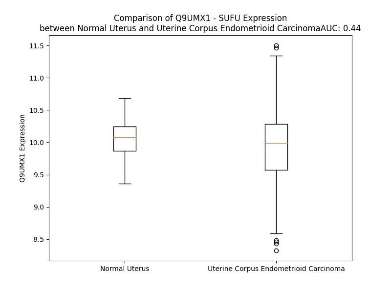

# Detailed Data for Q9UMX1

## Introduction to the Detailed Summary

### How to Interpret the Results

- **Summary & Metrics**: This section provides a quick reference to essential protein attributes, including expression changes, family classification, and biomarker applications. Regulation status (upregulated/downregulated) indicates the protein's behavior in a disease context. Some information comes from the original excel file with the proteins selected from literature, while others are derived from the analyses.
- **Expression Comparison**: A visual representation comparing protein expression between normal and disease states. It highlights significant changes in expression levels that might indicate diagnostic or therapeutic relevance. This is data coming from transcriptomics experiments and could not translate similarly to protein levels.
- **Isoform Alignment**: An interactive view of isoform alignments, revealing structural and functional differences between variants of the protein.
- **Interactors & Homologs**: Tables listing known interaction partners and homologous proteins, the more interactors and homologs, the more complex the protein is to design an antibody for.
- **Biological Assemblies**: Information about the structural arrangement of the protein in different assemblies, providing insights into its functional state but also the complexity of the protein to develop antibodies.
- **Combined Per-Residue Information**: A detailed table summarizing residue-level data. This includes predictions for epitope regions, aggregation tendencies, and modifications that might impact the protein's function. Each row corresponds to a residue in the protein, providing insights into specific sites that may be important for research or drug development.
## Summary & Metrics

- **UniProt Accession**: Q9UMX1
- **Gene Name**: SUFU
- **Protein Name**: Suppressor of fused homolog
- **Swiss Prot**: SUFU_HUMAN
- **Family**: transcription regulator
- **Biomarker Application**:  
- **Number of Isoforms**: 3
- **Regulation**: 1
- **(transcriptomics) AUC**: 0.73
- **(transcriptomics) Fold Change**: 1.04
- **(transcriptomics) Regulation**: Upregulated
- **Discotope Epitope Count**: 129
- **Max n_uniprots (Homo)**: 4
- **Max n_uniprots (Hetero)**: 2

## Expression Comparison

## Isoform Alignment

<pre style='font-size:14px; font-family:monospace;'>Q9UMX1-1 MAELRPSGAPGPTAPPAPGPTAPPAFASLFPPGLHAIYGECRRLYPDQPNPLQVTAIVKYWLGGPDPLDYVSMYRNVGSPSANIPEHWHYISFGLSDLYGDNRVHEFTGTDGPSGFGFELTFRLKRETGESAPPTWPAELMQGLARYVFQSENTFCSGDHVSWHSPLDNSESRIQHMLLTEDPQMQPVQTPFGVVTFLQIVGVCTEELHSAQQWNGQGILELLRTVPIAGGPWLITDMRRGETIFEIDPHLQERVDKGIETDGSNLSGVSAKCAWDDLSRPPEDDEDSRSICIGTQPRRLSGKDTEQIRETLRRGLEINSKPVLPPINPQRQNGLAHDRAPSRKDSLESDSSTAIIPHELIRTRQLESVHLKFNQESGALIPLCLRGRLLHGRHFTYKSITGDMAITFVSTGVEGAFATEEHPYAAHGPWLQILLTEEFVEKMLEDLEDLTSPEEF---KLPKEYSWPEKKLKV-SILPDVVFDSPLH
Q9UMX1-2 MAELRPSGAPGPTAPPAPGPTAPPAFASLFPPGLHAIYGECRRLYPDQPNPLQVTAIVKYWLGGPDPLDYVSMYRNVGSPSANIPEHWHYISFGLSDLYGDNRVHEFTGTDGPSGFGFELTFRLKRETGESAPPTWPAELMQGLARYVFQSENTFCSGDHVSWHSPLDNSESRIQHMLLTEDPQMQPVQTPFGVVTFLQIVGVCTEELHSAQQWNGQGILELLRTVPIAGGPWLITDMRRGETIFEIDPHLQERVDKGIETDGSNLSGVSAKCAWDDLSRPPEDDEDSRSICIGTQPRRLSGKDTEQIRETLRRGLEINSKPVLPPINPQRQNGLAHDRAPSRKDSLESDSSTAIIPHELIRTRQLESVHLKFNQESGALIPLCLRGRLLHGRHFTYKSITGDMAITFVSTGVEGAFATEEHPYAAHGPWLQL-------------------------------------------------------
Q9UMX1-3 MAELRPSGAPGPTAPPAPGPTAPPAFASLFPPGLHAIYGECRRLYPDQPNPLQVTAIVKYWLGGPDPLDYVSMYRNVGSPSANIPEHWHYISFGLSDLYGDNRVHEFTGTDGPSGFGFELTFRLKRETGESAPPTWPAELMQGLARYVFQSENTFCSGDHVSWHSPLDNSESRIQHMLLTEDPQMQPVQTPFGVVTFLQIVGVCTEELHSAQQWNGQGILELLRTVPIAGGPWLITDMRRGETIFEIDPHLQERVDKGIETDGSNLSGVSAKCAWDDLSRPPEDDEDSRSICIGTQPRRLSGKDTEQIRETLRRGLEINSKPVLPPINPQRQNGLAHDRAPSRKDSLESDSSTAIIPHELIRTRQLESVHLKFNQESGALIPLCLRGRLLHGRHFTYKSITGDMAITFVSTGVEGAFATEEHPYAAHGPWLQVRRPFFF--SLLPFIDFLAHPSSSPLAALDGTPSWGAGHECLMDSGPGACV-----
</pre>

## Interactors

| preferredName_A   | preferredName_B   |   score |
|:------------------|:------------------|--------:|
| SUFU              | GLI2              |   0.999 |
| SUFU              | GLI1              |   0.999 |
| SUFU              | KIF7              |   0.999 |
| SUFU              | GLI3              |   0.999 |
| SUFU              | SMO               |   0.998 |
| SUFU              | STK36             |   0.998 |
| SUFU              | PTCH1             |   0.979 |
| SUFU              | ULK3              |   0.977 |
| SUFU              | PRKACA            |   0.966 |
| SUFU              | PRKACG            |   0.965 |
| SUFU              | PRKACB            |   0.965 |
| SUFU              | SPOP              |   0.96  |
| SUFU              | CUL3              |   0.949 |
| SUFU              | SPOPL             |   0.94  |
| SUFU              | SHH               |   0.937 |
| SUFU              | PTCH2             |   0.93  |
| SUFU              | GLIS3             |   0.929 |
| SUFU              | GSK3B             |   0.92  |

## Homologs

| uniprot_id   | gene_id   |
|--------------|-----------|

## Biological Assemblies

|   Unnamed: 0 |   assembly |   n_uniprots | composition   | crystal_id   |
|-------------:|-----------:|-------------:|:--------------|:-------------|
|            0 |          1 |            1 | Homo          | 4bl8         |
|            1 |          2 |            1 | Homo          | 4bl8         |
|            0 |          1 |            1 | Homo          | 4bla         |
|            1 |          2 |            1 | Homo          | 4bla         |
|            2 |          3 |            1 | Homo          | 4bla         |
|            3 |          4 |            1 | Homo          | 4bla         |
|            0 |          1 |            2 | Hetero        | 4bld         |
|            1 |          2 |            2 | Hetero        | 4bld         |
|            2 |          3 |            2 | Hetero        | 4bld         |
|            3 |          4 |            2 | Hetero        | 4bld         |
|            0 |          1 |            2 | Homo          | 4kmh         |
|            0 |          1 |            4 | Homo          | 1m1l         |
|            0 |          1 |            1 | Homo          | 4km9         |
|            0 |          1 |            1 | Homo          | 4bl9         |
|            1 |          2 |            1 | Homo          | 4bl9         |
|            2 |          3 |            1 | Homo          | 4bl9         |
|            3 |          4 |            1 | Homo          | 4bl9         |
|            0 |          1 |            2 | Hetero        | 4kmd         |
|            1 |          2 |            2 | Hetero        | 4kmd         |
|            0 |          1 |            2 | Hetero        | 4blb         |
|            1 |          2 |            2 | Hetero        | 4blb         |
|            2 |          3 |            2 | Hetero        | 4blb         |
|            3 |          4 |            2 | Hetero        | 4blb         |
|            0 |          1 |            1 | Homo          | 4km8         |

## Combined Per-Residue Information

|   res | aa   |   epitope_score | epitope   |   relative_surface_accessibility |   modeling_confidence |   Aggregation | modification     |
|------:|:-----|----------------:|:----------|---------------------------------:|----------------------:|--------------:|:-----------------|
|     1 | M    |         0.10541 | False     |                          1.33746 |                 32.44 |         0     | N/A              |
|     2 | A    |         0.11781 | False     |                          1.02598 |                 35.12 |         0     | N/A              |
|     3 | E    |         0.13417 | False     |                          0.88298 |                 23.83 |         0     | N/A              |
|     4 | L    |         0.14279 | False     |                          1.09672 |                 31.51 |         0     | N/A              |
|     5 | R    |         0.2068  | True      |                          0.90097 |                 24.11 |         0     | N/A              |
|     6 | P    |         0.18922 | True      |                          0.92302 |                 32.04 |         0     | N/A              |
|     7 | S    |         0.06125 | False     |                          0.85705 |                 33.83 |         0     | N/A              |
|     8 | G    |         0.17518 | True      |                          0.85031 |                 29.06 |         0     | N/A              |
|     9 | A    |         0.08709 | False     |                          0.94805 |                 27.89 |         0     | N/A              |
|    10 | P    |         0.13706 | False     |                          0.98007 |                 39.88 |         0     | N/A              |
|    11 | G    |         0.13951 | False     |                          0.83598 |                 34.75 |         0     | N/A              |
|    12 | P    |         0.12889 | False     |                          0.97523 |                 36.21 |         0     | N/A              |
|    13 | T    |         0.1671  | True      |                          0.96082 |                 39.14 |         0     | N/A              |
|    14 | A    |         0.16133 | True      |                          0.88805 |                 43.94 |         0     | N/A              |
|    15 | P    |         0.13775 | False     |                          0.8604  |                 46.02 |         0     | N/A              |
|    16 | P    |         0.1337  | False     |                          0.95102 |                 41.13 |         0     | N/A              |
|    17 | A    |         0.15771 | True      |                          0.86719 |                 45.58 |         0     | N/A              |
|    18 | P    |         0.1409  | False     |                          0.96647 |                 43.29 |         0     | N/A              |
|    19 | G    |         0.18767 | True      |                          0.66863 |                 38.79 |         0     | N/A              |
|    20 | P    |         0.13756 | False     |                          0.99231 |                 42.97 |         0     | N/A              |
|    21 | T    |         0.15446 | False     |                          0.92365 |                 38.59 |         0     | N/A              |
|    22 | A    |         0.10843 | False     |                          0.82771 |                 39.41 |         0     | N/A              |
|    23 | P    |         0.13799 | False     |                          0.82988 |                 35.33 |         0     | N/A              |
|    24 | P    |         0.11472 | False     |                          0.90033 |                 42.26 |         0     | N/A              |
|    25 | A    |         0.08618 | False     |                          0.89078 |                 44.51 |         0.366 | N/A              |
|    26 | F    |         0.1035  | False     |                          1.00682 |                 42.16 |         0.366 | N/A              |
|    27 | A    |         0.14122 | False     |                          0.85832 |                 50.18 |         0.366 | N/A              |
|    28 | S    |         0.11779 | False     |                          0.60697 |                 54.01 |         0.366 | N/A              |
|    29 | L    |         0.1834  | True      |                          1.07004 |                 71.65 |         0.366 | N/A              |
|    30 | F    |         0.15909 | True      |                          0.54297 |                 83.77 |         0     | N/A              |
|    31 | P    |         0.14789 | False     |                          0.19414 |                 93.34 |         0     | N/A              |
|    32 | P    |         0.11305 | False     |                          0.43212 |                 94.44 |         0     | N/A              |
|    33 | G    |         0.00641 | False     |                          0.00322 |                 96.1  |         0     | N/A              |
|    34 | L    |         0.03943 | False     |                          0.05935 |                 95.91 |         0     | N/A              |
|    35 | H    |         0.12947 | False     |                          0.52721 |                 96.05 |         0     | N/A              |
|    36 | A    |         0.07084 | False     |                          0.19552 |                 97.04 |         0     | N/A              |
|    37 | I    |         0.0029  | False     |                          0.0008  |                 97.79 |         0     | N/A              |
|    38 | Y    |         0.07844 | False     |                          0.15527 |                 96.49 |         0     | N/A              |
|    39 | G    |         0.10849 | False     |                          0.41548 |                 97.02 |         0     | N/A              |
|    40 | E    |         0.09467 | False     |                          0.07163 |                 98.24 |         0     | N/A              |
|    41 | C    |         0.00312 | False     |                          0       |                 98.19 |         0     | N/A              |
|    42 | R    |         0.15422 | False     |                          0.49337 |                 97.55 |         0     | N/A              |
|    43 | R    |         0.23617 | True      |                          0.5163  |                 97.92 |         0     | N/A              |
|    44 | L    |         0.0667  | False     |                          0.21459 |                 97.66 |         0     | N/A              |
|    45 | Y    |         0.03868 | False     |                          0.04717 |                 98.19 |         0     | N/A              |
|    46 | P    |         0.22196 | True      |                          0.7627  |                 97.48 |         0     | N/A              |
|    47 | D    |         0.24051 | True      |                          0.70797 |                 97.29 |         0     | N/A              |
|    48 | Q    |         0.1242  | False     |                          0.21829 |                 97.52 |         0     | N/A              |
|    49 | P    |         0.18693 | True      |                          0.65579 |                 94.04 |         0     | N/A              |
|    50 | N    |         0.30357 | True      |                          0.87907 |                 93.82 |         0     | N/A              |
|    51 | P    |         0.04918 | False     |                          0.21362 |                 96.4  |         0     | N/A              |
|    52 | L    |         0.13863 | False     |                          0.52062 |                 96.53 |         3.333 | N/A              |
|    53 | Q    |         0.12826 | False     |                          0.30661 |                 96.74 |         3.897 | N/A              |
|    54 | V    |         0.12972 | False     |                          0.37578 |                 96.01 |        18.285 | N/A              |
|    55 | T    |         0.2093  | True      |                          0.50233 |                 96.29 |        18.285 | N/A              |
|    56 | A    |         0.04147 | False     |                          0.06959 |                 94.41 |        18.285 | N/A              |
|    57 | I    |         0.17674 | True      |                          1.01207 |                 93.28 |        18.285 | N/A              |
|    58 | V    |         0.16588 | True      |                          0.49297 |                 95.89 |        18.029 | N/A              |
|    59 | K    |         0.08815 | False     |                          0.16723 |                 94.99 |         0     | N/A              |
|    60 | Y    |         0.13391 | False     |                          0.3341  |                 96.12 |         0     | N/A              |
|    61 | W    |         0.25987 | True      |                          0.31744 |                 94.55 |         0     | N/A              |
|    62 | L    |         0.32987 | True      |                          0.75923 |                 96.1  |         0     | N/A              |
|    63 | G    |         0.16586 | True      |                          0.85352 |                 95.57 |         0     | N/A              |
|    64 | G    |         0.05931 | False     |                          0.07117 |                 96.94 |         0     | N/A              |
|    65 | P    |         0.16466 | True      |                          0.67738 |                 96.48 |         0     | N/A              |
|    66 | D    |         0.06826 | False     |                          0.1676  |                 97.96 |         0     | N/A              |
|    67 | P    |         0.02418 | False     |                          0.02723 |                 97.81 |         0     | N/A              |
|    68 | L    |         0.00476 | False     |                          0.00244 |                 98.46 |         0     | N/A              |
|    69 | D    |         0.05211 | False     |                          0.01528 |                 97.74 |         0     | N/A              |
|    70 | Y    |         0.12398 | False     |                          0.19033 |                 97.96 |         3.126 | N/A              |
|    71 | V    |         0.01239 | False     |                          0.01714 |                 98.55 |         3.126 | N/A              |
|    72 | S    |         0.00452 | False     |                          0       |                 98.49 |         3.126 | N/A              |
|    73 | M    |         0.03166 | False     |                          0.02658 |                 98.56 |         3.126 | N/A              |
|    74 | Y    |         0.0179  | False     |                          0.01913 |                 98.56 |         3.126 | N/A              |
|    75 | R    |         0.11475 | False     |                          0.40518 |                 98    |         0     | N/A              |
|    76 | N    |         0.04162 | False     |                          0.04738 |                 98.05 |         0     | N/A              |
|    77 | V    |         0.13573 | False     |                          0.71932 |                 96.44 |         0     | N/A              |
|    78 | G    |         0.0437  | False     |                          0.13562 |                 96.38 |         0     | N/A              |
|    79 | S    |         0.19294 | True      |                          0.21207 |                 96.3  |         0     | N/A              |
|    80 | P    |         0.22934 | True      |                          0.89195 |                 92.55 |         0     | N/A              |
|    81 | S    |         0.31297 | True      |                          0.90955 |                 95.55 |         0     | N/A              |
|    82 | A    |         0.23222 | True      |                          0.4619  |                 94.05 |         0     | N/A              |
|    83 | N    |         0.23787 | True      |                          0.65414 |                 94.3  |         0     | N/A              |
|    84 | I    |         0.0633  | False     |                          0.05316 |                 97.32 |         0     | N/A              |
|    85 | P    |         0.10207 | False     |                          0.41013 |                 96.48 |         0     | N/A              |
|    86 | E    |         0.0759  | False     |                          0.22905 |                 97.32 |         0     | N/A              |
|    87 | H    |         0.01403 | False     |                          0       |                 98.55 |         0     | N/A              |
|    88 | W    |         0.03971 | False     |                          0.03814 |                 98.73 |         0.132 | N/A              |
|    89 | H    |         0.00483 | False     |                          0       |                 98.83 |         0.132 | N/A              |
|    90 | Y    |         0.00601 | False     |                          0       |                 98.89 |         1.197 | N/A              |
|    91 | I    |         0.00209 | False     |                          0       |                 98.85 |         1.424 | N/A              |
|    92 | S    |         0.0024  | False     |                          0       |                 98.72 |         1.424 | N/A              |
|    93 | F    |         0.00405 | False     |                          0       |                 98.38 |         1.424 | N/A              |
|    94 | G    |         0.01052 | False     |                          0.05416 |                 97.63 |         1.292 | N/A              |
|    95 | L    |         0.00217 | False     |                          0       |                 98.35 |         1.011 | N/A              |
|    96 | S    |         0.00712 | False     |                          0.01033 |                 97.93 |         0     | N/A              |
|    97 | D    |         0.0149  | False     |                          0.02964 |                 97.44 |         0     | N/A              |
|    98 | L    |         0.0392  | False     |                          0.02251 |                 96.85 |         0     | N/A              |
|    99 | Y    |         0.06641 | False     |                          0.14773 |                 95.58 |         0     | N/A              |
|   100 | G    |         0.12004 | False     |                          0.28788 |                 93.24 |         0     | N/A              |
|   101 | D    |         0.19935 | True      |                          0.46152 |                 93.95 |         0     | N/A              |
|   102 | N    |         0.24473 | True      |                          0.61211 |                 92.85 |         0     | N/A              |
|   103 | R    |         0.26876 | True      |                          0.40402 |                 94.34 |         0     | N/A              |
|   104 | V    |         0.14062 | False     |                          0.30868 |                 95.26 |         0     | N/A              |
|   105 | H    |         0.05767 | False     |                          0.09096 |                 95.09 |         0     | N/A              |
|   106 | E    |         0.13043 | False     |                          0.73888 |                 92.85 |         0     | N/A              |
|   107 | F    |         0.19824 | True      |                          0.48858 |                 92.23 |         0     | N/A              |
|   108 | T    |         0.18186 | True      |                          0.71994 |                 89.57 |         0     | N/A              |
|   109 | G    |         0.10216 | False     |                          0.24608 |                 90.21 |         0     | N/A              |
|   110 | T    |         0.20588 | True      |                          0.50866 |                 92.32 |         0     | N/A              |
|   111 | D    |         0.2289  | True      |                          0.88651 |                 91.22 |         0     | N/A              |
|   112 | G    |         0.10363 | False     |                          0.31802 |                 94.23 |         0     | N/A              |
|   113 | P    |         0.05498 | False     |                          0.34923 |                 96.58 |         0     | N/A              |
|   114 | S    |         0.00835 | False     |                          0       |                 97.51 |         0     | N/A              |
|   115 | G    |         0.04336 | False     |                          0.28158 |                 96.61 |         0     | N/A              |
|   116 | F    |         0.04462 | False     |                          0.20401 |                 97.25 |         0     | N/A              |
|   117 | G    |         0.0292  | False     |                          0.11734 |                 97.52 |         0     | N/A              |
|   118 | F    |         0.02133 | False     |                          0.02872 |                 98.48 |         0     | N/A              |
|   119 | E    |         0.00257 | False     |                          0       |                 98.8  |         0     | N/A              |
|   120 | L    |         0.00249 | False     |                          0       |                 98.87 |         0     | N/A              |
|   121 | T    |         0.00228 | False     |                          0       |                 98.92 |         0     | N/A              |
|   122 | F    |         0.0035  | False     |                          0.00064 |                 98.91 |         0     | N/A              |
|   123 | R    |         0.00475 | False     |                          0       |                 98.84 |         0     | N/A              |
|   124 | L    |         0.02532 | False     |                          0.06018 |                 98.69 |         0     | N/A              |
|   125 | K    |         0.06165 | False     |                          0.34737 |                 98.19 |         0     | N/A              |
|   126 | R    |         0.13358 | False     |                          0.26946 |                 97.51 |         0     | N/A              |
|   127 | E    |         0.10559 | False     |                          0.31362 |                 94.38 |         0     | N/A              |
|   128 | T    |         0.21228 | True      |                          0.99916 |                 91.51 |         0     | N/A              |
|   129 | G    |         0.17942 | True      |                          0.8939  |                 91.8  |         0     | N/A              |
|   130 | E    |         0.13052 | False     |                          0.24423 |                 93.63 |         0     | N/A              |
|   131 | S    |         0.19004 | True      |                          0.87776 |                 93.89 |         0     | N/A              |
|   132 | A    |         0.14873 | False     |                          0.53223 |                 96.19 |         0     | N/A              |
|   133 | P    |         0.03989 | False     |                          0.10179 |                 97.61 |         0     | N/A              |
|   134 | P    |         0.0604  | False     |                          0.25832 |                 97.24 |         0     | N/A              |
|   135 | T    |         0.09831 | False     |                          0.55091 |                 96.96 |         0     | N/A              |
|   136 | W    |         0.09426 | False     |                          0.23118 |                 97.68 |         0     | N/A              |
|   137 | P    |         0.00428 | False     |                          0       |                 98.64 |         0     | N/A              |
|   138 | A    |         0.01366 | False     |                          0.04699 |                 98.38 |         0     | N/A              |
|   139 | E    |         0.13233 | False     |                          0.51886 |                 97.68 |         0     | N/A              |
|   140 | L    |         0.04062 | False     |                          0.0417  |                 98.2  |         0     | N/A              |
|   141 | M    |         0.00238 | False     |                          0       |                 98.68 |         0     | N/A              |
|   142 | Q    |         0.03973 | False     |                          0.07129 |                 98.15 |         0     | N/A              |
|   143 | G    |         0.18494 | True      |                          0.20077 |                 96.93 |         0     | N/A              |
|   144 | L    |         0.01246 | False     |                          0.01237 |                 97.81 |         0     | N/A              |
|   145 | A    |         0.00147 | False     |                          0       |                 98.03 |         0     | N/A              |
|   146 | R    |         0.08546 | False     |                          0.23725 |                 97.37 |         0     | N/A              |
|   147 | Y    |         0.12394 | False     |                          0.44238 |                 95.06 |         0.398 | N/A              |
|   148 | V    |         0.00274 | False     |                          0       |                 95.07 |         0.398 | N/A              |
|   149 | F    |         0.03428 | False     |                          0.16758 |                 95.59 |         0.398 | N/A              |
|   150 | Q    |         0.17596 | True      |                          0.73211 |                 93.96 |         0.398 | N/A              |
|   151 | S    |         0.22071 | True      |                          0.35479 |                 89.86 |         0.398 | N/A              |
|   152 | E    |         0.12828 | False     |                          0.6317  |                 90.67 |         0     | N/A              |
|   153 | N    |         0.21084 | True      |                          0.51726 |                 86.09 |         0     | N/A              |
|   154 | T    |         0.07187 | False     |                          0.45752 |                 92.83 |         0     | N/A              |
|   155 | F    |         0.02354 | False     |                          0.10507 |                 95.17 |         0     | N/A              |
|   156 | C    |         0.02829 | False     |                          0.54862 |                 95.38 |         0     | N/A              |
|   157 | S    |         0.03317 | False     |                          0.3231  |                 96.91 |         0     | N/A              |
|   158 | G    |         0.01899 | False     |                          0.18189 |                 95.04 |         0     | N/A              |
|   159 | D    |         0.05034 | False     |                          0.29555 |                 94.96 |         0     | N/A              |
|   160 | H    |         0.0453  | False     |                          0.43384 |                 94.83 |         0     | N/A              |
|   161 | V    |         0.04119 | False     |                          0.16185 |                 92.89 |         0     | N/A              |
|   162 | S    |         0.05995 | False     |                          0.36619 |                 91.44 |         0     | N/A              |
|   163 | W    |         0.10722 | False     |                          0.38935 |                 92.24 |         0     | N/A              |
|   164 | H    |         0.22795 | True      |                          0.74259 |                 90.77 |         0     | N/A              |
|   165 | S    |         0.11963 | False     |                          0.30683 |                 93.93 |         0     | N/A              |
|   166 | P    |         0.05248 | False     |                          0.16618 |                 97.46 |         0     | N/A              |
|   167 | L    |         0.03486 | False     |                          0.039   |                 97.87 |         0     | N/A              |
|   168 | D    |         0.13711 | False     |                          0.20695 |                 96.65 |         0     | N/A              |
|   169 | N    |         0.18053 | True      |                          0.82291 |                 92.87 |         0     | N/A              |
|   170 | S    |         0.12942 | False     |                          0.36241 |                 94.39 |         0     | N/A              |
|   171 | E    |         0.34373 | True      |                          0.90976 |                 93.19 |         0     | N/A              |
|   172 | S    |         0.06003 | False     |                          0.08649 |                 96.9  |         0     | N/A              |
|   173 | R    |         0.12062 | False     |                          0.31541 |                 97.34 |         0     | N/A              |
|   174 | I    |         0.00653 | False     |                          0.0024  |                 98.42 |         0     | N/A              |
|   175 | Q    |         0.09268 | False     |                          0.27428 |                 97.55 |         0     | N/A              |
|   176 | H    |         0.02373 | False     |                          0.0178  |                 98.32 |         0     | N/A              |
|   177 | M    |         0.00878 | False     |                          0       |                 98.44 |         0     | N/A              |
|   178 | L    |         0.00131 | False     |                          0       |                 98.64 |         0     | N/A              |
|   179 | L    |         0.0027  | False     |                          0       |                 98.67 |         0     | N/A              |
|   180 | T    |         0.01265 | False     |                          0.02983 |                 98.61 |         0     | N/A              |
|   181 | E    |         0.04363 | False     |                          0.63366 |                 98.49 |         0     | N/A              |
|   182 | D    |         0.01787 | False     |                          0.06416 |                 98.65 |         0     | N/A              |
|   183 | P    |         0.07267 | False     |                          0.42674 |                 97.63 |         0     | N/A              |
|   184 | Q    |         0.10363 | False     |                          0.1782  |                 97.93 |         0     | N/A              |
|   185 | M    |         0.01999 | False     |                          0.04146 |                 98.33 |         0     | N/A              |
|   186 | Q    |         0.10151 | False     |                          0.4975  |                 98.01 |         0     | N/A              |
|   187 | P    |         0.14198 | False     |                          0.63093 |                 98.17 |         0     | N/A              |
|   188 | V    |         0.08862 | False     |                          0.136   |                 97.9  |         0     | N/A              |
|   189 | Q    |         0.15963 | True      |                          0.55764 |                 97.29 |         0     | N/A              |
|   190 | T    |         0.0381  | False     |                          0.02099 |                 96.7  |         0     | N/A              |
|   191 | P    |         0.21755 | True      |                          0.51982 |                 95.21 |         0.586 | N/A              |
|   192 | F    |         0.18306 | True      |                          0.11151 |                 96.21 |        48.374 | N/A              |
|   193 | G    |         0.00381 | False     |                          0       |                 97.44 |        52.267 | N/A              |
|   194 | V    |         0.07043 | False     |                          0.37553 |                 97.79 |        94.891 | N/A              |
|   195 | V    |         0.00319 | False     |                          0       |                 98.44 |        98.219 | N/A              |
|   196 | T    |         0.04221 | False     |                          0.35317 |                 98.35 |        98.501 | N/A              |
|   197 | F    |         0.00905 | False     |                          0.03113 |                 98.81 |        98.9   | N/A              |
|   198 | L    |         0.0252  | False     |                          0.05606 |                 98.79 |        98.156 | N/A              |
|   199 | Q    |         0.00153 | False     |                          0.00117 |                 98.89 |        90.539 | N/A              |
|   200 | I    |         0.00347 | False     |                          0       |                 98.89 |        90.236 | N/A              |
|   201 | V    |         0.00486 | False     |                          0.00666 |                 98.86 |        86.839 | N/A              |
|   202 | G    |         0.00851 | False     |                          0.03569 |                 98.68 |        46.641 | N/A              |
|   203 | V    |         0.00357 | False     |                          0       |                 98.64 |        43.28  | N/A              |
|   204 | C    |         0.01193 | False     |                          0.002   |                 98.07 |         3.721 | N/A              |
|   205 | T    |         0.07982 | False     |                          0.33161 |                 96.82 |         0.665 | N/A              |
|   206 | E    |         0.15086 | False     |                          0.37043 |                 96.58 |         0     | N/A              |
|   207 | E    |         0.00465 | False     |                          0       |                 98.3  |         0     | N/A              |
|   208 | L    |         0.01864 | False     |                          0.01566 |                 97.51 |         0     | N/A              |
|   209 | H    |         0.11219 | False     |                          0.48042 |                 93.89 |         0     | N/A              |
|   210 | S    |         0.02602 | False     |                          0.07503 |                 96.29 |         0     | N/A              |
|   211 | A    |         0.00674 | False     |                          0.02357 |                 96.69 |         0     | N/A              |
|   212 | Q    |         0.02172 | False     |                          0.22615 |                 91.42 |         0     | N/A              |
|   213 | Q    |         0.05224 | False     |                          0.27957 |                 93.28 |         0     | N/A              |
|   214 | W    |         0.07618 | False     |                          0.10215 |                 96.81 |         0     | N/A              |
|   215 | N    |         0.0372  | False     |                          0.15408 |                 94.78 |         0     | N/A              |
|   216 | G    |         0.00918 | False     |                          0.05621 |                 96.23 |         0     | N/A              |
|   217 | Q    |         0.07966 | False     |                          0.40291 |                 97.46 |         0     | N/A              |
|   218 | G    |         0.02814 | False     |                          0.08394 |                 98.06 |         0     | N/A              |
|   219 | I    |         0.00506 | False     |                          0       |                 98.54 |         0     | N/A              |
|   220 | L    |         0.00334 | False     |                          0       |                 98.67 |         0     | N/A              |
|   221 | E    |         0.13514 | False     |                          0.41774 |                 98.15 |         0     | N/A              |
|   222 | L    |         0.01626 | False     |                          0.00659 |                 98.5  |         0     | N/A              |
|   223 | L    |         0.00361 | False     |                          0       |                 98.56 |         0     | N/A              |
|   224 | R    |         0.12141 | False     |                          0.28723 |                 97.97 |         0     | N/A              |
|   225 | T    |         0.15973 | True      |                          0.50068 |                 97.18 |         0     | N/A              |
|   226 | V    |         0.07415 | False     |                          0.05903 |                 97.34 |         0     | N/A              |
|   227 | P    |         0.23135 | True      |                          0.56809 |                 94.94 |         0     | N/A              |
|   228 | I    |         0.22125 | True      |                          0.55702 |                 94.03 |         0     | N/A              |
|   229 | A    |         0.02284 | False     |                          0.0436  |                 96.86 |         0     | N/A              |
|   230 | G    |         0.03745 | False     |                          0.07876 |                 96.6  |         0     | N/A              |
|   231 | G    |         0.03794 | False     |                          0.02897 |                 96.87 |         0     | N/A              |
|   232 | P    |         0.14888 | False     |                          0.50828 |                 97.27 |         0     | N/A              |
|   233 | W    |         0.07749 | False     |                          0.18061 |                 98.35 |         0     | N/A              |
|   234 | L    |         0.01963 | False     |                          0.0279  |                 98.67 |         0     | N/A              |
|   235 | I    |         0.02095 | False     |                          0.02226 |                 98.75 |         0     | N/A              |
|   236 | T    |         0.0169  | False     |                          0.0219  |                 98.7  |         0     | N/A              |
|   237 | D    |         0.05238 | False     |                          0.10118 |                 97.86 |         0     | N/A              |
|   238 | M    |         0.04705 | False     |                          0.08499 |                 97.62 |         0     | N/A              |
|   239 | R    |         0.36914 | True      |                          0.72976 |                 96.04 |         0     | N/A              |
|   240 | R    |         0.07855 | False     |                          0.0531  |                 96.59 |         0     | N/A              |
|   241 | G    |         0.26001 | True      |                          0.57848 |                 95.21 |         0     | N/A              |
|   242 | E    |         0.2434  | True      |                          0.47516 |                 97.27 |         0     | N/A              |
|   243 | T    |         0.03943 | False     |                          0.01013 |                 98.05 |         0     | N/A              |
|   244 | I    |         0.01427 | False     |                          0       |                 98.32 |         0     | N/A              |
|   245 | F    |         0.02763 | False     |                          0.14428 |                 97.52 |         0     | N/A              |
|   246 | E    |         0.30725 | True      |                          0.46126 |                 97.47 |         0     | N/A              |
|   247 | I    |         0.26378 | True      |                          0.36145 |                 96.48 |         0     | N/A              |
|   248 | D    |         0.21832 | True      |                          0.3022  |                 97.02 |         0     | N/A              |
|   249 | P    |         0.30195 | True      |                          0.6525  |                 95.82 |         0     | N/A              |
|   250 | H    |         0.23852 | True      |                          0.66962 |                 95.99 |         0     | N/A              |
|   251 | L    |         0.06101 | False     |                          0.0338  |                 97.36 |         0     | N/A              |
|   252 | Q    |         0.1174  | False     |                          0.36297 |                 95.13 |         0     | N/A              |
|   253 | E    |         0.19286 | True      |                          0.59668 |                 94.82 |         0     | N/A              |
|   254 | R    |         0.27154 | True      |                          0.41061 |                 97.13 |         0     | N/A              |
|   255 | V    |         0.00776 | False     |                          0.00286 |                 96.5  |         0     | N/A              |
|   256 | D    |         0.07081 | False     |                          0.35983 |                 94.37 |         0     | N/A              |
|   257 | K    |         0.21877 | True      |                          0.69449 |                 95.93 |         0     | N/A              |
|   258 | G    |         0.04929 | False     |                          0.08462 |                 96.75 |         0     | N/A              |
|   259 | I    |         0.03364 | False     |                          0.0576  |                 96.15 |         0     | N/A              |
|   260 | E    |         0.11568 | False     |                          0.54271 |                 95.29 |         0     | N/A              |
|   261 | T    |         0.20058 | True      |                          0.68473 |                 96.38 |         0     | N/A              |
|   262 | D    |         0.15243 | False     |                          0.45428 |                 94.84 |         0     | N/A              |
|   263 | G    |         0.01744 | False     |                          0.02056 |                 95.13 |         0     | N/A              |
|   264 | S    |         0.00789 | False     |                          0       |                 95    |         0     | N/A              |
|   265 | N    |         0.07019 | False     |                          0.38829 |                 89.95 |         0     | N/A              |
|   266 | L    |         0.0397  | False     |                          0.20032 |                 89.68 |         0     | N/A              |
|   267 | S    |         0.01659 | False     |                          0.05895 |                 90.36 |         0     | N/A              |
|   268 | G    |         0.03823 | False     |                          0.20871 |                 91.9  |         0     | N/A              |
|   269 | V    |         0.08773 | False     |                          0.22436 |                 91.48 |         0     | N/A              |
|   270 | S    |         0.18747 | True      |                          0.65953 |                 90.24 |         0     | N/A              |
|   271 | A    |         0.02392 | False     |                          0.03826 |                 92.29 |         0     | N/A              |
|   272 | K    |         0.06744 | False     |                          0.22007 |                 92.84 |         0     | N/A              |
|   273 | C    |         0.01682 | False     |                          0.03601 |                 95.22 |         0     | N/A              |
|   274 | A    |         0.03007 | False     |                          0.19769 |                 95.42 |         0     | N/A              |
|   275 | W    |         0.0244  | False     |                          0.11556 |                 95.86 |         0     | N/A              |
|   276 | D    |         0.06363 | False     |                          0.33808 |                 94.94 |         0     | N/A              |
|   277 | D    |         0.04077 | False     |                          0.27819 |                 93.4  |         0     | N/A              |
|   278 | L    |         0.23496 | True      |                          0.54896 |                 89.04 |         0     | N/A              |
|   279 | S    |         0.16916 | True      |                          0.34357 |                 81.24 |         0     | N/A              |
|   280 | R    |         0.20385 | True      |                          0.64516 |                 67.36 |         0     | N/A              |
|   281 | P    |         0.23535 | True      |                          0.67942 |                 54.47 |         0     | N/A              |
|   282 | P    |         0.28184 | True      |                          0.89653 |                 53.02 |         0     | N/A              |
|   283 | E    |         0.27509 | True      |                          0.85156 |                 46.48 |         0     | N/A              |
|   284 | D    |         0.20537 | True      |                          0.64587 |                 45.15 |         0     | N/A              |
|   285 | D    |         0.17806 | True      |                          0.66642 |                 45.6  |         0     | N/A              |
|   286 | E    |         0.16512 | True      |                          0.90807 |                 42.36 |         0     | N/A              |
|   287 | D    |         0.15268 | False     |                          0.75004 |                 37.65 |         0     | N/A              |
|   288 | S    |         0.11545 | False     |                          0.46846 |                 38.43 |         0     | N/A              |
|   289 | R    |         0.23592 | True      |                          0.95057 |                 37.26 |         0     | N/A              |
|   290 | S    |         0.13765 | False     |                          0.35288 |                 37.53 |         0     | N/A              |
|   291 | I    |         0.09925 | False     |                          0.31419 |                 45.96 |         0     | N/A              |
|   292 | C    |         0.12817 | False     |                          0.74265 |                 31.91 |         0     | N/A              |
|   293 | I    |         0.1045  | False     |                          0.74737 |                 31.65 |         0     | N/A              |
|   294 | G    |         0.16049 | True      |                          0.606   |                 34.97 |         0     | N/A              |
|   295 | T    |         0.18983 | True      |                          1.03052 |                 46.45 |         0     | N/A              |
|   296 | Q    |         0.18926 | True      |                          0.71111 |                 33.48 |         0     | N/A              |
|   297 | P    |         0.0955  | False     |                          0.42789 |                 43.3  |         0     | N/A              |
|   298 | R    |         0.14957 | False     |                          0.63959 |                 52.99 |         0     | N/A              |
|   299 | R    |         0.1706  | True      |                          0.58909 |                 57.22 |         0     | N/A              |
|   300 | L    |         0.03779 | False     |                          0.1033  |                 64.26 |         0     | N/A              |
|   301 | S    |         0.10466 | False     |                          0.3628  |                 72.33 |         0     | Phosphoserine    |
|   302 | G    |         0.13507 | False     |                          0.77701 |                 72.17 |         0     | N/A              |
|   303 | K    |         0.12338 | False     |                          0.54882 |                 74.23 |         0     | N6-acetyllysine  |
|   304 | D    |         0.03766 | False     |                          0.04344 |                 72.02 |         0     | N/A              |
|   305 | T    |         0.07522 | False     |                          0.18658 |                 76.5  |         0     | N/A              |
|   306 | E    |         0.05385 | False     |                          0.42345 |                 80.46 |         0     | N/A              |
|   307 | Q    |         0.12615 | False     |                          0.45823 |                 78.1  |         0     | N/A              |
|   308 | I    |         0.04169 | False     |                          0.0136  |                 74.97 |         0     | N/A              |
|   309 | R    |         0.16345 | True      |                          0.49792 |                 79.21 |         0     | N/A              |
|   310 | E    |         0.06869 | False     |                          0.37468 |                 80.68 |         0     | N/A              |
|   311 | T    |         0.02406 | False     |                          0.17267 |                 75.96 |         0     | N/A              |
|   312 | L    |         0.03862 | False     |                          0.26956 |                 74.51 |         0     | N/A              |
|   313 | R    |         0.11485 | False     |                          0.56524 |                 71.95 |         0     | N/A              |
|   314 | R    |         0.08746 | False     |                          0.54665 |                 68.61 |         0     | N/A              |
|   315 | G    |         0.02936 | False     |                          0.13425 |                 62.21 |         0     | N/A              |
|   316 | L    |         0.08258 | False     |                          0.63311 |                 62.31 |         0     | N/A              |
|   317 | E    |         0.12232 | False     |                          0.66973 |                 62.72 |         0     | N/A              |
|   318 | I    |         0.12991 | False     |                          0.6115  |                 45.36 |         0     | N/A              |
|   319 | N    |         0.18862 | True      |                          1.00781 |                 36.26 |         0     | N/A              |
|   320 | S    |         0.11763 | False     |                          0.67612 |                 34.46 |         0     | N/A              |
|   321 | K    |         0.22235 | True      |                          0.88585 |                 27.79 |         0     | N/A              |
|   322 | P    |         0.14555 | False     |                          0.80439 |                 27.68 |         0     | N/A              |
|   323 | V    |         0.13332 | False     |                          0.98919 |                 33.78 |         0     | N/A              |
|   324 | L    |         0.16261 | True      |                          0.67017 |                 26.95 |         0     | N/A              |
|   325 | P    |         0.17915 | True      |                          0.80407 |                 25.44 |         0     | N/A              |
|   326 | P    |         0.17137 | True      |                          0.91157 |                 27.57 |         0     | N/A              |
|   327 | I    |         0.23644 | True      |                          0.88721 |                 31.21 |         0     | N/A              |
|   328 | N    |         0.16478 | True      |                          0.68134 |                 29.78 |         0     | N/A              |
|   329 | P    |         0.15305 | False     |                          0.92696 |                 39.15 |         0     | N/A              |
|   330 | Q    |         0.22631 | True      |                          0.78218 |                 30.74 |         0     | N/A              |
|   331 | R    |         0.22119 | True      |                          0.91537 |                 29.4  |         0     | N/A              |
|   332 | Q    |         0.18043 | True      |                          0.91761 |                 31.64 |         0     | N/A              |
|   333 | N    |         0.18693 | True      |                          0.9867  |                 28.56 |         0     | N/A              |
|   334 | G    |         0.30446 | True      |                          0.82797 |                 27.26 |         0     | N/A              |
|   335 | L    |         0.21164 | True      |                          1.12847 |                 29.23 |         0     | N/A              |
|   336 | A    |         0.1969  | True      |                          0.9944  |                 30.32 |         0     | N/A              |
|   337 | H    |         0.18906 | True      |                          1.01843 |                 24.51 |         0     | N/A              |
|   338 | D    |         0.21713 | True      |                          0.85976 |                 30.99 |         0     | N/A              |
|   339 | R    |         0.18317 | True      |                          0.92969 |                 24.5  |         0     | N/A              |
|   340 | A    |         0.19909 | True      |                          0.87854 |                 30.08 |         0     | N/A              |
|   341 | P    |         0.08909 | False     |                          0.99481 |                 39.13 |         0     | N/A              |
|   342 | S    |         0.13214 | False     |                          0.81424 |                 30.36 |         0     | Phosphoserine    |
|   343 | R    |         0.19936 | True      |                          0.92016 |                 34.53 |         0     | N/A              |
|   344 | K    |         0.12598 | False     |                          0.97428 |                 27.57 |         0     | N/A              |
|   345 | D    |         0.17457 | True      |                          0.93033 |                 34.37 |         0     | N/A              |
|   346 | S    |         0.21564 | True      |                          0.74453 |                 29.3  |         0     | Phosphoserine    |
|   347 | L    |         0.20953 | True      |                          1.01122 |                 30.09 |         0     | N/A              |
|   348 | E    |         0.07396 | False     |                          0.91731 |                 27.91 |         0     | N/A              |
|   349 | S    |         0.11343 | False     |                          0.78181 |                 36.48 |         0     | N/A              |
|   350 | D    |         0.1237  | False     |                          0.89919 |                 27.48 |         0     | N/A              |
|   351 | S    |         0.1205  | False     |                          0.78732 |                 36.11 |         0     | N/A              |
|   352 | S    |         0.16014 | True      |                          0.82081 |                 32.2  |         0     | Phosphoserine    |
|   353 | T    |         0.24299 | True      |                          0.90326 |                 27.8  |         0     | Phosphothreonine |
|   354 | A    |         0.08953 | False     |                          0.76924 |                 28.05 |         0     | N/A              |
|   355 | I    |         0.19653 | True      |                          0.99753 |                 29.68 |         0     | N/A              |
|   356 | I    |         0.12257 | False     |                          0.7686  |                 31.91 |         0     | N/A              |
|   357 | P    |         0.11114 | False     |                          0.81009 |                 32.31 |         0     | N/A              |
|   358 | H    |         0.15339 | False     |                          0.74516 |                 39.4  |         0     | N/A              |
|   359 | E    |         0.10217 | False     |                          0.73529 |                 43.2  |         0     | N/A              |
|   360 | L    |         0.20597 | True      |                          1.02961 |                 44.5  |         0     | N/A              |
|   361 | I    |         0.12764 | False     |                          0.4382  |                 59.54 |         0     | N/A              |
|   362 | R    |         0.19969 | True      |                          0.84195 |                 78.32 |         0     | N/A              |
|   363 | T    |         0.0776  | False     |                          0.36425 |                 86.62 |         0     | N/A              |
|   364 | R    |         0.10831 | False     |                          0.3424  |                 90.69 |         0     | N/A              |
|   365 | Q    |         0.17228 | True      |                          0.56159 |                 92.68 |         0     | N/A              |
|   366 | L    |         0.03012 | False     |                          0.06271 |                 94.24 |         0     | N/A              |
|   367 | E    |         0.08414 | False     |                          0.5706  |                 93.48 |         0     | N/A              |
|   368 | S    |         0.06749 | False     |                          0.13535 |                 95.69 |         0     | N/A              |
|   369 | V    |         0.00265 | False     |                          0       |                 96.82 |         0     | N/A              |
|   370 | H    |         0.09605 | False     |                          0.11828 |                 97.69 |         0     | N/A              |
|   371 | L    |         0.00124 | False     |                          0       |                 98.06 |         0     | N/A              |
|   372 | K    |         0.07875 | False     |                          0.22089 |                 97.41 |         0     | N/A              |
|   373 | F    |         0.00178 | False     |                          0       |                 96.1  |         0     | N/A              |
|   374 | N    |         0.02029 | False     |                          0.03699 |                 93.39 |         0     | N/A              |
|   375 | Q    |         0.07381 | False     |                          0.33254 |                 90.71 |         0     | N/A              |
|   376 | E    |         0.0896  | False     |                          0.69432 |                 89.14 |         0     | N/A              |
|   377 | S    |         0.0141  | False     |                          0.03886 |                 92.15 |         0     | N/A              |
|   378 | G    |         0.00552 | False     |                          0       |                 92.96 |         0     | N/A              |
|   379 | A    |         0.03719 | False     |                          0.34095 |                 90.52 |         0     | N/A              |
|   380 | L    |         0.05095 | False     |                          0.19372 |                 92.47 |         0     | N/A              |
|   381 | I    |         0.00477 | False     |                          0.0032  |                 95.69 |         0     | N/A              |
|   382 | P    |         0.02262 | False     |                          0.08131 |                 94.85 |         0     | N/A              |
|   383 | L    |         0.01966 | False     |                          0.1079  |                 93.96 |         0     | N/A              |
|   384 | C    |         0.00121 | False     |                          0       |                 95.36 |         0     | N/A              |
|   385 | L    |         0.00396 | False     |                          0.00082 |                 96.83 |         0     | N/A              |
|   386 | R    |         0.08914 | False     |                          0.30385 |                 95.27 |         0     | N/A              |
|   387 | G    |         0.00325 | False     |                          0       |                 94.91 |         0     | N/A              |
|   388 | R    |         0.00795 | False     |                          0.00983 |                 96    |         0     | N/A              |
|   389 | L    |         0.00641 | False     |                          0.03573 |                 96.7  |         0     | N/A              |
|   390 | L    |         0.06894 | False     |                          0.40237 |                 96.38 |         0     | N/A              |
|   391 | H    |         0.07307 | False     |                          0.30831 |                 95.5  |         0     | N/A              |
|   392 | G    |         0.03937 | False     |                          0.43541 |                 94.79 |         0     | N/A              |
|   393 | R    |         0.03102 | False     |                          0.24737 |                 94.75 |         0     | N/A              |
|   394 | H    |         0.00873 | False     |                          0.03532 |                 95.62 |         0     | N/A              |
|   395 | F    |         0.00131 | False     |                          0       |                 97.15 |         0     | N/A              |
|   396 | T    |         0.00539 | False     |                          0.0083  |                 96.46 |         0     | N/A              |
|   397 | Y    |         0.00262 | False     |                          0       |                 96.92 |         0     | N/A              |
|   398 | K    |         0.05204 | False     |                          0.28678 |                 93.01 |         0     | N/A              |
|   399 | S    |         0.02379 | False     |                          0.06275 |                 91.98 |         0     | N/A              |
|   400 | I    |         0.25982 | True      |                          0.61285 |                 86.47 |         0     | N/A              |
|   401 | T    |         0.06991 | False     |                          0.55801 |                 84.91 |         0     | N/A              |
|   402 | G    |         0.07808 | False     |                          0.28206 |                 80.59 |         0     | N/A              |
|   403 | D    |         0.05863 | False     |                          0.1193  |                 87.36 |         0     | N/A              |
|   404 | M    |         0.02089 | False     |                          0.21933 |                 92.47 |        16.384 | N/A              |
|   405 | A    |         0.0009  | False     |                          0       |                 94.67 |        29.814 | N/A              |
|   406 | I    |         0.00279 | False     |                          0       |                 97.76 |        37.917 | N/A              |
|   407 | T    |         0.00234 | False     |                          0       |                 97.57 |        38.252 | N/A              |
|   408 | F    |         0.0062  | False     |                          0.00318 |                 98.08 |        38.41  | N/A              |
|   409 | V    |         0.00402 | False     |                          0.00857 |                 96.61 |        37.348 | N/A              |
|   410 | S    |         0.02756 | False     |                          0.07189 |                 95.71 |        13.901 | N/A              |
|   411 | T    |         0.05747 | False     |                          0.5564  |                 91.65 |         6.597 | N/A              |
|   412 | G    |         0.20519 | True      |                          0.62588 |                 87.07 |         2.015 | N/A              |
|   413 | V    |         0.0438  | False     |                          0.20745 |                 89.56 |         1.929 | N/A              |
|   414 | E    |         0.16914 | True      |                          0.84071 |                 87.42 |         0     | N/A              |
|   415 | G    |         0.17215 | True      |                          0.85442 |                 86.97 |         0     | N/A              |
|   416 | A    |         0.06195 | False     |                          0.26544 |                 91.13 |         0     | N/A              |
|   417 | F    |         0.18675 | True      |                          0.20584 |                 92.77 |         0     | N/A              |
|   418 | A    |         0.01222 | False     |                          0.03111 |                 94.01 |         0     | N/A              |
|   419 | T    |         0.07656 | False     |                          0.39572 |                 93.2  |         0     | N/A              |
|   420 | E    |         0.11053 | False     |                          0.59999 |                 91.83 |         0     | N/A              |
|   421 | E    |         0.14109 | False     |                          0.6844  |                 93.14 |         0     | N/A              |
|   422 | H    |         0.17352 | True      |                          0.39559 |                 94.37 |         0     | N/A              |
|   423 | P    |         0.07266 | False     |                          0.30419 |                 96.4  |         0     | N/A              |
|   424 | Y    |         0.02044 | False     |                          0.03625 |                 97.45 |         0     | N/A              |
|   425 | A    |         0.00165 | False     |                          0.00128 |                 95.49 |         0     | N/A              |
|   426 | A    |         0.00203 | False     |                          0       |                 94.18 |         0     | N/A              |
|   427 | H    |         0.07835 | False     |                          0.14707 |                 90.31 |         0     | N/A              |
|   428 | G    |         0.02928 | False     |                          0.2831  |                 88.52 |         0     | N/A              |
|   429 | P    |         0.01697 | False     |                          0.10736 |                 91.12 |         0     | N/A              |
|   430 | W    |         0.0602  | False     |                          0.03483 |                 94.18 |         9.955 | N/A              |
|   431 | L    |         0.0024  | False     |                          0       |                 97.16 |        11.666 | N/A              |
|   432 | Q    |         0.0152  | False     |                          0.02463 |                 97.46 |        11.666 | N/A              |
|   433 | I    |         0.00372 | False     |                          0       |                 98.05 |        11.666 | N/A              |
|   434 | L    |         0.02722 | False     |                          0.09993 |                 97.8  |        11.666 | N/A              |
|   435 | L    |         0.01735 | False     |                          0.01599 |                 97.45 |         8.764 | N/A              |
|   436 | T    |         0.04976 | False     |                          0.33873 |                 96.02 |         1.561 | N/A              |
|   437 | E    |         0.06956 | False     |                          0.61543 |                 95.73 |         0     | N/A              |
|   438 | E    |         0.16086 | True      |                          0.74499 |                 96.08 |         0     | N/A              |
|   439 | F    |         0.05693 | False     |                          0.04587 |                 97.16 |         0     | N/A              |
|   440 | V    |         0.01452 | False     |                          0.01047 |                 97.16 |         0     | N/A              |
|   441 | E    |         0.14036 | False     |                          0.46908 |                 96.28 |         0     | N/A              |
|   442 | K    |         0.15973 | True      |                          0.47515 |                 96.66 |         0     | N/A              |
|   443 | M    |         0.00584 | False     |                          0.00144 |                 97.1  |         0     | N/A              |
|   444 | L    |         0.04844 | False     |                          0.14627 |                 95.32 |         0     | N/A              |
|   445 | E    |         0.18371 | True      |                          0.69874 |                 94.77 |         0     | N/A              |
|   446 | D    |         0.15016 | False     |                          0.40786 |                 95.05 |         0     | N/A              |
|   447 | L    |         0.00542 | False     |                          0.00369 |                 92.98 |         0     | N/A              |
|   448 | E    |         0.11678 | False     |                          0.6647  |                 87.29 |         0     | N/A              |
|   449 | D    |         0.19402 | True      |                          0.32953 |                 85.77 |         0     | N/A              |
|   450 | L    |         0.01799 | False     |                          0.01534 |                 84.58 |         0     | N/A              |
|   451 | T    |         0.15177 | False     |                          0.5543  |                 73.91 |         0     | N/A              |
|   452 | S    |         0.11206 | False     |                          0.4342  |                 70.99 |         0     | N/A              |
|   453 | P    |         0.16764 | True      |                          0.35391 |                 59.76 |         0     | N/A              |
|   454 | E    |         0.34148 | True      |                          0.90592 |                 64.51 |         0     | N/A              |
|   455 | E    |         0.26116 | True      |                          0.79577 |                 64.95 |         0     | N/A              |
|   456 | F    |         0.29296 | True      |                          0.17699 |                 75.6  |         0     | N/A              |
|   457 | K    |         0.23004 | True      |                          0.92462 |                 84.08 |         0     | N/A              |
|   458 | L    |         0.16712 | True      |                          0.34069 |                 88.54 |         0     | N/A              |
|   459 | P    |         0.14245 | False     |                          0.6459  |                 92.56 |         0     | N/A              |
|   460 | K    |         0.09202 | False     |                          0.30424 |                 92.96 |         0     | N/A              |
|   461 | E    |         0.13649 | False     |                          0.47773 |                 94.55 |         0     | N/A              |
|   462 | Y    |         0.10332 | False     |                          0.0758  |                 96.08 |         0     | N/A              |
|   463 | S    |         0.18333 | True      |                          0.52989 |                 96.3  |         0     | N/A              |
|   464 | W    |         0.06537 | False     |                          0.05359 |                 97.16 |         0     | N/A              |
|   465 | P    |         0.24343 | True      |                          0.78694 |                 94.47 |         0     | N/A              |
|   466 | E    |         0.22507 | True      |                          0.80694 |                 94.55 |         0     | N/A              |
|   467 | K    |         0.10061 | False     |                          0.45805 |                 95.93 |         0     | N/A              |
|   468 | K    |         0.11168 | False     |                          0.48419 |                 96.36 |         0     | N/A              |
|   469 | L    |         0.01473 | False     |                          0.01788 |                 97.82 |         0     | N/A              |
|   470 | K    |         0.04645 | False     |                          0.25781 |                 97.65 |         0     | N/A              |
|   471 | V    |         0.00391 | False     |                          0.00286 |                 97.63 |         0     | N/A              |
|   472 | S    |         0.02496 | False     |                          0.00416 |                 96.74 |         0     | N/A              |
|   473 | I    |         0.00264 | False     |                          0.0008  |                 95.11 |         0     | N/A              |
|   474 | L    |         0.10332 | False     |                          0.13971 |                 95.06 |         0     | N/A              |
|   475 | P    |         0.14764 | False     |                          0.33003 |                 91.81 |         0     | N/A              |
|   476 | D    |         0.24666 | True      |                          0.41235 |                 88.68 |         0     | N/A              |
|   477 | V    |         0.19231 | True      |                          0.80306 |                 88.39 |         0     | N/A              |
|   478 | V    |         0.08927 | False     |                          0.34386 |                 87.08 |         0     | N/A              |
|   479 | F    |         0.04248 | False     |                          0.19661 |                 85.77 |         0     | N/A              |
|   480 | D    |         0.22189 | True      |                          0.56297 |                 79.08 |         0     | N/A              |
|   481 | S    |         0.12339 | False     |                          0.37161 |                 62.6  |         0     | Phosphoserine    |
|   482 | P    |         0.22568 | True      |                          0.95506 |                 51.39 |         0     | N/A              |
|   483 | L    |         0.18171 | True      |                          0.97821 |                 39.17 |         0     | N/A              |
|   484 | H    |         0.12456 | False     |                          0.91656 |                 40.26 |         0     | N/A              |

