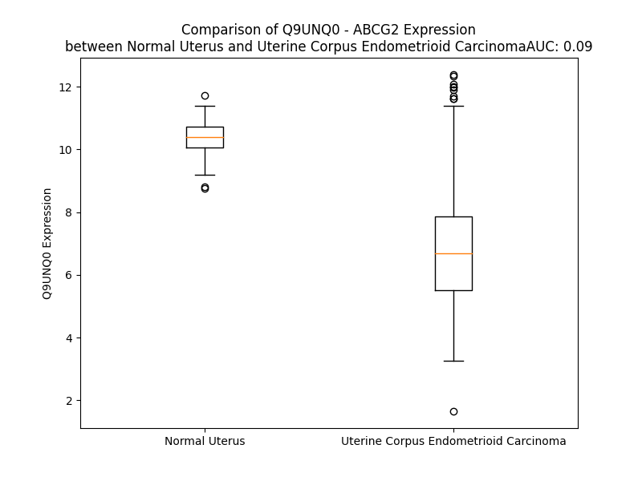

# Detailed Data for Q9UNQ0

## Introduction to the Detailed Summary

### How to Interpret the Results

- **Summary & Metrics**: This section provides a quick reference to essential protein attributes, including expression changes, family classification, and biomarker applications. Regulation status (upregulated/downregulated) indicates the protein's behavior in a disease context. Some information comes from the original excel file with the proteins selected from literature, while others are derived from the analyses.
- **Expression Comparison**: A visual representation comparing protein expression between normal and disease states. It highlights significant changes in expression levels that might indicate diagnostic or therapeutic relevance. This is data coming from transcriptomics experiments and could not translate similarly to protein levels.
- **Isoform Alignment**: An interactive view of isoform alignments, revealing structural and functional differences between variants of the protein.
- **Interactors & Homologs**: Tables listing known interaction partners and homologous proteins, the more interactors and homologs, the more complex the protein is to design an antibody for.
- **Biological Assemblies**: Information about the structural arrangement of the protein in different assemblies, providing insights into its functional state but also the complexity of the protein to develop antibodies.
- **Combined Per-Residue Information**: A detailed table summarizing residue-level data. This includes predictions for epitope regions, aggregation tendencies, and modifications that might impact the protein's function. Each row corresponds to a residue in the protein, providing insights into specific sites that may be important for research or drug development.
## Summary & Metrics

- **UniProt Accession**: Q9UNQ0
- **Gene Name**: ABCG2
- **Protein Name**: ATP-binding cassette, sub-family G (WHITE), member 2
- **Swiss Prot**: ABCG2_HUMAN
- **Family**: transporter
- **Biomarker Application**: diagnosis,efficacy,prognosis
- **Number of Isoforms**: 2
- **Regulation**: 1
- **(transcriptomics) AUC**: 0.0
- **(transcriptomics) Fold Change**: 1.62
- **(transcriptomics) Regulation**: Downregulated
- **Discotope Epitope Count**: 153
- **Max n_uniprots (Homo)**: 10
- **Max n_uniprots (Hetero)**: N/A

## Expression Comparison

## Isoform Alignment

<pre style='font-size:14px; font-family:monospace;'>Q9UNQ0-1 MSSSNVEVFIPVSQGNTNGFPATASNDLKAFTEGAVLSFHNICYRVKLKSGFLPCRKPVEKEILSNINGIMKPGLNAILGPTGGGKSSLLDVLAARKDPSGLSGDVLINGAPRPANFKCNSGYVVQDDVVMGTLTVRENLQFSAALRLATTMTNHEKNERINRVIQELGLDKVADSKVGTQFIRGVSGGERKRTSIGMELITDPSILFLDEPTTGLDSSTANAVLLLLKRMSKQGRTIIFSIHQPRYSIFKLFDSLTLLASGRLMFHGPAQEALGYFESAGYHCEAYNNPADFFLDIINGDSTAVALNREEDFKATEIIEPSKQDKPLIEKLAEIYVNSSFYKETKAELHQLSGGEKKKKITVFKEISYTTSFCHQLRWVSKRSFKNLLGNPQASIAQIIVTVVLGLVIGAIYFGLKNDSTGIQNRAGVLFFLTTNQCFSSVSAVELFVVEKKLFIHEYISGYYRVSSYFLGKLLSDLLPMRMLPSIIFTCIVYFMLGLKPKADAFFVMMFTLMMVAYSASSMALAIAAGQSVVSVATLLMTICFVFMMIFSGLLVNLTTIASWLSWLQYFSIPRYGFTALQHNEFLGQNFCPGLNATGNNPCNYATCTGEEYLVKQGIDLSPWGLWKNHVALACMIVIFLTIAYLKLLFLKKYS
Q9UNQ0-2 MSSSNVEVFIPVSQGNTNGFPATASNDLKAFTEGAVLSFHNICYRVKLKSGFLPCRKPVEKEILSNINGIMKPGLNAILGPTGGGKSSLLDVLAARKDPSGLSGDVLINGAPRPANFKCNSGYVVQDDVVMGTLTVRENLQFSAALRLATTMTNHEKNERINRVIQELGLDKVADSKVGTQFIRGVSGGERKRTSIGMELITDPSILFLDEPTTGLDSSTANAVLLLLKRMSKQGRTIIFSIHQPRYSIFKLFDSLTLLASGRLMFHGPAQEALGYFESAGYHCEAYNNPADFFLDIINGDSTAVALNREEDFKATEIIEPSKQDKPLIEKLAEIYVNSSFYKETKAELHQLSGGEKKKKITVFKEISYTTSFCHQLRWVSKRSFKNLLGNPQASIAQIIVTVVLGLVIGAIYFGLKNDSTGIQNRAGVLFFLTTNQCFSSVSAVELFVVEKKLFIHEYISGYYRVSSYFLGKLLSDLLPMRMLPSIIFTCIVYFMLGLKPKADAFFVMMFTLMMVAYSASSMALAIAAGQSVVSVATLLMTICFVFMMVCWSISQPL-------------HLGCHGFSTSAFHD-MDLRLCSIMNFWDKTSAQD-SMQQETILV-TMQHVLAKNIW----------------------------
</pre>

## Interactors

| preferredName_A   | preferredName_B   |   score |
|:------------------|:------------------|--------:|
| ABCG2             | ABCC2             |   0.979 |
| ABCG2             | ABCC1             |   0.971 |

## Homologs

| uniprot_id   | gene_id   |
|:-------------|:----------|
| Q9H172       | ABCG4     |
| A0A2R8Y6M1   | ABCG8     |
| P45844       | ABCG1     |
| Q9H222       | ABCG5     |

## Biological Assemblies

|   Unnamed: 0 |   assembly |   n_uniprots | composition   | crystal_id   |
|-------------:|-----------:|-------------:|:--------------|:-------------|
|            0 |          1 |            8 | Homo          | 5nj3         |
|            0 |          1 |            8 | Homo          | 6hco         |
|            0 |          1 |            8 | Homo          | 7nfd         |
|            0 |          1 |            2 | Homo          | 6vxh         |
|            0 |          1 |            2 | Homo          | 6vxj         |
|            0 |          1 |            2 | Homo          | 6vxf         |
|            0 |          1 |            6 | Homo          | 7nez         |
|            0 |          1 |            2 | Homo          | 6hbu         |
|            0 |          1 |            2 | Homo          | 7oji         |
|            0 |          1 |            2 | Homo          | 6vxi         |
|            0 |          1 |            2 | Homo          | 8bi0         |
|            0 |          1 |            2 | Homo          | 6ffc         |
|            0 |          1 |            8 | Homo          | 6eti         |
|            0 |          1 |            2 | Homo          | 7oj8         |
|            0 |          1 |            2 | Homo          | 7ojh         |
|            0 |          1 |            2 | Homo          | 6hzm         |
|            0 |          1 |            6 | Homo          | 7neq         |
|            0 |          1 |            2 | Homo          | 6hij         |
|            0 |          1 |            6 | Homo          | 6feq         |
|            0 |          1 |            8 | Homo          | 8p7w         |
|            0 |          1 |            9 | Homo          | 8p8a         |
|            0 |          1 |            7 | Homo          | 8p8j         |
|            0 |          1 |            8 | Homo          | 5njg         |
|            0 |          1 |           10 | Homo          | 8u2c         |
|            0 |          1 |            2 | Homo          | 8bht         |

## Combined Per-Residue Information

|   res | aa   |   epitope_score | epitope   |   relative_surface_accessibility |   modeling_confidence |   Aggregation | modification              | glycosylation                   |
|------:|:-----|----------------:|:----------|---------------------------------:|----------------------:|--------------:|:--------------------------|:--------------------------------|
|     1 | M    |         0.14183 | True      |                          1.32101 |                 36.99 |         0     | N/A                       | N/A                             |
|     2 | S    |         0.16277 | True      |                          0.86232 |                 35.98 |         0     | N/A                       | N/A                             |
|     3 | S    |         0.16754 | True      |                          0.78275 |                 36.9  |         0     | N/A                       | N/A                             |
|     4 | S    |         0.11306 | False     |                          0.86025 |                 36.44 |         0     | N/A                       | N/A                             |
|     5 | N    |         0.15285 | True      |                          0.96835 |                 44.46 |         0     | N/A                       | N/A                             |
|     6 | V    |         0.14172 | True      |                          0.93806 |                 33.71 |         0     | N/A                       | N/A                             |
|     7 | E    |         0.13055 | True      |                          0.85225 |                 38.92 |         0     | N/A                       | N/A                             |
|     8 | V    |         0.10639 | False     |                          0.80975 |                 35.04 |         0     | N/A                       | N/A                             |
|     9 | F    |         0.18508 | True      |                          1.03168 |                 28.97 |         0     | N/A                       | N/A                             |
|    10 | I    |         0.11891 | False     |                          0.91776 |                 37.13 |         0     | N/A                       | N/A                             |
|    11 | P    |         0.19954 | True      |                          0.77356 |                 35.65 |         0     | N/A                       | N/A                             |
|    12 | V    |         0.14254 | True      |                          1.00969 |                 34.24 |         0     | N/A                       | N/A                             |
|    13 | S    |         0.17015 | True      |                          0.8185  |                 35.86 |         0     | N/A                       | N/A                             |
|    14 | Q    |         0.15553 | True      |                          0.95764 |                 31.37 |         0     | N/A                       | N/A                             |
|    15 | G    |         0.19363 | True      |                          0.91984 |                 36.2  |         0     | N/A                       | N/A                             |
|    16 | N    |         0.20184 | True      |                          0.93666 |                 31.79 |         0     | N/A                       | N/A                             |
|    17 | T    |         0.21329 | True      |                          0.8309  |                 33.75 |         0     | N/A                       | N/A                             |
|    18 | N    |         0.21675 | True      |                          0.92588 |                 34.03 |         0     | N/A                       | N/A                             |
|    19 | G    |         0.19339 | True      |                          0.80978 |                 29.72 |         0     | N/A                       | N/A                             |
|    20 | F    |         0.18113 | True      |                          1.07199 |                 33.34 |         0     | N/A                       | N/A                             |
|    21 | P    |         0.19633 | True      |                          0.85116 |                 31.98 |         0     | N/A                       | N/A                             |
|    22 | A    |         0.16318 | True      |                          1.01686 |                 28.13 |         0     | N/A                       | N/A                             |
|    23 | T    |         0.17309 | True      |                          0.94786 |                 34.01 |         0     | N/A                       | N/A                             |
|    24 | A    |         0.13635 | True      |                          0.65743 |                 32.98 |         0     | N/A                       | N/A                             |
|    25 | S    |         0.17845 | True      |                          0.90986 |                 32.52 |         0     | N/A                       | N/A                             |
|    26 | N    |         0.21349 | True      |                          0.70722 |                 31.18 |         0     | N/A                       | N/A                             |
|    27 | D    |         0.16301 | True      |                          0.77748 |                 30.27 |         0     | N/A                       | N/A                             |
|    28 | L    |         0.21082 | True      |                          1.05646 |                 29.44 |         0     | N/A                       | N/A                             |
|    29 | K    |         0.17559 | True      |                          0.82753 |                 27.27 |         0     | N/A                       | N/A                             |
|    30 | A    |         0.20463 | True      |                          0.78501 |                 28.95 |         0     | N/A                       | N/A                             |
|    31 | F    |         0.20595 | True      |                          1.00505 |                 31.25 |         0     | N/A                       | N/A                             |
|    32 | T    |         0.1967  | True      |                          0.87778 |                 39.47 |         0     | N/A                       | N/A                             |
|    33 | E    |         0.11108 | False     |                          0.82973 |                 61.22 |         0     | N/A                       | N/A                             |
|    34 | G    |         0.03834 | False     |                          0.21295 |                 79.35 |         0.159 | N/A                       | N/A                             |
|    35 | A    |         0.0334  | False     |                          0.07927 |                 89.77 |         3.213 | N/A                       | N/A                             |
|    36 | V    |         0.02942 | False     |                          0.22129 |                 93.84 |         3.379 | N/A                       | N/A                             |
|    37 | L    |         0.00258 | False     |                          0       |                 94.69 |         3.379 | N/A                       | N/A                             |
|    38 | S    |         0.00437 | False     |                          0.00079 |                 95.2  |         3.379 | N/A                       | N/A                             |
|    39 | F    |         0.00705 | False     |                          0       |                 95.48 |         3.379 | N/A                       | N/A                             |
|    40 | H    |         0.04015 | False     |                          0.09912 |                 93.84 |         1.454 | N/A                       | N/A                             |
|    41 | N    |         0.09691 | False     |                          0.55618 |                 93.41 |         1.454 | N/A                       | N/A                             |
|    42 | I    |         0.00387 | False     |                          0       |                 95    |         1.454 | N/A                       | N/A                             |
|    43 | C    |         0.05463 | False     |                          0.17455 |                 95.32 |         1.454 | N/A                       | N/A                             |
|    44 | Y    |         0.03884 | False     |                          0.06049 |                 94.96 |         1.213 | N/A                       | N/A                             |
|    45 | R    |         0.12081 | False     |                          0.47627 |                 93.25 |         0     | N/A                       | N/A                             |
|    46 | V    |         0.07771 | False     |                          0.3437  |                 90.29 |         0     | N/A                       | N/A                             |
|    47 | K    |         0.12978 | True      |                          0.73182 |                 88.43 |         0     | N/A                       | N/A                             |
|    48 | L    |         0.13482 | True      |                          0.51661 |                 84.11 |         0     | N/A                       | N/A                             |
|    49 | K    |         0.17154 | True      |                          0.804   |                 74.4  |         0     | N/A                       | N/A                             |
|    50 | S    |         0.136   | True      |                          0.51018 |                 63.38 |         0     | N/A                       | N/A                             |
|    51 | G    |         0.16896 | True      |                          0.53631 |                 58.92 |         0     | N/A                       | N/A                             |
|    52 | F    |         0.20554 | True      |                          0.98675 |                 57.33 |         0     | N/A                       | N/A                             |
|    53 | L    |         0.38699 | True      |                          0.80117 |                 58.26 |         0     | N/A                       | N/A                             |
|    54 | P    |         0.37028 | True      |                          0.96493 |                 62.66 |         0     | N/A                       | N/A                             |
|    55 | C    |         0.10738 | False     |                          0.75059 |                 61.27 |         0     | N/A                       | N/A                             |
|    56 | R    |         0.32228 | True      |                          0.47068 |                 63.53 |         0     | N/A                       | N/A                             |
|    57 | K    |         0.08655 | False     |                          0.75902 |                 73.06 |         0     | N/A                       | N/A                             |
|    58 | P    |         0.18833 | True      |                          0.7286  |                 80.25 |         0     | N/A                       | N/A                             |
|    59 | V    |         0.09912 | False     |                          0.55982 |                 86.75 |         0     | N/A                       | N/A                             |
|    60 | E    |         0.12932 | True      |                          0.43188 |                 88.94 |         0     | N/A                       | N/A                             |
|    61 | K    |         0.10413 | False     |                          0.54655 |                 90.22 |         0     | N/A                       | N/A                             |
|    62 | E    |         0.0751  | False     |                          0.47622 |                 92.62 |         0     | N/A                       | N/A                             |
|    63 | I    |         0.0429  | False     |                          0.26144 |                 93.41 |         0.499 | N/A                       | N/A                             |
|    64 | L    |         0.00532 | False     |                          0       |                 94.81 |         0.499 | N/A                       | N/A                             |
|    65 | S    |         0.04623 | False     |                          0.22077 |                 94.03 |         0.499 | N/A                       | N/A                             |
|    66 | N    |         0.13087 | True      |                          0.62656 |                 92.71 |         0.499 | N/A                       | N/A                             |
|    67 | I    |         0.003   | False     |                          0       |                 95.26 |         0.499 | N/A                       | N/A                             |
|    68 | N    |         0.02329 | False     |                          0.06562 |                 95.96 |         0     | N/A                       | N/A                             |
|    69 | G    |         0.00187 | False     |                          0       |                 95.62 |         0     | N/A                       | N/A                             |
|    70 | I    |         0.02786 | False     |                          0.07934 |                 96.41 |         0     | N/A                       | N/A                             |
|    71 | M    |         0.00195 | False     |                          0.00072 |                 96.47 |         0     | N/A                       | N/A                             |
|    72 | K    |         0.0441  | False     |                          0.51122 |                 95.32 |         0     | N/A                       | N/A                             |
|    73 | P    |         0.05041 | False     |                          0.3727  |                 96.05 |         0     | N/A                       | N/A                             |
|    74 | G    |         0.01516 | False     |                          0.07886 |                 95.45 |         0     | N/A                       | N/A                             |
|    75 | L    |         0.00106 | False     |                          0       |                 96.7  |         0.644 | N/A                       | N/A                             |
|    76 | N    |         0.00876 | False     |                          0.01659 |                 97.87 |         0.644 | N/A                       | N/A                             |
|    77 | A    |         0.00138 | False     |                          0.00204 |                 97.64 |         0.644 | N/A                       | N/A                             |
|    78 | I    |         0.00129 | False     |                          0       |                 97.48 |         0.644 | N/A                       | N/A                             |
|    79 | L    |         0.00201 | False     |                          0.00082 |                 95.36 |         0.644 | N/A                       | N/A                             |
|    80 | G    |         0.00193 | False     |                          0       |                 92.52 |         0     | N/A                       | N/A                             |
|    81 | P    |         0.01283 | False     |                          0.14812 |                 90.38 |         0     | N/A                       | N/A                             |
|    82 | T    |         0.09011 | False     |                          0.87015 |                 88.54 |         0     | N/A                       | N/A                             |
|    83 | G    |         0.06647 | False     |                          0.87165 |                 85.7  |         0     | N/A                       | N/A                             |
|    84 | G    |         0.01259 | False     |                          0.01979 |                 88.08 |         0     | N/A                       | N/A                             |
|    85 | G    |         0.0173  | False     |                          0.09226 |                 92.27 |         0     | N/A                       | N/A                             |
|    86 | K    |         0.01837 | False     |                          0.05529 |                 94.12 |         0     | N/A                       | N/A                             |
|    87 | S    |         0.04087 | False     |                          0.29363 |                 93.58 |         0     | N/A                       | N/A                             |
|    88 | S    |         0.01776 | False     |                          0.174   |                 94    |         0     | N/A                       | N/A                             |
|    89 | L    |         0.00093 | False     |                          0       |                 95.8  |         0     | N/A                       | N/A                             |
|    90 | L    |         0.00145 | False     |                          0       |                 95.67 |         0     | N/A                       | N/A                             |
|    91 | D    |         0.01393 | False     |                          0.10659 |                 93.98 |         0     | N/A                       | N/A                             |
|    92 | V    |         0.00488 | False     |                          0.01747 |                 94.08 |         0     | N/A                       | N/A                             |
|    93 | L    |         0.00145 | False     |                          0.00061 |                 94.47 |         0     | N/A                       | N/A                             |
|    94 | A    |         0.00901 | False     |                          0.08629 |                 93.1  |         0     | N/A                       | N/A                             |
|    95 | A    |         0.0206  | False     |                          0.31265 |                 92.19 |         0     | N/A                       | N/A                             |
|    96 | R    |         0.0381  | False     |                          0.07709 |                 91.11 |         0     | N/A                       | N/A                             |
|    97 | K    |         0.0381  | False     |                          0.1323  |                 90.23 |         0     | N/A                       | N/A                             |
|    98 | D    |         0.03583 | False     |                          0.21314 |                 87.46 |         0     | N/A                       | N/A                             |
|    99 | P    |         0.06855 | False     |                          0.64021 |                 87.26 |         0     | N/A                       | N/A                             |
|   100 | S    |         0.1709  | True      |                          0.79798 |                 88.69 |         0     | N/A                       | N/A                             |
|   101 | G    |         0.03339 | False     |                          0.1681  |                 89.02 |         0     | N/A                       | N/A                             |
|   102 | L    |         0.03701 | False     |                          0.30488 |                 92.73 |         0     | N/A                       | N/A                             |
|   103 | S    |         0.08819 | False     |                          0.37078 |                 92.07 |         0     | N/A                       | N/A                             |
|   104 | G    |         0.03953 | False     |                          0.43449 |                 91.1  |         0     | N/A                       | N/A                             |
|   105 | D    |         0.0551  | False     |                          0.45474 |                 91.33 |         0     | N/A                       | N/A                             |
|   106 | V    |         0.01959 | False     |                          0.10185 |                 92.99 |         0     | N/A                       | N/A                             |
|   107 | L    |         0.06056 | False     |                          0.10634 |                 92.88 |         0     | N/A                       | N/A                             |
|   108 | I    |         0.03402 | False     |                          0.14128 |                 91.48 |         0     | N/A                       | N/A                             |
|   109 | N    |         0.05562 | False     |                          0.59263 |                 89.77 |         0     | N/A                       | N/A                             |
|   110 | G    |         0.04999 | False     |                          0.28239 |                 87.4  |         0     | N/A                       | N/A                             |
|   111 | A    |         0.04379 | False     |                          0.48448 |                 89.08 |         0     | N/A                       | N/A                             |
|   112 | P    |         0.08988 | False     |                          0.76039 |                 88.41 |         0     | N/A                       | N/A                             |
|   113 | R    |         0.07814 | False     |                          0.34647 |                 86.56 |         0     | N/A                       | N/A                             |
|   114 | P    |         0.09712 | False     |                          0.51826 |                 85.44 |         0     | N/A                       | N/A                             |
|   115 | A    |         0.08142 | False     |                          0.48441 |                 81.51 |         0     | N/A                       | N/A                             |
|   116 | N    |         0.08333 | False     |                          0.2908  |                 82.11 |         0     | N/A                       | N/A                             |
|   117 | F    |         0.01293 | False     |                          0.04994 |                 88.2  |         0     | N/A                       | N/A                             |
|   118 | K    |         0.04784 | False     |                          0.15386 |                 85.54 |         0     | N/A                       | N/A                             |
|   119 | C    |         0.06426 | False     |                          0.10768 |                 82.1  |         0     | N/A                       | N/A                             |
|   120 | N    |         0.05684 | False     |                          0.53088 |                 83.85 |         0     | N/A                       | N/A                             |
|   121 | S    |         0.02324 | False     |                          0.08255 |                 91.75 |         0     | N/A                       | N/A                             |
|   122 | G    |         0.00102 | False     |                          0.00136 |                 93.13 |         0     | N/A                       | N/A                             |
|   123 | Y    |         0.01005 | False     |                          0.03173 |                 94.98 |         0     | N/A                       | N/A                             |
|   124 | V    |         0.00153 | False     |                          0.00381 |                 94.03 |         0     | N/A                       | N/A                             |
|   125 | V    |         0.0116  | False     |                          0.19708 |                 92.45 |         0     | N/A                       | N/A                             |
|   126 | Q    |         0.06589 | False     |                          0.44609 |                 88.99 |         0     | N/A                       | N/A                             |
|   127 | D    |         0.10411 | False     |                          0.52386 |                 85.1  |         0     | N/A                       | N/A                             |
|   128 | D    |         0.05493 | False     |                          0.20286 |                 84.7  |         0     | N/A                       | N/A                             |
|   129 | V    |         0.02193 | False     |                          0.12342 |                 89.05 |         8.249 | N/A                       | N/A                             |
|   130 | V    |         0.03307 | False     |                          0.16031 |                 92.44 |        10.091 | N/A                       | N/A                             |
|   131 | M    |         0.03748 | False     |                          0.08065 |                 91.65 |        10.438 | N/A                       | N/A                             |
|   132 | G    |         0.02502 | False     |                          0.1386  |                 90.93 |        10.743 | N/A                       | N/A                             |
|   133 | T    |         0.03657 | False     |                          0.18245 |                 89.4  |        10.743 | N/A                       | N/A                             |
|   134 | L    |         0.01596 | False     |                          0.04039 |                 93.45 |        10.743 | N/A                       | N/A                             |
|   135 | T    |         0.08229 | False     |                          0.11772 |                 95.36 |        10.407 | N/A                       | N/A                             |
|   136 | V    |         0.00072 | False     |                          0       |                 96.89 |         8.566 | N/A                       | N/A                             |
|   137 | R    |         0.0482  | False     |                          0.23537 |                 97.61 |         0     | N/A                       | N/A                             |
|   138 | E    |         0.04313 | False     |                          0.16989 |                 96.73 |         0     | N/A                       | N/A                             |
|   139 | N    |         0.01816 | False     |                          0.04059 |                 96.62 |         0     | N/A                       | N/A                             |
|   140 | L    |         0.00142 | False     |                          0       |                 96.79 |         0.207 | N/A                       | N/A                             |
|   141 | Q    |         0.04699 | False     |                          0.26874 |                 97.07 |         0.207 | N/A                       | N/A                             |
|   142 | F    |         0.02338 | False     |                          0.04264 |                 96.7  |         0.337 | N/A                       | N/A                             |
|   143 | S    |         0.00155 | False     |                          0.00104 |                 95.62 |         0.337 | N/A                       | N/A                             |
|   144 | A    |         0.00361 | False     |                          0.00893 |                 96.05 |         0.337 | N/A                       | N/A                             |
|   145 | A    |         0.02244 | False     |                          0.04155 |                 96.09 |         0.337 | N/A                       | N/A                             |
|   146 | L    |         0.00601 | False     |                          0.00975 |                 95.37 |         0.337 | N/A                       | N/A                             |
|   147 | R    |         0.01726 | False     |                          0.0412  |                 94.31 |         0     | N/A                       | N/A                             |
|   148 | L    |         0.02976 | False     |                          0.07996 |                 93.29 |         0     | N/A                       | N/A                             |
|   149 | A    |         0.08498 | False     |                          0.34459 |                 91.85 |         0     | N/A                       | N/A                             |
|   150 | T    |         0.23191 | True      |                          0.55519 |                 92.43 |         0     | N/A                       | N/A                             |
|   151 | T    |         0.19022 | True      |                          0.88897 |                 94.02 |         0     | N/A                       | N/A                             |
|   152 | M    |         0.1088  | False     |                          0.29838 |                 93.43 |         0     | N/A                       | N/A                             |
|   153 | T    |         0.11961 | False     |                          0.54768 |                 95.25 |         0     | N/A                       | N/A                             |
|   154 | N    |         0.12306 | False     |                          0.65174 |                 93.11 |         0     | N/A                       | N/A                             |
|   155 | H    |         0.18192 | True      |                          0.69983 |                 95.28 |         0     | N/A                       | N/A                             |
|   156 | E    |         0.17603 | True      |                          0.43357 |                 95.74 |         0     | N/A                       | N/A                             |
|   157 | K    |         0.03801 | False     |                          0.04883 |                 95.82 |         0     | N/A                       | N/A                             |
|   158 | N    |         0.07222 | False     |                          0.37901 |                 95.84 |         0     | N/A                       | N/A                             |
|   159 | E    |         0.13277 | True      |                          0.40283 |                 96.24 |         0     | N/A                       | N/A                             |
|   160 | R    |         0.04714 | False     |                          0.14091 |                 94.46 |         0     | N/A                       | N/A                             |
|   161 | I    |         0.02418 | False     |                          0.0168  |                 96.46 |         0     | N/A                       | N/A                             |
|   162 | N    |         0.11977 | False     |                          0.33449 |                 96.68 |         0     | N/A                       | N/A                             |
|   163 | R    |         0.28405 | True      |                          0.5595  |                 92.88 |         0     | N/A                       | N/A                             |
|   164 | V    |         0.0212  | False     |                          0.05332 |                 92.03 |         0     | N/A                       | N/A                             |
|   165 | I    |         0.03622 | False     |                          0.028   |                 94.44 |         0     | N/A                       | N/A                             |
|   166 | Q    |         0.1555  | True      |                          0.60805 |                 91.44 |         0     | N/A                       | N/A                             |
|   167 | E    |         0.09735 | False     |                          0.44545 |                 85.19 |         0     | N/A                       | N/A                             |
|   168 | L    |         0.03212 | False     |                          0.04115 |                 87.63 |         0     | N/A                       | N/A                             |
|   169 | G    |         0.18518 | True      |                          0.54038 |                 87.99 |         0     | N/A                       | N/A                             |
|   170 | L    |         0.00826 | False     |                          0.0033  |                 92.61 |         0     | N/A                       | N/A                             |
|   171 | D    |         0.16456 | True      |                          0.5011  |                 94.05 |         0     | N/A                       | N/A                             |
|   172 | K    |         0.19986 | True      |                          0.98448 |                 95.3  |         0     | N/A                       | N/A                             |
|   173 | V    |         0.09527 | False     |                          0.14281 |                 96.1  |         0     | N/A                       | N/A                             |
|   174 | A    |         0.01822 | False     |                          0.02533 |                 96.54 |         0     | N/A                       | N/A                             |
|   175 | D    |         0.15717 | True      |                          0.59577 |                 96.86 |         0     | N/A                       | N/A                             |
|   176 | S    |         0.10624 | False     |                          0.37057 |                 96.1  |         0     | N/A                       | N/A                             |
|   177 | K    |         0.09094 | False     |                          0.50835 |                 94.35 |         0     | N/A                       | N/A                             |
|   178 | V    |         0.01049 | False     |                          0.0327  |                 94.24 |         0     | N/A                       | N/A                             |
|   179 | G    |         0.04666 | False     |                          0.14873 |                 90.95 |         0     | N/A                       | N/A                             |
|   180 | T    |         0.13188 | True      |                          0.38124 |                 86.97 |         0     | N/A                       | N/A                             |
|   181 | Q    |         0.23956 | True      |                          0.9165  |                 83.71 |         0     | N/A                       | N/A                             |
|   182 | F    |         0.21731 | True      |                          0.98335 |                 82.44 |         0     | N/A                       | N/A                             |
|   183 | I    |         0.20355 | True      |                          0.63025 |                 86.42 |         0     | N/A                       | N/A                             |
|   184 | R    |         0.26687 | True      |                          0.94591 |                 90.66 |         0     | N/A                       | N/A                             |
|   185 | G    |         0.0551  | False     |                          0.37224 |                 92.41 |         0     | N/A                       | N/A                             |
|   186 | V    |         0.0582  | False     |                          0.1345  |                 93.48 |         0     | N/A                       | N/A                             |
|   187 | S    |         0.12761 | True      |                          0.48187 |                 90.15 |         0     | N/A                       | N/A                             |
|   188 | G    |         0.04708 | False     |                          0.45393 |                 86.39 |         0     | N/A                       | N/A                             |
|   189 | G    |         0.05247 | False     |                          0.14731 |                 85.27 |         0     | N/A                       | N/A                             |
|   190 | E    |         0.04716 | False     |                          0.17897 |                 90.8  |         0     | N/A                       | N/A                             |
|   191 | R    |         0.04688 | False     |                          0.39221 |                 91.92 |         0     | N/A                       | N/A                             |
|   192 | K    |         0.00698 | False     |                          0.02884 |                 89.16 |         0     | N/A                       | N/A                             |
|   193 | R    |         0.03183 | False     |                          0.18361 |                 90.25 |         0     | N/A                       | N/A                             |
|   194 | T    |         0.00131 | False     |                          0       |                 94.14 |         0     | N/A                       | N/A                             |
|   195 | S    |         0.00298 | False     |                          0.02128 |                 93.56 |         0     | N/A                       | N/A                             |
|   196 | I    |         0.00406 | False     |                          0.0024  |                 91.64 |         0     | N/A                       | N/A                             |
|   197 | G    |         0.00175 | False     |                          0       |                 93.19 |         0     | N/A                       | N/A                             |
|   198 | M    |         0.01632 | False     |                          0.07113 |                 94.49 |         0     | N/A                       | N/A                             |
|   199 | E    |         0.00326 | False     |                          0.01825 |                 93.43 |         0     | N/A                       | N/A                             |
|   200 | L    |         0.01139 | False     |                          0.03828 |                 90.79 |         0     | N/A                       | N/A                             |
|   201 | I    |         0.00467 | False     |                          0.0024  |                 90.32 |         0     | N/A                       | N/A                             |
|   202 | T    |         0.03259 | False     |                          0.16775 |                 86.66 |         0     | N/A                       | N/A                             |
|   203 | D    |         0.11336 | False     |                          0.40589 |                 86.32 |         0     | N/A                       | N/A                             |
|   204 | P    |         0.01739 | False     |                          0.01889 |                 90.61 |         0     | N/A                       | N/A                             |
|   205 | S    |         0.03615 | False     |                          0.41317 |                 88.96 |         1.442 | N/A                       | N/A                             |
|   206 | I    |         0.0063  | False     |                          0.04137 |                 94.66 |         1.442 | N/A                       | N/A                             |
|   207 | L    |         0.00089 | False     |                          0       |                 95.56 |         1.442 | N/A                       | N/A                             |
|   208 | F    |         0.00191 | False     |                          0.00127 |                 96.75 |         1.442 | N/A                       | N/A                             |
|   209 | L    |         0.00286 | False     |                          0       |                 95.94 |         1.442 | N/A                       | N/A                             |
|   210 | D    |         0.01596 | False     |                          0.07126 |                 95.06 |         0     | N/A                       | N/A                             |
|   211 | E    |         0.05244 | False     |                          0.10732 |                 92.8  |         0     | N/A                       | N/A                             |
|   212 | P    |         0.00314 | False     |                          0       |                 92.77 |         0     | N/A                       | N/A                             |
|   213 | T    |         0.03093 | False     |                          0.12366 |                 90.51 |         0     | N/A                       | N/A                             |
|   214 | T    |         0.15896 | True      |                          0.51104 |                 86.59 |         0     | N/A                       | N/A                             |
|   215 | G    |         0.17496 | True      |                          0.92224 |                 81.47 |         0     | N/A                       | N/A                             |
|   216 | L    |         0.08757 | False     |                          0.17227 |                 84.97 |         0     | N/A                       | N/A                             |
|   217 | D    |         0.18753 | True      |                          0.51112 |                 85.87 |         0     | N/A                       | N/A                             |
|   218 | S    |         0.08695 | False     |                          0.32493 |                 85.38 |         0.048 | N/A                       | N/A                             |
|   219 | S    |         0.17126 | True      |                          0.62841 |                 86.2  |         0.628 | N/A                       | N/A                             |
|   220 | T    |         0.05192 | False     |                          0.21161 |                 84.35 |         1.36  | N/A                       | N/A                             |
|   221 | A    |         0.01696 | False     |                          0.06505 |                 89.3  |         2.591 | N/A                       | N/A                             |
|   222 | N    |         0.0717  | False     |                          0.26321 |                 90.74 |         4.047 | N/A                       | N/A                             |
|   223 | A    |         0.16405 | True      |                          0.53611 |                 86.01 |        36.182 | N/A                       | N/A                             |
|   224 | V    |         0.00816 | False     |                          0.02054 |                 88.36 |        61.516 | N/A                       | N/A                             |
|   225 | L    |         0.00381 | False     |                          0       |                 92.63 |        61.516 | N/A                       | N/A                             |
|   226 | L    |         0.14417 | True      |                          0.53114 |                 91.53 |        61.516 | N/A                       | N/A                             |
|   227 | L    |         0.07277 | False     |                          0.08963 |                 87.91 |        61.027 | N/A                       | N/A                             |
|   228 | L    |         0.00235 | False     |                          0.00082 |                 92.38 |        49.13  | N/A                       | N/A                             |
|   229 | K    |         0.04819 | False     |                          0.16561 |                 94.38 |         0     | N/A                       | N/A                             |
|   230 | R    |         0.25739 | True      |                          0.60388 |                 90.39 |         0     | N/A                       | N/A                             |
|   231 | M    |         0.0529  | False     |                          0.03164 |                 87.47 |         0     | N/A                       | N/A                             |
|   232 | S    |         0.03037 | False     |                          0.04605 |                 93.56 |         0     | N/A                       | N/A                             |
|   233 | K    |         0.17069 | True      |                          0.78834 |                 92.85 |         0     | N/A                       | N/A                             |
|   234 | Q    |         0.20357 | True      |                          0.60845 |                 88.63 |         0     | N/A                       | N/A                             |
|   235 | G    |         0.03385 | False     |                          0.36982 |                 91.08 |         0     | N/A                       | N/A                             |
|   236 | R    |         0.04042 | False     |                          0.12344 |                 93.44 |         0     | N/A                       | N/A                             |
|   237 | T    |         0.00169 | False     |                          0       |                 96.37 |        16.715 | N/A                       | N/A                             |
|   238 | I    |         0.00216 | False     |                          0       |                 96.82 |        42.518 | N/A                       | N/A                             |
|   239 | I    |         0.00072 | False     |                          0       |                 97.71 |        42.518 | N/A                       | N/A                             |
|   240 | F    |         0.00212 | False     |                          0       |                 97.36 |        42.518 | N/A                       | N/A                             |
|   241 | S    |         0.00341 | False     |                          0       |                 96.56 |        42.518 | N/A                       | N/A                             |
|   242 | I    |         0.00972 | False     |                          0.00379 |                 94.3  |        41.125 | N/A                       | N/A                             |
|   243 | H    |         0.07654 | False     |                          0.38093 |                 86.81 |         0.302 | N/A                       | N/A                             |
|   244 | Q    |         0.12242 | False     |                          0.57397 |                 85.17 |         0     | N/A                       | N/A                             |
|   245 | P    |         0.02323 | False     |                          0.02726 |                 92.59 |         0     | N/A                       | N/A                             |
|   246 | R    |         0.21324 | True      |                          0.59079 |                 91.96 |         0     | N/A                       | N/A                             |
|   247 | Y    |         0.12999 | True      |                          0.51779 |                 92.47 |         2.41  | N/A                       | N/A                             |
|   248 | S    |         0.09388 | False     |                          0.42947 |                 92.93 |         3.039 | N/A                       | N/A                             |
|   249 | I    |         0.04356 | False     |                          0.0336  |                 94.21 |        19.398 | N/A                       | N/A                             |
|   250 | F    |         0.02747 | False     |                          0.09095 |                 94.32 |        20.767 | N/A                       | N/A                             |
|   251 | K    |         0.16097 | True      |                          0.62938 |                 94.28 |        20.767 | N/A                       | N/A                             |
|   252 | L    |         0.05215 | False     |                          0.1946  |                 95.42 |        20.767 | N/A                       | N/A                             |
|   253 | F    |         0.00487 | False     |                          0.00203 |                 96.65 |        20.767 | N/A                       | N/A                             |
|   254 | D    |         0.04387 | False     |                          0.37376 |                 96.56 |        20.767 | N/A                       | N/A                             |
|   255 | S    |         0.0289  | False     |                          0.12695 |                 96.87 |        20.544 | N/A                       | N/A                             |
|   256 | L    |         0.00127 | False     |                          0       |                 97.39 |        23.075 | N/A                       | N/A                             |
|   257 | T    |         0.00211 | False     |                          0.00434 |                 97.44 |        22.66  | N/A                       | N/A                             |
|   258 | L    |         0.002   | False     |                          0       |                 96.6  |        22.414 | N/A                       | N/A                             |
|   259 | L    |         0.00139 | False     |                          0       |                 94.89 |        20.741 | N/A                       | N/A                             |
|   260 | A    |         0.00329 | False     |                          0.00255 |                 93.12 |        11.107 | N/A                       | N/A                             |
|   261 | S    |         0.06094 | False     |                          0.63452 |                 89.84 |         1.705 | N/A                       | N/A                             |
|   262 | G    |         0.0082  | False     |                          0.01473 |                 91.4  |         0.105 | N/A                       | N/A                             |
|   263 | R    |         0.07361 | False     |                          0.38214 |                 94.04 |         0     | N/A                       | N/A                             |
|   264 | L    |         0.02553 | False     |                          0.07667 |                 94.86 |         0     | N/A                       | N/A                             |
|   265 | M    |         0.00918 | False     |                          0.00516 |                 94.72 |         0     | N/A                       | N/A                             |
|   266 | F    |         0.00789 | False     |                          0       |                 96.49 |         0     | N/A                       | N/A                             |
|   267 | H    |         0.01226 | False     |                          0.02894 |                 97.17 |         0     | N/A                       | N/A                             |
|   268 | G    |         0.01293 | False     |                          0.12723 |                 96.28 |         0     | N/A                       | N/A                             |
|   269 | P    |         0.03647 | False     |                          0.39778 |                 96.53 |         0     | N/A                       | N/A                             |
|   270 | A    |         0.00737 | False     |                          0.01897 |                 95.23 |         0     | N/A                       | N/A                             |
|   271 | Q    |         0.0699  | False     |                          0.60103 |                 93.17 |         0     | N/A                       | N/A                             |
|   272 | E    |         0.10856 | False     |                          0.46391 |                 94.8  |         0     | N/A                       | N/A                             |
|   273 | A    |         0.00336 | False     |                          0       |                 94.27 |         0.141 | N/A                       | N/A                             |
|   274 | L    |         0.09011 | False     |                          0.35343 |                 93.07 |         0.141 | N/A                       | N/A                             |
|   275 | G    |         0.14069 | True      |                          0.49607 |                 93.11 |         0.141 | N/A                       | N/A                             |
|   276 | Y    |         0.04966 | False     |                          0.04485 |                 94.95 |         0.141 | N/A                       | N/A                             |
|   277 | F    |         0.00639 | False     |                          0.0051  |                 93.79 |         0.141 | N/A                       | N/A                             |
|   278 | E    |         0.11797 | False     |                          0.3985  |                 92.8  |         0     | N/A                       | N/A                             |
|   279 | S    |         0.1716  | True      |                          0.75271 |                 92.01 |         0     | N/A                       | N/A                             |
|   280 | A    |         0.11295 | False     |                          0.25402 |                 91.03 |         0     | N/A                       | N/A                             |
|   281 | G    |         0.16464 | True      |                          0.66929 |                 90.99 |         0     | N/A                       | N/A                             |
|   282 | Y    |         0.16081 | True      |                          0.2747  |                 90.77 |         0     | N/A                       | N/A                             |
|   283 | H    |         0.16661 | True      |                          0.77713 |                 89.65 |         0     | N/A                       | N/A                             |
|   284 | C    |         0.11    | False     |                          0.18589 |                 86.82 |         0     | N/A                       | N/A                             |
|   285 | E    |         0.17811 | True      |                          0.61727 |                 85.53 |         0     | N/A                       | N/A                             |
|   286 | A    |         0.19711 | True      |                          0.94322 |                 80.11 |         0     | N/A                       | N/A                             |
|   287 | Y    |         0.25292 | True      |                          0.96631 |                 81.24 |         0     | N/A                       | N/A                             |
|   288 | N    |         0.25364 | True      |                          0.47302 |                 86.64 |         0     | N/A                       | N/A                             |
|   289 | N    |         0.04159 | False     |                          0.16918 |                 91.21 |         0     | N/A                       | N/A                             |
|   290 | P    |         0.05661 | False     |                          0.10338 |                 92.53 |         0     | N/A                       | N/A                             |
|   291 | A    |         0.00175 | False     |                          0       |                 91.79 |         0     | N/A                       | N/A                             |
|   292 | D    |         0.0919  | False     |                          0.32372 |                 91.79 |         0     | N/A                       | N/A                             |
|   293 | F    |         0.06261 | False     |                          0.14888 |                 92.23 |         0     | N/A                       | N/A                             |
|   294 | F    |         0.0024  | False     |                          0       |                 93.1  |         0     | N/A                       | N/A                             |
|   295 | L    |         0.02056 | False     |                          0.08864 |                 90.96 |         0     | N/A                       | N/A                             |
|   296 | D    |         0.08584 | False     |                          0.63853 |                 88.8  |         0     | N/A                       | N/A                             |
|   297 | I    |         0.08684 | False     |                          0.08948 |                 89.86 |         0     | N/A                       | N/A                             |
|   298 | I    |         0.01465 | False     |                          0.00591 |                 89.46 |         0     | N/A                       | N/A                             |
|   299 | N    |         0.07936 | False     |                          0.28325 |                 85.79 |         0     | N/A                       | N/A                             |
|   300 | G    |         0.18461 | True      |                          0.42207 |                 72.06 |         0     | N/A                       | N/A                             |
|   301 | D    |         0.11722 | False     |                          0.46678 |                 69.68 |         0     | N/A                       | N/A                             |
|   302 | S    |         0.15562 | True      |                          0.26351 |                 68.87 |         0.519 | N/A                       | N/A                             |
|   303 | T    |         0.24059 | True      |                          0.73223 |                 70.15 |         4.709 | N/A                       | N/A                             |
|   304 | A    |         0.18372 | True      |                          0.54677 |                 71.64 |         4.985 | N/A                       | N/A                             |
|   305 | V    |         0.06907 | False     |                          0.39316 |                 70.9  |         4.985 | N/A                       | N/A                             |
|   306 | A    |         0.15061 | True      |                          0.44677 |                 67.07 |         4.985 | N/A                       | N/A                             |
|   307 | L    |         0.20674 | True      |                          0.66223 |                 64.29 |         4.985 | N/A                       | N/A                             |
|   308 | N    |         0.1397  | True      |                          0.63393 |                 64.75 |         0.276 | N/A                       | N/A                             |
|   309 | R    |         0.14932 | True      |                          0.68521 |                 57.25 |         0     | N/A                       | N/A                             |
|   310 | E    |         0.17728 | True      |                          0.59353 |                 47.12 |         0     | N/A                       | N/A                             |
|   311 | E    |         0.22699 | True      |                          0.68025 |                 48.4  |         0     | N/A                       | N/A                             |
|   312 | D    |         0.1609  | True      |                          0.80473 |                 44    |         0     | N/A                       | N/A                             |
|   313 | F    |         0.17037 | True      |                          0.73059 |                 41.59 |         0     | N/A                       | N/A                             |
|   314 | K    |         0.27408 | True      |                          0.89852 |                 34.32 |         0     | N/A                       | N/A                             |
|   315 | A    |         0.27218 | True      |                          0.92611 |                 33.51 |         0     | N/A                       | N/A                             |
|   316 | T    |         0.34388 | True      |                          0.74906 |                 31.32 |         0     | N/A                       | N/A                             |
|   317 | E    |         0.26024 | True      |                          0.8167  |                 30.8  |         0     | N/A                       | N/A                             |
|   318 | I    |         0.2652  | True      |                          1.00613 |                 28.39 |         0     | N/A                       | N/A                             |
|   319 | I    |         0.30225 | True      |                          0.92899 |                 29.68 |         0     | N/A                       | N/A                             |
|   320 | E    |         0.22721 | True      |                          0.75973 |                 27.57 |         0     | N/A                       | N/A                             |
|   321 | P    |         0.16103 | True      |                          0.90215 |                 34.74 |         0     | N/A                       | N/A                             |
|   322 | S    |         0.2112  | True      |                          0.69019 |                 31.1  |         0     | N/A                       | N/A                             |
|   323 | K    |         0.2701  | True      |                          1.02183 |                 40.41 |         0     | N/A                       | N/A                             |
|   324 | Q    |         0.3187  | True      |                          0.88571 |                 44.7  |         0     | N/A                       | N/A                             |
|   325 | D    |         0.24386 | True      |                          0.79704 |                 60.25 |         0     | N/A                       | N/A                             |
|   326 | K    |         0.15767 | True      |                          0.53703 |                 75.19 |         0     | N/A                       | N/A                             |
|   327 | P    |         0.15277 | True      |                          0.56066 |                 84.54 |         0     | N/A                       | N/A                             |
|   328 | L    |         0.05301 | False     |                          0.29141 |                 88.26 |         0.135 | N/A                       | N/A                             |
|   329 | I    |         0.02033 | False     |                          0.0768  |                 86.87 |         0.135 | N/A                       | N/A                             |
|   330 | E    |         0.06222 | False     |                          0.31998 |                 88.71 |         0.135 | N/A                       | N/A                             |
|   331 | K    |         0.17009 | True      |                          0.54969 |                 91.22 |         0.135 | N/A                       | N/A                             |
|   332 | L    |         0.01399 | False     |                          0.01072 |                 91.48 |         0.135 | N/A                       | N/A                             |
|   333 | A    |         0.01497 | False     |                          0.04498 |                 91.83 |         0     | N/A                       | N/A                             |
|   334 | E    |         0.09871 | False     |                          0.39787 |                 93.05 |         0     | N/A                       | N/A                             |
|   335 | I    |         0.10698 | False     |                          0.31404 |                 93.73 |         1.176 | N/A                       | N/A                             |
|   336 | Y    |         0.00559 | False     |                          0.00894 |                 94.53 |         1.176 | N/A                       | N/A                             |
|   337 | V    |         0.08801 | False     |                          0.47662 |                 93.66 |         1.176 | N/A                       | N/A                             |
|   338 | N    |         0.1458  | True      |                          0.59485 |                 94.17 |         1.176 | N/A                       | N/A                             |
|   339 | S    |         0.05959 | False     |                          0.14857 |                 94.6  |         1.176 | N/A                       | N/A                             |
|   340 | S    |         0.12821 | True      |                          0.50426 |                 95.18 |         1.176 | N/A                       | N/A                             |
|   341 | F    |         0.06228 | False     |                          0.16551 |                 94.41 |         1.176 | N/A                       | N/A                             |
|   342 | Y    |         0.03209 | False     |                          0.1687  |                 94.01 |         0.656 | N/A                       | N/A                             |
|   343 | K    |         0.09006 | False     |                          0.62015 |                 94    |         0     | N/A                       | N/A                             |
|   344 | E    |         0.07308 | False     |                          0.59292 |                 93.9  |         0     | N/A                       | N/A                             |
|   345 | T    |         0.03579 | False     |                          0.11771 |                 92.97 |         0     | N/A                       | N/A                             |
|   346 | K    |         0.07718 | False     |                          0.45265 |                 91.29 |         0     | N/A                       | N/A                             |
|   347 | A    |         0.08907 | False     |                          0.50672 |                 92.43 |         0     | N/A                       | N/A                             |
|   348 | E    |         0.05254 | False     |                          0.27732 |                 92.25 |         0     | N/A                       | N/A                             |
|   349 | L    |         0.02646 | False     |                          0.02968 |                 90.5  |         0     | N/A                       | N/A                             |
|   350 | H    |         0.12603 | True      |                          0.65226 |                 89.08 |         0     | N/A                       | N/A                             |
|   351 | Q    |         0.15297 | True      |                          0.71211 |                 88.93 |         0     | N/A                       | N/A                             |
|   352 | L    |         0.05273 | False     |                          0.27974 |                 84.3  |         0     | N/A                       | N/A                             |
|   353 | S    |         0.05345 | False     |                          0.38463 |                 78.14 |         0     | N/A                       | N/A                             |
|   354 | G    |         0.17298 | True      |                          0.82253 |                 59    |         0     | N/A                       | N/A                             |
|   355 | G    |         0.1635  | True      |                          0.74143 |                 52.83 |         0     | N/A                       | N/A                             |
|   356 | E    |         0.14291 | True      |                          0.6013  |                 45.1  |         0     | N/A                       | N/A                             |
|   357 | K    |         0.1392  | True      |                          1.02416 |                 42.56 |         0     | N/A                       | N/A                             |
|   358 | K    |         0.17221 | True      |                          0.75441 |                 43.11 |         0     | N/A                       | N/A                             |
|   359 | K    |         0.13297 | True      |                          0.88213 |                 37.08 |         0     | N/A                       | N/A                             |
|   360 | K    |         0.13537 | True      |                          0.98533 |                 36.58 |         0     | N/A                       | N/A                             |
|   361 | I    |         0.11499 | False     |                          0.78263 |                 33.77 |         0.212 | N/A                       | N/A                             |
|   362 | T    |         0.19651 | True      |                          0.89437 |                 33.17 |         0.212 | Phosphothreonine; by PIM1 | N/A                             |
|   363 | V    |         0.10418 | False     |                          0.68878 |                 32.79 |         0.451 | N/A                       | N/A                             |
|   364 | F    |         0.24655 | True      |                          1.05629 |                 37.81 |         0.451 | N/A                       | N/A                             |
|   365 | K    |         0.14479 | True      |                          0.77413 |                 46.47 |         0.451 | N/A                       | N/A                             |
|   366 | E    |         0.17911 | True      |                          0.84047 |                 56.47 |         0.451 | N/A                       | N/A                             |
|   367 | I    |         0.07636 | False     |                          0.32619 |                 69.68 |         1.11  | N/A                       | N/A                             |
|   368 | S    |         0.12748 | True      |                          0.63059 |                 78.74 |         0.659 | N/A                       | N/A                             |
|   369 | Y    |         0.02841 | False     |                          0.11211 |                 86.76 |         0.659 | N/A                       | N/A                             |
|   370 | T    |         0.06487 | False     |                          0.41408 |                 88.27 |         0.659 | N/A                       | N/A                             |
|   371 | T    |         0.02991 | False     |                          0.03596 |                 92.9  |         0.659 | N/A                       | N/A                             |
|   372 | S    |         0.14309 | True      |                          0.53213 |                 94.59 |         0.386 | N/A                       | N/A                             |
|   373 | F    |         0.04681 | False     |                          0.39252 |                 94.78 |         0.386 | N/A                       | N/A                             |
|   374 | C    |         0.02822 | False     |                          0.4799  |                 95.57 |         0     | N/A                       | N/A                             |
|   375 | H    |         0.06049 | False     |                          0.14537 |                 95.83 |         0     | N/A                       | N/A                             |
|   376 | Q    |         0.00356 | False     |                          0.00117 |                 96.64 |         0     | N/A                       | N/A                             |
|   377 | L    |         0.02055 | False     |                          0.20114 |                 96.29 |         0     | N/A                       | N/A                             |
|   378 | R    |         0.04409 | False     |                          0.59721 |                 96.45 |         0     | N/A                       | N/A                             |
|   379 | W    |         0.04601 | False     |                          0.23516 |                 96.94 |         0     | N/A                       | N/A                             |
|   380 | V    |         0.00127 | False     |                          0.00095 |                 96.47 |         0     | N/A                       | N/A                             |
|   381 | S    |         0.01549 | False     |                          0.11606 |                 94.56 |         0     | N/A                       | N/A                             |
|   382 | K    |         0.02181 | False     |                          0.49438 |                 95.08 |         0     | N/A                       | N/A                             |
|   383 | R    |         0.02903 | False     |                          0.04452 |                 95.1  |         0     | N/A                       | N/A                             |
|   384 | S    |         0.02062 | False     |                          0.06727 |                 92.38 |         0     | N/A                       | N/A                             |
|   385 | F    |         0.02388 | False     |                          0.3294  |                 91.6  |         0     | N/A                       | N/A                             |
|   386 | K    |         0.08159 | False     |                          0.45228 |                 91.51 |         0     | N/A                       | N/A                             |
|   387 | N    |         0.07558 | False     |                          0.2032  |                 88.52 |         0     | N/A                       | N/A                             |
|   388 | L    |         0.03176 | False     |                          0.20143 |                 86    |         0     | N/A                       | N/A                             |
|   389 | L    |         0.1048  | False     |                          0.85528 |                 85.28 |         0     | N/A                       | N/A                             |
|   390 | G    |         0.14832 | True      |                          0.62049 |                 77.81 |         0     | N/A                       | N/A                             |
|   391 | N    |         0.13011 | True      |                          0.41883 |                 80.44 |         0     | N/A                       | N/A                             |
|   392 | P    |         0.06802 | False     |                          0.35488 |                 83.11 |         0     | N/A                       | N/A                             |
|   393 | Q    |         0.26718 | True      |                          0.76632 |                 84.67 |         0.003 | N/A                       | N/A                             |
|   394 | A    |         0.06661 | False     |                          0.57473 |                 83.23 |         0.089 | N/A                       | N/A                             |
|   395 | S    |         0.03502 | False     |                          0.11386 |                 86.17 |         0.256 | N/A                       | N/A                             |
|   396 | I    |         0.04342 | False     |                          0.53326 |                 90.3  |         3.406 | N/A                       | N/A                             |
|   397 | A    |         0.03307 | False     |                          0.48349 |                 90.18 |         5.723 | N/A                       | N/A                             |
|   398 | Q    |         0.01144 | False     |                          0.16311 |                 89.5  |         8.542 | N/A                       | N/A                             |
|   399 | I    |         0.02359 | False     |                          0.28559 |                 91.87 |        91.54  | N/A                       | N/A                             |
|   400 | I    |         0.03373 | False     |                          0.58937 |                 94.34 |        99.136 | N/A                       | N/A                             |
|   401 | V    |         0.02459 | False     |                          0.66761 |                 92.51 |        99.831 | N/A                       | N/A                             |
|   402 | T    |         0.00994 | False     |                          0.04068 |                 93.17 |        99.89  | N/A                       | N/A                             |
|   403 | V    |         0.03087 | False     |                          0.32466 |                 95.18 |        99.989 | N/A                       | N/A                             |
|   404 | V    |         0.0196  | False     |                          0.58908 |                 95.64 |        99.997 | N/A                       | N/A                             |
|   405 | L    |         0.0212  | False     |                          0.36507 |                 94.16 |        99.989 | N/A                       | N/A                             |
|   406 | G    |         0.00141 | False     |                          0       |                 94.78 |        99.944 | N/A                       | N/A                             |
|   407 | L    |         0.01287 | False     |                          0.50816 |                 96.06 |        99.942 | N/A                       | N/A                             |
|   408 | V    |         0.01456 | False     |                          0.50745 |                 96.19 |        99.92  | N/A                       | N/A                             |
|   409 | I    |         0.0236  | False     |                          0.0752  |                 94.84 |        99.659 | N/A                       | N/A                             |
|   410 | G    |         0.00392 | False     |                          0       |                 94.26 |        96.806 | N/A                       | N/A                             |
|   411 | A    |         0.07665 | False     |                          0.58429 |                 95.1  |        96.549 | N/A                       | N/A                             |
|   412 | I    |         0.11963 | False     |                          0.7248  |                 94.86 |        96.335 | N/A                       | N/A                             |
|   413 | Y    |         0.10518 | False     |                          0.18926 |                 93.21 |        94.044 | N/A                       | N/A                             |
|   414 | F    |         0.22778 | True      |                          0.73509 |                 93.97 |        86.369 | N/A                       | N/A                             |
|   415 | G    |         0.07093 | False     |                          0.47441 |                 90.85 |        14.435 | N/A                       | N/A                             |
|   416 | L    |         0.03502 | False     |                          0.11687 |                 91.06 |        12.134 | N/A                       | N/A                             |
|   417 | K    |         0.11292 | False     |                          0.7875  |                 87.5  |         0     | N/A                       | N/A                             |
|   418 | N    |         0.13685 | True      |                          0.41605 |                 85.07 |         0     | N/A                       | N/A                             |
|   419 | D    |         0.13579 | True      |                          0.48616 |                 82.91 |         0     | N/A                       | N/A                             |
|   420 | S    |         0.09332 | False     |                          0.63694 |                 76.09 |         0     | N/A                       | N/A                             |
|   421 | T    |         0.13903 | True      |                          0.61341 |                 84.91 |         0     | N/A                       | N/A                             |
|   422 | G    |         0.02144 | False     |                          0.02253 |                 88.1  |         0     | N/A                       | N/A                             |
|   423 | I    |         0.06158 | False     |                          0.0936  |                 89.01 |         0     | N/A                       | N/A                             |
|   424 | Q    |         0.0844  | False     |                          0.71705 |                 89.75 |         0     | N/A                       | N/A                             |
|   425 | N    |         0.05457 | False     |                          0.39336 |                 92.88 |         0     | N/A                       | N/A                             |
|   426 | R    |         0.02956 | False     |                          0.0281  |                 94.24 |         0     | N/A                       | N/A                             |
|   427 | A    |         0.00506 | False     |                          0.02423 |                 93.07 |         2.718 | N/A                       | N/A                             |
|   428 | G    |         0.00882 | False     |                          0.13819 |                 93.66 |         5.916 | N/A                       | N/A                             |
|   429 | V    |         0.00093 | False     |                          0       |                 95.45 |        94.652 | N/A                       | N/A                             |
|   430 | L    |         0.00489 | False     |                          0.01072 |                 95.98 |        98.351 | N/A                       | N/A                             |
|   431 | F    |         0.01517 | False     |                          0.10064 |                 95.32 |        98.609 | N/A                       | N/A                             |
|   432 | F    |         0.017   | False     |                          0.51151 |                 94.3  |        98.59  | N/A                       | N/A                             |
|   433 | L    |         0.00107 | False     |                          0       |                 95.64 |        98.088 | N/A                       | N/A                             |
|   434 | T    |         0.0047  | False     |                          0.01215 |                 96.08 |        50.164 | N/A                       | N/A                             |
|   435 | T    |         0.01303 | False     |                          0.14449 |                 94.33 |        19.369 | N/A                       | N/A                             |
|   436 | N    |         0.01262 | False     |                          0.14195 |                 93.97 |         0.801 | N/A                       | N/A                             |
|   437 | Q    |         0.01089 | False     |                          0.04413 |                 94.3  |         0.12  | N/A                       | N/A                             |
|   438 | C    |         0.00176 | False     |                          0.00601 |                 95.19 |         0.096 | N/A                       | N/A                             |
|   439 | F    |         0.01698 | False     |                          0.33824 |                 93.94 |         1.834 | N/A                       | N/A                             |
|   440 | S    |         0.01236 | False     |                          0.24702 |                 92.48 |         1.883 | N/A                       | N/A                             |
|   441 | S    |         0.00312 | False     |                          0.01321 |                 93.59 |         3.126 | N/A                       | N/A                             |
|   442 | V    |         0.01212 | False     |                          0.16835 |                 93.27 |        13.654 | N/A                       | N/A                             |
|   443 | S    |         0.0474  | False     |                          0.42299 |                 91.51 |        14.526 | N/A                       | N/A                             |
|   444 | A    |         0.00225 | False     |                          0.00638 |                 92.9  |        21.761 | N/A                       | N/A                             |
|   445 | V    |         0.00638 | False     |                          0.00642 |                 92.75 |        30.37  | N/A                       | N/A                             |
|   446 | E    |         0.05179 | False     |                          0.45791 |                 90.42 |        31.082 | N/A                       | N/A                             |
|   447 | L    |         0.02014 | False     |                          0.16296 |                 88.87 |        35.82  | N/A                       | N/A                             |
|   448 | F    |         0.00783 | False     |                          0.03119 |                 91.01 |        36.63  | N/A                       | N/A                             |
|   449 | V    |         0.0439  | False     |                          0.10606 |                 91.33 |        36.63  | N/A                       | N/A                             |
|   450 | V    |         0.07191 | False     |                          0.80141 |                 87.33 |        36.63  | N/A                       | N/A                             |
|   451 | E    |         0.03517 | False     |                          0.12327 |                 88.56 |        36.63  | N/A                       | N/A                             |
|   452 | K    |         0.04025 | False     |                          0.1745  |                 91.42 |        36.63  | N/A                       | N/A                             |
|   453 | K    |         0.09893 | False     |                          0.59275 |                 90.32 |        33.996 | N/A                       | N/A                             |
|   454 | L    |         0.03505 | False     |                          0.1232  |                 92.52 |        33.996 | N/A                       | N/A                             |
|   455 | F    |         0.01636 | False     |                          0.01544 |                 94.54 |        33.572 | N/A                       | N/A                             |
|   456 | I    |         0.0382  | False     |                          0.20719 |                 92.9  |        27.453 | N/A                       | N/A                             |
|   457 | H    |         0.02777 | False     |                          0.06338 |                 92.53 |         2.914 | N/A                       | N/A                             |
|   458 | E    |         0.01395 | False     |                          0.04171 |                 94.12 |         2.914 | N/A                       | N/A                             |
|   459 | Y    |         0.03323 | False     |                          0.18116 |                 93.35 |         3.804 | N/A                       | N/A                             |
|   460 | I    |         0.05585 | False     |                          0.22813 |                 91.14 |         4.026 | N/A                       | N/A                             |
|   461 | S    |         0.00444 | False     |                          0.0213  |                 91.71 |         3.382 | N/A                       | N/A                             |
|   462 | G    |         0.00733 | False     |                          0.04682 |                 91.04 |         3.382 | N/A                       | N/A                             |
|   463 | Y    |         0.02049 | False     |                          0.01699 |                 94.08 |         3.382 | N/A                       | N/A                             |
|   464 | Y    |         0.00365 | False     |                          0.00046 |                 94.61 |         2.851 | N/A                       | N/A                             |
|   465 | R    |         0.07588 | False     |                          0.38566 |                 94.14 |         0     | N/A                       | N/A                             |
|   466 | V    |         0.01031 | False     |                          0.02969 |                 95.04 |         0.497 | N/A                       | N/A                             |
|   467 | S    |         0.01649 | False     |                          0.22251 |                 95.81 |         0.497 | N/A                       | N/A                             |
|   468 | S    |         0.00132 | False     |                          0       |                 96    |         0.497 | N/A                       | N/A                             |
|   469 | Y    |         0.00887 | False     |                          0.00827 |                 96.57 |         0.497 | N/A                       | N/A                             |
|   470 | F    |         0.01746 | False     |                          0.05096 |                 96.31 |         0.497 | N/A                       | N/A                             |
|   471 | L    |         0.0106  | False     |                          0.41383 |                 95.85 |         0.331 | N/A                       | N/A                             |
|   472 | G    |         0.00148 | False     |                          0       |                 94.73 |         0     | N/A                       | N/A                             |
|   473 | K    |         0.00564 | False     |                          0.06041 |                 94.03 |         0     | N/A                       | N/A                             |
|   474 | L    |         0.00667 | False     |                          0.1014  |                 93.54 |         0     | N/A                       | N/A                             |
|   475 | L    |         0.01432 | False     |                          0.4196  |                 91.2  |         0     | N/A                       | N/A                             |
|   476 | S    |         0.01519 | False     |                          0.05824 |                 86.2  |         0     | N/A                       | N/A                             |
|   477 | D    |         0.02371 | False     |                          0.05716 |                 87.67 |         0     | N/A                       | N/A                             |
|   478 | L    |         0.01205 | False     |                          0.0981  |                 86.84 |         0     | N/A                       | N/A                             |
|   479 | L    |         0.02289 | False     |                          0.41085 |                 85.47 |         0     | N/A                       | N/A                             |
|   480 | P    |         0.04165 | False     |                          0.17491 |                 86.51 |         0     | N/A                       | N/A                             |
|   481 | M    |         0.04322 | False     |                          0.15481 |                 88.25 |         0     | N/A                       | N/A                             |
|   482 | R    |         0.01822 | False     |                          0.04394 |                 91.53 |         0     | N/A                       | N/A                             |
|   483 | M    |         0.0195  | False     |                          0.32751 |                 93.39 |         0     | N/A                       | N/A                             |
|   484 | L    |         0.02333 | False     |                          0.45092 |                 92.73 |         0     | N/A                       | N/A                             |
|   485 | P    |         0.00734 | False     |                          0.04374 |                 93.25 |         0.123 | N/A                       | N/A                             |
|   486 | S    |         0.00289 | False     |                          0.00391 |                 94.3  |        10.186 | N/A                       | N/A                             |
|   487 | I    |         0.02385 | False     |                          0.34478 |                 95.93 |        91.296 | N/A                       | N/A                             |
|   488 | I    |         0.02274 | False     |                          0.26399 |                 95.43 |        98.719 | N/A                       | N/A                             |
|   489 | F    |         0.00276 | False     |                          0       |                 95.69 |        99.398 | N/A                       | N/A                             |
|   490 | T    |         0.00228 | False     |                          0       |                 95.88 |        99.453 | N/A                       | N/A                             |
|   491 | C    |         0.02096 | False     |                          0.31848 |                 95.67 |        99.544 | N/A                       | N/A                             |
|   492 | I    |         0.02487 | False     |                          0.20417 |                 95.01 |        99.949 | N/A                       | N/A                             |
|   493 | V    |         0.00489 | False     |                          0       |                 95.56 |        99.962 | N/A                       | N/A                             |
|   494 | Y    |         0.05396 | False     |                          0.10099 |                 94.79 |        99.722 | N/A                       | N/A                             |
|   495 | F    |         0.09567 | False     |                          0.80704 |                 91.92 |        98.895 | N/A                       | N/A                             |
|   496 | M    |         0.0484  | False     |                          0.26231 |                 93.57 |        88.739 | N/A                       | N/A                             |
|   497 | L    |         0.00654 | False     |                          0       |                 93.85 |        77.101 | N/A                       | N/A                             |
|   498 | G    |         0.06969 | False     |                          0.53788 |                 90.54 |        13.535 | N/A                       | N/A                             |
|   499 | L    |         0.02281 | False     |                          0.04766 |                 93.02 |        11.44  | N/A                       | N/A                             |
|   500 | K    |         0.08712 | False     |                          0.21823 |                 93.23 |         0     | N/A                       | N/A                             |
|   501 | P    |         0.13643 | True      |                          0.86983 |                 90.83 |         0     | N/A                       | N/A                             |
|   502 | K    |         0.11784 | False     |                          0.61765 |                 94.05 |         0.053 | N/A                       | N/A                             |
|   503 | A    |         0.05018 | False     |                          0.71932 |                 94.91 |         0.053 | N/A                       | N/A                             |
|   504 | D    |         0.07084 | False     |                          0.60646 |                 95.65 |         0.053 | N/A                       | N/A                             |
|   505 | A    |         0.02454 | False     |                          0.03851 |                 95.15 |        40.423 | N/A                       | N/A                             |
|   506 | F    |         0.02504 | False     |                          0.1371  |                 96.83 |        88.205 | N/A                       | N/A                             |
|   507 | F    |         0.05091 | False     |                          0.64159 |                 97.32 |        98.884 | N/A                       | N/A                             |
|   508 | V    |         0.03053 | False     |                          0.15873 |                 97.3  |        99.756 | N/A                       | N/A                             |
|   509 | M    |         0.00529 | False     |                          0.02854 |                 97.23 |        99.83  | N/A                       | N/A                             |
|   510 | M    |         0.02045 | False     |                          0.14807 |                 97    |        99.887 | N/A                       | N/A                             |
|   511 | F    |         0.00907 | False     |                          0.43014 |                 97.46 |        99.921 | N/A                       | N/A                             |
|   512 | T    |         0.00147 | False     |                          0.00095 |                 97.81 |        99.576 | N/A                       | N/A                             |
|   513 | L    |         0.00185 | False     |                          0.00824 |                 96.9  |        99.373 | N/A                       | N/A                             |
|   514 | M    |         0.01752 | False     |                          0.21992 |                 96.23 |        98.226 | N/A                       | N/A                             |
|   515 | M    |         0.01847 | False     |                          0.10188 |                 96.73 |        96.916 | N/A                       | N/A                             |
|   516 | V    |         0.00298 | False     |                          0.00952 |                 97.01 |        95.421 | N/A                       | N/A                             |
|   517 | A    |         0.00237 | False     |                          0.01913 |                 96.19 |        77.994 | N/A                       | N/A                             |
|   518 | Y    |         0.00869 | False     |                          0.13264 |                 96.41 |        63.259 | N/A                       | N/A                             |
|   519 | S    |         0.00074 | False     |                          0       |                 96.7  |        12.45  | N/A                       | N/A                             |
|   520 | A    |         0.00074 | False     |                          0       |                 96.7  |         6.147 | N/A                       | N/A                             |
|   521 | S    |         0.00071 | False     |                          0       |                 95.92 |         0.821 | N/A                       | N/A                             |
|   522 | S    |         0.00166 | False     |                          0.00341 |                 96.39 |         0.164 | N/A                       | N/A                             |
|   523 | M    |         0.02149 | False     |                          0.06975 |                 96.29 |         0.272 | N/A                       | N/A                             |
|   524 | A    |         0.0007  | False     |                          0       |                 95.77 |         0.469 | N/A                       | N/A                             |
|   525 | L    |         0.00093 | False     |                          0.0033  |                 95.04 |         0.497 | N/A                       | N/A                             |
|   526 | A    |         0.00985 | False     |                          0.07345 |                 95.84 |         0.493 | N/A                       | N/A                             |
|   527 | I    |         0.01847 | False     |                          0.19516 |                 94.93 |         0.492 | N/A                       | N/A                             |
|   528 | A    |         0.00091 | False     |                          0.00255 |                 94.06 |         0.393 | N/A                       | N/A                             |
|   529 | A    |         0.00204 | False     |                          0.00094 |                 91.31 |         0.094 | N/A                       | N/A                             |
|   530 | G    |         0.01844 | False     |                          0.20128 |                 82.48 |         0.001 | N/A                       | N/A                             |
|   531 | Q    |         0.0785  | False     |                          0.34847 |                 88.66 |         0.018 | N/A                       | N/A                             |
|   532 | S    |         0.0899  | False     |                          0.63613 |                 87.54 |         0.696 | N/A                       | N/A                             |
|   533 | V    |         0.18015 | True      |                          0.56648 |                 91.2  |        28.149 | N/A                       | N/A                             |
|   534 | V    |         0.06673 | False     |                          0.37364 |                 91.99 |        53.388 | N/A                       | N/A                             |
|   535 | S    |         0.14556 | True      |                          0.60517 |                 93.43 |        55.774 | N/A                       | N/A                             |
|   536 | V    |         0.05865 | False     |                          0.66186 |                 93.16 |        75.185 | N/A                       | N/A                             |
|   537 | A    |         0.00338 | False     |                          0.00747 |                 93.69 |        76.915 | N/A                       | N/A                             |
|   538 | T    |         0.01831 | False     |                          0.34612 |                 94.74 |        79.487 | N/A                       | N/A                             |
|   539 | L    |         0.06903 | False     |                          0.67138 |                 95.28 |        94.192 | N/A                       | N/A                             |
|   540 | L    |         0.0482  | False     |                          0.51746 |                 94.63 |        96.959 | N/A                       | N/A                             |
|   541 | M    |         0.00354 | False     |                          0       |                 94.46 |        97.539 | N/A                       | N/A                             |
|   542 | T    |         0.04126 | False     |                          0.31055 |                 94.19 |        98.086 | N/A                       | N/A                             |
|   543 | I    |         0.03358 | False     |                          0.5864  |                 95.65 |        99.044 | N/A                       | N/A                             |
|   544 | C    |         0.03022 | False     |                          0.23123 |                 95.78 |        99.165 | N/A                       | N/A                             |
|   545 | F    |         0.00162 | False     |                          0.00069 |                 95.15 |        99.918 | N/A                       | N/A                             |
|   546 | V    |         0.02609 | False     |                          0.54665 |                 94.77 |        99.968 | N/A                       | N/A                             |
|   547 | F    |         0.06831 | False     |                          0.48168 |                 94    |        99.81  | N/A                       | N/A                             |
|   548 | M    |         0.01867 | False     |                          0.0978  |                 95.01 |        97.795 | N/A                       | N/A                             |
|   549 | M    |         0.01697 | False     |                          0.19333 |                 93.12 |        95.498 | N/A                       | N/A                             |
|   550 | I    |         0.04476 | False     |                          0.50626 |                 93.12 |        92.886 | N/A                       | N/A                             |
|   551 | F    |         0.02581 | False     |                          0.05605 |                 93.21 |        67.068 | N/A                       | N/A                             |
|   552 | S    |         0.01209 | False     |                          0.0123  |                 92.09 |        20.106 | N/A                       | N/A                             |
|   553 | G    |         0.01343 | False     |                          0.12155 |                 85.11 |        17.122 | N/A                       | N/A                             |
|   554 | L    |         0.08596 | False     |                          0.41136 |                 88.19 |        16.887 | N/A                       | N/A                             |
|   555 | L    |         0.0743  | False     |                          0.80479 |                 82.99 |        16.498 | N/A                       | N/A                             |
|   556 | V    |         0.06796 | False     |                          0.41796 |                 85.87 |        14.806 | N/A                       | N/A                             |
|   557 | N    |         0.06903 | False     |                          0.32989 |                 84.23 |         1.067 | N/A                       | N/A                             |
|   558 | L    |         0.05032 | False     |                          0.14972 |                 85.07 |         0.937 | N/A                       | N/A                             |
|   559 | T    |         0.07744 | False     |                          0.68696 |                 83.28 |         0.63  | N/A                       | N/A                             |
|   560 | T    |         0.23787 | True      |                          0.75749 |                 89.26 |         0.495 | N/A                       | N/A                             |
|   561 | I    |         0.04626 | False     |                          0.16773 |                 89.63 |         0.448 | N/A                       | N/A                             |
|   562 | A    |         0.19453 | True      |                          0.50242 |                 91.66 |         0.21  | N/A                       | N/A                             |
|   563 | S    |         0.11774 | False     |                          0.77894 |                 90.79 |         0.043 | N/A                       | N/A                             |
|   564 | W    |         0.18293 | True      |                          0.78197 |                 92.72 |         0.079 | N/A                       | N/A                             |
|   565 | L    |         0.07564 | False     |                          0.33963 |                 92.15 |         0.266 | N/A                       | N/A                             |
|   566 | S    |         0.03779 | False     |                          0.18573 |                 89.92 |         0.301 | N/A                       | N/A                             |
|   567 | W    |         0.17563 | True      |                          0.58149 |                 93.68 |         0.71  | N/A                       | N/A                             |
|   568 | L    |         0.03713 | False     |                          0.18423 |                 93.35 |         0.709 | N/A                       | N/A                             |
|   569 | Q    |         0.01486 | False     |                          0.07486 |                 93.12 |         0.695 | N/A                       | N/A                             |
|   570 | Y    |         0.07445 | False     |                          0.55496 |                 93.99 |         0.694 | N/A                       | N/A                             |
|   571 | F    |         0.07044 | False     |                          0.6231  |                 94.36 |         0.678 | N/A                       | N/A                             |
|   572 | S    |         0.00851 | False     |                          0.00595 |                 95.84 |         0.07  | N/A                       | N/A                             |
|   573 | I    |         0.00201 | False     |                          0.0008  |                 97.06 |         0     | N/A                       | N/A                             |
|   574 | P    |         0.00327 | False     |                          0.00298 |                 96.78 |         0     | N/A                       | N/A                             |
|   575 | R    |         0.04061 | False     |                          0.16465 |                 95.85 |         0     | N/A                       | N/A                             |
|   576 | Y    |         0.04107 | False     |                          0.08992 |                 97.2  |         0.233 | N/A                       | N/A                             |
|   577 | G    |         0.00121 | False     |                          0       |                 97.08 |         0.233 | N/A                       | N/A                             |
|   578 | F    |         0.00299 | False     |                          0.00706 |                 97.01 |         0.233 | N/A                       | N/A                             |
|   579 | T    |         0.02005 | False     |                          0.15171 |                 96.34 |         0.233 | N/A                       | N/A                             |
|   580 | A    |         0.00108 | False     |                          0.00128 |                 97.52 |         0.233 | N/A                       | N/A                             |
|   581 | L    |         0.00414 | False     |                          0.02054 |                 97.23 |         0.233 | N/A                       | N/A                             |
|   582 | Q    |         0.01126 | False     |                          0.02429 |                 96.45 |         0     | N/A                       | N/A                             |
|   583 | H    |         0.01656 | False     |                          0.02217 |                 96.7  |         0     | N/A                       | N/A                             |
|   584 | N    |         0.02578 | False     |                          0.11792 |                 97.04 |         0     | N/A                       | N/A                             |
|   585 | E    |         0.01989 | False     |                          0.03367 |                 95.77 |         0     | N/A                       | N/A                             |
|   586 | F    |         0.00257 | False     |                          0       |                 95.33 |         0     | N/A                       | N/A                             |
|   587 | L    |         0.0622  | False     |                          0.33821 |                 94.17 |         0     | N/A                       | N/A                             |
|   588 | G    |         0.05841 | False     |                          0.79308 |                 91.33 |         0     | N/A                       | N/A                             |
|   589 | Q    |         0.0658  | False     |                          0.14107 |                 91.13 |         0     | N/A                       | N/A                             |
|   590 | N    |         0.08951 | False     |                          0.49142 |                 89.47 |         0     | N/A                       | N/A                             |
|   591 | F    |         0.0124  | False     |                          0.01634 |                 87.39 |         0     | N/A                       | N/A                             |
|   592 | C    |         0.0338  | False     |                          0.20793 |                 83.21 |         0     | N/A                       | N/A                             |
|   593 | P    |         0.13032 | True      |                          0.69175 |                 70.24 |         0     | N/A                       | N/A                             |
|   594 | G    |         0.18015 | True      |                          0.84317 |                 64.08 |         0     | N/A                       | N/A                             |
|   595 | L    |         0.1202  | False     |                          0.53032 |                 60.94 |         0     | N/A                       | N/A                             |
|   596 | N    |         0.17515 | True      |                          0.80047 |                 55.98 |         0     | N/A                       | N-linked (GlcNAc...) asparagine |
|   597 | A    |         0.1703  | True      |                          1.02552 |                 53.46 |         0     | N/A                       | N/A                             |
|   598 | T    |         0.17928 | True      |                          0.95148 |                 49.99 |         0     | N/A                       | N/A                             |
|   599 | G    |         0.18798 | True      |                          0.56614 |                 46.25 |         0     | N/A                       | N/A                             |
|   600 | N    |         0.19677 | True      |                          1.07659 |                 39.46 |         0     | N/A                       | N/A                             |
|   601 | N    |         0.15854 | True      |                          0.56367 |                 49.79 |         0     | N/A                       | N/A                             |
|   602 | P    |         0.17015 | True      |                          0.96185 |                 48.73 |         0     | N/A                       | N/A                             |
|   603 | C    |         0.15325 | True      |                          0.31485 |                 49.67 |         0     | N/A                       | N/A                             |
|   604 | N    |         0.13612 | True      |                          1.04372 |                 46.74 |         0     | N/A                       | N/A                             |
|   605 | Y    |         0.13252 | True      |                          0.98064 |                 59.48 |         0     | N/A                       | N/A                             |
|   606 | A    |         0.11405 | False     |                          0.35081 |                 67.59 |         0     | N/A                       | N/A                             |
|   607 | T    |         0.09304 | False     |                          0.25512 |                 74.71 |         0     | N/A                       | N/A                             |
|   608 | C    |         0.04571 | False     |                          0.22468 |                 82.51 |         0     | N/A                       | N/A                             |
|   609 | T    |         0.08174 | False     |                          0.30086 |                 89.95 |         0     | N/A                       | N/A                             |
|   610 | G    |         0.00163 | False     |                          0       |                 91.36 |         0     | N/A                       | N/A                             |
|   611 | E    |         0.04895 | False     |                          0.26622 |                 93.15 |         0     | N/A                       | N/A                             |
|   612 | E    |         0.11034 | False     |                          0.42501 |                 91.41 |         0     | N/A                       | N/A                             |
|   613 | Y    |         0.03054 | False     |                          0.08341 |                 91.57 |         0     | N/A                       | N/A                             |
|   614 | L    |         0.00313 | False     |                          0       |                 93.04 |         0     | N/A                       | N/A                             |
|   615 | V    |         0.11448 | False     |                          0.65089 |                 92.35 |         0     | N/A                       | N/A                             |
|   616 | K    |         0.15599 | True      |                          0.63654 |                 89.1  |         0     | N/A                       | N/A                             |
|   617 | Q    |         0.07661 | False     |                          0.21522 |                 90.2  |         0     | N/A                       | N/A                             |
|   618 | G    |         0.12492 | False     |                          0.69682 |                 89.99 |         0     | N/A                       | N/A                             |
|   619 | I    |         0.03278 | False     |                          0.08972 |                 92.72 |         0     | N/A                       | N/A                             |
|   620 | D    |         0.06829 | False     |                          0.34891 |                 93.12 |         0     | N/A                       | N/A                             |
|   621 | L    |         0.08303 | False     |                          0.40598 |                 94.14 |         0     | N/A                       | N/A                             |
|   622 | S    |         0.08645 | False     |                          0.32626 |                 95.48 |         0     | N/A                       | N/A                             |
|   623 | P    |         0.10334 | False     |                          0.75818 |                 94.48 |         0     | N/A                       | N/A                             |
|   624 | W    |         0.14994 | True      |                          0.6355  |                 96.12 |         0     | N/A                       | N/A                             |
|   625 | G    |         0.00876 | False     |                          0.01036 |                 94.22 |         0     | N/A                       | N/A                             |
|   626 | L    |         0.01967 | False     |                          0.10964 |                 95.64 |         0     | N/A                       | N/A                             |
|   627 | W    |         0.0318  | False     |                          0.48705 |                 97.22 |         0     | N/A                       | N/A                             |
|   628 | K    |         0.05342 | False     |                          0.42061 |                 96.96 |         0     | N/A                       | N/A                             |
|   629 | N    |         0.00621 | False     |                          0.02673 |                 97.19 |         0.263 | N/A                       | N/A                             |
|   630 | H    |         0.01473 | False     |                          0.03435 |                 98.06 |         7.015 | N/A                       | N/A                             |
|   631 | V    |         0.03923 | False     |                          0.49172 |                 97.74 |        68.62  | N/A                       | N/A                             |
|   632 | A    |         0.01511 | False     |                          0.20745 |                 97.53 |        73.859 | N/A                       | N/A                             |
|   633 | L    |         0.00143 | False     |                          0.00082 |                 97.84 |        80.775 | N/A                       | N/A                             |
|   634 | A    |         0.01722 | False     |                          0.36592 |                 97.66 |        82.051 | N/A                       | N/A                             |
|   635 | C    |         0.05101 | False     |                          0.54354 |                 97.98 |        83.559 | N/A                       | N/A                             |
|   636 | M    |         0.02047 | False     |                          0.11578 |                 97.55 |        91.981 | N/A                       | N/A                             |
|   637 | I    |         0.02742 | False     |                          0.14079 |                 97.18 |        99.344 | N/A                       | N/A                             |
|   638 | V    |         0.02584 | False     |                          0.68615 |                 97.53 |        99.943 | N/A                       | N/A                             |
|   639 | I    |         0.0875  | False     |                          0.58655 |                 97.97 |        99.991 | N/A                       | N/A                             |
|   640 | F    |         0.02191 | False     |                          0.2051  |                 97.34 |        99.974 | N/A                       | N/A                             |
|   641 | L    |         0.01741 | False     |                          0.16192 |                 96.87 |        99.694 | N/A                       | N/A                             |
|   642 | T    |         0.01921 | False     |                          0.45778 |                 97.37 |        98.053 | N/A                       | N/A                             |
|   643 | I    |         0.05493 | False     |                          0.43838 |                 97.1  |        97.071 | N/A                       | N/A                             |
|   644 | A    |         0.0009  | False     |                          0       |                 95.74 |        86.198 | N/A                       | N/A                             |
|   645 | Y    |         0.03146 | False     |                          0.27497 |                 96.61 |        77.005 | N/A                       | N/A                             |
|   646 | L    |         0.08642 | False     |                          0.42736 |                 96.39 |        65.097 | N/A                       | N/A                             |
|   647 | K    |         0.04178 | False     |                          0.32735 |                 95.08 |         0.08  | N/A                       | N/A                             |
|   648 | L    |         0.00442 | False     |                          0.02226 |                 93.63 |         0.078 | N/A                       | N/A                             |
|   649 | L    |         0.04589 | False     |                          0.37992 |                 93.56 |         0.067 | N/A                       | N/A                             |
|   650 | F    |         0.15377 | True      |                          0.77158 |                 92.42 |         0.055 | N/A                       | N/A                             |
|   651 | L    |         0.06827 | False     |                          0.20245 |                 91.15 |         0.02  | N/A                       | N/A                             |
|   652 | K    |         0.06659 | False     |                          0.78789 |                 87.03 |         0     | N/A                       | N/A                             |
|   653 | K    |         0.05153 | False     |                          0.1014  |                 85.01 |         0     | N/A                       | N/A                             |
|   654 | Y    |         0.06998 | False     |                          0.48432 |                 81.36 |         0     | N/A                       | N/A                             |
|   655 | S    |         0.05007 | False     |                          0.91381 |                 59.12 |         0     | N/A                       | N/A                             |

