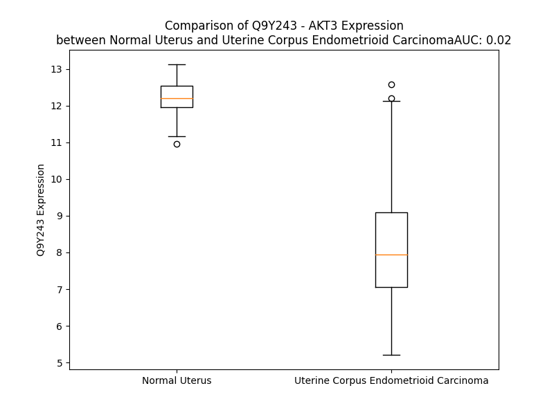

# Detailed Data for Q9Y243

## Introduction to the Detailed Summary

### How to Interpret the Results

- **Summary & Metrics**: This section provides a quick reference to essential protein attributes, including expression changes, family classification, and biomarker applications. Regulation status (upregulated/downregulated) indicates the protein's behavior in a disease context. Some information comes from the original excel file with the proteins selected from literature, while others are derived from the analyses.
- **Expression Comparison**: A visual representation comparing protein expression between normal and disease states. It highlights significant changes in expression levels that might indicate diagnostic or therapeutic relevance. This is data coming from transcriptomics experiments and could not translate similarly to protein levels.
- **Isoform Alignment**: An interactive view of isoform alignments, revealing structural and functional differences between variants of the protein.
- **Interactors & Homologs**: Tables listing known interaction partners and homologous proteins, the more interactors and homologs, the more complex the protein is to design an antibody for.
- **Biological Assemblies**: Information about the structural arrangement of the protein in different assemblies, providing insights into its functional state but also the complexity of the protein to develop antibodies.
- **Combined Per-Residue Information**: A detailed table summarizing residue-level data. This includes predictions for epitope regions, aggregation tendencies, and modifications that might impact the protein's function. Each row corresponds to a residue in the protein, providing insights into specific sites that may be important for research or drug development.
## Summary & Metrics

- **UniProt Accession**: Q9Y243
- **Gene Name**: AKT3
- **Protein Name**: v-akt murine thymoma viral oncogene homolog 3 (protein kinase B, gamma)
- **Swiss Prot**: AKT3_HUMAN
- **Family**: kinase
- **Biomarker Application**: disease progression,efficacy
- **Number of Isoforms**: 2
- **Regulation**: 1
- **(transcriptomics) AUC**: 0.03
- **(transcriptomics) Fold Change**: 1.44
- **(transcriptomics) Regulation**: Downregulated
- **Discotope Epitope Count**: 105
- **Max n_uniprots (Homo)**: 1
- **Max n_uniprots (Hetero)**: N/A

## Expression Comparison

## Isoform Alignment

<pre style='font-size:14px; font-family:monospace;'>Q9Y243-1 MSDVTIVKEGWVQKRGEYIKNWRPRYFLLKTDGSFIGYKEKPQDVDLPYPLNNFSVAKCQLMKTERPKPNTFIIRCLQWTTVIERTFHVDTPEEREEWTEAIQAVADRLQRQEEERMNCSPTSQIDNIGEEEMDASTTHHKRKTMNDFDYLKLLGKGTFGKVILVREKASGKYYAMKILKKEVIIAKDEVAHTLTESRVLKNTRHPFLTSLKYSFQTKDRLCFVMEYVNGGELFFHLSRERVFSEDRTRFYGAEIVSALDYLHSGKIVYRDLKLENLMLDKDGHIKITDFGLCKEGITDAATMKTFCGTPEYLAPEVLEDNDYGRAVDWWGLGVVMYEMMCGRLPFYNQDHEKLFELILMEDIKFPRTLSSDAKSLLSGLLIKDPNKRLGGGPDDAKEIMRHSFFSGVNWQDVYDKKLVPPFKPQVTSETDTRYFDEEFTAQTITITPPEKYDEDGMDCMDNERRPHFPQFSYSASGRE
Q9Y243-2 MSDVTIVKEGWVQKRGEYIKNWRPRYFLLKTDGSFIGYKEKPQDVDLPYPLNNFSVAKCQLMKTERPKPNTFIIRCLQWTTVIERTFHVDTPEEREEWTEAIQAVADRLQRQEEERMNCSPTSQIDNIGEEEMDASTTHHKRKTMNDFDYLKLLGKGTFGKVILVREKASGKYYAMKILKKEVIIAKDEVAHTLTESRVLKNTRHPFLTSLKYSFQTKDRLCFVMEYVNGGELFFHLSRERVFSEDRTRFYGAEIVSALDYLHSGKIVYRDLKLENLMLDKDGHIKITDFGLCKEGITDAATMKTFCGTPEYLAPEVLEDNDYGRAVDWWGLGVVMYEMMCGRLPFYNQDHEKLFELILMEDIKFPRTLSSDAKSLLSGLLIKDPNKRLGGGPDDAKEIMRHSFFSGVNWQDVYDKKLVPPFKPQVTSETDTRYFDEEFTAQTITITPPEKCQQSDCGMLGNWKK--------------
</pre>

## Interactors

| preferredName_A   | preferredName_B   |   score |
|:------------------|:------------------|--------:|
| AKT3              | PHLPP2            |   0.996 |
| AKT3              | PHLPP1            |   0.993 |
| AKT3              | PIK3CA            |   0.984 |
| AKT3              | PIK3R1            |   0.977 |
| AKT3              | PIK3CG            |   0.973 |
| AKT3              | PIK3R3            |   0.973 |
| AKT3              | TSC2              |   0.968 |
| AKT3              | PIK3R2            |   0.967 |
| AKT3              | FOXO1             |   0.966 |
| AKT3              | MDM2              |   0.966 |
| AKT3              | FOXO3             |   0.966 |
| AKT3              | AKT2              |   0.965 |
| AKT3              | PIK3CB            |   0.964 |
| AKT3              | CDC37             |   0.963 |
| AKT3              | GSK3B             |   0.963 |
| AKT3              | AKT1S1            |   0.963 |
| AKT3              | CDKN1B            |   0.96  |
| AKT3              | MTOR              |   0.96  |
| AKT3              | RPTOR             |   0.959 |
| AKT3              | PRKCZ             |   0.959 |
| AKT3              | AKT1              |   0.958 |
| AKT3              | HSP90AB1          |   0.956 |
| AKT3              | HSP90AA1          |   0.954 |
| AKT3              | TP53              |   0.953 |
| AKT3              | FOXO4             |   0.953 |
| AKT3              | TSC1              |   0.952 |
| AKT3              | PIK3CD            |   0.95  |
| AKT3              | CDKN1A            |   0.95  |
| AKT3              | BCL2              |   0.947 |
| AKT3              | NKX3-1            |   0.943 |
| AKT3              | RPS6KB1           |   0.943 |
| AKT3              | ILK               |   0.942 |
| AKT3              | JUN               |   0.941 |
| AKT3              | PIK3R5            |   0.941 |
| AKT3              | RPS6KB2           |   0.939 |
| AKT3              | PDPK1             |   0.939 |
| AKT3              | GSK3A             |   0.937 |
| AKT3              | CASP9             |   0.937 |
| AKT3              | TCL1A             |   0.936 |
| AKT3              | TBC1D7            |   0.934 |
| AKT3              | BRCA1             |   0.934 |
| AKT3              | BCL2L1            |   0.931 |
| AKT3              | TBC1D4            |   0.93  |
| AKT3              | HSP90B1           |   0.93  |
| AKT3              | MAPK3             |   0.928 |
| AKT3              | MAPK1             |   0.927 |
| AKT3              | MAPK13            |   0.926 |
| AKT3              | MAPK14            |   0.925 |
| AKT3              | MAPK12            |   0.925 |
| AKT3              | MAPK11            |   0.925 |

## Homologs

| uniprot_id   | gene_id   |
|:-------------|:----------|
| A0A7P0TBJ6   | AKT3      |
| A0A8V8TMH8   | PRKCD     |
| Q04759       | PRKCQ     |
| A8MX96       | AKT2      |
| H3BQ10       | PDPK1     |
| G3V2I6       | AKT1      |

## Biological Assemblies

|   Unnamed: 0 |   assembly |   n_uniprots | composition   | crystal_id   |
|-------------:|-----------:|-------------:|:--------------|:-------------|
|            0 |          1 |            1 | Homo          | 2x18         |
|            1 |          2 |            1 | Homo          | 2x18         |
|            2 |          3 |            1 | Homo          | 2x18         |
|            3 |          4 |            1 | Homo          | 2x18         |
|            4 |          5 |            1 | Homo          | 2x18         |
|            5 |          6 |            1 | Homo          | 2x18         |
|            6 |          7 |            1 | Homo          | 2x18         |
|            7 |          8 |            1 | Homo          | 2x18         |

## Combined Per-Residue Information

|   res | aa   |   epitope_score | epitope   |   relative_surface_accessibility |   modeling_confidence |   Aggregation | modification                | glycosylation               |
|------:|:-----|----------------:|:----------|---------------------------------:|----------------------:|--------------:|:----------------------------|:----------------------------|
|     1 | M    |         0.14025 | False     |                          1.29583 |                 44.28 |         0     | N/A                         | N/A                         |
|     2 | S    |         0.14524 | False     |                          0.81379 |                 55.49 |         0     | N-acetylserine              | N/A                         |
|     3 | D    |         0.16264 | True      |                          0.7724  |                 70.23 |         0.145 | N/A                         | N/A                         |
|     4 | V    |         0.13892 | False     |                          0.55747 |                 80.08 |         1.873 | N/A                         | N/A                         |
|     5 | T    |         0.08809 | False     |                          0.53327 |                 88.86 |         2.02  | N/A                         | N/A                         |
|     6 | I    |         0.10013 | False     |                          0.5327  |                 90.28 |         2.02  | N/A                         | N/A                         |
|     7 | V    |         0.10017 | False     |                          0.44149 |                 91.51 |         2.02  | N/A                         | N/A                         |
|     8 | K    |         0.10356 | False     |                          0.20099 |                 93.09 |         2.02  | N/A                         | N/A                         |
|     9 | E    |         0.09896 | False     |                          0.36816 |                 93.99 |         1.875 | N/A                         | N/A                         |
|    10 | G    |         0.03925 | False     |                          0.18509 |                 93.18 |         1.875 | N/A                         | N/A                         |
|    11 | W    |         0.11673 | False     |                          0.5702  |                 93.04 |         1.875 | N/A                         | N/A                         |
|    12 | V    |         0.01201 | False     |                          0.01896 |                 92.61 |         1.875 | N/A                         | N/A                         |
|    13 | Q    |         0.07217 | False     |                          0.24833 |                 91.18 |         0     | N/A                         | N/A                         |
|    14 | K    |         0.02759 | False     |                          0.05352 |                 87.43 |         0     | N/A                         | N/A                         |
|    15 | R    |         0.12654 | False     |                          0.25404 |                 83.3  |         0     | N/A                         | N/A                         |
|    16 | G    |         0.03393 | False     |                          0.14108 |                 67.1  |         0     | N/A                         | N/A                         |
|    17 | E    |         0.09208 | False     |                          0.41097 |                 64.36 |         0     | N/A                         | N/A                         |
|    18 | Y    |         0.12191 | False     |                          0.3719  |                 57.64 |         0     | N/A                         | N/A                         |
|    19 | I    |         0.06277 | False     |                          0.08572 |                 54.67 |         0     | N/A                         | N/A                         |
|    20 | K    |         0.18953 | True      |                          0.59534 |                 70.76 |         0     | N/A                         | N/A                         |
|    21 | N    |         0.15515 | True      |                          0.31836 |                 75.74 |         0     | N/A                         | N/A                         |
|    22 | W    |         0.08599 | False     |                          0.22511 |                 80.94 |         0     | N/A                         | N/A                         |
|    23 | R    |         0.05933 | False     |                          0.10952 |                 82.62 |         0     | N/A                         | N/A                         |
|    24 | P    |         0.14985 | False     |                          0.50438 |                 87.95 |         0     | N/A                         | N/A                         |
|    25 | R    |         0.06123 | False     |                          0.08203 |                 87.91 |         0     | N/A                         | N/A                         |
|    26 | Y    |         0.06984 | False     |                          0.06571 |                 89.64 |         0     | N/A                         | N/A                         |
|    27 | F    |         0.00381 | False     |                          0       |                 92.54 |         0     | N/A                         | N/A                         |
|    28 | L    |         0.03239 | False     |                          0.07666 |                 91.55 |         0     | N/A                         | N/A                         |
|    29 | L    |         0.00585 | False     |                          0       |                 93.3  |         0     | N/A                         | N/A                         |
|    30 | K    |         0.03998 | False     |                          0.26145 |                 91.96 |         0     | N/A                         | N/A                         |
|    31 | T    |         0.02669 | False     |                          0.18282 |                 89.02 |         0     | N/A                         | N/A                         |
|    32 | D    |         0.07761 | False     |                          0.40259 |                 87.5  |         0     | N/A                         | N/A                         |
|    33 | G    |         0.00667 | False     |                          0.00271 |                 85.51 |         0     | N/A                         | N/A                         |
|    34 | S    |         0.05967 | False     |                          0.18991 |                 85.66 |         0.332 | N/A                         | N/A                         |
|    35 | F    |         0.00399 | False     |                          0       |                 88.6  |         0.332 | N/A                         | N/A                         |
|    36 | I    |         0.05854 | False     |                          0.0848  |                 86.31 |         0.332 | N/A                         | N/A                         |
|    37 | G    |         0.0062  | False     |                          0       |                 85.08 |         0.332 | N/A                         | N/A                         |
|    38 | Y    |         0.02072 | False     |                          0.04361 |                 80.92 |         0.332 | N/A                         | N/A                         |
|    39 | K    |         0.13034 | False     |                          0.67545 |                 76.44 |         0     | N/A                         | N/A                         |
|    40 | E    |         0.14595 | False     |                          0.59885 |                 77.09 |         0     | N/A                         | N/A                         |
|    41 | K    |         0.12451 | False     |                          0.50153 |                 80.9  |         0     | N/A                         | N/A                         |
|    42 | P    |         0.10542 | False     |                          0.18365 |                 72.94 |         0     | N/A                         | N/A                         |
|    43 | Q    |         0.15387 | False     |                          0.72984 |                 70.85 |         0     | N/A                         | N/A                         |
|    44 | D    |         0.21813 | True      |                          0.96724 |                 59.42 |         0     | N/A                         | N/A                         |
|    45 | V    |         0.22737 | True      |                          0.947   |                 47.29 |         0     | N/A                         | N/A                         |
|    46 | D    |         0.19668 | True      |                          0.71756 |                 46.82 |         0     | N/A                         | N/A                         |
|    47 | L    |         0.17455 | True      |                          0.92374 |                 49.85 |         0     | N/A                         | N/A                         |
|    48 | P    |         0.1312  | False     |                          0.40126 |                 53.53 |         0     | N/A                         | N/A                         |
|    49 | Y    |         0.10386 | False     |                          0.81247 |                 59.51 |         0     | N/A                         | N/A                         |
|    50 | P    |         0.09113 | False     |                          0.36703 |                 62.39 |         0     | N/A                         | N/A                         |
|    51 | L    |         0.10038 | False     |                          0.22827 |                 62.53 |         0     | N/A                         | N/A                         |
|    52 | N    |         0.03174 | False     |                          0.0251  |                 66.98 |         0     | N/A                         | N/A                         |
|    53 | N    |         0.1047  | False     |                          0.38342 |                 75.58 |         0     | N/A                         | N/A                         |
|    54 | F    |         0.0456  | False     |                          0.1708  |                 78.5  |         0     | N/A                         | N/A                         |
|    55 | S    |         0.12026 | False     |                          0.52235 |                 80.65 |         0     | N/A                         | N/A                         |
|    56 | V    |         0.00779 | False     |                          0       |                 82.57 |         0     | N/A                         | N/A                         |
|    57 | A    |         0.04727 | False     |                          0.28004 |                 79.49 |         0     | N/A                         | N/A                         |
|    58 | K    |         0.12218 | False     |                          0.6646  |                 79.93 |         0     | N/A                         | N/A                         |
|    59 | C    |         0.03696 | False     |                          0.12649 |                 84.06 |         0     | N/A                         | N/A                         |
|    60 | Q    |         0.09021 | False     |                          0.50875 |                 86.34 |         0     | N/A                         | N/A                         |
|    61 | L    |         0.09108 | False     |                          0.20649 |                 89.13 |         0     | N/A                         | N/A                         |
|    62 | M    |         0.12665 | False     |                          0.42299 |                 89.62 |         0     | N/A                         | N/A                         |
|    63 | K    |         0.1457  | False     |                          0.49093 |                 92.7  |         0     | N/A                         | N/A                         |
|    64 | T    |         0.12619 | False     |                          0.2622  |                 91.84 |         0     | N/A                         | N/A                         |
|    65 | E    |         0.21653 | True      |                          0.50526 |                 91.25 |         0     | N/A                         | N/A                         |
|    66 | R    |         0.32148 | True      |                          0.79097 |                 84.59 |         0     | N/A                         | N/A                         |
|    67 | P    |         0.30148 | True      |                          0.50602 |                 82.74 |         0     | N/A                         | N/A                         |
|    68 | K    |         0.16117 | True      |                          0.39903 |                 87.26 |         0     | N/A                         | N/A                         |
|    69 | P    |         0.14212 | False     |                          0.61136 |                 89.68 |         0     | N/A                         | N/A                         |
|    70 | N    |         0.03166 | False     |                          0.09664 |                 93.32 |         0.325 | N/A                         | N/A                         |
|    71 | T    |         0.00448 | False     |                          0       |                 94.56 |         0.744 | N/A                         | N/A                         |
|    72 | F    |         0.01111 | False     |                          0       |                 93.83 |         1.447 | N/A                         | N/A                         |
|    73 | I    |         0.07365 | False     |                          0.15279 |                 90.91 |         1.447 | N/A                         | N/A                         |
|    74 | I    |         0.01916 | False     |                          0.0256  |                 89.38 |         1.447 | N/A                         | N/A                         |
|    75 | R    |         0.15231 | False     |                          0.31286 |                 79.72 |         1.122 | N/A                         | N/A                         |
|    76 | C    |         0.06577 | False     |                          0.15364 |                 72.57 |         3.146 | N/A                         | N/A                         |
|    77 | L    |         0.15156 | False     |                          0.67273 |                 55.55 |         5.694 | N/A                         | N/A                         |
|    78 | Q    |         0.11552 | False     |                          0.44757 |                 50.42 |         6.549 | N/A                         | N/A                         |
|    79 | W    |         0.21459 | True      |                          1.01698 |                 46.65 |        29.993 | N/A                         | N/A                         |
|    80 | T    |         0.28454 | True      |                          0.75748 |                 46.47 |        29.993 | N/A                         | N/A                         |
|    81 | T    |         0.18028 | True      |                          0.5445  |                 45.25 |        29.993 | N/A                         | N/A                         |
|    82 | V    |         0.12973 | False     |                          0.57728 |                 60.77 |        29.993 | N/A                         | N/A                         |
|    83 | I    |         0.07752 | False     |                          0.23018 |                 65.66 |        29.16  | N/A                         | N/A                         |
|    84 | E    |         0.10476 | False     |                          0.40925 |                 80.38 |         1.122 | N/A                         | N/A                         |
|    85 | R    |         0.05624 | False     |                          0.10909 |                 81.92 |         0     | N/A                         | N/A                         |
|    86 | T    |         0.02873 | False     |                          0.13586 |                 89.17 |         0     | N/A                         | N/A                         |
|    87 | F    |         0.00475 | False     |                          0.00064 |                 93.59 |         0     | N/A                         | N/A                         |
|    88 | H    |         0.05125 | False     |                          0.09417 |                 92.52 |         0     | N/A                         | N/A                         |
|    89 | V    |         0.04622 | False     |                          0.0238  |                 95.36 |         0     | N/A                         | N/A                         |
|    90 | D    |         0.20521 | True      |                          0.70911 |                 93.26 |         0     | N/A                         | N/A                         |
|    91 | T    |         0.11495 | False     |                          0.3744  |                 93.64 |         0     | N/A                         | N/A                         |
|    92 | P    |         0.15682 | True      |                          0.48271 |                 93.77 |         0     | N/A                         | N/A                         |
|    93 | E    |         0.17668 | True      |                          0.56962 |                 94.57 |         0     | N/A                         | N/A                         |
|    94 | E    |         0.06966 | False     |                          0.34258 |                 94.16 |         0     | N/A                         | N/A                         |
|    95 | R    |         0.08133 | False     |                          0.12644 |                 95.71 |         0     | N/A                         | N/A                         |
|    96 | E    |         0.14854 | False     |                          0.34439 |                 95.4  |         0     | N/A                         | N/A                         |
|    97 | E    |         0.11506 | False     |                          0.45927 |                 95.53 |         0     | N/A                         | N/A                         |
|    98 | W    |         0.02402 | False     |                          0.0246  |                 95.82 |         0     | N/A                         | N/A                         |
|    99 | T    |         0.01909 | False     |                          0.02667 |                 94.73 |         0     | N/A                         | N/A                         |
|   100 | E    |         0.09297 | False     |                          0.54475 |                 95.19 |         0     | N/A                         | N/A                         |
|   101 | A    |         0.04206 | False     |                          0.15707 |                 94.39 |         0.182 | N/A                         | N/A                         |
|   102 | I    |         0.00324 | False     |                          0       |                 93.68 |         0.398 | N/A                         | N/A                         |
|   103 | Q    |         0.05008 | False     |                          0.35313 |                 92.98 |         0.398 | N/A                         | N/A                         |
|   104 | A    |         0.11141 | False     |                          0.56072 |                 92.76 |         0.398 | N/A                         | N/A                         |
|   105 | V    |         0.01693 | False     |                          0.02571 |                 92.09 |         0.398 | N/A                         | N/A                         |
|   106 | A    |         0.03792 | False     |                          0.0617  |                 90.28 |         0.398 | N/A                         | N/A                         |
|   107 | D    |         0.0615  | False     |                          0.36119 |                 91.51 |         0     | N/A                         | N/A                         |
|   108 | R    |         0.11059 | False     |                          0.33103 |                 90.24 |         0     | N/A                         | N/A                         |
|   109 | L    |         0.04292 | False     |                          0.19913 |                 88.05 |         0     | N/A                         | N/A                         |
|   110 | Q    |         0.05323 | False     |                          0.50352 |                 85.35 |         0     | N/A                         | N/A                         |
|   111 | R    |         0.20324 | True      |                          0.57314 |                 85.79 |         0     | N/A                         | N/A                         |
|   112 | Q    |         0.10773 | False     |                          0.44358 |                 82.71 |         0     | N/A                         | N/A                         |
|   113 | E    |         0.05846 | False     |                          0.40788 |                 76.46 |         0     | N/A                         | N/A                         |
|   114 | E    |         0.08273 | False     |                          0.46902 |                 74.05 |         0     | N/A                         | N/A                         |
|   115 | E    |         0.08098 | False     |                          0.59788 |                 74.08 |         0     | N/A                         | N/A                         |
|   116 | R    |         0.1925  | True      |                          0.77732 |                 68.77 |         0     | N/A                         | N/A                         |
|   117 | M    |         0.14605 | False     |                          0.81183 |                 55.8  |         0     | N/A                         | N/A                         |
|   118 | N    |         0.23343 | True      |                          0.89245 |                 53.13 |         0     | N/A                         | N/A                         |
|   119 | C    |         0.17945 | True      |                          0.78908 |                 35.5  |         0     | N/A                         | N/A                         |
|   120 | S    |         0.15511 | True      |                          0.63059 |                 33.31 |         0     | N/A                         | N/A                         |
|   121 | P    |         0.20084 | True      |                          0.85345 |                 38.11 |         0     | N/A                         | N/A                         |
|   122 | T    |         0.1852  | True      |                          1.00617 |                 32.03 |         0     | N/A                         | N/A                         |
|   123 | S    |         0.15203 | False     |                          0.74246 |                 31.44 |         0     | N/A                         | N/A                         |
|   124 | Q    |         0.18488 | True      |                          0.87028 |                 28.32 |         0     | N/A                         | N/A                         |
|   125 | I    |         0.14342 | False     |                          0.98391 |                 30.32 |         0     | N/A                         | N/A                         |
|   126 | D    |         0.2385  | True      |                          0.73241 |                 28.22 |         0     | N/A                         | N/A                         |
|   127 | N    |         0.15142 | False     |                          1.00984 |                 27.21 |         0     | N/A                         | N/A                         |
|   128 | I    |         0.11844 | False     |                          0.98831 |                 28.04 |         0     | N/A                         | N/A                         |
|   129 | G    |         0.14761 | False     |                          0.71785 |                 27.35 |         0     | N/A                         | N/A                         |
|   130 | E    |         0.14102 | False     |                          0.90293 |                 26.4  |         0     | N/A                         | N/A                         |
|   131 | E    |         0.10412 | False     |                          0.8642  |                 25.1  |         0     | N/A                         | N/A                         |
|   132 | E    |         0.16474 | True      |                          0.88632 |                 26.11 |         0     | N/A                         | N/A                         |
|   133 | M    |         0.18822 | True      |                          0.99126 |                 27.81 |         0     | N/A                         | N/A                         |
|   134 | D    |         0.18547 | True      |                          0.75467 |                 25.4  |         0     | N/A                         | N/A                         |
|   135 | A    |         0.16114 | True      |                          0.95605 |                 27.42 |         0     | N/A                         | N/A                         |
|   136 | S    |         0.14377 | False     |                          0.7241  |                 27    |         0     | N/A                         | N/A                         |
|   137 | T    |         0.17462 | True      |                          0.88436 |                 30.32 |         0     | N/A                         | N/A                         |
|   138 | T    |         0.17843 | True      |                          0.80328 |                 28.83 |         0     | N/A                         | N/A                         |
|   139 | H    |         0.20794 | True      |                          1.05139 |                 30.67 |         0     | N/A                         | N/A                         |
|   140 | H    |         0.12538 | False     |                          0.71578 |                 47.96 |         0     | N/A                         | N/A                         |
|   141 | K    |         0.13368 | False     |                          0.94431 |                 56.67 |         0     | N/A                         | N/A                         |
|   142 | R    |         0.15573 | True      |                          0.76981 |                 76.55 |         0     | N/A                         | N/A                         |
|   143 | K    |         0.06201 | False     |                          0.21984 |                 83.11 |         0     | N/A                         | N/A                         |
|   144 | T    |         0.05723 | False     |                          0.40328 |                 86.86 |         0     | N/A                         | N/A                         |
|   145 | M    |         0.02939 | False     |                          0.1368  |                 81.49 |         0     | N/A                         | N/A                         |
|   146 | N    |         0.1373  | False     |                          0.76223 |                 87.04 |         0     | N/A                         | N/A                         |
|   147 | D    |         0.10418 | False     |                          0.28553 |                 89.94 |         0     | N/A                         | N/A                         |
|   148 | F    |         0.01767 | False     |                          0.01725 |                 90.16 |         1.827 | N/A                         | N/A                         |
|   149 | D    |         0.06209 | False     |                          0.2312  |                 88.32 |         1.964 | N/A                         | N/A                         |
|   150 | Y    |         0.07417 | False     |                          0.27741 |                 89.64 |         1.964 | N/A                         | N/A                         |
|   151 | L    |         0.14819 | False     |                          0.41831 |                 87.88 |         1.964 | N/A                         | N/A                         |
|   152 | K    |         0.14942 | False     |                          0.37824 |                 87.37 |         1.964 | N/A                         | N/A                         |
|   153 | L    |         0.02148 | False     |                          0.02061 |                 86.62 |         1.964 | N/A                         | N/A                         |
|   154 | L    |         0.02535 | False     |                          0.08051 |                 85.14 |         1.964 | N/A                         | N/A                         |
|   155 | G    |         0.06067 | False     |                          0.1795  |                 83.14 |         0.151 | N/A                         | N/A                         |
|   156 | K    |         0.18948 | True      |                          0.67623 |                 77.97 |         0     | N/A                         | N/A                         |
|   157 | G    |         0.11114 | False     |                          0.5836  |                 71.81 |         0     | N/A                         | N/A                         |
|   158 | T    |         0.16423 | True      |                          0.70832 |                 71.08 |         0     | N/A                         | N/A                         |
|   159 | F    |         0.0871  | False     |                          0.2943  |                 73.24 |         0     | N/A                         | N/A                         |
|   160 | G    |         0.04362 | False     |                          0.18296 |                 82.06 |         0     | N/A                         | N/A                         |
|   161 | K    |         0.07016 | False     |                          0.27293 |                 85.71 |         0     | N/A                         | N/A                         |
|   162 | V    |         0.01714 | False     |                          0.28848 |                 90.45 |         0     | N/A                         | N/A                         |
|   163 | I    |         0.01149 | False     |                          0.0016  |                 90.46 |         0     | N/A                         | N/A                         |
|   164 | L    |         0.00701 | False     |                          0.0033  |                 93.15 |         0     | N/A                         | N/A                         |
|   165 | V    |         0.00222 | False     |                          0       |                 93.68 |         0     | N/A                         | N/A                         |
|   166 | R    |         0.14537 | False     |                          0.37741 |                 93.94 |         0     | N/A                         | N/A                         |
|   167 | E    |         0.03253 | False     |                          0.0299  |                 95.21 |         0     | N/A                         | N/A                         |
|   168 | K    |         0.29509 | True      |                          0.57655 |                 93.38 |         0     | N/A                         | N/A                         |
|   169 | A    |         0.13063 | False     |                          0.877   |                 92.23 |         0     | N/A                         | N/A                         |
|   170 | S    |         0.12697 | False     |                          0.46537 |                 92.25 |         0     | N/A                         | N/A                         |
|   171 | G    |         0.11019 | False     |                          0.41776 |                 91.95 |         0     | N/A                         | N/A                         |
|   172 | K    |         0.10094 | False     |                          0.45185 |                 94.46 |         0     | N/A                         | N/A                         |
|   173 | Y    |         0.06135 | False     |                          0.25463 |                 94.61 |         0     | N/A                         | N/A                         |
|   174 | Y    |         0.02678 | False     |                          0.07895 |                 95.56 |         0     | N/A                         | N/A                         |
|   175 | A    |         0.0157  | False     |                          0.09438 |                 94.38 |         0     | N/A                         | N/A                         |
|   176 | M    |         0.0039  | False     |                          0       |                 93.59 |         0     | N/A                         | N/A                         |
|   177 | K    |         0.01108 | False     |                          0.14986 |                 92.25 |         0     | N/A                         | N/A                         |
|   178 | I    |         0.01854 | False     |                          0.0225  |                 90.51 |         0     | N/A                         | N/A                         |
|   179 | L    |         0.0143  | False     |                          0.05193 |                 89.74 |         0     | N/A                         | N/A                         |
|   180 | K    |         0.06819 | False     |                          0.3368  |                 85.97 |         0     | N/A                         | N/A                         |
|   181 | K    |         0.0662  | False     |                          0.14713 |                 85.84 |         0.192 | N/A                         | N/A                         |
|   182 | E    |         0.21085 | True      |                          0.55362 |                 83.25 |         1.626 | N/A                         | N/A                         |
|   183 | V    |         0.12356 | False     |                          0.24754 |                 77.91 |         1.626 | N/A                         | N/A                         |
|   184 | I    |         0.02218 | False     |                          0.004   |                 75.7  |         1.626 | N/A                         | N/A                         |
|   185 | I    |         0.20273 | True      |                          0.4604  |                 77.94 |         1.626 | N/A                         | N/A                         |
|   186 | A    |         0.19764 | True      |                          0.84687 |                 73.06 |         1.626 | N/A                         | N/A                         |
|   187 | K    |         0.21086 | True      |                          0.52575 |                 72.98 |         1.435 | N/A                         | N/A                         |
|   188 | D    |         0.22828 | True      |                          0.59046 |                 77.49 |         0     | N/A                         | N/A                         |
|   189 | E    |         0.07954 | False     |                          0.23551 |                 78.21 |         0     | N/A                         | N/A                         |
|   190 | V    |         0.11268 | False     |                          0.19993 |                 78.27 |         0     | N/A                         | N/A                         |
|   191 | A    |         0.10908 | False     |                          0.6525  |                 77.72 |         0     | N/A                         | N/A                         |
|   192 | H    |         0.09583 | False     |                          0.26379 |                 75.76 |         0     | N/A                         | N/A                         |
|   193 | T    |         0.01986 | False     |                          0.06129 |                 79.1  |         0     | N/A                         | N/A                         |
|   194 | L    |         0.06782 | False     |                          0.2586  |                 80.76 |         0     | N/A                         | N/A                         |
|   195 | T    |         0.02844 | False     |                          0.10758 |                 79.54 |         0     | N/A                         | N/A                         |
|   196 | E    |         0.01237 | False     |                          0.03956 |                 83.6  |         0     | N/A                         | N/A                         |
|   197 | S    |         0.01041 | False     |                          0.02513 |                 84.69 |         0     | N/A                         | N/A                         |
|   198 | R    |         0.10597 | False     |                          0.43246 |                 86.2  |         0     | N/A                         | N/A                         |
|   199 | V    |         0.0046  | False     |                          0.0019  |                 86.33 |         0     | N/A                         | N/A                         |
|   200 | L    |         0.00709 | False     |                          0.01975 |                 87.58 |         0     | N/A                         | N/A                         |
|   201 | K    |         0.03982 | False     |                          0.17233 |                 88.29 |         0     | N/A                         | N/A                         |
|   202 | N    |         0.10694 | False     |                          0.65689 |                 87.29 |         0     | N/A                         | N/A                         |
|   203 | T    |         0.01885 | False     |                          0.05847 |                 89.65 |         0     | N/A                         | N/A                         |
|   204 | R    |         0.108   | False     |                          0.65663 |                 92.25 |         0     | N/A                         | N/A                         |
|   205 | H    |         0.03844 | False     |                          0.08047 |                 96.72 |         0     | N/A                         | N/A                         |
|   206 | P    |         0.03831 | False     |                          0.21857 |                 96.87 |         0     | N/A                         | N/A                         |
|   207 | F    |         0.01395 | False     |                          0.00064 |                 98.01 |         0.589 | N/A                         | N/A                         |
|   208 | L    |         0.00757 | False     |                          0.0176  |                 96.56 |         0.589 | N/A                         | N/A                         |
|   209 | T    |         0.00708 | False     |                          0.0399  |                 94.04 |         0.589 | N/A                         | N/A                         |
|   210 | S    |         0.03121 | False     |                          0.42485 |                 92.62 |         0.589 | N/A                         | N/A                         |
|   211 | L    |         0.0189  | False     |                          0.05692 |                 93.19 |         0.589 | N/A                         | N/A                         |
|   212 | K    |         0.04148 | False     |                          0.23125 |                 92.79 |         0     | N/A                         | N/A                         |
|   213 | Y    |         0.03657 | False     |                          0.0704  |                 92.64 |         0     | N/A                         | N/A                         |
|   214 | S    |         0.00942 | False     |                          0.01384 |                 91.67 |         0     | N/A                         | N/A                         |
|   215 | F    |         0.02832 | False     |                          0.03034 |                 89.83 |         0     | N/A                         | N/A                         |
|   216 | Q    |         0.07651 | False     |                          0.30605 |                 90.8  |         0     | N/A                         | N/A                         |
|   217 | T    |         0.05512 | False     |                          0.29895 |                 84.98 |         0     | N/A                         | N/A                         |
|   218 | K    |         0.17785 | True      |                          0.79722 |                 82.12 |         0     | N/A                         | N/A                         |
|   219 | D    |         0.08542 | False     |                          0.24484 |                 85.56 |         0     | N/A                         | N/A                         |
|   220 | R    |         0.09937 | False     |                          0.10056 |                 89.3  |         0.901 | N/A                         | N/A                         |
|   221 | L    |         0.00387 | False     |                          0       |                 91.06 |        11.05  | N/A                         | N/A                         |
|   222 | C    |         0.00337 | False     |                          0       |                 91.04 |        11.05  | N/A                         | N/A                         |
|   223 | F    |         0.00183 | False     |                          0       |                 93.42 |        11.05  | N/A                         | N/A                         |
|   224 | V    |         0.00155 | False     |                          0       |                 94.14 |        11.05  | N/A                         | N/A                         |
|   225 | M    |         0.0511  | False     |                          0.1194  |                 94.69 |        11.05  | N/A                         | N/A                         |
|   226 | E    |         0.03338 | False     |                          0.25925 |                 94.11 |         0.901 | N/A                         | N/A                         |
|   227 | Y    |         0.03059 | False     |                          0.1184  |                 93.96 |         0.901 | N/A                         | N/A                         |
|   228 | V    |         0.01407 | False     |                          0.04724 |                 94.11 |         0.901 | N/A                         | N/A                         |
|   229 | N    |         0.02461 | False     |                          0.06885 |                 92.4  |         0     | N/A                         | N/A                         |
|   230 | G    |         0.00231 | False     |                          0       |                 94.49 |         0     | N/A                         | N/A                         |
|   231 | G    |         0.00543 | False     |                          0.00644 |                 93.43 |         0     | N/A                         | N/A                         |
|   232 | E    |         0.09526 | False     |                          0.30902 |                 94.22 |         0     | N/A                         | N/A                         |
|   233 | L    |         0.00239 | False     |                          0       |                 95.93 |         5.773 | N/A                         | N/A                         |
|   234 | F    |         0.05975 | False     |                          0.47136 |                 93.73 |         5.773 | N/A                         | N/A                         |
|   235 | F    |         0.16064 | True      |                          0.31992 |                 93.02 |         5.773 | N/A                         | N/A                         |
|   236 | H    |         0.05528 | False     |                          0.02761 |                 95.18 |         5.773 | N/A                         | N/A                         |
|   237 | L    |         0.04042 | False     |                          0.05828 |                 95.32 |         5.773 | N/A                         | N/A                         |
|   238 | S    |         0.0893  | False     |                          0.43187 |                 92.75 |         0.251 | N/A                         | N/A                         |
|   239 | R    |         0.24403 | True      |                          0.68593 |                 91.45 |         0     | N/A                         | N/A                         |
|   240 | E    |         0.13439 | False     |                          0.4118  |                 93.11 |         0     | N/A                         | N/A                         |
|   241 | R    |         0.31743 | True      |                          0.74583 |                 93.26 |         0     | N/A                         | N/A                         |
|   242 | V    |         0.21708 | True      |                          0.51963 |                 95.73 |         0     | N/A                         | N/A                         |
|   243 | F    |         0.0288  | False     |                          0.02776 |                 97.6  |         0     | N/A                         | N/A                         |
|   244 | S    |         0.14374 | False     |                          0.5253  |                 97.06 |         0     | N/A                         | N/A                         |
|   245 | E    |         0.05119 | False     |                          0.2062  |                 97.76 |         0     | N/A                         | N/A                         |
|   246 | D    |         0.0875  | False     |                          0.55938 |                 97.19 |         0     | N/A                         | N/A                         |
|   247 | R    |         0.05158 | False     |                          0.06415 |                 97.57 |         0     | N/A                         | N/A                         |
|   248 | T    |         0.00137 | False     |                          0       |                 98.06 |         0     | N/A                         | N/A                         |
|   249 | R    |         0.05407 | False     |                          0.248   |                 98.44 |         0     | N/A                         | N/A                         |
|   250 | F    |         0.02951 | False     |                          0.09787 |                 98.42 |         0     | N/A                         | N/A                         |
|   251 | Y    |         0.00365 | False     |                          0       |                 98.58 |         0     | N/A                         | N/A                         |
|   252 | G    |         0.00216 | False     |                          0       |                 98.52 |         0     | N/A                         | N/A                         |
|   253 | A    |         0.00273 | False     |                          0.00383 |                 98.69 |         0     | N/A                         | N/A                         |
|   254 | E    |         0.01031 | False     |                          0.02194 |                 98.69 |         0     | N/A                         | N/A                         |
|   255 | I    |         0.00383 | False     |                          0       |                 98.63 |         0.635 | N/A                         | N/A                         |
|   256 | V    |         0.00183 | False     |                          0       |                 98.66 |         0.635 | N/A                         | N/A                         |
|   257 | S    |         0.02936 | False     |                          0.09559 |                 98.45 |         0.635 | N/A                         | N/A                         |
|   258 | A    |         0.0016  | False     |                          0       |                 98.06 |         0.635 | N/A                         | N/A                         |
|   259 | L    |         0.0029  | False     |                          0       |                 97.7  |         0.635 | N/A                         | N/A                         |
|   260 | D    |         0.03969 | False     |                          0.1964  |                 97.51 |         0     | N/A                         | N/A                         |
|   261 | Y    |         0.11809 | False     |                          0.30175 |                 97.07 |         0     | N/A                         | N/A                         |
|   262 | L    |         0.00255 | False     |                          0.00247 |                 95.3  |         0     | N/A                         | N/A                         |
|   263 | H    |         0.01811 | False     |                          0.04159 |                 95.06 |         0     | N/A                         | N/A                         |
|   264 | S    |         0.09899 | False     |                          0.63219 |                 93.72 |         0     | N/A                         | N/A                         |
|   265 | G    |         0.15796 | True      |                          0.54802 |                 92.03 |         0     | N/A                         | N/A                         |
|   266 | K    |         0.13543 | False     |                          0.3956  |                 91    |         0     | N/A                         | N/A                         |
|   267 | I    |         0.03952 | False     |                          0.08127 |                 91.43 |         0     | N/A                         | N/A                         |
|   268 | V    |         0.00528 | False     |                          0.01142 |                 91.9  |         0     | N/A                         | N/A                         |
|   269 | Y    |         0.01058 | False     |                          0.00338 |                 92.8  |         0     | N/A                         | N/A                         |
|   270 | R    |         0.03363 | False     |                          0.08037 |                 90.39 |         0     | N/A                         | N/A                         |
|   271 | D    |         0.05017 | False     |                          0.05588 |                 90.26 |         0     | N/A                         | N/A                         |
|   272 | L    |         0.0123  | False     |                          0.03028 |                 93.84 |         0     | N/A                         | N/A                         |
|   273 | K    |         0.04116 | False     |                          0.16348 |                 93.72 |         0     | N/A                         | N/A                         |
|   274 | L    |         0.00497 | False     |                          0       |                 94.14 |         0     | N/A                         | N/A                         |
|   275 | E    |         0.06479 | False     |                          0.31886 |                 91.56 |         0     | N/A                         | N/A                         |
|   276 | N    |         0.06607 | False     |                          0.0662  |                 93.27 |         0     | N/A                         | N/A                         |
|   277 | L    |         0.0016  | False     |                          0       |                 96.85 |         0     | N/A                         | N/A                         |
|   278 | M    |         0.01535 | False     |                          0.1193  |                 96.55 |         0     | N/A                         | N/A                         |
|   279 | L    |         0.00196 | False     |                          0       |                 96.79 |         0     | N/A                         | N/A                         |
|   280 | D    |         0.01527 | False     |                          0.11096 |                 94.98 |         0     | N/A                         | N/A                         |
|   281 | K    |         0.0527  | False     |                          0.55999 |                 93.37 |         0     | N/A                         | N/A                         |
|   282 | D    |         0.06026 | False     |                          0.30327 |                 94.41 |         0     | N/A                         | N/A                         |
|   283 | G    |         0.00258 | False     |                          0       |                 96.25 |         0     | N/A                         | N/A                         |
|   284 | H    |         0.02539 | False     |                          0.06555 |                 98    |         0     | N/A                         | N/A                         |
|   285 | I    |         0.00155 | False     |                          0       |                 97.97 |         0     | N/A                         | N/A                         |
|   286 | K    |         0.01132 | False     |                          0.07165 |                 97.17 |         0     | N/A                         | N/A                         |
|   287 | I    |         0.0022  | False     |                          0       |                 96.87 |         0     | N/A                         | N/A                         |
|   288 | T    |         0.02014 | False     |                          0.16202 |                 91.84 |         0     | N/A                         | N/A                         |
|   289 | D    |         0.08194 | False     |                          0.3998  |                 83.54 |         0     | N/A                         | N/A                         |
|   290 | F    |         0.01633 | False     |                          0.01381 |                 80.65 |         0     | N/A                         | N/A                         |
|   291 | G    |         0.05224 | False     |                          0.23943 |                 70.77 |         0     | N/A                         | N/A                         |
|   292 | L    |         0.10068 | False     |                          0.30596 |                 74.86 |         0     | N/A                         | N/A                         |
|   293 | C    |         0.01194 | False     |                          0.01056 |                 81.37 |         0     | N/A                         | N/A                         |
|   294 | K    |         0.05134 | False     |                          0.38087 |                 80.19 |         0     | N/A                         | N/A                         |
|   295 | E    |         0.15838 | True      |                          0.25744 |                 81.01 |         0     | N/A                         | N/A                         |
|   296 | G    |         0.15698 | True      |                          0.58291 |                 75.36 |         0     | N/A                         | N/A                         |
|   297 | I    |         0.08319 | False     |                          0.09186 |                 72.2  |         0     | N/A                         | N/A                         |
|   298 | T    |         0.18808 | True      |                          0.45547 |                 68.02 |         0     | N/A                         | N/A                         |
|   299 | D    |         0.2301  | True      |                          0.7294  |                 65.49 |         0     | N/A                         | N/A                         |
|   300 | A    |         0.21969 | True      |                          0.92177 |                 57.55 |         0     | N/A                         | N/A                         |
|   301 | A    |         0.18207 | True      |                          0.34198 |                 57.01 |         0     | N/A                         | N/A                         |
|   302 | T    |         0.14174 | False     |                          0.49113 |                 65.75 |         0     | N/A                         | O-linked (GlcNAc) threonine |
|   303 | M    |         0.05154 | False     |                          0.04027 |                 67.28 |         0     | N/A                         | N/A                         |
|   304 | K    |         0.15833 | True      |                          0.45419 |                 63.06 |         0     | N/A                         | N/A                         |
|   305 | T    |         0.11612 | False     |                          0.38855 |                 68.09 |         0     | Phosphothreonine; by PDPK1  | N/A                         |
|   306 | F    |         0.12657 | False     |                          0.29079 |                 72.51 |         0     | N/A                         | N/A                         |
|   307 | C    |         0.05435 | False     |                          0.1451  |                 70.99 |         0     | N/A                         | N/A                         |
|   308 | G    |         0.09087 | False     |                          0.28064 |                 72.78 |         0     | N/A                         | N/A                         |
|   309 | T    |         0.10086 | False     |                          0.23106 |                 80.58 |         0     | N/A                         | O-linked (GlcNAc) threonine |
|   310 | P    |         0.11041 | False     |                          0.24852 |                 85.74 |         0     | N/A                         | N/A                         |
|   311 | E    |         0.06167 | False     |                          0.17809 |                 90.38 |         0     | N/A                         | N/A                         |
|   312 | Y    |         0.08188 | False     |                          0.10175 |                 93.64 |         0     | N/A                         | N/A                         |
|   313 | L    |         0.02514 | False     |                          0.0371  |                 91.91 |         0     | N/A                         | N/A                         |
|   314 | A    |         0.0071  | False     |                          0.02464 |                 92.27 |         0     | N/A                         | N/A                         |
|   315 | P    |         0.01066 | False     |                          0.03082 |                 91.98 |         0     | N/A                         | N/A                         |
|   316 | E    |         0.03199 | False     |                          0.02713 |                 89.28 |         0     | N/A                         | N/A                         |
|   317 | V    |         0.02216 | False     |                          0.06603 |                 86.72 |         0     | N/A                         | N/A                         |
|   318 | L    |         0.05546 | False     |                          0.03108 |                 84.66 |         0     | N/A                         | N/A                         |
|   319 | E    |         0.07773 | False     |                          0.26652 |                 78.71 |         0     | N/A                         | N/A                         |
|   320 | D    |         0.03378 | False     |                          0.11329 |                 67.07 |         0     | N/A                         | N/A                         |
|   321 | N    |         0.0428  | False     |                          0.08042 |                 66.6  |         0     | N/A                         | N/A                         |
|   322 | D    |         0.04948 | False     |                          0.25235 |                 72.2  |         0     | N/A                         | N/A                         |
|   323 | Y    |         0.03617 | False     |                          0.02925 |                 80.35 |         0     | N/A                         | N/A                         |
|   324 | G    |         0.0523  | False     |                          0.26484 |                 86.47 |         0     | N/A                         | N/A                         |
|   325 | R    |         0.03853 | False     |                          0.17209 |                 91.55 |         0     | N/A                         | N/A                         |
|   326 | A    |         0.0088  | False     |                          0.08236 |                 94    |         0     | N/A                         | N/A                         |
|   327 | V    |         0.00768 | False     |                          0.0837  |                 93.73 |         0     | N/A                         | N/A                         |
|   328 | D    |         0.00344 | False     |                          0.00599 |                 96.21 |         0     | N/A                         | N/A                         |
|   329 | W    |         0.00107 | False     |                          0       |                 98.01 |         8.977 | N/A                         | N/A                         |
|   330 | W    |         0.00608 | False     |                          0.00545 |                 97.74 |        11.109 | N/A                         | N/A                         |
|   331 | G    |         0.03013 | False     |                          0.04024 |                 97.35 |        12.006 | N/A                         | N/A                         |
|   332 | L    |         0.0013  | False     |                          0       |                 98.56 |        18.487 | N/A                         | N/A                         |
|   333 | G    |         0.00274 | False     |                          0       |                 98.51 |        19.407 | N/A                         | N/A                         |
|   334 | V    |         0.00377 | False     |                          0.00381 |                 98.35 |        19.407 | N/A                         | N/A                         |
|   335 | V    |         0.00099 | False     |                          0       |                 98.17 |        19.239 | N/A                         | N/A                         |
|   336 | M    |         0.00257 | False     |                          0       |                 98.59 |        16.496 | N/A                         | N/A                         |
|   337 | Y    |         0.00997 | False     |                          0.01296 |                 98.48 |        13.894 | N/A                         | N/A                         |
|   338 | E    |         0.02105 | False     |                          0.08948 |                 97.67 |         0     | N/A                         | N/A                         |
|   339 | M    |         0.0018  | False     |                          0       |                 98.18 |         0     | N/A                         | N/A                         |
|   340 | M    |         0.04227 | False     |                          0.0697  |                 97.6  |         0     | N/A                         | N/A                         |
|   341 | C    |         0.0606  | False     |                          0.18994 |                 96.81 |         0     | N/A                         | N/A                         |
|   342 | G    |         0.08817 | False     |                          0.4366  |                 94.98 |         0     | N/A                         | N/A                         |
|   343 | R    |         0.16839 | True      |                          0.58692 |                 94.78 |         0     | N/A                         | N/A                         |
|   344 | L    |         0.05939 | False     |                          0.18835 |                 96.15 |         0     | N/A                         | N/A                         |
|   345 | P    |         0.04076 | False     |                          0.14553 |                 96.59 |         0     | N/A                         | N/A                         |
|   346 | F    |         0.04148 | False     |                          0.04029 |                 96.46 |         0     | N/A                         | N/A                         |
|   347 | Y    |         0.15366 | False     |                          0.59985 |                 93.64 |         0     | N/A                         | N/A                         |
|   348 | N    |         0.1497  | False     |                          0.29113 |                 93.05 |         0     | N/A                         | N/A                         |
|   349 | Q    |         0.25093 | True      |                          0.83294 |                 89.87 |         0     | N/A                         | N/A                         |
|   350 | D    |         0.23321 | True      |                          0.35231 |                 88.92 |         0     | N/A                         | N/A                         |
|   351 | H    |         0.21621 | True      |                          0.503   |                 87.12 |         0     | N/A                         | N/A                         |
|   352 | E    |         0.10141 | False     |                          0.47133 |                 85.53 |         0     | N/A                         | N/A                         |
|   353 | K    |         0.17039 | True      |                          0.53966 |                 89.55 |         1.091 | N/A                         | N/A                         |
|   354 | L    |         0.00958 | False     |                          0       |                 91.38 |         1.091 | N/A                         | N/A                         |
|   355 | F    |         0.04999 | False     |                          0.07453 |                 90.68 |         1.091 | N/A                         | N/A                         |
|   356 | E    |         0.12668 | False     |                          0.51348 |                 90.77 |         1.091 | N/A                         | N/A                         |
|   357 | L    |         0.11579 | False     |                          0.29842 |                 93.08 |         1.091 | N/A                         | N/A                         |
|   358 | I    |         0.01039 | False     |                          0.004   |                 93.11 |         1.091 | N/A                         | N/A                         |
|   359 | L    |         0.06121 | False     |                          0.10373 |                 90.92 |         0.807 | N/A                         | N/A                         |
|   360 | M    |         0.20329 | True      |                          0.70585 |                 90.83 |         0.237 | N/A                         | N/A                         |
|   361 | E    |         0.09913 | False     |                          0.28654 |                 93.34 |         0     | N/A                         | N/A                         |
|   362 | D    |         0.10938 | False     |                          0.70524 |                 93.35 |         0     | N/A                         | N/A                         |
|   363 | I    |         0.06942 | False     |                          0.20723 |                 94.24 |         0     | N/A                         | N/A                         |
|   364 | K    |         0.14182 | False     |                          0.65803 |                 94.88 |         0     | N/A                         | N/A                         |
|   365 | F    |         0.11085 | False     |                          0.29837 |                 95.52 |         0     | N/A                         | N/A                         |
|   366 | P    |         0.13074 | False     |                          0.30661 |                 92.68 |         0     | N/A                         | N/A                         |
|   367 | R    |         0.19815 | True      |                          0.94042 |                 92.01 |         0     | N/A                         | N/A                         |
|   368 | T    |         0.20883 | True      |                          0.91025 |                 92.32 |         0     | N/A                         | N/A                         |
|   369 | L    |         0.04698 | False     |                          0.05953 |                 96.04 |         0     | N/A                         | N/A                         |
|   370 | S    |         0.1336  | False     |                          0.34495 |                 97.64 |         0     | N/A                         | N/A                         |
|   371 | S    |         0.08009 | False     |                          0.69643 |                 97.44 |         0     | N/A                         | N/A                         |
|   372 | D    |         0.08344 | False     |                          0.3528  |                 98.01 |         0     | N/A                         | N/A                         |
|   373 | A    |         0.00118 | False     |                          0       |                 98.25 |         0     | N/A                         | N/A                         |
|   374 | K    |         0.05283 | False     |                          0.29851 |                 98.13 |         0     | N/A                         | N/A                         |
|   375 | S    |         0.06205 | False     |                          0.42968 |                 98.1  |         0.696 | N/A                         | N/A                         |
|   376 | L    |         0.00231 | False     |                          0       |                 98.64 |         6.4   | N/A                         | N/A                         |
|   377 | L    |         0.00254 | False     |                          0       |                 98.52 |         9.259 | N/A                         | N/A                         |
|   378 | S    |         0.07611 | False     |                          0.40371 |                 97.79 |         9.785 | N/A                         | N/A                         |
|   379 | G    |         0.07698 | False     |                          0.15544 |                 98.02 |         9.785 | N/A                         | N/A                         |
|   380 | L    |         0.00377 | False     |                          0       |                 98.39 |         9.785 | N/A                         | N/A                         |
|   381 | L    |         0.00446 | False     |                          0.01401 |                 98    |         9.785 | N/A                         | N/A                         |
|   382 | I    |         0.0585  | False     |                          0.34558 |                 96.82 |         9.785 | N/A                         | N/A                         |
|   383 | K    |         0.05624 | False     |                          0.26677 |                 93.68 |         0     | N/A                         | N/A                         |
|   384 | D    |         0.06396 | False     |                          0.33311 |                 91.35 |         0     | N/A                         | N/A                         |
|   385 | P    |         0.04196 | False     |                          0.26333 |                 92.22 |         0     | N/A                         | N/A                         |
|   386 | N    |         0.11109 | False     |                          0.65943 |                 90.55 |         0     | N/A                         | N/A                         |
|   387 | K    |         0.16679 | True      |                          0.72893 |                 94.13 |         0     | N/A                         | N/A                         |
|   388 | R    |         0.10087 | False     |                          0.01289 |                 96.82 |         0     | N/A                         | N/A                         |
|   389 | L    |         0.05332 | False     |                          0.20551 |                 97.5  |         0     | N/A                         | N/A                         |
|   390 | G    |         0.00412 | False     |                          0       |                 96.08 |         0     | N/A                         | N/A                         |
|   391 | G    |         0.03924 | False     |                          0.25578 |                 92.54 |         0     | N/A                         | N/A                         |
|   392 | G    |         0.05789 | False     |                          0.17774 |                 90.58 |         0     | N/A                         | N/A                         |
|   393 | P    |         0.12004 | False     |                          0.94063 |                 90.38 |         0     | N/A                         | N/A                         |
|   394 | D    |         0.12668 | False     |                          0.40193 |                 93.22 |         0     | N/A                         | N/A                         |
|   395 | D    |         0.05795 | False     |                          0.079   |                 95.04 |         0     | N/A                         | N/A                         |
|   396 | A    |         0.00723 | False     |                          0.00329 |                 97.2  |         0     | N/A                         | N/A                         |
|   397 | K    |         0.1059  | False     |                          0.44329 |                 97.42 |         0     | N/A                         | N/A                         |
|   398 | E    |         0.11752 | False     |                          0.22769 |                 97.43 |         0     | N/A                         | N/A                         |
|   399 | I    |         0.00311 | False     |                          0       |                 98.43 |         0     | N/A                         | N/A                         |
|   400 | M    |         0.08239 | False     |                          0.17178 |                 98.38 |         0     | N/A                         | N/A                         |
|   401 | R    |         0.19471 | True      |                          0.62587 |                 97.65 |         0     | N/A                         | N/A                         |
|   402 | H    |         0.09614 | False     |                          0.16144 |                 98.39 |         0     | N/A                         | N/A                         |
|   403 | S    |         0.10355 | False     |                          0.43063 |                 97.91 |         0     | N/A                         | N/A                         |
|   404 | F    |         0.01893 | False     |                          0.02145 |                 98.58 |         1.091 | N/A                         | N/A                         |
|   405 | F    |         0.01796 | False     |                          0.02057 |                 98.38 |         1.091 | N/A                         | N/A                         |
|   406 | S    |         0.16876 | True      |                          0.69009 |                 96.21 |         1.091 | N/A                         | N/A                         |
|   407 | G    |         0.25313 | True      |                          1.01127 |                 93.98 |         1.091 | N/A                         | N/A                         |
|   408 | V    |         0.10347 | False     |                          0.19783 |                 97.19 |         1.091 | N/A                         | N/A                         |
|   409 | N    |         0.14796 | False     |                          0.46559 |                 97.77 |         0     | N/A                         | N/A                         |
|   410 | W    |         0.04659 | False     |                          0.1909  |                 97.94 |         0     | N/A                         | N/A                         |
|   411 | Q    |         0.17476 | True      |                          0.52875 |                 97.77 |         0     | N/A                         | N/A                         |
|   412 | D    |         0.11973 | False     |                          0.21646 |                 98.17 |         0     | N/A                         | N/A                         |
|   413 | V    |         0.0155  | False     |                          0.01519 |                 98.19 |         0     | N/A                         | N/A                         |
|   414 | Y    |         0.09637 | False     |                          0.4284  |                 97.68 |         0     | N/A                         | N/A                         |
|   415 | D    |         0.10722 | False     |                          0.36448 |                 97.61 |         0     | N/A                         | N/A                         |
|   416 | K    |         0.09416 | False     |                          0.31671 |                 97.09 |         0     | N/A                         | N/A                         |
|   417 | K    |         0.2856  | True      |                          0.62906 |                 96.8  |         0     | N/A                         | N/A                         |
|   418 | L    |         0.12572 | False     |                          0.34036 |                 94.34 |         0     | N/A                         | N/A                         |
|   419 | V    |         0.11194 | False     |                          0.93208 |                 94.66 |         0     | N/A                         | N/A                         |
|   420 | P    |         0.04939 | False     |                          0.19264 |                 95.5  |         0     | N/A                         | N/A                         |
|   421 | P    |         0.2139  | True      |                          0.51857 |                 94.53 |         0     | N/A                         | N/A                         |
|   422 | F    |         0.14491 | False     |                          0.26073 |                 93.7  |         0     | N/A                         | N/A                         |
|   423 | K    |         0.12641 | False     |                          0.61821 |                 93.12 |         0     | N/A                         | N/A                         |
|   424 | P    |         0.02117 | False     |                          0.04262 |                 91.65 |         0     | N/A                         | N/A                         |
|   425 | Q    |         0.30813 | True      |                          0.67419 |                 90.9  |         0     | N/A                         | N/A                         |
|   426 | V    |         0.07398 | False     |                          0.2494  |                 88.33 |         0     | N/A                         | N/A                         |
|   427 | T    |         0.29248 | True      |                          0.72907 |                 85.98 |         0     | N/A                         | N/A                         |
|   428 | S    |         0.16051 | True      |                          0.42012 |                 86.74 |         0     | N/A                         | N/A                         |
|   429 | E    |         0.06936 | False     |                          0.59769 |                 82.53 |         0     | N/A                         | N/A                         |
|   430 | T    |         0.08924 | False     |                          0.32495 |                 82.33 |         0     | N/A                         | N/A                         |
|   431 | D    |         0.11107 | False     |                          0.08756 |                 84.64 |         0     | N/A                         | N/A                         |
|   432 | T    |         0.06826 | False     |                          0.08033 |                 85.65 |         0     | N/A                         | N/A                         |
|   433 | R    |         0.44398 | True      |                          0.47377 |                 86.78 |         0     | N/A                         | N/A                         |
|   434 | Y    |         0.06953 | False     |                          0.10061 |                 86.26 |         0     | N/A                         | N/A                         |
|   435 | F    |         0.0414  | False     |                          0.16362 |                 83.81 |         0     | N/A                         | N/A                         |
|   436 | D    |         0.1429  | False     |                          0.48224 |                 82.22 |         0     | N/A                         | N/A                         |
|   437 | E    |         0.2603  | True      |                          0.73181 |                 82.29 |         0     | N/A                         | N/A                         |
|   438 | E    |         0.38274 | True      |                          0.60309 |                 80.84 |         0     | N/A                         | N/A                         |
|   439 | F    |         0.12337 | False     |                          0.2567  |                 79.21 |         0     | N/A                         | N/A                         |
|   440 | T    |         0.08319 | False     |                          0.15775 |                 80.49 |         0     | N/A                         | N/A                         |
|   441 | A    |         0.2226  | True      |                          0.83745 |                 77.49 |         0     | N/A                         | N/A                         |
|   442 | Q    |         0.24591 | True      |                          0.4028  |                 76.71 |         0     | N/A                         | N/A                         |
|   443 | T    |         0.16563 | True      |                          0.82979 |                 69.18 |         0     | N/A                         | N/A                         |
|   444 | I    |         0.2519  | True      |                          0.27499 |                 65.12 |         0     | N/A                         | N/A                         |
|   445 | T    |         0.24034 | True      |                          0.61404 |                 59.48 |         0     | N/A                         | N/A                         |
|   446 | I    |         0.15311 | False     |                          0.34059 |                 57.43 |         0     | N/A                         | N/A                         |
|   447 | T    |         0.20472 | True      |                          0.58185 |                 49.86 |         0     | Phosphothreonine            | N/A                         |
|   448 | P    |         0.18394 | True      |                          0.75783 |                 43.96 |         0     | N/A                         | N/A                         |
|   449 | P    |         0.16619 | True      |                          0.58175 |                 41.74 |         0     | N/A                         | N/A                         |
|   450 | E    |         0.21996 | True      |                          0.79677 |                 39.49 |         0     | N/A                         | N/A                         |
|   451 | K    |         0.16274 | True      |                          0.92793 |                 36.26 |         0     | N/A                         | N/A                         |
|   452 | Y    |         0.25258 | True      |                          0.7755  |                 39.39 |         0     | N/A                         | N/A                         |
|   453 | D    |         0.18332 | True      |                          0.76764 |                 35.81 |         0     | N/A                         | N/A                         |
|   454 | E    |         0.24785 | True      |                          0.93212 |                 38.99 |         0     | N/A                         | N/A                         |
|   455 | D    |         0.18924 | True      |                          0.88366 |                 37.68 |         0     | N/A                         | N/A                         |
|   456 | G    |         0.26308 | True      |                          0.82041 |                 34.15 |         0     | N/A                         | N/A                         |
|   457 | M    |         0.19837 | True      |                          0.94916 |                 32.05 |         0     | N/A                         | N/A                         |
|   458 | D    |         0.16912 | True      |                          0.90434 |                 37.73 |         0     | N/A                         | N/A                         |
|   459 | C    |         0.17183 | True      |                          0.76377 |                 34.24 |         0     | N/A                         | N/A                         |
|   460 | M    |         0.25453 | True      |                          1.03192 |                 33.86 |         0     | N/A                         | N/A                         |
|   461 | D    |         0.20195 | True      |                          0.57167 |                 37.07 |         0     | N/A                         | N/A                         |
|   462 | N    |         0.22015 | True      |                          1.05036 |                 33.02 |         0     | N/A                         | N/A                         |
|   463 | E    |         0.21218 | True      |                          0.8588  |                 34.72 |         0     | N/A                         | N/A                         |
|   464 | R    |         0.25869 | True      |                          0.70652 |                 41.31 |         0     | N/A                         | N/A                         |
|   465 | R    |         0.24645 | True      |                          0.83412 |                 44.04 |         0     | N/A                         | N/A                         |
|   466 | P    |         0.21881 | True      |                          0.76319 |                 56.91 |         0     | N/A                         | N/A                         |
|   467 | H    |         0.32883 | True      |                          0.4667  |                 62.34 |         0     | N/A                         | N/A                         |
|   468 | F    |         0.0678  | False     |                          0.03978 |                 71.33 |         0     | N/A                         | N/A                         |
|   469 | P    |         0.19196 | True      |                          0.70088 |                 64.9  |         0     | N/A                         | N/A                         |
|   470 | Q    |         0.16597 | True      |                          0.74574 |                 69.41 |         0     | N/A                         | N/A                         |
|   471 | F    |         0.0292  | False     |                          0.00206 |                 71.01 |         0     | N/A                         | N/A                         |
|   472 | S    |         0.06318 | False     |                          0.48156 |                 75.11 |         0     | Phosphoserine; by PKC/PRKCZ | N/A                         |
|   473 | Y    |         0.08974 | False     |                          0.26303 |                 78.14 |         0     | N/A                         | N/A                         |
|   474 | S    |         0.05291 | False     |                          0.39397 |                 74.96 |         0     | N/A                         | N/A                         |
|   475 | A    |         0.0445  | False     |                          0.21361 |                 73.97 |         0     | N/A                         | N/A                         |
|   476 | S    |         0.1115  | False     |                          0.6314  |                 56.21 |         0     | N/A                         | N/A                         |
|   477 | G    |         0.1315  | False     |                          0.77878 |                 41.73 |         0     | N/A                         | N/A                         |
|   478 | R    |         0.19433 | True      |                          0.95982 |                 33.32 |         0     | N/A                         | N/A                         |
|   479 | E    |         0.13403 | False     |                          1.00295 |                 33.46 |         0     | N/A                         | N/A                         |

