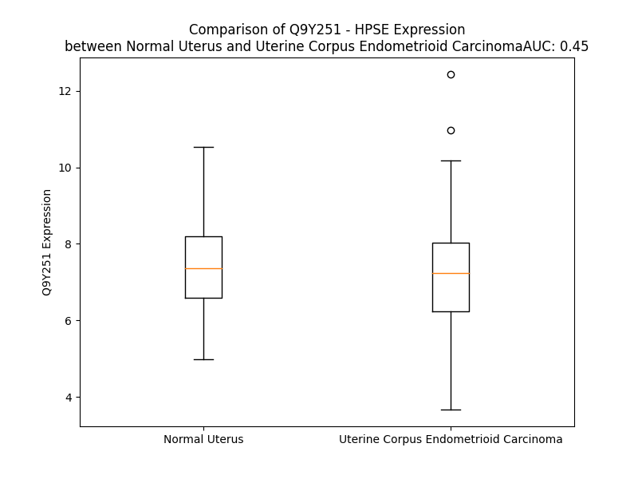

# Detailed Data for Q9Y251

## Introduction to the Detailed Summary

### How to Interpret the Results

- **Summary & Metrics**: This section provides a quick reference to essential protein attributes, including expression changes, family classification, and biomarker applications. Regulation status (upregulated/downregulated) indicates the protein's behavior in a disease context. Some information comes from the original excel file with the proteins selected from literature, while others are derived from the analyses.
- **Expression Comparison**: A visual representation comparing protein expression between normal and disease states. It highlights significant changes in expression levels that might indicate diagnostic or therapeutic relevance. This is data coming from transcriptomics experiments and could not translate similarly to protein levels.
- **Isoform Alignment**: An interactive view of isoform alignments, revealing structural and functional differences between variants of the protein.
- **Interactors & Homologs**: Tables listing known interaction partners and homologous proteins, the more interactors and homologs, the more complex the protein is to design an antibody for.
- **Biological Assemblies**: Information about the structural arrangement of the protein in different assemblies, providing insights into its functional state but also the complexity of the protein to develop antibodies.
- **Combined Per-Residue Information**: A detailed table summarizing residue-level data. This includes predictions for epitope regions, aggregation tendencies, and modifications that might impact the protein's function. Each row corresponds to a residue in the protein, providing insights into specific sites that may be important for research or drug development.
## Summary & Metrics

- **UniProt Accession**: Q9Y251
- **Gene Name**: HPSE
- **Protein Name**: heparanase
- **Swiss Prot**: HPSE_HUMAN
- **Family**: enzyme
- **Biomarker Application**: disease progression,efficacy
- **Number of Isoforms**: 4
- **Regulation**: 1
- **(transcriptomics) AUC**: 0.42
- **(transcriptomics) Fold Change**: 1.05
- **(transcriptomics) Regulation**: Downregulated
- **Discotope Epitope Count**: 122
- **Max n_uniprots (Homo)**: 2.0
- **Max n_uniprots (Hetero)**: N/A

## Expression Comparison

## Isoform Alignment

<pre style='font-size:14px; font-family:monospace;'>Q9Y251-1 MLLRSKPALPPPLMLLLLGPLGPLSPGALPRPAQAQDVVDLDFFTQEPLHLVSPSFLSVTIDANLATDPRFLILLGSPKLRTLARGLSPAYLRFGGTKTDFLIFDPKKESTFEERSYWQSQVNQDICKYGSIPPDVEEKLRLEWPYQEQLLLREHYQKKFKNSTYSRSSVDVLYTFANCSGLDLIFGLNALLRTADLQWNSSNAQLLLDYCSSKGYNISWELGNEPNSFLKKADIFINGSQLGEDFIQLHKLLRKSTFKNAKLYGPDVGQPRRKTAKMLKSFLKAGGEVIDSVTWHHYYLNGRTATKEDFLNPDVLDIFISSVQKVFQVVESTRPGKKVWLGETSSAYGGGAPLLSDTFAAGFMWLDKLGLSARMGIEVVMRQVFFGAGNYHLVDENFDPLPDYWLSLLFKKLVGTKVLMASVQGSKRRKLRVYLHCTNTDNPRYKEGDLTLYAINLHNVTKYLRLPYPFSNKQVDKYLLRPLGPHGLLSKSVQLNGLTLKMVDDQTLPPLMEKPLRPGSSLGLPAFSYSFFVIRNAKVAACI
Q9Y251-2 MLLRSKPALPPPLMLLLLGPLGPLSPGALPRPAQAQDVVDLDFFTQEPLHLVSPSFLSVTIDANLATDPRFLILLGSPKLRTLARGLSPAYLRFGGTKTDFLIFDPKKESTFEERSYWQSQVNQDICKYGSIPPDVEEKLRLEWPYQEQLLLREHYQKKFKNSTYS----------------------------------------------------------KPNSFLKKADIFINGSQLGEDFIQLHKLLRKSTFKNAKLYGPDVGQPRRKTAKMLKSFLKAGGEVIDSVTWHHYYLNGRTATKEDFLNPDVLDIFISSVQKVFQVVESTRPGKKVWLGETSSAYGGGAPLLSDTFAAGFMWLDKLGLSARMGIEVVMRQVFFGAGNYHLVDENFDPLPDYWLSLLFKKLVGTKVLMASVQGSKRRKLRVYLHCTNTDNPRYKEGDLTLYAINLHNVTKYLRLPYPFSNKQVDKYLLRPLGPHGLLSKSVQLNGLTLKMVDDQTLPPLMEKPLRPGSSLGLPAFSYSFFVIRNAKVAACI
Q9Y251-3 MLLRSKPALPPPLMLLLLGPLGPLSPGALPRPAQAQDVVDLDFFTQEPLHLVSPSFLSVTIDANLATDPRFLILLGSPKLRTLARGLSPAYLRFGGTKTDFLIFDPKKESTFEERSYWQSQVNQDICKYGSIPPDVEEKLRLEWPYQEQLLLREHYQKKFKNSTYSRSSVDVLYTFANCSGLDLIFGLNALLRTADLQWNSSNAQLLLDYCSSKGYNISWELGNEPNSFLKKADIFINGSQLGEDFIQLHKLLRKSTFKNAKLYGPDVGQPRRKTAKMLKSFLKAGGEVIDSVTWHHYYLNGRTATKEDFLNPDVLDIFISSVQKVF--------------------------------------------------------------------------QDYWLSLLFKKLVGTKVLMASVQGSKRRKLRVYLHCTNTDNPRYKEGDLTLYAINLHNVTKYLRLPYPFSNKQVDKYLLRPLGPHGLLSKSVQLNGLTLKMVDDQTLPPLMEKPLRPGSSLGLPAFSYSFFVIRNAKVAACI
Q9Y251-4 MLLRSKPALPPPLMLLLLGPLGPLSPGALPRPAQAQDVVDLDFFTQEPLHLVSPSFLSVTIDANLATDPRFLILLGSPKLRTLARGLSPAYLRFGGTKTDFLIFDPKKESTFEERSYWQSQVNQDICKYGSIPPDVEEKLRLEWPYQEQLLLREHYQKKFKNSTYSRSSVDVLYTFANCSGLDLIFGLNALLRTADLQWNSSNAQLLLDYCSSKGYNISWELGNEPNSFLKKADIFINGSQLGEDFIQLHKLLRKSTFKNAKLYGPDVGQPRRKTAKMLKSFLKAGGEVIDSVTWHHYYLNGRTATKEDFLNPDVLDIFISSVQKVFQVVESTRPGKKVWLGETSSAYGGGAPLLSDTFAAGFMIIGYLFCSRNWWAPRC-------------------------------------------------------------------------------------------------------------------------------------------------------------------
</pre>

## Interactors

| preferredName_A   | preferredName_B   |   score |
|:------------------|:------------------|--------:|
| HPSE              | HGS               |   0.992 |
| HPSE              | SDC1              |   0.957 |
| HPSE              | HPSE2             |   0.913 |
| HPSE              | IDS               |   0.903 |

## Homologs

| uniprot_id   | gene_id   |
|:-------------|:----------|
| Q8WWQ2       | HPSE2     |

## Biological Assemblies

|   Unnamed: 0 |   assembly |   n_uniprots | composition   | crystal_id   |
|-------------:|-----------:|-------------:|:--------------|:-------------|
|            0 |          1 |            2 | Homo          | 5e97         |
|            0 |          1 |            2 | Homo          | 5e9c         |
|            0 |          1 |            2 | Homo          | 7rg8         |
|            0 |          1 |            2 | Homo          | 8e07         |
|            0 |          1 |            2 | Homo          | 5e9b         |
|            0 |          1 |            2 | Homo          | 8cqi         |
|            0 |          1 |            2 | Homo          | 7yi7         |
|            0 |          1 |            2 | Homo          | 7pr8         |
|            0 |          1 |            2 | Homo          | 8e08         |
|            0 |          1 |            1 | Homo          | 5la4         |
|            0 |          1 |            2 | Homo          | 7pr7         |
|            0 |          1 |            2 | Homo          | 5e98         |
|            0 |          1 |            2 | Homo          | 7yjc         |
|            0 |          1 |            2 | Homo          | 5l9y         |
|            0 |          1 |            2 | Homo          | 8jyg         |
|            0 |          1 |            1 | Homo          | 5la7         |
|            0 |          1 |            2 | Homo          | 7prt         |
|            0 |          1 |            2 | Homo          | 5l9z         |
|            0 |          1 |            2 | Homo          | 5e8m         |

## Combined Per-Residue Information

|   res | aa   |   epitope_score | epitope   |   relative_surface_accessibility |   modeling_confidence |   Aggregation | modification   | glycosylation                   |
|------:|:-----|----------------:|:----------|---------------------------------:|----------------------:|--------------:|:---------------|:--------------------------------|
|     1 | M    |         0.14223 | False     |                          1.293   |                 42    |         0     | N/A            | N/A                             |
|     2 | L    |         0.18233 | True      |                          1.07621 |                 47.79 |         0     | N/A            | N/A                             |
|     3 | L    |         0.18303 | True      |                          0.99933 |                 39.82 |         0     | N/A            | N/A                             |
|     4 | R    |         0.2865  | True      |                          0.99293 |                 49.22 |         0     | N/A            | N/A                             |
|     5 | S    |         0.19385 | True      |                          0.78255 |                 47.12 |         0     | N/A            | N/A                             |
|     6 | K    |         0.15427 | True      |                          0.9607  |                 44.06 |         0     | N/A            | N/A                             |
|     7 | P    |         0.20797 | True      |                          0.97528 |                 47.4  |         0     | N/A            | N/A                             |
|     8 | A    |         0.14741 | False     |                          0.9318  |                 48.07 |         0     | N/A            | N/A                             |
|     9 | L    |         0.11911 | False     |                          1.05458 |                 54.35 |         0     | N/A            | N/A                             |
|    10 | P    |         0.17349 | True      |                          0.80242 |                 53.24 |         0     | N/A            | N/A                             |
|    11 | P    |         0.15761 | True      |                          0.83309 |                 50.45 |         0     | N/A            | N/A                             |
|    12 | P    |         0.13001 | False     |                          0.98242 |                 58.39 |         0.888 | N/A            | N/A                             |
|    13 | L    |         0.18401 | True      |                          0.92759 |                 44.65 |        71.344 | N/A            | N/A                             |
|    14 | M    |         0.12683 | False     |                          0.95211 |                 38.83 |        82.244 | N/A            | N/A                             |
|    15 | L    |         0.11089 | False     |                          0.86573 |                 44.42 |        82.244 | N/A            | N/A                             |
|    16 | L    |         0.11906 | False     |                          0.96008 |                 40.98 |        82.244 | N/A            | N/A                             |
|    17 | L    |         0.14298 | False     |                          0.9867  |                 45.07 |        82.22  | N/A            | N/A                             |
|    18 | L    |         0.15847 | True      |                          1.08766 |                 41.56 |        71.186 | N/A            | N/A                             |
|    19 | G    |         0.15339 | True      |                          0.66133 |                 45.19 |         0.037 | N/A            | N/A                             |
|    20 | P    |         0.15045 | True      |                          1.00313 |                 48.9  |         0     | N/A            | N/A                             |
|    21 | L    |         0.19289 | True      |                          1.11173 |                 39.14 |         0     | N/A            | N/A                             |
|    22 | G    |         0.16726 | True      |                          0.64855 |                 43.41 |         0     | N/A            | N/A                             |
|    23 | P    |         0.09578 | False     |                          0.96275 |                 44.81 |         0     | N/A            | N/A                             |
|    24 | L    |         0.16099 | True      |                          1.03843 |                 39.61 |         0     | N/A            | N/A                             |
|    25 | S    |         0.15506 | True      |                          0.77687 |                 37.09 |         0     | N/A            | N/A                             |
|    26 | P    |         0.12458 | False     |                          0.89705 |                 40.92 |         0     | N/A            | N/A                             |
|    27 | G    |         0.19325 | True      |                          0.8369  |                 36.08 |         0     | N/A            | N/A                             |
|    28 | A    |         0.15472 | True      |                          0.95781 |                 36.65 |         0     | N/A            | N/A                             |
|    29 | L    |         0.21401 | True      |                          0.95979 |                 37.75 |         0     | N/A            | N/A                             |
|    30 | P    |         0.17771 | True      |                          0.85271 |                 44.17 |         0     | N/A            | N/A                             |
|    31 | R    |         0.20889 | True      |                          0.8665  |                 40.82 |         0     | N/A            | N/A                             |
|    32 | P    |         0.17835 | True      |                          0.89368 |                 52.75 |         0     | N/A            | N/A                             |
|    33 | A    |         0.09796 | False     |                          0.41357 |                 54.75 |         0     | N/A            | N/A                             |
|    34 | Q    |         0.15339 | True      |                          0.65768 |                 61.23 |         0     | N/A            | N/A                             |
|    35 | A    |         0.15021 | True      |                          0.89476 |                 64.77 |         0     | N/A            | N/A                             |
|    36 | Q    |         0.23961 | True      |                          0.73567 |                 76.92 |         0     | N/A            | N/A                             |
|    37 | D    |         0.13845 | False     |                          0.14258 |                 91.7  |         0     | N/A            | N/A                             |
|    38 | V    |         0.10343 | False     |                          0.35757 |                 94.58 |         0     | N/A            | N/A                             |
|    39 | V    |         0.05862 | False     |                          0.1609  |                 95.8  |         0     | N/A            | N/A                             |
|    40 | D    |         0.05195 | False     |                          0.25218 |                 96.91 |         0     | N/A            | N/A                             |
|    41 | L    |         0.01606 | False     |                          0.01523 |                 98.11 |         0     | N/A            | N/A                             |
|    42 | D    |         0.06835 | False     |                          0.26445 |                 98.02 |         0     | N/A            | N/A                             |
|    43 | F    |         0.04838 | False     |                          0.11566 |                 98.59 |         0     | N/A            | N/A                             |
|    44 | F    |         0.0705  | False     |                          0.43415 |                 98.57 |         0     | N/A            | N/A                             |
|    45 | T    |         0.05787 | False     |                          0.14817 |                 98.44 |         0     | N/A            | N/A                             |
|    46 | Q    |         0.20662 | True      |                          0.72301 |                 97.96 |         0     | N/A            | N/A                             |
|    47 | E    |         0.13833 | False     |                          0.65359 |                 97.01 |         0     | N/A            | N/A                             |
|    48 | P    |         0.06176 | False     |                          0.37123 |                 98.2  |         0     | N/A            | N/A                             |
|    49 | L    |         0.12    | False     |                          0.48236 |                 98.25 |         0     | N/A            | N/A                             |
|    50 | H    |         0.05298 | False     |                          0.36872 |                 98.65 |         0     | N/A            | N/A                             |
|    51 | L    |         0.06207 | False     |                          0.69226 |                 98.72 |         0     | N/A            | N/A                             |
|    52 | V    |         0.02173 | False     |                          0.04143 |                 98.85 |         0     | N/A            | N/A                             |
|    53 | S    |         0.05569 | False     |                          0.14469 |                 98.69 |         0     | N/A            | N/A                             |
|    54 | P    |         0.04896 | False     |                          0.66396 |                 98.69 |         0     | N/A            | N/A                             |
|    55 | S    |         0.02223 | False     |                          0.0556  |                 98.74 |         2.194 | N/A            | N/A                             |
|    56 | F    |         0.03909 | False     |                          0.03465 |                 98.93 |        14.898 | N/A            | N/A                             |
|    57 | L    |         0.00582 | False     |                          0.00531 |                 98.88 |        15.847 | N/A            | N/A                             |
|    58 | S    |         0.00484 | False     |                          0       |                 98.93 |        15.847 | N/A            | N/A                             |
|    59 | V    |         0.00231 | False     |                          0.00286 |                 98.92 |        15.847 | N/A            | N/A                             |
|    60 | T    |         0.00292 | False     |                          0       |                 98.95 |        15.229 | N/A            | N/A                             |
|    61 | I    |         0.00294 | False     |                          0.0008  |                 98.86 |        14.031 | N/A            | N/A                             |
|    62 | D    |         0.03628 | False     |                          0.08634 |                 98.69 |         0     | N/A            | N/A                             |
|    63 | A    |         0.00304 | False     |                          0.00383 |                 98.65 |         0     | N/A            | N/A                             |
|    64 | N    |         0.04188 | False     |                          0.14688 |                 98.11 |         0     | N/A            | N/A                             |
|    65 | L    |         0.00502 | False     |                          0.00968 |                 98.17 |         0     | N/A            | N/A                             |
|    66 | A    |         0.00594 | False     |                          0.01403 |                 98.24 |         0     | N/A            | N/A                             |
|    67 | T    |         0.08165 | False     |                          0.25793 |                 97.82 |         0     | N/A            | N/A                             |
|    68 | D    |         0.13713 | False     |                          0.21925 |                 98.09 |         0     | N/A            | N/A                             |
|    69 | P    |         0.03707 | False     |                          0.08986 |                 97.96 |         0     | N/A            | N/A                             |
|    70 | R    |         0.10264 | False     |                          0.16471 |                 98.46 |         0     | N/A            | N/A                             |
|    71 | F    |         0.03028 | False     |                          0.01161 |                 98.67 |        83.721 | N/A            | N/A                             |
|    72 | L    |         0.0037  | False     |                          0.00412 |                 98.71 |        84.284 | N/A            | N/A                             |
|    73 | I    |         0.00422 | False     |                          0.0024  |                 98.7  |        84.284 | N/A            | N/A                             |
|    74 | L    |         0.01083 | False     |                          0.01072 |                 98.66 |        84.284 | N/A            | N/A                             |
|    75 | L    |         0.00374 | False     |                          0.0087  |                 98.71 |        84.284 | N/A            | N/A                             |
|    76 | G    |         0.01826 | False     |                          0.04059 |                 98.25 |         7.476 | N/A            | N/A                             |
|    77 | S    |         0.03449 | False     |                          0.02372 |                 98.54 |         0     | N/A            | N/A                             |
|    78 | P    |         0.06187 | False     |                          0.20647 |                 98.41 |         0     | N/A            | N/A                             |
|    79 | K    |         0.04268 | False     |                          0.14472 |                 98.67 |         0     | N/A            | N/A                             |
|    80 | L    |         0.00374 | False     |                          0       |                 98.76 |         0     | N/A            | N/A                             |
|    81 | R    |         0.04325 | False     |                          0.05108 |                 98.63 |         0     | N/A            | N/A                             |
|    82 | T    |         0.0367  | False     |                          0.07005 |                 98.81 |         0     | N/A            | N/A                             |
|    83 | L    |         0.00246 | False     |                          0       |                 98.9  |         0     | N/A            | N/A                             |
|    84 | A    |         0.00318 | False     |                          0.0051  |                 98.89 |         0     | N/A            | N/A                             |
|    85 | R    |         0.09161 | False     |                          0.36897 |                 98.8  |         0     | N/A            | N/A                             |
|    86 | G    |         0.02916 | False     |                          0.04944 |                 98.64 |         0     | N/A            | N/A                             |
|    87 | L    |         0.00181 | False     |                          0.00165 |                 98.85 |         0     | N/A            | N/A                             |
|    88 | S    |         0.02668 | False     |                          0.25271 |                 98.79 |         0     | N/A            | N/A                             |
|    89 | P    |         0.07108 | False     |                          0.41155 |                 98.78 |         0     | N/A            | N/A                             |
|    90 | A    |         0.00276 | False     |                          0.00313 |                 98.92 |         0     | N/A            | N/A                             |
|    91 | Y    |         0.02817 | False     |                          0.15405 |                 98.92 |         0     | N/A            | N/A                             |
|    92 | L    |         0.00104 | False     |                          0       |                 98.93 |         0     | N/A            | N/A                             |
|    93 | R    |         0.00847 | False     |                          0.00515 |                 98.92 |         0     | N/A            | N/A                             |
|    94 | F    |         0.01053 | False     |                          0.01707 |                 98.92 |         0     | N/A            | N/A                             |
|    95 | G    |         0.00666 | False     |                          0.00161 |                 98.65 |         0     | N/A            | N/A                             |
|    96 | G    |         0.01322 | False     |                          0.00805 |                 98.25 |         0     | N/A            | N/A                             |
|    97 | T    |         0.04331 | False     |                          0.13875 |                 98.03 |         0     | N/A            | N/A                             |
|    98 | K    |         0.01916 | False     |                          0.01669 |                 98.31 |         0.193 | N/A            | N/A                             |
|    99 | T    |         0.01905 | False     |                          0.01827 |                 98.78 |         0.193 | N/A            | N/A                             |
|   100 | D    |         0.03018 | False     |                          0.00797 |                 98.74 |         0.193 | N/A            | N/A                             |
|   101 | F    |         0.02973 | False     |                          0.05988 |                 98.7  |         0.193 | N/A            | N/A                             |
|   102 | L    |         0.01552 | False     |                          0.04928 |                 98.75 |         0.193 | N/A            | N/A                             |
|   103 | I    |         0.06153 | False     |                          0.25759 |                 98.86 |         0.193 | N/A            | N/A                             |
|   104 | F    |         0.02733 | False     |                          0.02049 |                 98.84 |         0.193 | N/A            | N/A                             |
|   105 | D    |         0.06922 | False     |                          0.26574 |                 98.69 |         0     | N/A            | N/A                             |
|   106 | P    |         0.04063 | False     |                          0.31648 |                 97.91 |         0     | N/A            | N/A                             |
|   107 | K    |         0.16508 | True      |                          0.89693 |                 98.06 |         0     | N/A            | N/A                             |
|   108 | K    |         0.08832 | False     |                          0.32025 |                 97.44 |         0     | N/A            | N/A                             |
|   109 | E    |         0.20801 | True      |                          0.8066  |                 96.55 |         0     | N/A            | N/A                             |
|   110 | S    |         0.06676 | False     |                          0.31679 |                 96.12 |         0     | N/A            | N/A                             |
|   111 | T    |         0.06599 | False     |                          0.31418 |                 97.13 |         0     | N/A            | N/A                             |
|   112 | F    |         0.22846 | True      |                          0.57239 |                 98.06 |         0     | N/A            | N/A                             |
|   113 | E    |         0.03893 | False     |                          0.02324 |                 98.34 |         0     | N/A            | N/A                             |
|   114 | E    |         0.01342 | False     |                          0.01696 |                 98.18 |         0     | N/A            | N/A                             |
|   115 | R    |         0.27273 | True      |                          0.45107 |                 98.03 |         0     | N/A            | N/A                             |
|   116 | S    |         0.08426 | False     |                          0.16153 |                 98.01 |         0     | N/A            | N/A                             |
|   117 | Y    |         0.02878 | False     |                          0.02778 |                 98.5  |         0     | N/A            | N/A                             |
|   118 | W    |         0.10742 | False     |                          0.27554 |                 98.25 |         0     | N/A            | N/A                             |
|   119 | Q    |         0.1937  | True      |                          0.64072 |                 98    |         0     | N/A            | N/A                             |
|   120 | S    |         0.11787 | False     |                          0.36053 |                 97.31 |         0     | N/A            | N/A                             |
|   121 | Q    |         0.04899 | False     |                          0.06673 |                 97.22 |         0     | N/A            | N/A                             |
|   122 | V    |         0.27075 | True      |                          0.67969 |                 95.97 |         0     | N/A            | N/A                             |
|   123 | N    |         0.27165 | True      |                          0.97484 |                 94.74 |         0     | N/A            | N/A                             |
|   124 | Q    |         0.17046 | True      |                          0.49206 |                 94.63 |         0     | N/A            | N/A                             |
|   125 | D    |         0.16839 | True      |                          0.40357 |                 96.12 |         0     | N/A            | N/A                             |
|   126 | I    |         0.0758  | False     |                          0.19204 |                 97.52 |         0     | N/A            | N/A                             |
|   127 | C    |         0.04616 | False     |                          0.28572 |                 97.8  |         0     | N/A            | N/A                             |
|   128 | K    |         0.11698 | False     |                          0.71379 |                 96.43 |         0     | N/A            | N/A                             |
|   129 | Y    |         0.26718 | True      |                          0.66701 |                 96.66 |         0     | N/A            | N/A                             |
|   130 | G    |         0.01988 | False     |                          0.01433 |                 96.69 |         0     | N/A            | N/A                             |
|   131 | S    |         0.0752  | False     |                          0.3979  |                 97.72 |         0     | N/A            | N/A                             |
|   132 | I    |         0.03555 | False     |                          0.04758 |                 98.4  |         0     | N/A            | N/A                             |
|   133 | P    |         0.05283 | False     |                          0.14259 |                 98.28 |         0     | N/A            | N/A                             |
|   134 | P    |         0.16532 | True      |                          0.83179 |                 97.97 |         0     | N/A            | N/A                             |
|   135 | D    |         0.15128 | True      |                          0.49283 |                 98.02 |         0     | N/A            | N/A                             |
|   136 | V    |         0.00997 | False     |                          0.0019  |                 98.48 |         0     | N/A            | N/A                             |
|   137 | E    |         0.02485 | False     |                          0.20112 |                 98.35 |         0     | N/A            | N/A                             |
|   138 | E    |         0.17942 | True      |                          0.58188 |                 98    |         0     | N/A            | N/A                             |
|   139 | K    |         0.17226 | True      |                          0.40009 |                 98.48 |         0     | N/A            | N/A                             |
|   140 | L    |         0.00426 | False     |                          0       |                 98.53 |         0     | N/A            | N/A                             |
|   141 | R    |         0.09508 | False     |                          0.37303 |                 97.92 |         0     | N/A            | N/A                             |
|   142 | L    |         0.29324 | True      |                          0.81006 |                 98    |         0     | N/A            | N/A                             |
|   143 | E    |         0.14282 | False     |                          0.28007 |                 98.45 |         0     | N/A            | N/A                             |
|   144 | W    |         0.02434 | False     |                          0.02686 |                 98.37 |         0     | N/A            | N/A                             |
|   145 | P    |         0.09872 | False     |                          0.55148 |                 97.43 |         0     | N/A            | N/A                             |
|   146 | Y    |         0.21959 | True      |                          0.6853  |                 98.09 |         0     | N/A            | N/A                             |
|   147 | Q    |         0.0799  | False     |                          0.08144 |                 98.12 |         0     | N/A            | N/A                             |
|   148 | E    |         0.06741 | False     |                          0.16577 |                 97.7  |         0     | N/A            | N/A                             |
|   149 | Q    |         0.25652 | True      |                          0.45499 |                 96.27 |         0     | N/A            | N/A                             |
|   150 | L    |         0.25204 | True      |                          0.45814 |                 97.13 |         0     | N/A            | N/A                             |
|   151 | L    |         0.0365  | False     |                          0.03815 |                 97.11 |         0     | N/A            | N/A                             |
|   152 | L    |         0.09459 | False     |                          0.20856 |                 94.92 |         0     | N/A            | N/A                             |
|   153 | R    |         0.33669 | True      |                          0.57932 |                 94.44 |         0     | N/A            | N/A                             |
|   154 | E    |         0.12322 | False     |                          0.16279 |                 94.18 |         0     | N/A            | N/A                             |
|   155 | H    |         0.23391 | True      |                          0.3455  |                 89.39 |         0     | N/A            | N/A                             |
|   156 | Y    |         0.23613 | True      |                          0.38407 |                 89.35 |         0     | N/A            | N/A                             |
|   157 | Q    |         0.2447  | True      |                          0.59119 |                 92.75 |         0     | N/A            | N/A                             |
|   158 | K    |         0.25824 | True      |                          0.36981 |                 90.89 |         0     | N/A            | N/A                             |
|   159 | K    |         0.29629 | True      |                          0.75321 |                 89.92 |         0     | N/A            | N/A                             |
|   160 | F    |         0.10512 | False     |                          0.14568 |                 95.21 |         0     | N/A            | N/A                             |
|   161 | K    |         0.14999 | True      |                          0.7935  |                 95.65 |         0     | N/A            | N/A                             |
|   162 | N    |         0.15983 | True      |                          0.62799 |                 97.72 |         0     | N/A            | N-linked (GlcNAc...) asparagine |
|   163 | S    |         0.07455 | False     |                          0.16464 |                 97.7  |         0     | N/A            | N/A                             |
|   164 | T    |         0.09752 | False     |                          0.32366 |                 98.39 |         0     | N/A            | N/A                             |
|   165 | Y    |         0.03777 | False     |                          0.05376 |                 98.72 |         0     | N/A            | N/A                             |
|   166 | S    |         0.01696 | False     |                          0.04576 |                 98.4  |         0     | N/A            | N/A                             |
|   167 | R    |         0.06483 | False     |                          0.47972 |                 98.58 |         0     | N/A            | N/A                             |
|   168 | S    |         0.03714 | False     |                          0.15822 |                 98.07 |         0     | N/A            | N/A                             |
|   169 | S    |         0.00743 | False     |                          0.01456 |                 98.45 |         0     | N/A            | N/A                             |
|   170 | V    |         0.00504 | False     |                          0.00748 |                 98.79 |         0     | N/A            | N/A                             |
|   171 | D    |         0.04828 | False     |                          0.09034 |                 98.66 |         0     | N/A            | N/A                             |
|   172 | V    |         0.00641 | False     |                          0.01519 |                 98.73 |        38.964 | N/A            | N/A                             |
|   173 | L    |         0.00615 | False     |                          0.01978 |                 98.75 |        40.39  | N/A            | N/A                             |
|   174 | Y    |         0.06027 | False     |                          0.14138 |                 98.86 |        40.39  | N/A            | N/A                             |
|   175 | T    |         0.06326 | False     |                          0.16735 |                 98.62 |        40.39  | N/A            | N/A                             |
|   176 | F    |         0.01106 | False     |                          0.02815 |                 98.86 |        40.39  | N/A            | N/A                             |
|   177 | A    |         0.00361 | False     |                          0.01275 |                 98.86 |        18.991 | N/A            | N/A                             |
|   178 | N    |         0.11045 | False     |                          0.5587  |                 98.74 |         0.79  | N/A            | N-linked (GlcNAc...) asparagine |
|   179 | C    |         0.05808 | False     |                          0.09673 |                 98.65 |         0.137 | N/A            | N/A                             |
|   180 | S    |         0.00996 | False     |                          0.00406 |                 98.78 |         0     | N/A            | N/A                             |
|   181 | G    |         0.05096 | False     |                          0.51319 |                 98.63 |         0     | N/A            | N/A                             |
|   182 | L    |         0.01562 | False     |                          0.06109 |                 98.87 |         0     | N/A            | N/A                             |
|   183 | D    |         0.0514  | False     |                          0.45668 |                 98.86 |         0     | N/A            | N/A                             |
|   184 | L    |         0.01231 | False     |                          0.0338  |                 98.91 |        40.768 | N/A            | N/A                             |
|   185 | I    |         0.00544 | False     |                          0.0016  |                 98.95 |        47.421 | N/A            | N/A                             |
|   186 | F    |         0.00851 | False     |                          0.02357 |                 98.91 |        47.49  | N/A            | N/A                             |
|   187 | G    |         0.01289 | False     |                          0.07159 |                 98.88 |        47.49  | N/A            | N/A                             |
|   188 | L    |         0.00848 | False     |                          0.03874 |                 98.91 |        47.49  | N/A            | N/A                             |
|   189 | N    |         0.01493 | False     |                          0.07904 |                 98.85 |        43.304 | N/A            | N/A                             |
|   190 | A    |         0.00097 | False     |                          0       |                 98.86 |        43.141 | N/A            | N/A                             |
|   191 | L    |         0.04462 | False     |                          0.12836 |                 98.77 |        43.003 | N/A            | N/A                             |
|   192 | L    |         0.04888 | False     |                          0.24731 |                 98.72 |        36.346 | N/A            | N/A                             |
|   193 | R    |         0.19389 | True      |                          0.15586 |                 98.73 |         0     | N/A            | N/A                             |
|   194 | T    |         0.11356 | False     |                          0.37704 |                 98.53 |         0     | N/A            | N/A                             |
|   195 | A    |         0.18608 | True      |                          1.11043 |                 97.52 |         0     | N/A            | N/A                             |
|   196 | D    |         0.18295 | True      |                          0.60623 |                 97.45 |         0     | N/A            | N/A                             |
|   197 | L    |         0.25585 | True      |                          0.51605 |                 97.94 |         0     | N/A            | N/A                             |
|   198 | Q    |         0.18978 | True      |                          0.32764 |                 98.58 |         0     | N/A            | N/A                             |
|   199 | W    |         0.0347  | False     |                          0.01323 |                 98.85 |         0     | N/A            | N/A                             |
|   200 | N    |         0.08096 | False     |                          0.37007 |                 98.81 |         0     | N/A            | N-linked (GlcNAc...) asparagine |
|   201 | S    |         0.02955 | False     |                          0.12468 |                 98.74 |         0     | N/A            | N/A                             |
|   202 | S    |         0.1805  | True      |                          0.52663 |                 98.67 |         0     | N/A            | N/A                             |
|   203 | N    |         0.03154 | False     |                          0.13956 |                 98.8  |         0     | N/A            | N/A                             |
|   204 | A    |         0.02133 | False     |                          0.05705 |                 98.81 |         0     | N/A            | N/A                             |
|   205 | Q    |         0.20637 | True      |                          0.30813 |                 98.62 |         0     | N/A            | N/A                             |
|   206 | L    |         0.10356 | False     |                          0.53963 |                 98.65 |         0     | N/A            | N/A                             |
|   207 | L    |         0.00651 | False     |                          0.00742 |                 98.83 |         0     | N/A            | N/A                             |
|   208 | L    |         0.02819 | False     |                          0.0369  |                 98.71 |         0     | N/A            | N/A                             |
|   209 | D    |         0.14582 | False     |                          0.45939 |                 98.49 |         0     | N/A            | N/A                             |
|   210 | Y    |         0.17648 | True      |                          0.1259  |                 98.7  |         0     | N/A            | N/A                             |
|   211 | C    |         0.0172  | False     |                          0.0219  |                 98.68 |         0     | N/A            | N/A                             |
|   212 | S    |         0.09502 | False     |                          0.19511 |                 98.01 |         0     | N/A            | N/A                             |
|   213 | S    |         0.24462 | True      |                          0.70282 |                 98.37 |         0     | N/A            | N/A                             |
|   214 | K    |         0.20206 | True      |                          0.45425 |                 98.46 |         0     | N/A            | N/A                             |
|   215 | G    |         0.14768 | False     |                          0.54068 |                 98.32 |         0     | N/A            | N/A                             |
|   216 | Y    |         0.13613 | False     |                          0.09488 |                 98.65 |         0.267 | N/A            | N/A                             |
|   217 | N    |         0.1064  | False     |                          0.66    |                 98.25 |         0.267 | N/A            | N-linked (GlcNAc...) asparagine |
|   218 | I    |         0.02752 | False     |                          0.01935 |                 98.76 |         0.267 | N/A            | N/A                             |
|   219 | S    |         0.02424 | False     |                          0.12614 |                 98.88 |         0.267 | N/A            | N/A                             |
|   220 | W    |         0.01521 | False     |                          0.03529 |                 98.94 |         0.267 | N/A            | N/A                             |
|   221 | E    |         0.00527 | False     |                          0.00245 |                 98.95 |         0     | N/A            | N/A                             |
|   222 | L    |         0.00556 | False     |                          0.00395 |                 98.93 |         0     | N/A            | N/A                             |
|   223 | G    |         0.02095 | False     |                          0.01428 |                 98.8  |         0     | N/A            | N/A                             |
|   224 | N    |         0.02764 | False     |                          0.0074  |                 98.84 |         0     | N/A            | N/A                             |
|   225 | E    |         0.12329 | False     |                          0.20382 |                 98.65 |         0     | N/A            | N/A                             |
|   226 | P    |         0.02136 | False     |                          0.02308 |                 98.66 |         0     | N/A            | N/A                             |
|   227 | N    |         0.10418 | False     |                          0.33527 |                 98.53 |         0     | N/A            | N/A                             |
|   228 | S    |         0.10622 | False     |                          0.16252 |                 97.97 |         0     | N/A            | N/A                             |
|   229 | F    |         0.00552 | False     |                          0.00265 |                 98.37 |         0     | N/A            | N/A                             |
|   230 | L    |         0.31563 | True      |                          0.63464 |                 97.92 |         0     | N/A            | N/A                             |
|   231 | K    |         0.44361 | True      |                          0.67271 |                 96.42 |         0     | N/A            | N/A                             |
|   232 | K    |         0.19716 | True      |                          0.0822  |                 96.72 |         0     | N/A            | N/A                             |
|   233 | A    |         0.2517  | True      |                          0.27182 |                 97.07 |         0     | N/A            | N/A                             |
|   234 | D    |         0.32297 | True      |                          0.78732 |                 97.23 |         0     | N/A            | N/A                             |
|   235 | I    |         0.24985 | True      |                          0.30319 |                 97.87 |         0     | N/A            | N/A                             |
|   236 | F    |         0.29832 | True      |                          0.63197 |                 98.31 |         0     | N/A            | N/A                             |
|   237 | I    |         0.03884 | False     |                          0.01601 |                 98.7  |         0     | N/A            | N/A                             |
|   238 | N    |         0.16146 | True      |                          0.45314 |                 98.31 |         0     | N/A            | N-linked (GlcNAc...) asparagine |
|   239 | G    |         0.01117 | False     |                          0.01521 |                 98.73 |         0     | N/A            | N/A                             |
|   240 | S    |         0.1308  | False     |                          0.41993 |                 98.8  |         0     | N/A            | N/A                             |
|   241 | Q    |         0.04925 | False     |                          0.15581 |                 98.85 |         0     | N/A            | N/A                             |
|   242 | L    |         0.00842 | False     |                          0.00577 |                 98.91 |         0     | N/A            | N/A                             |
|   243 | G    |         0.00345 | False     |                          0       |                 98.87 |         0     | N/A            | N/A                             |
|   244 | E    |         0.13398 | False     |                          0.44869 |                 98.87 |         0     | N/A            | N/A                             |
|   245 | D    |         0.01627 | False     |                          0.00728 |                 98.9  |         0     | N/A            | N/A                             |
|   246 | F    |         0.00437 | False     |                          0.00127 |                 98.9  |         0     | N/A            | N/A                             |
|   247 | I    |         0.09078 | False     |                          0.24639 |                 98.87 |         0     | N/A            | N/A                             |
|   248 | Q    |         0.14645 | False     |                          0.29695 |                 98.8  |         0     | N/A            | N/A                             |
|   249 | L    |         0.00511 | False     |                          0       |                 98.85 |         0     | N/A            | N/A                             |
|   250 | H    |         0.08104 | False     |                          0.31147 |                 98.77 |         0     | N/A            | N/A                             |
|   251 | K    |         0.18242 | True      |                          0.60136 |                 98.61 |         0     | N/A            | N/A                             |
|   252 | L    |         0.09707 | False     |                          0.16577 |                 98.53 |         0     | N/A            | N/A                             |
|   253 | L    |         0.03725 | False     |                          0.01814 |                 98.58 |         0     | N/A            | N/A                             |
|   254 | R    |         0.26255 | True      |                          0.50784 |                 98.01 |         0     | N/A            | N/A                             |
|   255 | K    |         0.23534 | True      |                          0.81817 |                 97.09 |         0     | N/A            | N/A                             |
|   256 | S    |         0.0959  | False     |                          0.14402 |                 96.33 |         0     | N/A            | N/A                             |
|   257 | T    |         0.22379 | True      |                          0.7458  |                 95.98 |         0     | N/A            | N/A                             |
|   258 | F    |         0.084   | False     |                          0.30739 |                 95.7  |         0     | N/A            | N/A                             |
|   259 | K    |         0.32474 | True      |                          0.59505 |                 95.17 |         0     | N/A            | N/A                             |
|   260 | N    |         0.1724  | True      |                          0.77491 |                 97.04 |         0     | N/A            | N/A                             |
|   261 | A    |         0.05747 | False     |                          0.18337 |                 98.39 |         0     | N/A            | N/A                             |
|   262 | K    |         0.08519 | False     |                          0.46593 |                 98.76 |         0     | N/A            | N/A                             |
|   263 | L    |         0.00801 | False     |                          0.00907 |                 98.91 |         0     | N/A            | N/A                             |
|   264 | Y    |         0.01261 | False     |                          0.02577 |                 98.93 |         0     | N/A            | N/A                             |
|   265 | G    |         0.0035  | False     |                          0.00161 |                 98.83 |         0     | N/A            | N/A                             |
|   266 | P    |         0.00632 | False     |                          0.00167 |                 98.82 |         0     | N/A            | N/A                             |
|   267 | D    |         0.00586 | False     |                          0.00189 |                 98.83 |         0     | N/A            | N/A                             |
|   268 | V    |         0.01325 | False     |                          0.01333 |                 98.8  |         0     | N/A            | N/A                             |
|   269 | G    |         0.08448 | False     |                          0.03898 |                 98.36 |         0     | N/A            | N/A                             |
|   270 | Q    |         0.0825  | False     |                          0.24415 |                 95.92 |         0     | N/A            | N/A                             |
|   271 | P    |         0.04384 | False     |                          0.08496 |                 97.53 |         0     | N/A            | N/A                             |
|   272 | R    |         0.181   | True      |                          0.68635 |                 97.43 |         0     | N/A            | N/A                             |
|   273 | R    |         0.33826 | True      |                          0.76212 |                 97.84 |         0     | N/A            | N/A                             |
|   274 | K    |         0.15612 | True      |                          0.78844 |                 98.06 |         0     | N/A            | N/A                             |
|   275 | T    |         0.04252 | False     |                          0.06027 |                 98.65 |         0     | N/A            | N/A                             |
|   276 | A    |         0.02699 | False     |                          0.17791 |                 98.6  |         0     | N/A            | N/A                             |
|   277 | K    |         0.12889 | False     |                          0.74028 |                 98.61 |         0     | N/A            | N/A                             |
|   278 | M    |         0.0411  | False     |                          0.08363 |                 98.73 |         0     | N/A            | N/A                             |
|   279 | L    |         0.0066  | False     |                          0.00989 |                 98.88 |         0     | N/A            | N/A                             |
|   280 | K    |         0.08133 | False     |                          0.40842 |                 98.86 |         0     | N/A            | N/A                             |
|   281 | S    |         0.0516  | False     |                          0.23724 |                 98.8  |         0     | N/A            | N/A                             |
|   282 | F    |         0.00483 | False     |                          0       |                 98.92 |         0     | N/A            | N/A                             |
|   283 | L    |         0.00257 | False     |                          0       |                 98.92 |         0     | N/A            | N/A                             |
|   284 | K    |         0.1333  | False     |                          0.65342 |                 98.79 |         0     | N/A            | N/A                             |
|   285 | A    |         0.10098 | False     |                          0.27087 |                 98.8  |         0     | N/A            | N/A                             |
|   286 | G    |         0.00957 | False     |                          0.00161 |                 98.67 |         0     | N/A            | N/A                             |
|   287 | G    |         0.00333 | False     |                          0       |                 98.68 |         0     | N/A            | N/A                             |
|   288 | E    |         0.15577 | True      |                          0.6775  |                 98.77 |         0     | N/A            | N/A                             |
|   289 | V    |         0.0526  | False     |                          0.168   |                 98.76 |         0     | N/A            | N/A                             |
|   290 | I    |         0.02616 | False     |                          0.01232 |                 98.87 |         0     | N/A            | N/A                             |
|   291 | D    |         0.06254 | False     |                          0.30606 |                 98.84 |         0     | N/A            | N/A                             |
|   292 | S    |         0.0102  | False     |                          0.02056 |                 98.88 |         0     | N/A            | N/A                             |
|   293 | V    |         0.00246 | False     |                          0       |                 98.94 |         0     | N/A            | N/A                             |
|   294 | T    |         0.00324 | False     |                          0       |                 98.95 |         0     | N/A            | N/A                             |
|   295 | W    |         0.00624 | False     |                          0.00285 |                 98.92 |         0     | N/A            | N/A                             |
|   296 | H    |         0.01435 | False     |                          0.00367 |                 98.88 |         0     | N/A            | N/A                             |
|   297 | H    |         0.01014 | False     |                          0.00568 |                 98.84 |         0     | N/A            | N/A                             |
|   298 | Y    |         0.06386 | False     |                          0.08914 |                 98.69 |         0     | N/A            | N/A                             |
|   299 | Y    |         0.04628 | False     |                          0.06353 |                 98.69 |         0     | N/A            | N/A                             |
|   300 | L    |         0.0898  | False     |                          0.15498 |                 98.49 |         0     | N/A            | N/A                             |
|   301 | N    |         0.20057 | True      |                          0.26654 |                 97.97 |         0     | N/A            | N/A                             |
|   302 | G    |         0.04973 | False     |                          0.035   |                 97.82 |         0     | N/A            | N/A                             |
|   303 | R    |         0.43548 | True      |                          0.66901 |                 96.18 |         0     | N/A            | N/A                             |
|   304 | T    |         0.25239 | True      |                          0.68654 |                 98.2  |         0     | N/A            | N/A                             |
|   305 | A    |         0.07924 | False     |                          0.17119 |                 98.3  |         0     | N/A            | N/A                             |
|   306 | T    |         0.17866 | True      |                          0.43015 |                 98.6  |         0     | N/A            | N/A                             |
|   307 | K    |         0.15648 | True      |                          0.40682 |                 98.15 |         0     | N/A            | N/A                             |
|   308 | E    |         0.16875 | True      |                          0.60934 |                 98.48 |         0     | N/A            | N/A                             |
|   309 | D    |         0.10669 | False     |                          0.21254 |                 98.65 |         0     | N/A            | N/A                             |
|   310 | F    |         0.00448 | False     |                          0       |                 98.64 |         0     | N/A            | N/A                             |
|   311 | L    |         0.07339 | False     |                          0.15916 |                 98.61 |         0     | N/A            | N/A                             |
|   312 | N    |         0.16834 | True      |                          0.32456 |                 98.5  |         0     | N/A            | N/A                             |
|   313 | P    |         0.0356  | False     |                          0.05666 |                 98.32 |         0     | N/A            | N/A                             |
|   314 | D    |         0.15177 | True      |                          0.47526 |                 98.22 |         0     | N/A            | N/A                             |
|   315 | V    |         0.06105 | False     |                          0.11425 |                 98.66 |         3.857 | N/A            | N/A                             |
|   316 | L    |         0.00458 | False     |                          0       |                 98.59 |         4.155 | N/A            | N/A                             |
|   317 | D    |         0.05126 | False     |                          0.24707 |                 98.33 |         4.305 | N/A            | N/A                             |
|   318 | I    |         0.15048 | True      |                          0.48448 |                 98.2  |        32.873 | N/A            | N/A                             |
|   319 | F    |         0.00431 | False     |                          0       |                 98.69 |        35.424 | N/A            | N/A                             |
|   320 | I    |         0.09804 | False     |                          0.29119 |                 98.66 |        35.424 | N/A            | N/A                             |
|   321 | S    |         0.10321 | False     |                          0.35489 |                 98.31 |        35.424 | N/A            | N/A                             |
|   322 | S    |         0.06617 | False     |                          0.1062  |                 98.68 |        35.424 | N/A            | N/A                             |
|   323 | V    |         0.01103 | False     |                          0.00476 |                 98.74 |        35.113 | N/A            | N/A                             |
|   324 | Q    |         0.10552 | False     |                          0.46089 |                 98.68 |         5.335 | N/A            | N/A                             |
|   325 | K    |         0.10098 | False     |                          0.47361 |                 98.67 |         4.69  | N/A            | N/A                             |
|   326 | V    |         0.005   | False     |                          0.00666 |                 98.84 |        58.251 | N/A            | N/A                             |
|   327 | F    |         0.0377  | False     |                          0.23388 |                 98.77 |        58.155 | N/A            | N/A                             |
|   328 | Q    |         0.15139 | True      |                          0.61789 |                 98.68 |        56.824 | N/A            | N/A                             |
|   329 | V    |         0.04645 | False     |                          0.12091 |                 98.8  |        56.778 | N/A            | N/A                             |
|   330 | V    |         0.00298 | False     |                          0.00286 |                 98.8  |        56.58  | N/A            | N/A                             |
|   331 | E    |         0.13353 | False     |                          0.47779 |                 98.65 |         0.384 | N/A            | N/A                             |
|   332 | S    |         0.15573 | True      |                          0.48879 |                 98.63 |         0.229 | N/A            | N/A                             |
|   333 | T    |         0.10722 | False     |                          0.17937 |                 98.7  |         0.085 | N/A            | N/A                             |
|   334 | R    |         0.17791 | True      |                          0.24557 |                 98.58 |         0     | N/A            | N/A                             |
|   335 | P    |         0.23402 | True      |                          0.69694 |                 98.4  |         0     | N/A            | N/A                             |
|   336 | G    |         0.10143 | False     |                          0.77705 |                 97.94 |         0     | N/A            | N/A                             |
|   337 | K    |         0.0883  | False     |                          0.26146 |                 98.7  |         0     | N/A            | N/A                             |
|   338 | K    |         0.0428  | False     |                          0.47549 |                 98.86 |         0     | N/A            | N/A                             |
|   339 | V    |         0.00664 | False     |                          0.01008 |                 98.93 |         0     | N/A            | N/A                             |
|   340 | W    |         0.01948 | False     |                          0.04478 |                 98.93 |         0     | N/A            | N/A                             |
|   341 | L    |         0.00253 | False     |                          0       |                 98.9  |         0     | N/A            | N/A                             |
|   342 | G    |         0.00396 | False     |                          0       |                 98.84 |         0     | N/A            | N/A                             |
|   343 | E    |         0.04191 | False     |                          0.05245 |                 98.9  |         0     | N/A            | N/A                             |
|   344 | T    |         0.00311 | False     |                          0       |                 98.86 |         0     | N/A            | N/A                             |
|   345 | S    |         0.01081 | False     |                          0.01319 |                 98.7  |         0     | N/A            | N/A                             |
|   346 | S    |         0.06394 | False     |                          0.06143 |                 98.57 |         0     | N/A            | N/A                             |
|   347 | A    |         0.00484 | False     |                          0       |                 98.53 |         0     | N/A            | N/A                             |
|   348 | Y    |         0.25424 | True      |                          0.39881 |                 97.38 |         0     | N/A            | N/A                             |
|   349 | G    |         0.11205 | False     |                          0.09485 |                 95.21 |         0     | N/A            | N/A                             |
|   350 | G    |         0.07888 | False     |                          0.09587 |                 96.34 |         0     | N/A            | N/A                             |
|   351 | G    |         0.04754 | False     |                          0.04045 |                 98.22 |         0     | N/A            | N/A                             |
|   352 | A    |         0.02547 | False     |                          0.0051  |                 98.48 |         0     | N/A            | N/A                             |
|   353 | P    |         0.15404 | True      |                          0.69655 |                 98.22 |         0     | N/A            | N/A                             |
|   354 | L    |         0.24274 | True      |                          0.805   |                 98.26 |         0     | N/A            | N/A                             |
|   355 | L    |         0.03964 | False     |                          0.09068 |                 98.74 |         0     | N/A            | N/A                             |
|   356 | S    |         0.02465 | False     |                          0.00999 |                 98.8  |         0     | N/A            | N/A                             |
|   357 | D    |         0.06489 | False     |                          0.04438 |                 98.73 |         0     | N/A            | N/A                             |
|   358 | T    |         0.03081 | False     |                          0.01456 |                 98.88 |         6.93  | N/A            | N/A                             |
|   359 | F    |         0.0027  | False     |                          0       |                 98.91 |        18.578 | N/A            | N/A                             |
|   360 | A    |         0.00353 | False     |                          0       |                 98.84 |        21.045 | N/A            | N/A                             |
|   361 | A    |         0.00682 | False     |                          0.01331 |                 98.88 |        23.966 | N/A            | N/A                             |
|   362 | G    |         0.0027  | False     |                          0       |                 98.84 |        27.424 | N/A            | N/A                             |
|   363 | F    |         0.00363 | False     |                          0       |                 98.89 |        27.548 | N/A            | N/A                             |
|   364 | M    |         0.01766 | False     |                          0.01139 |                 98.88 |        27.296 | N/A            | N/A                             |
|   365 | W    |         0.01532 | False     |                          0.03033 |                 98.92 |        27.009 | N/A            | N/A                             |
|   366 | L    |         0.0023  | False     |                          0       |                 98.94 |        26.577 | N/A            | N/A                             |
|   367 | D    |         0.00322 | False     |                          0       |                 98.92 |         0.124 | N/A            | N/A                             |
|   368 | K    |         0.00565 | False     |                          0.0102  |                 98.91 |         0.124 | N/A            | N/A                             |
|   369 | L    |         0.00115 | False     |                          0       |                 98.94 |         0.124 | N/A            | N/A                             |
|   370 | G    |         0.00453 | False     |                          0.00595 |                 98.87 |         0     | N/A            | N/A                             |
|   371 | L    |         0.00502 | False     |                          0.00907 |                 98.82 |         0     | N/A            | N/A                             |
|   372 | S    |         0.0027  | False     |                          0       |                 98.91 |         0     | N/A            | N/A                             |
|   373 | A    |         0.00121 | False     |                          0       |                 98.87 |         0     | N/A            | N/A                             |
|   374 | R    |         0.0435  | False     |                          0.29307 |                 98.82 |         0     | N/A            | N/A                             |
|   375 | M    |         0.08587 | False     |                          0.23161 |                 98.81 |         0.193 | N/A            | N/A                             |
|   376 | G    |         0.02052 | False     |                          0.22142 |                 98.71 |         0.363 | N/A            | N/A                             |
|   377 | I    |         0.00625 | False     |                          0.00059 |                 98.9  |         6.795 | N/A            | N/A                             |
|   378 | E    |         0.04317 | False     |                          0.13033 |                 98.91 |         7.268 | N/A            | N/A                             |
|   379 | V    |         0.00265 | False     |                          0       |                 98.94 |         7.268 | N/A            | N/A                             |
|   380 | V    |         0.00096 | False     |                          0       |                 98.95 |         7.268 | N/A            | N/A                             |
|   381 | M    |         0.00224 | False     |                          0       |                 98.94 |         7.268 | N/A            | N/A                             |
|   382 | R    |         0.01164 | False     |                          0.01456 |                 98.92 |         7.268 | N/A            | N/A                             |
|   383 | Q    |         0.02565 | False     |                          0.01466 |                 98.8  |         7.392 | N/A            | N/A                             |
|   384 | V    |         0.00746 | False     |                          0       |                 98.77 |        10.308 | N/A            | N/A                             |
|   385 | F    |         0.00316 | False     |                          0.00249 |                 98.91 |        10.308 | N/A            | N/A                             |
|   386 | F    |         0.02105 | False     |                          0.01147 |                 98.83 |         9.883 | N/A            | N/A                             |
|   387 | G    |         0.01761 | False     |                          0.03555 |                 98.26 |         3.896 | N/A            | N/A                             |
|   388 | A    |         0.02301 | False     |                          0.01618 |                 97.56 |         3.309 | N/A            | N/A                             |
|   389 | G    |         0.07715 | False     |                          0.03253 |                 96.97 |         0.245 | N/A            | N/A                             |
|   390 | N    |         0.08999 | False     |                          0.16983 |                 97.29 |         0     | N/A            | N/A                             |
|   391 | Y    |         0.05783 | False     |                          0.0588  |                 98.35 |         0     | N/A            | N/A                             |
|   392 | H    |         0.03088 | False     |                          0.06356 |                 98.72 |         0     | N/A            | N/A                             |
|   393 | L    |         0.00256 | False     |                          0       |                 98.91 |         0     | N/A            | N/A                             |
|   394 | V    |         0.00389 | False     |                          0       |                 98.85 |         0     | N/A            | N/A                             |
|   395 | D    |         0.03553 | False     |                          0.1232  |                 98.47 |         0     | N/A            | N/A                             |
|   396 | E    |         0.10204 | False     |                          0.42238 |                 97.55 |         0     | N/A            | N/A                             |
|   397 | N    |         0.08022 | False     |                          0.4095  |                 97.68 |         0     | N/A            | N/A                             |
|   398 | F    |         0.03677 | False     |                          0.02229 |                 98.53 |         0     | N/A            | N/A                             |
|   399 | D    |         0.08188 | False     |                          0.37657 |                 98.63 |         0     | N/A            | N/A                             |
|   400 | P    |         0.05953 | False     |                          0.11873 |                 98.81 |         0     | N/A            | N/A                             |
|   401 | L    |         0.02034 | False     |                          0.03215 |                 98.86 |         0     | N/A            | N/A                             |
|   402 | P    |         0.00417 | False     |                          0.00445 |                 98.88 |         0     | N/A            | N/A                             |
|   403 | D    |         0.01253 | False     |                          0.02266 |                 98.9  |         0.036 | N/A            | N/A                             |
|   404 | Y    |         0.00252 | False     |                          0       |                 98.95 |        75.215 | N/A            | N/A                             |
|   405 | W    |         0.0195  | False     |                          0.02135 |                 98.92 |        85.589 | N/A            | N/A                             |
|   406 | L    |         0.00228 | False     |                          0       |                 98.95 |        85.865 | N/A            | N/A                             |
|   407 | S    |         0.00126 | False     |                          0       |                 98.94 |        85.865 | N/A            | N/A                             |
|   408 | L    |         0.0243  | False     |                          0.01978 |                 98.92 |        85.865 | N/A            | N/A                             |
|   409 | L    |         0.00431 | False     |                          0.00247 |                 98.86 |        85.531 | N/A            | N/A                             |
|   410 | F    |         0.01305 | False     |                          0.0344  |                 98.93 |        70.054 | N/A            | N/A                             |
|   411 | K    |         0.02458 | False     |                          0.06698 |                 98.82 |         0.036 | N/A            | N/A                             |
|   412 | K    |         0.08519 | False     |                          0.37837 |                 98.76 |         0     | N/A            | N/A                             |
|   413 | L    |         0.01105 | False     |                          0.01566 |                 98.94 |         0     | N/A            | N/A                             |
|   414 | V    |         0.01524 | False     |                          0.08855 |                 98.93 |         0     | N/A            | N/A                             |
|   415 | G    |         0.01956 | False     |                          0.09518 |                 98.8  |         0     | N/A            | N/A                             |
|   416 | T    |         0.06568 | False     |                          0.30717 |                 98.86 |         0     | N/A            | N/A                             |
|   417 | K    |         0.06671 | False     |                          0.28693 |                 98.88 |         0     | N/A            | N/A                             |
|   418 | V    |         0.00974 | False     |                          0.01142 |                 98.89 |         2.187 | N/A            | N/A                             |
|   419 | L    |         0.00768 | False     |                          0.0114  |                 98.83 |         2.358 | N/A            | N/A                             |
|   420 | M    |         0.10681 | False     |                          0.31593 |                 98.53 |         2.358 | N/A            | N/A                             |
|   421 | A    |         0.01195 | False     |                          0.03267 |                 98.2  |         2.358 | N/A            | N/A                             |
|   422 | S    |         0.06629 | False     |                          0.16807 |                 97.57 |         2.358 | N/A            | N/A                             |
|   423 | V    |         0.03775 | False     |                          0.03075 |                 96.34 |         2.187 | N/A            | N/A                             |
|   424 | Q    |         0.20638 | True      |                          0.48515 |                 93.24 |         0     | N/A            | N/A                             |
|   425 | G    |         0.15354 | True      |                          0.64398 |                 85.67 |         0     | N/A            | N/A                             |
|   426 | S    |         0.15812 | True      |                          0.83058 |                 72.72 |         0     | N/A            | N/A                             |
|   427 | K    |         0.17146 | True      |                          0.74924 |                 79.67 |         0     | N/A            | N/A                             |
|   428 | R    |         0.27884 | True      |                          0.53285 |                 85.29 |         0     | N/A            | N/A                             |
|   429 | R    |         0.14046 | False     |                          0.42729 |                 93.47 |         0     | N/A            | N/A                             |
|   430 | K    |         0.13061 | False     |                          0.44848 |                 97.05 |         0     | N/A            | N/A                             |
|   431 | L    |         0.01999 | False     |                          0.02627 |                 98.18 |         0     | N/A            | N/A                             |
|   432 | R    |         0.10366 | False     |                          0.07939 |                 98.55 |         0     | N/A            | N/A                             |
|   433 | V    |         0.03129 | False     |                          0.05228 |                 98.69 |         0.436 | N/A            | N/A                             |
|   434 | Y    |         0.01469 | False     |                          0.02542 |                 98.87 |         0.436 | N/A            | N/A                             |
|   435 | L    |         0.00717 | False     |                          0.00627 |                 98.93 |         0.436 | N/A            | N/A                             |
|   436 | H    |         0.00226 | False     |                          0.00846 |                 98.93 |         0.436 | N/A            | N/A                             |
|   437 | C    |         0.01312 | False     |                          0.04506 |                 98.9  |         0.436 | N/A            | N/A                             |
|   438 | T    |         0.0266  | False     |                          0.03599 |                 98.92 |         0.162 | N/A            | N/A                             |
|   439 | N    |         0.04361 | False     |                          0.15648 |                 98.8  |         0     | N/A            | N/A                             |
|   440 | T    |         0.08264 | False     |                          0.64299 |                 98.49 |         0     | N/A            | N/A                             |
|   441 | D    |         0.1297  | False     |                          0.70568 |                 98.18 |         0     | N/A            | N/A                             |
|   442 | N    |         0.06437 | False     |                          0.14396 |                 98.5  |         0     | N/A            | N/A                             |
|   443 | P    |         0.3041  | True      |                          1.01085 |                 98.15 |         0     | N/A            | N/A                             |
|   444 | R    |         0.2242  | True      |                          0.35569 |                 98.54 |         0     | N/A            | N/A                             |
|   445 | Y    |         0.13121 | False     |                          0.07495 |                 98.7  |         0     | N/A            | N/A                             |
|   446 | K    |         0.16217 | True      |                          0.52885 |                 98.55 |         0     | N/A            | N/A                             |
|   447 | E    |         0.13342 | False     |                          0.54391 |                 98.48 |         0     | N/A            | N/A                             |
|   448 | G    |         0.00567 | False     |                          0.00415 |                 98.6  |         0     | N/A            | N/A                             |
|   449 | D    |         0.03136 | False     |                          0.01693 |                 98.86 |         0     | N/A            | N/A                             |
|   450 | L    |         0.00409 | False     |                          0       |                 98.94 |        13.577 | N/A            | N/A                             |
|   451 | T    |         0.00147 | False     |                          0       |                 98.96 |        15.808 | N/A            | N/A                             |
|   452 | L    |         0.00206 | False     |                          0       |                 98.94 |        17.945 | N/A            | N/A                             |
|   453 | Y    |         0.00922 | False     |                          0.00046 |                 98.91 |        18.281 | N/A            | N/A                             |
|   454 | A    |         0.00261 | False     |                          0       |                 98.83 |        18.281 | N/A            | N/A                             |
|   455 | I    |         0.004   | False     |                          0       |                 98.89 |        17.365 | N/A            | N/A                             |
|   456 | N    |         0.01101 | False     |                          0       |                 98.61 |         5.524 | N/A            | N/A                             |
|   457 | L    |         0.02295 | False     |                          0.0262  |                 98.51 |         4.803 | N/A            | N/A                             |
|   458 | H    |         0.07934 | False     |                          0.14744 |                 97.2  |         0.146 | N/A            | N/A                             |
|   459 | N    |         0.15738 | True      |                          0.74305 |                 96.72 |         0.146 | N/A            | N-linked (GlcNAc...) asparagine |
|   460 | V    |         0.13804 | False     |                          0.46366 |                 97.06 |         0.146 | N/A            | N/A                             |
|   461 | T    |         0.09173 | False     |                          0.33699 |                 97.92 |         0     | N/A            | N/A                             |
|   462 | K    |         0.06845 | False     |                          0.09703 |                 97.66 |         0     | N/A            | N/A                             |
|   463 | Y    |         0.1083  | False     |                          0.24329 |                 97.94 |         0     | N/A            | N/A                             |
|   464 | L    |         0.00192 | False     |                          0.00061 |                 98.13 |         0     | N/A            | N/A                             |
|   465 | R    |         0.20899 | True      |                          0.50835 |                 98.13 |         0     | N/A            | N/A                             |
|   466 | L    |         0.03545 | False     |                          0.11253 |                 98.62 |         0     | N/A            | N/A                             |
|   467 | P    |         0.12975 | False     |                          0.24057 |                 98.44 |         0     | N/A            | N/A                             |
|   468 | Y    |         0.34254 | True      |                          0.86591 |                 97.86 |         0     | N/A            | N/A                             |
|   469 | P    |         0.22695 | True      |                          0.50033 |                 98.02 |         0     | N/A            | N/A                             |
|   470 | F    |         0.04616 | False     |                          0.03949 |                 98.5  |         0     | N/A            | N/A                             |
|   471 | S    |         0.09513 | False     |                          0.38545 |                 97.21 |         0     | N/A            | N/A                             |
|   472 | N    |         0.12533 | False     |                          0.72994 |                 97.95 |         0     | N/A            | N/A                             |
|   473 | K    |         0.07578 | False     |                          0.21786 |                 98.41 |         0     | N/A            | N/A                             |
|   474 | Q    |         0.09191 | False     |                          0.47425 |                 98.6  |         0     | N/A            | N/A                             |
|   475 | V    |         0.01299 | False     |                          0.04764 |                 98.85 |         0     | N/A            | N/A                             |
|   476 | D    |         0.02245 | False     |                          0.01042 |                 98.89 |         0     | N/A            | N/A                             |
|   477 | K    |         0.04355 | False     |                          0.11252 |                 98.91 |         0     | N/A            | N/A                             |
|   478 | Y    |         0.01942 | False     |                          0.02932 |                 98.92 |         0     | N/A            | N/A                             |
|   479 | L    |         0.03372 | False     |                          0.10527 |                 98.91 |         0     | N/A            | N/A                             |
|   480 | L    |         0.00211 | False     |                          0.00165 |                 98.92 |         0     | N/A            | N/A                             |
|   481 | R    |         0.10888 | False     |                          0.46416 |                 98.82 |         0     | N/A            | N/A                             |
|   482 | P    |         0.04291 | False     |                          0.15824 |                 98.71 |         0     | N/A            | N/A                             |
|   483 | L    |         0.237   | True      |                          0.38282 |                 98.3  |         0     | N/A            | N/A                             |
|   484 | G    |         0.21026 | True      |                          0.53374 |                 96.17 |         0     | N/A            | N/A                             |
|   485 | P    |         0.41343 | True      |                          0.98864 |                 97.1  |         0     | N/A            | N/A                             |
|   486 | H    |         0.38314 | True      |                          0.72279 |                 97.38 |         0     | N/A            | N/A                             |
|   487 | G    |         0.12576 | False     |                          0.33155 |                 97.99 |         0     | N/A            | N/A                             |
|   488 | L    |         0.05366 | False     |                          0.15361 |                 98.62 |         0     | N/A            | N/A                             |
|   489 | L    |         0.17247 | True      |                          0.37957 |                 98.68 |         0     | N/A            | N/A                             |
|   490 | S    |         0.06982 | False     |                          0.05888 |                 98.6  |         0     | N/A            | N/A                             |
|   491 | K    |         0.18198 | True      |                          0.48736 |                 98.74 |         0     | N/A            | N/A                             |
|   492 | S    |         0.09949 | False     |                          0.33147 |                 98.73 |         0     | N/A            | N/A                             |
|   493 | V    |         0.01129 | False     |                          0.00436 |                 98.8  |         0     | N/A            | N/A                             |
|   494 | Q    |         0.09324 | False     |                          0.17322 |                 98.87 |         0     | N/A            | N/A                             |
|   495 | L    |         0.02616 | False     |                          0.0238  |                 98.9  |         0     | N/A            | N/A                             |
|   496 | N    |         0.03493 | False     |                          0.24295 |                 98.72 |         0     | N/A            | N/A                             |
|   497 | G    |         0.11158 | False     |                          0.60845 |                 98.38 |         0     | N/A            | N/A                             |
|   498 | L    |         0.1055  | False     |                          0.64877 |                 98.49 |         0     | N/A            | N/A                             |
|   499 | T    |         0.14071 | False     |                          0.36513 |                 98.64 |         0     | N/A            | N/A                             |
|   500 | L    |         0.02255 | False     |                          0.07104 |                 98.75 |         0     | N/A            | N/A                             |
|   501 | K    |         0.14524 | False     |                          0.67349 |                 98.48 |         0     | N/A            | N/A                             |
|   502 | M    |         0.07392 | False     |                          0.14521 |                 98.7  |         0     | N/A            | N/A                             |
|   503 | V    |         0.09378 | False     |                          0.6848  |                 98.44 |         0     | N/A            | N/A                             |
|   504 | D    |         0.23207 | True      |                          0.41115 |                 98.04 |         0     | N/A            | N/A                             |
|   505 | D    |         0.18155 | True      |                          0.41356 |                 97.93 |         0     | N/A            | N/A                             |
|   506 | Q    |         0.14292 | False     |                          0.60022 |                 97.67 |         0     | N/A            | N/A                             |
|   507 | T    |         0.18075 | True      |                          0.40906 |                 98.36 |         0     | N/A            | N/A                             |
|   508 | L    |         0.05796 | False     |                          0.2574  |                 98.6  |         0     | N/A            | N/A                             |
|   509 | P    |         0.07666 | False     |                          0.15319 |                 98.5  |         0     | N/A            | N/A                             |
|   510 | P    |         0.18637 | True      |                          0.65285 |                 98.16 |         0     | N/A            | N/A                             |
|   511 | L    |         0.04235 | False     |                          0.20037 |                 98.65 |         0     | N/A            | N/A                             |
|   512 | M    |         0.10592 | False     |                          0.54879 |                 98.59 |         0     | N/A            | N/A                             |
|   513 | E    |         0.03966 | False     |                          0.24063 |                 98.75 |         0     | N/A            | N/A                             |
|   514 | K    |         0.09794 | False     |                          0.54912 |                 98.75 |         0     | N/A            | N/A                             |
|   515 | P    |         0.11797 | False     |                          0.62223 |                 98.55 |         0     | N/A            | N/A                             |
|   516 | L    |         0.06678 | False     |                          0.17107 |                 98.61 |         0     | N/A            | N/A                             |
|   517 | R    |         0.20004 | True      |                          0.79417 |                 98.19 |         0     | N/A            | N/A                             |
|   518 | P    |         0.1267  | False     |                          0.37222 |                 98.36 |         0     | N/A            | N/A                             |
|   519 | G    |         0.09726 | False     |                          0.63356 |                 96.86 |         0     | N/A            | N/A                             |
|   520 | S    |         0.15951 | True      |                          0.32492 |                 97.68 |         0     | N/A            | N/A                             |
|   521 | S    |         0.17386 | True      |                          0.33795 |                 97.39 |         0     | N/A            | N/A                             |
|   522 | L    |         0.00355 | False     |                          0.00247 |                 98.48 |         0     | N/A            | N/A                             |
|   523 | G    |         0.03001 | False     |                          0.16287 |                 98.12 |         0     | N/A            | N/A                             |
|   524 | L    |         0.00274 | False     |                          0       |                 98.63 |         0     | N/A            | N/A                             |
|   525 | P    |         0.03892 | False     |                          0.24255 |                 98.57 |         0.33  | N/A            | N/A                             |
|   526 | A    |         0.02893 | False     |                          0.33794 |                 98.23 |        27.826 | N/A            | N/A                             |
|   527 | F    |         0.04216 | False     |                          0.28839 |                 98.57 |        60.346 | N/A            | N/A                             |
|   528 | S    |         0.00933 | False     |                          0.00936 |                 98.87 |        62.994 | N/A            | N/A                             |
|   529 | Y    |         0.00382 | False     |                          0.00046 |                 98.91 |        83.934 | N/A            | N/A                             |
|   530 | S    |         0.00326 | False     |                          0.00104 |                 98.93 |        89.667 | N/A            | N/A                             |
|   531 | F    |         0.00154 | False     |                          0       |                 98.95 |        89.667 | N/A            | N/A                             |
|   532 | F    |         0.00149 | False     |                          0       |                 98.93 |        89.573 | N/A            | N/A                             |
|   533 | V    |         0.00187 | False     |                          0       |                 98.93 |        88.377 | N/A            | N/A                             |
|   534 | I    |         0.00324 | False     |                          0       |                 98.92 |        81.447 | N/A            | N/A                             |
|   535 | R    |         0.05829 | False     |                          0.3231  |                 98.77 |         0     | N/A            | N/A                             |
|   536 | N    |         0.06243 | False     |                          0.37945 |                 98.43 |         0     | N/A            | N/A                             |
|   537 | A    |         0.02658 | False     |                          0.06222 |                 98.56 |         0     | N/A            | N/A                             |
|   538 | K    |         0.17235 | True      |                          0.7062  |                 98.28 |         0     | N/A            | N/A                             |
|   539 | V    |         0.0492  | False     |                          0.05998 |                 98.58 |         0     | N/A            | N/A                             |
|   540 | A    |         0.0858  | False     |                          0.78524 |                 98.51 |         0     | N/A            | N/A                             |
|   541 | A    |         0.02455 | False     |                          0.13973 |                 98.3  |         0     | N/A            | N/A                             |
|   542 | C    |         0.01398 | False     |                          0.0428  |                 98.5  |         0     | N/A            | N/A                             |
|   543 | I    |         0.1188  | False     |                          0.7734  |                 96.76 |         0     | N/A            | N/A                             |

