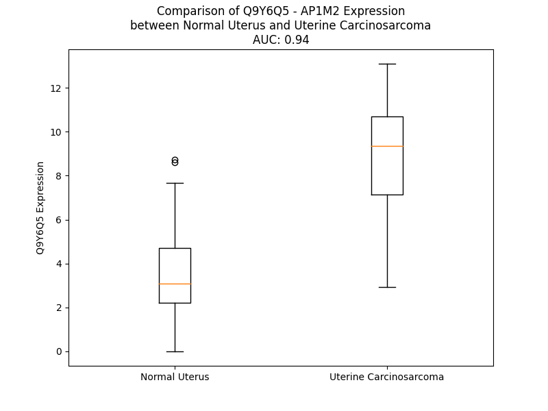

# Detailed Data for Q9Y6Q5

## Introduction to the Detailed Summary

### How to Interpret the Results

- **Summary & Metrics**: This section provides a quick reference to essential protein attributes, including expression changes, family classification, and biomarker applications. Regulation status (upregulated/downregulated) indicates the protein's behavior in a disease context. Some information comes from the original excel file with the proteins selected from literature, while others are derived from the analyses.
- **Expression Comparison**: A visual representation comparing protein expression between normal and disease states. It highlights significant changes in expression levels that might indicate diagnostic or therapeutic relevance. This is data coming from transcriptomics experiments and could not translate similarly to protein levels.
- **Isoform Alignment**: An interactive view of isoform alignments, revealing structural and functional differences between variants of the protein.
- **Interactors & Homologs**: Tables listing known interaction partners and homologous proteins, the more interactors and homologs, the more complex the protein is to design an antibody for.
- **Biological Assemblies**: Information about the structural arrangement of the protein in different assemblies, providing insights into its functional state but also the complexity of the protein to develop antibodies.
- **Combined Per-Residue Information**: A detailed table summarizing residue-level data. This includes predictions for epitope regions, aggregation tendencies, and modifications that might impact the protein's function. Each row corresponds to a residue in the protein, providing insights into specific sites that may be important for research or drug development.
## Summary & Metrics

- **UniProt Accession**: Q9Y6Q5
- **Gene Name**: AP1M2 
- **Protein Name**: adaptor-related protein complex 1, mu 2 subunit 
- **Swiss Prot**: AP1M2_HUMAN
- **Family**: transporter
- **Biomarker Application**:  
- **Number of Isoforms**: 2
- **Regulation**: 1
- **(transcriptomics) AUC**: 0.99
- **(transcriptomics) Fold Change**: 3.35
- **(transcriptomics) Regulation**: Upregulated
- **Discotope Epitope Count**: 88
- **Max n_uniprots (Homo)**: N/A
- **Max n_uniprots (Hetero)**: N/A

## Expression Comparison

## Isoform Alignment

<pre style='font-size:14px; font-family:monospace;'>Q9Y6Q5-1 MSASAVFILDVKGKPLISRNYKGDVAMSKIEHFMPLLVQREEEGALAPLLSHGQVHFLWIKHSNLYLVATTSKNANASLVYSFLYKTIEVFCEYFKELEEESIRDNFVIVYELLDELMDFGFPQTTDSKILQEYITQQSNKLETGKSRVPPTVTNAVSWRSEGIKYKKNEVFIDVIESVNLLVNANGSVLLSEIVGTIKLKVFLSGMPELRLGLNDRVLFELTGRS--KNKSVELEDVKFHQCVRLSRFDNDRTISFIPPDGDFELMSYRLSTQVKPLIWIESVIEKFSHSRVEIMVKAKGQFKKQSVANGVEISVPVPSDADSPRFKTSVGSAKYVPERNVVIWSIKSFPGGKEYLMRAHFGLPSVEKEEVEGRPPIGVKFEIPYFTVSGIQVRYMKIIEKSGYQALPWVRYITQSGDYQLRTS
Q9Y6Q5-2 MSASAVFILDVKGKPLISRNYKGDVAMSKIEHFMPLLVQREEEGALAPLLSHGQVHFLWIKHSNLYLVATTSKNANASLVYSFLYKTIEVFCEYFKELEEESIRDNFVIVYELLDELMDFGFPQTTDSKILQEYITQQSNKLETGKSRVPPTVTNAVSWRSEGIKYKKNEVFIDVIESVNLLVNANGSVLLSEIVGTIKLKVFLSGMPELRLGLNDRVLFELTGLSGSKNKSVELEDVKFHQCVRLSRFDNDRTISFIPPDGDFELMSYRLSTQVKPLIWIESVIEKFSHSRVEIMVKAKGQFKKQSVANGVEISVPVPSDADSPRFKTSVGSAKYVPERNVVIWSIKSFPGGKEYLMRAHFGLPSVEKEEVEGRPPIGVKFEIPYFTVSGIQVRYMKIIEKSGYQALPWVRYITQSGDYQLRTS
</pre>

## Interactors

| preferredName_A   | preferredName_B   |   score |
|:------------------|:------------------|--------:|
| AP1M2             | AP1S2             |   0.997 |
| AP1M2             | AP1S1             |   0.996 |
| AP1M2             | AP1G1             |   0.996 |
| AP1M2             | AP1G2             |   0.993 |
| AP1M2             | AP1B1             |   0.993 |
| AP1M2             | AP1S3             |   0.991 |
| AP1M2             | AP2B1             |   0.971 |
| AP1M2             | AP1M1             |   0.967 |
| AP1M2             | AFTPH             |   0.901 |

## Homologs

| uniprot_id   | gene_id   |
|:-------------|:----------|
| Q9Y2T2       | AP3M1     |
| C9JMG3       | AP4M1     |
| A0A8I5KTP2   | AP2M1     |
| K7ER75       | AP1M1     |
| Q9Y6Q2       | STON1     |
| A0A3B3IU55   | STON2     |
| E5RJ52       | AP3M2     |

## Combined Per-Residue Information

|   res | aa   |   epitope_score | epitope   |   relative_surface_accessibility |   modeling_confidence |   Aggregation | modification   |
|------:|:-----|----------------:|:----------|---------------------------------:|----------------------:|--------------:|:---------------|
|     1 | M    |         0.12549 | False     |                          0.58917 |                 63.5  |         0     | N/A            |
|     2 | S    |         0.00879 | False     |                          0.00077 |                 81.8  |         6.597 | N/A            |
|     3 | A    |         0.00642 | False     |                          0.00383 |                 92.8  |        27.792 | N/A            |
|     4 | S    |         0.00756 | False     |                          0.00445 |                 96.04 |        33.792 | N/A            |
|     5 | A    |         0.00266 | False     |                          0.00255 |                 97.33 |        74.833 | N/A            |
|     6 | V    |         0.00804 | False     |                          0.00662 |                 97.72 |        75.827 | N/A            |
|     7 | F    |         0.02185 | False     |                          0.02171 |                 98.26 |        75.905 | N/A            |
|     8 | I    |         0.00595 | False     |                          0.0048  |                 98.13 |        75.81  | N/A            |
|     9 | L    |         0.00402 | False     |                          0.00082 |                 98.18 |        70.599 | N/A            |
|    10 | D    |         0.0198  | False     |                          0.05688 |                 97.05 |         2.048 | N/A            |
|    11 | V    |         0.09963 | False     |                          0.56612 |                 95.39 |         2.048 | N/A            |
|    12 | K    |         0.12223 | False     |                          0.84546 |                 95    |         2.048 | N/A            |
|    13 | G    |         0.05094 | False     |                          0.15417 |                 94.61 |         0.152 | N/A            |
|    14 | K    |         0.13442 | False     |                          0.65781 |                 95.65 |         0     | N/A            |
|    15 | P    |         0.15186 | False     |                          0.42063 |                 96.7  |         0     | N/A            |
|    16 | L    |         0.08754 | False     |                          0.2317  |                 97.03 |         0     | N/A            |
|    17 | I    |         0.06287 | False     |                          0.04    |                 97.39 |         0     | N/A            |
|    18 | S    |         0.08964 | False     |                          0.26487 |                 96.79 |         0     | N/A            |
|    19 | R    |         0.13703 | False     |                          0.32558 |                 97.1  |         0     | N/A            |
|    20 | N    |         0.13009 | False     |                          0.33405 |                 97.13 |         0     | N/A            |
|    21 | Y    |         0.0741  | False     |                          0.09973 |                 96.66 |         0     | N/A            |
|    22 | K    |         0.09599 | False     |                          0.16143 |                 94    |         0     | N/A            |
|    23 | G    |         0.23308 | True      |                          0.66459 |                 93.01 |         0     | N/A            |
|    24 | D    |         0.14095 | False     |                          0.35333 |                 93.33 |         0     | N/A            |
|    25 | V    |         0.05034 | False     |                          0.04553 |                 94.11 |         0     | N/A            |
|    26 | A    |         0.18358 | True      |                          0.58629 |                 95.62 |         0     | N/A            |
|    27 | M    |         0.06089 | False     |                          0.30615 |                 96.12 |         0     | N/A            |
|    28 | S    |         0.15683 | False     |                          0.51926 |                 96.38 |         0     | N/A            |
|    29 | K    |         0.16094 | False     |                          0.35749 |                 96.01 |         0     | N/A            |
|    30 | I    |         0.044   | False     |                          0.05162 |                 97.32 |         0     | N/A            |
|    31 | E    |         0.19411 | True      |                          0.65193 |                 96.27 |         0     | N/A            |
|    32 | H    |         0.20504 | True      |                          0.36461 |                 96.59 |         0     | N/A            |
|    33 | F    |         0.01595 | False     |                          0.00069 |                 97.64 |         0     | N/A            |
|    34 | M    |         0.07875 | False     |                          0.15957 |                 96.84 |         0     | N/A            |
|    35 | P    |         0.17995 | True      |                          0.61771 |                 96.42 |         0     | N/A            |
|    36 | L    |         0.12105 | False     |                          0.19443 |                 96.34 |         0     | N/A            |
|    37 | L    |         0.03832 | False     |                          0.04204 |                 96.68 |         0     | N/A            |
|    38 | V    |         0.13638 | False     |                          0.4827  |                 95.45 |         0     | N/A            |
|    39 | Q    |         0.22572 | True      |                          0.45031 |                 95.37 |         0     | N/A            |
|    40 | R    |         0.27204 | True      |                          0.32879 |                 95.27 |         0     | N/A            |
|    41 | E    |         0.23625 | True      |                          0.56377 |                 94.35 |         0     | N/A            |
|    42 | E    |         0.27102 | True      |                          0.75099 |                 94.49 |         0     | N/A            |
|    43 | E    |         0.274   | True      |                          0.54289 |                 94.63 |         0     | N/A            |
|    44 | G    |         0.25144 | True      |                          0.84322 |                 92.8  |         0     | N/A            |
|    45 | A    |         0.20902 | True      |                          0.45596 |                 93.45 |         0     | N/A            |
|    46 | L    |         0.35448 | True      |                          0.55519 |                 93.25 |         0     | N/A            |
|    47 | A    |         0.14002 | False     |                          0.29039 |                 94.92 |         0     | N/A            |
|    48 | P    |         0.13597 | False     |                          0.5895  |                 95.52 |         0     | N/A            |
|    49 | L    |         0.16255 | False     |                          0.44623 |                 96.48 |         0     | N/A            |
|    50 | L    |         0.04463 | False     |                          0.01319 |                 96.85 |         0     | N/A            |
|    51 | S    |         0.11524 | False     |                          0.33448 |                 95.3  |         0     | N/A            |
|    52 | H    |         0.26933 | True      |                          0.33086 |                 95.41 |         0     | N/A            |
|    53 | G    |         0.20656 | True      |                          0.88429 |                 94.16 |         0     | N/A            |
|    54 | Q    |         0.21455 | True      |                          0.76913 |                 93.43 |         0.2   | N/A            |
|    55 | V    |         0.07265 | False     |                          0.08949 |                 96.27 |         6.454 | N/A            |
|    56 | H    |         0.05877 | False     |                          0.31117 |                 96.88 |         6.941 | N/A            |
|    57 | F    |         0.00634 | False     |                          0       |                 97.7  |         6.941 | N/A            |
|    58 | L    |         0.02157 | False     |                          0.01978 |                 97.91 |         6.941 | N/A            |
|    59 | W    |         0.07476 | False     |                          0.11715 |                 97.87 |         6.941 | N/A            |
|    60 | I    |         0.07983 | False     |                          0.0696  |                 97.96 |         6.414 | N/A            |
|    61 | K    |         0.1198  | False     |                          0.59269 |                 97.17 |         0     | N/A            |
|    62 | H    |         0.12958 | False     |                          0.27849 |                 96.57 |         0     | N/A            |
|    63 | S    |         0.06559 | False     |                          0.59753 |                 94.99 |         0     | N/A            |
|    64 | N    |         0.06751 | False     |                          0.31038 |                 95.4  |         2.869 | N/A            |
|    65 | L    |         0.00301 | False     |                          0.00082 |                 97.78 |        52.116 | N/A            |
|    66 | Y    |         0.028   | False     |                          0.08828 |                 98.16 |        55.935 | N/A            |
|    67 | L    |         0.0043  | False     |                          0.00165 |                 98.2  |        56.135 | N/A            |
|    68 | V    |         0.00365 | False     |                          0       |                 98.26 |        56.135 | N/A            |
|    69 | A    |         0.0088  | False     |                          0.0051  |                 98.09 |        54.966 | N/A            |
|    70 | T    |         0.01525 | False     |                          0.00666 |                 97.77 |        25.585 | N/A            |
|    71 | T    |         0.02419 | False     |                          0.02628 |                 96.59 |         5.17  | N/A            |
|    72 | S    |         0.17482 | False     |                          0.30035 |                 94.69 |         0.527 | N/A            |
|    73 | K    |         0.13813 | False     |                          0.49913 |                 92.43 |         0     | N/A            |
|    74 | N    |         0.33884 | True      |                          0.99875 |                 92.95 |         0.029 | N/A            |
|    75 | A    |         0.07428 | False     |                          0.15442 |                 92.27 |         0.945 | N/A            |
|    76 | N    |         0.22376 | True      |                          0.50975 |                 95.32 |         1.184 | N/A            |
|    77 | A    |         0.10452 | False     |                          0.35463 |                 95.63 |         7.721 | N/A            |
|    78 | S    |         0.28763 | True      |                          0.57953 |                 96.25 |        15.305 | N/A            |
|    79 | L    |         0.09138 | False     |                          0.38604 |                 96.66 |        76.924 | N/A            |
|    80 | V    |         0.01706 | False     |                          0.00666 |                 97.19 |        87.888 | N/A            |
|    81 | Y    |         0.08717 | False     |                          0.19206 |                 97.63 |        88.739 | N/A            |
|    82 | S    |         0.12474 | False     |                          0.55168 |                 96.59 |        88.793 | N/A            |
|    83 | F    |         0.02243 | False     |                          0.0303  |                 97.54 |        90.31  | N/A            |
|    84 | L    |         0.00437 | False     |                          0       |                 97.95 |        88.081 | N/A            |
|    85 | Y    |         0.15198 | False     |                          0.60695 |                 97.63 |        82.514 | N/A            |
|    86 | K    |         0.05751 | False     |                          0.2597  |                 97.03 |        63.602 | N/A            |
|    87 | T    |         0.00501 | False     |                          0.00603 |                 97.55 |        63.602 | N/A            |
|    88 | I    |         0.06054 | False     |                          0.0936  |                 97.61 |        63.602 | N/A            |
|    89 | E    |         0.08603 | False     |                          0.40975 |                 96.09 |        63.602 | N/A            |
|    90 | V    |         0.00394 | False     |                          0.00286 |                 96.83 |        62.747 | N/A            |
|    91 | F    |         0.00241 | False     |                          0       |                 97.1  |        53.226 | N/A            |
|    92 | C    |         0.06337 | False     |                          0.26319 |                 95.76 |         9.829 | N/A            |
|    93 | E    |         0.07555 | False     |                          0.40859 |                 93.65 |         0.782 | N/A            |
|    94 | Y    |         0.06641 | False     |                          0.07782 |                 95.15 |         0.782 | N/A            |
|    95 | F    |         0.08698 | False     |                          0.1419  |                 94.23 |         0.782 | N/A            |
|    96 | K    |         0.16281 | False     |                          0.89911 |                 92.71 |         0.782 | N/A            |
|    97 | E    |         0.14624 | False     |                          0.64817 |                 93.9  |         0     | N/A            |
|    98 | L    |         0.06065 | False     |                          0.03039 |                 95.83 |         0     | N/A            |
|    99 | E    |         0.06418 | False     |                          0.34463 |                 96.33 |         0     | N/A            |
|   100 | E    |         0.0302  | False     |                          0.19608 |                 96.45 |         0     | N/A            |
|   101 | E    |         0.10734 | False     |                          0.57853 |                 95.08 |         0     | N/A            |
|   102 | S    |         0.0426  | False     |                          0.11537 |                 95.43 |         0     | N/A            |
|   103 | I    |         0.01509 | False     |                          0.00859 |                 96.02 |         0     | N/A            |
|   104 | R    |         0.17721 | False     |                          0.51972 |                 95.13 |         0     | N/A            |
|   105 | D    |         0.16097 | False     |                          0.63933 |                 94.8  |         0     | N/A            |
|   106 | N    |         0.08691 | False     |                          0.25276 |                 94.76 |        24.103 | N/A            |
|   107 | F    |         0.18712 | True      |                          0.5821  |                 93.81 |        88.193 | N/A            |
|   108 | V    |         0.06555 | False     |                          0.57139 |                 94.59 |        88.193 | N/A            |
|   109 | I    |         0.0814  | False     |                          0.11839 |                 94.06 |        88.193 | N/A            |
|   110 | V    |         0.00408 | False     |                          0       |                 96.15 |        88.193 | N/A            |
|   111 | Y    |         0.14175 | False     |                          0.44338 |                 95.5  |        82.776 | N/A            |
|   112 | E    |         0.05541 | False     |                          0.4183  |                 95.05 |         0     | N/A            |
|   113 | L    |         0.00243 | False     |                          0       |                 96.64 |         0     | N/A            |
|   114 | L    |         0.00802 | False     |                          0.00577 |                 96.81 |         0     | N/A            |
|   115 | D    |         0.11114 | False     |                          0.45803 |                 95.02 |         0     | N/A            |
|   116 | E    |         0.10619 | False     |                          0.33627 |                 94.73 |         0     | N/A            |
|   117 | L    |         0.00412 | False     |                          0.00082 |                 96.73 |         0     | N/A            |
|   118 | M    |         0.02401 | False     |                          0.00922 |                 96.34 |         0     | N/A            |
|   119 | D    |         0.10123 | False     |                          0.5538  |                 95.24 |         0     | N/A            |
|   120 | F    |         0.15431 | False     |                          0.57216 |                 95.25 |         0     | N/A            |
|   121 | G    |         0.00767 | False     |                          0.00136 |                 93.29 |         0     | N/A            |
|   122 | F    |         0.15063 | False     |                          0.45056 |                 95.21 |         0     | N/A            |
|   123 | P    |         0.06167 | False     |                          0.28894 |                 96.31 |         0     | N/A            |
|   124 | Q    |         0.19144 | True      |                          0.51586 |                 94.68 |         0     | N/A            |
|   125 | T    |         0.11393 | False     |                          0.14676 |                 93.99 |         0     | N/A            |
|   126 | T    |         0.02489 | False     |                          0.20965 |                 95.07 |         0     | N/A            |
|   127 | D    |         0.03844 | False     |                          0.1655  |                 93.77 |         0     | N/A            |
|   128 | S    |         0.02758 | False     |                          0.05006 |                 93.48 |         0     | N/A            |
|   129 | K    |         0.0453  | False     |                          0.35209 |                 91.04 |         0     | N/A            |
|   130 | I    |         0.02627 | False     |                          0.0264  |                 92.6  |         0     | N/A            |
|   131 | L    |         0.0054  | False     |                          0       |                 92.84 |         0     | N/A            |
|   132 | Q    |         0.09437 | False     |                          0.3743  |                 91.56 |         0     | N/A            |
|   133 | E    |         0.12762 | False     |                          0.39349 |                 88.66 |         0     | N/A            |
|   134 | Y    |         0.13628 | False     |                          0.13153 |                 89.06 |         0     | N/A            |
|   135 | I    |         0.04517 | False     |                          0.04654 |                 89.91 |         0     | N/A            |
|   136 | T    |         0.08482 | False     |                          0.39982 |                 84.32 |         0     | N/A            |
|   137 | Q    |         0.09493 | False     |                          0.47543 |                 75.92 |         0     | N/A            |
|   138 | Q    |         0.1738  | False     |                          0.73505 |                 69.58 |         0     | N/A            |
|   139 | S    |         0.14473 | False     |                          0.88349 |                 55.09 |         0     | N/A            |
|   140 | N    |         0.13745 | False     |                          0.73611 |                 47.48 |         0     | N/A            |
|   141 | K    |         0.17278 | False     |                          0.89615 |                 44.79 |         0     | N/A            |
|   142 | L    |         0.22677 | True      |                          1.11653 |                 43.74 |         0     | N/A            |
|   143 | E    |         0.13228 | False     |                          0.77341 |                 43.86 |         0     | N/A            |
|   144 | T    |         0.24588 | True      |                          1.06315 |                 42.33 |         0     | N/A            |
|   145 | G    |         0.13432 | False     |                          0.67353 |                 47.03 |         0     | N/A            |
|   146 | K    |         0.1683  | False     |                          0.95429 |                 53.53 |         0     | N/A            |
|   147 | S    |         0.08529 | False     |                          0.53302 |                 59.5  |         0     | N/A            |
|   148 | R    |         0.18613 | True      |                          0.88311 |                 75.8  |         0     | N/A            |
|   149 | V    |         0.1329  | False     |                          0.59511 |                 84.86 |         0     | N/A            |
|   150 | P    |         0.04217 | False     |                          0.09586 |                 86.59 |         0     | N/A            |
|   151 | P    |         0.16085 | False     |                          0.7048  |                 89.34 |         0     | N/A            |
|   152 | T    |         0.06377 | False     |                          0.02796 |                 90.25 |         0     | N/A            |
|   153 | V    |         0.11231 | False     |                          0.28377 |                 86.98 |         0.175 | N/A            |
|   154 | T    |         0.25073 | True      |                          0.83088 |                 89.29 |         0.175 | N/A            |
|   155 | N    |         0.25561 | True      |                          0.41383 |                 90.74 |         0.175 | N/A            |
|   156 | A    |         0.24686 | True      |                          0.98143 |                 91.18 |         0.175 | N/A            |
|   157 | V    |         0.17237 | False     |                          0.24473 |                 94.21 |         0.175 | N/A            |
|   158 | S    |         0.10075 | False     |                          0.24248 |                 94.4  |         0     | N/A            |
|   159 | W    |         0.13536 | False     |                          0.12814 |                 95.19 |         0     | N/A            |
|   160 | R    |         0.03869 | False     |                          0.01406 |                 96.21 |         0     | N/A            |
|   161 | S    |         0.09498 | False     |                          0.12451 |                 93.18 |         0     | N/A            |
|   162 | E    |         0.33199 | True      |                          0.69009 |                 92.37 |         0     | N/A            |
|   163 | G    |         0.21713 | True      |                          0.69429 |                 91.69 |         0     | N/A            |
|   164 | I    |         0.1619  | False     |                          0.2105  |                 94.55 |         0     | N/A            |
|   165 | K    |         0.21202 | True      |                          0.87682 |                 96.01 |         0     | N/A            |
|   166 | Y    |         0.11251 | False     |                          0.32573 |                 96.12 |         0     | N/A            |
|   167 | K    |         0.23039 | True      |                          1.09077 |                 94.7  |         0     | N/A            |
|   168 | K    |         0.1847  | True      |                          0.58114 |                 95.18 |         0     | N/A            |
|   169 | N    |         0.07837 | False     |                          0.12907 |                 97.14 |         0     | N/A            |
|   170 | E    |         0.04692 | False     |                          0.1071  |                 96.91 |         0     | N/A            |
|   171 | V    |         0.00199 | False     |                          0       |                 97.84 |         0     | N/A            |
|   172 | F    |         0.09834 | False     |                          0.3521  |                 98.07 |         0     | N/A            |
|   173 | I    |         0.01225 | False     |                          0.01801 |                 98.21 |         0     | N/A            |
|   174 | D    |         0.06222 | False     |                          0.16017 |                 97.99 |         0     | N/A            |
|   175 | V    |         0.00264 | False     |                          0       |                 98.15 |         0     | N/A            |
|   176 | I    |         0.0287  | False     |                          0.17335 |                 98.03 |         0     | N/A            |
|   177 | E    |         0.00374 | False     |                          0       |                 97.05 |         0     | N/A            |
|   178 | S    |         0.02636 | False     |                          0.16668 |                 96.75 |         0.407 | N/A            |
|   179 | V    |         0.02448 | False     |                          0.02571 |                 95.72 |         3.817 | N/A            |
|   180 | N    |         0.03291 | False     |                          0.16488 |                 95.05 |         3.817 | N/A            |
|   181 | L    |         0.01893 | False     |                          0.01728 |                 94.36 |         4.463 | N/A            |
|   182 | L    |         0.08039 | False     |                          0.22422 |                 94.45 |         4.463 | N/A            |
|   183 | V    |         0.02489 | False     |                          0.01809 |                 93.6  |         4.463 | N/A            |
|   184 | N    |         0.05779 | False     |                          0.21592 |                 92.1  |         0.774 | N/A            |
|   185 | A    |         0.05378 | False     |                          0.48767 |                 88.51 |         0.646 | N/A            |
|   186 | N    |         0.12533 | False     |                          0.87435 |                 87.93 |         0     | N/A            |
|   187 | G    |         0.06571 | False     |                          0.3877  |                 84.79 |         0     | N/A            |
|   188 | S    |         0.10124 | False     |                          0.45138 |                 90.15 |         0.104 | N/A            |
|   189 | V    |         0.08812 | False     |                          0.43898 |                 91.4  |         1.099 | N/A            |
|   190 | L    |         0.22616 | True      |                          0.58441 |                 92.32 |         1.099 | N/A            |
|   191 | L    |         0.2273  | True      |                          0.57457 |                 92.23 |         1.099 | N/A            |
|   192 | S    |         0.04378 | False     |                          0.10505 |                 92.64 |         1.099 | N/A            |
|   193 | E    |         0.07037 | False     |                          0.12734 |                 93.8  |         1.099 | N/A            |
|   194 | I    |         0.00319 | False     |                          0.0016  |                 95.56 |        12.515 | N/A            |
|   195 | V    |         0.03182 | False     |                          0.3562  |                 96.51 |        12.515 | N/A            |
|   196 | G    |         0.00296 | False     |                          0       |                 97.18 |        12.515 | N/A            |
|   197 | T    |         0.02025 | False     |                          0.15017 |                 98.01 |        12.515 | N/A            |
|   198 | I    |         0.00375 | False     |                          0       |                 98.3  |        12.515 | N/A            |
|   199 | K    |         0.12565 | False     |                          0.47525 |                 98.23 |         1.099 | N/A            |
|   200 | L    |         0.01051 | False     |                          0.01464 |                 98.22 |         0.944 | N/A            |
|   201 | K    |         0.07141 | False     |                          0.39165 |                 97.92 |         0     | N/A            |
|   202 | V    |         0.00362 | False     |                          0       |                 97.83 |         0.2   | N/A            |
|   203 | F    |         0.03689 | False     |                          0.2904  |                 97.38 |         0.2   | N/A            |
|   204 | L    |         0.004   | False     |                          0       |                 97.72 |         0.2   | N/A            |
|   205 | S    |         0.15969 | False     |                          0.13142 |                 97.24 |         0.2   | N/A            |
|   206 | G    |         0.05326 | False     |                          0.25846 |                 95.94 |         0.2   | N/A            |
|   207 | M    |         0.12372 | False     |                          0.29536 |                 96.33 |         0     | N/A            |
|   208 | P    |         0.0039  | False     |                          0       |                 97.13 |         0     | N/A            |
|   209 | E    |         0.08687 | False     |                          0.14554 |                 97.08 |         0     | N/A            |
|   210 | L    |         0.00365 | False     |                          0       |                 97.59 |         0     | N/A            |
|   211 | R    |         0.13252 | False     |                          0.31328 |                 97.12 |         0     | N/A            |
|   212 | L    |         0.02352 | False     |                          0.02559 |                 97.02 |         0     | N/A            |
|   213 | G    |         0.03948 | False     |                          0.0177  |                 95.01 |         0     | N/A            |
|   214 | L    |         0.02535 | False     |                          0.03843 |                 95.65 |         0     | N/A            |
|   215 | N    |         0.01893 | False     |                          0.01619 |                 93.93 |         0     | N/A            |
|   216 | D    |         0.04868 | False     |                          0.04688 |                 91.06 |         0     | N/A            |
|   217 | R    |         0.27908 | True      |                          0.42197 |                 90.45 |         0.35  | N/A            |
|   218 | V    |         0.19331 | True      |                          0.42558 |                 88.76 |         0.35  | N/A            |
|   219 | L    |         0.12326 | False     |                          0.23247 |                 87.76 |         0.35  | N/A            |
|   220 | F    |         0.07472 | False     |                          0.02945 |                 88.95 |         0.35  | N/A            |
|   221 | E    |         0.37698 | True      |                          0.45147 |                 88.6  |         0.35  | N/A            |
|   222 | L    |         0.42865 | True      |                          0.73117 |                 86.86 |         0.35  | N/A            |
|   223 | T    |         0.27774 | True      |                          0.51529 |                 87.55 |         0.35  | N/A            |
|   224 | G    |         0.36729 | True      |                          0.84627 |                 85.69 |         0     | N/A            |
|   225 | R    |         0.29532 | True      |                          0.48348 |                 82.07 |         0     | N/A            |
|   226 | S    |         0.41385 | True      |                          0.56425 |                 75.39 |         0     | N/A            |
|   227 | K    |         0.33871 | True      |                          1.02964 |                 80.48 |         0     | N/A            |
|   228 | N    |         0.26194 | True      |                          0.49553 |                 81.88 |         0     | N/A            |
|   229 | K    |         0.21222 | True      |                          0.69868 |                 86.24 |         0     | N/A            |
|   230 | S    |         0.12556 | False     |                          0.26553 |                 90.43 |         0     | N/A            |
|   231 | V    |         0.03635 | False     |                          0.03713 |                 91.8  |         0     | N/A            |
|   232 | E    |         0.29562 | True      |                          0.50183 |                 90.46 |         0     | N/A            |
|   233 | L    |         0.06461 | False     |                          0.11895 |                 91.01 |         0     | N/A            |
|   234 | E    |         0.23213 | True      |                          0.46061 |                 91.05 |         0     | N/A            |
|   235 | D    |         0.20935 | True      |                          0.37996 |                 92.87 |         0     | N/A            |
|   236 | V    |         0.17083 | False     |                          0.20536 |                 95.44 |         0     | N/A            |
|   237 | K    |         0.20919 | True      |                          0.67236 |                 96.52 |         0     | N/A            |
|   238 | F    |         0.15329 | False     |                          0.18889 |                 97.94 |         0     | N/A            |
|   239 | H    |         0.08089 | False     |                          0.2603  |                 97.42 |         0     | N/A            |
|   240 | Q    |         0.12671 | False     |                          0.4869  |                 95.93 |         0     | N/A            |
|   241 | C    |         0.03349 | False     |                          0.02834 |                 97.31 |         0     | N/A            |
|   242 | V    |         0.02303 | False     |                          0.05237 |                 98.08 |         0     | N/A            |
|   243 | R    |         0.16666 | False     |                          0.39363 |                 96.57 |         0     | N/A            |
|   244 | L    |         0.22644 | True      |                          0.6176  |                 95.96 |         0     | N/A            |
|   245 | S    |         0.25293 | True      |                          0.60501 |                 94.96 |         0     | N/A            |
|   246 | R    |         0.17544 | False     |                          0.35182 |                 93.7  |         0     | N/A            |
|   247 | F    |         0.11951 | False     |                          0.0879  |                 94.71 |         0     | N/A            |
|   248 | D    |         0.36973 | True      |                          0.68836 |                 92.44 |         0     | N/A            |
|   249 | N    |         0.33016 | True      |                          0.79728 |                 91.17 |         0     | N/A            |
|   250 | D    |         0.42055 | True      |                          0.44931 |                 89.22 |         0     | N/A            |
|   251 | R    |         0.16894 | False     |                          0.19438 |                 91.83 |         0     | N/A            |
|   252 | T    |         0.14704 | False     |                          0.24366 |                 92.32 |         0.123 | N/A            |
|   253 | I    |         0.02362 | False     |                          0.036   |                 97.08 |         0.123 | N/A            |
|   254 | S    |         0.01621 | False     |                          0       |                 97.8  |         0.123 | N/A            |
|   255 | F    |         0.00439 | False     |                          0.00069 |                 98.34 |         0.123 | N/A            |
|   256 | I    |         0.08103 | False     |                          0.13658 |                 98.01 |         0.123 | N/A            |
|   257 | P    |         0.00504 | False     |                          0       |                 97.81 |         0     | N/A            |
|   258 | P    |         0.02176 | False     |                          0.05567 |                 97.01 |         0     | N/A            |
|   259 | D    |         0.1219  | False     |                          0.18227 |                 96.51 |         0     | N/A            |
|   260 | G    |         0.0695  | False     |                          0.15451 |                 96.18 |         0     | N/A            |
|   261 | D    |         0.11589 | False     |                          0.5442  |                 95.78 |         0     | N/A            |
|   262 | F    |         0.06542 | False     |                          0.11653 |                 97.12 |         0     | N/A            |
|   263 | E    |         0.04817 | False     |                          0.3829  |                 97.84 |         0     | N/A            |
|   264 | L    |         0.00176 | False     |                          0       |                 98.3  |         0     | N/A            |
|   265 | M    |         0.01802 | False     |                          0.01007 |                 98.04 |         0     | N/A            |
|   266 | S    |         0.07945 | False     |                          0.2103  |                 97.79 |         0     | N/A            |
|   267 | Y    |         0.0208  | False     |                          0.0133  |                 96.86 |         0     | N/A            |
|   268 | R    |         0.18185 | True      |                          0.35857 |                 95.52 |         0     | N/A            |
|   269 | L    |         0.06385 | False     |                          0.07172 |                 92.63 |         0     | N/A            |
|   270 | S    |         0.1779  | True      |                          0.49656 |                 87.97 |         0     | N/A            |
|   271 | T    |         0.09757 | False     |                          0.31372 |                 79    |         0     | N/A            |
|   272 | Q    |         0.19407 | True      |                          0.91541 |                 78.37 |         0     | N/A            |
|   273 | V    |         0.0771  | False     |                          0.23871 |                 78.38 |         0     | N/A            |
|   274 | K    |         0.11116 | False     |                          0.77725 |                 85.43 |         0     | N/A            |
|   275 | P    |         0.07205 | False     |                          0.09742 |                 91.01 |         5.426 | N/A            |
|   276 | L    |         0.03581 | False     |                          0.04263 |                 95.01 |         5.426 | N/A            |
|   277 | I    |         0.00327 | False     |                          0       |                 96.04 |         5.426 | N/A            |
|   278 | W    |         0.03241 | False     |                          0.18769 |                 95.35 |         5.426 | N/A            |
|   279 | I    |         0.03526 | False     |                          0.05325 |                 95.45 |         5.426 | N/A            |
|   280 | E    |         0.06753 | False     |                          0.39943 |                 93.44 |         0     | N/A            |
|   281 | S    |         0.05132 | False     |                          0.23044 |                 92.52 |         0     | N/A            |
|   282 | V    |         0.08217 | False     |                          0.6109  |                 92.08 |         0     | N/A            |
|   283 | I    |         0.08614 | False     |                          0.37009 |                 89.51 |         0     | N/A            |
|   284 | E    |         0.10368 | False     |                          0.44768 |                 90.92 |         0     | N/A            |
|   285 | K    |         0.15811 | False     |                          0.66636 |                 89.17 |         0     | N/A            |
|   286 | F    |         0.1539  | False     |                          0.43165 |                 90.15 |         0     | N/A            |
|   287 | S    |         0.17937 | True      |                          0.55303 |                 85.7  |         0     | N/A            |
|   288 | H    |         0.27791 | True      |                          0.47291 |                 86.33 |         0     | N/A            |
|   289 | S    |         0.10693 | False     |                          0.48828 |                 92.21 |         0     | N/A            |
|   290 | R    |         0.1954  | True      |                          0.37441 |                 92.73 |         0     | N/A            |
|   291 | V    |         0.019   | False     |                          0.00571 |                 93.41 |         0     | N/A            |
|   292 | E    |         0.05296 | False     |                          0.29486 |                 95.27 |         0     | N/A            |
|   293 | I    |         0.00698 | False     |                          0.02076 |                 94.93 |         0     | N/A            |
|   294 | M    |         0.07428 | False     |                          0.42039 |                 95.77 |         0     | N/A            |
|   295 | V    |         0.0021  | False     |                          0       |                 96.39 |         0     | N/A            |
|   296 | K    |         0.04933 | False     |                          0.29251 |                 96.92 |         0     | N/A            |
|   297 | A    |         0.00433 | False     |                          0       |                 97.55 |         0     | N/A            |
|   298 | K    |         0.09262 | False     |                          0.41482 |                 96.96 |         0     | N/A            |
|   299 | G    |         0.01947 | False     |                          0.0119  |                 96.96 |         0     | N/A            |
|   300 | Q    |         0.044   | False     |                          0.34801 |                 95.18 |         0     | N/A            |
|   301 | F    |         0.13097 | False     |                          0.07955 |                 94.94 |         0     | N/A            |
|   302 | K    |         0.20372 | True      |                          0.61928 |                 94.64 |         0     | N/A            |
|   303 | K    |         0.23422 | True      |                          0.81058 |                 94.81 |         0     | N/A            |
|   304 | Q    |         0.18282 | True      |                          0.72589 |                 94.69 |         0     | N/A            |
|   305 | S    |         0.08087 | False     |                          0.1143  |                 96.41 |         0     | N/A            |
|   306 | V    |         0.06264 | False     |                          0.34214 |                 97.6  |         0     | N/A            |
|   307 | A    |         0.00345 | False     |                          0       |                 97.98 |         0     | N/A            |
|   308 | N    |         0.0979  | False     |                          0.3833  |                 97.43 |         0     | N/A            |
|   309 | G    |         0.08476 | False     |                          0.55997 |                 96.26 |         0     | N/A            |
|   310 | V    |         0.00297 | False     |                          0.00141 |                 98.01 |         0     | N/A            |
|   311 | E    |         0.07702 | False     |                          0.30717 |                 98.05 |         0     | N/A            |
|   312 | I    |         0.00179 | False     |                          0       |                 97.96 |         0     | N/A            |
|   313 | S    |         0.07881 | False     |                          0.24237 |                 97.33 |         0     | N/A            |
|   314 | V    |         0.00127 | False     |                          0.00095 |                 96.08 |         0     | N/A            |
|   315 | P    |         0.01734 | False     |                          0.13684 |                 94.39 |         0     | N/A            |
|   316 | V    |         0.0362  | False     |                          0.06427 |                 93.12 |         0     | N/A            |
|   317 | P    |         0.06572 | False     |                          0.22481 |                 90.27 |         0     | N/A            |
|   318 | S    |         0.24721 | True      |                          0.39296 |                 90.41 |         0     | N/A            |
|   319 | D    |         0.13845 | False     |                          0.23099 |                 89.33 |         0     | N/A            |
|   320 | A    |         0.0506  | False     |                          0.07259 |                 91.76 |         0     | N/A            |
|   321 | D    |         0.11467 | False     |                          0.41694 |                 92.5  |         0     | N/A            |
|   322 | S    |         0.18646 | True      |                          0.53702 |                 94.53 |         0     | N/A            |
|   323 | P    |         0.13781 | False     |                          0.43732 |                 96.41 |         0     | N/A            |
|   324 | R    |         0.25733 | True      |                          0.71174 |                 96.92 |         0     | N/A            |
|   325 | F    |         0.04738 | False     |                          0.33522 |                 97.09 |         0     | N/A            |
|   326 | K    |         0.16652 | False     |                          0.77111 |                 97.31 |         0     | N/A            |
|   327 | T    |         0.11526 | False     |                          0.29999 |                 97.06 |         0     | N/A            |
|   328 | S    |         0.11802 | False     |                          0.54338 |                 96.74 |         0     | N/A            |
|   329 | V    |         0.09637 | False     |                          0.41415 |                 96.72 |         0     | N/A            |
|   330 | G    |         0.03917 | False     |                          0.45723 |                 96.68 |         0     | N/A            |
|   331 | S    |         0.08656 | False     |                          0.56547 |                 97.51 |         0     | N/A            |
|   332 | A    |         0.04491 | False     |                          0.19566 |                 97.66 |         0     | N/A            |
|   333 | K    |         0.19672 | True      |                          0.53593 |                 96.62 |         0     | N/A            |
|   334 | Y    |         0.07542 | False     |                          0.19392 |                 96.52 |         0     | N/A            |
|   335 | V    |         0.10775 | False     |                          0.21231 |                 95.94 |         0     | N/A            |
|   336 | P    |         0.14514 | False     |                          0.57845 |                 92.8  |         0     | N/A            |
|   337 | E    |         0.3497  | True      |                          0.86198 |                 92.48 |         0     | N/A            |
|   338 | R    |         0.35602 | True      |                          0.71743 |                 92.2  |         0     | N/A            |
|   339 | N    |         0.12922 | False     |                          0.32865 |                 93.38 |        25.112 | N/A            |
|   340 | V    |         0.08128 | False     |                          0.14757 |                 95.23 |        55.48  | N/A            |
|   341 | V    |         0.00492 | False     |                          0.00286 |                 96.63 |        61.946 | N/A            |
|   342 | I    |         0.05857 | False     |                          0.13359 |                 97.53 |        61.946 | N/A            |
|   343 | W    |         0.01719 | False     |                          0       |                 98.2  |        61.946 | N/A            |
|   344 | S    |         0.04632 | False     |                          0.21722 |                 98.37 |        45.654 | N/A            |
|   345 | I    |         0.01997 | False     |                          0.00647 |                 98.21 |        42.369 | N/A            |
|   346 | K    |         0.18392 | True      |                          0.91332 |                 97.48 |         0     | N/A            |
|   347 | S    |         0.15049 | False     |                          0.45057 |                 97.05 |         0     | N/A            |
|   348 | F    |         0.00293 | False     |                          0       |                 97.81 |         0     | N/A            |
|   349 | P    |         0.08781 | False     |                          0.27536 |                 97.57 |         0     | N/A            |
|   350 | G    |         0.01811 | False     |                          0.04283 |                 96.82 |         0     | N/A            |
|   351 | G    |         0.10509 | False     |                          0.53127 |                 96.2  |         0     | N/A            |
|   352 | K    |         0.16122 | False     |                          0.52509 |                 97.32 |         0     | N/A            |
|   353 | E    |         0.13123 | False     |                          0.38349 |                 97.17 |         0     | N/A            |
|   354 | Y    |         0.09284 | False     |                          0.14911 |                 97.97 |         0     | N/A            |
|   355 | L    |         0.05641 | False     |                          0.43623 |                 97.79 |         0     | N/A            |
|   356 | M    |         0.00947 | False     |                          0.00288 |                 97.85 |         0     | N/A            |
|   357 | R    |         0.12474 | False     |                          0.53623 |                 97.37 |         0     | N/A            |
|   358 | A    |         0.03941 | False     |                          0.03915 |                 96.93 |         0     | N/A            |
|   359 | H    |         0.08557 | False     |                          0.30685 |                 96.74 |         0     | N/A            |
|   360 | F    |         0.00828 | False     |                          0       |                 96.13 |         0     | N/A            |
|   361 | G    |         0.08219 | False     |                          0.14646 |                 94.36 |         0     | N/A            |
|   362 | L    |         0.06943 | False     |                          0.10068 |                 91.69 |         0     | N/A            |
|   363 | P    |         0.1716  | False     |                          0.38903 |                 89.8  |         0     | N/A            |
|   364 | S    |         0.34615 | True      |                          0.67329 |                 86.66 |         0     | N/A            |
|   365 | V    |         0.27274 | True      |                          0.85583 |                 85.41 |         0     | N/A            |
|   366 | E    |         0.36677 | True      |                          0.62933 |                 78.33 |         0     | N/A            |
|   367 | K    |         0.28788 | True      |                          0.44541 |                 75.18 |         0     | N/A            |
|   368 | E    |         0.34978 | True      |                          0.9322  |                 75.88 |         0     | N/A            |
|   369 | E    |         0.32984 | True      |                          0.76351 |                 77.26 |         0     | N/A            |
|   370 | V    |         0.2876  | True      |                          1.06119 |                 78.28 |         0     | N/A            |
|   371 | E    |         0.2373  | True      |                          0.3714  |                 78.61 |         0     | N/A            |
|   372 | G    |         0.31191 | True      |                          0.76727 |                 82.31 |         0     | N/A            |
|   373 | R    |         0.23084 | True      |                          0.76245 |                 85.56 |         0     | N/A            |
|   374 | P    |         0.14916 | False     |                          0.5265  |                 91.61 |         0     | N/A            |
|   375 | P    |         0.06346 | False     |                          0.27947 |                 94.72 |         0     | N/A            |
|   376 | I    |         0.00684 | False     |                          0.0088  |                 96.29 |         0     | N/A            |
|   377 | G    |         0.03771 | False     |                          0.26386 |                 96.67 |         0     | N/A            |
|   378 | V    |         0.01574 | False     |                          0.02366 |                 97.44 |         0     | N/A            |
|   379 | K    |         0.06781 | False     |                          0.6547  |                 97.88 |         0     | N/A            |
|   380 | F    |         0.02053 | False     |                          0.03689 |                 97.72 |         0     | N/A            |
|   381 | E    |         0.02577 | False     |                          0.37939 |                 98.04 |         0     | N/A            |
|   382 | I    |         0.00424 | False     |                          0       |                 97.7  |         0     | N/A            |
|   383 | P    |         0.06423 | False     |                          0.28621 |                 96.95 |         0     | N/A            |
|   384 | Y    |         0.09518 | False     |                          0.81991 |                 94.88 |         4.962 | N/A            |
|   385 | F    |         0.03568 | False     |                          0.13872 |                 93.39 |         5.593 | N/A            |
|   386 | T    |         0.02261 | False     |                          0.20861 |                 93.33 |         5.593 | N/A            |
|   387 | V    |         0.02132 | False     |                          0.18782 |                 92.64 |         5.593 | N/A            |
|   388 | S    |         0.05981 | False     |                          0.14241 |                 92.87 |         5.593 | N/A            |
|   389 | G    |         0.03553 | False     |                          0.05794 |                 92.48 |         3.381 | N/A            |
|   390 | I    |         0.02605 | False     |                          0.01332 |                 94.63 |         3.182 | N/A            |
|   391 | Q    |         0.07833 | False     |                          0.46453 |                 94.99 |         0.374 | N/A            |
|   392 | V    |         0.05494 | False     |                          0.17096 |                 95.3  |         0.374 | N/A            |
|   393 | R    |         0.18415 | True      |                          0.46714 |                 93.75 |         0     | N/A            |
|   394 | Y    |         0.18156 | True      |                          0.41258 |                 94.41 |         0     | N/A            |
|   395 | M    |         0.07333 | False     |                          0.10025 |                 95.95 |         0     | N/A            |
|   396 | K    |         0.14821 | False     |                          0.54048 |                 95.28 |         0     | N/A            |
|   397 | I    |         0.10257 | False     |                          0.24807 |                 96.02 |         0     | N/A            |
|   398 | I    |         0.16821 | False     |                          0.45935 |                 95.72 |         0     | N/A            |
|   399 | E    |         0.08836 | False     |                          0.16667 |                 93.5  |         0     | N/A            |
|   400 | K    |         0.2613  | True      |                          1.03864 |                 91.87 |         0     | N/A            |
|   401 | S    |         0.23938 | True      |                          0.66425 |                 90.29 |         0     | N/A            |
|   402 | G    |         0.33336 | True      |                          0.72255 |                 88.79 |         0     | N/A            |
|   403 | Y    |         0.20097 | True      |                          0.22932 |                 91.82 |         0     | N/A            |
|   404 | Q    |         0.16078 | False     |                          0.86959 |                 90.06 |         0     | N/A            |
|   405 | A    |         0.05474 | False     |                          0.1831  |                 92.85 |         0     | N/A            |
|   406 | L    |         0.11459 | False     |                          0.56303 |                 91.08 |         0     | N/A            |
|   407 | P    |         0.05295 | False     |                          0.46462 |                 94.12 |         0     | N/A            |
|   408 | W    |         0.18993 | True      |                          0.59311 |                 96.35 |         0     | N/A            |
|   409 | V    |         0.06967 | False     |                          0.46802 |                 96.98 |         0     | N/A            |
|   410 | R    |         0.22869 | True      |                          0.49804 |                 96.78 |         0     | N/A            |
|   411 | Y    |         0.08295 | False     |                          0.19841 |                 98.01 |         0     | N/A            |
|   412 | I    |         0.04669 | False     |                          0.12959 |                 97.37 |         0     | N/A            |
|   413 | T    |         0.00144 | False     |                          0       |                 97.4  |         0     | N/A            |
|   414 | Q    |         0.12141 | False     |                          0.31634 |                 97.37 |         0     | N/A            |
|   415 | S    |         0.02734 | False     |                          0.15825 |                 95.92 |         0     | N/A            |
|   416 | G    |         0.04604 | False     |                          0.38646 |                 94.87 |         0     | N/A            |
|   417 | D    |         0.17274 | False     |                          0.5204  |                 93.97 |         0     | N/A            |
|   418 | Y    |         0.01894 | False     |                          0.02106 |                 96.2  |         0     | N/A            |
|   419 | Q    |         0.09681 | False     |                          0.28854 |                 95.24 |         0     | N/A            |
|   420 | L    |         0.0132  | False     |                          0.0443  |                 94.73 |         0     | N/A            |
|   421 | R    |         0.14875 | False     |                          0.50198 |                 92.01 |         0     | N/A            |
|   422 | T    |         0.03539 | False     |                          0.1585  |                 82.22 |         0     | N/A            |
|   423 | S    |         0.05974 | False     |                          0.78951 |                 69.16 |         0     | N/A            |

