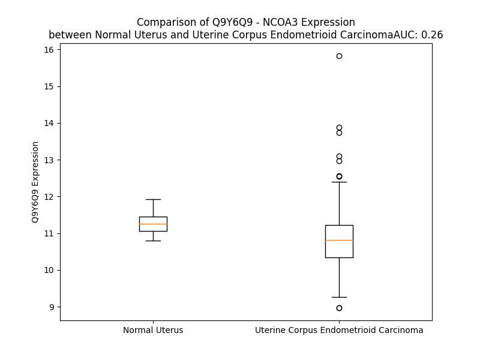

# Detailed Data for Q9Y6Q9

## Introduction to the Detailed Summary

### How to Interpret the Results

- **Summary & Metrics**: This section provides a quick reference to essential protein attributes, including expression changes, family classification, and biomarker applications. Regulation status (upregulated/downregulated) indicates the protein's behavior in a disease context. Some information comes from the original excel file with the proteins selected from literature, while others are derived from the analyses.
- **Expression Comparison**: A visual representation comparing protein expression between normal and disease states. It highlights significant changes in expression levels that might indicate diagnostic or therapeutic relevance. This is data coming from transcriptomics experiments and could not translate similarly to protein levels.
- **Isoform Alignment**: An interactive view of isoform alignments, revealing structural and functional differences between variants of the protein.
- **Interactors & Homologs**: Tables listing known interaction partners and homologous proteins, the more interactors and homologs, the more complex the protein is to design an antibody for.
- **Biological Assemblies**: Information about the structural arrangement of the protein in different assemblies, providing insights into its functional state but also the complexity of the protein to develop antibodies.
- **Combined Per-Residue Information**: A detailed table summarizing residue-level data. This includes predictions for epitope regions, aggregation tendencies, and modifications that might impact the protein's function. Each row corresponds to a residue in the protein, providing insights into specific sites that may be important for research or drug development.
## Summary & Metrics

- **UniProt Accession**: Q9Y6Q9
- **Gene Name**: AIB1
- **Protein Name**: Nuclear receptor coactivator 3
- **Swiss Prot**: NCOA3_HUMAN
- **Family**: transcription regulator
- **Biomarker Application**: efficacy,prognosis
- **Number of Isoforms**: 5
- **Regulation**: 2
- **(transcriptomics) AUC**: 0.14
- **(transcriptomics) Fold Change**: 1.06
- **(transcriptomics) Regulation**: Downregulated
- **Discotope Epitope Count**: 260
- **Max n_uniprots (Homo)**: N/A
- **Max n_uniprots (Hetero)**: 3

## Expression Comparison

## Isoform Alignment

<pre style='font-size:14px; font-family:monospace;'>Q9Y6Q9-1 MSGLGENLDPLASDSRKRKLPCDTPGQGLTCSGEKRRREQESKYIEELAELISANLSDIDNFNVKPDKCAILKETVRQIRQIKEQGKTISNDDDVQKADVSSTGQGVIDKDSLGPLLLQALDGFLFVVNRDGNIVFVSENVTQYLQYKQEDLVNTSVYNILHEEDRKDFLKNLPKSTVNGVSWTNETQRQKSHTFNCRMLMKTPHDILEDINASPEMRQRYETMQCFALSQPRAMMEEGEDLQSCMICVARRITTGERTFPSNPESFITRHDLSGKVVNIDTNSLRSSMRPGFEDIIRRCIQRFFSLNDGQSWSQKRHYQE----------AYLNGHAETPVYRFSLADGTIVTAQTKSKLFRNPVTNDRHGFVSTHFLQREQNGYRPNPNPVGQGIRPPMAGCNSSVGGMSMSPNQGLQMPSSRAYGLADPSTTGQMSGARYGGSSNIASLTPGPGMQSPSSYQNNNYGLNMSSPPHGSPGLAPNQQNIMISPRNRGSPKIASHQFSPVAGVHSPMASSGNTGNHSFSSSSLSALQAISEGVGTSLLSTLSSPGPKLDNSPNMNITQPSKVSNQDSKSPLGFYCDQNPVESSMCQSNSRDHLSDKESKESSVEGAENQRGPLESKGHKKLLQLLTCSSDDRGHSSLTNSPLDSSCKESSVSVTSPSGVSSSTSGGVSSTSNMHGSLLQEKHRILHKLLQNGNSPAEVAKITAEATGKDTSSITSCGDGNVVKQEQLSPKKKENNALLRYLLDRDDPSDALSKELQPQVEGVDNKMSQCTSSTIPSSSQEKDPKIKTETSEEGSGDLDNLDAILGDLTSSDFYNNSISSNGSHLGTKQQVFQGTNSLGLKSSQSVQSIRPPYNRAVSLDSPVSVGSSPPVKNISAFPMLPKQPMLGGNPRMMDSQENYGSSMGGPNRNVTVTQTPSSGDWGLPNSKAGRMEPMNSNSMGRPGGDYNTSLPRPALGGSIPTLPLRSNSIPGARPVLQQQQQMLQMRPGEIPMGMGANPYGQAAASNQLGSWPDGMLSMEQVSHGTQNRPLLRNSLDDLVGPPSNLEGQSDERALLDQLHTLLSNTDATGLEEIDRALGIPELVNQGQALEPKQDAFQGQEAAVMMDQKAGLYGQTYPAQGPPMQGGFHLQGQSPSFNSMMNQMNQQGNFPLQGMHPRANIMRPRTNTPKQLRMQLQQRLQGQQFLNQSRQALELKMENPTAGGAAVMRPMMQPQVSSQQGFLNAQMVAQRSRELLSHHFRQQRVAMMMQQQQQQQQQQQQQQQQQQQQQQQQQQQQQTQAFSPPPNVTASPSMDGLLAGPTMPQAPPQQFPYQPNYGMGQQPDPAFGRVSSPPNAMMSSRMGPSQNPMMQHPQAASIYQSSEMKGWPSGNLARNSSFSQQQFAHQGNPAVYSMVHMNGSSGHMGQMNMNPMPMSGMPMGPDQKYC
Q9Y6Q9-2 MSGLGENLDPLASDSRKRKLPCDTPGQGLTCSGEKRRREQESKYIEELAELISANLSDIDNFNVKPDKCAILKETVRQIRQIKEQGKTISNDDDVQKADVSSTGQGVIDKDSLGPLLLQALDGFLFVVNRDGNIVFVSENVTQYLQYKQEDLVNTSVYNILHEEDRKDFLKNLPKSTVNGVSWTNETQRQKSHTFNCRMLMKTPHDILEDINASPEMRQRYETMQCFALSQPRAMMEEGEDLQSCMICVARRITTGERTFPSNPESFITRHDLSGKVVNIDTNSLRSSMRPGFEDIIRRCIQRFFSLNDGQSWSQKRHYQE----------AYLNGHAETPVYRFSLADGTIVTAQTKSKLFRNPVTNDRHGFVSTHFLQREQNGYRPNPNPVGQGIRPPMAGCNSSVGGMSMSPNQGLQMPSSRAYGLADPSTTGQMSGARYGGSSNIASLTPGPGMQSPSSYQNNNYGLNMSSPPHGSPGLAPNQQNIMISPRNRGSPKIASHQFSPVAGVHSPMASSGNTGNHSFSSSSLSALQAISEGVGTSLLSTLSSPGPKLDNSPNMNITQPSKVSNQDSKSPLGFYCDQNPVESSMCQSNSRDHLSDKESKESSVEGAENQRGPLESKGHKKLLQLLTCSSDDRGHSSLTNSPLDSSCKESSVSVTSPSGVSSSTSGGVSSTSNMHGSLLQEKHRILHKLLQNGNSPAEVAKITAEATGKDTSSITSCGDGNVVKQEQLSPKKKENNALLRYLLDRDDPSDALSKELQPQVEGVDNKMSQCTSSTIPSSSQEKDPKIKTETSEEGSGDLDNLDAILGDLTSSDFYNNSISSNGSHLGTKQQVFQGTNSLGLKSSQSVQSIRPPYNRAVSLDSPVSVGSSPPVKNISAFPMLPKQPMLGGNPRMMDSQENYGSSM---------------GDWGLPNSKAGRMEPMNSNSMGRPGGDYNTSLPRPALGGSIPTLPLRSNSIPGARPVLQQQQQMLQMRPGEIPMGMGANPYGQAAASNQLGSWPDGMLSMEQVSHGTQNRPLLRNSLDDLVGPPSNLEGQSDERALLDQLHTLLSNTDATGLEEIDRALGIPELVNQGQALEPKQDAFQGQEAAVMMDQKAGLYGQTYPAQGPPMQGGFHLQGQSPSFNSMMNQMNQQGNFPLQGMHPRANIMRPRTNTPKQLRMQLQQRLQGQQFLNQSRQALELKMENPTAGGAAVMRPMMQPQVSSQQGFLNAQMVAQRSRELLSHHFRQQRVAMMMQQQQQQQQQQQQQQQQQQQQQQQQQQQQQTQAFSPPPNVTASPSMDGLLAGPTMPQAPPQQFPYQPNYGMGQQPDPAFGRVSSPPNAMMSSRMGPSQNPMMQHPQAASIYQSSEMKGWPSGNLARNSSFSQQQFAHQGNPAVYSMVHMNGSSGHMGQMNMNPMPMSGMPMGPDQKYC
Q9Y6Q9-3 MSGLGENLDPLASDSRKRKLPCDTPGQGLTCSGEKRRREQESKYIEELAELISANLSDIDNFNVKPDKCAILKETVRQIRQIKEQGKTISNDDDVQKADVSSTGQGVIDKDSLGPLLLQALDGFLFVVNRDGNIVFVSENVTQYLQYKQEDLVNTSVYNILHEEDRKDFLKNLPKSTVNGVSWTNETQRQKSHTFNCRMLMKTPHDILEDINASPEMRQRYETMQCFALSQPRAMMEEGEDLQSCMICVARRITTGERTFPSNPESFITRHDLSGKVVNIDTNSLRSSMRPGFEDIIRRCIQRFFSLNDGQSWSQKRHYQEVTSDGIFSPTAYLNGHAETPVYRFSLADGTIVTAQTKSKLFRNPVTNDRHGFVSTHFLQREQNGYRPNPNPVGQGIRPPMAGCNSSVGGMSMSPNQGLQMPSSRAYGLADPSTTGQMSGARYGGSSNIASLTPGPGMQSPSSYQNNNYGLNMSSPPHGSPGLAPNQQNIMISPRNRGSPKIASHQFSPVAGVHSPMASSGNTGNHSFSSSSLSALQAISEGVGTSLLSTLSSPGPKLDNSPNMNITQPSKVSNQDSKSPLGFYCDQNPVESSMCQSNSRDHLSDKESKESSVEGAENQRGPLESKGHKKLLQLLTCSSDDRGHSSLTNSPLDSSCKESSVSVTSPSGVSSSTSGGVSSTSNMHGSLLQEKHRILHKLLQNGNSPAEVAKITAEATGKDTSSITSCGDGNVVKQEQLSPKKKENNALLRYLLDRDDPSDALSKELQPQVEGVDNKMSQCTSSTIPSSSQEKDPKIKTETSEEGSGDLDNLDAILGDLTSSDFYNNSISSNGSHLGTKQQVFQGTNSLGLKSSQSVQSIRPPYNRAVSLDSPVSVGSSPPVKNISAFPMLPKQPMLGGNPRMMDSQENYGSSM---------------GDWGLPNSKAGRMEPMNSNSMGRPGGDYNTSLPRPALGGSIPTLPLRSNSIPGARPVLQQQQQMLQMRPGEIPMGMGANPYGQAAASNQLGSWPDGMLSMEQVSHGTQNRPLLRNSLDDLVGPPSNLEGQSDERALLDQLHTLLSNTDATGLEEIDRALGIPELVNQGQALEPKQDAFQGQEAAVMMDQKAGLYGQTYPAQGPPMQGGFHLQGQSPSFNSMMNQMNQQGNFPLQGMHPRANIMRPRTNTPKQLRMQLQQRLQGQQFLNQSRQALELKMENPTAGGAAVMRPMMQP----QQGFLNAQMVAQRSRELLSHHFRQQRVAMMMQQQQQQQQQQQQQQQQQQQQQQQQQQQQQTQAFSPPPNVTASPSMDGLLAGPTMPQAPPQQFPYQPNYGMGQQPDPAFGRVSSPPNAMMSSRMGPSQNPMMQHPQAASIYQSSEMKGWPSGNLARNSSFSQQQFAHQGNPAVYSMVHMNGSSGHMGQMNMNPMPMSGMPMGPDQKYC
Q9Y6Q9-4 MSGLGENLDPLASDSRKRKLPCDTPGQGLTCSGEKRRREQESKYIEELAELISANLSDIDNFNVKPDKCAILKETVRQIRQIKEQGKTISNDDDVQKADVSSTGQGVIDKDSLGPLLLQALDGFLFVVNRDGNIVFVSENVTQYLQYKQEDLVNTSVYNILHEEDRKDFLKNLPKSTVNGVSWTNETQRQKSHTFNCRMLMKTPHDILEDINASPEMRQRYETMQCFALSQPRAMMEEGEDLQSCMICVARRITTGERTFPSNPESFITRHDLSGKVVNIDTNSLRSSMRPGFEDIIRRCIQRFFSLNDGQSWSQKRHYQEVTSDGIFSPTAYLNGHAETPVYRFSLADGTIVTAQTKSKLFRNPVTNDRHGFVSTHFLQREQNGYRPNPNPVGQGIRPPMAGCNSSVGGMSMSPNQGLQMPSSRAYGLADPSTTGQMSGARYGGSSNIASLTPGPGMQSPSSYQNNNYGLNMSSPPHGSPGLAPNQQNIMISPRNRGSPKIASHQFSPVAGVHSPMASSGNTGNHSFSSSSLSALQAISEGVGTSLLSTLSSPGPKLDNSPNMNITQPSKVSNQDSKSPLGFYCDQNPVESSMCQSNSRDHLSDKESKESSVEGAENQRGPLESKGHKKLLQLLTCSSDDRGHSSLTNSPLDSSCKESSVSVTSPSGVSSSTSGGVSSTSNMHGSLLQEKHRILHKLLQNGNSPAEVAKITAEATGKDTSSITSCGDGNVVKQEQLSPKKKENNALLRYLLDRDDPSDALSKELQPQVEGVDNKMSQCTSSTIPSSSQEKDPKIKTETSEEGSGDLDNLDAILGDLTSSDFYNNSISSNGSHLGTKQQVFQGTNS-----------------------------------------------------------------M---------------GDWGLPNSKAGRMEPMNSNSMGRPGGDYNTSLPRPALGGSIPTLPLRSNSIPGARPVLQQQQQMLQMRPGEIPMGMGANPYGQAAASNQLGSWPDGMLSMEQVSHGTQNRPLLRNSLDDLVGPPSNLEGQSDERALLDQLHTLLSNTDATGLEEIDRALGIPELVNQGQALEPKQDAFQGQEAAVMMDQKAGLYGQTYPAQGPPMQGGFHLQGQSPSFNSMMNQMNQQGNFPLQGMHPRANIMRPRTNTPKQLRMQLQQRLQGQQFLNQSRQALELKMENPTAGGAAVMRPMMQP----QQGFLNAQMVAQRSRELLSHHFRQQRVAMMMQQQQQQQQQQQQQQQQQQQQQQQQQQQQQTQAFSPPPNVTASPSMDGLLAGPTMPQAPPQQFPYQPNYGMGQQPDPAFGRVSSPPNAMMSSRMGPSQNPMMQHPQAASIYQSSEMKGWPSGNLARNSSFSQQQFAHQGNPAVYSMVHMNGSSGHMGQMNMNPMPMSGMPMGPDQKYC
Q9Y6Q9-5 MSGLGENLDPLASDSRKRKLPCDTPGQGLTCSGEKRRREQESKYIEELAELISANLSDIDNFNVKPDKCAILKETVRQIRQIKEQGKTISNDDDVQKADVSSTGQGVIDKDSLGPLLLQALDGFLFVVNRDGNIVFVSENVTQYLQYKQEDLVNTSVYNILHEEDRKDFLKNLPKSTVNGVSWTNETQRQKSHTFNCRMLMKTPHDILEDINASPEMRQRYETMQCFALSQPRAMMEEGEDLQSCMICVARRITTGERTFPSNPESFITRHDLSGKVVNIDTNSLRSSMRPGFEDIIRRCIQRFFSLNDGQSWSQKRHYQE----------AYLNGHAETPVYRFSLADGTIVTAQTKSKLFRNPVTNDRHGFVSTHFLQREQNGYRPNPNPVGQGIRPPMAGCNSSVGGMSMSPNQGLQMPSSRAYGLADPSTTGQMSGARYGGSSNIASLTPGPGMQSPSSYQNNNYGLNMSSPPHGSPGLAPNQQNIMISPRNRGSPKIASHQFSPVAGVHSPMASSGNTGNHSFSSSSLSALQAISEGVGTSLLSTLSSPGPKLDNSPNMNITQPSKVSNQDSKSPLGFYCDQNPVESSMCQSNSRDHLSDKESKESSVEGAENQRGPLESKGHKKLLQLLTCSSDDRGHSSLTNSPLDSSCKESSVSVTSPSGVSSSTSGGVSSTSNMHGSLLQEKHRILHKLLQNGNSPAEVAKITAEATGKDTSSITSCGDGNVVKQEQLSPKKKENNALLRYLLDRDDPSDALSKELQPQVEGVDNKMSQCTSSTIPSSSQEKDPKIKTETSEEGSGDLDNLDAILGDLTSSDFYNNSISSNGSHLGTKQQVFQGTNSLGLKSSQSVQSIRPPYNRAVSLDSPVSVGSSPPVKNISAFPMLPKQPMLGGNPRMMDSQENYGSSMGGPNRNVTVTQTPSSGDWGLPNSKAGRMEPMNSNSMGRPGGDYNTSLPRPALGGSIPTLPLRSNSIPGARPVLQQQQQMLQMRPGEIPMGMGANPYGQAAASNQLGSWPDGMLSMEQVSHGTQNRPLLRNSLDDLVGPPSNLEGQSDERALLDQLHTLLSNTDATGLEEIDRALGIPELVNQGQALEPKQDAFQGQEAAVMMDQKAGLYGQTYPAQGPPMQGGFHLQGQSPSFNSMMNQMNQQGNFPLQGMHPRANIMRPRTNTPKQLRMQLQQRLQGQQFLNQSRQALELKMENPTAGGAAVMRPMMQP----QQGFLNAQMVAQRSRELLSHHFRQQRVAMMMQQQQQQQQQQQQQQQQQQQQQQQQQQQQQTQAFSPPPNVTASPSMDGLLAGPTMPQAPPQQFPYQPNYGMGQQPDPAFGRVSSPPNAMMSSRMGPSQNPMMQHPQAASIYQSSEMKGWPSGNLARNSSFSQQQFAHQGNPAVYSMVHMNGSSGHMGQMNMNPMPMSGMPMGPDQKYC
</pre>

## Interactors

| preferredName_A   | preferredName_B   |   score |
|:------------------|:------------------|--------:|
| NCOA3             | CREBBP            |   0.999 |
| NCOA3             | EP300             |   0.999 |
| NCOA3             | ESR1              |   0.999 |
| NCOA3             | CARM1             |   0.997 |
| NCOA3             | NCOA2             |   0.997 |
| NCOA3             | ESR2              |   0.997 |
| NCOA3             | AR                |   0.997 |
| NCOA3             | NCOA1             |   0.994 |
| NCOA3             | RXRA              |   0.988 |
| NCOA3             | PGR               |   0.986 |
| NCOA3             | KAT2B             |   0.986 |
| NCOA3             | SRC               |   0.975 |
| NCOA3             | MED1              |   0.974 |
| NCOA3             | FOS               |   0.97  |
| NCOA3             | MAPK8             |   0.965 |
| NCOA3             | ETV4              |   0.963 |
| NCOA3             | MAPK14            |   0.955 |
| NCOA3             | RARA              |   0.948 |
| NCOA3             | MAPK9             |   0.946 |
| NCOA3             | PSME3             |   0.941 |
| NCOA3             | JUN               |   0.938 |
| NCOA3             | THRB              |   0.938 |
| NCOA3             | HEATR6            |   0.936 |
| NCOA3             | SP1               |   0.931 |
| NCOA3             | RPS6KB1           |   0.931 |
| NCOA3             | NCOR1             |   0.928 |
| NCOA3             | PRMT1             |   0.924 |
| NCOA3             | PRKACA            |   0.919 |
| NCOA3             | PRKACG            |   0.919 |
| NCOA3             | PRKACB            |   0.919 |
| NCOA3             | NCOR2             |   0.917 |
| NCOA3             | ZNF217            |   0.917 |
| NCOA3             | RPS6KB2           |   0.913 |
| NCOA3             | MAPK12            |   0.913 |
| NCOA3             | MAPK13            |   0.911 |
| NCOA3             | PPARG             |   0.909 |
| NCOA3             | MAPK11            |   0.906 |
| NCOA3             | THRA              |   0.906 |
| NCOA3             | NR3C1             |   0.903 |

## Homologs

| uniprot_id   | gene_id   |
|:-------------|:----------|
| Q15596       | NCOA2     |
| Q15788       | NCOA1     |

## Biological Assemblies

|   Unnamed: 0 |   assembly |   n_uniprots | composition   | crystal_id   |
|-------------:|-----------:|-------------:|:--------------|:-------------|
|            0 |          1 |            3 | Hetero        | 6sqc         |
|            0 |          1 |            2 | Hetero        | 3l3z         |
|            0 |          1 |            2 | Hetero        | 1kbh         |
|            0 |          1 |            2 | Hetero        | 3l3x         |
|            0 |          1 |            2 | Hetero        | 6es7         |

## Combined Per-Residue Information

|   res | aa   |   epitope_score | epitope   |   relative_surface_accessibility |   modeling_confidence |   Aggregation | modification                |
|------:|:-----|----------------:|:----------|---------------------------------:|----------------------:|--------------:|:----------------------------|
|     1 | M    |         0.06557 | False     |                          1.26987 |                 44.76 |         0     | N/A                         |
|     2 | S    |         0.06271 | False     |                          0.97742 |                 52.16 |         0     | N-acetylserine              |
|     3 | G    |         0.06606 | False     |                          0.76326 |                 41.23 |         0     | N/A                         |
|     4 | L    |         0.09836 | True      |                          1.1604  |                 39.66 |         0     | N/A                         |
|     5 | G    |         0.09511 | True      |                          0.70149 |                 40.48 |         0     | N/A                         |
|     6 | E    |         0.06979 | False     |                          0.80108 |                 41.72 |         0     | N/A                         |
|     7 | N    |         0.08039 | False     |                          0.84846 |                 38.47 |         0     | N/A                         |
|     8 | L    |         0.07216 | False     |                          0.96345 |                 41.13 |         0     | N/A                         |
|     9 | D    |         0.05643 | False     |                          0.7704  |                 42.84 |         0     | N/A                         |
|    10 | P    |         0.08355 | True      |                          0.73112 |                 40.01 |         0     | N/A                         |
|    11 | L    |         0.10104 | True      |                          1.00527 |                 31.13 |         0     | N/A                         |
|    12 | A    |         0.1157  | True      |                          0.95636 |                 33.06 |         0     | N/A                         |
|    13 | S    |         0.07055 | False     |                          0.7896  |                 38.8  |         0     | N/A                         |
|    14 | D    |         0.12273 | True      |                          0.70611 |                 33.7  |         0     | N/A                         |
|    15 | S    |         0.05743 | False     |                          0.66827 |                 42.32 |         0     | N/A                         |
|    16 | R    |         0.13776 | True      |                          0.81418 |                 40.1  |         0     | N/A                         |
|    17 | K    |         0.0972  | True      |                          1.05715 |                 51.62 |         0     | N/A                         |
|    18 | R    |         0.12943 | True      |                          0.92004 |                 40.81 |         0     | N/A                         |
|    19 | K    |         0.09843 | True      |                          0.89014 |                 44.94 |         0     | N/A                         |
|    20 | L    |         0.10488 | True      |                          0.93456 |                 43.55 |         0     | N/A                         |
|    21 | P    |         0.06954 | False     |                          0.8583  |                 38.49 |         0     | N/A                         |
|    22 | C    |         0.07951 | False     |                          0.82626 |                 36.86 |         0     | N/A                         |
|    23 | D    |         0.09978 | True      |                          0.85296 |                 34.15 |         0     | N/A                         |
|    24 | T    |         0.06078 | False     |                          0.77664 |                 42.81 |         0     | N/A                         |
|    25 | P    |         0.1179  | True      |                          1.08052 |                 39.68 |         0     | N/A                         |
|    26 | G    |         0.07013 | False     |                          0.69952 |                 42.76 |         0     | N/A                         |
|    27 | Q    |         0.06035 | False     |                          0.80887 |                 46.43 |         0     | N/A                         |
|    28 | G    |         0.10567 | True      |                          0.74281 |                 43.92 |         0     | N/A                         |
|    29 | L    |         0.11751 | True      |                          0.96112 |                 51.75 |         0     | N/A                         |
|    30 | T    |         0.11954 | True      |                          0.77969 |                 54.43 |         0     | N/A                         |
|    31 | C    |         0.06052 | False     |                          0.64262 |                 55.41 |         0     | N/A                         |
|    32 | S    |         0.1027  | True      |                          0.51521 |                 65.66 |         0     | N/A                         |
|    33 | G    |         0.07552 | False     |                          0.52169 |                 81.01 |         0     | N/A                         |
|    34 | E    |         0.06017 | False     |                          0.353   |                 85.5  |         0     | N/A                         |
|    35 | K    |         0.04582 | False     |                          0.60027 |                 85.71 |         0     | N/A                         |
|    36 | R    |         0.06309 | False     |                          0.57184 |                 85.82 |         0     | N/A                         |
|    37 | R    |         0.09849 | True      |                          0.70058 |                 90.68 |         0     | N/A                         |
|    38 | R    |         0.1269  | True      |                          0.53949 |                 89.69 |         0     | N/A                         |
|    39 | E    |         0.05786 | False     |                          0.46603 |                 88.6  |         0     | N/A                         |
|    40 | Q    |         0.03017 | False     |                          0.37662 |                 90.82 |         0     | N/A                         |
|    41 | E    |         0.06851 | False     |                          0.41183 |                 91.06 |         0     | N/A                         |
|    42 | S    |         0.07102 | False     |                          0.26749 |                 89.36 |         0     | N/A                         |
|    43 | K    |         0.04412 | False     |                          0.5701  |                 90.37 |         0     | N/A                         |
|    44 | Y    |         0.07749 | False     |                          0.56953 |                 93.5  |         0     | N/A                         |
|    45 | I    |         0.0279  | False     |                          0.0856  |                 90.97 |         0     | N/A                         |
|    46 | E    |         0.05111 | False     |                          0.39944 |                 87.65 |         0     | N/A                         |
|    47 | E    |         0.02456 | False     |                          0.30678 |                 89    |         0     | N/A                         |
|    48 | L    |         0.0342  | False     |                          0.30831 |                 89.12 |         0     | N/A                         |
|    49 | A    |         0.03626 | False     |                          0.19185 |                 86.62 |         0     | N/A                         |
|    50 | E    |         0.05249 | False     |                          0.63012 |                 85.16 |         0     | N/A                         |
|    51 | L    |         0.03467 | False     |                          0.47532 |                 85.19 |         0     | N/A                         |
|    52 | I    |         0.02332 | False     |                          0.032   |                 82.19 |         0     | N/A                         |
|    53 | S    |         0.05591 | False     |                          0.37725 |                 74.49 |         0     | N/A                         |
|    54 | A    |         0.06382 | False     |                          0.74884 |                 66.85 |         0     | N/A                         |
|    55 | N    |         0.11067 | True      |                          0.70448 |                 59.78 |         0     | N/A                         |
|    56 | L    |         0.12599 | True      |                          0.32876 |                 61.84 |         0     | N/A                         |
|    57 | S    |         0.09278 | True      |                          0.85536 |                 56.78 |         0     | N/A                         |
|    58 | D    |         0.12351 | True      |                          0.5267  |                 54.3  |         0     | N/A                         |
|    59 | I    |         0.16969 | True      |                          0.78096 |                 57.28 |         0     | N/A                         |
|    60 | D    |         0.15558 | True      |                          0.8176  |                 56.56 |         0     | N/A                         |
|    61 | N    |         0.14361 | True      |                          0.82209 |                 58.43 |         0     | N/A                         |
|    62 | F    |         0.0631  | False     |                          0.30403 |                 59.22 |         0     | N/A                         |
|    63 | N    |         0.12988 | True      |                          0.87757 |                 56.72 |         0     | N/A                         |
|    64 | V    |         0.15268 | True      |                          0.91606 |                 61.82 |         0     | N/A                         |
|    65 | K    |         0.23542 | True      |                          0.81876 |                 59.14 |         0     | N/A                         |
|    66 | P    |         0.04276 | False     |                          0.26149 |                 65.56 |         0     | N/A                         |
|    67 | D    |         0.11579 | True      |                          0.65765 |                 78.76 |         0     | N/A                         |
|    68 | K    |         0.04992 | False     |                          0.41186 |                 85.32 |         0     | N/A                         |
|    69 | C    |         0.04897 | False     |                          0.5222  |                 86.59 |         0     | N/A                         |
|    70 | A    |         0.05513 | False     |                          0.39635 |                 86.74 |         0     | N/A                         |
|    71 | I    |         0.0268  | False     |                          0.0392  |                 87.85 |         0     | N/A                         |
|    72 | L    |         0.09303 | True      |                          0.51275 |                 91.24 |         0     | N/A                         |
|    73 | K    |         0.07481 | False     |                          0.68702 |                 87.48 |         0     | N/A                         |
|    74 | E    |         0.03291 | False     |                          0.14386 |                 86.13 |         0     | N/A                         |
|    75 | T    |         0.02811 | False     |                          0.14948 |                 89.78 |         0     | N/A                         |
|    76 | V    |         0.04265 | False     |                          0.70163 |                 90.78 |         0     | N/A                         |
|    77 | R    |         0.13194 | True      |                          0.44533 |                 88.01 |         0     | N/A                         |
|    78 | Q    |         0.02251 | False     |                          0.1237  |                 84.13 |         0     | N/A                         |
|    79 | I    |         0.01883 | False     |                          0.61691 |                 86.27 |         0     | N/A                         |
|    80 | R    |         0.04827 | False     |                          0.64695 |                 86.74 |         0     | N/A                         |
|    81 | Q    |         0.04571 | False     |                          0.37299 |                 81.34 |         0     | N/A                         |
|    82 | I    |         0.05849 | False     |                          0.71611 |                 77.12 |         0     | N/A                         |
|    83 | K    |         0.02978 | False     |                          0.737   |                 77.45 |         0     | N/A                         |
|    84 | E    |         0.05467 | False     |                          0.47852 |                 73.97 |         0     | N/A                         |
|    85 | Q    |         0.03833 | False     |                          0.42181 |                 61.32 |         0     | N/A                         |
|    86 | G    |         0.03245 | False     |                          0.60959 |                 55.99 |         0     | N/A                         |
|    87 | K    |         0.05147 | False     |                          0.72238 |                 46.72 |         0     | N/A                         |
|    88 | T    |         0.059   | False     |                          0.60727 |                 45.87 |         0     | N/A                         |
|    89 | I    |         0.06761 | False     |                          0.84952 |                 49.01 |         0     | N/A                         |
|    90 | S    |         0.04912 | False     |                          0.61604 |                 45.42 |         0     | N/A                         |
|    91 | N    |         0.07769 | False     |                          0.60758 |                 39.46 |         0     | N/A                         |
|    92 | D    |         0.04848 | False     |                          0.39179 |                 43.15 |         0     | N/A                         |
|    93 | D    |         0.11391 | True      |                          0.68632 |                 42.54 |         0     | N/A                         |
|    94 | D    |         0.10817 | True      |                          0.85813 |                 48.39 |         0     | N/A                         |
|    95 | V    |         0.05172 | False     |                          0.67642 |                 45.52 |         0     | N/A                         |
|    96 | Q    |         0.06475 | False     |                          0.78985 |                 43.54 |         0     | N/A                         |
|    97 | K    |         0.05028 | False     |                          0.94213 |                 44.74 |         0     | N/A                         |
|    98 | A    |         0.03022 | False     |                          0.43333 |                 37.57 |         0     | N/A                         |
|    99 | D    |         0.04451 | False     |                          0.65009 |                 38.58 |         0     | N/A                         |
|   100 | V    |         0.04673 | False     |                          0.92223 |                 49.63 |         0     | N/A                         |
|   101 | S    |         0.05874 | False     |                          0.8299  |                 38.29 |         0     | N/A                         |
|   102 | S    |         0.0458  | False     |                          0.68773 |                 42.65 |         0     | N/A                         |
|   103 | T    |         0.0383  | False     |                          0.68752 |                 45.86 |         0     | N/A                         |
|   104 | G    |         0.03412 | False     |                          0.6945  |                 45    |         0     | N/A                         |
|   105 | Q    |         0.05496 | False     |                          0.92563 |                 45.69 |         0     | N/A                         |
|   106 | G    |         0.08733 | True      |                          0.9164  |                 55.98 |         0     | N/A                         |
|   107 | V    |         0.05414 | False     |                          1.02015 |                 61.84 |         0     | N/A                         |
|   108 | I    |         0.06433 | False     |                          0.50277 |                 65.54 |         0     | N/A                         |
|   109 | D    |         0.08615 | True      |                          0.6638  |                 77.63 |         0     | N/A                         |
|   110 | K    |         0.09752 | True      |                          0.57806 |                 70.54 |         0     | N/A                         |
|   111 | D    |         0.08361 | True      |                          0.75243 |                 77.6  |         0     | N/A                         |
|   112 | S    |         0.06007 | False     |                          0.38597 |                 80.86 |         0     | N/A                         |
|   113 | L    |         0.03487 | False     |                          0.31902 |                 80.6  |         0     | N/A                         |
|   114 | G    |         0.04539 | False     |                          0.40917 |                 83.88 |         0     | N/A                         |
|   115 | P    |         0.08564 | True      |                          0.63859 |                 85.59 |         0     | N/A                         |
|   116 | L    |         0.04496 | False     |                          0.51171 |                 84.44 |         0.036 | N/A                         |
|   117 | L    |         0.03965 | False     |                          0.57705 |                 87    |         0.036 | N/A                         |
|   118 | L    |         0.01595 | False     |                          0.12777 |                 89.17 |         0.036 | N/A                         |
|   119 | Q    |         0.066   | False     |                          0.70467 |                 86.34 |         0.036 | N/A                         |
|   120 | A    |         0.02697 | False     |                          0.83133 |                 86.41 |         0.036 | N/A                         |
|   121 | L    |         0.03227 | False     |                          0.45162 |                 87.38 |         0.036 | N/A                         |
|   122 | D    |         0.03714 | False     |                          0.31383 |                 89.43 |         0.001 | N/A                         |
|   123 | G    |         0.00189 | False     |                          0       |                 92.44 |         8.275 | N/A                         |
|   124 | F    |         0.00304 | False     |                          0.0121  |                 95.18 |        99.216 | N/A                         |
|   125 | L    |         0.03171 | False     |                          0.29594 |                 94.76 |        99.502 | N/A                         |
|   126 | F    |         0.00642 | False     |                          0.01508 |                 94.84 |        99.502 | N/A                         |
|   127 | V    |         0.0153  | False     |                          0.159   |                 93.79 |        99.502 | N/A                         |
|   128 | V    |         0.00185 | False     |                          0       |                 92.56 |        99.41  | N/A                         |
|   129 | N    |         0.02711 | False     |                          0.22459 |                 88.5  |         1.687 | N/A                         |
|   130 | R    |         0.0625  | False     |                          0.38738 |                 84.58 |         0.01  | N/A                         |
|   131 | D    |         0.04253 | False     |                          0.6186  |                 86.02 |         0.009 | N/A                         |
|   132 | G    |         0.00298 | False     |                          0       |                 88.85 |         3.152 | N/A                         |
|   133 | N    |         0.0445  | False     |                          0.4006  |                 92.5  |         7.024 | N/A                         |
|   134 | I    |         0.0117  | False     |                          0.01336 |                 94.07 |        36.994 | N/A                         |
|   135 | V    |         0.03514 | False     |                          0.36506 |                 92.36 |        36.994 | N/A                         |
|   136 | F    |         0.0514  | False     |                          0.25798 |                 94.12 |        36.994 | N/A                         |
|   137 | V    |         0.01366 | False     |                          0.00762 |                 94.53 |        36.455 | N/A                         |
|   138 | S    |         0.02981 | False     |                          0.10816 |                 93.23 |        30.685 | N/A                         |
|   139 | E    |         0.06948 | False     |                          0.70766 |                 91.89 |         0     | N/A                         |
|   140 | N    |         0.04278 | False     |                          0.19419 |                 92.55 |         0     | N/A                         |
|   141 | V    |         0.0032  | False     |                          0       |                 94.42 |         0     | N/A                         |
|   142 | T    |         0.04506 | False     |                          0.42033 |                 92.62 |         0     | N/A                         |
|   143 | Q    |         0.08136 | False     |                          0.70728 |                 90.15 |         0     | N/A                         |
|   144 | Y    |         0.01484 | False     |                          0.07622 |                 92.09 |         0     | N/A                         |
|   145 | L    |         0.00206 | False     |                          0       |                 93.47 |         0     | N/A                         |
|   146 | Q    |         0.05658 | False     |                          0.44889 |                 91.67 |         0     | N/A                         |
|   147 | Y    |         0.04121 | False     |                          0.15912 |                 93.99 |         0     | N/A                         |
|   148 | K    |         0.08931 | True      |                          0.53585 |                 93.65 |         0     | N/A                         |
|   149 | Q    |         0.03665 | False     |                          0.3083  |                 93.56 |         0     | N/A                         |
|   150 | E    |         0.08305 | True      |                          0.61898 |                 93.45 |         0     | N/A                         |
|   151 | D    |         0.05651 | False     |                          0.28427 |                 93.83 |         0     | N/A                         |
|   152 | L    |         0.00678 | False     |                          0.02061 |                 94.68 |         0     | N/A                         |
|   153 | V    |         0.05519 | False     |                          0.28521 |                 94.02 |         0     | N/A                         |
|   154 | N    |         0.09945 | True      |                          0.81597 |                 91.35 |         0     | N/A                         |
|   155 | T    |         0.05626 | False     |                          0.29816 |                 94.03 |         0.15  | N/A                         |
|   156 | S    |         0.0417  | False     |                          0.217   |                 93.77 |         0.529 | N/A                         |
|   157 | V    |         0.00097 | False     |                          0       |                 94.41 |         2.567 | N/A                         |
|   158 | Y    |         0.02457 | False     |                          0.225   |                 94.06 |         2.567 | N/A                         |
|   159 | N    |         0.07638 | False     |                          0.61534 |                 92.73 |         2.567 | N/A                         |
|   160 | I    |         0.01568 | False     |                          0.0448  |                 93.72 |         2.567 | N/A                         |
|   161 | L    |         0.00369 | False     |                          0.00183 |                 94.17 |         2.441 | N/A                         |
|   162 | H    |         0.04837 | False     |                          0.23268 |                 93.07 |         0     | N/A                         |
|   163 | E    |         0.06315 | False     |                          0.62439 |                 92.05 |         0     | N/A                         |
|   164 | E    |         0.06722 | False     |                          0.4874  |                 89.64 |         0     | N/A                         |
|   165 | D    |         0.03966 | False     |                          0.11728 |                 91.97 |         0     | N/A                         |
|   166 | R    |         0.08642 | True      |                          0.3072  |                 91.02 |         0     | N/A                         |
|   167 | K    |         0.0724  | False     |                          0.75431 |                 87.38 |         0     | N/A                         |
|   168 | D    |         0.04259 | False     |                          0.42473 |                 85.25 |         0     | N/A                         |
|   169 | F    |         0.00563 | False     |                          0.00599 |                 87.83 |         0     | N/A                         |
|   170 | L    |         0.09499 | True      |                          0.60409 |                 85.82 |         0     | N/A                         |
|   171 | K    |         0.08728 | True      |                          0.65275 |                 81.39 |         0     | N/A                         |
|   172 | N    |         0.03374 | False     |                          0.17863 |                 77.94 |         0     | N/A                         |
|   173 | L    |         0.03005 | False     |                          0.04617 |                 74    |         0     | N/A                         |
|   174 | P    |         0.04544 | False     |                          0.18124 |                 65.29 |         0     | N/A                         |
|   175 | K    |         0.08096 | False     |                          0.75638 |                 57.92 |         0     | N/A                         |
|   176 | S    |         0.05121 | False     |                          0.55372 |                 49.75 |         0     | N/A                         |
|   177 | T    |         0.06024 | False     |                          0.93203 |                 43.98 |         0     | N/A                         |
|   178 | V    |         0.08315 | True      |                          0.91895 |                 38.85 |         0     | N/A                         |
|   179 | N    |         0.07788 | False     |                          0.80205 |                 34.47 |         0     | N/A                         |
|   180 | G    |         0.12702 | True      |                          0.96039 |                 33.95 |         0     | N/A                         |
|   181 | V    |         0.0957  | True      |                          0.82786 |                 33.46 |         0     | N/A                         |
|   182 | S    |         0.1374  | True      |                          0.84493 |                 33.88 |         0     | N/A                         |
|   183 | W    |         0.16835 | True      |                          0.96459 |                 30.3  |         0     | N/A                         |
|   184 | T    |         0.11992 | True      |                          0.84241 |                 39.17 |         0     | N/A                         |
|   185 | N    |         0.14168 | True      |                          1.01816 |                 28.88 |         0     | N/A                         |
|   186 | E    |         0.12814 | True      |                          0.79053 |                 30.6  |         0     | N/A                         |
|   187 | T    |         0.10976 | True      |                          0.80982 |                 34.35 |         0     | N/A                         |
|   188 | Q    |         0.09341 | True      |                          0.93733 |                 39.24 |         0     | N/A                         |
|   189 | R    |         0.12012 | True      |                          0.49636 |                 44.38 |         0     | N/A                         |
|   190 | Q    |         0.0857  | True      |                          0.64273 |                 56.14 |         0     | N/A                         |
|   191 | K    |         0.06625 | False     |                          0.64277 |                 59.11 |         0     | N/A                         |
|   192 | S    |         0.05568 | False     |                          0.56805 |                 74.79 |         0     | N/A                         |
|   193 | H    |         0.05655 | False     |                          0.28135 |                 77.02 |         0     | N/A                         |
|   194 | T    |         0.04671 | False     |                          0.5828  |                 87.64 |         0     | N/A                         |
|   195 | F    |         0.0571  | False     |                          0.14122 |                 90.31 |         0     | N/A                         |
|   196 | N    |         0.05034 | False     |                          0.59282 |                 91.49 |         0     | N/A                         |
|   197 | C    |         0.00985 | False     |                          0.02804 |                 92.53 |         0     | N/A                         |
|   198 | R    |         0.11654 | True      |                          0.25679 |                 93.63 |         0     | N/A                         |
|   199 | M    |         0.00249 | False     |                          0.00144 |                 94.64 |         0     | N/A                         |
|   200 | L    |         0.03745 | False     |                          0.15992 |                 94.31 |         0     | N/A                         |
|   201 | M    |         0.0385  | False     |                          0.18564 |                 92.5  |         0     | N/A                         |
|   202 | K    |         0.08128 | False     |                          0.31442 |                 86.83 |         0     | N/A                         |
|   203 | T    |         0.04464 | False     |                          0.33409 |                 75.1  |         0     | N/A                         |
|   204 | P    |         0.16162 | True      |                          0.89146 |                 60.55 |         0     | N/A                         |
|   205 | H    |         0.1184  | True      |                          0.73796 |                 50.97 |         0     | N/A                         |
|   206 | D    |         0.14452 | True      |                          0.74196 |                 47.49 |         0     | N/A                         |
|   207 | I    |         0.11237 | True      |                          1.0284  |                 50.44 |         0     | N/A                         |
|   208 | L    |         0.09922 | True      |                          0.88207 |                 49.28 |         0     | N/A                         |
|   209 | E    |         0.17511 | True      |                          0.93924 |                 41.05 |         0     | N/A                         |
|   210 | D    |         0.12135 | True      |                          0.76055 |                 41.04 |         0     | N/A                         |
|   211 | I    |         0.14931 | True      |                          0.89509 |                 48.07 |         0     | N/A                         |
|   212 | N    |         0.1254  | True      |                          0.88896 |                 36.34 |         0     | N/A                         |
|   213 | A    |         0.12293 | True      |                          0.9656  |                 33.99 |         0     | N/A                         |
|   214 | S    |         0.09383 | True      |                          0.66487 |                 36.27 |         0     | Phosphoserine               |
|   215 | P    |         0.11129 | True      |                          1.05041 |                 40.08 |         0     | N/A                         |
|   216 | E    |         0.10468 | True      |                          0.62183 |                 41.27 |         0     | N/A                         |
|   217 | M    |         0.09404 | True      |                          0.6744  |                 48.13 |         0     | N/A                         |
|   218 | R    |         0.13705 | True      |                          0.80774 |                 57.8  |         0     | N/A                         |
|   219 | Q    |         0.1278  | True      |                          0.61809 |                 76.61 |         0     | N/A                         |
|   220 | R    |         0.17845 | True      |                          0.58835 |                 86.16 |         0     | N/A                         |
|   221 | Y    |         0.0682  | False     |                          0.28732 |                 90.61 |         0     | N/A                         |
|   222 | E    |         0.02865 | False     |                          0.12604 |                 90.85 |         0     | N/A                         |
|   223 | T    |         0.02093 | False     |                          0.18571 |                 91.76 |         0     | N/A                         |
|   224 | M    |         0.0023  | False     |                          0       |                 92.19 |         0     | N/A                         |
|   225 | Q    |         0.02218 | False     |                          0.26351 |                 93.08 |         0     | N/A                         |
|   226 | C    |         0.00273 | False     |                          0       |                 93.44 |         0     | N/A                         |
|   227 | F    |         0.03357 | False     |                          0.42681 |                 91.74 |         0     | N/A                         |
|   228 | A    |         0.00915 | False     |                          0.02763 |                 90.12 |         0     | N/A                         |
|   229 | L    |         0.0453  | False     |                          0.43443 |                 85.56 |         0     | N/A                         |
|   230 | S    |         0.03329 | False     |                          0.16493 |                 74.25 |         0     | N/A                         |
|   231 | Q    |         0.04578 | False     |                          0.29205 |                 59.43 |         0     | N/A                         |
|   232 | P    |         0.06951 | False     |                          0.70418 |                 51.53 |         0     | N/A                         |
|   233 | R    |         0.09676 | True      |                          0.91921 |                 48.83 |         0     | N/A                         |
|   234 | A    |         0.07176 | False     |                          0.65428 |                 47.27 |         0     | N/A                         |
|   235 | M    |         0.05027 | False     |                          0.56135 |                 45.82 |         0     | N/A                         |
|   236 | M    |         0.08172 | False     |                          1.01464 |                 42.51 |         0     | N/A                         |
|   237 | E    |         0.07296 | False     |                          0.8097  |                 49.49 |         0     | N/A                         |
|   238 | E    |         0.09705 | True      |                          0.93101 |                 38.66 |         0     | N/A                         |
|   239 | G    |         0.07109 | False     |                          0.72208 |                 41.79 |         0     | N/A                         |
|   240 | E    |         0.14908 | True      |                          0.8221  |                 52.02 |         0     | N/A                         |
|   241 | D    |         0.11578 | True      |                          0.7814  |                 50.7  |         0     | N/A                         |
|   242 | L    |         0.03821 | False     |                          0.44748 |                 54.81 |         0     | N/A                         |
|   243 | Q    |         0.05329 | False     |                          0.55207 |                 54.93 |         0     | N/A                         |
|   244 | S    |         0.0265  | False     |                          0.09974 |                 67.78 |         0     | N/A                         |
|   245 | C    |         0.01607 | False     |                          0.18749 |                 83.76 |         0     | N/A                         |
|   246 | M    |         0.00434 | False     |                          0.00614 |                 88.67 |         0.233 | N/A                         |
|   247 | I    |         0.01462 | False     |                          0.2603  |                 91.03 |         0.233 | N/A                         |
|   248 | C    |         0.00489 | False     |                          0.002   |                 92.52 |         0.233 | N/A                         |
|   249 | V    |         0.01288 | False     |                          0.21027 |                 94.26 |         0.233 | N/A                         |
|   250 | A    |         0.0013  | False     |                          0       |                 94.64 |         0.233 | N/A                         |
|   251 | R    |         0.02186 | False     |                          0.34485 |                 92.82 |         0     | N/A                         |
|   252 | R    |         0.05294 | False     |                          0.35813 |                 88.25 |         0     | N/A                         |
|   253 | I    |         0.03781 | False     |                          0.19686 |                 82.36 |         0     | N/A                         |
|   254 | T    |         0.05392 | False     |                          0.4482  |                 62.61 |         0     | N/A                         |
|   255 | T    |         0.07706 | False     |                          0.71823 |                 52.22 |         0     | N/A                         |
|   256 | G    |         0.07106 | False     |                          0.58314 |                 43.37 |         0     | N/A                         |
|   257 | E    |         0.04017 | False     |                          0.40161 |                 47.44 |         0     | N/A                         |
|   258 | R    |         0.06662 | False     |                          0.46178 |                 44.38 |         0     | N/A                         |
|   259 | T    |         0.05372 | False     |                          0.55953 |                 41.42 |         0     | N/A                         |
|   260 | F    |         0.03603 | False     |                          0.47312 |                 41.93 |         0     | N/A                         |
|   261 | P    |         0.07254 | False     |                          0.48163 |                 42.43 |         0     | N/A                         |
|   262 | S    |         0.05908 | False     |                          0.76176 |                 49.33 |         0     | N/A                         |
|   263 | N    |         0.1439  | True      |                          0.82189 |                 51.7  |         0     | N/A                         |
|   264 | P    |         0.06362 | False     |                          0.40485 |                 61.73 |         0     | N/A                         |
|   265 | E    |         0.02006 | False     |                          0.11699 |                 80.09 |         0     | N/A                         |
|   266 | S    |         0.01048 | False     |                          0.14063 |                 89.01 |         0     | N/A                         |
|   267 | F    |         0.00479 | False     |                          0.00686 |                 92.83 |         0     | N/A                         |
|   268 | I    |         0.02888 | False     |                          0.34216 |                 93.36 |         0     | N/A                         |
|   269 | T    |         0.00131 | False     |                          0       |                 94.14 |         0     | N/A                         |
|   270 | R    |         0.02662 | False     |                          0.43401 |                 93.68 |         0     | N/A                         |
|   271 | H    |         0.01177 | False     |                          0.03367 |                 92.88 |         0     | N/A                         |
|   272 | D    |         0.02131 | False     |                          0.27528 |                 92.18 |         0     | N/A                         |
|   273 | L    |         0.04537 | False     |                          0.53536 |                 90.64 |         0     | N/A                         |
|   274 | S    |         0.0347  | False     |                          0.65172 |                 88.67 |         0     | N/A                         |
|   275 | G    |         0.0113  | False     |                          0.04373 |                 86.19 |         0     | N/A                         |
|   276 | K    |         0.05809 | False     |                          0.67479 |                 90.46 |         0     | N/A                         |
|   277 | V    |         0.02635 | False     |                          0.22885 |                 91.82 |         0     | N/A                         |
|   278 | V    |         0.05926 | False     |                          0.69105 |                 92.24 |         0     | N/A                         |
|   279 | N    |         0.07231 | False     |                          0.49749 |                 92.1  |         0     | N/A                         |
|   280 | I    |         0.0633  | False     |                          0.07092 |                 92.91 |         0     | N/A                         |
|   281 | D    |         0.03544 | False     |                          0.3765  |                 90.03 |         0     | N/A                         |
|   282 | T    |         0.03319 | False     |                          0.15602 |                 84.1  |         0     | N/A                         |
|   283 | N    |         0.06071 | False     |                          0.62867 |                 81.79 |         0     | N/A                         |
|   284 | S    |         0.03769 | False     |                          0.47415 |                 79.14 |         0     | N/A                         |
|   285 | L    |         0.01475 | False     |                          0.01122 |                 80.09 |         0     | N/A                         |
|   286 | R    |         0.14865 | True      |                          0.46166 |                 78.56 |         0     | N/A                         |
|   287 | S    |         0.12306 | True      |                          0.66598 |                 70.94 |         0     | N/A                         |
|   288 | S    |         0.06656 | False     |                          0.37489 |                 67.87 |         0     | N/A                         |
|   289 | M    |         0.25817 | True      |                          0.91065 |                 56.6  |         0     | N/A                         |
|   290 | R    |         0.1912  | True      |                          0.45791 |                 67.31 |         0     | N/A                         |
|   291 | P    |         0.19937 | True      |                          0.88497 |                 70.14 |         0     | N/A                         |
|   292 | G    |         0.10332 | True      |                          0.50359 |                 78.42 |         0     | N/A                         |
|   293 | F    |         0.04548 | False     |                          0.22059 |                 85.68 |         0     | N/A                         |
|   294 | E    |         0.04535 | False     |                          0.31936 |                 90.06 |         0     | N/A                         |
|   295 | D    |         0.02806 | False     |                          0.21153 |                 90.31 |         0     | N/A                         |
|   296 | I    |         0.0037  | False     |                          0.0032  |                 90.92 |         0     | N/A                         |
|   297 | I    |         0.00281 | False     |                          0.0024  |                 92.29 |         0     | N/A                         |
|   298 | R    |         0.08598 | True      |                          0.28586 |                 92.15 |         0     | N/A                         |
|   299 | R    |         0.03321 | False     |                          0.28046 |                 91.79 |         0     | N/A                         |
|   300 | C    |         0.00106 | False     |                          0       |                 93.01 |         0     | N/A                         |
|   301 | I    |         0.00361 | False     |                          0.0032  |                 92.34 |         0     | N/A                         |
|   302 | Q    |         0.05029 | False     |                          0.512   |                 90.59 |         0     | N/A                         |
|   303 | R    |         0.05468 | False     |                          0.41531 |                 90.14 |         0     | N/A                         |
|   304 | F    |         0.00223 | False     |                          0       |                 90.45 |         0.581 | N/A                         |
|   305 | F    |         0.04229 | False     |                          0.40051 |                 86.8  |         0.581 | N/A                         |
|   306 | S    |         0.06397 | False     |                          0.46723 |                 73.28 |         0.581 | N/A                         |
|   307 | L    |         0.04469 | False     |                          0.189   |                 65.78 |         0.581 | N/A                         |
|   308 | N    |         0.0821  | False     |                          0.78594 |                 55.43 |         0.581 | N/A                         |
|   309 | D    |         0.12869 | True      |                          0.88193 |                 53.39 |         0     | N/A                         |
|   310 | G    |         0.11392 | True      |                          0.99627 |                 59.27 |         0     | N/A                         |
|   311 | Q    |         0.10956 | True      |                          0.56416 |                 64.68 |         0     | N/A                         |
|   312 | S    |         0.1012  | True      |                          0.65676 |                 69.99 |         0     | N/A                         |
|   313 | W    |         0.04806 | False     |                          0.10587 |                 80.49 |         0     | N/A                         |
|   314 | S    |         0.03662 | False     |                          0.12091 |                 88    |         0     | N/A                         |
|   315 | Q    |         0.00951 | False     |                          0.09735 |                 87.38 |         0     | N/A                         |
|   316 | K    |         0.0631  | False     |                          0.84409 |                 88.3  |         0     | N/A                         |
|   317 | R    |         0.10666 | True      |                          0.49939 |                 89.28 |         0     | N/A                         |
|   318 | H    |         0.02292 | False     |                          0.04487 |                 92.38 |         0     | N/A                         |
|   319 | Y    |         0.02246 | False     |                          0.07015 |                 93.16 |         0     | N/A                         |
|   320 | Q    |         0.05463 | False     |                          0.54501 |                 92.46 |         0     | N/A                         |
|   321 | E    |         0.03438 | False     |                          0.3907  |                 92.72 |         0     | N/A                         |
|   322 | A    |         0.00137 | False     |                          0       |                 93.92 |         0     | N/A                         |
|   323 | Y    |         0.04833 | False     |                          0.42758 |                 92.91 |         0     | N/A                         |
|   324 | L    |         0.11722 | True      |                          0.81394 |                 92.49 |         0     | N/A                         |
|   325 | N    |         0.15706 | True      |                          0.5582  |                 91.72 |         0     | N/A                         |
|   326 | G    |         0.04846 | False     |                          0.36829 |                 91.47 |         0     | N/A                         |
|   327 | H    |         0.06044 | False     |                          0.60012 |                 93.7  |         0     | N/A                         |
|   328 | A    |         0.00999 | False     |                          0.0545  |                 94.66 |         0     | N/A                         |
|   329 | E    |         0.02393 | False     |                          0.45788 |                 94.3  |         0     | N/A                         |
|   330 | T    |         0.00846 | False     |                          0.01375 |                 93.69 |         0     | N/A                         |
|   331 | P    |         0.06792 | False     |                          0.48597 |                 91.1  |         0     | N/A                         |
|   332 | V    |         0.06923 | False     |                          0.67091 |                 90.68 |         0     | N/A                         |
|   333 | Y    |         0.02693 | False     |                          0.07125 |                 91.42 |         0     | N/A                         |
|   334 | R    |         0.05386 | False     |                          0.50428 |                 91.08 |         0     | N/A                         |
|   335 | F    |         0.04142 | False     |                          0.06028 |                 92.03 |         0     | N/A                         |
|   336 | S    |         0.04069 | False     |                          0.39916 |                 91.56 |         0     | N/A                         |
|   337 | L    |         0.03327 | False     |                          0.06989 |                 90.56 |         0     | N/A                         |
|   338 | A    |         0.09802 | True      |                          0.77122 |                 88.27 |         0     | N/A                         |
|   339 | D    |         0.10951 | True      |                          0.6919  |                 85.55 |         0     | N/A                         |
|   340 | G    |         0.08734 | True      |                          0.54555 |                 85.8  |         0     | N/A                         |
|   341 | T    |         0.05169 | False     |                          0.28112 |                 86.85 |         1.239 | N/A                         |
|   342 | I    |         0.02882 | False     |                          0.35064 |                 89    |         1.239 | N/A                         |
|   343 | V    |         0.00501 | False     |                          0.0019  |                 90.26 |         1.239 | N/A                         |
|   344 | T    |         0.02393 | False     |                          0.14889 |                 91.53 |         1.239 | N/A                         |
|   345 | A    |         0.00908 | False     |                          0.02618 |                 92.68 |         1.239 | N/A                         |
|   346 | Q    |         0.02281 | False     |                          0.14922 |                 93.32 |         0.394 | N/A                         |
|   347 | T    |         0.00251 | False     |                          0       |                 94.29 |         0.147 | N/A                         |
|   348 | K    |         0.02218 | False     |                          0.34526 |                 94.92 |         0     | N/A                         |
|   349 | S    |         0.00343 | False     |                          0.00231 |                 95.04 |         0     | N/A                         |
|   350 | K    |         0.03258 | False     |                          0.68027 |                 94.76 |         0     | N/A                         |
|   351 | L    |         0.01962 | False     |                          0.15549 |                 94.13 |         0     | N/A                         |
|   352 | F    |         0.03905 | False     |                          0.46848 |                 88.14 |         0     | N/A                         |
|   353 | R    |         0.07571 | False     |                          0.40089 |                 87.66 |         0     | N/A                         |
|   354 | N    |         0.03423 | False     |                          0.27777 |                 80.2  |         0     | N/A                         |
|   355 | P    |         0.06144 | False     |                          0.91588 |                 77.43 |         0     | N/A                         |
|   356 | V    |         0.03944 | False     |                          0.95094 |                 84.08 |         0     | N/A                         |
|   357 | T    |         0.09608 | True      |                          0.54449 |                 85.67 |         0     | N/A                         |
|   358 | N    |         0.09273 | True      |                          0.64499 |                 79.82 |         0     | N/A                         |
|   359 | D    |         0.07233 | False     |                          0.53277 |                 84.2  |         0     | N/A                         |
|   360 | R    |         0.07598 | False     |                          0.32125 |                 85.67 |         0     | N/A                         |
|   361 | H    |         0.05918 | False     |                          0.66341 |                 84.87 |         0     | N/A                         |
|   362 | G    |         0.00699 | False     |                          0.03541 |                 92.48 |         0     | N/A                         |
|   363 | F    |         0.0047  | False     |                          0.02612 |                 94.9  |         0     | N/A                         |
|   364 | V    |         0.01406 | False     |                          0.2357  |                 94.8  |         0     | N/A                         |
|   365 | S    |         0.00207 | False     |                          0       |                 94.4  |         0     | N/A                         |
|   366 | T    |         0.01096 | False     |                          0.23837 |                 94.49 |         0     | N/A                         |
|   367 | H    |         0.00101 | False     |                          0       |                 93.66 |         0     | N/A                         |
|   368 | F    |         0.00738 | False     |                          0.24204 |                 92.56 |         0     | N/A                         |
|   369 | L    |         0.00965 | False     |                          0.01875 |                 91.51 |         0     | N/A                         |
|   370 | Q    |         0.0466  | False     |                          0.32515 |                 84.65 |         0     | N/A                         |
|   371 | R    |         0.06302 | False     |                          0.18768 |                 81.1  |         0     | N/A                         |
|   372 | E    |         0.10078 | True      |                          0.36882 |                 66.32 |         0     | N/A                         |
|   373 | Q    |         0.11463 | True      |                          0.78601 |                 53.75 |         0     | N/A                         |
|   374 | N    |         0.1294  | True      |                          1.01499 |                 37.76 |         0     | N/A                         |
|   375 | G    |         0.10915 | True      |                          0.59594 |                 33.21 |         0     | N/A                         |
|   376 | Y    |         0.09758 | True      |                          1.00219 |                 28.11 |         0     | N/A                         |
|   377 | R    |         0.09987 | True      |                          0.79781 |                 33.21 |         0     | N/A                         |
|   378 | P    |         0.07449 | False     |                          0.62089 |                 31.7  |         0     | N/A                         |
|   379 | N    |         0.06047 | False     |                          0.67991 |                 33.87 |         0     | N/A                         |
|   380 | P    |         0.16933 | True      |                          0.7208  |                 38.41 |         0     | N/A                         |
|   381 | N    |         0.06525 | False     |                          0.73121 |                 34.44 |         0     | N/A                         |
|   382 | P    |         0.12797 | True      |                          0.6907  |                 36.84 |         0     | N/A                         |
|   383 | V    |         0.0777  | False     |                          1.0723  |                 38.53 |         0     | N/A                         |
|   384 | G    |         0.05981 | False     |                          0.70219 |                 36.07 |         0     | N/A                         |
|   385 | Q    |         0.08587 | True      |                          0.98347 |                 35.34 |         0     | N/A                         |
|   386 | G    |         0.10443 | True      |                          0.9415  |                 34.14 |         0     | N/A                         |
|   387 | I    |         0.10121 | True      |                          1.00452 |                 37.21 |         0     | N/A                         |
|   388 | R    |         0.08531 | True      |                          0.83075 |                 33.28 |         0     | N/A                         |
|   389 | P    |         0.08592 | True      |                          0.82331 |                 42.52 |         0     | N/A                         |
|   390 | P    |         0.10079 | True      |                          0.8689  |                 37.85 |         0     | N/A                         |
|   391 | M    |         0.06827 | False     |                          0.99323 |                 30.79 |         0     | N/A                         |
|   392 | A    |         0.06773 | False     |                          0.97731 |                 35.16 |         0     | N/A                         |
|   393 | G    |         0.06636 | False     |                          0.98736 |                 30.89 |         0     | N/A                         |
|   394 | C    |         0.06927 | False     |                          0.94784 |                 30.74 |         0     | N/A                         |
|   395 | N    |         0.07219 | False     |                          0.92807 |                 34.05 |         0     | N/A                         |
|   396 | S    |         0.09971 | True      |                          0.92259 |                 40.81 |         0     | N/A                         |
|   397 | S    |         0.0866  | True      |                          0.81652 |                 38.06 |         0     | N/A                         |
|   398 | V    |         0.09497 | True      |                          1.14586 |                 40.74 |         0     | N/A                         |
|   399 | G    |         0.11053 | True      |                          0.99467 |                 33.79 |         0     | N/A                         |
|   400 | G    |         0.10327 | True      |                          0.97127 |                 37.42 |         0     | N/A                         |
|   401 | M    |         0.14002 | True      |                          1.06314 |                 32.24 |         0     | N/A                         |
|   402 | S    |         0.0826  | False     |                          0.80819 |                 34.17 |         0     | N/A                         |
|   403 | M    |         0.07351 | False     |                          0.91154 |                 37.9  |         0     | N/A                         |
|   404 | S    |         0.11145 | True      |                          0.7421  |                 40.1  |         0     | N/A                         |
|   405 | P    |         0.09313 | True      |                          0.91002 |                 50.39 |         0     | N/A                         |
|   406 | N    |         0.09308 | True      |                          0.86645 |                 41.73 |         0     | N/A                         |
|   407 | Q    |         0.13601 | True      |                          0.79656 |                 45.43 |         0     | N/A                         |
|   408 | G    |         0.08028 | False     |                          0.73384 |                 39.34 |         0     | N/A                         |
|   409 | L    |         0.07116 | False     |                          0.92448 |                 38.54 |         0     | N/A                         |
|   410 | Q    |         0.05685 | False     |                          0.71325 |                 33.19 |         0     | N/A                         |
|   411 | M    |         0.09622 | True      |                          0.87738 |                 41.13 |         0     | N/A                         |
|   412 | P    |         0.05098 | False     |                          0.71096 |                 45.01 |         0     | N/A                         |
|   413 | S    |         0.0483  | False     |                          0.75719 |                 33.84 |         0     | N/A                         |
|   414 | S    |         0.06258 | False     |                          0.69151 |                 30.1  |         0     | N/A                         |
|   415 | R    |         0.0859  | True      |                          0.94744 |                 33.55 |         0     | N/A                         |
|   416 | A    |         0.0398  | False     |                          0.71317 |                 35.18 |         0.194 | N/A                         |
|   417 | Y    |         0.03561 | False     |                          0.90314 |                 35.67 |         0.194 | N/A                         |
|   418 | G    |         0.02454 | False     |                          0.33265 |                 34.35 |         0.194 | N/A                         |
|   419 | L    |         0.03693 | False     |                          0.97276 |                 35.32 |         0.194 | N/A                         |
|   420 | A    |         0.05798 | False     |                          0.87376 |                 35.88 |         0.194 | N/A                         |
|   421 | D    |         0.0522  | False     |                          0.79942 |                 37.46 |         0     | N/A                         |
|   422 | P    |         0.05437 | False     |                          0.77264 |                 42.69 |         0     | N/A                         |
|   423 | S    |         0.03285 | False     |                          0.63313 |                 29.66 |         0     | N/A                         |
|   424 | T    |         0.05704 | False     |                          0.83474 |                 31.25 |         0     | N/A                         |
|   425 | T    |         0.02205 | False     |                          0.3887  |                 30.36 |         0     | N/A                         |
|   426 | G    |         0.02823 | False     |                          0.57014 |                 29.82 |         0     | N/A                         |
|   427 | Q    |         0.03209 | False     |                          0.33939 |                 26.06 |         0     | N/A                         |
|   428 | M    |         0.07941 | False     |                          0.78848 |                 29.69 |         0     | N/A                         |
|   429 | S    |         0.05174 | False     |                          0.66555 |                 27.16 |         0     | N/A                         |
|   430 | G    |         0.05444 | False     |                          0.63837 |                 29.38 |         0     | N/A                         |
|   431 | A    |         0.0603  | False     |                          0.72138 |                 31.23 |         0     | N/A                         |
|   432 | R    |         0.08967 | True      |                          0.83014 |                 27.58 |         0     | N/A                         |
|   433 | Y    |         0.05605 | False     |                          0.53019 |                 30.61 |         0     | N/A                         |
|   434 | G    |         0.02224 | False     |                          0.25063 |                 35.05 |         0     | N/A                         |
|   435 | G    |         0.07485 | False     |                          0.81036 |                 29.35 |         0     | N/A                         |
|   436 | S    |         0.06522 | False     |                          0.72819 |                 34.23 |         0     | N/A                         |
|   437 | S    |         0.07219 | False     |                          0.73407 |                 32.78 |         0     | N/A                         |
|   438 | N    |         0.08224 | False     |                          0.93349 |                 39.02 |         0     | N/A                         |
|   439 | I    |         0.06783 | False     |                          1.05315 |                 28    |         0     | N/A                         |
|   440 | A    |         0.05449 | False     |                          0.80312 |                 29.18 |         0     | N/A                         |
|   441 | S    |         0.07063 | False     |                          0.67216 |                 28.33 |         0     | N/A                         |
|   442 | L    |         0.07154 | False     |                          0.91741 |                 29.61 |         0     | N/A                         |
|   443 | T    |         0.08616 | True      |                          1.03216 |                 27.19 |         0     | N/A                         |
|   444 | P    |         0.0836  | True      |                          0.79994 |                 29.46 |         0     | N/A                         |
|   445 | G    |         0.17517 | True      |                          0.74892 |                 31.03 |         0     | N/A                         |
|   446 | P    |         0.14651 | True      |                          1.10151 |                 34.55 |         0     | N/A                         |
|   447 | G    |         0.06865 | False     |                          0.54873 |                 32.12 |         0     | N/A                         |
|   448 | M    |         0.10663 | True      |                          0.87645 |                 34.46 |         0     | N/A                         |
|   449 | Q    |         0.10681 | True      |                          0.95031 |                 30.94 |         0     | N/A                         |
|   450 | S    |         0.08302 | True      |                          0.65033 |                 31.83 |         0     | N/A                         |
|   451 | P    |         0.10992 | True      |                          0.88064 |                 34.43 |         0     | N/A                         |
|   452 | S    |         0.07346 | False     |                          0.8063  |                 34.41 |         0     | N/A                         |
|   453 | S    |         0.07415 | False     |                          0.69809 |                 31.84 |         0     | N/A                         |
|   454 | Y    |         0.07671 | False     |                          0.88651 |                 34.91 |         0     | N/A                         |
|   455 | Q    |         0.06844 | False     |                          0.80731 |                 35.23 |         0     | N/A                         |
|   456 | N    |         0.07254 | False     |                          0.6985  |                 32.07 |         0     | N/A                         |
|   457 | N    |         0.05681 | False     |                          0.82831 |                 33.49 |         0     | N/A                         |
|   458 | N    |         0.04723 | False     |                          0.61553 |                 32.15 |         0     | N/A                         |
|   459 | Y    |         0.05891 | False     |                          0.96986 |                 30.09 |         0     | N/A                         |
|   460 | G    |         0.08096 | False     |                          0.94739 |                 33.15 |         0     | N/A                         |
|   461 | L    |         0.07603 | False     |                          1.10021 |                 33.75 |         0     | N/A                         |
|   462 | N    |         0.0551  | False     |                          0.80203 |                 30.05 |         0     | N/A                         |
|   463 | M    |         0.05672 | False     |                          0.86188 |                 31.65 |         0     | N/A                         |
|   464 | S    |         0.05454 | False     |                          0.87427 |                 34.14 |         0     | N/A                         |
|   465 | S    |         0.04193 | False     |                          0.82888 |                 31.73 |         0     | N/A                         |
|   466 | P    |         0.04218 | False     |                          0.8537  |                 44.67 |         0     | N/A                         |
|   467 | P    |         0.04121 | False     |                          0.9604  |                 39.41 |         0     | N/A                         |
|   468 | H    |         0.03796 | False     |                          1.02844 |                 38.34 |         0     | N/A                         |
|   469 | G    |         0.06595 | False     |                          0.92021 |                 36.41 |         0     | N/A                         |
|   470 | S    |         0.03329 | False     |                          0.87357 |                 36.58 |         0     | N/A                         |
|   471 | P    |         0.07029 | False     |                          1.00827 |                 41.15 |         0     | N/A                         |
|   472 | G    |         0.04105 | False     |                          0.83126 |                 35.04 |         0     | N/A                         |
|   473 | L    |         0.07432 | False     |                          1.15377 |                 43.09 |         0     | N/A                         |
|   474 | A    |         0.02788 | False     |                          0.89635 |                 36.24 |         0     | N/A                         |
|   475 | P    |         0.04085 | False     |                          0.88143 |                 42.47 |         0     | N/A                         |
|   476 | N    |         0.06147 | False     |                          0.8021  |                 33.7  |         0     | N/A                         |
|   477 | Q    |         0.06063 | False     |                          0.71579 |                 32.69 |         0     | N/A                         |
|   478 | Q    |         0.05463 | False     |                          0.65319 |                 31.3  |         0     | N/A                         |
|   479 | N    |         0.08796 | True      |                          0.84554 |                 27.43 |         0     | N/A                         |
|   480 | I    |         0.0897  | True      |                          0.9092  |                 32.13 |         0     | N/A                         |
|   481 | M    |         0.11675 | True      |                          0.8705  |                 29.84 |         0     | N/A                         |
|   482 | I    |         0.09005 | True      |                          0.97073 |                 31.98 |         0     | N/A                         |
|   483 | S    |         0.06501 | False     |                          0.67468 |                 31.67 |         0     | N/A                         |
|   484 | P    |         0.05571 | False     |                          1.06436 |                 42.13 |         0     | N/A                         |
|   485 | R    |         0.10639 | True      |                          0.88448 |                 32.46 |         0     | N/A                         |
|   486 | N    |         0.06358 | False     |                          0.87904 |                 34.54 |         0     | N/A                         |
|   487 | R    |         0.08312 | True      |                          0.97126 |                 32.08 |         0     | N/A                         |
|   488 | G    |         0.07755 | False     |                          0.9434  |                 34.21 |         0     | N/A                         |
|   489 | S    |         0.07513 | False     |                          0.74272 |                 31.84 |         0     | N/A                         |
|   490 | P    |         0.08173 | False     |                          1.00011 |                 36.5  |         0     | N/A                         |
|   491 | K    |         0.09937 | True      |                          0.90968 |                 31.25 |         0     | N/A                         |
|   492 | I    |         0.12184 | True      |                          1.02953 |                 42.01 |         0     | N/A                         |
|   493 | A    |         0.04646 | False     |                          0.81479 |                 30.58 |         0     | N/A                         |
|   494 | S    |         0.06002 | False     |                          0.74267 |                 30.53 |         0     | N/A                         |
|   495 | H    |         0.08044 | False     |                          0.90799 |                 33    |         0     | N/A                         |
|   496 | Q    |         0.08669 | True      |                          0.73731 |                 32.29 |         0     | N/A                         |
|   497 | F    |         0.06261 | False     |                          0.93764 |                 32.9  |         0     | N/A                         |
|   498 | S    |         0.06804 | False     |                          0.74462 |                 27.4  |         0     | N/A                         |
|   499 | P    |         0.09086 | True      |                          0.88131 |                 41.89 |         0     | N/A                         |
|   500 | V    |         0.07891 | False     |                          1.07331 |                 33.88 |         0     | N/A                         |
|   501 | A    |         0.06016 | False     |                          0.93186 |                 32.48 |         0     | N/A                         |
|   502 | G    |         0.1174  | True      |                          0.8953  |                 34.98 |         0     | N/A                         |
|   503 | V    |         0.0731  | False     |                          0.90632 |                 41.92 |         0     | N/A                         |
|   504 | H    |         0.08666 | True      |                          0.97964 |                 37.06 |         0     | N/A                         |
|   505 | S    |         0.04719 | False     |                          0.76768 |                 37.2  |         0     | N/A                         |
|   506 | P    |         0.0959  | True      |                          0.76842 |                 43.13 |         0     | N/A                         |
|   507 | M    |         0.06617 | False     |                          0.7712  |                 36.68 |         0     | N/A                         |
|   508 | A    |         0.05522 | False     |                          0.84036 |                 34.99 |         0     | N/A                         |
|   509 | S    |         0.06743 | False     |                          0.78581 |                 37.07 |         0     | N/A                         |
|   510 | S    |         0.05847 | False     |                          0.94834 |                 38.91 |         0     | N/A                         |
|   511 | G    |         0.06399 | False     |                          0.92656 |                 36.11 |         0     | N/A                         |
|   512 | N    |         0.06339 | False     |                          0.89079 |                 36.79 |         0     | N/A                         |
|   513 | T    |         0.03881 | False     |                          0.88763 |                 36.49 |         0     | N/A                         |
|   514 | G    |         0.06987 | False     |                          0.82463 |                 34.18 |         0     | N/A                         |
|   515 | N    |         0.06395 | False     |                          0.9222  |                 34.47 |         0     | N/A                         |
|   516 | H    |         0.07543 | False     |                          0.91119 |                 37.65 |         0     | N/A                         |
|   517 | S    |         0.07392 | False     |                          0.63877 |                 32.92 |         0     | N/A                         |
|   518 | F    |         0.06742 | False     |                          0.9968  |                 30.98 |         0     | N/A                         |
|   519 | S    |         0.05686 | False     |                          0.9416  |                 34.6  |         0     | N/A                         |
|   520 | S    |         0.08096 | False     |                          0.81935 |                 36.11 |         0     | N/A                         |
|   521 | S    |         0.06469 | False     |                          0.6536  |                 31.73 |         0     | N/A                         |
|   522 | S    |         0.0545  | False     |                          0.42646 |                 31.84 |         0     | N/A                         |
|   523 | L    |         0.07145 | False     |                          0.89023 |                 34.99 |         0     | N/A                         |
|   524 | S    |         0.08304 | True      |                          0.6581  |                 32.58 |         0     | N/A                         |
|   525 | A    |         0.05557 | False     |                          0.83063 |                 34.12 |         0     | N/A                         |
|   526 | L    |         0.0516  | False     |                          0.67275 |                 34.68 |         0     | N/A                         |
|   527 | Q    |         0.06053 | False     |                          0.56952 |                 39.67 |         0     | N/A                         |
|   528 | A    |         0.08088 | False     |                          0.86248 |                 33.66 |         0     | N/A                         |
|   529 | I    |         0.05598 | False     |                          0.80389 |                 32.87 |         0     | N/A                         |
|   530 | S    |         0.05477 | False     |                          0.63235 |                 36.16 |         0     | N/A                         |
|   531 | E    |         0.08397 | True      |                          0.77834 |                 33.23 |         0     | N/A                         |
|   532 | G    |         0.08142 | False     |                          0.79298 |                 29.62 |         0     | N/A                         |
|   533 | V    |         0.0666  | False     |                          1.12884 |                 30.82 |         0     | N/A                         |
|   534 | G    |         0.0786  | False     |                          0.97016 |                 31.09 |         0     | N/A                         |
|   535 | T    |         0.05065 | False     |                          0.96555 |                 29.92 |         0     | N/A                         |
|   536 | S    |         0.05195 | False     |                          0.68804 |                 30.44 |         0     | N/A                         |
|   537 | L    |         0.08964 | True      |                          0.99941 |                 31.68 |         0.74  | N/A                         |
|   538 | L    |         0.06717 | False     |                          0.91167 |                 30.2  |         0.74  | N/A                         |
|   539 | S    |         0.06572 | False     |                          0.72232 |                 31.97 |         0.74  | N/A                         |
|   540 | T    |         0.0636  | False     |                          0.77864 |                 31.77 |         0.74  | N/A                         |
|   541 | L    |         0.06556 | False     |                          1.00728 |                 32.14 |         0.74  | N/A                         |
|   542 | S    |         0.06783 | False     |                          0.79246 |                 32.13 |         0     | N/A                         |
|   543 | S    |         0.03266 | False     |                          0.7918  |                 30.18 |         0     | N/A                         |
|   544 | P    |         0.07246 | False     |                          0.98566 |                 38.59 |         0     | N/A                         |
|   545 | G    |         0.0599  | False     |                          0.87176 |                 31.54 |         0     | N/A                         |
|   546 | P    |         0.05826 | False     |                          0.87644 |                 39.25 |         0     | N/A                         |
|   547 | K    |         0.0554  | False     |                          0.89562 |                 31.73 |         0     | N/A                         |
|   548 | L    |         0.05302 | False     |                          0.9259  |                 34.81 |         0     | N/A                         |
|   549 | D    |         0.03639 | False     |                          0.72971 |                 34.76 |         0     | N/A                         |
|   550 | N    |         0.05785 | False     |                          0.80881 |                 35.2  |         0     | N/A                         |
|   551 | S    |         0.06016 | False     |                          0.74048 |                 35.02 |         0     | Phosphoserine               |
|   552 | P    |         0.04614 | False     |                          0.93362 |                 49.2  |         0     | N/A                         |
|   553 | N    |         0.09235 | True      |                          0.81597 |                 34.57 |         0     | N/A                         |
|   554 | M    |         0.07747 | False     |                          0.8645  |                 38.97 |         0     | N/A                         |
|   555 | N    |         0.05742 | False     |                          0.72937 |                 37.38 |         0     | N/A                         |
|   556 | I    |         0.07345 | False     |                          0.97241 |                 37.94 |         0     | N/A                         |
|   557 | T    |         0.04527 | False     |                          0.84544 |                 36.01 |         0     | N/A                         |
|   558 | Q    |         0.06712 | False     |                          0.8975  |                 36.71 |         0     | N/A                         |
|   559 | P    |         0.07272 | False     |                          0.92593 |                 40.88 |         0     | N/A                         |
|   560 | S    |         0.06229 | False     |                          0.9297  |                 32.09 |         0     | N/A                         |
|   561 | K    |         0.09038 | True      |                          0.91424 |                 28.12 |         0     | N/A                         |
|   562 | V    |         0.05913 | False     |                          1.01719 |                 36.15 |         0     | N/A                         |
|   563 | S    |         0.06029 | False     |                          0.66402 |                 25.44 |         0     | N/A                         |
|   564 | N    |         0.05809 | False     |                          0.8612  |                 28.18 |         0     | N/A                         |
|   565 | Q    |         0.06946 | False     |                          0.85245 |                 35.95 |         0     | N/A                         |
|   566 | D    |         0.07188 | False     |                          0.77829 |                 30.05 |         0     | N/A                         |
|   567 | S    |         0.0626  | False     |                          0.67255 |                 37.15 |         0     | N/A                         |
|   568 | K    |         0.08046 | False     |                          0.93861 |                 36.2  |         0     | N/A                         |
|   569 | S    |         0.04359 | False     |                          0.59127 |                 35.44 |         0     | Phosphoserine               |
|   570 | P    |         0.16922 | True      |                          0.93492 |                 41.55 |         0     | N/A                         |
|   571 | L    |         0.05932 | False     |                          0.82862 |                 34.29 |         0     | N/A                         |
|   572 | G    |         0.05794 | False     |                          0.8516  |                 36.71 |         0     | N/A                         |
|   573 | F    |         0.08563 | True      |                          0.83965 |                 35.18 |         0     | N/A                         |
|   574 | Y    |         0.0419  | False     |                          0.85945 |                 31.41 |         0     | N/A                         |
|   575 | C    |         0.03237 | False     |                          0.80226 |                 27.32 |         0     | N/A                         |
|   576 | D    |         0.04732 | False     |                          0.52568 |                 30.5  |         0     | N/A                         |
|   577 | Q    |         0.08986 | True      |                          0.87489 |                 35.6  |         0     | N/A                         |
|   578 | N    |         0.07914 | False     |                          0.71798 |                 30.22 |         0     | N/A                         |
|   579 | P    |         0.08814 | True      |                          0.85468 |                 40.37 |         0     | N/A                         |
|   580 | V    |         0.06918 | False     |                          0.896   |                 34.6  |         0     | N/A                         |
|   581 | E    |         0.07198 | False     |                          0.78803 |                 37.63 |         0     | N/A                         |
|   582 | S    |         0.07903 | False     |                          0.68402 |                 36.91 |         0     | N/A                         |
|   583 | S    |         0.07686 | False     |                          0.70542 |                 35.61 |         0     | N/A                         |
|   584 | M    |         0.0404  | False     |                          0.88038 |                 34.91 |         0     | N/A                         |
|   585 | C    |         0.05643 | False     |                          0.74219 |                 32.4  |         0     | N/A                         |
|   586 | Q    |         0.04832 | False     |                          0.78965 |                 29.5  |         0     | N/A                         |
|   587 | S    |         0.04212 | False     |                          0.69112 |                 29.94 |         0     | N/A                         |
|   588 | N    |         0.05059 | False     |                          0.96751 |                 31.89 |         0     | N/A                         |
|   589 | S    |         0.03881 | False     |                          0.84337 |                 29.59 |         0     | N/A                         |
|   590 | R    |         0.06697 | False     |                          0.88686 |                 33.16 |         0     | N/A                         |
|   591 | D    |         0.04555 | False     |                          0.58487 |                 30.87 |         0     | N/A                         |
|   592 | H    |         0.04305 | False     |                          0.86357 |                 30.41 |         0     | N/A                         |
|   593 | L    |         0.07392 | False     |                          0.92844 |                 29.41 |         0     | N/A                         |
|   594 | S    |         0.04462 | False     |                          0.65831 |                 26.09 |         0     | N/A                         |
|   595 | D    |         0.07225 | False     |                          0.8113  |                 32.31 |         0     | N/A                         |
|   596 | K    |         0.06538 | False     |                          0.85377 |                 35.53 |         0     | N/A                         |
|   597 | E    |         0.06854 | False     |                          0.69304 |                 32.07 |         0     | N/A                         |
|   598 | S    |         0.04746 | False     |                          0.69612 |                 34.74 |         0     | N/A                         |
|   599 | K    |         0.06367 | False     |                          1.01997 |                 45.28 |         0     | N/A                         |
|   600 | E    |         0.10365 | True      |                          0.80957 |                 32.2  |         0     | N/A                         |
|   601 | S    |         0.06261 | False     |                          0.821   |                 32.81 |         0     | Phosphoserine; by CK1       |
|   602 | S    |         0.0629  | False     |                          0.71769 |                 31.53 |         0     | N/A                         |
|   603 | V    |         0.06033 | False     |                          0.89204 |                 35.57 |         0     | N/A                         |
|   604 | E    |         0.06374 | False     |                          0.85936 |                 32.66 |         0     | N/A                         |
|   605 | G    |         0.05626 | False     |                          0.83314 |                 33.51 |         0     | N/A                         |
|   606 | A    |         0.04715 | False     |                          0.91267 |                 32.67 |         0     | N/A                         |
|   607 | E    |         0.05063 | False     |                          0.75951 |                 26.41 |         0     | N/A                         |
|   608 | N    |         0.06195 | False     |                          0.72376 |                 29.38 |         0     | N/A                         |
|   609 | Q    |         0.06778 | False     |                          0.76047 |                 27.25 |         0     | N/A                         |
|   610 | R    |         0.08107 | False     |                          0.91963 |                 27.71 |         0     | N/A                         |
|   611 | G    |         0.07115 | False     |                          0.7969  |                 26.54 |         0     | N/A                         |
|   612 | P    |         0.05282 | False     |                          0.95211 |                 32.09 |         0     | N/A                         |
|   613 | L    |         0.08702 | True      |                          0.89743 |                 27.42 |         0     | N/A                         |
|   614 | E    |         0.04614 | False     |                          0.78682 |                 25.97 |         0     | N/A                         |
|   615 | S    |         0.06477 | False     |                          0.70204 |                 32.15 |         0     | N/A                         |
|   616 | K    |         0.06819 | False     |                          0.8383  |                 34.66 |         0     | N6-acetyllysine; by CREBBP  |
|   617 | G    |         0.05795 | False     |                          0.73221 |                 29.47 |         0     | N/A                         |
|   618 | H    |         0.07965 | False     |                          1.02064 |                 40.51 |         0     | N/A                         |
|   619 | K    |         0.07287 | False     |                          0.67431 |                 39.06 |         0     | N6-acetyllysine; by CREBBP  |
|   620 | K    |         0.08906 | True      |                          0.88012 |                 37.65 |         0     | N6-acetyllysine; by CREBBP  |
|   621 | L    |         0.04837 | False     |                          0.85869 |                 39.04 |         0.526 | N/A                         |
|   622 | L    |         0.04289 | False     |                          0.76382 |                 40.2  |         0.526 | N/A                         |
|   623 | Q    |         0.05896 | False     |                          0.55296 |                 40.82 |         0.526 | N/A                         |
|   624 | L    |         0.097   | True      |                          0.91357 |                 43.91 |         0.526 | N/A                         |
|   625 | L    |         0.06769 | False     |                          0.86502 |                 36.15 |         0.526 | N/A                         |
|   626 | T    |         0.04423 | False     |                          0.64655 |                 35.11 |         0.193 | N/A                         |
|   627 | C    |         0.05447 | False     |                          0.7659  |                 33.8  |         0     | N/A                         |
|   628 | S    |         0.07682 | False     |                          0.91806 |                 30.01 |         0     | N/A                         |
|   629 | S    |         0.05043 | False     |                          0.83723 |                 32.33 |         0     | N/A                         |
|   630 | D    |         0.05737 | False     |                          0.80908 |                 29.83 |         0     | N/A                         |
|   631 | D    |         0.11244 | True      |                          0.6616  |                 29.42 |         0     | N/A                         |
|   632 | R    |         0.05327 | False     |                          0.82686 |                 29.8  |         0     | N/A                         |
|   633 | G    |         0.07077 | False     |                          0.80103 |                 27.83 |         0     | N/A                         |
|   634 | H    |         0.06358 | False     |                          0.95424 |                 28.37 |         0     | N/A                         |
|   635 | S    |         0.04536 | False     |                          0.72969 |                 26.7  |         0     | N/A                         |
|   636 | S    |         0.04799 | False     |                          0.71716 |                 27.81 |         0     | N/A                         |
|   637 | L    |         0.04859 | False     |                          0.9954  |                 32.7  |         0     | N/A                         |
|   638 | T    |         0.05965 | False     |                          0.71238 |                 28.13 |         0     | N/A                         |
|   639 | N    |         0.05158 | False     |                          0.85538 |                 32.35 |         0     | N/A                         |
|   640 | S    |         0.05148 | False     |                          0.74854 |                 37.02 |         0     | N/A                         |
|   641 | P    |         0.06665 | False     |                          0.77933 |                 42.77 |         0     | N/A                         |
|   642 | L    |         0.06525 | False     |                          0.99444 |                 36.54 |         0     | N/A                         |
|   643 | D    |         0.06628 | False     |                          0.75892 |                 34.63 |         0     | N/A                         |
|   644 | S    |         0.07909 | False     |                          0.73983 |                 40.56 |         0     | N/A                         |
|   645 | S    |         0.0562  | False     |                          0.72551 |                 34.07 |         0     | N/A                         |
|   646 | C    |         0.04469 | False     |                          0.81554 |                 38.99 |         0     | N/A                         |
|   647 | K    |         0.06974 | False     |                          0.86142 |                 38.16 |         0     | N/A                         |
|   648 | E    |         0.07688 | False     |                          0.64287 |                 36.4  |         0     | N/A                         |
|   649 | S    |         0.05512 | False     |                          0.69609 |                 39.65 |         0     | N/A                         |
|   650 | S    |         0.04957 | False     |                          0.76221 |                 39.58 |         0     | N/A                         |
|   651 | V    |         0.07526 | False     |                          0.92136 |                 38.85 |         0     | N/A                         |
|   652 | S    |         0.04381 | False     |                          0.71129 |                 29.58 |         0     | N/A                         |
|   653 | V    |         0.07773 | False     |                          0.94094 |                 36.08 |         0     | N/A                         |
|   654 | T    |         0.08721 | True      |                          0.81035 |                 38.7  |         0     | N/A                         |
|   655 | S    |         0.04741 | False     |                          0.75008 |                 35.18 |         0     | N/A                         |
|   656 | P    |         0.07581 | False     |                          0.98259 |                 48.12 |         0     | N/A                         |
|   657 | S    |         0.06084 | False     |                          0.9009  |                 29.53 |         0     | N/A                         |
|   658 | G    |         0.10267 | True      |                          0.7571  |                 29.21 |         0     | N/A                         |
|   659 | V    |         0.05572 | False     |                          1.00195 |                 26.31 |         0     | N/A                         |
|   660 | S    |         0.03481 | False     |                          0.87336 |                 28.67 |         0     | N/A                         |
|   661 | S    |         0.0606  | False     |                          0.80231 |                 29.93 |         0     | N/A                         |
|   662 | S    |         0.03846 | False     |                          0.77703 |                 34.56 |         0     | N/A                         |
|   663 | T    |         0.06687 | False     |                          0.92592 |                 29.79 |         0     | N/A                         |
|   664 | S    |         0.06038 | False     |                          0.82192 |                 33.14 |         0     | N/A                         |
|   665 | G    |         0.05572 | False     |                          1.02402 |                 32.12 |         0     | N/A                         |
|   666 | G    |         0.07572 | False     |                          0.8639  |                 34.09 |         0     | N/A                         |
|   667 | V    |         0.05842 | False     |                          0.98426 |                 31.65 |         0     | N/A                         |
|   668 | S    |         0.09    | True      |                          0.76756 |                 28.74 |         0     | N/A                         |
|   669 | S    |         0.07221 | False     |                          0.76186 |                 29.41 |         0     | N/A                         |
|   670 | T    |         0.06029 | False     |                          0.92138 |                 29.3  |         0     | N/A                         |
|   671 | S    |         0.06194 | False     |                          0.83146 |                 27.49 |         0     | N/A                         |
|   672 | N    |         0.06195 | False     |                          0.90625 |                 25.82 |         0     | N/A                         |
|   673 | M    |         0.06805 | False     |                          0.91478 |                 27.63 |         0     | N/A                         |
|   674 | H    |         0.06643 | False     |                          1.04688 |                 25.94 |         0     | N/A                         |
|   675 | G    |         0.06129 | False     |                          0.79087 |                 26.18 |         0     | N/A                         |
|   676 | S    |         0.05215 | False     |                          0.78431 |                 27.35 |         0     | N/A                         |
|   677 | L    |         0.04394 | False     |                          0.86372 |                 32.27 |         0     | N/A                         |
|   678 | L    |         0.05882 | False     |                          1.00286 |                 31.78 |         0     | N/A                         |
|   679 | Q    |         0.05534 | False     |                          0.81895 |                 35.65 |         0     | N/A                         |
|   680 | E    |         0.0701  | False     |                          0.43633 |                 34.76 |         0     | N/A                         |
|   681 | K    |         0.1123  | True      |                          0.79948 |                 36.28 |         0     | N/A                         |
|   682 | H    |         0.0655  | False     |                          0.67074 |                 49.84 |         0     | N/A                         |
|   683 | R    |         0.0932  | True      |                          0.56387 |                 38.9  |         0     | N/A                         |
|   684 | I    |         0.07098 | False     |                          0.8154  |                 45.91 |         0     | N/A                         |
|   685 | L    |         0.05563 | False     |                          0.57116 |                 46.93 |         0     | N/A                         |
|   686 | H    |         0.03499 | False     |                          0.59262 |                 53.49 |         0     | N/A                         |
|   687 | K    |         0.033   | False     |                          0.65528 |                 46.03 |         0     | N6-acetyllysine             |
|   688 | L    |         0.05388 | False     |                          0.77966 |                 48.08 |         0     | N/A                         |
|   689 | L    |         0.04752 | False     |                          0.89079 |                 51.95 |         0     | N/A                         |
|   690 | Q    |         0.06195 | False     |                          0.67905 |                 50.37 |         0     | N/A                         |
|   691 | N    |         0.08389 | True      |                          0.54287 |                 43.43 |         0     | N/A                         |
|   692 | G    |         0.07953 | False     |                          0.85439 |                 39.6  |         0     | N/A                         |
|   693 | N    |         0.05245 | False     |                          0.66895 |                 48.25 |         0     | N/A                         |
|   694 | S    |         0.04972 | False     |                          0.36969 |                 43    |         0     | Phosphoserine               |
|   695 | P    |         0.07641 | False     |                          0.85389 |                 48.58 |         0     | N/A                         |
|   696 | A    |         0.04786 | False     |                          0.66537 |                 52.53 |         0     | N/A                         |
|   697 | E    |         0.06111 | False     |                          0.45297 |                 51.63 |         0     | N/A                         |
|   698 | V    |         0.03819 | False     |                          0.60262 |                 56.07 |         0     | N/A                         |
|   699 | A    |         0.03098 | False     |                          0.55879 |                 58.78 |         0     | N/A                         |
|   700 | K    |         0.06808 | False     |                          0.57359 |                 58.29 |         0     | N/A                         |
|   701 | I    |         0.05545 | False     |                          0.69305 |                 50.66 |         0     | N/A                         |
|   702 | T    |         0.04191 | False     |                          0.57481 |                 56.67 |         0     | N/A                         |
|   703 | A    |         0.03238 | False     |                          0.59018 |                 54.19 |         0     | N/A                         |
|   704 | E    |         0.05781 | False     |                          0.57549 |                 49    |         0     | N/A                         |
|   705 | A    |         0.03595 | False     |                          0.78541 |                 43.2  |         0     | N/A                         |
|   706 | T    |         0.06661 | False     |                          0.76285 |                 39.03 |         0     | N/A                         |
|   707 | G    |         0.0881  | True      |                          0.67369 |                 36.9  |         0     | N/A                         |
|   708 | K    |         0.0623  | False     |                          0.91596 |                 37.5  |         0     | N/A                         |
|   709 | D    |         0.08868 | True      |                          0.64626 |                 36.04 |         0     | N/A                         |
|   710 | T    |         0.06277 | False     |                          0.8324  |                 31.39 |         0     | N/A                         |
|   711 | S    |         0.05812 | False     |                          0.76491 |                 28.05 |         0     | N/A                         |
|   712 | S    |         0.07086 | False     |                          0.69137 |                 28.62 |         0     | N/A                         |
|   713 | I    |         0.08019 | False     |                          0.89408 |                 28.54 |         0     | N/A                         |
|   714 | T    |         0.04764 | False     |                          0.87968 |                 28.39 |         0     | N/A                         |
|   715 | S    |         0.05019 | False     |                          0.71682 |                 28.6  |         0     | N/A                         |
|   716 | C    |         0.04076 | False     |                          0.96698 |                 25.9  |         0     | N/A                         |
|   717 | G    |         0.0521  | False     |                          0.92841 |                 29.78 |         0     | N/A                         |
|   718 | D    |         0.05116 | False     |                          0.96814 |                 29.52 |         0     | N/A                         |
|   719 | G    |         0.05532 | False     |                          0.77251 |                 30.04 |         0     | N/A                         |
|   720 | N    |         0.07242 | False     |                          0.93347 |                 29.38 |         0     | N/A                         |
|   721 | V    |         0.07732 | False     |                          0.85015 |                 28.59 |         0     | N/A                         |
|   722 | V    |         0.05903 | False     |                          0.89162 |                 28.11 |         0     | N/A                         |
|   723 | K    |         0.05749 | False     |                          0.90193 |                 26.67 |         0     | N/A                         |
|   724 | Q    |         0.07177 | False     |                          0.71634 |                 24.98 |         0     | N/A                         |
|   725 | E    |         0.04719 | False     |                          0.67168 |                 24.3  |         0     | N/A                         |
|   726 | Q    |         0.0504  | False     |                          0.70241 |                 26.63 |         0     | N/A                         |
|   727 | L    |         0.04597 | False     |                          0.96147 |                 27.29 |         0     | N/A                         |
|   728 | S    |         0.0663  | False     |                          0.77242 |                 26.65 |         0     | Phosphoserine               |
|   729 | P    |         0.07763 | False     |                          0.77971 |                 38.18 |         0     | N/A                         |
|   730 | K    |         0.05276 | False     |                          0.96186 |                 30.37 |         0     | N/A                         |
|   731 | K    |         0.09249 | True      |                          0.83611 |                 32.75 |         0     | N/A                         |
|   732 | K    |         0.04117 | False     |                          0.70348 |                 40.09 |         0     | N/A                         |
|   733 | E    |         0.04672 | False     |                          0.45083 |                 42.74 |         0     | N/A                         |
|   734 | N    |         0.07294 | False     |                          0.92659 |                 37.07 |         0     | N/A                         |
|   735 | N    |         0.04228 | False     |                          0.56596 |                 52.1  |         0     | N/A                         |
|   736 | A    |         0.03415 | False     |                          0.52652 |                 50.91 |         0.202 | N/A                         |
|   737 | L    |         0.06429 | False     |                          0.82672 |                 46.06 |         0.442 | N/A                         |
|   738 | L    |         0.05597 | False     |                          0.64527 |                 48.35 |         0.442 | N/A                         |
|   739 | R    |         0.05764 | False     |                          0.57586 |                 59.49 |         0.442 | N/A                         |
|   740 | Y    |         0.04536 | False     |                          0.54481 |                 57.69 |         0.442 | N/A                         |
|   741 | L    |         0.06342 | False     |                          0.75013 |                 47.54 |         0.442 | N/A                         |
|   742 | L    |         0.05973 | False     |                          0.97324 |                 50.8  |         0.442 | N/A                         |
|   743 | D    |         0.1019  | True      |                          0.71896 |                 56.83 |         0.442 | N/A                         |
|   744 | R    |         0.09358 | True      |                          0.70009 |                 45.62 |         0     | N/A                         |
|   745 | D    |         0.06468 | False     |                          0.92047 |                 38.41 |         0     | N/A                         |
|   746 | D    |         0.04985 | False     |                          0.76478 |                 35.46 |         0     | N/A                         |
|   747 | P    |         0.06644 | False     |                          0.97608 |                 42.2  |         0     | N/A                         |
|   748 | S    |         0.05151 | False     |                          0.77334 |                 33.24 |         0     | N/A                         |
|   749 | D    |         0.05347 | False     |                          0.93871 |                 30.12 |         0     | N/A                         |
|   750 | A    |         0.07465 | False     |                          0.82415 |                 33.74 |         0     | N/A                         |
|   751 | L    |         0.09846 | True      |                          1.14662 |                 33.43 |         0     | N/A                         |
|   752 | S    |         0.06243 | False     |                          0.65505 |                 30.74 |         0     | N/A                         |
|   753 | K    |         0.06083 | False     |                          0.89714 |                 32.39 |         0     | N/A                         |
|   754 | E    |         0.06042 | False     |                          0.72032 |                 30.88 |         0     | N/A                         |
|   755 | L    |         0.04457 | False     |                          1.05188 |                 32.66 |         0     | N/A                         |
|   756 | Q    |         0.07673 | False     |                          0.82949 |                 27.3  |         0     | N/A                         |
|   757 | P    |         0.07254 | False     |                          0.74479 |                 37.66 |         0     | N/A                         |
|   758 | Q    |         0.05696 | False     |                          0.83924 |                 26.63 |         0     | N/A                         |
|   759 | V    |         0.03773 | False     |                          0.86605 |                 30.07 |         0     | N/A                         |
|   760 | E    |         0.06233 | False     |                          0.90542 |                 27.21 |         0     | N/A                         |
|   761 | G    |         0.05366 | False     |                          0.72905 |                 29.01 |         0     | N/A                         |
|   762 | V    |         0.04803 | False     |                          0.99787 |                 29.5  |         0     | N/A                         |
|   763 | D    |         0.0553  | False     |                          0.72078 |                 26.87 |         0     | N/A                         |
|   764 | N    |         0.05869 | False     |                          0.75486 |                 28.76 |         0     | N/A                         |
|   765 | K    |         0.08384 | True      |                          0.90924 |                 31.16 |         0     | N/A                         |
|   766 | M    |         0.09956 | True      |                          0.95155 |                 30.45 |         0     | N/A                         |
|   767 | S    |         0.05    | False     |                          0.59428 |                 31.17 |         0     | N/A                         |
|   768 | Q    |         0.04545 | False     |                          0.74755 |                 34.27 |         0     | N/A                         |
|   769 | C    |         0.06317 | False     |                          0.85409 |                 33.22 |         0     | N/A                         |
|   770 | T    |         0.0502  | False     |                          0.80284 |                 32.34 |         0     | N/A                         |
|   771 | S    |         0.06305 | False     |                          0.78862 |                 34.11 |         0     | N/A                         |
|   772 | S    |         0.0701  | False     |                          0.75267 |                 35.1  |         0     | N/A                         |
|   773 | T    |         0.05943 | False     |                          0.82042 |                 34.95 |         0     | N/A                         |
|   774 | I    |         0.13931 | True      |                          0.91828 |                 34.59 |         0     | N/A                         |
|   775 | P    |         0.05253 | False     |                          0.81987 |                 37.39 |         0     | N/A                         |
|   776 | S    |         0.05059 | False     |                          0.79077 |                 32.7  |         0     | N/A                         |
|   777 | S    |         0.08945 | True      |                          0.80371 |                 38.23 |         0     | N/A                         |
|   778 | S    |         0.08006 | False     |                          0.78466 |                 36.32 |         0     | N/A                         |
|   779 | Q    |         0.12025 | True      |                          0.77924 |                 37.5  |         0     | N/A                         |
|   780 | E    |         0.08385 | True      |                          0.6393  |                 38.07 |         0     | N/A                         |
|   781 | K    |         0.07241 | False     |                          0.77317 |                 37.31 |         0     | N/A                         |
|   782 | D    |         0.08248 | False     |                          0.63767 |                 36.3  |         0     | N/A                         |
|   783 | P    |         0.10181 | True      |                          0.77589 |                 38.36 |         0     | N/A                         |
|   784 | K    |         0.08039 | False     |                          0.90212 |                 33.03 |         0     | N/A                         |
|   785 | I    |         0.05206 | False     |                          0.83433 |                 36.8  |         0     | N/A                         |
|   786 | K    |         0.1007  | True      |                          0.80484 |                 36.33 |         0     | N/A                         |
|   787 | T    |         0.04169 | False     |                          0.63026 |                 33.71 |         0     | N/A                         |
|   788 | E    |         0.09928 | True      |                          0.63566 |                 33.08 |         0     | N/A                         |
|   789 | T    |         0.10758 | True      |                          0.91372 |                 33.69 |         0     | N/A                         |
|   790 | S    |         0.0528  | False     |                          0.74067 |                 31.76 |         0     | N/A                         |
|   791 | E    |         0.08168 | False     |                          0.70859 |                 29.1  |         0     | N/A                         |
|   792 | E    |         0.06685 | False     |                          0.94195 |                 26.39 |         0     | N/A                         |
|   793 | G    |         0.08828 | True      |                          1.03209 |                 31.72 |         0     | N/A                         |
|   794 | S    |         0.05925 | False     |                          0.90129 |                 30.87 |         0     | N/A                         |
|   795 | G    |         0.07344 | False     |                          0.46056 |                 32.69 |         0     | N/A                         |
|   796 | D    |         0.06619 | False     |                          0.54041 |                 44.12 |         0     | N/A                         |
|   797 | L    |         0.06934 | False     |                          0.75922 |                 37.81 |         0     | N/A                         |
|   798 | D    |         0.08267 | False     |                          0.57661 |                 42.87 |         0     | N/A                         |
|   799 | N    |         0.05912 | False     |                          0.45383 |                 53.32 |         0     | N/A                         |
|   800 | L    |         0.0463  | False     |                          0.4163  |                 53.88 |         0     | N/A                         |
|   801 | D    |         0.08983 | True      |                          0.60746 |                 56.35 |         0     | N/A                         |
|   802 | A    |         0.02951 | False     |                          0.48859 |                 64    |         0     | N/A                         |
|   803 | I    |         0.02672 | False     |                          0.02539 |                 62.55 |         0     | N/A                         |
|   804 | L    |         0.02698 | False     |                          0.3149  |                 61.7  |         0     | N/A                         |
|   805 | G    |         0.04571 | False     |                          0.34631 |                 52.48 |         0     | N/A                         |
|   806 | D    |         0.09419 | True      |                          0.52443 |                 58.3  |         0     | N/A                         |
|   807 | L    |         0.02765 | False     |                          0.33491 |                 53.74 |         0     | N/A                         |
|   808 | T    |         0.0803  | False     |                          0.81856 |                 50.95 |         0     | N/A                         |
|   809 | S    |         0.05083 | False     |                          0.69272 |                 38.37 |         0     | N/A                         |
|   810 | S    |         0.04375 | False     |                          0.41145 |                 34.53 |         0     | N/A                         |
|   811 | D    |         0.10364 | True      |                          0.87047 |                 28.97 |         0     | N/A                         |
|   812 | F    |         0.08238 | False     |                          0.86987 |                 31.79 |         0     | N/A                         |
|   813 | Y    |         0.09549 | True      |                          1.00122 |                 29.06 |         0     | N/A                         |
|   814 | N    |         0.07097 | False     |                          0.88445 |                 27.62 |         0     | N/A                         |
|   815 | N    |         0.05527 | False     |                          0.9817  |                 27.15 |         0     | N/A                         |
|   816 | S    |         0.04165 | False     |                          0.8424  |                 33.16 |         0     | N/A                         |
|   817 | I    |         0.05238 | False     |                          0.97043 |                 33.3  |         0     | N/A                         |
|   818 | S    |         0.06551 | False     |                          0.88829 |                 26.98 |         0     | N/A                         |
|   819 | S    |         0.06776 | False     |                          0.79088 |                 36.52 |         0     | N/A                         |
|   820 | N    |         0.07122 | False     |                          1.07512 |                 30.72 |         0     | N/A                         |
|   821 | G    |         0.07468 | False     |                          0.96628 |                 34.4  |         0     | N/A                         |
|   822 | S    |         0.06224 | False     |                          0.88354 |                 31.75 |         0     | N/A                         |
|   823 | H    |         0.0687  | False     |                          0.82672 |                 35.56 |         0     | N/A                         |
|   824 | L    |         0.06245 | False     |                          0.98745 |                 35.11 |         0     | N/A                         |
|   825 | G    |         0.04485 | False     |                          0.83223 |                 36.15 |         0     | N/A                         |
|   826 | T    |         0.08153 | False     |                          0.83363 |                 36.79 |         0     | N/A                         |
|   827 | K    |         0.0572  | False     |                          0.86757 |                 37.28 |         0     | N/A                         |
|   828 | Q    |         0.06549 | False     |                          0.66624 |                 34.76 |         0     | N/A                         |
|   829 | Q    |         0.10251 | True      |                          0.69232 |                 34.41 |         0     | N/A                         |
|   830 | V    |         0.0362  | False     |                          0.67543 |                 31.61 |         0     | N/A                         |
|   831 | F    |         0.10794 | True      |                          0.95419 |                 33.7  |         0     | N/A                         |
|   832 | Q    |         0.0682  | False     |                          0.83927 |                 29.75 |         0     | N/A                         |
|   833 | G    |         0.12971 | True      |                          0.82337 |                 36.07 |         0     | N/A                         |
|   834 | T    |         0.07295 | False     |                          0.89249 |                 35.56 |         0     | N/A                         |
|   835 | N    |         0.08058 | False     |                          0.83148 |                 36.35 |         0     | N/A                         |
|   836 | S    |         0.06066 | False     |                          0.6536  |                 38.68 |         0     | N/A                         |
|   837 | L    |         0.07763 | False     |                          1.05395 |                 32.94 |         0     | N/A                         |
|   838 | G    |         0.08026 | False     |                          0.937   |                 36.36 |         0     | N/A                         |
|   839 | L    |         0.0851  | True      |                          0.9822  |                 36    |         0     | N/A                         |
|   840 | K    |         0.07282 | False     |                          1.03567 |                 34.2  |         0     | N/A                         |
|   841 | S    |         0.05784 | False     |                          0.83902 |                 26.69 |         0     | N/A                         |
|   842 | S    |         0.04553 | False     |                          0.81576 |                 32.18 |         0     | N/A                         |
|   843 | Q    |         0.05351 | False     |                          0.8274  |                 29.91 |         0     | N/A                         |
|   844 | S    |         0.04438 | False     |                          0.84797 |                 27.85 |         0     | N/A                         |
|   845 | V    |         0.03458 | False     |                          1.01532 |                 33.36 |         0     | N/A                         |
|   846 | Q    |         0.04397 | False     |                          0.899   |                 26.44 |         0     | N/A                         |
|   847 | S    |         0.05142 | False     |                          0.72463 |                 31.8  |         0     | N/A                         |
|   848 | I    |         0.03862 | False     |                          0.97877 |                 33.82 |         0     | N/A                         |
|   849 | R    |         0.0571  | False     |                          0.82791 |                 30.61 |         0     | N/A                         |
|   850 | P    |         0.04887 | False     |                          0.94037 |                 39.7  |         0     | N/A                         |
|   851 | P    |         0.05512 | False     |                          0.72396 |                 36.6  |         0     | N/A                         |
|   852 | Y    |         0.08811 | True      |                          1.03144 |                 42.49 |         0     | N/A                         |
|   853 | N    |         0.06657 | False     |                          0.84738 |                 34.52 |         0     | N/A                         |
|   854 | R    |         0.07975 | False     |                          0.93672 |                 36.68 |         0     | N/A                         |
|   855 | A    |         0.03568 | False     |                          0.69479 |                 33.31 |         0     | N/A                         |
|   856 | V    |         0.0444  | False     |                          0.90361 |                 39.66 |         0     | N/A                         |
|   857 | S    |         0.0447  | False     |                          0.28249 |                 34.36 |         0     | Phosphoserine               |
|   858 | L    |         0.04786 | False     |                          0.88756 |                 40.67 |         0     | N/A                         |
|   859 | D    |         0.03648 | False     |                          0.70519 |                 36.04 |         0     | N/A                         |
|   860 | S    |         0.05575 | False     |                          0.67402 |                 32.83 |         0     | Phosphoserine               |
|   861 | P    |         0.05393 | False     |                          0.8261  |                 38.68 |         0     | N/A                         |
|   862 | V    |         0.04073 | False     |                          0.99387 |                 33.93 |         0     | N/A                         |
|   863 | S    |         0.07192 | False     |                          0.76808 |                 31.6  |         0     | N/A                         |
|   864 | V    |         0.03509 | False     |                          1.03973 |                 36.25 |         0     | N/A                         |
|   865 | G    |         0.03634 | False     |                          0.46934 |                 32.16 |         0     | N/A                         |
|   866 | S    |         0.06013 | False     |                          0.47156 |                 33.69 |         0     | N/A                         |
|   867 | S    |         0.03731 | False     |                          0.54784 |                 29.58 |         0     | Phosphoserine               |
|   868 | P    |         0.05173 | False     |                          0.62229 |                 39.46 |         0     | N/A                         |
|   869 | P    |         0.07267 | False     |                          0.79573 |                 36.8  |         0     | N/A                         |
|   870 | V    |         0.05663 | False     |                          1.01233 |                 31.31 |         0     | N/A                         |
|   871 | K    |         0.06116 | False     |                          0.88269 |                 32.52 |         0     | N/A                         |
|   872 | N    |         0.04259 | False     |                          0.79798 |                 28.29 |         0     | N/A                         |
|   873 | I    |         0.04984 | False     |                          0.90814 |                 34.7  |         0     | N/A                         |
|   874 | S    |         0.05708 | False     |                          0.86753 |                 31.24 |         0     | N/A                         |
|   875 | A    |         0.03327 | False     |                          0.80675 |                 34.35 |         0     | N/A                         |
|   876 | F    |         0.06335 | False     |                          1.071   |                 34.58 |         0     | N/A                         |
|   877 | P    |         0.06498 | False     |                          0.78146 |                 36.35 |         0     | N/A                         |
|   878 | M    |         0.07028 | False     |                          0.92031 |                 39.52 |         0     | N/A                         |
|   879 | L    |         0.0454  | False     |                          0.97974 |                 35.88 |         0     | N/A                         |
|   880 | P    |         0.06205 | False     |                          0.87361 |                 35.26 |         0     | N/A                         |
|   881 | K    |         0.04927 | False     |                          0.9872  |                 33.87 |         0     | N/A                         |
|   882 | Q    |         0.04642 | False     |                          0.84897 |                 32.45 |         0     | N/A                         |
|   883 | P    |         0.08878 | True      |                          0.67246 |                 34.8  |         0     | N/A                         |
|   884 | M    |         0.05415 | False     |                          0.85997 |                 35.5  |         0     | N/A                         |
|   885 | L    |         0.06049 | False     |                          0.97983 |                 33.49 |         0     | N/A                         |
|   886 | G    |         0.05026 | False     |                          0.97246 |                 30.05 |         0     | N/A                         |
|   887 | G    |         0.05676 | False     |                          0.94255 |                 33.66 |         0     | N/A                         |
|   888 | N    |         0.04985 | False     |                          0.91124 |                 34.06 |         0     | N/A                         |
|   889 | P    |         0.10158 | True      |                          0.78793 |                 41.34 |         0     | N/A                         |
|   890 | R    |         0.07954 | False     |                          0.84544 |                 35.49 |         0     | N/A                         |
|   891 | M    |         0.08988 | True      |                          0.83737 |                 36.86 |         0     | N/A                         |
|   892 | M    |         0.08008 | False     |                          0.81094 |                 37.66 |         0     | N/A                         |
|   893 | D    |         0.0607  | False     |                          0.67626 |                 34.92 |         0     | N/A                         |
|   894 | S    |         0.04274 | False     |                          0.77511 |                 34.87 |         0     | N/A                         |
|   895 | Q    |         0.0791  | False     |                          0.75713 |                 31.54 |         0     | N/A                         |
|   896 | E    |         0.04815 | False     |                          0.71357 |                 33.53 |         0     | N/A                         |
|   897 | N    |         0.05327 | False     |                          0.62203 |                 31.05 |         0     | N/A                         |
|   898 | Y    |         0.06162 | False     |                          0.93966 |                 33.57 |         0     | N/A                         |
|   899 | G    |         0.06676 | False     |                          0.7702  |                 35.68 |         0     | N/A                         |
|   900 | S    |         0.05163 | False     |                          0.93387 |                 36.17 |         0     | N/A                         |
|   901 | S    |         0.05066 | False     |                          0.71945 |                 34.91 |         0     | N/A                         |
|   902 | M    |         0.07649 | False     |                          1.01927 |                 38    |         0     | N/A                         |
|   903 | G    |         0.07635 | False     |                          0.91601 |                 36.34 |         0     | N/A                         |
|   904 | G    |         0.03508 | False     |                          0.88919 |                 35.06 |         0     | N/A                         |
|   905 | P    |         0.07949 | False     |                          1.02663 |                 43.03 |         0     | N/A                         |
|   906 | N    |         0.0489  | False     |                          0.76688 |                 36.06 |         0     | N/A                         |
|   907 | R    |         0.07223 | False     |                          0.84826 |                 36.18 |         0     | N/A                         |
|   908 | N    |         0.05423 | False     |                          0.76848 |                 32.35 |         0     | N/A                         |
|   909 | V    |         0.05684 | False     |                          0.90047 |                 35.87 |         0     | N/A                         |
|   910 | T    |         0.06898 | False     |                          0.77922 |                 33.26 |         0     | N/A                         |
|   911 | V    |         0.07493 | False     |                          0.91456 |                 36.87 |         0     | N/A                         |
|   912 | T    |         0.04369 | False     |                          0.75304 |                 31.63 |         0     | N/A                         |
|   913 | Q    |         0.05035 | False     |                          0.87682 |                 32.59 |         0     | N/A                         |
|   914 | T    |         0.04066 | False     |                          0.89904 |                 32.35 |         0     | N/A                         |
|   915 | P    |         0.07208 | False     |                          0.89005 |                 37.81 |         0     | N/A                         |
|   916 | S    |         0.05007 | False     |                          0.72138 |                 34.48 |         0     | N/A                         |
|   917 | S    |         0.05138 | False     |                          0.95096 |                 31.67 |         0     | N/A                         |
|   918 | G    |         0.07872 | False     |                          0.93508 |                 37.51 |         0     | N/A                         |
|   919 | D    |         0.07494 | False     |                          0.77417 |                 33.4  |         0     | N/A                         |
|   920 | W    |         0.08346 | True      |                          1.02731 |                 28.15 |         0     | N/A                         |
|   921 | G    |         0.06912 | False     |                          0.89161 |                 35.87 |         0     | N/A                         |
|   922 | L    |         0.04988 | False     |                          1.0429  |                 36.65 |         0     | N/A                         |
|   923 | P    |         0.06031 | False     |                          1.01072 |                 39.17 |         0     | N/A                         |
|   924 | N    |         0.06538 | False     |                          0.77869 |                 32.8  |         0     | N/A                         |
|   925 | S    |         0.07835 | False     |                          0.81287 |                 37.76 |         0     | N/A                         |
|   926 | K    |         0.05477 | False     |                          0.89954 |                 33.63 |         0     | N/A                         |
|   927 | A    |         0.04976 | False     |                          1.03948 |                 34.63 |         0     | N/A                         |
|   928 | G    |         0.07129 | False     |                          0.87767 |                 31.57 |         0     | N/A                         |
|   929 | R    |         0.07226 | False     |                          0.8699  |                 32.03 |         0     | N/A                         |
|   930 | M    |         0.04608 | False     |                          0.88336 |                 33.43 |         0     | N/A                         |
|   931 | E    |         0.05148 | False     |                          0.81773 |                 27.57 |         0     | N/A                         |
|   932 | P    |         0.08941 | True      |                          0.77413 |                 37.83 |         0     | N/A                         |
|   933 | M    |         0.06734 | False     |                          0.89884 |                 34.39 |         0     | N/A                         |
|   934 | N    |         0.03782 | False     |                          0.52209 |                 28.14 |         0     | N/A                         |
|   935 | S    |         0.03336 | False     |                          0.40725 |                 31.86 |         0     | N/A                         |
|   936 | N    |         0.02764 | False     |                          0.46311 |                 29.32 |         0     | N/A                         |
|   937 | S    |         0.03504 | False     |                          0.57626 |                 31.13 |         0     | N/A                         |
|   938 | M    |         0.06423 | False     |                          1.01714 |                 33.36 |         0     | N/A                         |
|   939 | G    |         0.06709 | False     |                          0.82779 |                 37.47 |         0     | N/A                         |
|   940 | R    |         0.06069 | False     |                          0.9201  |                 30.99 |         0     | N/A                         |
|   941 | P    |         0.0724  | False     |                          0.82022 |                 37.42 |         0     | N/A                         |
|   942 | G    |         0.05909 | False     |                          1.00099 |                 29.63 |         0     | N/A                         |
|   943 | G    |         0.05803 | False     |                          0.64802 |                 38.68 |         0     | N/A                         |
|   944 | D    |         0.05519 | False     |                          0.83526 |                 28.42 |         0     | N/A                         |
|   945 | Y    |         0.07018 | False     |                          0.87914 |                 35.5  |         0     | N/A                         |
|   946 | N    |         0.05858 | False     |                          0.94431 |                 27.5  |         0     | N/A                         |
|   947 | T    |         0.0569  | False     |                          0.97451 |                 34.82 |         0     | N/A                         |
|   948 | S    |         0.07093 | False     |                          0.66223 |                 33.73 |         0     | N/A                         |
|   949 | L    |         0.08066 | False     |                          0.97199 |                 34.86 |         0     | N/A                         |
|   950 | P    |         0.08118 | False     |                          0.89388 |                 35.54 |         0     | N/A                         |
|   951 | R    |         0.05112 | False     |                          0.43277 |                 33.45 |         0     | N/A                         |
|   952 | P    |         0.04328 | False     |                          0.8079  |                 34.15 |         0     | N/A                         |
|   953 | A    |         0.02714 | False     |                          0.59929 |                 33.6  |         0     | N/A                         |
|   954 | L    |         0.06676 | False     |                          0.82799 |                 35.97 |         0     | N/A                         |
|   955 | G    |         0.03294 | False     |                          0.92523 |                 30.94 |         0     | N/A                         |
|   956 | G    |         0.06249 | False     |                          0.96628 |                 29.27 |         0     | N/A                         |
|   957 | S    |         0.05708 | False     |                          0.88313 |                 31.99 |         0     | N/A                         |
|   958 | I    |         0.07344 | False     |                          0.90795 |                 36.49 |         0     | N/A                         |
|   959 | P    |         0.06733 | False     |                          0.91888 |                 36.94 |         0     | N/A                         |
|   960 | T    |         0.0451  | False     |                          0.78912 |                 32.77 |         0     | N/A                         |
|   961 | L    |         0.0523  | False     |                          0.93364 |                 33.99 |         0     | N/A                         |
|   962 | P    |         0.05423 | False     |                          0.9731  |                 40.36 |         0     | N/A                         |
|   963 | L    |         0.05518 | False     |                          0.90523 |                 32.84 |         0     | N/A                         |
|   964 | R    |         0.07162 | False     |                          0.9238  |                 30.09 |         0     | N/A                         |
|   965 | S    |         0.06075 | False     |                          0.73637 |                 31.86 |         0     | N/A                         |
|   966 | N    |         0.04914 | False     |                          0.8698  |                 33.04 |         0     | N/A                         |
|   967 | S    |         0.0568  | False     |                          0.85802 |                 34.74 |         0     | N/A                         |
|   968 | I    |         0.05627 | False     |                          0.92195 |                 42.95 |         0     | N/A                         |
|   969 | P    |         0.0787  | False     |                          0.98618 |                 36.78 |         0     | N/A                         |
|   970 | G    |         0.08021 | False     |                          0.94543 |                 36.6  |         0     | N/A                         |
|   971 | A    |         0.04039 | False     |                          0.96985 |                 35.63 |         0     | N/A                         |
|   972 | R    |         0.075   | False     |                          0.96776 |                 38.88 |         0     | N/A                         |
|   973 | P    |         0.05199 | False     |                          0.88336 |                 37.21 |         0     | N/A                         |
|   974 | V    |         0.04963 | False     |                          0.88851 |                 30.91 |         0     | N/A                         |
|   975 | L    |         0.05318 | False     |                          0.93062 |                 31.06 |         0     | N/A                         |
|   976 | Q    |         0.05411 | False     |                          0.80143 |                 28.72 |         0     | N/A                         |
|   977 | Q    |         0.07949 | False     |                          0.82825 |                 33.77 |         0     | N/A                         |
|   978 | Q    |         0.04094 | False     |                          0.68382 |                 30.11 |         0     | N/A                         |
|   979 | Q    |         0.04684 | False     |                          0.80278 |                 30.91 |         0     | N/A                         |
|   980 | Q    |         0.06359 | False     |                          0.7481  |                 30.56 |         0     | N/A                         |
|   981 | M    |         0.117   | True      |                          0.84834 |                 31.32 |         0     | N/A                         |
|   982 | L    |         0.0842  | True      |                          0.88423 |                 34.43 |         0     | N/A                         |
|   983 | Q    |         0.08201 | False     |                          0.75079 |                 31.98 |         0     | N/A                         |
|   984 | M    |         0.09631 | True      |                          0.84378 |                 33.54 |         0     | N/A                         |
|   985 | R    |         0.05501 | False     |                          0.71914 |                 35.4  |         0     | N/A                         |
|   986 | P    |         0.09507 | True      |                          0.72314 |                 43.21 |         0     | N/A                         |
|   987 | G    |         0.08466 | True      |                          0.81379 |                 38.8  |         0     | N/A                         |
|   988 | E    |         0.05537 | False     |                          0.62401 |                 37.33 |         0     | N/A                         |
|   989 | I    |         0.10424 | True      |                          0.929   |                 38.95 |         0     | N/A                         |
|   990 | P    |         0.04609 | False     |                          0.76781 |                 43.2  |         0     | N/A                         |
|   991 | M    |         0.06326 | False     |                          1.04582 |                 33.17 |         0     | N/A                         |
|   992 | G    |         0.04827 | False     |                          0.88259 |                 40.05 |         0     | N/A                         |
|   993 | M    |         0.06201 | False     |                          1.0854  |                 36.37 |         0     | N/A                         |
|   994 | G    |         0.05461 | False     |                          0.846   |                 36.69 |         0     | N/A                         |
|   995 | A    |         0.04356 | False     |                          1.04161 |                 37.93 |         0     | N/A                         |
|   996 | N    |         0.04475 | False     |                          0.80954 |                 32.88 |         0     | N/A                         |
|   997 | P    |         0.06712 | False     |                          0.70867 |                 46.26 |         0     | N/A                         |
|   998 | Y    |         0.05724 | False     |                          0.96942 |                 30.61 |         0     | N/A                         |
|   999 | G    |         0.0457  | False     |                          0.95939 |                 34.85 |         0     | N/A                         |
|  1000 | Q    |         0.06021 | False     |                          0.93229 |                 31.5  |         0     | N/A                         |
|  1001 | A    |         0.05257 | False     |                          0.85288 |                 31.63 |         0     | N/A                         |
|  1002 | A    |         0.0561  | False     |                          0.94368 |                 27.82 |         0     | N/A                         |
|  1003 | A    |         0.05152 | False     |                          0.95591 |                 35.43 |         0     | N/A                         |
|  1004 | S    |         0.06132 | False     |                          0.69065 |                 32.82 |         0     | N/A                         |
|  1005 | N    |         0.05931 | False     |                          0.81133 |                 33.26 |         0     | N/A                         |
|  1006 | Q    |         0.05204 | False     |                          0.69395 |                 35.8  |         0     | N/A                         |
|  1007 | L    |         0.05858 | False     |                          0.94068 |                 29.69 |         0     | N/A                         |
|  1008 | G    |         0.05571 | False     |                          0.80184 |                 30.54 |         0     | N/A                         |
|  1009 | S    |         0.03189 | False     |                          0.70482 |                 32.96 |         0     | N/A                         |
|  1010 | W    |         0.09851 | True      |                          1.07429 |                 32.34 |         0     | N/A                         |
|  1011 | P    |         0.07881 | False     |                          0.67204 |                 34.92 |         0     | N/A                         |
|  1012 | D    |         0.05136 | False     |                          0.84567 |                 27.71 |         0     | N/A                         |
|  1013 | G    |         0.04704 | False     |                          0.70787 |                 31.52 |         0     | N/A                         |
|  1014 | M    |         0.07099 | False     |                          0.94176 |                 31.18 |         0     | N/A                         |
|  1015 | L    |         0.10729 | True      |                          0.87987 |                 38.53 |         0     | N/A                         |
|  1016 | S    |         0.04175 | False     |                          0.64465 |                 32.89 |         0     | N/A                         |
|  1017 | M    |         0.05297 | False     |                          0.86229 |                 30.54 |         0     | N/A                         |
|  1018 | E    |         0.11085 | True      |                          0.75422 |                 32.73 |         0     | N/A                         |
|  1019 | Q    |         0.04977 | False     |                          0.75696 |                 26.74 |         0     | N/A                         |
|  1020 | V    |         0.05201 | False     |                          0.9033  |                 26.03 |         0     | N/A                         |
|  1021 | S    |         0.05626 | False     |                          0.55402 |                 27.59 |         0     | N/A                         |
|  1022 | H    |         0.0598  | False     |                          1.00691 |                 28.66 |         0     | N/A                         |
|  1023 | G    |         0.06904 | False     |                          0.76651 |                 28.1  |         0     | N/A                         |
|  1024 | T    |         0.05451 | False     |                          0.87719 |                 28.32 |         0     | N/A                         |
|  1025 | Q    |         0.05695 | False     |                          0.77549 |                 27.47 |         0     | N/A                         |
|  1026 | N    |         0.03579 | False     |                          0.83778 |                 27.49 |         0     | N/A                         |
|  1027 | R    |         0.05674 | False     |                          0.91522 |                 34.75 |         0     | N/A                         |
|  1028 | P    |         0.05906 | False     |                          0.89021 |                 27    |         0     | N/A                         |
|  1029 | L    |         0.05719 | False     |                          0.99667 |                 25.98 |         0     | N/A                         |
|  1030 | L    |         0.04273 | False     |                          1.0296  |                 27.65 |         0     | N/A                         |
|  1031 | R    |         0.05645 | False     |                          0.82408 |                 27.1  |         0     | N/A                         |
|  1032 | N    |         0.05483 | False     |                          0.81036 |                 28.11 |         0     | N/A                         |
|  1033 | S    |         0.05594 | False     |                          0.59254 |                 27.38 |         0     | Phosphoserine               |
|  1034 | L    |         0.10079 | True      |                          1.17418 |                 29.11 |         0     | N/A                         |
|  1035 | D    |         0.06489 | False     |                          0.72247 |                 35.2  |         0     | N/A                         |
|  1036 | D    |         0.06043 | False     |                          0.74143 |                 30.15 |         0     | N/A                         |
|  1037 | L    |         0.09168 | True      |                          1.02484 |                 35.14 |         0     | N/A                         |
|  1038 | V    |         0.05859 | False     |                          0.99898 |                 38.41 |         0     | N/A                         |
|  1039 | G    |         0.05693 | False     |                          0.67878 |                 30.3  |         0     | N/A                         |
|  1040 | P    |         0.10797 | True      |                          0.85158 |                 30.6  |         0     | N/A                         |
|  1041 | P    |         0.05398 | False     |                          0.74207 |                 31.38 |         0     | N/A                         |
|  1042 | S    |         0.06205 | False     |                          0.82203 |                 31.29 |         0     | N/A                         |
|  1043 | N    |         0.03961 | False     |                          0.786   |                 40.4  |         0     | N/A                         |
|  1044 | L    |         0.06205 | False     |                          0.76167 |                 41.23 |         0     | N/A                         |
|  1045 | E    |         0.06912 | False     |                          0.70716 |                 38.38 |         0     | N/A                         |
|  1046 | G    |         0.0434  | False     |                          0.39199 |                 39.39 |         0     | N/A                         |
|  1047 | Q    |         0.0657  | False     |                          0.64106 |                 46.2  |         0     | N/A                         |
|  1048 | S    |         0.05558 | False     |                          0.53963 |                 52.25 |         0     | N/A                         |
|  1049 | D    |         0.05521 | False     |                          0.49271 |                 62.01 |         0     | N/A                         |
|  1050 | E    |         0.05173 | False     |                          0.56611 |                 73    |         0     | N/A                         |
|  1051 | R    |         0.05069 | False     |                          0.75411 |                 74.56 |         0     | N/A                         |
|  1052 | A    |         0.02745 | False     |                          0.53059 |                 76.51 |         0     | N/A                         |
|  1053 | L    |         0.01863 | False     |                          0.63082 |                 77.89 |         0     | N/A                         |
|  1054 | L    |         0.03404 | False     |                          0.71686 |                 81.43 |         0     | N/A                         |
|  1055 | D    |         0.02984 | False     |                          0.57658 |                 79.8  |         0     | N/A                         |
|  1056 | Q    |         0.03173 | False     |                          0.59338 |                 75.38 |         0     | N/A                         |
|  1057 | L    |         0.03901 | False     |                          0.58224 |                 76.29 |         0     | N/A                         |
|  1058 | H    |         0.03036 | False     |                          0.69468 |                 77.35 |         0     | N/A                         |
|  1059 | T    |         0.02546 | False     |                          0.47171 |                 80.68 |         0     | N/A                         |
|  1060 | L    |         0.07126 | False     |                          0.69671 |                 76.68 |         0     | N/A                         |
|  1061 | L    |         0.04316 | False     |                          0.50407 |                 77.8  |         0     | N/A                         |
|  1062 | S    |         0.05978 | False     |                          0.5847  |                 75.46 |         0     | N/A                         |
|  1063 | N    |         0.05543 | False     |                          0.72073 |                 76.94 |         0     | N/A                         |
|  1064 | T    |         0.01944 | False     |                          0.26991 |                 81.07 |         0     | N/A                         |
|  1065 | D    |         0.0445  | False     |                          0.51534 |                 80.99 |         0     | N/A                         |
|  1066 | A    |         0.03297 | False     |                          0.54928 |                 76.48 |         0     | N/A                         |
|  1067 | T    |         0.05145 | False     |                          0.61134 |                 77.26 |         0     | N/A                         |
|  1068 | G    |         0.04347 | False     |                          0.18535 |                 78.27 |         0     | N/A                         |
|  1069 | L    |         0.02088 | False     |                          0.34207 |                 77.78 |         0     | N/A                         |
|  1070 | E    |         0.04989 | False     |                          0.40472 |                 75.48 |         0     | N/A                         |
|  1071 | E    |         0.04164 | False     |                          0.60245 |                 77.32 |         0     | N/A                         |
|  1072 | I    |         0.02805 | False     |                          0.37998 |                 78.46 |         0     | N/A                         |
|  1073 | D    |         0.01994 | False     |                          0.37992 |                 75.02 |         0     | N/A                         |
|  1074 | R    |         0.07035 | False     |                          0.51938 |                 77.78 |         0     | N/A                         |
|  1075 | A    |         0.04459 | False     |                          0.75919 |                 74.12 |         0     | N/A                         |
|  1076 | L    |         0.04503 | False     |                          0.69971 |                 69.09 |         0     | N/A                         |
|  1077 | G    |         0.05222 | False     |                          0.49706 |                 67.97 |         0     | N/A                         |
|  1078 | I    |         0.05684 | False     |                          0.52302 |                 68.8  |         0     | N/A                         |
|  1079 | P    |         0.05267 | False     |                          0.6796  |                 58.52 |         0     | N/A                         |
|  1080 | E    |         0.08844 | True      |                          0.59957 |                 50.5  |         0     | N/A                         |
|  1081 | L    |         0.07253 | False     |                          0.90762 |                 45.08 |         0     | N/A                         |
|  1082 | V    |         0.0889  | True      |                          0.83387 |                 36.42 |         0     | N/A                         |
|  1083 | N    |         0.0602  | False     |                          0.81987 |                 36.6  |         0     | N/A                         |
|  1084 | Q    |         0.07351 | False     |                          0.92616 |                 32.96 |         0     | N/A                         |
|  1085 | G    |         0.05672 | False     |                          0.82535 |                 29.51 |         0     | N/A                         |
|  1086 | Q    |         0.05824 | False     |                          0.92566 |                 29.19 |         0     | N/A                         |
|  1087 | A    |         0.04555 | False     |                          0.96386 |                 28.68 |         0     | N/A                         |
|  1088 | L    |         0.05896 | False     |                          1.064   |                 28.43 |         0     | N/A                         |
|  1089 | E    |         0.04822 | False     |                          0.74907 |                 29.42 |         0     | N/A                         |
|  1090 | P    |         0.04835 | False     |                          0.83842 |                 29    |         0     | N/A                         |
|  1091 | K    |         0.05167 | False     |                          0.77617 |                 28.3  |         0     | N/A                         |
|  1092 | Q    |         0.0642  | False     |                          0.82855 |                 26.4  |         0     | N/A                         |
|  1093 | D    |         0.04505 | False     |                          0.703   |                 29.82 |         0     | N/A                         |
|  1094 | A    |         0.04223 | False     |                          0.82099 |                 27.07 |         0     | N/A                         |
|  1095 | F    |         0.05568 | False     |                          0.95976 |                 29.4  |         0     | N/A                         |
|  1096 | Q    |         0.06042 | False     |                          0.85716 |                 29.63 |         0     | N/A                         |
|  1097 | G    |         0.05284 | False     |                          0.86699 |                 28.79 |         0     | N/A                         |
|  1098 | Q    |         0.06103 | False     |                          0.95362 |                 28.55 |         0     | N/A                         |
|  1099 | E    |         0.06489 | False     |                          0.87981 |                 27.69 |         0     | N/A                         |
|  1100 | A    |         0.0458  | False     |                          0.96458 |                 33.7  |         0     | N/A                         |
|  1101 | A    |         0.04513 | False     |                          0.95467 |                 27.7  |         0     | N/A                         |
|  1102 | V    |         0.04324 | False     |                          1.03045 |                 37.06 |         0     | N/A                         |
|  1103 | M    |         0.09004 | True      |                          0.95827 |                 28.73 |         0     | N/A                         |
|  1104 | M    |         0.06281 | False     |                          0.90424 |                 32.59 |         0     | N/A                         |
|  1105 | D    |         0.05658 | False     |                          0.70624 |                 34.62 |         0     | N/A                         |
|  1106 | Q    |         0.04443 | False     |                          0.81043 |                 27.85 |         0     | N/A                         |
|  1107 | K    |         0.05343 | False     |                          1.00267 |                 30.71 |         0     | N/A                         |
|  1108 | A    |         0.03157 | False     |                          0.8834  |                 28.87 |         0     | N/A                         |
|  1109 | G    |         0.06221 | False     |                          0.97371 |                 42.02 |         0     | N/A                         |
|  1110 | L    |         0.0524  | False     |                          0.9914  |                 30.87 |         0     | N/A                         |
|  1111 | Y    |         0.05714 | False     |                          1.01695 |                 31.98 |         0     | N/A                         |
|  1112 | G    |         0.03591 | False     |                          0.83015 |                 32.84 |         0     | N/A                         |
|  1113 | Q    |         0.05892 | False     |                          0.82305 |                 27.71 |         0     | N/A                         |
|  1114 | T    |         0.04504 | False     |                          0.94335 |                 33.96 |         0     | N/A                         |
|  1115 | Y    |         0.0905  | True      |                          0.92924 |                 29.79 |         0     | N/A                         |
|  1116 | P    |         0.10041 | True      |                          0.9     |                 35.01 |         0     | N/A                         |
|  1117 | A    |         0.04101 | False     |                          0.76782 |                 35.11 |         0     | N/A                         |
|  1118 | Q    |         0.03513 | False     |                          0.94532 |                 34.14 |         0     | N/A                         |
|  1119 | G    |         0.03847 | False     |                          0.85526 |                 33.98 |         0     | N/A                         |
|  1120 | P    |         0.0745  | False     |                          0.96527 |                 36.93 |         0     | N/A                         |
|  1121 | P    |         0.06821 | False     |                          0.79921 |                 38.27 |         0     | N/A                         |
|  1122 | M    |         0.06353 | False     |                          0.88767 |                 30.01 |         0     | N/A                         |
|  1123 | Q    |         0.06373 | False     |                          0.88363 |                 32.06 |         0     | N/A                         |
|  1124 | G    |         0.06872 | False     |                          0.86287 |                 33.5  |         0     | N/A                         |
|  1125 | G    |         0.04736 | False     |                          0.79454 |                 38.58 |         0     | N/A                         |
|  1126 | F    |         0.06038 | False     |                          0.97934 |                 36.41 |         0     | N/A                         |
|  1127 | H    |         0.05617 | False     |                          0.83417 |                 31.3  |         0     | N/A                         |
|  1128 | L    |         0.04797 | False     |                          0.89714 |                 36.5  |         0     | N/A                         |
|  1129 | Q    |         0.03625 | False     |                          0.78536 |                 29.03 |         0     | N/A                         |
|  1130 | G    |         0.05171 | False     |                          0.76786 |                 29.89 |         0     | N/A                         |
|  1131 | Q    |         0.05812 | False     |                          0.90186 |                 33.15 |         0     | N/A                         |
|  1132 | S    |         0.0434  | False     |                          0.80355 |                 37    |         0     | N/A                         |
|  1133 | P    |         0.04927 | False     |                          0.84941 |                 37.87 |         0     | N/A                         |
|  1134 | S    |         0.03598 | False     |                          0.70272 |                 29.22 |         0     | N/A                         |
|  1135 | F    |         0.05888 | False     |                          0.92847 |                 26.78 |         0     | N/A                         |
|  1136 | N    |         0.0536  | False     |                          0.8319  |                 30.79 |         0     | N/A                         |
|  1137 | S    |         0.07195 | False     |                          0.66295 |                 31.16 |         0     | N/A                         |
|  1138 | M    |         0.06396 | False     |                          0.92047 |                 31.3  |         0     | N/A                         |
|  1139 | M    |         0.04637 | False     |                          0.83543 |                 31.65 |         0     | N/A                         |
|  1140 | N    |         0.05523 | False     |                          0.78801 |                 33.13 |         0     | N/A                         |
|  1141 | Q    |         0.08288 | True      |                          0.64616 |                 33.72 |         0     | N/A                         |
|  1142 | M    |         0.09308 | True      |                          0.79171 |                 33.59 |         0     | N/A                         |
|  1143 | N    |         0.05616 | False     |                          0.74606 |                 34.32 |         0     | N/A                         |
|  1144 | Q    |         0.07209 | False     |                          0.65168 |                 37.11 |         0     | N/A                         |
|  1145 | Q    |         0.06938 | False     |                          0.78703 |                 34.69 |         0     | N/A                         |
|  1146 | G    |         0.04157 | False     |                          0.81871 |                 33.19 |         0     | N/A                         |
|  1147 | N    |         0.05919 | False     |                          0.7723  |                 33.52 |         0     | N/A                         |
|  1148 | F    |         0.05054 | False     |                          0.91351 |                 36.66 |         0     | N/A                         |
|  1149 | P    |         0.04478 | False     |                          0.69747 |                 43.05 |         0     | N/A                         |
|  1150 | L    |         0.05626 | False     |                          0.89809 |                 37.9  |         0     | N/A                         |
|  1151 | Q    |         0.06174 | False     |                          0.87407 |                 33.96 |         0     | N/A                         |
|  1152 | G    |         0.07691 | False     |                          0.91696 |                 32.31 |         0     | N/A                         |
|  1153 | M    |         0.08718 | True      |                          0.91065 |                 30.59 |         0     | N/A                         |
|  1154 | H    |         0.09613 | True      |                          0.88263 |                 37.05 |         0     | N/A                         |
|  1155 | P    |         0.12082 | True      |                          0.80656 |                 37.71 |         0     | N/A                         |
|  1156 | R    |         0.07378 | False     |                          0.99677 |                 43.24 |         0     | N/A                         |
|  1157 | A    |         0.04169 | False     |                          0.89216 |                 41.32 |         0     | N/A                         |
|  1158 | N    |         0.04465 | False     |                          0.83367 |                 45.58 |         0     | N/A                         |
|  1159 | I    |         0.04878 | False     |                          0.86848 |                 45.71 |         0     | N/A                         |
|  1160 | M    |         0.05599 | False     |                          1.00292 |                 36.65 |         0     | N/A                         |
|  1161 | R    |         0.07264 | False     |                          0.84389 |                 44.88 |         0     | N/A                         |
|  1162 | P    |         0.05105 | False     |                          0.96969 |                 36.17 |         0     | N/A                         |
|  1163 | R    |         0.06591 | False     |                          0.88866 |                 38.18 |         0     | N/A                         |
|  1164 | T    |         0.06874 | False     |                          0.87923 |                 34.64 |         0     | N/A                         |
|  1165 | N    |         0.04816 | False     |                          0.62116 |                 33.77 |         0     | N/A                         |
|  1166 | T    |         0.05043 | False     |                          0.87786 |                 49.61 |         0     | N/A                         |
|  1167 | P    |         0.06944 | False     |                          0.7332  |                 43.86 |         0     | N/A                         |
|  1168 | K    |         0.05255 | False     |                          0.73446 |                 43.98 |         0     | N/A                         |
|  1169 | Q    |         0.06954 | False     |                          0.71729 |                 51.94 |         0     | N/A                         |
|  1170 | L    |         0.06974 | False     |                          0.76896 |                 48.28 |         0     | N/A                         |
|  1171 | R    |         0.07422 | False     |                          0.75256 |                 53.32 |         0     | Asymmetric dimethylarginine |
|  1172 | M    |         0.03549 | False     |                          0.63488 |                 70.32 |         0     | N/A                         |
|  1173 | Q    |         0.04412 | False     |                          0.54429 |                 59.91 |         0     | N/A                         |
|  1174 | L    |         0.04326 | False     |                          0.6296  |                 65.39 |         0     | N/A                         |
|  1175 | Q    |         0.05134 | False     |                          0.62916 |                 65.66 |         0     | N/A                         |
|  1176 | Q    |         0.05105 | False     |                          0.59676 |                 61.17 |         0     | N/A                         |
|  1177 | R    |         0.05315 | False     |                          0.75159 |                 46.96 |         0     | Asymmetric dimethylarginine |
|  1178 | L    |         0.04455 | False     |                          0.79533 |                 52.94 |         0     | N/A                         |
|  1179 | Q    |         0.04891 | False     |                          0.70572 |                 53.17 |         0     | N/A                         |
|  1180 | G    |         0.06881 | False     |                          0.56083 |                 51.55 |         0     | N/A                         |
|  1181 | Q    |         0.04926 | False     |                          0.66794 |                 47.46 |         0     | N/A                         |
|  1182 | Q    |         0.08473 | True      |                          0.7278  |                 47.81 |         0     | N/A                         |
|  1183 | F    |         0.06827 | False     |                          0.80977 |                 48.77 |         0     | N/A                         |
|  1184 | L    |         0.0821  | False     |                          0.87794 |                 47.32 |         0     | N/A                         |
|  1185 | N    |         0.05037 | False     |                          0.57103 |                 41.5  |         0     | N/A                         |
|  1186 | Q    |         0.05526 | False     |                          0.66693 |                 50.05 |         0     | N/A                         |
|  1187 | S    |         0.07533 | False     |                          0.56933 |                 46.64 |         0     | N/A                         |
|  1188 | R    |         0.05585 | False     |                          0.75232 |                 39.68 |         0     | Asymmetric dimethylarginine |
|  1189 | Q    |         0.05301 | False     |                          0.64962 |                 42.19 |         0     | N/A                         |
|  1190 | A    |         0.05608 | False     |                          0.78437 |                 42.76 |         0     | N/A                         |
|  1191 | L    |         0.06696 | False     |                          0.97417 |                 38.43 |         0     | N/A                         |
|  1192 | E    |         0.07374 | False     |                          0.80591 |                 34.06 |         0     | N/A                         |
|  1193 | L    |         0.08319 | True      |                          0.96644 |                 35.07 |         0     | N/A                         |
|  1194 | K    |         0.072   | False     |                          1.02128 |                 35.11 |         0     | N/A                         |
|  1195 | M    |         0.05526 | False     |                          0.98432 |                 27.84 |         0     | N/A                         |
|  1196 | E    |         0.05604 | False     |                          0.87221 |                 32.3  |         0     | N/A                         |
|  1197 | N    |         0.06907 | False     |                          0.75968 |                 31.1  |         0     | N/A                         |
|  1198 | P    |         0.04827 | False     |                          0.91798 |                 39.76 |         0     | N/A                         |
|  1199 | T    |         0.06505 | False     |                          0.89718 |                 30.74 |         0     | N/A                         |
|  1200 | A    |         0.04497 | False     |                          1.03862 |                 37.31 |         0     | N/A                         |
|  1201 | G    |         0.07252 | False     |                          1.00989 |                 30.85 |         0     | N/A                         |
|  1202 | G    |         0.05165 | False     |                          1.01993 |                 33.4  |         0     | N/A                         |
|  1203 | A    |         0.06452 | False     |                          1.0516  |                 32.22 |         0     | N/A                         |
|  1204 | A    |         0.0536  | False     |                          1.0104  |                 35.38 |         0     | N/A                         |
|  1205 | V    |         0.07031 | False     |                          1.02624 |                 32.51 |         0     | N/A                         |
|  1206 | M    |         0.06018 | False     |                          1.00216 |                 35.83 |         0     | N/A                         |
|  1207 | R    |         0.06032 | False     |                          0.86905 |                 34.56 |         0     | N/A                         |
|  1208 | P    |         0.10602 | True      |                          0.88964 |                 35.05 |         0     | N/A                         |
|  1209 | M    |         0.05642 | False     |                          0.80726 |                 28.28 |         0     | N/A                         |
|  1210 | M    |         0.07808 | False     |                          0.94638 |                 34.39 |         0     | N/A                         |
|  1211 | Q    |         0.06381 | False     |                          0.71467 |                 30.99 |         0     | N/A                         |
|  1212 | P    |         0.07123 | False     |                          0.87987 |                 33.84 |         0     | N/A                         |
|  1213 | Q    |         0.04324 | False     |                          0.83751 |                 27.69 |         0     | N/A                         |
|  1214 | V    |         0.03162 | False     |                          0.94088 |                 27.77 |         0     | N/A                         |
|  1215 | S    |         0.04772 | False     |                          0.80995 |                 27.43 |         0     | N/A                         |
|  1216 | S    |         0.07676 | False     |                          0.82245 |                 29.65 |         0     | N/A                         |
|  1217 | Q    |         0.07099 | False     |                          0.88274 |                 28.86 |         0     | N/A                         |
|  1218 | Q    |         0.08263 | False     |                          0.92365 |                 34.57 |         0     | N/A                         |
|  1219 | G    |         0.08893 | True      |                          0.72156 |                 33.78 |         0     | N/A                         |
|  1220 | F    |         0.11096 | True      |                          1.01459 |                 38.1  |         0     | N/A                         |
|  1221 | L    |         0.04399 | False     |                          0.57131 |                 45.55 |         0     | N/A                         |
|  1222 | N    |         0.1108  | True      |                          0.52803 |                 52.92 |         0     | N/A                         |
|  1223 | A    |         0.02605 | False     |                          0.67151 |                 58.34 |         0     | N/A                         |
|  1224 | Q    |         0.0858  | True      |                          0.64807 |                 67.79 |         0     | N/A                         |
|  1225 | M    |         0.04907 | False     |                          0.50914 |                 71.74 |         0     | N/A                         |
|  1226 | V    |         0.02396 | False     |                          0.54616 |                 74.68 |         0     | N/A                         |
|  1227 | A    |         0.02485 | False     |                          0.58773 |                 73.28 |         0     | N/A                         |
|  1228 | Q    |         0.04086 | False     |                          0.49272 |                 76.56 |         0     | N/A                         |
|  1229 | R    |         0.04512 | False     |                          0.56856 |                 75.75 |         0     | N/A                         |
|  1230 | S    |         0.02583 | False     |                          0.50934 |                 76.21 |         0     | N/A                         |
|  1231 | R    |         0.02922 | False     |                          0.77611 |                 77.93 |         0     | N/A                         |
|  1232 | E    |         0.03268 | False     |                          0.46821 |                 78.21 |         0     | N/A                         |
|  1233 | L    |         0.02787 | False     |                          0.78415 |                 81.03 |         0     | N/A                         |
|  1234 | L    |         0.02228 | False     |                          0.67527 |                 82.13 |         0     | N/A                         |
|  1235 | S    |         0.0143  | False     |                          0.44653 |                 80.29 |         0     | N/A                         |
|  1236 | H    |         0.02561 | False     |                          0.60309 |                 81.68 |         0     | N/A                         |
|  1237 | H    |         0.04236 | False     |                          0.58748 |                 85.92 |         0     | N/A                         |
|  1238 | F    |         0.02425 | False     |                          0.66841 |                 82.14 |         0     | N/A                         |
|  1239 | R    |         0.03002 | False     |                          0.59608 |                 82.91 |         0     | N/A                         |
|  1240 | Q    |         0.02227 | False     |                          0.5684  |                 83.8  |         0     | N/A                         |
|  1241 | Q    |         0.02022 | False     |                          0.53604 |                 86.02 |         0     | N/A                         |
|  1242 | R    |         0.0269  | False     |                          0.6297  |                 82.94 |         0     | N/A                         |
|  1243 | V    |         0.02596 | False     |                          0.59144 |                 80.59 |         0.335 | N/A                         |
|  1244 | A    |         0.02199 | False     |                          0.53024 |                 83.51 |         0.335 | N/A                         |
|  1245 | M    |         0.03045 | False     |                          0.77415 |                 81.67 |         0.335 | N/A                         |
|  1246 | M    |         0.02078 | False     |                          0.6491  |                 80.99 |         0.335 | N/A                         |
|  1247 | M    |         0.0267  | False     |                          0.6276  |                 81.99 |         0.335 | N/A                         |
|  1248 | Q    |         0.03068 | False     |                          0.61959 |                 82.87 |         0     | N/A                         |
|  1249 | Q    |         0.02695 | False     |                          0.6234  |                 81.16 |         0     | N/A                         |
|  1250 | Q    |         0.03117 | False     |                          0.59417 |                 78.35 |         0     | N/A                         |
|  1251 | Q    |         0.04524 | False     |                          0.57853 |                 78.59 |         0     | N/A                         |
|  1252 | Q    |         0.03861 | False     |                          0.60444 |                 77.78 |         0     | N/A                         |
|  1253 | Q    |         0.03223 | False     |                          0.60901 |                 76.67 |         0     | N/A                         |
|  1254 | Q    |         0.03278 | False     |                          0.6318  |                 76.5  |         0     | N/A                         |
|  1255 | Q    |         0.05702 | False     |                          0.61812 |                 77.59 |         0     | N/A                         |
|  1256 | Q    |         0.04353 | False     |                          0.63421 |                 76.97 |         0     | N/A                         |
|  1257 | Q    |         0.03686 | False     |                          0.63848 |                 76.22 |         0     | N/A                         |
|  1258 | Q    |         0.03349 | False     |                          0.65104 |                 77.04 |         0     | N/A                         |
|  1259 | Q    |         0.03882 | False     |                          0.67109 |                 77.35 |         0     | N/A                         |
|  1260 | Q    |         0.03448 | False     |                          0.6248  |                 77.18 |         0     | N/A                         |
|  1261 | Q    |         0.04065 | False     |                          0.62911 |                 77.69 |         0     | N/A                         |
|  1262 | Q    |         0.0402  | False     |                          0.64441 |                 77.86 |         0     | N/A                         |
|  1263 | Q    |         0.04476 | False     |                          0.63817 |                 77.35 |         0     | N/A                         |
|  1264 | Q    |         0.04542 | False     |                          0.61038 |                 76.12 |         0     | N/A                         |
|  1265 | Q    |         0.0367  | False     |                          0.59965 |                 75.42 |         0     | N/A                         |
|  1266 | Q    |         0.0355  | False     |                          0.62052 |                 74.96 |         0     | N/A                         |
|  1267 | Q    |         0.03289 | False     |                          0.57339 |                 71.65 |         0     | N/A                         |
|  1268 | Q    |         0.04031 | False     |                          0.55787 |                 69.44 |         0     | N/A                         |
|  1269 | Q    |         0.06507 | False     |                          0.62422 |                 66.91 |         0     | N/A                         |
|  1270 | Q    |         0.08287 | True      |                          0.63733 |                 64.95 |         0     | N/A                         |
|  1271 | Q    |         0.06182 | False     |                          0.55562 |                 62.15 |         0     | N/A                         |
|  1272 | Q    |         0.06976 | False     |                          0.66902 |                 60.03 |         0     | N/A                         |
|  1273 | Q    |         0.10363 | True      |                          0.81402 |                 58.47 |         0     | N/A                         |
|  1274 | Q    |         0.04283 | False     |                          0.77918 |                 54.9  |         0     | N/A                         |
|  1275 | Q    |         0.04973 | False     |                          0.77415 |                 51.71 |         0     | N/A                         |
|  1276 | Q    |         0.07201 | False     |                          0.85328 |                 44.05 |         0     | N/A                         |
|  1277 | T    |         0.05568 | False     |                          0.81922 |                 39.29 |         0     | N/A                         |
|  1278 | Q    |         0.05558 | False     |                          0.92836 |                 34.6  |         0     | N/A                         |
|  1279 | A    |         0.04094 | False     |                          0.81861 |                 36.24 |         0     | N/A                         |
|  1280 | F    |         0.09857 | True      |                          1.02809 |                 36.62 |         0     | N/A                         |
|  1281 | S    |         0.04723 | False     |                          0.85065 |                 33.19 |         0     | N/A                         |
|  1282 | P    |         0.06063 | False     |                          0.90422 |                 39.4  |         0     | N/A                         |
|  1283 | P    |         0.06434 | False     |                          0.90864 |                 58.77 |         0     | N/A                         |
|  1284 | P    |         0.06499 | False     |                          0.90511 |                 40.5  |         0     | N/A                         |
|  1285 | N    |         0.0604  | False     |                          0.82139 |                 33.66 |         0     | N/A                         |
|  1286 | V    |         0.03999 | False     |                          0.84649 |                 32.83 |         0     | N/A                         |
|  1287 | T    |         0.05296 | False     |                          0.90177 |                 28.33 |         0     | N/A                         |
|  1288 | A    |         0.04306 | False     |                          0.9147  |                 27.4  |         0     | N/A                         |
|  1289 | S    |         0.05713 | False     |                          0.77614 |                 37.29 |         0     | N/A                         |
|  1290 | P    |         0.10287 | True      |                          0.90435 |                 35.14 |         0     | N/A                         |
|  1291 | S    |         0.03609 | False     |                          0.73152 |                 30.91 |         0     | N/A                         |
|  1292 | M    |         0.06416 | False     |                          0.89751 |                 38.38 |         0     | N/A                         |
|  1293 | D    |         0.07779 | False     |                          0.76656 |                 36.06 |         0     | N/A                         |
|  1294 | G    |         0.08138 | False     |                          0.76153 |                 38.37 |         0     | N/A                         |
|  1295 | L    |         0.06812 | False     |                          0.94579 |                 39.85 |         0     | N/A                         |
|  1296 | L    |         0.08793 | True      |                          0.97492 |                 43.13 |         0     | N/A                         |
|  1297 | A    |         0.04877 | False     |                          0.8834  |                 44.35 |         0     | N/A                         |
|  1298 | G    |         0.07948 | False     |                          0.89236 |                 40.06 |         0     | N/A                         |
|  1299 | P    |         0.16927 | True      |                          0.87527 |                 53.87 |         0     | N/A                         |
|  1300 | T    |         0.04858 | False     |                          0.89227 |                 37.29 |         0     | N/A                         |
|  1301 | M    |         0.05685 | False     |                          0.85252 |                 42.5  |         0     | N/A                         |
|  1302 | P    |         0.1124  | True      |                          0.69684 |                 45.29 |         0     | N/A                         |
|  1303 | Q    |         0.05801 | False     |                          0.8249  |                 35.73 |         0     | N/A                         |
|  1304 | A    |         0.03786 | False     |                          0.86444 |                 38.35 |         0     | N/A                         |
|  1305 | P    |         0.07745 | False     |                          0.93856 |                 37.44 |         0     | N/A                         |
|  1306 | P    |         0.05817 | False     |                          0.83919 |                 43.08 |         0     | N/A                         |
|  1307 | Q    |         0.05452 | False     |                          0.72891 |                 28.09 |         0     | N/A                         |
|  1308 | Q    |         0.06019 | False     |                          0.76365 |                 28.99 |         0     | N/A                         |
|  1309 | F    |         0.03739 | False     |                          0.8506  |                 34.34 |         0     | N/A                         |
|  1310 | P    |         0.07882 | False     |                          0.86337 |                 35.15 |         0     | N/A                         |
|  1311 | Y    |         0.05509 | False     |                          0.77741 |                 28.67 |         0     | N/A                         |
|  1312 | Q    |         0.04206 | False     |                          0.81285 |                 37.45 |         0     | N/A                         |
|  1313 | P    |         0.07585 | False     |                          0.81335 |                 41.65 |         0     | N/A                         |
|  1314 | N    |         0.06482 | False     |                          0.83901 |                 31.52 |         0     | N/A                         |
|  1315 | Y    |         0.05461 | False     |                          0.97491 |                 32.34 |         0     | N/A                         |
|  1316 | G    |         0.05455 | False     |                          0.96346 |                 36.11 |         0     | N/A                         |
|  1317 | M    |         0.06483 | False     |                          1.0962  |                 37.58 |         0     | N/A                         |
|  1318 | G    |         0.07654 | False     |                          0.7591  |                 38.54 |         0     | N/A                         |
|  1319 | Q    |         0.06595 | False     |                          0.90736 |                 33.89 |         0     | N/A                         |
|  1320 | Q    |         0.04652 | False     |                          0.73923 |                 33.28 |         0     | N/A                         |
|  1321 | P    |         0.08282 | False     |                          0.87799 |                 37.75 |         0     | N/A                         |
|  1322 | D    |         0.04052 | False     |                          0.61399 |                 35.99 |         0     | N/A                         |
|  1323 | P    |         0.06507 | False     |                          0.92591 |                 40.82 |         0     | N/A                         |
|  1324 | A    |         0.03193 | False     |                          0.55361 |                 32.57 |         0     | N/A                         |
|  1325 | F    |         0.05755 | False     |                          0.9748  |                 30.71 |         0     | N/A                         |
|  1326 | G    |         0.06338 | False     |                          0.84799 |                 35.68 |         0     | N/A                         |
|  1327 | R    |         0.0639  | False     |                          0.82562 |                 30.66 |         0     | N/A                         |
|  1328 | V    |         0.04284 | False     |                          0.89127 |                 32.54 |         0     | N/A                         |
|  1329 | S    |         0.04971 | False     |                          0.81741 |                 35.72 |         0     | N/A                         |
|  1330 | S    |         0.04432 | False     |                          0.75279 |                 37.35 |         0     | Phosphoserine               |
|  1331 | P    |         0.084   | True      |                          0.85239 |                 41.07 |         0     | N/A                         |
|  1332 | P    |         0.12222 | True      |                          0.96111 |                 40.68 |         0     | N/A                         |
|  1333 | N    |         0.05364 | False     |                          0.92989 |                 37.4  |         0     | N/A                         |
|  1334 | A    |         0.03558 | False     |                          0.68074 |                 34.21 |         0     | N/A                         |
|  1335 | M    |         0.0704  | False     |                          0.91427 |                 35.63 |         0     | N/A                         |
|  1336 | M    |         0.11685 | True      |                          0.88356 |                 43.22 |         0     | N/A                         |
|  1337 | S    |         0.06463 | False     |                          0.75143 |                 32.75 |         0     | N/A                         |
|  1338 | S    |         0.08765 | True      |                          0.70985 |                 35.16 |         0     | N/A                         |
|  1339 | R    |         0.05753 | False     |                          0.81475 |                 31.25 |         0     | N/A                         |
|  1340 | M    |         0.0448  | False     |                          0.89788 |                 32.07 |         0     | N/A                         |
|  1341 | G    |         0.07248 | False     |                          0.80516 |                 33.95 |         0     | N/A                         |
|  1342 | P    |         0.05275 | False     |                          0.9454  |                 36.76 |         0     | N/A                         |
|  1343 | S    |         0.085   | True      |                          0.79339 |                 36.25 |         0     | N/A                         |
|  1344 | Q    |         0.07977 | False     |                          0.75684 |                 36.25 |         0     | N/A                         |
|  1345 | N    |         0.06495 | False     |                          0.77631 |                 34.99 |         0     | N/A                         |
|  1346 | P    |         0.08606 | True      |                          0.70967 |                 44.06 |         0     | N/A                         |
|  1347 | M    |         0.07543 | False     |                          0.8645  |                 38.79 |         0     | N/A                         |
|  1348 | M    |         0.07249 | False     |                          0.77222 |                 41.87 |         0     | N/A                         |
|  1349 | Q    |         0.05791 | False     |                          0.78781 |                 39.22 |         0     | N/A                         |
|  1350 | H    |         0.0993  | True      |                          0.81886 |                 38.55 |         0     | N/A                         |
|  1351 | P    |         0.09286 | True      |                          0.82393 |                 43.08 |         0     | N/A                         |
|  1352 | Q    |         0.0485  | False     |                          0.86133 |                 34.69 |         0     | N/A                         |
|  1353 | A    |         0.08685 | True      |                          0.95533 |                 39.84 |         0.204 | N/A                         |
|  1354 | A    |         0.05467 | False     |                          0.84468 |                 38.58 |         0.204 | N/A                         |
|  1355 | S    |         0.03989 | False     |                          0.73855 |                 35.55 |         0.204 | N/A                         |
|  1356 | I    |         0.07269 | False     |                          0.87998 |                 38.82 |         0.204 | N/A                         |
|  1357 | Y    |         0.05643 | False     |                          0.81658 |                 35.14 |         0.204 | N/A                         |
|  1358 | Q    |         0.05809 | False     |                          0.76998 |                 29.24 |         0     | N/A                         |
|  1359 | S    |         0.06739 | False     |                          0.73969 |                 31.11 |         0     | N/A                         |
|  1360 | S    |         0.08436 | True      |                          0.81459 |                 33.08 |         0     | N/A                         |
|  1361 | E    |         0.0627  | False     |                          0.87555 |                 32.07 |         0     | N/A                         |
|  1362 | M    |         0.09555 | True      |                          0.97529 |                 37.5  |         0     | N/A                         |
|  1363 | K    |         0.06757 | False     |                          0.98002 |                 31.37 |         0     | N/A                         |
|  1364 | G    |         0.09491 | True      |                          0.84979 |                 34.26 |         0     | N/A                         |
|  1365 | W    |         0.07895 | False     |                          1.08105 |                 35.44 |         0     | N/A                         |
|  1366 | P    |         0.10952 | True      |                          0.92555 |                 41.55 |         0     | N/A                         |
|  1367 | S    |         0.0574  | False     |                          0.86933 |                 30.59 |         0     | N/A                         |
|  1368 | G    |         0.13177 | True      |                          0.92652 |                 35.36 |         0     | N/A                         |
|  1369 | N    |         0.05805 | False     |                          0.96346 |                 30.63 |         0     | N/A                         |
|  1370 | L    |         0.06788 | False     |                          1.11921 |                 40.51 |         0     | N/A                         |
|  1371 | A    |         0.03841 | False     |                          0.80313 |                 32.76 |         0     | N/A                         |
|  1372 | R    |         0.05874 | False     |                          0.90222 |                 35.11 |         0     | N/A                         |
|  1373 | N    |         0.09007 | True      |                          0.837   |                 34.03 |         0     | N/A                         |
|  1374 | S    |         0.02934 | False     |                          0.67823 |                 32.49 |         0     | N/A                         |
|  1375 | S    |         0.04683 | False     |                          0.84586 |                 34.43 |         0     | N/A                         |
|  1376 | F    |         0.04725 | False     |                          1.00334 |                 34.08 |         0     | N/A                         |
|  1377 | S    |         0.05795 | False     |                          0.902   |                 43.99 |         0     | N/A                         |
|  1378 | Q    |         0.06959 | False     |                          0.82054 |                 30.47 |         0     | N/A                         |
|  1379 | Q    |         0.08075 | False     |                          0.86219 |                 37.13 |         0     | N/A                         |
|  1380 | Q    |         0.08409 | True      |                          0.77873 |                 33.33 |         0     | N/A                         |
|  1381 | F    |         0.08017 | False     |                          1.00578 |                 29.52 |         0     | N/A                         |
|  1382 | A    |         0.07479 | False     |                          0.78991 |                 31.22 |         0     | N/A                         |
|  1383 | H    |         0.05791 | False     |                          0.89246 |                 32.84 |         0     | N/A                         |
|  1384 | Q    |         0.07025 | False     |                          0.88606 |                 32.28 |         0     | N/A                         |
|  1385 | G    |         0.06762 | False     |                          1.00925 |                 34.34 |         0     | N/A                         |
|  1386 | N    |         0.06671 | False     |                          0.90888 |                 35.03 |         0     | N/A                         |
|  1387 | P    |         0.13707 | True      |                          0.76414 |                 45.79 |         0     | N/A                         |
|  1388 | A    |         0.04223 | False     |                          0.89541 |                 32.45 |         3.496 | N/A                         |
|  1389 | V    |         0.07419 | False     |                          0.87416 |                 34.23 |         7.317 | N/A                         |
|  1390 | Y    |         0.06109 | False     |                          0.92174 |                 29.46 |         7.317 | N/A                         |
|  1391 | S    |         0.05742 | False     |                          0.73077 |                 32.13 |         7.317 | N/A                         |
|  1392 | M    |         0.06799 | False     |                          0.87472 |                 34.38 |         7.317 | N/A                         |
|  1393 | V    |         0.04272 | False     |                          0.74239 |                 34.8  |         7.043 | N/A                         |
|  1394 | H    |         0.08246 | False     |                          0.89549 |                 40.07 |         0     | N/A                         |
|  1395 | M    |         0.09645 | True      |                          0.85084 |                 42.01 |         0     | N/A                         |
|  1396 | N    |         0.06548 | False     |                          0.84183 |                 36.1  |         0     | N/A                         |
|  1397 | G    |         0.13994 | True      |                          0.80819 |                 41.72 |         0     | N/A                         |
|  1398 | S    |         0.06158 | False     |                          0.76652 |                 41.97 |         0     | N/A                         |
|  1399 | S    |         0.06408 | False     |                          0.86816 |                 41.89 |         0     | N/A                         |
|  1400 | G    |         0.04646 | False     |                          0.86938 |                 43.38 |         0     | N/A                         |
|  1401 | H    |         0.06848 | False     |                          0.8288  |                 42.78 |         0     | N/A                         |
|  1402 | M    |         0.06452 | False     |                          0.87207 |                 40.38 |         0     | N/A                         |
|  1403 | G    |         0.09185 | True      |                          0.83873 |                 39.73 |         0     | N/A                         |
|  1404 | Q    |         0.07566 | False     |                          0.74759 |                 37.15 |         0     | N/A                         |
|  1405 | M    |         0.08553 | True      |                          0.78585 |                 38.4  |         0     | N/A                         |
|  1406 | N    |         0.06163 | False     |                          0.72265 |                 31.75 |         0     | N/A                         |
|  1407 | M    |         0.0772  | False     |                          0.7712  |                 40.09 |         0     | N/A                         |
|  1408 | N    |         0.06214 | False     |                          0.87725 |                 31.77 |         0     | N/A                         |
|  1409 | P    |         0.06305 | False     |                          0.79243 |                 40.25 |         0     | N/A                         |
|  1410 | M    |         0.07261 | False     |                          0.93875 |                 33.93 |         0     | N/A                         |
|  1411 | P    |         0.09314 | True      |                          0.80032 |                 41.81 |         0     | N/A                         |
|  1412 | M    |         0.05802 | False     |                          0.8808  |                 38.52 |         0     | N/A                         |
|  1413 | S    |         0.09105 | True      |                          0.80139 |                 33.7  |         0     | N/A                         |
|  1414 | G    |         0.04911 | False     |                          0.72251 |                 33.31 |         0     | N/A                         |
|  1415 | M    |         0.07578 | False     |                          0.93924 |                 37.63 |         0     | N/A                         |
|  1416 | P    |         0.09294 | True      |                          0.82895 |                 42.46 |         0     | N/A                         |
|  1417 | M    |         0.06337 | False     |                          0.94101 |                 37.56 |         0     | N/A                         |
|  1418 | G    |         0.08545 | True      |                          0.84506 |                 36.89 |         0     | N/A                         |
|  1419 | P    |         0.11196 | True      |                          0.92538 |                 42.16 |         0     | N/A                         |
|  1420 | D    |         0.04606 | False     |                          0.73283 |                 36.01 |         0     | N/A                         |
|  1421 | Q    |         0.05906 | False     |                          0.68999 |                 37.63 |         0     | N/A                         |
|  1422 | K    |         0.03641 | False     |                          0.50056 |                 37.47 |         0     | N/A                         |
|  1423 | Y    |         0.0431  | False     |                          0.67917 |                 36    |         0     | N/A                         |
|  1424 | C    |         0.0714  | False     |                          1.13641 |                 38.72 |         0     | N/A                         |

