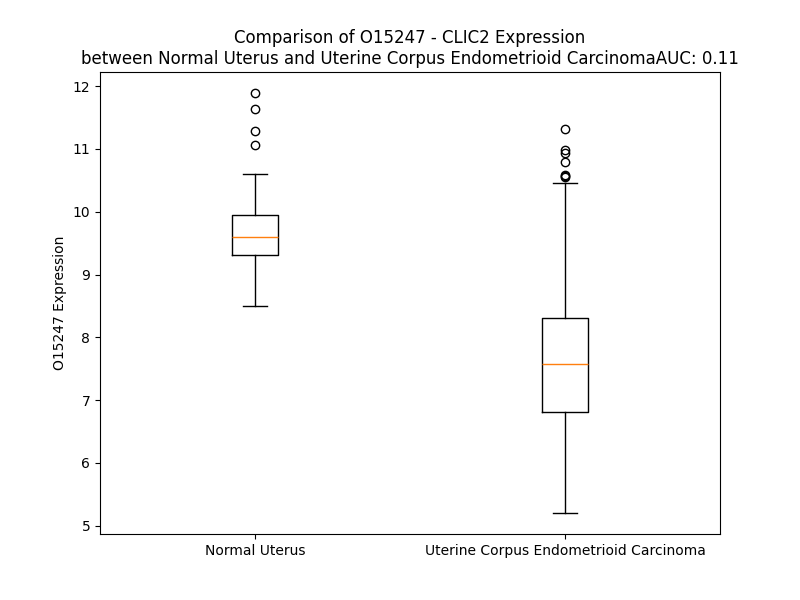

# Detailed Data for O15247

## Introduction to the Detailed Summary

### How to Interpret the Results

- **Summary & Metrics**: This section provides a quick reference to essential protein attributes, including expression changes, family classification, and biomarker applications. Regulation status (upregulated/downregulated) indicates the protein's behavior in a disease context. Some information comes from the original excel file with the proteins selected from literature, while others are derived from the analyses.
- **Expression Comparison**: A visual representation comparing protein expression between normal and disease states. It highlights significant changes in expression levels that might indicate diagnostic or therapeutic relevance. This is data coming from transcriptomics experiments and could not translate similarly to protein levels.
- **Isoform Alignment**: An interactive view of isoform alignments, revealing structural and functional differences between variants of the protein.
- **Interactors & Homologs**: Tables listing known interaction partners and homologous proteins, the more interactors and homologs, the more complex the protein is to design an antibody for.
- **Biological Assemblies**: Information about the structural arrangement of the protein in different assemblies, providing insights into its functional state but also the complexity of the protein to develop antibodies.
- **Combined Per-Residue Information**: A detailed table summarizing residue-level data. This includes predictions for epitope regions, aggregation tendencies, and modifications that might impact the protein's function. Each row corresponds to a residue in the protein, providing insights into specific sites that may be important for research or drug development.
## Summary & Metrics

- **UniProt Accession**: O15247
- **Gene Name**: CLIC2
- **Protein Name**: CLIC2_HUMAN
- **Swiss Prot**: NA
- **Family**: NA
- **Biomarker Application**: NA
- **Number of Isoforms**: 0
- **Regulation**: NA
- **(transcriptomics) AUC**: 0.11
- **(transcriptomics) Fold Change**: 1.25
- **(transcriptomics) Regulation**: Downregulated
- **Discotope Epitope Count**: 53
- **Max n_uniprots (Homo)**: 1
- **Max n_uniprots (Hetero)**: N/A

## Expression Comparison

## Interactors

| preferredName_A   | preferredName_B   | score   |
|-------------------|-------------------|---------|

## Homologs

| uniprot_id   | gene_id   |
|:-------------|:----------|
| A0A0C4DFM0   | GSTZ1     |
| Q96NY7       | CLIC6     |
| Q9H4Y5       | GSTO2     |
| A0A1W2PP95   | GSTT4     |
| V9HWG9       | HEL-S-21  |
| Q53G01       | CLIC5     |
| Q5SRT3       | CLIC1     |
| Q6FIC5       | CLIC4     |
| H0UIB3       | GDAP1L1   |
| O95833       | CLIC3     |
| P0CG29       | GSTT2     |
| Q6ICJ4       | GSTT2B    |
| E5RGI2       | GDAP1     |
| Q53YD7       | EEF1G     |

## Biological Assemblies

|   Unnamed: 0 |   assembly |   n_uniprots | composition   | crystal_id   |
|-------------:|-----------:|-------------:|:--------------|:-------------|
|            0 |          1 |            1 | Homo          | 2per         |
|            0 |          1 |            1 | Homo          | 2r4v         |
|            0 |          1 |            1 | Homo          | 2r5g         |

## Combined Per-Residue Information

|   res | aa   |   epitope_score | epitope   |   relative_surface_accessibility |   modeling_confidence |   Aggregation | modification   |
|------:|:-----|----------------:|:----------|---------------------------------:|----------------------:|--------------:|:---------------|
|     1 | M    |         0.19031 | False     |                          1.32873 |                 37.42 |         0     | N/A            |
|     2 | S    |         0.21892 | False     |                          0.80375 |                 44.33 |         0     | N/A            |
|     3 | G    |         0.24016 | False     |                          0.89882 |                 44.05 |         0     | N/A            |
|     4 | L    |         0.26638 | False     |                          1.03722 |                 44.33 |         0     | N/A            |
|     5 | R    |         0.26589 | False     |                          0.88333 |                 45.12 |         0     | N/A            |
|     6 | P    |         0.17322 | False     |                          0.90591 |                 50.15 |         0     | N/A            |
|     7 | G    |         0.17675 | False     |                          0.74977 |                 51.82 |         0     | N/A            |
|     8 | T    |         0.20982 | False     |                          0.93709 |                 56.35 |         0     | N/A            |
|     9 | Q    |         0.20451 | False     |                          0.66306 |                 71.47 |         0     | N/A            |
|    10 | V    |         0.13681 | False     |                          0.94095 |                 86.23 |         0     | N/A            |
|    11 | D    |         0.15714 | False     |                          0.47514 |                 90.68 |         0     | N/A            |
|    12 | P    |         0.08216 | False     |                          0.112   |                 95.92 |         0     | N/A            |
|    13 | E    |         0.16139 | False     |                          0.55449 |                 97.73 |         0     | N/A            |
|    14 | I    |         0.05958 | False     |                          0.02616 |                 98.43 |         0.914 | N/A            |
|    15 | E    |         0.18472 | False     |                          0.26386 |                 97.8  |         0.914 | N/A            |
|    16 | L    |         0.00385 | False     |                          0       |                 98.15 |         0.914 | N/A            |
|    17 | F    |         0.04706 | False     |                          0.03057 |                 96.67 |         0.914 | N/A            |
|    18 | V    |         0.00837 | False     |                          0.00381 |                 96.8  |         0.914 | N/A            |
|    19 | K    |         0.35214 | True      |                          0.33011 |                 95.33 |         0.914 | N/A            |
|    20 | A    |         0.05528 | False     |                          0.05851 |                 95.34 |         0.418 | N/A            |
|    21 | G    |         0.06131 | False     |                          0.09531 |                 95.31 |         0     | N/A            |
|    22 | S    |         0.30205 | True      |                          0.68516 |                 92.51 |         0     | N/A            |
|    23 | D    |         0.2     | False     |                          0.56947 |                 92.74 |         0     | N/A            |
|    24 | G    |         0.10834 | False     |                          0.09929 |                 91.72 |         0     | N/A            |
|    25 | E    |         0.23472 | False     |                          0.68471 |                 92.54 |         0     | N/A            |
|    26 | S    |         0.15818 | False     |                          0.31257 |                 95.51 |         0     | N/A            |
|    27 | I    |         0.16481 | False     |                          0.2028  |                 96.62 |         0     | N/A            |
|    28 | G    |         0.03022 | False     |                          0.0119  |                 96.36 |         0     | N/A            |
|    29 | N    |         0.21289 | False     |                          0.0801  |                 96.21 |         0     | N/A            |
|    30 | C    |         0.20713 | False     |                          0.13546 |                 96.55 |         0     | N/A            |
|    31 | P    |         0.13057 | False     |                          0.15566 |                 97.02 |         0     | N/A            |
|    32 | F    |         0.2777  | False     |                          0.52963 |                 97    |         0     | N/A            |
|    33 | C    |         0.05595 | False     |                          0.00585 |                 98.04 |         0     | N/A            |
|    34 | Q    |         0.03116 | False     |                          0.02294 |                 98.42 |         0     | N/A            |
|    35 | R    |         0.14819 | False     |                          0.14373 |                 98.36 |         0     | N/A            |
|    36 | L    |         0.00756 | False     |                          0       |                 98.64 |        76.511 | N/A            |
|    37 | F    |         0.12666 | False     |                          0.08281 |                 98.61 |        89.213 | N/A            |
|    38 | M    |         0.0057  | False     |                          0       |                 98.73 |        91.617 | N/A            |
|    39 | I    |         0.00635 | False     |                          0       |                 98.74 |        91.617 | N/A            |
|    40 | L    |         0.00366 | False     |                          0       |                 98.69 |        91.617 | N/A            |
|    41 | W    |         0.17148 | False     |                          0.37935 |                 98.5  |        84.489 | N/A            |
|    42 | L    |         0.07592 | False     |                          0.1529  |                 98.52 |        71.787 | N/A            |
|    43 | K    |         0.0721  | False     |                          0.00926 |                 98.11 |         0     | N/A            |
|    44 | G    |         0.29326 | True      |                          0.75542 |                 97.42 |         0     | N/A            |
|    45 | V    |         0.24283 | False     |                          0.08528 |                 97.52 |         0     | N/A            |
|    46 | K    |         0.19477 | False     |                          0.76793 |                 97.2  |         0     | N/A            |
|    47 | F    |         0.22345 | False     |                          0.22937 |                 98.21 |         4.23  | N/A            |
|    48 | N    |         0.17408 | False     |                          0.64721 |                 98    |         4.549 | N/A            |
|    49 | V    |         0.12581 | False     |                          0.36855 |                 97.35 |         4.549 | N/A            |
|    50 | T    |         0.16273 | False     |                          0.33524 |                 95.27 |         4.549 | N/A            |
|    51 | T    |         0.09287 | False     |                          0.29396 |                 94.95 |         4.549 | N/A            |
|    52 | V    |         0.0462  | False     |                          0.03403 |                 93.3  |         4.218 | N/A            |
|    53 | D    |         0.11048 | False     |                          0.11067 |                 91.25 |         0     | N/A            |
|    54 | M    |         0.37722 | True      |                          0.36719 |                 86.02 |         0     | N/A            |
|    55 | T    |         0.25171 | False     |                          0.87773 |                 85.27 |         0     | N/A            |
|    56 | R    |         0.25764 | False     |                          0.64189 |                 82.04 |         0     | N/A            |
|    57 | K    |         0.19711 | False     |                          0.72813 |                 72.24 |         0     | N/A            |
|    58 | P    |         0.19112 | False     |                          0.34607 |                 73.63 |         0     | N/A            |
|    59 | E    |         0.18224 | False     |                          0.67087 |                 75.78 |         0     | N/A            |
|    60 | E    |         0.19117 | False     |                          0.75796 |                 70.81 |         0     | N/A            |
|    61 | L    |         0.17441 | False     |                          0.14797 |                 79.09 |         0     | N/A            |
|    62 | K    |         0.23576 | False     |                          0.54376 |                 78.54 |         0     | N/A            |
|    63 | D    |         0.24674 | False     |                          0.81851 |                 83.07 |         0     | N/A            |
|    64 | L    |         0.23634 | False     |                          0.43968 |                 86.55 |         0     | N/A            |
|    65 | A    |         0.10115 | False     |                          0.03244 |                 83.66 |         0     | N/A            |
|    66 | P    |         0.37953 | True      |                          0.72024 |                 79.32 |         0     | N/A            |
|    67 | G    |         0.25123 | False     |                          1.01282 |                 82.73 |         0     | N/A            |
|    68 | T    |         0.36246 | True      |                          0.26898 |                 87.14 |         0     | N/A            |
|    69 | N    |         0.48299 | True      |                          0.65129 |                 89.9  |         0     | N/A            |
|    70 | P    |         0.29033 | True      |                          0.12656 |                 93.78 |         0     | N/A            |
|    71 | P    |         0.21676 | False     |                          0.09444 |                 96.48 |         0.852 | N/A            |
|    72 | F    |         0.01248 | False     |                          0.00191 |                 96.43 |        16.542 | N/A            |
|    73 | L    |         0.01024 | False     |                          0       |                 97.92 |        16.542 | N/A            |
|    74 | V    |         0.13354 | False     |                          0.11826 |                 97.43 |        16.542 | N/A            |
|    75 | Y    |         0.20853 | False     |                          0.11    |                 97.81 |        16.542 | N/A            |
|    76 | N    |         0.17193 | False     |                          0.52628 |                 96.89 |        15.882 | N/A            |
|    77 | K    |         0.34922 | True      |                          0.8502  |                 94.77 |         0     | N/A            |
|    78 | E    |         0.21284 | False     |                          0.50176 |                 96.23 |         0     | N/A            |
|    79 | L    |         0.28371 | True      |                          0.3811  |                 95.79 |         0     | N/A            |
|    80 | K    |         0.28454 | True      |                          0.15417 |                 97.65 |         0     | N/A            |
|    81 | T    |         0.32189 | True      |                          0.44024 |                 95.43 |         0     | N/A            |
|    82 | D    |         0.34241 | True      |                          0.3733  |                 95.58 |         0.155 | N/A            |
|    83 | F    |         0.35983 | True      |                          0.18903 |                 94.61 |         0.155 | N/A            |
|    84 | I    |         0.38477 | True      |                          0.68254 |                 94.75 |         0.155 | N/A            |
|    85 | K    |         0.28589 | True      |                          0.65302 |                 97.79 |         0.155 | N/A            |
|    86 | I    |         0.0338  | False     |                          0.00617 |                 98.46 |         0.155 | N/A            |
|    87 | E    |         0.13551 | False     |                          0.08657 |                 98.17 |         0     | N/A            |
|    88 | E    |         0.26214 | False     |                          0.48055 |                 97.93 |         0     | N/A            |
|    89 | F    |         0.32959 | True      |                          0.24272 |                 98.47 |         0     | N/A            |
|    90 | L    |         0.00494 | False     |                          0       |                 98.48 |         0     | N/A            |
|    91 | E    |         0.07929 | False     |                          0.09159 |                 98.15 |         0     | N/A            |
|    92 | Q    |         0.35466 | True      |                          0.70766 |                 97.83 |         0     | N/A            |
|    93 | T    |         0.15369 | False     |                          0.412   |                 97.39 |         0     | N/A            |
|    94 | L    |         0.01168 | False     |                          0.00495 |                 97.48 |         0     | N/A            |
|    95 | A    |         0.15335 | False     |                          0.32079 |                 96.38 |         0     | N/A            |
|    96 | P    |         0.47687 | True      |                          0.59466 |                 96.89 |         0     | N/A            |
|    97 | P    |         0.60196 | True      |                          1.0874  |                 94.87 |         0     | N/A            |
|    98 | R    |         0.28293 | True      |                          0.34231 |                 95.26 |         0     | N/A            |
|    99 | Y    |         0.13658 | False     |                          0.10017 |                 97.18 |         0     | N/A            |
|   100 | P    |         0.09734 | False     |                          0.45118 |                 97.65 |         0     | N/A            |
|   101 | H    |         0.21661 | False     |                          0.62724 |                 98    |         0     | N/A            |
|   102 | L    |         0.06765 | False     |                          0.06348 |                 98.39 |         0     | N/A            |
|   103 | S    |         0.19096 | False     |                          0.29705 |                 97.91 |         0     | N/A            |
|   104 | P    |         0.19673 | False     |                          0.15068 |                 97.44 |         0     | N/A            |
|   105 | K    |         0.35779 | True      |                          0.77654 |                 97.16 |         0     | N/A            |
|   106 | Y    |         0.29675 | True      |                          0.14433 |                 97.44 |         0     | N/A            |
|   107 | K    |         0.3853  | True      |                          0.77093 |                 94.9  |         0     | N/A            |
|   108 | E    |         0.3381  | True      |                          0.51929 |                 96.55 |         0     | N/A            |
|   109 | S    |         0.01293 | False     |                          0.00846 |                 97.87 |         0     | N/A            |
|   110 | F    |         0.12456 | False     |                          0.41512 |                 95.25 |         0     | N/A            |
|   111 | D    |         0.21901 | False     |                          0.38782 |                 96.2  |         0     | N/A            |
|   112 | V    |         0.07946 | False     |                          0.05271 |                 96.55 |         0     | N/A            |
|   113 | G    |         0.02902 | False     |                          0.02595 |                 95.67 |         0     | N/A            |
|   114 | C    |         0.17597 | False     |                          0.5603  |                 94.75 |         0     | N/A            |
|   115 | N    |         0.13528 | False     |                          0.36802 |                 97.6  |         0     | N/A            |
|   116 | L    |         0.01182 | False     |                          0.00165 |                 98.3  |         0     | N/A            |
|   117 | F    |         0.23784 | False     |                          0.26019 |                 97.04 |         0     | N/A            |
|   118 | A    |         0.24721 | False     |                          0.58547 |                 97.85 |         0     | N/A            |
|   119 | K    |         0.15182 | False     |                          0.36243 |                 98.21 |         0     | N/A            |
|   120 | F    |         0.00481 | False     |                          0       |                 97.84 |         0.409 | N/A            |
|   121 | S    |         0.13445 | False     |                          0.19434 |                 96.53 |         0.409 | N/A            |
|   122 | A    |         0.10936 | False     |                          0.37104 |                 95.96 |         0.409 | N/A            |
|   123 | Y    |         0.02046 | False     |                          0.00602 |                 96.19 |         0.409 | N/A            |
|   124 | I    |         0.01133 | False     |                          0.0008  |                 94.9  |         0.409 | N/A            |
|   125 | K    |         0.19907 | False     |                          0.59808 |                 93.78 |         0     | N/A            |
|   126 | N    |         0.08468 | False     |                          0.12436 |                 91.36 |         0     | N/A            |
|   127 | T    |         0.22406 | False     |                          0.45018 |                 89.04 |         0     | N/A            |
|   128 | Q    |         0.31734 | True      |                          0.62619 |                 90.02 |         0     | N/A            |
|   129 | K    |         0.23271 | False     |                          0.87083 |                 86.71 |         0     | N/A            |
|   130 | E    |         0.33469 | True      |                          0.81376 |                 90.6  |         0     | N/A            |
|   131 | A    |         0.20467 | False     |                          0.21228 |                 92.6  |         0     | N/A            |
|   132 | N    |         0.16936 | False     |                          0.25143 |                 92.04 |         0     | N/A            |
|   133 | K    |         0.27347 | False     |                          0.82512 |                 94.11 |         0     | N/A            |
|   134 | N    |         0.26358 | False     |                          0.63822 |                 96.96 |         0     | N/A            |
|   135 | F    |         0.15305 | False     |                          0.34406 |                 96.87 |         0     | N/A            |
|   136 | E    |         0.06947 | False     |                          0.2759  |                 97.02 |         0     | N/A            |
|   137 | K    |         0.22424 | False     |                          0.73891 |                 97.96 |         0     | N/A            |
|   138 | S    |         0.09701 | False     |                          0.32168 |                 98.15 |         0     | N/A            |
|   139 | L    |         0.00316 | False     |                          0       |                 98.37 |         0     | N/A            |
|   140 | L    |         0.1178  | False     |                          0.30281 |                 98.53 |         0     | N/A            |
|   141 | K    |         0.17211 | False     |                          0.73376 |                 98.47 |         0     | N/A            |
|   142 | E    |         0.1024  | False     |                          0.09158 |                 98.58 |         0     | N/A            |
|   143 | F    |         0.00494 | False     |                          0       |                 98.68 |         0     | N/A            |
|   144 | K    |         0.17557 | False     |                          0.45176 |                 98.71 |         0     | N/A            |
|   145 | R    |         0.18593 | False     |                          0.49837 |                 98.56 |         0     | N/A            |
|   146 | L    |         0.00531 | False     |                          0       |                 98.77 |         0     | N/A            |
|   147 | D    |         0.04556 | False     |                          0.02333 |                 98.74 |         0     | N/A            |
|   148 | D    |         0.26994 | False     |                          0.39342 |                 98.46 |         0     | N/A            |
|   149 | Y    |         0.24434 | False     |                          0.14748 |                 98.6  |         0     | N/A            |
|   150 | L    |         0.00904 | False     |                          0.00165 |                 98.66 |         0     | N/A            |
|   151 | N    |         0.14839 | False     |                          0.19137 |                 98.46 |         0     | N/A            |
|   152 | T    |         0.32912 | True      |                          0.55821 |                 97.65 |         0     | N/A            |
|   153 | P    |         0.13328 | False     |                          0.16251 |                 96.81 |         0     | N/A            |
|   154 | L    |         0.29608 | True      |                          0.10799 |                 96.42 |         0     | N/A            |
|   155 | L    |         0.53472 | True      |                          0.83286 |                 93.63 |         0     | N/A            |
|   156 | D    |         0.43839 | True      |                          0.61662 |                 91.64 |         0     | N/A            |
|   157 | E    |         0.22559 | False     |                          0.32753 |                 93.88 |         0     | N/A            |
|   158 | I    |         0.42819 | True      |                          0.3709  |                 93.22 |         0     | N/A            |
|   159 | D    |         0.35623 | True      |                          0.53799 |                 91.26 |         0     | N/A            |
|   160 | P    |         0.49931 | True      |                          0.8939  |                 88.2  |         0     | N/A            |
|   161 | D    |         0.43416 | True      |                          0.84833 |                 92.31 |         0     | N/A            |
|   162 | S    |         0.35038 | True      |                          0.40763 |                 90.3  |         0     | N/A            |
|   163 | A    |         0.48517 | True      |                          1.07128 |                 86.75 |         0     | N/A            |
|   164 | E    |         0.39661 | True      |                          0.74831 |                 88.8  |         0     | N/A            |
|   165 | E    |         0.38397 | True      |                          0.85046 |                 85.72 |         0     | N/A            |
|   166 | P    |         0.3303  | True      |                          0.4696  |                 86.15 |         0     | N/A            |
|   167 | P    |         0.21437 | False     |                          0.72239 |                 90.15 |         0     | N/A            |
|   168 | V    |         0.32808 | True      |                          0.71698 |                 95.38 |         0     | N/A            |
|   169 | S    |         0.11779 | False     |                          0.02975 |                 97.8  |         0     | N/A            |
|   170 | R    |         0.31964 | True      |                          0.80691 |                 96.33 |         0     | N/A            |
|   171 | R    |         0.15244 | False     |                          0.02836 |                 97.89 |         0     | N/A            |
|   172 | L    |         0.27995 | False     |                          0.40103 |                 98.54 |         0     | N/A            |
|   173 | F    |         0.01221 | False     |                          0.00764 |                 98.71 |         0     | N/A            |
|   174 | L    |         0.00696 | False     |                          0.00165 |                 98.61 |         0     | N/A            |
|   175 | D    |         0.14541 | False     |                          0.08054 |                 97.9  |         0     | N/A            |
|   176 | G    |         0.15108 | False     |                          0.24464 |                 97.94 |         0     | N/A            |
|   177 | D    |         0.25783 | False     |                          0.49193 |                 97.92 |         0     | N/A            |
|   178 | Q    |         0.18813 | False     |                          0.60465 |                 97.93 |         0     | N/A            |
|   179 | L    |         0.02644 | False     |                          0.03287 |                 98.64 |         0     | N/A            |
|   180 | T    |         0.07579 | False     |                          0.09902 |                 98.49 |         0     | N/A            |
|   181 | L    |         0.02543 | False     |                          0.04864 |                 98.46 |         0     | N/A            |
|   182 | A    |         0.0135  | False     |                          0.0132  |                 98.37 |         0     | N/A            |
|   183 | D    |         0.00317 | False     |                          0       |                 98.78 |         0     | N/A            |
|   184 | C    |         0.00263 | False     |                          0.00074 |                 98.47 |         0     | N/A            |
|   185 | S    |         0.07856 | False     |                          0.15405 |                 97.84 |         0     | N/A            |
|   186 | L    |         0.05962 | False     |                          0.04534 |                 98.56 |         0     | N/A            |
|   187 | L    |         0.0042  | False     |                          0       |                 98.77 |         0     | N/A            |
|   188 | P    |         0.01812 | False     |                          0.00545 |                 98.45 |         0     | N/A            |
|   189 | K    |         0.13602 | False     |                          0.19374 |                 98.26 |         0     | N/A            |
|   190 | L    |         0.0033  | False     |                          0       |                 98.45 |         0     | N/A            |
|   191 | N    |         0.05103 | False     |                          0.02352 |                 98.23 |         0     | N/A            |
|   192 | I    |         0.06601 | False     |                          0.0232  |                 98.09 |         0     | N/A            |
|   193 | I    |         0.0062  | False     |                          0       |                 98.14 |         0     | N/A            |
|   194 | K    |         0.22668 | False     |                          0.33488 |                 97.94 |         0     | N/A            |
|   195 | V    |         0.12235 | False     |                          0.10787 |                 98.09 |         0     | N/A            |
|   196 | A    |         0.00673 | False     |                          0       |                 97.67 |         0     | N/A            |
|   197 | A    |         0.00455 | False     |                          0       |                 96.53 |         0     | N/A            |
|   198 | K    |         0.22123 | False     |                          0.43336 |                 97.17 |         0     | N/A            |
|   199 | K    |         0.26237 | False     |                          0.54435 |                 96.8  |         0     | N/A            |
|   200 | Y    |         0.22444 | False     |                          0.20681 |                 95.03 |         0     | N/A            |
|   201 | R    |         0.28515 | True      |                          0.13321 |                 93.8  |         0     | N/A            |
|   202 | D    |         0.23258 | False     |                          0.67674 |                 94.93 |         0     | N/A            |
|   203 | F    |         0.19419 | False     |                          0.059   |                 96.75 |         0     | N/A            |
|   204 | D    |         0.27227 | False     |                          0.49817 |                 97.64 |         0     | N/A            |
|   205 | I    |         0.18312 | False     |                          0.03697 |                 97.95 |         0     | N/A            |
|   206 | P    |         0.22175 | False     |                          0.22267 |                 98.32 |         0     | N/A            |
|   207 | A    |         0.299   | True      |                          0.85738 |                 98.1  |         0     | N/A            |
|   208 | E    |         0.33674 | True      |                          0.7045  |                 98.11 |         0     | N/A            |
|   209 | F    |         0.11247 | False     |                          0.07325 |                 98.62 |         1.164 | N/A            |
|   210 | S    |         0.23837 | False     |                          0.49454 |                 98.32 |         1.164 | N/A            |
|   211 | G    |         0.00648 | False     |                          0.00119 |                 98.67 |         1.164 | N/A            |
|   212 | V    |         0.00316 | False     |                          0       |                 98.74 |         1.164 | N/A            |
|   213 | W    |         0.27194 | False     |                          0.28046 |                 98.67 |         1.164 | N/A            |
|   214 | R    |         0.33185 | True      |                          0.22307 |                 98.62 |         0     | N/A            |
|   215 | Y    |         0.01485 | False     |                          0.00365 |                 98.81 |         0     | N/A            |
|   216 | L    |         0.01527 | False     |                          0.0033  |                 98.66 |         0     | N/A            |
|   217 | H    |         0.4301  | True      |                          0.60775 |                 98.58 |         0     | N/A            |
|   218 | N    |         0.20759 | False     |                          0.21531 |                 98.76 |         0     | N/A            |
|   219 | A    |         0.00526 | False     |                          0       |                 98.62 |         0     | N/A            |
|   220 | Y    |         0.25392 | False     |                          0.33707 |                 98.32 |         0     | N/A            |
|   221 | A    |         0.33156 | True      |                          0.77726 |                 98.29 |         0     | N/A            |
|   222 | R    |         0.16239 | False     |                          0.27219 |                 98.36 |         0     | N/A            |
|   223 | E    |         0.1735  | False     |                          0.54908 |                 98.02 |         0     | N/A            |
|   224 | E    |         0.08724 | False     |                          0.13315 |                 98.14 |         0     | N/A            |
|   225 | F    |         0.00647 | False     |                          0.00064 |                 98.61 |         0     | N/A            |
|   226 | T    |         0.19231 | False     |                          0.37026 |                 98.01 |         0     | N/A            |
|   227 | H    |         0.24823 | False     |                          0.52494 |                 97.38 |         0     | N/A            |
|   228 | T    |         0.00395 | False     |                          0       |                 97.95 |         0     | N/A            |
|   229 | C    |         0.09618 | False     |                          0.17575 |                 98.09 |         0     | N/A            |
|   230 | P    |         0.04669 | False     |                          0.0589  |                 97.57 |         0     | N/A            |
|   231 | E    |         0.30834 | True      |                          0.62625 |                 97.26 |         0     | N/A            |
|   232 | D    |         0.23483 | False     |                          0.52135 |                 97.67 |         0     | N/A            |
|   233 | K    |         0.30279 | True      |                          0.68131 |                 96.84 |         0     | N/A            |
|   234 | E    |         0.13515 | False     |                          0.08356 |                 97.25 |         0     | N/A            |
|   235 | I    |         0.00506 | False     |                          0       |                 97.64 |         0     | N/A            |
|   236 | E    |         0.22662 | False     |                          0.20033 |                 96.94 |         0     | N/A            |
|   237 | N    |         0.27146 | False     |                          0.45103 |                 94.63 |         0     | N/A            |
|   238 | T    |         0.4363  | True      |                          0.37771 |                 93.49 |         0.138 | N/A            |
|   239 | Y    |         0.21163 | False     |                          0.09763 |                 94.39 |         0.138 | N/A            |
|   240 | A    |         0.19304 | False     |                          0.22065 |                 93.01 |         0.138 | N/A            |
|   241 | N    |         0.33613 | True      |                          0.77898 |                 85.57 |         0.138 | N/A            |
|   242 | V    |         0.3049  | True      |                          0.35194 |                 86.04 |         0.138 | N/A            |
|   243 | A    |         0.0549  | False     |                          0.05799 |                 83.26 |         0     | N/A            |
|   244 | K    |         0.16751 | False     |                          0.73556 |                 66.74 |         0     | N/A            |
|   245 | Q    |         0.1213  | False     |                          0.6195  |                 55.96 |         0     | N/A            |
|   246 | K    |         0.1121  | False     |                          0.76441 |                 45.08 |         0     | N/A            |
|   247 | S    |         0.1016  | False     |                          1.31739 |                 37.83 |         0     | N/A            |

