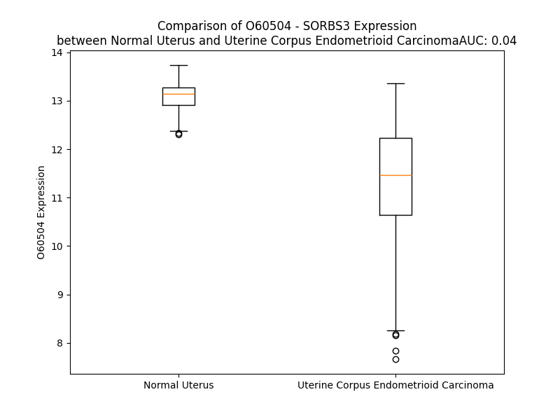

# Detailed Data for O60504

## Introduction to the Detailed Summary

### How to Interpret the Results

- **Summary & Metrics**: This section provides a quick reference to essential protein attributes, including expression changes, family classification, and biomarker applications. Regulation status (upregulated/downregulated) indicates the protein's behavior in a disease context. Some information comes from the original excel file with the proteins selected from literature, while others are derived from the analyses.
- **Expression Comparison**: A visual representation comparing protein expression between normal and disease states. It highlights significant changes in expression levels that might indicate diagnostic or therapeutic relevance. This is data coming from transcriptomics experiments and could not translate similarly to protein levels.
- **Isoform Alignment**: An interactive view of isoform alignments, revealing structural and functional differences between variants of the protein.
- **Interactors & Homologs**: Tables listing known interaction partners and homologous proteins, the more interactors and homologs, the more complex the protein is to design an antibody for.
- **Biological Assemblies**: Information about the structural arrangement of the protein in different assemblies, providing insights into its functional state but also the complexity of the protein to develop antibodies.
- **Combined Per-Residue Information**: A detailed table summarizing residue-level data. This includes predictions for epitope regions, aggregation tendencies, and modifications that might impact the protein's function. Each row corresponds to a residue in the protein, providing insights into specific sites that may be important for research or drug development.
## Summary & Metrics

- **UniProt Accession**: O60504
- **Gene Name**: SORBS3
- **Protein Name**: VINEX_HUMAN
- **Swiss Prot**: NA
- **Family**: NA
- **Biomarker Application**: NA
- **Number of Isoforms**: 2
- **Regulation**: NA
- **(transcriptomics) AUC**: 0.04
- **(transcriptomics) Fold Change**: 1.16
- **(transcriptomics) Regulation**: Downregulated
- **Discotope Epitope Count**: 88
- **Max n_uniprots (Homo)**: 1
- **Max n_uniprots (Hetero)**: N/A

## Expression Comparison

## Isoform Alignment

<pre style='font-size:14px; font-family:monospace;'>O60504-1 MQGPPRSLRAGLSLDDFIPGHLQSHIGSSSRGTRVPVIRNGGSNTLNFQFHDPAPRTVCNGGYTPRRDASQHPDPAWYQTWPGPGSKPSASTKIPASQHTQNWSATWTKDSKRRDKRWVKYEGIGPVDESGMPIAPRSSVDRPRDWYRRMFQQIHRKMPDLQLDWTFEEPPRDPRHLGAQQRPAHRPGPATSSSGRSWDHSEELPRSTFNYRPGAFSTVLQPSNQVLRRREKVDNVWTEESWNQFLQELETGQRPKKPLVDDPGEKPSQPIEVLLERELAELSAELDKDLRAIETRLPSPKSSPAPRRAPEQRPPAGPASAWSSSYPHAPYLGSARSLSPHKMADGGSPFLGRRDFVYPSSTRDPSASNGGGSPARREEKKRKAARLKFDFQAQSPKELTLQKGDIVYIHKEVDKNWLEGEHHGRLGIFPANYVEVLPADEIPKPIKPPTYQVLEYGEAVAQYTFKGDLEVELSFRKGEHICLIRKVNENWYEGRITGTGRQGIFPASYVQVSREPRLRLCDDGPQLPTSPRLTAAARSARHPSSPSALRSPADPIDLGGQTSPRRTGFSFPTQEPRPQTQNLGTPGPALSHSRGPSHPLDLGTSSPNTSQIHWTPYRAMYQYRPQNEDELELREGDRVDVMQQCDDGWFVGVSRRTQKFGTFPGNYVAPV
O60504-2 ------------------------------------------------------------------------------------------------------------------------------------------------------------------------------------------------------------------------------------------------------------------------------------------------------------------------------------------------------MADGGSPFLGRRDFVYPSSTRDPSASNGGGSPARREEKKRKAARLKFDFQAQSPKELTLQKGDIVYIHKEVDKNWLEGEHHGRLGIFPANYVEVLPADEIPKPIKPPTYQVLEYGEAVAQYTFKGDLEVELSFRKGEHICLIRKVNENWYEGRITGTGRQGIFPASYVQVSREPRLRLCDDGPQLPTSPRLTAAARSARHPSSPSALRSPADPIDLGGQTSPRRTGFSFPTQEPRPQTQNLGTPGPALSHSRGPSHPLDLGTSSPNTSQIHWTPYRAMYQYRPQNEDELELREGDRVDVMQQCDDGWFVGVSRRTQKFGTFPGNYVAPV
</pre>

## Interactors

| preferredName_A   | preferredName_B   |   score |
|:------------------|:------------------|--------:|
| SORBS3            | VCL               |   0.999 |
| SORBS3            | TLN1              |   0.948 |
| SORBS3            | DLG5              |   0.934 |
| SORBS3            | PXN               |   0.926 |

## Homologs

| uniprot_id   | gene_id   |
|:-------------|:----------|
| Q99963       | SH3GL3    |
| Q8TEC5       | SH3RF2    |
| A0A494BZS1   | NCF4      |
| Q8TEJ3       | SH3RF3    |
| Q99961       | SH3GL1    |
| Q7Z6J0       | SH3RF1    |
| Q9BX66       | SORBS1    |
| Q99962       | SH3GL2    |
| G5E9J1       | SH3GLB2   |
| A0A140VJU5   | SH3GLB1   |
| Q5HYK7       | SH3D19    |
| C9JBB0       | SORBS2    |

## Biological Assemblies

|   Unnamed: 0 |   assembly |   n_uniprots | composition   | crystal_id   |
|-------------:|-----------:|-------------:|:--------------|:-------------|
|            0 |          1 |            1 | Homo          | 2yup         |
|            0 |          1 |            1 | Homo          | 2dlm         |
|            0 |          1 |            1 | Homo          | 2nwm         |
|            0 |          1 |            1 | Homo          | 2ct3         |

## Combined Per-Residue Information

|   res | aa   |   epitope_score | epitope   |   relative_surface_accessibility |   modeling_confidence |   Aggregation | modification            |
|------:|:-----|----------------:|:----------|---------------------------------:|----------------------:|--------------:|:------------------------|
|     1 | M    |         0.07314 | False     |                          1.27422 |                 38.54 |         0     | N/A                     |
|     2 | Q    |         0.08325 | False     |                          0.94019 |                 44.08 |         0     | N-acetylalanine         |
|     3 | G    |         0.05131 | False     |                          0.88158 |                 42.42 |         0     | N/A                     |
|     4 | P    |         0.08666 | False     |                          0.9368  |                 55.62 |         0     | N/A                     |
|     5 | P    |         0.09008 | False     |                          0.85982 |                 51.39 |         0     | N/A                     |
|     6 | R    |         0.10678 | True      |                          0.98102 |                 43.67 |         0     | Phosphoserine           |
|     7 | S    |         0.06011 | False     |                          0.76536 |                 40.44 |         0     | N/A                     |
|     8 | L    |         0.08244 | False     |                          1.14965 |                 42.37 |         0     | N/A                     |
|     9 | R    |         0.09658 | False     |                          0.93097 |                 38.41 |         0     | N/A                     |
|    10 | A    |         0.05084 | False     |                          0.96436 |                 39.99 |         0     | N/A                     |
|    11 | G    |         0.07995 | False     |                          0.81098 |                 38.9  |         0     | N/A                     |
|    12 | L    |         0.06115 | False     |                          1.1497  |                 43.65 |         0     | N/A                     |
|    13 | S    |         0.05913 | False     |                          0.86266 |                 37.23 |         0     | N/A                     |
|    14 | L    |         0.05454 | False     |                          1.08574 |                 39.79 |         0     | N/A                     |
|    15 | D    |         0.07663 | False     |                          0.80883 |                 42.91 |         0     | N/A                     |
|    16 | D    |         0.06188 | False     |                          0.81331 |                 43.69 |         0     | N/A                     |
|    17 | F    |         0.05223 | False     |                          1.03622 |                 46.29 |         0     | N/A                     |
|    18 | I    |         0.0665  | False     |                          1.01528 |                 39.39 |         0     | N/A                     |
|    19 | P    |         0.0673  | False     |                          0.90937 |                 42.23 |         0     | N/A                     |
|    20 | G    |         0.05403 | False     |                          0.85768 |                 38.55 |         0     | N/A                     |
|    21 | H    |         0.09185 | False     |                          0.91212 |                 41.61 |         0     | N/A                     |
|    22 | L    |         0.07399 | False     |                          1.04681 |                 41.35 |         0     | N/A                     |
|    23 | Q    |         0.07323 | False     |                          0.81385 |                 35.48 |         0     | N/A                     |
|    24 | S    |         0.06718 | False     |                          0.84353 |                 41.84 |         0     | N/A                     |
|    25 | H    |         0.11475 | True      |                          0.84445 |                 36.15 |         0     | N/A                     |
|    26 | I    |         0.08827 | False     |                          1.09075 |                 38.28 |         0     | N/A                     |
|    27 | G    |         0.08347 | False     |                          0.84269 |                 34.96 |         0     | N/A                     |
|    28 | S    |         0.08581 | False     |                          0.93443 |                 33.62 |         0     | N/A                     |
|    29 | S    |         0.0757  | False     |                          0.88073 |                 38.37 |         0     | N/A                     |
|    30 | S    |         0.12643 | True      |                          0.80476 |                 33.24 |         0     | N/A                     |
|    31 | R    |         0.16187 | True      |                          0.96005 |                 42.28 |         0     | N/A                     |
|    32 | G    |         0.11869 | True      |                          0.89787 |                 32.34 |         0     | N/A                     |
|    33 | T    |         0.11102 | True      |                          0.99751 |                 39.91 |         0     | N/A                     |
|    34 | R    |         0.11424 | True      |                          0.88706 |                 37.95 |         0     | N/A                     |
|    35 | V    |         0.09228 | False     |                          0.85223 |                 36.1  |         0     | N/A                     |
|    36 | P    |         0.05619 | False     |                          0.79439 |                 38.73 |         0     | N/A                     |
|    37 | V    |         0.0734  | False     |                          0.89467 |                 32.45 |         0     | N/A                     |
|    38 | I    |         0.08951 | False     |                          0.86837 |                 37.66 |         0     | N/A                     |
|    39 | R    |         0.15944 | True      |                          0.87144 |                 33.41 |         0     | N/A                     |
|    40 | N    |         0.09273 | False     |                          0.87174 |                 36.56 |         0     | N/A                     |
|    41 | G    |         0.0936  | False     |                          1.05943 |                 32.04 |         0     | N/A                     |
|    42 | G    |         0.07857 | False     |                          0.8696  |                 28.78 |         0     | N/A                     |
|    43 | S    |         0.0676  | False     |                          0.7869  |                 31.54 |         0     | N/A                     |
|    44 | N    |         0.06624 | False     |                          0.93246 |                 32.74 |         0     | N/A                     |
|    45 | T    |         0.06346 | False     |                          0.70079 |                 35.52 |         0     | N/A                     |
|    46 | L    |         0.07513 | False     |                          0.81683 |                 40.54 |         0     | N/A                     |
|    47 | N    |         0.07308 | False     |                          0.87523 |                 33.28 |         0     | N/A                     |
|    48 | F    |         0.0719  | False     |                          0.79911 |                 38.72 |         0     | N/A                     |
|    49 | Q    |         0.0888  | False     |                          0.68166 |                 36.72 |         0     | N/A                     |
|    50 | F    |         0.06301 | False     |                          1.01225 |                 39.69 |         0     | N/A                     |
|    51 | H    |         0.07859 | False     |                          0.82168 |                 37.94 |         0     | N/A                     |
|    52 | D    |         0.11406 | True      |                          0.86758 |                 38.65 |         0     | N/A                     |
|    53 | P    |         0.14369 | True      |                          0.8757  |                 43.74 |         0     | N/A                     |
|    54 | A    |         0.0878  | False     |                          0.8916  |                 42.26 |         0     | N/A                     |
|    55 | P    |         0.10023 | False     |                          0.82653 |                 38.05 |         0     | N/A                     |
|    56 | R    |         0.1223  | True      |                          0.86668 |                 38.61 |         0     | N/A                     |
|    57 | T    |         0.06289 | False     |                          0.93698 |                 42.61 |         0     | N/A                     |
|    58 | V    |         0.06459 | False     |                          0.84495 |                 33.91 |         0     | N/A                     |
|    59 | C    |         0.06148 | False     |                          0.92033 |                 39.31 |         0     | N/A                     |
|    60 | N    |         0.11998 | True      |                          0.93119 |                 34.63 |         0     | N/A                     |
|    61 | G    |         0.11098 | True      |                          0.98513 |                 37.17 |         0     | N/A                     |
|    62 | G    |         0.0963  | False     |                          1.01083 |                 42.18 |         0     | N/A                     |
|    63 | Y    |         0.12336 | True      |                          0.99206 |                 31.75 |         0     | N/A                     |
|    64 | T    |         0.06725 | False     |                          0.95872 |                 43.27 |         0     | N/A                     |
|    65 | P    |         0.08145 | False     |                          0.87832 |                 37.13 |         0     | N/A                     |
|    66 | R    |         0.10548 | True      |                          0.78903 |                 34.02 |         0     | N/A                     |
|    67 | R    |         0.14467 | True      |                          0.78393 |                 35.59 |         0     | N/A                     |
|    68 | D    |         0.07961 | False     |                          0.74797 |                 33.27 |         0     | N/A                     |
|    69 | A    |         0.05989 | False     |                          0.89036 |                 31.02 |         0     | N/A                     |
|    70 | S    |         0.05894 | False     |                          0.85612 |                 30.33 |         0     | N/A                     |
|    71 | Q    |         0.10675 | True      |                          0.91065 |                 31.69 |         0     | N/A                     |
|    72 | H    |         0.07001 | False     |                          0.95416 |                 31.88 |         0     | N/A                     |
|    73 | P    |         0.06863 | False     |                          0.71184 |                 41.29 |         0     | N/A                     |
|    74 | D    |         0.0699  | False     |                          0.73315 |                 28.96 |         0     | N/A                     |
|    75 | P    |         0.07048 | False     |                          1.06023 |                 38.7  |         0     | N/A                     |
|    76 | A    |         0.08285 | False     |                          0.79212 |                 32.77 |         0     | N/A                     |
|    77 | W    |         0.1077  | True      |                          0.84906 |                 32.24 |         0     | N/A                     |
|    78 | Y    |         0.05588 | False     |                          1.013   |                 26.58 |         0     | N/A                     |
|    79 | Q    |         0.08408 | False     |                          0.6482  |                 34.13 |         0     | N/A                     |
|    80 | T    |         0.08001 | False     |                          0.6683  |                 30.86 |         0     | N/A                     |
|    81 | W    |         0.16327 | True      |                          0.9748  |                 29.59 |         0     | N/A                     |
|    82 | P    |         0.10345 | False     |                          0.87172 |                 32.81 |         0     | N/A                     |
|    83 | G    |         0.07649 | False     |                          0.87702 |                 35.74 |         0     | N/A                     |
|    84 | P    |         0.1296  | True      |                          1.00553 |                 36.34 |         0     | N/A                     |
|    85 | G    |         0.07019 | False     |                          0.81854 |                 32.66 |         0     | N/A                     |
|    86 | S    |         0.08033 | False     |                          0.79852 |                 30.17 |         0     | N/A                     |
|    87 | K    |         0.08215 | False     |                          0.9478  |                 35.42 |         0     | N/A                     |
|    88 | P    |         0.07151 | False     |                          0.86147 |                 38.23 |         0     | N/A                     |
|    89 | S    |         0.10957 | True      |                          0.83079 |                 32.36 |         0     | N/A                     |
|    90 | A    |         0.06652 | False     |                          0.97172 |                 36.93 |         0     | N/A                     |
|    91 | S    |         0.09401 | False     |                          0.81245 |                 33.59 |         0     | N/A                     |
|    92 | T    |         0.12476 | True      |                          0.78038 |                 36.48 |         0     | N/A                     |
|    93 | K    |         0.05645 | False     |                          0.94839 |                 37.58 |         0     | N/A                     |
|    94 | I    |         0.12062 | True      |                          0.96802 |                 34.17 |         0     | N/A                     |
|    95 | P    |         0.10804 | True      |                          0.88531 |                 34.38 |         0     | N/A                     |
|    96 | A    |         0.08234 | False     |                          0.83762 |                 27.57 |         0     | N/A                     |
|    97 | S    |         0.09686 | False     |                          0.79922 |                 29.23 |         0     | N/A                     |
|    98 | Q    |         0.06633 | False     |                          0.88391 |                 32.66 |         0     | N/A                     |
|    99 | H    |         0.08367 | False     |                          0.91527 |                 29.92 |         0     | N/A                     |
|   100 | T    |         0.06847 | False     |                          0.85502 |                 30.57 |         0     | N/A                     |
|   101 | Q    |         0.04743 | False     |                          0.77736 |                 31.43 |         0     | N/A                     |
|   102 | N    |         0.07631 | False     |                          0.73392 |                 28.7  |         0     | N/A                     |
|   103 | W    |         0.04635 | False     |                          1.0603  |                 29.19 |         0     | N/A                     |
|   104 | S    |         0.06867 | False     |                          0.80276 |                 28.02 |         0     | N/A                     |
|   105 | A    |         0.04389 | False     |                          0.90328 |                 28.46 |         0     | N/A                     |
|   106 | T    |         0.09719 | False     |                          0.90929 |                 33.79 |         0     | N/A                     |
|   107 | W    |         0.09082 | False     |                          0.70167 |                 28.83 |         0     | N/A                     |
|   108 | T    |         0.11445 | True      |                          0.93419 |                 40.19 |         0     | N/A                     |
|   109 | K    |         0.12497 | True      |                          0.98512 |                 32.23 |         0     | N/A                     |
|   110 | D    |         0.09098 | False     |                          0.88847 |                 36.19 |         0     | N/A                     |
|   111 | S    |         0.09865 | False     |                          0.69887 |                 34.87 |         0     | N/A                     |
|   112 | K    |         0.09504 | False     |                          0.98266 |                 41.42 |         0     | N/A                     |
|   113 | R    |         0.12232 | True      |                          0.89557 |                 40.34 |         0     | N/A                     |
|   114 | R    |         0.11734 | True      |                          0.99317 |                 33.7  |         0     | N/A                     |
|   115 | D    |         0.07426 | False     |                          0.71594 |                 38.06 |         0     | N/A                     |
|   116 | K    |         0.09928 | False     |                          0.95576 |                 39.58 |         0     | N/A                     |
|   117 | R    |         0.06203 | False     |                          0.59721 |                 39.08 |         0     | N/A                     |
|   118 | W    |         0.06843 | False     |                          0.72663 |                 35.74 |         0     | N/A                     |
|   119 | V    |         0.0403  | False     |                          0.61129 |                 42.51 |         0     | N/A                     |
|   120 | K    |         0.04701 | False     |                          0.79441 |                 43.2  |         0     | N/A                     |
|   121 | Y    |         0.03275 | False     |                          0.2349  |                 45.03 |         0     | N/A                     |
|   122 | E    |         0.09575 | False     |                          0.84897 |                 45.88 |         0     | N/A                     |
|   123 | G    |         0.08525 | False     |                          0.78283 |                 50.7  |         0     | N/A                     |
|   124 | I    |         0.04217 | False     |                          0.05042 |                 54.28 |         0     | N/A                     |
|   125 | G    |         0.02082 | False     |                          0.22638 |                 57.1  |         0     | N/A                     |
|   126 | P    |         0.03798 | False     |                          0.07555 |                 61.83 |         0     | N/A                     |
|   127 | V    |         0.03835 | False     |                          0.31629 |                 62.06 |         0     | N/A                     |
|   128 | D    |         0.0537  | False     |                          0.30413 |                 62.22 |         0     | N/A                     |
|   129 | E    |         0.10447 | False     |                          0.74338 |                 61.41 |         0     | N/A                     |
|   130 | S    |         0.05038 | False     |                          0.65347 |                 60.93 |         0     | N/A                     |
|   131 | G    |         0.02422 | False     |                          0.20564 |                 59.93 |         0     | N/A                     |
|   132 | M    |         0.07032 | False     |                          0.49079 |                 56.51 |         0     | N/A                     |
|   133 | P    |         0.097   | False     |                          0.2025  |                 60.82 |         0     | N/A                     |
|   134 | I    |         0.05475 | False     |                          0.21413 |                 61.8  |         0     | N/A                     |
|   135 | A    |         0.02523 | False     |                          0.09487 |                 59.33 |         0     | N/A                     |
|   136 | P    |         0.02499 | False     |                          0.09543 |                 58.76 |         0     | N/A                     |
|   137 | R    |         0.09625 | False     |                          0.61979 |                 52.31 |         0     | N/A                     |
|   138 | S    |         0.08664 | False     |                          0.70588 |                 52.45 |         0     | N/A                     |
|   139 | S    |         0.06596 | False     |                          0.32263 |                 56.23 |         0     | N/A                     |
|   140 | V    |         0.04718 | False     |                          0.27389 |                 55.11 |         0     | N/A                     |
|   141 | D    |         0.10456 | False     |                          0.87572 |                 46.99 |         0     | N/A                     |
|   142 | R    |         0.19583 | True      |                          0.73294 |                 60.32 |         0     | N/A                     |
|   143 | P    |         0.05723 | False     |                          0.45039 |                 61.43 |         0     | N/A                     |
|   144 | R    |         0.09502 | False     |                          0.76209 |                 65.83 |         0     | N/A                     |
|   145 | D    |         0.04304 | False     |                          0.38111 |                 64.46 |         0     | N/A                     |
|   146 | W    |         0.03107 | False     |                          0.10209 |                 62.41 |         0     | N/A                     |
|   147 | Y    |         0.03325 | False     |                          0.38796 |                 63.98 |         0     | N/A                     |
|   148 | R    |         0.07217 | False     |                          0.65624 |                 68.93 |         0     | N/A                     |
|   149 | R    |         0.05679 | False     |                          0.70821 |                 65.5  |         0     | N/A                     |
|   150 | M    |         0.05495 | False     |                          0.10707 |                 70.02 |         0     | N/A                     |
|   151 | F    |         0.02591 | False     |                          0.48235 |                 69.19 |         0     | N/A                     |
|   152 | Q    |         0.04709 | False     |                          0.55358 |                 70.79 |         0     | N/A                     |
|   153 | Q    |         0.02411 | False     |                          0.32408 |                 64.04 |         0     | N/A                     |
|   154 | I    |         0.06179 | False     |                          0.38712 |                 59.14 |         0     | N/A                     |
|   155 | H    |         0.07717 | False     |                          0.60128 |                 61.73 |         0     | N/A                     |
|   156 | R    |         0.16596 | True      |                          0.76041 |                 61.05 |         0     | N/A                     |
|   157 | K    |         0.07902 | False     |                          0.92862 |                 43.14 |         0     | N/A                     |
|   158 | M    |         0.06589 | False     |                          0.81131 |                 41.76 |         0     | N/A                     |
|   159 | P    |         0.07666 | False     |                          0.83589 |                 44.64 |         0     | N/A                     |
|   160 | D    |         0.06745 | False     |                          0.89204 |                 36.02 |         0     | N/A                     |
|   161 | L    |         0.06444 | False     |                          0.88399 |                 35.96 |         0     | N/A                     |
|   162 | Q    |         0.08843 | False     |                          0.84712 |                 32.57 |         0     | N/A                     |
|   163 | L    |         0.0931  | False     |                          0.72243 |                 33.35 |         0     | N/A                     |
|   164 | D    |         0.11252 | True      |                          0.66475 |                 29.13 |         0     | N/A                     |
|   165 | W    |         0.13227 | True      |                          0.94629 |                 29.62 |         0     | N/A                     |
|   166 | T    |         0.10162 | False     |                          0.7979  |                 32.56 |         0     | N/A                     |
|   167 | F    |         0.10362 | False     |                          0.96177 |                 28.35 |         0     | N/A                     |
|   168 | E    |         0.10163 | False     |                          0.72872 |                 35.83 |         0     | N/A                     |
|   169 | E    |         0.08734 | False     |                          0.76012 |                 32.45 |         0     | N/A                     |
|   170 | P    |         0.0812  | False     |                          0.84743 |                 37.54 |         0     | N/A                     |
|   171 | P    |         0.06129 | False     |                          0.99444 |                 38.14 |         0     | N/A                     |
|   172 | R    |         0.11384 | True      |                          0.93733 |                 39.44 |         0     | N/A                     |
|   173 | D    |         0.09071 | False     |                          0.75515 |                 35.04 |         0     | N/A                     |
|   174 | P    |         0.07809 | False     |                          0.8857  |                 40.11 |         0     | N/A                     |
|   175 | R    |         0.17683 | True      |                          0.78876 |                 32.19 |         0     | N/A                     |
|   176 | H    |         0.08371 | False     |                          0.81052 |                 35.88 |         0     | N/A                     |
|   177 | L    |         0.07152 | False     |                          1.07997 |                 37.24 |         0     | N/A                     |
|   178 | G    |         0.05488 | False     |                          0.88063 |                 31.9  |         0     | N/A                     |
|   179 | A    |         0.05011 | False     |                          0.95447 |                 35.75 |         0     | N/A                     |
|   180 | Q    |         0.07989 | False     |                          0.78348 |                 36.53 |         0     | N/A                     |
|   181 | Q    |         0.0465  | False     |                          0.79729 |                 37.98 |         0     | N/A                     |
|   182 | R    |         0.06573 | False     |                          0.90729 |                 30.43 |         0     | N/A                     |
|   183 | P    |         0.05691 | False     |                          0.81522 |                 41.64 |         0     | N/A                     |
|   184 | A    |         0.07499 | False     |                          0.76292 |                 35.45 |         0     | N/A                     |
|   185 | H    |         0.06135 | False     |                          1.04611 |                 40.82 |         0     | N/A                     |
|   186 | R    |         0.07043 | False     |                          0.90872 |                 33.21 |         0     | N/A                     |
|   187 | P    |         0.07857 | False     |                          0.94134 |                 42.86 |         0     | N/A                     |
|   188 | G    |         0.04864 | False     |                          0.73551 |                 35.03 |         0     | N/A                     |
|   189 | P    |         0.05189 | False     |                          0.98091 |                 50.01 |         0     | N/A                     |
|   190 | A    |         0.0761  | False     |                          0.81715 |                 38.44 |         0     | N/A                     |
|   191 | T    |         0.05911 | False     |                          0.90576 |                 38.18 |         0     | N/A                     |
|   192 | S    |         0.04838 | False     |                          0.83585 |                 40.03 |         0     | N/A                     |
|   193 | S    |         0.04128 | False     |                          0.78633 |                 38.93 |         0     | N/A                     |
|   194 | S    |         0.055   | False     |                          0.9517  |                 37.68 |         0     | N/A                     |
|   195 | G    |         0.04295 | False     |                          0.79369 |                 34.28 |         0     | N/A                     |
|   196 | R    |         0.04446 | False     |                          0.97677 |                 37.28 |         0     | N/A                     |
|   197 | S    |         0.06829 | False     |                          0.64195 |                 31.32 |         0     | N/A                     |
|   198 | W    |         0.07106 | False     |                          1.01799 |                 35.23 |         0     | N/A                     |
|   199 | D    |         0.07457 | False     |                          0.80129 |                 30.64 |         0     | N/A                     |
|   200 | H    |         0.04876 | False     |                          0.97867 |                 34.53 |         0     | N/A                     |
|   201 | S    |         0.05262 | False     |                          0.71147 |                 33.62 |         0     | N/A                     |
|   202 | E    |         0.04627 | False     |                          0.84329 |                 35.08 |         0     | N/A                     |
|   203 | E    |         0.08356 | False     |                          0.89318 |                 33.79 |         0     | N/A                     |
|   204 | L    |         0.04315 | False     |                          1.00938 |                 32.66 |         0     | N/A                     |
|   205 | P    |         0.0863  | False     |                          0.78234 |                 39.11 |         0     | N/A                     |
|   206 | R    |         0.1454  | True      |                          0.92732 |                 36.43 |         0     | N/A                     |
|   207 | S    |         0.10626 | True      |                          0.75943 |                 31.52 |         0     | N/A                     |
|   208 | T    |         0.1137  | True      |                          0.87445 |                 36.86 |         0     | N/A                     |
|   209 | F    |         0.07266 | False     |                          0.92766 |                 34.1  |         0     | N/A                     |
|   210 | N    |         0.08857 | False     |                          0.92052 |                 37.43 |         0     | N/A                     |
|   211 | Y    |         0.08789 | False     |                          0.86834 |                 28.26 |         0     | N/A                     |
|   212 | R    |         0.09261 | False     |                          0.942   |                 32.42 |         0     | N/A                     |
|   213 | P    |         0.04362 | False     |                          0.8975  |                 34.95 |         0     | N/A                     |
|   214 | G    |         0.12663 | True      |                          0.88984 |                 35.6  |         0     | N/A                     |
|   215 | A    |         0.08195 | False     |                          0.74395 |                 35.91 |         3.402 | N/A                     |
|   216 | F    |         0.07993 | False     |                          1.0315  |                 33.06 |         6.801 | N/A                     |
|   217 | S    |         0.05789 | False     |                          0.71233 |                 33.43 |         6.801 | N/A                     |
|   218 | T    |         0.06942 | False     |                          0.84532 |                 32.68 |         6.801 | N/A                     |
|   219 | V    |         0.07554 | False     |                          0.85788 |                 36.61 |         6.801 | N/A                     |
|   220 | L    |         0.06686 | False     |                          0.90423 |                 36.77 |         6.273 | N/A                     |
|   221 | Q    |         0.09338 | False     |                          0.8113  |                 33.37 |         0     | N/A                     |
|   222 | P    |         0.06806 | False     |                          0.80882 |                 39.56 |         0     | N/A                     |
|   223 | S    |         0.11401 | True      |                          0.74774 |                 32.12 |         0     | N/A                     |
|   224 | N    |         0.0647  | False     |                          0.92364 |                 35.68 |         0     | N/A                     |
|   225 | Q    |         0.10986 | True      |                          0.81426 |                 33.34 |         0     | N/A                     |
|   226 | V    |         0.06225 | False     |                          1.04993 |                 32.41 |         0     | N/A                     |
|   227 | L    |         0.13316 | True      |                          1.00065 |                 29.97 |         0     | N/A                     |
|   228 | R    |         0.12305 | True      |                          0.95032 |                 33.52 |         0     | N/A                     |
|   229 | R    |         0.16341 | True      |                          0.96902 |                 27.24 |         0     | N/A                     |
|   230 | R    |         0.12846 | True      |                          0.89652 |                 34.33 |         0     | N/A                     |
|   231 | E    |         0.08152 | False     |                          0.82277 |                 31.96 |         0     | N/A                     |
|   232 | K    |         0.08003 | False     |                          0.97075 |                 36.03 |         0     | N/A                     |
|   233 | V    |         0.05343 | False     |                          0.89714 |                 32.24 |         0     | N/A                     |
|   234 | D    |         0.0885  | False     |                          0.68432 |                 42.38 |         0     | N/A                     |
|   235 | N    |         0.05807 | False     |                          0.93678 |                 42.25 |         0     | N/A                     |
|   236 | V    |         0.0558  | False     |                          0.83307 |                 46.1  |         0     | N/A                     |
|   237 | W    |         0.05196 | False     |                          0.60811 |                 51.04 |         0     | N/A                     |
|   238 | T    |         0.0498  | False     |                          0.58249 |                 71.73 |         0     | N/A                     |
|   239 | E    |         0.04612 | False     |                          0.73843 |                 67.86 |         0     | N/A                     |
|   240 | E    |         0.05927 | False     |                          0.73177 |                 69.95 |         0     | N/A                     |
|   241 | S    |         0.03226 | False     |                          0.36203 |                 75.37 |         0     | N/A                     |
|   242 | W    |         0.06329 | False     |                          0.53368 |                 65.7  |         0     | N/A                     |
|   243 | N    |         0.05628 | False     |                          0.5443  |                 74.43 |         0     | N/A                     |
|   244 | Q    |         0.04996 | False     |                          0.60558 |                 76.72 |         0     | N/A                     |
|   245 | F    |         0.05844 | False     |                          0.32516 |                 72.29 |         0     | N/A                     |
|   246 | L    |         0.05957 | False     |                          0.57035 |                 75.94 |         0     | N/A                     |
|   247 | Q    |         0.03333 | False     |                          0.56646 |                 75.7  |         0     | N/A                     |
|   248 | E    |         0.03056 | False     |                          0.30891 |                 72.75 |         0     | N/A                     |
|   249 | L    |         0.10766 | True      |                          0.64331 |                 72.45 |         0     | N/A                     |
|   250 | E    |         0.05219 | False     |                          0.66174 |                 62.78 |         0     | N/A                     |
|   251 | T    |         0.0489  | False     |                          0.62633 |                 69.25 |         0     | N/A                     |
|   252 | G    |         0.13752 | True      |                          0.83326 |                 44.65 |         0     | N/A                     |
|   253 | Q    |         0.12129 | True      |                          0.60204 |                 53.06 |         0     | N/A                     |
|   254 | R    |         0.09951 | False     |                          0.85958 |                 51.8  |         0     | N/A                     |
|   255 | P    |         0.06458 | False     |                          0.60315 |                 41.35 |         0     | N/A                     |
|   256 | K    |         0.10618 | True      |                          0.90128 |                 38.91 |         0     | N/A                     |
|   257 | K    |         0.10638 | True      |                          0.88122 |                 43.57 |         0     | N/A                     |
|   258 | P    |         0.10448 | False     |                          0.99665 |                 35.22 |         0     | N/A                     |
|   259 | L    |         0.0795  | False     |                          0.89339 |                 39.27 |         0     | N/A                     |
|   260 | V    |         0.05619 | False     |                          0.95199 |                 42.46 |         0     | N/A                     |
|   261 | D    |         0.06996 | False     |                          0.85778 |                 40.21 |         0     | N/A                     |
|   262 | D    |         0.08849 | False     |                          0.77946 |                 44.2  |         0     | N/A                     |
|   263 | P    |         0.14334 | True      |                          0.90354 |                 41.73 |         0     | N/A                     |
|   264 | G    |         0.10278 | False     |                          0.81234 |                 35.69 |         0     | N/A                     |
|   265 | E    |         0.10831 | True      |                          0.85938 |                 33.21 |         0     | N/A                     |
|   266 | K    |         0.06426 | False     |                          0.9088  |                 43.42 |         0     | N/A                     |
|   267 | P    |         0.09416 | False     |                          0.97639 |                 46.09 |         0     | N/A                     |
|   268 | S    |         0.07926 | False     |                          0.77556 |                 51.87 |         0     | N/A                     |
|   269 | Q    |         0.08586 | False     |                          0.49332 |                 63.09 |         0     | N/A                     |
|   270 | P    |         0.10743 | True      |                          0.58736 |                 76.31 |         0     | N/A                     |
|   271 | I    |         0.06876 | False     |                          0.72643 |                 81.71 |         0     | N/A                     |
|   272 | E    |         0.10203 | False     |                          0.5601  |                 83.43 |         0     | N/A                     |
|   273 | V    |         0.03208 | False     |                          0.40128 |                 85.68 |         0     | N/A                     |
|   274 | L    |         0.02176 | False     |                          0.47982 |                 86.34 |         0     | N/A                     |
|   275 | L    |         0.04633 | False     |                          0.605   |                 85.11 |         0     | N/A                     |
|   276 | E    |         0.05067 | False     |                          0.57779 |                 88.54 |         0     | N/A                     |
|   277 | R    |         0.0322  | False     |                          0.63899 |                 90.02 |         0     | N/A                     |
|   278 | E    |         0.02936 | False     |                          0.54074 |                 89.88 |         0     | N/A                     |
|   279 | L    |         0.06806 | False     |                          0.73438 |                 90.45 |         0     | N/A                     |
|   280 | A    |         0.03336 | False     |                          0.55272 |                 92.25 |         0     | N/A                     |
|   281 | E    |         0.02876 | False     |                          0.59644 |                 92.48 |         0     | N/A                     |
|   282 | L    |         0.04177 | False     |                          0.74943 |                 91.49 |         0     | N/A                     |
|   283 | S    |         0.03543 | False     |                          0.52241 |                 90.72 |         0     | N/A                     |
|   284 | A    |         0.02548 | False     |                          0.44945 |                 92.05 |         0     | N/A                     |
|   285 | E    |         0.02225 | False     |                          0.44833 |                 92.23 |         0     | N/A                     |
|   286 | L    |         0.03183 | False     |                          0.73418 |                 89.49 |         0     | N/A                     |
|   287 | D    |         0.02564 | False     |                          0.54016 |                 90.34 |         0     | N/A                     |
|   288 | K    |         0.03494 | False     |                          0.6088  |                 91.58 |         0     | N/A                     |
|   289 | D    |         0.04114 | False     |                          0.4755  |                 89.36 |         0     | N/A                     |
|   290 | L    |         0.03343 | False     |                          0.5747  |                 89.16 |         0     | N/A                     |
|   291 | R    |         0.09814 | False     |                          0.69121 |                 89.61 |         0     | N/A                     |
|   292 | A    |         0.02194 | False     |                          0.39978 |                 86.74 |         0     | N/A                     |
|   293 | I    |         0.02135 | False     |                          0.63389 |                 82.13 |         0     | N/A                     |
|   294 | E    |         0.03153 | False     |                          0.56229 |                 80.75 |         0     | N/A                     |
|   295 | T    |         0.08806 | False     |                          0.82601 |                 77.37 |         0     | N/A                     |
|   296 | R    |         0.08527 | False     |                          0.82108 |                 69.29 |         0     | N/A                     |
|   297 | L    |         0.10422 | False     |                          0.72937 |                 53.32 |         0     | N/A                     |
|   298 | P    |         0.08052 | False     |                          0.87236 |                 51.75 |         0     | N/A                     |
|   299 | S    |         0.06108 | False     |                          0.67125 |                 46.14 |         0     | N/A                     |
|   300 | P    |         0.0656  | False     |                          0.96145 |                 48.64 |         0     | N/A                     |
|   301 | K    |         0.08877 | False     |                          0.9503  |                 38.96 |         0     | N/A                     |
|   302 | S    |         0.09409 | False     |                          0.81717 |                 41.59 |         0     | N/A                     |
|   303 | S    |         0.06759 | False     |                          0.77528 |                 37.51 |         0     | N/A                     |
|   304 | P    |         0.06901 | False     |                          0.93888 |                 42.4  |         0     | N/A                     |
|   305 | A    |         0.08073 | False     |                          0.91455 |                 42.23 |         0     | N/A                     |
|   306 | P    |         0.09399 | False     |                          0.96855 |                 42.97 |         0     | N/A                     |
|   307 | R    |         0.11603 | True      |                          0.9283  |                 35.84 |         0     | N/A                     |
|   308 | R    |         0.10198 | False     |                          0.96379 |                 39.08 |         0     | N/A                     |
|   309 | A    |         0.06706 | False     |                          0.94177 |                 41.85 |         0     | N/A                     |
|   310 | P    |         0.07562 | False     |                          0.89729 |                 41.02 |         0     | N/A                     |
|   311 | E    |         0.08231 | False     |                          0.91601 |                 37.47 |         0     | N/A                     |
|   312 | Q    |         0.08203 | False     |                          0.85415 |                 40.28 |         0     | N/A                     |
|   313 | R    |         0.07425 | False     |                          0.88923 |                 37.51 |         0     | N/A                     |
|   314 | P    |         0.04031 | False     |                          0.92423 |                 52.28 |         0     | N/A                     |
|   315 | P    |         0.1011  | False     |                          0.85811 |                 47.42 |         0     | N/A                     |
|   316 | A    |         0.09505 | False     |                          1.04502 |                 41.37 |         0     | N/A                     |
|   317 | G    |         0.07911 | False     |                          0.91213 |                 37.65 |         0     | N/A                     |
|   318 | P    |         0.07169 | False     |                          0.98278 |                 46.92 |         0     | N/A                     |
|   319 | A    |         0.06433 | False     |                          0.90553 |                 36.23 |         0     | N/A                     |
|   320 | S    |         0.07471 | False     |                          0.83457 |                 37.05 |         0     | N/A                     |
|   321 | A    |         0.05893 | False     |                          0.62354 |                 33.92 |         0     | N/A                     |
|   322 | W    |         0.07369 | False     |                          1.02413 |                 36.65 |         0     | N/A                     |
|   323 | S    |         0.1032  | False     |                          0.83932 |                 31.87 |         0     | N/A                     |
|   324 | S    |         0.09554 | False     |                          0.77521 |                 36.42 |         0     | N/A                     |
|   325 | S    |         0.06144 | False     |                          0.55153 |                 32.07 |         0     | N/A                     |
|   326 | Y    |         0.05585 | False     |                          0.9306  |                 37.28 |         0     | N/A                     |
|   327 | P    |         0.04453 | False     |                          0.80856 |                 41.4  |         0     | N/A                     |
|   328 | H    |         0.05145 | False     |                          0.9872  |                 38.6  |         0     | N/A                     |
|   329 | A    |         0.06931 | False     |                          0.82815 |                 37.39 |         0     | N/A                     |
|   330 | P    |         0.07231 | False     |                          0.81957 |                 46.42 |         0     | N/A                     |
|   331 | Y    |         0.10836 | True      |                          0.88678 |                 39.09 |         0     | N/A                     |
|   332 | L    |         0.06601 | False     |                          1.01852 |                 42.57 |         0     | N/A                     |
|   333 | G    |         0.10366 | False     |                          0.92458 |                 36.29 |         0     | N/A                     |
|   334 | S    |         0.09458 | False     |                          0.81954 |                 40.89 |         0     | N/A                     |
|   335 | A    |         0.07121 | False     |                          0.84422 |                 37.04 |         0     | N/A                     |
|   336 | R    |         0.07309 | False     |                          0.92543 |                 37.55 |         0     | N/A                     |
|   337 | S    |         0.06411 | False     |                          0.66409 |                 34.29 |         0     | N/A                     |
|   338 | L    |         0.14458 | True      |                          1.03061 |                 38.7  |         0     | N/A                     |
|   339 | S    |         0.1048  | False     |                          0.78377 |                 35.03 |         0     | N/A                     |
|   340 | P    |         0.1025  | False     |                          0.84706 |                 39.76 |         0     | N/A                     |
|   341 | H    |         0.09584 | False     |                          0.98906 |                 39.2  |         0     | N/A                     |
|   342 | K    |         0.09297 | False     |                          0.91273 |                 36.7  |         0     | N/A                     |
|   343 | M    |         0.10591 | True      |                          1.06209 |                 43.59 |         0     | N/A                     |
|   344 | A    |         0.12921 | True      |                          0.92046 |                 35.86 |         0     | N/A                     |
|   345 | D    |         0.13573 | True      |                          0.95248 |                 36.43 |         0     | N/A                     |
|   346 | G    |         0.18261 | True      |                          0.91882 |                 39.38 |         0     | N/A                     |
|   347 | G    |         0.07124 | False     |                          0.94132 |                 37.28 |         0     | N/A                     |
|   348 | S    |         0.09181 | False     |                          0.86567 |                 43.83 |         0     | Phosphoserine           |
|   349 | P    |         0.05071 | False     |                          0.78065 |                 48.19 |         0     | N/A                     |
|   350 | F    |         0.08481 | False     |                          0.99904 |                 41.3  |         0     | N/A                     |
|   351 | L    |         0.08207 | False     |                          1.06704 |                 38.97 |         0     | N/A                     |
|   352 | G    |         0.08749 | False     |                          1.01034 |                 41.7  |         0     | N/A                     |
|   353 | R    |         0.13445 | True      |                          0.81252 |                 37.84 |         0     | N/A                     |
|   354 | R    |         0.14145 | True      |                          0.88237 |                 44.9  |         0     | N/A                     |
|   355 | D    |         0.09745 | False     |                          0.617   |                 38.11 |         0     | N/A                     |
|   356 | F    |         0.12978 | True      |                          0.94172 |                 43.76 |         0     | N/A                     |
|   357 | V    |         0.07967 | False     |                          0.91309 |                 45.81 |         0     | N/A                     |
|   358 | Y    |         0.10355 | False     |                          0.91503 |                 38.7  |         0     | N/A                     |
|   359 | P    |         0.05948 | False     |                          0.91923 |                 48.06 |         0     | N/A                     |
|   360 | S    |         0.08922 | False     |                          0.7681  |                 29.56 |         0     | N/A                     |
|   361 | S    |         0.09023 | False     |                          0.77863 |                 40.43 |         0     | N/A                     |
|   362 | T    |         0.10436 | False     |                          0.92967 |                 35.9  |         0     | N/A                     |
|   363 | R    |         0.10797 | True      |                          0.98484 |                 40.01 |         0     | N/A                     |
|   364 | D    |         0.11931 | True      |                          0.83107 |                 40.48 |         0     | N/A                     |
|   365 | P    |         0.10959 | True      |                          0.87762 |                 43.36 |         0     | N/A                     |
|   366 | S    |         0.07595 | False     |                          0.88914 |                 36.75 |         0     | N/A                     |
|   367 | A    |         0.09507 | False     |                          0.95355 |                 34.63 |         0     | N/A                     |
|   368 | S    |         0.06365 | False     |                          0.86203 |                 43.49 |         0     | N/A                     |
|   369 | N    |         0.10252 | False     |                          1.04305 |                 35.9  |         0     | N/A                     |
|   370 | G    |         0.08636 | False     |                          0.90473 |                 35.06 |         0     | N/A                     |
|   371 | G    |         0.09343 | False     |                          1.05097 |                 33.31 |         0     | N/A                     |
|   372 | G    |         0.07332 | False     |                          0.87921 |                 31.14 |         0     | N/A                     |
|   373 | S    |         0.08592 | False     |                          0.89091 |                 38.98 |         0     | N/A                     |
|   374 | P    |         0.04719 | False     |                          0.72703 |                 44.81 |         0     | N/A                     |
|   375 | A    |         0.06674 | False     |                          1.06473 |                 32.69 |         0     | N/A                     |
|   376 | R    |         0.08362 | False     |                          0.77279 |                 37.05 |         0     | N/A                     |
|   377 | R    |         0.10177 | False     |                          0.92433 |                 42.24 |         0     | N/A                     |
|   378 | E    |         0.0696  | False     |                          0.68907 |                 38.36 |         0     | N/A                     |
|   379 | E    |         0.06403 | False     |                          0.75092 |                 40.73 |         0     | N/A                     |
|   380 | K    |         0.08145 | False     |                          0.70424 |                 51.77 |         0     | N/A                     |
|   381 | K    |         0.07552 | False     |                          0.76422 |                 55.61 |         0     | N/A                     |
|   382 | R    |         0.06606 | False     |                          0.54508 |                 72.88 |         0     | N/A                     |
|   383 | K    |         0.04426 | False     |                          0.62398 |                 84.37 |         0     | N/A                     |
|   384 | A    |         0.02151 | False     |                          0.27814 |                 87.74 |         0     | N/A                     |
|   385 | A    |         0.0022  | False     |                          0       |                 89.7  |         0     | N/A                     |
|   386 | R    |         0.04829 | False     |                          0.31709 |                 90    |         0     | N/A                     |
|   387 | L    |         0.01541 | False     |                          0.02359 |                 91.1  |         0     | N/A                     |
|   388 | K    |         0.0739  | False     |                          0.45165 |                 88.5  |         0     | N/A                     |
|   389 | F    |         0.07673 | False     |                          0.5311  |                 88.59 |         0     | N/A                     |
|   390 | D    |         0.05478 | False     |                          0.53454 |                 89.08 |         0     | N/A                     |
|   391 | F    |         0.06227 | False     |                          0.07522 |                 89.9  |         0     | N/A                     |
|   392 | Q    |         0.05355 | False     |                          0.67994 |                 90.22 |         0     | N/A                     |
|   393 | A    |         0.03356 | False     |                          0.31282 |                 87.42 |         0     | N/A                     |
|   394 | Q    |         0.08215 | False     |                          0.5987  |                 84.21 |         0     | N/A                     |
|   395 | S    |         0.05594 | False     |                          0.20311 |                 83.13 |         0     | Phosphoserine           |
|   396 | P    |         0.13402 | True      |                          1.05959 |                 84.38 |         0     | N/A                     |
|   397 | K    |         0.10254 | False     |                          0.54799 |                 84.52 |         0     | N/A                     |
|   398 | E    |         0.01621 | False     |                          0.04997 |                 90.34 |         0     | N/A                     |
|   399 | L    |         0.01429 | False     |                          0.04781 |                 88.08 |         0     | N/A                     |
|   400 | T    |         0.0394  | False     |                          0.50426 |                 90.74 |         0     | N/A                     |
|   401 | L    |         0.0092  | False     |                          0.0114  |                 90.53 |         0     | N/A                     |
|   402 | Q    |         0.05758 | False     |                          0.45678 |                 89.01 |         0     | N/A                     |
|   403 | K    |         0.03627 | False     |                          0.63235 |                 88.49 |         0     | N/A                     |
|   404 | G    |         0.01885 | False     |                          0.49101 |                 85.97 |         0     | N/A                     |
|   405 | D    |         0.05652 | False     |                          0.20769 |                 88.73 |         0     | N/A                     |
|   406 | I    |         0.02181 | False     |                          0.38662 |                 89.35 |         5.876 | N/A                     |
|   407 | V    |         0.00172 | False     |                          0       |                 90.91 |         5.876 | N/A                     |
|   408 | Y    |         0.02601 | False     |                          0.50518 |                 90.81 |         5.876 | N/A                     |
|   409 | I    |         0.0231  | False     |                          0.08233 |                 90.77 |         5.876 | N/A                     |
|   410 | H    |         0.07063 | False     |                          0.28562 |                 85.65 |         5.876 | N/A                     |
|   411 | K    |         0.12468 | True      |                          0.63624 |                 86.6  |         0.166 | N/A                     |
|   412 | E    |         0.08146 | False     |                          0.56976 |                 86.6  |         0.166 | N/A                     |
|   413 | V    |         0.10163 | False     |                          0.39137 |                 83.3  |         0.166 | N/A                     |
|   414 | D    |         0.05912 | False     |                          0.15404 |                 85.94 |         0     | N/A                     |
|   415 | K    |         0.09269 | False     |                          0.78974 |                 80.66 |         0     | N/A                     |
|   416 | N    |         0.09355 | False     |                          0.50639 |                 84.58 |         0     | N/A                     |
|   417 | W    |         0.02001 | False     |                          0.03585 |                 87.97 |         0     | N/A                     |
|   418 | L    |         0.00959 | False     |                          0.07254 |                 89.7  |         0     | N/A                     |
|   419 | E    |         0.05817 | False     |                          0.29391 |                 91.06 |         0     | N/A                     |
|   420 | G    |         0.00232 | False     |                          0       |                 90.8  |         0     | N/A                     |
|   421 | E    |         0.02773 | False     |                          0.21553 |                 91.12 |         0     | N/A                     |
|   422 | H    |         0.03438 | False     |                          0.09087 |                 89.26 |         0     | N/A                     |
|   423 | H    |         0.05391 | False     |                          0.89224 |                 84.76 |         0     | N/A                     |
|   424 | G    |         0.05985 | False     |                          0.75263 |                 85.03 |         0     | N/A                     |
|   425 | R    |         0.06746 | False     |                          0.7387  |                 88.77 |         0     | N/A                     |
|   426 | L    |         0.07818 | False     |                          0.65807 |                 89.14 |         0     | N/A                     |
|   427 | G    |         0.01467 | False     |                          0.08369 |                 90.42 |         0     | N/A                     |
|   428 | I    |         0.04465 | False     |                          0.1104  |                 91.74 |         0     | N/A                     |
|   429 | F    |         0.00292 | False     |                          0.00275 |                 91.59 |         0     | N/A                     |
|   430 | P    |         0.01281 | False     |                          0.06362 |                 91.09 |         0     | N/A                     |
|   431 | A    |         0.03011 | False     |                          0.22315 |                 88.82 |         0     | N/A                     |
|   432 | N    |         0.05309 | False     |                          0.67436 |                 88.34 |         0     | N/A                     |
|   433 | Y    |         0.0505  | False     |                          0.29896 |                 87.64 |         0     | N/A                     |
|   434 | V    |         0.02727 | False     |                          0.07323 |                 88.76 |         0     | N/A                     |
|   435 | E    |         0.09938 | False     |                          0.39622 |                 87.26 |         0     | N/A                     |
|   436 | V    |         0.04566 | False     |                          0.49085 |                 83.94 |         0     | N/A                     |
|   437 | L    |         0.04108 | False     |                          0.11366 |                 77.86 |         0     | N/A                     |
|   438 | P    |         0.08714 | False     |                          0.56101 |                 66.74 |         0     | N/A                     |
|   439 | A    |         0.11244 | True      |                          1.01684 |                 55.67 |         0     | N/A                     |
|   440 | D    |         0.11801 | True      |                          0.85123 |                 50.22 |         0     | N/A                     |
|   441 | E    |         0.12272 | True      |                          0.60499 |                 45.92 |         0     | N/A                     |
|   442 | I    |         0.12186 | True      |                          0.84618 |                 50.51 |         0     | N/A                     |
|   443 | P    |         0.10467 | False     |                          0.48585 |                 43.03 |         0     | N/A                     |
|   444 | K    |         0.13769 | True      |                          0.86257 |                 50.62 |         0     | N/A                     |
|   445 | P    |         0.16834 | True      |                          0.83741 |                 39.41 |         0     | N/A                     |
|   446 | I    |         0.18736 | True      |                          0.94483 |                 50.13 |         0     | N/A                     |
|   447 | K    |         0.12582 | True      |                          0.73201 |                 48.48 |         0     | N/A                     |
|   448 | P    |         0.12993 | True      |                          0.63469 |                 41.64 |         0     | N/A                     |
|   449 | P    |         0.10913 | True      |                          0.57756 |                 40.9  |         0     | N/A                     |
|   450 | T    |         0.11492 | True      |                          0.59247 |                 48.93 |         0     | N/A                     |
|   451 | Y    |         0.10765 | True      |                          0.53155 |                 46.58 |         0     | N/A                     |
|   452 | Q    |         0.07016 | False     |                          0.39907 |                 53.82 |         0     | N/A                     |
|   453 | V    |         0.08076 | False     |                          0.33596 |                 59.54 |         0     | N/A                     |
|   454 | L    |         0.23604 | True      |                          0.65301 |                 61.7  |         0     | N/A                     |
|   455 | E    |         0.09684 | False     |                          0.38484 |                 73.48 |         0     | N/A                     |
|   456 | Y    |         0.08967 | False     |                          0.45991 |                 83.65 |         0     | N/A                     |
|   457 | G    |         0.00472 | False     |                          0       |                 86.59 |         0     | N/A                     |
|   458 | E    |         0.04917 | False     |                          0.528   |                 92.02 |         0     | N/A                     |
|   459 | A    |         0.0061  | False     |                          0.01335 |                 93.96 |         1.341 | N/A                     |
|   460 | V    |         0.03186 | False     |                          0.33418 |                 95.3  |         3.058 | N/A                     |
|   461 | A    |         0.01979 | False     |                          0.01697 |                 95.63 |         3.058 | N/A                     |
|   462 | Q    |         0.05116 | False     |                          0.36818 |                 95    |         3.058 | N/A                     |
|   463 | Y    |         0.08015 | False     |                          0.59279 |                 94.44 |         3.058 | N/A                     |
|   464 | T    |         0.08305 | False     |                          0.49233 |                 94.48 |         3.058 | N/A                     |
|   465 | F    |         0.07342 | False     |                          0.13903 |                 94.44 |         2.928 | N/A                     |
|   466 | K    |         0.08174 | False     |                          0.79982 |                 93.66 |         0     | N/A                     |
|   467 | G    |         0.03668 | False     |                          0.26292 |                 88.89 |         0     | N/A                     |
|   468 | D    |         0.10733 | True      |                          0.86296 |                 89.19 |         0     | N/A                     |
|   469 | L    |         0.13924 | True      |                          0.67266 |                 87.6  |         0     | N/A                     |
|   470 | E    |         0.084   | False     |                          0.92687 |                 86.73 |         0     | N/A                     |
|   471 | V    |         0.06477 | False     |                          0.63565 |                 91.78 |         0     | N/A                     |
|   472 | E    |         0.03689 | False     |                          0.16813 |                 93.8  |         0     | N/A                     |
|   473 | L    |         0.00828 | False     |                          0.02473 |                 93.14 |         0     | N/A                     |
|   474 | S    |         0.04326 | False     |                          0.35439 |                 94.26 |         0     | N/A                     |
|   475 | F    |         0.01439 | False     |                          0.02696 |                 94.42 |         0     | N/A                     |
|   476 | R    |         0.08721 | False     |                          0.66472 |                 94.09 |         0     | N/A                     |
|   477 | K    |         0.05461 | False     |                          0.68837 |                 94.48 |         0     | N/A                     |
|   478 | G    |         0.04039 | False     |                          0.50964 |                 92.99 |         0     | N/A                     |
|   479 | E    |         0.07307 | False     |                          0.20938 |                 94.18 |         0     | N/A                     |
|   480 | H    |         0.03795 | False     |                          0.62226 |                 94.59 |         1.771 | N/A                     |
|   481 | I    |         0.0053  | False     |                          0.01243 |                 94.68 |         1.771 | N/A                     |
|   482 | C    |         0.02311 | False     |                          0.13566 |                 92.95 |         1.771 | N/A                     |
|   483 | L    |         0.00172 | False     |                          0       |                 92.45 |         1.771 | N/A                     |
|   484 | I    |         0.03169 | False     |                          0.13759 |                 90.42 |         1.771 | N/A                     |
|   485 | R    |         0.06803 | False     |                          0.35189 |                 89.09 |         0     | N/A                     |
|   486 | K    |         0.0661  | False     |                          0.47868 |                 90.11 |         0     | N/A                     |
|   487 | V    |         0.07376 | False     |                          0.42099 |                 86.83 |         0     | N/A                     |
|   488 | N    |         0.10412 | False     |                          0.48372 |                 88.79 |         0     | N/A                     |
|   489 | E    |         0.10839 | True      |                          0.75583 |                 88.47 |         0     | N/A                     |
|   490 | N    |         0.07004 | False     |                          0.65608 |                 92.24 |         0     | N/A                     |
|   491 | W    |         0.06879 | False     |                          0.31648 |                 93.46 |         0     | N/A                     |
|   492 | Y    |         0.01001 | False     |                          0.05138 |                 94.24 |         0     | N/A                     |
|   493 | E    |         0.03617 | False     |                          0.11857 |                 93.92 |         0     | N/A                     |
|   494 | G    |         0.00196 | False     |                          0       |                 93.04 |         0     | N/A                     |
|   495 | R    |         0.07238 | False     |                          0.3156  |                 94.04 |         0     | N/A                     |
|   496 | I    |         0.01902 | False     |                          0.08629 |                 92.56 |         0     | N/A                     |
|   497 | T    |         0.07386 | False     |                          0.67105 |                 87.56 |         0     | N/A                     |
|   498 | G    |         0.08284 | False     |                          0.98831 |                 81.98 |         0     | N/A                     |
|   499 | T    |         0.05827 | False     |                          0.44927 |                 78.9  |         0     | N/A                     |
|   500 | G    |         0.10055 | False     |                          1.06976 |                 81.58 |         0     | N/A                     |
|   501 | R    |         0.12575 | True      |                          0.64733 |                 89.71 |         0     | N/A                     |
|   502 | Q    |         0.08874 | False     |                          0.49648 |                 92.44 |         0     | N/A                     |
|   503 | G    |         0.0117  | False     |                          0.08047 |                 93.23 |         0     | N/A                     |
|   504 | I    |         0.03498 | False     |                          0.27439 |                 94.9  |         0     | N/A                     |
|   505 | F    |         0.00184 | False     |                          0       |                 95.53 |         0     | N/A                     |
|   506 | P    |         0.02066 | False     |                          0.14016 |                 95.36 |         0     | N/A                     |
|   507 | A    |         0.03059 | False     |                          0.19585 |                 94.75 |         0     | N/A                     |
|   508 | S    |         0.03468 | False     |                          0.68335 |                 94.96 |         0     | N/A                     |
|   509 | Y    |         0.0585  | False     |                          0.36589 |                 94.79 |         0.4   | N/A                     |
|   510 | V    |         0.01777 | False     |                          0.08244 |                 94.58 |         0.4   | N/A                     |
|   511 | Q    |         0.0763  | False     |                          0.51105 |                 94.48 |         0.4   | N/A                     |
|   512 | V    |         0.03166 | False     |                          0.20521 |                 92.62 |         0.4   | N/A                     |
|   513 | S    |         0.10956 | True      |                          0.62972 |                 88.36 |         0.4   | N/A                     |
|   514 | R    |         0.04969 | False     |                          0.29058 |                 88.5  |         0     | N/A                     |
|   515 | E    |         0.07045 | False     |                          0.55196 |                 86.74 |         0     | N/A                     |
|   516 | P    |         0.01474 | False     |                          0.13334 |                 81.57 |         0     | N/A                     |
|   517 | R    |         0.07869 | False     |                          0.62011 |                 71.03 |         0     | N/A                     |
|   518 | L    |         0.05181 | False     |                          0.35277 |                 61.66 |         0     | N/A                     |
|   519 | R    |         0.1169  | True      |                          0.60453 |                 49.97 |         0     | N/A                     |
|   520 | L    |         0.05673 | False     |                          0.65923 |                 48.45 |         0     | N/A                     |
|   521 | C    |         0.03624 | False     |                          0.47133 |                 43.3  |         0     | N/A                     |
|   522 | D    |         0.058   | False     |                          0.81075 |                 42.03 |         0     | N/A                     |
|   523 | D    |         0.09025 | False     |                          0.90533 |                 41.33 |         0     | N/A                     |
|   524 | G    |         0.06572 | False     |                          0.44864 |                 38.14 |         0     | N/A                     |
|   525 | P    |         0.10258 | False     |                          1.04173 |                 42.08 |         0     | N/A                     |
|   526 | Q    |         0.08984 | False     |                          0.88681 |                 40.88 |         0     | N/A                     |
|   527 | L    |         0.11234 | True      |                          0.94989 |                 41.42 |         0     | N/A                     |
|   528 | P    |         0.061   | False     |                          0.95556 |                 35.56 |         0     | N/A                     |
|   529 | T    |         0.07385 | False     |                          0.93766 |                 42.28 |         0     | N/A                     |
|   530 | S    |         0.04066 | False     |                          0.75428 |                 38.93 |         0     | Phosphoserine; by MAPK1 |
|   531 | P    |         0.0429  | False     |                          0.93613 |                 38.29 |         0     | N/A                     |
|   532 | R    |         0.06469 | False     |                          0.87386 |                 37.4  |         0     | N/A                     |
|   533 | L    |         0.05324 | False     |                          0.75416 |                 41.24 |         0     | N/A                     |
|   534 | T    |         0.04792 | False     |                          0.85371 |                 39.01 |         0     | N/A                     |
|   535 | A    |         0.06391 | False     |                          0.9454  |                 30.37 |         0     | N/A                     |
|   536 | A    |         0.05481 | False     |                          0.97384 |                 33.77 |         0     | N/A                     |
|   537 | A    |         0.04041 | False     |                          0.87284 |                 37.56 |         0     | N/A                     |
|   538 | R    |         0.07246 | False     |                          0.93257 |                 32.63 |         0     | N/A                     |
|   539 | S    |         0.03257 | False     |                          0.82546 |                 35.75 |         0     | N/A                     |
|   540 | A    |         0.04242 | False     |                          0.77906 |                 36.53 |         0     | N/A                     |
|   541 | R    |         0.04736 | False     |                          0.86722 |                 37.16 |         0     | N/A                     |
|   542 | H    |         0.06057 | False     |                          0.92021 |                 41.4  |         0     | N/A                     |
|   543 | P    |         0.04387 | False     |                          0.8563  |                 47.27 |         0     | N/A                     |
|   544 | S    |         0.04638 | False     |                          0.71594 |                 39.38 |         0     | Phosphoserine           |
|   545 | S    |         0.04908 | False     |                          0.81981 |                 42    |         0     | Phosphoserine           |
|   546 | P    |         0.04616 | False     |                          0.87283 |                 47.09 |         0     | N/A                     |
|   547 | S    |         0.04252 | False     |                          0.8044  |                 41.17 |         0     | Phosphoserine           |
|   548 | A    |         0.0354  | False     |                          0.76216 |                 38.42 |         0     | N/A                     |
|   549 | L    |         0.05801 | False     |                          0.93435 |                 39.35 |         0     | N/A                     |
|   550 | R    |         0.04079 | False     |                          0.85615 |                 39    |         0     | N/A                     |
|   551 | S    |         0.04937 | False     |                          0.84112 |                 39.13 |         0     | Phosphoserine           |
|   552 | P    |         0.0423  | False     |                          0.91997 |                 45.71 |         0     | N/A                     |
|   553 | A    |         0.04534 | False     |                          0.90368 |                 39.36 |         0     | N/A                     |
|   554 | D    |         0.0398  | False     |                          0.89015 |                 42.56 |         0     | N/A                     |
|   555 | P    |         0.04498 | False     |                          0.80949 |                 49.35 |         0     | N/A                     |
|   556 | I    |         0.04267 | False     |                          0.99034 |                 43.75 |         0     | N/A                     |
|   557 | D    |         0.05093 | False     |                          0.75689 |                 37.83 |         0     | N/A                     |
|   558 | L    |         0.05202 | False     |                          1.08527 |                 43.06 |         0     | N/A                     |
|   559 | G    |         0.03553 | False     |                          0.85956 |                 38.14 |         0     | N/A                     |
|   560 | G    |         0.05332 | False     |                          0.93859 |                 38.38 |         0     | N/A                     |
|   561 | Q    |         0.05224 | False     |                          0.82548 |                 41.05 |         0     | N/A                     |
|   562 | T    |         0.03126 | False     |                          0.8323  |                 42.17 |         0     | N/A                     |
|   563 | S    |         0.05343 | False     |                          0.8191  |                 43.4  |         0     | Phosphoserine           |
|   564 | P    |         0.0503  | False     |                          0.84143 |                 48.71 |         0     | N/A                     |
|   565 | R    |         0.06662 | False     |                          0.85601 |                 41.27 |         0     | N/A                     |
|   566 | R    |         0.05457 | False     |                          0.7932  |                 38.89 |         0     | N/A                     |
|   567 | T    |         0.04868 | False     |                          0.89384 |                 39.29 |         0     | N/A                     |
|   568 | G    |         0.06406 | False     |                          0.74612 |                 37.2  |         0     | N/A                     |
|   569 | F    |         0.04874 | False     |                          1.01798 |                 39.1  |         0     | N/A                     |
|   570 | S    |         0.04433 | False     |                          0.62385 |                 38.17 |         0     | N/A                     |
|   571 | F    |         0.04722 | False     |                          0.98279 |                 35.94 |         0     | N/A                     |
|   572 | P    |         0.05279 | False     |                          0.82065 |                 42.65 |         0     | N/A                     |
|   573 | T    |         0.05019 | False     |                          0.85454 |                 34.41 |         0     | N/A                     |
|   574 | Q    |         0.04589 | False     |                          0.86527 |                 39.65 |         0     | N/A                     |
|   575 | E    |         0.0383  | False     |                          0.71219 |                 42.32 |         0     | N/A                     |
|   576 | P    |         0.07979 | False     |                          0.92815 |                 46.44 |         0     | N/A                     |
|   577 | R    |         0.09585 | False     |                          0.87069 |                 39.6  |         0     | N/A                     |
|   578 | P    |         0.05693 | False     |                          0.83802 |                 40.32 |         0     | N/A                     |
|   579 | Q    |         0.0584  | False     |                          0.90186 |                 40.7  |         0     | N/A                     |
|   580 | T    |         0.08885 | False     |                          0.87464 |                 34.19 |         0     | N/A                     |
|   581 | Q    |         0.04866 | False     |                          0.79332 |                 41.13 |         0     | N/A                     |
|   582 | N    |         0.0467  | False     |                          0.9102  |                 40.49 |         0     | N/A                     |
|   583 | L    |         0.0884  | False     |                          1.10181 |                 37.92 |         0     | N/A                     |
|   584 | G    |         0.04244 | False     |                          0.86968 |                 39.77 |         0     | N/A                     |
|   585 | T    |         0.02955 | False     |                          0.92877 |                 44.79 |         0     | N/A                     |
|   586 | P    |         0.05098 | False     |                          0.95616 |                 39.06 |         0     | N/A                     |
|   587 | G    |         0.06471 | False     |                          0.88038 |                 34.96 |         0     | N/A                     |
|   588 | P    |         0.08272 | False     |                          0.99854 |                 40.63 |         0     | N/A                     |
|   589 | A    |         0.04156 | False     |                          0.79191 |                 36.02 |         0     | N/A                     |
|   590 | L    |         0.06512 | False     |                          1.04166 |                 36.01 |         0     | N/A                     |
|   591 | S    |         0.03905 | False     |                          0.60131 |                 36.94 |         0     | N/A                     |
|   592 | H    |         0.07506 | False     |                          0.98424 |                 35.83 |         0     | N/A                     |
|   593 | S    |         0.05135 | False     |                          0.79612 |                 39.76 |         0     | N/A                     |
|   594 | R    |         0.06209 | False     |                          0.97649 |                 33.84 |         0     | N/A                     |
|   595 | G    |         0.05319 | False     |                          0.85679 |                 34.21 |         0     | N/A                     |
|   596 | P    |         0.06293 | False     |                          0.95246 |                 37.75 |         0     | N/A                     |
|   597 | S    |         0.03973 | False     |                          0.83421 |                 40.45 |         0     | N/A                     |
|   598 | H    |         0.06569 | False     |                          0.98374 |                 35.55 |         0     | N/A                     |
|   599 | P    |         0.065   | False     |                          0.7971  |                 38.74 |         0     | N/A                     |
|   600 | L    |         0.03583 | False     |                          0.97528 |                 39.98 |         0     | N/A                     |
|   601 | D    |         0.05214 | False     |                          0.86923 |                 33.18 |         0     | N/A                     |
|   602 | L    |         0.06758 | False     |                          1.03107 |                 39.9  |         0     | N/A                     |
|   603 | G    |         0.04585 | False     |                          0.8679  |                 33.25 |         0     | N/A                     |
|   604 | T    |         0.05375 | False     |                          0.99671 |                 35.24 |         0     | N/A                     |
|   605 | S    |         0.0644  | False     |                          0.76984 |                 34.29 |         0     | N/A                     |
|   606 | S    |         0.0796  | False     |                          0.75582 |                 30.44 |         0     | N/A                     |
|   607 | P    |         0.07851 | False     |                          0.8496  |                 43.48 |         0     | N/A                     |
|   608 | N    |         0.04826 | False     |                          0.79291 |                 40.21 |         0     | N/A                     |
|   609 | T    |         0.0701  | False     |                          0.60344 |                 41.65 |         0     | N/A                     |
|   610 | S    |         0.05807 | False     |                          0.69405 |                 43.7  |         0     | N/A                     |
|   611 | Q    |         0.08664 | False     |                          0.69351 |                 45.89 |         0     | N/A                     |
|   612 | I    |         0.05798 | False     |                          0.56535 |                 61.44 |         0     | N/A                     |
|   613 | H    |         0.07661 | False     |                          0.70363 |                 68.12 |         0     | N/A                     |
|   614 | W    |         0.07219 | False     |                          0.54084 |                 83.57 |         0     | N/A                     |
|   615 | T    |         0.03616 | False     |                          0.21602 |                 88.84 |         0     | N/A                     |
|   616 | P    |         0.06678 | False     |                          0.47049 |                 92.45 |         0     | N/A                     |
|   617 | Y    |         0.01639 | False     |                          0.08492 |                 94.75 |         0     | N/A                     |
|   618 | R    |         0.05983 | False     |                          0.46585 |                 94.62 |         0     | N/A                     |
|   619 | A    |         0.00461 | False     |                          0.00377 |                 94.65 |         0     | N/A                     |
|   620 | M    |         0.08142 | False     |                          0.43988 |                 93.43 |         0     | N/A                     |
|   621 | Y    |         0.04654 | False     |                          0.60882 |                 90.94 |         0     | N/A                     |
|   622 | Q    |         0.06049 | False     |                          0.64944 |                 92.2  |         0     | N/A                     |
|   623 | Y    |         0.07593 | False     |                          0.11094 |                 92.16 |         0     | N/A                     |
|   624 | R    |         0.08121 | False     |                          0.78418 |                 90.82 |         0     | N/A                     |
|   625 | P    |         0.04791 | False     |                          0.44173 |                 89.89 |         0     | N/A                     |
|   626 | Q    |         0.06442 | False     |                          0.80162 |                 86.58 |         0     | N/A                     |
|   627 | N    |         0.06995 | False     |                          0.5603  |                 87.12 |         0     | N/A                     |
|   628 | E    |         0.04878 | False     |                          0.97518 |                 85.84 |         0     | N/A                     |
|   629 | D    |         0.09837 | False     |                          0.52115 |                 89.84 |         0     | N/A                     |
|   630 | E    |         0.03494 | False     |                          0.09887 |                 93.16 |         0     | N/A                     |
|   631 | L    |         0.00846 | False     |                          0.00989 |                 91.9  |         0     | N/A                     |
|   632 | E    |         0.06199 | False     |                          0.29246 |                 92.97 |         0     | N/A                     |
|   633 | L    |         0.00528 | False     |                          0.0067  |                 92.63 |         0     | N/A                     |
|   634 | R    |         0.04508 | False     |                          0.52511 |                 90.74 |         0     | N/A                     |
|   635 | E    |         0.03642 | False     |                          0.6929  |                 91.22 |         0     | N/A                     |
|   636 | G    |         0.03077 | False     |                          0.37829 |                 90.1  |         0     | N/A                     |
|   637 | D    |         0.04225 | False     |                          0.09572 |                 91.74 |         0     | N/A                     |
|   638 | R    |         0.04389 | False     |                          0.60397 |                 92.89 |         0     | N/A                     |
|   639 | V    |         0.00177 | False     |                          0.00244 |                 93.31 |         0     | N/A                     |
|   640 | D    |         0.01468 | False     |                          0.06368 |                 93.48 |         0     | N/A                     |
|   641 | V    |         0.00464 | False     |                          0.01068 |                 93.08 |         0     | N/A                     |
|   642 | M    |         0.06838 | False     |                          0.27577 |                 91.14 |         0     | N/A                     |
|   643 | Q    |         0.06748 | False     |                          0.58232 |                 90.23 |         0     | N/A                     |
|   644 | Q    |         0.0552  | False     |                          0.48666 |                 90.2  |         0     | N/A                     |
|   645 | C    |         0.0782  | False     |                          0.33689 |                 85.97 |         0     | N/A                     |
|   646 | D    |         0.0878  | False     |                          0.97689 |                 81.85 |         0     | N/A                     |
|   647 | D    |         0.09363 | False     |                          0.63817 |                 84.7  |         0     | N/A                     |
|   648 | G    |         0.01996 | False     |                          0.46567 |                 89.46 |         3.109 | N/A                     |
|   649 | W    |         0.05193 | False     |                          0.38474 |                 92.86 |        54.406 | N/A                     |
|   650 | F    |         0.01442 | False     |                          0.13631 |                 94.08 |        54.478 | N/A                     |
|   651 | V    |         0.06722 | False     |                          0.17518 |                 93.65 |        54.478 | N/A                     |
|   652 | G    |         0.00184 | False     |                          0       |                 93.12 |        54.478 | N/A                     |
|   653 | V    |         0.02791 | False     |                          0.20565 |                 93.85 |        54.478 | N/A                     |
|   654 | S    |         0.00461 | False     |                          0       |                 92.67 |         3.793 | N/A                     |
|   655 | R    |         0.09627 | False     |                          0.57783 |                 89.87 |         0     | N/A                     |
|   656 | R    |         0.0941  | False     |                          0.40315 |                 89.34 |         0     | N/A                     |
|   657 | T    |         0.04675 | False     |                          0.29579 |                 87.8  |         0     | N/A                     |
|   658 | Q    |         0.08288 | False     |                          0.64305 |                 89.33 |         0     | N/A                     |
|   659 | K    |         0.05905 | False     |                          0.67234 |                 89.73 |         0     | N/A                     |
|   660 | F    |         0.10703 | True      |                          0.62274 |                 92.16 |         0     | N/A                     |
|   661 | G    |         0.00523 | False     |                          0.01127 |                 92.29 |         0     | N/A                     |
|   662 | T    |         0.02981 | False     |                          0.23536 |                 94.27 |         0     | N/A                     |
|   663 | F    |         0.00205 | False     |                          0       |                 93.87 |         0     | N/A                     |
|   664 | P    |         0.02548 | False     |                          0.12028 |                 92.97 |         0     | N/A                     |
|   665 | G    |         0.01881 | False     |                          0.0943  |                 91.26 |         0     | N/A                     |
|   666 | N    |         0.09332 | False     |                          0.71696 |                 93.58 |         0     | N/A                     |
|   667 | Y    |         0.05404 | False     |                          0.29353 |                 92.64 |         0     | N/A                     |
|   668 | V    |         0.02093 | False     |                          0.09008 |                 93.06 |         0     | N/A                     |
|   669 | A    |         0.04115 | False     |                          0.30227 |                 91.15 |         0     | N/A                     |
|   670 | P    |         0.07949 | False     |                          0.71069 |                 90.27 |         0     | N/A                     |
|   671 | V    |         0.08719 | False     |                          0.77884 |                 86.74 |         0     | N/A                     |

