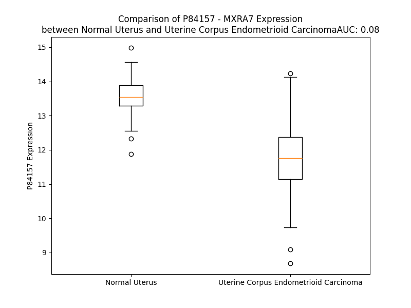

# Detailed Data for P84157

## Introduction to the Detailed Summary

### How to Interpret the Results

- **Summary & Metrics**: This section provides a quick reference to essential protein attributes, including expression changes, family classification, and biomarker applications. Regulation status (upregulated/downregulated) indicates the protein's behavior in a disease context. Some information comes from the original excel file with the proteins selected from literature, while others are derived from the analyses.
- **Expression Comparison**: A visual representation comparing protein expression between normal and disease states. It highlights significant changes in expression levels that might indicate diagnostic or therapeutic relevance. This is data coming from transcriptomics experiments and could not translate similarly to protein levels.
- **Isoform Alignment**: An interactive view of isoform alignments, revealing structural and functional differences between variants of the protein.
- **Interactors & Homologs**: Tables listing known interaction partners and homologous proteins, the more interactors and homologs, the more complex the protein is to design an antibody for.
- **Biological Assemblies**: Information about the structural arrangement of the protein in different assemblies, providing insights into its functional state but also the complexity of the protein to develop antibodies.
- **Combined Per-Residue Information**: A detailed table summarizing residue-level data. This includes predictions for epitope regions, aggregation tendencies, and modifications that might impact the protein's function. Each row corresponds to a residue in the protein, providing insights into specific sites that may be important for research or drug development.
## Summary & Metrics

- **UniProt Accession**: P84157
- **Gene Name**: MXRA7
- **Protein Name**: MXRA7_HUMAN
- **Swiss Prot**: NA
- **Family**: NA
- **Biomarker Application**: NA
- **Number of Isoforms**: 3
- **Regulation**: NA
- **(transcriptomics) AUC**: 0.08
- **(transcriptomics) Fold Change**: 1.15
- **(transcriptomics) Regulation**: Downregulated
- **Discotope Epitope Count**: 11
- **Max n_uniprots (Homo)**: N/A
- **Max n_uniprots (Hetero)**: N/A

## Expression Comparison

## Isoform Alignment

<pre style='font-size:14px; font-family:monospace;'>P84157-1 MEAPAELLAALPALATALALLLAWLLVRRGAAASPEPARAPPEPAPPAEATGAPAPSRPCAPEPAASPAGPEEPGEPAGLGELGEPAGPGEPEGPGDPAAAPAEAEEQAVEARQEEEQDLDGEKGPSSEGPEEEDGEGFSFKYSPGKLRGNQYKKMMTKEELEEEQRVQKEQLAAIFKLMKDNKETFGEMSDGDVQEQLRLYDM
P84157-2 MEAPAELLAALPALATALALLLAWLLVRRGAAASPEPARAPPEPAPPAEATGAPAPSRPCAPEPAASPAGPEEPGEPAGLGELGEPAGPGEPEGPGDPAAAPAEAEEQAVEARQEEEQDLDGEKGPSSEGPEEEDGEGFSFKYSPGKLRGNQYKKMMTKEELEEEQRTEE----------------------------------
P84157-3 MEAPAELLAALPALATALALLLAWLLVRRGAAASPEPARAPPEPAPPAEATGAPAPSRPCAPEPAASPAGPEEPGEPAGLGELGEPAGPGEPEGPGDPAAAPAEAEEQAVEARQEEEQDLDGEKGPSSEGPEEEDGEGFSFKYSPGKLRGNQYKKMMTKEELEEEQRIELTSDLTSL---------------------------
</pre>

## Interactors

| preferredName_A   | preferredName_B   | score   |
|-------------------|-------------------|---------|

## Homologs

| uniprot_id   | gene_id   |
|--------------|-----------|

## Combined Per-Residue Information

|   res | aa   |   epitope_score | epitope   |   relative_surface_accessibility |   modeling_confidence |   Aggregation | modification   |
|------:|:-----|----------------:|:----------|---------------------------------:|----------------------:|--------------:|:---------------|
|     1 | M    |         0.10176 | False     |                          1.32316 |                 49.73 |         0     | N/A            |
|     2 | E    |         0.17381 | False     |                          0.90347 |                 65.61 |         0     | N/A            |
|     3 | A    |         0.14447 | False     |                          0.74706 |                 67.81 |         0     | N/A            |
|     4 | P    |         0.19549 | False     |                          0.77784 |                 69.28 |         0     | N/A            |
|     5 | A    |         0.14207 | False     |                          0.69951 |                 73.2  |         0     | N/A            |
|     6 | E    |         0.21078 | False     |                          0.71381 |                 71.62 |         0     | N/A            |
|     7 | L    |         0.18973 | False     |                          0.81948 |                 69.06 |         0     | N/A            |
|     8 | L    |         0.19131 | False     |                          0.75978 |                 76.79 |         0     | N/A            |
|     9 | A    |         0.09803 | False     |                          0.70621 |                 82.91 |         0     | N/A            |
|    10 | A    |         0.13022 | False     |                          0.4921  |                 85.28 |         0     | N/A            |
|    11 | L    |         0.16591 | False     |                          0.61491 |                 86.92 |         0     | N/A            |
|    12 | P    |         0.15533 | False     |                          0.61229 |                 91.8  |         0.318 | N/A            |
|    13 | A    |         0.1083  | False     |                          0.59389 |                 91.12 |        26.27  | N/A            |
|    14 | L    |         0.16916 | False     |                          0.76174 |                 91.27 |        56.956 | N/A            |
|    15 | A    |         0.15686 | False     |                          0.51809 |                 94.63 |        62.574 | N/A            |
|    16 | T    |         0.10703 | False     |                          0.5767  |                 95.91 |        69.216 | N/A            |
|    17 | A    |         0.12232 | False     |                          0.55326 |                 95.4  |        80.376 | N/A            |
|    18 | L    |         0.23843 | False     |                          0.56941 |                 96.83 |        93.561 | N/A            |
|    19 | A    |         0.12669 | False     |                          0.54625 |                 96.51 |        95.963 | N/A            |
|    20 | L    |         0.1665  | False     |                          0.78276 |                 97.14 |        98.792 | N/A            |
|    21 | L    |         0.11899 | False     |                          0.61816 |                 96.52 |        99.292 | N/A            |
|    22 | L    |         0.10125 | False     |                          0.57106 |                 95.73 |        99.312 | N/A            |
|    23 | A    |         0.10947 | False     |                          0.46419 |                 94.82 |        98.909 | N/A            |
|    24 | W    |         0.14737 | False     |                          0.55508 |                 95.8  |        98.548 | N/A            |
|    25 | L    |         0.12305 | False     |                          0.59181 |                 94.77 |        97.012 | N/A            |
|    26 | L    |         0.10412 | False     |                          0.7616  |                 93.19 |        88.578 | N/A            |
|    27 | V    |         0.0907  | False     |                          0.77873 |                 89.58 |        71.809 | N/A            |
|    28 | R    |         0.12468 | False     |                          0.63861 |                 88.84 |         0     | N/A            |
|    29 | R    |         0.15561 | False     |                          0.77352 |                 82.75 |         0     | N/A            |
|    30 | G    |         0.17432 | False     |                          0.50114 |                 64.38 |         0     | N/A            |
|    31 | A    |         0.20228 | False     |                          0.81421 |                 56.02 |         0     | N/A            |
|    32 | A    |         0.1662  | False     |                          0.8997  |                 46.39 |         0     | N/A            |
|    33 | A    |         0.18714 | False     |                          0.73102 |                 46.67 |         0     | N/A            |
|    34 | S    |         0.18159 | False     |                          0.69682 |                 43.98 |         0     | N/A            |
|    35 | P    |         0.23632 | False     |                          0.86273 |                 53.29 |         0     | N/A            |
|    36 | E    |         0.24592 | False     |                          0.76755 |                 45.48 |         0     | N/A            |
|    37 | P    |         0.24377 | False     |                          0.87535 |                 54.09 |         0     | N/A            |
|    38 | A    |         0.24133 | False     |                          0.91535 |                 45.18 |         0     | N/A            |
|    39 | R    |         0.35681 | True      |                          0.87618 |                 43.45 |         0     | N/A            |
|    40 | A    |         0.21981 | False     |                          0.86623 |                 52.24 |         0     | N/A            |
|    41 | P    |         0.28489 | False     |                          0.84748 |                 63.23 |         0     | N/A            |
|    42 | P    |         0.22899 | False     |                          0.94347 |                 59.22 |         0     | N/A            |
|    43 | E    |         0.23077 | False     |                          0.82714 |                 59.24 |         0     | N/A            |
|    44 | P    |         0.29943 | True      |                          0.91075 |                 55.52 |         0     | N/A            |
|    45 | A    |         0.24492 | False     |                          0.83789 |                 60.83 |         0     | N/A            |
|    46 | P    |         0.26755 | False     |                          0.8738  |                 63.58 |         0     | N/A            |
|    47 | P    |         0.24138 | False     |                          0.94458 |                 49.76 |         0     | N/A            |
|    48 | A    |         0.15953 | False     |                          0.9808  |                 46.89 |         0     | N/A            |
|    49 | E    |         0.23562 | False     |                          0.8949  |                 42.99 |         0     | N/A            |
|    50 | A    |         0.17571 | False     |                          0.85615 |                 43.65 |         0     | N/A            |
|    51 | T    |         0.20556 | False     |                          1.03304 |                 41.16 |         0     | N/A            |
|    52 | G    |         0.22656 | False     |                          0.84236 |                 44.19 |         0     | N/A            |
|    53 | A    |         0.19291 | False     |                          0.96683 |                 46.38 |         0     | N/A            |
|    54 | P    |         0.14225 | False     |                          0.87571 |                 49.51 |         0     | N/A            |
|    55 | A    |         0.21459 | False     |                          0.8809  |                 48.78 |         0     | N/A            |
|    56 | P    |         0.13226 | False     |                          0.88725 |                 59.6  |         0     | N/A            |
|    57 | S    |         0.16108 | False     |                          0.79931 |                 46.01 |         0     | N/A            |
|    58 | R    |         0.18793 | False     |                          0.94084 |                 53.98 |         0     | N/A            |
|    59 | P    |         0.15618 | False     |                          0.82042 |                 53.31 |         0     | N/A            |
|    60 | C    |         0.14072 | False     |                          0.97295 |                 37.58 |         0     | N/A            |
|    61 | A    |         0.153   | False     |                          0.91112 |                 51.41 |         0     | N/A            |
|    62 | P    |         0.18679 | False     |                          0.93047 |                 53.75 |         0     | N/A            |
|    63 | E    |         0.17977 | False     |                          0.90643 |                 45.56 |         0     | N/A            |
|    64 | P    |         0.16661 | False     |                          0.91549 |                 53.22 |         0     | N/A            |
|    65 | A    |         0.19432 | False     |                          0.89728 |                 42.55 |         0     | N/A            |
|    66 | A    |         0.13774 | False     |                          0.95467 |                 43.72 |         0     | N/A            |
|    67 | S    |         0.15071 | False     |                          0.79029 |                 49.43 |         0     | N/A            |
|    68 | P    |         0.12957 | False     |                          0.9583  |                 50.55 |         0     | N/A            |
|    69 | A    |         0.16161 | False     |                          1.00943 |                 41.03 |         0     | N/A            |
|    70 | G    |         0.19056 | False     |                          0.80689 |                 45.7  |         0     | N/A            |
|    71 | P    |         0.24311 | False     |                          0.88244 |                 51.35 |         0     | N/A            |
|    72 | E    |         0.25887 | False     |                          0.86478 |                 43.92 |         0     | N/A            |
|    73 | E    |         0.19592 | False     |                          0.83153 |                 49.64 |         0     | N/A            |
|    74 | P    |         0.22057 | False     |                          0.8556  |                 50.12 |         0     | N/A            |
|    75 | G    |         0.30899 | True      |                          0.90416 |                 42.48 |         0     | N/A            |
|    76 | E    |         0.1811  | False     |                          0.87982 |                 45.99 |         0     | N/A            |
|    77 | P    |         0.215   | False     |                          0.87835 |                 52.61 |         0     | N/A            |
|    78 | A    |         0.20935 | False     |                          0.9709  |                 43.67 |         0     | N/A            |
|    79 | G    |         0.22685 | False     |                          0.76912 |                 41.14 |         0     | N/A            |
|    80 | L    |         0.2397  | False     |                          1.13675 |                 45.27 |         0     | N/A            |
|    81 | G    |         0.18474 | False     |                          0.82134 |                 39.94 |         0     | N/A            |
|    82 | E    |         0.23076 | False     |                          0.80663 |                 43.67 |         0     | N/A            |
|    83 | L    |         0.31693 | True      |                          1.00556 |                 39.34 |         0     | N/A            |
|    84 | G    |         0.22494 | False     |                          0.85809 |                 35.68 |         0     | N/A            |
|    85 | E    |         0.17144 | False     |                          0.9004  |                 47.14 |         0     | N/A            |
|    86 | P    |         0.19905 | False     |                          0.89754 |                 49.81 |         0     | N/A            |
|    87 | A    |         0.29452 | True      |                          0.96214 |                 40.28 |         0     | N/A            |
|    88 | G    |         0.18079 | False     |                          0.87632 |                 42.9  |         0     | N/A            |
|    89 | P    |         0.20832 | False     |                          1.05957 |                 45.61 |         0     | N/A            |
|    90 | G    |         0.26725 | False     |                          0.95638 |                 42.49 |         0     | N/A            |
|    91 | E    |         0.16872 | False     |                          0.88656 |                 45.17 |         0     | N/A            |
|    92 | P    |         0.22753 | False     |                          0.7963  |                 53.65 |         0     | N/A            |
|    93 | E    |         0.21545 | False     |                          0.90558 |                 46.41 |         0     | N/A            |
|    94 | G    |         0.2562  | False     |                          0.82918 |                 51.39 |         0     | N/A            |
|    95 | P    |         0.2251  | False     |                          1.06741 |                 46.26 |         0     | N/A            |
|    96 | G    |         0.25867 | False     |                          0.94032 |                 41.99 |         0     | N/A            |
|    97 | D    |         0.22518 | False     |                          0.84243 |                 41.18 |         0     | N/A            |
|    98 | P    |         0.17857 | False     |                          0.87948 |                 47.43 |         0     | N/A            |
|    99 | A    |         0.23384 | False     |                          0.82573 |                 38.74 |         0     | N/A            |
|   100 | A    |         0.19448 | False     |                          0.98957 |                 42.54 |         0     | N/A            |
|   101 | A    |         0.19903 | False     |                          0.90315 |                 43.76 |         0     | N/A            |
|   102 | P    |         0.1652  | False     |                          0.74511 |                 45.76 |         0     | N/A            |
|   103 | A    |         0.13481 | False     |                          0.91618 |                 49.37 |         0     | N/A            |
|   104 | E    |         0.15057 | False     |                          0.79026 |                 48.97 |         0     | N/A            |
|   105 | A    |         0.10509 | False     |                          0.63563 |                 50.45 |         0     | N/A            |
|   106 | E    |         0.15493 | False     |                          0.72147 |                 54.79 |         0     | N/A            |
|   107 | E    |         0.13131 | False     |                          0.73169 |                 49.69 |         0     | N/A            |
|   108 | Q    |         0.19706 | False     |                          0.73431 |                 49.69 |         0     | N/A            |
|   109 | A    |         0.09018 | False     |                          0.54426 |                 50.31 |         0     | N/A            |
|   110 | V    |         0.09593 | False     |                          0.69056 |                 54    |         0     | N/A            |
|   111 | E    |         0.13588 | False     |                          0.71921 |                 52.07 |         0     | N/A            |
|   112 | A    |         0.08136 | False     |                          0.63993 |                 49.69 |         0     | N/A            |
|   113 | R    |         0.17167 | False     |                          0.81092 |                 53.27 |         0     | N/A            |
|   114 | Q    |         0.18166 | False     |                          0.74985 |                 48.24 |         0     | N/A            |
|   115 | E    |         0.18937 | False     |                          0.81811 |                 54.84 |         0     | N/A            |
|   116 | E    |         0.20486 | False     |                          0.7806  |                 50.77 |         0     | N/A            |
|   117 | E    |         0.17849 | False     |                          0.86214 |                 48.96 |         0     | N/A            |
|   118 | Q    |         0.22789 | False     |                          0.92271 |                 49.75 |         0     | N/A            |
|   119 | D    |         0.2043  | False     |                          0.81353 |                 44.77 |         0     | N/A            |
|   120 | L    |         0.20594 | False     |                          1.08301 |                 52.62 |         0     | N/A            |
|   121 | D    |         0.26513 | False     |                          0.92292 |                 47.08 |         0     | N/A            |
|   122 | G    |         0.20604 | False     |                          0.89911 |                 46.08 |         0     | N/A            |
|   123 | E    |         0.215   | False     |                          0.91522 |                 46.02 |         0     | N/A            |
|   124 | K    |         0.20247 | False     |                          0.91805 |                 45.24 |         0     | N/A            |
|   125 | G    |         0.17258 | False     |                          0.73774 |                 40.5  |         0     | N/A            |
|   126 | P    |         0.16017 | False     |                          0.97977 |                 46.52 |         0     | N/A            |
|   127 | S    |         0.17462 | False     |                          0.88167 |                 50.18 |         0     | N/A            |
|   128 | S    |         0.23106 | False     |                          0.82348 |                 42.2  |         0     | N/A            |
|   129 | E    |         0.21005 | False     |                          0.9258  |                 42.49 |         0     | N/A            |
|   130 | G    |         0.21059 | False     |                          0.82762 |                 36.01 |         0     | N/A            |
|   131 | P    |         0.17123 | False     |                          0.92021 |                 45.26 |         0     | N/A            |
|   132 | E    |         0.18493 | False     |                          0.86474 |                 37.27 |         0     | N/A            |
|   133 | E    |         0.16005 | False     |                          0.91451 |                 42.56 |         0     | N/A            |
|   134 | E    |         0.18512 | False     |                          0.88989 |                 46.92 |         0     | N/A            |
|   135 | D    |         0.18562 | False     |                          0.81392 |                 49.23 |         0     | N/A            |
|   136 | G    |         0.19494 | False     |                          0.97771 |                 45.95 |         0     | N/A            |
|   137 | E    |         0.17831 | False     |                          0.85667 |                 52.45 |         0     | N/A            |
|   138 | G    |         0.13761 | False     |                          0.81727 |                 49.05 |         0     | N/A            |
|   139 | F    |         0.24388 | False     |                          1.0636  |                 53.07 |         0     | N/A            |
|   140 | S    |         0.16119 | False     |                          0.6503  |                 66.43 |         0     | N/A            |
|   141 | F    |         0.24568 | False     |                          0.98823 |                 59.26 |         0     | N/A            |
|   142 | K    |         0.19489 | False     |                          0.82212 |                 69.18 |         0     | N/A            |
|   143 | Y    |         0.31859 | True      |                          0.76969 |                 64.8  |         0     | N/A            |
|   144 | S    |         0.1565  | False     |                          0.37565 |                 59.74 |         0     | N/A            |
|   145 | P    |         0.1747  | False     |                          0.7404  |                 65.63 |         0     | N/A            |
|   146 | G    |         0.14092 | False     |                          0.6564  |                 61.17 |         0     | N/A            |
|   147 | K    |         0.18626 | False     |                          0.75057 |                 59.09 |         0     | N/A            |
|   148 | L    |         0.17205 | False     |                          0.91212 |                 55.11 |         0     | N/A            |
|   149 | R    |         0.24193 | False     |                          0.6945  |                 60.22 |         0     | N/A            |
|   150 | G    |         0.18523 | False     |                          0.44258 |                 64.53 |         0     | N/A            |
|   151 | N    |         0.24288 | False     |                          0.65783 |                 66.68 |         0     | N/A            |
|   152 | Q    |         0.17785 | False     |                          0.49271 |                 68.57 |         0     | N/A            |
|   153 | Y    |         0.21859 | False     |                          0.50231 |                 68.64 |         0     | N/A            |
|   154 | K    |         0.12969 | False     |                          0.59369 |                 77    |         0     | N/A            |
|   155 | K    |         0.22034 | False     |                          0.71436 |                 78.82 |         0     | N/A            |
|   156 | M    |         0.2145  | False     |                          0.70556 |                 80.12 |         0     | N/A            |
|   157 | M    |         0.10182 | False     |                          0.13855 |                 77.66 |         0     | N/A            |
|   158 | T    |         0.31593 | True      |                          0.616   |                 84.79 |         0     | N/A            |
|   159 | K    |         0.14934 | False     |                          0.87414 |                 88.07 |         0     | N/A            |
|   160 | E    |         0.20011 | False     |                          0.71272 |                 87.97 |         0     | N/A            |
|   161 | E    |         0.20533 | False     |                          0.416   |                 88.76 |         0     | N/A            |
|   162 | L    |         0.13187 | False     |                          0.22154 |                 86.99 |         0     | N/A            |
|   163 | E    |         0.23998 | False     |                          0.60381 |                 90.84 |         0     | N/A            |
|   164 | E    |         0.20641 | False     |                          0.57181 |                 90.38 |         0     | N/A            |
|   165 | E    |         0.14411 | False     |                          0.4661  |                 88.02 |         0     | N/A            |
|   166 | Q    |         0.13753 | False     |                          0.40513 |                 87.28 |         0     | N/A            |
|   167 | R    |         0.22507 | False     |                          0.71222 |                 92.96 |         0     | N/A            |
|   168 | V    |         0.1326  | False     |                          0.39701 |                 92.5  |         0     | N/A            |
|   169 | Q    |         0.11291 | False     |                          0.60271 |                 88.95 |         0     | N/A            |
|   170 | K    |         0.15637 | False     |                          0.69384 |                 89.88 |         0     | N/A            |
|   171 | E    |         0.14165 | False     |                          0.59967 |                 93.65 |         0     | N/A            |
|   172 | Q    |         0.12543 | False     |                          0.54136 |                 92.31 |         0.615 | N/A            |
|   173 | L    |         0.11848 | False     |                          0.3606  |                 89.65 |        43.974 | N/A            |
|   174 | A    |         0.14076 | False     |                          0.55451 |                 91.64 |        43.974 | N/A            |
|   175 | A    |         0.1183  | False     |                          0.55706 |                 93.53 |        43.974 | N/A            |
|   176 | I    |         0.13156 | False     |                          0.53575 |                 88.58 |        43.974 | N/A            |
|   177 | F    |         0.16847 | False     |                          0.30258 |                 87.65 |        43.974 | N/A            |
|   178 | K    |         0.20795 | False     |                          0.66076 |                 92.21 |         0     | N/A            |
|   179 | L    |         0.17456 | False     |                          0.60873 |                 91.31 |         0     | N/A            |
|   180 | M    |         0.08003 | False     |                          0.13967 |                 88.32 |         0     | N/A            |
|   181 | K    |         0.18384 | False     |                          0.69117 |                 87.62 |         0     | N/A            |
|   182 | D    |         0.12808 | False     |                          0.6271  |                 92.14 |         0     | N/A            |
|   183 | N    |         0.19564 | False     |                          0.34573 |                 90.1  |         0     | N/A            |
|   184 | K    |         0.40729 | True      |                          0.49839 |                 89.2  |         0     | N/A            |
|   185 | E    |         0.25114 | False     |                          0.96443 |                 88.49 |         0     | N/A            |
|   186 | T    |         0.32001 | True      |                          0.76722 |                 88.06 |         0     | N/A            |
|   187 | F    |         0.23179 | False     |                          0.4651  |                 83.99 |         0     | N/A            |
|   188 | G    |         0.1768  | False     |                          0.42536 |                 84.3  |         0     | N/A            |
|   189 | E    |         0.34059 | True      |                          0.81211 |                 81.9  |         0     | N/A            |
|   190 | M    |         0.23204 | False     |                          0.4865  |                 78.38 |         0     | N/A            |
|   191 | S    |         0.22783 | False     |                          0.52449 |                 80.55 |         0     | Phosphoserine  |
|   192 | D    |         0.16141 | False     |                          0.66488 |                 81.86 |         0     | N/A            |
|   193 | G    |         0.21578 | False     |                          0.45755 |                 84.9  |         0     | N/A            |
|   194 | D    |         0.20732 | False     |                          0.3995  |                 86.96 |         0     | N/A            |
|   195 | V    |         0.04027 | False     |                          0.04951 |                 82.35 |         0     | N/A            |
|   196 | Q    |         0.17363 | False     |                          0.49604 |                 83.02 |         0     | N/A            |
|   197 | E    |         0.27373 | False     |                          0.5764  |                 86.72 |         0     | N/A            |
|   198 | Q    |         0.18054 | False     |                          0.38592 |                 84.12 |         0     | N/A            |
|   199 | L    |         0.19609 | False     |                          0.52567 |                 82.1  |         0     | N/A            |
|   200 | R    |         0.29316 | True      |                          0.64142 |                 86.25 |         0     | N/A            |
|   201 | L    |         0.17718 | False     |                          0.82335 |                 83.58 |         0     | N/A            |
|   202 | Y    |         0.18985 | False     |                          0.73565 |                 72.45 |         0     | N/A            |
|   203 | D    |         0.19445 | False     |                          0.80336 |                 70.93 |         0     | N/A            |
|   204 | M    |         0.07953 | False     |                          0.97067 |                 54.89 |         0     | N/A            |

