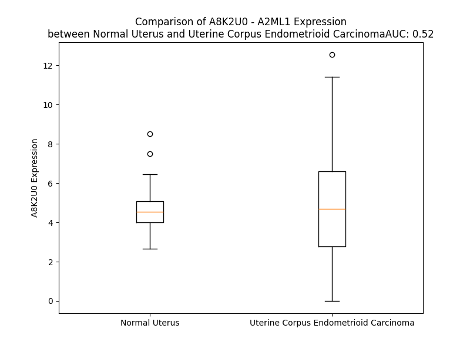

# Detailed Data for A8K2U0

## Introduction to the Detailed Summary

### How to Interpret the Results

- **Summary & Metrics**: This section provides a quick reference to essential protein attributes, including expression changes, family classification, and biomarker applications. Regulation status (upregulated/downregulated) indicates the protein's behavior in a disease context. Some information comes from the original excel file with the proteins selected from literature, while others are derived from the analyses.
- **Expression Comparison**: A visual representation comparing protein expression between normal and disease states. It highlights significant changes in expression levels that might indicate diagnostic or therapeutic relevance. This is data coming from transcriptomics experiments and could not translate similarly to protein levels.
- **Isoform Alignment**: An interactive view of isoform alignments, revealing structural and functional differences between variants of the protein.
- **Interactors & Homologs**: Tables listing known interaction partners and homologous proteins, the more interactors and homologs, the more complex the protein is to design an antibody for.
- **Biological Assemblies**: Information about the structural arrangement of the protein in different assemblies, providing insights into its functional state but also the complexity of the protein to develop antibodies.
- **Combined Per-Residue Information**: A detailed table summarizing residue-level data. This includes predictions for epitope regions, aggregation tendencies, and modifications that might impact the protein's function. Each row corresponds to a residue in the protein, providing insights into specific sites that may be important for research or drug development.
## Summary & Metrics

- **UniProt Accession**: A8K2U0
- **Gene Name**: A2ML1
- **Protein Name**: A2ML1_HUMAN
- **Swiss Prot**: NA
- **Family**: NA
- **Biomarker Application**: NA
- **Number of Isoforms**: 2
- **Regulation**: NA
- **(transcriptomics) AUC**: 0.52
- **(transcriptomics) Fold Change**: 1.05
- **(transcriptomics) Regulation**: Upregulated
- **Discotope Epitope Count**: 343
- **Max n_uniprots (Homo)**: 2
- **Max n_uniprots (Hetero)**: N/A

## Expression Comparison

## Isoform Alignment

<pre style='font-size:14px; font-family:monospace;'>A8K2U0-1 MWAQLLLGMLALSPAIAEELPNYLVTLPARLNFPSVQKVCLDLSPGYSDVKFTVTLETKDKTQKLLEYSGLKKRHLHCISFLVPPPAGGTEEVATIRVSGVGNNISFEEKKKVLIQRQGNGTFVQTDKPLYTPGQQVYFRIVTMDSNFVPVNDKYSMVELQDPNSNRIAQWLEVVPEQGIVDLSFQLAPEAMLGTYTVAVAEGKTFGTFSVEEYVLPKFKVEVVEPKELSTVQESFLVKICCRYTYGKPMLGAVQVSVCQKANTYWYREVEREQLPDKCRNLSGQTDKTGCFSAPVDMATFDLIGYAYSHQINIVATVVEEGTGVEANATQNIYISPQMGSMTFEDTSNFYHPNFPFSGKIRVRGHDDSFLKNHLVFLVIYGTNGTFNQTLVTDNNGLAPFTLETSGWNGTDVSLEGKFQMEDLVYNPEQVPRYYQNAYLHLRPFYSTTRSFLGIHRLNGPLKCGQPQEVLVDYYIDPADASPDQEISFSYYLIGKGSLVMEGQKHLNSKKKGLKASFSLSLTFTSRLAPDPSLVIYAIFPSGGVVADKIQFSVEMCFDNQVSLGFSPSQQLPGAEVELQLQAAPGSLCALRAVDESVLLLRPDRELSNRSVYGMFPFWYGHYPYQVAEYDQCPVSGPWDFPQPLIDPMPQGHSSQRSIIWRPSFSEGTDLFSFFRDVGLKILSNAKIKKPVDCSHRSPEYSTAMGAGGGHPEAFESSTPLHQAEDSQVRQYFPETWLWDLFPIGNSGKEAVHVTVPDAITEWKAMSFCTSQSRGFGLSPTVGLTAFKPFFVDLTLPYSVVRGESFRLTATIFNYLKDCIRVQTDLAKSHEYQLESWADSQTSSCLCADDAKTHHWNITAVKLGHINFTISTKILDSNEPCGGQKGFVPQKGRSDTLIKPVLVKPEGVLVEKTHSSLLCPKGKVASESVSLELPVDIVPDSTKAYVTVLGDIMGTALQNLDGLVQMPSGCGEQNMVLFAPIIYVLQYLEKAGLLTEEIRSRAVGFLEIGYQKELMYKHSNGSYSAFGERDGNGNTWLTAFVTKCFGQAQKFIFIDPKNIQDALKWMAGNQLPSGCYANVGNLLHTAMKGGVDDEVSLTAYVTAALLEMGKDVDDPMVSQGLRCLKNSATSTTNLYTQALLAYIFSLAGEMDIRNILLKQLDQQAIISGESIYWSQKPTPSSNASPWSEPAAVDVELTAYALLAQLTKPSLTQKEIAKATSIVAWLAKQHNAYGGFSSTQDTVVALQALAKYATTAYMPSEEINLVVKSTENFQRTFNIQSVNRLVFQQDTLPNVPGMYTLEASGQGCVYVQTVLRYNILPPTNMKTFSLSVEIGKARCEQPTSPRSLTLTIHTSYVGSRSSSNMAIVEVKMLSGFSPMEGTNQLLLQQPLVKKVEFGTDTLNIYLDELIKNTQTYTFTISQSVLVTNLKPATIKVYDYYLPDEQATIQYSDPCE
A8K2U0-2 -----------------------------------------------------------------------------------------------------------------------------------------------------------------------------------------------------------------------------------------------------------------------------------------------------------------------------------------------------------------------------------------------------------------------------------------------------------------------------------------------------------MLIGKGSLVMEGQKHLNSKKKGLKASFSLSLTFTSRLAPDPSLVIYAIFPSGGVVADKIQFSVEMCFDNQVSLGFSPSQQLPGAEVELQLQAAPGSLCALRAVDESVLLLRPDRELSNRSVYGMFPFWYGHYPYQVAEYDQCPVSGPWDFPQPLIDPMPQGHSSQRSIIWRPSFSEGTDLFSFFRDVGLKILSNAKIKKPVDCSHRSPEYSTAMGAGGGHPEAFESSTPLHQAEDSQVRQYFPETWLWDLFPIGNSGKEAVHVTVPDAITEWKAMSFCTSQSRGFGLSPTVGLTAFKPFFVDLTLPYSVVRGESFRLTATIFNYLKDCIRVQTDLAKSHEYQLESWADSQTSSCLCADDAKTHHWNITAVKLGHINFTISTKILDSNEPCGGQKGFVPQKGRSDTLIKPVLVKPEGVLVEKTHSSLLCPKGKVASESVSLELPVDIVPDSTKAYVTVLGDIMGTALQNLDGLVQMPSGCGEQNMVLFAPIIYVLQYLEKAGLLTEEIRSRAVGFLEIGYQKELMYKHSNGSYSAFGERDGNGNTWLTAFVTKCFGQAQKFIFIDPKNIQDALKWMAGNQLPSGCYANVGNLLHTAMKGGVDDEVSLTAYVTAALLEMGKDVDDPMVSQGLRCLKNSATSTTNLYTQALLAYIFSLAGEMDIRNILLKQLDQQAIISGESIYWSQKPTPSSNASPWSEPAAVDVELTAYALLAQLTKPSLTQKEIAKATSIVAWLAKQHNAYGGFSSTQDTVVALQALAKYATTAYMPSEEINLVVKSTENFQRTFNIQSVNRLVFQQDTLPNVPGMYTLEASGQGCVYVQTVLRYNILPPTNMKTFSLSVEIGKARCEQPTSPRSLTLTIHTSYVGSRSSSNMAIVEVKMLSGFSPMEGTNQLLLQQPLVKKVEFGTDTLNIYLDELIKNTQTYTFTISQSVLVTNLKPATIKVYDYYLPDEQATIQYSDPCE
</pre>

## Interactors

| preferredName_A   | preferredName_B   | score   |
|-------------------|-------------------|---------|

## Homologs

| uniprot_id   | gene_id   |
|:-------------|:----------|
| A0A8V8TN26   | C5        |
| P20742       | PZP       |
| A0A8Q3SI45   | C3        |
| Q6YHK3       | CD109     |
| F5H1E8       | A2M       |
| F5GXS0       | C4B       |
| P0C0L4       | C4A       |
| Q8IZJ3       | CPAMD8    |

## Biological Assemblies

|   Unnamed: 0 |   assembly |   n_uniprots | composition   | crystal_id   |
|-------------:|-----------:|-------------:|:--------------|:-------------|
|            0 |          1 |            2 | Homo          | 7q62         |
|            0 |          1 |            1 | Homo          | 7q60         |
|            0 |          1 |            1 | Homo          | 7q5z         |
|            0 |          1 |            1 | Homo          | 7q61         |
|            0 |          1 |            1 | Homo          | 7q1y         |
|            1 |          2 |            1 | Homo          | 7q1y         |

## Combined Per-Residue Information

|   res | aa   |   epitope_score | epitope   |   relative_surface_accessibility |   modeling_confidence |   Aggregation | modification   | glycosylation                   |
|------:|:-----|----------------:|:----------|---------------------------------:|----------------------:|--------------:|:---------------|:--------------------------------|
|     1 | M    |         0.15689 | True      |                          1.02536 |                 46.57 |         0     | N/A            | N/A                             |
|     2 | W    |         0.12983 | True      |                          0.93535 |                 46.28 |         5.351 | N/A            | N/A                             |
|     3 | A    |         0.08902 | False     |                          0.67553 |                 47.92 |         5.719 | N/A            | N/A                             |
|     4 | Q    |         0.12092 | True      |                          0.749   |                 49.54 |         6.621 | N/A            | N/A                             |
|     5 | L    |         0.13777 | True      |                          0.73773 |                 49.03 |        30.318 | N/A            | N/A                             |
|     6 | L    |         0.0988  | False     |                          0.64629 |                 49.57 |        34.538 | N/A            | N/A                             |
|     7 | L    |         0.07798 | False     |                          0.81152 |                 48.67 |        34.994 | N/A            | N/A                             |
|     8 | G    |         0.07237 | False     |                          0.3828  |                 49.67 |        33.917 | N/A            | N/A                             |
|     9 | M    |         0.14563 | True      |                          0.72466 |                 49.08 |        33.821 | N/A            | N/A                             |
|    10 | L    |         0.13238 | True      |                          0.78365 |                 45.74 |        33.054 | N/A            | N/A                             |
|    11 | A    |         0.19608 | True      |                          0.83079 |                 47.91 |        28.072 | N/A            | N/A                             |
|    12 | L    |         0.13511 | True      |                          0.87616 |                 38.02 |        23.783 | N/A            | N/A                             |
|    13 | S    |         0.11853 | True      |                          0.55087 |                 31.83 |         0     | N/A            | N/A                             |
|    14 | P    |         0.10583 | True      |                          0.807   |                 38.12 |         0     | N/A            | N/A                             |
|    15 | A    |         0.10803 | True      |                          0.88652 |                 35.81 |         0     | N/A            | N/A                             |
|    16 | I    |         0.13711 | True      |                          0.9295  |                 36.31 |         0     | N/A            | N/A                             |
|    17 | A    |         0.09042 | False     |                          0.76322 |                 40.61 |         0     | N/A            | N/A                             |
|    18 | E    |         0.10707 | True      |                          0.62484 |                 44.27 |         0     | N/A            | N/A                             |
|    19 | E    |         0.11407 | True      |                          0.85608 |                 53.52 |         0     | N/A            | N/A                             |
|    20 | L    |         0.0743  | False     |                          0.44679 |                 61.55 |         0     | N/A            | N/A                             |
|    21 | P    |         0.06565 | False     |                          0.30185 |                 67.65 |         0     | N/A            | N/A                             |
|    22 | N    |         0.04042 | False     |                          0.07351 |                 84.11 |         0.307 | N/A            | N/A                             |
|    23 | Y    |         0.0285  | False     |                          0.02648 |                 87.33 |         0.604 | N/A            | N/A                             |
|    24 | L    |         0.00189 | False     |                          0       |                 90.03 |         0.604 | N/A            | N/A                             |
|    25 | V    |         0.00204 | False     |                          0       |                 91.97 |         0.604 | N/A            | N/A                             |
|    26 | T    |         0.00123 | False     |                          0       |                 92.91 |         0.604 | N/A            | N/A                             |
|    27 | L    |         0.00211 | False     |                          0       |                 92.89 |         0.297 | N/A            | N/A                             |
|    28 | P    |         0.0019  | False     |                          0.00199 |                 91.65 |         0     | N/A            | N/A                             |
|    29 | A    |         0.00607 | False     |                          0.00638 |                 90.96 |         0     | N/A            | N/A                             |
|    30 | R    |         0.04698 | False     |                          0.2936  |                 89.44 |         0     | N/A            | N/A                             |
|    31 | L    |         0.00376 | False     |                          0       |                 90.04 |         0     | N/A            | N/A                             |
|    32 | N    |         0.02015 | False     |                          0.17893 |                 87.34 |         0     | N/A            | N/A                             |
|    33 | F    |         0.06128 | False     |                          0.16816 |                 85.8  |         0     | N/A            | N/A                             |
|    34 | P    |         0.17339 | True      |                          0.64224 |                 85.46 |         0     | N/A            | N/A                             |
|    35 | S    |         0.0251  | False     |                          0.15599 |                 85.66 |         0     | N/A            | N/A                             |
|    36 | V    |         0.11464 | True      |                          0.66645 |                 88.1  |         0     | N/A            | N/A                             |
|    37 | Q    |         0.01562 | False     |                          0.03426 |                 89.58 |         0     | N/A            | N/A                             |
|    38 | K    |         0.05087 | False     |                          0.23656 |                 91.62 |         0     | N/A            | N/A                             |
|    39 | V    |         0.00265 | False     |                          0.00095 |                 92.69 |         0     | N/A            | N/A                             |
|    40 | C    |         0.00351 | False     |                          0       |                 93.46 |         0     | N/A            | N/A                             |
|    41 | L    |         0.00557 | False     |                          0.0043  |                 91.13 |         0     | N/A            | N/A                             |
|    42 | D    |         0.00505 | False     |                          0.00613 |                 89.16 |         0     | N/A            | N/A                             |
|    43 | L    |         0.01314 | False     |                          0.0371  |                 85.55 |         0     | N/A            | N/A                             |
|    44 | S    |         0.02742 | False     |                          0.10572 |                 77.99 |         0     | N/A            | N/A                             |
|    45 | P    |         0.12091 | True      |                          0.54377 |                 70.86 |         0     | N/A            | N/A                             |
|    46 | G    |         0.11957 | True      |                          0.7302  |                 66.68 |         0     | N/A            | N/A                             |
|    47 | Y    |         0.03139 | False     |                          0.01912 |                 63.85 |         0     | N/A            | N/A                             |
|    48 | S    |         0.23863 | True      |                          0.56067 |                 63.09 |         0     | N/A            | N/A                             |
|    49 | D    |         0.13057 | True      |                          0.56887 |                 74.1  |         0     | N/A            | N/A                             |
|    50 | V    |         0.05872 | False     |                          0.07692 |                 79.7  |         1.13  | N/A            | N/A                             |
|    51 | K    |         0.11112 | True      |                          0.45149 |                 86.83 |         1.13  | N/A            | N/A                             |
|    52 | F    |         0.00545 | False     |                          0       |                 87.71 |        32.524 | N/A            | N/A                             |
|    53 | T    |         0.0334  | False     |                          0.15465 |                 91.09 |        32.524 | N/A            | N/A                             |
|    54 | V    |         0.00321 | False     |                          0       |                 93.18 |        32.524 | N/A            | N/A                             |
|    55 | T    |         0.10517 | True      |                          0.13173 |                 94.61 |        32.524 | N/A            | N/A                             |
|    56 | L    |         0.00522 | False     |                          0.00061 |                 94.39 |        32.524 | N/A            | N/A                             |
|    57 | E    |         0.06475 | False     |                          0.20685 |                 93.92 |         1.13  | N/A            | N/A                             |
|    58 | T    |         0.05135 | False     |                          0.1637  |                 90.86 |         0.202 | N/A            | N/A                             |
|    59 | K    |         0.14397 | True      |                          0.85395 |                 84.81 |         0     | N/A            | N/A                             |
|    60 | D    |         0.1466  | True      |                          0.69197 |                 80.98 |         0     | N/A            | N/A                             |
|    61 | K    |         0.20577 | True      |                          0.7644  |                 84.66 |         0     | N/A            | N/A                             |
|    62 | T    |         0.20861 | True      |                          0.66183 |                 89.96 |         0     | N/A            | N/A                             |
|    63 | Q    |         0.08354 | False     |                          0.32107 |                 89.66 |         0     | N/A            | N/A                             |
|    64 | K    |         0.12495 | True      |                          0.5659  |                 92.63 |         0     | N/A            | N/A                             |
|    65 | L    |         0.05903 | False     |                          0.10904 |                 89.23 |         0     | N/A            | N/A                             |
|    66 | L    |         0.05396 | False     |                          0.03545 |                 87.38 |         0     | N/A            | N/A                             |
|    67 | E    |         0.15048 | True      |                          0.41099 |                 88.13 |         0     | N/A            | N/A                             |
|    68 | Y    |         0.0857  | False     |                          0.20345 |                 84.56 |         0     | N/A            | N/A                             |
|    69 | S    |         0.11417 | True      |                          0.49354 |                 80.82 |         0     | N/A            | N/A                             |
|    70 | G    |         0.04302 | False     |                          0.08209 |                 71.26 |         0     | N/A            | N/A                             |
|    71 | L    |         0.12407 | True      |                          0.49122 |                 67.91 |         0     | N/A            | N/A                             |
|    72 | K    |         0.13644 | True      |                          0.88908 |                 65.92 |         0     | N/A            | N/A                             |
|    73 | K    |         0.14371 | True      |                          0.75417 |                 72.73 |         0     | N/A            | N/A                             |
|    74 | R    |         0.07307 | False     |                          0.12318 |                 74.75 |         0     | N/A            | N/A                             |
|    75 | H    |         0.11134 | True      |                          0.39471 |                 81.3  |         0     | N/A            | N/A                             |
|    76 | L    |         0.02578 | False     |                          0.11352 |                 88.58 |         0.428 | N/A            | N/A                             |
|    77 | H    |         0.12566 | True      |                          0.2906  |                 88.86 |         0.644 | N/A            | N/A                             |
|    78 | C    |         0.03008 | False     |                          0.22387 |                 91.21 |         1.609 | N/A            | N/A                             |
|    79 | I    |         0.1413  | True      |                          0.25599 |                 91.16 |         2.071 | N/A            | N/A                             |
|    80 | S    |         0.14054 | True      |                          0.51968 |                 91.7  |         2.071 | N/A            | N/A                             |
|    81 | F    |         0.07514 | False     |                          0.06108 |                 91.81 |         2.071 | N/A            | N/A                             |
|    82 | L    |         0.13508 | True      |                          0.70654 |                 90.92 |         2.071 | N/A            | N/A                             |
|    83 | V    |         0.00426 | False     |                          0.00211 |                 90.2  |         0.462 | N/A            | N/A                             |
|    84 | P    |         0.07078 | False     |                          0.20279 |                 90.53 |         0     | N/A            | N/A                             |
|    85 | P    |         0.14244 | True      |                          0.62156 |                 89.18 |         0     | N/A            | N/A                             |
|    86 | P    |         0.02342 | False     |                          0.06574 |                 89.45 |         0     | N/A            | N/A                             |
|    87 | A    |         0.12065 | True      |                          0.47284 |                 83.73 |         0     | N/A            | N/A                             |
|    88 | G    |         0.15488 | True      |                          0.69763 |                 75.85 |         0     | N/A            | N/A                             |
|    89 | G    |         0.21277 | True      |                          0.50368 |                 79.67 |         0     | N/A            | N/A                             |
|    90 | T    |         0.14226 | True      |                          0.68827 |                 83.73 |         0     | N/A            | N/A                             |
|    91 | E    |         0.08933 | False     |                          0.32977 |                 89.16 |         0     | N/A            | N/A                             |
|    92 | E    |         0.06135 | False     |                          0.04745 |                 92.52 |         0     | N/A            | N/A                             |
|    93 | V    |         0.07552 | False     |                          0.45854 |                 92.12 |         0     | N/A            | N/A                             |
|    94 | A    |         0.00723 | False     |                          0.01275 |                 93.39 |         0     | N/A            | N/A                             |
|    95 | T    |         0.07399 | False     |                          0.24633 |                 94.38 |         0     | N/A            | N/A                             |
|    96 | I    |         0.00678 | False     |                          0       |                 94.09 |         0     | N/A            | N/A                             |
|    97 | R    |         0.17301 | True      |                          0.33926 |                 92.88 |         0     | N/A            | N/A                             |
|    98 | V    |         0.01212 | False     |                          0       |                 90.86 |         0     | N/A            | N/A                             |
|    99 | S    |         0.10926 | True      |                          0.19959 |                 89.72 |         0     | N/A            | N/A                             |
|   100 | G    |         0.01058 | False     |                          0       |                 86.28 |         0     | N/A            | N/A                             |
|   101 | V    |         0.13614 | True      |                          0.63603 |                 83.14 |         0     | N/A            | N/A                             |
|   102 | G    |         0.12444 | True      |                          0.2177  |                 79.63 |         0     | N/A            | N/A                             |
|   103 | N    |         0.2215  | True      |                          0.846   |                 75.19 |         0     | N/A            | N/A                             |
|   104 | N    |         0.1987  | True      |                          0.87697 |                 73.93 |         0     | N/A            | N/A                             |
|   105 | I    |         0.10614 | True      |                          0.23406 |                 73.75 |         0     | N/A            | N/A                             |
|   106 | S    |         0.1879  | True      |                          0.75015 |                 81.68 |         0     | N/A            | N/A                             |
|   107 | F    |         0.17483 | True      |                          0.18593 |                 85.15 |         0     | N/A            | N/A                             |
|   108 | E    |         0.17722 | True      |                          0.44779 |                 88.68 |         0     | N/A            | N/A                             |
|   109 | E    |         0.10589 | True      |                          0.22368 |                 89.59 |         0     | N/A            | N/A                             |
|   110 | K    |         0.20609 | True      |                          0.50275 |                 92.12 |         0     | N/A            | N/A                             |
|   111 | K    |         0.05653 | False     |                          0.24824 |                 91.74 |         0     | N/A            | N/A                             |
|   112 | K    |         0.08049 | False     |                          0.60755 |                 93.05 |         0     | N/A            | N/A                             |
|   113 | V    |         0.00327 | False     |                          0       |                 92.67 |         0     | N/A            | N/A                             |
|   114 | L    |         0.00777 | False     |                          0.00577 |                 91.9  |         0     | N/A            | N/A                             |
|   115 | I    |         0.00423 | False     |                          0       |                 91.38 |         0     | N/A            | N/A                             |
|   116 | Q    |         0.06501 | False     |                          0.26518 |                 87.95 |         0     | N/A            | N/A                             |
|   117 | R    |         0.11808 | True      |                          0.53111 |                 85.56 |         0     | N/A            | N/A                             |
|   118 | Q    |         0.08679 | False     |                          0.18788 |                 80    |         0     | N/A            | N/A                             |
|   119 | G    |         0.12928 | True      |                          0.63476 |                 78.03 |         0     | N/A            | N/A                             |
|   120 | N    |         0.06485 | False     |                          0.52042 |                 86.31 |         0     | N/A            | N-linked (GlcNAc...) asparagine |
|   121 | G    |         0.0194  | False     |                          0.06116 |                 88.86 |         0     | N/A            | N/A                             |
|   122 | T    |         0.04016 | False     |                          0.15546 |                 90.62 |         0.329 | N/A            | N/A                             |
|   123 | F    |         0.05506 | False     |                          0.08921 |                 91.46 |         0.329 | N/A            | N/A                             |
|   124 | V    |         0.01476 | False     |                          0.1919  |                 91.23 |         0.329 | N/A            | N/A                             |
|   125 | Q    |         0.01952 | False     |                          0.10028 |                 91.96 |         0.329 | N/A            | N/A                             |
|   126 | T    |         0.02529 | False     |                          0.11246 |                 92.26 |         0.329 | N/A            | N/A                             |
|   127 | D    |         0.00537 | False     |                          0.01072 |                 91.64 |         0     | N/A            | N/A                             |
|   128 | K    |         0.02642 | False     |                          0.0472  |                 88.7  |         0     | N/A            | N/A                             |
|   129 | P    |         0.01811 | False     |                          0.06237 |                 84.39 |         0     | N/A            | N/A                             |
|   130 | L    |         0.02476 | False     |                          0.03215 |                 85.28 |         0     | N/A            | N/A                             |
|   131 | Y    |         0.00734 | False     |                          0       |                 87.03 |         0     | N/A            | N/A                             |
|   132 | T    |         0.074   | False     |                          0.21996 |                 78.95 |         0     | N/A            | N/A                             |
|   133 | P    |         0.02777 | False     |                          0.2235  |                 75.51 |         0     | N/A            | N/A                             |
|   134 | G    |         0.03427 | False     |                          0.36136 |                 76    |         0     | N/A            | N/A                             |
|   135 | Q    |         0.03614 | False     |                          0.19456 |                 85.52 |         0     | N/A            | N/A                             |
|   136 | Q    |         0.04319 | False     |                          0.35622 |                 89.54 |         0     | N/A            | N/A                             |
|   137 | V    |         0.00175 | False     |                          0.00095 |                 92.35 |         1.486 | N/A            | N/A                             |
|   138 | Y    |         0.0659  | False     |                          0.32658 |                 94.52 |         1.486 | N/A            | N/A                             |
|   139 | F    |         0.0032  | False     |                          0.00127 |                 94.41 |         1.486 | N/A            | N/A                             |
|   140 | R    |         0.00506 | False     |                          0.0014  |                 94.59 |         1.486 | N/A            | N/A                             |
|   141 | I    |         0.00179 | False     |                          0       |                 94.11 |         1.486 | N/A            | N/A                             |
|   142 | V    |         0.00225 | False     |                          0.00095 |                 93.95 |         1.486 | N/A            | N/A                             |
|   143 | T    |         0.02066 | False     |                          0.0724  |                 92.42 |         1.486 | N/A            | N/A                             |
|   144 | M    |         0.00786 | False     |                          0.00216 |                 91.37 |         1.486 | N/A            | N/A                             |
|   145 | D    |         0.0204  | False     |                          0.19632 |                 87.68 |         1.486 | N/A            | N/A                             |
|   146 | S    |         0.03004 | False     |                          0.14989 |                 82.5  |         0.164 | N/A            | N/A                             |
|   147 | N    |         0.04477 | False     |                          0.54108 |                 84.29 |         0     | N/A            | N/A                             |
|   148 | F    |         0.01256 | False     |                          0.03264 |                 91.02 |         0     | N/A            | N/A                             |
|   149 | V    |         0.04241 | False     |                          0.2956  |                 91.03 |         0     | N/A            | N/A                             |
|   150 | P    |         0.01754 | False     |                          0.03224 |                 92.69 |         0     | N/A            | N/A                             |
|   151 | V    |         0.03006 | False     |                          0.19344 |                 89.55 |         0     | N/A            | N/A                             |
|   152 | N    |         0.11356 | True      |                          0.41127 |                 89.29 |         0     | N/A            | N/A                             |
|   153 | D    |         0.09815 | False     |                          0.62291 |                 87.16 |         0     | N/A            | N/A                             |
|   154 | K    |         0.22599 | True      |                          0.63281 |                 89    |         0     | N/A            | N/A                             |
|   155 | Y    |         0.0276  | False     |                          0.08456 |                 87.76 |         0     | N/A            | N/A                             |
|   156 | S    |         0.11961 | True      |                          0.44763 |                 87.67 |         0     | N/A            | N/A                             |
|   157 | M    |         0.05462 | False     |                          0.29635 |                 87.65 |         0     | N/A            | N/A                             |
|   158 | V    |         0.00166 | False     |                          0       |                 92.08 |         0     | N/A            | N/A                             |
|   159 | E    |         0.04083 | False     |                          0.11319 |                 90.98 |         0     | N/A            | N/A                             |
|   160 | L    |         0.00276 | False     |                          0.00165 |                 91.85 |         0     | N/A            | N/A                             |
|   161 | Q    |         0.03262 | False     |                          0.2166  |                 90.73 |         0     | N/A            | N/A                             |
|   162 | D    |         0.01541 | False     |                          0.06796 |                 87.41 |         0     | N/A            | N/A                             |
|   163 | P    |         0.03729 | False     |                          0.34565 |                 86.57 |         0     | N/A            | N/A                             |
|   164 | N    |         0.11036 | True      |                          0.56155 |                 80.52 |         0     | N/A            | N/A                             |
|   165 | S    |         0.12807 | True      |                          0.63569 |                 84.69 |         0     | N/A            | N/A                             |
|   166 | N    |         0.03774 | False     |                          0.11753 |                 85.11 |         0     | N/A            | N/A                             |
|   167 | R    |         0.10925 | True      |                          0.23855 |                 87.28 |         0     | N/A            | N/A                             |
|   168 | I    |         0.02525 | False     |                          0.0673  |                 87.2  |         1.324 | N/A            | N/A                             |
|   169 | A    |         0.01925 | False     |                          0.10076 |                 88.19 |         1.324 | N/A            | N/A                             |
|   170 | Q    |         0.08809 | False     |                          0.22111 |                 89.17 |         1.324 | N/A            | N/A                             |
|   171 | W    |         0.07972 | False     |                          0.23362 |                 91.41 |         1.324 | N/A            | N/A                             |
|   172 | L    |         0.07625 | False     |                          0.65891 |                 89.39 |         1.324 | N/A            | N/A                             |
|   173 | E    |         0.0666  | False     |                          0.471   |                 88.31 |         0     | N/A            | N/A                             |
|   174 | V    |         0.03893 | False     |                          0.14376 |                 89.46 |         0     | N/A            | N/A                             |
|   175 | V    |         0.0956  | False     |                          0.75209 |                 90.77 |         0     | N/A            | N/A                             |
|   176 | P    |         0.02337 | False     |                          0.06024 |                 91.82 |         0     | N/A            | N/A                             |
|   177 | E    |         0.06157 | False     |                          0.5515  |                 90.39 |         0     | N/A            | N/A                             |
|   178 | Q    |         0.06435 | False     |                          0.40052 |                 89.22 |         0     | N/A            | N/A                             |
|   179 | G    |         0.00305 | False     |                          0.00238 |                 90.12 |         0     | N/A            | N/A                             |
|   180 | I    |         0.00805 | False     |                          0.01301 |                 95.05 |         0     | N/A            | N/A                             |
|   181 | V    |         0.02108 | False     |                          0.02951 |                 94.35 |         0     | N/A            | N/A                             |
|   182 | D    |         0.0361  | False     |                          0.33533 |                 93.94 |         0     | N/A            | N/A                             |
|   183 | L    |         0.05151 | False     |                          0.1899  |                 94.39 |         0     | N/A            | N/A                             |
|   184 | S    |         0.11036 | True      |                          0.34593 |                 93.53 |         0     | N/A            | N/A                             |
|   185 | F    |         0.06089 | False     |                          0.07076 |                 91.61 |         0     | N/A            | N/A                             |
|   186 | Q    |         0.08035 | False     |                          0.33285 |                 90.04 |         0     | N/A            | N/A                             |
|   187 | L    |         0.00435 | False     |                          0       |                 85.7  |         0     | N/A            | N/A                             |
|   188 | A    |         0.01435 | False     |                          0       |                 78.1  |         0     | N/A            | N/A                             |
|   189 | P    |         0.06871 | False     |                          0.58876 |                 71.5  |         0     | N/A            | N/A                             |
|   190 | E    |         0.05193 | False     |                          0.26352 |                 69.52 |         0     | N/A            | N/A                             |
|   191 | A    |         0.01486 | False     |                          0.06488 |                 75.65 |         0.93  | N/A            | N/A                             |
|   192 | M    |         0.03907 | False     |                          0.22808 |                 75.13 |         2.151 | N/A            | N/A                             |
|   193 | L    |         0.06051 | False     |                          0.53405 |                 78.67 |         5.078 | N/A            | N/A                             |
|   194 | G    |         0.0187  | False     |                          0.30421 |                 83.93 |         5.498 | N/A            | N/A                             |
|   195 | T    |         0.09319 | False     |                          0.48698 |                 91.03 |        10.764 | N/A            | N/A                             |
|   196 | Y    |         0.03409 | False     |                          0.02088 |                 92.32 |        18.624 | N/A            | N/A                             |
|   197 | T    |         0.04548 | False     |                          0.23601 |                 93.08 |        19.667 | N/A            | N/A                             |
|   198 | V    |         0.00537 | False     |                          0.00381 |                 92.64 |        19.667 | N/A            | N/A                             |
|   199 | A    |         0.06394 | False     |                          0.07581 |                 90.76 |        19.058 | N/A            | N/A                             |
|   200 | V    |         0.00771 | False     |                          0.00476 |                 88.32 |        18.056 | N/A            | N/A                             |
|   201 | A    |         0.05729 | False     |                          0.39751 |                 75.05 |         8.833 | N/A            | N/A                             |
|   202 | E    |         0.24348 | True      |                          0.68812 |                 71.03 |         0     | N/A            | N/A                             |
|   203 | G    |         0.10485 | True      |                          0.55548 |                 62.04 |         0     | N/A            | N/A                             |
|   204 | K    |         0.19173 | True      |                          0.81414 |                 71.32 |         0     | N/A            | N/A                             |
|   205 | T    |         0.05621 | False     |                          0.26804 |                 81.93 |         0.418 | N/A            | N/A                             |
|   206 | F    |         0.14613 | True      |                          0.66318 |                 87.23 |         1.285 | N/A            | N/A                             |
|   207 | G    |         0.02765 | False     |                          0.12689 |                 88.84 |         1.285 | N/A            | N/A                             |
|   208 | T    |         0.16425 | True      |                          0.50413 |                 91.36 |         1.285 | N/A            | N/A                             |
|   209 | F    |         0.01435 | False     |                          0.01347 |                 91.88 |         1.285 | N/A            | N/A                             |
|   210 | S    |         0.05485 | False     |                          0.01785 |                 89.08 |         1.285 | N/A            | N/A                             |
|   211 | V    |         0.00287 | False     |                          0       |                 84.45 |         1.121 | N/A            | N/A                             |
|   212 | E    |         0.23546 | True      |                          0.35288 |                 78.38 |         0     | N/A            | N/A                             |
|   213 | E    |         0.11358 | True      |                          0.65469 |                 63.5  |         0     | N/A            | N/A                             |
|   214 | Y    |         0.19577 | True      |                          0.18753 |                 64.82 |         0     | N/A            | N/A                             |
|   215 | V    |         0.13391 | True      |                          0.95472 |                 63.32 |         0     | N/A            | N/A                             |
|   216 | L    |         0.06863 | False     |                          0.35109 |                 68.89 |         0     | N/A            | N/A                             |
|   217 | P    |         0.06554 | False     |                          0.23089 |                 72.54 |         0     | N/A            | N/A                             |
|   218 | K    |         0.09297 | False     |                          0.43457 |                 73.79 |         0     | N/A            | N/A                             |
|   219 | F    |         0.02839 | False     |                          0.02557 |                 79    |         8.386 | N/A            | N/A                             |
|   220 | K    |         0.05361 | False     |                          0.40138 |                 84.02 |         9.016 | N/A            | N/A                             |
|   221 | V    |         0.02417 | False     |                          0.12439 |                 85.8  |         9.016 | N/A            | N/A                             |
|   222 | E    |         0.03953 | False     |                          0.39509 |                 85.61 |         9.016 | N/A            | N/A                             |
|   223 | V    |         0.0344  | False     |                          0.16824 |                 85.1  |         9.016 | N/A            | N/A                             |
|   224 | V    |         0.10453 | True      |                          0.33173 |                 80.44 |         8.359 | N/A            | N/A                             |
|   225 | E    |         0.0878  | False     |                          0.65281 |                 66.2  |         0     | N/A            | N/A                             |
|   226 | P    |         0.07753 | False     |                          0.28064 |                 77.31 |         0     | N/A            | N/A                             |
|   227 | K    |         0.17382 | True      |                          0.73753 |                 72.66 |         0     | N/A            | N/A                             |
|   228 | E    |         0.09313 | False     |                          0.45855 |                 80.39 |         0     | N/A            | N/A                             |
|   229 | L    |         0.0097  | False     |                          0.01037 |                 83.97 |         0     | N/A            | N/A                             |
|   230 | S    |         0.02269 | False     |                          0.03768 |                 81.28 |         0     | N/A            | N/A                             |
|   231 | T    |         0.07633 | False     |                          0.04992 |                 78.88 |         0     | N/A            | N/A                             |
|   232 | V    |         0.11298 | True      |                          0.4132  |                 76.87 |         0     | N/A            | N/A                             |
|   233 | Q    |         0.12553 | True      |                          0.30726 |                 78.72 |         0     | N/A            | N/A                             |
|   234 | E    |         0.10595 | True      |                          0.7816  |                 84.34 |         0.137 | N/A            | N/A                             |
|   235 | S    |         0.13457 | True      |                          0.44853 |                 89.19 |         0.137 | N/A            | N/A                             |
|   236 | F    |         0.06012 | False     |                          0.05157 |                 88.12 |         0.137 | N/A            | N/A                             |
|   237 | L    |         0.10006 | True      |                          0.56756 |                 88.66 |         0.137 | N/A            | N/A                             |
|   238 | V    |         0.00451 | False     |                          0.01047 |                 88.8  |         0.137 | N/A            | N/A                             |
|   239 | K    |         0.07343 | False     |                          0.35754 |                 91.44 |         0.137 | N/A            | N/A                             |
|   240 | I    |         0.00345 | False     |                          0       |                 90.84 |         0.137 | N/A            | N/A                             |
|   241 | C    |         0.04559 | False     |                          0.08014 |                 91.2  |         0     | N/A            | N/A                             |
|   242 | C    |         0.00327 | False     |                          0       |                 87.73 |         0     | N/A            | N/A                             |
|   243 | R    |         0.21595 | True      |                          0.528   |                 86.89 |         0     | N/A            | N/A                             |
|   244 | Y    |         0.04317 | False     |                          0.1026  |                 83.6  |         0     | N/A            | N/A                             |
|   245 | T    |         0.03091 | False     |                          0.09622 |                 77.74 |         0     | N/A            | N/A                             |
|   246 | Y    |         0.05428 | False     |                          0.11181 |                 78.65 |         0     | N/A            | N/A                             |
|   247 | G    |         0.11276 | True      |                          0.56906 |                 78.9  |         0     | N/A            | N/A                             |
|   248 | K    |         0.05878 | False     |                          0.24588 |                 81.7  |         0     | N/A            | N/A                             |
|   249 | P    |         0.02326 | False     |                          0.2872  |                 84.57 |         0     | N/A            | N/A                             |
|   250 | M    |         0.00455 | False     |                          0.00216 |                 82.77 |         0     | N/A            | N/A                             |
|   251 | L    |         0.05398 | False     |                          0.47433 |                 83.56 |         0.326 | N/A            | N/A                             |
|   252 | G    |         0.00382 | False     |                          0       |                 85.59 |         0.326 | N/A            | N/A                             |
|   253 | A    |         0.0684  | False     |                          0.38216 |                 89.84 |         0.707 | N/A            | N/A                             |
|   254 | V    |         0.00513 | False     |                          0.00563 |                 90.35 |         1.158 | N/A            | N/A                             |
|   255 | Q    |         0.07492 | False     |                          0.57664 |                 91.56 |         1.158 | N/A            | N/A                             |
|   256 | V    |         0.01376 | False     |                          0.0284  |                 91.41 |         1.158 | N/A            | N/A                             |
|   257 | S    |         0.03888 | False     |                          0.2848  |                 92.5  |         1.02  | N/A            | N/A                             |
|   258 | V    |         0.00406 | False     |                          0       |                 92.77 |         1.02  | N/A            | N/A                             |
|   259 | C    |         0.07566 | False     |                          0.13688 |                 91.76 |         0     | N/A            | N/A                             |
|   260 | Q    |         0.01943 | False     |                          0.00528 |                 91.23 |         0     | N/A            | N/A                             |
|   261 | K    |         0.11874 | True      |                          0.58765 |                 86.89 |         0     | N/A            | N/A                             |
|   262 | A    |         0.06499 | False     |                          0.18722 |                 82.88 |         0.26  | N/A            | N/A                             |
|   263 | N    |         0.1553  | True      |                          0.3556  |                 74.81 |         0.568 | N/A            | N/A                             |
|   264 | T    |         0.1765  | True      |                          0.80272 |                 66.11 |         0.774 | N/A            | N/A                             |
|   265 | Y    |         0.15779 | True      |                          0.65726 |                 58.71 |         1.122 | N/A            | N/A                             |
|   266 | W    |         0.29088 | True      |                          0.91763 |                 48.55 |         1.122 | N/A            | N/A                             |
|   267 | Y    |         0.20167 | True      |                          0.70357 |                 45.65 |         1.122 | N/A            | N/A                             |
|   268 | R    |         0.26205 | True      |                          0.9193  |                 40.88 |         0.554 | N/A            | N/A                             |
|   269 | E    |         0.12113 | True      |                          0.65455 |                 44.83 |         0.554 | N/A            | N/A                             |
|   270 | V    |         0.25236 | True      |                          0.99079 |                 46.62 |         0.554 | N/A            | N/A                             |
|   271 | E    |         0.23069 | True      |                          0.86953 |                 49.82 |         0     | N/A            | N/A                             |
|   272 | R    |         0.22285 | True      |                          0.79982 |                 47.57 |         0     | N/A            | N/A                             |
|   273 | E    |         0.23851 | True      |                          0.86599 |                 58.02 |         0     | N/A            | N/A                             |
|   274 | Q    |         0.19858 | True      |                          0.78426 |                 60.59 |         0     | N/A            | N/A                             |
|   275 | L    |         0.17808 | True      |                          0.61294 |                 69.84 |         0     | N/A            | N/A                             |
|   276 | P    |         0.1027  | True      |                          0.74279 |                 82.38 |         0     | N/A            | N/A                             |
|   277 | D    |         0.10476 | True      |                          0.4368  |                 87.24 |         0     | N/A            | N/A                             |
|   278 | K    |         0.0695  | False     |                          0.32768 |                 88.72 |         0     | N/A            | N/A                             |
|   279 | C    |         0.07524 | False     |                          0.45523 |                 90.5  |         0     | N/A            | N/A                             |
|   280 | R    |         0.12264 | True      |                          0.51688 |                 91.2  |         0     | N/A            | N/A                             |
|   281 | N    |         0.16902 | True      |                          0.73248 |                 92.44 |         0     | N/A            | N-linked (GlcNAc...) asparagine |
|   282 | L    |         0.07421 | False     |                          0.16559 |                 91.39 |         0     | N/A            | N/A                             |
|   283 | S    |         0.09952 | False     |                          0.68637 |                 91.42 |         0     | N/A            | N/A                             |
|   284 | G    |         0.04961 | False     |                          0.3163  |                 90.95 |         0     | N/A            | N/A                             |
|   285 | Q    |         0.05987 | False     |                          0.51677 |                 90.56 |         0     | N/A            | N/A                             |
|   286 | T    |         0.02537 | False     |                          0.08375 |                 88.61 |         0     | N/A            | N/A                             |
|   287 | D    |         0.07882 | False     |                          0.45127 |                 88.46 |         0     | N/A            | N/A                             |
|   288 | K    |         0.07436 | False     |                          0.92874 |                 80.37 |         0     | N/A            | N/A                             |
|   289 | T    |         0.07323 | False     |                          0.60029 |                 84.05 |         0     | N/A            | N/A                             |
|   290 | G    |         0.00508 | False     |                          0       |                 86.48 |         0     | N/A            | N/A                             |
|   291 | C    |         0.03634 | False     |                          0.07123 |                 92.47 |         0     | N/A            | N/A                             |
|   292 | F    |         0.04473 | False     |                          0.12103 |                 93.27 |         0     | N/A            | N/A                             |
|   293 | S    |         0.13248 | True      |                          0.41304 |                 91.66 |         0     | N/A            | N/A                             |
|   294 | A    |         0.07046 | False     |                          0.13009 |                 90.36 |         0     | N/A            | N/A                             |
|   295 | P    |         0.18016 | True      |                          0.71475 |                 90.59 |         0     | N/A            | N/A                             |
|   296 | V    |         0.01341 | False     |                          0.01238 |                 89.97 |         0     | N/A            | N/A                             |
|   297 | D    |         0.10505 | True      |                          0.49541 |                 90.18 |         0     | N/A            | N/A                             |
|   298 | M    |         0.01326 | False     |                          0.01007 |                 87.06 |         0     | N/A            | N/A                             |
|   299 | A    |         0.13342 | True      |                          0.82832 |                 85.68 |         0     | N/A            | N/A                             |
|   300 | T    |         0.06033 | False     |                          0.32778 |                 85.57 |         0     | N/A            | N/A                             |
|   301 | F    |         0.02334 | False     |                          0.04718 |                 88.57 |         0     | N/A            | N/A                             |
|   302 | D    |         0.11249 | True      |                          0.25403 |                 83.91 |         0     | N/A            | N/A                             |
|   303 | L    |         0.0608  | False     |                          0.18509 |                 78.8  |         1.687 | N/A            | N/A                             |
|   304 | I    |         0.11823 | True      |                          0.32192 |                 72.62 |         1.898 | N/A            | N/A                             |
|   305 | G    |         0.12853 | True      |                          0.19111 |                 73.98 |         1.898 | N/A            | N/A                             |
|   306 | Y    |         0.22671 | True      |                          0.4003  |                 74.73 |         1.898 | N/A            | N/A                             |
|   307 | A    |         0.12657 | True      |                          0.37545 |                 77.95 |         1.898 | N/A            | N/A                             |
|   308 | Y    |         0.09024 | False     |                          0.07535 |                 82.93 |         1.564 | N/A            | N/A                             |
|   309 | S    |         0.07713 | False     |                          0.21033 |                 83.37 |         0.202 | N/A            | N/A                             |
|   310 | H    |         0.05699 | False     |                          0.29997 |                 84.94 |         0.061 | N/A            | N/A                             |
|   311 | Q    |         0.11774 | True      |                          0.46823 |                 88.34 |         0.803 | N/A            | N/A                             |
|   312 | I    |         0.0094  | False     |                          0       |                 88.98 |        21.347 | N/A            | N/A                             |
|   313 | N    |         0.06463 | False     |                          0.21252 |                 90.07 |        22.793 | N/A            | N/A                             |
|   314 | I    |         0.00524 | False     |                          0.0064  |                 89.56 |        58.36  | N/A            | N/A                             |
|   315 | V    |         0.04866 | False     |                          0.37781 |                 89.28 |        61.001 | N/A            | N/A                             |
|   316 | A    |         0.00267 | False     |                          0       |                 89.73 |        61.001 | N/A            | N/A                             |
|   317 | T    |         0.03508 | False     |                          0.17866 |                 87.91 |        60.003 | N/A            | N/A                             |
|   318 | V    |         0.0015  | False     |                          0       |                 86.58 |        59.348 | N/A            | N/A                             |
|   319 | V    |         0.05129 | False     |                          0.34498 |                 83.77 |        48.653 | N/A            | N/A                             |
|   320 | E    |         0.02003 | False     |                          0.05636 |                 80.86 |         0     | N/A            | N/A                             |
|   321 | E    |         0.0644  | False     |                          0.59427 |                 74.26 |         0     | N/A            | N/A                             |
|   322 | G    |         0.06093 | False     |                          0.65026 |                 64.45 |         0     | N/A            | N/A                             |
|   323 | T    |         0.09191 | False     |                          0.31963 |                 66.43 |         0     | N/A            | N/A                             |
|   324 | G    |         0.04309 | False     |                          0.55118 |                 66.84 |         0     | N/A            | N/A                             |
|   325 | V    |         0.04414 | False     |                          0.44163 |                 68.2  |         0     | N/A            | N/A                             |
|   326 | E    |         0.10755 | True      |                          0.51996 |                 75.45 |         0     | N/A            | N/A                             |
|   327 | A    |         0.06728 | False     |                          0.2385  |                 77.77 |         0     | N/A            | N/A                             |
|   328 | N    |         0.19394 | True      |                          0.61948 |                 82.85 |         0     | N/A            | N/A                             |
|   329 | A    |         0.01929 | False     |                          0.15943 |                 84.01 |         0     | N/A            | N/A                             |
|   330 | T    |         0.11958 | True      |                          0.59917 |                 84.58 |         0     | N/A            | N/A                             |
|   331 | Q    |         0.05075 | False     |                          0.38184 |                 85.73 |         0     | N/A            | N/A                             |
|   332 | N    |         0.11845 | True      |                          0.54781 |                 87.95 |         0     | N/A            | N/A                             |
|   333 | I    |         0.01587 | False     |                          0.0064  |                 87.64 |         0     | N/A            | N/A                             |
|   334 | Y    |         0.0948  | False     |                          0.44718 |                 86.02 |         0     | N/A            | N/A                             |
|   335 | I    |         0.00974 | False     |                          0.01996 |                 85.47 |         0     | N/A            | N/A                             |
|   336 | S    |         0.04047 | False     |                          0.07959 |                 84.29 |         0     | N/A            | N/A                             |
|   337 | P    |         0.05229 | False     |                          0.07911 |                 81.66 |         0     | N/A            | N/A                             |
|   338 | Q    |         0.06338 | False     |                          0.23248 |                 82.89 |         0     | N/A            | N/A                             |
|   339 | M    |         0.0484  | False     |                          0.27616 |                 80.68 |         0     | N/A            | N/A                             |
|   340 | G    |         0.00598 | False     |                          0       |                 85.04 |         0     | N/A            | N/A                             |
|   341 | S    |         0.05565 | False     |                          0.127   |                 89.73 |         0     | N/A            | N/A                             |
|   342 | M    |         0.01644 | False     |                          0.01738 |                 89.8  |         0     | N/A            | N/A                             |
|   343 | T    |         0.05155 | False     |                          0.49156 |                 90.84 |         0     | N/A            | N/A                             |
|   344 | F    |         0.02013 | False     |                          0.16388 |                 89.24 |         0     | N/A            | N/A                             |
|   345 | E    |         0.08664 | False     |                          0.23773 |                 85.45 |         0     | N/A            | N/A                             |
|   346 | D    |         0.07348 | False     |                          0.34512 |                 80.59 |         0     | N/A            | N/A                             |
|   347 | T    |         0.01498 | False     |                          0.12325 |                 84.06 |         0     | N/A            | N/A                             |
|   348 | S    |         0.03561 | False     |                          0.20936 |                 83.12 |         0     | N/A            | N/A                             |
|   349 | N    |         0.09522 | False     |                          0.63581 |                 85.24 |         0     | N/A            | N/A                             |
|   350 | F    |         0.06068 | False     |                          0.05649 |                 88.5  |         0     | N/A            | N/A                             |
|   351 | Y    |         0.02221 | False     |                          0.01214 |                 88.46 |         0     | N/A            | N/A                             |
|   352 | H    |         0.01983 | False     |                          0.12562 |                 88.06 |         0     | N/A            | N/A                             |
|   353 | P    |         0.05624 | False     |                          0.28176 |                 84.72 |         0     | N/A            | N/A                             |
|   354 | N    |         0.24262 | True      |                          0.67101 |                 82.63 |         0     | N/A            | N/A                             |
|   355 | F    |         0.03403 | False     |                          0.21024 |                 86.12 |         0     | N/A            | N/A                             |
|   356 | P    |         0.09575 | False     |                          0.56784 |                 87.82 |         0     | N/A            | N/A                             |
|   357 | F    |         0.02256 | False     |                          0.08007 |                 89.3  |         0     | N/A            | N/A                             |
|   358 | S    |         0.04837 | False     |                          0.45175 |                 89.36 |         0     | N/A            | N/A                             |
|   359 | G    |         0.01958 | False     |                          0.06756 |                 89.34 |         0     | N/A            | N/A                             |
|   360 | K    |         0.06686 | False     |                          0.35537 |                 90.79 |         0     | N/A            | N/A                             |
|   361 | I    |         0.00187 | False     |                          0       |                 91.76 |         0     | N/A            | N/A                             |
|   362 | R    |         0.06306 | False     |                          0.2395  |                 90.97 |         0     | N/A            | N/A                             |
|   363 | V    |         0.00148 | False     |                          0       |                 91.49 |         0     | N/A            | N/A                             |
|   364 | R    |         0.2631  | True      |                          0.24005 |                 89.11 |         0     | N/A            | N/A                             |
|   365 | G    |         0.08068 | False     |                          0.07901 |                 85.7  |         0     | N/A            | N/A                             |
|   366 | H    |         0.16452 | True      |                          0.44479 |                 79.19 |         0     | N/A            | N/A                             |
|   367 | D    |         0.14291 | True      |                          0.53467 |                 73.93 |         0     | N/A            | N/A                             |
|   368 | D    |         0.11857 | True      |                          0.58124 |                 75.24 |         0     | N/A            | N/A                             |
|   369 | S    |         0.11025 | True      |                          0.36958 |                 83.09 |         0     | N/A            | N/A                             |
|   370 | F    |         0.14909 | True      |                          0.47091 |                 85.63 |         0     | N/A            | N/A                             |
|   371 | L    |         0.09019 | False     |                          0.291   |                 85.35 |         0     | N/A            | N/A                             |
|   372 | K    |         0.20632 | True      |                          0.62404 |                 87.6  |         0     | N/A            | N/A                             |
|   373 | N    |         0.07974 | False     |                          0.73884 |                 87.1  |         0.023 | N/A            | N/A                             |
|   374 | H    |         0.07638 | False     |                          0.39058 |                 87.6  |         0.61  | N/A            | N/A                             |
|   375 | L    |         0.1089  | True      |                          0.61331 |                 90.64 |        83.841 | N/A            | N/A                             |
|   376 | V    |         0.00478 | False     |                          0       |                 91.56 |        98.803 | N/A            | N/A                             |
|   377 | F    |         0.04648 | False     |                          0.25479 |                 92.72 |        99.932 | N/A            | N/A                             |
|   378 | L    |         0.00334 | False     |                          0       |                 92.63 |        99.944 | N/A            | N/A                             |
|   379 | V    |         0.02208 | False     |                          0.03332 |                 91.02 |        99.944 | N/A            | N/A                             |
|   380 | I    |         0.05705 | False     |                          0.076   |                 89.64 |        98.394 | N/A            | N/A                             |
|   381 | Y    |         0.10503 | True      |                          0.41386 |                 87.09 |        78.371 | N/A            | N/A                             |
|   382 | G    |         0.1138  | True      |                          0.35289 |                 77.23 |        10.077 | N/A            | N/A                             |
|   383 | T    |         0.19021 | True      |                          0.70234 |                 67.59 |         3.924 | N/A            | N/A                             |
|   384 | N    |         0.1751  | True      |                          0.64115 |                 67.82 |         0.264 | N/A            | N/A                             |
|   385 | G    |         0.13344 | True      |                          0.4192  |                 74.75 |         0.121 | N/A            | N/A                             |
|   386 | T    |         0.11685 | True      |                          0.58586 |                 81.51 |         0.108 | N/A            | N/A                             |
|   387 | F    |         0.14139 | True      |                          0.62578 |                 83.46 |         0.101 | N/A            | N/A                             |
|   388 | N    |         0.13689 | True      |                          0.59331 |                 86.73 |         0.007 | N/A            | N/A                             |
|   389 | Q    |         0.09872 | False     |                          0.33913 |                 88.02 |         0.003 | N/A            | N/A                             |
|   390 | T    |         0.10414 | True      |                          0.57728 |                 91.88 |         0.003 | N/A            | N/A                             |
|   391 | L    |         0.04036 | False     |                          0.15168 |                 91.97 |         0.003 | N/A            | N/A                             |
|   392 | V    |         0.06773 | False     |                          0.57695 |                 91.9  |         0.003 | N/A            | N/A                             |
|   393 | T    |         0.01242 | False     |                          0.01216 |                 91.12 |         0     | N/A            | N/A                             |
|   394 | D    |         0.08983 | False     |                          0.38589 |                 90.52 |         0     | N/A            | N/A                             |
|   395 | N    |         0.11006 | True      |                          0.69867 |                 85.95 |         0     | N/A            | N/A                             |
|   396 | N    |         0.10507 | True      |                          0.58559 |                 85.36 |         0     | N/A            | N/A                             |
|   397 | G    |         0.00773 | False     |                          0       |                 88.06 |         0     | N/A            | N/A                             |
|   398 | L    |         0.0509  | False     |                          0.14674 |                 91.65 |         0     | N/A            | N/A                             |
|   399 | A    |         0.00209 | False     |                          0.00128 |                 92.37 |         0     | N/A            | N/A                             |
|   400 | P    |         0.13757 | True      |                          0.623   |                 92.13 |         0     | N/A            | N/A                             |
|   401 | F    |         0.03309 | False     |                          0.03886 |                 92.49 |         0     | N/A            | N/A                             |
|   402 | T    |         0.15978 | True      |                          0.56037 |                 90.99 |         0     | N/A            | N/A                             |
|   403 | L    |         0.03879 | False     |                          0.03957 |                 89.77 |         0     | N/A            | N/A                             |
|   404 | E    |         0.05038 | False     |                          0.63176 |                 87.84 |         0     | N/A            | N/A                             |
|   405 | T    |         0.02047 | False     |                          0.01864 |                 86.67 |         0     | N/A            | N/A                             |
|   406 | S    |         0.14781 | True      |                          0.54068 |                 81.25 |         0     | N/A            | N/A                             |
|   407 | G    |         0.13516 | True      |                          0.53199 |                 78.32 |         0     | N/A            | N/A                             |
|   408 | W    |         0.0515  | False     |                          0.16343 |                 82.04 |         0     | N/A            | N/A                             |
|   409 | N    |         0.25465 | True      |                          0.78441 |                 78.18 |         0     | N/A            | N-linked (GlcNAc...) asparagine |
|   410 | G    |         0.12367 | True      |                          0.41175 |                 75.67 |         0     | N/A            | N/A                             |
|   411 | T    |         0.07825 | False     |                          0.27713 |                 82.61 |         0     | N/A            | N/A                             |
|   412 | D    |         0.07634 | False     |                          0.43952 |                 83.32 |         0     | N/A            | N/A                             |
|   413 | V    |         0.01091 | False     |                          0.0151  |                 87.39 |         0     | N/A            | N/A                             |
|   414 | S    |         0.10286 | True      |                          0.31829 |                 90.19 |         0     | N/A            | N/A                             |
|   415 | L    |         0.00674 | False     |                          0.00801 |                 91.09 |         0     | N/A            | N/A                             |
|   416 | E    |         0.09668 | False     |                          0.09063 |                 92.02 |         0     | N/A            | N/A                             |
|   417 | G    |         0.00237 | False     |                          0       |                 91.1  |         0     | N/A            | N/A                             |
|   418 | K    |         0.04938 | False     |                          0.11812 |                 89.26 |         0     | N/A            | N/A                             |
|   419 | F    |         0.02939 | False     |                          0.04536 |                 84.47 |         0     | N/A            | N/A                             |
|   420 | Q    |         0.10385 | True      |                          0.44652 |                 80.97 |         0     | N/A            | N/A                             |
|   421 | M    |         0.16131 | True      |                          0.45094 |                 75.51 |         0     | N/A            | N/A                             |
|   422 | E    |         0.18175 | True      |                          0.794   |                 72.01 |         0     | N/A            | N/A                             |
|   423 | D    |         0.22917 | True      |                          0.71941 |                 65.08 |         0     | N/A            | N/A                             |
|   424 | L    |         0.10513 | True      |                          0.64834 |                 62.81 |         0     | N/A            | N/A                             |
|   425 | V    |         0.15779 | True      |                          1.02493 |                 60.86 |         0     | N/A            | N/A                             |
|   426 | Y    |         0.34011 | True      |                          0.65748 |                 60.61 |         0     | N/A            | N/A                             |
|   427 | N    |         0.17249 | True      |                          0.39776 |                 66.36 |         0     | N/A            | N/A                             |
|   428 | P    |         0.21417 | True      |                          0.69144 |                 65.24 |         0     | N/A            | N/A                             |
|   429 | E    |         0.28147 | True      |                          0.73667 |                 65.78 |         0     | N/A            | N/A                             |
|   430 | Q    |         0.15484 | True      |                          0.41956 |                 68.27 |         0     | N/A            | N/A                             |
|   431 | V    |         0.1514  | True      |                          0.10005 |                 66.64 |         0     | N/A            | N/A                             |
|   432 | P    |         0.18632 | True      |                          0.41816 |                 68.14 |         0     | N/A            | N/A                             |
|   433 | R    |         0.20594 | True      |                          0.35573 |                 74.68 |         0     | N/A            | N/A                             |
|   434 | Y    |         0.3128  | True      |                          0.46045 |                 76.79 |         0     | N/A            | N/A                             |
|   435 | Y    |         0.03342 | False     |                          0.25507 |                 81.44 |         0     | N/A            | N/A                             |
|   436 | Q    |         0.09885 | False     |                          0.38561 |                 85.18 |         0     | N/A            | N/A                             |
|   437 | N    |         0.04908 | False     |                          0.19048 |                 88.09 |         0     | N/A            | N/A                             |
|   438 | A    |         0.02003 | False     |                          0.04464 |                 89.03 |         0     | N/A            | N/A                             |
|   439 | Y    |         0.1032  | True      |                          0.69867 |                 90.86 |         0     | N/A            | N/A                             |
|   440 | L    |         0.03474 | False     |                          0.15468 |                 88.94 |         0     | N/A            | N/A                             |
|   441 | H    |         0.07599 | False     |                          0.46046 |                 88    |         0     | N/A            | N/A                             |
|   442 | L    |         0.00241 | False     |                          0       |                 87.37 |         0     | N/A            | N/A                             |
|   443 | R    |         0.05901 | False     |                          0.31522 |                 85.76 |         0     | N/A            | N/A                             |
|   444 | P    |         0.01823 | False     |                          0.1294  |                 87.34 |         0     | N/A            | N/A                             |
|   445 | F    |         0.01517 | False     |                          0.01791 |                 87.98 |         0     | N/A            | N/A                             |
|   446 | Y    |         0.09507 | False     |                          0.25743 |                 85.44 |         0     | N/A            | N/A                             |
|   447 | S    |         0.03249 | False     |                          0.27062 |                 83.39 |         0     | N/A            | N/A                             |
|   448 | T    |         0.16787 | True      |                          0.46539 |                 81.47 |         0     | N/A            | N/A                             |
|   449 | T    |         0.06314 | False     |                          0.10911 |                 85.84 |         0     | N/A            | N/A                             |
|   450 | R    |         0.13902 | True      |                          0.60721 |                 83.36 |         0     | N/A            | N/A                             |
|   451 | S    |         0.04295 | False     |                          0.04766 |                 89.09 |         0     | N/A            | N/A                             |
|   452 | F    |         0.05534 | False     |                          0.21598 |                 89.16 |         0     | N/A            | N/A                             |
|   453 | L    |         0.00225 | False     |                          0       |                 90.26 |         0     | N/A            | N/A                             |
|   454 | G    |         0.0193  | False     |                          0.14951 |                 90.41 |         0     | N/A            | N/A                             |
|   455 | I    |         0.02985 | False     |                          0.11245 |                 91.44 |         0     | N/A            | N/A                             |
|   456 | H    |         0.08808 | False     |                          0.43159 |                 86.45 |         0     | N/A            | N/A                             |
|   457 | R    |         0.08052 | False     |                          0.45462 |                 82.7  |         0     | N/A            | N/A                             |
|   458 | L    |         0.07185 | False     |                          0.31415 |                 82.66 |         0     | N/A            | N/A                             |
|   459 | N    |         0.14879 | True      |                          0.84087 |                 72.61 |         0     | N/A            | N/A                             |
|   460 | G    |         0.09393 | False     |                          0.60929 |                 75.03 |         0     | N/A            | N/A                             |
|   461 | P    |         0.09683 | False     |                          0.67424 |                 80.56 |         0     | N/A            | N/A                             |
|   462 | L    |         0.02897 | False     |                          0.07007 |                 87.42 |         0     | N/A            | N/A                             |
|   463 | K    |         0.11797 | True      |                          0.57277 |                 85.57 |         0     | N/A            | N/A                             |
|   464 | C    |         0.03156 | False     |                          0.27759 |                 85.69 |         0     | N/A            | N/A                             |
|   465 | G    |         0.08416 | False     |                          0.5505  |                 83.45 |         0     | N/A            | N/A                             |
|   466 | Q    |         0.07443 | False     |                          0.45076 |                 83.59 |         0     | N/A            | N/A                             |
|   467 | P    |         0.16902 | True      |                          0.67588 |                 87.33 |         0     | N/A            | N/A                             |
|   468 | Q    |         0.0791  | False     |                          0.22253 |                 89.43 |         0     | N/A            | N/A                             |
|   469 | E    |         0.08168 | False     |                          0.47708 |                 90.59 |         0     | N/A            | N/A                             |
|   470 | V    |         0.00257 | False     |                          0       |                 91.61 |         0     | N/A            | N/A                             |
|   471 | L    |         0.07651 | False     |                          0.5289  |                 92.4  |         0     | N/A            | N/A                             |
|   472 | V    |         0.0027  | False     |                          0       |                 92.15 |         0     | N/A            | N/A                             |
|   473 | D    |         0.12654 | True      |                          0.29403 |                 90.74 |         0     | N/A            | N/A                             |
|   474 | Y    |         0.02503 | False     |                          0.0367  |                 90.75 |         0     | N/A            | N/A                             |
|   475 | Y    |         0.13724 | True      |                          0.31036 |                 88.99 |         0     | N/A            | N/A                             |
|   476 | I    |         0.01466 | False     |                          0.00859 |                 87.07 |         0     | N/A            | N/A                             |
|   477 | D    |         0.03543 | False     |                          0.10013 |                 85.99 |         0     | N/A            | N/A                             |
|   478 | P    |         0.20784 | True      |                          0.57312 |                 82.09 |         0     | N/A            | N/A                             |
|   479 | A    |         0.28435 | True      |                          0.72018 |                 83.63 |         0     | N/A            | N/A                             |
|   480 | D    |         0.10232 | True      |                          0.10967 |                 85.05 |         0     | N/A            | N/A                             |
|   481 | A    |         0.03972 | False     |                          0.04719 |                 81.08 |         0     | N/A            | N/A                             |
|   482 | S    |         0.16905 | True      |                          0.42887 |                 73.77 |         0     | N/A            | N/A                             |
|   483 | P    |         0.1399  | True      |                          0.54004 |                 68.68 |         0     | N/A            | N/A                             |
|   484 | D    |         0.20307 | True      |                          0.63366 |                 68.57 |         0     | N/A            | N/A                             |
|   485 | Q    |         0.11789 | True      |                          0.31261 |                 74.58 |         0     | N/A            | N/A                             |
|   486 | E    |         0.08637 | False     |                          0.49816 |                 80.27 |         0     | N/A            | N/A                             |
|   487 | I    |         0.0258  | False     |                          0.088   |                 83.64 |        61.382 | N/A            | N/A                             |
|   488 | S    |         0.02764 | False     |                          0.05392 |                 88.1  |        67.061 | N/A            | N/A                             |
|   489 | F    |         0.00329 | False     |                          0.00397 |                 91.37 |        74.514 | N/A            | N/A                             |
|   490 | S    |         0.00215 | False     |                          0       |                 93.49 |        75.009 | N/A            | N/A                             |
|   491 | Y    |         0.03697 | False     |                          0.14496 |                 94.26 |        75.338 | N/A            | N/A                             |
|   492 | Y    |         0.00226 | False     |                          0       |                 94.04 |        75.301 | N/A            | N/A                             |
|   493 | L    |         0.00171 | False     |                          0       |                 92.49 |        75.176 | N/A            | N/A                             |
|   494 | I    |         0.01181 | False     |                          0.04348 |                 89.92 |        73.039 | N/A            | N/A                             |
|   495 | G    |         0.01447 | False     |                          0.04297 |                 86.74 |         6.329 | N/A            | N/A                             |
|   496 | K    |         0.05855 | False     |                          0.18147 |                 80.26 |         0     | N/A            | N/A                             |
|   497 | G    |         0.05282 | False     |                          0.42944 |                 75.23 |         0.105 | N/A            | N/A                             |
|   498 | S    |         0.04747 | False     |                          0.22604 |                 82.33 |         0.105 | N/A            | N/A                             |
|   499 | L    |         0.01355 | False     |                          0.05362 |                 87.81 |         0.105 | N/A            | N/A                             |
|   500 | V    |         0.04966 | False     |                          0.3281  |                 86.85 |         0.105 | N/A            | N/A                             |
|   501 | M    |         0.06865 | False     |                          0.33504 |                 89.35 |         0.105 | N/A            | N/A                             |
|   502 | E    |         0.03593 | False     |                          0.25211 |                 92.24 |         0     | N/A            | N/A                             |
|   503 | G    |         0.03733 | False     |                          0.17221 |                 91.53 |         0     | N/A            | N/A                             |
|   504 | Q    |         0.0364  | False     |                          0.2042  |                 91.48 |         0     | N/A            | N/A                             |
|   505 | K    |         0.07714 | False     |                          0.3376  |                 89.13 |         0     | N/A            | N/A                             |
|   506 | H    |         0.09104 | False     |                          0.48421 |                 85.64 |         0     | N/A            | N/A                             |
|   507 | L    |         0.05273 | False     |                          0.03957 |                 77.71 |         0     | N/A            | N/A                             |
|   508 | N    |         0.16621 | True      |                          0.48415 |                 71.18 |         0     | N/A            | N/A                             |
|   509 | S    |         0.06811 | False     |                          0.10089 |                 62.52 |         0     | N/A            | N/A                             |
|   510 | K    |         0.2465  | True      |                          0.74912 |                 60.09 |         0     | N/A            | N/A                             |
|   511 | K    |         0.16496 | True      |                          0.87844 |                 57.74 |         0     | N/A            | N/A                             |
|   512 | K    |         0.1376  | True      |                          0.50127 |                 58.78 |         0     | N/A            | N/A                             |
|   513 | G    |         0.08728 | False     |                          0.42094 |                 66.19 |         0     | N/A            | N/A                             |
|   514 | L    |         0.07436 | False     |                          0.29141 |                 76.17 |         0     | N/A            | N/A                             |
|   515 | K    |         0.1547  | True      |                          0.80066 |                 83.96 |         0     | N/A            | N/A                             |
|   516 | A    |         0.03637 | False     |                          0.2699  |                 86.73 |         0     | N/A            | N/A                             |
|   517 | S    |         0.11817 | True      |                          0.45023 |                 89.15 |         0     | N/A            | N/A                             |
|   518 | F    |         0.03206 | False     |                          0.04372 |                 91.09 |         3.428 | N/A            | N/A                             |
|   519 | S    |         0.05248 | False     |                          0.31336 |                 91.14 |         3.623 | N/A            | N/A                             |
|   520 | L    |         0.03545 | False     |                          0.05935 |                 91.25 |         5.535 | N/A            | N/A                             |
|   521 | S    |         0.08405 | False     |                          0.57422 |                 90.93 |         5.535 | N/A            | N/A                             |
|   522 | L    |         0.00627 | False     |                          0.00824 |                 91.22 |         5.535 | N/A            | N/A                             |
|   523 | T    |         0.08131 | False     |                          0.36374 |                 90.55 |         5.207 | N/A            | N/A                             |
|   524 | F    |         0.0027  | False     |                          0       |                 88.74 |         5.012 | N/A            | N/A                             |
|   525 | T    |         0.03007 | False     |                          0.35536 |                 88.61 |         0.86  | N/A            | N/A                             |
|   526 | S    |         0.01928 | False     |                          0.04362 |                 87.18 |         0     | N/A            | N/A                             |
|   527 | R    |         0.07413 | False     |                          0.60867 |                 84.81 |         0     | N/A            | N/A                             |
|   528 | L    |         0.01745 | False     |                          0.01272 |                 88.03 |         0     | N/A            | N/A                             |
|   529 | A    |         0.01137 | False     |                          0.00189 |                 89.01 |         0     | N/A            | N/A                             |
|   530 | P    |         0.09228 | False     |                          0.17695 |                 87.94 |         0     | N/A            | N/A                             |
|   531 | D    |         0.09329 | False     |                          0.44794 |                 86.68 |         0     | N/A            | N/A                             |
|   532 | P    |         0.0053  | False     |                          0.00099 |                 90.33 |         0.035 | N/A            | N/A                             |
|   533 | S    |         0.04288 | False     |                          0.11341 |                 91.73 |         3.881 | N/A            | N/A                             |
|   534 | L    |         0.00255 | False     |                          0       |                 93.51 |        81.849 | N/A            | N/A                             |
|   535 | V    |         0.00241 | False     |                          0       |                 93.69 |        95.074 | N/A            | N/A                             |
|   536 | I    |         0.00251 | False     |                          0.0024  |                 94.86 |        95.218 | N/A            | N/A                             |
|   537 | Y    |         0.00187 | False     |                          0       |                 93.82 |        95.218 | N/A            | N/A                             |
|   538 | A    |         0.00472 | False     |                          0.00383 |                 90.61 |        94.909 | N/A            | N/A                             |
|   539 | I    |         0.01261 | False     |                          0.07621 |                 88.42 |        88.887 | N/A            | N/A                             |
|   540 | F    |         0.01724 | False     |                          0.02297 |                 87.19 |        11.532 | N/A            | N/A                             |
|   541 | P    |         0.08659 | False     |                          0.63365 |                 79.13 |         4.934 | N/A            | N/A                             |
|   542 | S    |         0.09069 | False     |                          0.53112 |                 81.12 |         0     | N/A            | N/A                             |
|   543 | G    |         0.03904 | False     |                          0.043   |                 82.01 |         0.076 | N/A            | N/A                             |
|   544 | G    |         0.00702 | False     |                          0.00161 |                 87.68 |         0.076 | N/A            | N/A                             |
|   545 | V    |         0.00521 | False     |                          0.00762 |                 89.89 |         0.076 | N/A            | N/A                             |
|   546 | V    |         0.0053  | False     |                          0.00571 |                 90.9  |         0.076 | N/A            | N/A                             |
|   547 | A    |         0.00173 | False     |                          0       |                 93.07 |         0.076 | N/A            | N/A                             |
|   548 | D    |         0.02611 | False     |                          0.079   |                 93.06 |         0     | N/A            | N/A                             |
|   549 | K    |         0.05325 | False     |                          0.22891 |                 91.98 |         0     | N/A            | N/A                             |
|   550 | I    |         0.02788 | False     |                          0.0512  |                 90.43 |         0.472 | N/A            | N/A                             |
|   551 | Q    |         0.10024 | True      |                          0.58006 |                 88.73 |         0.472 | N/A            | N/A                             |
|   552 | F    |         0.00776 | False     |                          0.05188 |                 88.81 |         0.472 | N/A            | N/A                             |
|   553 | S    |         0.02788 | False     |                          0.45219 |                 87.88 |         0.472 | N/A            | N/A                             |
|   554 | V    |         0.01093 | False     |                          0.03458 |                 88.12 |         0.472 | N/A            | N/A                             |
|   555 | E    |         0.09015 | False     |                          0.39211 |                 89.04 |         0     | N/A            | N/A                             |
|   556 | M    |         0.07116 | False     |                          0.34305 |                 88.73 |         0     | N/A            | N/A                             |
|   557 | C    |         0.02127 | False     |                          0.10816 |                 90.19 |         0     | N/A            | N/A                             |
|   558 | F    |         0.01237 | False     |                          0.06007 |                 92.51 |         0     | N/A            | N/A                             |
|   559 | D    |         0.07841 | False     |                          0.38421 |                 90.94 |         0     | N/A            | N/A                             |
|   560 | N    |         0.00506 | False     |                          0.0134  |                 92.92 |         0     | N/A            | N/A                             |
|   561 | Q    |         0.0969  | False     |                          0.63061 |                 90.98 |         0     | N/A            | N/A                             |
|   562 | V    |         0.00797 | False     |                          0.09121 |                 93.99 |         0.527 | N/A            | N/A                             |
|   563 | S    |         0.03652 | False     |                          0.39994 |                 93.28 |         0.527 | N/A            | N/A                             |
|   564 | L    |         0.01228 | False     |                          0.06787 |                 93.45 |         0.527 | N/A            | N/A                             |
|   565 | G    |         0.04888 | False     |                          0.29283 |                 93.18 |         0.527 | N/A            | N/A                             |
|   566 | F    |         0.02942 | False     |                          0.10057 |                 91.69 |         0.527 | N/A            | N/A                             |
|   567 | S    |         0.10511 | True      |                          0.41778 |                 85.37 |         0     | N/A            | N/A                             |
|   568 | P    |         0.12677 | True      |                          0.43626 |                 87.87 |         0     | N/A            | N/A                             |
|   569 | S    |         0.04301 | False     |                          0.56301 |                 84.04 |         0     | N/A            | N/A                             |
|   570 | Q    |         0.05609 | False     |                          0.47337 |                 84.62 |         0     | N/A            | N/A                             |
|   571 | Q    |         0.01625 | False     |                          0.19876 |                 85.46 |         0     | N/A            | N/A                             |
|   572 | L    |         0.04725 | False     |                          0.48849 |                 80.97 |         0     | N/A            | N/A                             |
|   573 | P    |         0.01719 | False     |                          0.10572 |                 83.81 |         0     | N/A            | N/A                             |
|   574 | G    |         0.02326 | False     |                          0.16704 |                 81.07 |         0     | N/A            | N/A                             |
|   575 | A    |         0.04712 | False     |                          0.28115 |                 84.21 |         0     | N/A            | N/A                             |
|   576 | E    |         0.06242 | False     |                          0.48796 |                 86.36 |         0     | N/A            | N/A                             |
|   577 | V    |         0.01102 | False     |                          0.01969 |                 90.8  |         0     | N/A            | N/A                             |
|   578 | E    |         0.04228 | False     |                          0.27015 |                 91.17 |         0     | N/A            | N/A                             |
|   579 | L    |         0.00351 | False     |                          0.00082 |                 91.4  |         0     | N/A            | N/A                             |
|   580 | Q    |         0.06023 | False     |                          0.46836 |                 92.99 |         0     | N/A            | N/A                             |
|   581 | L    |         0.0073  | False     |                          0.01358 |                 93.24 |         0     | N/A            | N/A                             |
|   582 | Q    |         0.04822 | False     |                          0.41851 |                 94.53 |         0     | N/A            | N/A                             |
|   583 | A    |         0.00979 | False     |                          0.06089 |                 95.33 |         0     | N/A            | N/A                             |
|   584 | A    |         0.02487 | False     |                          0.14015 |                 94.29 |         0     | N/A            | N/A                             |
|   585 | P    |         0.09068 | False     |                          0.56084 |                 93.42 |         0     | N/A            | N/A                             |
|   586 | G    |         0.05734 | False     |                          0.57566 |                 91.49 |         0     | N/A            | N/A                             |
|   587 | S    |         0.00632 | False     |                          0.00769 |                 95.33 |         0     | N/A            | N/A                             |
|   588 | L    |         0.02773 | False     |                          0.0371  |                 95.91 |         0     | N/A            | N/A                             |
|   589 | C    |         0.00154 | False     |                          0       |                 95.69 |         0     | N/A            | N/A                             |
|   590 | A    |         0.00988 | False     |                          0.01886 |                 95.38 |         0     | N/A            | N/A                             |
|   591 | L    |         0.00276 | False     |                          0.00165 |                 94.24 |         0     | N/A            | N/A                             |
|   592 | R    |         0.01246 | False     |                          0.04186 |                 92.73 |         0     | N/A            | N/A                             |
|   593 | A    |         0.00563 | False     |                          0       |                 92.74 |         0     | N/A            | N/A                             |
|   594 | V    |         0.00546 | False     |                          0.00381 |                 91.31 |         0     | N/A            | N/A                             |
|   595 | D    |         0.016   | False     |                          0.05421 |                 89.18 |         0     | N/A            | N/A                             |
|   596 | E    |         0.03604 | False     |                          0.18192 |                 85.05 |         0     | N/A            | N/A                             |
|   597 | S    |         0.01269 | False     |                          0.0354  |                 82.61 |        12.359 | N/A            | N/A                             |
|   598 | V    |         0.00793 | False     |                          0       |                 80.82 |        12.359 | N/A            | N/A                             |
|   599 | L    |         0.0547  | False     |                          0.1456  |                 78.65 |        12.359 | N/A            | N/A                             |
|   600 | L    |         0.11477 | True      |                          0.31743 |                 71.58 |        12.359 | N/A            | N/A                             |
|   601 | L    |         0.13371 | True      |                          0.4195  |                 66.62 |        12.359 | N/A            | N/A                             |
|   602 | R    |         0.10619 | True      |                          0.35579 |                 68.34 |         0     | N/A            | N/A                             |
|   603 | P    |         0.16181 | True      |                          0.82868 |                 62.95 |         0     | N/A            | N/A                             |
|   604 | D    |         0.08743 | False     |                          0.2619  |                 55.65 |         0     | N/A            | N/A                             |
|   605 | R    |         0.12568 | True      |                          0.9614  |                 61.33 |         0     | N/A            | N/A                             |
|   606 | E    |         0.06535 | False     |                          0.3314  |                 69.07 |         0     | N/A            | N/A                             |
|   607 | L    |         0.02005 | False     |                          0.15451 |                 83.22 |         0     | N/A            | N/A                             |
|   608 | S    |         0.03537 | False     |                          0.3656  |                 87.21 |         0     | N/A            | N/A                             |
|   609 | N    |         0.03049 | False     |                          0.34791 |                 88.57 |         0     | N/A            | N/A                             |
|   610 | R    |         0.10621 | True      |                          0.75861 |                 86.77 |         0     | N/A            | N/A                             |
|   611 | S    |         0.08912 | False     |                          0.37863 |                 86.75 |         0     | N/A            | N/A                             |
|   612 | V    |         0.00201 | False     |                          0       |                 89.06 |         0     | N/A            | N/A                             |
|   613 | Y    |         0.02136 | False     |                          0.03593 |                 87.39 |         0     | N/A            | N/A                             |
|   614 | G    |         0.09082 | False     |                          0.74871 |                 85.05 |         0     | N/A            | N/A                             |
|   615 | M    |         0.04588 | False     |                          0.29758 |                 84.13 |         0     | N/A            | N/A                             |
|   616 | F    |         0.0314  | False     |                          0.06139 |                 83.18 |         0     | N/A            | N/A                             |
|   617 | P    |         0.12084 | True      |                          0.64266 |                 70.9  |         0     | N/A            | N/A                             |
|   618 | F    |         0.13561 | True      |                          0.21018 |                 67.12 |         0     | N/A            | N/A                             |
|   619 | W    |         0.21483 | True      |                          0.83732 |                 58.43 |         0     | N/A            | N/A                             |
|   620 | Y    |         0.13139 | True      |                          0.5688  |                 54.4  |         0     | N/A            | N/A                             |
|   621 | G    |         0.04191 | False     |                          0.3097  |                 59.36 |         0     | N/A            | N/A                             |
|   622 | H    |         0.12743 | True      |                          0.56963 |                 70.65 |         0     | N/A            | N/A                             |
|   623 | Y    |         0.02332 | False     |                          0.08827 |                 79.98 |         0     | N/A            | N/A                             |
|   624 | P    |         0.04484 | False     |                          0.08251 |                 78.65 |         0     | N/A            | N/A                             |
|   625 | Y    |         0.25896 | True      |                          0.75871 |                 78.56 |         0     | N/A            | N/A                             |
|   626 | Q    |         0.10717 | True      |                          0.25019 |                 81.4  |         0     | N/A            | N/A                             |
|   627 | V    |         0.01782 | False     |                          0.01374 |                 84.1  |         0     | N/A            | N/A                             |
|   628 | A    |         0.04792 | False     |                          0.2602  |                 80.22 |         0     | N/A            | N/A                             |
|   629 | E    |         0.06052 | False     |                          0.201   |                 75.45 |         0     | N/A            | N/A                             |
|   630 | Y    |         0.09056 | False     |                          0.42352 |                 69.09 |         0     | N/A            | N/A                             |
|   631 | D    |         0.04357 | False     |                          0.11785 |                 66.95 |         0     | N/A            | N/A                             |
|   632 | Q    |         0.1103  | True      |                          0.69015 |                 56.28 |         0     | N/A            | N/A                             |
|   633 | C    |         0.03841 | False     |                          0.01523 |                 56.68 |         0     | N/A            | N/A                             |
|   634 | P    |         0.1022  | True      |                          0.56421 |                 44.98 |         0     | N/A            | N/A                             |
|   635 | V    |         0.05001 | False     |                          0.3598  |                 42.76 |         0     | N/A            | N/A                             |
|   636 | S    |         0.13105 | True      |                          0.9121  |                 36.76 |         0     | N/A            | N/A                             |
|   637 | G    |         0.12035 | True      |                          0.61125 |                 44.21 |         0     | N/A            | N/A                             |
|   638 | P    |         0.16554 | True      |                          0.94299 |                 43.98 |         0     | N/A            | N/A                             |
|   639 | W    |         0.24539 | True      |                          0.92932 |                 36.86 |         0     | N/A            | N/A                             |
|   640 | D    |         0.09079 | False     |                          0.57107 |                 36.64 |         0     | N/A            | N/A                             |
|   641 | F    |         0.13973 | True      |                          0.9664  |                 33.11 |         0     | N/A            | N/A                             |
|   642 | P    |         0.08341 | False     |                          0.7845  |                 36.93 |         0     | N/A            | N/A                             |
|   643 | Q    |         0.13306 | True      |                          0.92837 |                 32.47 |         0     | N/A            | N/A                             |
|   644 | P    |         0.09279 | False     |                          0.81838 |                 37.86 |         0     | N/A            | N/A                             |
|   645 | L    |         0.1302  | True      |                          1.04254 |                 29.71 |         0     | N/A            | N/A                             |
|   646 | I    |         0.13552 | True      |                          0.92416 |                 29.84 |         0     | N/A            | N/A                             |
|   647 | D    |         0.15625 | True      |                          0.79853 |                 29.71 |         0     | N/A            | N/A                             |
|   648 | P    |         0.10996 | True      |                          0.9294  |                 33.5  |         0     | N/A            | N/A                             |
|   649 | M    |         0.14112 | True      |                          0.95076 |                 27.32 |         0     | N/A            | N/A                             |
|   650 | P    |         0.14043 | True      |                          0.89794 |                 34.07 |         0     | N/A            | N/A                             |
|   651 | Q    |         0.2131  | True      |                          0.94171 |                 29.81 |         0     | N/A            | N/A                             |
|   652 | G    |         0.21453 | True      |                          0.83107 |                 28.54 |         0     | N/A            | N/A                             |
|   653 | H    |         0.20153 | True      |                          1.01654 |                 28.94 |         0     | N/A            | N/A                             |
|   654 | S    |         0.18358 | True      |                          0.78089 |                 27.93 |         0     | N/A            | N/A                             |
|   655 | S    |         0.18214 | True      |                          0.82334 |                 29.97 |         0     | N/A            | N/A                             |
|   656 | Q    |         0.14518 | True      |                          0.89861 |                 29.89 |         0     | N/A            | N/A                             |
|   657 | R    |         0.14053 | True      |                          0.97523 |                 27.39 |         0     | N/A            | N/A                             |
|   658 | S    |         0.12225 | True      |                          0.72217 |                 29.57 |         0     | N/A            | N/A                             |
|   659 | I    |         0.10705 | True      |                          0.63265 |                 30.33 |         0     | N/A            | N/A                             |
|   660 | I    |         0.10801 | True      |                          0.61584 |                 31.23 |         0     | N/A            | N/A                             |
|   661 | W    |         0.14824 | True      |                          0.5476  |                 35.78 |         0     | N/A            | N/A                             |
|   662 | R    |         0.08711 | False     |                          0.49947 |                 36.63 |         0     | N/A            | N/A                             |
|   663 | P    |         0.11578 | True      |                          0.62382 |                 42.21 |         0     | N/A            | N/A                             |
|   664 | S    |         0.03847 | False     |                          0.18512 |                 41.14 |         0     | N/A            | N/A                             |
|   665 | F    |         0.13507 | True      |                          0.63315 |                 48.06 |         0     | N/A            | N/A                             |
|   666 | S    |         0.04802 | False     |                          0.18179 |                 50.76 |         0     | N/A            | N/A                             |
|   667 | E    |         0.13078 | True      |                          0.5804  |                 57.92 |         0     | N/A            | N/A                             |
|   668 | G    |         0.04192 | False     |                          0.23383 |                 66.56 |         0     | N/A            | N/A                             |
|   669 | T    |         0.06041 | False     |                          0.10783 |                 79.87 |         0     | N/A            | N/A                             |
|   670 | D    |         0.03135 | False     |                          0.02026 |                 87.1  |         0     | N/A            | N/A                             |
|   671 | L    |         0.00226 | False     |                          0.00071 |                 87.58 |        43.582 | N/A            | N/A                             |
|   672 | F    |         0.01534 | False     |                          0.05733 |                 88.84 |        43.582 | N/A            | N/A                             |
|   673 | S    |         0.02024 | False     |                          0.05633 |                 86.67 |        43.582 | N/A            | N/A                             |
|   674 | F    |         0.00974 | False     |                          0.0121  |                 88.3  |        43.582 | N/A            | N/A                             |
|   675 | F    |         0.00193 | False     |                          0       |                 89.39 |        43.582 | N/A            | N/A                             |
|   676 | R    |         0.04356 | False     |                          0.22569 |                 86.53 |         0.449 | N/A            | N/A                             |
|   677 | D    |         0.09276 | False     |                          0.25387 |                 83.7  |         0.449 | N/A            | N/A                             |
|   678 | V    |         0.03377 | False     |                          0.04909 |                 87.19 |         0.449 | N/A            | N/A                             |
|   679 | G    |         0.0197  | False     |                          0.12689 |                 88.14 |         0.353 | N/A            | N/A                             |
|   680 | L    |         0.0038  | False     |                          0.0033  |                 90.16 |         0.353 | N/A            | N/A                             |
|   681 | K    |         0.00308 | False     |                          0.00057 |                 90.59 |         0     | N/A            | N/A                             |
|   682 | I    |         0.01247 | False     |                          0.01165 |                 90.49 |         0     | N/A            | N/A                             |
|   683 | L    |         0.00402 | False     |                          0.00247 |                 91.06 |         0     | N/A            | N/A                             |
|   684 | S    |         0.05263 | False     |                          0.13143 |                 88.88 |         0     | N/A            | N/A                             |
|   685 | N    |         0.04845 | False     |                          0.3938  |                 84.67 |         0     | N/A            | N/A                             |
|   686 | A    |         0.01169 | False     |                          0.08626 |                 85.23 |         0     | N/A            | N/A                             |
|   687 | K    |         0.09691 | False     |                          0.52192 |                 84.39 |         0     | N/A            | N/A                             |
|   688 | I    |         0.0304  | False     |                          0.09138 |                 83.72 |         0     | N/A            | N/A                             |
|   689 | K    |         0.05078 | False     |                          0.31732 |                 81.79 |         0     | N/A            | N/A                             |
|   690 | K    |         0.04936 | False     |                          0.40694 |                 78.42 |         0     | N/A            | N/A                             |
|   691 | P    |         0.10669 | True      |                          0.70956 |                 72.01 |         0     | N/A            | N/A                             |
|   692 | V    |         0.03991 | False     |                          0.40671 |                 66.9  |         0     | N/A            | N/A                             |
|   693 | D    |         0.073   | False     |                          0.70939 |                 61.55 |         0     | N/A            | N/A                             |
|   694 | C    |         0.07994 | False     |                          0.40497 |                 58.31 |         0     | N/A            | N/A                             |
|   695 | S    |         0.1448  | True      |                          0.6694  |                 52.22 |         0     | N/A            | N/A                             |
|   696 | H    |         0.12667 | True      |                          0.65506 |                 40.03 |         0     | N/A            | N/A                             |
|   697 | R    |         0.10971 | True      |                          0.90448 |                 31.13 |         0     | N/A            | N/A                             |
|   698 | S    |         0.17984 | True      |                          0.83954 |                 27.21 |         0     | N/A            | N/A                             |
|   699 | P    |         0.08804 | False     |                          0.81734 |                 32.09 |         0     | N/A            | N/A                             |
|   700 | E    |         0.12263 | True      |                          0.9122  |                 24.24 |         0     | N/A            | N/A                             |
|   701 | Y    |         0.17155 | True      |                          0.98346 |                 23.87 |         0     | N/A            | N/A                             |
|   702 | S    |         0.14484 | True      |                          0.89734 |                 25.54 |         0     | N/A            | N/A                             |
|   703 | T    |         0.11735 | True      |                          0.92149 |                 23.11 |         0     | N/A            | N/A                             |
|   704 | A    |         0.096   | False     |                          0.87951 |                 24.65 |         0     | N/A            | N/A                             |
|   705 | M    |         0.13253 | True      |                          1.02256 |                 21.12 |         0     | N/A            | N/A                             |
|   706 | G    |         0.11387 | True      |                          0.77054 |                 22.41 |         0     | N/A            | N/A                             |
|   707 | A    |         0.08936 | False     |                          1.02658 |                 22.67 |         0     | N/A            | N/A                             |
|   708 | G    |         0.20354 | True      |                          0.96879 |                 21.77 |         0     | N/A            | N/A                             |
|   709 | G    |         0.19347 | True      |                          0.76589 |                 22.17 |         0     | N/A            | N/A                             |
|   710 | G    |         0.10079 | True      |                          0.8344  |                 28.58 |         0     | N/A            | N/A                             |
|   711 | H    |         0.1119  | True      |                          0.91537 |                 28.17 |         0     | N/A            | N/A                             |
|   712 | P    |         0.14803 | True      |                          0.76316 |                 43.89 |         0     | N/A            | N/A                             |
|   713 | E    |         0.09484 | False     |                          0.83037 |                 26.29 |         0     | N/A            | N/A                             |
|   714 | A    |         0.11443 | True      |                          0.95981 |                 28.57 |         0     | N/A            | N/A                             |
|   715 | F    |         0.14107 | True      |                          1.06748 |                 26.34 |         0     | N/A            | N/A                             |
|   716 | E    |         0.12991 | True      |                          0.92982 |                 25.95 |         0     | N/A            | N/A                             |
|   717 | S    |         0.09862 | False     |                          0.88783 |                 27.01 |         0     | N/A            | N/A                             |
|   718 | S    |         0.11876 | True      |                          0.90442 |                 25.91 |         0     | N/A            | N/A                             |
|   719 | T    |         0.10561 | True      |                          0.95284 |                 26.34 |         0     | N/A            | N/A                             |
|   720 | P    |         0.12114 | True      |                          0.86913 |                 40.23 |         0     | N/A            | N/A                             |
|   721 | L    |         0.12463 | True      |                          1.13584 |                 24.67 |         0     | N/A            | N/A                             |
|   722 | H    |         0.12066 | True      |                          0.80168 |                 26.72 |         0     | N/A            | N/A                             |
|   723 | Q    |         0.12359 | True      |                          0.89034 |                 25.26 |         0     | N/A            | N/A                             |
|   724 | A    |         0.07719 | False     |                          0.59777 |                 28.18 |         0     | N/A            | N/A                             |
|   725 | E    |         0.12859 | True      |                          0.89813 |                 32.74 |         0     | N/A            | N/A                             |
|   726 | D    |         0.17152 | True      |                          0.85505 |                 33.98 |         0     | N/A            | N/A                             |
|   727 | S    |         0.08365 | False     |                          0.75669 |                 41.36 |         0     | N/A            | N/A                             |
|   728 | Q    |         0.06823 | False     |                          0.61106 |                 57.16 |         0     | N/A            | N/A                             |
|   729 | V    |         0.06703 | False     |                          0.40549 |                 69.17 |         0     | N/A            | N/A                             |
|   730 | R    |         0.03415 | False     |                          0.06457 |                 76.44 |         0     | N/A            | N/A                             |
|   731 | Q    |         0.04377 | False     |                          0.61758 |                 72.19 |         0     | N/A            | N/A                             |
|   732 | Y    |         0.07986 | False     |                          0.59346 |                 76.57 |         0     | N/A            | N/A                             |
|   733 | F    |         0.07223 | False     |                          0.4941  |                 79.93 |         0     | N/A            | N/A                             |
|   734 | P    |         0.0625  | False     |                          0.18143 |                 86.45 |         0     | N/A            | N/A                             |
|   735 | E    |         0.03881 | False     |                          0.1944  |                 86.99 |         0     | N/A            | N/A                             |
|   736 | T    |         0.02981 | False     |                          0.205   |                 90.75 |         0     | N/A            | N/A                             |
|   737 | W    |         0.04792 | False     |                          0.1193  |                 90.32 |         0     | N/A            | N/A                             |
|   738 | L    |         0.02916 | False     |                          0.08161 |                 91.23 |         0     | N/A            | N/A                             |
|   739 | W    |         0.01569 | False     |                          0.14009 |                 93.74 |         0     | N/A            | N/A                             |
|   740 | D    |         0.09265 | False     |                          0.3883  |                 92.6  |         0     | N/A            | N/A                             |
|   741 | L    |         0.04438 | False     |                          0.30618 |                 93.6  |         0     | N/A            | N/A                             |
|   742 | F    |         0.02992 | False     |                          0.21343 |                 92.06 |         0     | N/A            | N/A                             |
|   743 | P    |         0.09214 | False     |                          0.66953 |                 92.84 |         0     | N/A            | N/A                             |
|   744 | I    |         0.01292 | False     |                          0.03236 |                 93.1  |         0     | N/A            | N/A                             |
|   745 | G    |         0.07692 | False     |                          0.41384 |                 88.31 |         0     | N/A            | N/A                             |
|   746 | N    |         0.12976 | True      |                          0.94645 |                 88.01 |         0     | N/A            | N/A                             |
|   747 | S    |         0.13537 | True      |                          0.66925 |                 89.08 |         0     | N/A            | N/A                             |
|   748 | G    |         0.02762 | False     |                          0.06277 |                 89.83 |         0     | N/A            | N/A                             |
|   749 | K    |         0.10059 | True      |                          0.63159 |                 90.75 |         0     | N/A            | N/A                             |
|   750 | E    |         0.03177 | False     |                          0.3301  |                 90.32 |         0     | N/A            | N/A                             |
|   751 | A    |         0.06067 | False     |                          0.5046  |                 89.57 |         0     | N/A            | N/A                             |
|   752 | V    |         0.01972 | False     |                          0.13043 |                 87.87 |         0     | N/A            | N/A                             |
|   753 | H    |         0.05627 | False     |                          0.67367 |                 89.64 |         0     | N/A            | N/A                             |
|   754 | V    |         0.06052 | False     |                          0.12853 |                 89.93 |         0     | N/A            | N/A                             |
|   755 | T    |         0.05295 | False     |                          0.50932 |                 90.05 |         0     | N/A            | N/A                             |
|   756 | V    |         0.01032 | False     |                          0.01126 |                 88.46 |         0     | N/A            | N/A                             |
|   757 | P    |         0.02622 | False     |                          0.0169  |                 89.09 |         0     | N/A            | N/A                             |
|   758 | D    |         0.02847 | False     |                          0.0847  |                 83.7  |         0     | N/A            | N/A                             |
|   759 | A    |         0.01871 | False     |                          0.12116 |                 82.93 |         0     | N/A            | N/A                             |
|   760 | I    |         0.02854 | False     |                          0.14008 |                 82.36 |         0     | N/A            | N/A                             |
|   761 | T    |         0.02675 | False     |                          0.02643 |                 86.81 |         0     | N/A            | N/A                             |
|   762 | E    |         0.05007 | False     |                          0.2015  |                 88.22 |         0     | N/A            | N/A                             |
|   763 | W    |         0.01632 | False     |                          0       |                 91.2  |         0     | N/A            | N/A                             |
|   764 | K    |         0.05564 | False     |                          0.25507 |                 90.87 |         0     | N/A            | N/A                             |
|   765 | A    |         0.00178 | False     |                          0       |                 92.76 |         0     | N/A            | N/A                             |
|   766 | M    |         0.01308 | False     |                          0.03295 |                 92.94 |         0     | N/A            | N/A                             |
|   767 | S    |         0.00303 | False     |                          0.00312 |                 94.26 |         0     | N/A            | N/A                             |
|   768 | F    |         0.01664 | False     |                          0.00446 |                 95.51 |         0     | N/A            | N/A                             |
|   769 | C    |         0.00154 | False     |                          0       |                 96.49 |         0     | N/A            | N/A                             |
|   770 | T    |         0.0015  | False     |                          0.0019  |                 96.01 |         0     | N/A            | N/A                             |
|   771 | S    |         0.01488 | False     |                          0.02655 |                 93.75 |         0     | N/A            | N/A                             |
|   772 | Q    |         0.06656 | False     |                          0.59758 |                 89.34 |         0     | N/A            | N/A                             |
|   773 | S    |         0.09053 | False     |                          0.72747 |                 89.21 |         0     | N/A            | N/A                             |
|   774 | R    |         0.1112  | True      |                          0.56479 |                 90.48 |         0     | N/A            | N/A                             |
|   775 | G    |         0.01618 | False     |                          0.02784 |                 92.75 |         0     | N/A            | N/A                             |
|   776 | F    |         0.00418 | False     |                          0.008   |                 95.04 |         0     | N/A            | N/A                             |
|   777 | G    |         0.00203 | False     |                          0       |                 94.67 |         0     | N/A            | N/A                             |
|   778 | L    |         0.02267 | False     |                          0.12574 |                 94.62 |         0     | N/A            | N/A                             |
|   779 | S    |         0.01313 | False     |                          0.04963 |                 93.75 |         0     | N/A            | N/A                             |
|   780 | P    |         0.08988 | False     |                          0.64617 |                 89.36 |         0     | N/A            | N/A                             |
|   781 | T    |         0.11947 | True      |                          0.44776 |                 89.7  |         0.472 | N/A            | N/A                             |
|   782 | V    |         0.03316 | False     |                          0.22359 |                 91.36 |         1.267 | N/A            | N/A                             |
|   783 | G    |         0.06667 | False     |                          0.30031 |                 89.64 |         1.267 | N/A            | N/A                             |
|   784 | L    |         0.00182 | False     |                          0       |                 91.47 |         1.267 | N/A            | N/A                             |
|   785 | T    |         0.03064 | False     |                          0.25042 |                 87.87 |         1.267 | N/A            | N/A                             |
|   786 | A    |         0.00719 | False     |                          0       |                 86.44 |         1.267 | N/A            | N/A                             |
|   787 | F    |         0.02969 | False     |                          0.09872 |                 83.26 |         1.267 | N/A            | N/A                             |
|   788 | K    |         0.04094 | False     |                          0.10848 |                 78.52 |         0     | N/A            | N/A                             |
|   789 | P    |         0.09454 | False     |                          0.3181  |                 80.98 |         0     | N/A            | N/A                             |
|   790 | F    |         0.00825 | False     |                          0.00412 |                 83.94 |         0     | N/A            | N/A                             |
|   791 | F    |         0.0162  | False     |                          0.03567 |                 85.8  |         0     | N/A            | N/A                             |
|   792 | V    |         0.00548 | False     |                          0       |                 86.01 |         0     | N/A            | N/A                             |
|   793 | D    |         0.02706 | False     |                          0.26226 |                 83.23 |         0     | N/A            | N/A                             |
|   794 | L    |         0.03391 | False     |                          0.03627 |                 80.03 |         0     | N/A            | N/A                             |
|   795 | T    |         0.02711 | False     |                          0.31914 |                 76.47 |         0     | N/A            | N/A                             |
|   796 | L    |         0.04215 | False     |                          0.20641 |                 77.63 |         0     | N/A            | N/A                             |
|   797 | P    |         0.0146  | False     |                          0.0492  |                 75.97 |         0     | N/A            | N/A                             |
|   798 | Y    |         0.07605 | False     |                          0.61893 |                 72.02 |         0     | N/A            | N/A                             |
|   799 | S    |         0.02312 | False     |                          0.10138 |                 80.77 |         0     | N/A            | N/A                             |
|   800 | V    |         0.00413 | False     |                          0.00972 |                 86.24 |         0     | N/A            | N/A                             |
|   801 | V    |         0.02117 | False     |                          0.13043 |                 86.68 |         0     | N/A            | N/A                             |
|   802 | R    |         0.08893 | False     |                          0.13776 |                 87.35 |         0     | N/A            | N/A                             |
|   803 | G    |         0.04657 | False     |                          0.30118 |                 85.95 |         0     | N/A            | N/A                             |
|   804 | E    |         0.00442 | False     |                          0.00464 |                 89.61 |         0     | N/A            | N/A                             |
|   805 | S    |         0.04011 | False     |                          0.02995 |                 87.43 |         0     | N/A            | N/A                             |
|   806 | F    |         0.01712 | False     |                          0.01297 |                 85.76 |         0     | N/A            | N/A                             |
|   807 | R    |         0.09623 | False     |                          0.35958 |                 79.53 |         0     | N/A            | N/A                             |
|   808 | L    |         0.00235 | False     |                          0       |                 83.34 |        10.216 | N/A            | N/A                             |
|   809 | T    |         0.0248  | False     |                          0.13555 |                 80.99 |        11.99  | N/A            | N/A                             |
|   810 | A    |         0.00256 | False     |                          0       |                 85.48 |        17.606 | N/A            | N/A                             |
|   811 | T    |         0.0197  | False     |                          0.10681 |                 84.58 |        24.127 | N/A            | N/A                             |
|   812 | I    |         0.00362 | False     |                          0       |                 86.46 |        34.827 | N/A            | N/A                             |
|   813 | F    |         0.0385  | False     |                          0.093   |                 85.47 |        34.564 | N/A            | N/A                             |
|   814 | N    |         0.01554 | False     |                          0       |                 86.46 |        30.672 | N/A            | N/A                             |
|   815 | Y    |         0.03484 | False     |                          0.11814 |                 81.52 |        30.44  | N/A            | N/A                             |
|   816 | L    |         0.04686 | False     |                          0.18341 |                 80.62 |        29.996 | N/A            | N/A                             |
|   817 | K    |         0.12826 | True      |                          0.94877 |                 77.97 |         0     | N/A            | N/A                             |
|   818 | D    |         0.14004 | True      |                          0.3933  |                 81.76 |         0     | N/A            | N/A                             |
|   819 | C    |         0.05821 | False     |                          0.21377 |                 83.59 |         0     | N/A            | N/A                             |
|   820 | I    |         0.00422 | False     |                          0       |                 85.48 |         0     | N/A            | N/A                             |
|   821 | R    |         0.04217 | False     |                          0.0995  |                 86.19 |         0     | N/A            | N/A                             |
|   822 | V    |         0.01213 | False     |                          0.01387 |                 87.5  |         0     | N/A            | N/A                             |
|   823 | Q    |         0.03402 | False     |                          0.2183  |                 86.27 |         0     | N/A            | N/A                             |
|   824 | T    |         0.02621 | False     |                          0.06794 |                 86.59 |         0     | N/A            | N/A                             |
|   825 | D    |         0.04881 | False     |                          0.30522 |                 84.39 |         0     | N/A            | N/A                             |
|   826 | L    |         0.03223 | False     |                          0.09583 |                 84.77 |         0     | N/A            | N/A                             |
|   827 | A    |         0.09015 | False     |                          0.48704 |                 83.33 |         0     | N/A            | N/A                             |
|   828 | K    |         0.11533 | True      |                          0.93118 |                 79.17 |         0     | N/A            | N/A                             |
|   829 | S    |         0.06648 | False     |                          0.31402 |                 82.22 |         0     | N/A            | N/A                             |
|   830 | H    |         0.148   | True      |                          1.03459 |                 77.99 |         0     | N/A            | N/A                             |
|   831 | E    |         0.0345  | False     |                          0.23766 |                 81.78 |         0     | N/A            | N/A                             |
|   832 | Y    |         0.03032 | False     |                          0.04266 |                 85.73 |         0     | N/A            | N/A                             |
|   833 | Q    |         0.11455 | True      |                          0.56098 |                 83.3  |         0     | N/A            | N/A                             |
|   834 | L    |         0.05532 | False     |                          0.39629 |                 78.35 |         0     | N/A            | N/A                             |
|   835 | E    |         0.1886  | True      |                          0.48392 |                 69.29 |         0     | N/A            | N/A                             |
|   836 | S    |         0.1192  | True      |                          0.87305 |                 52.77 |         0     | N/A            | N/A                             |
|   837 | W    |         0.09738 | False     |                          0.63723 |                 48.97 |         0     | N/A            | N/A                             |
|   838 | A    |         0.12959 | True      |                          1.03769 |                 44.5  |         0     | N/A            | N/A                             |
|   839 | D    |         0.10409 | True      |                          0.61602 |                 49.64 |         0     | N/A            | N/A                             |
|   840 | S    |         0.09971 | False     |                          0.46178 |                 50.61 |         0     | N/A            | N/A                             |
|   841 | Q    |         0.11497 | True      |                          0.82865 |                 51.84 |         0     | N/A            | N/A                             |
|   842 | T    |         0.14662 | True      |                          0.64674 |                 62.57 |         0     | N/A            | N/A                             |
|   843 | S    |         0.11821 | True      |                          0.25104 |                 75.33 |         0     | N/A            | N/A                             |
|   844 | S    |         0.02978 | False     |                          0.17188 |                 81.11 |         0     | N/A            | N/A                             |
|   845 | C    |         0.06612 | False     |                          0.34936 |                 83.84 |         0     | N/A            | N/A                             |
|   846 | L    |         0.00703 | False     |                          0.00989 |                 85.62 |         0     | N/A            | N/A                             |
|   847 | C    |         0.06773 | False     |                          0.30077 |                 83.91 |         0     | N/A            | N/A                             |
|   848 | A    |         0.0555  | False     |                          0.37392 |                 80.97 |         0     | N/A            | N/A                             |
|   849 | D    |         0.04137 | False     |                          0.52417 |                 74.53 |         0     | N/A            | N/A                             |
|   850 | D    |         0.09146 | False     |                          0.4086  |                 80.72 |         0     | N/A            | N/A                             |
|   851 | A    |         0.04759 | False     |                          0.45084 |                 83.69 |         0     | N/A            | N/A                             |
|   852 | K    |         0.06975 | False     |                          0.46856 |                 82.82 |         0     | N/A            | N/A                             |
|   853 | T    |         0.0285  | False     |                          0.24399 |                 81.7  |         0     | N/A            | N/A                             |
|   854 | H    |         0.05494 | False     |                          0.21939 |                 81.56 |         0     | N/A            | N/A                             |
|   855 | H    |         0.03263 | False     |                          0.23837 |                 80.86 |         0     | N/A            | N/A                             |
|   856 | W    |         0.05473 | False     |                          0.12286 |                 83.64 |         0.183 | N/A            | N/A                             |
|   857 | N    |         0.07414 | False     |                          0.30481 |                 82.48 |         0.183 | N/A            | N-linked (GlcNAc...) asparagine |
|   858 | I    |         0.00413 | False     |                          0       |                 86    |         0.183 | N/A            | N/A                             |
|   859 | T    |         0.05063 | False     |                          0.17124 |                 88.42 |         0.183 | N/A            | N/A                             |
|   860 | A    |         0.00977 | False     |                          0.02096 |                 85.42 |         0.183 | N/A            | N/A                             |
|   861 | V    |         0.05172 | False     |                          0.41378 |                 85.72 |         0.183 | N/A            | N/A                             |
|   862 | K    |         0.0444  | False     |                          0.54467 |                 84.29 |         0     | N/A            | N/A                             |
|   863 | L    |         0.03608 | False     |                          0.2237  |                 82.85 |         0     | N/A            | N/A                             |
|   864 | G    |         0.04139 | False     |                          0.33089 |                 78.64 |         0     | N/A            | N/A                             |
|   865 | H    |         0.14166 | True      |                          0.7357  |                 79.9  |         0     | N/A            | N/A                             |
|   866 | I    |         0.01005 | False     |                          0.0152  |                 81.99 |         1.831 | N/A            | N/A                             |
|   867 | N    |         0.10971 | True      |                          0.57071 |                 84.2  |         1.831 | N/A            | N/A                             |
|   868 | F    |         0.00539 | False     |                          0.01151 |                 85.3  |         1.961 | N/A            | N/A                             |
|   869 | T    |         0.02942 | False     |                          0.24635 |                 84.7  |         1.961 | N/A            | N/A                             |
|   870 | I    |         0.00202 | False     |                          0       |                 86.42 |         1.961 | N/A            | N/A                             |
|   871 | S    |         0.0385  | False     |                          0.29779 |                 84.95 |         0.131 | N/A            | N/A                             |
|   872 | T    |         0.00457 | False     |                          0       |                 86.93 |         0.131 | N/A            | N/A                             |
|   873 | K    |         0.05313 | False     |                          0.37403 |                 86.53 |         0     | N/A            | N/A                             |
|   874 | I    |         0.04483 | False     |                          0.06564 |                 84.24 |         0     | N/A            | N/A                             |
|   875 | L    |         0.04548 | False     |                          0.29075 |                 82.12 |         0     | N/A            | N/A                             |
|   876 | D    |         0.09931 | False     |                          0.64065 |                 79.67 |         0     | N/A            | N/A                             |
|   877 | S    |         0.06995 | False     |                          0.21177 |                 75.27 |         0     | N/A            | N/A                             |
|   878 | N    |         0.14135 | True      |                          0.81809 |                 73.44 |         0     | N/A            | N/A                             |
|   879 | E    |         0.08928 | False     |                          0.52732 |                 73.95 |         0     | N/A            | N/A                             |
|   880 | P    |         0.17297 | True      |                          0.71107 |                 72.97 |         0     | N/A            | N/A                             |
|   881 | C    |         0.02689 | False     |                          0.03666 |                 75.08 |         0     | N/A            | N/A                             |
|   882 | G    |         0.12335 | True      |                          0.72495 |                 66.83 |         0     | N/A            | N/A                             |
|   883 | G    |         0.17862 | True      |                          0.82667 |                 73.51 |         0     | N/A            | N/A                             |
|   884 | Q    |         0.21343 | True      |                          0.71113 |                 72.54 |         0     | N/A            | N/A                             |
|   885 | K    |         0.14286 | True      |                          0.54738 |                 75.55 |         0     | N/A            | N/A                             |
|   886 | G    |         0.02567 | False     |                          0.08018 |                 76.08 |         0     | N/A            | N/A                             |
|   887 | F    |         0.15834 | True      |                          0.44438 |                 78.55 |         0     | N/A            | N/A                             |
|   888 | V    |         0.03017 | False     |                          0.21796 |                 78.79 |         0     | N/A            | N/A                             |
|   889 | P    |         0.03556 | False     |                          0.11034 |                 73.3  |         0     | N/A            | N/A                             |
|   890 | Q    |         0.09641 | False     |                          0.84366 |                 62.91 |         0     | N/A            | N/A                             |
|   891 | K    |         0.0873  | False     |                          0.48082 |                 65.97 |         0     | N/A            | N/A                             |
|   892 | G    |         0.06566 | False     |                          0.40868 |                 68.7  |         0     | N/A            | N/A                             |
|   893 | R    |         0.08889 | False     |                          0.46868 |                 76.77 |         0     | N/A            | N/A                             |
|   894 | S    |         0.08572 | False     |                          0.33977 |                 81.99 |         0     | N/A            | N/A                             |
|   895 | D    |         0.01756 | False     |                          0.01161 |                 82.91 |         0     | N/A            | N/A                             |
|   896 | T    |         0.04119 | False     |                          0.19676 |                 84.51 |         0     | N/A            | N/A                             |
|   897 | L    |         0.01015 | False     |                          0.01154 |                 81.85 |         0     | N/A            | N/A                             |
|   898 | I    |         0.09809 | False     |                          0.31411 |                 82.89 |         0     | N/A            | N/A                             |
|   899 | K    |         0.03222 | False     |                          0.2714  |                 80.73 |         0     | N/A            | N/A                             |
|   900 | P    |         0.11153 | True      |                          0.57346 |                 84.71 |         0     | N/A            | N/A                             |
|   901 | V    |         0.00649 | False     |                          0.00762 |                 82.59 |         0     | N/A            | N/A                             |
|   902 | L    |         0.04102 | False     |                          0.26087 |                 79.33 |         0     | N/A            | N/A                             |
|   903 | V    |         0.00792 | False     |                          0.02074 |                 85.58 |         0     | N/A            | N/A                             |
|   904 | K    |         0.0321  | False     |                          0.21458 |                 80.94 |         0     | N/A            | N/A                             |
|   905 | P    |         0.05319 | False     |                          0.25695 |                 83.51 |         0     | N/A            | N/A                             |
|   906 | E    |         0.02804 | False     |                          0.18876 |                 83.19 |         0     | N/A            | N/A                             |
|   907 | G    |         0.03084 | False     |                          0.21459 |                 79.68 |         0     | N/A            | N/A                             |
|   908 | V    |         0.02381 | False     |                          0.33227 |                 75.76 |         0     | N/A            | N/A                             |
|   909 | L    |         0.0727  | False     |                          0.62142 |                 77.96 |         0     | N/A            | N/A                             |
|   910 | V    |         0.0269  | False     |                          0.26658 |                 79.92 |         0     | N/A            | N/A                             |
|   911 | E    |         0.03383 | False     |                          0.28325 |                 81.63 |         0     | N/A            | N/A                             |
|   912 | K    |         0.0639  | False     |                          0.30603 |                 84.34 |         0     | N/A            | N/A                             |
|   913 | T    |         0.01425 | False     |                          0.05943 |                 87.01 |         0     | N/A            | N/A                             |
|   914 | H    |         0.02863 | False     |                          0.10886 |                 88.75 |         0     | N/A            | N/A                             |
|   915 | S    |         0.00621 | False     |                          0.01407 |                 89.26 |         0     | N/A            | N/A                             |
|   916 | S    |         0.01012 | False     |                          0.0052  |                 86.54 |         0     | N/A            | N/A                             |
|   917 | L    |         0.01633 | False     |                          0.24072 |                 86.84 |         0     | N/A            | N/A                             |
|   918 | L    |         0.01714 | False     |                          0.08821 |                 87.5  |         0     | N/A            | N/A                             |
|   919 | C    |         0.03689 | False     |                          0.26108 |                 83.77 |         0     | N/A            | N/A                             |
|   920 | P    |         0.01675 | False     |                          0.01184 |                 84.14 |         0     | N/A            | N/A                             |
|   921 | K    |         0.0863  | False     |                          0.8983  |                 80.45 |         0     | N/A            | N/A                             |
|   922 | G    |         0.10723 | True      |                          0.7918  |                 79.05 |         0     | N/A            | N/A                             |
|   923 | K    |         0.11493 | True      |                          0.8354  |                 85.28 |         0     | N/A            | N/A                             |
|   924 | V    |         0.13477 | True      |                          0.68969 |                 88.59 |         0     | N/A            | N/A                             |
|   925 | A    |         0.01755 | False     |                          0.24233 |                 88.16 |         0     | N/A            | N/A                             |
|   926 | S    |         0.11934 | True      |                          0.57124 |                 88.99 |         0     | N/A            | N/A                             |
|   927 | E    |         0.04652 | False     |                          0.24143 |                 89.2  |         0     | N/A            | N/A                             |
|   928 | S    |         0.0821  | False     |                          0.49597 |                 88.15 |         0     | N/A            | N/A                             |
|   929 | V    |         0.0056  | False     |                          0.01034 |                 87.25 |         0     | N/A            | N/A                             |
|   930 | S    |         0.04073 | False     |                          0.28552 |                 87.45 |         0     | N/A            | N/A                             |
|   931 | L    |         0.00874 | False     |                          0.00662 |                 86.27 |         0     | N/A            | N/A                             |
|   932 | E    |         0.05626 | False     |                          0.60726 |                 84.35 |         0     | N/A            | N/A                             |
|   933 | L    |         0.03488 | False     |                          0.31357 |                 83.08 |         0     | N/A            | N/A                             |
|   934 | P    |         0.09139 | False     |                          0.43201 |                 81.4  |         0     | N/A            | N/A                             |
|   935 | V    |         0.10501 | True      |                          1.06818 |                 76.13 |         0     | N/A            | N/A                             |
|   936 | D    |         0.07245 | False     |                          0.68028 |                 80.58 |         0     | N/A            | N/A                             |
|   937 | I    |         0.04554 | False     |                          0.18348 |                 85.04 |         0     | N/A            | N/A                             |
|   938 | V    |         0.02567 | False     |                          0.07184 |                 83.68 |         0     | N/A            | N/A                             |
|   939 | P    |         0.1083  | True      |                          0.69585 |                 82.1  |         0     | N/A            | N/A                             |
|   940 | D    |         0.1141  | True      |                          0.67206 |                 80.54 |         0     | N/A            | N/A                             |
|   941 | S    |         0.05356 | False     |                          0.05607 |                 82.8  |         0     | N/A            | N/A                             |
|   942 | T    |         0.04233 | False     |                          0.3     |                 85.59 |         0     | N/A            | N/A                             |
|   943 | K    |         0.05905 | False     |                          0.61048 |                 84.9  |         0.023 | N/A            | N/A                             |
|   944 | A    |         0.00763 | False     |                          0.0386  |                 87.94 |        38.902 | N/A            | N/A                             |
|   945 | Y    |         0.06167 | False     |                          0.1223  |                 89.72 |        83.884 | N/A            | N/A                             |
|   946 | V    |         0.00451 | False     |                          0.00381 |                 90.17 |        84.028 | N/A            | N/A                             |
|   947 | T    |         0.01038 | False     |                          0.01318 |                 89.22 |        84.028 | N/A            | N/A                             |
|   948 | V    |         0.00307 | False     |                          0.00095 |                 88.74 |        84.028 | N/A            | N/A                             |
|   949 | L    |         0.01205 | False     |                          0.00495 |                 86.91 |        83.173 | N/A            | N/A                             |
|   950 | G    |         0.01295 | False     |                          0.0826  |                 83.42 |         7.02  | N/A            | N/A                             |
|   951 | D    |         0.01158 | False     |                          0.02647 |                 83.18 |         0.023 | N/A            | N/A                             |
|   952 | I    |         0.01307 | False     |                          0.08923 |                 82.09 |         0.023 | N/A            | N/A                             |
|   953 | M    |         0.00842 | False     |                          0.01422 |                 83.52 |         0.023 | N/A            | N/A                             |
|   954 | G    |         0.00991 | False     |                          0.02421 |                 80.08 |         0     | N/A            | N/A                             |
|   955 | T    |         0.00319 | False     |                          0.00381 |                 81.26 |         0     | N/A            | N/A                             |
|   956 | A    |         0.00202 | False     |                          0.01002 |                 81.48 |         0     | N/A            | N/A                             |
|   957 | L    |         0.04172 | False     |                          0.11158 |                 78.03 |         0     | N/A            | N/A                             |
|   958 | Q    |         0.07494 | False     |                          0.37925 |                 76.25 |         0     | N/A            | N/A                             |
|   959 | N    |         0.0676  | False     |                          0.19928 |                 76.63 |         0     | N/A            | N/A                             |
|   960 | L    |         0.02662 | False     |                          0.0109  |                 73.05 |         0     | N/A            | N/A                             |
|   961 | D    |         0.0941  | False     |                          0.5104  |                 69.63 |         0     | N/A            | N/A                             |
|   962 | G    |         0.08242 | False     |                          0.19313 |                 67.75 |         0     | N/A            | N/A                             |
|   963 | L    |         0.01455 | False     |                          0.00082 |                 67.88 |         0     | N/A            | N/A                             |
|   964 | V    |         0.03101 | False     |                          0.12498 |                 57.14 |         0     | N/A            | N/A                             |
|   965 | Q    |         0.10198 | True      |                          0.57986 |                 60.05 |         0     | N/A            | N/A                             |
|   966 | M    |         0.06429 | False     |                          0.20018 |                 60.44 |         0     | N/A            | N/A                             |
|   967 | P    |         0.05968 | False     |                          0.18988 |                 54.53 |         0     | N/A            | N/A                             |
|   968 | S    |         0.04175 | False     |                          0.24804 |                 57.48 |         0     | N/A            | N/A                             |
|   969 | G    |         0.03291 | False     |                          0.01449 |                 61.97 |         0     | N/A            | N/A                             |
|   970 | C    |         0.026   | False     |                          0       |                 67.61 |         0     | N/A            | N/A                             |
|   971 | G    |         0.01025 | False     |                          0       |                 63.88 |         0     | N/A            | N/A                             |
|   972 | E    |         0.0294  | False     |                          0.03106 |                 65.51 |         0     | N/A            | N/A                             |
|   973 | Q    |         0.01518 | False     |                          0.0198  |                 69.94 |         0     | N/A            | N/A                             |
|   974 | N    |         0.01589 | False     |                          0.01602 |                 79.81 |         0.476 | N/A            | N/A                             |
|   975 | M    |         0.00509 | False     |                          0       |                 84.82 |         0.49  | N/A            | N/A                             |
|   976 | V    |         0.01776 | False     |                          0.04951 |                 76.4  |         0.496 | N/A            | N/A                             |
|   977 | L    |         0.04223 | False     |                          0.20006 |                 79.49 |         0.496 | N/A            | N/A                             |
|   978 | F    |         0.00412 | False     |                          0.00412 |                 87.73 |         0.496 | N/A            | N/A                             |
|   979 | A    |         0.00159 | False     |                          0       |                 89.92 |         0.02  | N/A            | N/A                             |
|   980 | P    |         0.00471 | False     |                          0       |                 88.28 |         1.19  | N/A            | N/A                             |
|   981 | I    |         0.00497 | False     |                          0.0088  |                 88.77 |        91.889 | N/A            | N/A                             |
|   982 | I    |         0.00299 | False     |                          0       |                 91.4  |        97.517 | N/A            | N/A                             |
|   983 | Y    |         0.0113  | False     |                          0.02988 |                 90.19 |        98.022 | N/A            | N/A                             |
|   984 | V    |         0.00692 | False     |                          0.01047 |                 86.11 |        98.165 | N/A            | N/A                             |
|   985 | L    |         0.00815 | False     |                          0.00165 |                 88.84 |        98.098 | N/A            | N/A                             |
|   986 | Q    |         0.04532 | False     |                          0.25122 |                 89.41 |        68.554 | N/A            | N/A                             |
|   987 | Y    |         0.00612 | False     |                          0.00937 |                 88.21 |        67.293 | N/A            | N/A                             |
|   988 | L    |         0.00635 | False     |                          0.00907 |                 87.57 |        65.689 | N/A            | N/A                             |
|   989 | E    |         0.05415 | False     |                          0.32127 |                 88.77 |         0.195 | N/A            | N/A                             |
|   990 | K    |         0.07194 | False     |                          0.71598 |                 85.69 |         0.195 | N/A            | N/A                             |
|   991 | A    |         0.0413  | False     |                          0.21866 |                 83.44 |         0.135 | N/A            | N/A                             |
|   992 | G    |         0.17679 | True      |                          0.81111 |                 82.43 |         0.085 | N/A            | N/A                             |
|   993 | L    |         0.0449  | False     |                          0.24804 |                 82.56 |         0.081 | N/A            | N/A                             |
|   994 | L    |         0.04844 | False     |                          0.23805 |                 84.18 |         0.059 | N/A            | N/A                             |
|   995 | T    |         0.05347 | False     |                          0.51314 |                 85.43 |         0.01  | N/A            | N/A                             |
|   996 | E    |         0.12551 | True      |                          0.66842 |                 85.01 |         0     | N/A            | N/A                             |
|   997 | E    |         0.07388 | False     |                          0.75574 |                 82.76 |         0     | N/A            | N/A                             |
|   998 | I    |         0.03532 | False     |                          0.20257 |                 81.76 |         0     | N/A            | N/A                             |
|   999 | R    |         0.05051 | False     |                          0.32306 |                 87.03 |         0     | N/A            | N/A                             |
|  1000 | S    |         0.04154 | False     |                          0.55788 |                 85.68 |         0     | N/A            | N/A                             |
|  1001 | R    |         0.04822 | False     |                          0.41707 |                 82.53 |         0     | N/A            | N/A                             |
|  1002 | A    |         0.00344 | False     |                          0.00383 |                 86.14 |         8.521 | N/A            | N/A                             |
|  1003 | V    |         0.0389  | False     |                          0.21517 |                 88.28 |         8.521 | N/A            | N/A                             |
|  1004 | G    |         0.02755 | False     |                          0.3188  |                 86.32 |         8.521 | N/A            | N/A                             |
|  1005 | F    |         0.02284 | False     |                          0.25717 |                 85.04 |         8.521 | N/A            | N/A                             |
|  1006 | L    |         0.00157 | False     |                          0       |                 90.53 |         8.521 | N/A            | N/A                             |
|  1007 | E    |         0.02226 | False     |                          0.35772 |                 89.22 |         0     | N/A            | N/A                             |
|  1008 | I    |         0.04819 | False     |                          0.19679 |                 86.04 |         0     | N/A            | N/A                             |
|  1009 | G    |         0.01322 | False     |                          0.0561  |                 87.97 |         0     | N/A            | N/A                             |
|  1010 | Y    |         0.0112  | False     |                          0.00961 |                 92.61 |         0     | N/A            | N/A                             |
|  1011 | Q    |         0.01794 | False     |                          0.06448 |                 89.58 |         0     | N/A            | N/A                             |
|  1012 | K    |         0.01605 | False     |                          0.10594 |                 86.49 |         0     | N/A            | N/A                             |
|  1013 | E    |         0.00228 | False     |                          0       |                 91.16 |         0     | N/A            | N/A                             |
|  1014 | L    |         0.00767 | False     |                          0.00996 |                 90.88 |         0     | N/A            | N/A                             |
|  1015 | M    |         0.04762 | False     |                          0.27645 |                 85.71 |         0     | N/A            | N/A                             |
|  1016 | Y    |         0.02896 | False     |                          0.06488 |                 87.89 |         0     | N/A            | N/A                             |
|  1017 | K    |         0.02504 | False     |                          0.15398 |                 91.21 |         0     | N/A            | N/A                             |
|  1018 | H    |         0.04193 | False     |                          0.03839 |                 92.14 |         0     | N/A            | N/A                             |
|  1019 | S    |         0.04983 | False     |                          0.87068 |                 90.02 |         0     | N/A            | N/A                             |
|  1020 | N    |         0.15069 | True      |                          0.49734 |                 91.35 |         0     | N/A            | N-linked (GlcNAc...) asparagine |
|  1021 | G    |         0.00534 | False     |                          0.00576 |                 91.31 |         0     | N/A            | N/A                             |
|  1022 | S    |         0.00498 | False     |                          0       |                 94.23 |         0     | N/A            | N/A                             |
|  1023 | Y    |         0.00242 | False     |                          0.00226 |                 92.12 |         0     | N/A            | N/A                             |
|  1024 | S    |         0.00952 | False     |                          0.02808 |                 88.05 |         0     | N/A            | N/A                             |
|  1025 | A    |         0.0365  | False     |                          0.07875 |                 81.05 |         0     | N/A            | N/A                             |
|  1026 | F    |         0.02243 | False     |                          0.06541 |                 83.7  |         0     | N/A            | N/A                             |
|  1027 | G    |         0.008   | False     |                          0.00322 |                 85.66 |         0     | N/A            | N/A                             |
|  1028 | E    |         0.08226 | False     |                          0.56218 |                 85.51 |         0     | N/A            | N/A                             |
|  1029 | R    |         0.1507  | True      |                          0.51319 |                 80.06 |         0     | N/A            | N/A                             |
|  1030 | D    |         0.04736 | False     |                          0.14802 |                 81.34 |         0     | N/A            | N/A                             |
|  1031 | G    |         0.20257 | True      |                          0.9789  |                 79.29 |         0     | N/A            | N/A                             |
|  1032 | N    |         0.09265 | False     |                          0.58134 |                 85.11 |         0     | N/A            | N/A                             |
|  1033 | G    |         0.00604 | False     |                          0.0083  |                 87.24 |         0     | N/A            | N/A                             |
|  1034 | N    |         0.00948 | False     |                          0.01912 |                 87.96 |         0.696 | N/A            | N/A                             |
|  1035 | T    |         0.00627 | False     |                          0.00245 |                 89.75 |        18.786 | N/A            | N/A                             |
|  1036 | W    |         0.01104 | False     |                          0.00545 |                 87.72 |        49.151 | N/A            | N/A                             |
|  1037 | L    |         0.00477 | False     |                          0       |                 87.83 |        55.62  | N/A            | N/A                             |
|  1038 | T    |         0.00404 | False     |                          0       |                 93.39 |        56.108 | N/A            | N/A                             |
|  1039 | A    |         0.00433 | False     |                          0.01364 |                 93.47 |        56.108 | N/A            | N/A                             |
|  1040 | F    |         0.00208 | False     |                          0.00064 |                 91.08 |        55.931 | N/A            | N/A                             |
|  1041 | V    |         0.00178 | False     |                          0.0019  |                 93.1  |        50.003 | N/A            | N/A                             |
|  1042 | T    |         0.01047 | False     |                          0.01714 |                 94.96 |        20.675 | N/A            | N/A                             |
|  1043 | K    |         0.01849 | False     |                          0.05191 |                 94.12 |         0     | N/A            | N/A                             |
|  1044 | C    |         0.00174 | False     |                          0       |                 94.52 |         0     | N/A            | N/A                             |
|  1045 | F    |         0.00448 | False     |                          0.00701 |                 95.36 |         0     | N/A            | N/A                             |
|  1046 | G    |         0.05848 | False     |                          0.17726 |                 94.54 |         0     | N/A            | N/A                             |
|  1047 | Q    |         0.02293 | False     |                          0.1299  |                 94    |         0     | N/A            | N/A                             |
|  1048 | A    |         0.00187 | False     |                          0       |                 93.92 |         0     | N/A            | N/A                             |
|  1049 | Q    |         0.0591  | False     |                          0.41774 |                 92.39 |         0     | N/A            | N/A                             |
|  1050 | K    |         0.05836 | False     |                          0.63046 |                 91.3  |         0     | N/A            | N/A                             |
|  1051 | F    |         0.03263 | False     |                          0.10011 |                 91.38 |         0     | N/A            | N/A                             |
|  1052 | I    |         0.05154 | False     |                          0.07035 |                 92.08 |         0     | N/A            | N/A                             |
|  1053 | F    |         0.05785 | False     |                          0.28218 |                 89.81 |         0     | N/A            | N/A                             |
|  1054 | I    |         0.00863 | False     |                          0.02549 |                 92.64 |         0     | N/A            | N/A                             |
|  1055 | D    |         0.0235  | False     |                          0.05178 |                 91.3  |         0     | N/A            | N/A                             |
|  1056 | P    |         0.08699 | False     |                          0.56213 |                 92.13 |         0     | N/A            | N/A                             |
|  1057 | K    |         0.0629  | False     |                          0.63069 |                 92.3  |         0     | N/A            | N/A                             |
|  1058 | N    |         0.02233 | False     |                          0.03171 |                 92.82 |         0     | N/A            | N/A                             |
|  1059 | I    |         0.01927 | False     |                          0.0712  |                 94.29 |         0     | N/A            | N/A                             |
|  1060 | Q    |         0.07947 | False     |                          0.56092 |                 94.63 |         0     | N/A            | N/A                             |
|  1061 | D    |         0.03486 | False     |                          0.24271 |                 94.58 |         0     | N/A            | N/A                             |
|  1062 | A    |         0.0026  | False     |                          0.00765 |                 95.63 |         0     | N/A            | N/A                             |
|  1063 | L    |         0.01367 | False     |                          0.07936 |                 95.53 |         0     | N/A            | N/A                             |
|  1064 | K    |         0.06645 | False     |                          0.79748 |                 95.32 |         0     | N/A            | N/A                             |
|  1065 | W    |         0.03357 | False     |                          0.14782 |                 95.16 |         0     | N/A            | N/A                             |
|  1066 | M    |         0.00425 | False     |                          0.0036  |                 94.61 |         0     | N/A            | N/A                             |
|  1067 | A    |         0.04925 | False     |                          0.4266  |                 93.78 |         0     | N/A            | N/A                             |
|  1068 | G    |         0.15827 | True      |                          0.80232 |                 93.38 |         0     | N/A            | N/A                             |
|  1069 | N    |         0.08701 | False     |                          0.1999  |                 92.88 |         0     | N/A            | N/A                             |
|  1070 | Q    |         0.04274 | False     |                          0.15923 |                 94.02 |         0     | N/A            | N/A                             |
|  1071 | L    |         0.09139 | False     |                          0.40284 |                 92.69 |         0     | N/A            | N/A                             |
|  1072 | P    |         0.14072 | True      |                          0.97268 |                 89.47 |         0     | N/A            | N/A                             |
|  1073 | S    |         0.12066 | True      |                          0.46465 |                 89.6  |         0     | N/A            | N/A                             |
|  1074 | G    |         0.00382 | False     |                          0       |                 91.21 |         0     | N/A            | N/A                             |
|  1075 | C    |         0.03847 | False     |                          0.08231 |                 91.94 |         0     | N/A            | N/A                             |
|  1076 | Y    |         0.00303 | False     |                          0.0009  |                 91.91 |         0     | N/A            | N/A                             |
|  1077 | A    |         0.04909 | False     |                          0.20917 |                 89.2  |         0     | N/A            | N/A                             |
|  1078 | N    |         0.10647 | True      |                          0.59793 |                 85.58 |         0     | N/A            | N/A                             |
|  1079 | V    |         0.03099 | False     |                          0.27204 |                 85.58 |         0     | N/A            | N/A                             |
|  1080 | G    |         0.03972 | False     |                          0.25185 |                 73.57 |         0     | N/A            | N/A                             |
|  1081 | N    |         0.1278  | True      |                          0.86566 |                 63.7  |         0     | N/A            | N/A                             |
|  1082 | L    |         0.04266 | False     |                          0.18891 |                 55.48 |         0     | N/A            | N/A                             |
|  1083 | L    |         0.09755 | False     |                          0.2168  |                 51.75 |         0     | N/A            | N/A                             |
|  1084 | H    |         0.15233 | True      |                          0.26988 |                 47.4  |         0     | N/A            | N/A                             |
|  1085 | T    |         0.15936 | True      |                          0.34641 |                 46.87 |         0     | N/A            | N/A                             |
|  1086 | A    |         0.02255 | False     |                          0.0799  |                 46.86 |         0     | N/A            | N/A                             |
|  1087 | M    |         0.01823 | False     |                          0.01942 |                 48.61 |         0     | N/A            | N/A                             |
|  1088 | K    |         0.03616 | False     |                          0.08142 |                 54.41 |         0     | N/A            | N/A                             |
|  1089 | G    |         0.0135  | False     |                          0.01609 |                 56.26 |         0     | N/A            | N/A                             |
|  1090 | G    |         0.02676 | False     |                          0.10266 |                 55.01 |         0     | N/A            | N/A                             |
|  1091 | V    |         0.02163 | False     |                          0.00542 |                 56.29 |         0     | N/A            | N/A                             |
|  1092 | D    |         0.11291 | True      |                          0.57037 |                 65.49 |         0     | N/A            | N/A                             |
|  1093 | D    |         0.05964 | False     |                          0.39302 |                 73.69 |         0     | N/A            | N/A                             |
|  1094 | E    |         0.06012 | False     |                          0.45125 |                 82.52 |         0     | N/A            | N/A                             |
|  1095 | V    |         0.02522 | False     |                          0.22945 |                 85.97 |         5     | N/A            | N/A                             |
|  1096 | S    |         0.00556 | False     |                          0       |                 85.15 |         6.162 | N/A            | N/A                             |
|  1097 | L    |         0.00543 | False     |                          0.00989 |                 88.56 |        31.78  | N/A            | N/A                             |
|  1098 | T    |         0.00834 | False     |                          0       |                 92.24 |        35.887 | N/A            | N/A                             |
|  1099 | A    |         0.00117 | False     |                          0       |                 91.74 |        42.205 | N/A            | N/A                             |
|  1100 | Y    |         0.00989 | False     |                          0.03635 |                 91.01 |        49.092 | N/A            | N/A                             |
|  1101 | V    |         0.00188 | False     |                          0       |                 93.22 |        50.946 | N/A            | N/A                             |
|  1102 | T    |         0.0024  | False     |                          0       |                 95.26 |        47.109 | N/A            | N/A                             |
|  1103 | A    |         0.02042 | False     |                          0.05357 |                 94.43 |        44.399 | N/A            | N/A                             |
|  1104 | A    |         0.00396 | False     |                          0.03365 |                 94.42 |        41.612 | N/A            | N/A                             |
|  1105 | L    |         0.00935 | False     |                          0.01731 |                 96.25 |        38.76  | N/A            | N/A                             |
|  1106 | L    |         0.02745 | False     |                          0.13581 |                 95.49 |        32.778 | N/A            | N/A                             |
|  1107 | E    |         0.01432 | False     |                          0.14369 |                 93.16 |         0     | N/A            | N/A                             |
|  1108 | M    |         0.02045 | False     |                          0.18526 |                 90.81 |         0     | N/A            | N/A                             |
|  1109 | G    |         0.08844 | False     |                          0.77557 |                 89.74 |         0     | N/A            | N/A                             |
|  1110 | K    |         0.04506 | False     |                          0.29097 |                 92.96 |         0     | N/A            | N/A                             |
|  1111 | D    |         0.08866 | False     |                          0.54559 |                 92.03 |         0     | N/A            | N/A                             |
|  1112 | V    |         0.03986 | False     |                          0.44207 |                 92.66 |         0     | N/A            | N/A                             |
|  1113 | D    |         0.12952 | True      |                          0.76738 |                 92.8  |         0     | N/A            | N/A                             |
|  1114 | D    |         0.04128 | False     |                          0.16585 |                 94.67 |         0     | N/A            | N/A                             |
|  1115 | P    |         0.09679 | False     |                          0.64615 |                 94.45 |         0     | N/A            | N/A                             |
|  1116 | M    |         0.03529 | False     |                          0.10004 |                 94.33 |         0     | N/A            | N/A                             |
|  1117 | V    |         0.00471 | False     |                          0       |                 96.31 |         0     | N/A            | N/A                             |
|  1118 | S    |         0.03766 | False     |                          0.34204 |                 95.48 |         0     | N/A            | N/A                             |
|  1119 | Q    |         0.03756 | False     |                          0.32476 |                 94.66 |         0     | N/A            | N/A                             |
|  1120 | G    |         0.00162 | False     |                          0       |                 94.9  |         0     | N/A            | N/A                             |
|  1121 | L    |         0.01842 | False     |                          0.05441 |                 94.82 |         0     | N/A            | N/A                             |
|  1122 | R    |         0.09567 | False     |                          0.5149  |                 92.56 |         0     | N/A            | N/A                             |
|  1123 | C    |         0.03026 | False     |                          0.06005 |                 92.01 |         0     | N/A            | N/A                             |
|  1124 | L    |         0.0035  | False     |                          0       |                 93    |         0     | N/A            | N/A                             |
|  1125 | K    |         0.06191 | False     |                          0.43871 |                 90.8  |         0     | N/A            | N/A                             |
|  1126 | N    |         0.14148 | True      |                          0.75202 |                 83.15 |         0     | N/A            | N/A                             |
|  1127 | S    |         0.05467 | False     |                          0.15055 |                 82.06 |         0     | N/A            | N/A                             |
|  1128 | A    |         0.01241 | False     |                          0.0407  |                 80.47 |         0.006 | N/A            | N/A                             |
|  1129 | T    |         0.09042 | False     |                          0.81382 |                 77.17 |         0.017 | N/A            | N/A                             |
|  1130 | S    |         0.13847 | True      |                          0.63257 |                 80.14 |         0.036 | N/A            | N/A                             |
|  1131 | T    |         0.06365 | False     |                          0.20191 |                 82.22 |         0.225 | N/A            | N/A                             |
|  1132 | T    |         0.12054 | True      |                          0.87674 |                 80.43 |         0.542 | N/A            | N/A                             |
|  1133 | N    |         0.0448  | False     |                          0.28856 |                 83.87 |         1.081 | N/A            | N/A                             |
|  1134 | L    |         0.03023 | False     |                          0.15182 |                 87.31 |        14.995 | N/A            | N/A                             |
|  1135 | Y    |         0.00704 | False     |                          0.00061 |                 85.7  |        17.538 | N/A            | N/A                             |
|  1136 | T    |         0.00811 | False     |                          0.00644 |                 86.96 |        18.273 | N/A            | N/A                             |
|  1137 | Q    |         0.02545 | False     |                          0.04702 |                 90.79 |        19.513 | N/A            | N/A                             |
|  1138 | A    |         0.0013  | False     |                          0       |                 92.53 |        51.492 | N/A            | N/A                             |
|  1139 | L    |         0.0021  | False     |                          0       |                 91.12 |        89.185 | N/A            | N/A                             |
|  1140 | L    |         0.00223 | False     |                          0       |                 93.14 |        95.823 | N/A            | N/A                             |
|  1141 | A    |         0.00059 | False     |                          0       |                 94.22 |        96.423 | N/A            | N/A                             |
|  1142 | Y    |         0.01267 | False     |                          0.03158 |                 95.03 |        97.05  | N/A            | N/A                             |
|  1143 | I    |         0.00361 | False     |                          0       |                 93.76 |        96.922 | N/A            | N/A                             |
|  1144 | F    |         0.00423 | False     |                          0       |                 94.77 |        93.484 | N/A            | N/A                             |
|  1145 | S    |         0.01263 | False     |                          0.06358 |                 93.96 |        48.049 | N/A            | N/A                             |
|  1146 | L    |         0.02745 | False     |                          0.32441 |                 93.34 |        42.342 | N/A            | N/A                             |
|  1147 | A    |         0.02684 | False     |                          0.14117 |                 93.32 |        10.704 | N/A            | N/A                             |
|  1148 | G    |         0.09684 | False     |                          0.60792 |                 91.44 |         0.879 | N/A            | N/A                             |
|  1149 | E    |         0.04559 | False     |                          0.24326 |                 92.13 |         0     | N/A            | N/A                             |
|  1150 | M    |         0.05559 | False     |                          0.29312 |                 90.97 |         0     | N/A            | N/A                             |
|  1151 | D    |         0.09305 | False     |                          0.70545 |                 92.4  |         0     | N/A            | N/A                             |
|  1152 | I    |         0.06075 | False     |                          0.24159 |                 91.91 |         0     | N/A            | N/A                             |
|  1153 | R    |         0.01699 | False     |                          0.02997 |                 91.94 |         0     | N/A            | N/A                             |
|  1154 | N    |         0.05005 | False     |                          0.47082 |                 92.06 |         0     | N/A            | N/A                             |
|  1155 | I    |         0.07719 | False     |                          0.54874 |                 92.05 |         0     | N/A            | N/A                             |
|  1156 | L    |         0.00421 | False     |                          0.0033  |                 92.42 |         0     | N/A            | N/A                             |
|  1157 | L    |         0.02237 | False     |                          0.07584 |                 92.19 |         0     | N/A            | N/A                             |
|  1158 | K    |         0.07255 | False     |                          0.68151 |                 92.07 |         0     | N/A            | N/A                             |
|  1159 | Q    |         0.05213 | False     |                          0.28314 |                 90.54 |         0     | N/A            | N/A                             |
|  1160 | L    |         0.00367 | False     |                          0.00412 |                 91.95 |         0     | N/A            | N/A                             |
|  1161 | D    |         0.04097 | False     |                          0.40531 |                 91.64 |         0     | N/A            | N/A                             |
|  1162 | Q    |         0.12061 | True      |                          0.70175 |                 90.26 |         0     | N/A            | N/A                             |
|  1163 | Q    |         0.07237 | False     |                          0.3948  |                 90.36 |         0     | N/A            | N/A                             |
|  1164 | A    |         0.06521 | False     |                          0.25798 |                 91.51 |         0     | N/A            | N/A                             |
|  1165 | I    |         0.04385 | False     |                          0.24559 |                 90.76 |         0     | N/A            | N/A                             |
|  1166 | I    |         0.06433 | False     |                          0.74086 |                 87.48 |         0     | N/A            | N/A                             |
|  1167 | S    |         0.06431 | False     |                          0.52461 |                 80.75 |         0     | N/A            | N/A                             |
|  1168 | G    |         0.14478 | True      |                          0.87888 |                 78.57 |         0     | N/A            | N/A                             |
|  1169 | E    |         0.0883  | False     |                          0.79343 |                 79.76 |         0     | N/A            | N/A                             |
|  1170 | S    |         0.0275  | False     |                          0.07439 |                 87.23 |         0.848 | N/A            | N/A                             |
|  1171 | I    |         0.04797 | False     |                          0.14319 |                 91.92 |         1.116 | N/A            | N/A                             |
|  1172 | Y    |         0.02681 | False     |                          0.13255 |                 92.41 |         1.116 | N/A            | N/A                             |
|  1173 | W    |         0.01831 | False     |                          0.01497 |                 91.46 |         1.116 | N/A            | N/A                             |
|  1174 | S    |         0.05653 | False     |                          0.15243 |                 85.61 |         1.116 | N/A            | N/A                             |
|  1175 | Q    |         0.11079 | True      |                          0.44971 |                 74.47 |         0.268 | N/A            | N/A                             |
|  1176 | K    |         0.13877 | True      |                          0.71452 |                 69.54 |         0     | N/A            | N/A                             |
|  1177 | P    |         0.161   | True      |                          0.91754 |                 56.88 |         0     | N/A            | N/A                             |
|  1178 | T    |         0.08351 | False     |                          0.68628 |                 54.6  |         0     | N/A            | N/A                             |
|  1179 | P    |         0.08235 | False     |                          0.78511 |                 50.89 |         0     | N/A            | N/A                             |
|  1180 | S    |         0.17668 | True      |                          0.7499  |                 43.41 |         0     | N/A            | N/A                             |
|  1181 | S    |         0.16679 | True      |                          0.90145 |                 47.02 |         0     | N/A            | N/A                             |
|  1182 | N    |         0.21093 | True      |                          0.9172  |                 46.06 |         0     | N/A            | N/A                             |
|  1183 | A    |         0.08427 | False     |                          0.81874 |                 54.2  |         0     | N/A            | N/A                             |
|  1184 | S    |         0.10941 | True      |                          0.39649 |                 64.02 |         0     | N/A            | N/A                             |
|  1185 | P    |         0.10289 | True      |                          0.55934 |                 65.33 |         0     | N/A            | N/A                             |
|  1186 | W    |         0.04061 | False     |                          0.08436 |                 76.15 |         0     | N/A            | N/A                             |
|  1187 | S    |         0.03217 | False     |                          0.21495 |                 68.74 |         0     | N/A            | N/A                             |
|  1188 | E    |         0.09945 | False     |                          0.71283 |                 68.16 |         0     | N/A            | N/A                             |
|  1189 | P    |         0.03786 | False     |                          0.27141 |                 64.23 |         0     | N/A            | N/A                             |
|  1190 | A    |         0.03715 | False     |                          0.38451 |                 72.2  |         0     | N/A            | N/A                             |
|  1191 | A    |         0.04976 | False     |                          0.20645 |                 74.98 |         0     | N/A            | N/A                             |
|  1192 | V    |         0.04556 | False     |                          0.33242 |                 77.59 |         0     | N/A            | N/A                             |
|  1193 | D    |         0.03693 | False     |                          0.09362 |                 86.15 |         0     | N/A            | N/A                             |
|  1194 | V    |         0.0022  | False     |                          0.00095 |                 88.58 |         0     | N/A            | N/A                             |
|  1195 | E    |         0.01332 | False     |                          0.01182 |                 87.97 |         0     | N/A            | N/A                             |
|  1196 | L    |         0.00319 | False     |                          0.00082 |                 89.75 |        15.411 | N/A            | N/A                             |
|  1197 | T    |         0.00335 | False     |                          0       |                 94.2  |        18.19  | N/A            | N/A                             |
|  1198 | A    |         0.00075 | False     |                          0       |                 94.65 |        24.256 | N/A            | N/A                             |
|  1199 | Y    |         0.00826 | False     |                          0.03562 |                 94.79 |        27.813 | N/A            | N/A                             |
|  1200 | A    |         0.00357 | False     |                          0.01403 |                 94.96 |        27.813 | N/A            | N/A                             |
|  1201 | L    |         0.00155 | False     |                          0       |                 95.45 |        27.691 | N/A            | N/A                             |
|  1202 | L    |         0.00903 | False     |                          0.02308 |                 95.27 |        26.904 | N/A            | N/A                             |
|  1203 | A    |         0.00113 | False     |                          0       |                 94.5  |        19.548 | N/A            | N/A                             |
|  1204 | Q    |         0.03078 | False     |                          0.07435 |                 92.02 |        10.27  | N/A            | N/A                             |
|  1205 | L    |         0.00941 | False     |                          0.03222 |                 92.67 |         9.929 | N/A            | N/A                             |
|  1206 | T    |         0.0407  | False     |                          0.20756 |                 90.16 |         3.703 | N/A            | N/A                             |
|  1207 | K    |         0.02655 | False     |                          0.247   |                 85.94 |         0     | N/A            | N/A                             |
|  1208 | P    |         0.10943 | True      |                          0.98026 |                 80.43 |         0     | N/A            | N/A                             |
|  1209 | S    |         0.11381 | True      |                          0.62174 |                 83.85 |         0     | N/A            | N/A                             |
|  1210 | L    |         0.03503 | False     |                          0.24632 |                 86.43 |         0     | N/A            | N/A                             |
|  1211 | T    |         0.07754 | False     |                          0.52281 |                 88.83 |         0     | N/A            | N/A                             |
|  1212 | Q    |         0.0959  | False     |                          0.70475 |                 84.19 |         0     | N/A            | N/A                             |
|  1213 | K    |         0.10417 | True      |                          0.85506 |                 88.12 |         0     | N/A            | N/A                             |
|  1214 | E    |         0.03064 | False     |                          0.18289 |                 89.62 |         0     | N/A            | N/A                             |
|  1215 | I    |         0.01543 | False     |                          0.26239 |                 86.78 |         0     | N/A            | N/A                             |
|  1216 | A    |         0.04085 | False     |                          0.54087 |                 86.98 |         0     | N/A            | N/A                             |
|  1217 | K    |         0.02706 | False     |                          0.22531 |                 90.97 |         0     | N/A            | N/A                             |
|  1218 | A    |         0.00321 | False     |                          0.01112 |                 91.5  |         1.401 | N/A            | N/A                             |
|  1219 | T    |         0.02104 | False     |                          0.30517 |                 88.54 |         2.97  | N/A            | N/A                             |
|  1220 | S    |         0.02785 | False     |                          0.19751 |                 90.76 |         9.854 | N/A            | N/A                             |
|  1221 | I    |         0.00194 | False     |                          0       |                 93.67 |        53.586 | N/A            | N/A                             |
|  1222 | V    |         0.0016  | False     |                          0.0019  |                 90.87 |        55.419 | N/A            | N/A                             |
|  1223 | A    |         0.0166  | False     |                          0.19952 |                 88.29 |        55.342 | N/A            | N/A                             |
|  1224 | W    |         0.03301 | False     |                          0.12577 |                 90.96 |        55.2   | N/A            | N/A                             |
|  1225 | L    |         0.00185 | False     |                          0       |                 91.23 |        53.142 | N/A            | N/A                             |
|  1226 | A    |         0.00173 | False     |                          0       |                 88.27 |        25.336 | N/A            | N/A                             |
|  1227 | K    |         0.05393 | False     |                          0.42092 |                 87.45 |         0     | N/A            | N/A                             |
|  1228 | Q    |         0.02645 | False     |                          0.11758 |                 86.99 |         0     | N/A            | N/A                             |
|  1229 | H    |         0.00345 | False     |                          0.00546 |                 86.59 |         0     | N/A            | N/A                             |
|  1230 | N    |         0.01644 | False     |                          0.18593 |                 84.57 |         0     | N/A            | N/A                             |
|  1231 | A    |         0.01785 | False     |                          0.07275 |                 80.2  |         0     | N/A            | N/A                             |
|  1232 | Y    |         0.0401  | False     |                          0.1646  |                 83.31 |         0     | N/A            | N/A                             |
|  1233 | G    |         0.0032  | False     |                          0.00322 |                 81.31 |         0     | N/A            | N/A                             |
|  1234 | G    |         0.00282 | False     |                          0       |                 84.26 |         0     | N/A            | N/A                             |
|  1235 | F    |         0.01267 | False     |                          0.02435 |                 84.59 |         0     | N/A            | N/A                             |
|  1236 | S    |         0.03936 | False     |                          0.24891 |                 72.3  |         0     | N/A            | N/A                             |
|  1237 | S    |         0.02521 | False     |                          0.07263 |                 71.35 |         0     | N/A            | N/A                             |
|  1238 | T    |         0.03864 | False     |                          0.05142 |                 72.8  |         0     | N/A            | N/A                             |
|  1239 | Q    |         0.01799 | False     |                          0.00695 |                 77.6  |         0     | N/A            | N/A                             |
|  1240 | D    |         0.00576 | False     |                          0.00546 |                 82.48 |         0     | N/A            | N/A                             |
|  1241 | T    |         0.00591 | False     |                          0       |                 85.29 |        17.255 | N/A            | N/A                             |
|  1242 | V    |         0.00267 | False     |                          0.00476 |                 87.29 |        38.103 | N/A            | N/A                             |
|  1243 | V    |         0.00597 | False     |                          0.0238  |                 90.3  |        38.337 | N/A            | N/A                             |
|  1244 | A    |         0.00117 | False     |                          0       |                 91.75 |        38.337 | N/A            | N/A                             |
|  1245 | L    |         0.00197 | False     |                          0.00165 |                 91.52 |        38.337 | N/A            | N/A                             |
|  1246 | Q    |         0.00809 | False     |                          0.09282 |                 93.32 |        33.476 | N/A            | N/A                             |
|  1247 | A    |         0.00085 | False     |                          0       |                 94.41 |        32.966 | N/A            | N/A                             |
|  1248 | L    |         0.00068 | False     |                          0       |                 92.21 |        32.534 | N/A            | N/A                             |
|  1249 | A    |         0.0039  | False     |                          0.04404 |                 90.99 |        14.826 | N/A            | N/A                             |
|  1250 | K    |         0.01536 | False     |                          0.3751  |                 90.63 |         0     | N/A            | N/A                             |
|  1251 | Y    |         0.02796 | False     |                          0.13069 |                 90.48 |         0     | N/A            | N/A                             |
|  1252 | A    |         0.01289 | False     |                          0.09272 |                 85.85 |         0     | N/A            | N/A                             |
|  1253 | T    |         0.03105 | False     |                          0.30976 |                 83.7  |         0     | N/A            | N/A                             |
|  1254 | T    |         0.05191 | False     |                          0.38241 |                 82.48 |         0     | N/A            | N/A                             |
|  1255 | A    |         0.07333 | False     |                          0.21037 |                 77.28 |         0     | N/A            | N/A                             |
|  1256 | Y    |         0.09665 | False     |                          0.36737 |                 69.13 |         0     | N/A            | N/A                             |
|  1257 | M    |         0.09075 | False     |                          0.75958 |                 65.22 |         0     | N/A            | N/A                             |
|  1258 | P    |         0.12    | True      |                          0.76406 |                 63.49 |         0     | N/A            | N/A                             |
|  1259 | S    |         0.0414  | False     |                          0.12853 |                 63.81 |         0     | N/A            | N/A                             |
|  1260 | E    |         0.12484 | True      |                          0.66574 |                 70.67 |         0     | N/A            | N/A                             |
|  1261 | E    |         0.04696 | False     |                          0.40183 |                 84.11 |         0     | N/A            | N/A                             |
|  1262 | I    |         0.00634 | False     |                          0.0008  |                 88.82 |        16.552 | N/A            | N/A                             |
|  1263 | N    |         0.05889 | False     |                          0.32548 |                 90.97 |        16.552 | N/A            | N/A                             |
|  1264 | L    |         0.0036  | False     |                          0       |                 92.28 |        16.552 | N/A            | N/A                             |
|  1265 | V    |         0.03655 | False     |                          0.17613 |                 93.03 |        16.552 | N/A            | N/A                             |
|  1266 | V    |         0.00172 | False     |                          0.0019  |                 92.76 |        16.552 | N/A            | N/A                             |
|  1267 | K    |         0.06594 | False     |                          0.3471  |                 91.27 |         0     | N/A            | N/A                             |
|  1268 | S    |         0.04094 | False     |                          0.13687 |                 89.37 |         0     | N/A            | N/A                             |
|  1269 | T    |         0.11615 | True      |                          0.73237 |                 81.68 |         0     | N/A            | N/A                             |
|  1270 | E    |         0.10228 | True      |                          0.62066 |                 79.88 |         0     | N/A            | N/A                             |
|  1271 | N    |         0.17219 | True      |                          0.95847 |                 80.95 |         0     | N/A            | N/A                             |
|  1272 | F    |         0.09479 | False     |                          0.22713 |                 86.11 |         0     | N/A            | N/A                             |
|  1273 | Q    |         0.09206 | False     |                          0.57575 |                 90.19 |         0     | N/A            | N/A                             |
|  1274 | R    |         0.09114 | False     |                          0.48343 |                 90.72 |         0     | N/A            | N/A                             |
|  1275 | T    |         0.10976 | True      |                          0.4992  |                 92.41 |         0     | N/A            | N/A                             |
|  1276 | F    |         0.01908 | False     |                          0.06507 |                 91.47 |         0     | N/A            | N/A                             |
|  1277 | N    |         0.04311 | False     |                          0.33867 |                 90.43 |         0     | N/A            | N/A                             |
|  1278 | I    |         0.00565 | False     |                          0.01777 |                 87.44 |         0     | N/A            | N/A                             |
|  1279 | Q    |         0.08964 | False     |                          0.35918 |                 84.93 |         0     | N/A            | N/A                             |
|  1280 | S    |         0.07227 | False     |                          0.53936 |                 76.93 |         0     | N/A            | N/A                             |
|  1281 | V    |         0.17281 | True      |                          0.91052 |                 79.53 |         0     | N/A            | N/A                             |
|  1282 | N    |         0.07624 | False     |                          0.23031 |                 82.8  |         0     | N/A            | N/A                             |
|  1283 | R    |         0.06386 | False     |                          0.13315 |                 78.3  |         0     | N/A            | N/A                             |
|  1284 | L    |         0.05247 | False     |                          0.24071 |                 79.3  |         0.203 | N/A            | N/A                             |
|  1285 | V    |         0.07103 | False     |                          0.56669 |                 79.77 |         0.203 | N/A            | N/A                             |
|  1286 | F    |         0.09104 | False     |                          0.30457 |                 79.39 |         0.203 | N/A            | N/A                             |
|  1287 | Q    |         0.02597 | False     |                          0.1917  |                 83.77 |         0.203 | N/A            | N/A                             |
|  1288 | Q    |         0.10642 | True      |                          0.46683 |                 86.02 |         0.203 | N/A            | N/A                             |
|  1289 | D    |         0.06483 | False     |                          0.20942 |                 85.73 |         0     | N/A            | N/A                             |
|  1290 | T    |         0.08085 | False     |                          0.68537 |                 86.26 |         0     | N/A            | N/A                             |
|  1291 | L    |         0.01654 | False     |                          0.04294 |                 87.08 |         0     | N/A            | N/A                             |
|  1292 | P    |         0.11213 | True      |                          0.60804 |                 82.54 |         0     | N/A            | N/A                             |
|  1293 | N    |         0.06294 | False     |                          0.27477 |                 82.99 |         0     | N/A            | N/A                             |
|  1294 | V    |         0.04989 | False     |                          0.2342  |                 83.41 |         0     | N/A            | N/A                             |
|  1295 | P    |         0.18326 | True      |                          0.66767 |                 85.67 |         0     | N/A            | N/A                             |
|  1296 | G    |         0.03831 | False     |                          0.26307 |                 85.76 |         0     | N/A            | N/A                             |
|  1297 | M    |         0.0971  | False     |                          0.54217 |                 88.77 |         0     | N/A            | N/A                             |
|  1298 | Y    |         0.01747 | False     |                          0.00666 |                 90.91 |         0     | N/A            | N/A                             |
|  1299 | T    |         0.04794 | False     |                          0.293   |                 92.47 |         0     | N/A            | N/A                             |
|  1300 | L    |         0.01049 | False     |                          0.01319 |                 92.21 |         0     | N/A            | N/A                             |
|  1301 | E    |         0.03605 | False     |                          0.23964 |                 93.55 |         0     | N/A            | N/A                             |
|  1302 | A    |         0.00193 | False     |                          0       |                 92.52 |         0     | N/A            | N/A                             |
|  1303 | S    |         0.03584 | False     |                          0.30521 |                 91.88 |         0     | N/A            | N/A                             |
|  1304 | G    |         0.03088 | False     |                          0.39753 |                 88.61 |         0     | N/A            | N/A                             |
|  1305 | Q    |         0.06947 | False     |                          0.56991 |                 84.59 |         0     | N/A            | N/A                             |
|  1306 | G    |         0.01972 | False     |                          0.22313 |                 82.92 |         0.611 | N/A            | N/A                             |
|  1307 | C    |         0.04256 | False     |                          0.33557 |                 83.31 |         3.759 | N/A            | N/A                             |
|  1308 | V    |         0.00639 | False     |                          0.00095 |                 87.94 |        21.327 | N/A            | N/A                             |
|  1309 | Y    |         0.00316 | False     |                          0.00605 |                 88.6  |        22.781 | N/A            | N/A                             |
|  1310 | V    |         0.00334 | False     |                          0.00588 |                 90.64 |        23.1   | N/A            | N/A                             |
|  1311 | Q    |         0.00326 | False     |                          0.00454 |                 90.19 |        22.708 | N/A            | N/A                             |
|  1312 | T    |         0.00598 | False     |                          0.01381 |                 90.96 |        22.537 | N/A            | N/A                             |
|  1313 | V    |         0.00238 | False     |                          0       |                 89.23 |        21.95  | N/A            | N/A                             |
|  1314 | L    |         0.00413 | False     |                          0       |                 89.64 |        18.691 | N/A            | N/A                             |
|  1315 | R    |         0.05095 | False     |                          0.24862 |                 86.44 |         0     | N/A            | N/A                             |
|  1316 | Y    |         0.01759 | False     |                          0.02531 |                 86.49 |         0     | N/A            | N/A                             |
|  1317 | N    |         0.01858 | False     |                          0.05279 |                 83.26 |         0     | N/A            | N/A                             |
|  1318 | I    |         0.05571 | False     |                          0.21519 |                 84.22 |         0     | N/A            | N/A                             |
|  1319 | L    |         0.07321 | False     |                          0.6827  |                 76.4  |         0     | N/A            | N/A                             |
|  1320 | P    |         0.05237 | False     |                          0.14596 |                 70.6  |         0     | N/A            | N/A                             |
|  1321 | P    |         0.10397 | True      |                          0.59057 |                 65.48 |         0     | N/A            | N/A                             |
|  1322 | T    |         0.07188 | False     |                          0.86197 |                 55.43 |         0     | N/A            | N/A                             |
|  1323 | N    |         0.07092 | False     |                          0.42555 |                 58.99 |         0     | N/A            | N/A                             |
|  1324 | M    |         0.13777 | True      |                          0.58151 |                 62.04 |         0     | N/A            | N/A                             |
|  1325 | K    |         0.14025 | True      |                          0.81767 |                 70.88 |         0     | N/A            | N/A                             |
|  1326 | T    |         0.04122 | False     |                          0.18768 |                 82.22 |         1.166 | N/A            | N/A                             |
|  1327 | F    |         0.00431 | False     |                          0       |                 88.06 |         3.127 | N/A            | N/A                             |
|  1328 | S    |         0.03928 | False     |                          0.34857 |                 89.87 |         3.127 | N/A            | N/A                             |
|  1329 | L    |         0.00684 | False     |                          0.02988 |                 90.44 |         3.127 | N/A            | N/A                             |
|  1330 | S    |         0.04776 | False     |                          0.40607 |                 91.15 |         3.127 | N/A            | N/A                             |
|  1331 | V    |         0.04189 | False     |                          0.20815 |                 91.36 |         3.127 | N/A            | N/A                             |
|  1332 | E    |         0.09214 | False     |                          0.56365 |                 90.73 |         0     | N/A            | N/A                             |
|  1333 | I    |         0.03735 | False     |                          0.32165 |                 86.26 |         0     | N/A            | N/A                             |
|  1334 | G    |         0.07523 | False     |                          0.37575 |                 77.62 |         0     | N/A            | N/A                             |
|  1335 | K    |         0.12231 | True      |                          1.04637 |                 65.98 |         0     | N/A            | N/A                             |
|  1336 | A    |         0.03493 | False     |                          0.21534 |                 60.94 |         0     | N/A            | N/A                             |
|  1337 | R    |         0.13405 | True      |                          0.82586 |                 63.5  |         0     | N/A            | N/A                             |
|  1338 | C    |         0.07158 | False     |                          0.49134 |                 65.28 |         0     | N/A            | N/A                             |
|  1339 | E    |         0.23244 | True      |                          0.87155 |                 56.29 |         0     | N/A            | N/A                             |
|  1340 | Q    |         0.11956 | True      |                          0.54617 |                 49.08 |         0     | N/A            | N/A                             |
|  1341 | P    |         0.08658 | False     |                          0.9613  |                 51.03 |         0     | N/A            | N/A                             |
|  1342 | T    |         0.20217 | True      |                          0.9108  |                 46.14 |         0     | N/A            | N/A                             |
|  1343 | S    |         0.13108 | True      |                          0.48521 |                 51.23 |         0     | N/A            | N/A                             |
|  1344 | P    |         0.10597 | True      |                          0.80665 |                 60.66 |         0     | N/A            | N/A                             |
|  1345 | R    |         0.04724 | False     |                          0.19388 |                 72.45 |         0     | N/A            | N/A                             |
|  1346 | S    |         0.07133 | False     |                          0.44868 |                 80.09 |         0.313 | N/A            | N/A                             |
|  1347 | L    |         0.01475 | False     |                          0.01237 |                 84.8  |         2.984 | N/A            | N/A                             |
|  1348 | T    |         0.07148 | False     |                          0.36104 |                 88.5  |         2.984 | N/A            | N/A                             |
|  1349 | L    |         0.0031  | False     |                          0.00247 |                 91.22 |         3.109 | N/A            | N/A                             |
|  1350 | T    |         0.04221 | False     |                          0.17275 |                 93.01 |         3.109 | N/A            | N/A                             |
|  1351 | I    |         0.0024  | False     |                          0       |                 93.89 |         3.109 | N/A            | N/A                             |
|  1352 | H    |         0.04576 | False     |                          0.2085  |                 93.94 |         0.273 | N/A            | N/A                             |
|  1353 | T    |         0.00365 | False     |                          0.00286 |                 93.64 |         0.273 | N/A            | N/A                             |
|  1354 | S    |         0.04111 | False     |                          0.04833 |                 91.91 |         0.273 | N/A            | N/A                             |
|  1355 | Y    |         0.01306 | False     |                          0.00274 |                 90.62 |         0.273 | N/A            | N/A                             |
|  1356 | V    |         0.16054 | True      |                          0.52183 |                 89.49 |         0.273 | N/A            | N/A                             |
|  1357 | G    |         0.03808 | False     |                          0.11313 |                 82.95 |         0     | N/A            | N/A                             |
|  1358 | S    |         0.16212 | True      |                          0.93109 |                 79.93 |         0     | N/A            | N/A                             |
|  1359 | R    |         0.1348  | True      |                          0.24383 |                 80.92 |         0     | N/A            | N/A                             |
|  1360 | S    |         0.15144 | True      |                          0.72539 |                 77.86 |         0     | N/A            | N/A                             |
|  1361 | S    |         0.08419 | False     |                          0.17572 |                 82.5  |         0     | N/A            | N/A                             |
|  1362 | S    |         0.01659 | False     |                          0.03009 |                 80.51 |         0     | N/A            | N/A                             |
|  1363 | N    |         0.07617 | False     |                          0.05189 |                 76.16 |         0     | N/A            | N/A                             |
|  1364 | M    |         0.01102 | False     |                          0       |                 81.01 |         2.066 | N/A            | N/A                             |
|  1365 | A    |         0.00189 | False     |                          0       |                 86.34 |         3.879 | N/A            | N/A                             |
|  1366 | I    |         0.00338 | False     |                          0       |                 88.11 |         6.045 | N/A            | N/A                             |
|  1367 | V    |         0.00177 | False     |                          0       |                 92.29 |         6.17  | N/A            | N/A                             |
|  1368 | E    |         0.02422 | False     |                          0.24321 |                 90.74 |         6.17  | N/A            | N/A                             |
|  1369 | V    |         0.00123 | False     |                          0       |                 92.3  |         6.17  | N/A            | N/A                             |
|  1370 | K    |         0.02199 | False     |                          0.21946 |                 89.45 |         6.17  | N/A            | N/A                             |
|  1371 | M    |         0.0203  | False     |                          0.07513 |                 89.27 |         5.565 | N/A            | N/A                             |
|  1372 | L    |         0.01189 | False     |                          0.02376 |                 89.36 |         4.875 | N/A            | N/A                             |
|  1373 | S    |         0.02325 | False     |                          0.10928 |                 86.11 |         0.982 | N/A            | N/A                             |
|  1374 | G    |         0.00662 | False     |                          0.15208 |                 80.6  |         0.515 | N/A            | N/A                             |
|  1375 | F    |         0.02195 | False     |                          0.06558 |                 85.5  |         0.515 | N/A            | N/A                             |
|  1376 | S    |         0.02301 | False     |                          0.36203 |                 82.81 |         0     | N/A            | N/A                             |
|  1377 | P    |         0.03448 | False     |                          0.2213  |                 85.66 |         0     | N/A            | N/A                             |
|  1378 | M    |         0.06707 | False     |                          0.49569 |                 79.8  |         0     | N/A            | N/A                             |
|  1379 | E    |         0.14126 | True      |                          0.92568 |                 70.62 |         0     | N/A            | N/A                             |
|  1380 | G    |         0.05989 | False     |                          0.33879 |                 76.1  |         0     | N/A            | N/A                             |
|  1381 | T    |         0.03278 | False     |                          0.02148 |                 83.34 |         0     | N/A            | N/A                             |
|  1382 | N    |         0.03132 | False     |                          0.35137 |                 80.59 |         0     | N/A            | N/A                             |
|  1383 | Q    |         0.09167 | False     |                          0.63139 |                 80.08 |         0     | N/A            | N/A                             |
|  1384 | L    |         0.04283 | False     |                          0.64601 |                 85.69 |         0     | N/A            | N/A                             |
|  1385 | L    |         0.00299 | False     |                          0       |                 88.3  |         0     | N/A            | N/A                             |
|  1386 | L    |         0.03747 | False     |                          0.29274 |                 85.29 |         0     | N/A            | N/A                             |
|  1387 | Q    |         0.1322  | True      |                          0.74969 |                 84.98 |         0     | N/A            | N/A                             |
|  1388 | Q    |         0.03788 | False     |                          0.19158 |                 86.66 |         0     | N/A            | N/A                             |
|  1389 | P    |         0.08779 | False     |                          0.64303 |                 83.68 |         0     | N/A            | N/A                             |
|  1390 | L    |         0.08796 | False     |                          0.34234 |                 86.02 |         0     | N/A            | N/A                             |
|  1391 | V    |         0.02259 | False     |                          0.09571 |                 88.46 |         0     | N/A            | N/A                             |
|  1392 | K    |         0.03345 | False     |                          0.17555 |                 83.91 |         0     | N/A            | N/A                             |
|  1393 | K    |         0.04229 | False     |                          0.18519 |                 83.45 |         0     | N/A            | N/A                             |
|  1394 | V    |         0.01556 | False     |                          0.06613 |                 85.11 |         0     | N/A            | N/A                             |
|  1395 | E    |         0.02659 | False     |                          0.14805 |                 81.56 |         0     | N/A            | N/A                             |
|  1396 | F    |         0.0472  | False     |                          0.42316 |                 77.67 |         0     | N/A            | N/A                             |
|  1397 | G    |         0.08453 | False     |                          0.4433  |                 67.68 |         0     | N/A            | N/A                             |
|  1398 | T    |         0.11068 | True      |                          0.73488 |                 66.12 |         0     | N/A            | N/A                             |
|  1399 | D    |         0.04081 | False     |                          0.16583 |                 74.8  |         0     | N/A            | N/A                             |
|  1400 | T    |         0.03947 | False     |                          0.238   |                 84.7  |         0     | N/A            | N/A                             |
|  1401 | L    |         0.0033  | False     |                          0       |                 89.28 |         0.119 | N/A            | N/A                             |
|  1402 | N    |         0.01336 | False     |                          0.05685 |                 89.2  |         0.119 | N/A            | N/A                             |
|  1403 | I    |         0.00283 | False     |                          0       |                 91.49 |         0.119 | N/A            | N/A                             |
|  1404 | Y    |         0.00543 | False     |                          0       |                 87.68 |         0.119 | N/A            | N/A                             |
|  1405 | L    |         0.00397 | False     |                          0       |                 88.13 |         0.119 | N/A            | N/A                             |
|  1406 | D    |         0.05601 | False     |                          0.20522 |                 81.14 |         0     | N/A            | N/A                             |
|  1407 | E    |         0.09039 | False     |                          0.285   |                 84.4  |         0     | N/A            | N/A                             |
|  1408 | L    |         0.00628 | False     |                          0       |                 86.71 |         0     | N/A            | N/A                             |
|  1409 | I    |         0.05188 | False     |                          0.34878 |                 88.8  |         0     | N/A            | N/A                             |
|  1410 | K    |         0.11928 | True      |                          0.62534 |                 86.04 |         0     | N/A            | N/A                             |
|  1411 | N    |         0.09296 | False     |                          0.6306  |                 88.75 |         0     | N/A            | N/A                             |
|  1412 | T    |         0.12329 | True      |                          0.59195 |                 91.63 |         0     | N/A            | N/A                             |
|  1413 | Q    |         0.04049 | False     |                          0.12801 |                 92.45 |         0.158 | N/A            | N/A                             |
|  1414 | T    |         0.05004 | False     |                          0.40917 |                 93.09 |         8.471 | N/A            | N/A                             |
|  1415 | Y    |         0.00643 | False     |                          0.0017  |                 93.24 |        21.94  | N/A            | N/A                             |
|  1416 | T    |         0.04769 | False     |                          0.34066 |                 91.03 |        23.647 | N/A            | N/A                             |
|  1417 | F    |         0.01583 | False     |                          0.02676 |                 91.12 |        26.222 | N/A            | N/A                             |
|  1418 | T    |         0.03836 | False     |                          0.23781 |                 88.18 |        26.349 | N/A            | N/A                             |
|  1419 | I    |         0.00473 | False     |                          0       |                 87.64 |        26.295 | N/A            | N/A                             |
|  1420 | S    |         0.08285 | False     |                          0.20803 |                 82.08 |        14.664 | N/A            | N/A                             |
|  1421 | Q    |         0.03478 | False     |                          0.087   |                 80.03 |        13.276 | N/A            | N/A                             |
|  1422 | S    |         0.08679 | False     |                          0.65865 |                 71.36 |        16.177 | N/A            | N/A                             |
|  1423 | V    |         0.01489 | False     |                          0.15995 |                 73.51 |        18.211 | N/A            | N/A                             |
|  1424 | L    |         0.08192 | False     |                          0.50346 |                 75.85 |        18.357 | N/A            | N/A                             |
|  1425 | V    |         0.00578 | False     |                          0.02745 |                 81.31 |        17.802 | N/A            | N/A                             |
|  1426 | T    |         0.08193 | False     |                          0.43475 |                 81.67 |         9.87  | N/A            | N/A                             |
|  1427 | N    |         0.0632  | False     |                          0.47956 |                 83.94 |         2.534 | N/A            | N/A                             |
|  1428 | L    |         0.01814 | False     |                          0.08158 |                 86.67 |         2.219 | N/A            | N/A                             |
|  1429 | K    |         0.02593 | False     |                          0.31098 |                 86.7  |         0     | N/A            | N/A                             |
|  1430 | P    |         0.05475 | False     |                          0.45542 |                 88.45 |         0     | N/A            | N/A                             |
|  1431 | A    |         0.00432 | False     |                          0.05739 |                 89.64 |         0     | N/A            | N/A                             |
|  1432 | T    |         0.02041 | False     |                          0.11854 |                 89.12 |         0.303 | N/A            | N/A                             |
|  1433 | I    |         0.00337 | False     |                          0       |                 90.54 |         0.959 | N/A            | N/A                             |
|  1434 | K    |         0.03253 | False     |                          0.24271 |                 88.93 |         0.959 | N/A            | N/A                             |
|  1435 | V    |         0.0048  | False     |                          0       |                 90.19 |         0.959 | N/A            | N/A                             |
|  1436 | Y    |         0.02752 | False     |                          0.03956 |                 85.02 |         0.959 | N/A            | N/A                             |
|  1437 | D    |         0.00955 | False     |                          0       |                 79.58 |         0.959 | N/A            | N/A                             |
|  1438 | Y    |         0.01961 | False     |                          0.04248 |                 71.3  |         0.959 | N/A            | N/A                             |
|  1439 | Y    |         0.02899 | False     |                          0.05453 |                 63.7  |         0.811 | N/A            | N/A                             |
|  1440 | L    |         0.09699 | False     |                          0.38332 |                 66.18 |         0     | N/A            | N/A                             |
|  1441 | P    |         0.09784 | False     |                          0.40232 |                 65.7  |         0     | N/A            | N/A                             |
|  1442 | D    |         0.13996 | True      |                          0.8613  |                 68.14 |         0     | N/A            | N/A                             |
|  1443 | E    |         0.05057 | False     |                          0.15226 |                 78.42 |         0     | N/A            | N/A                             |
|  1444 | Q    |         0.04936 | False     |                          0.33884 |                 86.15 |         0     | N/A            | N/A                             |
|  1445 | A    |         0.00569 | False     |                          0.02168 |                 88.51 |         0     | N/A            | N/A                             |
|  1446 | T    |         0.02975 | False     |                          0.15608 |                 88.43 |         0     | N/A            | N/A                             |
|  1447 | I    |         0.04273 | False     |                          0.25679 |                 88.99 |         0     | N/A            | N/A                             |
|  1448 | Q    |         0.0265  | False     |                          0.3482  |                 88.52 |         0     | N/A            | N/A                             |
|  1449 | Y    |         0.06174 | False     |                          0.03328 |                 89.92 |         0     | N/A            | N/A                             |
|  1450 | S    |         0.05122 | False     |                          0.35698 |                 88.46 |         0     | N/A            | N/A                             |
|  1451 | D    |         0.01632 | False     |                          0.02813 |                 85.23 |         0     | N/A            | N/A                             |
|  1452 | P    |         0.10543 | True      |                          0.5069  |                 81.76 |         0     | N/A            | N/A                             |
|  1453 | C    |         0.05839 | False     |                          0.30207 |                 74.81 |         0     | N/A            | N/A                             |
|  1454 | E    |         0.07042 | False     |                          0.62829 |                 67.62 |         0     | N/A            | N/A                             |

