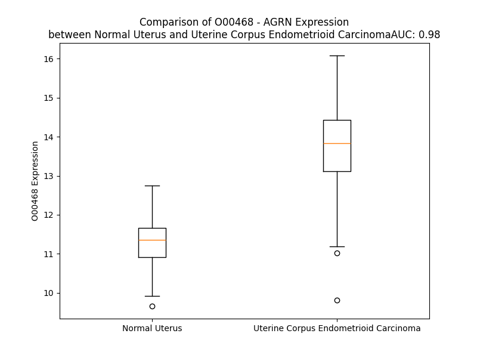

# Detailed Data for O00468

## Introduction to the Detailed Summary

### How to Interpret the Results

- **Summary & Metrics**: This section provides a quick reference to essential protein attributes, including expression changes, family classification, and biomarker applications. Regulation status (upregulated/downregulated) indicates the protein's behavior in a disease context. Some information comes from the original excel file with the proteins selected from literature, while others are derived from the analyses.
- **Expression Comparison**: A visual representation comparing protein expression between normal and disease states. It highlights significant changes in expression levels that might indicate diagnostic or therapeutic relevance. This is data coming from transcriptomics experiments and could not translate similarly to protein levels.
- **Isoform Alignment**: An interactive view of isoform alignments, revealing structural and functional differences between variants of the protein.
- **Interactors & Homologs**: Tables listing known interaction partners and homologous proteins, the more interactors and homologs, the more complex the protein is to design an antibody for.
- **Biological Assemblies**: Information about the structural arrangement of the protein in different assemblies, providing insights into its functional state but also the complexity of the protein to develop antibodies.
- **Combined Per-Residue Information**: A detailed table summarizing residue-level data. This includes predictions for epitope regions, aggregation tendencies, and modifications that might impact the protein's function. Each row corresponds to a residue in the protein, providing insights into specific sites that may be important for research or drug development.
## Summary & Metrics

- **UniProt Accession**: O00468
- **Gene Name**: AGRN
- **Protein Name**: AGRIN_HUMAN
- **Swiss Prot**: NA
- **Family**: NA
- **Biomarker Application**: NA
- **Number of Isoforms**: 7
- **Regulation**: NA
- **(transcriptomics) AUC**: 0.98
- **(transcriptomics) Fold Change**: 1.22
- **(transcriptomics) Regulation**: Upregulated
- **Discotope Epitope Count**: 590
- **Max n_uniprots (Homo)**: N/A
- **Max n_uniprots (Hetero)**: 3

## Expression Comparison

## Isoform Alignment

<pre style='font-size:14px; font-family:monospace;'>O00468-1 MAGRSHPGPLRPLLPLLVVAACVLPGAGGTCPERALERREEEANVVLTGTVEEILNVDPVQHTYSCKVRVWRYLKGKDLVARESLLDGGNKVVISGFGDPLICDNQVSTGDTRIFFVNPAPPYLWPAHKNELMLNSSLMRITLRNLEEVEFCVEDKPGTHFTPVPPTPPDACRGMLCGFGAVCEPNAEGPGRASCVCKKSPCPSVVAPVCGSDASTYSNECELQRAQCSQQRRIRLLSRGPCGSRDPCSNVTCSFGSTCARSADGLTASCLCPATCRGAPEGTVCGSDGADYPGECQLLRRACARQENVFKKFDGPCDPCQGALPDPSRSCRVNPRTRRPEMLLRPESCPARQAPVCGDDGVTYENDCVMGRSGAARGLLLQKVRSGQCQGRDQCPEPCRFNAVCLSRRGRPRCSCDRVTCDGAYRPVCAQDGRTYDSDCWRQQAECRQQRAIPSKHQGPCDQAPSPCLGVQCAFGATCAVKNGQAACECLQACSSLYDPVCGSDGVTYGSACELEATACTLGREIQVARKGPCDRCGQCRFGALCEAETGRCVCPSECVALAQPVCGSDGHTYPSECMLHVHACTHQISLHVASAGPCETCGDAVCAFGAVCSAGQCVCPRCEHPPPGPVCGSDGVTYGSACELREAACLQQTQIEEARAGPCEQAECGSGGSGSGEDGDCEQELCRQRGGIWDEDSEDGPCVCDFSCQSVPGSPVCGSDGVTYSTECELKKARCESQRGLYVAAQGACRGPTFAPLPPVAPLHCAQTPYGCCQDNITAARGVGLAGCPSACQCNPHGSYGGTCDPATGQCSCRPGVGGLRCDRCEPGFWNFRGIVTDGRSGCTPCSCDPQGAVRDDCEQMTGLCSCKPGVAGPKCGQCPDGRALGPAGCEADASAPATCAEMRCEFGARCVEESGSAHCVCPMLTCPEANATKVCGSDGVTYGNECQLKTIACRQGLQISIQSLGPCQEAVAPSTHPTSASVTVTTPGLLLSQALPAPPGALPLAPSSTAHSQTTPPPSSRPRTTASVPRTTVWPVLTVPPTAPSPAPSLVASAFGESGSTDGSSDEELSGDQEASGGGSGGLEPLEGSSVATPGPPVERASCYNSALGCCSDGKTPSLDAEGSNCPATKVFQGVLELEGVEGQELFYTPEMADPKSELFGETARSIESTLDDLFRNSDVKKDFRSVRLRDLGPGKSVRAIVDVHFDPTTAFRAPDVARALLRQIQVSRRRSLGVRRPLQEHVRFMDFDWFPAFITGATSGAIAAGATARATTASRLPSSAVTPRAPHPSHTSQPVAKTTAAPTTRRPPTTAPSRVPGRRPPAPQQPPKPCDSQPCFHGGTCQDWALGGGFTCSCPAGRGGAVCEKVLGAPVPAFEGRSFLAFPTLRAYHTLRLALEFRALEPQGLLLYNGNARGKDFLALALLDGRVQLRFDTGSGPAVLTSAVPVEPGQWHRLELSRHWRRGTLSVDGETPVLGESPSGTDGLNLDTDLFVGGVPEDQAAVALERTFVGAGLRGCIRLLDVNNQRLELGIGPGAATRGSGVGECGDHPCLPNPCHGGAPCQNLEAGRFHCQCPPGRVGPTCADEKSPCQPNPCHGAAPCRVLPEGGAQCECPLGREGTFCQTASGQDGSGPFLADFNGFSHLELRGLHTFARDLGEKMALEVVFLARGPSGLLLYNGQKTDGKGDFVSLALRDRRLEFRYDLGKGAAVIRSREPVTLGAWTRVSLERNGRKGALRVGDGPRVLGESPKSRKVPHTVLNLKEPLYVGGAPDFSKLARAAAVSSGFDGAIQLVSLGGRQLLTPEHVLRQVDVTSFAGHPCTRASGHPCLNGASCVPREAAYVCLCPGGFSGPHCEKGLVEKSAGDVDTLAFDGRTFVEYLNAVTESELANEIPVPETLDSGALHSEKALQSNHFELSLRTEATQGLVLWSGKATERADYVALAIVDGHLQLSYNLGSQPVVLRSTVPVNTNRWLRVVAHREQREGSLQVGNEAPVTGSSPLGATQLDTDGALWLGGLPELPVGPALPKAYGTGFVGCLRDVVVGRHPLHLLEDAVTKPELRPCPTP
O00468-2 --------------------------------------------------------------------------MPXLAVARDTRQPAGASLLVRGF--------------------------MVPCNACLILLATA----TLGFAVLLFLNNYDKPGTHFTPVPPTPPDACRGMLCGFGAVCEPNAEGPGRASCVCKKSPCPSVVAPVCGSDASTYSNECELQRAQCSQQRRIRLLSRGPCGSRDPCSNVTCSFGSTCARSADGLTASCLCPATCRGAPEGTVCGSDGADYPGECQLLRRACARQENVFKKFDGPCDPCQGALPDPSRSCRVNPRTRRPEMLLRPESCPARQAPVCGDDGVTYENDCVMGRSGAARGLLLQKVRSGQCQGRDQCPEPCRFNAVCLSRRGRPRCSCDRVTCDGAYRPVCAQDGRTYDSDCWRQQAECRQQRAIPSKHQGPCDQAPSPCLGVQCAFGATCAVKNGQAACECLQACSSLYDPVCGSDGVTYGSACELEATACTLGREIQVARKGPCDRCGQCRFGALCEAETGRCVCPSECVALAQPVCGSDGHTYPSECMLHVHACTHQISLHVASAGPCETCGDAVCAFGAVCSAGQCVCPRCEHPPPGPVCGSDGVTYGSACELREAACLQQTQIEEARAGPCEQAECGSGGSGSGEDGDCEQELCRQRGGIWDEDSEDGPCVCDFSCQSVPGSPVCGSDGVTYSTECELKKARCESQRGLYVAAQGACRGPTFAPLPPVAPLHCAQTPYGCCQDNITAARGVGLAGCPSACQCNPHGSYGGTCDPATGQCSCRPGVGGLRCDRCEPGFWNFRGIVTDGRSGCTPCSCDPQGAVRDDCEQMTGLCSCKPGVAGPKCGQCPDGRALGPAGCEADASAPATCAEMRCEFGARCVEESGSAHCVCPMLTCPEANATKVCGSDGVTYGNECQLKTIACRQGLQISIQSLGPCQEAVAPSTHPTSASVTVTTPGLLLSQALPAPPGALPLAPSSTAHSQTTPPPSSRPRTTASVPRTTVWPVLTVPPTAPSPAPSLVASAFGESGSTDGSSDEELSGDQEASGGGSGGLEPLEGSSVATPGPPVERASCYNSALGCCSDGKTPSLDAEGSNCPATKVFQGVLELEGVEGQELFYTPEMADPKSELFGETARSIESTLDDLFRNSDVKKDFRSVRLRDLGPGKSVRAIVDVHFDPTTAFRAPDVARALLRQIQVSRRRSLGVRRPLQEHVRFMDFDWFPAFITGATSGAIAAGATARATTASRLPSSAVTPRAPHPSHTSQPVAKTTAAPTTRRPPTTAPSRVPGRRPPAPQQPPKPCDSQPCFHGGTCQDWALGGGFTCSCPAGRGGAVCEKVLGAPVPAFEGRSFLAFPTLRAYHTLRLALEFRALEPQGLLLYNGNARGKDFLALALLDGRVQLRFDTGSGPAVLTSAVPVEPGQWHRLELSRHWRRGTLSVDGETPVLGESPSGTDGLNLDTDLFVGGVPEDQAAVALERTFVGAGLRGCIRLLDVNNQRLELGIGPGAATRGSGVGECGDHPCLPNPCHGGAPCQNLEAGRFHCQCPPGRVGPTCADEKSPCQPNPCHGAAPCRVLPEGGAQCECPLGREGTFCQTASGQDGSGPFLADFNGFSHLELRGLHTFARDLGEKMALEVVFLARGPSGLLLYNGQKTDGKGDFVSLALRDRRLEFRYDLGKGAAVIRSREPVTLGAWTRVSLERNGRKGALRVGDGPRVLGESPKSRKVPHTVLNLKEPLYVGGAPDFSKLARAAAVSSGFDGAIQLVSLGGRQLLTPEHVLRQVDVTSFAGHPCTRASGHPCLNGASCVPREAAYVCLCPGGFSGPHCEKGLVEKSAGDVDTLAFDGRTFVEYLNAVTESELANEIPVPETLDSGALHSEKALQSNHFELSLRTEATQGLVLWSGKATERADYVALAIVDGHLQLSYNLGSQPVVLRSTVPVNTNRWLRVVAHREQREGSLQVGNEAPVTGSSPLGATQLDTDGALWLGGLPELPVGPALPKAYGTGFVGCLRDVVVGRHPLHLLEDAVTKPELRPCPTP
O00468-3 MAGRSHPGPLRPLLPLLVVAACVLPGAGGTCPERALERREEEANVVLTGTVEEILNVDPVQHTYSCKVRVWRYLKGKDLVARESLLDGGNKVVISGFGDPLICDNQVSTGDTRIFFVNPAPPYLWPAHKNELMLNSSLMRITLRNLEEVEFCVEDKPGTHFTPVPPTPPDACRGMLCGFGAVCEPNAEGPGRASCVCKKSPCPSVVAPVCGSDASTYSNECELQRAQCSQQRRIRLLSRGPCGSRDPCSNVTCSFGSTCARSADGLTASCLCPATCRGAPEGTVCGSDGADYPGECQLLRRACARQENVFKKFDGPCDPCQGALPDPSRSCRVNPRTRRPEMLLRPESCPARQAPVCGDDGVTYENDCVMGRSGAARGLLLQKVRSGQCQGRDQCPEPCRFNAVCLSRRGRPRCSCDRVTCDGAYRPVCAQDGRTYDSDCWRQQAECRQQRAIPSKHQGPCDQAPSPCLGVQCAFGATCAVKNGQAACECLQACSSLYDPVCGSDGVTYGSACELEATACTLGREIQVARKGPCDRCGQCRFGALCEAETGRCVCPSECVALAQPVCGSDGHTYPSECMLHVHACTHQISLHVASAGPCETCGDAVCAFGAVCSAGQCVCPRCEHPPPGPVCGSDGVTYGSACELREAACLQQTQIEEARAGPCEQAECGSGGSGSGEDGDCEQELCRQRGGIWDEDSEDGPCVCDFSCQSVPGSPVCGSDGVTYSTECELKKARCESQRGLYVAAQGACRGPTFAPLPPVAPLHCAQTPYGCCQDNITAARGVGLAGCPSACQCNPHGSYGGTCDPATGQCSCRPGVGGLRCDRCEPGFWNFRGIVTDGRSGCTPCSCDPQGAVRDDCEQMTGLCSCKPGVAGPKCGQCPDGRALGPAGCEADASAPATCAEMRCEFGARCVEESGSAHCVCPMLTCPEANATKVCGSDGVTYGNECQLKTIACRQGLQISIQSLGPCQEAVAPSTHPTSASVTVTTPGLLLSQALPAPPGALPLAPSSTAHSQTTPPPSSRPRTTASVPRTTVWPVLTVPPTAPSPAPSLVASAFGESGSTDGSSDEELSGDQEASGGGSGGLEPLEGSSVATPGPPVERASCYNSALGCCSDGKTPSLDAEGSNCPATKVFQGVLELEGVEGQELFYTPEMADPKSELFGETARSIESTLDDLFRNSDVKKDFRSVRLRDLGPGKSVRAIVDVHFDPTTAFRAPDVARALLRQIQVSRRRSLGVRRPLQEHVRFMDFDWFPAFITGATSGAIAAGATARATTASRLPSSAVTPRAPHPSHTSQPVAKTTAAPTTRRPPTTAPSRVPGRRPPAPQQPPKPCDSQPCFHGGTCQDWALGGGFTCSCPAGRGGAVCEKVLGAPVPAFEGRSFLAFPTLRAYHTLRLALEFRALEPQGLLLYNGNARGKDFLALALLDGRVQLRFDTGSGPAVLTSAVPVEPGQWHRLELSRHWRRGTLSVDGETPVLGESPSGTDGLNLDTDLFVGGVPEDQAAVALERTFVGAGLRGCIRLLDVNNQRLELGIGPGAATRGSGVGECGDHPCLPNPCHGGAPCQNLEAGRFHCQCPPGRVGPTCADEKSPCQPNPCHGAAPCRVLPEGGAQCECPLGREGTFCQTASGQDGSGPFLADFNGFSHLELRGLHTFARDLGEKMALEVVFLARGPSGLLLYNGQKTDGKGDFVSLALRDRRLEFRYDLGKGAAVIRSREPVTLGAWTRVSLERNGRKGALRVGDGPRVLGESPKSRKVPHTVLNLKEPLYVGGAPDFSKLARAAAVSSGFDGAIQLVSLGGRQLLTPEHVLRQVDVTSFAGHPCTRASGHPCLNGASCVPREAAYVCLCPGGFSGPHCEKGLVEKSAGDVDTLAFDGRTFVEYLNAVTES-------------------EKALQSNHFELSLRTEATQGLVLWSGKATERADYVALAIVDGHLQLSYNLGSQPVVLRSTVPVNTNRWLRVVAHREQREGSLQVGNEAPVTGSSPLGATQLDTDGALWLGGLPELPVGPALPKAYGTGFVGCLRDVVVGRHPLHLLEDAVTKPELRPCPTP
O00468-4 MAGRSHPGPLRPLLPLLVVAACVLPGAGGTCPERALERREEEANVVLTGTVEEILNVDPVQHTYSCKVRVWRYLKGKDLVARESLLDGGNKVVISGFGDPLICDNQVSTGDTRIFFVNPAPPYLWPAHKNELMLNSSLMRITLRNLEEVEFCVEDKPGTHFTPVPPTPPDACRGMLCGFGAVCEPNAEGPGRASCVCKKSPCPSVVAPVCGSDASTYSNECELQRAQCSQQRRIRLLSRGPCGSRDPCSNVTCSFGSTCARSADGLTASCLCPATCRGAPEGTVCGSDGADYPGECQLLRRACARQENVFKKFDGPCDPCQGALPDPSRSCRVNPRTRRPEMLLRPESCPARQAPVCGDDGVTYENDCVMGRSGAARGLLLQKVRSGQCQGRDQCPEPCRFNAVCLSRRGRPRCSCDRVTCDGAYRPVCAQDGRTYDSDCWRQQAECRQQRAIPSKHQGPCDQAPSPCLGVQCAFGATCAVKNGQAACECLQACSSLYDPVCGSDGVTYGSACELEATACTLGREIQVARKGPCDRCGQCRFGALCEAETGRCVCPSECVALAQPVCGSDGHTYPSECMLHVHACTHQISLHVASAGPCETCGDAVCAFGAVCSAGQCVCPRCEHPPPGPVCGSDGVTYGSACELREAACLQQTQIEEARAGPCEQAECGSGGSGSGEDGDCEQELCRQRGGIWDEDSEDGPCVCDFSCQSVPGSPVCGSDGVTYSTECELKKARCESQRGLYVAAQGACRGPTFAPLPPVAPLHCAQTPYGCCQDNITAARGVGLAGCPSACQCNPHGSYGGTCDPATGQCSCRPGVGGLRCDRCEPGFWNFRGIVTDGRSGCTPCSCDPQGAVRDDCEQMTGLCSCKPGVAGPKCGQCPDGRALGPAGCEADASAPATCAEMRCEFGARCVEESGSAHCVCPMLTCPEANATKVCGSDGVTYGNECQLKTIACRQGLQISIQSLGPCQEAVAPSTHPTSASVTVTTPGLLLSQALPAPPGALPLAPSSTAHSQTTPPPSSRPRTTASVPRTTVWPVLTVPPTAPSPAPSLVASAFGESGSTDGSSDEELSGDQEASGGGSGGLEPLEGSSVATPGPPVERASCYNSALGCCSDGKTPSLDAEGSNCPATKVFQGVLELEGVEGQELFYTPEMADPKSELFGETARSIESTLDDLFRNSDVKKDFRSVRLRDLGPGKSVRAIVDVHFDPTTAFRAPDVARALLRQIQVSRRRSLGVRRPLQEHVRFMDFDWFPAFITGATSGAIAAGATARATTASRLPSSAVTPRAPHPSHTSQPVAKTTAAPTTRRPPTTAPSRVPGRRPPAPQQPPKPCDSQPCFHGGTCQDWALGGGFTCSCPAGRGGAVCEKVLGAPVPAFEGRSFLAFPTLRAYHTLRLALEFRALEPQGLLLYNGNARGKDFLALALLDGRVQLRFDTGSGPAVLTSAVPVEPGQWHRLELSRHWRRGTLSVDGETPVLGESPSGTDGLNLDTDLFVGGVPEDQAAVALERTFVGAGLRGCIRLLDVNNQRLELGIGPGAATRGSGVGECGDHPCLPNPCHGGAPCQNLEAGRFHCQCPPGRVGPTCADEKSPCQPNPCHGAAPCRVLPEGGAQCECPLGREGTFCQTASGQDGSGPFLADFNGFSHLELRGLHTFARDLGEKMALEVVFLARGPSGLLLYNGQKTDGKGDFVSLALRDRRLEFRYDLGKGAAVIRSREPVTLGAWTRVSLERNGRKGALRVGDGPRVLGESPKSRKVPHTVLNLKEPLYVGGAPDFSKLARAAAVSSGFDGAIQLVSLGGRQLLTPEHVLRQVDVTSFAGHPCTRASGHPCLNGASCVPREAAYVCLCPGGFSGPHCEKGLVEKSAGDVDTLAFDGRTFVEYLNAVTES--------PETLDSGALHSEKALQSNHFELSLRTEATQGLVLWSGKATERADYVALAIVDGHLQLSYNLGSQPVVLRSTVPVNTNRWLRVVAHREQREGSLQVGNEAPVTGSSPLGATQLDTDGALWLGGLPELPVGPALPKAYGTGFVGCLRDVVVGRHPLHLLEDAVTKPELRPCPTP
O00468-5 MAGRSHPGPLRPLLPLLVVAACVLPGAGGTCPERALERREEEANVVLTGTVEEILNVDPVQHTYSCKVRVWRYLKGKDLVARESLLDGGNKVVISGFGDPLICDNQVSTGDTRIFFVNPAPPYLWPAHKNELMLNSSLMRITLRNLEEVEFCVEDKPGTHFTPVPPTPPDACRGMLCGFGAVCEPNAEGPGRASCVCKKSPCPSVVAPVCGSDASTYSNECELQRAQCSQQRRIRLLSRGPCGSRDPCSNVTCSFGSTCARSADGLTASCLCPATCRGAPEGTVCGSDGADYPGECQLLRRACARQENVFKKFDGPCDPCQGALPDPSRSCRVNPRTRRPEMLLRPESCPARQAPVCGDDGVTYENDCVMGRSGAARGLLLQKVRSGQCQGRDQCPEPCRFNAVCLSRRGRPRCSCDRVTCDGAYRPVCAQDGRTYDSDCWRQQAECRQQRAIPSKHQGPCDQAPSPCLGVQCAFGATCAVKNGQAACECLQACSSLYDPVCGSDGVTYGSACELEATACTLGREIQVARKGPCDRCGQCRFGALCEAETGRCVCPSECVALAQPVCGSDGHTYPSECMLHVHACTHQISLHVASAGPCETCGDAVCAFGAVCSAGQCVCPRCEHPPPGPVCGSDGVTYGSACELREAACLQQTQIEEARAGPCEQAECGSGGSGSGEDGDCEQELCRQRGGIWDEDSEDGPCVCDFSCQSVPGSPVCGSDGVTYSTECELKKARCESQRGLYVAAQGACRGPTFAPLPPVAPLHCAQTPYGCCQDNITAARGVGLAGCPSACQCNPHGSYGGTCDPATGQCSCRPGVGGLRCDRCEPGFWNFRGIVTDGRSGCTPCSCDPQGAVRDDCEQMTGLCSCKPGVAGPKCGQCPDGRALGPAGCEADASAPATCAEMRCEFGARCVEESGSAHCVCPMLTCPEANATKVCGSDGVTYGNECQLKTIACRQGLQISIQSLGPCQEAVAPSTHPTSASVTVTTPGLLLSQALPAPPGALPLAPSSTAHSQTTPPPSSRPRTTASVPRTTVWPVLTVPPTAPSPAPSLVASAFGESGSTDGSSDEELSGDQEASGGGSGGLEPLEGSSVATPGPPVERASCYNSALGCCSDGKTPSLDAEGSNCPATKVFQGVLELEGVEGQELFYTPEMADPKSELFGETARSIESTLDDLFRNSDVKKDFRSVRLRDLGPGKSVRAIVDVHFDPTTAFRAPDVARALLRQIQVSRRRSLGVRRPLQEHVRFMDFDWFPAFITGATSGAIAAGATARATTASRLPSSAVTPRAPHPSHTSQPVAKTTAAPTTRRPPTTAPSRVPGRRPPAPQQPPKPCDSQPCFHGGTCQDWALGGGFTCSCPAGRGGAVCEKVLGAPVPAFEGRSFLAFPTLRAYHTLRLALEFRALEPQGLLLYNGNARGKDFLALALLDGRVQLRFDTGSGPAVLTSAVPVEPGQWHRLELSRHWRRGTLSVDGETPVLGESPSGTDGLNLDTDLFVGGVPEDQAAVALERTFVGAGLRGCIRLLDVNNQRLELGIGPGAATRGSGVGECGDHPCLPNPCHGGAPCQNLEAGRFHCQCPPGRVGPTCADEKSPCQPNPCHGAAPCRVLPEGGAQCECPLGREGTFCQTASGQDGSGPFLADFNGFSHLELRGLHTFARDLGEKMALEVVFLARGPSGLLLYNGQKTDGKGDFVSLALRDRRLEFRYDLGKGAAVIRSREPVTLGAWTRVSLERNGRKGALRVGDGPRVLGESPKSRKVPHTVLNLKEPLYVGGAPDFSKLARAAAVSSGFDGAIQLVSLGGRQLLTPEHVLRQVDVTSFAGHPCTRASGHPCLNGASCVPREAAYVCLCPGGFSGPHCEKGLVEKSAGDVDTLAFDGRTFVEYLNAVTESELANEIPVEK-----------ALQSNHFELSLRTEATQGLVLWSGKATERADYVALAIVDGHLQLSYNLGSQPVVLRSTVPVNTNRWLRVVAHREQREGSLQVGNEAPVTGSSPLGATQLDTDGALWLGGLPELPVGPALPKAYGTGFVGCLRDVVVGRHPLHLLEDAVTKPELRPCPTP
O00468-6 MAGRSHPGPLRPLLPLLVVAACVLPGAGGTCPERALERREEEANVVLTGTVEEILNVDPVQHTYSCKVRVWRYLKGKDLVARESLLDGGNKVVISGFGDPLICDNQVSTGDTRIFFVNPAPPYLWPAHKNELMLNSSLMRITLRNLEEVEFCVEDKPGTHFTPVPPTPPDACRGMLCGFGAVCEPNAEGPGRASCVCKKSPCPSVVAPVCGSDASTYSNECELQRAQCSQQRRIRLLSRGPCGSRDPCSNVTCSFGSTCARSADGLTASCLCPATCRGAPEGTVCGSDGADYPGECQLLRRACARQENVFKKFDGPCDPCQGALPDPSRSCRVNPRTRRPEMLLRPESCPARQAPVCGDDGVTYENDCVMGRSGAARGLLLQKVRSGQCQGRDQCPEPCRFNAVCLSRRGRPRCSCDRVTCDGAYRPVCAQDGRTYDSDCWRQQAECRQQRAIPSKHQGPCDQAPSPCLGVQCAFGATCAVKNGQAACECLQACSSLYDPVCGSDGVTYGSACELEATACTLGREIQVARKGPCDRCGQCRFGALCEAETGRCVCPSECVALAQPVCGSDGHTYPSECMLHVHACTHQISLHVASAGPCETCGDAVCAFGAVCSAGQCVCPRCEHPPPGPVCGSDGVTYGSACELREAACLQQTQIEEARAGPCEQAECGSGGSGSGEDGDCEQELCRQRGGIWDEDSEDGPCVCDFSCQSVPGSPVCGSDGVTYSTECELKKARCESQRGLYVAAQGACRGPTFAPLPPVAPLHCAQTPYGCCQDNITAARGVGLAGCPSACQCNPHGSYGGTCDPATGQCSCRPGVGGLRCDRCEPGFWNFRGIVTDGRSGCTPCSCDPQGAVRDDCEQMTGLCSCKPGVAGPKCGQCPDGRALGPAGCEADASAPATCAEMRCEFGARCVEESGSAHCVCPMLTCPEANATKVCGSDGVTYGNECQLKTIACRQGLQISIQSLGPCQEAVAPSTHPTSASVTVTTPGLLLSQALPAPPGALPLAPSSTAHSQTTPPPSSRPRTTASVPRTTVWPVLTVPPTAPSPAPSLVASAFGESGSTDGSSDEELSGDQEASGGGSGGLEPLEGSSVATPGPPVERASCYNSALGCCSDGKTPSLDAEGSNCPATKVFQGVLELEGVEGQELFYTPEMADPKSELFGETARSIESTLDDLFRNSDVKKDFRSVRLRDLGPGKSVRAIVDVHFDPTTAFRAPDVARALLRQIQVSRRRSLGVRRPLQEHVRFMDFDWFPAFITGATSGAIAAGATARATTASRLPSSAVTPRAPHPSHTSQPVAKTTAAPTTRRPPTTAPSRVPGRRPPAPQQPPKPCDSQPCFHGGTCQDWALGGGFTCSCPAGRGGAVCEKVLGAPVPAFEGRSFLAFPTLRAYHTLRLALEFRALEPQGLLLYNGNARGKDFLALALLDGRVQLRFDTGSGPAVLTSAVPVEPGQWHRLELSRHWRRGTLSVDGETPVLGESPSGTDGLNLDTDLFVGGVPEDQAAVALERTFVGAGLRGCIRLLDVNNQRLELGIGPGAATRGSGVGECGDHPCLPNPCHGGAPCQNLEAGRFHCQCPPGRVGPTCADEKSPCQPNPCHGAAPCRVLPEGGAQCECPLGREGTFCQTASGQDGSGPFLADFNGFSHLELRGLHTFARDLGEKMALEVVFLARGPSGLLLYNGQKTDGKGDFVSLALRDRRLEFRYDLGKGAAVIRSREPVTLGAWTRVSLERNGRKGALRVGDGPRVLGESP----VPHTVLNLKEPLYVGGAPDFSKLARAAAVSSGFDGAIQLVSLGGRQLLTPEHVLRQVDVTSFAGHPCTRASGHPCLNGASCVPREAAYVCLCPGGFSGPHCEKGLVEKSAGDVDTLAFDGRTFVEYLNAVTES-------------------EKALQSNHFELSLRTEATQGLVLWSGKATERADYVALAIVDGHLQLSYNLGSQPVVLRSTVPVNTNRWLRVVAHREQREGSLQVGNEAPVTGSSPLGATQLDTDGALWLGGLPELPVGPALPKAYGTGFVGCLRDVVVGRHPLHLLEDAVTKPELRPCPTP
O00468-7 MAGRSHPGPLRPLLPLLVVAACVLPGAGGTCPERALERREEEANVVLTGTVEEILNVDPVQHTYSCKVRVWRYLKGKDLVARESLLDGGNKVVISGFGDPLICDNQVSTGDTRIFFVNPAPPYLWPAHKNELMLNSSLMRITLRNLEEVEFCVEDKPGTHFTPVPPTPPDACRGMLCGFGAVCEPNAEGPGRASCVCKKSPCPSVVAPVCGSDASTYSNECELQRAQCSQQRRIRLLSRGPCGSRDPCSNVTCSFGSTCARSADGLTASCLCPATCRGAPEGTVCGSDGADYPGECQLLRRACARQENVFKKFDGPCDPCQGALPDPSRSCRVNPRTRRPEMLLRPESCPARQAPVCGDDGVTYENDCVMGRSGAARGLLLQKVRSGQCQGRDQCPEPCRFNAVCLSRRGRPRCSCDRVTCDGAYRPVCAQDGRTYDSDCWRQQAECRQQRAIPSKHQGPCDQAPSPCLGVQCAFGATCAVKNGQAACECLQACSSLYDPVCGSDGVTYGSACELEATACTLGREIQVARKGPCDRCGQCRFGALCEAETGRCVCPSECVALAQPVCGSDGHTYPSECMLHVHACTHQISLHVASAGPCETCGDAVCAFGAVCSAGQCVCPRCEHPPPGPVCGSDGVTYGSACELREAACLQQTQIEEARAGPCEQAECGSGGSGSGEDGDCEQELCRQRGGIWDEDSEDGPCVCDFSCQSVPGSPVCGSDGVTYSTECELKKARCESQRGLYVAAQGACRGPTFAPLPPVAPLHCAQTPYGCCQDNITAARGVGLAGCPSACQCNPHGSYGGTCDPATGQCSCRPGVGGLRCDRCEPGFWNFRGIVTDGRSGCTPCSCDPQGAVRDDCEQMTGLCSCKPGVAGPKCGQCPDGRALGPAGCEADASAPATCAEMRCEFGARCVEESGSAHCVCPMLTCPEANATKVCGSDGVTYGNECQLKTIACRQGLQISIQSLGPCQEAVAPSTHPTSASVTVTTPGLLLSQALPAPPGALPLAPSSTAHSQTTPPPSSRPRTTASVPRTTVWPVLTVPPTAPSPAPSLVASAFGESGSTDGSSDEELSGDQEASGGGSGGLEPLEGSSVATPGPPVERASCYNSALGCCSDGKTPSLDAEGSNCPATKVFQGVLELEGVEGQELFYTPEMADPKSELFGETARSIESTLDDLFRNSDVKKDFRSVRLRDLGPGKSVRAIVDVHFDPTTAFRAPDVARALLRQIQVSRRRSLGVRRPLQEHVRFMDFDWFPAFITGATSGAIAAGATARATTASRLPSSAVTPRAPHPSHTSQPVAKTTAAPTTRRPPTTAPSRVPGRRPPAPQQPPKPCDSQPCFHGGTCQDWALGGGFTCSCPAGRGGAVCEKVLGAPVPAFEGRSFLAFPTLRAYHTLRLALEFRALEPQGLLLYNGNARGKDFLALALLDGRVQLRFDTGSGPAVLTSAVPVEPGQWHRLELSRHWRRGTLSVDGETPVLGESPSGTDGLNLDTDLFVGGVPEDQAAVALERTFVGAGLRGCIRLLDVNNQRLELGIGPGAATRGSGVGECGDHPCLPNPCHGGAPCQNLEAGRFHCQCPPGRVGPTCADEKSPCQPNPCHGAAPCRVLPEGGAQCECPLGREGTFCQTASGQDGSGPFLADFNGFSHLELRGLHTFARDLGEKMALEVVFLARGPSGLLLYNGQKTDGKGDFVSLALRDRRLEFRYDLGKGAAVIRSREPVTLGAWTRVSLERNGRKGALRVGDGPRVLGESP----VPHTVLNLKEPLYVGGAPDFSKLARAAAVSSGFDGAIQLVSLGGRQLLTPEHVLRQVDVTSFAGHPCTRASGHPCLNGASCVPREAAYVCLCPGGFSGPHCEKGLVEKSAGDVDTLAFDGRTFVEYLNAVTESELANEIPVPETLDSGALHSEKALQSNHFELSLRTEATQGLVLWSGKATERADYVALAIVDGHLQLSYNLGSQPVVLRSTVPVNTNRWLRVVAHREQREGSLQVGNEAPVTGSSPLGATQLDTDGALWLGGLPELPVGPALPKAYGTGFVGCLRDVVVGRHPLHLLEDAVTKPELRPCPTP
</pre>

## Interactors

| preferredName_A   | preferredName_B   |   score |
|:------------------|:------------------|--------:|
| AGRN              | LRP4              |   0.999 |
| AGRN              | DAG1              |   0.999 |
| AGRN              | MUSK              |   0.999 |
| AGRN              | HSPG2             |   0.993 |
| AGRN              | DOK7              |   0.991 |
| AGRN              | RAPSN             |   0.988 |
| AGRN              | NID1              |   0.985 |
| AGRN              | FN1               |   0.983 |
| AGRN              | PTPRS             |   0.959 |
| AGRN              | DMD               |   0.936 |
| AGRN              | NCAM1             |   0.927 |
| AGRN              | BGN               |   0.922 |
| AGRN              | LRP2              |   0.914 |

## Homologs

| uniprot_id   | gene_id   |
|:-------------|:----------|
| Q9H1U4       | MEGF9     |
| P25391       | LAMA1     |
| Q7Z7M0       | MEGF8     |
| A0A3B3ISV6   | ATRNL1    |
| E5RK79       | LAMA4     |
| O75882       | ATRN      |
| A0A7I2V3S4   | LAMC3     |
| O75445       | USH2A     |
| A0A8I5KQG5   | LAMA2     |
| Q16787       | LAMA3     |
| Q13751       | LAMB3     |
| Q8WTR8       | NTN5      |
| E7EPA6       | LAMB1     |
| Q13753       | LAMC2     |
| P98160       | HSPG2     |
| Q9HB63       | NTN4      |
| Q63HQ2       | EGFLAM    |
| H7BZF4       | NTN1      |
| O00634       | NTN3      |
| P55268       | LAMB2     |
| P11047       | LAMC1     |
| A4D0S4       | LAMB4     |
| Q9UIK5       | TMEFF2    |
| H7C5J6       | LAMA5     |
| Q96CW9       | NTNG2     |
| Q9Y2I2       | NTNG1     |
| Q8IYR6       | TMEFF1    |

## Biological Assemblies

|   Unnamed: 0 |   assembly |   n_uniprots | composition   | crystal_id   |
|-------------:|-----------:|-------------:|:--------------|:-------------|
|            0 |          1 |            3 | Hetero        | 8s9p         |

## Combined Per-Residue Information

|   res | aa   |   epitope_score | epitope   |   relative_surface_accessibility |   modeling_confidence |   Aggregation | modification   | glycosylation                   |
|------:|:-----|----------------:|:----------|---------------------------------:|----------------------:|--------------:|:---------------|:--------------------------------|
|     1 | M    |         0.11023 | True      |                          1.2803  |                 39.16 |         0     | N/A            | N/A                             |
|     2 | A    |         0.11046 | True      |                          1.01318 |                 33.17 |         0     | N/A            | N/A                             |
|     3 | G    |         0.12615 | True      |                          0.92041 |                 36.66 |         0     | N/A            | N/A                             |
|     4 | R    |         0.15731 | True      |                          0.91721 |                 35.56 |         0     | N/A            | N/A                             |
|     5 | S    |         0.06894 | False     |                          0.65677 |                 34.25 |         0     | N/A            | N/A                             |
|     6 | H    |         0.15136 | True      |                          0.94347 |                 40.04 |         0     | N/A            | N/A                             |
|     7 | P    |         0.09999 | True      |                          0.9387  |                 42.85 |         0     | N/A            | N/A                             |
|     8 | G    |         0.18271 | True      |                          0.81773 |                 37.12 |         0     | N/A            | N/A                             |
|     9 | P    |         0.08119 | False     |                          0.86887 |                 47.63 |         0     | N/A            | N/A                             |
|    10 | L    |         0.10919 | True      |                          0.91068 |                 32.64 |         0     | N/A            | N/A                             |
|    11 | R    |         0.20461 | True      |                          0.87904 |                 32.55 |         0     | N/A            | N/A                             |
|    12 | P    |         0.09911 | True      |                          0.78015 |                 46.64 |         0     | N/A            | N/A                             |
|    13 | L    |         0.09325 | True      |                          0.9984  |                 34.22 |         0     | N/A            | N/A                             |
|    14 | L    |         0.19223 | True      |                          0.9301  |                 31.71 |         0     | N/A            | N/A                             |
|    15 | P    |         0.12177 | True      |                          0.80175 |                 45.14 |         1.232 | N/A            | N/A                             |
|    16 | L    |         0.13597 | True      |                          0.91291 |                 35.87 |        78.605 | N/A            | N/A                             |
|    17 | L    |         0.15876 | True      |                          0.90268 |                 36.54 |        89.465 | N/A            | N/A                             |
|    18 | V    |         0.14666 | True      |                          0.88368 |                 34.55 |        90.941 | N/A            | N/A                             |
|    19 | V    |         0.14268 | True      |                          1.02262 |                 36.19 |        91.049 | N/A            | N/A                             |
|    20 | A    |         0.08021 | False     |                          0.8576  |                 34.48 |        90.767 | N/A            | N/A                             |
|    21 | A    |         0.13434 | True      |                          0.92573 |                 32.14 |        72.455 | N/A            | N/A                             |
|    22 | C    |         0.13825 | True      |                          0.93954 |                 30.47 |        54.173 | N/A            | N/A                             |
|    23 | V    |         0.11087 | True      |                          0.89561 |                 31.93 |        50.217 | N/A            | N/A                             |
|    24 | L    |         0.11802 | True      |                          0.97907 |                 31.65 |         3.566 | N/A            | N/A                             |
|    25 | P    |         0.05554 | False     |                          0.6328  |                 31.68 |         1.819 | N/A            | N/A                             |
|    26 | G    |         0.08044 | False     |                          0.47897 |                 26.43 |         0     | N/A            | N/A                             |
|    27 | A    |         0.06676 | False     |                          0.91089 |                 30.54 |         0     | N/A            | N/A                             |
|    28 | G    |         0.11064 | True      |                          0.65937 |                 31.55 |         0     | N/A            | N/A                             |
|    29 | G    |         0.22592 | True      |                          0.7592  |                 30.67 |         0     | N/A            | N/A                             |
|    30 | T    |         0.06387 | False     |                          0.74912 |                 31.16 |         0     | N/A            | N/A                             |
|    31 | C    |         0.05231 | False     |                          0.51431 |                 41.71 |         0     | N/A            | N/A                             |
|    32 | P    |         0.08048 | False     |                          0.59061 |                 44.72 |         0     | N/A            | N/A                             |
|    33 | E    |         0.07882 | False     |                          0.8643  |                 46.42 |         0     | N/A            | N/A                             |
|    34 | R    |         0.10397 | True      |                          0.92503 |                 44.45 |         0     | N/A            | N/A                             |
|    35 | A    |         0.0596  | False     |                          0.36382 |                 56.56 |         0     | N/A            | N/A                             |
|    36 | L    |         0.04067 | False     |                          0.16879 |                 58.59 |         0     | N/A            | N/A                             |
|    37 | E    |         0.11638 | True      |                          0.61204 |                 61.53 |         0     | N/A            | N/A                             |
|    38 | R    |         0.08719 | False     |                          0.66889 |                 66.5  |         0     | N/A            | N/A                             |
|    39 | R    |         0.06647 | False     |                          0.17087 |                 70.64 |         0     | N/A            | N/A                             |
|    40 | E    |         0.0249  | False     |                          0.113   |                 65.35 |         0     | N/A            | N/A                             |
|    41 | E    |         0.08863 | True      |                          0.70107 |                 69.78 |         0     | N/A            | N/A                             |
|    42 | E    |         0.04652 | False     |                          0.47338 |                 73.2  |         0     | N/A            | N/A                             |
|    43 | A    |         0.01544 | False     |                          0.00094 |                 79.75 |         0.194 | N/A            | N/A                             |
|    44 | N    |         0.05953 | False     |                          0.44713 |                 83.8  |         0.563 | N/A            | N/A                             |
|    45 | V    |         0.00437 | False     |                          0       |                 87.06 |         5.582 | N/A            | N/A                             |
|    46 | V    |         0.00203 | False     |                          0       |                 90.8  |         5.767 | N/A            | N/A                             |
|    47 | L    |         0.00121 | False     |                          0       |                 91.33 |         5.767 | N/A            | N/A                             |
|    48 | T    |         0.03682 | False     |                          0.03463 |                 91.74 |         5.573 | N/A            | N/A                             |
|    49 | G    |         0.00856 | False     |                          0       |                 87.4  |         5.204 | N/A            | N/A                             |
|    50 | T    |         0.05341 | False     |                          0.16513 |                 88.86 |         2.875 | N/A            | N/A                             |
|    51 | V    |         0.00915 | False     |                          0.00915 |                 88.6  |         2.368 | N/A            | N/A                             |
|    52 | E    |         0.07576 | False     |                          0.26455 |                 83.78 |         0     | N/A            | N/A                             |
|    53 | E    |         0.11445 | True      |                          0.37573 |                 83.61 |         0     | N/A            | N/A                             |
|    54 | I    |         0.05061 | False     |                          0.20641 |                 80.35 |         0     | N/A            | N/A                             |
|    55 | L    |         0.1795  | True      |                          0.35622 |                 75.03 |         0     | N/A            | N/A                             |
|    56 | N    |         0.13553 | True      |                          0.85504 |                 59.08 |         0     | N/A            | N/A                             |
|    57 | V    |         0.14418 | True      |                          0.60723 |                 55.31 |         0     | N/A            | N/A                             |
|    58 | D    |         0.11933 | True      |                          0.25384 |                 57.31 |         0     | N/A            | N/A                             |
|    59 | P    |         0.14412 | True      |                          0.79754 |                 50.29 |         0     | N/A            | N/A                             |
|    60 | V    |         0.2324  | True      |                          0.92058 |                 49.88 |         0     | N/A            | N/A                             |
|    61 | Q    |         0.16212 | True      |                          0.48843 |                 54.91 |         0     | N/A            | N/A                             |
|    62 | H    |         0.11275 | True      |                          0.76436 |                 63.17 |         0     | N/A            | N/A                             |
|    63 | T    |         0.06059 | False     |                          0.11896 |                 70.62 |         0     | N/A            | N/A                             |
|    64 | Y    |         0.09612 | True      |                          0.1684  |                 80.09 |         0     | N/A            | N/A                             |
|    65 | S    |         0.05375 | False     |                          0.12271 |                 85.71 |         0     | N/A            | N/A                             |
|    66 | C    |         0.00211 | False     |                          0       |                 87.51 |         0     | N/A            | N/A                             |
|    67 | K    |         0.06995 | False     |                          0.21907 |                 89.78 |         0     | N/A            | N/A                             |
|    68 | V    |         0.00148 | False     |                          0       |                 89.98 |         0     | N/A            | N/A                             |
|    69 | R    |         0.08921 | True      |                          0.43399 |                 90.56 |         0     | N/A            | N/A                             |
|    70 | V    |         0.04919 | False     |                          0.13553 |                 88.96 |         0     | N/A            | N/A                             |
|    71 | W    |         0.12117 | True      |                          0.74275 |                 87.33 |         0     | N/A            | N/A                             |
|    72 | R    |         0.12562 | True      |                          0.2597  |                 85.56 |         0     | N/A            | N/A                             |
|    73 | Y    |         0.03349 | False     |                          0.22957 |                 86.43 |         0     | N/A            | N/A                             |
|    74 | L    |         0.03852 | False     |                          0.21141 |                 83.71 |         0     | N/A            | N/A                             |
|    75 | K    |         0.05611 | False     |                          0.27644 |                 85.06 |         0     | N/A            | N/A                             |
|    76 | G    |         0.06315 | False     |                          0.20651 |                 78.78 |         0     | N/A            | N/A                             |
|    77 | K    |         0.08445 | False     |                          0.65837 |                 82.25 |         0     | N/A            | N/A                             |
|    78 | D    |         0.11678 | True      |                          0.78938 |                 79.95 |         0     | N/A            | N/A                             |
|    79 | L    |         0.08552 | False     |                          0.56773 |                 77.97 |         0     | N/A            | N/A                             |
|    80 | V    |         0.04695 | False     |                          0.10587 |                 76.47 |         0     | N/A            | N/A                             |
|    81 | A    |         0.07894 | False     |                          0.50145 |                 71.25 |         0     | N/A            | N/A                             |
|    82 | R    |         0.13856 | True      |                          0.90488 |                 67.9  |         0     | N/A            | N/A                             |
|    83 | E    |         0.08607 | False     |                          0.56894 |                 67.13 |         0     | N/A            | N/A                             |
|    84 | S    |         0.04984 | False     |                          0.05488 |                 65.14 |         0     | N/A            | N/A                             |
|    85 | L    |         0.092   | True      |                          0.37896 |                 66.19 |         0     | N/A            | N/A                             |
|    86 | L    |         0.18613 | True      |                          0.43938 |                 66.05 |         0     | N/A            | N/A                             |
|    87 | D    |         0.19194 | True      |                          0.5458  |                 58.18 |         0     | N/A            | N/A                             |
|    88 | G    |         0.23192 | True      |                          1.04258 |                 54.41 |         0     | N/A            | N/A                             |
|    89 | G    |         0.04921 | False     |                          0.36078 |                 63.98 |         0     | N/A            | N/A                             |
|    90 | N    |         0.13719 | True      |                          0.5733  |                 71.39 |         0     | N/A            | N/A                             |
|    91 | K    |         0.05176 | False     |                          0.14626 |                 86.45 |         0     | N/A            | N/A                             |
|    92 | V    |         0.00348 | False     |                          0       |                 89.31 |        27.143 | N/A            | N/A                             |
|    93 | V    |         0.02964 | False     |                          0.14471 |                 88.54 |        29.435 | N/A            | N/A                             |
|    94 | I    |         0.00191 | False     |                          0       |                 90.17 |        29.435 | N/A            | N/A                             |
|    95 | S    |         0.03626 | False     |                          0.02184 |                 85.47 |        29.435 | N/A            | N/A                             |
|    96 | G    |         0.01994 | False     |                          0.05499 |                 78.74 |        29.435 | N/A            | N/A                             |
|    97 | F    |         0.01091 | False     |                          0       |                 81.31 |        29.165 | N/A            | N/A                             |
|    98 | G    |         0.08443 | False     |                          0.30007 |                 69.94 |         2.408 | N/A            | N/A                             |
|    99 | D    |         0.06926 | False     |                          0.20051 |                 72.31 |         0     | N/A            | N/A                             |
|   100 | P    |         0.17909 | True      |                          0.94153 |                 63.48 |         0     | N/A            | N/A                             |
|   101 | L    |         0.23112 | True      |                          0.99045 |                 63.11 |         0     | N/A            | N/A                             |
|   102 | I    |         0.06182 | False     |                          0.11578 |                 66.77 |         0     | N/A            | N/A                             |
|   103 | C    |         0.09422 | True      |                          0.37698 |                 59.95 |         0     | N/A            | N/A                             |
|   104 | D    |         0.12228 | True      |                          0.52453 |                 64.41 |         0     | N/A            | N/A                             |
|   105 | N    |         0.06549 | False     |                          0.06883 |                 72.76 |         0     | N/A            | N/A                             |
|   106 | Q    |         0.10598 | True      |                          0.70169 |                 72.42 |         0     | N/A            | N/A                             |
|   107 | V    |         0.03868 | False     |                          0.0891  |                 77    |         0     | N/A            | N/A                             |
|   108 | S    |         0.04211 | False     |                          0.22224 |                 75.31 |         0     | N/A            | N/A                             |
|   109 | T    |         0.05977 | False     |                          0.39083 |                 71.42 |         0     | N/A            | N/A                             |
|   110 | G    |         0.02744 | False     |                          0.55857 |                 65.9  |         0     | N/A            | N/A                             |
|   111 | D    |         0.05558 | False     |                          0.07089 |                 74.47 |         0.364 | N/A            | N/A                             |
|   112 | T    |         0.07017 | False     |                          0.33943 |                 82.29 |         0.364 | N/A            | N/A                             |
|   113 | R    |         0.04337 | False     |                          0.07118 |                 87.81 |         0.364 | N/A            | N/A                             |
|   114 | I    |         0.00318 | False     |                          0       |                 89.41 |         0.364 | N/A            | N/A                             |
|   115 | F    |         0.00123 | False     |                          0       |                 90.92 |         0.364 | N/A            | N/A                             |
|   116 | F    |         0.00137 | False     |                          0       |                 90.3  |         0.364 | N/A            | N/A                             |
|   117 | V    |         0.00363 | False     |                          0       |                 90.91 |         0.364 | N/A            | N/A                             |
|   118 | N    |         0.0339  | False     |                          0.16961 |                 88.6  |         0     | N/A            | N/A                             |
|   119 | P    |         0.04702 | False     |                          0.40105 |                 85.63 |         0     | N/A            | N/A                             |
|   120 | A    |         0.03746 | False     |                          0.06263 |                 76.3  |         0     | N/A            | N/A                             |
|   121 | P    |         0.10745 | True      |                          0.31612 |                 77.03 |         0     | N/A            | N/A                             |
|   122 | P    |         0.20707 | True      |                          0.75188 |                 76.16 |         0     | N/A            | N/A                             |
|   123 | Y    |         0.3986  | True      |                          0.80241 |                 74.51 |         0     | N/A            | N/A                             |
|   124 | L    |         0.17456 | True      |                          0.20935 |                 66.86 |         0     | N/A            | N/A                             |
|   125 | W    |         0.2885  | True      |                          0.53686 |                 69.59 |         0     | N/A            | N/A                             |
|   126 | P    |         0.34693 | True      |                          0.8941  |                 68.61 |         0     | N/A            | N/A                             |
|   127 | A    |         0.20224 | True      |                          0.77209 |                 62.57 |         0     | N/A            | N/A                             |
|   128 | H    |         0.12383 | True      |                          0.23297 |                 69.48 |         0     | N/A            | N/A                             |
|   129 | K    |         0.15973 | True      |                          0.4285  |                 68.03 |         0     | N/A            | N/A                             |
|   130 | N    |         0.09798 | True      |                          0.39962 |                 75.16 |         0     | N/A            | N/A                             |
|   131 | E    |         0.07358 | False     |                          0.177   |                 79.65 |         0     | N/A            | N/A                             |
|   132 | L    |         0.0091  | False     |                          0.01072 |                 89.1  |         0     | N/A            | N/A                             |
|   133 | M    |         0.06056 | False     |                          0.20854 |                 86.97 |         0     | N/A            | N/A                             |
|   134 | L    |         0.0157  | False     |                          0.05667 |                 86.84 |         0     | N/A            | N/A                             |
|   135 | N    |         0.05758 | False     |                          0.31663 |                 77.76 |         0     | N/A            | N-linked (GlcNAc...) asparagine |
|   136 | S    |         0.08587 | False     |                          0.07904 |                 74.07 |         0     | N/A            | N/A                             |
|   137 | S    |         0.05236 | False     |                          0.06528 |                 70.68 |         0     | N/A            | N/A                             |
|   138 | L    |         0.0328  | False     |                          0.02437 |                 76.12 |         0     | N/A            | N/A                             |
|   139 | M    |         0.03432 | False     |                          0.11416 |                 77.65 |         0     | N/A            | N/A                             |
|   140 | R    |         0.06588 | False     |                          0.31493 |                 71.41 |         0     | N/A            | N/A                             |
|   141 | I    |         0.14332 | True      |                          0.43948 |                 68.53 |         0     | N/A            | N/A                             |
|   142 | T    |         0.06093 | False     |                          0.40439 |                 60.39 |         0     | N/A            | N/A                             |
|   143 | L    |         0.16351 | True      |                          0.74004 |                 56.86 |         0     | N/A            | N/A                             |
|   144 | R    |         0.18628 | True      |                          0.6366  |                 62.43 |         0     | N/A            | N/A                             |
|   145 | N    |         0.04584 | False     |                          0.18661 |                 68.24 |         0     | N/A            | N/A                             |
|   146 | L    |         0.04276 | False     |                          0.23824 |                 72.42 |         0     | N/A            | N/A                             |
|   147 | E    |         0.11155 | True      |                          0.49731 |                 67.03 |         0     | N/A            | N/A                             |
|   148 | E    |         0.04498 | False     |                          0.30284 |                 68.33 |         0     | N/A            | N/A                             |
|   149 | V    |         0.00749 | False     |                          0.0019  |                 75.18 |         0     | N/A            | N/A                             |
|   150 | E    |         0.03279 | False     |                          0.14322 |                 71.8  |         0     | N/A            | N/A                             |
|   151 | F    |         0.13675 | True      |                          0.68091 |                 65.02 |         0     | N/A            | N/A                             |
|   152 | C    |         0.0411  | False     |                          0.20277 |                 65.85 |         0     | N/A            | N/A                             |
|   153 | V    |         0.02527 | False     |                          0.29578 |                 70.81 |         0     | N/A            | N/A                             |
|   154 | E    |         0.05735 | False     |                          0.45993 |                 60.34 |         0     | N/A            | N/A                             |
|   155 | D    |         0.10381 | True      |                          0.49853 |                 47.46 |         0     | N/A            | N/A                             |
|   156 | K    |         0.0919  | True      |                          0.91807 |                 31.6  |         0     | N/A            | N/A                             |
|   157 | P    |         0.14767 | True      |                          0.92051 |                 33.33 |         0     | N/A            | N/A                             |
|   158 | G    |         0.09271 | True      |                          0.74317 |                 29.28 |         0     | N/A            | N/A                             |
|   159 | T    |         0.14697 | True      |                          0.80403 |                 28.59 |         0     | N/A            | N/A                             |
|   160 | H    |         0.20013 | True      |                          0.82412 |                 27.6  |         0     | N/A            | N/A                             |
|   161 | F    |         0.13161 | True      |                          0.94236 |                 28.12 |         0     | N/A            | N/A                             |
|   162 | T    |         0.1915  | True      |                          0.86677 |                 28.96 |         0     | N/A            | N/A                             |
|   163 | P    |         0.10617 | True      |                          0.90674 |                 31.03 |         0     | N/A            | N/A                             |
|   164 | V    |         0.1765  | True      |                          1.00864 |                 27.98 |         0     | N/A            | N/A                             |
|   165 | P    |         0.15159 | True      |                          0.84629 |                 36.15 |         0     | N/A            | N/A                             |
|   166 | P    |         0.11455 | True      |                          0.91558 |                 35.92 |         0     | N/A            | N/A                             |
|   167 | T    |         0.12642 | True      |                          0.89144 |                 33.13 |         0     | N/A            | N/A                             |
|   168 | P    |         0.11435 | True      |                          0.92389 |                 44.13 |         0     | N/A            | N/A                             |
|   169 | P    |         0.08252 | False     |                          0.81616 |                 47.1  |         0     | N/A            | N/A                             |
|   170 | D    |         0.07902 | False     |                          0.57045 |                 52.73 |         0     | N/A            | N/A                             |
|   171 | A    |         0.0499  | False     |                          0.25432 |                 62.6  |         0     | N/A            | N/A                             |
|   172 | C    |         0.05248 | False     |                          0.2135  |                 62.25 |         0     | N/A            | N/A                             |
|   173 | R    |         0.0923  | True      |                          0.80822 |                 57.04 |         0     | N/A            | N/A                             |
|   174 | G    |         0.09361 | True      |                          0.70325 |                 53.76 |         0     | N/A            | N/A                             |
|   175 | M    |         0.08646 | False     |                          0.36902 |                 58.9  |         0.188 | N/A            | N/A                             |
|   176 | L    |         0.07571 | False     |                          0.68275 |                 51.73 |         0.188 | N/A            | N/A                             |
|   177 | C    |         0.07279 | False     |                          0.20248 |                 66.73 |         0.188 | N/A            | N/A                             |
|   178 | G    |         0.04147 | False     |                          0.34591 |                 56.64 |         0.188 | N/A            | N/A                             |
|   179 | F    |         0.08619 | False     |                          0.39265 |                 71.81 |         0.188 | N/A            | N/A                             |
|   180 | G    |         0.06497 | False     |                          0.71022 |                 63.27 |         0.188 | N/A            | N/A                             |
|   181 | A    |         0.03929 | False     |                          0.11158 |                 71.45 |         0.188 | N/A            | N/A                             |
|   182 | V    |         0.02349 | False     |                          0.39701 |                 73.68 |         0.188 | N/A            | N/A                             |
|   183 | C    |         0.02374 | False     |                          0.20181 |                 77.6  |         0     | N/A            | N/A                             |
|   184 | E    |         0.05509 | False     |                          0.45744 |                 76.2  |         0     | N/A            | N/A                             |
|   185 | P    |         0.07599 | False     |                          0.68566 |                 71.04 |         0     | N/A            | N/A                             |
|   186 | N    |         0.07557 | False     |                          0.33246 |                 65.57 |         0     | N/A            | N/A                             |
|   187 | A    |         0.11137 | True      |                          1.06154 |                 63.1  |         0     | N/A            | N/A                             |
|   188 | E    |         0.1817  | True      |                          0.78995 |                 61.01 |         0     | N/A            | N/A                             |
|   189 | G    |         0.19866 | True      |                          0.27408 |                 50.87 |         0     | N/A            | N/A                             |
|   190 | P    |         0.17923 | True      |                          1.09286 |                 46.33 |         0     | N/A            | N/A                             |
|   191 | G    |         0.09105 | True      |                          0.68715 |                 58.81 |         0     | N/A            | N/A                             |
|   192 | R    |         0.22347 | True      |                          0.61321 |                 62.07 |         0     | N/A            | N/A                             |
|   193 | A    |         0.08359 | False     |                          0.15864 |                 67.93 |         0     | N/A            | N/A                             |
|   194 | S    |         0.12124 | True      |                          0.33344 |                 74.49 |         0     | N/A            | N/A                             |
|   195 | C    |         0.07361 | False     |                          0.4023  |                 76.66 |         0     | N/A            | N/A                             |
|   196 | V    |         0.06162 | False     |                          0.28848 |                 77.34 |         0     | N/A            | N/A                             |
|   197 | C    |         0.03541 | False     |                          0.25238 |                 78.19 |         0     | N/A            | N/A                             |
|   198 | K    |         0.08043 | False     |                          0.65645 |                 63.93 |         0     | N/A            | N/A                             |
|   199 | K    |         0.20854 | True      |                          0.88918 |                 56.31 |         0     | N/A            | N/A                             |
|   200 | S    |         0.12285 | True      |                          0.53767 |                 60.55 |         0     | N/A            | N/A                             |
|   201 | P    |         0.13454 | True      |                          0.8639  |                 63.71 |         0     | N/A            | N/A                             |
|   202 | C    |         0.07126 | False     |                          0.14078 |                 70.34 |         0     | N/A            | N/A                             |
|   203 | P    |         0.09025 | True      |                          0.57655 |                 62.53 |         0     | N/A            | N/A                             |
|   204 | S    |         0.08349 | False     |                          0.76603 |                 54.71 |         0     | N/A            | N/A                             |
|   205 | V    |         0.09754 | True      |                          0.67126 |                 44.74 |         0     | N/A            | N/A                             |
|   206 | V    |         0.09757 | True      |                          0.82812 |                 51.07 |         0     | N/A            | N/A                             |
|   207 | A    |         0.08577 | False     |                          0.48031 |                 60.79 |         0     | N/A            | N/A                             |
|   208 | P    |         0.0768  | False     |                          0.35329 |                 70.3  |         0     | N/A            | N/A                             |
|   209 | V    |         0.03359 | False     |                          0.05617 |                 77.2  |         0     | N/A            | N/A                             |
|   210 | C    |         0.01957 | False     |                          0.05987 |                 80.06 |         0     | N/A            | N/A                             |
|   211 | G    |         0.01393 | False     |                          0       |                 74.45 |         0     | N/A            | N/A                             |
|   212 | S    |         0.06863 | False     |                          0.39471 |                 71.37 |         0     | N/A            | N/A                             |
|   213 | D    |         0.08277 | False     |                          0.31664 |                 73.66 |         0     | N/A            | N/A                             |
|   214 | A    |         0.05659 | False     |                          0.45259 |                 64.97 |         0     | N/A            | N/A                             |
|   215 | S    |         0.05884 | False     |                          0.18941 |                 69.23 |         0     | N/A            | N/A                             |
|   216 | T    |         0.04262 | False     |                          0.19315 |                 81    |         0     | N/A            | N/A                             |
|   217 | Y    |         0.0456  | False     |                          0.09527 |                 83.83 |         0     | N/A            | N/A                             |
|   218 | S    |         0.04313 | False     |                          0.40469 |                 74.95 |         0     | N/A            | N/A                             |
|   219 | N    |         0.02869 | False     |                          0.06966 |                 80.34 |         0     | N/A            | N/A                             |
|   220 | E    |         0.09077 | True      |                          0.38689 |                 82.73 |         0     | N/A            | N/A                             |
|   221 | C    |         0.04098 | False     |                          0.32567 |                 83.96 |         0     | N/A            | N/A                             |
|   222 | E    |         0.04441 | False     |                          0.22758 |                 85.22 |         0     | N/A            | N/A                             |
|   223 | L    |         0.00933 | False     |                          0.03957 |                 86.95 |         0     | N/A            | N/A                             |
|   224 | Q    |         0.03086 | False     |                          0.50207 |                 80.39 |         0     | N/A            | N/A                             |
|   225 | R    |         0.07017 | False     |                          0.38621 |                 82.88 |         0     | N/A            | N/A                             |
|   226 | A    |         0.03216 | False     |                          0.11006 |                 80.8  |         0     | N/A            | N/A                             |
|   227 | Q    |         0.06082 | False     |                          0.21403 |                 82.16 |         0     | N/A            | N/A                             |
|   228 | C    |         0.00865 | False     |                          0.03751 |                 82.97 |         0     | N/A            | N/A                             |
|   229 | S    |         0.14677 | True      |                          0.61151 |                 77.48 |         0     | N/A            | N/A                             |
|   230 | Q    |         0.10212 | True      |                          0.38754 |                 70.54 |         0     | N/A            | N/A                             |
|   231 | Q    |         0.06865 | False     |                          0.43416 |                 67.78 |         0     | N/A            | N/A                             |
|   232 | R    |         0.07643 | False     |                          0.39824 |                 64.32 |         0     | N/A            | N/A                             |
|   233 | R    |         0.17924 | True      |                          0.50293 |                 64.61 |         0     | N/A            | N/A                             |
|   234 | I    |         0.07607 | False     |                          0.03562 |                 72.1  |         0     | N/A            | N/A                             |
|   235 | R    |         0.11099 | True      |                          0.39778 |                 69.66 |         0     | N/A            | N/A                             |
|   236 | L    |         0.18563 | True      |                          0.45896 |                 72.51 |         0     | N/A            | N/A                             |
|   237 | L    |         0.08767 | False     |                          0.71035 |                 57.92 |         0     | N/A            | N/A                             |
|   238 | S    |         0.03996 | False     |                          0.36708 |                 52.27 |         0     | N/A            | N/A                             |
|   239 | R    |         0.18649 | True      |                          0.75375 |                 64.18 |         0     | N/A            | N/A                             |
|   240 | G    |         0.03966 | False     |                          0.26612 |                 50.36 |         0     | N/A            | N/A                             |
|   241 | P    |         0.0672  | False     |                          0.38268 |                 60.89 |         0     | N/A            | N/A                             |
|   242 | C    |         0.03587 | False     |                          0.02303 |                 56.94 |         0     | N/A            | N/A                             |
|   243 | G    |         0.02464 | False     |                          0.26656 |                 49.26 |         0     | N/A            | N/A                             |
|   244 | S    |         0.04414 | False     |                          0.5183  |                 46.74 |         0     | N/A            | N/A                             |
|   245 | R    |         0.04525 | False     |                          0.32957 |                 48    |         0     | N/A            | N/A                             |
|   246 | D    |         0.06453 | False     |                          0.35211 |                 52.59 |         0     | N/A            | N/A                             |
|   247 | P    |         0.01258 | False     |                          0.01591 |                 56.93 |         0     | N/A            | N/A                             |
|   248 | C    |         0.03624 | False     |                          0.25777 |                 64.61 |         0     | N/A            | N/A                             |
|   249 | S    |         0.08805 | False     |                          0.46936 |                 63.35 |         0     | N/A            | N/A                             |
|   250 | N    |         0.03875 | False     |                          0.36564 |                 62.92 |         0     | N/A            | N-linked (GlcNAc...) asparagine |
|   251 | V    |         0.02871 | False     |                          0.084   |                 59.15 |         0.126 | N/A            | N/A                             |
|   252 | T    |         0.09287 | True      |                          0.68714 |                 66.6  |         0.126 | N/A            | N/A                             |
|   253 | C    |         0.03518 | False     |                          0.23185 |                 68.02 |         0.126 | N/A            | N/A                             |
|   254 | S    |         0.03308 | False     |                          0.19721 |                 68.47 |         0.126 | N/A            | N/A                             |
|   255 | F    |         0.02365 | False     |                          0.14842 |                 74.13 |         0.126 | N/A            | N/A                             |
|   256 | G    |         0.01336 | False     |                          0.14376 |                 71.2  |         0     | N/A            | N/A                             |
|   257 | S    |         0.02357 | False     |                          0.13254 |                 74.08 |         0     | N/A            | N/A                             |
|   258 | T    |         0.063   | False     |                          0.5794  |                 71.9  |         0     | N/A            | N/A                             |
|   259 | C    |         0.02394 | False     |                          0.22915 |                 73.14 |         0     | N/A            | N/A                             |
|   260 | A    |         0.05658 | False     |                          0.28442 |                 64.08 |         0     | N/A            | N/A                             |
|   261 | R    |         0.07226 | False     |                          0.61604 |                 64.07 |         0     | N/A            | N/A                             |
|   262 | S    |         0.02392 | False     |                          0.08896 |                 52.42 |         0     | N/A            | N/A                             |
|   263 | A    |         0.10765 | True      |                          0.83736 |                 46.09 |         0     | N/A            | N/A                             |
|   264 | D    |         0.05713 | False     |                          0.3919  |                 42.98 |         0     | N/A            | N/A                             |
|   265 | G    |         0.06879 | False     |                          0.39479 |                 49.34 |         0     | N/A            | N/A                             |
|   266 | L    |         0.03523 | False     |                          0.2986  |                 50.77 |         0     | N/A            | N/A                             |
|   267 | T    |         0.03933 | False     |                          0.16354 |                 53.95 |         0     | N/A            | N/A                             |
|   268 | A    |         0.00563 | False     |                          0.00222 |                 61.46 |         0     | N/A            | N/A                             |
|   269 | S    |         0.02617 | False     |                          0.09228 |                 62.48 |         0     | N/A            | N/A                             |
|   270 | C    |         0.05069 | False     |                          0.06256 |                 72.82 |         0     | N/A            | N/A                             |
|   271 | L    |         0.12088 | True      |                          0.58106 |                 69.5  |         0     | N/A            | N/A                             |
|   272 | C    |         0.06015 | False     |                          0.41673 |                 70.38 |         0     | N/A            | N/A                             |
|   273 | P    |         0.03774 | False     |                          0.17859 |                 71.43 |         0     | N/A            | N/A                             |
|   274 | A    |         0.15307 | True      |                          0.80506 |                 61.47 |         0     | N/A            | N/A                             |
|   275 | T    |         0.09913 | True      |                          0.63296 |                 66.62 |         0     | N/A            | N/A                             |
|   276 | C    |         0.03912 | False     |                          0.16492 |                 70.56 |         0     | N/A            | N/A                             |
|   277 | R    |         0.10574 | True      |                          0.72904 |                 60.97 |         0     | N/A            | N/A                             |
|   278 | G    |         0.06409 | False     |                          0.71897 |                 49.7  |         0     | N/A            | N/A                             |
|   279 | A    |         0.047   | False     |                          0.26911 |                 53.54 |         0     | N/A            | N/A                             |
|   280 | P    |         0.0803  | False     |                          0.92017 |                 52.52 |         0     | N/A            | N/A                             |
|   281 | E    |         0.12908 | True      |                          0.74927 |                 61    |         0     | N/A            | N/A                             |
|   282 | G    |         0.04873 | False     |                          0.50133 |                 66.81 |         0     | N/A            | N/A                             |
|   283 | T    |         0.02285 | False     |                          0.41284 |                 81.82 |         0     | N/A            | N/A                             |
|   284 | V    |         0.00809 | False     |                          0.06379 |                 87.25 |         0     | N/A            | N/A                             |
|   285 | C    |         0.00237 | False     |                          0       |                 90.23 |         0     | N/A            | N/A                             |
|   286 | G    |         0.00445 | False     |                          0       |                 86.05 |         0     | N/A            | N/A                             |
|   287 | S    |         0.00934 | False     |                          0.04617 |                 84.29 |         0     | N/A            | N/A                             |
|   288 | D    |         0.0325  | False     |                          0.27836 |                 84.74 |         0     | N/A            | N/A                             |
|   289 | G    |         0.02165 | False     |                          0.32405 |                 85.9  |         0     | N/A            | N/A                             |
|   290 | A    |         0.04014 | False     |                          0.34382 |                 86.42 |         0     | N/A            | N/A                             |
|   291 | D    |         0.03208 | False     |                          0.40659 |                 86.97 |         0     | N/A            | N/A                             |
|   292 | Y    |         0.0435  | False     |                          0.03504 |                 85.89 |         0     | N/A            | N/A                             |
|   293 | P    |         0.06076 | False     |                          0.6073  |                 79.43 |         0     | N/A            | N/A                             |
|   294 | G    |         0.02132 | False     |                          0.00322 |                 78.55 |         0     | N/A            | N/A                             |
|   295 | E    |         0.02931 | False     |                          0.35899 |                 81.97 |         0     | N/A            | N/A                             |
|   296 | C    |         0.01618 | False     |                          0.14741 |                 82.83 |         0     | N/A            | N/A                             |
|   297 | Q    |         0.03697 | False     |                          0.21418 |                 85.07 |         0     | N/A            | N/A                             |
|   298 | L    |         0.00283 | False     |                          0.00391 |                 87.19 |         0     | N/A            | N/A                             |
|   299 | L    |         0.04402 | False     |                          0.35282 |                 83.57 |         0     | N/A            | N/A                             |
|   300 | R    |         0.04843 | False     |                          0.44231 |                 83.11 |         0     | N/A            | N/A                             |
|   301 | R    |         0.08349 | False     |                          0.40948 |                 82.98 |         0     | N/A            | N/A                             |
|   302 | A    |         0.00512 | False     |                          0.00128 |                 82.83 |         0     | N/A            | N/A                             |
|   303 | C    |         0.01315 | False     |                          0.04357 |                 79.45 |         0     | N/A            | N/A                             |
|   304 | A    |         0.10038 | True      |                          0.77874 |                 72.9  |         0     | N/A            | N/A                             |
|   305 | R    |         0.16328 | True      |                          0.54988 |                 75.27 |         0     | N/A            | N/A                             |
|   306 | Q    |         0.03593 | False     |                          0.23166 |                 69.53 |         0     | N/A            | N/A                             |
|   307 | E    |         0.0662  | False     |                          0.36414 |                 72.69 |         0     | N/A            | N/A                             |
|   308 | N    |         0.04656 | False     |                          0.35627 |                 70.79 |         0     | N/A            | N/A                             |
|   309 | V    |         0.04325 | False     |                          0.0842  |                 76.21 |         0     | N/A            | N/A                             |
|   310 | F    |         0.03934 | False     |                          0.51755 |                 80.4  |         0     | N/A            | N/A                             |
|   311 | K    |         0.04133 | False     |                          0.35045 |                 83.92 |         0     | N/A            | N/A                             |
|   312 | K    |         0.04244 | False     |                          0.28557 |                 84.39 |         0     | N/A            | N/A                             |
|   313 | F    |         0.02164 | False     |                          0.31771 |                 82.79 |         0     | N/A            | N/A                             |
|   314 | D    |         0.06513 | False     |                          0.6089  |                 79.86 |         0     | N/A            | N/A                             |
|   315 | G    |         0.01997 | False     |                          0.30363 |                 80.22 |         0     | N/A            | N/A                             |
|   316 | P    |         0.04871 | False     |                          0.28729 |                 86.55 |         0     | N/A            | N/A                             |
|   317 | C    |         0.01111 | False     |                          0.03405 |                 87.72 |         0     | N/A            | N/A                             |
|   318 | D    |         0.02058 | False     |                          0.02409 |                 88.34 |         0     | N/A            | N/A                             |
|   319 | P    |         0.0134  | False     |                          0.17963 |                 85.44 |         0     | N/A            | N/A                             |
|   320 | C    |         0.02187 | False     |                          0.18507 |                 82.06 |         0     | N/A            | N/A                             |
|   321 | Q    |         0.06096 | False     |                          0.66104 |                 73.42 |         0     | N/A            | N/A                             |
|   322 | G    |         0.09593 | True      |                          0.9055  |                 62.37 |         0     | N/A            | N/A                             |
|   323 | A    |         0.03493 | False     |                          0.33222 |                 63.06 |         0     | N/A            | N/A                             |
|   324 | L    |         0.10841 | True      |                          0.44593 |                 59.36 |         0     | N/A            | N/A                             |
|   325 | P    |         0.08327 | False     |                          0.77601 |                 58.24 |         0     | N/A            | N/A                             |
|   326 | D    |         0.09779 | True      |                          0.25074 |                 64.7  |         0     | N/A            | N/A                             |
|   327 | P    |         0.07408 | False     |                          0.61203 |                 67.58 |         0     | N/A            | N/A                             |
|   328 | S    |         0.06026 | False     |                          0.34737 |                 69.45 |         0     | N/A            | N/A                             |
|   329 | R    |         0.13524 | True      |                          0.42098 |                 73.51 |         0     | N/A            | N/A                             |
|   330 | S    |         0.02892 | False     |                          0.28162 |                 74    |         0     | N/A            | N/A                             |
|   331 | C    |         0.01782 | False     |                          0.29439 |                 78.82 |         0     | N/A            | N/A                             |
|   332 | R    |         0.06751 | False     |                          0.18198 |                 79.63 |         0     | N/A            | N/A                             |
|   333 | V    |         0.00647 | False     |                          0.00723 |                 82.38 |         0     | N/A            | N/A                             |
|   334 | N    |         0.04767 | False     |                          0.20283 |                 78.38 |         0     | N/A            | N/A                             |
|   335 | P    |         0.06295 | False     |                          0.53517 |                 73.18 |         0     | N/A            | N/A                             |
|   336 | R    |         0.11853 | True      |                          0.91995 |                 70.34 |         0     | N/A            | N/A                             |
|   337 | T    |         0.09141 | True      |                          0.43108 |                 76.5  |         0     | N/A            | N/A                             |
|   338 | R    |         0.04372 | False     |                          0.13697 |                 81.91 |         0     | N/A            | N/A                             |
|   339 | R    |         0.08316 | False     |                          0.53091 |                 77.32 |         0     | N/A            | N/A                             |
|   340 | P    |         0.03714 | False     |                          0.46139 |                 76.27 |         0     | N/A            | N/A                             |
|   341 | E    |         0.08002 | False     |                          0.35917 |                 77.45 |         0     | N/A            | N/A                             |
|   342 | M    |         0.0353  | False     |                          0.36093 |                 80.57 |         0     | N/A            | N/A                             |
|   343 | L    |         0.05561 | False     |                          0.23659 |                 74.46 |         0     | N/A            | N/A                             |
|   344 | L    |         0.05783 | False     |                          0.46817 |                 77.4  |         0     | N/A            | N/A                             |
|   345 | R    |         0.08152 | False     |                          0.34663 |                 79.01 |         0     | N/A            | N/A                             |
|   346 | P    |         0.0323  | False     |                          0.25717 |                 75.57 |         0     | N/A            | N/A                             |
|   347 | E    |         0.10187 | True      |                          0.64971 |                 79.88 |         0     | N/A            | N/A                             |
|   348 | S    |         0.06237 | False     |                          0.35873 |                 77.87 |         0     | N/A            | N/A                             |
|   349 | C    |         0.04099 | False     |                          0.13157 |                 82.01 |         0     | N/A            | N/A                             |
|   350 | P    |         0.11947 | True      |                          0.63331 |                 80.84 |         0     | N/A            | N/A                             |
|   351 | A    |         0.14949 | True      |                          0.99029 |                 73.82 |         0     | N/A            | N/A                             |
|   352 | R    |         0.18285 | True      |                          0.73268 |                 74.28 |         0     | N/A            | N/A                             |
|   353 | Q    |         0.20062 | True      |                          0.90592 |                 78.62 |         0     | N/A            | N/A                             |
|   354 | A    |         0.12923 | True      |                          0.48135 |                 85.96 |         0     | N/A            | N/A                             |
|   355 | P    |         0.11461 | True      |                          0.38972 |                 88.9  |         0     | N/A            | N/A                             |
|   356 | V    |         0.00913 | False     |                          0.01142 |                 89.87 |         0     | N/A            | N/A                             |
|   357 | C    |         0.00417 | False     |                          0       |                 90.71 |         0     | N/A            | N/A                             |
|   358 | G    |         0.00916 | False     |                          0       |                 85.27 |         0     | N/A            | N/A                             |
|   359 | D    |         0.01196 | False     |                          0.02097 |                 84.72 |         0     | N/A            | N/A                             |
|   360 | D    |         0.02969 | False     |                          0.09992 |                 81.11 |         0     | N/A            | N/A                             |
|   361 | G    |         0.01546 | False     |                          0.05705 |                 80.94 |         0     | N/A            | N/A                             |
|   362 | V    |         0.03585 | False     |                          0.47699 |                 86.27 |         0     | N/A            | N/A                             |
|   363 | T    |         0.05275 | False     |                          0.40185 |                 89.42 |         0     | N/A            | N/A                             |
|   364 | Y    |         0.04571 | False     |                          0.08448 |                 89.48 |         0     | N/A            | N/A                             |
|   365 | E    |         0.08119 | False     |                          0.59193 |                 87.53 |         0     | N/A            | N/A                             |
|   366 | N    |         0.02839 | False     |                          0.07026 |                 87.63 |         0     | N/A            | N/A                             |
|   367 | D    |         0.0717  | False     |                          0.39882 |                 88.17 |         0     | N/A            | N/A                             |
|   368 | C    |         0.03571 | False     |                          0.28354 |                 89.36 |         0     | N/A            | N/A                             |
|   369 | V    |         0.03418 | False     |                          0.15328 |                 89.8  |         0     | N/A            | N/A                             |
|   370 | M    |         0.0173  | False     |                          0.07838 |                 89.81 |         0     | N/A            | N/A                             |
|   371 | G    |         0.06052 | False     |                          0.41839 |                 84.6  |         0     | N/A            | N/A                             |
|   372 | R    |         0.10357 | True      |                          0.22919 |                 86.32 |         0     | N/A            | N/A                             |
|   373 | S    |         0.03427 | False     |                          0.12074 |                 84.8  |         0     | N/A            | N/A                             |
|   374 | G    |         0.00549 | False     |                          0.00161 |                 80.81 |         0     | N/A            | N/A                             |
|   375 | A    |         0.0325  | False     |                          0.34238 |                 76.11 |         0     | N/A            | N/A                             |
|   376 | A    |         0.03373 | False     |                          0.44183 |                 72.25 |         0     | N/A            | N/A                             |
|   377 | R    |         0.07304 | False     |                          0.58375 |                 75.63 |         0     | N/A            | N/A                             |
|   378 | G    |         0.01609 | False     |                          0.05952 |                 70.78 |         0     | N/A            | N/A                             |
|   379 | L    |         0.03647 | False     |                          0.07757 |                 73.47 |         0     | N/A            | N/A                             |
|   380 | L    |         0.12177 | True      |                          0.76456 |                 73.28 |         0     | N/A            | N/A                             |
|   381 | L    |         0.01122 | False     |                          0.10894 |                 79.77 |         0     | N/A            | N/A                             |
|   382 | Q    |         0.04354 | False     |                          0.40087 |                 83.58 |         0     | N/A            | N/A                             |
|   383 | K    |         0.16635 | True      |                          0.43883 |                 87.55 |         0     | N/A            | N/A                             |
|   384 | V    |         0.04592 | False     |                          0.33693 |                 84.31 |         0     | N/A            | N/A                             |
|   385 | R    |         0.1892  | True      |                          0.33542 |                 84.82 |         0     | N/A            | N/A                             |
|   386 | S    |         0.20301 | True      |                          0.5786  |                 86.82 |         0     | N/A            | N/A                             |
|   387 | G    |         0.04034 | False     |                          0.30611 |                 87.18 |         0     | N/A            | N/A                             |
|   388 | Q    |         0.11055 | True      |                          0.65346 |                 88.26 |         0     | N/A            | N/A                             |
|   389 | C    |         0.0435  | False     |                          0.15906 |                 84.52 |         0     | N/A            | N/A                             |
|   390 | Q    |         0.13204 | True      |                          0.40779 |                 84.72 |         0     | N/A            | N/A                             |
|   391 | G    |         0.10398 | True      |                          0.82033 |                 79.09 |         0     | N/A            | N/A                             |
|   392 | R    |         0.15649 | True      |                          0.63339 |                 81.28 |         0     | N/A            | N/A                             |
|   393 | D    |         0.03506 | False     |                          0.02086 |                 76.17 |         0     | N/A            | N/A                             |
|   394 | Q    |         0.06856 | False     |                          0.47262 |                 78.97 |         0     | N/A            | N/A                             |
|   395 | C    |         0.04351 | False     |                          0.21663 |                 80.02 |         0     | N/A            | N/A                             |
|   396 | P    |         0.12988 | True      |                          0.96621 |                 78.53 |         0     | N/A            | N/A                             |
|   397 | E    |         0.11916 | True      |                          0.51678 |                 79.78 |         0     | N/A            | N/A                             |
|   398 | P    |         0.10065 | True      |                          0.87843 |                 81.75 |         0     | N/A            | N/A                             |
|   399 | C    |         0.05496 | False     |                          0.24315 |                 82.54 |         0     | N/A            | N/A                             |
|   400 | R    |         0.14625 | True      |                          0.65696 |                 87.12 |         0     | N/A            | N/A                             |
|   401 | F    |         0.07401 | False     |                          0.40764 |                 87.18 |         0     | N/A            | N/A                             |
|   402 | N    |         0.07477 | False     |                          0.47451 |                 83.36 |         0     | N/A            | N/A                             |
|   403 | A    |         0.01916 | False     |                          0.18516 |                 82.67 |         0     | N/A            | N/A                             |
|   404 | V    |         0.019   | False     |                          0.21422 |                 80.59 |         0     | N/A            | N/A                             |
|   405 | C    |         0.01657 | False     |                          0.14602 |                 84.36 |         0     | N/A            | N/A                             |
|   406 | L    |         0.00975 | False     |                          0.03606 |                 81.89 |         0     | N/A            | N/A                             |
|   407 | S    |         0.0125  | False     |                          0.01614 |                 75.9  |         0     | N/A            | N/A                             |
|   408 | R    |         0.09293 | True      |                          0.52525 |                 68.55 |         0     | N/A            | N/A                             |
|   409 | R    |         0.26094 | True      |                          0.98207 |                 69.31 |         0     | N/A            | N/A                             |
|   410 | G    |         0.09794 | True      |                          0.42235 |                 66.11 |         0     | N/A            | N/A                             |
|   411 | R    |         0.12166 | True      |                          0.78341 |                 76.63 |         0     | N/A            | N/A                             |
|   412 | P    |         0.04209 | False     |                          0.26595 |                 77.85 |         0     | N/A            | N/A                             |
|   413 | R    |         0.11144 | True      |                          0.52803 |                 86.08 |         0     | N/A            | N/A                             |
|   414 | C    |         0.07252 | False     |                          0.47097 |                 85.45 |         0     | N/A            | N/A                             |
|   415 | S    |         0.07628 | False     |                          0.08315 |                 84.08 |         0     | N/A            | N/A                             |
|   416 | C    |         0.02789 | False     |                          0.19442 |                 83.5  |         0     | N/A            | N/A                             |
|   417 | D    |         0.13387 | True      |                          0.66732 |                 72.22 |         0     | N/A            | N/A                             |
|   418 | R    |         0.0739  | False     |                          0.08454 |                 70.79 |         0     | N/A            | N/A                             |
|   419 | V    |         0.04219 | False     |                          0.16726 |                 72.38 |         0     | N/A            | N/A                             |
|   420 | T    |         0.04533 | False     |                          0.48981 |                 76.63 |         0     | N/A            | N/A                             |
|   421 | C    |         0.0156  | False     |                          0.03466 |                 82.95 |         0     | N/A            | N/A                             |
|   422 | D    |         0.05837 | False     |                          0.24897 |                 82.01 |         0     | N/A            | N/A                             |
|   423 | G    |         0.02624 | False     |                          0.15692 |                 81.72 |         0     | N/A            | N/A                             |
|   424 | A    |         0.00784 | False     |                          0.04383 |                 85.02 |         0     | N/A            | N/A                             |
|   425 | Y    |         0.02712 | False     |                          0.04213 |                 90.47 |         0     | N/A            | N/A                             |
|   426 | R    |         0.0771  | False     |                          0.58754 |                 89.2  |         0     | N/A            | N/A                             |
|   427 | P    |         0.01595 | False     |                          0.06081 |                 90.18 |         0     | N/A            | N/A                             |
|   428 | V    |         0.01655 | False     |                          0.08664 |                 87.63 |         0     | N/A            | N/A                             |
|   429 | C    |         0.0052  | False     |                          0.00281 |                 90.29 |         0     | N/A            | N/A                             |
|   430 | A    |         0.00625 | False     |                          0.00283 |                 85.54 |         0     | N/A            | N/A                             |
|   431 | Q    |         0.08254 | False     |                          0.59596 |                 82.64 |         0     | N/A            | N/A                             |
|   432 | D    |         0.0903  | True      |                          0.30211 |                 81.94 |         0     | N/A            | N/A                             |
|   433 | G    |         0.04808 | False     |                          0.66361 |                 79.9  |         0     | N/A            | N/A                             |
|   434 | R    |         0.13046 | True      |                          0.57163 |                 83.33 |         0     | N/A            | N/A                             |
|   435 | T    |         0.03599 | False     |                          0.38118 |                 86.87 |         0     | N/A            | N/A                             |
|   436 | Y    |         0.07587 | False     |                          0.1135  |                 89.09 |         0     | N/A            | N/A                             |
|   437 | D    |         0.03238 | False     |                          0.30142 |                 86.96 |         0     | N/A            | N/A                             |
|   438 | S    |         0.03257 | False     |                          0.06556 |                 87.26 |         0     | N/A            | N/A                             |
|   439 | D    |         0.06019 | False     |                          0.31342 |                 87.09 |         0     | N/A            | N/A                             |
|   440 | C    |         0.01877 | False     |                          0.26162 |                 88.41 |         0     | N/A            | N/A                             |
|   441 | W    |         0.06262 | False     |                          0.41989 |                 90.43 |         0     | N/A            | N/A                             |
|   442 | R    |         0.03033 | False     |                          0.11286 |                 92.09 |         0     | N/A            | N/A                             |
|   443 | Q    |         0.04084 | False     |                          0.31399 |                 87.63 |         0     | N/A            | N/A                             |
|   444 | Q    |         0.0134  | False     |                          0.0535  |                 87.31 |         0     | N/A            | N/A                             |
|   445 | A    |         0.02742 | False     |                          0.15434 |                 88.58 |         0     | N/A            | N/A                             |
|   446 | E    |         0.05003 | False     |                          0.06084 |                 89.08 |         0     | N/A            | N/A                             |
|   447 | C    |         0.00753 | False     |                          0.04089 |                 89.2  |         0     | N/A            | N/A                             |
|   448 | R    |         0.1039  | True      |                          0.65025 |                 88.17 |         0     | N/A            | N/A                             |
|   449 | Q    |         0.10182 | True      |                          0.4477  |                 85.81 |         0     | N/A            | N/A                             |
|   450 | Q    |         0.06966 | False     |                          0.69897 |                 84.28 |         0     | N/A            | N/A                             |
|   451 | R    |         0.07569 | False     |                          0.5882  |                 86.65 |         0     | N/A            | N/A                             |
|   452 | A    |         0.04987 | False     |                          0.59297 |                 83.49 |         0     | N/A            | N/A                             |
|   453 | I    |         0.04446 | False     |                          0.028   |                 88.19 |         0     | N/A            | N/A                             |
|   454 | P    |         0.08672 | False     |                          0.45628 |                 87.73 |         0     | N/A            | N/A                             |
|   455 | S    |         0.11013 | True      |                          0.42352 |                 83.65 |         0     | N/A            | N/A                             |
|   456 | K    |         0.1128  | True      |                          0.4999  |                 81.01 |         0     | N/A            | N/A                             |
|   457 | H    |         0.05377 | False     |                          0.36225 |                 84.06 |         0     | N/A            | N/A                             |
|   458 | Q    |         0.14085 | True      |                          0.80888 |                 80.62 |         0     | N/A            | N/A                             |
|   459 | G    |         0.02671 | False     |                          0.24152 |                 77.84 |         0     | N/A            | N/A                             |
|   460 | P    |         0.02389 | False     |                          0.26948 |                 83.51 |         0     | N/A            | N/A                             |
|   461 | C    |         0.02113 | False     |                          0.12416 |                 80.24 |         0     | N/A            | N/A                             |
|   462 | D    |         0.17146 | True      |                          0.68911 |                 66.04 |         0     | N/A            | N/A                             |
|   463 | Q    |         0.07253 | False     |                          0.43646 |                 59.26 |         0     | N/A            | N/A                             |
|   464 | A    |         0.06319 | False     |                          0.82913 |                 56.95 |         0     | N/A            | N/A                             |
|   465 | P    |         0.10243 | True      |                          0.73843 |                 63.64 |         0     | N/A            | N/A                             |
|   466 | S    |         0.01339 | False     |                          0.05055 |                 62.07 |         0     | N/A            | N/A                             |
|   467 | P    |         0.05084 | False     |                          0.35792 |                 70.68 |         0     | N/A            | N/A                             |
|   468 | C    |         0.02541 | False     |                          0.11154 |                 72.87 |         0     | N/A            | N/A                             |
|   469 | L    |         0.08074 | False     |                          0.81561 |                 68.6  |         0     | N/A            | N/A                             |
|   470 | G    |         0.10256 | True      |                          0.93846 |                 68.34 |         0     | N/A            | N/A                             |
|   471 | V    |         0.05731 | False     |                          0.44743 |                 71.1  |         0     | N/A            | N/A                             |
|   472 | Q    |         0.10239 | True      |                          0.90221 |                 75.81 |         0     | N/A            | N/A                             |
|   473 | C    |         0.06222 | False     |                          0.26907 |                 75.54 |         0     | N/A            | N/A                             |
|   474 | A    |         0.07365 | False     |                          0.57973 |                 73.97 |         0     | N/A            | N/A                             |
|   475 | F    |         0.10198 | True      |                          0.49916 |                 77.49 |         0     | N/A            | N/A                             |
|   476 | G    |         0.05192 | False     |                          0.59871 |                 66.19 |         0     | N/A            | N/A                             |
|   477 | A    |         0.02849 | False     |                          0.16714 |                 72.29 |         0     | N/A            | N/A                             |
|   478 | T    |         0.04696 | False     |                          0.61209 |                 70.9  |         0     | N/A            | N/A                             |
|   479 | C    |         0.0117  | False     |                          0.197   |                 74.18 |         0     | N/A            | N/A                             |
|   480 | A    |         0.02599 | False     |                          0.1454  |                 66.88 |         0     | N/A            | N/A                             |
|   481 | V    |         0.01129 | False     |                          0.03585 |                 64.59 |         0     | N/A            | N/A                             |
|   482 | K    |         0.01671 | False     |                          0.19534 |                 64.26 |         0     | N/A            | N/A                             |
|   483 | N    |         0.04057 | False     |                          0.52665 |                 65.78 |         0     | N/A            | N/A                             |
|   484 | G    |         0.04019 | False     |                          0.56066 |                 64.74 |         0     | N/A            | N/A                             |
|   485 | Q    |         0.07264 | False     |                          0.45874 |                 67.53 |         0     | N/A            | N/A                             |
|   486 | A    |         0.02876 | False     |                          0.36549 |                 69.74 |         0     | N/A            | N/A                             |
|   487 | A    |         0.0189  | False     |                          0.29717 |                 70.62 |         0     | N/A            | N/A                             |
|   488 | C    |         0.07845 | False     |                          0.47939 |                 78.93 |         0     | N/A            | N/A                             |
|   489 | E    |         0.04185 | False     |                          0.18617 |                 71.7  |         0     | N/A            | N/A                             |
|   490 | C    |         0.02386 | False     |                          0.24123 |                 74.85 |         0     | N/A            | N/A                             |
|   491 | L    |         0.10551 | True      |                          0.54997 |                 67.44 |         0     | N/A            | N/A                             |
|   492 | Q    |         0.08236 | False     |                          0.4018  |                 59.68 |         0     | N/A            | N/A                             |
|   493 | A    |         0.11674 | True      |                          0.7008  |                 56.94 |         0     | N/A            | N/A                             |
|   494 | C    |         0.03037 | False     |                          0.25078 |                 68.15 |         0     | N/A            | N/A                             |
|   495 | S    |         0.10267 | True      |                          0.57349 |                 59.19 |         0     | N/A            | N/A                             |
|   496 | S    |         0.1227  | True      |                          0.95112 |                 49.59 |         0     | N/A            | N/A                             |
|   497 | L    |         0.15528 | True      |                          0.70124 |                 55.43 |         0     | N/A            | N/A                             |
|   498 | Y    |         0.18869 | True      |                          0.73306 |                 65.65 |         0     | N/A            | N/A                             |
|   499 | D    |         0.09203 | True      |                          0.42268 |                 70.25 |         0     | N/A            | N/A                             |
|   500 | P    |         0.05942 | False     |                          0.15279 |                 78.58 |         0     | N/A            | N/A                             |
|   501 | V    |         0.01535 | False     |                          0.01809 |                 83.7  |         0     | N/A            | N/A                             |
|   502 | C    |         0.01557 | False     |                          0.07203 |                 84.57 |         0     | N/A            | N/A                             |
|   503 | G    |         0.02067 | False     |                          0.01903 |                 83.52 |         0     | N/A            | N/A                             |
|   504 | S    |         0.08883 | True      |                          0.55013 |                 81.72 |         0     | N/A            | N/A                             |
|   505 | D    |         0.09304 | True      |                          0.44972 |                 81.37 |         0     | N/A            | N/A                             |
|   506 | G    |         0.03689 | False     |                          0.60235 |                 81.17 |         0     | N/A            | N/A                             |
|   507 | V    |         0.08996 | True      |                          0.51602 |                 81.21 |         0     | N/A            | N/A                             |
|   508 | T    |         0.03421 | False     |                          0.3842  |                 84.7  |         0     | N/A            | N/A                             |
|   509 | Y    |         0.06574 | False     |                          0.07487 |                 85.91 |         0     | N/A            | N/A                             |
|   510 | G    |         0.03768 | False     |                          0.12636 |                 75.35 |         0     | N/A            | N/A                             |
|   511 | S    |         0.01353 | False     |                          0.06344 |                 82.2  |         0     | N/A            | N/A                             |
|   512 | A    |         0.03783 | False     |                          0.43013 |                 82.57 |         0     | N/A            | N/A                             |
|   513 | C    |         0.02589 | False     |                          0.24764 |                 82.3  |         0     | N/A            | N/A                             |
|   514 | E    |         0.06912 | False     |                          0.33626 |                 83.69 |         0     | N/A            | N/A                             |
|   515 | L    |         0.013   | False     |                          0.03297 |                 87.72 |         0     | N/A            | N/A                             |
|   516 | E    |         0.04288 | False     |                          0.54942 |                 82.68 |         0     | N/A            | N/A                             |
|   517 | A    |         0.02509 | False     |                          0.15229 |                 79.19 |         0     | N/A            | N/A                             |
|   518 | T    |         0.04155 | False     |                          0.25294 |                 82.3  |         0     | N/A            | N/A                             |
|   519 | A    |         0.0274  | False     |                          0.06122 |                 83.85 |         0     | N/A            | N/A                             |
|   520 | C    |         0.01062 | False     |                          0.10223 |                 83.96 |         0     | N/A            | N/A                             |
|   521 | T    |         0.05394 | False     |                          0.5584  |                 77.96 |         0     | N/A            | N/A                             |
|   522 | L    |         0.12921 | True      |                          0.59263 |                 79.3  |         0     | N/A            | N/A                             |
|   523 | G    |         0.04497 | False     |                          0.46491 |                 76.42 |         0     | N/A            | N/A                             |
|   524 | R    |         0.08734 | False     |                          0.63032 |                 79.69 |         0     | N/A            | N/A                             |
|   525 | E    |         0.12589 | True      |                          0.66634 |                 78.03 |         0     | N/A            | N/A                             |
|   526 | I    |         0.0343  | False     |                          0.0935  |                 80.89 |         0     | N/A            | N/A                             |
|   527 | Q    |         0.0571  | False     |                          0.54556 |                 81.29 |         0     | N/A            | N/A                             |
|   528 | V    |         0.06053 | False     |                          0.49734 |                 80.33 |         0     | N/A            | N/A                             |
|   529 | A    |         0.08248 | False     |                          0.62531 |                 72.12 |         0     | N/A            | N/A                             |
|   530 | R    |         0.08523 | False     |                          0.35711 |                 70.39 |         0     | N/A            | N/A                             |
|   531 | K    |         0.13741 | True      |                          0.78147 |                 70.04 |         0     | N/A            | N/A                             |
|   532 | G    |         0.03582 | False     |                          0.29187 |                 64.99 |         0     | N/A            | N/A                             |
|   533 | P    |         0.14033 | True      |                          0.46086 |                 73.31 |         0     | N/A            | N/A                             |
|   534 | C    |         0.02345 | False     |                          0.26692 |                 73.09 |         0     | N/A            | N/A                             |
|   535 | D    |         0.07567 | False     |                          0.33685 |                 59.99 |         0     | N/A            | N/A                             |
|   536 | R    |         0.09542 | True      |                          0.95924 |                 57.07 |         0     | N/A            | N/A                             |
|   537 | C    |         0.03001 | False     |                          0.02978 |                 53.99 |         0     | N/A            | N/A                             |
|   538 | G    |         0.07594 | False     |                          0.88204 |                 52.21 |         0     | N/A            | N/A                             |
|   539 | Q    |         0.07055 | False     |                          0.69171 |                 55.85 |         0     | N/A            | N/A                             |
|   540 | C    |         0.07389 | False     |                          0.22    |                 65.87 |         0     | N/A            | N/A                             |
|   541 | R    |         0.13397 | True      |                          0.6687  |                 70.26 |         0     | N/A            | N/A                             |
|   542 | F    |         0.07281 | False     |                          0.30425 |                 74.52 |         0.156 | N/A            | N/A                             |
|   543 | G    |         0.04532 | False     |                          0.37664 |                 63.72 |         0.156 | N/A            | N/A                             |
|   544 | A    |         0.05928 | False     |                          0.15067 |                 74.33 |         0.156 | N/A            | N/A                             |
|   545 | L    |         0.09965 | True      |                          0.67576 |                 68.03 |         0.156 | N/A            | N/A                             |
|   546 | C    |         0.04037 | False     |                          0.35695 |                 62.16 |         0.156 | N/A            | N/A                             |
|   547 | E    |         0.13493 | True      |                          0.37513 |                 68.7  |         0     | N/A            | N/A                             |
|   548 | A    |         0.15602 | True      |                          0.95854 |                 44.76 |         0     | N/A            | N/A                             |
|   549 | E    |         0.15735 | True      |                          0.90039 |                 47.57 |         0     | N/A            | N/A                             |
|   550 | T    |         0.12852 | True      |                          0.63173 |                 64.88 |         0     | N/A            | N/A                             |
|   551 | G    |         0.06307 | False     |                          0.4339  |                 58.64 |         0     | N/A            | N/A                             |
|   552 | R    |         0.16276 | True      |                          0.65561 |                 71.47 |         0     | N/A            | N/A                             |
|   553 | C    |         0.07959 | False     |                          0.40456 |                 73.53 |         0     | N/A            | N/A                             |
|   554 | V    |         0.07835 | False     |                          0.41245 |                 80.63 |         0     | N/A            | N/A                             |
|   555 | C    |         0.04874 | False     |                          0.31765 |                 82.54 |         0     | N/A            | N/A                             |
|   556 | P    |         0.09307 | True      |                          0.22227 |                 72.37 |         0     | N/A            | N/A                             |
|   557 | S    |         0.22156 | True      |                          0.7837  |                 72.89 |         0     | N/A            | N/A                             |
|   558 | E    |         0.13269 | True      |                          0.78353 |                 67.75 |         0     | N/A            | N/A                             |
|   559 | C    |         0.03596 | False     |                          0.23448 |                 77.25 |         0.202 | N/A            | N/A                             |
|   560 | V    |         0.14669 | True      |                          0.88304 |                 71.7  |         0.202 | N/A            | N/A                             |
|   561 | A    |         0.12377 | True      |                          1.02759 |                 58.16 |         0.202 | N/A            | N/A                             |
|   562 | L    |         0.1107  | True      |                          0.69915 |                 56.3  |         0.202 | N/A            | N/A                             |
|   563 | A    |         0.15103 | True      |                          0.90623 |                 66.09 |         0.202 | N/A            | N/A                             |
|   564 | Q    |         0.1493  | True      |                          0.62227 |                 77.1  |         0     | N/A            | N/A                             |
|   565 | P    |         0.08452 | False     |                          0.45382 |                 84.75 |         0     | N/A            | N/A                             |
|   566 | V    |         0.0206  | False     |                          0.09902 |                 85.46 |         0     | N/A            | N/A                             |
|   567 | C    |         0.01788 | False     |                          0.08512 |                 87.68 |         0     | N/A            | N/A                             |
|   568 | G    |         0.01207 | False     |                          0.01309 |                 81.37 |         0     | N/A            | N/A                             |
|   569 | S    |         0.04466 | False     |                          0.36972 |                 78.5  |         0     | N/A            | N/A                             |
|   570 | D    |         0.10395 | True      |                          0.36813 |                 80    |         0     | N/A            | N/A                             |
|   571 | G    |         0.03348 | False     |                          0.60078 |                 76.24 |         0     | N/A            | N/A                             |
|   572 | H    |         0.07995 | False     |                          0.63066 |                 83.78 |         0     | N/A            | N/A                             |
|   573 | T    |         0.04387 | False     |                          0.4527  |                 87.87 |         0     | N/A            | N/A                             |
|   574 | Y    |         0.05192 | False     |                          0.07246 |                 87.85 |         0     | N/A            | N/A                             |
|   575 | P    |         0.08061 | False     |                          0.60616 |                 84.65 |         0     | N/A            | N/A                             |
|   576 | S    |         0.0258  | False     |                          0.0654  |                 83.64 |         0     | N/A            | N/A                             |
|   577 | E    |         0.06515 | False     |                          0.46719 |                 86.5  |         0     | N/A            | N/A                             |
|   578 | C    |         0.05656 | False     |                          0.37274 |                 86.19 |         0     | N/A            | N/A                             |
|   579 | M    |         0.07159 | False     |                          0.42192 |                 89.13 |         0     | N/A            | N/A                             |
|   580 | L    |         0.00248 | False     |                          0       |                 89.51 |         0     | N/A            | N/A                             |
|   581 | H    |         0.05476 | False     |                          0.36113 |                 83.69 |         0     | N/A            | N/A                             |
|   582 | V    |         0.06848 | False     |                          0.13615 |                 87.08 |         0     | N/A            | N/A                             |
|   583 | H    |         0.0766  | False     |                          0.32437 |                 87.81 |         0     | N/A            | N/A                             |
|   584 | A    |         0.0102  | False     |                          0.00638 |                 87.46 |         0     | N/A            | N/A                             |
|   585 | C    |         0.00337 | False     |                          0.00834 |                 87.11 |         0     | N/A            | N/A                             |
|   586 | T    |         0.07095 | False     |                          0.53641 |                 85.65 |         0     | N/A            | N/A                             |
|   587 | H    |         0.09547 | True      |                          0.61201 |                 84.7  |         0     | N/A            | N/A                             |
|   588 | Q    |         0.10648 | True      |                          0.52211 |                 78.53 |         0     | N/A            | N/A                             |
|   589 | I    |         0.05726 | False     |                          0.39438 |                 79.26 |         0     | N/A            | N/A                             |
|   590 | S    |         0.07866 | False     |                          0.69272 |                 74.47 |         0     | N/A            | N/A                             |
|   591 | L    |         0.0335  | False     |                          0.13211 |                 80.38 |         0     | N/A            | N/A                             |
|   592 | H    |         0.09178 | True      |                          0.60264 |                 78.58 |         0     | N/A            | N/A                             |
|   593 | V    |         0.08059 | False     |                          0.41932 |                 79.94 |         0     | N/A            | N/A                             |
|   594 | A    |         0.08444 | False     |                          0.61354 |                 69.79 |         0     | N/A            | N/A                             |
|   595 | S    |         0.04908 | False     |                          0.37986 |                 67.51 |         0     | N/A            | N/A                             |
|   596 | A    |         0.13744 | True      |                          0.87927 |                 72.45 |         0     | N/A            | N/A                             |
|   597 | G    |         0.03831 | False     |                          0.26476 |                 71.87 |         0     | N/A            | N/A                             |
|   598 | P    |         0.22471 | True      |                          0.59567 |                 79.26 |         0     | N/A            | N/A                             |
|   599 | C    |         0.04758 | False     |                          0.21697 |                 71.04 |         0     | N/A            | N/A                             |
|   600 | E    |         0.13653 | True      |                          0.86353 |                 62.14 |         0     | N/A            | N/A                             |
|   601 | T    |         0.1283  | True      |                          0.92231 |                 58.05 |         0     | N/A            | N/A                             |
|   602 | C    |         0.04267 | False     |                          0.15865 |                 61.81 |         0     | N/A            | N/A                             |
|   603 | G    |         0.09653 | True      |                          0.74075 |                 63.05 |         0     | N/A            | N/A                             |
|   604 | D    |         0.13206 | True      |                          1.00649 |                 56.03 |         0     | N/A            | N/A                             |
|   605 | A    |         0.05658 | False     |                          0.46919 |                 52.04 |         0.814 | N/A            | N/A                             |
|   606 | V    |         0.07103 | False     |                          1.07344 |                 57.99 |         1.249 | N/A            | N/A                             |
|   607 | C    |         0.04505 | False     |                          0.27668 |                 70.51 |         1.249 | N/A            | N/A                             |
|   608 | A    |         0.08661 | False     |                          0.52374 |                 68.02 |         1.731 | N/A            | N/A                             |
|   609 | F    |         0.11915 | True      |                          0.47899 |                 76.08 |         1.731 | N/A            | N/A                             |
|   610 | G    |         0.04911 | False     |                          0.40012 |                 66.28 |         1.284 | N/A            | N/A                             |
|   611 | A    |         0.08677 | False     |                          0.17258 |                 78.47 |         1.284 | N/A            | N/A                             |
|   612 | V    |         0.06299 | False     |                          0.54363 |                 72.37 |         1.284 | N/A            | N/A                             |
|   613 | C    |         0.03439 | False     |                          0.42879 |                 73.19 |         0     | N/A            | N/A                             |
|   614 | S    |         0.08974 | True      |                          0.44239 |                 68.83 |         0     | N/A            | N/A                             |
|   615 | A    |         0.19494 | True      |                          1.07142 |                 65.92 |         0     | N/A            | N/A                             |
|   616 | G    |         0.09244 | True      |                          0.5112  |                 63.79 |         0     | N/A            | N/A                             |
|   617 | Q    |         0.10327 | True      |                          0.63404 |                 70.16 |         0     | N/A            | N/A                             |
|   618 | C    |         0.07103 | False     |                          0.35869 |                 77.55 |         0     | N/A            | N/A                             |
|   619 | V    |         0.0589  | False     |                          0.4351  |                 83.2  |         0     | N/A            | N/A                             |
|   620 | C    |         0.04337 | False     |                          0.27892 |                 84.91 |         0     | N/A            | N/A                             |
|   621 | P    |         0.05166 | False     |                          0.18887 |                 77.36 |         0     | N/A            | N/A                             |
|   622 | R    |         0.13234 | True      |                          0.78198 |                 76.77 |         0     | N/A            | N/A                             |
|   623 | C    |         0.02479 | False     |                          0.19306 |                 74.99 |         0     | N/A            | N/A                             |
|   624 | E    |         0.0843  | False     |                          0.5882  |                 71.8  |         0     | N/A            | N/A                             |
|   625 | H    |         0.08909 | True      |                          0.75851 |                 64.65 |         0     | N/A            | N/A                             |
|   626 | P    |         0.04921 | False     |                          0.29672 |                 60.98 |         0     | N/A            | N/A                             |
|   627 | P    |         0.07085 | False     |                          0.76502 |                 59.49 |         0     | N/A            | N/A                             |
|   628 | P    |         0.11543 | True      |                          1.02555 |                 60.82 |         0     | N/A            | N/A                             |
|   629 | G    |         0.0455  | False     |                          0.37761 |                 65.16 |         0     | N/A            | N/A                             |
|   630 | P    |         0.08044 | False     |                          0.42577 |                 81.15 |         0     | N/A            | N/A                             |
|   631 | V    |         0.01115 | False     |                          0.06379 |                 83.73 |         0     | N/A            | N/A                             |
|   632 | C    |         0.01266 | False     |                          0.096   |                 85.46 |         0     | N/A            | N/A                             |
|   633 | G    |         0.011   | False     |                          0.01547 |                 82.01 |         0     | N/A            | N/A                             |
|   634 | S    |         0.05545 | False     |                          0.53082 |                 75.96 |         0     | N/A            | N/A                             |
|   635 | D    |         0.08792 | False     |                          0.43149 |                 82.48 |         0     | N/A            | N/A                             |
|   636 | G    |         0.04539 | False     |                          0.61723 |                 76.92 |         0     | N/A            | N/A                             |
|   637 | V    |         0.06107 | False     |                          0.52459 |                 81.53 |         0     | N/A            | N/A                             |
|   638 | T    |         0.0408  | False     |                          0.41841 |                 86.37 |         0     | N/A            | N/A                             |
|   639 | Y    |         0.04754 | False     |                          0.11412 |                 87.01 |         0     | N/A            | N/A                             |
|   640 | G    |         0.06031 | False     |                          0.46614 |                 81.91 |         0     | N/A            | N/A                             |
|   641 | S    |         0.00662 | False     |                          0.00624 |                 84.35 |         0     | N/A            | N/A                             |
|   642 | A    |         0.03237 | False     |                          0.37082 |                 83.45 |         0     | N/A            | N/A                             |
|   643 | C    |         0.02193 | False     |                          0.23381 |                 86.49 |         0     | N/A            | N/A                             |
|   644 | E    |         0.04118 | False     |                          0.3454  |                 87.31 |         0     | N/A            | N/A                             |
|   645 | L    |         0.00894 | False     |                          0.05193 |                 89.16 |         0     | N/A            | N/A                             |
|   646 | R    |         0.08114 | False     |                          0.58162 |                 83.72 |         0     | N/A            | N/A                             |
|   647 | E    |         0.02571 | False     |                          0.22264 |                 87.74 |         0     | N/A            | N/A                             |
|   648 | A    |         0.04382 | False     |                          0.14705 |                 86.3  |         0     | N/A            | N/A                             |
|   649 | A    |         0.02591 | False     |                          0.04336 |                 87.98 |         0     | N/A            | N/A                             |
|   650 | C    |         0.01216 | False     |                          0.1165  |                 88.47 |         0     | N/A            | N/A                             |
|   651 | L    |         0.08022 | False     |                          0.75789 |                 85.95 |         0     | N/A            | N/A                             |
|   652 | Q    |         0.1006  | True      |                          0.52044 |                 83.36 |         0     | N/A            | N/A                             |
|   653 | Q    |         0.07315 | False     |                          0.66107 |                 80.7  |         0     | N/A            | N/A                             |
|   654 | T    |         0.05932 | False     |                          0.45231 |                 77.82 |         0     | N/A            | N/A                             |
|   655 | Q    |         0.17973 | True      |                          0.69885 |                 76.06 |         0     | N/A            | N/A                             |
|   656 | I    |         0.02942 | False     |                          0.09954 |                 79.96 |         0     | N/A            | N/A                             |
|   657 | E    |         0.09251 | True      |                          0.49811 |                 76.69 |         0     | N/A            | N/A                             |
|   658 | E    |         0.13263 | True      |                          0.42122 |                 77.06 |         0     | N/A            | N/A                             |
|   659 | A    |         0.06435 | False     |                          0.51782 |                 65.38 |         0     | N/A            | N/A                             |
|   660 | R    |         0.04628 | False     |                          0.35047 |                 67.67 |         0     | N/A            | N/A                             |
|   661 | A    |         0.08368 | False     |                          0.71639 |                 71.18 |         0     | N/A            | N/A                             |
|   662 | G    |         0.02103 | False     |                          0.27102 |                 68.33 |         0     | N/A            | N/A                             |
|   663 | P    |         0.08948 | True      |                          0.30722 |                 74.86 |         0     | N/A            | N/A                             |
|   664 | C    |         0.03305 | False     |                          0.36659 |                 70.88 |         0     | N/A            | N/A                             |
|   665 | E    |         0.13405 | True      |                          0.88066 |                 54.58 |         0     | N/A            | N/A                             |
|   666 | Q    |         0.0964  | True      |                          0.68539 |                 48.02 |         0     | N/A            | N/A                             |
|   667 | A    |         0.12    | True      |                          0.83662 |                 34.46 |         0     | N/A            | N/A                             |
|   668 | E    |         0.12359 | True      |                          0.87811 |                 39.96 |         0     | N/A            | N/A                             |
|   669 | C    |         0.05306 | False     |                          0.94171 |                 44.63 |         0     | N/A            | N/A                             |
|   670 | G    |         0.10806 | True      |                          0.32477 |                 34.01 |         0     | N/A            | N/A                             |
|   671 | S    |         0.06866 | False     |                          0.64753 |                 34.36 |         0     | N/A            | N/A                             |
|   672 | G    |         0.09336 | True      |                          0.79063 |                 29.41 |         0     | N/A            | N/A                             |
|   673 | G    |         0.13889 | True      |                          0.92423 |                 28.15 |         0     | N/A            | N/A                             |
|   674 | S    |         0.09257 | True      |                          0.99264 |                 34.42 |         0     | Phosphoserine  | N/A                             |
|   675 | G    |         0.11342 | True      |                          0.94276 |                 31.93 |         0     | N/A            | N/A                             |
|   676 | S    |         0.13559 | True      |                          0.94887 |                 36.39 |         0     | Phosphoserine  | N/A                             |
|   677 | G    |         0.16644 | True      |                          0.8544  |                 31.87 |         0     | N/A            | N/A                             |
|   678 | E    |         0.17431 | True      |                          0.85503 |                 39.9  |         0     | N/A            | N/A                             |
|   679 | D    |         0.1151  | True      |                          0.91628 |                 37.17 |         0     | N/A            | N/A                             |
|   680 | G    |         0.06499 | False     |                          0.35008 |                 47.27 |         0     | N/A            | N/A                             |
|   681 | D    |         0.17683 | True      |                          0.67761 |                 47.93 |         0     | N/A            | N/A                             |
|   682 | C    |         0.08667 | False     |                          0.82614 |                 49.91 |         0     | N/A            | N/A                             |
|   683 | E    |         0.09575 | True      |                          0.59694 |                 57.77 |         0     | N/A            | N/A                             |
|   684 | Q    |         0.07269 | False     |                          0.17126 |                 63.17 |         0     | N/A            | N/A                             |
|   685 | E    |         0.09864 | True      |                          0.44788 |                 61.3  |         0     | N/A            | N/A                             |
|   686 | L    |         0.07239 | False     |                          0.50309 |                 60.55 |         0     | N/A            | N/A                             |
|   687 | C    |         0.01938 | False     |                          0.03006 |                 70.41 |         0     | N/A            | N/A                             |
|   688 | R    |         0.12619 | True      |                          0.53654 |                 69.02 |         0     | N/A            | N/A                             |
|   689 | Q    |         0.06279 | False     |                          0.60389 |                 62.62 |         0     | N/A            | N/A                             |
|   690 | R    |         0.09063 | True      |                          0.29628 |                 67.39 |         0     | N/A            | N/A                             |
|   691 | G    |         0.03562 | False     |                          0.2453  |                 64.75 |         0     | N/A            | N/A                             |
|   692 | G    |         0.03232 | False     |                          0.06585 |                 68.93 |         0     | N/A            | N/A                             |
|   693 | I    |         0.06368 | False     |                          0.65437 |                 70.88 |         0     | N/A            | N/A                             |
|   694 | W    |         0.10071 | True      |                          0.22011 |                 72.72 |         0     | N/A            | N/A                             |
|   695 | D    |         0.06559 | False     |                          0.33629 |                 65.81 |         0     | N/A            | N/A                             |
|   696 | E    |         0.19277 | True      |                          0.71106 |                 60.11 |         0     | N/A            | N/A                             |
|   697 | D    |         0.12446 | True      |                          0.87254 |                 54.62 |         0     | N/A            | N/A                             |
|   698 | S    |         0.03423 | False     |                          0.2041  |                 60.71 |         0     | N/A            | N/A                             |
|   699 | E    |         0.11149 | True      |                          0.9783  |                 53.75 |         0     | N/A            | N/A                             |
|   700 | D    |         0.09483 | True      |                          0.95768 |                 52.62 |         0     | N/A            | N/A                             |
|   701 | G    |         0.09919 | True      |                          0.3081  |                 59.45 |         0     | N/A            | N/A                             |
|   702 | P    |         0.14661 | True      |                          0.50499 |                 68.52 |         0     | N/A            | N/A                             |
|   703 | C    |         0.0448  | False     |                          0.28079 |                 69.65 |         0     | N/A            | N/A                             |
|   704 | V    |         0.04678 | False     |                          0.24414 |                 76.17 |         0     | N/A            | N/A                             |
|   705 | C    |         0.02734 | False     |                          0.1941  |                 75.55 |         0     | N/A            | N/A                             |
|   706 | D    |         0.0994  | True      |                          0.62574 |                 70.56 |         0     | N/A            | N/A                             |
|   707 | F    |         0.06667 | False     |                          0.20461 |                 68.87 |         0     | N/A            | N/A                             |
|   708 | S    |         0.08298 | False     |                          0.62424 |                 73.59 |         0     | N/A            | N/A                             |
|   709 | C    |         0.03628 | False     |                          0.11105 |                 77.65 |         0     | N/A            | N/A                             |
|   710 | Q    |         0.13435 | True      |                          0.95522 |                 73.51 |         0     | N/A            | N/A                             |
|   711 | S    |         0.07474 | False     |                          0.72375 |                 58.38 |         0     | N/A            | N/A                             |
|   712 | V    |         0.0661  | False     |                          0.41653 |                 55.5  |         0     | N/A            | N/A                             |
|   713 | P    |         0.11383 | True      |                          0.80569 |                 62.26 |         0     | N/A            | N/A                             |
|   714 | G    |         0.12267 | True      |                          0.82542 |                 63.9  |         0     | N/A            | N/A                             |
|   715 | S    |         0.03707 | False     |                          0.49001 |                 71.45 |         0     | N/A            | N/A                             |
|   716 | P    |         0.05677 | False     |                          0.38925 |                 83.98 |         0     | N/A            | N/A                             |
|   717 | V    |         0.01051 | False     |                          0.02475 |                 85.1  |         0     | N/A            | N/A                             |
|   718 | C    |         0.01988 | False     |                          0.11612 |                 86.77 |         0     | N/A            | N/A                             |
|   719 | G    |         0.02223 | False     |                          0.01785 |                 81.52 |         0     | N/A            | N/A                             |
|   720 | S    |         0.04434 | False     |                          0.3402  |                 74.3  |         0     | N/A            | N/A                             |
|   721 | D    |         0.12111 | True      |                          0.49038 |                 81.98 |         0     | N/A            | N/A                             |
|   722 | G    |         0.0455  | False     |                          0.60021 |                 77.86 |         0     | N/A            | N/A                             |
|   723 | V    |         0.05751 | False     |                          0.51602 |                 80.75 |         0     | N/A            | N/A                             |
|   724 | T    |         0.0488  | False     |                          0.44038 |                 87.67 |         0     | N/A            | N/A                             |
|   725 | Y    |         0.04148 | False     |                          0.09497 |                 86.21 |         0     | N/A            | N/A                             |
|   726 | S    |         0.06909 | False     |                          0.40916 |                 81.55 |         0     | N/A            | N/A                             |
|   727 | T    |         0.01347 | False     |                          0.01904 |                 82.31 |         0     | N/A            | N/A                             |
|   728 | E    |         0.03321 | False     |                          0.32962 |                 82.38 |         0     | N/A            | N/A                             |
|   729 | C    |         0.02082 | False     |                          0.12897 |                 84.63 |         0     | N/A            | N/A                             |
|   730 | E    |         0.07042 | False     |                          0.31579 |                 86.93 |         0     | N/A            | N/A                             |
|   731 | L    |         0.01244 | False     |                          0.0305  |                 87.28 |         0     | N/A            | N/A                             |
|   732 | K    |         0.0329  | False     |                          0.37415 |                 78.87 |         0     | N/A            | N/A                             |
|   733 | K    |         0.05792 | False     |                          0.27416 |                 85.05 |         0     | N/A            | N/A                             |
|   734 | A    |         0.05327 | False     |                          0.15652 |                 82.76 |         0     | N/A            | N/A                             |
|   735 | R    |         0.04837 | False     |                          0.25857 |                 82.78 |         0     | N/A            | N/A                             |
|   736 | C    |         0.00568 | False     |                          0.02044 |                 80.62 |         0     | N/A            | N/A                             |
|   737 | E    |         0.08702 | False     |                          0.52991 |                 79.66 |         0     | N/A            | N/A                             |
|   738 | S    |         0.11161 | True      |                          0.35066 |                 74.39 |         0     | N/A            | N/A                             |
|   739 | Q    |         0.09841 | True      |                          0.58062 |                 67.69 |         0     | N/A            | N/A                             |
|   740 | R    |         0.11021 | True      |                          0.70343 |                 68.18 |         0     | N/A            | N/A                             |
|   741 | G    |         0.12554 | True      |                          0.79337 |                 66.33 |         0.667 | N/A            | N/A                             |
|   742 | L    |         0.03723 | False     |                          0.08566 |                 73.65 |         4.217 | N/A            | N/A                             |
|   743 | Y    |         0.05987 | False     |                          0.64394 |                 79.58 |         4.217 | N/A            | N/A                             |
|   744 | V    |         0.04865 | False     |                          0.38029 |                 79.73 |         4.217 | N/A            | N/A                             |
|   745 | A    |         0.07534 | False     |                          0.50053 |                 70.38 |         4.217 | N/A            | N/A                             |
|   746 | A    |         0.03413 | False     |                          0.27421 |                 72.04 |         3.856 | N/A            | N/A                             |
|   747 | Q    |         0.07107 | False     |                          0.52836 |                 75.93 |         0.134 | N/A            | N/A                             |
|   748 | G    |         0.03869 | False     |                          0.38202 |                 71.35 |         0     | N/A            | N/A                             |
|   749 | A    |         0.06065 | False     |                          0.45541 |                 74.77 |         0     | N/A            | N/A                             |
|   750 | C    |         0.02256 | False     |                          0.19812 |                 71.38 |         0     | N/A            | N/A                             |
|   751 | R    |         0.14055 | True      |                          0.80328 |                 58.44 |         0     | N/A            | N/A                             |
|   752 | G    |         0.13522 | True      |                          0.59974 |                 48.06 |         0     | N/A            | N/A                             |
|   753 | P    |         0.1303  | True      |                          0.96461 |                 29.29 |         0     | N/A            | N/A                             |
|   754 | T    |         0.10907 | True      |                          0.75349 |                 27.68 |         0     | N/A            | N/A                             |
|   755 | F    |         0.1146  | True      |                          1.0306  |                 29.42 |         0     | N/A            | N/A                             |
|   756 | A    |         0.05433 | False     |                          0.84269 |                 32.42 |         0     | N/A            | N/A                             |
|   757 | P    |         0.08421 | False     |                          0.89174 |                 34.45 |         0     | N/A            | N/A                             |
|   758 | L    |         0.11188 | True      |                          0.97873 |                 30.99 |         0     | N/A            | N/A                             |
|   759 | P    |         0.07974 | False     |                          0.81532 |                 44.65 |         0     | N/A            | N/A                             |
|   760 | P    |         0.13528 | True      |                          0.96649 |                 33.21 |         0     | N/A            | N/A                             |
|   761 | V    |         0.06814 | False     |                          1.03664 |                 31.3  |         0     | N/A            | N/A                             |
|   762 | A    |         0.10316 | True      |                          0.80983 |                 31.97 |         0     | N/A            | N/A                             |
|   763 | P    |         0.13363 | True      |                          0.93636 |                 38.7  |         0     | N/A            | N/A                             |
|   764 | L    |         0.12938 | True      |                          1.02138 |                 43.47 |         0     | N/A            | N/A                             |
|   765 | H    |         0.07755 | False     |                          0.66869 |                 45.41 |         0     | N/A            | N/A                             |
|   766 | C    |         0.0216  | False     |                          0.18552 |                 50.76 |         0     | N/A            | N/A                             |
|   767 | A    |         0.08178 | False     |                          0.66556 |                 48.99 |         0     | N/A            | N/A                             |
|   768 | Q    |         0.08765 | False     |                          0.69473 |                 51.44 |         0     | N/A            | N/A                             |
|   769 | T    |         0.06182 | False     |                          0.37508 |                 46.83 |         0     | N/A            | N/A                             |
|   770 | P    |         0.11264 | True      |                          0.9288  |                 47.23 |         0     | N/A            | N/A                             |
|   771 | Y    |         0.11333 | True      |                          0.82446 |                 45.77 |         0     | N/A            | N/A                             |
|   772 | G    |         0.0134  | False     |                          0.02162 |                 49.2  |         0     | N/A            | N/A                             |
|   773 | C    |         0.02709 | False     |                          0.19822 |                 54.13 |         0     | N/A            | N/A                             |
|   774 | C    |         0.02278 | False     |                          0.11701 |                 58.17 |         0     | N/A            | N/A                             |
|   775 | Q    |         0.14756 | True      |                          0.97489 |                 48.96 |         0     | N/A            | N/A                             |
|   776 | D    |         0.08748 | False     |                          0.42273 |                 49.75 |         0     | N/A            | N/A                             |
|   777 | N    |         0.10504 | True      |                          0.80143 |                 42.72 |         0     | N/A            | N-linked (GlcNAc...) asparagine |
|   778 | I    |         0.08758 | False     |                          0.69691 |                 46.66 |         0     | N/A            | N/A                             |
|   779 | T    |         0.08728 | False     |                          0.4425  |                 45.47 |         0     | N/A            | N/A                             |
|   780 | A    |         0.05296 | False     |                          0.48318 |                 46.69 |         0     | N/A            | N/A                             |
|   781 | A    |         0.02916 | False     |                          0.08022 |                 48.45 |         0     | N/A            | N/A                             |
|   782 | R    |         0.09777 | True      |                          0.97174 |                 48.88 |         0     | N/A            | N/A                             |
|   783 | G    |         0.04471 | False     |                          0.32354 |                 42.48 |         0     | N/A            | N/A                             |
|   784 | V    |         0.06723 | False     |                          0.71823 |                 30.79 |         0     | N/A            | N/A                             |
|   785 | G    |         0.11545 | True      |                          0.82302 |                 40.16 |         0     | N/A            | N/A                             |
|   786 | L    |         0.07411 | False     |                          1.10694 |                 42.15 |         0     | N/A            | N/A                             |
|   787 | A    |         0.06861 | False     |                          0.57138 |                 36.7  |         0     | N/A            | N/A                             |
|   788 | G    |         0.07587 | False     |                          0.30317 |                 41.99 |         0     | N/A            | N/A                             |
|   789 | C    |         0.07944 | False     |                          0.19765 |                 48.66 |         0     | N/A            | N/A                             |
|   790 | P    |         0.11587 | True      |                          0.91866 |                 40.69 |         0     | N/A            | N/A                             |
|   791 | S    |         0.04474 | False     |                          0.326   |                 42.33 |         0     | N/A            | N/A                             |
|   792 | A    |         0.1033  | True      |                          0.81989 |                 49.93 |         0     | N/A            | N/A                             |
|   793 | C    |         0.0703  | False     |                          0.21169 |                 59.48 |         0     | N/A            | N/A                             |
|   794 | Q    |         0.08749 | False     |                          0.63766 |                 67.77 |         0     | N/A            | N/A                             |
|   795 | C    |         0.02639 | False     |                          0.09115 |                 73.6  |         0     | N/A            | N/A                             |
|   796 | N    |         0.03739 | False     |                          0.21559 |                 79.96 |         0     | N/A            | N/A                             |
|   797 | P    |         0.08499 | False     |                          0.83054 |                 73.36 |         0     | N/A            | N/A                             |
|   798 | H    |         0.08249 | False     |                          0.41353 |                 76.38 |         0     | N/A            | N/A                             |
|   799 | G    |         0.00594 | False     |                          0       |                 73.62 |         0     | N/A            | N/A                             |
|   800 | S    |         0.01434 | False     |                          0.02161 |                 76.7  |         0     | N/A            | N/A                             |
|   801 | Y    |         0.0614  | False     |                          0.56191 |                 61.59 |         0     | N/A            | N/A                             |
|   802 | G    |         0.07997 | False     |                          0.3595  |                 62.77 |         0     | N/A            | N/A                             |
|   803 | G    |         0.07534 | False     |                          0.71492 |                 62.54 |         0     | N/A            | N/A                             |
|   804 | T    |         0.06935 | False     |                          0.71768 |                 52.34 |         0     | N/A            | N/A                             |
|   805 | C    |         0.0366  | False     |                          0.10672 |                 65.43 |         0     | N/A            | N/A                             |
|   806 | D    |         0.06527 | False     |                          0.39068 |                 60.22 |         0     | N/A            | N/A                             |
|   807 | P    |         0.09796 | True      |                          0.53753 |                 47.71 |         0     | N/A            | N/A                             |
|   808 | A    |         0.1081  | True      |                          0.85782 |                 53.71 |         0     | N/A            | N/A                             |
|   809 | T    |         0.14881 | True      |                          0.64919 |                 64.73 |         0     | N/A            | N/A                             |
|   810 | G    |         0.02731 | False     |                          0.27474 |                 65.42 |         0     | N/A            | N/A                             |
|   811 | Q    |         0.04985 | False     |                          0.33482 |                 75.7  |         0     | N/A            | N/A                             |
|   812 | C    |         0.01607 | False     |                          0.01343 |                 77.46 |         0     | N/A            | N/A                             |
|   813 | S    |         0.04012 | False     |                          0.47778 |                 75.46 |         0     | N/A            | N/A                             |
|   814 | C    |         0.02427 | False     |                          0.22122 |                 80.14 |         0     | N/A            | N/A                             |
|   815 | R    |         0.04242 | False     |                          0.1525  |                 74.6  |         0     | N/A            | N/A                             |
|   816 | P    |         0.05118 | False     |                          0.27891 |                 70.72 |         0     | N/A            | N/A                             |
|   817 | G    |         0.01104 | False     |                          0.04977 |                 73.96 |         0     | N/A            | N/A                             |
|   818 | V    |         0.01566 | False     |                          0.02252 |                 82.36 |         0     | N/A            | N/A                             |
|   819 | G    |         0.03119 | False     |                          0.09496 |                 74.46 |         0     | N/A            | N/A                             |
|   820 | G    |         0.0364  | False     |                          0.39991 |                 75.17 |         0     | N/A            | N/A                             |
|   821 | L    |         0.06372 | False     |                          0.58359 |                 71.47 |         0     | N/A            | N/A                             |
|   822 | R    |         0.04709 | False     |                          0.30728 |                 81.82 |         0     | N/A            | N/A                             |
|   823 | C    |         0.00581 | False     |                          0       |                 85.73 |         0     | N/A            | N/A                             |
|   824 | D    |         0.04291 | False     |                          0.26506 |                 82.13 |         0     | N/A            | N/A                             |
|   825 | R    |         0.05443 | False     |                          0.21858 |                 84.81 |         0     | N/A            | N/A                             |
|   826 | C    |         0.01011 | False     |                          0.00738 |                 83.71 |         0     | N/A            | N/A                             |
|   827 | E    |         0.0708  | False     |                          0.3439  |                 80.52 |         0     | N/A            | N/A                             |
|   828 | P    |         0.06565 | False     |                          0.82303 |                 74.86 |         0     | N/A            | N/A                             |
|   829 | G    |         0.03271 | False     |                          0.2556  |                 74.07 |         0.368 | N/A            | N/A                             |
|   830 | F    |         0.03018 | False     |                          0.20395 |                 84.06 |         0.368 | N/A            | N/A                             |
|   831 | W    |         0.04687 | False     |                          0.2579  |                 82.71 |         0.368 | N/A            | N/A                             |
|   832 | N    |         0.03404 | False     |                          0.26419 |                 75.16 |         0.368 | N/A            | N/A                             |
|   833 | F    |         0.05187 | False     |                          0.19895 |                 75.5  |         0.368 | N/A            | N/A                             |
|   834 | R    |         0.07234 | False     |                          0.64378 |                 67.62 |         0     | N/A            | N/A                             |
|   835 | G    |         0.03888 | False     |                          0.0906  |                 59.84 |         0     | N/A            | N/A                             |
|   836 | I    |         0.01898 | False     |                          0.00376 |                 66.4  |         0     | N/A            | N/A                             |
|   837 | V    |         0.21898 | True      |                          0.55925 |                 51.66 |         0     | N/A            | N/A                             |
|   838 | T    |         0.11569 | True      |                          0.7893  |                 42.65 |         0     | N/A            | N/A                             |
|   839 | D    |         0.08544 | False     |                          0.4741  |                 46.89 |         0     | N/A            | N/A                             |
|   840 | G    |         0.09475 | True      |                          0.46934 |                 47.62 |         0     | N/A            | N/A                             |
|   841 | R    |         0.04743 | False     |                          0.46317 |                 49.08 |         0     | N/A            | N/A                             |
|   842 | S    |         0.03459 | False     |                          0.17246 |                 54.61 |         0     | N/A            | N/A                             |
|   843 | G    |         0.01936 | False     |                          0.14103 |                 66.88 |         0     | N/A            | N/A                             |
|   844 | C    |         0.0273  | False     |                          0.0571  |                 77.98 |         0     | N/A            | N/A                             |
|   845 | T    |         0.03993 | False     |                          0.18248 |                 75.89 |         0     | N/A            | N/A                             |
|   846 | P    |         0.01955 | False     |                          0.15616 |                 77.33 |         0     | N/A            | N/A                             |
|   847 | C    |         0.0064  | False     |                          0.002   |                 74.6  |         0     | N/A            | N/A                             |
|   848 | S    |         0.03547 | False     |                          0.28529 |                 76.97 |         0     | N/A            | N/A                             |
|   849 | C    |         0.02849 | False     |                          0.11691 |                 78.81 |         0     | N/A            | N/A                             |
|   850 | D    |         0.02907 | False     |                          0.21669 |                 78.08 |         0     | N/A            | N/A                             |
|   851 | P    |         0.07827 | False     |                          0.90211 |                 76.22 |         0     | N/A            | N/A                             |
|   852 | Q    |         0.05418 | False     |                          0.45683 |                 75.68 |         0     | N/A            | N/A                             |
|   853 | G    |         0.00467 | False     |                          0       |                 74.84 |         0     | N/A            | N/A                             |
|   854 | A    |         0.00996 | False     |                          0.0696  |                 79.15 |         0     | N/A            | N/A                             |
|   855 | V    |         0.03677 | False     |                          0.56738 |                 77.37 |         0     | N/A            | N/A                             |
|   856 | R    |         0.08762 | False     |                          0.35237 |                 73.72 |         0     | N/A            | N/A                             |
|   857 | D    |         0.07902 | False     |                          0.78697 |                 67.82 |         0     | N/A            | N/A                             |
|   858 | D    |         0.0772  | False     |                          0.20568 |                 67.45 |         0     | N/A            | N/A                             |
|   859 | C    |         0.02435 | False     |                          0.10282 |                 79.29 |         0     | N/A            | N/A                             |
|   860 | E    |         0.04659 | False     |                          0.34295 |                 79.86 |         0     | N/A            | N/A                             |
|   861 | Q    |         0.03186 | False     |                          0.1683  |                 73.04 |         0     | N/A            | N/A                             |
|   862 | M    |         0.06718 | False     |                          0.69265 |                 64.7  |         0     | N/A            | N/A                             |
|   863 | T    |         0.10631 | True      |                          0.57814 |                 70.26 |         0     | N/A            | N/A                             |
|   864 | G    |         0.01283 | False     |                          0.03284 |                 75.73 |         0     | N/A            | N/A                             |
|   865 | L    |         0.05731 | False     |                          0.5982  |                 80.49 |         0     | N/A            | N/A                             |
|   866 | C    |         0.03077 | False     |                          0.04398 |                 83.48 |         0     | N/A            | N/A                             |
|   867 | S    |         0.01521 | False     |                          0.43668 |                 82.8  |         0     | N/A            | N/A                             |
|   868 | C    |         0.02689 | False     |                          0.31623 |                 82.63 |         0     | N/A            | N/A                             |
|   869 | K    |         0.05157 | False     |                          0.20468 |                 75.74 |         0     | N/A            | N/A                             |
|   870 | P    |         0.12061 | True      |                          0.9113  |                 70.36 |         0     | N/A            | N/A                             |
|   871 | G    |         0.04712 | False     |                          0.6496  |                 68.06 |         0     | N/A            | N/A                             |
|   872 | V    |         0.02134 | False     |                          0.10838 |                 75.63 |         0     | N/A            | N/A                             |
|   873 | A    |         0.08031 | False     |                          0.46808 |                 65.68 |         0     | N/A            | N/A                             |
|   874 | G    |         0.04416 | False     |                          0.26217 |                 65.75 |         0     | N/A            | N/A                             |
|   875 | P    |         0.06542 | False     |                          0.65411 |                 67.99 |         0     | N/A            | N/A                             |
|   876 | K    |         0.03482 | False     |                          0.24534 |                 77.64 |         0     | N/A            | N/A                             |
|   877 | C    |         0.00979 | False     |                          0       |                 84.31 |         0     | N/A            | N/A                             |
|   878 | G    |         0.04969 | False     |                          0.53958 |                 78.17 |         0     | N/A            | N/A                             |
|   879 | Q    |         0.0573  | False     |                          0.54032 |                 77.33 |         0     | N/A            | N/A                             |
|   880 | C    |         0.03825 | False     |                          0.26778 |                 73.01 |         0     | N/A            | N/A                             |
|   881 | P    |         0.1509  | True      |                          0.52152 |                 66.62 |         0     | N/A            | N/A                             |
|   882 | D    |         0.11453 | True      |                          0.78153 |                 58.01 |         0     | N/A            | N/A                             |
|   883 | G    |         0.07288 | False     |                          0.56967 |                 58.6  |         0     | N/A            | N/A                             |
|   884 | R    |         0.17393 | True      |                          0.5248  |                 69.65 |         0     | N/A            | N/A                             |
|   885 | A    |         0.05688 | False     |                          0.38007 |                 61.98 |         0     | N/A            | N/A                             |
|   886 | L    |         0.02423 | False     |                          0.24184 |                 66.54 |         0     | N/A            | N/A                             |
|   887 | G    |         0.02218 | False     |                          0.09979 |                 69.41 |         0     | N/A            | N/A                             |
|   888 | P    |         0.15938 | True      |                          0.86258 |                 69.79 |         0     | N/A            | N/A                             |
|   889 | A    |         0.08095 | False     |                          0.75473 |                 68.32 |         0     | N/A            | N/A                             |
|   890 | G    |         0.01309 | False     |                          0.00296 |                 71.05 |         0     | N/A            | N/A                             |
|   891 | C    |         0.0324  | False     |                          0.12733 |                 72.2  |         0     | N/A            | N/A                             |
|   892 | E    |         0.0973  | True      |                          0.3699  |                 69.3  |         0     | N/A            | N/A                             |
|   893 | A    |         0.08006 | False     |                          0.92721 |                 61.17 |         0     | N/A            | N/A                             |
|   894 | D    |         0.06044 | False     |                          0.36909 |                 53.01 |         0     | N/A            | N/A                             |
|   895 | A    |         0.13968 | True      |                          1.09885 |                 57.44 |         0     | N/A            | N/A                             |
|   896 | S    |         0.08677 | False     |                          0.67688 |                 56.57 |         0     | N/A            | N/A                             |
|   897 | A    |         0.0558  | False     |                          0.68273 |                 52.7  |         0     | N/A            | N/A                             |
|   898 | P    |         0.05145 | False     |                          0.3293  |                 57.08 |         0     | N/A            | N/A                             |
|   899 | A    |         0.06235 | False     |                          0.55761 |                 67.9  |         0     | N/A            | N/A                             |
|   900 | T    |         0.07448 | False     |                          0.37825 |                 77.55 |         0     | N/A            | N/A                             |
|   901 | C    |         0.03742 | False     |                          0.29769 |                 75.98 |         0     | N/A            | N/A                             |
|   902 | A    |         0.09076 | True      |                          0.97194 |                 75.3  |         0     | N/A            | N/A                             |
|   903 | E    |         0.11838 | True      |                          0.58874 |                 69.34 |         0     | N/A            | N/A                             |
|   904 | M    |         0.03285 | False     |                          0.23647 |                 64.78 |         0     | N/A            | N/A                             |
|   905 | R    |         0.12172 | True      |                          0.90116 |                 75.18 |         0     | N/A            | N/A                             |
|   906 | C    |         0.03365 | False     |                          0.254   |                 64.88 |         0     | N/A            | N/A                             |
|   907 | E    |         0.12208 | True      |                          0.57254 |                 63.08 |         0     | N/A            | N/A                             |
|   908 | F    |         0.0875  | False     |                          0.40206 |                 68.41 |         0     | N/A            | N/A                             |
|   909 | G    |         0.05209 | False     |                          0.67903 |                 63.35 |         0     | N/A            | N/A                             |
|   910 | A    |         0.02377 | False     |                          0.16359 |                 67.43 |         0     | N/A            | N/A                             |
|   911 | R    |         0.07943 | False     |                          0.78322 |                 75.69 |         0     | N/A            | N/A                             |
|   912 | C    |         0.03002 | False     |                          0.30539 |                 79.52 |         0     | N/A            | N/A                             |
|   913 | V    |         0.05795 | False     |                          0.43605 |                 78    |         0     | N/A            | N/A                             |
|   914 | E    |         0.07913 | False     |                          0.55355 |                 78.16 |         0     | N/A            | N/A                             |
|   915 | E    |         0.11614 | True      |                          0.59106 |                 53.85 |         0     | N/A            | N/A                             |
|   916 | S    |         0.13527 | True      |                          0.94634 |                 48.89 |         0     | N/A            | N/A                             |
|   917 | G    |         0.08911 | True      |                          0.78511 |                 60.45 |         0     | N/A            | N/A                             |
|   918 | S    |         0.06592 | False     |                          0.22913 |                 52.18 |         0     | N/A            | N/A                             |
|   919 | A    |         0.02135 | False     |                          0.06222 |                 68.92 |         0     | N/A            | N/A                             |
|   920 | H    |         0.0572  | False     |                          0.37409 |                 69.39 |         0     | N/A            | N/A                             |
|   921 | C    |         0.05269 | False     |                          0.45583 |                 73.9  |         0     | N/A            | N/A                             |
|   922 | V    |         0.09628 | True      |                          0.51797 |                 73.46 |         0     | N/A            | N/A                             |
|   923 | C    |         0.03043 | False     |                          0.22182 |                 70.26 |         0     | N/A            | N/A                             |
|   924 | P    |         0.0712  | False     |                          0.52346 |                 63.55 |         0     | N/A            | N/A                             |
|   925 | M    |         0.16793 | True      |                          0.90098 |                 53.31 |         0     | N/A            | N/A                             |
|   926 | L    |         0.12175 | True      |                          0.644   |                 48.64 |         0     | N/A            | N/A                             |
|   927 | T    |         0.1089  | True      |                          0.86968 |                 47.84 |         0     | N/A            | N/A                             |
|   928 | C    |         0.04838 | False     |                          0.2716  |                 54.54 |         0     | N/A            | N/A                             |
|   929 | P    |         0.08669 | False     |                          0.61218 |                 49.47 |         0     | N/A            | N/A                             |
|   930 | E    |         0.10644 | True      |                          0.86559 |                 47.18 |         0     | N/A            | N/A                             |
|   931 | A    |         0.15514 | True      |                          0.81365 |                 38.04 |         0     | N/A            | N/A                             |
|   932 | N    |         0.0774  | False     |                          0.6811  |                 42.06 |         0     | N/A            | N-linked (GlcNAc...) asparagine |
|   933 | A    |         0.06717 | False     |                          0.6387  |                 48.69 |         0     | N/A            | N/A                             |
|   934 | T    |         0.05106 | False     |                          0.55012 |                 57.04 |         0     | N/A            | N/A                             |
|   935 | K    |         0.02441 | False     |                          0.27348 |                 57.89 |         0     | N/A            | N/A                             |
|   936 | V    |         0.0269  | False     |                          0.00666 |                 72.73 |         0     | N/A            | N/A                             |
|   937 | C    |         0.01246 | False     |                          0.03461 |                 82.48 |         0     | N/A            | N/A                             |
|   938 | G    |         0.00877 | False     |                          0       |                 77.12 |         0     | N/A            | N/A                             |
|   939 | S    |         0.04518 | False     |                          0.4038  |                 75.55 |         0     | N/A            | N/A                             |
|   940 | D    |         0.09643 | True      |                          0.39599 |                 71.56 |         0     | N/A            | N/A                             |
|   941 | G    |         0.05144 | False     |                          0.5217  |                 70.52 |         0     | N/A            | N/A                             |
|   942 | V    |         0.03963 | False     |                          0.22374 |                 64.31 |         0     | N/A            | N/A                             |
|   943 | T    |         0.04225 | False     |                          0.14021 |                 72.83 |         0     | N/A            | N/A                             |
|   944 | Y    |         0.01654 | False     |                          0.02256 |                 71.66 |         0     | N/A            | N/A                             |
|   945 | G    |         0.05051 | False     |                          0.26774 |                 59.64 |         0     | N/A            | N/A                             |
|   946 | N    |         0.04605 | False     |                          0.13791 |                 69.62 |         0     | N/A            | N/A                             |
|   947 | E    |         0.0646  | False     |                          0.37435 |                 75.68 |         0     | N/A            | N/A                             |
|   948 | C    |         0.08086 | False     |                          0.3524  |                 71.99 |         0     | N/A            | N/A                             |
|   949 | Q    |         0.04592 | False     |                          0.24007 |                 72.14 |         0     | N/A            | N/A                             |
|   950 | L    |         0.00966 | False     |                          0.02473 |                 81.22 |         0     | N/A            | N/A                             |
|   951 | K    |         0.05875 | False     |                          0.60254 |                 73.25 |         0     | N/A            | N/A                             |
|   952 | T    |         0.039   | False     |                          0.05634 |                 67.33 |         0     | N/A            | N/A                             |
|   953 | I    |         0.04532 | False     |                          0.1136  |                 67.98 |         0     | N/A            | N/A                             |
|   954 | A    |         0.02974 | False     |                          0.0625  |                 74.31 |         0     | N/A            | N/A                             |
|   955 | C    |         0.01106 | False     |                          0.08304 |                 75.85 |         0     | N/A            | N/A                             |
|   956 | R    |         0.04865 | False     |                          0.3931  |                 65.84 |         0     | N/A            | N/A                             |
|   957 | Q    |         0.05104 | False     |                          0.17221 |                 64.68 |         0     | N/A            | N/A                             |
|   958 | G    |         0.03912 | False     |                          0.44827 |                 65.37 |         0     | N/A            | N/A                             |
|   959 | L    |         0.0456  | False     |                          0.56178 |                 66.99 |         0.197 | N/A            | N/A                             |
|   960 | Q    |         0.17244 | True      |                          0.79902 |                 70.62 |         0.197 | N/A            | N/A                             |
|   961 | I    |         0.03976 | False     |                          0.08371 |                 70.18 |         0.197 | N/A            | N/A                             |
|   962 | S    |         0.06011 | False     |                          0.46325 |                 77.48 |         0.197 | N/A            | N/A                             |
|   963 | I    |         0.10191 | True      |                          0.39029 |                 76.63 |         0.197 | N/A            | N/A                             |
|   964 | Q    |         0.11056 | True      |                          0.56876 |                 69.2  |         0     | N/A            | N/A                             |
|   965 | S    |         0.0669  | False     |                          0.3647  |                 65.69 |         0     | N/A            | N/A                             |
|   966 | L    |         0.10778 | True      |                          0.88243 |                 64.8  |         0     | N/A            | N/A                             |
|   967 | G    |         0.05093 | False     |                          0.17842 |                 59.73 |         0     | N/A            | N/A                             |
|   968 | P    |         0.09969 | True      |                          0.53974 |                 57.38 |         0     | N/A            | N/A                             |
|   969 | C    |         0.03306 | False     |                          0.23358 |                 62.96 |         0     | N/A            | N/A                             |
|   970 | Q    |         0.082   | False     |                          0.86656 |                 61.14 |         0     | N/A            | N/A                             |
|   971 | E    |         0.07735 | False     |                          0.85013 |                 48.91 |         0     | N/A            | N/A                             |
|   972 | A    |         0.08051 | False     |                          0.94568 |                 36.78 |         0     | N/A            | N/A                             |
|   973 | V    |         0.07345 | False     |                          1.04758 |                 29.01 |         0     | N/A            | N/A                             |
|   974 | A    |         0.08397 | False     |                          0.83298 |                 29.76 |         0     | N/A            | N/A                             |
|   975 | P    |         0.08816 | False     |                          0.93292 |                 29.73 |         0     | N/A            | N/A                             |
|   976 | S    |         0.06219 | False     |                          0.88608 |                 29.08 |         0     | N/A            | N/A                             |
|   977 | T    |         0.12286 | True      |                          0.76754 |                 26.77 |         0     | N/A            | N/A                             |
|   978 | H    |         0.11822 | True      |                          0.90663 |                 28.9  |         0     | N/A            | N/A                             |
|   979 | P    |         0.06631 | False     |                          0.81473 |                 33.37 |         0     | N/A            | N/A                             |
|   980 | T    |         0.07028 | False     |                          0.87085 |                 25.13 |         0     | N/A            | N/A                             |
|   981 | S    |         0.05211 | False     |                          0.77436 |                 26.84 |         0     | N/A            | N/A                             |
|   982 | A    |         0.10359 | True      |                          0.90192 |                 26.02 |         0.835 | N/A            | N/A                             |
|   983 | S    |         0.08944 | True      |                          0.81737 |                 24.92 |         1.203 | N/A            | N/A                             |
|   984 | V    |         0.10155 | True      |                          0.8825  |                 27.06 |         1.203 | N/A            | N/A                             |
|   985 | T    |         0.09439 | True      |                          0.79762 |                 25.33 |         1.203 | N/A            | N/A                             |
|   986 | V    |         0.07497 | False     |                          0.92643 |                 26.07 |         1.203 | N/A            | N/A                             |
|   987 | T    |         0.08731 | False     |                          0.77987 |                 27.37 |         0.68  | N/A            | N/A                             |
|   988 | T    |         0.07468 | False     |                          0.83035 |                 31.89 |         0     | N/A            | N/A                             |
|   989 | P    |         0.06929 | False     |                          0.85346 |                 34.8  |         0     | N/A            | N/A                             |
|   990 | G    |         0.09236 | True      |                          0.84953 |                 30.41 |         0     | N/A            | N/A                             |
|   991 | L    |         0.1062  | True      |                          0.88137 |                 29.35 |         0     | N/A            | N/A                             |
|   992 | L    |         0.07849 | False     |                          0.90965 |                 28.97 |         0     | N/A            | N/A                             |
|   993 | L    |         0.06991 | False     |                          0.88857 |                 29.08 |         0     | N/A            | N/A                             |
|   994 | S    |         0.06226 | False     |                          0.73429 |                 26.44 |         0     | N/A            | N/A                             |
|   995 | Q    |         0.06907 | False     |                          0.8102  |                 28.64 |         0     | N/A            | N/A                             |
|   996 | A    |         0.08418 | False     |                          0.82512 |                 26.83 |         0     | N/A            | N/A                             |
|   997 | L    |         0.10865 | True      |                          1.0381  |                 29.57 |         0     | N/A            | N/A                             |
|   998 | P    |         0.09392 | True      |                          0.84559 |                 29.67 |         0     | N/A            | N/A                             |
|   999 | A    |         0.05956 | False     |                          0.82763 |                 26.09 |         0     | N/A            | N/A                             |
|  1000 | P    |         0.09525 | True      |                          0.88989 |                 43.17 |         0     | N/A            | N/A                             |
|  1001 | P    |         0.15487 | True      |                          0.95512 |                 32.03 |         0     | N/A            | N/A                             |
|  1002 | G    |         0.07335 | False     |                          0.94882 |                 29.21 |         0     | N/A            | N/A                             |
|  1003 | A    |         0.07781 | False     |                          0.87331 |                 30.26 |         0     | N/A            | N/A                             |
|  1004 | L    |         0.12129 | True      |                          1.01183 |                 31.55 |         0     | N/A            | N/A                             |
|  1005 | P    |         0.10172 | True      |                          0.72319 |                 33.29 |         0     | N/A            | N/A                             |
|  1006 | L    |         0.07313 | False     |                          0.96822 |                 29.79 |         0     | N/A            | N/A                             |
|  1007 | A    |         0.10734 | True      |                          0.81777 |                 28.4  |         0     | N/A            | N/A                             |
|  1008 | P    |         0.10184 | True      |                          0.83496 |                 34.19 |         0     | N/A            | N/A                             |
|  1009 | S    |         0.03903 | False     |                          0.68839 |                 27.85 |         0     | N/A            | N/A                             |
|  1010 | S    |         0.08537 | False     |                          0.46326 |                 29.34 |         0     | N/A            | N/A                             |
|  1011 | T    |         0.0573  | False     |                          0.85832 |                 28.61 |         0     | N/A            | N/A                             |
|  1012 | A    |         0.09786 | True      |                          0.69071 |                 31.1  |         0     | N/A            | N/A                             |
|  1013 | H    |         0.08309 | False     |                          0.91927 |                 29.61 |         0     | N/A            | N/A                             |
|  1014 | S    |         0.07772 | False     |                          0.74674 |                 28.23 |         0     | N/A            | N/A                             |
|  1015 | Q    |         0.09138 | True      |                          0.78971 |                 28.55 |         0     | N/A            | N/A                             |
|  1016 | T    |         0.05964 | False     |                          0.78828 |                 26.89 |         0     | N/A            | N/A                             |
|  1017 | T    |         0.09634 | True      |                          0.85781 |                 27.17 |         0     | N/A            | N/A                             |
|  1018 | P    |         0.08426 | False     |                          0.88185 |                 34.86 |         0     | N/A            | N/A                             |
|  1019 | P    |         0.07761 | False     |                          0.81933 |                 35.11 |         0     | N/A            | N/A                             |
|  1020 | P    |         0.10502 | True      |                          0.77797 |                 35.37 |         0     | N/A            | N/A                             |
|  1021 | S    |         0.07185 | False     |                          0.79325 |                 28.14 |         0     | N/A            | N/A                             |
|  1022 | S    |         0.12087 | True      |                          0.87336 |                 34.15 |         0     | N/A            | N/A                             |
|  1023 | R    |         0.12994 | True      |                          0.91227 |                 29.84 |         0     | N/A            | N/A                             |
|  1024 | P    |         0.08565 | False     |                          0.8576  |                 34.36 |         0     | N/A            | N/A                             |
|  1025 | R    |         0.08062 | False     |                          0.878   |                 26.17 |         0     | N/A            | N/A                             |
|  1026 | T    |         0.09593 | True      |                          0.83096 |                 26.17 |         0     | N/A            | N/A                             |
|  1027 | T    |         0.08627 | False     |                          0.86295 |                 29.04 |         0     | N/A            | N/A                             |
|  1028 | A    |         0.06425 | False     |                          0.88399 |                 28    |         0     | N/A            | N/A                             |
|  1029 | S    |         0.07286 | False     |                          0.74548 |                 28.25 |         0     | N/A            | N/A                             |
|  1030 | V    |         0.06548 | False     |                          0.91624 |                 30.5  |         0     | N/A            | N/A                             |
|  1031 | P    |         0.08046 | False     |                          0.88598 |                 33.99 |         0     | N/A            | N/A                             |
|  1032 | R    |         0.11258 | True      |                          0.84731 |                 29.76 |         0     | N/A            | N/A                             |
|  1033 | T    |         0.12055 | True      |                          0.71393 |                 28.74 |         0     | N/A            | N/A                             |
|  1034 | T    |         0.09074 | True      |                          0.8717  |                 28.82 |         0     | N/A            | N/A                             |
|  1035 | V    |         0.09461 | True      |                          0.9835  |                 35.55 |         0     | N/A            | N/A                             |
|  1036 | W    |         0.0707  | False     |                          0.95013 |                 29.59 |         0     | N/A            | N/A                             |
|  1037 | P    |         0.09343 | True      |                          0.93266 |                 35.58 |         0     | N/A            | N/A                             |
|  1038 | V    |         0.10537 | True      |                          0.68609 |                 29.28 |         0     | N/A            | N/A                             |
|  1039 | L    |         0.0992  | True      |                          0.98366 |                 30.04 |         0     | N/A            | N/A                             |
|  1040 | T    |         0.13002 | True      |                          0.80017 |                 29.63 |         0     | N/A            | N/A                             |
|  1041 | V    |         0.09424 | True      |                          0.90253 |                 29.96 |         0     | N/A            | N/A                             |
|  1042 | P    |         0.06909 | False     |                          0.7905  |                 38.22 |         0     | N/A            | N/A                             |
|  1043 | P    |         0.09775 | True      |                          0.84432 |                 35.21 |         0     | N/A            | N/A                             |
|  1044 | T    |         0.08504 | False     |                          0.94109 |                 29.65 |         0     | N/A            | N/A                             |
|  1045 | A    |         0.06383 | False     |                          0.86759 |                 30.96 |         0     | N/A            | N/A                             |
|  1046 | P    |         0.12289 | True      |                          0.96445 |                 35.67 |         0     | N/A            | N/A                             |
|  1047 | S    |         0.06433 | False     |                          0.76051 |                 35.09 |         0     | N/A            | N/A                             |
|  1048 | P    |         0.12311 | True      |                          0.90565 |                 36.48 |         0     | N/A            | N/A                             |
|  1049 | A    |         0.08    | False     |                          0.8281  |                 31.33 |         0     | N/A            | N/A                             |
|  1050 | P    |         0.07553 | False     |                          0.8665  |                 36.3  |         0     | N/A            | N/A                             |
|  1051 | S    |         0.04135 | False     |                          0.68164 |                 28.67 |         0.19  | N/A            | N/A                             |
|  1052 | L    |         0.15166 | True      |                          0.97946 |                 28.17 |         2.204 | N/A            | N/A                             |
|  1053 | V    |         0.05908 | False     |                          0.861   |                 28.11 |         2.485 | N/A            | N/A                             |
|  1054 | A    |         0.1033  | True      |                          0.79155 |                 27.7  |         2.485 | N/A            | N/A                             |
|  1055 | S    |         0.08445 | False     |                          0.88751 |                 25.04 |         2.485 | N/A            | N/A                             |
|  1056 | A    |         0.10628 | True      |                          0.75656 |                 26.04 |         2.485 | N/A            | N/A                             |
|  1057 | F    |         0.07748 | False     |                          1.06687 |                 25.07 |         2.142 | N/A            | N/A                             |
|  1058 | G    |         0.09783 | True      |                          0.83877 |                 25.86 |         0.135 | N/A            | N/A                             |
|  1059 | E    |         0.09032 | True      |                          0.85699 |                 27.59 |         0     | N/A            | N/A                             |
|  1060 | S    |         0.09337 | True      |                          0.874   |                 26.79 |         0     | N/A            | N/A                             |
|  1061 | G    |         0.06815 | False     |                          0.86072 |                 25.77 |         0     | N/A            | N/A                             |
|  1062 | S    |         0.13373 | True      |                          0.7894  |                 31.32 |         0     | N/A            | N/A                             |
|  1063 | T    |         0.07973 | False     |                          0.83833 |                 28.06 |         0     | N/A            | N/A                             |
|  1064 | D    |         0.11592 | True      |                          0.86772 |                 29.89 |         0     | N/A            | N/A                             |
|  1065 | G    |         0.11749 | True      |                          0.76332 |                 27.36 |         0     | N/A            | N/A                             |
|  1066 | S    |         0.07603 | False     |                          0.89929 |                 27.47 |         0     | N/A            | N/A                             |
|  1067 | S    |         0.11185 | True      |                          0.65359 |                 25.65 |         0     | N/A            | N/A                             |
|  1068 | D    |         0.20006 | True      |                          0.78311 |                 27.07 |         0     | N/A            | N/A                             |
|  1069 | E    |         0.09386 | True      |                          0.81714 |                 26.47 |         0     | N/A            | N/A                             |
|  1070 | E    |         0.11099 | True      |                          0.71294 |                 26.05 |         0     | N/A            | N/A                             |
|  1071 | L    |         0.07562 | False     |                          0.9305  |                 27.86 |         0     | N/A            | N/A                             |
|  1072 | S    |         0.09909 | True      |                          0.89425 |                 26.89 |         0     | N/A            | N/A                             |
|  1073 | G    |         0.04462 | False     |                          0.37749 |                 27.72 |         0     | N/A            | N/A                             |
|  1074 | D    |         0.07985 | False     |                          0.544   |                 28.56 |         0     | N/A            | N/A                             |
|  1075 | Q    |         0.09719 | True      |                          0.80215 |                 27.81 |         0     | N/A            | N/A                             |
|  1076 | E    |         0.04967 | False     |                          0.44474 |                 25.29 |         0     | N/A            | N/A                             |
|  1077 | A    |         0.08134 | False     |                          0.84102 |                 27.86 |         0     | N/A            | N/A                             |
|  1078 | S    |         0.13177 | True      |                          0.92883 |                 28.35 |         0     | N/A            | N/A                             |
|  1079 | G    |         0.1121  | True      |                          0.98217 |                 26.46 |         0     | N/A            | N/A                             |
|  1080 | G    |         0.13942 | True      |                          0.97297 |                 26.89 |         0     | N/A            | N/A                             |
|  1081 | G    |         0.07953 | False     |                          0.90677 |                 26.58 |         0     | N/A            | N/A                             |
|  1082 | S    |         0.07923 | False     |                          0.93341 |                 27.41 |         0     | N/A            | N/A                             |
|  1083 | G    |         0.07952 | False     |                          1.01859 |                 25.81 |         0     | N/A            | N/A                             |
|  1084 | G    |         0.1411  | True      |                          0.83703 |                 24.4  |         0     | N/A            | N/A                             |
|  1085 | L    |         0.13985 | True      |                          1.07634 |                 26.91 |         0     | N/A            | N/A                             |
|  1086 | E    |         0.13616 | True      |                          0.79971 |                 27.67 |         0     | N/A            | N/A                             |
|  1087 | P    |         0.11229 | True      |                          0.71117 |                 33.28 |         0     | N/A            | N/A                             |
|  1088 | L    |         0.14249 | True      |                          0.86037 |                 26.24 |         0     | N/A            | N/A                             |
|  1089 | E    |         0.08045 | False     |                          0.85804 |                 26.83 |         0     | N/A            | N/A                             |
|  1090 | G    |         0.12089 | True      |                          0.86752 |                 27    |         0     | N/A            | N/A                             |
|  1091 | S    |         0.09908 | True      |                          0.83722 |                 25.89 |         0     | N/A            | N/A                             |
|  1092 | S    |         0.09396 | True      |                          0.75563 |                 24.19 |         0     | N/A            | N/A                             |
|  1093 | V    |         0.11442 | True      |                          1.0226  |                 25.02 |         0     | N/A            | N/A                             |
|  1094 | A    |         0.09196 | True      |                          0.94663 |                 26.11 |         0     | N/A            | N/A                             |
|  1095 | T    |         0.10694 | True      |                          0.92246 |                 25.33 |         0     | N/A            | N/A                             |
|  1096 | P    |         0.14207 | True      |                          0.97327 |                 32.44 |         0     | N/A            | N/A                             |
|  1097 | G    |         0.11444 | True      |                          0.82843 |                 25.73 |         0     | N/A            | N/A                             |
|  1098 | P    |         0.14177 | True      |                          0.92472 |                 36.23 |         0     | N/A            | N/A                             |
|  1099 | P    |         0.09872 | True      |                          0.6016  |                 27.03 |         0     | N/A            | N/A                             |
|  1100 | V    |         0.0983  | True      |                          0.85105 |                 24.99 |         0     | N/A            | N/A                             |
|  1101 | E    |         0.09124 | True      |                          0.88319 |                 29.87 |         0     | N/A            | N/A                             |
|  1102 | R    |         0.07816 | False     |                          0.39645 |                 33.7  |         0     | N/A            | N/A                             |
|  1103 | A    |         0.08916 | True      |                          0.30616 |                 40.2  |         0     | N/A            | N/A                             |
|  1104 | S    |         0.13531 | True      |                          0.72361 |                 43.51 |         0     | N/A            | N/A                             |
|  1105 | C    |         0.00565 | False     |                          0       |                 54.42 |         0     | N/A            | N/A                             |
|  1106 | Y    |         0.03362 | False     |                          0.16958 |                 46.15 |         0     | N/A            | N/A                             |
|  1107 | N    |         0.04894 | False     |                          0.85835 |                 39.72 |         0     | N/A            | N/A                             |
|  1108 | S    |         0.06516 | False     |                          0.33526 |                 48.32 |         0     | N/A            | N/A                             |
|  1109 | A    |         0.0579  | False     |                          1.07293 |                 48.27 |         0     | N/A            | N/A                             |
|  1110 | L    |         0.05679 | False     |                          0.34815 |                 55.89 |         0     | N/A            | N/A                             |
|  1111 | G    |         0.02004 | False     |                          0.21895 |                 57.13 |         0     | N/A            | N/A                             |
|  1112 | C    |         0.04681 | False     |                          0.01249 |                 61.38 |         0     | N/A            | N/A                             |
|  1113 | C    |         0.01868 | False     |                          0.04795 |                 63.63 |         0     | N/A            | N/A                             |
|  1114 | S    |         0.04425 | False     |                          0.44097 |                 57.04 |         0     | N/A            | N/A                             |
|  1115 | D    |         0.09415 | True      |                          0.31663 |                 57.81 |         0     | N/A            | N/A                             |
|  1116 | G    |         0.02152 | False     |                          0.06508 |                 52.26 |         0     | N/A            | N/A                             |
|  1117 | K    |         0.08208 | False     |                          0.6579  |                 57.79 |         0     | N/A            | N/A                             |
|  1118 | T    |         0.07418 | False     |                          0.38542 |                 58.71 |         0     | N/A            | N/A                             |
|  1119 | P    |         0.06077 | False     |                          0.41099 |                 57.47 |         0     | N/A            | N/A                             |
|  1120 | S    |         0.01409 | False     |                          0.06279 |                 59.01 |         0     | N/A            | N/A                             |
|  1121 | L    |         0.06306 | False     |                          0.8053  |                 54.05 |         0     | N/A            | N/A                             |
|  1122 | D    |         0.17789 | True      |                          0.66356 |                 45.25 |         0     | N/A            | N/A                             |
|  1123 | A    |         0.14809 | True      |                          0.92537 |                 30.45 |         0     | N/A            | N/A                             |
|  1124 | E    |         0.09978 | True      |                          0.91922 |                 36.44 |         0     | N/A            | N/A                             |
|  1125 | G    |         0.12783 | True      |                          0.82329 |                 36.23 |         0     | N/A            | N/A                             |
|  1126 | S    |         0.12332 | True      |                          0.69501 |                 39.43 |         0     | N/A            | N/A                             |
|  1127 | N    |         0.11022 | True      |                          0.87798 |                 51.41 |         0     | N/A            | N/A                             |
|  1128 | C    |         0.0417  | False     |                          0.23577 |                 53.28 |         0     | N/A            | N/A                             |
|  1129 | P    |         0.09382 | True      |                          0.79861 |                 58.39 |         0     | N/A            | N/A                             |
|  1130 | A    |         0.03929 | False     |                          0.24541 |                 64.46 |         0     | N/A            | N/A                             |
|  1131 | T    |         0.0232  | False     |                          0.08553 |                 70.19 |         0     | N/A            | N/A                             |
|  1132 | K    |         0.02751 | False     |                          0.32054 |                 74.57 |         0     | N/A            | N/A                             |
|  1133 | V    |         0.0179  | False     |                          0.10381 |                 79.16 |         6.141 | N/A            | N/A                             |
|  1134 | F    |         0.00731 | False     |                          0.00828 |                 87.25 |         6.583 | N/A            | N/A                             |
|  1135 | Q    |         0.03187 | False     |                          0.22919 |                 87.19 |         6.583 | N/A            | N/A                             |
|  1136 | G    |         0.00434 | False     |                          0       |                 87.48 |         6.583 | N/A            | N/A                             |
|  1137 | V    |         0.03084 | False     |                          0.27672 |                 91.52 |         6.583 | N/A            | N/A                             |
|  1138 | L    |         0.0018  | False     |                          0       |                 91.85 |         5.63  | N/A            | N/A                             |
|  1139 | E    |         0.03427 | False     |                          0.21566 |                 90.8  |         0     | N/A            | N/A                             |
|  1140 | L    |         0.00256 | False     |                          0       |                 90.15 |         0     | N/A            | N/A                             |
|  1141 | E    |         0.06486 | False     |                          0.4128  |                 86.79 |         0     | N/A            | N/A                             |
|  1142 | G    |         0.02425 | False     |                          0.10261 |                 85.25 |         0     | N/A            | N/A                             |
|  1143 | V    |         0.01349 | False     |                          0.0442  |                 85.4  |         0     | N/A            | N/A                             |
|  1144 | E    |         0.08073 | False     |                          0.59632 |                 73.94 |         0     | N/A            | N/A                             |
|  1145 | G    |         0.07837 | False     |                          0.86222 |                 65.69 |         0     | N/A            | N/A                             |
|  1146 | Q    |         0.08948 | True      |                          0.46877 |                 64.18 |         0     | N/A            | N/A                             |
|  1147 | E    |         0.06574 | False     |                          0.63884 |                 76.52 |         0     | N/A            | N/A                             |
|  1148 | L    |         0.0205  | False     |                          0.10042 |                 74.18 |         0     | N/A            | N/A                             |
|  1149 | F    |         0.06154 | False     |                          0.75347 |                 75.83 |         0     | N/A            | N/A                             |
|  1150 | Y    |         0.05978 | False     |                          0.34    |                 80.48 |         0     | N/A            | N/A                             |
|  1151 | T    |         0.04325 | False     |                          0.31799 |                 66.62 |         0     | N/A            | N/A                             |
|  1152 | P    |         0.06739 | False     |                          0.70639 |                 65.93 |         0     | N/A            | N/A                             |
|  1153 | E    |         0.06334 | False     |                          0.50707 |                 67.17 |         0     | N/A            | N/A                             |
|  1154 | M    |         0.01281 | False     |                          0.02539 |                 75.62 |         0     | N/A            | N/A                             |
|  1155 | A    |         0.10142 | True      |                          0.48472 |                 65.86 |         0     | N/A            | N/A                             |
|  1156 | D    |         0.06874 | False     |                          0.3936  |                 63.57 |         0     | N/A            | N/A                             |
|  1157 | P    |         0.08638 | False     |                          0.66012 |                 58.06 |         0     | N/A            | N/A                             |
|  1158 | K    |         0.10546 | True      |                          0.92515 |                 47.79 |         0     | N/A            | N/A                             |
|  1159 | S    |         0.04471 | False     |                          0.17356 |                 61.81 |         0     | N/A            | N/A                             |
|  1160 | E    |         0.06423 | False     |                          0.51141 |                 65.68 |         0     | N/A            | N/A                             |
|  1161 | L    |         0.05521 | False     |                          0.43081 |                 64.79 |         0     | N/A            | N/A                             |
|  1162 | F    |         0.02395 | False     |                          0.093   |                 82.29 |         0     | N/A            | N/A                             |
|  1163 | G    |         0.04145 | False     |                          0.21882 |                 71.71 |         0     | N/A            | N/A                             |
|  1164 | E    |         0.04119 | False     |                          0.35812 |                 75.38 |         0     | N/A            | N/A                             |
|  1165 | T    |         0.01884 | False     |                          0.11093 |                 82.09 |         0     | N/A            | N/A                             |
|  1166 | A    |         0.02254 | False     |                          0.0727  |                 83.66 |         0     | N/A            | N/A                             |
|  1167 | R    |         0.0759  | False     |                          0.58923 |                 84    |         0     | N/A            | N/A                             |
|  1168 | S    |         0.02042 | False     |                          0.24162 |                 85.16 |         0     | N/A            | N/A                             |
|  1169 | I    |         0.00177 | False     |                          0       |                 89.98 |         0     | N/A            | N/A                             |
|  1170 | E    |         0.0552  | False     |                          0.18259 |                 91.23 |         0     | N/A            | N/A                             |
|  1171 | S    |         0.04408 | False     |                          0.49001 |                 87.25 |         0     | N/A            | N/A                             |
|  1172 | T    |         0.01727 | False     |                          0.04635 |                 89.75 |         0     | N/A            | N/A                             |
|  1173 | L    |         0.00174 | False     |                          0.00165 |                 92.44 |         0     | N/A            | N/A                             |
|  1174 | D    |         0.02959 | False     |                          0.2079  |                 90.69 |         0     | N/A            | N/A                             |
|  1175 | D    |         0.04611 | False     |                          0.55614 |                 88.65 |         0     | N/A            | N/A                             |
|  1176 | L    |         0.01573 | False     |                          0.06583 |                 91.87 |         0     | N/A            | N/A                             |
|  1177 | F    |         0.00126 | False     |                          0.00064 |                 93.38 |         0     | N/A            | N/A                             |
|  1178 | R    |         0.1015  | True      |                          0.48134 |                 90.94 |         0     | N/A            | N/A                             |
|  1179 | N    |         0.05672 | False     |                          0.57809 |                 86.33 |         0     | N/A            | N/A                             |
|  1180 | S    |         0.01494 | False     |                          0.0244  |                 89.05 |         0     | N/A            | N/A                             |
|  1181 | D    |         0.07498 | False     |                          0.54862 |                 87.16 |         0     | N/A            | N/A                             |
|  1182 | V    |         0.0145  | False     |                          0.01809 |                 91.05 |         0     | N/A            | N/A                             |
|  1183 | K    |         0.13938 | True      |                          0.59091 |                 88.91 |         0     | N/A            | N/A                             |
|  1184 | K    |         0.09527 | True      |                          0.91051 |                 86.09 |         0     | N/A            | N/A                             |
|  1185 | D    |         0.06    | False     |                          0.17897 |                 87.33 |         0     | N/A            | N/A                             |
|  1186 | F    |         0.02028 | False     |                          0.04985 |                 90.33 |         0     | N/A            | N/A                             |
|  1187 | R    |         0.03131 | False     |                          0.51881 |                 85.33 |         0     | N/A            | N/A                             |
|  1188 | S    |         0.02193 | False     |                          0.17991 |                 84.67 |         0     | N/A            | N/A                             |
|  1189 | V    |         0.01122 | False     |                          0.0654  |                 88.71 |         0     | N/A            | N/A                             |
|  1190 | R    |         0.04271 | False     |                          0.35952 |                 84.49 |         0     | N/A            | N/A                             |
|  1191 | L    |         0.02189 | False     |                          0.08287 |                 89.03 |         0     | N/A            | N/A                             |
|  1192 | R    |         0.04582 | False     |                          0.27812 |                 81.45 |         0     | N/A            | N/A                             |
|  1193 | D    |         0.06744 | False     |                          0.31478 |                 85.03 |         0     | N/A            | N/A                             |
|  1194 | L    |         0.00391 | False     |                          0.00061 |                 87.83 |         0     | N/A            | N/A                             |
|  1195 | G    |         0.03732 | False     |                          0.11749 |                 77.44 |         0     | N/A            | N/A                             |
|  1196 | P    |         0.10764 | True      |                          0.68    |                 75.41 |         0     | N/A            | N/A                             |
|  1197 | G    |         0.09296 | True      |                          0.55365 |                 61.94 |         0     | N/A            | N/A                             |
|  1198 | K    |         0.08326 | False     |                          0.89862 |                 60.45 |         0     | N/A            | N/A                             |
|  1199 | S    |         0.04682 | False     |                          0.1075  |                 72.17 |         0     | N/A            | N/A                             |
|  1200 | V    |         0.00268 | False     |                          0.00177 |                 85    |         0.174 | N/A            | N/A                             |
|  1201 | R    |         0.05419 | False     |                          0.4066  |                 90.8  |         0.174 | N/A            | N/A                             |
|  1202 | A    |         0.00205 | False     |                          0       |                 90.95 |         0.174 | N/A            | N/A                             |
|  1203 | I    |         0.04058 | False     |                          0.18159 |                 89.93 |         0.174 | N/A            | N/A                             |
|  1204 | V    |         0.00357 | False     |                          0.0019  |                 91.42 |         0.174 | N/A            | N/A                             |
|  1205 | D    |         0.01245 | False     |                          0.01357 |                 88.16 |         0.174 | N/A            | N/A                             |
|  1206 | V    |         0.00308 | False     |                          0       |                 89.49 |         0.174 | N/A            | N/A                             |
|  1207 | H    |         0.00208 | False     |                          0.00189 |                 86.45 |         0     | N/A            | N/A                             |
|  1208 | F    |         0.00421 | False     |                          0       |                 87.94 |         0     | N/A            | N/A                             |
|  1209 | D    |         0.04062 | False     |                          0.15766 |                 79.69 |         0     | N/A            | N/A                             |
|  1210 | P    |         0.08307 | False     |                          0.53779 |                 70.24 |         0     | N/A            | N/A                             |
|  1211 | T    |         0.10301 | True      |                          0.86444 |                 78.25 |         0     | N/A            | N/A                             |
|  1212 | T    |         0.03666 | False     |                          0.05949 |                 83.5  |         0     | N/A            | N/A                             |
|  1213 | A    |         0.07805 | False     |                          0.9226  |                 83.35 |         0     | N/A            | N/A                             |
|  1214 | F    |         0.05813 | False     |                          0.27361 |                 86.77 |         0     | N/A            | N/A                             |
|  1215 | R    |         0.06733 | False     |                          0.67135 |                 86.6  |         0     | N/A            | N/A                             |
|  1216 | A    |         0.0095  | False     |                          0.02255 |                 85.06 |         0     | N/A            | N/A                             |
|  1217 | P    |         0.06125 | False     |                          0.58419 |                 86.9  |         0     | N/A            | N/A                             |
|  1218 | D    |         0.03756 | False     |                          0.22797 |                 90.71 |         0     | N/A            | N/A                             |
|  1219 | V    |         0.00199 | False     |                          0       |                 91.46 |         0     | N/A            | N/A                             |
|  1220 | A    |         0.02494 | False     |                          0.12882 |                 90.33 |         0     | N/A            | N/A                             |
|  1221 | R    |         0.05899 | False     |                          0.58343 |                 89.7  |         0     | N/A            | N/A                             |
|  1222 | A    |         0.01193 | False     |                          0.03142 |                 90.87 |         0     | N/A            | N/A                             |
|  1223 | L    |         0.00235 | False     |                          0.00082 |                 93.05 |         0     | N/A            | N/A                             |
|  1224 | L    |         0.03797 | False     |                          0.12777 |                 90.68 |         0     | N/A            | N/A                             |
|  1225 | R    |         0.08362 | False     |                          0.59307 |                 88.4  |         0     | N/A            | N/A                             |
|  1226 | Q    |         0.03644 | False     |                          0.17873 |                 88.71 |         0     | N/A            | N/A                             |
|  1227 | I    |         0.03685 | False     |                          0.12567 |                 87.29 |         0     | N/A            | N/A                             |
|  1228 | Q    |         0.06895 | False     |                          0.52804 |                 83.76 |         0     | N/A            | N/A                             |
|  1229 | V    |         0.088   | False     |                          0.74688 |                 79.5  |         0     | N/A            | N/A                             |
|  1230 | S    |         0.0618  | False     |                          0.25088 |                 71.65 |         0     | N/A            | N/A                             |
|  1231 | R    |         0.13483 | True      |                          0.96753 |                 63.84 |         0     | N/A            | N/A                             |
|  1232 | R    |         0.12426 | True      |                          0.88636 |                 60.78 |         0     | N/A            | N/A                             |
|  1233 | R    |         0.09394 | True      |                          0.80779 |                 64.72 |         0     | N/A            | N/A                             |
|  1234 | S    |         0.04447 | False     |                          0.19761 |                 70.41 |         0     | N/A            | N/A                             |
|  1235 | L    |         0.01441 | False     |                          0.06056 |                 85.12 |         0     | N/A            | N/A                             |
|  1236 | G    |         0.04096 | False     |                          0.28995 |                 84.2  |         0     | N/A            | N/A                             |
|  1237 | V    |         0.01153 | False     |                          0.04614 |                 86.34 |         0     | N/A            | N/A                             |
|  1238 | R    |         0.04508 | False     |                          0.24316 |                 84.91 |         0     | N/A            | N/A                             |
|  1239 | R    |         0.10841 | True      |                          0.76823 |                 82.22 |         0     | N/A            | N/A                             |
|  1240 | P    |         0.14151 | True      |                          0.52984 |                 82.23 |         0     | N/A            | N/A                             |
|  1241 | L    |         0.04656 | False     |                          0.17584 |                 81.54 |         0     | N/A            | N/A                             |
|  1242 | Q    |         0.12095 | True      |                          0.58566 |                 79.54 |         0     | N/A            | N/A                             |
|  1243 | E    |         0.13183 | True      |                          0.50383 |                 81.92 |         0     | N/A            | N/A                             |
|  1244 | H    |         0.0201  | False     |                          0.10519 |                 87.03 |         0     | N/A            | N/A                             |
|  1245 | V    |         0.02176 | False     |                          0.0373  |                 89.43 |         0     | N/A            | N/A                             |
|  1246 | R    |         0.116   | True      |                          0.5935  |                 88.9  |         0     | N/A            | N/A                             |
|  1247 | F    |         0.01428 | False     |                          0.111   |                 90.55 |         0     | N/A            | N/A                             |
|  1248 | M    |         0.08455 | False     |                          0.71242 |                 82.65 |         0     | N/A            | N/A                             |
|  1249 | D    |         0.05948 | False     |                          0.40744 |                 72.38 |         0     | N/A            | N/A                             |
|  1250 | F    |         0.05712 | False     |                          0.3053  |                 55.69 |         0     | N/A            | N/A                             |
|  1251 | D    |         0.07758 | False     |                          0.71224 |                 41.99 |         0     | N/A            | N/A                             |
|  1252 | W    |         0.10832 | True      |                          0.9563  |                 29.68 |         0     | N/A            | N/A                             |
|  1253 | F    |         0.10034 | True      |                          0.88465 |                 24.65 |         0     | N/A            | N/A                             |
|  1254 | P    |         0.07626 | False     |                          0.68978 |                 28.71 |         0     | N/A            | N/A                             |
|  1255 | A    |         0.08366 | False     |                          0.98482 |                 27.87 |         0.872 | N/A            | N/A                             |
|  1256 | F    |         0.09266 | True      |                          0.9017  |                 27.32 |         1.463 | N/A            | N/A                             |
|  1257 | I    |         0.09034 | True      |                          0.84531 |                 28.59 |         1.463 | N/A            | N/A                             |
|  1258 | T    |         0.09189 | True      |                          0.91139 |                 27.18 |         1.463 | N/A            | N/A                             |
|  1259 | G    |         0.08237 | False     |                          0.95117 |                 26.81 |         1.463 | N/A            | N/A                             |
|  1260 | A    |         0.0879  | False     |                          1.01876 |                 27.37 |         1.091 | N/A            | N/A                             |
|  1261 | T    |         0.07691 | False     |                          0.88703 |                 27.61 |         0.406 | N/A            | N/A                             |
|  1262 | S    |         0.08056 | False     |                          0.91365 |                 29.59 |         0     | N/A            | N/A                             |
|  1263 | G    |         0.10831 | True      |                          0.98411 |                 29.23 |         0     | N/A            | N/A                             |
|  1264 | A    |         0.07476 | False     |                          0.92275 |                 31.93 |         0     | N/A            | N/A                             |
|  1265 | I    |         0.11188 | True      |                          1.01257 |                 31.78 |         0     | N/A            | N/A                             |
|  1266 | A    |         0.07571 | False     |                          0.84429 |                 29.13 |         0     | N/A            | N/A                             |
|  1267 | A    |         0.06137 | False     |                          1.00871 |                 31.62 |         0     | N/A            | N/A                             |
|  1268 | G    |         0.10925 | True      |                          0.9745  |                 32.85 |         0     | N/A            | N/A                             |
|  1269 | A    |         0.06586 | False     |                          1.04264 |                 31.29 |         0     | N/A            | N/A                             |
|  1270 | T    |         0.07831 | False     |                          0.96168 |                 29.59 |         0     | N/A            | N/A                             |
|  1271 | A    |         0.09234 | True      |                          1.05234 |                 33.03 |         0     | N/A            | N/A                             |
|  1272 | R    |         0.26729 | True      |                          0.92282 |                 27.53 |         0     | N/A            | N/A                             |
|  1273 | A    |         0.1035  | True      |                          0.85747 |                 27.66 |         0     | N/A            | N/A                             |
|  1274 | T    |         0.07527 | False     |                          0.85765 |                 29.17 |         0     | N/A            | N/A                             |
|  1275 | T    |         0.07263 | False     |                          0.9071  |                 29.47 |         0     | N/A            | N/A                             |
|  1276 | A    |         0.09542 | True      |                          0.85304 |                 32.12 |         0     | N/A            | N/A                             |
|  1277 | S    |         0.06739 | False     |                          0.76797 |                 29.04 |         0     | N/A            | N/A                             |
|  1278 | R    |         0.13179 | True      |                          0.86591 |                 31.71 |         0     | N/A            | N/A                             |
|  1279 | L    |         0.11714 | True      |                          0.97172 |                 35.56 |         0     | N/A            | N/A                             |
|  1280 | P    |         0.13999 | True      |                          0.76007 |                 40.06 |         0     | N/A            | N/A                             |
|  1281 | S    |         0.10497 | True      |                          0.80692 |                 33.49 |         0     | N/A            | N/A                             |
|  1282 | S    |         0.15552 | True      |                          0.80117 |                 35.31 |         0     | N/A            | N/A                             |
|  1283 | A    |         0.11882 | True      |                          0.84559 |                 33.45 |         0     | N/A            | N/A                             |
|  1284 | V    |         0.08459 | False     |                          1.03661 |                 34.34 |         0     | N/A            | N/A                             |
|  1285 | T    |         0.07426 | False     |                          0.84265 |                 29.94 |         0     | N/A            | N/A                             |
|  1286 | P    |         0.11172 | True      |                          0.77636 |                 36.76 |         0     | N/A            | N/A                             |
|  1287 | R    |         0.14978 | True      |                          0.95034 |                 31.85 |         0     | N/A            | N/A                             |
|  1288 | A    |         0.07002 | False     |                          0.85532 |                 29.49 |         0     | N/A            | N/A                             |
|  1289 | P    |         0.10283 | True      |                          0.80328 |                 35.54 |         0     | N/A            | N/A                             |
|  1290 | H    |         0.08413 | False     |                          0.93992 |                 31.11 |         0     | N/A            | N/A                             |
|  1291 | P    |         0.12769 | True      |                          0.89605 |                 36.58 |         0     | N/A            | N/A                             |
|  1292 | S    |         0.10413 | True      |                          0.89598 |                 34.27 |         0     | N/A            | N/A                             |
|  1293 | H    |         0.10124 | True      |                          0.95098 |                 31.55 |         0     | N/A            | N/A                             |
|  1294 | T    |         0.12976 | True      |                          0.94812 |                 32.31 |         0     | N/A            | N/A                             |
|  1295 | S    |         0.05358 | False     |                          0.699   |                 33.08 |         0     | N/A            | N/A                             |
|  1296 | Q    |         0.14494 | True      |                          0.90519 |                 31.78 |         0     | N/A            | N/A                             |
|  1297 | P    |         0.1021  | True      |                          0.84037 |                 38.38 |         0     | N/A            | N/A                             |
|  1298 | V    |         0.07559 | False     |                          0.9745  |                 36.01 |         0     | N/A            | N/A                             |
|  1299 | A    |         0.11014 | True      |                          0.82552 |                 30.26 |         0     | N/A            | N/A                             |
|  1300 | K    |         0.08751 | False     |                          0.94081 |                 33.01 |         0     | N/A            | N/A                             |
|  1301 | T    |         0.07526 | False     |                          0.83776 |                 30.79 |         0     | N/A            | N/A                             |
|  1302 | T    |         0.1448  | True      |                          0.87953 |                 31.93 |         0     | N/A            | N/A                             |
|  1303 | A    |         0.11066 | True      |                          0.97264 |                 34.48 |         0     | N/A            | N/A                             |
|  1304 | A    |         0.06747 | False     |                          0.87959 |                 32.23 |         0     | N/A            | N/A                             |
|  1305 | P    |         0.12074 | True      |                          0.86116 |                 39.88 |         0     | N/A            | N/A                             |
|  1306 | T    |         0.0756  | False     |                          0.79711 |                 36.8  |         0     | N/A            | N/A                             |
|  1307 | T    |         0.0609  | False     |                          0.82574 |                 34.31 |         0     | N/A            | N/A                             |
|  1308 | R    |         0.17244 | True      |                          0.91172 |                 35.54 |         0     | N/A            | N/A                             |
|  1309 | R    |         0.16908 | True      |                          0.94444 |                 33.05 |         0     | N/A            | N/A                             |
|  1310 | P    |         0.09296 | True      |                          0.84732 |                 45.67 |         0     | N/A            | N/A                             |
|  1311 | P    |         0.13718 | True      |                          0.83247 |                 37.46 |         0     | N/A            | N/A                             |
|  1312 | T    |         0.09812 | True      |                          0.85334 |                 35.33 |         0     | N/A            | N/A                             |
|  1313 | T    |         0.11025 | True      |                          0.9721  |                 36.96 |         0     | N/A            | N/A                             |
|  1314 | A    |         0.06067 | False     |                          0.88827 |                 35.26 |         0     | N/A            | N/A                             |
|  1315 | P    |         0.1149  | True      |                          0.95131 |                 43.53 |         0     | N/A            | N/A                             |
|  1316 | S    |         0.09698 | True      |                          0.77252 |                 37.73 |         0     | N/A            | N/A                             |
|  1317 | R    |         0.20326 | True      |                          0.97975 |                 43.53 |         0     | N/A            | N/A                             |
|  1318 | V    |         0.08791 | False     |                          0.96755 |                 42.41 |         0     | N/A            | N/A                             |
|  1319 | P    |         0.13759 | True      |                          0.97397 |                 43.43 |         0     | N/A            | N/A                             |
|  1320 | G    |         0.08699 | False     |                          0.86114 |                 39.12 |         0     | N/A            | N/A                             |
|  1321 | R    |         0.25095 | True      |                          0.9796  |                 35.26 |         0     | N/A            | N/A                             |
|  1322 | R    |         0.12672 | True      |                          0.95014 |                 32.09 |         0     | N/A            | N/A                             |
|  1323 | P    |         0.0608  | False     |                          0.84047 |                 37.95 |         0     | N/A            | N/A                             |
|  1324 | P    |         0.09483 | True      |                          0.93195 |                 37.87 |         0     | N/A            | N/A                             |
|  1325 | A    |         0.10503 | True      |                          0.73268 |                 29.2  |         0     | N/A            | N/A                             |
|  1326 | P    |         0.14359 | True      |                          1.02255 |                 37.22 |         0     | N/A            | N/A                             |
|  1327 | Q    |         0.11443 | True      |                          0.90393 |                 34.85 |         0     | N/A            | N/A                             |
|  1328 | Q    |         0.14605 | True      |                          0.73118 |                 38.21 |         0     | N/A            | N/A                             |
|  1329 | P    |         0.12752 | True      |                          0.81967 |                 46.71 |         0     | N/A            | N/A                             |
|  1330 | P    |         0.12833 | True      |                          0.8547  |                 52.22 |         0     | N/A            | N/A                             |
|  1331 | K    |         0.07469 | False     |                          0.54288 |                 60.96 |         0     | N/A            | N/A                             |
|  1332 | P    |         0.0535  | False     |                          0.2917  |                 72.18 |         0     | N/A            | N/A                             |
|  1333 | C    |         0.04413 | False     |                          0.16527 |                 79.97 |         0     | N/A            | N/A                             |
|  1334 | D    |         0.14802 | True      |                          0.63684 |                 74.99 |         0     | N/A            | N/A                             |
|  1335 | S    |         0.10753 | True      |                          0.6487  |                 75.99 |         0     | N/A            | N/A                             |
|  1336 | Q    |         0.097   | True      |                          0.78856 |                 77.06 |         0     | N/A            | N/A                             |
|  1337 | P    |         0.04616 | False     |                          0.14773 |                 83.07 |         0     | N/A            | N/A                             |
|  1338 | C    |         0.03909 | False     |                          0.12165 |                 82.8  |         0     | N/A            | N/A                             |
|  1339 | F    |         0.13598 | True      |                          0.56943 |                 79.42 |         0     | N/A            | N/A                             |
|  1340 | H    |         0.12629 | True      |                          0.62544 |                 73.43 |         0     | N/A            | N/A                             |
|  1341 | G    |         0.07085 | False     |                          0.76543 |                 63.72 |         0     | N/A            | N/A                             |
|  1342 | G    |         0.0268  | False     |                          0.17369 |                 71.26 |         0     | N/A            | N/A                             |
|  1343 | T    |         0.04887 | False     |                          0.62217 |                 77.4  |         0     | N/A            | N/A                             |
|  1344 | C    |         0.01303 | False     |                          0.23586 |                 81.85 |         0     | N/A            | N/A                             |
|  1345 | Q    |         0.04104 | False     |                          0.26796 |                 76.25 |         0     | N/A            | N/A                             |
|  1346 | D    |         0.05285 | False     |                          0.327   |                 74.38 |         0     | N/A            | N/A                             |
|  1347 | W    |         0.07619 | False     |                          0.74292 |                 64.87 |         0     | N/A            | N/A                             |
|  1348 | A    |         0.15055 | True      |                          0.99971 |                 51.58 |         0     | N/A            | N/A                             |
|  1349 | L    |         0.13497 | True      |                          1.10561 |                 52.28 |         0     | N/A            | N/A                             |
|  1350 | G    |         0.15308 | True      |                          0.67145 |                 49.1  |         0     | N/A            | N/A                             |
|  1351 | G    |         0.08442 | False     |                          0.92213 |                 58.06 |         0     | N/A            | N/A                             |
|  1352 | G    |         0.07124 | False     |                          0.28063 |                 69.3  |         0     | N/A            | N/A                             |
|  1353 | F    |         0.10247 | True      |                          0.33575 |                 75.97 |         0     | N/A            | N/A                             |
|  1354 | T    |         0.07548 | False     |                          0.42509 |                 73.44 |         0     | N/A            | N/A                             |
|  1355 | C    |         0.03371 | False     |                          0.09119 |                 73.32 |         0     | N/A            | N/A                             |
|  1356 | S    |         0.06095 | False     |                          0.24107 |                 67.26 |         0     | N/A            | N/A                             |
|  1357 | C    |         0.02058 | False     |                          0.0311  |                 66.92 |         0     | N/A            | N/A                             |
|  1358 | P    |         0.02504 | False     |                          0.33371 |                 64.25 |         0     | N/A            | N/A                             |
|  1359 | A    |         0.02286 | False     |                          0.39184 |                 53.11 |         0     | N/A            | N/A                             |
|  1360 | G    |         0.04    | False     |                          0.16905 |                 54.6  |         0     | N/A            | N/A                             |
|  1361 | R    |         0.17347 | True      |                          0.22721 |                 66.89 |         0     | N/A            | N/A                             |
|  1362 | G    |         0.04735 | False     |                          0.06277 |                 57.89 |         0     | N/A            | N/A                             |
|  1363 | G    |         0.05159 | False     |                          0.40535 |                 58.63 |         0     | N/A            | N/A                             |
|  1364 | A    |         0.12981 | True      |                          0.77759 |                 66.16 |         0     | N/A            | N/A                             |
|  1365 | V    |         0.06219 | False     |                          0.24183 |                 78.94 |         0     | N/A            | N/A                             |
|  1366 | C    |         0.00968 | False     |                          0       |                 74.4  |         0     | N/A            | N/A                             |
|  1367 | E    |         0.15591 | True      |                          0.3919  |                 77.02 |         0     | N/A            | N/A                             |
|  1368 | K    |         0.12892 | True      |                          0.61807 |                 61.98 |         0     | N/A            | N/A                             |
|  1369 | V    |         0.10315 | True      |                          0.77752 |                 58.68 |         0     | N/A            | N/A                             |
|  1370 | L    |         0.03202 | False     |                          0.13717 |                 52.98 |         0     | N/A            | N/A                             |
|  1371 | G    |         0.11551 | True      |                          0.90993 |                 51.26 |         0     | N/A            | N/A                             |
|  1372 | A    |         0.02422 | False     |                          0.03464 |                 51.87 |         0     | N/A            | N/A                             |
|  1373 | P    |         0.08302 | False     |                          0.75585 |                 62.6  |         0     | N/A            | N/A                             |
|  1374 | V    |         0.02921 | False     |                          0.22469 |                 77.62 |         0     | N/A            | N/A                             |
|  1375 | P    |         0.00859 | False     |                          0.00497 |                 81.77 |         0     | N/A            | N/A                             |
|  1376 | A    |         0.0063  | False     |                          0.01786 |                 83.43 |         0     | N/A            | N/A                             |
|  1377 | F    |         0.00326 | False     |                          0.01167 |                 87.61 |         0     | N/A            | N/A                             |
|  1378 | E    |         0.06444 | False     |                          0.58952 |                 82.39 |         0     | N/A            | N/A                             |
|  1379 | G    |         0.0431  | False     |                          0.1445  |                 83.59 |         0     | N/A            | N/A                             |
|  1380 | R    |         0.12795 | True      |                          0.75171 |                 83.46 |         0     | N/A            | N/A                             |
|  1381 | S    |         0.00506 | False     |                          0.01751 |                 84.63 |         0     | N/A            | N/A                             |
|  1382 | F    |         0.02388 | False     |                          0.08726 |                 88.89 |         0     | N/A            | N/A                             |
|  1383 | L    |         0.0049  | False     |                          0.00659 |                 88.51 |         0     | N/A            | N/A                             |
|  1384 | A    |         0.00184 | False     |                          0       |                 88.32 |         0     | N/A            | N/A                             |
|  1385 | F    |         0.01015 | False     |                          0.00642 |                 87.62 |         0     | N/A            | N/A                             |
|  1386 | P    |         0.04189 | False     |                          0.65155 |                 85.67 |         0     | N/A            | N/A                             |
|  1387 | T    |         0.05342 | False     |                          0.33653 |                 87.32 |         0     | N/A            | N/A                             |
|  1388 | L    |         0.02189 | False     |                          0.07219 |                 87.33 |         0     | N/A            | N/A                             |
|  1389 | R    |         0.06235 | False     |                          0.59586 |                 83.17 |         0     | N/A            | N/A                             |
|  1390 | A    |         0.01515 | False     |                          0.01624 |                 78.19 |         0     | N/A            | N/A                             |
|  1391 | Y    |         0.11745 | True      |                          0.49726 |                 78.41 |         0     | N/A            | N/A                             |
|  1392 | H    |         0.06301 | False     |                          0.1114  |                 77.93 |         0     | N/A            | N/A                             |
|  1393 | T    |         0.01414 | False     |                          0.09255 |                 82.45 |         0     | N/A            | N/A                             |
|  1394 | L    |         0.00535 | False     |                          0.01542 |                 90.64 |         0     | N/A            | N/A                             |
|  1395 | R    |         0.04128 | False     |                          0.30353 |                 90.68 |         0     | N/A            | N/A                             |
|  1396 | L    |         0.00367 | False     |                          0.00659 |                 92.62 |         0.184 | N/A            | N/A                             |
|  1397 | A    |         0.02503 | False     |                          0.1649  |                 92.93 |         0.184 | N/A            | N/A                             |
|  1398 | L    |         0.001   | False     |                          0       |                 93.34 |         0.184 | N/A            | N/A                             |
|  1399 | E    |         0.04455 | False     |                          0.12582 |                 93.57 |         0.184 | N/A            | N/A                             |
|  1400 | F    |         0.0019  | False     |                          0       |                 93.95 |         0.184 | N/A            | N/A                             |
|  1401 | R    |         0.03851 | False     |                          0.0254  |                 90.28 |         0.184 | N/A            | N/A                             |
|  1402 | A    |         0.00385 | False     |                          0.01115 |                 89.14 |         0.184 | N/A            | N/A                             |
|  1403 | L    |         0.01947 | False     |                          0.09161 |                 86.48 |         0.184 | N/A            | N/A                             |
|  1404 | E    |         0.05215 | False     |                          0.20464 |                 84.5  |         0     | N/A            | N/A                             |
|  1405 | P    |         0.08854 | True      |                          0.47219 |                 85.53 |         0     | N/A            | N/A                             |
|  1406 | Q    |         0.04989 | False     |                          0.43101 |                 88.93 |         0     | N/A            | N/A                             |
|  1407 | G    |         0.00281 | False     |                          0.00644 |                 91.29 |         2.9   | N/A            | N/A                             |
|  1408 | L    |         0.00557 | False     |                          0.01072 |                 94.53 |         4.15  | N/A            | N/A                             |
|  1409 | L    |         0.00083 | False     |                          0       |                 95.25 |         4.15  | N/A            | N/A                             |
|  1410 | L    |         0.00121 | False     |                          0       |                 94.56 |         4.15  | N/A            | N/A                             |
|  1411 | Y    |         0.00601 | False     |                          0.00427 |                 94.95 |         4.15  | N/A            | N/A                             |
|  1412 | N    |         0.00534 | False     |                          0       |                 93.87 |         1.25  | N/A            | N/A                             |
|  1413 | G    |         0.00676 | False     |                          0       |                 90.57 |         0     | N/A            | N/A                             |
|  1414 | N    |         0.02544 | False     |                          0.12793 |                 86.82 |         0     | N/A            | N/A                             |
|  1415 | A    |         0.13549 | True      |                          0.69372 |                 79.15 |         0     | N/A            | N/A                             |
|  1416 | R    |         0.15545 | True      |                          0.88437 |                 74.64 |         0     | N/A            | N/A                             |
|  1417 | G    |         0.06427 | False     |                          0.39288 |                 73.33 |         0.026 | N/A            | N/A                             |
|  1418 | K    |         0.07285 | False     |                          0.56214 |                 82.14 |         0.375 | N/A            | N/A                             |
|  1419 | D    |         0.03793 | False     |                          0.07315 |                 90.32 |         0.375 | N/A            | N/A                             |
|  1420 | F    |         0.01269 | False     |                          0.0344  |                 94.14 |        84.871 | N/A            | N/A                             |
|  1421 | L    |         0.00286 | False     |                          0.00495 |                 94.34 |        85.727 | N/A            | N/A                             |
|  1422 | A    |         0.0009  | False     |                          0       |                 95.32 |        86.089 | N/A            | N/A                             |
|  1423 | L    |         0.00304 | False     |                          0.00082 |                 95.83 |        86.089 | N/A            | N/A                             |
|  1424 | A    |         0.00614 | False     |                          0.00765 |                 95.15 |        86.089 | N/A            | N/A                             |
|  1425 | L    |         0.0045  | False     |                          0.00907 |                 94.06 |        80.016 | N/A            | N/A                             |
|  1426 | L    |         0.02991 | False     |                          0.252   |                 89.82 |        67.704 | N/A            | N/A                             |
|  1427 | D    |         0.09821 | True      |                          0.64875 |                 85.67 |         0.1   | N/A            | N/A                             |
|  1428 | G    |         0.03103 | False     |                          0.10622 |                 87.93 |         0.1   | N/A            | N/A                             |
|  1429 | R    |         0.1037  | True      |                          0.35738 |                 92.9  |         0.1   | N/A            | N/A                             |
|  1430 | V    |         0.00165 | False     |                          0       |                 94.64 |         0.1   | N/A            | N/A                             |
|  1431 | Q    |         0.06376 | False     |                          0.08771 |                 94.71 |         0     | N/A            | N/A                             |
|  1432 | L    |         0.00211 | False     |                          0.00247 |                 95.32 |         0     | N/A            | N/A                             |
|  1433 | R    |         0.03756 | False     |                          0.06993 |                 94.73 |         0     | N/A            | N/A                             |
|  1434 | F    |         0.00706 | False     |                          0.00127 |                 94    |         0     | N/A            | N/A                             |
|  1435 | D    |         0.04264 | False     |                          0.04793 |                 92.15 |         0     | N/A            | N/A                             |
|  1436 | T    |         0.00804 | False     |                          0.00915 |                 87.05 |         0     | N/A            | N/A                             |
|  1437 | G    |         0.03757 | False     |                          0.36743 |                 79.96 |         0     | N/A            | N/A                             |
|  1438 | S    |         0.03436 | False     |                          0.1704  |                 80.29 |         0     | N/A            | N/A                             |
|  1439 | G    |         0.00609 | False     |                          0.00322 |                 82.59 |         0     | N/A            | N/A                             |
|  1440 | P    |         0.06305 | False     |                          0.43169 |                 89.13 |         0     | N/A            | N/A                             |
|  1441 | A    |         0.00396 | False     |                          0.01275 |                 90.75 |         0.457 | N/A            | N/A                             |
|  1442 | V    |         0.04014 | False     |                          0.50305 |                 92.94 |         0.707 | N/A            | N/A                             |
|  1443 | L    |         0.01147 | False     |                          0.01319 |                 94.12 |         0.707 | N/A            | N/A                             |
|  1444 | T    |         0.03703 | False     |                          0.32883 |                 94.22 |         0.707 | N/A            | N/A                             |
|  1445 | S    |         0.00784 | False     |                          0.01999 |                 93.53 |         0.707 | N/A            | N/A                             |
|  1446 | A    |         0.03539 | False     |                          0.65906 |                 85.96 |         0.459 | N/A            | N/A                             |
|  1447 | V    |         0.02431 | False     |                          0.3237  |                 85.05 |         0     | N/A            | N/A                             |
|  1448 | P    |         0.10661 | True      |                          0.5464  |                 88.66 |         0     | N/A            | N/A                             |
|  1449 | V    |         0.00805 | False     |                          0.07492 |                 88.76 |         0     | N/A            | N/A                             |
|  1450 | E    |         0.02557 | False     |                          0.56469 |                 83.07 |         0     | N/A            | N/A                             |
|  1451 | P    |         0.04599 | False     |                          0.31979 |                 81.59 |         0     | N/A            | N/A                             |
|  1452 | G    |         0.00967 | False     |                          0.01071 |                 77.31 |         0     | N/A            | N/A                             |
|  1453 | Q    |         0.0332  | False     |                          0.23679 |                 83.99 |         0     | N/A            | N/A                             |
|  1454 | W    |         0.03838 | False     |                          0.40456 |                 88.79 |         0     | N/A            | N/A                             |
|  1455 | H    |         0.02406 | False     |                          0.07561 |                 92.53 |         0     | N/A            | N/A                             |
|  1456 | R    |         0.0612  | False     |                          0.49449 |                 93.49 |         0     | N/A            | N/A                             |
|  1457 | L    |         0.00191 | False     |                          0       |                 93.8  |         0     | N/A            | N/A                             |
|  1458 | E    |         0.02675 | False     |                          0.24267 |                 93.56 |         0     | N/A            | N/A                             |
|  1459 | L    |         0.01072 | False     |                          0.02791 |                 94.54 |         0     | N/A            | N/A                             |
|  1460 | S    |         0.03351 | False     |                          0.14382 |                 91.27 |         0     | N/A            | N/A                             |
|  1461 | R    |         0.00908 | False     |                          0.00327 |                 92.35 |         0     | N/A            | N/A                             |
|  1462 | H    |         0.02721 | False     |                          0.39915 |                 86.19 |         0     | N/A            | N/A                             |
|  1463 | W    |         0.02623 | False     |                          0.15492 |                 87.26 |         0     | N/A            | N/A                             |
|  1464 | R    |         0.07011 | False     |                          0.3372  |                 88.12 |         0     | N/A            | N/A                             |
|  1465 | R    |         0.1044  | True      |                          0.5634  |                 88.87 |         0     | N/A            | N/A                             |
|  1466 | G    |         0.00786 | False     |                          0.02711 |                 90.15 |         0     | N/A            | N/A                             |
|  1467 | T    |         0.0501  | False     |                          0.25636 |                 93.41 |         0     | N/A            | N/A                             |
|  1468 | L    |         0.00178 | False     |                          0.00082 |                 95.62 |         0     | N/A            | N/A                             |
|  1469 | S    |         0.04986 | False     |                          0.10714 |                 93.13 |         0     | N/A            | N/A                             |
|  1470 | V    |         0.0037  | False     |                          0       |                 94.02 |         0     | N/A            | N/A                             |
|  1471 | D    |         0.03941 | False     |                          0.44137 |                 90.8  |         0     | N/A            | N/A                             |
|  1472 | G    |         0.0965  | True      |                          0.86118 |                 79.28 |         0     | N/A            | N/A                             |
|  1473 | E    |         0.08598 | False     |                          0.10496 |                 87.45 |         0     | N/A            | N/A                             |
|  1474 | T    |         0.08439 | False     |                          0.8613  |                 81.22 |         0     | N/A            | N/A                             |
|  1475 | P    |         0.06396 | False     |                          0.5913  |                 85.77 |         0     | N/A            | N/A                             |
|  1476 | V    |         0.02651 | False     |                          0.27896 |                 87.61 |         0     | N/A            | N/A                             |
|  1477 | L    |         0.08439 | False     |                          0.6919  |                 87.93 |         0     | N/A            | N/A                             |
|  1478 | G    |         0.03578 | False     |                          0.24759 |                 85.25 |         0     | N/A            | N/A                             |
|  1479 | E    |         0.12635 | True      |                          0.55769 |                 88.33 |         0     | N/A            | N/A                             |
|  1480 | S    |         0.01714 | False     |                          0.01845 |                 85.08 |         0     | N/A            | N/A                             |
|  1481 | P    |         0.04379 | False     |                          0.45216 |                 82.62 |         0     | N/A            | N/A                             |
|  1482 | S    |         0.11571 | True      |                          0.72962 |                 73.34 |         0     | N/A            | N/A                             |
|  1483 | G    |         0.12062 | True      |                          0.74049 |                 70.4  |         0     | N/A            | N/A                             |
|  1484 | T    |         0.07334 | False     |                          0.45799 |                 75.69 |         0     | N/A            | N/A                             |
|  1485 | D    |         0.0438  | False     |                          0.21886 |                 78.36 |         0     | N/A            | N/A                             |
|  1486 | G    |         0.04401 | False     |                          0.09199 |                 77.45 |         0     | N/A            | N/A                             |
|  1487 | L    |         0.00722 | False     |                          0.02255 |                 87.53 |         0     | N/A            | N/A                             |
|  1488 | N    |         0.0603  | False     |                          0.49024 |                 83.57 |         0     | N/A            | N/A                             |
|  1489 | L    |         0.01965 | False     |                          0.13928 |                 90.66 |         0     | N/A            | N/A                             |
|  1490 | D    |         0.06021 | False     |                          0.43071 |                 88.01 |         0     | N/A            | N/A                             |
|  1491 | T    |         0.05714 | False     |                          0.0927  |                 90.06 |         0     | N/A            | N/A                             |
|  1492 | D    |         0.03887 | False     |                          0.23881 |                 89.79 |         0     | N/A            | N/A                             |
|  1493 | L    |         0.00284 | False     |                          0.00989 |                 92.19 |         0.141 | N/A            | N/A                             |
|  1494 | F    |         0.00405 | False     |                          0       |                 92.94 |         0.141 | N/A            | N/A                             |
|  1495 | V    |         0.001   | False     |                          0       |                 92.72 |         0.141 | N/A            | N/A                             |
|  1496 | G    |         0.00149 | False     |                          0       |                 90.95 |         0.141 | N/A            | N/A                             |
|  1497 | G    |         0.00659 | False     |                          0.01246 |                 91.77 |         0.141 | N/A            | N/A                             |
|  1498 | V    |         0.02861 | False     |                          0.15911 |                 90.47 |         0     | N/A            | N/A                             |
|  1499 | P    |         0.02908 | False     |                          0.09543 |                 88.99 |         0     | N/A            | N/A                             |
|  1500 | E    |         0.09402 | True      |                          0.625   |                 84.95 |         0     | N/A            | N/A                             |
|  1501 | D    |         0.10394 | True      |                          0.66033 |                 84.08 |         0     | N/A            | N/A                             |
|  1502 | Q    |         0.02877 | False     |                          0.13501 |                 86.2  |         0     | N/A            | N/A                             |
|  1503 | A    |         0.02832 | False     |                          0.30936 |                 85.28 |         2.333 | N/A            | N/A                             |
|  1504 | A    |         0.06537 | False     |                          0.70504 |                 85.41 |         2.518 | N/A            | N/A                             |
|  1505 | V    |         0.03386 | False     |                          0.42272 |                 86.23 |         2.738 | N/A            | N/A                             |
|  1506 | A    |         0.00463 | False     |                          0.00638 |                 85.95 |         2.738 | N/A            | N/A                             |
|  1507 | L    |         0.06712 | False     |                          0.53676 |                 88.12 |         2.738 | N/A            | N/A                             |
|  1508 | E    |         0.06744 | False     |                          0.71011 |                 86.74 |         0.405 | N/A            | N/A                             |
|  1509 | R    |         0.0458  | False     |                          0.13331 |                 88.69 |         0.405 | N/A            | N/A                             |
|  1510 | T    |         0.00652 | False     |                          0.00422 |                 86.44 |         1.676 | N/A            | N/A                             |
|  1511 | F    |         0.05546 | False     |                          0.68144 |                 86.9  |         1.676 | N/A            | N/A                             |
|  1512 | V    |         0.02916 | False     |                          0.04135 |                 84.94 |         1.676 | N/A            | N/A                             |
|  1513 | G    |         0.12106 | True      |                          0.62342 |                 76.08 |         1.272 | N/A            | N/A                             |
|  1514 | A    |         0.02995 | False     |                          0.43376 |                 85.03 |         1.272 | N/A            | N/A                             |
|  1515 | G    |         0.02325 | False     |                          0.07254 |                 89.31 |         0.194 | N/A            | N/A                             |
|  1516 | L    |         0.00199 | False     |                          0.00824 |                 93    |         0.194 | N/A            | N/A                             |
|  1517 | R    |         0.07684 | False     |                          0.35599 |                 90.22 |         0     | N/A            | N/A                             |
|  1518 | G    |         0.00357 | False     |                          0.00576 |                 89.82 |         0     | N/A            | N/A                             |
|  1519 | C    |         0.00432 | False     |                          0.00187 |                 89.8  |         0     | N/A            | N/A                             |
|  1520 | I    |         0.0049  | False     |                          0       |                 90.86 |         0     | N/A            | N/A                             |
|  1521 | R    |         0.09317 | True      |                          0.39643 |                 86.67 |         0     | N/A            | N/A                             |
|  1522 | L    |         0.03195 | False     |                          0.22835 |                 87.58 |         0     | N/A            | N/A                             |
|  1523 | L    |         0.00235 | False     |                          0       |                 90.42 |         0     | N/A            | N/A                             |
|  1524 | D    |         0.04044 | False     |                          0.19084 |                 87.89 |         0     | N/A            | N/A                             |
|  1525 | V    |         0.00834 | False     |                          0.10547 |                 86.98 |         0     | N/A            | N/A                             |
|  1526 | N    |         0.02042 | False     |                          0.11048 |                 82.48 |         0     | N/A            | N/A                             |
|  1527 | N    |         0.04469 | False     |                          0.11722 |                 72.79 |         0     | N/A            | N/A                             |
|  1528 | Q    |         0.04961 | False     |                          0.1856  |                 76.21 |         0     | N/A            | N/A                             |
|  1529 | R    |         0.06494 | False     |                          0.63128 |                 81.47 |         0     | N/A            | N/A                             |
|  1530 | L    |         0.03677 | False     |                          0.23304 |                 77.54 |         0     | N/A            | N/A                             |
|  1531 | E    |         0.04155 | False     |                          0.39292 |                 73.32 |         0     | N/A            | N/A                             |
|  1532 | L    |         0.01169 | False     |                          0.04223 |                 77.46 |         0     | N/A            | N/A                             |
|  1533 | G    |         0.02746 | False     |                          0.24701 |                 60.2  |         0     | N/A            | N/A                             |
|  1534 | I    |         0.03013 | False     |                          0.11523 |                 52.86 |         0     | N/A            | N/A                             |
|  1535 | G    |         0.04144 | False     |                          0.37537 |                 49.7  |         0     | N/A            | N/A                             |
|  1536 | P    |         0.1042  | True      |                          1.14597 |                 44.12 |         0     | N/A            | N/A                             |
|  1537 | G    |         0.07847 | False     |                          0.93884 |                 50.6  |         0     | N/A            | N/A                             |
|  1538 | A    |         0.02051 | False     |                          0.14913 |                 58.83 |         0     | N/A            | N/A                             |
|  1539 | A    |         0.01397 | False     |                          0.14495 |                 62.94 |         0     | N/A            | N/A                             |
|  1540 | T    |         0.06011 | False     |                          0.57624 |                 71.91 |         0     | N/A            | N/A                             |
|  1541 | R    |         0.13017 | True      |                          0.3863  |                 77.39 |         0     | N/A            | N/A                             |
|  1542 | G    |         0.02082 | False     |                          0.13437 |                 71.79 |         0     | N/A            | N/A                             |
|  1543 | S    |         0.04515 | False     |                          0.12124 |                 75.5  |         0     | N/A            | N/A                             |
|  1544 | G    |         0.0504  | False     |                          0.40086 |                 70.28 |         0     | N/A            | N/A                             |
|  1545 | V    |         0.0122  | False     |                          0.0691  |                 73.4  |         0     | N/A            | N/A                             |
|  1546 | G    |         0.03712 | False     |                          0.24119 |                 69.64 |         0     | N/A            | N/A                             |
|  1547 | E    |         0.08884 | True      |                          0.5221  |                 70.79 |         0     | N/A            | N/A                             |
|  1548 | C    |         0.0074  | False     |                          0.00452 |                 74.42 |         0     | N/A            | N/A                             |
|  1549 | G    |         0.07272 | False     |                          0.40462 |                 63.04 |         0     | N/A            | N/A                             |
|  1550 | D    |         0.11449 | True      |                          0.9299  |                 59.7  |         0     | N/A            | N/A                             |
|  1551 | H    |         0.10155 | True      |                          0.50014 |                 65.3  |         0     | N/A            | N/A                             |
|  1552 | P    |         0.02783 | False     |                          0.05567 |                 64.37 |         0     | N/A            | N/A                             |
|  1553 | C    |         0.03915 | False     |                          0.1191  |                 75.5  |         0     | N/A            | N/A                             |
|  1554 | L    |         0.10651 | True      |                          0.55726 |                 67.89 |         0     | N/A            | N/A                             |
|  1555 | P    |         0.06405 | False     |                          0.20478 |                 59.61 |         0     | N/A            | N/A                             |
|  1556 | N    |         0.12017 | True      |                          0.58449 |                 66.9  |         0     | N/A            | N/A                             |
|  1557 | P    |         0.014   | False     |                          0.00519 |                 70.42 |         0     | N/A            | N/A                             |
|  1558 | C    |         0.03128 | False     |                          0.03035 |                 79.42 |         0     | N/A            | N/A                             |
|  1559 | H    |         0.07337 | False     |                          0.26765 |                 71.14 |         0     | N/A            | N/A                             |
|  1560 | G    |         0.17386 | True      |                          0.82566 |                 68.33 |         0     | N/A            | N/A                             |
|  1561 | G    |         0.09497 | True      |                          0.74797 |                 69.9  |         0     | N/A            | N/A                             |
|  1562 | A    |         0.02296 | False     |                          0.07184 |                 78.47 |         0     | N/A            | N/A                             |
|  1563 | P    |         0.10577 | True      |                          0.56861 |                 80.65 |         0     | N/A            | N/A                             |
|  1564 | C    |         0.02369 | False     |                          0.2628  |                 81.79 |         0     | N/A            | N/A                             |
|  1565 | Q    |         0.08058 | False     |                          0.43146 |                 81.6  |         0     | N/A            | N/A                             |
|  1566 | N    |         0.12845 | True      |                          0.47095 |                 73.43 |         0     | N/A            | N/A                             |
|  1567 | L    |         0.15478 | True      |                          0.54825 |                 68    |         0     | N/A            | N/A                             |
|  1568 | E    |         0.19112 | True      |                          0.8322  |                 60.98 |         0     | N/A            | N/A                             |
|  1569 | A    |         0.14665 | True      |                          0.98636 |                 50.69 |         0     | N/A            | N/A                             |
|  1570 | G    |         0.04576 | False     |                          0.48713 |                 58.06 |         0     | N/A            | N/A                             |
|  1571 | R    |         0.13669 | True      |                          0.58022 |                 63.65 |         0     | N/A            | N/A                             |
|  1572 | F    |         0.03185 | False     |                          0.10302 |                 74.41 |         0     | N/A            | N/A                             |
|  1573 | H    |         0.09485 | True      |                          0.4995  |                 81.59 |         0     | N/A            | N/A                             |
|  1574 | C    |         0.02416 | False     |                          0.0465  |                 82.97 |         0     | N/A            | N/A                             |
|  1575 | Q    |         0.10507 | True      |                          0.4219  |                 84.45 |         0     | N/A            | N/A                             |
|  1576 | C    |         0.03622 | False     |                          0.31163 |                 77.14 |         0     | N/A            | N/A                             |
|  1577 | P    |         0.09943 | True      |                          0.41846 |                 74.81 |         0     | N/A            | N/A                             |
|  1578 | P    |         0.16377 | True      |                          1.06387 |                 71.65 |         0     | N/A            | N/A                             |
|  1579 | G    |         0.06359 | False     |                          0.59068 |                 62.28 |         0     | N/A            | N/A                             |
|  1580 | R    |         0.1901  | True      |                          0.29964 |                 65.54 |         0     | N/A            | N/A                             |
|  1581 | V    |         0.11374 | True      |                          0.37321 |                 65.56 |         0     | N/A            | N/A                             |
|  1582 | G    |         0.06055 | False     |                          0.35054 |                 58.7  |         0     | N/A            | N/A                             |
|  1583 | P    |         0.05997 | False     |                          0.5123  |                 70.45 |         0     | N/A            | N/A                             |
|  1584 | T    |         0.01477 | False     |                          0.02457 |                 71.9  |         0     | N/A            | N/A                             |
|  1585 | C    |         0.00811 | False     |                          0       |                 76.67 |         0     | N/A            | N/A                             |
|  1586 | A    |         0.05269 | False     |                          0.28278 |                 67.22 |         0     | N/A            | N/A                             |
|  1587 | D    |         0.05753 | False     |                          0.34699 |                 54.5  |         0     | N/A            | N/A                             |
|  1588 | E    |         0.09821 | True      |                          0.56635 |                 56.08 |         0     | N/A            | N/A                             |
|  1589 | K    |         0.08881 | True      |                          0.58943 |                 52.96 |         0     | N/A            | N/A                             |
|  1590 | S    |         0.04443 | False     |                          0.20737 |                 59.56 |         0     | N/A            | N/A                             |
|  1591 | P    |         0.05062 | False     |                          0.33803 |                 65.53 |         0     | N/A            | N/A                             |
|  1592 | C    |         0.0415  | False     |                          0.1146  |                 74.1  |         0     | N/A            | N/A                             |
|  1593 | Q    |         0.08071 | False     |                          0.533   |                 67.79 |         0     | N/A            | N/A                             |
|  1594 | P    |         0.22712 | True      |                          0.91291 |                 61.79 |         0     | N/A            | N/A                             |
|  1595 | N    |         0.05676 | False     |                          0.42123 |                 71.8  |         0     | N/A            | N/A                             |
|  1596 | P    |         0.07422 | False     |                          0.32273 |                 79.92 |         0     | N/A            | N/A                             |
|  1597 | C    |         0.02816 | False     |                          0.02675 |                 82.55 |         0     | N/A            | N/A                             |
|  1598 | H    |         0.09732 | True      |                          0.48656 |                 77.38 |         0     | N/A            | N/A                             |
|  1599 | G    |         0.10369 | True      |                          0.69785 |                 65.32 |         0     | N/A            | N/A                             |
|  1600 | A    |         0.10331 | True      |                          0.88959 |                 63.86 |         0     | N/A            | N/A                             |
|  1601 | A    |         0.01399 | False     |                          0.03061 |                 76.15 |         0     | N/A            | N/A                             |
|  1602 | P    |         0.0969  | True      |                          0.59545 |                 76.44 |         0     | N/A            | N/A                             |
|  1603 | C    |         0.0225  | False     |                          0.24319 |                 81.09 |         0     | N/A            | N/A                             |
|  1604 | R    |         0.11719 | True      |                          0.55673 |                 81.84 |         0     | N/A            | N/A                             |
|  1605 | V    |         0.0547  | False     |                          0.60881 |                 70.17 |         0     | N/A            | N/A                             |
|  1606 | L    |         0.09926 | True      |                          0.41297 |                 70.62 |         0     | N/A            | N/A                             |
|  1607 | P    |         0.12809 | True      |                          1.03777 |                 61    |         0     | N/A            | N/A                             |
|  1608 | E    |         0.09926 | True      |                          0.89056 |                 68.17 |         0     | N/A            | N/A                             |
|  1609 | G    |         0.06308 | False     |                          0.64899 |                 55.51 |         0     | N/A            | N/A                             |
|  1610 | G    |         0.07749 | False     |                          0.34562 |                 72.53 |         0     | N/A            | N/A                             |
|  1611 | A    |         0.03373 | False     |                          0.23781 |                 69.59 |         0     | N/A            | N/A                             |
|  1612 | Q    |         0.0832  | False     |                          0.47897 |                 81.32 |         0     | N/A            | N/A                             |
|  1613 | C    |         0.01887 | False     |                          0.12422 |                 82.05 |         0     | N/A            | N/A                             |
|  1614 | E    |         0.0874  | False     |                          0.36775 |                 78.08 |         0     | N/A            | N/A                             |
|  1615 | C    |         0.05138 | False     |                          0.33225 |                 71.18 |         0     | N/A            | N/A                             |
|  1616 | P    |         0.09945 | True      |                          0.46782 |                 61.18 |         0     | N/A            | N/A                             |
|  1617 | L    |         0.12452 | True      |                          0.94908 |                 52.37 |         0     | N/A            | N/A                             |
|  1618 | G    |         0.04723 | False     |                          0.35561 |                 59.27 |         0     | N/A            | N/A                             |
|  1619 | R    |         0.2152  | True      |                          0.32783 |                 70.96 |         0     | N/A            | N/A                             |
|  1620 | E    |         0.13158 | True      |                          0.46139 |                 71.27 |         0     | N/A            | N/A                             |
|  1621 | G    |         0.04923 | False     |                          0.494   |                 73.29 |         0     | N/A            | N/A                             |
|  1622 | T    |         0.06808 | False     |                          0.69224 |                 75.89 |         0     | N/A            | N/A                             |
|  1623 | F    |         0.04661 | False     |                          0.43849 |                 81.48 |         0     | N/A            | N/A                             |
|  1624 | C    |         0.01008 | False     |                          0       |                 77.7  |         0     | N/A            | N/A                             |
|  1625 | Q    |         0.13707 | True      |                          0.46927 |                 79.16 |         0     | N/A            | N/A                             |
|  1626 | T    |         0.11018 | True      |                          0.4917  |                 68.06 |         0     | N/A            | N/A                             |
|  1627 | A    |         0.07487 | False     |                          0.6651  |                 51.41 |         0     | N/A            | N/A                             |
|  1628 | S    |         0.03737 | False     |                          0.26779 |                 53.31 |         0     | N/A            | N/A                             |
|  1629 | G    |         0.13496 | True      |                          0.90745 |                 41.79 |         0     | N/A            | N/A                             |
|  1630 | Q    |         0.11714 | True      |                          0.82239 |                 39.23 |         0     | N/A            | N/A                             |
|  1631 | D    |         0.11407 | True      |                          0.79974 |                 36.07 |         0     | N/A            | N/A                             |
|  1632 | G    |         0.10173 | True      |                          0.80405 |                 41.5  |         0     | N/A            | N/A                             |
|  1633 | S    |         0.05445 | False     |                          0.60643 |                 48.38 |         0     | N/A            | N/A                             |
|  1634 | G    |         0.04785 | False     |                          0.46437 |                 56.39 |         0     | N/A            | N/A                             |
|  1635 | P    |         0.04615 | False     |                          0.20017 |                 62.57 |         0     | N/A            | N/A                             |
|  1636 | F    |         0.04709 | False     |                          0.38745 |                 73.29 |         0     | N/A            | N/A                             |
|  1637 | L    |         0.0034  | False     |                          0.00082 |                 85.91 |         0     | N/A            | N/A                             |
|  1638 | A    |         0.0052  | False     |                          0.00584 |                 88.16 |         0     | N/A            | N/A                             |
|  1639 | D    |         0.01967 | False     |                          0.14638 |                 91.92 |         0     | N/A            | N/A                             |
|  1640 | F    |         0.00218 | False     |                          0.00532 |                 93.85 |         0     | N/A            | N/A                             |
|  1641 | N    |         0.05135 | False     |                          0.50213 |                 89.89 |         0     | N/A            | N/A                             |
|  1642 | G    |         0.02646 | False     |                          0.21399 |                 85.64 |         0     | N/A            | N/A                             |
|  1643 | F    |         0.07007 | False     |                          0.86177 |                 85.73 |         0     | N/A            | N/A                             |
|  1644 | S    |         0.00263 | False     |                          0       |                 88.19 |         0     | N/A            | N/A                             |
|  1645 | H    |         0.029   | False     |                          0.05845 |                 92.3  |         0     | N/A            | N/A                             |
|  1646 | L    |         0.00577 | False     |                          0.00907 |                 92.11 |         0     | N/A            | N/A                             |
|  1647 | E    |         0.04683 | False     |                          0.14724 |                 92.75 |         0     | N/A            | N/A                             |
|  1648 | L    |         0.004   | False     |                          0       |                 91.73 |         0     | N/A            | N/A                             |
|  1649 | R    |         0.06147 | False     |                          0.48496 |                 87.77 |         0     | N/A            | N/A                             |
|  1650 | G    |         0.02497 | False     |                          0.04839 |                 87.62 |         0     | N/A            | N/A                             |
|  1651 | L    |         0.00207 | False     |                          0.0033  |                 90.57 |         0     | N/A            | N/A                             |
|  1652 | H    |         0.05001 | False     |                          0.4056  |                 84.71 |         0     | N/A            | N/A                             |
|  1653 | T    |         0.13444 | True      |                          0.51996 |                 83.6  |         0     | N/A            | N/A                             |
|  1654 | F    |         0.02734 | False     |                          0.12741 |                 81.48 |         0     | N/A            | N/A                             |
|  1655 | A    |         0.088   | False     |                          0.36785 |                 71.31 |         0     | N/A            | N/A                             |
|  1656 | R    |         0.12665 | True      |                          0.97235 |                 63.7  |         0     | N/A            | N/A                             |
|  1657 | D    |         0.0741  | False     |                          0.68785 |                 62.44 |         0     | N/A            | N/A                             |
|  1658 | L    |         0.02082 | False     |                          0.04288 |                 74.79 |         0     | N/A            | N/A                             |
|  1659 | G    |         0.06749 | False     |                          0.20471 |                 70.31 |         0     | N/A            | N/A                             |
|  1660 | E    |         0.14121 | True      |                          0.49405 |                 75.35 |         0     | N/A            | N/A                             |
|  1661 | K    |         0.04328 | False     |                          0.39109 |                 84.6  |         2.628 | N/A            | N/A                             |
|  1662 | M    |         0.00891 | False     |                          0.05213 |                 90.03 |         3.005 | N/A            | N/A                             |
|  1663 | A    |         0.03245 | False     |                          0.52448 |                 91.53 |         3.049 | N/A            | N/A                             |
|  1664 | L    |         0.00819 | False     |                          0.02337 |                 92.94 |         3.193 | N/A            | N/A                             |
|  1665 | E    |         0.03032 | False     |                          0.27198 |                 94.66 |         3.219 | N/A            | N/A                             |
|  1666 | V    |         0.00254 | False     |                          0.00286 |                 94.49 |        92.893 | N/A            | N/A                             |
|  1667 | V    |         0.01167 | False     |                          0.01333 |                 94.61 |        92.893 | N/A            | N/A                             |
|  1668 | F    |         0.00195 | False     |                          0       |                 95.4  |        92.893 | N/A            | N/A                             |
|  1669 | L    |         0.03213 | False     |                          0.10304 |                 94.74 |        92.858 | N/A            | N/A                             |
|  1670 | A    |         0.00115 | False     |                          0       |                 94.46 |        91.452 | N/A            | N/A                             |
|  1671 | R    |         0.0528  | False     |                          0.37654 |                 94.27 |         0.591 | N/A            | N/A                             |
|  1672 | G    |         0.03286 | False     |                          0.11546 |                 90.53 |         0     | N/A            | N/A                             |
|  1673 | P    |         0.0908  | True      |                          0.56662 |                 93.06 |         0     | N/A            | N/A                             |
|  1674 | S    |         0.03204 | False     |                          0.32794 |                 92.43 |         0.329 | N/A            | N/A                             |
|  1675 | G    |         0.00489 | False     |                          0.01267 |                 92.42 |         3.006 | N/A            | N/A                             |
|  1676 | L    |         0.002   | False     |                          0       |                 96    |         4.164 | N/A            | N/A                             |
|  1677 | L    |         0.00137 | False     |                          0.00387 |                 96.06 |         4.164 | N/A            | N/A                             |
|  1678 | L    |         0.00369 | False     |                          0.00659 |                 95.26 |         4.164 | N/A            | N/A                             |
|  1679 | Y    |         0.02036 | False     |                          0.02981 |                 95.74 |         4.164 | N/A            | N/A                             |
|  1680 | N    |         0.0033  | False     |                          0       |                 94.16 |         1.158 | N/A            | N/A                             |
|  1681 | G    |         0.00592 | False     |                          0.00483 |                 91.5  |         0     | N/A            | N/A                             |
|  1682 | Q    |         0.03449 | False     |                          0.18874 |                 88.63 |         0     | N/A            | N/A                             |
|  1683 | K    |         0.05452 | False     |                          0.33834 |                 83.82 |         0     | N/A            | N/A                             |
|  1684 | T    |         0.05171 | False     |                          0.62164 |                 81.02 |         0     | N/A            | N/A                             |
|  1685 | D    |         0.07847 | False     |                          0.44873 |                 77.46 |         0     | N/A            | N/A                             |
|  1686 | G    |         0.02877 | False     |                          0.23839 |                 72    |         0     | N/A            | N/A                             |
|  1687 | K    |         0.07824 | False     |                          0.67392 |                 79.61 |         0     | N/A            | N/A                             |
|  1688 | G    |         0.02255 | False     |                          0.34811 |                 83.9  |         0     | N/A            | N/A                             |
|  1689 | D    |         0.02913 | False     |                          0.05924 |                 92.26 |         0     | N/A            | N/A                             |
|  1690 | F    |         0.00409 | False     |                          0.01308 |                 94.5  |        28.203 | N/A            | N/A                             |
|  1691 | V    |         0.00426 | False     |                          0.00666 |                 95.1  |        29.732 | N/A            | N/A                             |
|  1692 | S    |         0.00244 | False     |                          0.00562 |                 95.9  |        29.732 | N/A            | N/A                             |
|  1693 | L    |         0.00128 | False     |                          0       |                 96.97 |        29.732 | N/A            | N/A                             |
|  1694 | A    |         0.00905 | False     |                          0.0676  |                 95.95 |        29.732 | N/A            | N/A                             |
|  1695 | L    |         0.0084  | False     |                          0.02072 |                 94.54 |        20.244 | N/A            | N/A                             |
|  1696 | R    |         0.07383 | False     |                          0.45434 |                 92.16 |         0     | N/A            | N/A                             |
|  1697 | D    |         0.08436 | False     |                          0.65942 |                 92.77 |         0     | N/A            | N/A                             |
|  1698 | R    |         0.09565 | True      |                          0.40682 |                 93.67 |         0     | N/A            | N/A                             |
|  1699 | R    |         0.08544 | False     |                          0.25484 |                 94.07 |         0     | N/A            | N/A                             |
|  1700 | L    |         0.00203 | False     |                          0       |                 94.59 |         0     | N/A            | N/A                             |
|  1701 | E    |         0.03822 | False     |                          0.07476 |                 94.67 |         0     | N/A            | N/A                             |
|  1702 | F    |         0.00302 | False     |                          0.00064 |                 96.04 |         0     | N/A            | N/A                             |
|  1703 | R    |         0.06886 | False     |                          0.12479 |                 95.14 |         0     | N/A            | N/A                             |
|  1704 | Y    |         0.00332 | False     |                          0       |                 94.14 |         0     | N/A            | N/A                             |
|  1705 | D    |         0.03601 | False     |                          0.10243 |                 91.81 |         0     | N/A            | N/A                             |
|  1706 | L    |         0.01877 | False     |                          0.0303  |                 88.69 |         0     | N/A            | N/A                             |
|  1707 | G    |         0.06573 | False     |                          0.42856 |                 81.19 |         0     | N/A            | N/A                             |
|  1708 | K    |         0.07563 | False     |                          0.50814 |                 81.85 |         0     | N/A            | N/A                             |
|  1709 | G    |         0.04503 | False     |                          0.30567 |                 83.29 |         0     | N/A            | N/A                             |
|  1710 | A    |         0.03749 | False     |                          0.21188 |                 87.29 |         0     | N/A            | N/A                             |
|  1711 | A    |         0.00497 | False     |                          0.01275 |                 91.6  |         0     | N/A            | N/A                             |
|  1712 | V    |         0.05082 | False     |                          0.53944 |                 93    |         0     | N/A            | N/A                             |
|  1713 | I    |         0.012   | False     |                          0.0112  |                 94.23 |         0     | N/A            | N/A                             |
|  1714 | R    |         0.09965 | True      |                          0.50488 |                 93.9  |         0     | N/A            | N/A                             |
|  1715 | S    |         0.01308 | False     |                          0.0326  |                 93.46 |         0     | N/A            | N/A                             |
|  1716 | R    |         0.10454 | True      |                          0.65367 |                 89.36 |         0     | N/A            | N/A                             |
|  1717 | E    |         0.04521 | False     |                          0.65184 |                 89.28 |         0     | N/A            | N/A                             |
|  1718 | P    |         0.10746 | True      |                          0.42039 |                 92.28 |         0     | N/A            | N/A                             |
|  1719 | V    |         0.0077  | False     |                          0.04937 |                 91.57 |         3.157 | N/A            | N/A                             |
|  1720 | T    |         0.04999 | False     |                          0.62768 |                 92.26 |         3.157 | N/A            | N/A                             |
|  1721 | L    |         0.07302 | False     |                          0.4517  |                 92.33 |         3.157 | N/A            | N/A                             |
|  1722 | G    |         0.06984 | False     |                          0.62646 |                 90.27 |         3.157 | N/A            | N/A                             |
|  1723 | A    |         0.05921 | False     |                          0.35074 |                 92.13 |         3.157 | N/A            | N/A                             |
|  1724 | W    |         0.03455 | False     |                          0.18315 |                 92.64 |         3.157 | N/A            | N/A                             |
|  1725 | T    |         0.01396 | False     |                          0.0943  |                 93.58 |         1.178 | N/A            | N/A                             |
|  1726 | R    |         0.04467 | False     |                          0.39618 |                 94.08 |         0     | N/A            | N/A                             |
|  1727 | V    |         0.00185 | False     |                          0.00286 |                 94.67 |         0     | N/A            | N/A                             |
|  1728 | S    |         0.04428 | False     |                          0.28623 |                 94.06 |         0     | N/A            | N/A                             |
|  1729 | L    |         0.00281 | False     |                          0.0053  |                 94.66 |         0     | N/A            | N/A                             |
|  1730 | E    |         0.03583 | False     |                          0.29066 |                 92.49 |         0     | N/A            | N/A                             |
|  1731 | R    |         0.02245 | False     |                          0.02101 |                 92.86 |         0     | N/A            | N/A                             |
|  1732 | N    |         0.06174 | False     |                          0.59799 |                 88.84 |         0     | N/A            | N/A                             |
|  1733 | G    |         0.02636 | False     |                          0.09405 |                 86.69 |         0     | N/A            | N/A                             |
|  1734 | R    |         0.08015 | False     |                          0.18672 |                 89.84 |         0     | N/A            | N/A                             |
|  1735 | K    |         0.07011 | False     |                          0.67955 |                 91.03 |         0     | N/A            | N/A                             |
|  1736 | G    |         0.01096 | False     |                          0.05609 |                 91.95 |         0     | N/A            | N/A                             |
|  1737 | A    |         0.02669 | False     |                          0.0266  |                 93.87 |         0     | N/A            | N/A                             |
|  1738 | L    |         0.0038  | False     |                          0.00326 |                 95.34 |         0     | N/A            | N/A                             |
|  1739 | R    |         0.12187 | True      |                          0.3336  |                 94.34 |         0     | N/A            | N/A                             |
|  1740 | V    |         0.01962 | False     |                          0.30724 |                 93.06 |         0     | N/A            | N/A                             |
|  1741 | G    |         0.04876 | False     |                          0.42839 |                 85.72 |         0     | N/A            | N/A                             |
|  1742 | D    |         0.13653 | True      |                          0.80513 |                 81.64 |         0     | N/A            | N/A                             |
|  1743 | G    |         0.06091 | False     |                          0.33683 |                 82    |         0     | N/A            | N/A                             |
|  1744 | P    |         0.08099 | False     |                          0.57295 |                 85.55 |         0     | N/A            | N/A                             |
|  1745 | R    |         0.14712 | True      |                          0.53361 |                 90.35 |         0     | N/A            | N/A                             |
|  1746 | V    |         0.01907 | False     |                          0.19041 |                 92.33 |         0     | N/A            | N/A                             |
|  1747 | L    |         0.1265  | True      |                          0.78965 |                 92.33 |         0     | N/A            | N/A                             |
|  1748 | G    |         0.04562 | False     |                          0.27198 |                 88.6  |         0     | N/A            | N/A                             |
|  1749 | E    |         0.07981 | False     |                          0.38947 |                 89.18 |         0     | N/A            | N/A                             |
|  1750 | S    |         0.01262 | False     |                          0.02242 |                 85.28 |         0     | N/A            | N/A                             |
|  1751 | P    |         0.04895 | False     |                          0.47396 |                 81.59 |         0     | N/A            | N/A                             |
|  1752 | K    |         0.10117 | True      |                          0.58233 |                 67.87 |         0     | N/A            | N/A                             |
|  1753 | S    |         0.06079 | False     |                          0.21307 |                 62.74 |         0     | N/A            | N/A                             |
|  1754 | R    |         0.1984  | True      |                          0.99249 |                 61.52 |         0     | N/A            | N/A                             |
|  1755 | K    |         0.11924 | True      |                          0.95815 |                 52.56 |         0     | N/A            | N/A                             |
|  1756 | V    |         0.11138 | True      |                          0.66686 |                 48.51 |         0     | N/A            | N/A                             |
|  1757 | P    |         0.14445 | True      |                          0.59762 |                 63.45 |         0     | N/A            | N/A                             |
|  1758 | H    |         0.09852 | True      |                          0.32979 |                 72.54 |         0     | N/A            | N/A                             |
|  1759 | T    |         0.04699 | False     |                          0.3065  |                 83.87 |         1.231 | N/A            | N/A                             |
|  1760 | V    |         0.07883 | False     |                          0.4683  |                 85.37 |         1.231 | N/A            | N/A                             |
|  1761 | L    |         0.00618 | False     |                          0.0323  |                 88.19 |         1.231 | N/A            | N/A                             |
|  1762 | N    |         0.05213 | False     |                          0.43376 |                 84.41 |         1.231 | N/A            | N/A                             |
|  1763 | L    |         0.01367 | False     |                          0.05997 |                 89.17 |         1.231 | N/A            | N/A                             |
|  1764 | K    |         0.05232 | False     |                          0.41832 |                 84.93 |         0     | N/A            | N/A                             |
|  1765 | E    |         0.03928 | False     |                          0.14861 |                 89.89 |         0     | N/A            | N/A                             |
|  1766 | P    |         0.0419  | False     |                          0.24356 |                 90.38 |         0     | N/A            | N/A                             |
|  1767 | L    |         0.00158 | False     |                          0.00247 |                 94.44 |         0     | N/A            | N/A                             |
|  1768 | Y    |         0.04151 | False     |                          0.14389 |                 95.29 |         0     | N/A            | N/A                             |
|  1769 | V    |         0.00088 | False     |                          0       |                 95.23 |         0     | N/A            | N/A                             |
|  1770 | G    |         0.00092 | False     |                          0       |                 93.3  |         0     | N/A            | N/A                             |
|  1771 | G    |         0.00341 | False     |                          0.00805 |                 92.24 |         0     | N/A            | N/A                             |
|  1772 | A    |         0.03207 | False     |                          0.07395 |                 88.99 |         0     | N/A            | N/A                             |
|  1773 | P    |         0.06431 | False     |                          0.54146 |                 86.55 |         0     | N/A            | N/A                             |
|  1774 | D    |         0.06533 | False     |                          0.2705  |                 86.75 |         0     | N/A            | N/A                             |
|  1775 | F    |         0.03991 | False     |                          0.29928 |                 88.11 |         0     | N/A            | N/A                             |
|  1776 | S    |         0.10439 | True      |                          0.75683 |                 84.64 |         0     | N/A            | N/A                             |
|  1777 | K    |         0.10605 | True      |                          0.54691 |                 84.13 |         0     | N/A            | N/A                             |
|  1778 | L    |         0.0126  | False     |                          0.07043 |                 89.17 |         0     | N/A            | N/A                             |
|  1779 | A    |         0.01807 | False     |                          0.06704 |                 89.57 |         0     | N/A            | N/A                             |
|  1780 | R    |         0.08478 | False     |                          0.91926 |                 89.32 |         0     | N/A            | N/A                             |
|  1781 | A    |         0.03234 | False     |                          0.41019 |                 88.45 |         0     | N/A            | N/A                             |
|  1782 | A    |         0.00516 | False     |                          0.0259  |                 88.83 |         0     | N/A            | N/A                             |
|  1783 | A    |         0.03653 | False     |                          0.48376 |                 87.37 |         0     | N/A            | N/A                             |
|  1784 | V    |         0.02764 | False     |                          0.16095 |                 87.09 |         0     | N/A            | N/A                             |
|  1785 | S    |         0.07276 | False     |                          0.75607 |                 87.62 |         0     | N/A            | N/A                             |
|  1786 | S    |         0.04176 | False     |                          0.38623 |                 91.94 |         0     | N/A            | N/A                             |
|  1787 | G    |         0.01644 | False     |                          0.04544 |                 91.8  |         0     | N/A            | N/A                             |
|  1788 | F    |         0.00251 | False     |                          0.00318 |                 95.86 |         0     | N/A            | N/A                             |
|  1789 | D    |         0.03757 | False     |                          0.26758 |                 94.81 |         0     | N/A            | N/A                             |
|  1790 | G    |         0.00171 | False     |                          0       |                 94.55 |         0     | N/A            | N/A                             |
|  1791 | A    |         0.0014  | False     |                          0       |                 93.24 |         1.087 | N/A            | N/A                             |
|  1792 | I    |         0.00376 | False     |                          0.00515 |                 93.76 |         2.406 | N/A            | N/A                             |
|  1793 | Q    |         0.03847 | False     |                          0.06543 |                 91.41 |         2.406 | N/A            | N/A                             |
|  1794 | L    |         0.02364 | False     |                          0.17641 |                 91.09 |         2.406 | N/A            | N/A                             |
|  1795 | V    |         0.00536 | False     |                          0.00666 |                 92.27 |         2.406 | N/A            | N/A                             |
|  1796 | S    |         0.01516 | False     |                          0.04874 |                 91.38 |         1.896 | N/A            | N/A                             |
|  1797 | L    |         0.03156 | False     |                          0.05255 |                 89.68 |         1.692 | N/A            | N/A                             |
|  1798 | G    |         0.03878 | False     |                          0.26962 |                 81.09 |         0.232 | N/A            | N/A                             |
|  1799 | G    |         0.02409 | False     |                          0.33308 |                 81.13 |         0     | N/A            | N/A                             |
|  1800 | R    |         0.0336  | False     |                          0.25777 |                 84.09 |         0     | N/A            | N/A                             |
|  1801 | Q    |         0.02254 | False     |                          0.31733 |                 86.53 |         0     | N/A            | N/A                             |
|  1802 | L    |         0.00215 | False     |                          0       |                 88.17 |         0     | N/A            | N/A                             |
|  1803 | L    |         0.01765 | False     |                          0.12773 |                 86.57 |         0     | N/A            | N/A                             |
|  1804 | T    |         0.01673 | False     |                          0.18674 |                 80.74 |         0     | N/A            | N/A                             |
|  1805 | P    |         0.11678 | True      |                          0.85546 |                 72.11 |         0     | N/A            | N/A                             |
|  1806 | E    |         0.06108 | False     |                          0.57954 |                 76.17 |         0     | N/A            | N/A                             |
|  1807 | H    |         0.01751 | False     |                          0.0868  |                 82.79 |         0     | N/A            | N/A                             |
|  1808 | V    |         0.03588 | False     |                          0.29267 |                 81.51 |         0     | N/A            | N/A                             |
|  1809 | L    |         0.11341 | True      |                          0.6236  |                 85.77 |         0     | N/A            | N/A                             |
|  1810 | R    |         0.11388 | True      |                          0.53065 |                 87.17 |         0     | N/A            | N/A                             |
|  1811 | Q    |         0.04628 | False     |                          0.44368 |                 84.86 |         0     | N/A            | N/A                             |
|  1812 | V    |         0.06031 | False     |                          0.28467 |                 85.44 |         0     | N/A            | N/A                             |
|  1813 | D    |         0.08164 | False     |                          0.58449 |                 83.25 |         0     | N/A            | N/A                             |
|  1814 | V    |         0.01883 | False     |                          0.06838 |                 83.69 |         0.205 | N/A            | N/A                             |
|  1815 | T    |         0.05436 | False     |                          0.61588 |                 83.84 |         0.205 | N/A            | N/A                             |
|  1816 | S    |         0.03277 | False     |                          0.42522 |                 81.65 |         0.205 | N/A            | N/A                             |
|  1817 | F    |         0.02912 | False     |                          0.15865 |                 86.73 |         0.205 | N/A            | N/A                             |
|  1818 | A    |         0.05477 | False     |                          0.66872 |                 82.47 |         0.205 | N/A            | N/A                             |
|  1819 | G    |         0.06139 | False     |                          0.43285 |                 83.11 |         0     | N/A            | N/A                             |
|  1820 | H    |         0.01343 | False     |                          0.01669 |                 86.64 |         0     | N/A            | N/A                             |
|  1821 | P    |         0.04553 | False     |                          0.23888 |                 86.28 |         0     | N/A            | N/A                             |
|  1822 | C    |         0.03028 | False     |                          0.05932 |                 85.02 |         0     | N/A            | N/A                             |
|  1823 | T    |         0.02427 | False     |                          0.212   |                 79.77 |         0     | N/A            | N/A                             |
|  1824 | R    |         0.07899 | False     |                          0.50759 |                 76.42 |         0     | N/A            | N/A                             |
|  1825 | A    |         0.09653 | True      |                          1.12369 |                 64.09 |         0     | N/A            | N/A                             |
|  1826 | S    |         0.11765 | True      |                          0.80323 |                 63.98 |         0     | N/A            | N/A                             |
|  1827 | G    |         0.13375 | True      |                          0.54133 |                 59.8  |         0     | N/A            | N/A                             |
|  1828 | H    |         0.04385 | False     |                          0.34091 |                 68.55 |         0     | N/A            | N/A                             |
|  1829 | P    |         0.03553 | False     |                          0.18829 |                 84.49 |         0     | N/A            | N/A                             |
|  1830 | C    |         0.0288  | False     |                          0.0607  |                 86.61 |         0     | N/A            | N/A                             |
|  1831 | L    |         0.06661 | False     |                          0.56386 |                 83.15 |         0     | N/A            | N/A                             |
|  1832 | N    |         0.04161 | False     |                          0.42156 |                 78.25 |         0     | N/A            | N/A                             |
|  1833 | G    |         0.08617 | False     |                          0.88776 |                 71.05 |         0     | N/A            | N/A                             |
|  1834 | A    |         0.01107 | False     |                          0.04908 |                 77.92 |         0     | N/A            | N/A                             |
|  1835 | S    |         0.03938 | False     |                          0.34206 |                 81.17 |         0     | N/A            | O-linked (Fuc...) serine        |
|  1836 | C    |         0.00637 | False     |                          0.02739 |                 85.4  |         0     | N/A            | N/A                             |
|  1837 | V    |         0.02222 | False     |                          0.25706 |                 84.9  |         0     | N/A            | N/A                             |
|  1838 | P    |         0.01312 | False     |                          0.15823 |                 85.56 |         0     | N/A            | N/A                             |
|  1839 | R    |         0.07525 | False     |                          0.53321 |                 87.14 |         0     | N/A            | N/A                             |
|  1840 | E    |         0.03174 | False     |                          0.28786 |                 87.89 |         0     | N/A            | N/A                             |
|  1841 | A    |         0.06984 | False     |                          0.69588 |                 86.34 |         5.244 | N/A            | N/A                             |
|  1842 | A    |         0.09565 | True      |                          0.5446  |                 86.53 |         5.945 | N/A            | N/A                             |
|  1843 | Y    |         0.0377  | False     |                          0.32345 |                 86.38 |         5.945 | N/A            | N/A                             |
|  1844 | V    |         0.06304 | False     |                          0.55411 |                 86.97 |         5.945 | N/A            | N/A                             |
|  1845 | C    |         0.03029 | False     |                          0.11324 |                 87.21 |         5.945 | N/A            | N/A                             |
|  1846 | L    |         0.0754  | False     |                          0.64633 |                 85.1  |         5.133 | N/A            | N/A                             |
|  1847 | C    |         0.04433 | False     |                          0.3528  |                 81.39 |         0     | N/A            | N/A                             |
|  1848 | P    |         0.05348 | False     |                          0.38142 |                 74.91 |         0     | N/A            | N/A                             |
|  1849 | G    |         0.08784 | False     |                          0.98599 |                 66.16 |         0     | N/A            | N/A                             |
|  1850 | G    |         0.0338  | False     |                          0.38005 |                 64.45 |         0     | N/A            | N/A                             |
|  1851 | F    |         0.06992 | False     |                          0.37761 |                 77.77 |         0     | N/A            | N/A                             |
|  1852 | S    |         0.0707  | False     |                          0.3123  |                 78.16 |         0     | N/A            | N/A                             |
|  1853 | G    |         0.04537 | False     |                          0.29232 |                 79.84 |         0     | N/A            | N/A                             |
|  1854 | P    |         0.07095 | False     |                          0.70272 |                 81.01 |         0     | N/A            | N/A                             |
|  1855 | H    |         0.05404 | False     |                          0.36892 |                 87.53 |         0     | N/A            | N/A                             |
|  1856 | C    |         0.00923 | False     |                          0       |                 82.93 |         0     | N/A            | N/A                             |
|  1857 | E    |         0.13589 | True      |                          0.34933 |                 85.55 |         0     | N/A            | N/A                             |
|  1858 | K    |         0.07421 | False     |                          0.58279 |                 72.59 |         0     | N/A            | N/A                             |
|  1859 | G    |         0.15104 | True      |                          0.57722 |                 52.95 |         0     | N/A            | N/A                             |
|  1860 | L    |         0.10421 | True      |                          0.76951 |                 45.52 |         0     | N/A            | N/A                             |
|  1861 | V    |         0.10351 | True      |                          0.94822 |                 40.71 |         0     | N/A            | N/A                             |
|  1862 | E    |         0.11493 | True      |                          0.74052 |                 31    |         0     | N/A            | N/A                             |
|  1863 | K    |         0.10806 | True      |                          0.94266 |                 29.21 |         0     | N/A            | N/A                             |
|  1864 | S    |         0.0592  | False     |                          0.83208 |                 32.49 |         0     | N/A            | N/A                             |
|  1865 | A    |         0.10177 | True      |                          1.12195 |                 28.98 |         0     | N/A            | N/A                             |
|  1866 | G    |         0.16301 | True      |                          0.87    |                 39.33 |         0     | N/A            | N/A                             |
|  1867 | D    |         0.03991 | False     |                          0.52899 |                 50.45 |         0     | N/A            | N/A                             |
|  1868 | V    |         0.074   | False     |                          0.64041 |                 53.22 |         0     | N/A            | N/A                             |
|  1869 | D    |         0.07076 | False     |                          0.53921 |                 61.73 |         0     | N/A            | N/A                             |
|  1870 | T    |         0.02629 | False     |                          0.10693 |                 75.61 |         0     | N/A            | N/A                             |
|  1871 | L    |         0.01271 | False     |                          0.03957 |                 82.39 |         0     | N/A            | N/A                             |
|  1872 | A    |         0.01334 | False     |                          0.16433 |                 86.35 |         0     | N/A            | N/A                             |
|  1873 | F    |         0.0068  | False     |                          0.0289  |                 89.36 |         0     | N/A            | N/A                             |
|  1874 | D    |         0.06171 | False     |                          0.50196 |                 87.45 |         0     | N/A            | N/A                             |
|  1875 | G    |         0.03086 | False     |                          0.28071 |                 85.42 |         0     | N/A            | N/A                             |
|  1876 | R    |         0.09679 | True      |                          0.82717 |                 85.86 |         0     | N/A            | N/A                             |
|  1877 | T    |         0.04652 | False     |                          0.18224 |                 84.51 |         0     | N/A            | N/A                             |
|  1878 | F    |         0.06021 | False     |                          0.34744 |                 86.05 |         0     | N/A            | N/A                             |
|  1879 | V    |         0.004   | False     |                          0       |                 85.86 |         0     | N/A            | N/A                             |
|  1880 | E    |         0.04664 | False     |                          0.20642 |                 85.1  |         0     | N/A            | N/A                             |
|  1881 | Y    |         0.00436 | False     |                          0.00273 |                 83.4  |         0     | N/A            | N/A                             |
|  1882 | L    |         0.0957  | True      |                          0.73182 |                 70.33 |         0     | N/A            | N/A                             |
|  1883 | N    |         0.02858 | False     |                          0.1137  |                 62.27 |         0     | N/A            | N/A                             |
|  1884 | A    |         0.0412  | False     |                          0.53878 |                 51.1  |         0     | N/A            | N/A                             |
|  1885 | V    |         0.0311  | False     |                          0.26844 |                 42.88 |         0     | N/A            | N/A                             |
|  1886 | T    |         0.08525 | False     |                          0.60206 |                 33.44 |         0     | N/A            | N/A                             |
|  1887 | E    |         0.07951 | False     |                          0.83901 |                 30.4  |         0     | N/A            | N/A                             |
|  1888 | S    |         0.06711 | False     |                          0.50653 |                 28.96 |         0     | N/A            | N/A                             |
|  1889 | E    |         0.07019 | False     |                          0.90134 |                 30.05 |         0     | N/A            | N/A                             |
|  1890 | L    |         0.10587 | True      |                          1.06965 |                 29.3  |         0     | N/A            | N/A                             |
|  1891 | A    |         0.1084  | True      |                          0.78942 |                 27.95 |         0     | N/A            | N/A                             |
|  1892 | N    |         0.15677 | True      |                          0.82218 |                 29.25 |         0     | N/A            | N/A                             |
|  1893 | E    |         0.04358 | False     |                          0.50055 |                 30.02 |         0     | N/A            | N/A                             |
|  1894 | I    |         0.09782 | True      |                          0.51471 |                 32.26 |         0     | N/A            | N/A                             |
|  1895 | P    |         0.06324 | False     |                          0.7097  |                 34.51 |         0     | N/A            | N/A                             |
|  1896 | V    |         0.08733 | False     |                          0.84422 |                 31.27 |         0     | N/A            | N/A                             |
|  1897 | P    |         0.08546 | False     |                          0.67209 |                 33.12 |         0     | N/A            | N/A                             |
|  1898 | E    |         0.08743 | False     |                          0.83754 |                 35.21 |         0     | N/A            | N/A                             |
|  1899 | T    |         0.08691 | False     |                          0.79127 |                 34.31 |         0     | N/A            | N/A                             |
|  1900 | L    |         0.07441 | False     |                          0.87614 |                 36.47 |         0     | N/A            | N/A                             |
|  1901 | D    |         0.0981  | True      |                          0.67779 |                 31.89 |         0     | N/A            | N/A                             |
|  1902 | S    |         0.13242 | True      |                          0.78902 |                 31.88 |         0     | N/A            | N/A                             |
|  1903 | G    |         0.13788 | True      |                          0.95047 |                 29.22 |         0     | N/A            | N/A                             |
|  1904 | A    |         0.09782 | True      |                          0.74148 |                 29.4  |         0     | N/A            | N/A                             |
|  1905 | L    |         0.13105 | True      |                          0.76811 |                 30.84 |         0     | N/A            | N/A                             |
|  1906 | H    |         0.12799 | True      |                          0.70334 |                 30.89 |         0     | N/A            | N/A                             |
|  1907 | S    |         0.09859 | True      |                          0.77771 |                 33.86 |         0     | N/A            | N/A                             |
|  1908 | E    |         0.06024 | False     |                          0.47226 |                 49.21 |         0     | N/A            | N/A                             |
|  1909 | K    |         0.06999 | False     |                          0.38358 |                 50.92 |         0     | N/A            | N/A                             |
|  1910 | A    |         0.05766 | False     |                          0.3137  |                 57.83 |         0     | N/A            | N/A                             |
|  1911 | L    |         0.04553 | False     |                          0.24895 |                 69.79 |         0     | N/A            | N/A                             |
|  1912 | Q    |         0.08582 | False     |                          0.48224 |                 78.98 |         0     | N/A            | N/A                             |
|  1913 | S    |         0.05212 | False     |                          0.47683 |                 82.84 |         0     | N/A            | N/A                             |
|  1914 | N    |         0.01174 | False     |                          0.07336 |                 85.69 |         0     | N/A            | N/A                             |
|  1915 | H    |         0.04153 | False     |                          0.31537 |                 89.85 |         0     | N/A            | N/A                             |
|  1916 | F    |         0.00909 | False     |                          0.02658 |                 91.58 |         0     | N/A            | N/A                             |
|  1917 | E    |         0.0389  | False     |                          0.17343 |                 92.69 |         0     | N/A            | N/A                             |
|  1918 | L    |         0.00239 | False     |                          0.00399 |                 93.49 |         0     | N/A            | N/A                             |
|  1919 | S    |         0.0374  | False     |                          0.05377 |                 92.51 |         0     | N/A            | N/A                             |
|  1920 | L    |         0.00193 | False     |                          0       |                 93.91 |         0     | N/A            | N/A                             |
|  1921 | R    |         0.04879 | False     |                          0.05908 |                 92.54 |         0     | N/A            | N/A                             |
|  1922 | T    |         0.0187  | False     |                          0.01999 |                 93.72 |         0     | N/A            | N/A                             |
|  1923 | E    |         0.06399 | False     |                          0.63007 |                 91.84 |         0     | N/A            | N/A                             |
|  1924 | A    |         0.03667 | False     |                          0.18971 |                 90.57 |         0     | N/A            | N/A                             |
|  1925 | T    |         0.07818 | False     |                          0.53452 |                 91.8  |         0     | N/A            | N/A                             |
|  1926 | Q    |         0.04612 | False     |                          0.34748 |                 91.55 |         0.279 | N/A            | N/A                             |
|  1927 | G    |         0.00268 | False     |                          0       |                 90.26 |         7.742 | N/A            | N/A                             |
|  1928 | L    |         0.00382 | False     |                          0.00412 |                 92.8  |        11.666 | N/A            | N/A                             |
|  1929 | V    |         0.00149 | False     |                          0       |                 94.05 |        11.666 | N/A            | N/A                             |
|  1930 | L    |         0.00644 | False     |                          0.00989 |                 92.71 |        11.666 | N/A            | N/A                             |
|  1931 | W    |         0.02012 | False     |                          0.02408 |                 90.78 |        11.666 | N/A            | N/A                             |
|  1932 | S    |         0.01112 | False     |                          0.00104 |                 87.11 |         4.247 | N/A            | N/A                             |
|  1933 | G    |         0.0169  | False     |                          0.01961 |                 77.84 |         0.324 | N/A            | N/A                             |
|  1934 | K    |         0.06406 | False     |                          0.40366 |                 68.99 |         0     | N/A            | N/A                             |
|  1935 | A    |         0.04395 | False     |                          0.48737 |                 61.1  |         0     | N/A            | N/A                             |
|  1936 | T    |         0.09719 | True      |                          0.68499 |                 61.2  |         0     | N/A            | N/A                             |
|  1937 | E    |         0.14887 | True      |                          0.69279 |                 54.68 |         0     | N/A            | N/A                             |
|  1938 | R    |         0.12562 | True      |                          0.9125  |                 58.96 |         0     | N/A            | N/A                             |
|  1939 | A    |         0.03425 | False     |                          0.13489 |                 64.38 |         0     | N/A            | N/A                             |
|  1940 | D    |         0.04192 | False     |                          0.1081  |                 81.47 |         0     | N/A            | N/A                             |
|  1941 | Y    |         0.01497 | False     |                          0.07338 |                 87.17 |        52.973 | N/A            | N/A                             |
|  1942 | V    |         0.00623 | False     |                          0.01047 |                 90.09 |        68.045 | N/A            | N/A                             |
|  1943 | A    |         0.00136 | False     |                          0       |                 91.44 |        71.273 | N/A            | N/A                             |
|  1944 | L    |         0.0024  | False     |                          0.00165 |                 94.43 |        71.273 | N/A            | N/A                             |
|  1945 | A    |         0.00234 | False     |                          0       |                 93.45 |        71.273 | N/A            | N/A                             |
|  1946 | I    |         0.00311 | False     |                          0       |                 94.51 |        70.254 | N/A            | N/A                             |
|  1947 | V    |         0.02378 | False     |                          0.10758 |                 91.8  |        65.004 | N/A            | N/A                             |
|  1948 | D    |         0.0713  | False     |                          0.51337 |                 92.01 |         0     | N/A            | N/A                             |
|  1949 | G    |         0.01715 | False     |                          0.02092 |                 91.59 |         0     | N/A            | N/A                             |
|  1950 | H    |         0.05717 | False     |                          0.2612  |                 94.26 |         0     | N/A            | N/A                             |
|  1951 | L    |         0.00151 | False     |                          0.00082 |                 94.25 |         0     | N/A            | N/A                             |
|  1952 | Q    |         0.03171 | False     |                          0.04658 |                 94.09 |         0     | N/A            | N/A                             |
|  1953 | L    |         0.00573 | False     |                          0.01978 |                 93.95 |         0     | N/A            | N/A                             |
|  1954 | S    |         0.02756 | False     |                          0.02634 |                 90.95 |         0     | N/A            | N/A                             |
|  1955 | Y    |         0.00589 | False     |                          0.00203 |                 90.02 |         0     | N/A            | N/A                             |
|  1956 | N    |         0.06208 | False     |                          0.09215 |                 85.15 |         0     | N/A            | N/A                             |
|  1957 | L    |         0.01728 | False     |                          0.00369 |                 83.56 |         0     | N/A            | N/A                             |
|  1958 | G    |         0.14072 | True      |                          0.73949 |                 70.44 |         0     | N/A            | N/A                             |
|  1959 | S    |         0.05236 | False     |                          0.29208 |                 70.45 |         0     | N/A            | N/A                             |
|  1960 | Q    |         0.10233 | True      |                          0.58111 |                 74.37 |         0     | N/A            | N/A                             |
|  1961 | P    |         0.07008 | False     |                          0.4831  |                 78.86 |         0     | N/A            | N/A                             |
|  1962 | V    |         0.01361 | False     |                          0.11234 |                 87.37 |         0     | N/A            | N/A                             |
|  1963 | V    |         0.07287 | False     |                          0.5629  |                 90.43 |         0     | N/A            | N/A                             |
|  1964 | L    |         0.03067 | False     |                          0.06595 |                 92.53 |         0     | N/A            | N/A                             |
|  1965 | R    |         0.05244 | False     |                          0.37369 |                 93.4  |         0     | N/A            | N/A                             |
|  1966 | S    |         0.01343 | False     |                          0.03229 |                 93.85 |         0     | N/A            | N/A                             |
|  1967 | T    |         0.05895 | False     |                          0.72514 |                 90.95 |         0     | N/A            | N/A                             |
|  1968 | V    |         0.02322 | False     |                          0.28943 |                 90.76 |         0     | N/A            | N/A                             |
|  1969 | P    |         0.11005 | True      |                          0.43683 |                 91.96 |         0     | N/A            | N/A                             |
|  1970 | V    |         0.003   | False     |                          0       |                 92.68 |         0     | N/A            | N/A                             |
|  1971 | N    |         0.06152 | False     |                          0.3321  |                 92.18 |         0     | N/A            | N/A                             |
|  1972 | T    |         0.07659 | False     |                          0.43992 |                 90.74 |         0     | N/A            | N/A                             |
|  1973 | N    |         0.06858 | False     |                          0.4381  |                 88.63 |         0     | N/A            | N/A                             |
|  1974 | R    |         0.10663 | True      |                          0.71122 |                 89.34 |         0     | N/A            | N/A                             |
|  1975 | W    |         0.04307 | False     |                          0.32907 |                 89.72 |         0     | N/A            | N/A                             |
|  1976 | L    |         0.03941 | False     |                          0.18701 |                 91.87 |         0     | N/A            | N/A                             |
|  1977 | R    |         0.04122 | False     |                          0.5279  |                 93.94 |         0     | N/A            | N/A                             |
|  1978 | V    |         0.00266 | False     |                          0       |                 94.69 |         0     | N/A            | N/A                             |
|  1979 | V    |         0.04668 | False     |                          0.21455 |                 94.35 |         0     | N/A            | N/A                             |
|  1980 | A    |         0.0051  | False     |                          0.01452 |                 93.82 |         0     | N/A            | N/A                             |
|  1981 | H    |         0.06571 | False     |                          0.33241 |                 91.48 |         0     | N/A            | N/A                             |
|  1982 | R    |         0.01678 | False     |                          0.01146 |                 90.32 |         0     | N/A            | N/A                             |
|  1983 | E    |         0.04962 | False     |                          0.48798 |                 86.9  |         0     | N/A            | N/A                             |
|  1984 | Q    |         0.09677 | True      |                          0.4846  |                 85.69 |         0     | N/A            | N/A                             |
|  1985 | R    |         0.07584 | False     |                          0.28631 |                 87.73 |         0     | N/A            | N/A                             |
|  1986 | E    |         0.07121 | False     |                          0.58201 |                 89.29 |         0     | N/A            | N/A                             |
|  1987 | G    |         0.01501 | False     |                          0.05169 |                 89.59 |         0     | N/A            | N/A                             |
|  1988 | S    |         0.04113 | False     |                          0.19652 |                 93.94 |         0     | N/A            | N/A                             |
|  1989 | L    |         0.00292 | False     |                          0.00165 |                 95.68 |         0     | N/A            | N/A                             |
|  1990 | Q    |         0.0453  | False     |                          0.26018 |                 95.03 |         0     | N/A            | N/A                             |
|  1991 | V    |         0.00357 | False     |                          0       |                 93.76 |         0     | N/A            | N/A                             |
|  1992 | G    |         0.03096 | False     |                          0.30885 |                 88.41 |         0     | N/A            | N/A                             |
|  1993 | N    |         0.09726 | True      |                          1.01295 |                 83.75 |         0     | N/A            | N/A                             |
|  1994 | E    |         0.07781 | False     |                          0.09207 |                 89.54 |         0     | N/A            | N/A                             |
|  1995 | A    |         0.07323 | False     |                          0.77784 |                 83.66 |         0     | N/A            | N/A                             |
|  1996 | P    |         0.06886 | False     |                          0.52898 |                 87.03 |         0     | N/A            | N/A                             |
|  1997 | V    |         0.01991 | False     |                          0.26848 |                 90.44 |         0     | N/A            | N/A                             |
|  1998 | T    |         0.07309 | False     |                          0.69928 |                 90.77 |         0     | N/A            | N/A                             |
|  1999 | G    |         0.05316 | False     |                          0.26877 |                 85.57 |         0     | N/A            | N/A                             |
|  2000 | S    |         0.0862  | False     |                          0.49725 |                 83.63 |         0     | N/A            | N/A                             |
|  2001 | S    |         0.02262 | False     |                          0.06258 |                 77.14 |         0     | N/A            | N/A                             |
|  2002 | P    |         0.09696 | True      |                          0.54972 |                 68.25 |         0     | N/A            | N/A                             |
|  2003 | L    |         0.12772 | True      |                          1.02292 |                 59.46 |         0     | N/A            | N/A                             |
|  2004 | G    |         0.06683 | False     |                          0.38173 |                 63.36 |         0     | N/A            | N/A                             |
|  2005 | A    |         0.0713  | False     |                          0.4225  |                 65.61 |         0     | N/A            | N/A                             |
|  2006 | T    |         0.0681  | False     |                          0.30697 |                 80.54 |         0     | N/A            | N/A                             |
|  2007 | Q    |         0.09448 | True      |                          0.41142 |                 78.47 |         0     | N/A            | N/A                             |
|  2008 | L    |         0.0034  | False     |                          0       |                 80.07 |         0     | N/A            | N/A                             |
|  2009 | D    |         0.09693 | True      |                          0.42478 |                 73.24 |         0     | N/A            | N/A                             |
|  2010 | T    |         0.00987 | False     |                          0.00095 |                 73.75 |         0     | N/A            | N/A                             |
|  2011 | D    |         0.05079 | False     |                          0.32561 |                 71    |         0     | N/A            | N/A                             |
|  2012 | G    |         0.04033 | False     |                          0.29045 |                 69.4  |         0.205 | N/A            | N/A                             |
|  2013 | A    |         0.05169 | False     |                          0.13649 |                 77.47 |         0.41  | N/A            | N/A                             |
|  2014 | L    |         0.00286 | False     |                          0       |                 86.97 |         0.41  | N/A            | N/A                             |
|  2015 | W    |         0.04011 | False     |                          0.14184 |                 90.32 |         0.41  | N/A            | N/A                             |
|  2016 | L    |         0.00252 | False     |                          0       |                 91.64 |         0.41  | N/A            | N/A                             |
|  2017 | G    |         0.00192 | False     |                          0.00119 |                 88.45 |         0.205 | N/A            | N/A                             |
|  2018 | G    |         0.01192 | False     |                          0.03945 |                 87.57 |         0     | N/A            | N/A                             |
|  2019 | L    |         0.02392 | False     |                          0.07008 |                 82.7  |         0     | N/A            | N/A                             |
|  2020 | P    |         0.08904 | True      |                          0.56625 |                 78.19 |         0     | N/A            | N/A                             |
|  2021 | E    |         0.11569 | True      |                          0.7561  |                 71.17 |         0     | N/A            | N/A                             |
|  2022 | L    |         0.08769 | False     |                          0.33213 |                 64.04 |         0     | N/A            | N/A                             |
|  2023 | P    |         0.05275 | False     |                          0.17005 |                 57.09 |         0     | N/A            | N/A                             |
|  2024 | V    |         0.15602 | True      |                          1.07689 |                 54.29 |         0     | N/A            | N/A                             |
|  2025 | G    |         0.08561 | False     |                          0.18252 |                 56.04 |         0     | N/A            | N/A                             |
|  2026 | P    |         0.14759 | True      |                          0.99241 |                 53.72 |         0     | N/A            | N/A                             |
|  2027 | A    |         0.08054 | False     |                          0.85655 |                 57.35 |         0     | N/A            | N/A                             |
|  2028 | L    |         0.07719 | False     |                          0.29132 |                 62.49 |         0     | N/A            | N/A                             |
|  2029 | P    |         0.09247 | True      |                          0.42889 |                 67.36 |         0     | N/A            | N/A                             |
|  2030 | K    |         0.07789 | False     |                          0.85966 |                 71.46 |         0     | N/A            | N/A                             |
|  2031 | A    |         0.02729 | False     |                          0.00912 |                 71.68 |         0     | N/A            | N/A                             |
|  2032 | Y    |         0.0065  | False     |                          0.00235 |                 76.76 |         0     | N/A            | N/A                             |
|  2033 | G    |         0.05702 | False     |                          0.49743 |                 75.67 |         0     | N/A            | N/A                             |
|  2034 | T    |         0.04002 | False     |                          0.39511 |                 86.73 |         0     | N/A            | N/A                             |
|  2035 | G    |         0.02111 | False     |                          0.1018  |                 87.05 |         0.204 | N/A            | N/A                             |
|  2036 | F    |         0.00164 | False     |                          0       |                 93.51 |         2.738 | N/A            | N/A                             |
|  2037 | V    |         0.04253 | False     |                          0.52691 |                 92.51 |         2.738 | N/A            | N/A                             |
|  2038 | G    |         0.01625 | False     |                          0.18554 |                 92.04 |         2.738 | N/A            | N/A                             |
|  2039 | C    |         0.01722 | False     |                          0.03929 |                 91.7  |         2.738 | N/A            | N/A                             |
|  2040 | L    |         0.00168 | False     |                          0       |                 91.79 |         2.738 | N/A            | N/A                             |
|  2041 | R    |         0.10494 | True      |                          0.30082 |                 88.57 |         0.259 | N/A            | N/A                             |
|  2042 | D    |         0.06271 | False     |                          0.41158 |                 86.91 |         0.259 | N/A            | N/A                             |
|  2043 | V    |         0.01066 | False     |                          0.04969 |                 87.98 |         0.259 | N/A            | N/A                             |
|  2044 | V    |         0.05935 | False     |                          0.24489 |                 86.42 |         0.259 | N/A            | N/A                             |
|  2045 | V    |         0.01333 | False     |                          0.08138 |                 83.21 |         0.259 | N/A            | N/A                             |
|  2046 | G    |         0.04826 | False     |                          0.36365 |                 78.33 |         0     | N/A            | N/A                             |
|  2047 | R    |         0.16398 | True      |                          0.90933 |                 70.25 |         0     | N/A            | N/A                             |
|  2048 | H    |         0.04677 | False     |                          0.27658 |                 69.65 |         0     | N/A            | N/A                             |
|  2049 | P    |         0.1036  | True      |                          0.75037 |                 77.3  |         0     | N/A            | N/A                             |
|  2050 | L    |         0.01623 | False     |                          0.04743 |                 76.7  |         0     | N/A            | N/A                             |
|  2051 | H    |         0.05308 | False     |                          0.34834 |                 76.73 |         0     | N/A            | N/A                             |
|  2052 | L    |         0.01281 | False     |                          0.02935 |                 76.99 |         0     | N/A            | N/A                             |
|  2053 | L    |         0.08377 | False     |                          0.48361 |                 73.55 |         0     | N/A            | N/A                             |
|  2054 | E    |         0.08285 | False     |                          0.63391 |                 70.33 |         0     | N/A            | N/A                             |
|  2055 | D    |         0.06098 | False     |                          0.37652 |                 70.2  |         0     | N/A            | N/A                             |
|  2056 | A    |         0.01959 | False     |                          0.03581 |                 73.93 |         0     | N/A            | N/A                             |
|  2057 | V    |         0.05652 | False     |                          0.547   |                 76.33 |         0     | N/A            | N/A                             |
|  2058 | T    |         0.07753 | False     |                          0.38844 |                 65.03 |         0     | N/A            | N/A                             |
|  2059 | K    |         0.12002 | True      |                          0.6749  |                 63.69 |         0     | N/A            | N/A                             |
|  2060 | P    |         0.12158 | True      |                          0.40364 |                 64.58 |         0     | N/A            | N/A                             |
|  2061 | E    |         0.081   | False     |                          0.90257 |                 64.95 |         0     | N/A            | N/A                             |
|  2062 | L    |         0.03045 | False     |                          0.18205 |                 65.53 |         0     | N/A            | N/A                             |
|  2063 | R    |         0.09916 | True      |                          0.70248 |                 70.5  |         0     | N/A            | N/A                             |
|  2064 | P    |         0.10284 | True      |                          0.7583  |                 67.64 |         0     | N/A            | N/A                             |
|  2065 | C    |         0.02748 | False     |                          0.14386 |                 71.86 |         0     | N/A            | N/A                             |
|  2066 | P    |         0.14648 | True      |                          0.70086 |                 70.25 |         0     | N/A            | N/A                             |
|  2067 | T    |         0.10981 | True      |                          0.78774 |                 61.32 |         0     | N/A            | N/A                             |
|  2068 | P    |         0.12295 | True      |                          1.19958 |                 52.69 |         0     | N/A            | N/A                             |

