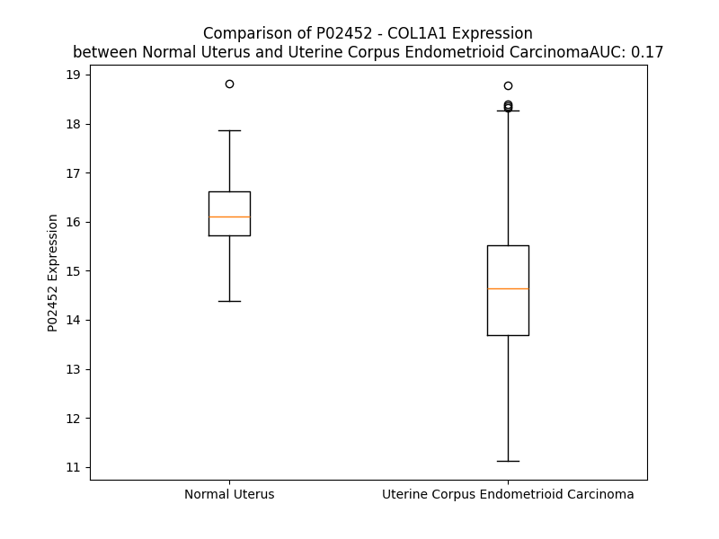

# Detailed Data for P02452

## Introduction to the Detailed Summary

### How to Interpret the Results

- **Summary & Metrics**: This section provides a quick reference to essential protein attributes, including expression changes, family classification, and biomarker applications. Regulation status (upregulated/downregulated) indicates the protein's behavior in a disease context. Some information comes from the original excel file with the proteins selected from literature, while others are derived from the analyses.
- **Expression Comparison**: A visual representation comparing protein expression between normal and disease states. It highlights significant changes in expression levels that might indicate diagnostic or therapeutic relevance. This is data coming from transcriptomics experiments and could not translate similarly to protein levels.
- **Isoform Alignment**: An interactive view of isoform alignments, revealing structural and functional differences between variants of the protein.
- **Interactors & Homologs**: Tables listing known interaction partners and homologous proteins, the more interactors and homologs, the more complex the protein is to design an antibody for.
- **Biological Assemblies**: Information about the structural arrangement of the protein in different assemblies, providing insights into its functional state but also the complexity of the protein to develop antibodies.
- **Combined Per-Residue Information**: A detailed table summarizing residue-level data. This includes predictions for epitope regions, aggregation tendencies, and modifications that might impact the protein's function. Each row corresponds to a residue in the protein, providing insights into specific sites that may be important for research or drug development.
## Summary & Metrics

- **UniProt Accession**: P02452
- **Gene Name**: COL1A1
- **Protein Name**: CO1A1_HUMAN
- **Swiss Prot**: NA
- **Family**: NA
- **Biomarker Application**: NA
- **Number of Isoforms**: 0
- **Regulation**: NA
- **(transcriptomics) AUC**: 0.17
- **(transcriptomics) Fold Change**: 1.10
- **(transcriptomics) Regulation**: Downregulated
- **Discotope Epitope Count**: N/A
- **Max n_uniprots (Homo)**: 3.0
- **Max n_uniprots (Hetero)**: 3.0

## Expression Comparison

## Interactors

| preferredName_A   | preferredName_B   |   score |
|:------------------|:------------------|--------:|
| COL1A1            | COL3A1            |   0.999 |
| COL1A1            | COL1A2            |   0.999 |
| COL1A1            | COL5A2            |   0.995 |
| COL1A1            | COL5A1            |   0.994 |
| COL1A1            | CD44              |   0.987 |
| COL1A1            | ITGB1             |   0.984 |
| COL1A1            | ITGA2             |   0.983 |
| COL1A1            | LUM               |   0.981 |
| COL1A1            | COL6A3            |   0.974 |
| COL1A1            | BGN               |   0.974 |
| COL1A1            | FN1               |   0.974 |
| COL1A1            | CRTAP             |   0.971 |
| COL1A1            | COL6A1            |   0.969 |
| COL1A1            | SPARC             |   0.968 |
| COL1A1            | COL11A1           |   0.965 |
| COL1A1            | RUNX2             |   0.955 |
| COL1A1            | COL6A2            |   0.954 |
| COL1A1            | P3H1              |   0.945 |
| COL1A1            | ITGA5             |   0.944 |
| COL1A1            | GP6               |   0.943 |
| COL1A1            | ADAMTS2           |   0.936 |
| COL1A1            | ITGB3             |   0.932 |
| COL1A1            | FBN1              |   0.929 |
| COL1A1            | ACTA2             |   0.928 |
| COL1A1            | DCN               |   0.923 |
| COL1A1            | SERPINH1          |   0.921 |
| COL1A1            | POSTN             |   0.903 |

## Homologs

| uniprot_id   | gene_id   |
|:-------------|:----------|
| Q02388       | COL7A1    |
| A0A669KB28   | COL13A1   |
| A0A2R8YG47   | COL9A1    |
| P39059       | COL15A1   |
| Q8IZC6       | COL27A1   |
| A0A2R8Y760   | COL25A1   |
| Q9UMD9       | COL17A1   |
| P02458       | COL2A1    |
| A0A3B3ITQ8   | COL4A2    |
| H7C435       | COL3A1    |
| H7BXV5       | COL18A1   |
| Q49AM6       | COL4A5    |
| D6RA95       | EDA       |
| Q07092       | COL16A1   |
| F8WDX7       | EMID1     |
| P08123       | COL1A2    |
| A0A384P5H7   | COL6A1    |
| A0A804HI71   | COL4A4    |
| A8MXH5       | COL4A6    |
| A6PVD9       | COL21A1   |
| P20908       | COL5A1    |
| Q14055       | COL9A2    |
| C9JMN2       | COL11A1   |
| F8WDM8       | COL24A1   |
| H7C0M5       | COL6A2    |
| Q96A83       | COL26A1   |
| P25940       | COL5A3    |
| L8EAS4       | COL23A1   |
| Q9P218       | COL20A1   |
| Q8NFW1       | COL22A1   |
| Q9Y215       | COLQ      |
| A0A0C4DFS1   | COL11A2   |
| A0A0C4DG66   | COL28A1   |
| A0A3B3IRH9   | COL5A2    |
| H7BXM4       | COL4A3    |
| Q14050       | COL9A3    |
| P02462       | COL4A1    |

## Biological Assemblies

|   Unnamed: 0 |   assembly |   n_uniprots | composition   | crystal_id   |
|-------------:|-----------:|-------------:|:--------------|:-------------|
|            0 |          1 |            3 | Homo          | 2llp         |
|            0 |          1 |            2 | Homo          | 5ou8         |
|            0 |          1 |            2 | Hetero        | 3gxe         |
|            1 |          2 |            2 | Hetero        | 3gxe         |
|            0 |          1 |            3 | Homo          | 7e7b         |
|            0 |          1 |            3 | Homo          | 7e7d         |
|            0 |          1 |            1 | Homo          | 3ejh         |
|            1 |          2 |            1 | Homo          | 3ejh         |
|            0 |          1 |            3 | Hetero        | 5cvb         |
|            1 |          2 |            3 | Hetero        | 5cvb         |
|            0 |          1 |            2 | Homo          | 5ou9         |
|            0 |          1 |            3 | Hetero        | 5cti         |
|            0 |          1 |            3 | Hetero        | 5cva         |
|            1 |          2 |            3 | Hetero        | 5cva         |
|            0 |          1 |            3 | Homo          | 1q7d         |

## Combined Per-Residue Information

|   res | aa   |   Beta |   Turn |   Helix |   Aggregation |   Conc-Stab_Aggregation | modification                | glycosylation                              |
|------:|:-----|-------:|-------:|--------:|--------------:|------------------------:|:----------------------------|:-------------------------------------------|
|     1 | M    |    0.5 |    0   |   0     |         0     |                   0     | N/A                         | N/A                                        |
|     2 | F    |    3.1 |    0   |   0.048 |        36.105 |                  36.105 | N/A                         | N/A                                        |
|     3 | S    |    3.5 |    0   |  16.534 |        37.728 |                  37.728 | N/A                         | N/A                                        |
|     4 | F    |    3.6 |    0   |  17.731 |        64.692 |                  64.692 | N/A                         | N/A                                        |
|     5 | V    |    1.9 |    0.1 |  19.624 |        66.89  |                  66.89  | N/A                         | N/A                                        |
|     6 | D    |    1.6 |    0.1 |  57.066 |        67.077 |                  67.077 | N/A                         | N/A                                        |
|     7 | L    |    1.7 |    0.1 |  57.373 |        67.077 |                  67.077 | N/A                         | N/A                                        |
|     8 | R    |    0.9 |    0   |  57.956 |        67.077 |                  67.077 | N/A                         | N/A                                        |
|     9 | L    |    1.1 |    0   |  57.868 |        90.85  |                  90.85  | N/A                         | N/A                                        |
|    10 | L    |    0.9 |    0   |  57.786 |        95.007 |                  95.007 | N/A                         | N/A                                        |
|    11 | L    |    1.1 |    0   |  57.685 |        96.987 |                  96.987 | N/A                         | N/A                                        |
|    12 | L    |    0.8 |    0   |  56.986 |        97.22  |                  97.22  | N/A                         | N/A                                        |
|    13 | L    |    0.5 |    0   |  54.505 |        96.624 |                  96.624 | N/A                         | N/A                                        |
|    14 | A    |    0.2 |    0   |  50.183 |        91.987 |                  91.987 | N/A                         | N/A                                        |
|    15 | A    |    0.1 |    0   |  35.396 |        87.907 |                  87.907 | N/A                         | N/A                                        |
|    16 | T    |    0.3 |    0   |  15.658 |        84.383 |                  84.383 | N/A                         | N/A                                        |
|    17 | A    |    0.4 |    0   |  14.527 |        82.276 |                  82.276 | N/A                         | N/A                                        |
|    18 | L    |    0.5 |    0   |  11.893 |        80.494 |                  80.494 | N/A                         | N/A                                        |
|    19 | L    |    1.2 |    0   |   5.123 |        70.763 |                  70.763 | N/A                         | N/A                                        |
|    20 | T    |    1.2 |    0.3 |   2.448 |        17.619 |                  17.619 | N/A                         | N/A                                        |
|    21 | H    |    1.1 |    0.3 |   2.22  |         0.164 |                   0.164 | N/A                         | N/A                                        |
|    22 | G    |    0.2 |    0.4 |   0.548 |         0.04  |                   0.04  | N/A                         | N/A                                        |
|    23 | Q    |    0.1 |    0.5 |   0.108 |         0     |                   0     | N/A                         | N/A                                        |
|    24 | E    |    0.1 |    0.6 |   0     |         0     |                   0     | N/A                         | N/A                                        |
|    25 | E    |    0.1 |    0.6 |   0     |         0     |                   0     | N/A                         | N/A                                        |
|    26 | G    |    0   |    0.5 |   0     |         0     |                   0     | N/A                         | N/A                                        |
|    27 | Q    |    1.9 |    0.4 |   0     |         0     |                   0     | N/A                         | N/A                                        |
|    28 | V    |    2.1 |    0.3 |   0     |         0     |                   0     | N/A                         | N/A                                        |
|    29 | E    |    2.1 |    0.4 |   0     |         0     |                   0     | N/A                         | N/A                                        |
|    30 | G    |    0.2 |    0.6 |   0     |         0     |                   0     | N/A                         | N/A                                        |
|    31 | Q    |    0.1 |    0.7 |   0     |         0     |                   0     | N/A                         | N/A                                        |
|    32 | D    |    0.1 |    1.9 |   0     |         0     |                   0     | N/A                         | N/A                                        |
|    33 | E    |    0.1 |    1.8 |   0     |         0     |                   0     | N/A                         | N/A                                        |
|    34 | D    |    0   |    1.6 |   0     |         0     |                   0     | N/A                         | N/A                                        |
|    35 | I    |    0   |    1.5 |   0     |         0     |                   0     | N/A                         | N/A                                        |
|    36 | P    |    0   |    0   |   0     |         0     |                   0     | N/A                         | N/A                                        |
|    37 | P    |    0   |    0   |   0     |         0     |                   0     | N/A                         | N/A                                        |
|    38 | I    |   10.1 |    0   |   0     |         0     |                   0     | N/A                         | N/A                                        |
|    39 | T    |   12.4 |    0   |   0     |         0     |                   0     | N/A                         | N/A                                        |
|    40 | C    |   14.9 |    0   |   0     |         0     |                   0     | N/A                         | N/A                                        |
|    41 | V    |    6.2 |    0.2 |   0     |         0     |                   0     | N/A                         | N/A                                        |
|    42 | Q    |    3.7 |    0.8 |   0     |         0     |                   0     | N/A                         | N/A                                        |
|    43 | N    |    1.2 |    0.8 |   0     |         0     |                   0     | N/A                         | N/A                                        |
|    44 | G    |    0   |    0.8 |   0     |         0     |                   0     | N/A                         | N/A                                        |
|    45 | L    |    1.4 |    0.6 |   0     |         0     |                   0     | N/A                         | N/A                                        |
|    46 | R    |    2.3 |    0   |   0     |         0     |                   0     | N/A                         | N/A                                        |
|    47 | Y    |    3   |    0.1 |   0     |         0     |                   0     | N/A                         | N/A                                        |
|    48 | H    |    1.7 |    0.2 |   0     |         0     |                   0     | N/A                         | N/A                                        |
|    49 | D    |    0.8 |    1.1 |   0     |         0     |                   0     | N/A                         | N/A                                        |
|    50 | R    |    0.3 |    1.1 |   0     |         0     |                   0     | N/A                         | N/A                                        |
|    51 | D    |    2.3 |    1.1 |   0     |         0     |                   0     | N/A                         | N/A                                        |
|    52 | V    |    4.1 |    1   |   0     |         0     |                   0     | N/A                         | N/A                                        |
|    53 | W    |    4   |    0   |   0     |         0     |                   0     | N/A                         | N/A                                        |
|    54 | K    |    2   |    0   |   0     |         0     |                   0     | N/A                         | N/A                                        |
|    55 | P    |    0.2 |    0   |   0     |         0     |                   0     | N/A                         | N/A                                        |
|    56 | E    |    0   |    0   |   0     |         0     |                   0     | N/A                         | N/A                                        |
|    57 | P    |    0   |    0   |   0     |         0     |                   0     | N/A                         | N/A                                        |
|    58 | C    |    3.1 |    0   |   0     |         0     |                   0     | N/A                         | N/A                                        |
|    59 | R    |    3.3 |    0   |   0     |         0     |                   0     | N/A                         | N/A                                        |
|    60 | I    |    4.6 |    0   |   0     |         0     |                   0     | N/A                         | N/A                                        |
|    61 | C    |    2.3 |    0   |   0     |         0     |                   0     | N/A                         | N/A                                        |
|    62 | V    |    2.7 |    0   |   0     |         0     |                   0     | N/A                         | N/A                                        |
|    63 | C    |    1.6 |    0.9 |   0     |         0     |                   0     | N/A                         | N/A                                        |
|    64 | D    |    0.8 |    9.6 |   0     |         0     |                   0     | N/A                         | N/A                                        |
|    65 | N    |    0.1 |    9.6 |   0     |         0     |                   0     | N/A                         | N/A                                        |
|    66 | G    |    0   |    9.6 |   0     |         0     |                   0     | N/A                         | N/A                                        |
|    67 | K    |    0.9 |    8.7 |   0     |         0     |                   0     | N/A                         | N/A                                        |
|    68 | V    |    3.1 |    0   |   0     |         0     |                   0     | N/A                         | N/A                                        |
|    69 | L    |    3.3 |    0   |   0     |         0     |                   0     | N/A                         | N/A                                        |
|    70 | C    |    2.6 |    0.3 |   0     |         0     |                   0     | N/A                         | N/A                                        |
|    71 | D    |    0.4 |    0.3 |   0     |         0     |                   0     | N/A                         | N/A                                        |
|    72 | D    |    2   |    0.3 |   0     |         0     |                   0     | N/A                         | N/A                                        |
|    73 | V    |    4.7 |    0.3 |   0     |         0     |                   0     | N/A                         | N/A                                        |
|    74 | I    |    4.8 |    0   |   0     |         0     |                   0     | N/A                         | N/A                                        |
|    75 | C    |    3   |    0.1 |   0.138 |         0     |                   0     | N/A                         | N/A                                        |
|    76 | D    |    0.2 |    0.3 |   0.582 |         0     |                   0     | N/A                         | N/A                                        |
|    77 | E    |    0.6 |    0.4 |   0.582 |         0     |                   0     | N/A                         | N/A                                        |
|    78 | T    |    1   |    0.7 |   0.582 |         0     |                   0     | N/A                         | N/A                                        |
|    79 | K    |    1.4 |    0.7 |   0.582 |         0     |                   0     | N/A                         | N/A                                        |
|    80 | N    |    1   |    0.4 |   0.582 |         0     |                   0     | N/A                         | N/A                                        |
|    81 | C    |    0.4 |    3.3 |   0.582 |         0     |                   0     | N/A                         | N/A                                        |
|    82 | P    |    0.1 |    3   |   0     |         0     |                   0     | N/A                         | N/A                                        |
|    83 | G    |    0   |    3   |   0     |         0     |                   0     | N/A                         | N/A                                        |
|    84 | A    |    0.4 |    3   |   0     |         0     |                   0     | N/A                         | N/A                                        |
|    85 | E    |    0.6 |    0.1 |   0     |         0     |                   0     | N/A                         | N/A                                        |
|    86 | V    |    0.6 |    0.3 |   0     |         0     |                   0     | N/A                         | N/A                                        |
|    87 | P    |    0.2 |    0.8 |   0     |         0     |                   0     | N/A                         | N/A                                        |
|    88 | E    |    0   |    1   |   0     |         0     |                   0     | N/A                         | N/A                                        |
|    89 | G    |    0   |    1   |   0     |         0     |                   0     | N/A                         | N/A                                        |
|    90 | E    |    1.9 |    0.8 |   0     |         0     |                   0     | N/A                         | N/A                                        |
|    91 | C    |    3   |    0.2 |   0     |         0     |                   0     | N/A                         | N/A                                        |
|    92 | C    |    3   |    0.1 |   0     |         0     |                   0     | N/A                         | N/A                                        |
|    93 | P    |    1.1 |    0   |   0     |         0     |                   0     | N/A                         | N/A                                        |
|    94 | V    |    0.1 |    0   |   0     |         0     |                   0     | N/A                         | N/A                                        |
|    95 | C    |    0.1 |    5.7 |   0     |         0     |                   0     | N/A                         | N/A                                        |
|    96 | P    |    0.1 |    6.1 |   0     |         0     |                   0     | N/A                         | N/A                                        |
|    97 | D    |    0   |    6.4 |   0     |         0     |                   0     | N/A                         | N/A                                        |
|    98 | G    |    0   |    6.5 |   0     |         0     |                   0     | N/A                         | N/A                                        |
|    99 | S    |    0.3 |    0.8 |   0     |         0     |                   0     | N/A                         | N/A                                        |
|   100 | E    |    0.3 |    0.4 |   0     |         0     |                   0     | N/A                         | N/A                                        |
|   101 | S    |    0.4 |    0.6 |   0     |         0     |                   0     | N/A                         | N/A                                        |
|   102 | P    |    0   |    0.6 |   0     |         0     |                   0     | N/A                         | N/A                                        |
|   103 | T    |    0.4 |    0.7 |   0     |         0     |                   0     | N/A                         | N/A                                        |
|   104 | D    |    0.5 |    0.8 |   0     |         0     |                   0     | N/A                         | N/A                                        |
|   105 | Q    |    0.6 |    0.3 |   0     |         0     |                   0     | N/A                         | N/A                                        |
|   106 | E    |    0.3 |    0.2 |   0     |         0     |                   0     | N/A                         | N/A                                        |
|   107 | T    |    0.3 |    0.3 |   0     |         0     |                   0     | N/A                         | N/A                                        |
|   108 | T    |    0.3 |    0.2 |   0     |         0     |                   0     | N/A                         | N/A                                        |
|   109 | G    |    0.2 |    0.1 |   0     |         0     |                   0     | N/A                         | N/A                                        |
|   110 | V    |    0.3 |    0.1 |   0     |         0     |                   0     | N/A                         | N/A                                        |
|   111 | E    |    0.3 |    0.1 |   0     |         0     |                   0     | N/A                         | N/A                                        |
|   112 | G    |    0.2 |    0.8 |   0     |         0     |                   0     | N/A                         | N/A                                        |
|   113 | P    |    0   |    1.4 |   0     |         0     |                   0     | N/A                         | N/A                                        |
|   114 | K    |    0   |    4.2 |   0     |         0     |                   0     | N/A                         | N/A                                        |
|   115 | G    |    0   |    4.3 |   0     |         0     |                   0     | N/A                         | N/A                                        |
|   116 | D    |    0   |    3.5 |   0     |         0     |                   0     | N/A                         | N/A                                        |
|   117 | T    |    0   |    3.1 |   0     |         0     |                   0     | N/A                         | N/A                                        |
|   118 | G    |    0   |    1.1 |   0     |         0     |                   0     | N/A                         | N/A                                        |
|   119 | P    |    0   |    0.9 |   0     |         0     |                   0     | N/A                         | N/A                                        |
|   120 | R    |    0   |    0.9 |   0     |         0     |                   0     | N/A                         | N/A                                        |
|   121 | G    |    0   |    1.6 |   0     |         0     |                   0     | N/A                         | N/A                                        |
|   122 | P    |    0   |    0.8 |   0     |         0     |                   0     | N/A                         | N/A                                        |
|   123 | R    |    0   |    0.8 |   0     |         0     |                   0     | N/A                         | N/A                                        |
|   124 | G    |    0   |    1.2 |   0     |         0     |                   0     | N/A                         | N/A                                        |
|   125 | P    |    0   |    0.4 |   0     |         0     |                   0     | N/A                         | N/A                                        |
|   126 | A    |    0   |    0.4 |   0     |         0     |                   0     | N/A                         | N/A                                        |
|   127 | G    |    0   |    0.4 |   0     |         0     |                   0     | N/A                         | N/A                                        |
|   128 | P    |    0   |    2.3 |   0     |         0     |                   0     | N/A                         | N/A                                        |
|   129 | P    |    0   |    2.5 |   0     |         0     |                   0     | N/A                         | N/A                                        |
|   130 | G    |    0   |    3.4 |   0     |         0     |                   0     | N/A                         | N/A                                        |
|   131 | R    |    0   |    3.7 |   0     |         0     |                   0     | N/A                         | N/A                                        |
|   132 | D    |    0.1 |    1.4 |   0     |         0     |                   0     | N/A                         | N/A                                        |
|   133 | G    |    0.1 |    1.2 |   0     |         0     |                   0     | N/A                         | N/A                                        |
|   134 | I    |    0.1 |    1.4 |   0     |         0     |                   0     | N/A                         | N/A                                        |
|   135 | P    |    0   |    1.1 |   0     |         0     |                   0     | N/A                         | N/A                                        |
|   136 | G    |    0   |    1.1 |   0     |         0     |                   0     | N/A                         | N/A                                        |
|   137 | Q    |    0   |    1.7 |   0     |         0     |                   0     | N/A                         | N/A                                        |
|   138 | P    |    0   |    0.6 |   0     |         0     |                   0     | N/A                         | N/A                                        |
|   139 | G    |    0   |    0.6 |   0     |         0     |                   0     | N/A                         | N/A                                        |
|   140 | L    |    0   |    0.6 |   0     |         0     |                   0     | N/A                         | N/A                                        |
|   141 | P    |    0   |    0   |   0     |         0     |                   0     | N/A                         | N/A                                        |
|   142 | G    |    0   |    0   |   0     |         0     |                   0     | N/A                         | N/A                                        |
|   143 | P    |    0   |    0   |   0     |         0     |                   0     | N/A                         | N/A                                        |
|   144 | P    |    0   |    0   |   0     |         0     |                   0     | N/A                         | N/A                                        |
|   145 | G    |    0   |    0   |   0     |         0     |                   0     | N/A                         | N/A                                        |
|   146 | P    |    0   |    0   |   0     |         0     |                   0     | N/A                         | N/A                                        |
|   147 | P    |    0   |    0   |   0     |         0     |                   0     | N/A                         | N/A                                        |
|   148 | G    |    0   |    0   |   0     |         0     |                   0     | N/A                         | N/A                                        |
|   149 | P    |    0   |    0   |   0     |         0     |                   0     | N/A                         | N/A                                        |
|   150 | P    |    0   |    0   |   0     |         0     |                   0     | N/A                         | N/A                                        |
|   151 | G    |    0   |    0   |   0     |         0     |                   0     | N/A                         | N/A                                        |
|   152 | P    |    0   |    0.9 |   0     |         0     |                   0     | N/A                         | N/A                                        |
|   153 | P    |    0   |    1   |   0     |         0     |                   0     | N/A                         | N/A                                        |
|   154 | G    |    0   |    1   |   0     |         0     |                   0     | N/A                         | N/A                                        |
|   155 | L    |    0   |    1.3 |   0     |         0     |                   0     | N/A                         | N/A                                        |
|   156 | G    |    0   |    1.5 |   0     |         0     |                   0     | N/A                         | N/A                                        |
|   157 | G    |    0   |    1.5 |   0     |         0     |                   0     | N/A                         | N/A                                        |
|   158 | N    |    0.3 |    1.5 |   0     |         0     |                   0     | N/A                         | N/A                                        |
|   159 | F    |    0.5 |    1.1 |   0     |         0     |                   0     | N/A                         | N/A                                        |
|   160 | A    |    0.5 |    0.2 |   0     |         0     |                   0     | N/A                         | N/A                                        |
|   161 | P    |    0.2 |    0.2 |   0     |         0     |                   0     | N/A                         | N/A                                        |
|   162 | Q    |    0.8 |    0.2 |   0     |         0     |                   0     | Pyrrolidone carboxylic acid | N/A                                        |
|   163 | L    |    3.1 |    0.4 |   0     |         0     |                   0     | N/A                         | N/A                                        |
|   164 | S    |    3.9 |    0.3 |   0     |         0     |                   0     | N/A                         | N/A                                        |
|   165 | Y    |    3.4 |    0.3 |   0     |         0     |                   0     | N/A                         | N/A                                        |
|   166 | G    |    1.1 |    0.3 |   0     |         0     |                   0     | N/A                         | N/A                                        |
|   167 | Y    |    0.6 |    0.2 |   0     |         0     |                   0     | N/A                         | N/A                                        |
|   168 | D    |    0.3 |    0.2 |   0     |         0     |                   0     | N/A                         | N/A                                        |
|   169 | E    |    0.5 |    0.3 |   0     |         0     |                   0     | N/A                         | N/A                                        |
|   170 | K    |    0.9 |    0.5 |   0     |         0     |                   0     | Allysine                    | N/A                                        |
|   171 | S    |    1   |    0.5 |   0     |         0     |                   0     | Phosphoserine               | N/A                                        |
|   172 | T    |    0.8 |    0.6 |   0     |         0     |                   0     | N/A                         | N/A                                        |
|   173 | G    |    0.1 |    0.6 |   0     |         0     |                   0     | N/A                         | N/A                                        |
|   174 | G    |    0.1 |    0.4 |   0     |         0     |                   0     | N/A                         | N/A                                        |
|   175 | I    |    7.5 |    0.3 |   0     |         0     |                   0     | N/A                         | N/A                                        |
|   176 | S    |    7.7 |    0.1 |   0     |         0     |                   0     | N/A                         | N/A                                        |
|   177 | V    |    7.6 |    0   |   0     |         0     |                   0     | N/A                         | N/A                                        |
|   178 | P    |    0.2 |    0.1 |   0     |         0     |                   0     | N/A                         | N/A                                        |
|   179 | G    |    0   |    0.5 |   0     |         0     |                   0     | N/A                         | N/A                                        |
|   180 | P    |    0   |    0.5 |   0     |         0     |                   0     | N/A                         | N/A                                        |
|   181 | M    |    0   |    0.5 |   0     |         0     |                   0     | N/A                         | N/A                                        |
|   182 | G    |    0   |    2.3 |   0     |         0     |                   0     | N/A                         | N/A                                        |
|   183 | P    |    0   |    1.9 |   0     |         0     |                   0     | N/A                         | N/A                                        |
|   184 | S    |    0   |    2   |   0     |         0     |                   0     | N/A                         | N/A                                        |
|   185 | G    |    0   |    2.8 |   0     |         0     |                   0     | N/A                         | N/A                                        |
|   186 | P    |    0   |    1   |   0     |         0     |                   0     | N/A                         | N/A                                        |
|   187 | R    |    0.1 |    1   |   0     |         0     |                   0     | N/A                         | N/A                                        |
|   188 | G    |    0.1 |    0.9 |   0     |         0     |                   0     | N/A                         | N/A                                        |
|   189 | L    |    0.1 |    0.1 |   0     |         0     |                   0     | N/A                         | N/A                                        |
|   190 | P    |    0   |    0   |   0     |         0     |                   0     | 4-hydroxyproline            | N/A                                        |
|   191 | G    |    0   |    0   |   0     |         0     |                   0     | N/A                         | N/A                                        |
|   192 | P    |    0   |    1.8 |   0     |         0     |                   0     | N/A                         | N/A                                        |
|   193 | P    |    0   |    1.8 |   0     |         0     |                   0     | 4-hydroxyproline            | N/A                                        |
|   194 | G    |    0   |    1.8 |   0     |         0     |                   0     | N/A                         | N/A                                        |
|   195 | A    |    0   |    1.8 |   0     |         0     |                   0     | N/A                         | N/A                                        |
|   196 | P    |    0   |    0   |   0     |         0     |                   0     | 4-hydroxyproline            | N/A                                        |
|   197 | G    |    0   |    1   |   0     |         0     |                   0     | N/A                         | N/A                                        |
|   198 | P    |    0   |    1.3 |   0     |         0     |                   0     | N/A                         | N/A                                        |
|   199 | Q    |    0   |    1.3 |   0     |         0     |                   0     | N/A                         | N/A                                        |
|   200 | G    |    0.1 |    1.3 |   0     |         0     |                   0     | N/A                         | N/A                                        |
|   201 | F    |    0.5 |    0.3 |   0     |         0     |                   0     | N/A                         | N/A                                        |
|   202 | Q    |    0.5 |    0   |   0     |         0     |                   0     | N/A                         | N/A                                        |
|   203 | G    |    0.5 |    0   |   0     |         0     |                   0     | N/A                         | N/A                                        |
|   204 | P    |    0   |    1.9 |   0     |         0     |                   0     | N/A                         | N/A                                        |
|   205 | P    |    0   |    1.9 |   0     |         0     |                   0     | 4-hydroxyproline            | N/A                                        |
|   206 | G    |    0   |    1.9 |   0     |         0     |                   0     | N/A                         | N/A                                        |
|   207 | E    |    0   |    2.8 |   0     |         0     |                   0     | N/A                         | N/A                                        |
|   208 | P    |    0   |    0.9 |   0     |         0     |                   0     | 4-hydroxyproline            | N/A                                        |
|   209 | G    |    0   |    0.9 |   0     |         0     |                   0     | N/A                         | N/A                                        |
|   210 | E    |    0   |    1.8 |   0     |         0     |                   0     | N/A                         | N/A                                        |
|   211 | P    |    0   |    1   |   0     |         0     |                   0     | 4-hydroxyproline            | N/A                                        |
|   212 | G    |    0   |    1.7 |   0     |         0     |                   0     | N/A                         | N/A                                        |
|   213 | A    |    0.1 |    1.7 |   0     |         0     |                   0     | N/A                         | N/A                                        |
|   214 | S    |    0.1 |    1.1 |   0     |         0     |                   0     | N/A                         | N/A                                        |
|   215 | G    |    0.1 |    1.3 |   0     |         0     |                   0     | N/A                         | N/A                                        |
|   216 | P    |    0   |    0.6 |   0     |         0     |                   0     | N/A                         | N/A                                        |
|   217 | M    |    0   |    0.7 |   0     |         0     |                   0     | N/A                         | N/A                                        |
|   218 | G    |    0   |    1.3 |   0     |         0     |                   0     | N/A                         | N/A                                        |
|   219 | P    |    0   |    0.9 |   0     |         0     |                   0     | N/A                         | N/A                                        |
|   220 | R    |    0   |    0.9 |   0     |         0     |                   0     | N/A                         | N/A                                        |
|   221 | G    |    0   |    0.8 |   0     |         0     |                   0     | N/A                         | N/A                                        |
|   222 | P    |    0   |    0   |   0     |         0     |                   0     | N/A                         | N/A                                        |
|   223 | P    |    0   |    0   |   0     |         0     |                   0     | N/A                         | N/A                                        |
|   224 | G    |    0   |    0   |   0     |         0     |                   0     | N/A                         | N/A                                        |
|   225 | P    |    0   |    2.7 |   0     |         0     |                   0     | N/A                         | N/A                                        |
|   226 | P    |    0   |    2.8 |   0     |         0     |                   0     | 4-hydroxyproline            | N/A                                        |
|   227 | G    |    0   |    3.8 |   0     |         0     |                   0     | N/A                         | N/A                                        |
|   228 | K    |    0   |    4.6 |   0     |         0     |                   0     | N/A                         | N/A                                        |
|   229 | N    |    0   |    3.1 |   0     |         0     |                   0     | N/A                         | N/A                                        |
|   230 | G    |    0   |    3.8 |   0     |         0     |                   0     | N/A                         | N/A                                        |
|   231 | D    |    0   |    3.5 |   0.306 |         0     |                   0     | N/A                         | N/A                                        |
|   232 | D    |    0   |    2.8 |   0.539 |         0     |                   0     | N/A                         | N/A                                        |
|   233 | G    |    0   |    1.7 |   0.539 |         0     |                   0     | N/A                         | N/A                                        |
|   234 | E    |    0.1 |    1.3 |   0.539 |         0     |                   0     | N/A                         | N/A                                        |
|   235 | A    |    0.1 |    0.5 |   0.539 |         0     |                   0     | N/A                         | N/A                                        |
|   236 | G    |    0   |    0.5 |   0.539 |         0     |                   0     | N/A                         | N/A                                        |
|   237 | K    |    0   |    1.9 |   0.539 |         0     |                   0     | N/A                         | N/A                                        |
|   238 | P    |    0   |    1.6 |   0     |         0     |                   0     | N/A                         | N/A                                        |
|   239 | G    |    0   |    1.6 |   0     |         0     |                   0     | N/A                         | N/A                                        |
|   240 | R    |    0   |    3   |   0     |         0     |                   0     | N/A                         | N/A                                        |
|   241 | P    |    0   |    1.5 |   0     |         0     |                   0     | 4-hydroxyproline            | N/A                                        |
|   242 | G    |    0   |    1.8 |   0     |         0     |                   0     | N/A                         | N/A                                        |
|   243 | E    |    0   |    1.8 |   0     |         0     |                   0     | N/A                         | N/A                                        |
|   244 | R    |    0   |    0.3 |   0     |         0     |                   0     | N/A                         | N/A                                        |
|   245 | G    |    0   |    0.3 |   0     |         0     |                   0     | N/A                         | N/A                                        |
|   246 | P    |    0   |    0   |   0     |         0     |                   0     | N/A                         | N/A                                        |
|   247 | P    |    0   |    0   |   0     |         0     |                   0     | 4-hydroxyproline            | N/A                                        |
|   248 | G    |    0   |    1   |   0     |         0     |                   0     | N/A                         | N/A                                        |
|   249 | P    |    0   |    1.3 |   0     |         0     |                   0     | N/A                         | N/A                                        |
|   250 | Q    |    0   |    1.4 |   0     |         0     |                   0     | N/A                         | N/A                                        |
|   251 | G    |    0   |    1.7 |   0     |         0     |                   0     | N/A                         | N/A                                        |
|   252 | A    |    0.1 |    0.8 |   0     |         0     |                   0     | N/A                         | N/A                                        |
|   253 | R    |    0.2 |    0.5 |   0     |         0     |                   0     | N/A                         | N/A                                        |
|   254 | G    |    0.2 |    0.4 |   0     |         0     |                   0     | N/A                         | N/A                                        |
|   255 | L    |    0.1 |    0.9 |   0     |         0     |                   0     | N/A                         | N/A                                        |
|   256 | P    |    0   |    0.9 |   0     |         0     |                   0     | 4-hydroxyproline            | N/A                                        |
|   257 | G    |    0.1 |    0.9 |   0     |         0     |                   0     | N/A                         | N/A                                        |
|   258 | T    |    0.2 |    1.1 |   0     |         0     |                   0     | N/A                         | N/A                                        |
|   259 | A    |    0.3 |    0.3 |   0     |         0     |                   0     | N/A                         | N/A                                        |
|   260 | G    |    0.2 |    0.2 |   0     |         0     |                   0     | N/A                         | N/A                                        |
|   261 | L    |    0.1 |    1.6 |   0     |         0     |                   0     | N/A                         | N/A                                        |
|   262 | P    |    0   |    1.4 |   0     |         0     |                   0     | 4-hydroxyproline            | N/A                                        |
|   263 | G    |    0   |    1.4 |   0     |         0     |                   0     | N/A                         | N/A                                        |
|   264 | M    |    0.1 |    1.9 |   0     |         0     |                   0     | N/A                         | N/A                                        |
|   265 | K    |    0.1 |    0.6 |   0     |         0     |                   0     | 5-hydroxylysine; alternate  | O-linked (Gal...) hydroxylysine; alternate |
|   266 | G    |    0.1 |    0.6 |   0     |         0     |                   0     | N/A                         | N/A                                        |
|   267 | H    |    0.2 |    1   |   0     |         0     |                   0     | N/A                         | N/A                                        |
|   268 | R    |    0.3 |    0.5 |   0     |         0     |                   0     | N/A                         | N/A                                        |
|   269 | G    |    0.4 |    0.5 |   0     |         0     |                   0     | N/A                         | N/A                                        |
|   270 | F    |    1.6 |    0.7 |   0     |         0     |                   0     | N/A                         | N/A                                        |
|   271 | S    |    1.5 |    0.4 |   0     |         0     |                   0     | Phosphoserine               | N/A                                        |
|   272 | G    |    1.6 |    0.9 |   0     |         0     |                   0     | N/A                         | N/A                                        |
|   273 | L    |    0.2 |    1.1 |   0     |         0     |                   0     | N/A                         | N/A                                        |
|   274 | D    |    0.1 |    0.9 |   0     |         0     |                   0     | N/A                         | N/A                                        |
|   275 | G    |    0.1 |    1.1 |   0     |         0     |                   0     | N/A                         | N/A                                        |
|   276 | A    |    0   |    1.1 |   0     |         0     |                   0     | N/A                         | N/A                                        |
|   277 | K    |    0   |    1.7 |   0     |         0     |                   0     | N/A                         | N/A                                        |
|   278 | G    |    0   |    1.7 |   0     |         0     |                   0     | N/A                         | N/A                                        |
|   279 | D    |    0   |    1.4 |   0     |         0     |                   0     | N/A                         | N/A                                        |
|   280 | A    |    0   |    1   |   0     |         0     |                   0     | N/A                         | N/A                                        |
|   281 | G    |    0   |    0.5 |   0     |         0     |                   0     | N/A                         | N/A                                        |
|   282 | P    |    0   |    0.4 |   0     |         0     |                   0     | N/A                         | N/A                                        |
|   283 | A    |    0   |    0.5 |   0     |         0     |                   0     | N/A                         | N/A                                        |
|   284 | G    |    0   |    1.2 |   0     |         0     |                   0     | N/A                         | N/A                                        |
|   285 | P    |    0   |    1.4 |   0     |         0     |                   0     | N/A                         | N/A                                        |
|   286 | K    |    0.1 |    1.4 |   0     |         0     |                   0     | N/A                         | N/A                                        |
|   287 | G    |    0.1 |    1.3 |   0     |         0     |                   0     | N/A                         | N/A                                        |
|   288 | E    |    0.1 |    1.7 |   0     |         0     |                   0     | N/A                         | N/A                                        |
|   289 | P    |    0   |    1.2 |   0     |         0     |                   0     | 4-hydroxyproline            | N/A                                        |
|   290 | G    |    0   |    1.2 |   0     |         0     |                   0     | N/A                         | N/A                                        |
|   291 | S    |    0   |    3.6 |   0     |         0     |                   0     | N/A                         | N/A                                        |
|   292 | P    |    0   |    2.6 |   0     |         0     |                   0     | 4-hydroxyproline            | N/A                                        |
|   293 | G    |    0   |    3.7 |   0     |         0     |                   0     | N/A                         | N/A                                        |
|   294 | E    |    0   |    5.1 |   0     |         0     |                   0     | N/A                         | N/A                                        |
|   295 | N    |    0   |    2.7 |   0     |         0     |                   0     | N/A                         | N/A                                        |
|   296 | G    |    0   |    2.6 |   0     |         0     |                   0     | N/A                         | N/A                                        |
|   297 | A    |    0   |    3.6 |   0     |         0     |                   0     | N/A                         | N/A                                        |
|   298 | P    |    0   |    2.2 |   0     |         0     |                   0     | 4-hydroxyproline            | N/A                                        |
|   299 | G    |    0   |    2.2 |   0     |         0     |                   0     | N/A                         | N/A                                        |
|   300 | Q    |    0.1 |    2.2 |   0     |         0     |                   0     | N/A                         | N/A                                        |
|   301 | M    |    0.1 |    0.1 |   0     |         0     |                   0     | N/A                         | N/A                                        |
|   302 | G    |    0.1 |    0.8 |   0     |         0     |                   0     | N/A                         | N/A                                        |
|   303 | P    |    0   |    0.9 |   0     |         0     |                   0     | N/A                         | N/A                                        |
|   304 | R    |    0.1 |    0.9 |   0     |         0     |                   0     | N/A                         | N/A                                        |
|   305 | G    |    0.1 |    0.9 |   0     |         0     |                   0     | N/A                         | N/A                                        |
|   306 | L    |    0.1 |    1.4 |   0     |         0     |                   0     | N/A                         | N/A                                        |
|   307 | P    |    0   |    1.4 |   0     |         0     |                   0     | 4-hydroxyproline            | N/A                                        |
|   308 | G    |    0   |    1.6 |   0     |         0     |                   0     | N/A                         | N/A                                        |
|   309 | E    |    0   |    1.8 |   0     |         0     |                   0     | N/A                         | N/A                                        |
|   310 | R    |    0.1 |    0.5 |   0     |         0     |                   0     | N/A                         | N/A                                        |
|   311 | G    |    0.1 |    0.4 |   0     |         0     |                   0     | N/A                         | N/A                                        |
|   312 | R    |    0.1 |    1.5 |   0     |         0     |                   0     | N/A                         | N/A                                        |
|   313 | P    |    0   |    1.4 |   0     |         0     |                   0     | 4-hydroxyproline            | N/A                                        |
|   314 | G    |    0   |    1.4 |   0     |         0     |                   0     | N/A                         | N/A                                        |
|   315 | A    |    0   |    1.4 |   0     |         0     |                   0     | N/A                         | N/A                                        |
|   316 | P    |    0   |    0   |   0     |         0     |                   0     | N/A                         | N/A                                        |
|   317 | G    |    0   |    0.4 |   0     |         0     |                   0     | N/A                         | N/A                                        |
|   318 | P    |    0   |    0.9 |   0     |         0     |                   0     | N/A                         | N/A                                        |
|   319 | A    |    0   |    1   |   0     |         0     |                   0     | N/A                         | N/A                                        |
|   320 | G    |    0   |    1.3 |   0     |         0     |                   0     | N/A                         | N/A                                        |
|   321 | A    |    0.1 |    1   |   0     |         0     |                   0     | N/A                         | N/A                                        |
|   322 | R    |    0.2 |    0.8 |   0     |         0     |                   0     | N/A                         | N/A                                        |
|   323 | G    |    0.1 |    1   |   0     |         0     |                   0     | N/A                         | N/A                                        |
|   324 | N    |    0.1 |    1.3 |   0     |         0     |                   0     | N/A                         | N/A                                        |
|   325 | D    |    0   |    1.5 |   0.132 |         0     |                   0     | N/A                         | N/A                                        |
|   326 | G    |    0   |    1.6 |   0.132 |         0     |                   0     | N/A                         | N/A                                        |
|   327 | A    |    0.1 |    1.4 |   0.132 |         0     |                   0     | N/A                         | N/A                                        |
|   328 | T    |    0.1 |    1   |   0.132 |         0     |                   0     | N/A                         | N/A                                        |
|   329 | G    |    0.1 |    0.8 |   0.132 |         0     |                   0     | N/A                         | N/A                                        |
|   330 | A    |    0.1 |    0.4 |   0.132 |         0     |                   0     | N/A                         | N/A                                        |
|   331 | A    |    0.1 |    0.3 |   0     |         0     |                   0     | N/A                         | N/A                                        |
|   332 | G    |    0   |    0.2 |   0     |         0     |                   0     | N/A                         | N/A                                        |
|   333 | P    |    0   |    0   |   0     |         0     |                   0     | N/A                         | N/A                                        |
|   334 | P    |    0   |    0.1 |   0     |         0     |                   0     | 4-hydroxyproline            | N/A                                        |
|   335 | G    |    0   |    1.3 |   0     |         0     |                   0     | N/A                         | N/A                                        |
|   336 | P    |    0   |    1.3 |   0     |         0     |                   0     | N/A                         | N/A                                        |
|   337 | T    |    0   |    1.3 |   0     |         0     |                   0     | N/A                         | N/A                                        |
|   338 | G    |    0   |    1.6 |   0     |         0     |                   0     | N/A                         | N/A                                        |
|   339 | P    |    0   |    0.5 |   0     |         0     |                   0     | N/A                         | N/A                                        |
|   340 | A    |    0   |    0.5 |   0     |         0     |                   0     | N/A                         | N/A                                        |
|   341 | G    |    0   |    0.4 |   0     |         0     |                   0     | N/A                         | N/A                                        |
|   342 | P    |    0   |    1.9 |   0     |         0     |                   0     | N/A                         | N/A                                        |
|   343 | P    |    0   |    1.9 |   0     |         0     |                   0     | 4-hydroxyproline            | N/A                                        |
|   344 | G    |    0   |    1.9 |   0     |         0     |                   0     | N/A                         | N/A                                        |
|   345 | F    |    0   |    3.5 |   0     |         0     |                   0     | N/A                         | N/A                                        |
|   346 | P    |    0   |    1.6 |   0     |         0     |                   0     | 4-hydroxyproline            | N/A                                        |
|   347 | G    |    0   |    1.6 |   0     |         0     |                   0     | N/A                         | N/A                                        |
|   348 | A    |    0.1 |    1.6 |   0     |         0     |                   0     | N/A                         | N/A                                        |
|   349 | V    |    0.3 |    0.2 |   0     |         0     |                   0     | N/A                         | N/A                                        |
|   350 | G    |    0.3 |    0.4 |   0     |         0     |                   0     | N/A                         | N/A                                        |
|   351 | A    |    0.1 |    0.9 |   0     |         0     |                   0     | N/A                         | N/A                                        |
|   352 | K    |    0.1 |    0.9 |   0     |         0     |                   0     | N/A                         | N/A                                        |
|   353 | G    |    0.1 |    0.9 |   0     |         0     |                   0     | N/A                         | N/A                                        |
|   354 | E    |    0.1 |    0.6 |   0     |         0     |                   0     | N/A                         | N/A                                        |
|   355 | A    |    0.1 |    0.2 |   0     |         0     |                   0     | N/A                         | N/A                                        |
|   356 | G    |    0   |    1.1 |   0     |         0     |                   0     | N/A                         | N/A                                        |
|   357 | P    |    0   |    1   |   0     |         0     |                   0     | N/A                         | N/A                                        |
|   358 | Q    |    0   |    1   |   0     |         0     |                   0     | N/A                         | N/A                                        |
|   359 | G    |    0   |    1.8 |   0     |         0     |                   0     | N/A                         | N/A                                        |
|   360 | P    |    0   |    1.1 |   0     |         0     |                   0     | N/A                         | N/A                                        |
|   361 | R    |    0   |    1.2 |   0     |         0     |                   0     | N/A                         | N/A                                        |
|   362 | G    |    0   |    1.4 |   0     |         0     |                   0     | N/A                         | N/A                                        |
|   363 | S    |    0   |    0.6 |   0     |         0     |                   0     | N/A                         | N/A                                        |
|   364 | E    |    0   |    0.4 |   0     |         0     |                   0     | N/A                         | N/A                                        |
|   365 | G    |    0   |    1.3 |   0     |         0     |                   0     | N/A                         | N/A                                        |
|   366 | P    |    0   |    1.3 |   0     |         0     |                   0     | N/A                         | N/A                                        |
|   367 | Q    |    0   |    1.3 |   0     |         0     |                   0     | N/A                         | N/A                                        |
|   368 | G    |    0   |    1.2 |   0     |         0     |                   0     | N/A                         | N/A                                        |
|   369 | V    |    0.9 |    0.3 |   0     |         0     |                   0     | N/A                         | N/A                                        |
|   370 | R    |    1   |    0.1 |   0     |         0     |                   0     | N/A                         | N/A                                        |
|   371 | G    |    0.9 |    0.1 |   0     |         0     |                   0     | N/A                         | N/A                                        |
|   372 | E    |    0.1 |    0.1 |   0     |         0     |                   0     | N/A                         | N/A                                        |
|   373 | P    |    0   |    0   |   0     |         0     |                   0     | 4-hydroxyproline            | N/A                                        |
|   374 | G    |    0   |    0   |   0     |         0     |                   0     | N/A                         | N/A                                        |
|   375 | P    |    0   |    0   |   0     |         0     |                   0     | N/A                         | N/A                                        |
|   376 | P    |    0   |    0   |   0     |         0     |                   0     | 4-hydroxyproline            | N/A                                        |
|   377 | G    |    0   |    0.4 |   0     |         0     |                   0     | N/A                         | N/A                                        |
|   378 | P    |    0   |    0.9 |   0     |         0     |                   0     | N/A                         | N/A                                        |
|   379 | A    |    0   |    1   |   0     |         0     |                   0     | N/A                         | N/A                                        |
|   380 | G    |    0.1 |    1.1 |   0     |         0     |                   0     | N/A                         | N/A                                        |
|   381 | A    |    0.1 |    0.7 |   0     |         0     |                   0     | N/A                         | N/A                                        |
|   382 | A    |    0.1 |    0.3 |   0     |         0     |                   0     | N/A                         | N/A                                        |
|   383 | G    |    0   |    0.6 |   0     |         0     |                   0     | N/A                         | N/A                                        |
|   384 | P    |    0   |    0.7 |   0     |         0     |                   0     | N/A                         | N/A                                        |
|   385 | A    |    0   |    0.7 |   0     |         0     |                   0     | N/A                         | N/A                                        |
|   386 | G    |    0   |    0.6 |   0     |         0     |                   0     | N/A                         | N/A                                        |
|   387 | N    |    0   |    3.4 |   0     |         0     |                   0     | N/A                         | N/A                                        |
|   388 | P    |    0   |    3.3 |   0     |         0     |                   0     | 4-hydroxyproline            | N/A                                        |
|   389 | G    |    0   |    4.8 |   0     |         0     |                   0     | N/A                         | N/A                                        |
|   390 | A    |    0   |    5.2 |   0     |         0     |                   0     | N/A                         | N/A                                        |
|   391 | D    |    0   |    2.1 |   0     |         0     |                   0     | N/A                         | N/A                                        |
|   392 | G    |    0   |    1.9 |   0     |         0     |                   0     | N/A                         | N/A                                        |
|   393 | Q    |    0   |    1.5 |   0     |         0     |                   0     | N/A                         | N/A                                        |
|   394 | P    |    0   |    1.2 |   0     |         0     |                   0     | 4-hydroxyproline            | N/A                                        |
|   395 | G    |    0   |    1.5 |   0     |         0     |                   0     | N/A                         | N/A                                        |
|   396 | A    |    0   |    1.9 |   0     |         0     |                   0     | N/A                         | N/A                                        |
|   397 | K    |    0   |    0.9 |   0     |         0     |                   0     | N/A                         | N/A                                        |
|   398 | G    |    0   |    2.2 |   0     |         0     |                   0     | N/A                         | N/A                                        |
|   399 | A    |    0   |    2.9 |   0     |         0     |                   0     | N/A                         | N/A                                        |
|   400 | N    |    0   |    2.5 |   0     |         0     |                   0     | N/A                         | N/A                                        |
|   401 | G    |    0   |    2.4 |   0     |         0     |                   0     | N/A                         | N/A                                        |
|   402 | A    |    0   |    1.9 |   0     |         0     |                   0     | N/A                         | N/A                                        |
|   403 | P    |    0   |    0.9 |   0     |         0     |                   0     | 4-hydroxyproline            | N/A                                        |
|   404 | G    |    0.5 |    0.9 |   0     |         0     |                   0     | N/A                         | N/A                                        |
|   405 | I    |    1.8 |    1.1 |   0     |         0     |                   0     | N/A                         | N/A                                        |
|   406 | A    |    1.8 |    0.2 |   0     |         0     |                   0     | N/A                         | N/A                                        |
|   407 | G    |    1.3 |    0.2 |   0     |         0     |                   0     | N/A                         | N/A                                        |
|   408 | A    |    0   |    1.7 |   0     |         0     |                   0     | N/A                         | N/A                                        |
|   409 | P    |    0   |    1.5 |   0     |         0     |                   0     | 4-hydroxyproline            | N/A                                        |
|   410 | G    |    0   |    1.5 |   0     |         0     |                   0     | N/A                         | N/A                                        |
|   411 | F    |    0   |    3.1 |   0     |         0     |                   0     | N/A                         | N/A                                        |
|   412 | P    |    0   |    1.7 |   0     |         0     |                   0     | 4-hydroxyproline            | N/A                                        |
|   413 | G    |    0   |    2   |   0     |         0     |                   0     | N/A                         | N/A                                        |
|   414 | A    |    0.1 |    2   |   0     |         0     |                   0     | N/A                         | N/A                                        |
|   415 | R    |    0.1 |    0.4 |   0     |         0     |                   0     | N/A                         | N/A                                        |
|   416 | G    |    0.1 |    2.1 |   0     |         0     |                   0     | N/A                         | N/A                                        |
|   417 | P    |    0   |    1.8 |   0     |         0     |                   0     | N/A                         | N/A                                        |
|   418 | S    |    0   |    1.9 |   0     |         0     |                   0     | N/A                         | N/A                                        |
|   419 | G    |    0   |    2.8 |   0     |         0     |                   0     | N/A                         | N/A                                        |
|   420 | P    |    0   |    1   |   0     |         0     |                   0     | N/A                         | N/A                                        |
|   421 | Q    |    0   |    1.1 |   0     |         0     |                   0     | N/A                         | N/A                                        |
|   422 | G    |    0   |    2.5 |   0     |         0     |                   0     | N/A                         | N/A                                        |
|   423 | P    |    0   |    1.6 |   0     |         0     |                   0     | N/A                         | N/A                                        |
|   424 | G    |    0   |    1.6 |   0     |         0     |                   0     | N/A                         | N/A                                        |
|   425 | G    |    0   |    1.5 |   0     |         0     |                   0     | N/A                         | N/A                                        |
|   426 | P    |    0   |    0   |   0     |         0     |                   0     | N/A                         | N/A                                        |
|   427 | P    |    0   |    0   |   0     |         0     |                   0     | 4-hydroxyproline            | N/A                                        |
|   428 | G    |    0   |    0.8 |   0     |         0     |                   0     | N/A                         | N/A                                        |
|   429 | P    |    0   |    1.1 |   0     |         0     |                   0     | N/A                         | N/A                                        |
|   430 | K    |    0   |    1.9 |   0     |         0     |                   0     | 5-hydroxylysine             | N/A                                        |
|   431 | G    |    0   |    2   |   0     |         0     |                   0     | N/A                         | N/A                                        |
|   432 | N    |    0   |    1.8 |   0     |         0     |                   0     | N/A                         | N/A                                        |
|   433 | S    |    0.2 |    1.5 |   0     |         0     |                   0     | N/A                         | N/A                                        |
|   434 | G    |    0.2 |    0.7 |   0     |         0     |                   0     | N/A                         | N/A                                        |
|   435 | E    |    0.1 |    1.4 |   0     |         0     |                   0     | N/A                         | N/A                                        |
|   436 | P    |    0   |    0.9 |   0     |         0     |                   0     | 4-hydroxyproline            | N/A                                        |
|   437 | G    |    0   |    0.9 |   0     |         0     |                   0     | N/A                         | N/A                                        |
|   438 | A    |    0   |    2.8 |   0     |         0     |                   0     | N/A                         | N/A                                        |
|   439 | P    |    0   |    2.2 |   0     |         0     |                   0     | 4-hydroxyproline            | N/A                                        |
|   440 | G    |    0   |    2.4 |   0     |         0     |                   0     | N/A                         | N/A                                        |
|   441 | S    |    0.1 |    3   |   0     |         0     |                   0     | N/A                         | N/A                                        |
|   442 | K    |    0.1 |    3.9 |   0     |         0     |                   0     | N/A                         | N/A                                        |
|   443 | G    |    0.1 |    3.8 |   0     |         0     |                   0     | N/A                         | N/A                                        |
|   444 | D    |    0   |    3.9 |   0     |         0     |                   0     | N/A                         | N/A                                        |
|   445 | T    |    0   |    3.4 |   0     |         0     |                   0     | N/A                         | N/A                                        |
|   446 | G    |    0   |    1   |   0     |         0     |                   0     | N/A                         | N/A                                        |
|   447 | A    |    0.1 |    1.2 |   0     |         0     |                   0     | N/A                         | N/A                                        |
|   448 | K    |    0.1 |    0.8 |   0     |         0     |                   0     | N/A                         | N/A                                        |
|   449 | G    |    0.1 |    0.7 |   0     |         0     |                   0     | N/A                         | N/A                                        |
|   450 | E    |    0.1 |    0.4 |   0     |         0     |                   0     | N/A                         | N/A                                        |
|   451 | P    |    0   |    0   |   0     |         0     |                   0     | 4-hydroxyproline            | N/A                                        |
|   452 | G    |    0   |    0   |   0     |         0     |                   0     | N/A                         | N/A                                        |
|   453 | P    |    0   |    0   |   0     |         0     |                   0     | N/A                         | N/A                                        |
|   454 | V    |    0.4 |    0   |   0     |         0     |                   0     | N/A                         | N/A                                        |
|   455 | G    |    0.5 |    0   |   0     |         0     |                   0     | N/A                         | N/A                                        |
|   456 | V    |    0.7 |    0   |   0     |         0     |                   0     | N/A                         | N/A                                        |
|   457 | Q    |    0.2 |    0   |   0     |         0     |                   0     | N/A                         | N/A                                        |
|   458 | G    |    0.2 |    0   |   0     |         0     |                   0     | N/A                         | N/A                                        |
|   459 | P    |    0   |    0   |   0     |         0     |                   0     | N/A                         | N/A                                        |
|   460 | P    |    0   |    0   |   0     |         0     |                   0     | 4-hydroxyproline            | N/A                                        |
|   461 | G    |    0   |    0.4 |   0     |         0     |                   0     | N/A                         | N/A                                        |
|   462 | P    |    0   |    0.9 |   0     |         0     |                   0     | N/A                         | N/A                                        |
|   463 | A    |    0   |    1   |   0     |         0     |                   0     | N/A                         | N/A                                        |
|   464 | G    |    0   |    1.2 |   0.71  |         0     |                   0     | N/A                         | N/A                                        |
|   465 | E    |    0   |    1.2 |   0.889 |         0     |                   0     | N/A                         | N/A                                        |
|   466 | E    |    0   |    0.9 |   0.889 |         0     |                   0     | N/A                         | N/A                                        |
|   467 | G    |    0   |    1.1 |   0.889 |         0     |                   0     | N/A                         | N/A                                        |
|   468 | K    |    0.1 |    0.9 |   0.889 |         0     |                   0     | N/A                         | N/A                                        |
|   469 | R    |    0.1 |    0.6 |   0.889 |         0     |                   0     | N/A                         | N/A                                        |
|   470 | G    |    0.1 |    0.7 |   0.747 |         0     |                   0     | N/A                         | N/A                                        |
|   471 | A    |    0.1 |    0.7 |   0.747 |         0     |                   0     | N/A                         | N/A                                        |
|   472 | R    |    0.2 |    0.5 |   0.188 |         0     |                   0     | N/A                         | N/A                                        |
|   473 | G    |    0.2 |    0.5 |   0     |         0     |                   0     | N/A                         | N/A                                        |
|   474 | E    |    0.1 |    0.2 |   0     |         0     |                   0     | N/A                         | N/A                                        |
|   475 | P    |    0   |    0.1 |   0     |         0     |                   0     | 4-hydroxyproline            | N/A                                        |
|   476 | G    |    0   |    1.3 |   0     |         0     |                   0     | N/A                         | N/A                                        |
|   477 | P    |    0   |    1.3 |   0     |         0     |                   0     | N/A                         | N/A                                        |
|   478 | T    |    0.1 |    1.3 |   0     |         0     |                   0     | N/A                         | N/A                                        |
|   479 | G    |    0.1 |    1.2 |   0     |         0     |                   0     | N/A                         | N/A                                        |
|   480 | L    |    0.1 |    0.1 |   0     |         0     |                   0     | N/A                         | N/A                                        |
|   481 | P    |    0   |    0   |   0     |         0     |                   0     | 4-hydroxyproline            | N/A                                        |
|   482 | G    |    0   |    0   |   0     |         0     |                   0     | N/A                         | N/A                                        |
|   483 | P    |    0   |    1.9 |   0     |         0     |                   0     | N/A                         | N/A                                        |
|   484 | P    |    0   |    2   |   0     |         0     |                   0     | N/A                         | N/A                                        |
|   485 | G    |    0   |    2.2 |   0     |         0     |                   0     | N/A                         | N/A                                        |
|   486 | E    |    0   |    2.3 |   0     |         0     |                   0     | N/A                         | N/A                                        |
|   487 | R    |    0   |    0.4 |   0     |         0     |                   0     | N/A                         | N/A                                        |
|   488 | G    |    0   |    0.4 |   0     |         0     |                   0     | N/A                         | N/A                                        |
|   489 | G    |    0   |    2.9 |   0     |         0     |                   0     | N/A                         | N/A                                        |
|   490 | P    |    0   |    3.2 |   0     |         0     |                   0     | 4-hydroxyproline            | N/A                                        |
|   491 | G    |    0   |    3.4 |   0     |         0     |                   0     | N/A                         | N/A                                        |
|   492 | S    |    0.1 |    3.6 |   0     |         0     |                   0     | N/A                         | N/A                                        |
|   493 | R    |    0.3 |    0.8 |   0     |         0     |                   0     | N/A                         | N/A                                        |
|   494 | G    |    0.3 |    0.5 |   0     |         0     |                   0     | N/A                         | N/A                                        |
|   495 | F    |    0.2 |    1.8 |   0     |         0     |                   0     | N/A                         | N/A                                        |
|   496 | P    |    0   |    1.7 |   0     |         0     |                   0     | 4-hydroxyproline            | N/A                                        |
|   497 | G    |    0   |    3.2 |   0     |         0     |                   0     | N/A                         | N/A                                        |
|   498 | A    |    0   |    3.6 |   0     |         0     |                   0     | N/A                         | N/A                                        |
|   499 | D    |    0   |    2.1 |   0     |         0     |                   0     | N/A                         | N/A                                        |
|   500 | G    |    0.2 |    1.9 |   0     |         0     |                   0     | N/A                         | N/A                                        |
|   501 | V    |    0.9 |    0.4 |   0     |         0     |                   0     | N/A                         | N/A                                        |
|   502 | A    |    0.9 |    0.1 |   0     |         0     |                   0     | N/A                         | N/A                                        |
|   503 | G    |    0.6 |    0.8 |   0     |         0     |                   0     | N/A                         | N/A                                        |
|   504 | P    |    0   |    0.8 |   0     |         0     |                   0     | N/A                         | N/A                                        |
|   505 | K    |    0   |    0.9 |   0     |         0     |                   0     | 5-hydroxylysine             | N/A                                        |
|   506 | G    |    0   |    1.2 |   0     |         0     |                   0     | N/A                         | N/A                                        |
|   507 | P    |    0   |    0.9 |   0     |         0     |                   0     | N/A                         | N/A                                        |
|   508 | A    |    0   |    1   |   0     |         0     |                   0     | N/A                         | N/A                                        |
|   509 | G    |    0   |    1.2 |   0     |         0     |                   0     | N/A                         | N/A                                        |
|   510 | E    |    0   |    1   |   0     |         0     |                   0     | N/A                         | N/A                                        |
|   511 | R    |    0.1 |    0.5 |   0     |         0     |                   0     | N/A                         | N/A                                        |
|   512 | G    |    0.1 |    0.4 |   0     |         0     |                   0     | N/A                         | N/A                                        |
|   513 | S    |    0.1 |    0.1 |   0     |         0     |                   0     | N/A                         | N/A                                        |
|   514 | P    |    0   |    0   |   0     |         0     |                   0     | 4-hydroxyproline            | N/A                                        |
|   515 | G    |    0   |    0.4 |   0     |         0     |                   0     | N/A                         | N/A                                        |
|   516 | P    |    0   |    0.4 |   0     |         0     |                   0     | N/A                         | N/A                                        |
|   517 | A    |    0   |    0.5 |   0     |         0     |                   0     | N/A                         | N/A                                        |
|   518 | G    |    0   |    1.2 |   0     |         0     |                   0     | N/A                         | N/A                                        |
|   519 | P    |    0   |    1.5 |   0     |         0     |                   0     | N/A                         | N/A                                        |
|   520 | K    |    0   |    1.5 |   0     |         0     |                   0     | N/A                         | N/A                                        |
|   521 | G    |    0   |    1.5 |   0     |         0     |                   0     | N/A                         | N/A                                        |
|   522 | S    |    0   |    3.1 |   0.212 |         0     |                   0     | N/A                         | N/A                                        |
|   523 | P    |    0   |    2.5 |   0.212 |         0     |                   0     | 4-hydroxyproline            | N/A                                        |
|   524 | G    |    0   |    2.6 |   0.212 |         0     |                   0     | N/A                         | N/A                                        |
|   525 | E    |    0   |    2.9 |   0.212 |         0     |                   0     | N/A                         | N/A                                        |
|   526 | A    |    0.1 |    0.5 |   0.212 |         0     |                   0     | N/A                         | N/A                                        |
|   527 | G    |    0.1 |    0.4 |   0.212 |         0     |                   0     | N/A                         | N/A                                        |
|   528 | R    |    0   |    1.7 |   0.212 |         0     |                   0     | N/A                         | N/A                                        |
|   529 | P    |    0   |    1.5 |   0     |         0     |                   0     | 4-hydroxyproline            | N/A                                        |
|   530 | G    |    0   |    1.6 |   0     |         0     |                   0     | N/A                         | N/A                                        |
|   531 | E    |    0   |    1.6 |   0     |         0     |                   0     | N/A                         | N/A                                        |
|   532 | A    |    0.1 |    0.2 |   0     |         0     |                   0     | N/A                         | N/A                                        |
|   533 | G    |    0.1 |    0.1 |   0     |         0     |                   0     | N/A                         | N/A                                        |
|   534 | L    |    0.1 |    1.2 |   0     |         0     |                   0     | N/A                         | N/A                                        |
|   535 | P    |    0   |    1.3 |   0     |         0     |                   0     | 4-hydroxyproline            | N/A                                        |
|   536 | G    |    0   |    1.6 |   0     |         0     |                   0     | N/A                         | N/A                                        |
|   537 | A    |    0   |    1.8 |   0     |         0     |                   0     | N/A                         | N/A                                        |
|   538 | K    |    0   |    0.6 |   0     |         0     |                   0     | N/A                         | N/A                                        |
|   539 | G    |    0.1 |    0.7 |   0     |         0     |                   0     | N/A                         | N/A                                        |
|   540 | L    |    0.2 |    0.5 |   0     |         0     |                   0     | N/A                         | N/A                                        |
|   541 | T    |    0.5 |    0.3 |   0     |         0     |                   0     | N/A                         | N/A                                        |
|   542 | G    |    0.4 |    0.3 |   0     |         0     |                   0     | N/A                         | N/A                                        |
|   543 | S    |    0.3 |    3.3 |   0     |         0     |                   0     | N/A                         | N/A                                        |
|   544 | P    |    0   |    3.1 |   0     |         0     |                   0     | 4-hydroxyproline            | N/A                                        |
|   545 | G    |    0   |    3.1 |   0     |         0     |                   0     | N/A                         | N/A                                        |
|   546 | S    |    0   |    3.1 |   0     |         0     |                   0     | N/A                         | N/A                                        |
|   547 | P    |    0   |    0.1 |   0     |         0     |                   0     | 4-hydroxyproline            | N/A                                        |
|   548 | G    |    0   |    3.9 |   0     |         0     |                   0     | N/A                         | N/A                                        |
|   549 | P    |    0   |    4.4 |   0     |         0     |                   0     | N/A                         | N/A                                        |
|   550 | D    |    0   |    4.7 |   0     |         0     |                   0     | N/A                         | N/A                                        |
|   551 | G    |    0   |    4.9 |   0     |         0     |                   0     | N/A                         | N/A                                        |
|   552 | K    |    0.1 |    1   |   0     |         0     |                   0     | N/A                         | N/A                                        |
|   553 | T    |    0.1 |    0.6 |   0     |         0     |                   0     | N/A                         | N/A                                        |
|   554 | G    |    0.1 |    0.3 |   0     |         0     |                   0     | N/A                         | N/A                                        |
|   555 | P    |    0   |    0   |   0     |         0     |                   0     | N/A                         | N/A                                        |
|   556 | P    |    0   |    0   |   0     |         0     |                   0     | 4-hydroxyproline            | N/A                                        |
|   557 | G    |    0   |    0.4 |   0     |         0     |                   0     | N/A                         | N/A                                        |
|   558 | P    |    0   |    1.1 |   0     |         0     |                   0     | N/A                         | N/A                                        |
|   559 | A    |    0   |    1.2 |   0     |         0     |                   0     | N/A                         | N/A                                        |
|   560 | G    |    0   |    2   |   0     |         0     |                   0     | N/A                         | N/A                                        |
|   561 | Q    |    0   |    2   |   0     |         0     |                   0     | N/A                         | N/A                                        |
|   562 | D    |    0.1 |    1.3 |   0     |         0     |                   0     | N/A                         | N/A                                        |
|   563 | G    |    0   |    1.2 |   0     |         0     |                   0     | N/A                         | N/A                                        |
|   564 | R    |    0   |    0.3 |   0     |         0     |                   0     | N/A                         | N/A                                        |
|   565 | P    |    0   |    0   |   0     |         0     |                   0     | 4-hydroxyproline            | N/A                                        |
|   566 | G    |    0   |    0   |   0     |         0     |                   0     | N/A                         | N/A                                        |
|   567 | P    |    0   |    0   |   0     |         0     |                   0     | N/A                         | N/A                                        |
|   568 | P    |    0   |    0   |   0     |         0     |                   0     | N/A                         | N/A                                        |
|   569 | G    |    0   |    0   |   0     |         0     |                   0     | N/A                         | N/A                                        |
|   570 | P    |    0   |    1.8 |   0     |         0     |                   0     | N/A                         | N/A                                        |
|   571 | P    |    0   |    1.9 |   0     |         0     |                   0     | 4-hydroxyproline            | N/A                                        |
|   572 | G    |    0   |    2.2 |   0     |         0     |                   0     | N/A                         | N/A                                        |
|   573 | A    |    0.1 |    2.5 |   0     |         0     |                   0     | N/A                         | N/A                                        |
|   574 | R    |    0.1 |    0.7 |   0     |         0     |                   0     | N/A                         | N/A                                        |
|   575 | G    |    0.2 |    0.7 |   0     |         0     |                   0     | N/A                         | N/A                                        |
|   576 | Q    |    0.1 |    0.6 |   0     |         0     |                   0     | N/A                         | N/A                                        |
|   577 | A    |    0.1 |    0.3 |   0     |         0     |                   0     | N/A                         | N/A                                        |
|   578 | G    |    0.1 |    0.3 |   0     |         0     |                   0     | N/A                         | N/A                                        |
|   579 | V    |    1.3 |    0.4 |   0     |         0     |                   0     | N/A                         | N/A                                        |
|   580 | M    |    1.6 |    0.2 |   0     |         0     |                   0     | N/A                         | N/A                                        |
|   581 | G    |    1.6 |    0.2 |   0     |         0     |                   0     | N/A                         | N/A                                        |
|   582 | F    |    0.4 |    0.2 |   0     |         0     |                   0     | N/A                         | N/A                                        |
|   583 | P    |    0   |    0   |   0     |         0     |                   0     | 4-hydroxyproline            | N/A                                        |
|   584 | G    |    0   |    0.8 |   0     |         0     |                   0     | N/A                         | N/A                                        |
|   585 | P    |    0   |    1.3 |   0     |         0     |                   0     | N/A                         | N/A                                        |
|   586 | K    |    0   |    1.4 |   0     |         0     |                   0     | N/A                         | N/A                                        |
|   587 | G    |    0.1 |    1.5 |   0     |         0     |                   0     | N/A                         | N/A                                        |
|   588 | A    |    0.1 |    1.1 |   0     |         0     |                   0     | N/A                         | N/A                                        |
|   589 | A    |    0.1 |    0.6 |   0     |         0     |                   0     | N/A                         | N/A                                        |
|   590 | G    |    0   |    0.5 |   0     |         0     |                   0     | N/A                         | N/A                                        |
|   591 | E    |    0   |    1.7 |   0     |         0     |                   0     | N/A                         | N/A                                        |
|   592 | P    |    0   |    1.4 |   0     |         0     |                   0     | 4-hydroxyproline            | N/A                                        |
|   593 | G    |    0.1 |    1.5 |   0     |         0     |                   0     | N/A                         | N/A                                        |
|   594 | K    |    0.1 |    1.8 |   0     |         0     |                   0     | N/A                         | N/A                                        |
|   595 | A    |    0.1 |    0.6 |   0     |         0     |                   0     | N/A                         | N/A                                        |
|   596 | G    |    0.1 |    0.8 |   0     |         0     |                   0     | N/A                         | N/A                                        |
|   597 | E    |    0   |    0.8 |   0     |         0     |                   0     | N/A                         | N/A                                        |
|   598 | R    |    0.1 |    0.5 |   0     |         0     |                   0     | N/A                         | N/A                                        |
|   599 | G    |    0.1 |    0.4 |   0     |         0     |                   0     | N/A                         | N/A                                        |
|   600 | V    |    0.1 |    0.1 |   0     |         0     |                   0     | N/A                         | N/A                                        |
|   601 | P    |    0   |    0   |   0     |         0     |                   0     | 4-hydroxyproline            | N/A                                        |
|   602 | G    |    0   |    0   |   0     |         0     |                   0     | N/A                         | N/A                                        |
|   603 | P    |    0   |    1.8 |   0     |         0     |                   0     | N/A                         | N/A                                        |
|   604 | P    |    0   |    1.9 |   0     |         0     |                   0     | 4-hydroxyproline            | N/A                                        |
|   605 | G    |    0   |    1.9 |   0     |         0     |                   0     | N/A                         | N/A                                        |
|   606 | A    |    0.1 |    1.9 |   0     |         0     |                   0     | N/A                         | N/A                                        |
|   607 | V    |    0.1 |    0.1 |   0     |         0     |                   0     | N/A                         | N/A                                        |
|   608 | G    |    0.1 |    0.5 |   0     |         0     |                   0     | N/A                         | N/A                                        |
|   609 | P    |    0   |    1.1 |   0     |         0     |                   0     | N/A                         | N/A                                        |
|   610 | A    |    0   |    1.3 |   0     |         0     |                   0     | N/A                         | N/A                                        |
|   611 | G    |    0   |    2.4 |   0     |         0     |                   0     | N/A                         | N/A                                        |
|   612 | K    |    0.1 |    2.4 |   0     |         0     |                   0     | N/A                         | N/A                                        |
|   613 | D    |    0   |    1.8 |   0     |         0     |                   0     | N/A                         | N/A                                        |
|   614 | G    |    0.1 |    1.8 |   0.2   |         0     |                   0     | N/A                         | N/A                                        |
|   615 | E    |    0.1 |    0.9 |   0.2   |         0     |                   0     | N/A                         | N/A                                        |
|   616 | A    |    0.1 |    0.5 |   0.2   |         0     |                   0     | N/A                         | N/A                                        |
|   617 | G    |    0   |    0.8 |   0.2   |         0     |                   0     | N/A                         | N/A                                        |
|   618 | A    |    0   |    0.7 |   0.2   |         0     |                   0     | N/A                         | N/A                                        |
|   619 | Q    |    0   |    0.5 |   0.2   |         0     |                   0     | N/A                         | N/A                                        |
|   620 | G    |    0   |    0.4 |   0     |         0     |                   0     | N/A                         | N/A                                        |
|   621 | P    |    0   |    0   |   0     |         0     |                   0     | N/A                         | N/A                                        |
|   622 | P    |    0   |    0   |   0     |         0     |                   0     | 4-hydroxyproline            | N/A                                        |
|   623 | G    |    0   |    0.4 |   0     |         0     |                   0     | N/A                         | N/A                                        |
|   624 | P    |    0   |    0.4 |   0     |         0     |                   0     | N/A                         | N/A                                        |
|   625 | A    |    0   |    0.5 |   0     |         0     |                   0     | N/A                         | N/A                                        |
|   626 | G    |    0   |    0.9 |   0     |         0     |                   0     | N/A                         | N/A                                        |
|   627 | P    |    0   |    0.9 |   0     |         0     |                   0     | N/A                         | N/A                                        |
|   628 | A    |    0   |    1   |   0     |         0     |                   0     | N/A                         | N/A                                        |
|   629 | G    |    0   |    1.2 |   0     |         0     |                   0     | N/A                         | N/A                                        |
|   630 | E    |    0   |    0.9 |   0     |         0     |                   0     | N/A                         | N/A                                        |
|   631 | R    |    0.1 |    0.5 |   0     |         0     |                   0     | N/A                         | N/A                                        |
|   632 | G    |    0.1 |    0.7 |   0     |         0     |                   0     | N/A                         | N/A                                        |
|   633 | E    |    0   |    0.4 |   0     |         0     |                   0     | N/A                         | N/A                                        |
|   634 | Q    |    0   |    0.4 |   0     |         0     |                   0     | N/A                         | N/A                                        |
|   635 | G    |    0   |    0.7 |   0     |         0     |                   0     | N/A                         | N/A                                        |
|   636 | P    |    0   |    1   |   0     |         0     |                   0     | N/A                         | N/A                                        |
|   637 | A    |    0   |    1   |   0     |         0     |                   0     | N/A                         | N/A                                        |
|   638 | G    |    0   |    1   |   0     |         0     |                   0     | N/A                         | N/A                                        |
|   639 | S    |    0   |    3.1 |   0     |         0     |                   0     | N/A                         | N/A                                        |
|   640 | P    |    0   |    2.5 |   0     |         0     |                   0     | 4-hydroxyproline            | N/A                                        |
|   641 | G    |    0.1 |    2.5 |   0     |         0     |                   0     | N/A                         | N/A                                        |
|   642 | F    |    0.5 |    2.9 |   0     |         0     |                   0     | N/A                         | N/A                                        |
|   643 | Q    |    0.5 |    0.3 |   0     |         0     |                   0     | N/A                         | N/A                                        |
|   644 | G    |    0.5 |    0.3 |   0     |         0     |                   0     | N/A                         | N/A                                        |
|   645 | L    |    0   |    0.3 |   0     |         0     |                   0     | N/A                         | N/A                                        |
|   646 | P    |    0   |    0   |   0     |         0     |                   0     | 4-hydroxyproline            | N/A                                        |
|   647 | G    |    0   |    0.4 |   0     |         0     |                   0     | N/A                         | N/A                                        |
|   648 | P    |    0   |    0.4 |   0     |         0     |                   0     | N/A                         | N/A                                        |
|   649 | A    |    0   |    0.4 |   0     |         0     |                   0     | N/A                         | N/A                                        |
|   650 | G    |    0   |    0.4 |   0     |         0     |                   0     | N/A                         | N/A                                        |
|   651 | P    |    0   |    1.9 |   0     |         0     |                   0     | N/A                         | N/A                                        |
|   652 | P    |    0   |    1.9 |   0     |         0     |                   0     | 4-hydroxyproline            | N/A                                        |
|   653 | G    |    0   |    2.1 |   0     |         0     |                   0     | N/A                         | N/A                                        |
|   654 | E    |    0   |    2.4 |   0     |         0     |                   0     | N/A                         | N/A                                        |
|   655 | A    |    0.1 |    0.5 |   0     |         0     |                   0     | N/A                         | N/A                                        |
|   656 | G    |    0   |    0.5 |   0     |         0     |                   0     | N/A                         | N/A                                        |
|   657 | K    |    0   |    1.6 |   0     |         0     |                   0     | N/A                         | N/A                                        |
|   658 | P    |    0   |    1.3 |   0     |         0     |                   0     | 4-hydroxyproline            | N/A                                        |
|   659 | G    |    0   |    1.6 |   0     |         0     |                   0     | N/A                         | N/A                                        |
|   660 | E    |    0   |    1.8 |   0     |         0     |                   0     | N/A                         | N/A                                        |
|   661 | Q    |    0   |    0.5 |   0     |         0     |                   0     | N/A                         | N/A                                        |
|   662 | G    |    0   |    0.4 |   0     |         0     |                   0     | N/A                         | N/A                                        |
|   663 | V    |    0   |    0.9 |   0     |         0     |                   0     | N/A                         | N/A                                        |
|   664 | P    |    0   |    1.5 |   0     |         0     |                   0     | 4-hydroxyproline            | N/A                                        |
|   665 | G    |    0   |    1.6 |   0     |         0     |                   0     | N/A                         | N/A                                        |
|   666 | D    |    0   |    2   |   0     |         0     |                   0     | N/A                         | N/A                                        |
|   667 | L    |    0.1 |    1.2 |   0     |         0     |                   0     | N/A                         | N/A                                        |
|   668 | G    |    0.1 |    0.4 |   0     |         0     |                   0     | N/A                         | N/A                                        |
|   669 | A    |    0.1 |    0.3 |   0     |         0     |                   0     | N/A                         | N/A                                        |
|   670 | P    |    0   |    0.1 |   0     |         0     |                   0     | 4-hydroxyproline            | N/A                                        |
|   671 | G    |    0   |    1.9 |   0     |         0     |                   0     | N/A                         | N/A                                        |
|   672 | P    |    0   |    2.2 |   0     |         0     |                   0     | N/A                         | N/A                                        |
|   673 | S    |    0   |    2.5 |   0     |         0     |                   0     | N/A                         | N/A                                        |
|   674 | G    |    0   |    2.7 |   0     |         0     |                   0     | N/A                         | N/A                                        |
|   675 | A    |    0.1 |    1.1 |   0     |         0     |                   0     | N/A                         | N/A                                        |
|   676 | R    |    0.1 |    0.8 |   0     |         0     |                   0     | N/A                         | N/A                                        |
|   677 | G    |    0.1 |    0.8 |   0     |         0     |                   0     | N/A                         | N/A                                        |
|   678 | E    |    0.1 |    0.6 |   0     |         0     |                   0     | N/A                         | N/A                                        |
|   679 | R    |    0.2 |    0.4 |   0     |         0     |                   0     | N/A                         | N/A                                        |
|   680 | G    |    0.2 |    0.4 |   0     |         0     |                   0     | N/A                         | N/A                                        |
|   681 | F    |    0.2 |    1.8 |   0     |         0     |                   0     | N/A                         | N/A                                        |
|   682 | P    |    0   |    1.7 |   0     |         0     |                   0     | 4-hydroxyproline            | N/A                                        |
|   683 | G    |    0   |    2   |   0     |         0     |                   0     | N/A                         | N/A                                        |
|   684 | E    |    0   |    2.1 |   0     |         0     |                   0     | N/A                         | N/A                                        |
|   685 | R    |    0.1 |    0.5 |   0     |         0     |                   0     | N/A                         | N/A                                        |
|   686 | G    |    0.1 |    0.4 |   0     |         0     |                   0     | N/A                         | N/A                                        |
|   687 | V    |    0.3 |    0.1 |   0     |         0     |                   0     | N/A                         | N/A                                        |
|   688 | Q    |    0.2 |    0   |   0     |         0     |                   0     | N/A                         | N/A                                        |
|   689 | G    |    0.2 |    0   |   0     |         0     |                   0     | N/A                         | N/A                                        |
|   690 | P    |    0   |    0   |   0     |         0     |                   0     | N/A                         | N/A                                        |
|   691 | P    |    0   |    0   |   0     |         0     |                   0     | 4-hydroxyproline            | N/A                                        |
|   692 | G    |    0   |    0.4 |   0     |         0     |                   0     | N/A                         | N/A                                        |
|   693 | P    |    0   |    0.4 |   0     |         0     |                   0     | N/A                         | N/A                                        |
|   694 | A    |    0   |    0.5 |   0     |         0     |                   0     | N/A                         | N/A                                        |
|   695 | G    |    0   |    1.2 |   0     |         0     |                   0     | N/A                         | N/A                                        |
|   696 | P    |    0   |    1.1 |   0     |         0     |                   0     | N/A                         | N/A                                        |
|   697 | R    |    0   |    1.1 |   0     |         0     |                   0     | N/A                         | N/A                                        |
|   698 | G    |    0   |    2.4 |   0     |         0     |                   0     | N/A                         | N/A                                        |
|   699 | A    |    0   |    2.6 |   0     |         0     |                   0     | N/A                         | N/A                                        |
|   700 | N    |    0   |    2.4 |   0     |         0     |                   0     | N/A                         | N/A                                        |
|   701 | G    |    0   |    2.4 |   0     |         0     |                   0     | N/A                         | N/A                                        |
|   702 | A    |    0   |    1.7 |   0     |         0     |                   0     | N/A                         | N/A                                        |
|   703 | P    |    0   |    1.6 |   0     |         0     |                   0     | 4-hydroxyproline            | N/A                                        |
|   704 | G    |    0   |    1.9 |   0     |         0     |                   0     | N/A                         | N/A                                        |
|   705 | N    |    0   |    2.4 |   0.158 |         0     |                   0     | N/A                         | N/A                                        |
|   706 | D    |    0   |    1.8 |   0.158 |         0     |                   0     | N/A                         | N/A                                        |
|   707 | G    |    0   |    1.2 |   0.158 |         0     |                   0     | N/A                         | N/A                                        |
|   708 | A    |    0   |    1.3 |   0.158 |         0     |                   0     | N/A                         | N/A                                        |
|   709 | K    |    0   |    1.7 |   0.158 |         0     |                   0     | N/A                         | N/A                                        |
|   710 | G    |    0   |    1.7 |   0.158 |         0     |                   0     | N/A                         | N/A                                        |
|   711 | D    |    0   |    2.5 |   0.158 |         0     |                   0     | N/A                         | N/A                                        |
|   712 | A    |    0   |    2   |   0     |         0     |                   0     | N/A                         | N/A                                        |
|   713 | G    |    0   |    1.2 |   0     |         0     |                   0     | N/A                         | N/A                                        |
|   714 | A    |    0   |    2.5 |   0     |         0     |                   0     | N/A                         | N/A                                        |
|   715 | P    |    0   |    1.4 |   0     |         0     |                   0     | 4-hydroxyproline            | N/A                                        |
|   716 | G    |    0   |    1.4 |   0     |         0     |                   0     | N/A                         | N/A                                        |
|   717 | A    |    0   |    3.4 |   0     |         0     |                   0     | N/A                         | N/A                                        |
|   718 | P    |    0   |    2.2 |   0     |         0     |                   0     | 4-hydroxyproline            | N/A                                        |
|   719 | G    |    0   |    2.5 |   0     |         0     |                   0     | N/A                         | N/A                                        |
|   720 | S    |    0.1 |    2.9 |   0     |         0     |                   0     | N/A                         | N/A                                        |
|   721 | Q    |    0.1 |    0.9 |   0     |         0     |                   0     | N/A                         | N/A                                        |
|   722 | G    |    0   |    0.7 |   0     |         0     |                   0     | N/A                         | N/A                                        |
|   723 | A    |    0   |    1.2 |   0     |         0     |                   0     | N/A                         | N/A                                        |
|   724 | P    |    0   |    0.8 |   0     |         0     |                   0     | 4-hydroxyproline            | N/A                                        |
|   725 | G    |    0   |    0.8 |   0     |         0     |                   0     | N/A                         | N/A                                        |
|   726 | L    |    0.1 |    1   |   0     |         0     |                   0     | N/A                         | N/A                                        |
|   727 | Q    |    0.1 |    0.3 |   0     |         0     |                   0     | N/A                         | N/A                                        |
|   728 | G    |    0.1 |    0.2 |   0     |         0     |                   0     | N/A                         | N/A                                        |
|   729 | M    |    0   |    1.6 |   0     |         0     |                   0     | N/A                         | N/A                                        |
|   730 | P    |    0   |    1.5 |   0     |         0     |                   0     | 4-hydroxyproline            | N/A                                        |
|   731 | G    |    0   |    1.8 |   0     |         0     |                   0     | N/A                         | N/A                                        |
|   732 | E    |    0   |    1.9 |   0     |         0     |                   0     | N/A                         | N/A                                        |
|   733 | R    |    0.1 |    0.5 |   0     |         0     |                   0     | N/A                         | N/A                                        |
|   734 | G    |    0.1 |    0.6 |   0     |         0     |                   0     | N/A                         | N/A                                        |
|   735 | A    |    0.1 |    0.5 |   0     |         0     |                   0     | N/A                         | N/A                                        |
|   736 | A    |    0.1 |    0.4 |   0     |         0     |                   0     | N/A                         | N/A                                        |
|   737 | G    |    0.1 |    0.3 |   0     |         0     |                   0     | N/A                         | N/A                                        |
|   738 | L    |    0.1 |    0.2 |   0     |         0     |                   0     | N/A                         | N/A                                        |
|   739 | P    |    0   |    0   |   0     |         0     |                   0     | 4-hydroxyproline            | N/A                                        |
|   740 | G    |    0   |    0.8 |   0     |         0     |                   0     | N/A                         | N/A                                        |
|   741 | P    |    0   |    1.3 |   0     |         0     |                   0     | N/A                         | N/A                                        |
|   742 | K    |    0   |    2.5 |   0     |         0     |                   0     | N/A                         | N/A                                        |
|   743 | G    |    0   |    2.7 |   0     |         0     |                   0     | N/A                         | N/A                                        |
|   744 | D    |    0   |    2.4 |   0     |         0     |                   0     | N/A                         | N/A                                        |
|   745 | R    |    0.1 |    2.3 |   0     |         0     |                   0     | N/A                         | N/A                                        |
|   746 | G    |    0.1 |    1.1 |   0     |         0     |                   0     | N/A                         | N/A                                        |
|   747 | D    |    0.1 |    1   |   0     |         0     |                   0     | N/A                         | N/A                                        |
|   748 | A    |    0   |    0.5 |   0     |         0     |                   0     | N/A                         | N/A                                        |
|   749 | G    |    0   |    0.9 |   0     |         0     |                   0     | N/A                         | N/A                                        |
|   750 | P    |    0   |    1.3 |   0     |         0     |                   0     | N/A                         | N/A                                        |
|   751 | K    |    0   |    1.4 |   0     |         0     |                   0     | 5-hydroxylysine             | N/A                                        |
|   752 | G    |    0   |    2.9 |   0     |         0     |                   0     | N/A                         | N/A                                        |
|   753 | A    |    0   |    2.5 |   0     |         0     |                   0     | N/A                         | N/A                                        |
|   754 | D    |    0   |    1.9 |   0     |         0     |                   0     | N/A                         | N/A                                        |
|   755 | G    |    0   |    1.8 |   0     |         0     |                   0     | N/A                         | N/A                                        |
|   756 | S    |    0   |    3.9 |   0     |         0     |                   0     | N/A                         | N/A                                        |
|   757 | P    |    0   |    3.6 |   0     |         0     |                   0     | 4-hydroxyproline            | N/A                                        |
|   758 | G    |    0   |    4.8 |   0     |         0     |                   0     | N/A                         | N/A                                        |
|   759 | K    |    0   |    5.5 |   0     |         0     |                   0     | N/A                         | N/A                                        |
|   760 | D    |    0   |    2   |   0     |         0     |                   0     | N/A                         | N/A                                        |
|   761 | G    |    0.1 |    1.9 |   0     |         0     |                   0     | N/A                         | N/A                                        |
|   762 | V    |    0.9 |    0.8 |   0     |         0     |                   0     | N/A                         | N/A                                        |
|   763 | R    |    0.9 |    0.1 |   0     |         0     |                   0     | N/A                         | N/A                                        |
|   764 | G    |    0.9 |    0.2 |   0     |         0     |                   0     | N/A                         | N/A                                        |
|   765 | L    |    0.3 |    0.2 |   0     |         0     |                   0     | N/A                         | N/A                                        |
|   766 | T    |    0.2 |    0.2 |   0     |         0     |                   0     | N/A                         | N/A                                        |
|   767 | G    |    0.2 |    0.2 |   0     |         0     |                   0     | N/A                         | N/A                                        |
|   768 | P    |    0   |    0   |   0     |         0     |                   0     | N/A                         | N/A                                        |
|   769 | I    |    0   |    0   |   0     |         0     |                   0     | N/A                         | N/A                                        |
|   770 | G    |    0   |    0   |   0     |         0     |                   0     | N/A                         | N/A                                        |
|   771 | P    |    0   |    0   |   0     |         0     |                   0     | N/A                         | N/A                                        |
|   772 | P    |    0   |    0   |   0     |         0     |                   0     | 4-hydroxyproline            | N/A                                        |
|   773 | G    |    0   |    0.4 |   0     |         0     |                   0     | N/A                         | N/A                                        |
|   774 | P    |    0   |    0.9 |   0     |         0     |                   0     | N/A                         | N/A                                        |
|   775 | A    |    0   |    0.9 |   0     |         0     |                   0     | N/A                         | N/A                                        |
|   776 | G    |    0   |    0.8 |   0     |         0     |                   0     | N/A                         | N/A                                        |
|   777 | A    |    0   |    1.9 |   0     |         0     |                   0     | N/A                         | N/A                                        |
|   778 | P    |    0   |    2   |   0     |         0     |                   0     | 4-hydroxyproline            | N/A                                        |
|   779 | G    |    0   |    2.2 |   0     |         0     |                   0     | N/A                         | N/A                                        |
|   780 | D    |    0   |    3.4 |   0     |         0     |                   0     | N/A                         | N/A                                        |
|   781 | K    |    0   |    2.1 |   0     |         0     |                   0     | N/A                         | N/A                                        |
|   782 | G    |    0   |    2.1 |   0     |         0     |                   0     | N/A                         | N/A                                        |
|   783 | E    |    0   |    1.9 |   0     |         0     |                   0     | N/A                         | N/A                                        |
|   784 | S    |    0   |    0.9 |   0     |         0     |                   0     | N/A                         | N/A                                        |
|   785 | G    |    0   |    2.6 |   0     |         0     |                   0     | N/A                         | N/A                                        |
|   786 | P    |    0   |    2   |   0     |         0     |                   0     | N/A                         | N/A                                        |
|   787 | S    |    0   |    2.1 |   0     |         0     |                   0     | Phosphoserine               | N/A                                        |
|   788 | G    |    0   |    2.3 |   0     |         0     |                   0     | N/A                         | N/A                                        |
|   789 | P    |    0   |    0.5 |   0     |         0     |                   0     | N/A                         | N/A                                        |
|   790 | A    |    0   |    0.6 |   0     |         0     |                   0     | N/A                         | N/A                                        |
|   791 | G    |    0   |    1.7 |   0     |         0     |                   0     | N/A                         | N/A                                        |
|   792 | P    |    0   |    1.4 |   0     |         0     |                   0     | N/A                         | N/A                                        |
|   793 | T    |    0   |    1.6 |   0     |         0     |                   0     | N/A                         | N/A                                        |
|   794 | G    |    0   |    1.7 |   0     |         0     |                   0     | N/A                         | N/A                                        |
|   795 | A    |    0.1 |    0.8 |   0     |         0     |                   0     | N/A                         | N/A                                        |
|   796 | R    |    0.1 |    0.6 |   0     |         0     |                   0     | N/A                         | N/A                                        |
|   797 | G    |    0.1 |    0.5 |   0     |         0     |                   0     | N/A                         | N/A                                        |
|   798 | A    |    0.1 |    1.6 |   0     |         0     |                   0     | N/A                         | N/A                                        |
|   799 | P    |    0   |    2.2 |   0     |         0     |                   0     | 4-hydroxyproline            | N/A                                        |
|   800 | G    |    0   |    2.4 |   0     |         0     |                   0     | N/A                         | N/A                                        |
|   801 | D    |    0   |    2.9 |   0     |         0     |                   0     | N/A                         | N/A                                        |
|   802 | R    |    0.1 |    1.4 |   0     |         0     |                   0     | N/A                         | N/A                                        |
|   803 | G    |    0.1 |    0.7 |   0     |         0     |                   0     | N/A                         | N/A                                        |
|   804 | E    |    0.1 |    0.5 |   0     |         0     |                   0     | N/A                         | N/A                                        |
|   805 | P    |    0   |    0   |   0     |         0     |                   0     | 4-hydroxyproline            | N/A                                        |
|   806 | G    |    0   |    0   |   0     |         0     |                   0     | N/A                         | N/A                                        |
|   807 | P    |    0   |    0   |   0     |         0     |                   0     | N/A                         | N/A                                        |
|   808 | P    |    0   |    0   |   0     |         0     |                   0     | 4-hydroxyproline            | N/A                                        |
|   809 | G    |    0   |    0.4 |   0     |         0     |                   0     | N/A                         | N/A                                        |
|   810 | P    |    0   |    0.9 |   0     |         0     |                   0     | N/A                         | N/A                                        |
|   811 | A    |    0   |    0.9 |   0     |         0     |                   0     | N/A                         | N/A                                        |
|   812 | G    |    0.2 |    0.9 |   0     |         0     |                   0     | N/A                         | N/A                                        |
|   813 | F    |    0.6 |    0.5 |   0     |         0     |                   0     | N/A                         | N/A                                        |
|   814 | A    |    0.6 |    0   |   0     |         0     |                   0     | N/A                         | N/A                                        |
|   815 | G    |    0.4 |    0   |   0     |         0     |                   0     | N/A                         | N/A                                        |
|   816 | P    |    0   |    1.8 |   0     |         0     |                   0     | N/A                         | N/A                                        |
|   817 | P    |    0   |    1.9 |   0     |         0     |                   0     | 4-hydroxyproline            | N/A                                        |
|   818 | G    |    0   |    3.5 |   0     |         0     |                   0     | N/A                         | N/A                                        |
|   819 | A    |    0   |    3.9 |   0     |         0     |                   0     | N/A                         | N/A                                        |
|   820 | D    |    0   |    2.1 |   0     |         0     |                   0     | N/A                         | N/A                                        |
|   821 | G    |    0   |    2   |   0     |         0     |                   0     | N/A                         | N/A                                        |
|   822 | Q    |    0   |    1.5 |   0     |         0     |                   0     | N/A                         | N/A                                        |
|   823 | P    |    0   |    1.2 |   0     |         0     |                   0     | 4-hydroxyproline            | N/A                                        |
|   824 | G    |    0   |    1.5 |   0     |         0     |                   0     | N/A                         | N/A                                        |
|   825 | A    |    0   |    1.9 |   0     |         0     |                   0     | N/A                         | N/A                                        |
|   826 | K    |    0.1 |    0.8 |   0     |         0     |                   0     | N/A                         | N/A                                        |
|   827 | G    |    0.1 |    0.7 |   0     |         0     |                   0     | N/A                         | N/A                                        |
|   828 | E    |    0.1 |    1.3 |   0     |         0     |                   0     | N/A                         | N/A                                        |
|   829 | P    |    0   |    1.4 |   0     |         0     |                   0     | N/A                         | N/A                                        |
|   830 | G    |    0   |    1.5 |   0.138 |         0     |                   0     | N/A                         | N/A                                        |
|   831 | D    |    0   |    2.6 |   0.325 |         0     |                   0     | N/A                         | N/A                                        |
|   832 | A    |    0   |    1.8 |   0.325 |         0     |                   0     | N/A                         | N/A                                        |
|   833 | G    |    0   |    1.5 |   0.325 |         0     |                   0     | N/A                         | N/A                                        |
|   834 | A    |    0   |    1.9 |   0.325 |         0     |                   0     | N/A                         | N/A                                        |
|   835 | K    |    0   |    1.7 |   0.325 |         0     |                   0     | N/A                         | N/A                                        |
|   836 | G    |    0   |    1.7 |   0.187 |         0     |                   0     | N/A                         | N/A                                        |
|   837 | D    |    0   |    1.4 |   0.187 |         0     |                   0     | N/A                         | N/A                                        |
|   838 | A    |    0   |    1   |   0     |         0     |                   0     | N/A                         | N/A                                        |
|   839 | G    |    0   |    0.1 |   0     |         0     |                   0     | N/A                         | N/A                                        |
|   840 | P    |    0   |    0   |   0     |         0     |                   0     | N/A                         | N/A                                        |
|   841 | P    |    0   |    0   |   0     |         0     |                   0     | 4-hydroxyproline            | N/A                                        |
|   842 | G    |    0   |    0.4 |   0     |         0     |                   0     | N/A                         | N/A                                        |
|   843 | P    |    0   |    0.4 |   0     |         0     |                   0     | N/A                         | N/A                                        |
|   844 | A    |    0   |    0.5 |   0     |         0     |                   0     | N/A                         | N/A                                        |
|   845 | G    |    0   |    0.9 |   0     |         0     |                   0     | N/A                         | N/A                                        |
|   846 | P    |    0   |    0.5 |   0     |         0     |                   0     | N/A                         | N/A                                        |
|   847 | A    |    0   |    0.5 |   0     |         0     |                   0     | N/A                         | N/A                                        |
|   848 | G    |    0   |    0.4 |   0     |         0     |                   0     | N/A                         | N/A                                        |
|   849 | P    |    0   |    0   |   0     |         0     |                   0     | N/A                         | N/A                                        |
|   850 | P    |    0   |    0   |   0     |         0     |                   0     | 4-hydroxyproline            | N/A                                        |
|   851 | G    |    0   |    0   |   0     |         0     |                   0     | N/A                         | N/A                                        |
|   852 | P    |    0   |    0   |   0     |         0     |                   0     | N/A                         | N/A                                        |
|   853 | I    |    0   |    0.5 |   0     |         0     |                   0     | N/A                         | N/A                                        |
|   854 | G    |    0   |    0.5 |   0     |         0     |                   0     | N/A                         | N/A                                        |
|   855 | N    |    0.1 |    0.8 |   0     |         0     |                   0     | N/A                         | N/A                                        |
|   856 | V    |    0.3 |    0.8 |   0     |         0     |                   0     | N/A                         | N/A                                        |
|   857 | G    |    0.3 |    0.3 |   0     |         0     |                   0     | N/A                         | N/A                                        |
|   858 | A    |    0.3 |    1.7 |   0     |         0     |                   0     | N/A                         | N/A                                        |
|   859 | P    |    0   |    1.5 |   0     |         0     |                   0     | 4-hydroxyproline            | N/A                                        |
|   860 | G    |    0   |    1.8 |   0     |         0     |                   0     | N/A                         | N/A                                        |
|   861 | A    |    0   |    2.2 |   0     |         0     |                   0     | N/A                         | N/A                                        |
|   862 | K    |    0   |    0.9 |   0     |         0     |                   0     | 5-hydroxylysine             | N/A                                        |
|   863 | G    |    0   |    1.1 |   0     |         0     |                   0     | N/A                         | N/A                                        |
|   864 | A    |    0.1 |    1   |   0     |         0     |                   0     | N/A                         | N/A                                        |
|   865 | R    |    0.1 |    0.7 |   0     |         0     |                   0     | N/A                         | N/A                                        |
|   866 | G    |    0.2 |    0.7 |   0     |         0     |                   0     | N/A                         | N/A                                        |
|   867 | S    |    0.3 |    0.4 |   0     |         0     |                   0     | N/A                         | N/A                                        |
|   868 | A    |    0.2 |    0.2 |   0     |         0     |                   0     | N/A                         | N/A                                        |
|   869 | G    |    0.1 |    0.1 |   0     |         0     |                   0     | N/A                         | N/A                                        |
|   870 | P    |    0   |    1.8 |   0     |         0     |                   0     | N/A                         | N/A                                        |
|   871 | P    |    0   |    2.1 |   0     |         0     |                   0     | 4-hydroxyproline            | N/A                                        |
|   872 | G    |    0   |    2.5 |   0     |         0     |                   0     | N/A                         | N/A                                        |
|   873 | A    |    0.1 |    2.6 |   0     |         0     |                   0     | N/A                         | N/A                                        |
|   874 | T    |    0.2 |    0.8 |   0     |         0     |                   0     | N/A                         | N/A                                        |
|   875 | G    |    0.2 |    0.5 |   0     |         0     |                   0     | N/A                         | N/A                                        |
|   876 | F    |    0.1 |    1.7 |   0     |         0     |                   0     | N/A                         | N/A                                        |
|   877 | P    |    0   |    1.7 |   0     |         0     |                   0     | 4-hydroxyproline            | N/A                                        |
|   878 | G    |    0.1 |    1.8 |   0     |         0     |                   0     | N/A                         | N/A                                        |
|   879 | A    |    0.1 |    2.3 |   0     |         0     |                   0     | N/A                         | N/A                                        |
|   880 | A    |    0.1 |    0.8 |   0     |         0     |                   0     | N/A                         | N/A                                        |
|   881 | G    |    0.1 |    0.7 |   0     |         0     |                   0     | N/A                         | N/A                                        |
|   882 | R    |    0.4 |    0.5 |   0     |         0     |                   0     | N/A                         | N/A                                        |
|   883 | V    |    0.4 |    0.1 |   0     |         0     |                   0     | N/A                         | N/A                                        |
|   884 | G    |    0.4 |    0   |   0     |         0     |                   0     | N/A                         | N/A                                        |
|   885 | P    |    0   |    0   |   0     |         0     |                   0     | 3-hydroxyproline            | N/A                                        |
|   886 | P    |    0   |    0.1 |   0     |         0     |                   0     | 4-hydroxyproline            | N/A                                        |
|   887 | G    |    0   |    1.9 |   0     |         0     |                   0     | N/A                         | N/A                                        |
|   888 | P    |    0   |    2   |   0     |         0     |                   0     | N/A                         | N/A                                        |
|   889 | S    |    0.1 |    3.5 |   0     |         0     |                   0     | N/A                         | N/A                                        |
|   890 | G    |    0.1 |    3.5 |   0     |         0     |                   0     | N/A                         | N/A                                        |
|   891 | N    |    0.1 |    1.6 |   0     |         0     |                   0     | N/A                         | N/A                                        |
|   892 | A    |    0   |    1.5 |   0     |         0     |                   0     | N/A                         | N/A                                        |
|   893 | G    |    0   |    0   |   0     |         0     |                   0     | N/A                         | N/A                                        |
|   894 | P    |    0   |    0   |   0     |         0     |                   0     | N/A                         | N/A                                        |
|   895 | P    |    0   |    0   |   0     |         0     |                   0     | 4-hydroxyproline            | N/A                                        |
|   896 | G    |    0   |    0   |   0     |         0     |                   0     | N/A                         | N/A                                        |
|   897 | P    |    0   |    0   |   0     |         0     |                   0     | N/A                         | N/A                                        |
|   898 | P    |    0   |    0   |   0     |         0     |                   0     | 4-hydroxyproline            | N/A                                        |
|   899 | G    |    0   |    0.4 |   0     |         0     |                   0     | N/A                         | N/A                                        |
|   900 | P    |    0   |    1.1 |   0     |         0     |                   0     | N/A                         | N/A                                        |
|   901 | A    |    0   |    1.2 |   0     |         0     |                   0     | N/A                         | N/A                                        |
|   902 | G    |    0   |    1.4 |   0     |         0     |                   0     | N/A                         | N/A                                        |
|   903 | K    |    0   |    1.3 |   0     |         0     |                   0     | N/A                         | N/A                                        |
|   904 | E    |    0   |    2.9 |   0     |         0     |                   0     | N/A                         | N/A                                        |
|   905 | G    |    0   |    3   |   0     |         0     |                   0     | N/A                         | N/A                                        |
|   906 | G    |    0   |    2.7 |   0     |         0     |                   0     | N/A                         | N/A                                        |
|   907 | K    |    0   |    2.5 |   0     |         0     |                   0     | N/A                         | N/A                                        |
|   908 | G    |    0   |    1   |   0     |         0     |                   0     | N/A                         | N/A                                        |
|   909 | P    |    0   |    1   |   0     |         0     |                   0     | N/A                         | N/A                                        |
|   910 | R    |    0   |    1.1 |   0     |         0     |                   0     | N/A                         | N/A                                        |
|   911 | G    |    0.1 |    1.5 |   0     |         0     |                   0     | N/A                         | N/A                                        |
|   912 | E    |    0.1 |    0.7 |   0     |         0     |                   0     | N/A                         | N/A                                        |
|   913 | T    |    0   |    0.5 |   0     |         0     |                   0     | N/A                         | N/A                                        |
|   914 | G    |    0   |    0.8 |   0     |         0     |                   0     | N/A                         | N/A                                        |
|   915 | P    |    0   |    1   |   0     |         0     |                   0     | N/A                         | N/A                                        |
|   916 | A    |    0   |    1   |   0     |         0     |                   0     | N/A                         | N/A                                        |
|   917 | G    |    0   |    1   |   0     |         0     |                   0     | N/A                         | N/A                                        |
|   918 | R    |    0   |    2   |   0     |         0     |                   0     | N/A                         | N/A                                        |
|   919 | P    |    0   |    1.4 |   0     |         0     |                   0     | 4-hydroxyproline            | N/A                                        |
|   920 | G    |    0   |    1.5 |   0     |         0     |                   0     | N/A                         | N/A                                        |
|   921 | E    |    0.1 |    1.5 |   0     |         0     |                   0     | N/A                         | N/A                                        |
|   922 | V    |    0.1 |    0   |   0     |         0     |                   0     | N/A                         | N/A                                        |
|   923 | G    |    0.1 |    0   |   0     |         0     |                   0     | N/A                         | N/A                                        |
|   924 | P    |    0   |    0   |   0     |         0     |                   0     | N/A                         | N/A                                        |
|   925 | P    |    0   |    0   |   0     |         0     |                   0     | N/A                         | N/A                                        |
|   926 | G    |    0   |    0   |   0     |         0     |                   0     | N/A                         | N/A                                        |
|   927 | P    |    0   |    0   |   0     |         0     |                   0     | N/A                         | N/A                                        |
|   928 | P    |    0   |    0   |   0     |         0     |                   0     | 4-hydroxyproline            | N/A                                        |
|   929 | G    |    0   |    0.4 |   0     |         0     |                   0     | N/A                         | N/A                                        |
|   930 | P    |    0   |    0.9 |   0     |         0     |                   0     | N/A                         | N/A                                        |
|   931 | A    |    0   |    1   |   0     |         0     |                   0     | N/A                         | N/A                                        |
|   932 | G    |    0   |    1.2 |   0     |         0     |                   0     | N/A                         | N/A                                        |
|   933 | E    |    0   |    1.1 |   0     |         0     |                   0     | N/A                         | N/A                                        |
|   934 | K    |    0   |    0.7 |   0     |         0     |                   0     | N/A                         | N/A                                        |
|   935 | G    |    0   |    0.6 |   0     |         0     |                   0     | N/A                         | N/A                                        |
|   936 | S    |    0   |    2.7 |   0     |         0     |                   0     | N/A                         | N/A                                        |
|   937 | P    |    0   |    2.5 |   0     |         0     |                   0     | 4-hydroxyproline            | N/A                                        |
|   938 | G    |    0   |    4   |   0     |         0     |                   0     | N/A                         | N/A                                        |
|   939 | A    |    0   |    4   |   0     |         0     |                   0     | N/A                         | N/A                                        |
|   940 | D    |    0   |    1.7 |   0     |         0     |                   0     | N/A                         | N/A                                        |
|   941 | G    |    0   |    2   |   0     |         0     |                   0     | N/A                         | N/A                                        |
|   942 | P    |    0   |    0.9 |   0     |         0     |                   0     | N/A                         | N/A                                        |
|   943 | A    |    0   |    0.9 |   0     |         0     |                   0     | N/A                         | N/A                                        |
|   944 | G    |    0   |    0.8 |   0     |         0     |                   0     | N/A                         | N/A                                        |
|   945 | A    |    0   |    1.4 |   0     |         0     |                   0     | N/A                         | N/A                                        |
|   946 | P    |    0   |    1   |   0     |         0     |                   0     | 4-hydroxyproline            | N/A                                        |
|   947 | G    |    0   |    1   |   0     |         0     |                   0     | N/A                         | N/A                                        |
|   948 | T    |    0   |    1   |   0     |         0     |                   0     | N/A                         | N/A                                        |
|   949 | P    |    0   |    0   |   0     |         0     |                   0     | N/A                         | N/A                                        |
|   950 | G    |    0   |    1   |   0     |         0     |                   0     | N/A                         | N/A                                        |
|   951 | P    |    0   |    1.2 |   0     |         0     |                   0     | N/A                         | N/A                                        |
|   952 | Q    |    0   |    1.2 |   0     |         0     |                   0     | N/A                         | N/A                                        |
|   953 | G    |    0.5 |    1.2 |   0     |         0     |                   0     | N/A                         | N/A                                        |
|   954 | I    |    1.8 |    0.5 |   0     |         0     |                   0     | N/A                         | N/A                                        |
|   955 | A    |    1.8 |    0.3 |   0     |         0     |                   0     | N/A                         | N/A                                        |
|   956 | G    |    1.3 |    0.5 |   0     |         0     |                   0     | N/A                         | N/A                                        |
|   957 | Q    |    0.1 |    0.6 |   0     |         0     |                   0     | N/A                         | N/A                                        |
|   958 | R    |    0.1 |    0.3 |   0     |         0     |                   0     | N/A                         | N/A                                        |
|   959 | G    |    0.1 |    0.3 |   0     |         0     |                   0     | N/A                         | N/A                                        |
|   960 | V    |    1.2 |    0.1 |   0     |         0     |                   0     | N/A                         | N/A                                        |
|   961 | V    |    1.8 |    0   |   0     |         0     |                   0     | N/A                         | N/A                                        |
|   962 | G    |    1.8 |    0   |   0     |         0     |                   0     | N/A                         | N/A                                        |
|   963 | L    |    0.7 |    1.9 |   0     |         0     |                   0     | N/A                         | N/A                                        |
|   964 | P    |    0   |    1.9 |   0     |         0     |                   0     | 4-hydroxyproline            | N/A                                        |
|   965 | G    |    0   |    2.1 |   0     |         0     |                   0     | N/A                         | N/A                                        |
|   966 | Q    |    0.1 |    2.2 |   0     |         0     |                   0     | N/A                         | N/A                                        |
|   967 | R    |    0.1 |    0.4 |   0     |         0     |                   0     | N/A                         | N/A                                        |
|   968 | G    |    0.1 |    0.6 |   0     |         0     |                   0     | N/A                         | N/A                                        |
|   969 | E    |    0.1 |    0.5 |   0     |         0     |                   0     | N/A                         | N/A                                        |
|   970 | R    |    0.2 |    0.4 |   0     |         0     |                   0     | N/A                         | N/A                                        |
|   971 | G    |    0.2 |    0.4 |   0     |         0     |                   0     | N/A                         | N/A                                        |
|   972 | F    |    0.2 |    1.9 |   0     |         0     |                   0     | N/A                         | N/A                                        |
|   973 | P    |    0   |    1.8 |   0     |         0     |                   0     | 4-hydroxyproline            | N/A                                        |
|   974 | G    |    0   |    1.8 |   0     |         0     |                   0     | N/A                         | N/A                                        |
|   975 | L    |    0   |    1.8 |   0     |         0     |                   0     | N/A                         | N/A                                        |
|   976 | P    |    0   |    0.1 |   0     |         0     |                   0     | 4-hydroxyproline            | N/A                                        |
|   977 | G    |    0   |    1.9 |   0     |         0     |                   0     | N/A                         | N/A                                        |
|   978 | P    |    0   |    2.2 |   0     |         0     |                   0     | N/A                         | N/A                                        |
|   979 | S    |    0.1 |    2.2 |   0     |         0     |                   0     | N/A                         | N/A                                        |
|   980 | G    |    0.1 |    2.1 |   0     |         0     |                   0     | N/A                         | N/A                                        |
|   981 | E    |    0.1 |    1.6 |   0     |         0     |                   0     | N/A                         | N/A                                        |
|   982 | P    |    0   |    1.4 |   0     |         0     |                   0     | 4-hydroxyproline            | N/A                                        |
|   983 | G    |    0   |    1.6 |   0     |         0     |                   0     | N/A                         | N/A                                        |
|   984 | K    |    0   |    1.6 |   0     |         0     |                   0     | N/A                         | N/A                                        |
|   985 | Q    |    0   |    0.4 |   0     |         0     |                   0     | N/A                         | N/A                                        |
|   986 | G    |    0   |    2.1 |   0     |         0     |                   0     | N/A                         | N/A                                        |
|   987 | P    |    0   |    2.1 |   0     |         0     |                   0     | N/A                         | N/A                                        |
|   988 | S    |    0   |    2.6 |   0     |         0     |                   0     | N/A                         | N/A                                        |
|   989 | G    |    0   |    3.2 |   0     |         0     |                   0     | N/A                         | N/A                                        |
|   990 | A    |    0.1 |    1.6 |   0     |         0     |                   0     | N/A                         | N/A                                        |
|   991 | S    |    0.1 |    1.6 |   0     |         0     |                   0     | N/A                         | N/A                                        |
|   992 | G    |    0.1 |    1.4 |   0     |         0     |                   0     | N/A                         | N/A                                        |
|   993 | E    |    0.1 |    0.7 |   0     |         0     |                   0     | N/A                         | N/A                                        |
|   994 | R    |    0   |    0.5 |   0     |         0     |                   0     | N/A                         | N/A                                        |
|   995 | G    |    0   |    0.3 |   0     |         0     |                   0     | N/A                         | N/A                                        |
|   996 | P    |    0   |    0   |   0     |         0     |                   0     | N/A                         | N/A                                        |
|   997 | P    |    0   |    0.1 |   0     |         0     |                   0     | 4-hydroxyproline            | N/A                                        |
|   998 | G    |    0   |    0.5 |   0     |         0     |                   0     | N/A                         | N/A                                        |
|   999 | P    |    0   |    0.5 |   0     |         0     |                   0     | N/A                         | N/A                                        |
|  1000 | M    |    0   |    0.5 |   0     |         0     |                   0     | N/A                         | N/A                                        |
|  1001 | G    |    0   |    0.4 |   0     |         0     |                   0     | N/A                         | N/A                                        |
|  1002 | P    |    0   |    0.9 |   0     |         0     |                   0     | N/A                         | N/A                                        |
|  1003 | P    |    0   |    0.9 |   0     |         0     |                   0     | 4-hydroxyproline            | N/A                                        |
|  1004 | G    |    0.1 |    0.9 |   0     |         0     |                   0     | N/A                         | N/A                                        |
|  1005 | L    |    0.1 |    0.9 |   0     |         0     |                   0     | N/A                         | N/A                                        |
|  1006 | A    |    0.1 |    0   |   0     |         0     |                   0     | N/A                         | N/A                                        |
|  1007 | G    |    0   |    0   |   0     |         0     |                   0     | N/A                         | N/A                                        |
|  1008 | P    |    0   |    1.9 |   0     |         0     |                   0     | N/A                         | N/A                                        |
|  1009 | P    |    0   |    2   |   0     |         0     |                   0     | 4-hydroxyproline            | N/A                                        |
|  1010 | G    |    0   |    2.6 |   0     |         0     |                   0     | N/A                         | N/A                                        |
|  1011 | E    |    0   |    2.8 |   0     |         0     |                   0     | N/A                         | N/A                                        |
|  1012 | S    |    0.1 |    1.2 |   0     |         0     |                   0     | N/A                         | N/A                                        |
|  1013 | G    |    0.1 |    1.2 |   0     |         0     |                   0     | N/A                         | N/A                                        |
|  1014 | R    |    0.1 |    1   |   0     |         0     |                   0     | N/A                         | N/A                                        |
|  1015 | E    |    0   |    0.9 |   0     |         0     |                   0     | N/A                         | N/A                                        |
|  1016 | G    |    0   |    0.6 |   0     |         0     |                   0     | N/A                         | N/A                                        |
|  1017 | A    |    0   |    1.9 |   0     |         0     |                   0     | N/A                         | N/A                                        |
|  1018 | P    |    0   |    1.5 |   0     |         0     |                   0     | 4-hydroxyproline            | N/A                                        |
|  1019 | G    |    0   |    1.9 |   0     |         0     |                   0     | N/A                         | N/A                                        |
|  1020 | A    |    0   |    2.4 |   0     |         0     |                   0     | N/A                         | N/A                                        |
|  1021 | E    |    0   |    1   |   0     |         0     |                   0     | N/A                         | N/A                                        |
|  1022 | G    |    0   |    0.9 |   0     |         0     |                   0     | N/A                         | N/A                                        |
|  1023 | S    |    0   |    3.6 |   0     |         0     |                   0     | N/A                         | N/A                                        |
|  1024 | P    |    0   |    3.2 |   0     |         0     |                   0     | 4-hydroxyproline            | N/A                                        |
|  1025 | G    |    0   |    4.1 |   0     |         0     |                   0     | N/A                         | N/A                                        |
|  1026 | R    |    0   |    4.4 |   0     |         0     |                   0     | N/A                         | N/A                                        |
|  1027 | D    |    0   |    1.3 |   0     |         0     |                   0     | N/A                         | N/A                                        |
|  1028 | G    |    0   |    1.2 |   0     |         0     |                   0     | N/A                         | N/A                                        |
|  1029 | S    |    0   |    2.6 |   0.253 |         0     |                   0     | N/A                         | N/A                                        |
|  1030 | P    |    0   |    2.4 |   0.253 |         0     |                   0     | N/A                         | N/A                                        |
|  1031 | G    |    0   |    2.7 |   0.253 |         0     |                   0     | N/A                         | N/A                                        |
|  1032 | A    |    0   |    3.1 |   0.253 |         0     |                   0     | N/A                         | N/A                                        |
|  1033 | K    |    0   |    2   |   0.253 |         0     |                   0     | 5-hydroxylysine             | N/A                                        |
|  1034 | G    |    0   |    2   |   0.253 |         0     |                   0     | N/A                         | N/A                                        |
|  1035 | D    |    0   |    2.3 |   0.253 |         0     |                   0     | N/A                         | N/A                                        |
|  1036 | R    |    0   |    1.9 |   0     |         0     |                   0     | N/A                         | N/A                                        |
|  1037 | G    |    0.1 |    1.1 |   0     |         0     |                   0     | N/A                         | N/A                                        |
|  1038 | E    |    0.1 |    1   |   0     |         0     |                   0     | N/A                         | N/A                                        |
|  1039 | T    |    0   |    0.5 |   0     |         0     |                   0     | N/A                         | N/A                                        |
|  1040 | G    |    0   |    0.8 |   0     |         0     |                   0     | N/A                         | N/A                                        |
|  1041 | P    |    0   |    0.5 |   0     |         0     |                   0     | N/A                         | N/A                                        |
|  1042 | A    |    0   |    0.5 |   0     |         0     |                   0     | N/A                         | N/A                                        |
|  1043 | G    |    0   |    0.4 |   0     |         0     |                   0     | N/A                         | N/A                                        |
|  1044 | P    |    0   |    1.8 |   0     |         0     |                   0     | N/A                         | N/A                                        |
|  1045 | P    |    0   |    1.8 |   0     |         0     |                   0     | 4-hydroxyproline            | N/A                                        |
|  1046 | G    |    0   |    1.8 |   0     |         0     |                   0     | N/A                         | N/A                                        |
|  1047 | A    |    0   |    3.2 |   0     |         0     |                   0     | N/A                         | N/A                                        |
|  1048 | P    |    0   |    1.4 |   0     |         0     |                   0     | 4-hydroxyproline            | N/A                                        |
|  1049 | G    |    0   |    1.4 |   0     |         0     |                   0     | N/A                         | N/A                                        |
|  1050 | A    |    0   |    2.9 |   0     |         0     |                   0     | N/A                         | N/A                                        |
|  1051 | P    |    0   |    1.5 |   0     |         0     |                   0     | 4-hydroxyproline            | N/A                                        |
|  1052 | G    |    0   |    1.5 |   0     |         0     |                   0     | N/A                         | N/A                                        |
|  1053 | A    |    0   |    1.5 |   0     |         0     |                   0     | N/A                         | N/A                                        |
|  1054 | P    |    0   |    0   |   0     |         0     |                   0     | N/A                         | N/A                                        |
|  1055 | G    |    0   |    0   |   0     |         0     |                   0     | N/A                         | N/A                                        |
|  1056 | P    |    0   |    0   |   0     |         0     |                   0     | N/A                         | N/A                                        |
|  1057 | V    |    0   |    0.1 |   0     |         0     |                   0     | N/A                         | N/A                                        |
|  1058 | G    |    0   |    0.5 |   0     |         0     |                   0     | N/A                         | N/A                                        |
|  1059 | P    |    0   |    1.1 |   0     |         0     |                   0     | N/A                         | N/A                                        |
|  1060 | A    |    0   |    1.3 |   0     |         0     |                   0     | N/A                         | N/A                                        |
|  1061 | G    |    0   |    1.7 |   0     |         0     |                   0     | N/A                         | N/A                                        |
|  1062 | K    |    0.1 |    1.5 |   0     |         0     |                   0     | N/A                         | N/A                                        |
|  1063 | S    |    0.1 |    2.9 |   0     |         0     |                   0     | N/A                         | N/A                                        |
|  1064 | G    |    0.1 |    2.9 |   0     |         0     |                   0     | N/A                         | N/A                                        |
|  1065 | D    |    0   |    2.9 |   0     |         0     |                   0     | N/A                         | N/A                                        |
|  1066 | R    |    0   |    2.8 |   0     |         0     |                   0     | N/A                         | N/A                                        |
|  1067 | G    |    0.1 |    1.1 |   0     |         0     |                   0     | N/A                         | N/A                                        |
|  1068 | E    |    0.1 |    1   |   0     |         0     |                   0     | N/A                         | N/A                                        |
|  1069 | T    |    0   |    0.5 |   0     |         0     |                   0     | N/A                         | N/A                                        |
|  1070 | G    |    0   |    0.8 |   0     |         0     |                   0     | N/A                         | N/A                                        |
|  1071 | P    |    0   |    0.5 |   0     |         0     |                   0     | N/A                         | N/A                                        |
|  1072 | A    |    0   |    0.6 |   0     |         0     |                   0     | N/A                         | N/A                                        |
|  1073 | G    |    0   |    1.7 |   0     |         0     |                   0     | N/A                         | N/A                                        |
|  1074 | P    |    0   |    1.3 |   0     |         0     |                   0     | N/A                         | N/A                                        |
|  1075 | T    |    0   |    1.3 |   0     |         0     |                   0     | N/A                         | N/A                                        |
|  1076 | G    |    0   |    1.2 |   0     |         0     |                   0     | N/A                         | N/A                                        |
|  1077 | P    |    0   |    0   |   0     |         0     |                   0     | N/A                         | N/A                                        |
|  1078 | V    |    0   |    0.1 |   0     |         0     |                   0     | N/A                         | N/A                                        |
|  1079 | G    |    0   |    0   |   0     |         0     |                   0     | N/A                         | N/A                                        |
|  1080 | P    |    0   |    0.2 |   0     |         0     |                   0     | N/A                         | N/A                                        |
|  1081 | V    |    0.1 |    0.4 |   0     |         0     |                   0     | N/A                         | N/A                                        |
|  1082 | G    |    0.1 |    0.7 |   0     |         0     |                   0     | N/A                         | N/A                                        |
|  1083 | A    |    0.2 |    0.7 |   0     |         0     |                   0     | N/A                         | N/A                                        |
|  1084 | R    |    0.1 |    0.5 |   0     |         0     |                   0     | N/A                         | N/A                                        |
|  1085 | G    |    0.1 |    0.7 |   0     |         0     |                   0     | N/A                         | N/A                                        |
|  1086 | P    |    0   |    0.4 |   0     |         0     |                   0     | N/A                         | N/A                                        |
|  1087 | A    |    0   |    0.5 |   0     |         0     |                   0     | N/A                         | N/A                                        |
|  1088 | G    |    0   |    1.4 |   0     |         0     |                   0     | N/A                         | N/A                                        |
|  1089 | P    |    0   |    1   |   0     |         0     |                   0     | N/A                         | N/A                                        |
|  1090 | Q    |    0   |    1   |   0     |         0     |                   0     | N/A                         | N/A                                        |
|  1091 | G    |    0   |    1.8 |   0     |         0     |                   0     | N/A                         | N/A                                        |
|  1092 | P    |    0   |    1   |   0     |         0     |                   0     | N/A                         | N/A                                        |
|  1093 | R    |    0.1 |    1.4 |   0     |         0     |                   0     | N/A                         | N/A                                        |
|  1094 | G    |    0.1 |    1.6 |   0     |         0     |                   0     | N/A                         | N/A                                        |
|  1095 | D    |    0.1 |    2   |   0     |         0     |                   0     | N/A                         | N/A                                        |
|  1096 | K    |    0   |    2   |   0     |         0     |                   0     | 5-hydroxylysine             | N/A                                        |
|  1097 | G    |    0   |    2   |   0     |         0     |                   0     | N/A                         | N/A                                        |
|  1098 | E    |    0.1 |    1.9 |   0     |         0     |                   0     | N/A                         | N/A                                        |
|  1099 | T    |    0   |    0.7 |   0     |         0     |                   0     | N/A                         | N/A                                        |
|  1100 | G    |    0   |    0.8 |   0     |         0     |                   0     | N/A                         | N/A                                        |
|  1101 | E    |    0   |    0.6 |   0     |         0     |                   0     | N/A                         | N/A                                        |
|  1102 | Q    |    0   |    1.2 |   0     |         0     |                   0     | N/A                         | N/A                                        |
|  1103 | G    |    0   |    1.3 |   0     |         0     |                   0     | N/A                         | N/A                                        |
|  1104 | D    |    0   |    1.1 |   0.194 |         0     |                   0     | N/A                         | N/A                                        |
|  1105 | R    |    0.2 |    0.9 |   0.194 |         0     |                   0     | N/A                         | N/A                                        |
|  1106 | G    |    0.3 |    0.3 |   0.194 |         0     |                   0     | N/A                         | N/A                                        |
|  1107 | I    |    1.4 |    0.8 |   0.194 |         0     |                   0     | N/A                         | N/A                                        |
|  1108 | K    |    1.2 |    0.7 |   0.194 |         0     |                   0     | 5-hydroxylysine; alternate  | O-linked (Gal...) hydroxylysine; alternate |
|  1109 | G    |    1.2 |    0.8 |   0.194 |         0     |                   0     | N/A                         | N/A                                        |
|  1110 | H    |    0.2 |    1.2 |   0.194 |         0     |                   0     | N/A                         | N/A                                        |
|  1111 | R    |    0.3 |    0.5 |   0     |         0     |                   0     | N/A                         | N/A                                        |
|  1112 | G    |    0.4 |    0.4 |   0     |         0     |                   0     | N/A                         | N/A                                        |
|  1113 | F    |    1.7 |    0.7 |   0     |         0     |                   0     | N/A                         | N/A                                        |
|  1114 | S    |    1.6 |    0.3 |   0     |         0     |                   0     | N/A                         | N/A                                        |
|  1115 | G    |    1.5 |    0.3 |   0     |         0     |                   0     | N/A                         | N/A                                        |
|  1116 | L    |    0.1 |    0.3 |   0     |         0     |                   0     | N/A                         | N/A                                        |
|  1117 | Q    |    0.1 |    0.1 |   0     |         0     |                   0     | N/A                         | N/A                                        |
|  1118 | G    |    0   |    0   |   0     |         0     |                   0     | N/A                         | N/A                                        |
|  1119 | P    |    0   |    0   |   0     |         0     |                   0     | N/A                         | N/A                                        |
|  1120 | P    |    0   |    0   |   0     |         0     |                   0     | 4-hydroxyproline            | N/A                                        |
|  1121 | G    |    0   |    0   |   0     |         0     |                   0     | N/A                         | N/A                                        |
|  1122 | P    |    0   |    2.4 |   0     |         0     |                   0     | N/A                         | N/A                                        |
|  1123 | P    |    0   |    2.4 |   0     |         0     |                   0     | 4-hydroxyproline            | N/A                                        |
|  1124 | G    |    0   |    2.4 |   0     |         0     |                   0     | N/A                         | N/A                                        |
|  1125 | S    |    0   |    4.8 |   0     |         0     |                   0     | N/A                         | N/A                                        |
|  1126 | P    |    0   |    2.4 |   0     |         0     |                   0     | 4-hydroxyproline            | N/A                                        |
|  1127 | G    |    0   |    2.8 |   0     |         0     |                   0     | N/A                         | N/A                                        |
|  1128 | E    |    0   |    2.8 |   0     |         0     |                   0     | N/A                         | N/A                                        |
|  1129 | Q    |    0   |    0.4 |   0     |         0     |                   0     | N/A                         | N/A                                        |
|  1130 | G    |    0   |    2.1 |   0     |         0     |                   0     | N/A                         | N/A                                        |
|  1131 | P    |    0   |    2.1 |   0     |         0     |                   0     | N/A                         | N/A                                        |
|  1132 | S    |    0   |    2.5 |   0     |         0     |                   0     | N/A                         | N/A                                        |
|  1133 | G    |    0   |    3.2 |   0     |         0     |                   0     | N/A                         | N/A                                        |
|  1134 | A    |    0.1 |    1.4 |   0     |         0     |                   0     | N/A                         | N/A                                        |
|  1135 | S    |    0.1 |    1.2 |   0     |         0     |                   0     | N/A                         | N/A                                        |
|  1136 | G    |    0.1 |    1.2 |   0     |         0     |                   0     | N/A                         | N/A                                        |
|  1137 | P    |    0   |    0.5 |   0     |         0     |                   0     | N/A                         | N/A                                        |
|  1138 | A    |    0   |    0.6 |   0     |         0     |                   0     | N/A                         | N/A                                        |
|  1139 | G    |    0   |    1.2 |   0     |         0     |                   0     | N/A                         | N/A                                        |
|  1140 | P    |    0   |    0.8 |   0     |         0     |                   0     | N/A                         | N/A                                        |
|  1141 | R    |    0   |    0.8 |   0     |         0     |                   0     | N/A                         | N/A                                        |
|  1142 | G    |    0   |    0.8 |   0     |         0     |                   0     | N/A                         | N/A                                        |
|  1143 | P    |    0   |    2.5 |   0     |         0     |                   0     | N/A                         | N/A                                        |
|  1144 | P    |    0   |    2.7 |   0     |         0     |                   0     | 4-hydroxyproline            | N/A                                        |
|  1145 | G    |    0.1 |    2.8 |   0     |         0     |                   0     | N/A                         | N/A                                        |
|  1146 | S    |    0.2 |    3.4 |   0     |         0     |                   0     | N/A                         | N/A                                        |
|  1147 | A    |    0.3 |    0.9 |   0     |         0     |                   0     | N/A                         | N/A                                        |
|  1148 | G    |    0.1 |    0.7 |   0     |         0     |                   0     | N/A                         | N/A                                        |
|  1149 | A    |    0   |    2.8 |   0     |         0     |                   0     | N/A                         | N/A                                        |
|  1150 | P    |    0   |    2.3 |   0     |         0     |                   0     | N/A                         | N/A                                        |
|  1151 | G    |    0   |    3.5 |   0     |         0     |                   0     | N/A                         | N/A                                        |
|  1152 | K    |    0   |    3.7 |   0     |         0     |                   0     | N/A                         | N/A                                        |
|  1153 | D    |    0   |    1.6 |   0     |         0     |                   0     | N/A                         | N/A                                        |
|  1154 | G    |    0.1 |    1.9 |   0     |         0     |                   0     | N/A                         | N/A                                        |
|  1155 | L    |    0.2 |    2.2 |   0     |         0     |                   0     | N/A                         | N/A                                        |
|  1156 | N    |    0.2 |    1.9 |   0     |         0     |                   0     | N/A                         | N/A                                        |
|  1157 | G    |    0.1 |    1.9 |   0     |         0     |                   0     | N/A                         | N/A                                        |
|  1158 | L    |    0   |    1.4 |   0     |         0     |                   0     | N/A                         | N/A                                        |
|  1159 | P    |    0   |    0   |   0     |         0     |                   0     | 4-hydroxyproline            | N/A                                        |
|  1160 | G    |    0   |    0   |   0     |         0     |                   0     | N/A                         | N/A                                        |
|  1161 | P    |    0   |    0   |   0     |         0     |                   0     | N/A                         | N/A                                        |
|  1162 | I    |    0   |    0   |   0     |         0     |                   0     | N/A                         | N/A                                        |
|  1163 | G    |    0   |    0   |   0     |         0     |                   0     | N/A                         | N/A                                        |
|  1164 | P    |    0   |    0   |   0     |         0     |                   0     | 3-hydroxyproline            | N/A                                        |
|  1165 | P    |    0   |    0.1 |   0     |         0     |                   0     | 4-hydroxyproline            | N/A                                        |
|  1166 | G    |    0   |    0.8 |   0     |         0     |                   0     | N/A                         | N/A                                        |
|  1167 | P    |    0   |    1.1 |   0     |         0     |                   0     | N/A                         | N/A                                        |
|  1168 | R    |    0.1 |    1.2 |   0     |         0     |                   0     | N/A                         | N/A                                        |
|  1169 | G    |    0.1 |    1.4 |   0     |         0     |                   0     | N/A                         | N/A                                        |
|  1170 | R    |    0.1 |    0.7 |   0     |         0     |                   0     | N/A                         | N/A                                        |
|  1171 | T    |    0.1 |    1.4 |   0     |         0     |                   0     | N/A                         | N/A                                        |
|  1172 | G    |    0.1 |    1.3 |   0     |         0     |                   0     | N/A                         | N/A                                        |
|  1173 | D    |    0   |    1.1 |   0     |         0     |                   0     | N/A                         | N/A                                        |
|  1174 | A    |    0   |    1   |   0     |         0     |                   0     | N/A                         | N/A                                        |
|  1175 | G    |    0   |    0.1 |   0     |         0     |                   0     | N/A                         | N/A                                        |
|  1176 | P    |    0   |    0   |   0     |         0     |                   0     | N/A                         | N/A                                        |
|  1177 | V    |    0   |    0   |   0     |         0     |                   0     | N/A                         | N/A                                        |
|  1178 | G    |    0   |    0   |   0     |         0     |                   0     | N/A                         | N/A                                        |
|  1179 | P    |    0   |    0   |   0     |         0     |                   0     | 3-hydroxyproline            | N/A                                        |
|  1180 | P    |    0   |    0   |   0     |         0     |                   0     | 4-hydroxyproline            | N/A                                        |
|  1181 | G    |    0   |    0   |   0     |         0     |                   0     | N/A                         | N/A                                        |
|  1182 | P    |    0   |    0   |   0     |         0     |                   0     | 3-hydroxyproline            | N/A                                        |
|  1183 | P    |    0   |    0   |   0     |         0     |                   0     | 4-hydroxyproline            | N/A                                        |
|  1184 | G    |    0   |    0   |   0     |         0     |                   0     | N/A                         | N/A                                        |
|  1185 | P    |    0   |    0   |   0     |         0     |                   0     | 3-hydroxyproline            | N/A                                        |
|  1186 | P    |    0   |    0   |   0     |         0     |                   0     | 4-hydroxyproline            | N/A                                        |
|  1187 | G    |    0   |    0   |   0     |         0     |                   0     | N/A                         | N/A                                        |
|  1188 | P    |    0   |    0   |   0     |         0     |                   0     | N/A                         | N/A                                        |
|  1189 | P    |    0   |    0   |   0     |         0     |                   0     | 4-hydroxyproline            | N/A                                        |
|  1190 | G    |    0   |    0   |   0     |         0     |                   0     | N/A                         | N/A                                        |
|  1191 | P    |    0   |    0.6 |   0     |         0     |                   0     | N/A                         | N/A                                        |
|  1192 | P    |    0   |    0.7 |   0     |         0     |                   0     | 4-hydroxyproline            | N/A                                        |
|  1193 | S    |    0.1 |    1.2 |   0     |         0     |                   0     | N/A                         | N/A                                        |
|  1194 | A    |    0.1 |    1.2 |   0     |         0     |                   0     | N/A                         | N/A                                        |
|  1195 | G    |    0.2 |    0.7 |   0     |         0     |                   0     | N/A                         | N/A                                        |
|  1196 | F    |    2.4 |    0.6 |   0     |         0     |                   0     | N/A                         | N/A                                        |
|  1197 | D    |    3   |    0.1 |   0     |         0     |                   0     | N/A                         | N/A                                        |
|  1198 | F    |    9.4 |    0.1 |   0     |         0     |                   0     | N/A                         | N/A                                        |
|  1199 | S    |    8.3 |    0.1 |   0     |         0     |                   0     | N/A                         | N/A                                        |
|  1200 | F    |    7.8 |    0.1 |   0     |         0     |                   0     | N/A                         | N/A                                        |
|  1201 | L    |    1.3 |    0   |   0     |         0     |                   0     | N/A                         | N/A                                        |
|  1202 | P    |    0.2 |    0   |   0     |         0     |                   0     | N/A                         | N/A                                        |
|  1203 | Q    |    0   |    0   |   0     |         0     |                   0     | N/A                         | N/A                                        |
|  1204 | P    |    0   |    0.2 |   0     |         0     |                   0     | N/A                         | N/A                                        |
|  1205 | P    |    0   |    0.3 |   0     |         0     |                   0     | N/A                         | N/A                                        |
|  1206 | Q    |    0.1 |    0.3 |   0     |         0     |                   0     | N/A                         | N/A                                        |
|  1207 | E    |    0.2 |    0.4 |   0     |         0     |                   0     | N/A                         | N/A                                        |
|  1208 | K    |    0.4 |    0.1 |   0     |         0     |                   0     | Allysine                    | N/A                                        |
|  1209 | A    |    0.3 |    0.3 |   0     |         0     |                   0     | N/A                         | N/A                                        |
|  1210 | H    |    0.3 |    0.6 |   0     |         0     |                   0     | N/A                         | N/A                                        |
|  1211 | D    |    0.1 |    2.7 |   0     |         0     |                   0     | N/A                         | N/A                                        |
|  1212 | G    |    0   |    3   |   0     |         0     |                   0     | N/A                         | N/A                                        |
|  1213 | G    |    0   |    2.8 |   0     |         0     |                   0     | N/A                         | N/A                                        |
|  1214 | R    |    1.3 |    2.4 |   0     |         0     |                   0     | N/A                         | N/A                                        |
|  1215 | Y    |    3.3 |    0.3 |   0     |         0     |                   0     | N/A                         | N/A                                        |
|  1216 | Y    |    5   |    0   |   0     |         0     |                   0     | N/A                         | N/A                                        |
|  1217 | R    |    4   |    0.8 |   0     |         0     |                   0     | N/A                         | N/A                                        |
|  1218 | A    |    2   |    1   |   0     |         0     |                   0     | N/A                         | N/A                                        |
|  1219 | D    |    0.2 |    1   |   0     |         0     |                   0     | N/A                         | N/A                                        |
|  1220 | D    |    0   |    2.5 |   0     |         0     |                   0     | N/A                         | N/A                                        |
|  1221 | A    |    0.1 |    1.7 |   0     |         0     |                   0     | N/A                         | N/A                                        |
|  1222 | N    |    2.2 |    1.5 |   0     |         0     |                   0     | N/A                         | N/A                                        |
|  1223 | V    |    5   |    1.5 |   0     |         0     |                   0     | N/A                         | N/A                                        |
|  1224 | V    |    5.7 |    0.1 |   0     |         0     |                   0     | N/A                         | N/A                                        |
|  1225 | R    |    3.7 |    0.1 |   0     |         0     |                   0     | N/A                         | N/A                                        |
|  1226 | D    |    0.8 |    1.2 |   0     |         0     |                   0     | N/A                         | N/A                                        |
|  1227 | R    |    0.1 |    1.2 |   0     |         0     |                   0     | N/A                         | N/A                                        |
|  1228 | D    |    0.3 |    1.2 |   0     |         0     |                   0     | N/A                         | N/A                                        |
|  1229 | L    |    2.1 |    1.1 |   0     |         0     |                   0     | N/A                         | N/A                                        |
|  1230 | E    |    6.9 |    0   |   0     |         0     |                   0     | N/A                         | N/A                                        |
|  1231 | V    |    7.4 |    0   |   0     |         0     |                   0     | N/A                         | N/A                                        |
|  1232 | D    |    5.9 |    0.1 |   0     |         0     |                   0     | N/A                         | N/A                                        |
|  1233 | T    |    1.8 |    0.1 |   0.124 |         0     |                   0     | N/A                         | N/A                                        |
|  1234 | T    |    3.9 |    0.1 |   0.124 |         0     |                   0     | N/A                         | N/A                                        |
|  1235 | L    |    4   |    0.1 |   0.124 |         0     |                   0     | N/A                         | N/A                                        |
|  1236 | K    |    3.4 |    0.1 |   0.124 |         0     |                   0     | N/A                         | N/A                                        |
|  1237 | S    |    5.9 |    0.4 |   0.124 |         0     |                   0     | N/A                         | N/A                                        |
|  1238 | L    |    5.7 |    0.4 |   0.124 |         0     |                   0     | N/A                         | N/A                                        |
|  1239 | S    |    5.8 |    0.4 |   0.544 |         0     |                   0     | N/A                         | N/A                                        |
|  1240 | Q    |    0.6 |    0.4 |   0.544 |         0     |                   0     | N/A                         | N/A                                        |
|  1241 | Q    |    3   |    0.1 |   0.544 |         0     |                   0     | N/A                         | N/A                                        |
|  1242 | I    |    2.8 |    0.2 |   0.544 |         0     |                   0     | N/A                         | N/A                                        |
|  1243 | E    |    2.7 |    0.1 |   0.544 |         0     |                   0     | N/A                         | N/A                                        |
|  1244 | N    |    3.6 |    0.1 |   0.544 |         0     |                   0     | N/A                         | N/A                                        |
|  1245 | I    |    6.1 |    0.1 |   0.338 |         0     |                   0     | N/A                         | N/A                                        |
|  1246 | R    |    6.1 |    0   |   0.338 |         0     |                   0     | N/A                         | N/A                                        |
|  1247 | S    |    2.8 |    1   |   0.251 |         0     |                   0     | N/A                         | N/A                                        |
|  1248 | P    |    0.1 |    1.6 |   0.244 |         0     |                   0     | N/A                         | N/A                                        |
|  1249 | E    |    0   |    2.2 |   0.244 |         0     |                   0     | N/A                         | N/A                                        |
|  1250 | G    |    0   |    2.3 |   0.244 |         0     |                   0     | N/A                         | N/A                                        |
|  1251 | S    |    0.2 |    1.4 |   0.244 |         0     |                   0     | N/A                         | N/A                                        |
|  1252 | R    |    1.1 |    0.8 |   0.244 |         0     |                   0     | N/A                         | N/A                                        |
|  1253 | K    |    1.1 |    0.2 |   0.244 |         0     |                   0     | N/A                         | N/A                                        |
|  1254 | N    |    0.9 |    0.3 |   0.244 |         0     |                   0     | N/A                         | N/A                                        |
|  1255 | P    |    0   |    0.2 |   0     |         0     |                   0     | N/A                         | N/A                                        |
|  1256 | A    |    0.1 |    0.3 |   0     |         0     |                   0     | N/A                         | N/A                                        |
|  1257 | R    |    0.1 |    0.3 |   0     |         0     |                   0     | N/A                         | N/A                                        |
|  1258 | T    |    4.6 |    0.1 |   1.186 |         0     |                   0     | N/A                         | N/A                                        |
|  1259 | C    |    5   |    0.5 |   1.303 |         0     |                   0     | N/A                         | N/A                                        |
|  1260 | R    |    5   |    0.4 |   1.303 |         0     |                   0     | N/A                         | N/A                                        |
|  1261 | D    |    0.7 |    0.4 |   1.303 |         0     |                   0     | N/A                         | N/A                                        |
|  1262 | L    |    1.7 |    0.4 |   1.303 |         0     |                   0     | N/A                         | N/A                                        |
|  1263 | K    |    2.2 |    0   |   1.303 |         0     |                   0     | N/A                         | N/A                                        |
|  1264 | M    |    2.8 |    0   |   0.802 |         0     |                   0     | N/A                         | N/A                                        |
|  1265 | C    |    2   |    0.1 |   0.126 |         0     |                   0     | N/A                         | N/A                                        |
|  1266 | H    |    1.3 |    0.7 |   0     |         0     |                   0     | N/A                         | N/A                                        |
|  1267 | S    |    0.6 |    0.7 |   0     |         0     |                   0     | N/A                         | N/A                                        |
|  1268 | D    |    0.3 |    0.7 |   0     |         0     |                   0     | N/A                         | N/A                                        |
|  1269 | W    |    0.9 |    1   |   0     |         0     |                   0     | N/A                         | N/A                                        |
|  1270 | K    |    1   |    0.6 |   0     |         0     |                   0     | N/A                         | N/A                                        |
|  1271 | S    |    0.7 |    1   |   0     |         0     |                   0     | N/A                         | N/A                                        |
|  1272 | G    |    0.2 |    1   |   0     |         0     |                   0     | N/A                         | N/A                                        |
|  1273 | E    |    0.5 |    0.6 |   0     |         0     |                   0     | N/A                         | N/A                                        |
|  1274 | Y    |    1.2 |    0.4 |   0     |         0     |                   0     | N/A                         | N/A                                        |
|  1275 | W    |    2.3 |    0   |   0     |         0     |                   0     | N/A                         | N/A                                        |
|  1276 | I    |    2.2 |    0   |   0     |         0     |                   0     | N/A                         | N/A                                        |
|  1277 | D    |    1.5 |    8.1 |   0     |         0     |                   0     | N/A                         | N/A                                        |
|  1278 | P    |    0.3 |    8.2 |   0     |         0     |                   0     | N/A                         | N/A                                        |
|  1279 | N    |    0   |    9.1 |   0     |         0     |                   0     | N/A                         | N/A                                        |
|  1280 | Q    |    0   |    9.4 |   0     |         0     |                   0     | N/A                         | N/A                                        |
|  1281 | G    |    0.1 |    1.3 |   0     |         0     |                   0     | N/A                         | N/A                                        |
|  1282 | C    |    0.7 |    1.3 |   0     |         0     |                   0     | N/A                         | N/A                                        |
|  1283 | N    |    1   |    1.4 |   1.196 |         0     |                   0     | N/A                         | N/A                                        |
|  1284 | L    |    1.1 |    1.1 |   1.196 |         0.724 |                   0.724 | N/A                         | N/A                                        |
|  1285 | D    |    0.5 |    1.1 |   2.08  |         0.724 |                   0.724 | N/A                         | N/A                                        |
|  1286 | A    |    0.7 |    1   |   2.08  |         0.724 |                   0.724 | N/A                         | N/A                                        |
|  1287 | I    |    7.9 |    0   |   2.08  |         0.724 |                   0.724 | N/A                         | N/A                                        |
|  1288 | K    |    8.7 |    0   |   2.08  |         0.724 |                   0.724 | N/A                         | N/A                                        |
|  1289 | V    |   11.9 |    0   |   1.558 |         0.928 |                   0.928 | N/A                         | N/A                                        |
|  1290 | F    |    6.3 |    0.1 |   1.558 |         0.928 |                   0.928 | N/A                         | N/A                                        |
|  1291 | C    |    6.1 |    0.1 |   0.322 |         0.33  |                   0.33  | N/A                         | N/A                                        |
|  1292 | N    |    2.9 |    0.1 |   0.498 |         0.204 |                   0.204 | N/A                         | N/A                                        |
|  1293 | M    |    1.3 |    0.4 |   0.176 |         0.204 |                   0.204 | N/A                         | N/A                                        |
|  1294 | E    |    0.5 |    0.3 |   0.176 |         0     |                   0     | N/A                         | N/A                                        |
|  1295 | T    |    0.1 |    0.6 |   0.176 |         0     |                   0     | N/A                         | N/A                                        |
|  1296 | G    |    0   |    0.8 |   0.176 |         0     |                   0     | N/A                         | N/A                                        |
|  1297 | E    |    0.2 |    0.6 |   0.176 |         0     |                   0     | N/A                         | N/A                                        |
|  1298 | T    |    2.8 |    0.5 |   0     |         0     |                   0     | N/A                         | N/A                                        |
|  1299 | C    |    4.1 |    0.2 |   0     |         0     |                   0     | N/A                         | N/A                                        |
|  1300 | V    |    4.3 |    0   |   0     |         0     |                   0     | N/A                         | N/A                                        |
|  1301 | Y    |    1.7 |    0.2 |   0     |         0     |                   0     | N/A                         | N/A                                        |
|  1302 | P    |    0.4 |    0.2 |   0     |         0     |                   0     | N/A                         | N/A                                        |
|  1303 | T    |    0.2 |    0.2 |   0     |         0     |                   0     | N/A                         | N/A                                        |
|  1304 | Q    |    0.2 |    0.5 |   0     |         0     |                   0     | N/A                         | N/A                                        |
|  1305 | P    |    0.2 |    0.3 |   0     |         0     |                   0     | N/A                         | N/A                                        |
|  1306 | S    |    0.7 |    0.3 |   0     |         0     |                   0     | N/A                         | N/A                                        |
|  1307 | V    |    2.2 |    0.3 |   0     |         0     |                   0     | N/A                         | N/A                                        |
|  1308 | A    |    2.3 |    0   |   0     |         0     |                   0     | N/A                         | N/A                                        |
|  1309 | Q    |    1.8 |    0.2 |   0     |         0     |                   0     | N/A                         | N/A                                        |
|  1310 | K    |    0.4 |    0.2 |   0     |         0     |                   0     | N/A                         | N/A                                        |
|  1311 | N    |    1.5 |    0.2 |   0.199 |         0     |                   0     | N/A                         | N/A                                        |
|  1312 | W    |    2   |    0.2 |   0.529 |         0     |                   0     | N/A                         | N/A                                        |
|  1313 | Y    |    3   |    0   |   0.529 |         0     |                   0     | N/A                         | N/A                                        |
|  1314 | I    |    2.4 |    0   |   0.529 |         0     |                   0     | N/A                         | N/A                                        |
|  1315 | S    |    2.7 |    0   |   0.529 |         0     |                   0     | N/A                         | N/A                                        |
|  1316 | K    |    1.7 |    0   |   0.529 |         0     |                   0     | N/A                         | N/A                                        |
|  1317 | N    |    1.1 |    0.5 |   0.674 |         0     |                   0     | N/A                         | N/A                                        |
|  1318 | P    |    0   |    0.8 |   0.145 |         0     |                   0     | N/A                         | N/A                                        |
|  1319 | K    |    0.1 |    0.9 |   0.145 |         0     |                   0     | N/A                         | N/A                                        |
|  1320 | D    |    0.1 |    1   |   0.145 |         0     |                   0     | N/A                         | N/A                                        |
|  1321 | K    |    0.4 |    0.6 |   0.145 |         0     |                   0     | N/A                         | N/A                                        |
|  1322 | R    |    1.3 |    0.2 |   0.145 |         0     |                   0     | N/A                         | N/A                                        |
|  1323 | H    |    2.7 |    0.2 |   0     |         0     |                   0     | N/A                         | N/A                                        |
|  1324 | V    |    3.9 |    0   |   0     |         0     |                   0     | N/A                         | N/A                                        |
|  1325 | W    |    3.2 |    0.2 |   0     |         0     |                   0     | N/A                         | N/A                                        |
|  1326 | F    |    1.8 |    0.6 |   0     |         0     |                   0     | N/A                         | N/A                                        |
|  1327 | G    |    0.3 |    0.8 |   0     |         0     |                   0     | N/A                         | N/A                                        |
|  1328 | E    |    0.1 |    0.8 |   0     |         0     |                   0     | N/A                         | N/A                                        |
|  1329 | S    |    2   |    0.6 |   0     |         0     |                   0     | N/A                         | N/A                                        |
|  1330 | M    |    2.3 |    0.4 |   0     |         0     |                   0     | N/A                         | N/A                                        |
|  1331 | T    |    2.3 |    0.4 |   0     |         0     |                   0     | N/A                         | N/A                                        |
|  1332 | D    |    0.3 |    0.4 |   0     |         0     |                   0     | N/A                         | N/A                                        |
|  1333 | G    |    0.1 |    0.4 |   0     |         0     |                   0     | N/A                         | N/A                                        |
|  1334 | F    |    5.7 |    0.3 |   0     |         0     |                   0     | N/A                         | N/A                                        |
|  1335 | Q    |   12.2 |    0   |   0     |         0     |                   0     | N/A                         | N/A                                        |
|  1336 | F    |   15.9 |    0.2 |   0     |         0     |                   0     | N/A                         | N/A                                        |
|  1337 | E    |   10.8 |    0.2 |   0     |         0     |                   0     | N/A                         | N/A                                        |
|  1338 | Y    |    4.1 |    2.9 |   0     |         0     |                   0     | N/A                         | N/A                                        |
|  1339 | G    |    0.1 |    3   |   0     |         0     |                   0     | N/A                         | N/A                                        |
|  1340 | G    |    0.1 |    3.3 |   0     |         0     |                   0     | N/A                         | N/A                                        |
|  1341 | Q    |    0   |    3.6 |   0     |         0     |                   0     | N/A                         | N/A                                        |
|  1342 | G    |    0   |    0.9 |   0     |         0     |                   0     | N/A                         | N/A                                        |
|  1343 | S    |    0   |    0.8 |   0     |         0     |                   0     | N/A                         | N/A                                        |
|  1344 | D    |    0   |    0.7 |   0.341 |         0     |                   0     | N/A                         | N/A                                        |
|  1345 | P    |    0   |    0.7 |   0.341 |         0     |                   0     | N/A                         | N/A                                        |
|  1346 | A    |    0.1 |    0.7 |   0.341 |         0     |                   0     | N/A                         | N/A                                        |
|  1347 | D    |    0.3 |    0.7 |   0.552 |         0.114 |                   0.114 | N/A                         | N/A                                        |
|  1348 | V    |    3.6 |    0.4 |   0.552 |        60.901 |                  60.901 | N/A                         | N/A                                        |
|  1349 | A    |    3.6 |    0   |   0.552 |        66.043 |                  66.043 | N/A                         | N/A                                        |
|  1350 | I    |    4.8 |    0   |   0.552 |        66.858 |                  66.858 | N/A                         | N/A                                        |
|  1351 | Q    |    2.4 |    0   |   0.552 |        66.921 |                  66.921 | N/A                         | N/A                                        |
|  1352 | L    |    6   |    0   |   0.368 |        66.921 |                  66.921 | N/A                         | N/A                                        |
|  1353 | T    |    7.9 |    0   |   0.901 |        66.749 |                  66.749 | N/A                         | N/A                                        |
|  1354 | F    |    8.1 |    0   |   0.901 |        66.647 |                  66.647 | N/A                         | N/A                                        |
|  1355 | L    |    5.8 |    0   |   0.533 |        56.357 |                  56.357 | N/A                         | N/A                                        |
|  1356 | R    |    3   |    0   |   0.533 |         0.114 |                   0.114 | N/A                         | N/A                                        |
|  1357 | L    |    2.4 |    0   |   0.533 |         0.114 |                   0.114 | N/A                         | N/A                                        |
|  1358 | M    |    1.2 |    0.1 |   0.533 |         0.061 |                   0.061 | N/A                         | N/A                                        |
|  1359 | S    |    1   |    0.1 |   0.544 |         0     |                   0     | N/A                         | N/A                                        |
|  1360 | T    |    0.5 |    0.1 |   0.515 |         0     |                   0     | N/A                         | N/A                                        |
|  1361 | E    |    0.4 |    0.1 |   0.515 |         0     |                   0     | N/A                         | N/A                                        |
|  1362 | A    |    0.4 |    0.1 |   0.515 |         0     |                   0     | N/A                         | N/A                                        |
|  1363 | S    |    1   |    0.8 |   0.515 |         0     |                   0     | N/A                         | N/A                                        |
|  1364 | Q    |    1   |    0.8 |   0.515 |         0     |                   0     | N/A                         | N/A                                        |
|  1365 | N    |    2.9 |    0.8 |   0.41  |         0     |                   0     | N/A                         | N-linked (GlcNAc...) asparagine            |
|  1366 | I    |   16.7 |    0.7 |   0     |         0     |                   0     | N/A                         | N/A                                        |
|  1367 | T    |   22.8 |    0   |   0.387 |         0     |                   0     | N/A                         | N/A                                        |
|  1368 | Y    |   24.7 |    0   |   0.387 |         0     |                   0     | N/A                         | N/A                                        |
|  1369 | H    |   11.1 |    0   |   0.387 |         0     |                   0     | N/A                         | N/A                                        |
|  1370 | C    |    4.9 |    0.3 |   0.387 |         0     |                   0     | N/A                         | N/A                                        |
|  1371 | K    |    0.7 |    0.4 |   0.387 |         0     |                   0     | N/A                         | N/A                                        |
|  1372 | N    |    0.5 |    0.4 |   0.387 |         0     |                   0     | N/A                         | N/A                                        |
|  1373 | S    |    1   |    0.4 |   0.126 |         0.776 |                   0.776 | N/A                         | N/A                                        |
|  1374 | V    |    2.8 |    0   |   0     |         0.776 |                   0.776 | N/A                         | N/A                                        |
|  1375 | A    |    2.8 |    0   |   0     |         0.776 |                   0.776 | N/A                         | N/A                                        |
|  1376 | Y    |    3.3 |    0.1 |   0     |         0.776 |                   0.776 | N/A                         | N/A                                        |
|  1377 | M    |    1.6 |    0.1 |   0     |         0.776 |                   0.776 | N/A                         | N/A                                        |
|  1378 | D    |    1.3 |    0.2 |   2.838 |         0     |                   0     | N/A                         | N/A                                        |
|  1379 | Q    |    0.4 |    0.4 |   2.838 |         0     |                   0     | N/A                         | N/A                                        |
|  1380 | Q    |    0.2 |    0.3 |   2.838 |         0     |                   0     | N/A                         | N/A                                        |
|  1381 | T    |    0.2 |    1.4 |   2.966 |         0     |                   0     | N/A                         | N/A                                        |
|  1382 | G    |    0   |    1.3 |   3.378 |         0     |                   0     | N/A                         | N/A                                        |
|  1383 | N    |    0.3 |    1.2 |   6.414 |         0     |                   0     | N/A                         | N/A                                        |
|  1384 | L    |    0.4 |    1.2 |   5.319 |         0     |                   0     | N/A                         | N/A                                        |
|  1385 | K    |    0.5 |    0.1 |   5.268 |         0     |                   0     | N/A                         | N/A                                        |
|  1386 | K    |    0.3 |    0.1 |   5.268 |         0     |                   0     | N/A                         | N/A                                        |
|  1387 | A    |    0.4 |    0.1 |   4.645 |         0     |                   0     | N/A                         | N/A                                        |
|  1388 | L    |    1.3 |    0   |   4.645 |         0     |                   0     | N/A                         | N/A                                        |
|  1389 | L    |    1.4 |    0   |   4.453 |         0     |                   0     | N/A                         | N/A                                        |
|  1390 | L    |    1.1 |    0.3 |   3.891 |         0     |                   0     | N/A                         | N/A                                        |
|  1391 | Q    |    0.2 |    0.7 |   2.871 |         0     |                   0     | N/A                         | N/A                                        |
|  1392 | G    |    0.1 |    1   |   0.7   |         0     |                   0     | N/A                         | N/A                                        |
|  1393 | S    |    0   |    1   |   0.135 |         0     |                   0     | N/A                         | N/A                                        |
|  1394 | N    |    0.1 |    0.7 |   1.125 |         0     |                   0     | N/A                         | N/A                                        |
|  1395 | E    |    0.9 |    0.3 |   1.125 |         0     |                   0     | N/A                         | N/A                                        |
|  1396 | I    |    5.4 |    0   |   1.125 |         0     |                   0     | N/A                         | N/A                                        |
|  1397 | E    |    6.3 |    0   |   1.125 |         0     |                   0     | N/A                         | N/A                                        |
|  1398 | I    |    6.8 |    0   |   1.125 |         0     |                   0     | N/A                         | N/A                                        |
|  1399 | R    |    2.5 |    0.2 |   1.125 |         0     |                   0     | N/A                         | N/A                                        |
|  1400 | A    |    1.4 |    0.4 |   0.884 |         0     |                   0     | N/A                         | N/A                                        |
|  1401 | E    |    0.1 |    2.1 |   0.722 |         0     |                   0     | N/A                         | N/A                                        |
|  1402 | G    |    0   |    2.1 |   0.305 |         0     |                   0     | N/A                         | N/A                                        |
|  1403 | N    |    0.1 |    1.9 |   0.178 |         0     |                   0     | N/A                         | N/A                                        |
|  1404 | S    |    0.2 |    1.7 |   0     |         0     |                   0     | N/A                         | N/A                                        |
|  1405 | R    |    1.4 |    0.1 |   0     |         0     |                   0     | N/A                         | N/A                                        |
|  1406 | F    |   10.2 |    0   |   0     |        30.721 |                  30.721 | N/A                         | N/A                                        |
|  1407 | T    |   33.3 |    0   |   0     |        33.218 |                  33.218 | N/A                         | N/A                                        |
|  1408 | Y    |   35   |    0   |   0     |        33.736 |                  33.736 | N/A                         | N/A                                        |
|  1409 | S    |   29.7 |    0   |   0     |        33.736 |                  33.736 | N/A                         | N/A                                        |
|  1410 | V    |   18.6 |    0   |   0     |        33.736 |                  33.736 | N/A                         | N/A                                        |
|  1411 | T    |   17   |    0.1 |   0     |        33.202 |                  33.202 | N/A                         | N/A                                        |
|  1412 | V    |   15   |    0.2 |   0     |        30.642 |                  30.642 | N/A                         | N/A                                        |
|  1413 | D    |    3.3 |    0.8 |   0     |         0     |                   0     | N/A                         | N/A                                        |
|  1414 | G    |    0.2 |    0.8 |   0     |         0     |                   0     | N/A                         | N/A                                        |
|  1415 | C    |    1.5 |    0.7 |   0     |         0     |                   0     | N/A                         | N/A                                        |
|  1416 | T    |    2.2 |    0.6 |   0     |         0     |                   0     | N/A                         | N/A                                        |
|  1417 | S    |    3.3 |    0.2 |   0     |         0     |                   0     | N/A                         | N/A                                        |
|  1418 | H    |    2.1 |    0.4 |   0     |         0     |                   0     | N/A                         | N/A                                        |
|  1419 | T    |    1.4 |    0.4 |   0     |         0     |                   0     | N/A                         | N/A                                        |
|  1420 | G    |    0.2 |    0.5 |   0     |         0     |                   0     | N/A                         | N/A                                        |
|  1421 | A    |    0.1 |    0.7 |   0     |         0     |                   0     | N/A                         | N/A                                        |
|  1422 | W    |    0.2 |    0.6 |   0     |         0     |                   0     | N/A                         | N/A                                        |
|  1423 | G    |    0.2 |    0.7 |   0     |         0     |                   0     | N/A                         | N/A                                        |
|  1424 | K    |    0.9 |    0.5 |   0     |         0     |                   0     | N/A                         | N/A                                        |
|  1425 | T    |    4.2 |    0.3 |   0.454 |         0     |                   0     | N/A                         | N/A                                        |
|  1426 | V    |    7.3 |    0.1 |   0.454 |         0     |                   0     | N/A                         | N/A                                        |
|  1427 | I    |    9.3 |    0   |   0.454 |         0     |                   0     | N/A                         | N/A                                        |
|  1428 | E    |    8.8 |    0   |   0.454 |         0     |                   0     | N/A                         | N/A                                        |
|  1429 | Y    |    6   |    0   |   0.454 |         0     |                   0     | N/A                         | N/A                                        |
|  1430 | K    |    4.3 |    0.1 |   0.454 |         0     |                   0     | N/A                         | N/A                                        |
|  1431 | T    |    3.9 |    0.1 |   0     |         0     |                   0     | N/A                         | N/A                                        |
|  1432 | T    |    5   |    0.1 |   0     |         0     |                   0     | N/A                         | N/A                                        |
|  1433 | K    |    4.4 |    0.1 |   0     |         0     |                   0     | N/A                         | N/A                                        |
|  1434 | T    |    2.3 |    0.2 |   0     |         0     |                   0     | N/A                         | N/A                                        |
|  1435 | S    |    0.9 |    0.2 |   0     |         0     |                   0     | N/A                         | N/A                                        |
|  1436 | R    |    0.8 |    0.1 |   0     |         0     |                   0     | N/A                         | N/A                                        |
|  1437 | L    |    0.3 |    0.1 |   0     |         0     |                   0     | N/A                         | N/A                                        |
|  1438 | P    |    0.1 |    0   |   0     |         0     |                   0     | N/A                         | N/A                                        |
|  1439 | I    |    0.9 |    0   |   0     |         0     |                   0     | N/A                         | N/A                                        |
|  1440 | I    |    7.9 |    0   |   0     |         0     |                   0     | N/A                         | N/A                                        |
|  1441 | D    |    8.4 |    0   |   0     |         0     |                   0     | N/A                         | N/A                                        |
|  1442 | V    |    8.1 |    0   |   0     |         0     |                   0     | N/A                         | N/A                                        |
|  1443 | A    |    1.1 |    0.2 |   0     |         0     |                   0     | N/A                         | N/A                                        |
|  1444 | P    |    0.5 |    0.2 |   0     |         0     |                   0     | N/A                         | N/A                                        |
|  1445 | L    |    2.2 |    0.2 |   0     |         0     |                   0     | N/A                         | N/A                                        |
|  1446 | D    |    2.2 |    0.5 |   0     |         0     |                   0     | N/A                         | N/A                                        |
|  1447 | V    |    2.5 |    0.4 |   0     |         0     |                   0     | N/A                         | N/A                                        |
|  1448 | G    |    0.3 |    0.4 |   0     |         0     |                   0     | N/A                         | N/A                                        |
|  1449 | A    |    0.3 |    1.2 |   0     |         0     |                   0     | N/A                         | N/A                                        |
|  1450 | P    |    0   |    0.9 |   0     |         0     |                   0     | N/A                         | N/A                                        |
|  1451 | D    |    0.1 |    0.9 |   0     |         0     |                   0     | N/A                         | N/A                                        |
|  1452 | Q    |    0.4 |    0.9 |   0     |         0     |                   0     | N/A                         | N/A                                        |
|  1453 | E    |    0.5 |    0.1 |   0     |         0     |                   0     | N/A                         | N/A                                        |
|  1454 | F    |    0.6 |    0.1 |   0     |         0     |                   0     | N/A                         | N/A                                        |
|  1455 | G    |    0.4 |    0   |   0     |         0     |                   0     | N/A                         | N/A                                        |
|  1456 | F    |    4.2 |    0   |   0     |         0     |                   0     | N/A                         | N/A                                        |
|  1457 | D    |    4   |    0   |   0     |         0     |                   0     | N/A                         | N/A                                        |
|  1458 | V    |    3.9 |    0   |   0     |         0     |                   0     | N/A                         | N/A                                        |
|  1459 | G    |    0   |    0   |   0     |         0     |                   0     | N/A                         | N/A                                        |
|  1460 | P    |    0   |    0   |   0     |         0     |                   0     | N/A                         | N/A                                        |
|  1461 | V    |    1.2 |    0   |   0     |         0     |                   0     | N/A                         | N/A                                        |
|  1462 | C    |    3.6 |    0   |   0     |         0     |                   0     | N/A                         | N/A                                        |
|  1463 | F    |    3.6 |    0   |   0     |         0     |                   0     | N/A                         | N/A                                        |
|  1464 | L    |    2.5 |    0   |   0     |         0     |                   0     | N/A                         | N/A                                        |

