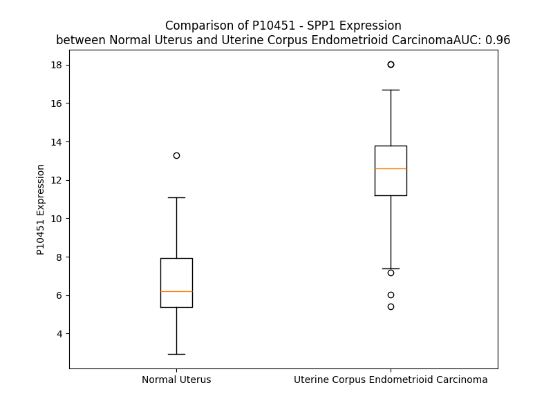

# Detailed Data for P10451

## Introduction to the Detailed Summary

### How to Interpret the Results

- **Summary & Metrics**: This section provides a quick reference to essential protein attributes, including expression changes, family classification, and biomarker applications. Regulation status (upregulated/downregulated) indicates the protein's behavior in a disease context. Some information comes from the original excel file with the proteins selected from literature, while others are derived from the analyses.
- **Expression Comparison**: A visual representation comparing protein expression between normal and disease states. It highlights significant changes in expression levels that might indicate diagnostic or therapeutic relevance. This is data coming from transcriptomics experiments and could not translate similarly to protein levels.
- **Isoform Alignment**: An interactive view of isoform alignments, revealing structural and functional differences between variants of the protein.
- **Interactors & Homologs**: Tables listing known interaction partners and homologous proteins, the more interactors and homologs, the more complex the protein is to design an antibody for.
- **Biological Assemblies**: Information about the structural arrangement of the protein in different assemblies, providing insights into its functional state but also the complexity of the protein to develop antibodies.
- **Combined Per-Residue Information**: A detailed table summarizing residue-level data. This includes predictions for epitope regions, aggregation tendencies, and modifications that might impact the protein's function. Each row corresponds to a residue in the protein, providing insights into specific sites that may be important for research or drug development.
## Summary & Metrics

- **UniProt Accession**: P10451
- **Gene Name**: SPP1
- **Protein Name**: OSTP_HUMAN
- **Swiss Prot**: NA
- **Family**: NA
- **Biomarker Application**: NA
- **Number of Isoforms**: 4
- **Regulation**: NA
- **(transcriptomics) AUC**: 0.96
- **(transcriptomics) Fold Change**: 1.88
- **(transcriptomics) Regulation**: Upregulated
- **Discotope Epitope Count**: N/A
- **Max n_uniprots (Homo)**: 1
- **Max n_uniprots (Hetero)**: N/A

## Expression Comparison

## Isoform Alignment

<pre style='font-size:14px; font-family:monospace;'>P10451-1 MRIAVICFCLLGITCAIPVKQADSGSSEEKQLYNKYPDAVATWLNPDPSQKQNLLAPQNAVSSEETNDFKQETLPSKSNESHDHMDDMDDEDDDDHVDSQDSIDSNDSDDVDDTDDSHQSDESHHSDESDELVTDFPTDLPATEVFTPVVPTVDTYDGRGDSVVYGLRSKSKKFRRPDIQYPDATDEDITSHMESEELNGAYKAIPVAQDLNAPSDWDSRGKDSYETSQLDDQSAETHSHKQSRLYKRKANDESNEHSDVIDSQELSKVSREFHSHEFHSHEDMLVVDPKSKEEDKHLKFRISHELDSASSEVN
P10451-3 MRIAVICFCLLGITCAIPVKQADSGSSEEK---------------------------QNAVSSEETNDFKQETLPSKSNESHDHMDDMDDEDDDDHVDSQDSIDSNDSDDVDDTDDSHQSDESHHSDESDELVTDFPTDLPATEVFTPVVPTVDTYDGRGDSVVYGLRSKSKKFRRPDIQYPDATDEDITSHMESEELNGAYKAIPVAQDLNAPSDWDSRGKDSYETSQLDDQSAETHSHKQSRLYKRKANDESNEHSDVIDSQELSKVSREFHSHEFHSHEDMLVVDPKSKEEDKHLKFRISHELDSASSEVN
P10451-4 MRIAVICFCLLGITCAIPVKQADSGSSEEKQLYNKYPDAVATWLNPDPSQKQNLLAPQNAVSSEETNDFKQETLPSKSNESHDHMDDMDDEDD----------------------DSHQSDESHHSDESDELVTDFPTDLPATEVFTPVVPTVDTYDGRGDSVVYGLRSKSKKFRRPDIQYPDATDEDITSHMESEELNGAYKAIPVAQDLNAPSDWDSRGKDSYETSQLDDQSAETHSHKQSRLYKRKANDESNEHSDVIDSQELSKVSREFHSHEFHSHEDMLVVDPKSKEEDKHLKFRISHELDSASSEVN
P10451-5 MRIAVICFCLLGITCAIPVKQADSGSSEEKQLYNKYPDAVATWLNPDPSQKQNLLAPQ--------------TLPSKSNESHDHMDDMDDEDDDDHVDSQDSIDSNDSDDVDDTDDSHQSDESHHSDESDELVTDFPTDLPATEVFTPVVPTVDTYDGRGDSVVYGLRSKSKKFRRPDIQYPDATDEDITSHMESEELNGAYKAIPVAQDLNAPSDWDSRGKDSYETSQLDDQSAETHSHKQSRLYKRKANDESNEHSDVIDSQELSKVSREFHSHEFHSHEDMLVVDPKSKEEDKHLKFRISHELDSASSEVN
</pre>

## Interactors

| preferredName_A   | preferredName_B   |   score |
|:------------------|:------------------|--------:|
| SPP1              | ITGAV             |   0.999 |
| SPP1              | CD44              |   0.999 |
| SPP1              | MMP3              |   0.997 |
| SPP1              | ITGB1             |   0.996 |
| SPP1              | FN1               |   0.996 |
| SPP1              | ITGB3             |   0.994 |
| SPP1              | BGLAP             |   0.994 |
| SPP1              | IBSP              |   0.991 |
| SPP1              | SPARC             |   0.984 |
| SPP1              | GSTM1             |   0.981 |
| SPP1              | ITGA9             |   0.979 |
| SPP1              | ITGA4             |   0.973 |
| SPP1              | ITGB5             |   0.968 |
| SPP1              | VTN               |   0.964 |
| SPP1              | MMP9              |   0.947 |
| SPP1              | AP4M1             |   0.946 |
| SPP1              | MMP7              |   0.941 |
| SPP1              | IRF7              |   0.925 |
| SPP1              | MGP               |   0.924 |
| SPP1              | DMP1              |   0.922 |
| SPP1              | MEPE              |   0.922 |
| SPP1              | BMP2              |   0.921 |
| SPP1              | ITGA8             |   0.904 |
| SPP1              | RUNX2             |   0.901 |

## Homologs

| uniprot_id   | gene_id   |
|:-------------|:----------|
| A0A8I5KR98   | TAF3      |

## Biological Assemblies

|   Unnamed: 0 |   assembly |   n_uniprots | composition   | crystal_id   |
|-------------:|-----------:|-------------:|:--------------|:-------------|
|            0 |          1 |            1 | Homo          | 3cxd         |
|            0 |          1 |            1 | Homo          | 3dsf         |

## Combined Per-Residue Information

|   res | aa   |   Beta |   Turn |   Helix |   Aggregation |   Conc-Stab_Aggregation | modification                | glycosylation                                  |
|------:|:-----|-------:|-------:|--------:|--------------:|------------------------:|:----------------------------|:-----------------------------------------------|
|     1 | M    |    5   |    0   |   0     |         0     |                   0     | N/A                         | N/A                                            |
|     2 | R    |    6.7 |    0   |   0     |         0     |                   0     | N/A                         | N/A                                            |
|     3 | I    |   10   |    0   |   0     |        52.339 |                  52.339 | N/A                         | N/A                                            |
|     4 | A    |    6.1 |    0   |   0     |        62.147 |                  62.147 | N/A                         | N/A                                            |
|     5 | V    |    6.8 |    0   |   0     |        88.958 |                  88.958 | N/A                         | N/A                                            |
|     6 | I    |    4.7 |    0   |   0     |        91.202 |                  91.202 | N/A                         | N/A                                            |
|     7 | C    |    6.8 |    0   |   0     |        91.374 |                  91.374 | N/A                         | N/A                                            |
|     8 | F    |    6.7 |    0   |   0     |        91.718 |                  91.718 | N/A                         | N/A                                            |
|     9 | C    |    6.5 |    0   |   0     |        88.288 |                  88.288 | N/A                         | N/A                                            |
|    10 | L    |    3.5 |    0   |   0     |        87.506 |                  87.506 | N/A                         | N/A                                            |
|    11 | L    |    1.3 |    0.1 |   0     |        82.524 |                  82.524 | N/A                         | N/A                                            |
|    12 | G    |    0.5 |    0.1 |   0     |        55.247 |                  55.247 | N/A                         | N/A                                            |
|    13 | I    |   10.7 |    0.1 |   0     |        52.768 |                  52.768 | N/A                         | N/A                                            |
|    14 | T    |   12.2 |    0.1 |   0     |        23.555 |                  23.555 | N/A                         | N/A                                            |
|    15 | C    |   13.1 |    0   |   0     |         6.097 |                   6.097 | N/A                         | N/A                                            |
|    16 | A    |    3   |    0   |   0     |         2.925 |                   2.925 | N/A                         | N/A                                            |
|    17 | I    |    1.3 |    0   |   0     |         0.244 |                   0.244 | N/A                         | N/A                                            |
|    18 | P    |    0.1 |    0   |   0     |         0.051 |                   0.051 | N/A                         | N/A                                            |
|    19 | V    |    2.2 |    0   |   0     |         0     |                   0     | N/A                         | N/A                                            |
|    20 | K    |    2.3 |    0.1 |   0     |         0     |                   0     | N/A                         | N/A                                            |
|    21 | Q    |    2.4 |    0.3 |   0     |         0     |                   0     | N/A                         | N/A                                            |
|    22 | A    |    0.2 |    0.6 |   0     |         0     |                   0     | N/A                         | N/A                                            |
|    23 | D    |    0.1 |    1.4 |   0     |         0     |                   0     | N/A                         | N/A                                            |
|    24 | S    |    0.3 |    2.6 |   0     |         0     |                   0     | Phosphoserine               | N/A                                            |
|    25 | G    |    0.3 |    2.5 |   0     |         0     |                   0     | N/A                         | N/A                                            |
|    26 | S    |    0.4 |    2.3 |   1.33  |         0     |                   0     | Phosphoserine; by FAM20C    | N/A                                            |
|    27 | S    |    0.1 |    1.5 |   2.235 |         0     |                   0     | Phosphoserine; by FAM20C    | N/A                                            |
|    28 | E    |    0.3 |    0.4 |   2.395 |         0     |                   0     | N/A                         | N/A                                            |
|    29 | E    |    0.3 |    0.3 |   2.395 |         0     |                   0     | N/A                         | N/A                                            |
|    30 | K    |    0.5 |    0.2 |   2.395 |         0     |                   0     | N/A                         | N/A                                            |
|    31 | Q    |    1.5 |    0.1 |   2.395 |         0     |                   0     | N/A                         | N/A                                            |
|    32 | L    |    1.7 |    0.1 |   2.105 |         0     |                   0     | N/A                         | N/A                                            |
|    33 | Y    |    2.3 |    0   |   1.963 |         0     |                   0     | N/A                         | N/A                                            |
|    34 | N    |    1.4 |    0   |   1.095 |         0     |                   0     | N/A                         | N/A                                            |
|    35 | K    |    1.1 |    0   |   0.7   |         0     |                   0     | N/A                         | N/A                                            |
|    36 | Y    |    0.4 |    1   |   0.32  |         0     |                   0     | N/A                         | N/A                                            |
|    37 | P    |    0.1 |    1   |   0     |         0     |                   0     | N/A                         | N/A                                            |
|    38 | D    |    0.1 |    1   |   0.492 |         0     |                   0     | N/A                         | N/A                                            |
|    39 | A    |    0.4 |    1   |   0.492 |         2.867 |                   2.867 | N/A                         | N/A                                            |
|    40 | V    |    1.6 |    0   |   0.492 |         5.732 |                   5.732 | N/A                         | N/A                                            |
|    41 | A    |    2.3 |    0   |   0.492 |         5.732 |                   5.732 | N/A                         | N/A                                            |
|    42 | T    |    4.3 |    0   |   0.492 |         5.732 |                   5.732 | N/A                         | N/A                                            |
|    43 | W    |    4.3 |    0   |   0.492 |         5.732 |                   5.732 | N/A                         | N/A                                            |
|    44 | L    |    3.6 |    0   |   0.492 |         5.288 |                   5.288 | N/A                         | N/A                                            |
|    45 | N    |    1.2 |    0   |   0.347 |         0     |                   0     | N/A                         | N/A                                            |
|    46 | P    |    0.1 |    0   |   0     |         0     |                   0     | N/A                         | N/A                                            |
|    47 | D    |    0   |    4.5 |   0     |         0     |                   0     | N/A                         | N/A                                            |
|    48 | P    |    0   |    4.6 |   0     |         0     |                   0     | N/A                         | N/A                                            |
|    49 | S    |    0.2 |    4.6 |   0     |         0     |                   0     | N/A                         | N/A                                            |
|    50 | Q    |    0.5 |    4.7 |   0     |         0     |                   0     | N/A                         | N/A                                            |
|    51 | K    |    0.6 |    0.3 |   0     |         0     |                   0     | N/A                         | N/A                                            |
|    52 | Q    |    0.6 |    0.3 |   0     |         0     |                   0     | N/A                         | N/A                                            |
|    53 | N    |    0.3 |    0.2 |   0     |         0     |                   0     | N/A                         | N/A                                            |
|    54 | L    |    0.8 |    0.1 |   0     |         0     |                   0     | N/A                         | N/A                                            |
|    55 | L    |    0.6 |    0   |   0     |         0     |                   0     | N/A                         | N/A                                            |
|    56 | A    |    0.6 |    0.3 |   0     |         0     |                   0     | N/A                         | N/A                                            |
|    57 | P    |    0   |    0.5 |   0     |         0     |                   0     | N/A                         | N/A                                            |
|    58 | Q    |    0   |    0.5 |   0     |         0     |                   0     | N/A                         | N/A                                            |
|    59 | N    |    0.1 |    0.5 |   0     |         0     |                   0     | N/A                         | N/A                                            |
|    60 | A    |    0.7 |    0.2 |   0     |         0     |                   0     | N/A                         | N/A                                            |
|    61 | V    |    2.1 |    0.1 |   0     |         0     |                   0     | N/A                         | N/A                                            |
|    62 | S    |    2.1 |    0.1 |   0     |         0     |                   0     | Phosphoserine; by FAM20C    | N/A                                            |
|    63 | S    |    1.6 |    0.2 |   0.174 |         0     |                   0     | Phosphoserine; by FAM20C    | N/A                                            |
|    64 | E    |    0.2 |    0.3 |   0.174 |         0     |                   0     | N/A                         | N/A                                            |
|    65 | E    |    0.2 |    0.3 |   0.174 |         0     |                   0     | N/A                         | N/A                                            |
|    66 | T    |    0.2 |    0.3 |   0.333 |         0     |                   0     | Phosphothreonine            | N/A                                            |
|    67 | N    |    0.3 |    0.2 |   0.333 |         0     |                   0     | N/A                         | N/A                                            |
|    68 | D    |    0.7 |    0.1 |   0.333 |         0     |                   0     | N/A                         | N/A                                            |
|    69 | F    |    1.3 |    0.2 |   0.159 |         0     |                   0     | N/A                         | N/A                                            |
|    70 | K    |    1.5 |    0.1 |   0.159 |         0     |                   0     | N/A                         | N/A                                            |
|    71 | Q    |    1.1 |    0.2 |   0.159 |         0     |                   0     | N/A                         | N/A                                            |
|    72 | E    |    0.4 |    0.2 |   0     |         0     |                   0     | N/A                         | N/A                                            |
|    73 | T    |    0.3 |    0.1 |   0     |         0     |                   0     | N/A                         | N/A                                            |
|    74 | L    |    0.3 |    0.4 |   0     |         0     |                   0     | N/A                         | N/A                                            |
|    75 | P    |    0.3 |    0.4 |   0     |         0     |                   0     | N/A                         | N/A                                            |
|    76 | S    |    2.4 |    1.4 |   0     |         0     |                   0     | Phosphoserine               | N/A                                            |
|    77 | K    |    2.5 |    1.6 |   0     |         0     |                   0     | N/A                         | N/A                                            |
|    78 | S    |    2.5 |    1.2 |   0     |         0     |                   0     | Phosphoserine               | N/A                                            |
|    79 | N    |    0.1 |    2.5 |   0     |         0     |                   0     | N/A                         | N/A                                            |
|    80 | E    |    0.5 |    1.5 |   0     |         0     |                   0     | N/A                         | N/A                                            |
|    81 | S    |    1.4 |    1.8 |   0     |         0     |                   0     | Phosphoserine               | N/A                                            |
|    82 | H    |    1.4 |    1.8 |   0     |         0     |                   0     | N/A                         | N/A                                            |
|    83 | D    |    0.9 |    0.6 |   0     |         0     |                   0     | N/A                         | N/A                                            |
|    84 | H    |    0.9 |    0.9 |   0     |         0     |                   0     | N/A                         | N/A                                            |
|    85 | M    |    0.9 |    0.6 |   0     |         0     |                   0     | N/A                         | N/A                                            |
|    86 | D    |    0.9 |    0.5 |   0     |         0     |                   0     | N/A                         | N/A                                            |
|    87 | D    |    0.3 |    2.7 |   0     |         0     |                   0     | N/A                         | N/A                                            |
|    88 | M    |    0.3 |    2.5 |   0     |         0     |                   0     | N/A                         | N/A                                            |
|    89 | D    |    0.3 |    2.4 |   0     |         0     |                   0     | N/A                         | N/A                                            |
|    90 | D    |    0.1 |    7.1 |   0     |         0     |                   0     | N/A                         | N/A                                            |
|    91 | E    |    0   |    5   |   0     |         0     |                   0     | N/A                         | N/A                                            |
|    92 | D    |    0   |    7.6 |   0     |         0     |                   0     | N/A                         | N/A                                            |
|    93 | D    |    0   |    9.6 |   0     |         0     |                   0     | N/A                         | N/A                                            |
|    94 | D    |    0   |    5.1 |   0     |         0     |                   0     | N/A                         | N/A                                            |
|    95 | D    |    0.1 |    4.9 |   0     |         0     |                   0     | N/A                         | N/A                                            |
|    96 | H    |    1.5 |    2.4 |   0     |         0     |                   0     | N/A                         | N/A                                            |
|    97 | V    |    2.5 |    0.2 |   0     |         0     |                   0     | N/A                         | N/A                                            |
|    98 | D    |    2.5 |    0.4 |   0     |         0     |                   0     | N/A                         | N/A                                            |
|    99 | S    |    1.8 |    1.6 |   0     |         0     |                   0     | Phosphoserine               | N/A                                            |
|   100 | Q    |    0.8 |    1.5 |   0     |         0     |                   0     | N/A                         | N/A                                            |
|   101 | D    |    0.9 |    1.5 |   0     |         0     |                   0     | N/A                         | N/A                                            |
|   102 | S    |    3.2 |    1.6 |   0     |         0     |                   0     | Phosphoserine               | N/A                                            |
|   103 | I    |    3.9 |    0.4 |   0     |         0     |                   0     | N/A                         | N/A                                            |
|   104 | D    |    3.7 |    3.8 |   0     |         0     |                   0     | N/A                         | N/A                                            |
|   105 | S    |    0.8 |    4.2 |   0     |         0     |                   0     | Phosphoserine               | N/A                                            |
|   106 | N    |    0   |    4.8 |   0     |         0     |                   0     | N/A                         | N/A                                            |
|   107 | D    |    0   |    8.8 |   0     |         0     |                   0     | N/A                         | N/A                                            |
|   108 | S    |    0   |    6.3 |   0     |         0     |                   0     | Phosphoserine               | N/A                                            |
|   109 | D    |    0.1 |    5.9 |   0     |         0     |                   0     | N/A                         | N/A                                            |
|   110 | D    |    0.7 |    5.9 |   0     |         0     |                   0     | N/A                         | N/A                                            |
|   111 | V    |    1   |    1.8 |   0     |         0     |                   0     | N/A                         | N/A                                            |
|   112 | D    |    1   |    1   |   0     |         0     |                   0     | N/A                         | N/A                                            |
|   113 | D    |    0.4 |    2.2 |   0     |         0     |                   0     | N/A                         | N/A                                            |
|   114 | T    |    0.1 |    1.6 |   0     |         0     |                   0     | N/A                         | N/A                                            |
|   115 | D    |    0.1 |    2.6 |   0     |         0     |                   0     | N/A                         | N/A                                            |
|   116 | D    |    0.1 |    2.6 |   0     |         0     |                   0     | N/A                         | N/A                                            |
|   117 | S    |    0.5 |    1.5 |   0     |         0     |                   0     | Phosphoserine               | N/A                                            |
|   118 | H    |    0.8 |    1.5 |   0     |         0     |                   0     | N/A                         | N/A                                            |
|   119 | Q    |    0.7 |    0.6 |   0     |         0     |                   0     | N/A                         | N/A                                            |
|   120 | S    |    0.3 |    0.5 |   0     |         0     |                   0     | Phosphoserine               | N/A                                            |
|   121 | D    |    0   |    2.3 |   0     |         0     |                   0     | N/A                         | N/A                                            |
|   122 | E    |    0.5 |    2.1 |   0     |         0     |                   0     | N/A                         | N/A                                            |
|   123 | S    |    1.1 |    1.9 |   0     |         0     |                   0     | Phosphoserine               | N/A                                            |
|   124 | H    |    1.3 |    1.9 |   0     |         0     |                   0     | N/A                         | N/A                                            |
|   125 | H    |    0.8 |    0.7 |   0     |         0     |                   0     | N/A                         | N/A                                            |
|   126 | S    |    0.3 |    0.7 |   0     |         0     |                   0     | Phosphoserine               | N/A                                            |
|   127 | D    |    0   |    2.9 |   0     |         0     |                   0     | N/A                         | N/A                                            |
|   128 | E    |    0   |    3   |   0     |         0     |                   0     | N/A                         | N/A                                            |
|   129 | S    |    0   |    2.5 |   0     |         0     |                   0     | Phosphoserine               | N/A                                            |
|   130 | D    |    0   |    2.5 |   0     |         0     |                   0     | N/A                         | N/A                                            |
|   131 | E    |    0.1 |    0.3 |   0     |         0     |                   0     | N/A                         | N/A                                            |
|   132 | L    |    0.5 |    0.1 |   0     |         0     |                   0     | N/A                         | N/A                                            |
|   133 | V    |    2.1 |    0.2 |   0     |         0     |                   0     | N/A                         | N/A                                            |
|   134 | T    |    2.7 |    0.1 |   0     |         0     |                   0     | N/A                         | O-linked (GalNAc...) threonine                 |
|   135 | D    |    2.4 |    0.1 |   0     |         0     |                   0     | N/A                         | N/A                                            |
|   136 | F    |    0.8 |    0.5 |   0     |         0     |                   0     | N/A                         | N/A                                            |
|   137 | P    |    0.1 |    0.5 |   0     |         0     |                   0     | N/A                         | N/A                                            |
|   138 | T    |    0.3 |    0.5 |   0     |         0     |                   0     | N/A                         | O-linked (GalNAc...) threonine                 |
|   139 | D    |    0.3 |    0.5 |   0     |         0     |                   0     | N/A                         | N/A                                            |
|   140 | L    |    0.3 |    0.1 |   0     |         0     |                   0     | N/A                         | N/A                                            |
|   141 | P    |    0   |    0   |   0     |         0     |                   0     | N/A                         | N/A                                            |
|   142 | A    |    0   |    0   |   0     |         0     |                   0     | N/A                         | N/A                                            |
|   143 | T    |    0.4 |    0   |   0     |         0     |                   0     | N/A                         | O-linked (GalNAc...) threonine                 |
|   144 | E    |    2.3 |    0   |   0     |         0     |                   0     | N/A                         | N/A                                            |
|   145 | V    |    7.1 |    0   |   0     |         0     |                   0     | N/A                         | N/A                                            |
|   146 | F    |    7.4 |    0   |   0     |         0     |                   0     | N/A                         | N/A                                            |
|   147 | T    |    5.5 |    0   |   0     |         0     |                   0     | N/A                         | O-linked (GalNAc...) threonine                 |
|   148 | P    |    0.7 |    0   |   0     |         0     |                   0     | N/A                         | N/A                                            |
|   149 | V    |    0.6 |    0   |   0     |         0     |                   0     | N/A                         | N/A                                            |
|   150 | V    |    0.6 |    0   |   0     |         0     |                   0     | N/A                         | N/A                                            |
|   151 | P    |    0.6 |    0   |   0     |         0     |                   0     | N/A                         | N/A                                            |
|   152 | T    |    4.4 |    0   |   0     |         0     |                   0     | N/A                         | O-linked (GalNAc...) threonine                 |
|   153 | V    |    5.3 |    0.1 |   0     |         0     |                   0     | N/A                         | N/A                                            |
|   154 | D    |    6.9 |    0.1 |   0     |         0     |                   0     | N/A                         | N/A                                            |
|   155 | T    |    9.7 |    0.3 |   0     |         0     |                   0     | N/A                         | N/A                                            |
|   156 | Y    |    9.2 |    1.6 |   0     |         0     |                   0     | N/A                         | N/A                                            |
|   157 | D    |    7.6 |    1.8 |   0     |         0     |                   0     | N/A                         | N/A                                            |
|   158 | G    |    0.4 |    2   |   0     |         0     |                   0     | N/A                         | N/A                                            |
|   159 | R    |    0.1 |    2.5 |   0     |         0     |                   0     | N/A                         | N/A                                            |
|   160 | G    |    0.1 |    1.3 |   0     |         0     |                   0     | N/A                         | N/A                                            |
|   161 | D    |    0.2 |    0.9 |   0     |         0     |                   0     | N/A                         | N/A                                            |
|   162 | S    |    1.1 |    0.7 |   0     |         3.953 |                   3.953 | N/A                         | N/A                                            |
|   163 | V    |    4.8 |    0.1 |   0     |        30.922 |                  30.922 | N/A                         | N/A                                            |
|   164 | V    |    5.7 |    0   |   0     |        30.922 |                  30.922 | N/A                         | N/A                                            |
|   165 | Y    |    4.9 |    0.1 |   0     |        30.922 |                  30.922 | N/A                         | N/A                                            |
|   166 | G    |    1.2 |    0.1 |   0.195 |        30.922 |                  30.922 | N/A                         | N/A                                            |
|   167 | L    |    0.8 |    0.2 |   0.195 |        30.307 |                  30.307 | N/A                         | N/A                                            |
|   168 | R    |    0.8 |    0.2 |   0.195 |         0     |                   0     | N/A                         | N/A                                            |
|   169 | S    |    3.3 |    1   |   0.195 |         0     |                   0     | N/A                         | N/A                                            |
|   170 | K    |    3.2 |    1   |   0.195 |         0     |                   0     | N/A                         | N/A                                            |
|   171 | S    |    3.1 |    1   |   0.195 |         0     |                   0     | N/A                         | N/A                                            |
|   172 | K    |    0.7 |    1   |   0     |         0     |                   0     | N/A                         | N/A                                            |
|   173 | K    |    1   |    0.1 |   0     |         0     |                   0     | N/A                         | N/A                                            |
|   174 | F    |    4.9 |    0.1 |   0     |         0     |                   0     | N/A                         | N/A                                            |
|   175 | R    |    4.9 |    0   |   0     |         0     |                   0     | N/A                         | N/A                                            |
|   176 | R    |    4.1 |    1.3 |   0     |         0     |                   0     | N/A                         | N/A                                            |
|   177 | P    |    0.1 |    1.3 |   0     |         0     |                   0     | N/A                         | N/A                                            |
|   178 | D    |    0.3 |    1.3 |   0     |         0     |                   0     | N/A                         | N/A                                            |
|   179 | I    |    2.6 |    1.3 |   0     |         0     |                   0     | N/A                         | N/A                                            |
|   180 | Q    |    2.8 |    0   |   0     |         0     |                   0     | N/A                         | N/A                                            |
|   181 | Y    |    2.5 |    0.9 |   0     |         0     |                   0     | N/A                         | N/A                                            |
|   182 | P    |    0.2 |    1   |   0     |         0     |                   0     | N/A                         | N/A                                            |
|   183 | D    |    0   |    1.3 |   0     |         0     |                   0     | N/A                         | N/A                                            |
|   184 | A    |    0.1 |    1.4 |   0     |         0     |                   0     | N/A                         | N/A                                            |
|   185 | T    |    0.1 |    0.5 |   0     |         0     |                   0     | Phosphothreonine            | N/A                                            |
|   186 | D    |    0.1 |    1.9 |   0     |         0     |                   0     | N/A                         | N/A                                            |
|   187 | E    |    0.1 |    1.5 |   0     |         0     |                   0     | N/A                         | N/A                                            |
|   188 | D    |    1.5 |    1.5 |   0     |         0     |                   0     | N/A                         | N/A                                            |
|   189 | I    |    4.1 |    1.4 |   0     |         0     |                   0     | N/A                         | N/A                                            |
|   190 | T    |    4.7 |    0.1 |   0     |         0     |                   0     | Phosphothreonine; by FAM20C | N/A                                            |
|   191 | S    |    3.4 |    0.1 |   0     |         0     |                   0     | Phosphoserine; by FAM20C    | N/A                                            |
|   192 | H    |    1.5 |    0.1 |   0     |         0     |                   0     | N/A                         | N/A                                            |
|   193 | M    |    0.9 |    0.2 |   0     |         0     |                   0     | N/A                         | N/A                                            |
|   194 | E    |    0.8 |    0.1 |   0     |         0     |                   0     | N/A                         | N/A                                            |
|   195 | S    |    0.2 |    0.2 |   0.645 |         0     |                   0     | Phosphoserine; by FAM20C    | N/A                                            |
|   196 | E    |    0.1 |    0.3 |   0.645 |         0     |                   0     | N/A                         | N/A                                            |
|   197 | E    |    1   |    0.4 |   0.645 |         0     |                   0     | N/A                         | N/A                                            |
|   198 | L    |    1   |    1.9 |   0.645 |         0     |                   0     | N/A                         | N/A                                            |
|   199 | N    |    1   |    1.9 |   0.768 |         0     |                   0     | N/A                         | N/A                                            |
|   200 | G    |    0.1 |    1.8 |   0.768 |         0     |                   0     | N/A                         | N/A                                            |
|   201 | A    |    0.3 |    1.7 |   0.493 |         0     |                   0     | N/A                         | N/A                                            |
|   202 | Y    |    1.5 |    0.2 |   0.283 |         0     |                   0     | N/A                         | N/A                                            |
|   203 | K    |    1.9 |    0   |   0.123 |         0     |                   0     | N/A                         | N/A                                            |
|   204 | A    |    1.7 |    0   |   0.123 |         0     |                   0     | N/A                         | N/A                                            |
|   205 | I    |    0.6 |    0   |   0     |         0     |                   0     | N/A                         | N/A                                            |
|   206 | P    |    0.1 |    0   |   0     |         0     |                   0     | N/A                         | N/A                                            |
|   207 | V    |    1.6 |    0   |   0     |         0     |                   0     | N/A                         | N/A                                            |
|   208 | A    |    1.6 |    0.2 |   0     |         0     |                   0     | N/A                         | N/A                                            |
|   209 | Q    |    1.7 |    0.2 |   0     |         0     |                   0     | N/A                         | N/A                                            |
|   210 | D    |    0.3 |    1.6 |   0     |         0     |                   0     | N/A                         | N/A                                            |
|   211 | L    |    1   |    1.6 |   0     |         0     |                   0     | N/A                         | N/A                                            |
|   212 | N    |    0.9 |    1.4 |   0     |         0     |                   0     | N/A                         | N/A                                            |
|   213 | A    |    0.8 |    1.9 |   0     |         0     |                   0     | N/A                         | N/A                                            |
|   214 | P    |    0   |    0.9 |   0     |         0     |                   0     | N/A                         | N/A                                            |
|   215 | S    |    0   |    0.9 |   0     |         0     |                   0     | Phosphoserine; by FAM20C    | N/A                                            |
|   216 | D    |    0.3 |    1.8 |   0     |         0     |                   0     | N/A                         | N/A                                            |
|   217 | W    |    0.9 |    1.4 |   0     |         0     |                   0     | N/A                         | N/A                                            |
|   218 | D    |    1   |    1.5 |   0     |         0     |                   0     | N/A                         | N/A                                            |
|   219 | S    |    0.8 |    1.9 |   0     |         0     |                   0     | Phosphoserine; by FAM20C    | N/A                                            |
|   220 | R    |    0.2 |    1   |   0     |         0     |                   0     | N/A                         | N/A                                            |
|   221 | G    |    0.1 |    1.3 |   0     |         0     |                   0     | N/A                         | N/A                                            |
|   222 | K    |    0.1 |    0.8 |   0     |         0     |                   0     | N/A                         | N/A                                            |
|   223 | D    |    0.6 |    0.6 |   0     |         0     |                   0     | N/A                         | N/A                                            |
|   224 | S    |    7.6 |    0.5 |   0.233 |         0     |                   0     | Phosphoserine; by FAM20C    | N/A                                            |
|   225 | Y    |    8   |    0.3 |   0.233 |         0     |                   0     | Phosphotyrosine             | N/A                                            |
|   226 | E    |    7.5 |    0.2 |   0.233 |         0     |                   0     | N/A                         | N/A                                            |
|   227 | T    |    1.6 |    0.2 |   0.233 |         0     |                   0     | N/A                         | N/A                                            |
|   228 | S    |    1.4 |    0.2 |   0.233 |         0     |                   0     | Phosphoserine; by FAM20C    | N/A                                            |
|   229 | Q    |    2   |    0.1 |   0.233 |         0     |                   0     | N/A                         | N/A                                            |
|   230 | L    |    1   |    0.3 |   0     |         0     |                   0     | N/A                         | N/A                                            |
|   231 | D    |    0.8 |    0.3 |   0.617 |         0     |                   0     | N/A                         | N/A                                            |
|   232 | D    |    0.2 |    1.5 |   0.617 |         0     |                   0     | N/A                         | N/A                                            |
|   233 | Q    |    0.1 |    1.5 |   0.617 |         0     |                   0     | N/A                         | N/A                                            |
|   234 | S    |    0.5 |    1.4 |   1.125 |         0     |                   0     | Phosphoserine; by FAM20C    | O-linked (Xyl...) (chondroitin sulfate) serine |
|   235 | A    |    0.5 |    1.3 |   1.125 |         0     |                   0     | N/A                         | N/A                                            |
|   236 | E    |    1   |    0.1 |   1.125 |         0     |                   0     | N/A                         | N/A                                            |
|   237 | T    |    2.6 |    0.1 |   0.765 |         0     |                   0     | Phosphothreonine; by FAM20C | N/A                                            |
|   238 | H    |    2.7 |    0.3 |   0.765 |         0     |                   0     | N/A                         | N/A                                            |
|   239 | S    |    2.5 |    0.2 |   0.631 |         0     |                   0     | Phosphoserine; by FAM20C    | N/A                                            |
|   240 | H    |    0.8 |    0.3 |   0.147 |         0     |                   0     | N/A                         | N/A                                            |
|   241 | K    |    0.8 |    0.4 |   0     |         0     |                   0     | N/A                         | N/A                                            |
|   242 | Q    |    0.5 |    0.3 |   0     |         0     |                   0     | N/A                         | N/A                                            |
|   243 | S    |    0.3 |    0.3 |   0.223 |         0     |                   0     | Phosphoserine; by FAM20C    | N/A                                            |
|   244 | R    |    0.8 |    0.2 |   0.223 |         0     |                   0     | N/A                         | N/A                                            |
|   245 | L    |    0.9 |    0.1 |   0.223 |         0     |                   0     | N/A                         | N/A                                            |
|   246 | Y    |    1.9 |    0.1 |   0.223 |         0     |                   0     | N/A                         | N/A                                            |
|   247 | K    |    1.7 |    0.1 |   0.223 |         0     |                   0     | N/A                         | N/A                                            |
|   248 | R    |    1.5 |    0.1 |   0.223 |         0     |                   0     | N/A                         | N/A                                            |
|   249 | K    |    0.6 |    0.4 |   0     |         0     |                   0     | N/A                         | N/A                                            |
|   250 | A    |    0.2 |    0.5 |   0     |         0     |                   0     | N/A                         | N/A                                            |
|   251 | N    |    0.1 |    0.5 |   0     |         0     |                   0     | N/A                         | N/A                                            |
|   252 | D    |    0   |    2.7 |   0     |         0     |                   0     | N/A                         | N/A                                            |
|   253 | E    |    0   |    2.5 |   0     |         0     |                   0     | N/A                         | N/A                                            |
|   254 | S    |    0   |    2.4 |   0     |         0     |                   0     | Phosphoserine; by FAM20C    | N/A                                            |
|   255 | N    |    0   |    2.5 |   0     |         0     |                   0     | N/A                         | N/A                                            |
|   256 | E    |    0.1 |    0.3 |   0     |         0     |                   0     | N/A                         | N/A                                            |
|   257 | H    |    0.2 |    0.7 |   0     |         0     |                   0     | N/A                         | N/A                                            |
|   258 | S    |    0.2 |    0.6 |   0     |         0     |                   0     | Phosphoserine; by FAM20C    | N/A                                            |
|   259 | D    |    1.9 |    0.5 |   0     |         0     |                   0     | N/A                         | N/A                                            |
|   260 | V    |    6.8 |    0.5 |   0     |         0     |                   0     | N/A                         | N/A                                            |
|   261 | I    |    7.5 |    0.1 |   0     |         0     |                   0     | N/A                         | N/A                                            |
|   262 | D    |    5.8 |    0.2 |   1.649 |         0     |                   0     | N/A                         | N/A                                            |
|   263 | S    |    1.2 |    0.3 |   2.329 |         0     |                   0     | Phosphoserine; by FAM20C    | N/A                                            |
|   264 | Q    |    0.5 |    0.3 |   2.329 |         0     |                   0     | N/A                         | N/A                                            |
|   265 | E    |    0.8 |    0.2 |   2.329 |         0     |                   0     | N/A                         | N/A                                            |
|   266 | L    |    0.8 |    0.1 |   2.329 |         0     |                   0     | N/A                         | N/A                                            |
|   267 | S    |    1.1 |    0.1 |   2.646 |         0     |                   0     | Phosphoserine; by FAM20C    | N/A                                            |
|   268 | K    |    1.9 |    0   |   2.104 |         0     |                   0     | N/A                         | N/A                                            |
|   269 | V    |    2.4 |    0.1 |   0.825 |         0     |                   0     | N/A                         | N/A                                            |
|   270 | S    |    2.2 |    0.1 |   0.825 |         0     |                   0     | Phosphoserine; by FAM20C    | N/A                                            |
|   271 | R    |    1.2 |    0.1 |   0.317 |         0     |                   0     | N/A                         | N/A                                            |
|   272 | E    |    3.9 |    0.1 |   0.317 |         0     |                   0     | N/A                         | N/A                                            |
|   273 | F    |    4.3 |    0.1 |   0.163 |         0     |                   0     | N/A                         | N/A                                            |
|   274 | H    |    4.3 |    0.1 |   0     |         0     |                   0     | N/A                         | N/A                                            |
|   275 | S    |    1.4 |    0.2 |   0     |         0     |                   0     | Phosphoserine; by FAM20C    | N/A                                            |
|   276 | H    |    1.4 |    0.2 |   0     |         0     |                   0     | N/A                         | N/A                                            |
|   277 | E    |    4.9 |    0.1 |   0     |         0     |                   0     | N/A                         | N/A                                            |
|   278 | F    |    4.8 |    0.1 |   0     |         0     |                   0     | N/A                         | N/A                                            |
|   279 | H    |    4.4 |    0.2 |   0     |         0     |                   0     | N/A                         | N/A                                            |
|   280 | S    |    1.5 |    0.2 |   0     |         0     |                   0     | Phosphoserine; by FAM20C    | N/A                                            |
|   281 | H    |    1   |    0.7 |   0     |         0     |                   0     | N/A                         | N/A                                            |
|   282 | E    |    0.8 |    0.7 |   0     |         0     |                   0     | N/A                         | N/A                                            |
|   283 | D    |    0.1 |    0.6 |   0     |         0     |                   0     | N/A                         | N/A                                            |
|   284 | M    |    1   |    0.6 |   0     |         0     |                   0     | N/A                         | N/A                                            |
|   285 | L    |    2.8 |    0   |   0     |         0     |                   0     | N/A                         | N/A                                            |
|   286 | V    |    9.9 |    0   |   0     |         0     |                   0     | N/A                         | N/A                                            |
|   287 | V    |    9.1 |    0   |   0     |         0     |                   0     | N/A                         | N/A                                            |
|   288 | D    |    7.3 |    0.5 |   2.109 |         0     |                   0     | N/A                         | N/A                                            |
|   289 | P    |    0.2 |    0.6 |   2.109 |         0     |                   0     | N/A                         | N/A                                            |
|   290 | K    |    0.5 |    0.6 |   2.109 |         0     |                   0     | N/A                         | N/A                                            |
|   291 | S    |    0.9 |    0.7 |   4.507 |         0     |                   0     | Phosphoserine; by FAM20C    | N/A                                            |
|   292 | K    |    1.1 |    0.3 |   4.797 |         0     |                   0     | N/A                         | N/A                                            |
|   293 | E    |    0.7 |    0.4 |   4.797 |         0     |                   0     | N/A                         | N/A                                            |
|   294 | E    |    0.3 |    0.3 |   4.626 |         0     |                   0     | N/A                         | N/A                                            |
|   295 | D    |    0.1 |    0.4 |   5.608 |         0     |                   0     | N/A                         | N/A                                            |
|   296 | K    |    0.2 |    0.3 |   5.311 |         0     |                   0     | N/A                         | N/A                                            |
|   297 | H    |    0.6 |    0.1 |   4.599 |         0     |                   0     | N/A                         | N/A                                            |
|   298 | L    |    1.4 |    0.1 |   3.933 |         0     |                   0     | N/A                         | N/A                                            |
|   299 | K    |    2.1 |    0   |   3.693 |         0     |                   0     | N/A                         | N/A                                            |
|   300 | F    |    7.5 |    0   |   3.006 |         0     |                   0     | N/A                         | N/A                                            |
|   301 | R    |    8.9 |    0   |   0.42  |         0     |                   0     | N/A                         | N/A                                            |
|   302 | I    |    8.7 |    0   |   0     |         0     |                   0     | N/A                         | N/A                                            |
|   303 | S    |    3.5 |    0   |   0     |         0     |                   0     | Phosphoserine; by FAM20C    | N/A                                            |
|   304 | H    |    1.5 |    0.2 |   0     |         0     |                   0     | N/A                         | N/A                                            |
|   305 | E    |    1.7 |    0.2 |   0     |         0     |                   0     | N/A                         | N/A                                            |
|   306 | L    |    1.3 |    0.3 |   0     |         0     |                   0     | N/A                         | N/A                                            |
|   307 | D    |    1   |    0.3 |   0     |         0     |                   0     | N/A                         | N/A                                            |
|   308 | S    |    3.4 |    1.2 |   0     |         0     |                   0     | Phosphoserine; by FAM20C    | O-linked (Xyl...) (chondroitin sulfate) serine |
|   309 | A    |    3.2 |    1.2 |   0     |         0     |                   0     | N/A                         | N/A                                            |
|   310 | S    |    3.3 |    1.2 |   0     |         0     |                   0     | Phosphoserine; by FAM20C    | N/A                                            |
|   311 | S    |    0.3 |    1.2 |   0     |         0     |                   0     | Phosphoserine; by FAM20C    | N/A                                            |
|   312 | E    |    4.9 |    0.2 |   0     |         0     |                   0     | N/A                         | N/A                                            |
|   313 | V    |    4.8 |    0.1 |   0     |         0     |                   0     | N/A                         | N/A                                            |
|   314 | N    |    4.7 |    0   |   0     |         0     |                   0     | N/A                         | N/A                                            |

