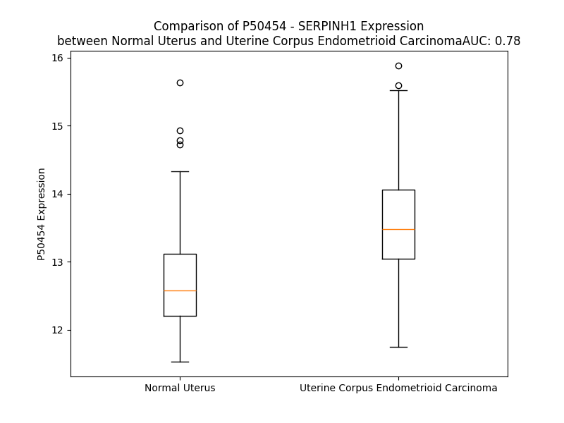

# Detailed Data for P50454

## Introduction to the Detailed Summary

### How to Interpret the Results

- **Summary & Metrics**: This section provides a quick reference to essential protein attributes, including expression changes, family classification, and biomarker applications. Regulation status (upregulated/downregulated) indicates the protein's behavior in a disease context. Some information comes from the original excel file with the proteins selected from literature, while others are derived from the analyses.
- **Expression Comparison**: A visual representation comparing protein expression between normal and disease states. It highlights significant changes in expression levels that might indicate diagnostic or therapeutic relevance. This is data coming from transcriptomics experiments and could not translate similarly to protein levels.
- **Isoform Alignment**: An interactive view of isoform alignments, revealing structural and functional differences between variants of the protein.
- **Interactors & Homologs**: Tables listing known interaction partners and homologous proteins, the more interactors and homologs, the more complex the protein is to design an antibody for.
- **Biological Assemblies**: Information about the structural arrangement of the protein in different assemblies, providing insights into its functional state but also the complexity of the protein to develop antibodies.
- **Combined Per-Residue Information**: A detailed table summarizing residue-level data. This includes predictions for epitope regions, aggregation tendencies, and modifications that might impact the protein's function. Each row corresponds to a residue in the protein, providing insights into specific sites that may be important for research or drug development.
## Summary & Metrics

- **UniProt Accession**: P50454
- **Gene Name**: SERPINH1
- **Protein Name**: SERPH_HUMAN
- **Swiss Prot**: NA
- **Family**: NA
- **Biomarker Application**: NA
- **Number of Isoforms**: 0
- **Regulation**: NA
- **(transcriptomics) AUC**: 0.78
- **(transcriptomics) Fold Change**: 1.06
- **(transcriptomics) Regulation**: Upregulated
- **Discotope Epitope Count**: 94
- **Max n_uniprots (Homo)**: N/A
- **Max n_uniprots (Hetero)**: N/A

## Expression Comparison

## Interactors

| preferredName_A   | preferredName_B   |   score |
|:------------------|:------------------|--------:|
| SERPINH1          | COL26A1           |   0.958 |
| SERPINH1          | FKBP10            |   0.947 |
| SERPINH1          | COL1A1            |   0.921 |
| SERPINH1          | P3H1              |   0.911 |

## Homologs

| uniprot_id   | gene_id   |
|:-------------|:----------|
| P48595       | SERPINB10 |
| A0A024R6N5   | SERPINA1  |
| P20848       | SERPINA2  |
| V9HWH1       | HEL57     |
| A0A1B0GX82   | SERPINB7  |
| Q86U17       | SERPINA11 |
| G3V4B4       | SERPINA5  |
| A8MV23       | SERPINE3  |
| E9PDK7       | SERPINB2  |
| P29508       | SERPINB3  |
| P48594       | SERPINB4  |
| Q96P63       | SERPINB12 |
| Q99574       | SERPINI1  |
| P05121       | SERPINE1  |
| G3V2W1       | SERPINA10 |
| C9J7N5       | SERPINI2  |
| P05546       | SERPIND1  |
| H7BZS9       | SERPINB13 |
| C9JZJ9       | SERPING1  |
| P01008       | SERPINC1  |
| F5GWT8       | SERPINB11 |
| G3V4V7       | SERPINA6  |
| A0A6Q8JH89   | SERPINA9  |
| P05543       | SERPINA7  |
| C9JPV4       | SERPINF2  |
| G3V595       | SERPINA3  |
| P36952       | SERPINB5  |
| P50453       | SERPINB9  |
| A0A2R8Y6N4   | SERPINB6  |
| P0C7T4       | HMSD      |
| Q8IW75       | SERPINA12 |
| C9K031       | SERPINE2  |
| A0A7P0T9S6   | AGT       |
| P50452       | SERPINB8  |
| P29622       | SERPINA4  |
| I3L107       | SERPINF1  |

## Combined Per-Residue Information

|   res | aa   |   epitope_score | epitope   |   relative_surface_accessibility |   modeling_confidence |   Aggregation | modification      | glycosylation                   |
|------:|:-----|----------------:|:----------|---------------------------------:|----------------------:|--------------:|:------------------|:--------------------------------|
|     1 | M    |         0.14431 | False     |                          1.30083 |                 40.93 |         0     | N/A               | N/A                             |
|     2 | R    |         0.22402 | True      |                          0.97515 |                 38.27 |         0.073 | N/A               | N/A                             |
|     3 | S    |         0.182   | False     |                          0.72104 |                 38.43 |         5.242 | N/A               | N/A                             |
|     4 | L    |         0.24026 | True      |                          0.91605 |                 40.49 |        89.573 | N/A               | N/A                             |
|     5 | L    |         0.25584 | True      |                          0.82879 |                 41.54 |        92.54  | N/A               | N/A                             |
|     6 | L    |         0.27702 | True      |                          0.89562 |                 40.03 |        93.072 | N/A               | N/A                             |
|     7 | L    |         0.20423 | True      |                          0.93505 |                 39.83 |        93.14  | N/A               | N/A                             |
|     8 | S    |         0.15842 | False     |                          0.70734 |                 39.22 |        93.075 | N/A               | N/A                             |
|     9 | A    |         0.23205 | True      |                          0.85844 |                 37.61 |        92.995 | N/A               | N/A                             |
|    10 | F    |         0.20524 | True      |                          1.04172 |                 39.11 |        92.774 | N/A               | N/A                             |
|    11 | C    |         0.19055 | True      |                          0.86767 |                 35.8  |        89.933 | N/A               | N/A                             |
|    12 | L    |         0.1587  | False     |                          1.14916 |                 37.23 |        89.417 | N/A               | N/A                             |
|    13 | L    |         0.17225 | False     |                          1.02328 |                 43.06 |        75.599 | N/A               | N/A                             |
|    14 | E    |         0.14319 | False     |                          0.90876 |                 33.79 |         0.073 | N/A               | N/A                             |
|    15 | A    |         0.16197 | False     |                          0.85906 |                 39.95 |         0.073 | N/A               | N/A                             |
|    16 | A    |         0.18552 | False     |                          1.01404 |                 35.25 |         0.073 | N/A               | N/A                             |
|    17 | L    |         0.15018 | False     |                          1.07509 |                 37.87 |         0.073 | N/A               | N/A                             |
|    18 | A    |         0.19136 | True      |                          1.01027 |                 35.1  |         0.061 | N/A               | N/A                             |
|    19 | A    |         0.14694 | False     |                          0.87272 |                 38.81 |         0.028 | N/A               | N/A                             |
|    20 | E    |         0.18733 | True      |                          0.89616 |                 34.91 |         0     | N/A               | N/A                             |
|    21 | V    |         0.16129 | False     |                          0.99593 |                 38.31 |         0     | N/A               | N/A                             |
|    22 | K    |         0.24252 | True      |                          0.96077 |                 40.16 |         0     | N/A               | N/A                             |
|    23 | K    |         0.17612 | False     |                          0.89431 |                 34.25 |         0     | N/A               | N/A                             |
|    24 | P    |         0.1657  | False     |                          0.88806 |                 37.68 |         0     | N/A               | N/A                             |
|    25 | A    |         0.21006 | True      |                          0.92417 |                 37.18 |         0     | N/A               | N/A                             |
|    26 | A    |         0.18236 | False     |                          0.91664 |                 35.01 |         0     | N/A               | N/A                             |
|    27 | A    |         0.19074 | True      |                          0.94551 |                 34.96 |         0     | N/A               | N/A                             |
|    28 | A    |         0.20392 | True      |                          0.90273 |                 29.54 |         0     | N/A               | N/A                             |
|    29 | A    |         0.16645 | False     |                          0.79367 |                 27.61 |         0     | N/A               | N/A                             |
|    30 | P    |         0.16687 | False     |                          0.9353  |                 35.51 |         0     | N/A               | N/A                             |
|    31 | G    |         0.17028 | False     |                          0.79711 |                 34.18 |         0     | N/A               | N/A                             |
|    32 | T    |         0.11025 | False     |                          0.96108 |                 36    |         0     | N/A               | N/A                             |
|    33 | A    |         0.11504 | False     |                          0.53096 |                 52.87 |         0     | N/A               | N/A                             |
|    34 | E    |         0.11222 | False     |                          0.86381 |                 60.46 |         0     | N/A               | N/A                             |
|    35 | K    |         0.15647 | False     |                          0.95116 |                 76.22 |         0     | N/A               | N/A                             |
|    36 | L    |         0.05515 | False     |                          0.20397 |                 84.83 |         0     | N/A               | N/A                             |
|    37 | S    |         0.16808 | False     |                          0.29591 |                 92.14 |         0     | N/A               | N/A                             |
|    38 | P    |         0.11164 | False     |                          0.83827 |                 92.03 |         0     | N/A               | N/A                             |
|    39 | K    |         0.07062 | False     |                          0.42286 |                 92.3  |         0     | N/A               | N/A                             |
|    40 | A    |         0.003   | False     |                          0       |                 92.79 |         0     | N/A               | N/A                             |
|    41 | A    |         0.05544 | False     |                          0.45828 |                 92.5  |         0     | N/A               | N/A                             |
|    42 | T    |         0.07049 | False     |                          0.33694 |                 94.19 |         0     | N/A               | N/A                             |
|    43 | L    |         0.00226 | False     |                          0       |                 95.48 |         0     | N/A               | N/A                             |
|    44 | A    |         0.01142 | False     |                          0.05802 |                 93.79 |         0     | N/A               | N/A                             |
|    45 | E    |         0.07664 | False     |                          0.44039 |                 93.26 |         0     | N/A               | N/A                             |
|    46 | R    |         0.15206 | False     |                          0.30978 |                 95.65 |         0     | N/A               | N/A                             |
|    47 | S    |         0.00335 | False     |                          0.00416 |                 96.39 |         0.183 | N/A               | N/A                             |
|    48 | A    |         0.01011 | False     |                          0.11971 |                 94.46 |         0.382 | N/A               | N/A                             |
|    49 | G    |         0.04964 | False     |                          0.39467 |                 95.07 |         1.213 | N/A               | N/A                             |
|    50 | L    |         0.02569 | False     |                          0.06045 |                 97.12 |        11.648 | N/A               | N/A                             |
|    51 | A    |         0.00256 | False     |                          0.00255 |                 96.7  |        13.084 | N/A               | N/A                             |
|    52 | F    |         0.03284 | False     |                          0.12644 |                 96.66 |        13.219 | N/A               | N/A                             |
|    53 | S    |         0.10169 | False     |                          0.41177 |                 97.03 |        13.219 | N/A               | N/A                             |
|    54 | L    |         0.00504 | False     |                          0       |                 98.2  |        13.219 | N/A               | N/A                             |
|    55 | Y    |         0.00316 | False     |                          0.00057 |                 98.38 |        10.943 | N/A               | N/A                             |
|    56 | Q    |         0.08075 | False     |                          0.23251 |                 97.5  |         1.39  | N/A               | N/A                             |
|    57 | A    |         0.08356 | False     |                          0.31323 |                 97.76 |         1.107 | N/A               | N/A                             |
|    58 | M    |         0.00848 | False     |                          0       |                 98.46 |         0.869 | N/A               | N/A                             |
|    59 | A    |         0.02677 | False     |                          0.13783 |                 97.97 |         0.869 | N/A               | N/A                             |
|    60 | K    |         0.10209 | False     |                          0.76976 |                 96.82 |         0     | N/A               | N/A                             |
|    61 | D    |         0.19476 | True      |                          0.20781 |                 97.07 |         0     | N/A               | N/A                             |
|    62 | Q    |         0.18793 | True      |                          0.85487 |                 94.94 |         0     | N/A               | N/A                             |
|    63 | A    |         0.24851 | True      |                          0.82761 |                 96.15 |         0     | N/A               | N/A                             |
|    64 | V    |         0.15138 | False     |                          0.15541 |                 97.42 |         0     | N/A               | N/A                             |
|    65 | E    |         0.20282 | True      |                          0.41799 |                 96.79 |         0     | N/A               | N/A                             |
|    66 | N    |         0.03416 | False     |                          0.13323 |                 98.48 |         0     | N/A               | N/A                             |
|    67 | I    |         0.00235 | False     |                          0       |                 98.75 |         0     | N/A               | N/A                             |
|    68 | L    |         0.00601 | False     |                          0.00412 |                 98.38 |         0     | N/A               | N/A                             |
|    69 | V    |         0.00129 | False     |                          0       |                 98.08 |         0     | N/A               | N/A                             |
|    70 | S    |         0.00317 | False     |                          0.00316 |                 97.4  |         0     | N/A               | N/A                             |
|    71 | P    |         0.00224 | False     |                          0.00596 |                 97.02 |         0.979 | N/A               | N/A                             |
|    72 | V    |         0.00275 | False     |                          0.00476 |                 95.62 |        48.222 | N/A               | N/A                             |
|    73 | V    |         0.00394 | False     |                          0.00712 |                 97.73 |        51.688 | N/A               | N/A                             |
|    74 | V    |         0.00093 | False     |                          0.00095 |                 98.36 |        51.927 | N/A               | N/A                             |
|    75 | A    |         0.00123 | False     |                          0       |                 98.19 |        51.927 | N/A               | N/A                             |
|    76 | S    |         0.00916 | False     |                          0.03952 |                 97.97 |        51.418 | N/A               | N/A                             |
|    77 | S    |         0.00425 | False     |                          0.01841 |                 98.52 |        46.432 | N/A               | N/A                             |
|    78 | L    |         0.00403 | False     |                          0.00772 |                 98.67 |        46.55  | N/A               | N/A                             |
|    79 | G    |         0.00968 | False     |                          0.00782 |                 98.44 |        42.924 | N/A               | N/A                             |
|    80 | L    |         0.00712 | False     |                          0.02638 |                 98.54 |        42.613 | N/A               | N/A                             |
|    81 | V    |         0.00785 | False     |                          0.02666 |                 98.36 |        40.77  | N/A               | N/A                             |
|    82 | S    |         0.01267 | False     |                          0.01607 |                 98.19 |        18.831 | N/A               | N/A                             |
|    83 | L    |         0.10831 | False     |                          0.16104 |                 98.35 |        16.055 | N/A               | N/A                             |
|    84 | G    |         0.00262 | False     |                          0       |                 97.99 |         0.441 | N/A               | N/A                             |
|    85 | G    |         0.00547 | False     |                          0       |                 97.46 |         0     | N/A               | N/A                             |
|    86 | K    |         0.22918 | True      |                          0.42703 |                 96.09 |         0     | N/A               | N/A                             |
|    87 | A    |         0.17793 | False     |                          0.7536  |                 96.52 |         0     | N/A               | N/A                             |
|    88 | T    |         0.1807  | False     |                          0.46389 |                 98.09 |         0     | N/A               | N/A                             |
|    89 | T    |         0.00663 | False     |                          0.00164 |                 98.26 |         0     | N/A               | N/A                             |
|    90 | A    |         0.03462 | False     |                          0.09948 |                 98.16 |         0     | N/A               | N/A                             |
|    91 | S    |         0.11425 | False     |                          0.45309 |                 98.22 |         0     | N/A               | N/A                             |
|    92 | Q    |         0.13718 | False     |                          0.17013 |                 98.56 |         0     | N/A               | N/A                             |
|    93 | A    |         0.00436 | False     |                          0.00511 |                 98.43 |         0     | N/A               | N/A                             |
|    94 | K    |         0.03428 | False     |                          0.13291 |                 97.92 |         0     | N6-succinyllysine | N/A                             |
|    95 | A    |         0.0958  | False     |                          0.41713 |                 98.26 |         0.983 | N/A               | N/A                             |
|    96 | V    |         0.04368 | False     |                          0.10173 |                 98.46 |         0.983 | N/A               | N/A                             |
|    97 | L    |         0.01372 | False     |                          0.01323 |                 97.61 |         0.983 | N/A               | N/A                             |
|    98 | S    |         0.05972 | False     |                          0.4829  |                 97.69 |         0.983 | N/A               | N/A                             |
|    99 | A    |         0.01508 | False     |                          0.01786 |                 97.17 |         0.983 | N/A               | N/A                             |
|   100 | E    |         0.23283 | True      |                          0.53998 |                 96.24 |         0     | N/A               | N/A                             |
|   101 | Q    |         0.18152 | False     |                          0.91882 |                 94.8  |         0     | N/A               | N/A                             |
|   102 | L    |         0.10242 | False     |                          0.20995 |                 95.63 |         0     | N/A               | N/A                             |
|   103 | R    |         0.18833 | True      |                          0.59003 |                 96.57 |         0     | N/A               | N/A                             |
|   104 | D    |         0.09097 | False     |                          0.33624 |                 95.89 |         0     | N/A               | N/A                             |
|   105 | E    |         0.18756 | True      |                          0.66134 |                 96.07 |         0     | N/A               | N/A                             |
|   106 | E    |         0.06678 | False     |                          0.12276 |                 96.88 |         0     | N/A               | N/A                             |
|   107 | V    |         0.01129 | False     |                          0.00857 |                 97.91 |         0     | N/A               | N/A                             |
|   108 | H    |         0.0515  | False     |                          0.06536 |                 98.2  |         0     | N/A               | N/A                             |
|   109 | A    |         0.09043 | False     |                          0.44934 |                 97.45 |         0     | N/A               | N/A                             |
|   110 | G    |         0.0259  | False     |                          0.02484 |                 96.23 |         0     | N/A               | N/A                             |
|   111 | L    |         0.00255 | False     |                          0       |                 96.52 |         0     | N/A               | N/A                             |
|   112 | G    |         0.00366 | False     |                          0.00238 |                 96.11 |         0     | N/A               | N/A                             |
|   113 | E    |         0.04603 | False     |                          0.23179 |                 94.04 |         0     | N/A               | N/A                             |
|   114 | L    |         0.01943 | False     |                          0.02864 |                 92.41 |         0     | N/A               | N/A                             |
|   115 | L    |         0.01357 | False     |                          0.08175 |                 92.25 |         0     | N/A               | N/A                             |
|   116 | R    |         0.11665 | False     |                          0.57335 |                 90.21 |         0     | N/A               | N/A                             |
|   117 | S    |         0.05238 | False     |                          0.28676 |                 86.24 |         0     | N/A               | N/A                             |
|   118 | L    |         0.02954 | False     |                          0.08509 |                 81.3  |         0     | N/A               | N/A                             |
|   119 | S    |         0.04421 | False     |                          0.4354  |                 79.65 |         0     | N/A               | N/A                             |
|   120 | N    |         0.05621 | False     |                          0.48825 |                 80.7  |         0     | N/A               | N-linked (GlcNAc...) asparagine |
|   121 | S    |         0.1357  | False     |                          0.30001 |                 73.33 |         0     | N/A               | N/A                             |
|   122 | T    |         0.1986  | True      |                          0.89854 |                 70.67 |         0     | N/A               | N/A                             |
|   123 | A    |         0.09024 | False     |                          0.54712 |                 71.92 |         0     | N/A               | N/A                             |
|   124 | R    |         0.1749  | False     |                          0.12127 |                 73.44 |         0     | N/A               | N/A                             |
|   125 | N    |         0.18948 | True      |                          0.31585 |                 82.13 |         0     | N/A               | N-linked (GlcNAc...) asparagine |
|   126 | V    |         0.02575 | False     |                          0.06623 |                 80.88 |         0     | N/A               | N/A                             |
|   127 | T    |         0.08713 | False     |                          0.38221 |                 88.78 |         0     | N/A               | N/A                             |
|   128 | W    |         0.03484 | False     |                          0.10994 |                 92.71 |         0     | N/A               | N/A                             |
|   129 | K    |         0.09538 | False     |                          0.26801 |                 94.33 |         0     | N/A               | N/A                             |
|   130 | L    |         0.03867 | False     |                          0.25514 |                 96.01 |         0     | N/A               | N/A                             |
|   131 | G    |         0.03216 | False     |                          0.1191  |                 97.18 |         0     | N/A               | N/A                             |
|   132 | S    |         0.01595 | False     |                          0.06474 |                 98.48 |         0     | N/A               | N/A                             |
|   133 | R    |         0.05839 | False     |                          0.18816 |                 98.69 |         0     | N/A               | N/A                             |
|   134 | L    |         0.00523 | False     |                          0.00907 |                 98.54 |         0     | N/A               | N/A                             |
|   135 | Y    |         0.00289 | False     |                          0.00057 |                 98.34 |         0     | N/A               | N/A                             |
|   136 | G    |         0.00444 | False     |                          0       |                 96.78 |         0     | N/A               | N/A                             |
|   137 | P    |         0.08018 | False     |                          0.14016 |                 95.81 |         0     | N/A               | N/A                             |
|   138 | S    |         0.25512 | True      |                          0.52489 |                 94.23 |         0     | N/A               | N/A                             |
|   139 | S    |         0.22931 | True      |                          0.64309 |                 93.33 |         0     | N/A               | N/A                             |
|   140 | V    |         0.09409 | False     |                          0.04981 |                 93.22 |         0     | N/A               | N/A                             |
|   141 | S    |         0.16405 | False     |                          0.57754 |                 96.08 |         0     | Phosphoserine     | N/A                             |
|   142 | F    |         0.08474 | False     |                          0.13126 |                 97.63 |         0     | N/A               | N/A                             |
|   143 | A    |         0.16899 | False     |                          0.32778 |                 98    |         0     | N/A               | N/A                             |
|   144 | D    |         0.2398  | True      |                          0.7261  |                 97.9  |         0     | N/A               | N/A                             |
|   145 | D    |         0.19988 | True      |                          0.54973 |                 97.71 |         0     | N/A               | N/A                             |
|   146 | F    |         0.02577 | False     |                          0.03511 |                 98.36 |         0     | N/A               | N/A                             |
|   147 | V    |         0.05898 | False     |                          0.35417 |                 98.5  |         0     | N/A               | N/A                             |
|   148 | R    |         0.25646 | True      |                          0.59556 |                 98.51 |         0     | N/A               | N/A                             |
|   149 | S    |         0.0694  | False     |                          0.19753 |                 98.23 |         0     | N/A               | N/A                             |
|   150 | S    |         0.00377 | False     |                          0       |                 98.42 |         0     | N/A               | N/A                             |
|   151 | K    |         0.11786 | False     |                          0.51518 |                 98.14 |         0     | N/A               | N/A                             |
|   152 | Q    |         0.21473 | True      |                          0.61423 |                 97.99 |         0     | N/A               | N/A                             |
|   153 | H    |         0.06295 | False     |                          0.19963 |                 97.53 |         0     | N/A               | N/A                             |
|   154 | Y    |         0.01988 | False     |                          0.02056 |                 97.79 |         0     | N/A               | N/A                             |
|   155 | N    |         0.05    | False     |                          0.63856 |                 97.45 |         0     | N/A               | N/A                             |
|   156 | C    |         0.00645 | False     |                          0       |                 98.46 |         0     | N/A               | N/A                             |
|   157 | E    |         0.05005 | False     |                          0.27976 |                 98.56 |         0     | N/A               | N/A                             |
|   158 | H    |         0.09007 | False     |                          0.25508 |                 98.21 |         0     | N/A               | N/A                             |
|   159 | S    |         0.0685  | False     |                          0.22032 |                 97.92 |         0     | N/A               | N/A                             |
|   160 | K    |         0.11858 | False     |                          0.61452 |                 96.85 |         0     | N/A               | N/A                             |
|   161 | I    |         0.10155 | False     |                          0.08358 |                 96.21 |         0     | N/A               | N/A                             |
|   162 | N    |         0.26105 | True      |                          0.47173 |                 95.64 |         0     | N/A               | N/A                             |
|   163 | F    |         0.07048 | False     |                          0.07308 |                 94.1  |         0     | N/A               | N/A                             |
|   164 | R    |         0.41513 | True      |                          0.93154 |                 93.17 |         0     | N/A               | N/A                             |
|   165 | D    |         0.12511 | False     |                          0.43113 |                 94.68 |         0     | N/A               | N/A                             |
|   166 | K    |         0.3132  | True      |                          0.47098 |                 93.52 |         0     | N/A               | N/A                             |
|   167 | R    |         0.34943 | True      |                          0.81637 |                 95.06 |         0     | N/A               | N/A                             |
|   168 | S    |         0.12299 | False     |                          0.43928 |                 96.45 |         0     | N/A               | N/A                             |
|   169 | A    |         0.02864 | False     |                          0.02752 |                 96.47 |         0     | N/A               | N/A                             |
|   170 | L    |         0.12251 | False     |                          0.14673 |                 97.52 |         0     | N/A               | N/A                             |
|   171 | Q    |         0.18541 | False     |                          0.48967 |                 97.52 |         0     | N/A               | N/A                             |
|   172 | S    |         0.0752  | False     |                          0.331   |                 97.41 |         0     | N/A               | N/A                             |
|   173 | I    |         0.00939 | False     |                          0       |                 98.2  |         0     | N/A               | N/A                             |
|   174 | N    |         0.09963 | False     |                          0.14138 |                 98.39 |         0     | N/A               | N/A                             |
|   175 | E    |         0.13464 | False     |                          0.42688 |                 98.25 |         0     | N/A               | N/A                             |
|   176 | W    |         0.02757 | False     |                          0.05965 |                 98.57 |         0     | N/A               | N/A                             |
|   177 | A    |         0.00355 | False     |                          0       |                 98.48 |         0     | N/A               | N/A                             |
|   178 | A    |         0.06538 | False     |                          0.23127 |                 98.28 |         0     | N/A               | N/A                             |
|   179 | Q    |         0.16408 | False     |                          0.69161 |                 98.08 |         0     | N/A               | N/A                             |
|   180 | T    |         0.05437 | False     |                          0.21724 |                 97.35 |         0     | N/A               | N/A                             |
|   181 | T    |         0.01317 | False     |                          0       |                 97.24 |         0     | N/A               | N/A                             |
|   182 | D    |         0.24918 | True      |                          0.66501 |                 96.59 |         0     | N/A               | N/A                             |
|   183 | G    |         0.25657 | True      |                          0.53855 |                 97.11 |         0     | N/A               | N/A                             |
|   184 | K    |         0.11426 | False     |                          0.35468 |                 97.5  |         0     | N/A               | N/A                             |
|   185 | L    |         0.01195 | False     |                          0.00577 |                 97.38 |         0     | N/A               | N/A                             |
|   186 | P    |         0.1658  | False     |                          0.53119 |                 97.24 |         0     | N/A               | N/A                             |
|   187 | E    |         0.21891 | True      |                          0.38035 |                 97.68 |         0     | N/A               | N/A                             |
|   188 | V    |         0.02766 | False     |                          0.04645 |                 97.75 |         0     | N/A               | N/A                             |
|   189 | T    |         0.17975 | False     |                          0.15648 |                 95.95 |         0     | N/A               | N/A                             |
|   190 | K    |         0.43418 | True      |                          0.77308 |                 95.15 |         0     | N/A               | N/A                             |
|   191 | D    |         0.29313 | True      |                          0.40025 |                 95.15 |         0     | N/A               | N/A                             |
|   192 | V    |         0.09621 | False     |                          0.05129 |                 93.85 |         0     | N/A               | N/A                             |
|   193 | E    |         0.36184 | True      |                          0.83354 |                 93.19 |         0     | N/A               | N/A                             |
|   194 | R    |         0.21441 | True      |                          0.26295 |                 94.47 |         0     | N/A               | N/A                             |
|   195 | T    |         0.33113 | True      |                          0.43516 |                 94.5  |         0     | N/A               | N/A                             |
|   196 | D    |         0.25856 | True      |                          0.39046 |                 94.23 |         0     | N/A               | N/A                             |
|   197 | G    |         0.00923 | False     |                          0       |                 96.25 |         5.711 | N/A               | N/A                             |
|   198 | A    |         0.00248 | False     |                          0       |                 97.86 |        67.957 | N/A               | N/A                             |
|   199 | L    |         0.00432 | False     |                          0       |                 98.46 |        78.122 | N/A               | N/A                             |
|   200 | L    |         0.00347 | False     |                          0.00824 |                 98.62 |        79.959 | N/A               | N/A                             |
|   201 | V    |         0.00221 | False     |                          0       |                 98.74 |        80.265 | N/A               | N/A                             |
|   202 | N    |         0.00639 | False     |                          0.01273 |                 98.64 |        80.169 | N/A               | N/A                             |
|   203 | A    |         0.00168 | False     |                          0       |                 98.54 |        80.116 | N/A               | N/A                             |
|   204 | M    |         0.00467 | False     |                          0       |                 98.02 |        79.926 | N/A               | N/A                             |
|   205 | F    |         0.0274  | False     |                          0.05223 |                 97.21 |        79.678 | N/A               | N/A                             |
|   206 | F    |         0.01088 | False     |                          0.00955 |                 95.93 |        73.695 | N/A               | N/A                             |
|   207 | K    |         0.05326 | False     |                          0.16121 |                 96.18 |         0     | N6-acetyllysine   | N/A                             |
|   208 | P    |         0.006   | False     |                          0.00367 |                 94.82 |         0     | N/A               | N/A                             |
|   209 | H    |         0.08962 | False     |                          0.24102 |                 96.02 |         0     | N/A               | N/A                             |
|   210 | W    |         0.02072 | False     |                          0.01459 |                 97.88 |         0     | N/A               | N/A                             |
|   211 | D    |         0.04808 | False     |                          0.11461 |                 97.31 |         0     | N/A               | N/A                             |
|   212 | E    |         0.12818 | False     |                          0.27131 |                 97.67 |         0     | N/A               | N/A                             |
|   213 | K    |         0.25527 | True      |                          0.40832 |                 98.04 |         0     | N/A               | N/A                             |
|   214 | F    |         0.01677 | False     |                          0.0179  |                 98.54 |         0     | N/A               | N/A                             |
|   215 | H    |         0.32066 | True      |                          0.51558 |                 97.88 |         0     | N/A               | N/A                             |
|   216 | H    |         0.41161 | True      |                          0.69305 |                 97.31 |         0     | N/A               | N/A                             |
|   217 | K    |         0.4081  | True      |                          0.76914 |                 98.09 |         0     | N/A               | N/A                             |
|   218 | M    |         0.14587 | False     |                          0.53689 |                 98.25 |         0     | N/A               | N/A                             |
|   219 | V    |         0.11661 | False     |                          0.23789 |                 98.65 |         0     | N/A               | N/A                             |
|   220 | D    |         0.2056  | True      |                          0.34685 |                 98.52 |         0     | N/A               | N/A                             |
|   221 | N    |         0.26961 | True      |                          0.79192 |                 97.88 |         0     | N/A               | N/A                             |
|   222 | R    |         0.30965 | True      |                          0.35754 |                 97.78 |         0     | N/A               | N/A                             |
|   223 | G    |         0.16449 | False     |                          0.28723 |                 97.41 |         0     | N/A               | N/A                             |
|   224 | F    |         0.00416 | False     |                          0       |                 98.4  |         0     | N/A               | N/A                             |
|   225 | M    |         0.1541  | False     |                          0.31481 |                 98.22 |         0     | N/A               | N/A                             |
|   226 | V    |         0.08309 | False     |                          0.13781 |                 97.84 |         0     | N/A               | N/A                             |
|   227 | T    |         0.23595 | True      |                          0.46195 |                 96.51 |         0     | N/A               | N/A                             |
|   228 | R    |         0.26532 | True      |                          0.7408  |                 94.29 |         0     | N/A               | N/A                             |
|   229 | S    |         0.34474 | True      |                          0.79791 |                 94.46 |         0     | N/A               | N/A                             |
|   230 | Y    |         0.21996 | True      |                          0.25444 |                 96.34 |         2.25  | N/A               | N/A                             |
|   231 | T    |         0.14485 | False     |                          0.15009 |                 97.51 |         3.594 | N/A               | N/A                             |
|   232 | V    |         0.03028 | False     |                          0.00666 |                 97.78 |         4.992 | N/A               | N/A                             |
|   233 | G    |         0.15558 | False     |                          0.30447 |                 97.68 |         4.992 | N/A               | N/A                             |
|   234 | V    |         0.0497  | False     |                          0.08229 |                 98.26 |         4.992 | N/A               | N/A                             |
|   235 | M    |         0.18261 | False     |                          0.52646 |                 98.35 |         4.426 | N/A               | N/A                             |
|   236 | M    |         0.00658 | False     |                          0       |                 98.74 |         3.269 | N/A               | N/A                             |
|   237 | M    |         0.01131 | False     |                          0       |                 98.76 |         0.976 | N/A               | N/A                             |
|   238 | H    |         0.11426 | False     |                          0.12601 |                 98.71 |         0     | N/A               | N/A                             |
|   239 | R    |         0.09263 | False     |                          0.04288 |                 98.42 |         0     | N/A               | N/A                             |
|   240 | T    |         0.16934 | False     |                          0.30696 |                 98.39 |         0     | N/A               | N/A                             |
|   241 | G    |         0.01769 | False     |                          0.00483 |                 98.01 |         0     | N/A               | N/A                             |
|   242 | L    |         0.13605 | False     |                          0.2114  |                 98.08 |         0     | N/A               | N/A                             |
|   243 | Y    |         0.01825 | False     |                          0.05119 |                 98.6  |         0     | N/A               | N/A                             |
|   244 | N    |         0.09012 | False     |                          0.36433 |                 98.53 |         0     | N/A               | N/A                             |
|   245 | Y    |         0.01824 | False     |                          0.0199  |                 98.82 |         0     | N/A               | N/A                             |
|   246 | Y    |         0.20641 | True      |                          0.17774 |                 98.76 |         0     | N/A               | N/A                             |
|   247 | D    |         0.07708 | False     |                          0.26401 |                 98.62 |         0     | N/A               | N/A                             |
|   248 | D    |         0.08666 | False     |                          0.06768 |                 98.16 |         0     | N/A               | N/A                             |
|   249 | E    |         0.22647 | True      |                          0.69172 |                 97.24 |         0     | N/A               | N/A                             |
|   250 | K    |         0.19686 | True      |                          0.87179 |                 97.32 |         0     | N/A               | N/A                             |
|   251 | E    |         0.13179 | False     |                          0.27371 |                 97.58 |         0     | N/A               | N/A                             |
|   252 | K    |         0.15272 | False     |                          0.52181 |                 98.27 |         0     | N/A               | N/A                             |
|   253 | L    |         0.01117 | False     |                          0       |                 98.66 |         0     | N/A               | N/A                             |
|   254 | Q    |         0.04318 | False     |                          0.12481 |                 98.73 |         0     | N/A               | N/A                             |
|   255 | I    |         0.00602 | False     |                          0       |                 98.73 |         0     | N/A               | N/A                             |
|   256 | V    |         0.00239 | False     |                          0       |                 98.83 |         0     | N/A               | N/A                             |
|   257 | E    |         0.03725 | False     |                          0.10443 |                 98.66 |         0     | N/A               | N/A                             |
|   258 | M    |         0.00824 | False     |                          0.01222 |                 98.44 |         0     | N/A               | N/A                             |
|   259 | P    |         0.03881 | False     |                          0.27354 |                 97.67 |         0     | N/A               | N/A                             |
|   260 | L    |         0.00458 | False     |                          0.00247 |                 96.61 |         0     | N/A               | N/A                             |
|   261 | A    |         0.01773 | False     |                          0.00566 |                 93.65 |         0     | N/A               | N/A                             |
|   262 | H    |         0.27814 | True      |                          0.58672 |                 91.2  |         0     | N/A               | N/A                             |
|   263 | K    |         0.20762 | True      |                          0.62043 |                 93.29 |         0     | N/A               | N/A                             |
|   264 | L    |         0.09982 | False     |                          0.23322 |                 90.91 |         5.235 | N/A               | N/A                             |
|   265 | S    |         0.01246 | False     |                          0.01739 |                 93.52 |         6.308 | N/A               | N/A                             |
|   266 | S    |         0.015   | False     |                          0.02567 |                 96.51 |        26.6   | N/A               | N/A                             |
|   267 | L    |         0.00965 | False     |                          0.01566 |                 98.1  |        29.124 | N/A               | N/A                             |
|   268 | I    |         0.00558 | False     |                          0.0016  |                 98.4  |        29.354 | N/A               | N/A                             |
|   269 | I    |         0.00676 | False     |                          0.012   |                 98.83 |        29.354 | N/A               | N/A                             |
|   270 | L    |         0.00207 | False     |                          0       |                 98.81 |        28.378 | N/A               | N/A                             |
|   271 | M    |         0.01537 | False     |                          0.02661 |                 98.84 |         3.067 | N/A               | N/A                             |
|   272 | P    |         0.0066  | False     |                          0       |                 98.69 |         1.647 | N/A               | N/A                             |
|   273 | H    |         0.11884 | False     |                          0.30466 |                 98.47 |         0     | N/A               | N/A                             |
|   274 | H    |         0.20911 | True      |                          0.5349  |                 97.73 |         0     | N/A               | N/A                             |
|   275 | V    |         0.14235 | False     |                          0.15432 |                 98.14 |         0     | N/A               | N/A                             |
|   276 | E    |         0.1294  | False     |                          0.23794 |                 97.72 |         0     | N/A               | N/A                             |
|   277 | P    |         0.2168  | True      |                          0.81149 |                 97.16 |         0     | N/A               | N/A                             |
|   278 | L    |         0.03987 | False     |                          0.04341 |                 98.48 |         0     | N/A               | N/A                             |
|   279 | E    |         0.18735 | True      |                          0.5172  |                 97.9  |         0     | N/A               | N/A                             |
|   280 | R    |         0.07507 | False     |                          0.32384 |                 97.96 |         0     | N/A               | N/A                             |
|   281 | L    |         0.00534 | False     |                          0.00389 |                 98.32 |         0     | N/A               | N/A                             |
|   282 | E    |         0.04131 | False     |                          0.03612 |                 98.24 |         0     | N/A               | N/A                             |
|   283 | K    |         0.15115 | False     |                          0.71316 |                 97.33 |         0     | N/A               | N/A                             |
|   284 | L    |         0.11388 | False     |                          0.29938 |                 97.57 |         0     | N/A               | N/A                             |
|   285 | L    |         0.01807 | False     |                          0.01584 |                 96.86 |         0     | N/A               | N/A                             |
|   286 | T    |         0.0784  | False     |                          0.42582 |                 94.39 |         0     | N/A               | N/A                             |
|   287 | K    |         0.09194 | False     |                          0.50142 |                 90.79 |         0     | N/A               | N/A                             |
|   288 | E    |         0.13775 | False     |                          0.58184 |                 94.13 |         0     | N/A               | N/A                             |
|   289 | Q    |         0.07768 | False     |                          0.23023 |                 96.52 |         0     | N/A               | N/A                             |
|   290 | L    |         0.02481 | False     |                          0.07584 |                 95.03 |         0     | N/A               | N/A                             |
|   291 | K    |         0.17877 | False     |                          0.77808 |                 94.17 |         0     | N/A               | N/A                             |
|   292 | I    |         0.20601 | True      |                          0.51848 |                 97.86 |         0     | N/A               | N/A                             |
|   293 | W    |         0.01289 | False     |                          0.00328 |                 97.94 |         0     | N/A               | N/A                             |
|   294 | M    |         0.03507 | False     |                          0.20718 |                 95.63 |         0     | N/A               | N/A                             |
|   295 | G    |         0.21609 | True      |                          0.83699 |                 97.13 |         0     | N/A               | N/A                             |
|   296 | K    |         0.15065 | False     |                          0.47365 |                 98.32 |         0     | N6-succinyllysine | N/A                             |
|   297 | M    |         0.06784 | False     |                          0.12904 |                 98.33 |         0     | N/A               | N/A                             |
|   298 | Q    |         0.27251 | True      |                          0.53368 |                 98.13 |         0     | N/A               | N/A                             |
|   299 | K    |         0.22192 | True      |                          0.70235 |                 97.99 |         0     | N/A               | N/A                             |
|   300 | K    |         0.19757 | True      |                          0.37185 |                 97.86 |         0     | N/A               | N/A                             |
|   301 | A    |         0.02632 | False     |                          0.09081 |                 98.45 |         0     | N/A               | N/A                             |
|   302 | V    |         0.00458 | False     |                          0       |                 98.76 |         0     | N/A               | N/A                             |
|   303 | A    |         0.08607 | False     |                          0.20237 |                 98.73 |         0     | N/A               | N/A                             |
|   304 | I    |         0.00422 | False     |                          0.0071  |                 98.88 |         0     | N/A               | N/A                             |
|   305 | S    |         0.0872  | False     |                          0.07116 |                 98.87 |         0     | N/A               | N/A                             |
|   306 | L    |         0.00385 | False     |                          0.00247 |                 98.8  |         0     | N/A               | N/A                             |
|   307 | P    |         0.01986 | False     |                          0.0562  |                 98.4  |         0     | N/A               | N/A                             |
|   308 | K    |         0.17169 | False     |                          0.27093 |                 98.45 |         0     | N/A               | N/A                             |
|   309 | G    |         0.1057  | False     |                          0.39478 |                 96.4  |         0     | N/A               | N/A                             |
|   310 | V    |         0.0916  | False     |                          0.2925  |                 96.57 |         0     | N/A               | N/A                             |
|   311 | V    |         0.05142 | False     |                          0.15043 |                 96.79 |         0     | N/A               | N/A                             |
|   312 | E    |         0.07895 | False     |                          0.27248 |                 97.54 |         0     | N/A               | N/A                             |
|   313 | V    |         0.05499 | False     |                          0.11086 |                 98.11 |         0     | N/A               | N/A                             |
|   314 | T    |         0.06411 | False     |                          0.32612 |                 98.49 |         0     | N/A               | N/A                             |
|   315 | H    |         0.05339 | False     |                          0.07466 |                 98.47 |         0     | N/A               | N/A                             |
|   316 | D    |         0.03821 | False     |                          0.28106 |                 98.23 |         0     | N/A               | N/A                             |
|   317 | L    |         0.00341 | False     |                          0.00082 |                 98.4  |         0     | N/A               | N/A                             |
|   318 | Q    |         0.04549 | False     |                          0.08912 |                 97.6  |         0     | N/A               | N/A                             |
|   319 | K    |         0.20839 | True      |                          0.55838 |                 97.25 |         0     | N6-acetyllysine   | N/A                             |
|   320 | H    |         0.08833 | False     |                          0.08951 |                 98.29 |         0     | N/A               | N/A                             |
|   321 | L    |         0.00642 | False     |                          0.00659 |                 98.45 |         0.17  | N/A               | N/A                             |
|   322 | A    |         0.0588  | False     |                          0.12475 |                 98.31 |         0.17  | N/A               | N/A                             |
|   323 | G    |         0.25963 | True      |                          0.86193 |                 97.92 |         0.17  | N/A               | N/A                             |
|   324 | L    |         0.19096 | True      |                          0.3394  |                 98.2  |         0.17  | N/A               | N/A                             |
|   325 | G    |         0.14169 | False     |                          0.3548  |                 98.22 |         0.17  | N/A               | N/A                             |
|   326 | L    |         0.00492 | False     |                          0.00495 |                 98.37 |         0.17  | N/A               | N/A                             |
|   327 | T    |         0.1695  | False     |                          0.48316 |                 98.48 |         0     | N/A               | N/A                             |
|   328 | E    |         0.17257 | False     |                          0.1728  |                 98.4  |         0     | N/A               | N/A                             |
|   329 | A    |         0.00242 | False     |                          0       |                 98.1  |         0     | N/A               | N/A                             |
|   330 | I    |         0.08379 | False     |                          0.19599 |                 97.66 |         0     | N/A               | N/A                             |
|   331 | D    |         0.18452 | False     |                          0.2938  |                 97.69 |         0     | N/A               | N/A                             |
|   332 | K    |         0.31796 | True      |                          0.48395 |                 96.88 |         0     | N/A               | N/A                             |
|   333 | N    |         0.36402 | True      |                          0.89126 |                 97.05 |         0     | N/A               | N/A                             |
|   334 | K    |         0.2364  | True      |                          0.65703 |                 97.64 |         0     | N/A               | N/A                             |
|   335 | A    |         0.05737 | False     |                          0.06255 |                 98.1  |         0     | N/A               | N/A                             |
|   336 | D    |         0.11958 | False     |                          0.26824 |                 98.06 |         0     | N/A               | N/A                             |
|   337 | L    |         0.00505 | False     |                          0.00247 |                 97.88 |         0     | N/A               | N/A                             |
|   338 | S    |         0.18647 | False     |                          0.17846 |                 97.3  |         0     | N/A               | N/A                             |
|   339 | R    |         0.19092 | True      |                          0.46798 |                 97.73 |         0     | N/A               | N/A                             |
|   340 | M    |         0.01622 | False     |                          0.0151  |                 97.98 |         0     | N/A               | N/A                             |
|   341 | S    |         0.15989 | False     |                          0.13495 |                 96.17 |         0     | N/A               | N/A                             |
|   342 | G    |         0.24511 | True      |                          0.6841  |                 94.39 |         0     | N/A               | N/A                             |
|   343 | K    |         0.38329 | True      |                          0.36857 |                 91.38 |         0     | N/A               | N/A                             |
|   344 | K    |         0.3833  | True      |                          0.85224 |                 88.97 |         0     | N/A               | N/A                             |
|   345 | D    |         0.29543 | True      |                          0.52491 |                 93.14 |         0     | N/A               | N/A                             |
|   346 | L    |         0.03166 | False     |                          0.0138  |                 97.45 |        73.715 | N/A               | N/A                             |
|   347 | Y    |         0.07706 | False     |                          0.04355 |                 98.26 |        75.465 | N/A               | N/A                             |
|   348 | L    |         0.01147 | False     |                          0.01566 |                 98.34 |        76.686 | N/A               | N/A                             |
|   349 | A    |         0.00275 | False     |                          0       |                 98.14 |        76.686 | N/A               | N/A                             |
|   350 | S    |         0.016   | False     |                          0.04349 |                 98.43 |        76.686 | N/A               | N/A                             |
|   351 | V    |         0.00725 | False     |                          0.00857 |                 98.61 |        76.282 | N/A               | N/A                             |
|   352 | F    |         0.02279 | False     |                          0.06242 |                 98.72 |        71.048 | N/A               | N/A                             |
|   353 | H    |         0.00407 | False     |                          0       |                 98.71 |         5.648 | N/A               | N/A                             |
|   354 | A    |         0.00671 | False     |                          0       |                 98.69 |         4.363 | N/A               | N/A                             |
|   355 | T    |         0.00228 | False     |                          0       |                 98.52 |         3.302 | N/A               | N/A                             |
|   356 | A    |         0.00414 | False     |                          0       |                 98.42 |         2.671 | N/A               | N/A                             |
|   357 | F    |         0.01172 | False     |                          0.01656 |                 98.02 |         2.476 | N/A               | N/A                             |
|   358 | E    |         0.10392 | False     |                          0.09737 |                 98.05 |         0     | N/A               | N/A                             |
|   359 | L    |         0.02335 | False     |                          0.06882 |                 97.95 |         0     | N/A               | N/A                             |
|   360 | D    |         0.05047 | False     |                          0.12014 |                 97.74 |         0     | N/A               | N/A                             |
|   361 | T    |         0.08801 | False     |                          0.07514 |                 98.3  |         0     | N/A               | N/A                             |
|   362 | D    |         0.19451 | True      |                          0.38971 |                 96.82 |         0     | N/A               | N/A                             |
|   363 | G    |         0.05544 | False     |                          0.14787 |                 96.66 |         0     | N/A               | N/A                             |
|   364 | N    |         0.12982 | False     |                          0.16193 |                 95.86 |         0     | N/A               | N/A                             |
|   365 | P    |         0.4769  | True      |                          0.8093  |                 96.17 |         0     | N/A               | N/A                             |
|   366 | F    |         0.16647 | False     |                          0.19241 |                 96.37 |         0     | N/A               | N/A                             |
|   367 | D    |         0.34667 | True      |                          0.52982 |                 95.88 |         0     | N/A               | N/A                             |
|   368 | Q    |         0.38291 | True      |                          0.50482 |                 94.76 |         0     | N/A               | N/A                             |
|   369 | D    |         0.2955  | True      |                          0.6673  |                 94.15 |         0     | N/A               | N/A                             |
|   370 | I    |         0.13625 | False     |                          0.12319 |                 93    |         0     | N/A               | N/A                             |
|   371 | Y    |         0.17373 | False     |                          0.48232 |                 93.56 |         0     | N/A               | N/A                             |
|   372 | G    |         0.30773 | True      |                          0.88995 |                 92.55 |         0     | N/A               | N/A                             |
|   373 | R    |         0.28256 | True      |                          0.48246 |                 92.65 |         0     | N/A               | N/A                             |
|   374 | E    |         0.21619 | True      |                          0.57277 |                 92.41 |         0     | N/A               | N/A                             |
|   375 | E    |         0.21953 | True      |                          0.50525 |                 91.78 |         0     | N/A               | N/A                             |
|   376 | L    |         0.14614 | False     |                          0.08241 |                 92.78 |         0     | N/A               | N/A                             |
|   377 | R    |         0.33212 | True      |                          0.67325 |                 90.59 |         0     | N/A               | N/A                             |
|   378 | S    |         0.28513 | True      |                          0.8192  |                 94.42 |         0     | N/A               | N/A                             |
|   379 | P    |         0.08291 | False     |                          0.337   |                 97.74 |         0     | N/A               | N/A                             |
|   380 | K    |         0.11585 | False     |                          0.53752 |                 98.27 |         0     | N/A               | N/A                             |
|   381 | L    |         0.13174 | False     |                          0.73592 |                 98.55 |         0     | N/A               | N/A                             |
|   382 | F    |         0.00224 | False     |                          0       |                 98.81 |         0     | N/A               | N/A                             |
|   383 | Y    |         0.10184 | False     |                          0.30175 |                 98.77 |         0     | N/A               | N/A                             |
|   384 | A    |         0.00232 | False     |                          0       |                 98.78 |         0     | N/A               | N/A                             |
|   385 | D    |         0.06593 | False     |                          0.12228 |                 98.44 |         0     | N/A               | N/A                             |
|   386 | H    |         0.03174 | False     |                          0.05342 |                 98.67 |         0     | N/A               | N/A                             |
|   387 | P    |         0.0094  | False     |                          0.02658 |                 98.75 |         0.722 | N/A               | N/A                             |
|   388 | F    |         0.02814 | False     |                          0.01465 |                 98.84 |        99.401 | N/A               | N/A                             |
|   389 | I    |         0.00521 | False     |                          0       |                 98.77 |        99.404 | N/A               | N/A                             |
|   390 | F    |         0.02381 | False     |                          0.06496 |                 98.61 |        99.404 | N/A               | N/A                             |
|   391 | L    |         0.00505 | False     |                          0.00082 |                 97.83 |        99.404 | N/A               | N/A                             |
|   392 | V    |         0.00369 | False     |                          0       |                 96.2  |        99.301 | N/A               | N/A                             |
|   393 | R    |         0.09123 | False     |                          0.28389 |                 92.69 |         0.034 | N/A               | N/A                             |
|   394 | D    |         0.02753 | False     |                          0.06534 |                 88.2  |         0.034 | N/A               | N/A                             |
|   395 | T    |         0.11007 | False     |                          0.41361 |                 85.9  |         0.013 | N/A               | N/A                             |
|   396 | Q    |         0.09903 | False     |                          0.62595 |                 76.2  |         0.001 | N/A               | N/A                             |
|   397 | S    |         0.12395 | False     |                          0.47989 |                 76.41 |         0.104 | N/A               | N/A                             |
|   398 | G    |         0.04116 | False     |                          0.34212 |                 79.67 |         1.156 | N/A               | N/A                             |
|   399 | S    |         0.02667 | False     |                          0.07584 |                 83.85 |        11.358 | N/A               | N/A                             |
|   400 | L    |         0.02646 | False     |                          0.04523 |                 91.01 |        18.15  | N/A               | N/A                             |
|   401 | L    |         0.02841 | False     |                          0.06631 |                 92.66 |        18.15  | N/A               | N/A                             |
|   402 | F    |         0.00662 | False     |                          0.00446 |                 96.78 |        18.15  | N/A               | N/A                             |
|   403 | I    |         0.00871 | False     |                          0       |                 98.05 |        17.939 | N/A               | N/A                             |
|   404 | G    |         0.00405 | False     |                          0       |                 98.39 |         7.635 | N/A               | N/A                             |
|   405 | R    |         0.06207 | False     |                          0.07598 |                 98.56 |         0     | N/A               | N/A                             |
|   406 | L    |         0.01323 | False     |                          0.01484 |                 98.67 |         0     | N/A               | N/A                             |
|   407 | V    |         0.03539 | False     |                          0.20184 |                 98.54 |         0     | N/A               | N/A                             |
|   408 | R    |         0.11257 | False     |                          0.3852  |                 97.34 |         0     | N/A               | N/A                             |
|   409 | P    |         0.04004 | False     |                          0.08106 |                 97.37 |         0     | N/A               | N/A                             |
|   410 | K    |         0.1432  | False     |                          0.6612  |                 94.27 |         0     | N/A               | N/A                             |
|   411 | G    |         0.11821 | False     |                          0.55349 |                 94.49 |         0     | N/A               | N/A                             |
|   412 | D    |         0.19056 | True      |                          0.75751 |                 94.35 |         0     | N/A               | N/A                             |
|   413 | K    |         0.18924 | True      |                          0.63515 |                 94.7  |         0     | N/A               | N/A                             |
|   414 | M    |         0.2541  | True      |                          0.46703 |                 91.71 |         0     | N/A               | N/A                             |
|   415 | R    |         0.20058 | True      |                          0.86352 |                 83.58 |         0     | N/A               | N/A                             |
|   416 | D    |         0.18206 | False     |                          0.66156 |                 74.33 |         0     | N/A               | N/A                             |
|   417 | E    |         0.23017 | True      |                          0.87444 |                 73.26 |         0     | N/A               | N/A                             |
|   418 | L    |         0.16292 | False     |                          1.33701 |                 64.89 |         0     | N/A               | N/A                             |

