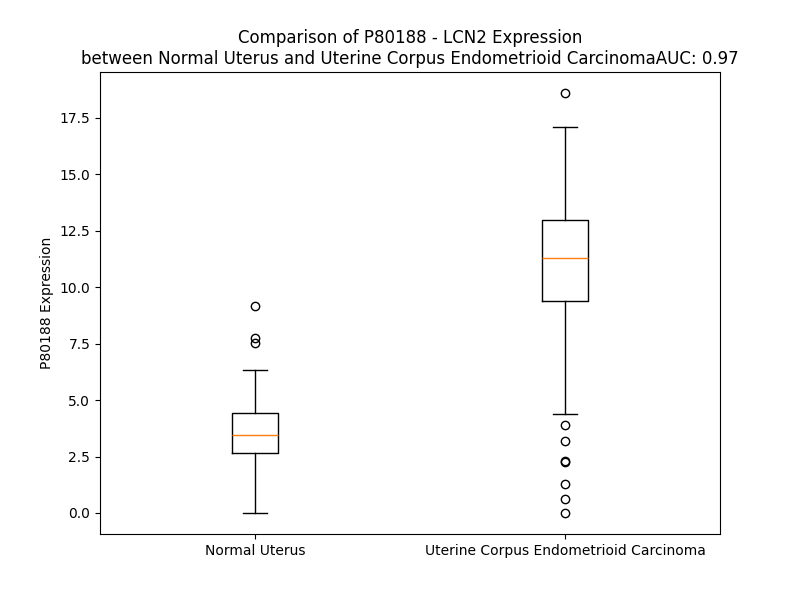

# Detailed Data for P80188

## Introduction to the Detailed Summary

### How to Interpret the Results

- **Summary & Metrics**: This section provides a quick reference to essential protein attributes, including expression changes, family classification, and biomarker applications. Regulation status (upregulated/downregulated) indicates the protein's behavior in a disease context. Some information comes from the original excel file with the proteins selected from literature, while others are derived from the analyses.
- **Expression Comparison**: A visual representation comparing protein expression between normal and disease states. It highlights significant changes in expression levels that might indicate diagnostic or therapeutic relevance. This is data coming from transcriptomics experiments and could not translate similarly to protein levels.
- **Isoform Alignment**: An interactive view of isoform alignments, revealing structural and functional differences between variants of the protein.
- **Interactors & Homologs**: Tables listing known interaction partners and homologous proteins, the more interactors and homologs, the more complex the protein is to design an antibody for.
- **Biological Assemblies**: Information about the structural arrangement of the protein in different assemblies, providing insights into its functional state but also the complexity of the protein to develop antibodies.
- **Combined Per-Residue Information**: A detailed table summarizing residue-level data. This includes predictions for epitope regions, aggregation tendencies, and modifications that might impact the protein's function. Each row corresponds to a residue in the protein, providing insights into specific sites that may be important for research or drug development.
## Summary & Metrics

- **UniProt Accession**: P80188
- **Gene Name**: LCN2
- **Protein Name**: NGAL_HUMAN
- **Swiss Prot**: NA
- **Family**: NA
- **Biomarker Application**: NA
- **Number of Isoforms**: 2
- **Regulation**: NA
- **(transcriptomics) AUC**: 0.97
- **(transcriptomics) Fold Change**: 2.99
- **(transcriptomics) Regulation**: Upregulated
- **Discotope Epitope Count**: N/A
- **Max n_uniprots (Homo)**: 3
- **Max n_uniprots (Hetero)**: 2

## Expression Comparison

## Isoform Alignment

<pre style='font-size:14px; font-family:monospace;'>P80188-1 MPLGLLWLGLALLGALHAQAQDSTSDLIPAPPLSKVPLQQNFQDNQFQGKWYVVGLAGNAILREDKDPQKMYATIYELKEDKSYNVTSVLFRKKKCDYWIRTFVPGCQPGEFTLGNIKSYPGLTSYLVRVVSTNYNQHAMVFFKKVSQNREYFKITLYGRTKELTSELKENFIRFSKSLGLPENHIVFPVPIDQCIDG
P80188-2 MPLGLLWLGLALLGALHAQAQDSTSDLIPAPPLSKVPLQQNFQDNQFQGKWYVVGLAGNAILREDKDPQKMYATIYELKEDKSYNVTSVLFRKKKCDYWIRTFVPGCQPGEFTLGNIKSYPGLTSYLVRVVSTNYNQHAMVFFKKVSQNREYFKITLYGRTKELTSELKENFIRFSKSLGLPENHIVFPVPIGNGQSG
</pre>

## Interactors

| preferredName_A   | preferredName_B   |   score |
|:------------------|:------------------|--------:|
| LCN2              | SLC22A17          |   0.998 |
| LCN2              | MMP9              |   0.998 |
| LCN2              | LTF               |   0.996 |
| LCN2              | CTLA4             |   0.988 |
| LCN2              | HAMP              |   0.988 |
| LCN2              | LRP2              |   0.984 |
| LCN2              | APP               |   0.974 |
| LCN2              | FN1               |   0.964 |
| LCN2              | CST3              |   0.924 |
| LCN2              | HAVCR1            |   0.913 |
| LCN2              | SLC3A2            |   0.91  |
| LCN2              | MMP2              |   0.907 |

## Homologs

| uniprot_id   | gene_id   |
|:-------------|:----------|
| R4GN38       | LCN12     |
| P41222       | PTGDS     |
| nan          | nan       |
| Q6JVE6       | LCN10     |
| Q6JVE9       | LCN8      |
| P31025       | LCN1      |
| Q6ZST4       | LCNL1     |
| Q5T8A4       | OBP2A     |
| F2Z349       | PAEP      |
| Q6UWW0       | LCN15     |
| P62502       | LCN6      |
| Q9NPH6       | OBP2B     |

## Biological Assemblies

|   Unnamed: 0 |   assembly |   n_uniprots | composition   | crystal_id   |
|-------------:|-----------:|-------------:|:--------------|:-------------|
|            0 |          1 |            1 | Homo          | 5mhh         |
|            0 |          1 |            1 | Homo          | 1x8u         |
|            1 |          2 |            1 | Homo          | 1x8u         |
|            2 |          3 |            1 | Homo          | 1x8u         |
|            0 |          1 |            1 | Homo          | 6gqz         |
|            1 |          2 |            1 | Homo          | 6gqz         |
|            0 |          1 |            1 | Homo          | 3dtq         |
|            1 |          2 |            1 | Homo          | 3dtq         |
|            2 |          3 |            1 | Homo          | 3dtq         |
|            0 |          1 |            1 | Homo          | 1qqs         |
|            0 |          1 |            3 | Homo          | 4zfx         |
|            0 |          1 |            1 | Homo          | 3hwg         |
|            1 |          2 |            1 | Homo          | 3hwg         |
|            2 |          3 |            1 | Homo          | 3hwg         |
|            0 |          1 |            1 | Homo          | 5nkn         |
|            0 |          1 |            1 | Homo          | 5kid         |
|            1 |          2 |            1 | Homo          | 5kid         |
|            2 |          3 |            1 | Homo          | 5kid         |
|            0 |          1 |            1 | Homo          | 3tzs         |
|            1 |          2 |            1 | Homo          | 3tzs         |
|            2 |          3 |            1 | Homo          | 3tzs         |
|            0 |          1 |            1 | Homo          | 1l6m         |
|            1 |          2 |            1 | Homo          | 1l6m         |
|            2 |          3 |            1 | Homo          | 1l6m         |
|            0 |          1 |            1 | Homo          | 4iax         |
|            0 |          1 |            1 | Homo          | 3by0         |
|            1 |          2 |            1 | Homo          | 3by0         |
|            2 |          3 |            1 | Homo          | 3by0         |
|            0 |          1 |            1 | Homo          | 3t1d         |
|            1 |          2 |            1 | Homo          | 3t1d         |
|            2 |          3 |            1 | Homo          | 3t1d         |
|            0 |          1 |            2 | Hetero        | 4mvk         |
|            0 |          1 |            1 | Homo          | 4zhf         |
|            1 |          2 |            1 | Homo          | 4zhf         |
|            2 |          3 |            1 | Homo          | 4zhf         |
|            3 |          4 |            1 | Homo          | 4zhf         |
|            4 |          5 |            1 | Homo          | 4zhf         |
|            5 |          6 |            1 | Homo          | 4zhf         |
|            0 |          1 |            1 | Homo          | 6o5d         |
|            1 |          2 |            1 | Homo          | 6o5d         |
|            2 |          3 |            1 | Homo          | 6o5d         |
|            0 |          1 |            1 | Homo          | 6qmu         |
|            1 |          2 |            1 | Homo          | 6qmu         |
|            0 |          1 |            1 | Homo          | 4zhd         |
|            1 |          2 |            1 | Homo          | 4zhd         |
|            2 |          3 |            1 | Homo          | 4zhd         |
|            0 |          1 |            0 | Hetero        | 3dsz         |
|            1 |          2 |            0 | Hetero        | 3dsz         |
|            0 |          1 |            2 | Hetero        | 4mvl         |
|            1 |          2 |            2 | Hetero        | 4mvl         |
|            2 |          3 |            2 | Hetero        | 4mvl         |
|            3 |          4 |            2 | Hetero        | 4mvl         |
|            0 |          1 |            2 | Hetero        | 4mvi         |
|            0 |          1 |            2 | Hetero        | 5n47         |
|            1 |          2 |            2 | Hetero        | 5n47         |
|            2 |          3 |            2 | Hetero        | 5n47         |
|            0 |          1 |            1 | Homo          | 3i0a         |
|            1 |          2 |            1 | Homo          | 3i0a         |
|            2 |          3 |            1 | Homo          | 3i0a         |
|            0 |          1 |            1 | Homo          | 3hwd         |
|            1 |          2 |            1 | Homo          | 3hwd         |
|            2 |          3 |            1 | Homo          | 3hwd         |
|            0 |          1 |            1 | Homo          | 3ped         |
|            1 |          2 |            1 | Homo          | 3ped         |
|            2 |          3 |            1 | Homo          | 3ped         |
|            0 |          1 |            1 | Homo          | 4iaw         |
|            1 |          2 |            1 | Homo          | 4iaw         |
|            2 |          3 |            1 | Homo          | 4iaw         |
|            0 |          1 |            1 | Homo          | 3cmp         |
|            1 |          2 |            1 | Homo          | 3cmp         |
|            2 |          3 |            1 | Homo          | 3cmp         |
|            0 |          1 |            1 | Homo          | 4k19         |
|            1 |          2 |            1 | Homo          | 4k19         |
|            2 |          3 |            1 | Homo          | 4k19         |
|            0 |          1 |            1 | Homo          | 4zhc         |
|            1 |          2 |            1 | Homo          | 4zhc         |
|            2 |          3 |            1 | Homo          | 4zhc         |
|            0 |          1 |            1 | Homo          | 1dfv         |
|            1 |          2 |            1 | Homo          | 1dfv         |
|            2 |          3 |            1 | Homo          | 1dfv         |
|            0 |          1 |            1 | Homo          | 5kic         |
|            1 |          2 |            1 | Homo          | 5kic         |
|            2 |          3 |            1 | Homo          | 5kic         |
|            0 |          1 |            2 | Hetero        | 6sua         |
|            1 |          2 |            2 | Hetero        | 6sua         |
|            0 |          1 |            1 | Homo          | 1x89         |
|            1 |          2 |            1 | Homo          | 1x89         |
|            2 |          3 |            1 | Homo          | 1x89         |
|            0 |          1 |            1 | Homo          | 3u0d         |
|            1 |          2 |            1 | Homo          | 3u0d         |
|            2 |          3 |            1 | Homo          | 3u0d         |
|            3 |          4 |            1 | Homo          | 3u0d         |
|            0 |          1 |            1 | Homo          | 6gr0         |
|            1 |          2 |            1 | Homo          | 6gr0         |
|            2 |          3 |            1 | Homo          | 6gr0         |
|            0 |          1 |            1 | Homo          | 1x71         |
|            1 |          2 |            1 | Homo          | 1x71         |
|            2 |          3 |            1 | Homo          | 1x71         |
|            0 |          1 |            1 | Homo          | 6z2c         |
|            1 |          2 |            1 | Homo          | 6z2c         |
|            2 |          3 |            1 | Homo          | 6z2c         |
|            0 |          1 |            2 | Hetero        | 4qae         |
|            1 |          2 |            2 | Hetero        | 4qae         |
|            2 |          3 |            2 | Hetero        | 4qae         |
|            3 |          4 |            2 | Hetero        | 4qae         |
|            4 |          5 |            2 | Hetero        | 4qae         |
|            5 |          6 |            2 | Hetero        | 4qae         |
|            0 |          1 |            1 | Homo          | 1ngl         |
|            0 |          1 |            1 | Homo          | 3k3l         |
|            1 |          2 |            1 | Homo          | 3k3l         |
|            2 |          3 |            1 | Homo          | 3k3l         |
|            0 |          1 |            1 | Homo          | 3fw5         |
|            1 |          2 |            1 | Homo          | 3fw5         |
|            2 |          3 |            1 | Homo          | 3fw5         |
|            0 |          1 |            2 | Hetero        | 4gh7         |
|            1 |          2 |            2 | Hetero        | 4gh7         |
|            0 |          1 |            1 | Homo          | 4zhh         |
|            1 |          2 |            1 | Homo          | 4zhh         |
|            2 |          3 |            1 | Homo          | 4zhh         |
|            3 |          4 |            1 | Homo          | 4zhh         |
|            4 |          5 |            1 | Homo          | 4zhh         |
|            5 |          6 |            1 | Homo          | 4zhh         |
|            0 |          1 |            1 | Homo          | 5jr8         |
|            1 |          2 |            1 | Homo          | 5jr8         |
|            2 |          3 |            1 | Homo          | 5jr8         |
|            3 |          4 |            1 | Homo          | 5jr8         |
|            0 |          1 |            1 | Homo          | 6z6z         |
|            0 |          1 |            2 | Hetero        | 6s8v         |
|            1 |          2 |            2 | Hetero        | 6s8v         |
|            0 |          1 |            1 | Homo          | 4zhg         |
|            1 |          2 |            1 | Homo          | 4zhg         |
|            2 |          3 |            1 | Homo          | 4zhg         |
|            3 |          4 |            1 | Homo          | 4zhg         |
|            4 |          5 |            1 | Homo          | 4zhg         |
|            5 |          6 |            1 | Homo          | 4zhg         |
|            0 |          1 |            1 | Homo          | 5khp         |
|            1 |          2 |            1 | Homo          | 5khp         |
|            2 |          3 |            1 | Homo          | 5khp         |
|            0 |          1 |            1 | Homo          | 3pec         |
|            1 |          2 |            1 | Homo          | 3pec         |
|            2 |          3 |            1 | Homo          | 3pec         |
|            0 |          1 |            1 | Homo          | 3fw4         |
|            1 |          2 |            1 | Homo          | 3fw4         |
|            2 |          3 |            1 | Homo          | 3fw4         |
|            0 |          1 |            2 | Hetero        | 5n48         |
|            1 |          2 |            2 | Hetero        | 5n48         |
|            0 |          1 |            1 | Homo          | 3cbc         |
|            1 |          2 |            1 | Homo          | 3cbc         |
|            2 |          3 |            1 | Homo          | 3cbc         |
|            0 |          1 |            1 | Homo          | 3hwe         |
|            1 |          2 |            1 | Homo          | 3hwe         |
|            2 |          3 |            1 | Homo          | 3hwe         |
|            0 |          1 |            1 | Homo          | 3tf6         |
|            1 |          2 |            1 | Homo          | 3tf6         |
|            2 |          3 |            1 | Homo          | 3tf6         |
|            0 |          1 |            1 | Homo          | 3hwf         |
|            1 |          2 |            1 | Homo          | 3hwf         |
|            2 |          3 |            1 | Homo          | 3hwf         |

## Combined Per-Residue Information

|   res | aa   |   Beta |   Turn |   Helix |   Aggregation |   Conc-Stab_Aggregation | modification                | glycosylation                   |
|------:|:-----|-------:|-------:|--------:|--------------:|------------------------:|:----------------------------|:--------------------------------|
|     1 | M    |    0   |    0.4 |   0     |         0     |                   0     | N/A                         | N/A                             |
|     2 | P    |    0   |    0.4 |   1.291 |         0.454 |                   0.454 | N/A                         | N/A                             |
|     3 | L    |    0.1 |    0.4 |   1.291 |        15.317 |                  15.317 | N/A                         | N/A                             |
|     4 | G    |    0.1 |    0.4 |   1.986 |        20.856 |                  20.856 | N/A                         | N/A                             |
|     5 | L    |    0.5 |    0   |   1.986 |        79.889 |                  79.889 | N/A                         | N/A                             |
|     6 | L    |    1   |    0   |   2.106 |        90.654 |                  90.654 | N/A                         | N/A                             |
|     7 | W    |    1   |    0   |   3.892 |        92.577 |                  92.577 | N/A                         | N/A                             |
|     8 | L    |    0.7 |    0   |   3.892 |        92.921 |                  92.921 | N/A                         | N/A                             |
|     9 | G    |    0.2 |    0   |   5.447 |        92.121 |                  92.121 | N/A                         | N/A                             |
|    10 | L    |    0.5 |    0   |   4.726 |        92.12  |                  92.12  | N/A                         | N/A                             |
|    11 | A    |    0.7 |    0   |   4.406 |        90.239 |                  90.239 | N/A                         | N/A                             |
|    12 | L    |    0.7 |    0   |   4.406 |        88.626 |                  88.626 | N/A                         | N/A                             |
|    13 | L    |    0.4 |    0.1 |   4.406 |        79.509 |                  79.509 | N/A                         | N/A                             |
|    14 | G    |    0.1 |    0.1 |   4.52  |        29.666 |                  29.666 | N/A                         | N/A                             |
|    15 | A    |    0.3 |    0.1 |   1.754 |        25.135 |                  25.135 | N/A                         | N/A                             |
|    16 | L    |    0.7 |    0.1 |   0.877 |        21.304 |                  21.304 | N/A                         | N/A                             |
|    17 | H    |    0.9 |    0.2 |   0.674 |         0.267 |                   0.267 | N/A                         | N/A                             |
|    18 | A    |    0.7 |    0.2 |   0.674 |         0.118 |                   0.118 | N/A                         | N/A                             |
|    19 | Q    |    0.5 |    0.2 |   0.674 |         0     |                   0     | N/A                         | N/A                             |
|    20 | A    |    0.3 |    0.4 |   0     |         0     |                   0     | N/A                         | N/A                             |
|    21 | Q    |    0.3 |    0.3 |   0     |         0     |                   0     | Pyrrolidone carboxylic acid | N/A                             |
|    22 | D    |    0.2 |    0.5 |   0     |         0     |                   0     | N/A                         | N/A                             |
|    23 | S    |    2.3 |    0.8 |   0     |         0     |                   0     | N/A                         | N/A                             |
|    24 | T    |    2.3 |    0.9 |   0     |         0     |                   0     | N/A                         | N/A                             |
|    25 | S    |    2.2 |    0.9 |   0     |         0     |                   0     | N/A                         | N/A                             |
|    26 | D    |    0.4 |    0.6 |   0     |         0     |                   0     | N/A                         | N/A                             |
|    27 | L    |    0.5 |    0.3 |   0     |         0     |                   0     | N/A                         | N/A                             |
|    28 | I    |    0.5 |    0   |   0     |         0     |                   0     | N/A                         | N/A                             |
|    29 | P    |    0.1 |    0   |   0     |         0     |                   0     | N/A                         | N/A                             |
|    30 | A    |    0   |    0   |   0     |         0     |                   0     | N/A                         | N/A                             |
|    31 | P    |    0   |    0.2 |   0     |         0     |                   0     | N/A                         | N/A                             |
|    32 | P    |    0   |    0.2 |   0     |         0     |                   0     | N/A                         | N/A                             |
|    33 | L    |    0.3 |    0.2 |   0     |         0     |                   0     | N/A                         | N/A                             |
|    34 | S    |    0.9 |    0.2 |   0     |         0     |                   0     | N/A                         | N/A                             |
|    35 | K    |    1.2 |    0   |   0     |         0     |                   0     | N/A                         | N/A                             |
|    36 | V    |    0.9 |    0   |   0     |         0     |                   0     | N/A                         | N/A                             |
|    37 | P    |    0.3 |    0   |   0     |         0     |                   0     | N/A                         | N/A                             |
|    38 | L    |    0.2 |    0   |   0     |         0     |                   0     | N/A                         | N/A                             |
|    39 | Q    |    0.3 |    0.2 |   0     |         0     |                   0     | N/A                         | N/A                             |
|    40 | Q    |    1.1 |    0.2 |   0     |         0     |                   0     | N/A                         | N/A                             |
|    41 | N    |    2   |    0.2 |   0     |         0     |                   0     | N/A                         | N/A                             |
|    42 | F    |    3.2 |    0.4 |   0     |         0     |                   0     | N/A                         | N/A                             |
|    43 | Q    |    2.5 |    0.4 |   0     |         0     |                   0     | N/A                         | N/A                             |
|    44 | D    |    1.4 |    0.4 |   0     |         0     |                   0     | N/A                         | N/A                             |
|    45 | N    |    1.2 |    0.4 |   0     |         0     |                   0     | N/A                         | N/A                             |
|    46 | Q    |    5.2 |    0.1 |   0     |         0     |                   0     | N/A                         | N/A                             |
|    47 | F    |    5.6 |    0.4 |   0     |         0     |                   0     | N/A                         | N/A                             |
|    48 | Q    |    4.5 |    0.4 |   0     |         0     |                   0     | N/A                         | N/A                             |
|    49 | G    |    0.5 |    0.4 |   0     |         0     |                   0     | N/A                         | N/A                             |
|    50 | K    |    0.2 |    0.4 |   0     |         0     |                   0     | N/A                         | N/A                             |
|    51 | W    |    1.1 |    0   |   0     |        49.98  |                  49.98  | N/A                         | N/A                             |
|    52 | Y    |    3.5 |    0   |   0     |        55.18  |                  55.18  | N/A                         | N/A                             |
|    53 | V    |    4.4 |    0   |   0     |        57.534 |                  57.534 | N/A                         | N/A                             |
|    54 | V    |    3.8 |    0   |   0     |        57.596 |                  57.596 | N/A                         | N/A                             |
|    55 | G    |    1.5 |    0   |   0     |        57.596 |                  57.596 | N/A                         | N/A                             |
|    56 | L    |    0.4 |    0.2 |   0     |        54.025 |                  54.025 | N/A                         | N/A                             |
|    57 | A    |    0.1 |    0.8 |   0     |        31.967 |                  31.967 | N/A                         | N/A                             |
|    58 | G    |    0.1 |    0.8 |   0     |        11.847 |                  11.847 | N/A                         | N/A                             |
|    59 | N    |    0.1 |    0.8 |   0.427 |        10.036 |                  10.036 | N/A                         | N/A                             |
|    60 | A    |    0.7 |    0.7 |   0.427 |         9.977 |                   9.977 | N/A                         | N/A                             |
|    61 | I    |    3.2 |    0   |   0.427 |         9.977 |                   9.977 | N/A                         | N/A                             |
|    62 | L    |    3.1 |    0   |   0.427 |         9.779 |                   9.779 | N/A                         | N/A                             |
|    63 | R    |    2.6 |    0.6 |   0.427 |         0     |                   0     | N/A                         | N/A                             |
|    64 | E    |    0.2 |    0.7 |   0.427 |         0     |                   0     | N/A                         | N/A                             |
|    65 | D    |    0.2 |    0.7 |   0     |         0     |                   0     | N/A                         | N/A                             |
|    66 | K    |    0.1 |    0.6 |   0     |         0     |                   0     | N/A                         | N/A                             |
|    67 | D    |    0   |    0.7 |   0.273 |         0     |                   0     | N/A                         | N/A                             |
|    68 | P    |    0   |    0.7 |   0.273 |         0     |                   0     | N/A                         | N/A                             |
|    69 | Q    |    0.3 |    0.7 |   0.273 |         0     |                   0     | N/A                         | N/A                             |
|    70 | K    |    0.6 |    0.7 |   0.273 |         0.132 |                   0.132 | N/A                         | N/A                             |
|    71 | M    |    1.1 |    0   |   0.273 |        12.624 |                  12.624 | N/A                         | N/A                             |
|    72 | Y    |    1   |    0.2 |   0.273 |        21.108 |                  21.108 | N/A                         | N/A                             |
|    73 | A    |    1.6 |    0.2 |   0     |        21.108 |                  21.108 | N/A                         | N/A                             |
|    74 | T    |    3.8 |    0.2 |   0.712 |        21.108 |                  21.108 | N/A                         | N/A                             |
|    75 | I    |    4.3 |    0.2 |   0.712 |        21.108 |                  21.108 | N/A                         | N/A                             |
|    76 | Y    |    5.9 |    0   |   0.712 |        18.299 |                  18.299 | N/A                         | N/A                             |
|    77 | E    |    4.5 |    0   |   0.712 |         0.132 |                   0.132 | N/A                         | N/A                             |
|    78 | L    |    3.7 |    0.1 |   0.712 |         0.132 |                   0.132 | N/A                         | N/A                             |
|    79 | K    |    1.5 |    0.5 |   0.712 |         0     |                   0     | N/A                         | N/A                             |
|    80 | E    |    0.2 |    0.5 |   0.37  |         0     |                   0     | N/A                         | N/A                             |
|    81 | D    |    0.1 |    1.2 |   0.138 |         0     |                   0     | N/A                         | N/A                             |
|    82 | K    |    0.4 |    1.1 |   0     |         0     |                   0     | N/A                         | N/A                             |
|    83 | S    |    9.1 |    1   |   0     |         0.228 |                   0.228 | N/A                         | N/A                             |
|    84 | Y    |   13.8 |    0.9 |   0     |         0.476 |                   0.476 | N/A                         | N/A                             |
|    85 | N    |   15.2 |    0.3 |   1.62  |         0.679 |                   0.679 | N/A                         | N-linked (GlcNAc...) asparagine |
|    86 | V    |    9.4 |    0.3 |   1.62  |         7.054 |                   7.054 | N/A                         | N/A                             |
|    87 | T    |    5   |    0   |   1.899 |         7.492 |                   7.492 | N/A                         | N/A                             |
|    88 | S    |    3.6 |    0   |   2.39  |         7.492 |                   7.492 | N/A                         | N/A                             |
|    89 | V    |    2.8 |    0   |   2.39  |         7.492 |                   7.492 | N/A                         | N/A                             |
|    90 | L    |    2.2 |    0   |   2.39  |         7.492 |                   7.492 | N/A                         | N/A                             |
|    91 | F    |    3.1 |    0   |   2.39  |         6.329 |                   6.329 | N/A                         | N/A                             |
|    92 | R    |    1.6 |    0.1 |   1.87  |         0     |                   0     | N/A                         | N/A                             |
|    93 | K    |    1.5 |    0.2 |   1.178 |         0     |                   0     | N/A                         | N/A                             |
|    94 | K    |    0.3 |    0.2 |   0.136 |         0     |                   0     | N/A                         | N/A                             |
|    95 | K    |    0.8 |    0.3 |   0     |         0     |                   0     | N/A                         | N/A                             |
|    96 | C    |    1.2 |    0.2 |   0     |         0     |                   0     | N/A                         | N/A                             |
|    97 | D    |    1.9 |    0.2 |   0.122 |         0     |                   0     | N/A                         | N/A                             |
|    98 | Y    |    2   |    0.1 |   0.122 |         0     |                   0     | N/A                         | N/A                             |
|    99 | W    |    2.3 |    0   |   0.122 |         0     |                   0     | N/A                         | N/A                             |
|   100 | I    |    2.5 |    0.1 |   0.122 |         0     |                   0     | N/A                         | N/A                             |
|   101 | R    |    3.1 |    0.1 |   0.122 |         0     |                   0     | N/A                         | N/A                             |
|   102 | T    |   10.4 |    0.1 |   0.122 |         0     |                   0     | N/A                         | N/A                             |
|   103 | F    |    9.5 |    0.1 |   0.122 |         0     |                   0     | N/A                         | N/A                             |
|   104 | V    |    8.2 |    1.1 |   0.122 |         0     |                   0     | N/A                         | N/A                             |
|   105 | P    |    0.2 |    1.3 |   0     |         0     |                   0     | N/A                         | N/A                             |
|   106 | G    |    0.1 |    1.3 |   0     |         0     |                   0     | N/A                         | N/A                             |
|   107 | C    |    0.3 |    1.3 |   0     |         0     |                   0     | N/A                         | N/A                             |
|   108 | Q    |    0.3 |    1.2 |   0     |         0     |                   0     | N/A                         | N/A                             |
|   109 | P    |    0.2 |    1.2 |   0     |         0     |                   0     | N/A                         | N/A                             |
|   110 | G    |    0   |    1.2 |   0.253 |         0     |                   0     | N/A                         | N/A                             |
|   111 | E    |    2.5 |    1.2 |   0.253 |         0     |                   0     | N/A                         | N/A                             |
|   112 | F    |    7.1 |    0.1 |   0.253 |         0.254 |                   0.254 | N/A                         | N/A                             |
|   113 | T    |    7.2 |    0   |   0.902 |         0.254 |                   0.254 | N/A                         | N/A                             |
|   114 | L    |    4.8 |    0.3 |   0.902 |         0.254 |                   0.254 | N/A                         | N/A                             |
|   115 | G    |    0.1 |    0.3 |   0.902 |         0.254 |                   0.254 | N/A                         | N/A                             |
|   116 | N    |    1.9 |    0.3 |   0.902 |         0.254 |                   0.254 | N/A                         | N/A                             |
|   117 | I    |    3.3 |    0.5 |   0.649 |         0.254 |                   0.254 | N/A                         | N/A                             |
|   118 | K    |    4   |    0.2 |   0.649 |         0     |                   0     | N/A                         | N/A                             |
|   119 | S    |    2.4 |    0.2 |   0.649 |         0     |                   0     | N/A                         | N/A                             |
|   120 | Y    |    1   |    1.7 |   0.458 |         0     |                   0     | N/A                         | N/A                             |
|   121 | P    |    0.3 |    1.6 |   0     |         0     |                   0     | N/A                         | N/A                             |
|   122 | G    |    0.1 |    1.6 |   0     |         0.178 |                   0.178 | N/A                         | N/A                             |
|   123 | L    |    0.6 |    1.6 |   0     |         2.293 |                   2.293 | N/A                         | N/A                             |
|   124 | T    |    2.1 |    0.1 |   0     |         2.65  |                   2.65  | N/A                         | N/A                             |
|   125 | S    |    2.5 |    0.1 |   0     |         2.65  |                   2.65  | N/A                         | N/A                             |
|   126 | Y    |    2.9 |    0.1 |   0     |         2.65  |                   2.65  | N/A                         | N/A                             |
|   127 | L    |    1.6 |    0   |   0     |         2.65  |                   2.65  | N/A                         | N/A                             |
|   128 | V    |    9.9 |    0   |   0     |         2.485 |                   2.485 | N/A                         | N/A                             |
|   129 | R    |   11   |    0   |   0     |         0     |                   0     | N/A                         | N/A                             |
|   130 | V    |   15   |    0   |   0     |         0     |                   0     | N/A                         | N/A                             |
|   131 | V    |    7.3 |    0   |   0     |         0     |                   0     | N/A                         | N/A                             |
|   132 | S    |    5.5 |    0.5 |   0     |         0     |                   0     | N/A                         | N/A                             |
|   133 | T    |    1.9 |    0.5 |   0     |         0     |                   0     | N/A                         | N/A                             |
|   134 | N    |    2   |    0.9 |   0     |         0     |                   0     | N/A                         | N/A                             |
|   135 | Y    |    3   |    0.9 |   0     |         0     |                   0     | N/A                         | N/A                             |
|   136 | N    |    2.5 |    0.6 |   0.278 |         0     |                   0     | N/A                         | N/A                             |
|   137 | Q    |    1.7 |    0.6 |   0.278 |         0     |                   0     | N/A                         | N/A                             |
|   138 | H    |    0.5 |    0.1 |   0.278 |         0     |                   0     | N/A                         | N/A                             |
|   139 | A    |    0.7 |    0.1 |   0.278 |        11.297 |                  11.297 | N/A                         | N/A                             |
|   140 | M    |    2.3 |    0   |   0.278 |        11.297 |                  11.297 | N/A                         | N/A                             |
|   141 | V    |    4.1 |    0   |   0.278 |        11.297 |                  11.297 | N/A                         | N/A                             |
|   142 | F    |    5   |    0   |   0.278 |        11.297 |                  11.297 | N/A                         | N/A                             |
|   143 | F    |    3.8 |    0.1 |   0.278 |        11.297 |                  11.297 | N/A                         | N/A                             |
|   144 | K    |    1.9 |    0.1 |   0.121 |         0     |                   0     | N/A                         | N/A                             |
|   145 | K    |    1.8 |    0.1 |   0     |         0     |                   0     | N/A                         | N/A                             |
|   146 | V    |    3.3 |    0.1 |   0     |         0     |                   0     | N/A                         | N/A                             |
|   147 | S    |    3.9 |    1.2 |   0     |         0     |                   0     | N/A                         | N/A                             |
|   148 | Q    |    2.8 |    1.2 |   0     |         0     |                   0     | N/A                         | N/A                             |
|   149 | N    |    0.9 |    1.2 |   0.277 |         0     |                   0     | N/A                         | N/A                             |
|   150 | R    |    0.2 |    1.2 |   0.394 |         0     |                   0     | N/A                         | N/A                             |
|   151 | E    |    0.6 |    0.1 |   0.533 |         0     |                   0     | N/A                         | N/A                             |
|   152 | Y    |    1.7 |    0   |   0.533 |         0     |                   0     | N/A                         | N/A                             |
|   153 | F    |    3.4 |    0   |   0.533 |         0     |                   0     | N/A                         | N/A                             |
|   154 | K    |    8   |    0   |   0.533 |         0     |                   0     | N/A                         | N/A                             |
|   155 | I    |   16.8 |    0   |   0.533 |         0     |                   0     | N/A                         | N/A                             |
|   156 | T    |   16   |    0   |   0.533 |         0     |                   0     | N/A                         | N/A                             |
|   157 | L    |   11.2 |    0   |   0.533 |         0     |                   0     | N/A                         | N/A                             |
|   158 | Y    |    1.4 |    1   |   0.533 |         0     |                   0     | N/A                         | N/A                             |
|   159 | G    |    0.3 |    1.1 |   0     |         0     |                   0     | N/A                         | N/A                             |
|   160 | R    |    0.3 |    1.1 |   0     |         0     |                   0     | N/A                         | N/A                             |
|   161 | T    |    0.9 |    1.1 |   0     |         0     |                   0     | N/A                         | N/A                             |
|   162 | K    |    1   |    0.2 |   0     |         0     |                   0     | N/A                         | N/A                             |
|   163 | E    |    1.4 |    0.1 |   0     |         0     |                   0     | N/A                         | N/A                             |
|   164 | L    |    1.2 |    0.1 |   0     |         0     |                   0     | N/A                         | N/A                             |
|   165 | T    |    1.3 |    0.1 |   3.282 |         0     |                   0     | N/A                         | N/A                             |
|   166 | S    |    0.7 |    0.2 |   4.704 |         0     |                   0     | N/A                         | N/A                             |
|   167 | E    |    1.4 |    0.2 |   4.704 |         0     |                   0     | N/A                         | N/A                             |
|   168 | L    |    1.3 |    0.2 |   4.704 |         0     |                   0     | N/A                         | N/A                             |
|   169 | K    |    1.4 |    0.4 |   4.704 |         0     |                   0     | N/A                         | N/A                             |
|   170 | E    |    0.2 |    0.3 |   4.704 |         0     |                   0     | N/A                         | N/A                             |
|   171 | N    |    0.9 |    0.3 |   4.642 |         0     |                   0     | N/A                         | N/A                             |
|   172 | F    |    2.1 |    0.2 |   3.014 |         0     |                   0     | N/A                         | N/A                             |
|   173 | I    |    5.2 |    0   |   1.962 |         0     |                   0     | N/A                         | N/A                             |
|   174 | R    |    5.3 |    0   |   1.962 |         0     |                   0     | N/A                         | N/A                             |
|   175 | F    |    6.4 |    0   |   1.767 |         0     |                   0     | N/A                         | N/A                             |
|   176 | S    |    5.5 |    0.8 |   1.126 |         0     |                   0     | N/A                         | N/A                             |
|   177 | K    |    4.7 |    0.9 |   0.185 |         0     |                   0     | N/A                         | N/A                             |
|   178 | S    |    2.7 |    0.9 |   0     |         0     |                   0     | N/A                         | N/A                             |
|   179 | L    |    0.5 |    0.8 |   0     |         0     |                   0     | N/A                         | N/A                             |
|   180 | G    |    0.3 |    0.1 |   0     |         0     |                   0     | N/A                         | N/A                             |
|   181 | L    |    0.2 |    0.2 |   0     |         0     |                   0     | N/A                         | N/A                             |
|   182 | P    |    0   |    0.5 |   0     |         0     |                   0     | N/A                         | N/A                             |
|   183 | E    |    0.1 |    0.5 |   0     |         0     |                   0     | N/A                         | N/A                             |
|   184 | N    |    0.7 |    0.5 |   0     |         0     |                   0     | N/A                         | N/A                             |
|   185 | H    |    8.8 |    0.3 |   0     |         0     |                   0     | N/A                         | N/A                             |
|   186 | I    |   16.3 |    0   |   0     |         0     |                   0     | N/A                         | N/A                             |
|   187 | V    |   16.1 |    0   |   0     |         0     |                   0     | N/A                         | N/A                             |
|   188 | F    |    8.4 |    0   |   0     |         0     |                   0     | N/A                         | N/A                             |
|   189 | P    |    0.4 |    0   |   0     |         0     |                   0     | N/A                         | N/A                             |
|   190 | V    |    0.1 |    0   |   0     |         0     |                   0     | N/A                         | N/A                             |
|   191 | P    |    0   |    0   |   0     |         0     |                   0     | N/A                         | N/A                             |
|   192 | I    |    1.2 |    0   |   0     |         0     |                   0     | N/A                         | N/A                             |
|   193 | D    |    1.3 |    0.1 |   0     |         0     |                   0     | N/A                         | N/A                             |
|   194 | Q    |    1.7 |    0.1 |   0     |         0     |                   0     | N/A                         | N/A                             |
|   195 | C    |    3.8 |    0.4 |   0     |         0     |                   0     | N/A                         | N/A                             |
|   196 | I    |    5.2 |    0.4 |   0     |         0     |                   0     | N/A                         | N/A                             |
|   197 | D    |    4.9 |    0.3 |   0     |         0     |                   0     | N/A                         | N/A                             |
|   198 | G    |    1.6 |    0.3 |   0     |         0     |                   0     | N/A                         | N/A                             |

