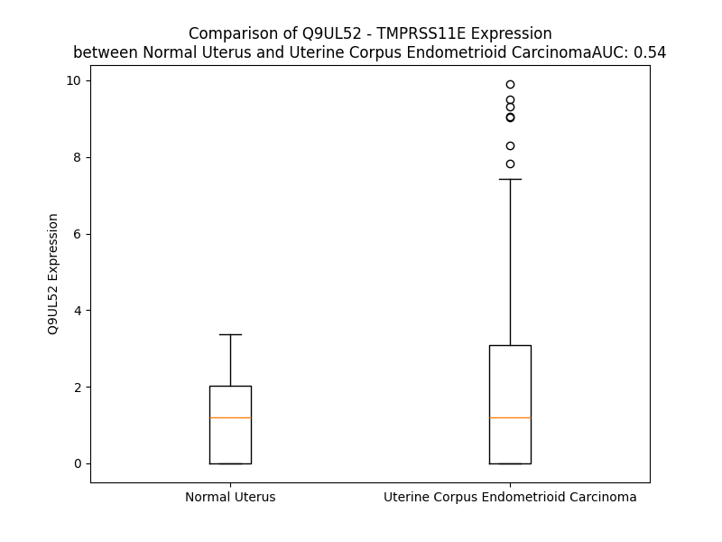

# Detailed Data for Q9UL52

## Introduction to the Detailed Summary

### How to Interpret the Results

- **Summary & Metrics**: This section provides a quick reference to essential protein attributes, including expression changes, family classification, and biomarker applications. Regulation status (upregulated/downregulated) indicates the protein's behavior in a disease context. Some information comes from the original excel file with the proteins selected from literature, while others are derived from the analyses.
- **Expression Comparison**: A visual representation comparing protein expression between normal and disease states. It highlights significant changes in expression levels that might indicate diagnostic or therapeutic relevance. This is data coming from transcriptomics experiments and could not translate similarly to protein levels.
- **Isoform Alignment**: An interactive view of isoform alignments, revealing structural and functional differences between variants of the protein.
- **Interactors & Homologs**: Tables listing known interaction partners and homologous proteins, the more interactors and homologs, the more complex the protein is to design an antibody for.
- **Biological Assemblies**: Information about the structural arrangement of the protein in different assemblies, providing insights into its functional state but also the complexity of the protein to develop antibodies.
- **Combined Per-Residue Information**: A detailed table summarizing residue-level data. This includes predictions for epitope regions, aggregation tendencies, and modifications that might impact the protein's function. Each row corresponds to a residue in the protein, providing insights into specific sites that may be important for research or drug development.
## Summary & Metrics

- **UniProt Accession**: Q9UL52
- **Gene Name**: TMPRSS11E
- **Protein Name**: TM11E_HUMAN
- **Swiss Prot**: NA
- **Family**: NA
- **Biomarker Application**: NA
- **Number of Isoforms**: 0
- **Regulation**: NA
- **(transcriptomics) AUC**: 0.54
- **(transcriptomics) Fold Change**: 1.56
- **(transcriptomics) Regulation**: Upregulated
- **Discotope Epitope Count**: 71
- **Max n_uniprots (Homo)**: 1
- **Max n_uniprots (Hetero)**: N/A

## Expression Comparison

## Interactors

| preferredName_A   | preferredName_B   | score   |
|-------------------|-------------------|---------|

## Homologs

| uniprot_id   | gene_id   |
|:-------------|:----------|
| Q9UL52       | TMPRSS11E |
| Q86T26       | TMPRSS11B |
| A0A0A0MR82   | TMPRSS11A |
| Q9Y5Y6       | ST14      |
| X6REP5       | TMPRSS6   |
| O60235       | TMPRSS11D |
| Q9Y6M0       | PRSS21    |
| A0A6I8PU99   | PRSS41    |
| Q6ZWK6       | TMPRSS11F |
| M0QZ63       | HPN       |
| P98073       | TMPRSS15  |
| A0A3B3IU58   | TMPRSS9   |
| G5EA47       | TMPRSS5   |
| B7WPR2       | TMPRSS3   |
| Q9GZN4       | PRSS22    |
| A0A7I2V650   | TMPRSS2   |
| G3V1W5       | TMPRSS7   |
| Q9BYE2       | TMPRSS13  |

## Biological Assemblies

|   Unnamed: 0 |   assembly |   n_uniprots | composition   | crystal_id   |
|-------------:|-----------:|-------------:|:--------------|:-------------|
|            0 |          1 |            1 | Homo          | 2oq5         |

## Combined Per-Residue Information

|   res | aa   |   epitope_score | epitope   |   relative_surface_accessibility |   modeling_confidence |   Aggregation | modification   | glycosylation                   |
|------:|:-----|----------------:|:----------|---------------------------------:|----------------------:|--------------:|:---------------|:--------------------------------|
|     1 | M    |         0.11204 | False     |                          1.34968 |                 49.93 |         0     | N/A            | N/A                             |
|     2 | M    |         0.20779 | True      |                          1.0581  |                 47.29 |         0     | N/A            | N/A                             |
|     3 | Y    |         0.15307 | False     |                          0.97868 |                 45.15 |         0     | N/A            | N/A                             |
|     4 | R    |         0.13763 | False     |                          0.91356 |                 49.07 |         0     | N/A            | N/A                             |
|     5 | P    |         0.1428  | False     |                          0.78316 |                 57.57 |         0     | N/A            | N/A                             |
|     6 | D    |         0.14273 | False     |                          0.85848 |                 52.78 |         0     | N/A            | N/A                             |
|     7 | V    |         0.11203 | False     |                          0.97592 |                 54.55 |         0     | N/A            | N/A                             |
|     8 | V    |         0.12532 | False     |                          0.95474 |                 51.88 |         0     | N/A            | N/A                             |
|     9 | R    |         0.19054 | True      |                          0.91798 |                 50.31 |         0     | N/A            | N/A                             |
|    10 | A    |         0.14501 | False     |                          0.84017 |                 51.9  |         0     | N/A            | N/A                             |
|    11 | R    |         0.1914  | True      |                          0.93824 |                 48.24 |         0     | N/A            | N/A                             |
|    12 | K    |         0.10618 | False     |                          0.93987 |                 53.58 |         0     | N/A            | N/A                             |
|    13 | R    |         0.12977 | False     |                          0.92912 |                 55.11 |         0     | N/A            | N/A                             |
|    14 | V    |         0.13112 | False     |                          0.84022 |                 63    |         0     | N/A            | N/A                             |
|    15 | C    |         0.16711 | False     |                          0.90622 |                 71.47 |         0     | N/A            | N/A                             |
|    16 | W    |         0.18058 | True      |                          0.55807 |                 74.95 |         0     | N/A            | N/A                             |
|    17 | E    |         0.16874 | False     |                          0.5489  |                 84.88 |         0     | N/A            | N/A                             |
|    18 | P    |         0.16037 | False     |                          0.84443 |                 83.9  |         0.161 | N/A            | N/A                             |
|    19 | W    |         0.15997 | False     |                          0.73309 |                 87.25 |        76.472 | N/A            | N/A                             |
|    20 | V    |         0.03435 | False     |                          0.27229 |                 88.03 |        92.276 | N/A            | N/A                             |
|    21 | I    |         0.05316 | False     |                          0.48937 |                 85.91 |        94.005 | N/A            | N/A                             |
|    22 | G    |         0.08714 | False     |                          0.4484  |                 88.17 |        94.185 | N/A            | N/A                             |
|    23 | L    |         0.07061 | False     |                          0.57024 |                 91.73 |        98.898 | N/A            | N/A                             |
|    24 | V    |         0.05125 | False     |                          0.46697 |                 90.02 |        99.873 | N/A            | N/A                             |
|    25 | I    |         0.05605 | False     |                          0.56478 |                 90.48 |        99.97  | N/A            | N/A                             |
|    26 | F    |         0.05995 | False     |                          0.64092 |                 93.62 |        99.996 | N/A            | N/A                             |
|    27 | I    |         0.03986 | False     |                          0.51598 |                 93.97 |        99.998 | N/A            | N/A                             |
|    28 | S    |         0.03722 | False     |                          0.46541 |                 92.14 |        99.995 | N/A            | N/A                             |
|    29 | L    |         0.04906 | False     |                          0.63821 |                 95.28 |        99.997 | N/A            | N/A                             |
|    30 | I    |         0.05405 | False     |                          0.49987 |                 95.34 |        99.995 | N/A            | N/A                             |
|    31 | V    |         0.03021 | False     |                          0.58908 |                 95.59 |        99.977 | N/A            | N/A                             |
|    32 | L    |         0.04869 | False     |                          0.5966  |                 95.78 |        99.76  | N/A            | N/A                             |
|    33 | A    |         0.0441  | False     |                          0.59246 |                 96.24 |        98.577 | N/A            | N/A                             |
|    34 | V    |         0.02665 | False     |                          0.5832  |                 96.52 |        97.648 | N/A            | N/A                             |
|    35 | C    |         0.02634 | False     |                          0.46274 |                 96.11 |        86.715 | N/A            | N/A                             |
|    36 | I    |         0.04211 | False     |                          0.56238 |                 95.06 |        79.851 | N/A            | N/A                             |
|    37 | G    |         0.04889 | False     |                          0.47824 |                 94.82 |         5.615 | N/A            | N/A                             |
|    38 | L    |         0.05779 | False     |                          0.70627 |                 94.03 |         4.619 | N/A            | N/A                             |
|    39 | T    |         0.05403 | False     |                          0.55912 |                 91.91 |         3.727 | N/A            | N/A                             |
|    40 | V    |         0.05068 | False     |                          0.6395  |                 88.72 |         3.425 | N/A            | N/A                             |
|    41 | H    |         0.08886 | False     |                          0.65901 |                 85.94 |         0.158 | N/A            | N/A                             |
|    42 | Y    |         0.0784  | False     |                          0.67389 |                 85.86 |         0.036 | N/A            | N/A                             |
|    43 | V    |         0.04512 | False     |                          0.62866 |                 84.75 |         0.019 | N/A            | N/A                             |
|    44 | R    |         0.1491  | False     |                          0.65483 |                 79.84 |         0     | N/A            | N/A                             |
|    45 | Y    |         0.17264 | False     |                          0.52874 |                 80.29 |         0     | N/A            | N/A                             |
|    46 | N    |         0.10551 | False     |                          0.40558 |                 81.91 |         0     | N/A            | N/A                             |
|    47 | Q    |         0.11185 | False     |                          0.53584 |                 87.77 |         0     | N/A            | N/A                             |
|    48 | K    |         0.0946  | False     |                          0.5125  |                 87.43 |         0     | N/A            | N/A                             |
|    49 | K    |         0.10005 | False     |                          0.50712 |                 90.25 |         0     | N/A            | N/A                             |
|    50 | T    |         0.08533 | False     |                          0.44443 |                 91.94 |         0     | N/A            | N/A                             |
|    51 | Y    |         0.03158 | False     |                          0.02331 |                 94.73 |         0     | N/A            | N/A                             |
|    52 | N    |         0.04857 | False     |                          0.11048 |                 95.53 |         0     | N/A            | N/A                             |
|    53 | Y    |         0.01199 | False     |                          0.00441 |                 97.85 |         1.142 | N/A            | N/A                             |
|    54 | Y    |         0.03614 | False     |                          0.20136 |                 98.19 |         1.27  | N/A            | N/A                             |
|    55 | S    |         0.02561 | False     |                          0.0253  |                 97.74 |         1.27  | N/A            | N/A                             |
|    56 | T    |         0.04068 | False     |                          0.13601 |                 97.63 |         1.559 | N/A            | N/A                             |
|    57 | L    |         0.02032 | False     |                          0.01731 |                 96.02 |         2.05  | N/A            | N/A                             |
|    58 | S    |         0.02759 | False     |                          0.11307 |                 95.5  |         1.762 | N/A            | N/A                             |
|    59 | F    |         0.05566 | False     |                          0.01556 |                 94.13 |         1.762 | N/A            | N/A                             |
|    60 | T    |         0.0873  | False     |                          0.46777 |                 92.57 |         1.198 | N/A            | N/A                             |
|    61 | T    |         0.127   | False     |                          0.24658 |                 87.83 |         1.198 | N/A            | N/A                             |
|    62 | D    |         0.16841 | False     |                          0.84111 |                 85.83 |         0     | N/A            | N/A                             |
|    63 | K    |         0.17656 | True      |                          0.31483 |                 83.4  |         0     | N/A            | N/A                             |
|    64 | L    |         0.26576 | True      |                          0.80374 |                 81.12 |         0     | N/A            | N/A                             |
|    65 | Y    |         0.20889 | True      |                          0.31246 |                 81.61 |         0     | N/A            | N/A                             |
|    66 | A    |         0.21303 | True      |                          0.802   |                 84.83 |         0     | N/A            | N/A                             |
|    67 | E    |         0.17261 | False     |                          0.34426 |                 83.36 |         0     | N/A            | N/A                             |
|    68 | F    |         0.02493 | False     |                          0.00558 |                 84.62 |         0     | N/A            | N/A                             |
|    69 | G    |         0.14659 | False     |                          0.54929 |                 82.32 |         0     | N/A            | N/A                             |
|    70 | R    |         0.12281 | False     |                          0.54519 |                 87.71 |         0     | N/A            | N/A                             |
|    71 | E    |         0.04771 | False     |                          0.27246 |                 90.28 |         0     | N/A            | N/A                             |
|    72 | A    |         0.01672 | False     |                          0.06588 |                 88.91 |         0     | N/A            | N/A                             |
|    73 | S    |         0.02907 | False     |                          0.03596 |                 92.49 |         0     | N/A            | N/A                             |
|    74 | N    |         0.05772 | False     |                          0.3683  |                 92    |         0     | N/A            | N/A                             |
|    75 | N    |         0.05624 | False     |                          0.2708  |                 92.39 |         0     | N/A            | N-linked (GlcNAc...) asparagine |
|    76 | F    |         0.03494 | False     |                          0.06051 |                 93.81 |         0     | N/A            | N/A                             |
|    77 | T    |         0.02273 | False     |                          0.10957 |                 94.06 |         0     | N/A            | N/A                             |
|    78 | E    |         0.12292 | False     |                          0.31206 |                 93.02 |         0     | N/A            | N/A                             |
|    79 | M    |         0.03459 | False     |                          0.04366 |                 93.97 |         0     | N/A            | N/A                             |
|    80 | S    |         0.0033  | False     |                          0       |                 95.55 |         0     | N/A            | N/A                             |
|    81 | Q    |         0.05918 | False     |                          0.29696 |                 95.2  |         0     | N/A            | N/A                             |
|    82 | R    |         0.14279 | False     |                          0.37837 |                 94.24 |         0     | N/A            | N/A                             |
|    83 | L    |         0.00415 | False     |                          0       |                 95.47 |         0     | N/A            | N/A                             |
|    84 | E    |         0.02973 | False     |                          0.07592 |                 95.97 |         0     | N/A            | N/A                             |
|    85 | S    |         0.04771 | False     |                          0.40946 |                 95.57 |         0     | N/A            | N/A                             |
|    86 | M    |         0.08797 | False     |                          0.10886 |                 96.15 |         0     | N/A            | N/A                             |
|    87 | V    |         0.01816 | False     |                          0.01809 |                 96.21 |         0     | N/A            | N/A                             |
|    88 | K    |         0.09328 | False     |                          0.61435 |                 95.32 |         0     | N/A            | N/A                             |
|    89 | N    |         0.13197 | False     |                          0.46023 |                 95.42 |         0     | N/A            | N/A                             |
|    90 | A    |         0.01678 | False     |                          0.02425 |                 95.98 |         0     | N/A            | N/A                             |
|    91 | F    |         0.00373 | False     |                          0.00137 |                 96.75 |         0     | N/A            | N/A                             |
|    92 | Y    |         0.14504 | False     |                          0.55496 |                 95.26 |         0     | N/A            | N/A                             |
|    93 | K    |         0.13493 | False     |                          0.65792 |                 94.72 |         0     | N/A            | N/A                             |
|    94 | S    |         0.17551 | True      |                          0.08108 |                 95.38 |         0     | N/A            | N/A                             |
|    95 | P    |         0.35486 | True      |                          0.88997 |                 92.53 |         0     | N/A            | N/A                             |
|    96 | L    |         0.0955  | False     |                          0.07254 |                 94.5  |         0     | N/A            | N/A                             |
|    97 | R    |         0.23544 | True      |                          0.46553 |                 94.4  |         0     | N/A            | N/A                             |
|    98 | E    |         0.23368 | True      |                          0.61768 |                 91.99 |         0     | N/A            | N/A                             |
|    99 | E    |         0.11452 | False     |                          0.1787  |                 93.32 |         0     | N/A            | N/A                             |
|   100 | F    |         0.0579  | False     |                          0.14286 |                 95.18 |         0     | N/A            | N/A                             |
|   101 | V    |         0.07146 | False     |                          0.40919 |                 92.72 |         0     | N/A            | N/A                             |
|   102 | K    |         0.10376 | False     |                          0.38693 |                 93.16 |         0     | N/A            | N/A                             |
|   103 | S    |         0.022   | False     |                          0.07263 |                 94.95 |         0     | N/A            | N/A                             |
|   104 | Q    |         0.01276 | False     |                          0.03075 |                 95.37 |         0     | N/A            | N/A                             |
|   105 | V    |         0.02997 | False     |                          0.03378 |                 96.68 |         0     | N/A            | N/A                             |
|   106 | I    |         0.03668 | False     |                          0.10685 |                 95.25 |         0     | N/A            | N/A                             |
|   107 | K    |         0.19971 | True      |                          0.52989 |                 95.07 |         0     | N/A            | N/A                             |
|   108 | F    |         0.05686 | False     |                          0.06068 |                 95.44 |         0     | N/A            | N/A                             |
|   109 | S    |         0.1138  | False     |                          0.2556  |                 94.06 |         0     | N/A            | N/A                             |
|   110 | Q    |         0.14405 | False     |                          0.67277 |                 90.94 |         0     | N/A            | N/A                             |
|   111 | Q    |         0.12631 | False     |                          0.44689 |                 88.75 |         0     | N/A            | N/A                             |
|   112 | K    |         0.22191 | True      |                          0.90818 |                 85.39 |         0     | N/A            | N/A                             |
|   113 | H    |         0.18423 | True      |                          0.80917 |                 82.72 |         0     | N/A            | N/A                             |
|   114 | G    |         0.08029 | False     |                          0.27981 |                 90.21 |         0.466 | N/A            | N/A                             |
|   115 | V    |         0.02521 | False     |                          0.04665 |                 94.03 |        18.212 | N/A            | N/A                             |
|   116 | L    |         0.04071 | False     |                          0.22752 |                 95.27 |        19.823 | N/A            | N/A                             |
|   117 | A    |         0.00275 | False     |                          0       |                 96.3  |        20.07  | N/A            | N/A                             |
|   118 | H    |         0.059   | False     |                          0.09386 |                 97.3  |        20.365 | N/A            | N/A                             |
|   119 | M    |         0.00948 | False     |                          0.00806 |                 97.75 |        21.544 | N/A            | N/A                             |
|   120 | L    |         0.01781 | False     |                          0.01419 |                 97.24 |        21.544 | N/A            | N/A                             |
|   121 | L    |         0.01588 | False     |                          0.00946 |                 96.73 |        21.434 | N/A            | N/A                             |
|   122 | I    |         0.02712 | False     |                          0.11439 |                 94.28 |        20.738 | N/A            | N/A                             |
|   123 | C    |         0.00386 | False     |                          0       |                 94.85 |        17.693 | N/A            | N/A                             |
|   124 | R    |         0.10103 | False     |                          0.44295 |                 93.46 |         0     | N/A            | N/A                             |
|   125 | F    |         0.07488 | False     |                          0.04733 |                 92.19 |         0     | N/A            | N/A                             |
|   126 | H    |         0.16826 | False     |                          0.28258 |                 88.64 |         0     | N/A            | N/A                             |
|   127 | S    |         0.1024  | False     |                          0.33004 |                 85.81 |         0     | N/A            | N/A                             |
|   128 | T    |         0.1785  | True      |                          0.56775 |                 83.48 |         0     | N/A            | N/A                             |
|   129 | E    |         0.27758 | True      |                          0.38003 |                 85.41 |         0     | N/A            | N/A                             |
|   130 | D    |         0.21679 | True      |                          0.44034 |                 89.97 |         0     | N/A            | N/A                             |
|   131 | P    |         0.12182 | False     |                          0.42745 |                 87.6  |         0     | N/A            | N/A                             |
|   132 | E    |         0.13709 | False     |                          0.60431 |                 90.81 |         0     | N/A            | N/A                             |
|   133 | T    |         0.17207 | False     |                          0.41791 |                 92.59 |         0.055 | N/A            | N/A                             |
|   134 | V    |         0.02144 | False     |                          0.01238 |                 92.65 |         0.195 | N/A            | N/A                             |
|   135 | D    |         0.04857 | False     |                          0.23231 |                 94.06 |         0.195 | N/A            | N/A                             |
|   136 | K    |         0.16798 | False     |                          0.68914 |                 94.66 |         0.195 | N/A            | N/A                             |
|   137 | I    |         0.14731 | False     |                          0.38558 |                 95.03 |        56.731 | N/A            | N/A                             |
|   138 | V    |         0.00329 | False     |                          0       |                 96.28 |        65.85  | N/A            | N/A                             |
|   139 | Q    |         0.07185 | False     |                          0.35826 |                 95.4  |        65.85  | N/A            | N/A                             |
|   140 | L    |         0.17326 | False     |                          0.68222 |                 95.39 |        65.85  | N/A            | N/A                             |
|   141 | V    |         0.06023 | False     |                          0.05903 |                 96.07 |        65.85  | N/A            | N/A                             |
|   142 | L    |         0.01173 | False     |                          0.01237 |                 96.11 |        47.583 | N/A            | N/A                             |
|   143 | H    |         0.10375 | False     |                          0.22234 |                 94.68 |         2.008 | N/A            | N/A                             |
|   144 | E    |         0.15812 | False     |                          0.42605 |                 95.06 |         0     | N/A            | N/A                             |
|   145 | K    |         0.11526 | False     |                          0.22817 |                 95.33 |         0     | N/A            | N/A                             |
|   146 | L    |         0.01514 | False     |                          0.01369 |                 95.34 |         0     | N/A            | N/A                             |
|   147 | Q    |         0.17009 | False     |                          0.53383 |                 92.65 |         0     | N/A            | N/A                             |
|   148 | D    |         0.09943 | False     |                          0.54047 |                 90.77 |         0     | N/A            | N/A                             |
|   149 | A    |         0.05788 | False     |                          0.30035 |                 89.95 |         0     | N/A            | N/A                             |
|   150 | V    |         0.24236 | True      |                          0.99309 |                 86.18 |         0     | N/A            | N/A                             |
|   151 | G    |         0.16543 | False     |                          0.47888 |                 85.7  |         0     | N/A            | N/A                             |
|   152 | P    |         0.26508 | True      |                          0.6145  |                 87.15 |         0     | N/A            | N/A                             |
|   153 | P    |         0.04781 | False     |                          0.00531 |                 92.35 |         0     | N/A            | N/A                             |
|   154 | K    |         0.11068 | False     |                          0.77798 |                 93.16 |         0     | N/A            | N/A                             |
|   155 | V    |         0.03877 | False     |                          0.09738 |                 95.09 |         0     | N/A            | N/A                             |
|   156 | D    |         0.10745 | False     |                          0.3913  |                 94.59 |         0     | N/A            | N/A                             |
|   157 | P    |         0.03901 | False     |                          0.11531 |                 93.02 |         0     | N/A            | N/A                             |
|   158 | H    |         0.16222 | False     |                          0.72562 |                 93.5  |         0     | N/A            | N/A                             |
|   159 | S    |         0.06429 | False     |                          0.15657 |                 94.82 |         0     | N/A            | N/A                             |
|   160 | V    |         0.0261  | False     |                          0.02289 |                 96.06 |         0     | N/A            | N/A                             |
|   161 | K    |         0.11689 | False     |                          0.70623 |                 96.02 |         0     | N/A            | N/A                             |
|   162 | I    |         0.14038 | False     |                          0.17095 |                 96.6  |         0     | N/A            | N/A                             |
|   163 | K    |         0.11689 | False     |                          0.63406 |                 96.21 |         0     | N/A            | N/A                             |
|   164 | K    |         0.08209 | False     |                          0.41797 |                 95.85 |         0     | N/A            | N/A                             |
|   165 | I    |         0.0829  | False     |                          0.07364 |                 96.87 |         0     | N/A            | N/A                             |
|   166 | N    |         0.10125 | False     |                          0.53966 |                 95.02 |         0     | N/A            | N-linked (GlcNAc...) asparagine |
|   167 | K    |         0.11538 | False     |                          0.69827 |                 90.56 |         0     | N/A            | N/A                             |
|   168 | T    |         0.16748 | False     |                          0.75327 |                 94.54 |         0     | N/A            | N/A                             |
|   169 | E    |         0.10457 | False     |                          0.32875 |                 96.75 |         0     | N/A            | N/A                             |
|   170 | T    |         0.02413 | False     |                          0.03903 |                 94.56 |         0     | N/A            | N/A                             |
|   171 | D    |         0.05738 | False     |                          0.16532 |                 94.06 |         0     | N/A            | N/A                             |
|   172 | S    |         0.08917 | False     |                          0.3898  |                 95.95 |         0     | N/A            | N/A                             |
|   173 | Y    |         0.09848 | False     |                          0.35718 |                 95.85 |         0     | N/A            | N/A                             |
|   174 | L    |         0.05182 | False     |                          0.19043 |                 94.18 |         0     | N/A            | N/A                             |
|   175 | N    |         0.05839 | False     |                          0.06174 |                 96.04 |         0     | N/A            | N/A                             |
|   176 | H    |         0.07648 | False     |                          0.56489 |                 95.95 |         0     | N/A            | N/A                             |
|   177 | C    |         0.03414 | False     |                          0.04782 |                 95.79 |         0     | N/A            | N/A                             |
|   178 | C    |         0.02207 | False     |                          0.05251 |                 97.32 |         0     | N/A            | N/A                             |
|   179 | G    |         0.00163 | False     |                          0       |                 97.12 |         0     | N/A            | N/A                             |
|   180 | T    |         0.02889 | False     |                          0.05797 |                 95.69 |         0     | N/A            | N/A                             |
|   181 | R    |         0.0509  | False     |                          0.19165 |                 92.83 |         0     | N/A            | N/A                             |
|   182 | R    |         0.0993  | False     |                          0.45536 |                 85.23 |         0     | N/A            | N/A                             |
|   183 | S    |         0.14496 | False     |                          0.52354 |                 67.89 |         0     | N/A            | N/A                             |
|   184 | K    |         0.10084 | False     |                          0.20824 |                 58.67 |         0     | N/A            | N/A                             |
|   185 | T    |         0.23878 | True      |                          0.82123 |                 47.19 |         0     | N/A            | N/A                             |
|   186 | L    |         0.18427 | True      |                          1.10659 |                 45.1  |         0     | N/A            | N/A                             |
|   187 | G    |         0.21691 | True      |                          0.89512 |                 37.48 |         0     | N/A            | N/A                             |
|   188 | Q    |         0.12436 | False     |                          0.65143 |                 37.88 |         0     | N/A            | N/A                             |
|   189 | S    |         0.14646 | False     |                          0.70684 |                 37.42 |         0     | N/A            | N/A                             |
|   190 | L    |         0.098   | False     |                          0.34792 |                 44.75 |         0     | N/A            | N/A                             |
|   191 | R    |         0.22097 | True      |                          0.90154 |                 35.61 |         0     | N/A            | N/A                             |
|   192 | I    |         0.21141 | True      |                          0.68715 |                 39.69 |         0     | N/A            | N/A                             |
|   193 | V    |         0.1519  | False     |                          0.78139 |                 45.14 |         0     | N/A            | N/A                             |
|   194 | G    |         0.14142 | False     |                          0.4866  |                 57.13 |         0     | N/A            | N/A                             |
|   195 | G    |         0.18449 | True      |                          0.16561 |                 71.93 |         0     | N/A            | N/A                             |
|   196 | T    |         0.10147 | False     |                          0.20226 |                 86.4  |         0     | N/A            | N/A                             |
|   197 | E    |         0.16826 | False     |                          0.55229 |                 89.65 |         0     | N/A            | N/A                             |
|   198 | V    |         0.0109  | False     |                          0.01226 |                 91.7  |         0     | N/A            | N/A                             |
|   199 | E    |         0.0775  | False     |                          0.51301 |                 91.75 |         0     | N/A            | N/A                             |
|   200 | E    |         0.08096 | False     |                          0.34603 |                 91.61 |         0     | N/A            | N/A                             |
|   201 | G    |         0.0159  | False     |                          0.03505 |                 91.21 |         0     | N/A            | N/A                             |
|   202 | E    |         0.01988 | False     |                          0.01765 |                 93.61 |         0     | N/A            | N/A                             |
|   203 | W    |         0.01784 | False     |                          0.03027 |                 96.82 |         0     | N/A            | N/A                             |
|   204 | P    |         0.00812 | False     |                          0.0166  |                 97.38 |         0     | N/A            | N/A                             |
|   205 | W    |         0.00613 | False     |                          0.00051 |                 98.5  |         0     | N/A            | N/A                             |
|   206 | Q    |         0.0089  | False     |                          0.00897 |                 98.4  |         0     | N/A            | N/A                             |
|   207 | A    |         0.00247 | False     |                          0.00255 |                 98.56 |         0     | N/A            | N/A                             |
|   208 | S    |         0.00525 | False     |                          0.00416 |                 98.55 |         0     | N/A            | N/A                             |
|   209 | L    |         0.00347 | False     |                          0       |                 98.57 |         0     | N/A            | N/A                             |
|   210 | Q    |         0.02032 | False     |                          0.01084 |                 98.02 |         0     | N/A            | N/A                             |
|   211 | W    |         0.21431 | True      |                          0.11176 |                 97.63 |         0     | N/A            | N/A                             |
|   212 | D    |         0.28147 | True      |                          0.50309 |                 96.44 |         0     | N/A            | N/A                             |
|   213 | G    |         0.09172 | False     |                          0.23232 |                 93.65 |         0     | N/A            | N/A                             |
|   214 | S    |         0.22288 | True      |                          0.44167 |                 94.66 |         0     | N/A            | N/A                             |
|   215 | H    |         0.08256 | False     |                          0.14334 |                 95.23 |         0     | N/A            | N/A                             |
|   216 | R    |         0.3162  | True      |                          0.43138 |                 94.46 |         0     | N/A            | N/A                             |
|   217 | C    |         0.14048 | False     |                          0.04303 |                 96.9  |         0.119 | N/A            | N/A                             |
|   218 | G    |         0.00519 | False     |                          0.00161 |                 97.9  |         0.293 | N/A            | N/A                             |
|   219 | A    |         0.00443 | False     |                          0       |                 98.77 |         7.705 | N/A            | N/A                             |
|   220 | T    |         0.00216 | False     |                          0.00145 |                 98.91 |        17.763 | N/A            | N/A                             |
|   221 | L    |         0.00127 | False     |                          0       |                 98.89 |        34.684 | N/A            | N/A                             |
|   222 | I    |         0.01277 | False     |                          0.01419 |                 98.65 |        37.692 | N/A            | N/A                             |
|   223 | N    |         0.05528 | False     |                          0.20664 |                 98.03 |        37.845 | N/A            | N-linked (GlcNAc...) asparagine |
|   224 | A    |         0.04814 | False     |                          0.26548 |                 98.28 |        44.683 | N/A            | N/A                             |
|   225 | T    |         0.14067 | False     |                          0.24592 |                 98.57 |        48.203 | N/A            | N/A                             |
|   226 | W    |         0.04092 | False     |                          0.07149 |                 98.87 |        53.152 | N/A            | N/A                             |
|   227 | L    |         0.00236 | False     |                          0       |                 98.93 |        53.105 | N/A            | N/A                             |
|   228 | V    |         0.00252 | False     |                          0       |                 98.87 |        51.369 | N/A            | N/A                             |
|   229 | S    |         0.00615 | False     |                          0       |                 98.8  |        26.584 | N/A            | N/A                             |
|   230 | A    |         0.00292 | False     |                          0       |                 98.62 |        22.989 | N/A            | N/A                             |
|   231 | A    |         0.00588 | False     |                          0       |                 98.55 |        19.132 | N/A            | N/A                             |
|   232 | H    |         0.14514 | False     |                          0.24609 |                 96.21 |        15.949 | N/A            | N/A                             |
|   233 | C    |         0.07102 | False     |                          0.05978 |                 96.64 |        15.949 | N/A            | N/A                             |
|   234 | F    |         0.04094 | False     |                          0.0202  |                 96.9  |        15.487 | N/A            | N/A                             |
|   235 | T    |         0.20388 | True      |                          0.41522 |                 91.8  |         8.711 | N/A            | N/A                             |
|   236 | T    |         0.38295 | True      |                          0.77439 |                 92.03 |         4.772 | N/A            | N/A                             |
|   237 | Y    |         0.24453 | True      |                          0.30314 |                 93.82 |         3.903 | N/A            | N/A                             |
|   238 | K    |         0.30153 | True      |                          0.72885 |                 95.42 |         0     | N/A            | N/A                             |
|   239 | N    |         0.25413 | True      |                          0.4709  |                 97.99 |         0     | N/A            | N/A                             |
|   240 | P    |         0.06582 | False     |                          0.26715 |                 97.97 |         0     | N/A            | N/A                             |
|   241 | A    |         0.18311 | True      |                          0.86069 |                 98.27 |         0     | N/A            | N/A                             |
|   242 | R    |         0.29388 | True      |                          0.46396 |                 98.49 |         0     | N/A            | N/A                             |
|   243 | W    |         0.02173 | False     |                          0.00528 |                 98.72 |         0.178 | N/A            | N/A                             |
|   244 | T    |         0.07354 | False     |                          0.21326 |                 98.62 |         0.178 | N/A            | N/A                             |
|   245 | A    |         0.00286 | False     |                          0       |                 98.76 |         0.377 | N/A            | N/A                             |
|   246 | S    |         0.03225 | False     |                          0.0192  |                 98.44 |         0.611 | N/A            | N/A                             |
|   247 | F    |         0.00446 | False     |                          0.00195 |                 98.5  |         2.503 | N/A            | N/A                             |
|   248 | G    |         0.02568 | False     |                          0.09318 |                 95.79 |         2.503 | N/A            | N/A                             |
|   249 | V    |         0.07472 | False     |                          0.14037 |                 95.15 |         2.503 | N/A            | N/A                             |
|   250 | T    |         0.13897 | False     |                          0.27054 |                 96.75 |         2.503 | N/A            | N/A                             |
|   251 | I    |         0.10727 | False     |                          0.07367 |                 93.93 |         2.503 | N/A            | N/A                             |
|   252 | K    |         0.21381 | True      |                          0.63228 |                 93.52 |         0     | N/A            | N/A                             |
|   253 | P    |         0.54171 | True      |                          0.8559  |                 94.65 |         0     | N/A            | N/A                             |
|   254 | S    |         0.11155 | False     |                          0.26319 |                 94.36 |         0     | N/A            | N/A                             |
|   255 | K    |         0.12861 | False     |                          0.64084 |                 94.58 |         0     | N/A            | N/A                             |
|   256 | M    |         0.06495 | False     |                          0.1467  |                 96.45 |         0     | N/A            | N/A                             |
|   257 | K    |         0.13238 | False     |                          0.47067 |                 97.92 |         0     | N/A            | N/A                             |
|   258 | R    |         0.24072 | True      |                          0.23222 |                 98.55 |         0     | N/A            | N/A                             |
|   259 | G    |         0.06195 | False     |                          0.32604 |                 98.66 |         0     | N/A            | N/A                             |
|   260 | L    |         0.05743 | False     |                          0.07301 |                 98.78 |         0     | N/A            | N/A                             |
|   261 | R    |         0.13143 | False     |                          0.68415 |                 98.56 |         0     | N/A            | N/A                             |
|   262 | R    |         0.38329 | True      |                          0.45164 |                 98.53 |         0     | N/A            | N/A                             |
|   263 | I    |         0.12456 | False     |                          0.18629 |                 98.73 |         0     | N/A            | N/A                             |
|   264 | I    |         0.09942 | False     |                          0.18799 |                 98.56 |         0     | N/A            | N/A                             |
|   265 | V    |         0.13133 | False     |                          0.35583 |                 98.51 |         0     | N/A            | N/A                             |
|   266 | H    |         0.06998 | False     |                          0.07478 |                 98.53 |         0     | N/A            | N/A                             |
|   267 | E    |         0.27619 | True      |                          0.60025 |                 97.63 |         0     | N/A            | N/A                             |
|   268 | K    |         0.19455 | True      |                          0.62295 |                 97.97 |         0     | N/A            | N/A                             |
|   269 | Y    |         0.14276 | False     |                          0.10723 |                 97.77 |         0     | N/A            | N/A                             |
|   270 | K    |         0.31298 | True      |                          0.72727 |                 93.03 |         0     | N/A            | N/A                             |
|   271 | H    |         0.48479 | True      |                          0.71664 |                 88.5  |         0     | N/A            | N/A                             |
|   272 | P    |         0.70696 | True      |                          0.79004 |                 86.59 |         0     | N/A            | N/A                             |
|   273 | S    |         0.21894 | True      |                          0.49855 |                 89.91 |         0     | N/A            | N/A                             |
|   274 | H    |         0.14178 | False     |                          0.18712 |                 93.11 |         0     | N/A            | N/A                             |
|   275 | D    |         0.08183 | False     |                          0.122   |                 96.98 |         0     | N/A            | N/A                             |
|   276 | Y    |         0.09276 | False     |                          0.21042 |                 98.47 |         0     | N/A            | N/A                             |
|   277 | D    |         0.02852 | False     |                          0.00142 |                 98.59 |         0     | N/A            | N/A                             |
|   278 | I    |         0.00467 | False     |                          0       |                 98.78 |         0     | N/A            | N/A                             |
|   279 | S    |         0.00457 | False     |                          0       |                 98.76 |         0     | N/A            | N/A                             |
|   280 | L    |         0.00381 | False     |                          0       |                 98.87 |         0     | N/A            | N/A                             |
|   281 | A    |         0.00246 | False     |                          0       |                 98.82 |         0     | N/A            | N/A                             |
|   282 | E    |         0.06312 | False     |                          0.08388 |                 98.82 |         0     | N/A            | N/A                             |
|   283 | L    |         0.01459 | False     |                          0.02376 |                 98.87 |         0     | N/A            | N/A                             |
|   284 | S    |         0.11528 | False     |                          0.50795 |                 98.55 |         0     | N/A            | N/A                             |
|   285 | S    |         0.11047 | False     |                          0.37937 |                 98.47 |         0     | N/A            | N/A                             |
|   286 | P    |         0.11168 | False     |                          0.59489 |                 98.51 |         0     | N/A            | N/A                             |
|   287 | V    |         0.02297 | False     |                          0.02111 |                 97.97 |         0     | N/A            | N/A                             |
|   288 | P    |         0.15031 | False     |                          0.56777 |                 97.55 |         0     | N/A            | N/A                             |
|   289 | Y    |         0.03758 | False     |                          0.17452 |                 97.94 |         0     | N/A            | N/A                             |
|   290 | T    |         0.06218 | False     |                          0.37139 |                 96.95 |         0     | N/A            | N/A                             |
|   291 | N    |         0.06892 | False     |                          0.25179 |                 94.67 |         0     | N/A            | N/A                             |
|   292 | A    |         0.02893 | False     |                          0.06691 |                 95.86 |         0     | N/A            | N/A                             |
|   293 | V    |         0.00542 | False     |                          0.00095 |                 97.96 |         0     | N/A            | N/A                             |
|   294 | H    |         0.01435 | False     |                          0.01904 |                 98.23 |         0     | N/A            | N/A                             |
|   295 | R    |         0.02475 | False     |                          0.22476 |                 98.52 |         0     | N/A            | N/A                             |
|   296 | V    |         0.00402 | False     |                          0.01056 |                 98.68 |         0     | N/A            | N/A                             |
|   297 | C    |         0.00649 | False     |                          0.01242 |                 98.34 |         0     | N/A            | N/A                             |
|   298 | L    |         0.01741 | False     |                          0.07349 |                 97.99 |         0     | N/A            | N/A                             |
|   299 | P    |         0.0158  | False     |                          0.00994 |                 96.34 |         0     | N/A            | N/A                             |
|   300 | D    |         0.05133 | False     |                          0.11573 |                 94.95 |         0     | N/A            | N/A                             |
|   301 | A    |         0.12619 | False     |                          0.47822 |                 96.06 |         0     | N/A            | N/A                             |
|   302 | S    |         0.1034  | False     |                          0.7048  |                 95.06 |         0     | N/A            | N/A                             |
|   303 | Y    |         0.10001 | False     |                          0.35577 |                 95.58 |         0     | N/A            | N/A                             |
|   304 | E    |         0.17043 | False     |                          0.67965 |                 95.02 |         0     | N/A            | N/A                             |
|   305 | F    |         0.049   | False     |                          0.09304 |                 96.67 |         0     | N/A            | N/A                             |
|   306 | Q    |         0.13138 | False     |                          0.48179 |                 96.88 |         0     | N/A            | N/A                             |
|   307 | P    |         0.11989 | False     |                          0.58377 |                 97.05 |         0     | N/A            | N/A                             |
|   308 | G    |         0.03352 | False     |                          0.56988 |                 95.33 |         0     | N/A            | N/A                             |
|   309 | D    |         0.06197 | False     |                          0.26986 |                 96    |         0     | N/A            | N/A                             |
|   310 | V    |         0.046   | False     |                          0.57687 |                 94.14 |        57.91  | N/A            | N/A                             |
|   311 | M    |         0.00193 | False     |                          0       |                 95.1  |        62.054 | N/A            | N/A                             |
|   312 | F    |         0.02427 | False     |                          0.05351 |                 94.56 |        64.677 | N/A            | N/A                             |
|   313 | V    |         0.0206  | False     |                          0.04297 |                 94.54 |        64.677 | N/A            | N/A                             |
|   314 | T    |         0.00964 | False     |                          0.01303 |                 94.7  |        64.677 | N/A            | N/A                             |
|   315 | G    |         0.03186 | False     |                          0.07878 |                 94.83 |        55.538 | N/A            | N/A                             |
|   316 | F    |         0.01391 | False     |                          0.00956 |                 93.91 |        54.645 | N/A            | N/A                             |
|   317 | G    |         0.04474 | False     |                          0.05245 |                 85.39 |        41.635 | N/A            | N/A                             |
|   318 | A    |         0.06108 | False     |                          0.05124 |                 80.73 |        40.465 | N/A            | N/A                             |
|   319 | L    |         0.24716 | True      |                          0.64109 |                 73.07 |        34.197 | N/A            | N/A                             |
|   320 | K    |         0.29088 | True      |                          0.71586 |                 71.81 |         0     | N/A            | N/A                             |
|   321 | N    |         0.40208 | True      |                          0.44    |                 68.17 |         0     | N/A            | N/A                             |
|   322 | D    |         0.3951  | True      |                          0.77776 |                 68.17 |         0     | N/A            | N/A                             |
|   323 | G    |         0.24292 | True      |                          0.25226 |                 75.55 |         0     | N/A            | N/A                             |
|   324 | Y    |         0.31117 | True      |                          0.89218 |                 83.49 |         0     | N/A            | N/A                             |
|   325 | S    |         0.24539 | True      |                          0.41497 |                 86.8  |         0     | N/A            | N/A                             |
|   326 | Q    |         0.10513 | False     |                          0.26528 |                 91.22 |         0     | N/A            | N/A                             |
|   327 | N    |         0.09913 | False     |                          0.4571  |                 92.99 |         0     | N/A            | N/A                             |
|   328 | H    |         0.07442 | False     |                          0.27378 |                 94.72 |         0     | N/A            | N/A                             |
|   329 | L    |         0.00485 | False     |                          0.00495 |                 94.9  |         0     | N/A            | N/A                             |
|   330 | R    |         0.15206 | False     |                          0.27185 |                 93.47 |         0     | N/A            | N/A                             |
|   331 | Q    |         0.01728 | False     |                          0.02496 |                 91.56 |         0     | N/A            | N/A                             |
|   332 | A    |         0.0659  | False     |                          0.1117  |                 89.92 |         2.517 | N/A            | N/A                             |
|   333 | Q    |         0.07725 | False     |                          0.44275 |                 90.74 |         2.882 | N/A            | N/A                             |
|   334 | V    |         0.02476 | False     |                          0.03783 |                 91.94 |         2.882 | N/A            | N/A                             |
|   335 | T    |         0.06546 | False     |                          0.40472 |                 94.01 |         2.882 | N/A            | N/A                             |
|   336 | L    |         0.01659 | False     |                          0.05025 |                 96.66 |         2.882 | N/A            | N/A                             |
|   337 | I    |         0.08902 | False     |                          0.12062 |                 96.2  |         2.671 | N/A            | N/A                             |
|   338 | D    |         0.06104 | False     |                          0.29871 |                 95.91 |         0     | N/A            | N/A                             |
|   339 | A    |         0.07258 | False     |                          0.43084 |                 94.69 |         0     | N/A            | N/A                             |
|   340 | T    |         0.16737 | False     |                          0.78725 |                 95.94 |         0     | N/A            | N/A                             |
|   341 | T    |         0.1197  | False     |                          0.24991 |                 95.75 |         0     | N/A            | N/A                             |
|   342 | C    |         0.00351 | False     |                          0       |                 94.15 |         0     | N/A            | N/A                             |
|   343 | N    |         0.11545 | False     |                          0.17507 |                 95.82 |         0     | N/A            | N/A                             |
|   344 | E    |         0.26264 | True      |                          0.357   |                 95.9  |         0     | N/A            | N/A                             |
|   345 | P    |         0.30213 | True      |                          0.79525 |                 93.32 |         0     | N/A            | N/A                             |
|   346 | Q    |         0.37584 | True      |                          0.48468 |                 90.14 |         0     | N/A            | N/A                             |
|   347 | A    |         0.07984 | False     |                          0.03982 |                 90.68 |         0     | N/A            | N/A                             |
|   348 | Y    |         0.09671 | False     |                          0.08276 |                 93.37 |         0     | N/A            | N/A                             |
|   349 | N    |         0.33347 | True      |                          0.60309 |                 94.35 |         0     | N/A            | N/A                             |
|   350 | D    |         0.33144 | True      |                          0.74426 |                 94.27 |         0     | N/A            | N/A                             |
|   351 | A    |         0.26344 | True      |                          0.47578 |                 94.19 |         0     | N/A            | N/A                             |
|   352 | I    |         0.11775 | False     |                          0.06537 |                 95.48 |         0     | N/A            | N/A                             |
|   353 | T    |         0.1498  | False     |                          0.20897 |                 96.86 |         0     | N/A            | N/A                             |
|   354 | P    |         0.18587 | True      |                          0.69421 |                 96.64 |         0     | N/A            | N/A                             |
|   355 | R    |         0.16095 | False     |                          0.23305 |                 98.08 |         0     | N/A            | N/A                             |
|   356 | M    |         0.02316 | False     |                          0.02173 |                 98.17 |         0     | N/A            | N/A                             |
|   357 | L    |         0.02515 | False     |                          0.08985 |                 97.36 |         0     | N/A            | N/A                             |
|   358 | C    |         0.02225 | False     |                          0.01391 |                 95.68 |         0     | N/A            | N/A                             |
|   359 | A    |         0.00393 | False     |                          0.00189 |                 94.11 |         0     | N/A            | N/A                             |
|   360 | G    |         0.02545 | False     |                          0.06099 |                 89.94 |         0     | N/A            | N/A                             |
|   361 | S    |         0.10164 | False     |                          0.31123 |                 84.34 |         0     | N/A            | N/A                             |
|   362 | L    |         0.10424 | False     |                          0.43765 |                 83.58 |         0     | N/A            | N/A                             |
|   363 | E    |         0.23153 | True      |                          0.61825 |                 83.3  |         0     | N/A            | N/A                             |
|   364 | G    |         0.05347 | False     |                          0.01805 |                 77.15 |         0     | N/A            | N/A                             |
|   365 | K    |         0.22194 | True      |                          0.61302 |                 74.29 |         0     | N/A            | N/A                             |
|   366 | T    |         0.05959 | False     |                          0.1396  |                 72.39 |         0     | N/A            | N/A                             |
|   367 | D    |         0.10796 | False     |                          0.16701 |                 76.26 |         0     | N/A            | N/A                             |
|   368 | A    |         0.13298 | False     |                          0.12722 |                 76.98 |         0     | N/A            | N/A                             |
|   369 | C    |         0.17751 | True      |                          0.10497 |                 80.65 |         0     | N/A            | N/A                             |
|   370 | Q    |         0.19449 | True      |                          0.41309 |                 75.99 |         0     | N/A            | N/A                             |
|   371 | G    |         0.04159 | False     |                          0.17151 |                 76.91 |         0     | N/A            | N/A                             |
|   372 | D    |         0.03872 | False     |                          0.08593 |                 89.66 |         0     | N/A            | N/A                             |
|   373 | S    |         0.10948 | False     |                          0.14893 |                 94.67 |         0     | N/A            | N/A                             |
|   374 | G    |         0.00362 | False     |                          0.00238 |                 97.96 |         0     | N/A            | N/A                             |
|   375 | G    |         0.00413 | False     |                          0.00119 |                 97.9  |         0     | N/A            | N/A                             |
|   376 | P    |         0.00384 | False     |                          0.00099 |                 98.44 |         0     | N/A            | N/A                             |
|   377 | L    |         0.00201 | False     |                          0       |                 98.33 |         0     | N/A            | N/A                             |
|   378 | V    |         0.00294 | False     |                          0.00095 |                 98.32 |         0     | N/A            | N/A                             |
|   379 | S    |         0.02195 | False     |                          0.07159 |                 96.99 |         0     | N/A            | N/A                             |
|   380 | S    |         0.06906 | False     |                          0.3564  |                 95.11 |         0     | N/A            | N/A                             |
|   381 | D    |         0.03123 | False     |                          0.12815 |                 92.51 |         0     | N/A            | N/A                             |
|   382 | A    |         0.1641  | False     |                          1.01723 |                 89.13 |         0.004 | N/A            | N/A                             |
|   383 | R    |         0.11915 | False     |                          0.13186 |                 90.77 |         0.008 | N/A            | N/A                             |
|   384 | D    |         0.05055 | False     |                          0.35488 |                 92.01 |         0.008 | N/A            | N/A                             |
|   385 | I    |         0.02259 | False     |                          0.068   |                 94.85 |        96.24  | N/A            | N/A                             |
|   386 | W    |         0.02346 | False     |                          0.0398  |                 97.45 |        97.349 | N/A            | N/A                             |
|   387 | Y    |         0.02048 | False     |                          0.041   |                 98.4  |        97.745 | N/A            | N/A                             |
|   388 | L    |         0.00143 | False     |                          0       |                 98.77 |        97.837 | N/A            | N/A                             |
|   389 | A    |         0.00267 | False     |                          0.00189 |                 98.63 |        97.837 | N/A            | N/A                             |
|   390 | G    |         0.00368 | False     |                          0       |                 98.58 |        92.284 | N/A            | N/A                             |
|   391 | I    |         0.00557 | False     |                          0.0016  |                 98.78 |        91.778 | N/A            | N/A                             |
|   392 | V    |         0.04835 | False     |                          0.07712 |                 97.76 |        86.226 | N/A            | N/A                             |
|   393 | S    |         0.10498 | False     |                          0.04462 |                 96.07 |        20.814 | N/A            | N/A                             |
|   394 | W    |         0.23618 | True      |                          0.25443 |                 92.85 |        12.701 | N/A            | N/A                             |
|   395 | G    |         0.23752 | True      |                          0.4552  |                 85.9  |         0.403 | N/A            | N/A                             |
|   396 | D    |         0.29412 | True      |                          0.27289 |                 81.32 |         0     | N/A            | N/A                             |
|   397 | E    |         0.27518 | True      |                          0.48074 |                 77.05 |         0     | N/A            | N/A                             |
|   398 | C    |         0.14888 | False     |                          0.20872 |                 79.57 |         0     | N/A            | N/A                             |
|   399 | A    |         0.11867 | False     |                          0.31433 |                 78.3  |         0     | N/A            | N/A                             |
|   400 | K    |         0.37763 | True      |                          0.33758 |                 81.12 |         0     | N/A            | N/A                             |
|   401 | P    |         0.26011 | True      |                          0.60734 |                 84.57 |         0     | N/A            | N/A                             |
|   402 | N    |         0.12013 | False     |                          0.3665  |                 85.42 |         0     | N/A            | N/A                             |
|   403 | K    |         0.13872 | False     |                          0.18725 |                 88.27 |         0     | N/A            | N/A                             |
|   404 | P    |         0.02173 | False     |                          0.02088 |                 91.56 |         0     | N/A            | N/A                             |
|   405 | G    |         0.03686 | False     |                          0.05311 |                 93.29 |         0     | N/A            | N/A                             |
|   406 | V    |         0.00904 | False     |                          0.00879 |                 95.91 |         0     | N/A            | N/A                             |
|   407 | Y    |         0.01357 | False     |                          0.00313 |                 98.02 |         0     | N/A            | N/A                             |
|   408 | T    |         0.01116 | False     |                          0.01802 |                 98.62 |         0     | N/A            | N/A                             |
|   409 | R    |         0.04848 | False     |                          0.25388 |                 98.62 |         0     | N/A            | N/A                             |
|   410 | V    |         0.00232 | False     |                          0       |                 98.74 |         0     | N/A            | N/A                             |
|   411 | T    |         0.02681 | False     |                          0.07832 |                 98.29 |         0     | N/A            | N/A                             |
|   412 | A    |         0.05301 | False     |                          0.46212 |                 98.45 |         0     | N/A            | N/A                             |
|   413 | L    |         0.04889 | False     |                          0.05193 |                 98.61 |         0     | N/A            | N/A                             |
|   414 | R    |         0.07632 | False     |                          0.07276 |                 98.03 |         0     | N/A            | N/A                             |
|   415 | D    |         0.12301 | False     |                          0.63686 |                 98.04 |         0     | N/A            | N/A                             |
|   416 | W    |         0.05749 | False     |                          0.11915 |                 98.78 |         0     | N/A            | N/A                             |
|   417 | I    |         0.00384 | False     |                          0       |                 98.79 |         0     | N/A            | N/A                             |
|   418 | T    |         0.06165 | False     |                          0.40382 |                 97.84 |         0     | N/A            | N/A                             |
|   419 | S    |         0.16377 | False     |                          0.647   |                 98.56 |         0     | N/A            | N/A                             |
|   420 | K    |         0.14143 | False     |                          0.34021 |                 98.58 |         0     | N/A            | N/A                             |
|   421 | T    |         0.12233 | False     |                          0.17258 |                 97.86 |         0     | N/A            | N/A                             |
|   422 | G    |         0.10628 | False     |                          0.83292 |                 95.67 |         0     | N/A            | N/A                             |
|   423 | I    |         0.03891 | False     |                          0.29644 |                 92.52 |         0     | N/A            | N/A                             |

